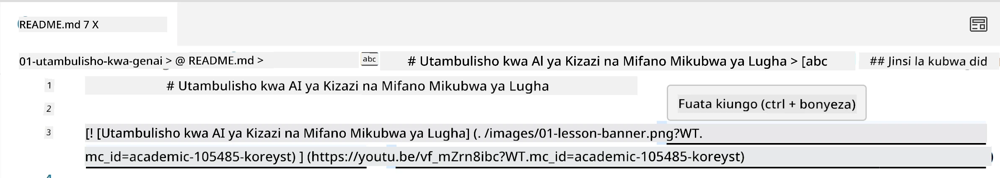
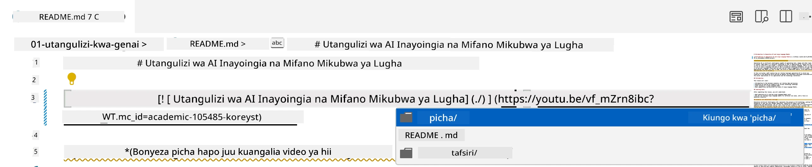
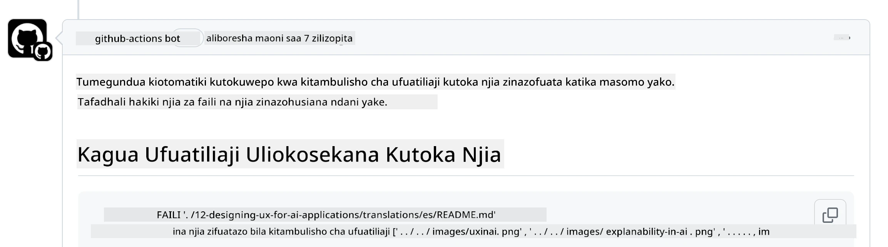
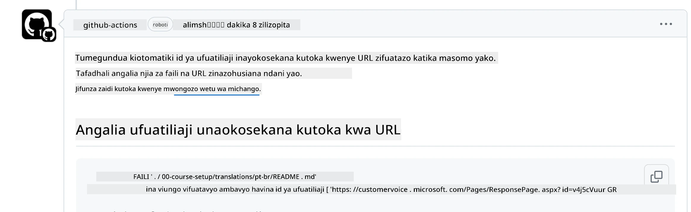
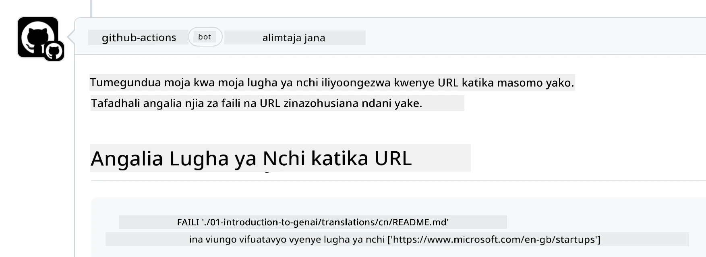

# Kuchangia

Mradi huu unakaribisha michango na mapendekezo. Michango mingi inahitaji wewe kukubali Mkataba wa Leseni ya Mchangiaji (CLA) unaothibitisha kuwa una haki ya, na kwa kweli unatupa haki za kutumia mchango wako. Kwa maelezo, tembelea <https://cla.microsoft.com>.

> Muhimu: unapotafsiri maandishi katika hifadhidata hii, tafadhali hakikisha hutumiishi tafsiri ya mashine. Tutathibitisha tafsiri kupitia jamii, hivyo tafadhali jitolee kutafsiri tu katika lugha unazozifahamu vyema.

Unapowasilisha ombi la kuvutia (pull request), roboti wa CLA atabaini moja kwa moja kama unahitaji kutoa CLA na kupamba PR ipasavyo (mfano, lebo, maoni). Fuata tu maelekezo yaliyotolewa na roboti. Utahitaji kufanya hivi mara moja tu kwa hifadhidata zote zinazotumia CLA yetu.

## Kanuni za Maadili

Mradi huu umechukua [Kanuni za Maadili za Vyanzo Huria za Microsoft](https://opensource.microsoft.com/codeofconduct/?WT.mc_id=academic-105485-koreyst).
Kwa maelezo zaidi soma [Maswali Yanayoulizwa Mara kwa Mara kuhusu Kanuni za Maadili](https://opensource.microsoft.com/codeofconduct/faq/?WT.mc_id=academic-105485-koreyst) au wasiliana na [opencode@microsoft.com](mailto:opencode@microsoft.com) ikiwa una maswali au maoni mengine yoyote.

## Swali au Tatizo?

Tafadhali usifungue matatizo ya GitHub kwa maswali ya msaada wa jumla kwani orodha ya GitHub inapaswa kutumiwa kwa maombi ya vipengele na ripoti za hitilafu. Hii itatusaidia kufuatilia kwa urahisi zaidi matatizo halisi au hitilafu kutoka kwa msimbo na kuweka mijadala ya jumla tofauti na msimbo halisi.

## Makosa ya Kielelezo, Masuala, Hitilafu na Michango

Kila unapo wasilisha mabadiliko yoyote kwenye hifadhidata ya Generative AI for Beginners, tafadhali fuata mapendekezo haya.

* Daima fanya tawi la hifadhidata chini ya akaunti yako mwenyewe kabla ya kufanya mabadiliko yako
* Usichanganye mabadiliko kadhaa katika ombi moja la kuvutia. Kwa mfano, wasilisha marekebisho ya hitilafu na masasisho ya nyaraka kwa kutumia PR tofauti
* Ikiwa ombi lako la kuvutia linaonyesha mizozo ya muunganiko, hakikisha unasasisha maini yako ya ndani kuwa mfano wa ile iliyoko kwenye hifadhidata kuu kabla ya kufanya mabadiliko
* Ikiwa unawasilisha tafsiri, tafadhali tengeneza PR moja kwa faili zote zilizotafsiriwa kwani hatukubali tafsiri za sehemu katika maudhui
* Ikiwa unawasilisha makosa ya kielelezo au marekebisho ya nyaraka, unaweza kuchanganya mabadiliko kwa PR moja pale inapotokea

## Mwongozo wa Jumla kwa Kuandika

- Hakikisha URL zako zote zimefungwa kwa mabano za mraba kisha kufuatwa na mabano ya duara bila nafasi za ziada au ndani yao ``.
- Hakikisha viungo vyovyote vya jamaa (yaani viungo kwa faili na folda nyingine katika hifadhidata) vinaanza na `./` ikimaanisha faili au folda iliyoko katika saraka ya sasa ya kazi au `../` ikimaanisha faili au folda iliyoko kwenye saraka ya mzazi.
- Hakikisha viungo vyovyote vya jamaa vina ID ya ufuatiliaji (yaani `?` au `&` kisha `wt.mc_id=` au `WT.mc_id=`) mwishoni mwao.
- Hakikisha URL yoyote kutoka kwa maeneo yafuatayo _github.com, microsoft.com, visualstudio.com, aka.ms, na azure.com_ ina ID ya ufuatiliaji (yaani `?` au `&` kisha `wt.mc_id=` au `WT.mc_id=`) mwishoni mwao.
- Hakikisha viungo vyako havina lugha maalum ya nchi (yaani `/en-us/` au `/en/`).
- Hakikisha picha zote zimo katika folda ya `./images`.
- Hakikisha picha zinaitwa kwa majina yanayoelezea kwa kutumia herufi za Kiingereza, namba, na vifungo katika jina la picha yako.

## Mifumo ya Kazi ya GitHub

Unapowasilisha ombi la kuvutia, mifumo minne tofauti ya kazi itazinduliwa kuthibitisha kanuni zilizotangazwa.
Fuata tu maelekezo yaliyotajwa hapa ili kufaulu ukaguzi wa mchakato.

- [Kagua Njia za Jamaa Zilizovunjika](#kagua-njia-za-jamaa-zilizovunjika)
- [Kagua Njia Zinazoambatana na Ufuatiliaji](#kagua-njia-zinazoambatana-na-ufuatiliaji)
- [Kagua URL Zina Ufuatiliaji](#kagua-url-zina-ufuatiliaji)
- [Kagua URL Hazina Lugha Maalum](#kagua-url-hazina-lugha-maalum)

### Kagua Njia za Jamaa Zilizovunjika

Mchakato huu unahakikisha kuwa njia yoyote ya jamaa katika faili zako inafanya kazi.
Hifadhidata hii imewekwa kwenye kurasa za GitHub, hivyo unahitaji kuwa makini sana unapoandika viungo vinavyounganisha kila kitu ili usimpeleke mtu mahali pasipaswi.

Ili kuhakikisha viungo vyako vinafanya kazi vizuri tumia VS code kukagua.

Kwa mfano, unapoelekeza kipanya juu ya kiungo chochote katika faili zako, utapewa fursa kuifuata kwa kubofya **ctrl + bonyeza**

Ikiwa ubofya kiungo na hakifanyi kazi ndani ya eneo lako, basi hakika kitawasababisha mchakato na hakitafanya kazi kwenye GitHub.

Kurekebisha tatizo hili, jaribu kuandika kiungo kwa msaada wa VS code.

Unapoandika `./` au `../` VS code itakupa chaguzi kulingana na ulichoandika.

Fuata njia kwa kubofya faili au folda unayotaka na uta hakikisha njia yako haivunjiki.

Mara utakapoongeza njia sahihi ya jamaa, hifadhi na sukuma mabadiliko, mchakato utazinduliwa tena kuthibitisha mabadiliko yako.
Ikiwa utapita ukaguzi basi uko sawa.

### Kagua Njia Zinazoambatana na Ufuatiliaji

Mchakato huu unahakikisha kuwa njia yoyote ya jamaa ina ufuatiliaji ndani yake.
Hifadhidata hii imewekwa kwenye kurasa za GitHub hivyo tunahitaji kufuatilia harakati kati ya faili na folda tofauti.

Ili kuhakikisha njia zako za jamaa zina ufuatiliaji ndani yake, angalia maandishi yafuatayo `?wt.mc_id=` mwishoni mwa njia.
Ikiwa imeongezwa kwenye njia zako za jamaa basi utapita kwenye ukaguzi huu.

Kama sivyo, unaweza kupata kosa lifuatalo.

Kurekebisha tatizo hili, jaribu kufungua njia ya faili iliyobainishwa na mchakato na ongeza ID ya ufuatiliaji mwishoni mwa njia za jamaa.

Mara utakapoongeza ID ya ufuatiliaji, hifadhi na sukuma mabadiliko, mchakato utazinduliwa tena kuthibitisha mabadiliko yako.
Ikiwa utapita ukaguzi basi uko sawa.

### Kagua URL Zina Ufuatiliaji

Mchakato huu unahakikisha kuwa URL yoyote ya mtandao ina ufuatiliaji ndani yake.
Hifadhidata hii inapatikana kwa kila mtu, hivyo unahitaji kuhakikisha unafuata ufikiaji ili kujua trafiki inatoka wapi.

Ili kuhakikisha URL zako zina ufuatiliaji ndani yake, angalia maandishi yafuatayo `?wt.mc_id=` mwishoni mwa URL.
Ikiwa imeongezwa kwenye URL zako basi utapita kwenye ukaguzi huu.

Kama sivyo, unaweza kupata kosa lifuatalo.

Kurekebisha tatizo hili, jaribu kufungua njia ya faili iliyobainishwa na mchakato na ongeza ID ya ufuatiliaji mwishoni mwa URL.

Mara utakapoongeza ID ya ufuatiliaji, hifadhi na sukuma mabadiliko, mchakato utazinduliwa tena kuthibitisha mabadiliko yako.
Ikiwa utapita ukaguzi basi uko sawa.

### Kagua URL Hazina Lugha Maalum

Mchakato huu unahakikisha kuwa URL yoyote ya mtandao haina lugha maalum ya nchi ndani yake.
Hifadhidata hii inapatikana kwa kila mtu duniani kote hivyo unahitaji kuhakikisha haujumuishi lugha ya nchi yako katika URL.

Ili kuhakikisha URL zako hazina lugha ya nchi ndani yake, angalia maandishi yafuatayo `/en-us/` au `/en/` au lugha nyingine yoyote mahali popote ndani ya URL.
Ikiwa haipo kwenye URL zako basi utapita kwenye ukaguzi huu.

Kama sivyo, unaweza kupata kosa lifuatalo.

Kurekebisha tatizo hili, jaribu kufungua njia ya faili iliyobainishwa na mchakato na toa lugha ya nchi kutoka URL.

Mara utakapotoa lugha ya nchi, hifadhi na sukuma mabadiliko, mchakato utazinduliwa tena kuthibitisha mabadiliko yako.
Ikiwa utapita ukaguzi basi uko sawa.

Hongera! Tutarudi kwako haraka iwezekanavyo kwa maoni kuhusu mchango wako.

---

<!-- CO-OP TRANSLATOR DISCLAIMER START -->
**Kionyozo**:
Hati hii imetafsiriwa kwa kutumia huduma ya tafsiri ya AI [Co-op Translator](https://github.com/Azure/co-op-translator). Ingawa tunajitahidi kupata usahihi, tafadhali fahamu kwamba tafsiri za kiotomatiki zinaweza kuwa na makosa au upungufu wa usahihi. Hati ya asili katika lugha yake halisi inapaswa kuchukuliwa kama chanzo cha mamlaka. Kwa taarifa muhimu, tafsiri ya kitaalamu inayofanywa na binadamu inapendekezwa. Hatutojibu kwa kuelewa vibaya au tafsiri potofu zinazotokea kutokana na matumizi ya tafsiri hii.
<!-- CO-OP TRANSLATOR DISCLAIMER END -->