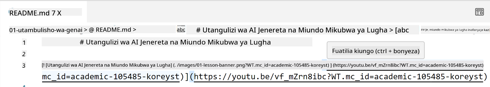
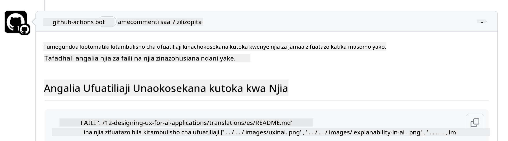
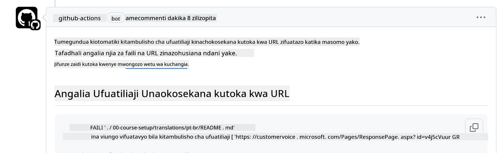
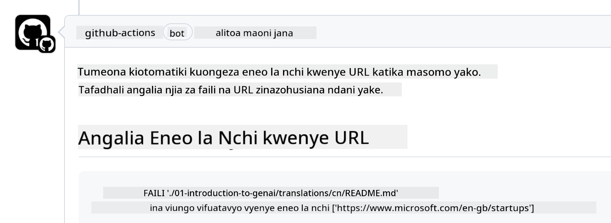

<!--
CO_OP_TRANSLATOR_METADATA:
{
  "original_hash": "57c41f2af71001a2cff9d8eb797cb843",
  "translation_date": "2025-07-09T06:10:56+00:00",
  "source_file": "CONTRIBUTING.md",
  "language_code": "sw"
}
-->
# Kuchangia

Mradi huu unakaribisha michango na mapendekezo. Michango mingi inahitaji ukubali Mkataba wa Leseni ya Mchangiaji (CLA) unaothibitisha kuwa una haki, na kwa kweli unatoa, haki kwetu kutumia mchango wako. Kwa maelezo zaidi, tembelea <https://cla.microsoft.com>.

> Muhimu: unapotafsiri maandishi katika hifadhidata hii, tafadhali hakikisha hutumii tafsiri za mashine. Tutathibitisha tafsiri kupitia jamii, hivyo tafadhali jitolee tu kwa tafsiri za lugha unazozifahamu vizuri.

Unapowasilisha ombi la kuvuta (pull request), roboti wa CLA atabaini moja kwa moja kama unahitaji kutoa CLA na kuandaa PR ipasavyo (mfano, lebo, maoni). Fuata tu maelekezo yanayotolewa na roboti. Hii itabidi ufanye mara moja tu kwa hifadhidata zote zinazotumia CLA yetu.

## Kanuni za Maadili

Mradi huu umechukua [Kanuni za Maadili za Chanzo Huria za Microsoft](https://opensource.microsoft.com/codeofconduct/?WT.mc_id=academic-105485-koreyst). Kwa maelezo zaidi soma [Maswali Yanayoulizwa Mara kwa Mara kuhusu Kanuni za Maadili](https://opensource.microsoft.com/codeofconduct/faq/?WT.mc_id=academic-105485-koreyst) au wasiliana na [opencode@microsoft.com](mailto:opencode@microsoft.com) kwa maswali au maoni zaidi.

## Swali au Tatizo?

Tafadhali usifungue masuala ya GitHub kwa maswali ya msaada wa jumla kwani orodha ya GitHub inapaswa kutumika kwa maombi ya vipengele na ripoti za hitilafu. Hii itatusaidia kufuatilia kwa urahisi masuala halisi au hitilafu kutoka kwa msimbo na kuweka mjadala wa jumla tofauti na msimbo halisi.

## Makosa ya Kielelezo, Masuala, Hitilafu na Michango

Unapowasilisha mabadiliko yoyote kwenye hifadhidata ya Generative AI for Beginners, tafadhali fuata mapendekezo haya.

* Daima tengeneza nakala ya hifadhidata kwenye akaunti yako kabla ya kufanya mabadiliko yako
* Usichanganye mabadiliko mengi katika ombi moja la kuvuta. Kwa mfano, wasilisha marekebisho ya hitilafu na masasisho ya nyaraka kwa PR tofauti
* Ikiwa ombi lako la kuvuta linaonyesha migongano ya kuunganisha, hakikisha unasasisha maini yako ya ndani kuwa nakala halisi ya hifadhidata kuu kabla ya kufanya mabadiliko
* Ikiwa unawasilisha tafsiri, tafadhali tengeneza PR moja kwa faili zote zilizotafsiriwa kwani hatukubali tafsiri za sehemu za maudhui
* Ikiwa unawasilisha marekebisho ya makosa ya kielelezo au nyaraka, unaweza kuchanganya mabadiliko katika PR moja pale inapofaa

## Mwongozo wa Jumla wa Kuandika

- Hakikisha URL zako zote zimefungwa kwa mabano ya mraba zikiwa zifuate na mabano ya mviringo bila nafasi za ziada ndani au karibu ``.
- Hakikisha viungo vyovyote vinavyohusiana (yaani viungo kwa faili na folda nyingine katika hifadhidata) vinaanza na `./` ikimaanisha faili au folda iliyoko katika saraka ya kazi ya sasa au `../` ikimaanisha faili au folda iliyoko katika saraka ya kazi ya mzazi.
- Hakikisha viungo vyovyote vinavyohusiana vina kitambulisho cha ufuatiliaji (yaani `?` au `&` kisha `wt.mc_id=` au `WT.mc_id=`) mwishoni mwao.
- Hakikisha URL yoyote kutoka kwa maeneo yafuatayo _github.com, microsoft.com, visualstudio.com, aka.ms, na azure.com_ ina kitambulisho cha ufuatiliaji (yaani `?` au `&` kisha `wt.mc_id=` au `WT.mc_id=`) mwishoni mwao.
- Hakikisha viungo vyako havina lugha maalum za nchi ndani yao (yaani `/en-us/` au `/en/`).
- Hakikisha picha zote zimehifadhiwa katika folda ya `./images`.
- Hakikisha picha zina majina yenye maelezo kwa kutumia herufi za Kiingereza, nambari, na dash katika jina la picha yako.

## Mipangilio ya Kazi ya GitHub

Unapowasilisha ombi la kuvuta, mchakato nne tofauti utaanzishwa kuthibitisha sheria zilizotangazwa hapo juu. Fuata tu maelekezo yaliyotajwa hapa kufanikisha ukaguzi wa mchakato.

- [Angalia Njia Zinazovunjika Zinavyohusiana](../..)
- [Angalia Njia Zina Ufuatiliaji](../..)
- [Angalia URL Zina Ufuatiliaji](../..)
- [Angalia URL Hazina Lugha Maalum za Nchi](../..)

### Angalia Njia Zinazovunjika Zinavyohusiana

Mchakato huu unahakikisha kuwa njia yoyote inayohusiana katika faili zako inafanya kazi. Hifadhidata hii imetangazwa kwenye kurasa za GitHub hivyo unahitaji kuwa makini sana unapoandika viungo vinavyounganisha kila kitu ili kutoelekeza mtu mahali pasipo sahihi.

Ili kuhakikisha viungo vyako vinafanya kazi vizuri tumia VS code kuangalia.

Kwa mfano, unapoelekeza kipanya juu ya kiungo chochote katika faili zako utaombwa kufuata kiungo kwa kubonyeza **ctrl + click**

Ukibonyeza kiungo na hakifanyi kazi kwa ndani basi, hakika mchakato utaanzishwa na hautafanya kazi kwenye GitHub.

Kurekebisha tatizo hili, jaribu kuandika kiungo kwa msaada wa VS code.

Unapoandika `./` au `../` VS code itakuomba uchague kutoka kwa chaguzi zinazopatikana kulingana na ulichokiandika.

Fuata njia kwa kubonyeza faili au folda unayotaka na utahakikisha njia yako haivunjiki.

Mara tu unapoongeza njia inayohusiana sahihi, hifadhi, na tuma mabadiliko yako mchakato utaanzishwa tena kuthibitisha mabadiliko yako. Ikiwa utapita ukaguzi basi uko tayari kuendelea.

### Angalia Njia Zina Ufuatiliaji

Mchakato huu unahakikisha kuwa njia yoyote inayohusiana ina ufuatiliaji ndani yake. Hifadhidata hii imetangazwa kwenye kurasa za GitHub hivyo tunahitaji kufuatilia mabadiliko kati ya faili na folda tofauti.

Ili kuhakikisha njia zako zinazohusiana zina ufuatiliaji ndani yake angalia maandishi haya `?wt.mc_id=` mwishoni mwa njia. Ikiwa yameambatishwa kwenye njia zako zinazohusiana basi utapita ukaguzi huu.

Kama sivyo, unaweza kupata kosa lifuatalo.

Kurekebisha tatizo hili, jaribu kufungua njia ya faili iliyobainishwa na mchakato na ongeza kitambulisho cha ufuatiliaji mwishoni mwa njia zinazohusiana.

Mara tu unapoongeza kitambulisho cha ufuatiliaji, hifadhi, na tuma mabadiliko yako mchakato utaanzishwa tena kuthibitisha mabadiliko yako. Ikiwa utapita ukaguzi basi uko tayari kuendelea.

### Angalia URL Zina Ufuatiliaji

Mchakato huu unahakikisha kuwa URL yoyote ya wavuti ina ufuatiliaji ndani yake. Hifadhidata hii inapatikana kwa kila mtu hivyo unahitaji kuhakikisha kufuatilia upatikanaji ili kujua trafiki inatoka wapi.

Ili kuhakikisha URL zako zina ufuatiliaji ndani yake angalia maandishi haya `?wt.mc_id=` mwishoni mwa URL. Ikiwa yameambatishwa kwenye URL zako basi utapita ukaguzi huu.

Kama sivyo, unaweza kupata kosa lifuatalo.

Kurekebisha tatizo hili, jaribu kufungua njia ya faili iliyobainishwa na mchakato na ongeza kitambulisho cha ufuatiliaji mwishoni mwa URL.

Mara tu unapoongeza kitambulisho cha ufuatiliaji, hifadhi, na tuma mabadiliko yako mchakato utaanzishwa tena kuthibitisha mabadiliko yako. Ikiwa utapita ukaguzi basi uko tayari kuendelea.

### Angalia URL Hazina Lugha Maalum za Nchi

Mchakato huu unahakikisha kuwa URL yoyote ya wavuti haina lugha maalum za nchi ndani yake. Hifadhidata hii inapatikana kwa kila mtu duniani hivyo unahitaji kuhakikisha huna lugha maalum za nchi kwenye URL zako.

Ili kuhakikisha URL zako hazina lugha maalum za nchi ndani yake angalia maandishi haya `/en-us/` au `/en/` au lugha nyingine yoyote mahali popote kwenye URL. Ikiwa hayapo kwenye URL zako basi utapita ukaguzi huu.

Kama sivyo, unaweza kupata kosa lifuatalo.

Kurekebisha tatizo hili, jaribu kufungua njia ya faili iliyobainishwa na mchakato na ondoa lugha maalum ya nchi kutoka kwenye URL.

Mara tu unapoondoa lugha maalum ya nchi, hifadhi, na tuma mabadiliko yako mchakato utaanzishwa tena kuthibitisha mabadiliko yako. Ikiwa utapita ukaguzi basi uko tayari kuendelea.

Hongera! Tutarudi kwako haraka iwezekanavyo na maoni kuhusu mchango wako.

**Kiarifu cha Kutotegemea**:  
Hati hii imetafsiriwa kwa kutumia huduma ya tafsiri ya AI [Co-op Translator](https://github.com/Azure/co-op-translator). Ingawa tunajitahidi kwa usahihi, tafadhali fahamu kwamba tafsiri za kiotomatiki zinaweza kuwa na makosa au upungufu wa usahihi. Hati ya asili katika lugha yake ya asili inapaswa kuchukuliwa kama chanzo cha mamlaka. Kwa taarifa muhimu, tafsiri ya kitaalamu inayofanywa na binadamu inapendekezwa. Hatubebei dhamana kwa kutoelewana au tafsiri potofu zinazotokana na matumizi ya tafsiri hii.