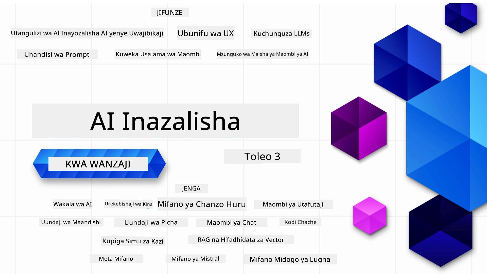

### Masomo 21 yanayofundisha kila kitu unachohitaji kujua kuanza kujenga programu za Generative AI

[](https://github.com/microsoft/Generative-AI-For-Beginners/blob/master/LICENSE?WT.mc_id=academic-105485-koreyst)
[](https://GitHub.com/microsoft/Generative-AI-For-Beginners/graphs/contributors/?WT.mc_id=academic-105485-koreyst)
[](https://GitHub.com/microsoft/Generative-AI-For-Beginners/issues/?WT.mc_id=academic-105485-koreyst)
[](https://GitHub.com/microsoft/Generative-AI-For-Beginners/pulls/?WT.mc_id=academic-105485-koreyst)
[](http://makeapullrequest.com?WT.mc_id=academic-105485-koreyst)

[](https://GitHub.com/microsoft/Generative-AI-For-Beginners/watchers/?WT.mc_id=academic-105485-koreyst)
[](https://GitHub.com/microsoft/Generative-AI-For-Beginners/network/?WT.mc_id=academic-105485-koreyst)
[](https://GitHub.com/microsoft/Generative-AI-For-Beginners/stargazers/?WT.mc_id=academic-105485-koreyst)

[](https://discord.gg/nTYy5BXMWG)

### 🌐 Msaada wa Lugha Nyingi

#### Imesaidiwa kupitia Kitendo cha GitHub (Moja kwa Moja & Kila Wakati Kikiwa cha Hali ya Juu)

<!-- CO-OP TRANSLATOR LANGUAGES TABLE START -->
[Arabic](../ar/README.md) | [Bengali](../bn/README.md) | [Bulgarian](../bg/README.md) | [Burmese (Myanmar)](../my/README.md) | [Chinese (Simplified)](../zh-CN/README.md) | [Chinese (Traditional, Hong Kong)](../zh-HK/README.md) | [Chinese (Traditional, Macau)](../zh-MO/README.md) | [Chinese (Traditional, Taiwan)](../zh-TW/README.md) | [Croatian](../hr/README.md) | [Czech](../cs/README.md) | [Danish](../da/README.md) | [Dutch](../nl/README.md) | [Estonian](../et/README.md) | [Finnish](../fi/README.md) | [French](../fr/README.md) | [German](../de/README.md) | [Greek](../el/README.md) | [Hebrew](../he/README.md) | [Hindi](../hi/README.md) | [Hungarian](../hu/README.md) | [Indonesian](../id/README.md) | [Italian](../it/README.md) | [Japanese](../ja/README.md) | [Kannada](../kn/README.md) | [Korean](../ko/README.md) | [Lithuanian](../lt/README.md) | [Malay](../ms/README.md) | [Malayalam](../ml/README.md) | [Marathi](../mr/README.md) | [Nepali](../ne/README.md) | [Nigerian Pidgin](../pcm/README.md) | [Norwegian](../no/README.md) | [Persian (Farsi)](../fa/README.md) | [Polish](../pl/README.md) | [Portuguese (Brazil)](../pt-BR/README.md) | [Portuguese (Portugal)](../pt-PT/README.md) | [Punjabi (Gurmukhi)](../pa/README.md) | [Romanian](../ro/README.md) | [Russian](../ru/README.md) | [Serbian (Cyrillic)](../sr/README.md) | [Slovak](../sk/README.md) | [Slovenian](../sl/README.md) | [Spanish](../es/README.md) | [Swahili](./README.md) | [Swedish](../sv/README.md) | [Tagalog (Filipino)](../tl/README.md) | [Tamil](../ta/README.md) | [Telugu](../te/README.md) | [Thai](../th/README.md) | [Turkish](../tr/README.md) | [Ukrainian](../uk/README.md) | [Urdu](../ur/README.md) | [Vietnamese](../vi/README.md)

> **Unapendelea Kugonga Kiasili?**
>
> Hifadhi hii ina tafsiri zaidi ya lugha 50 ambazo huongeza sana ukubwa wa kupakua. Ili kugonga bila tafsiri, tumia sparse checkout:
>
> **Bash / macOS / Linux:**
> ```bash
> git clone --filter=blob:none --sparse https://github.com/microsoft/generative-ai-for-beginners.git
> cd generative-ai-for-beginners
> git sparse-checkout set --no-cone '/*' '!translations' '!translated_images'
> ```
>
> **CMD (Windows):**
> ```cmd
> git clone --filter=blob:none --sparse https://github.com/microsoft/generative-ai-for-beginners.git
> cd generative-ai-for-beginners
> git sparse-checkout set --no-cone "/*" "!translations" "!translated_images"
> ```
>
> Hii inakupa kila kitu unachohitaji kukamilisha kozi kwa kupakua kwa kasi zaidi.
<!-- CO-OP TRANSLATOR LANGUAGES TABLE END -->

# Generative AI kwa Waanzilishi (Toleo la 3) - Kozi

Jifunze misingi ya kujenga programu za Generative AI kupitia kozi yetu yenye masomo 21 iliyoandaliwa na Microsoft Cloud Advocates.

## 🌱 Kuanzisha

Kozi hii ina masomo 21. Kila somo lina mada yake, hivyo anza mahali popote unapotaka!

Masomo yana lebo ya “Jifunze” yanayofafanua dhana ya Generative AI au masomo ya “Jenga” yanayofafanua dhana na mifano ya nambari kwa **Python** na **TypeScript** pale inapowezekana.

Kwa Waendelezaji wa .NET angalia [Generative AI kwa Waanzilishi (.NET Edition)](https://github.com/microsoft/Generative-AI-for-beginners-dotnet?WT.mc_id=academic-105485-koreyst)!

Kila somo pia lina sehemu ya "Endelea Kujifunza" yenye zana za ziada za kujifunzia.

## Unachohitaji
### Kuendesha nambari ya kozi hii, unaweza kutumia mojawapo ya: 
 - [Huduma ya Azure OpenAI](https://aka.ms/genai-beginners/azure-open-ai?WT.mc_id=academic-105485-koreyst) - **Masomo:** "aoai-assignment"
 - [Katalogi ya Modeli ya Soko la GitHub](https://aka.ms/genai-beginners/gh-models?WT.mc_id=academic-105485-koreyst) - **Masomo:** "githubmodels"
 - [API ya OpenAI](https://aka.ms/genai-beginners/open-ai?WT.mc_id=academic-105485-koreyst) - **Masomo:** "oai-assignment" 
   
- Maarifa ya msingi ya Python au TypeScript ni muhimu - \*Kwa waanzilishi kabisa angalia kozi hizi za [Python](https://aka.ms/genai-beginners/python?WT.mc_id=academic-105485-koreyst) na [TypeScript](https://aka.ms/genai-beginners/typescript?WT.mc_id=academic-105485-koreyst)
- Akaunti ya GitHub ili [kutoka nakala ya repo hii yote](https://aka.ms/genai-beginners/github?WT.mc_id=academic-105485-koreyst) kwenye akaunti yako ya GitHub

Tumeunda somo la **[Kuanza Kozi](./00-course-setup/README.md?WT.mc_id=academic-105485-koreyst)** kusaidia kuandaa mazingira yako ya maendeleo.

Usisahau [kutoa nyota (🌟) kwa repo hii](https://docs.github.com/en/get-started/exploring-projects-on-github/saving-repositories-with-stars?WT.mc_id=academic-105485-koreyst) ili kuipata kwa urahisi baadaye.

## 🧠 Tayari Kuweka Tena?

Kama unatafuta mifano ya nambari ya kiwango cha juu zaidi, tazama mkusanyiko wetu wa [Mifano ya Nambari za Generative AI](https://aka.ms/genai-beg-code?WT.mc_id=academic-105485-koreyst) kwa **Python** na **TypeScript**.

## 🗣️ Kutana na Wajifunzaji Wengine, Pata Msaada

Jiunge na [server rasmi ya Azure AI Foundry Discord](https://aka.ms/genai-discord?WT.mc_id=academic-105485-koreyst) ili kutana na kuungana na wajifunzaji wengine wanaochukua kozi hii na kupata msaada.

Uliza maswali au shiriki maoni ya bidhaa kwenye [Jukwaa la Waendelezaji wa Azure AI Foundry](https://aka.ms/azureaifoundry/forum) kwenye Github.

## 🚀 Kujenga Kuanza Biashara?

Tembelea [Microsoft kwa Startups](https://www.microsoft.com/startups) kujua jinsi ya kuanza kujenga kwa mikopo ya Azure leo.

## 🙏 Unataka kusaidia?

Je, una mapendekezo au umeona makosa ya tahajia au nambari? [Toa tatizo](https://github.com/microsoft/generative-ai-for-beginners/issues?WT.mc_id=academic-105485-koreyst) au [Tengeneza ombi la kuleta mabadiliko](https://github.com/microsoft/generative-ai-for-beginners/pulls?WT.mc_id=academic-105485-koreyst)

## 📂 Kila somo linajumuisha:

- Utangulizi mfupi wa video kwa mada
- Somo lililoandikwa katika README
- Mifano ya nambari ya Python na TypeScript inayounga mkono Azure OpenAI na OpenAI API
- Viungo vya rasilimali za ziada za kuendelea kujifunza

## 🗃️ Masomo

| #   | **Kiungo cha Somo**                                                                                                                            | **Maelezo**                                                                                   | **Video**                                                                   | **Kujifunza Zaidi**                                                           |
| --- | ---------------------------------------------------------------------------------------------------------------------------------------------- | --------------------------------------------------------------------------------------------- | --------------------------------------------------------------------------- | ------------------------------------------------------------------------------ |
| 00  | [Kuanza Kozi](./00-course-setup/README.md?WT.mc_id=academic-105485-koreyst)                                                                     | **Jifunze:** Jinsi ya Kuandaa Mazingira Yako ya Maendeleo                                     | Video Itakuja Hivi Karibuni                                                 | [Jifunze Zaidi](https://aka.ms/genai-collection?WT.mc_id=academic-105485-koreyst) |
| 01  | [Utangulizi wa Generative AI na LLMs](./01-introduction-to-genai/README.md?WT.mc_id=academic-105485-koreyst)                                    | **Jifunze:** Kuelewa Generative AI ni nini na jinsi Modeli Kubwa za Lugha (LLMs) zinavyofanya kazi. | [Video](https://aka.ms/gen-ai-lesson-1-gh?WT.mc_id=academic-105485-koreyst) | [Jifunze Zaidi](https://aka.ms/genai-collection?WT.mc_id=academic-105485-koreyst) |
| 02  | [Kuchunguza na kulinganisha LLMs tofauti](./02-exploring-and-comparing-different-llms/README.md?WT.mc_id=academic-105485-koreyst)                 | **Jifunze:** Jinsi ya kuchagua modeli sahihi kwa matumizi yako                                | [Video](https://aka.ms/gen-ai-lesson2-gh?WT.mc_id=academic-105485-koreyst)  | [Jifunze Zaidi](https://aka.ms/genai-collection?WT.mc_id=academic-105485-koreyst) |
| 03  | [Kutumia Generative AI Kwa Uwajibikaji](./03-using-generative-ai-responsibly/README.md?WT.mc_id=academic-105485-koreyst)                         | **Jifunze:** Jinsi ya kujenga Programu za Generative AI kwa Uwajibikaji                       | [Video](https://aka.ms/gen-ai-lesson3-gh?WT.mc_id=academic-105485-koreyst)  | [Jifunze Zaidi](https://aka.ms/genai-collection?WT.mc_id=academic-105485-koreyst) |
| 04  | [Kuelewa Misingi ya Uhandisi wa Prompt](./04-prompt-engineering-fundamentals/README.md?WT.mc_id=academic-105485-koreyst)             | **Jifunze:** Mbinu bora za vitendo za Uhandisi wa Prompt                                           | [Video](https://aka.ms/gen-ai-lesson4-gh?WT.mc_id=academic-105485-koreyst)  | [Jifunze Zaidi](https://aka.ms/genai-collection?WT.mc_id=academic-105485-koreyst) |
| 05  | [Kuunda Prompts Zinazoendelea](./05-advanced-prompts/README.md?WT.mc_id=academic-105485-koreyst)                                                | **Jifunze:** Jinsi ya kutumia mbinu za uhandisi wa prompt zinazoboresha matokeo ya prompts zako. | [Video](https://aka.ms/gen-ai-lesson5-gh?WT.mc_id=academic-105485-koreyst)  | [Jifunze Zaidi](https://aka.ms/genai-collection?WT.mc_id=academic-105485-koreyst) |
| 06  | [Kujenga Programu za Uundaji wa Maandishi](./06-text-generation-apps/README.md?WT.mc_id=academic-105485-koreyst)                                | **Jenga:** Programu ya kuunda maandishi kwa kutumia Azure OpenAI / OpenAI API                                | [Video](https://aka.ms/gen-ai-lesson6-gh?WT.mc_id=academic-105485-koreyst)  | [Jifunze Zaidi](https://aka.ms/genai-collection?WT.mc_id=academic-105485-koreyst) |
| 07  | [Kujenga Programu za Chat](./07-building-chat-applications/README.md?WT.mc_id=academic-105485-koreyst)                                     | **Jenga:** Mbinu za ufanisi za kujenga na kuingiza programu za chat.               | [Video](https://aka.ms/gen-ai-lessons7-gh?WT.mc_id=academic-105485-koreyst) | [Jifunze Zaidi](https://aka.ms/genai-collection?WT.mc_id=academic-105485-koreyst) |
| 08  | [Kujenga Programu za Utafutaji na Hifadhidata za Vector](./08-building-search-applications/README.md?WT.mc_id=academic-105485-koreyst)                        | **Jenga:** Programu ya utafutaji inayotumia Embeddings kutafuta data.                        | [Video](https://aka.ms/gen-ai-lesson8-gh?WT.mc_id=academic-105485-koreyst)  | [Jifunze Zaidi](https://aka.ms/genai-collection?WT.mc_id=academic-105485-koreyst) |
| 09  | [Kujenga Programu za Uundaji Picha](./09-building-image-applications/README.md?WT.mc_id=academic-105485-koreyst)                        | **Jenga:** Programu ya uundaji picha                                                       | [Video](https://aka.ms/gen-ai-lesson9-gh?WT.mc_id=academic-105485-koreyst)  | [Jifunze Zaidi](https://aka.ms/genai-collection?WT.mc_id=academic-105485-koreyst) |
| 10  | [Kujenga Programu za AI Zenye Nambari Chache](./10-building-low-code-ai-applications/README.md?WT.mc_id=academic-105485-koreyst)                       | **Jenga:** Programu ya AI ya Uundaji kwa kutumia zana za Nambari Chache                                     | [Video](https://aka.ms/gen-ai-lesson10-gh?WT.mc_id=academic-105485-koreyst) | [Jifunze Zaidi](https://aka.ms/genai-collection?WT.mc_id=academic-105485-koreyst) |
| 11  | [Kuunganisha Programu za Nje na Kupiga Simu za Kazi](./11-integrating-with-function-calling/README.md?WT.mc_id=academic-105485-koreyst) | **Jenga:** Nini maana ya kupiga simu za kazi na matumizi yake kwa programu                          | [Video](https://aka.ms/gen-ai-lesson11-gh?WT.mc_id=academic-105485-koreyst) | [Jifunze Zaidi](https://aka.ms/genai-collection?WT.mc_id=academic-105485-koreyst) |
| 12  | [Kubuni UX kwa Programu za AI](./12-designing-ux-for-ai-applications/README.md?WT.mc_id=academic-105485-koreyst)                         | **Jifunze:** Jinsi ya kutumia kanuni za kubuni UX wakati wa kuendeleza Programu za AI za Uundaji         | [Video](https://aka.ms/gen-ai-lesson12-gh?WT.mc_id=academic-105485-koreyst) | [Jifunze Zaidi](https://aka.ms/genai-collection?WT.mc_id=academic-105485-koreyst) |
| 13  | [Kuhakikisha Usalama wa Programu Zako za AI za Uundaji](./13-securing-ai-applications/README.md?WT.mc_id=academic-105485-koreyst)                         | **Jifunze:** Vitisho na hatari kwa mifumo ya AI na mbinu za kuhakikisha usalama wa mifumo hii.             | [Video](https://aka.ms/gen-ai-lesson13-gh?WT.mc_id=academic-105485-koreyst) | [Jifunze Zaidi](https://aka.ms/genai-collection?WT.mc_id=academic-105485-koreyst) |
| 14  | [Mzunguko wa Maisha wa Programu za AI za Uundaji](./14-the-generative-ai-application-lifecycle/README.md?WT.mc_id=academic-105485-koreyst)           | **Jifunze:** Zana na vipimo vya kusimamia Mzunguko wa Maisha wa LLM na LLMOps                         | [Video](https://aka.ms/gen-ai-lesson14-gh?WT.mc_id=academic-105485-koreyst) | [Jifunze Zaidi](https://aka.ms/genai-collection?WT.mc_id=academic-105485-koreyst) |
| 15  | [Uundaji Ulioboreshwa kwa Ufufuaji (RAG) na Hifadhidata za Vector](./15-rag-and-vector-databases/README.md?WT.mc_id=academic-105485-koreyst)        | **Jenga:** Programu inayotumia Mfumo wa RAG kupata embeddings kutoka katika Hifadhidata za Vector  | [Video](https://aka.ms/gen-ai-lesson15-gh?WT.mc_id=academic-105485-koreyst) | [Jifunze Zaidi](https://aka.ms/genai-collection?WT.mc_id=academic-105485-koreyst) |
| 16  | [Mifano ya Chanzo Huria na Hugging Face](./16-open-source-models/README.md?WT.mc_id=academic-105485-koreyst)                                    | **Jenga:** Programu inayotumia mifano ya chanzo huria inayopatikana kwenye Hugging Face                    | [Video](https://aka.ms/gen-ai-lesson16-gh?WT.mc_id=academic-105485-koreyst) | [Jifunze Zaidi](https://aka.ms/genai-collection?WT.mc_id=academic-105485-koreyst) |
| 17  | [Wakala wa AI](./17-ai-agents/README.md?WT.mc_id=academic-105485-koreyst)                                                                       | **Jenga:** Programu inayotumia Mfumo wa Wakala wa AI                                           | [Video](https://aka.ms/gen-ai-lesson17-gh?WT.mc_id=academic-105485-koreyst) | [Jifunze Zaidi](https://aka.ms/genai-collection?WT.mc_id=academic-105485-koreyst) |
| 18  | [Kufinyanga LLMs](./18-fine-tuning/README.md?WT.mc_id=academic-105485-koreyst)                                                              | **Jifunze:** Nini, kwa nini na jinsi ya kufinyanga LLMs                                            | [Video](https://aka.ms/gen-ai-lesson18-gh?WT.mc_id=academic-105485-koreyst) | [Jifunze Zaidi](https://aka.ms/genai-collection?WT.mc_id=academic-105485-koreyst) |
| 19  | [Kujenga kwa kutumia SLMs](./19-slm/README.md?WT.mc_id=academic-105485-koreyst)                                                              | **Jifunze:** Manufaa ya kujenga kwa kutumia Mifano Midogo ya Lugha                                            | Video Inakuja Hivi Karibuni | [Jifunze Zaidi](https://aka.ms/genai-collection?WT.mc_id=academic-105485-koreyst) |
| 20  | [Kujenga kwa kutumia Mifano ya Mistral](./20-mistral/README.md?WT.mc_id=academic-105485-koreyst)                                                              | **Jifunze:** Sifa na tofauti za Mifano ya Familia ya Mistral                                           | Video Inakuja Hivi Karibuni | [Jifunze Zaidi](https://aka.ms/genai-collection?WT.mc_id=academic-105485-koreyst) |
| 21  | [Kujenga kwa kutumia Mifano ya Meta](./21-meta/README.md?WT.mc_id=academic-105485-koreyst)                                                              | **Jifunze:** Sifa na tofauti za Mifano ya Familia ya Meta                                           | Video Inakuja Hivi Karibuni | [Jifunze Zaidi](https://aka.ms/genai-collection?WT.mc_id=academic-105485-koreyst) |

### 🌟 Shukrani Maalum

Shukrani maalum kwa [**John Aziz**](https://www.linkedin.com/in/john0isaac/) kwa kuunda yote ya GitHub Actions na workflows

[**Bernhard Merkle**](https://www.linkedin.com/in/bernhard-merkle-738b73/) kwa kuchangia kwa njia muhimu katika kila somo ili kuboresha uzoefu wa mwanafunzi na wa msimbo.

## 🎒 Kozi Nyingine

Timu yetu hutengeneza kozi nyingine! Angalia:

<!-- CO-OP TRANSLATOR OTHER COURSES START -->
### LangChain
[](https://aka.ms/langchain4j-for-beginners)
[](https://aka.ms/langchainjs-for-beginners?WT.mc_id=m365-94501-dwahlin)
[](https://github.com/microsoft/langchain-for-beginners?WT.mc_id=m365-94501-dwahlin)
---

### Azure / Edge / MCP / Wakala
[](https://github.com/microsoft/AZD-for-beginners?WT.mc_id=academic-105485-koreyst)
[](https://github.com/microsoft/edgeai-for-beginners?WT.mc_id=academic-105485-koreyst)
[](https://github.com/microsoft/mcp-for-beginners?WT.mc_id=academic-105485-koreyst)
[](https://github.com/microsoft/ai-agents-for-beginners?WT.mc_id=academic-105485-koreyst)

---
 
### Mfululizo wa AI za Uundaji
[](https://github.com/microsoft/generative-ai-for-beginners?WT.mc_id=academic-105485-koreyst)
[-9333EA?style=for-the-badge&labelColor=E5E7EB&color=9333EA)](https://github.com/microsoft/Generative-AI-for-beginners-dotnet?WT.mc_id=academic-105485-koreyst)
[-C084FC?style=for-the-badge&labelColor=E5E7EB&color=C084FC)](https://github.com/microsoft/generative-ai-for-beginners-java?WT.mc_id=academic-105485-koreyst)
[-E879F9?style=for-the-badge&labelColor=E5E7EB&color=E879F9)](https://github.com/microsoft/generative-ai-with-javascript?WT.mc_id=academic-105485-koreyst)

---
 
### Kujifunza Msingi
[](https://aka.ms/ml-beginners?WT.mc_id=academic-105485-koreyst)
[](https://aka.ms/datascience-beginners?WT.mc_id=academic-105485-koreyst)
[](https://aka.ms/ai-beginners?WT.mc_id=academic-105485-koreyst)
[](https://github.com/microsoft/Security-101?WT.mc_id=academic-96948-sayoung)
[](https://aka.ms/webdev-beginners?WT.mc_id=academic-105485-koreyst)
[](https://aka.ms/iot-beginners?WT.mc_id=academic-105485-koreyst)
[](https://github.com/microsoft/xr-development-for-beginners?WT.mc_id=academic-105485-koreyst)

---
 
### Mfululizo wa Copilot
[](https://aka.ms/GitHubCopilotAI?WT.mc_id=academic-105485-koreyst)
[](https://github.com/microsoft/mastering-github-copilot-for-dotnet-csharp-developers?WT.mc_id=academic-105485-koreyst)
[](https://github.com/microsoft/CopilotAdventures?WT.mc_id=academic-105485-koreyst)
<!-- CO-OP TRANSLATOR OTHER COURSES END -->

## Kupata Msaada

Ikiwa unakutana na shida au una maswali yoyote kuhusu kujenga programu za AI. Jiunge na wapenzi wengine wa kujifunza na waendelezaji wenye uzoefu katika majadiliano kuhusu MCP. Ni jamii inayounga mkono ambapo maswali yanakaribishwa na maarifa yanashirikiwa kwa uhuru.

[](https://discord.gg/nTYy5BXMWG)

Ikiwa una maoni kuhusu bidhaa au makosa wakati wa kujenga tembelea:

[](https://aka.ms/foundry/forum)

---

<!-- CO-OP TRANSLATOR DISCLAIMER START -->
**Kiarifa cha Majibu**:
Hati hii imefasiriwa kwa kutumia huduma ya tafsiri ya AI [Co-op Translator](https://github.com/Azure/co-op-translator). Ingawa tunajitahidi kufikia usahihi, tafadhali fahamu kwamba tafsiri za moja kwa moja zinaweza kuwa na makosa au kutokamilika. Hati ya asili katika lugha yake ya asili inapaswa kuchukuliwa kama chanzo cha uhakika. Kwa taarifa muhimu, tafsiri ya kitaalamu na ya binadamu inashauriwa. Hatubeba dhima kwa kushindwa kuelewana au tafsiri zisizo sahihi zinazotokana na matumizi ya tafsiri hii.
<!-- CO-OP TRANSLATOR DISCLAIMER END -->