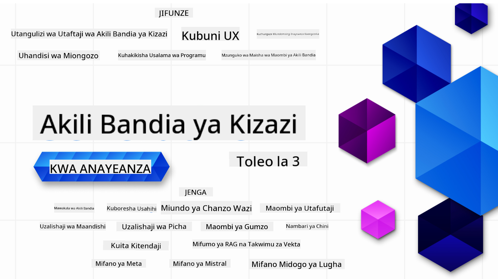

<!--
CO_OP_TRANSLATOR_METADATA:
{
  "original_hash": "5740c9b7fcb6919da1ea4df93475f331",
  "translation_date": "2025-07-09T06:41:44+00:00",
  "source_file": "README.md",
  "language_code": "sw"
}
-->

### Masomo 21 yanayofundisha kila kitu unachohitaji kujua kuanza kujenga programu za Generative AI

### 🌐 Msaada wa Lugha Nyingi

#### Unaungwa mkono kupitia GitHub Action (Moja kwa moja & Daima Imeboreshwa)

[French](../fr/README.md) | [Spanish](../es/README.md) | [German](../de/README.md) | [Russian](../ru/README.md) | [Arabic](../ar/README.md) | [Persian (Farsi)](../fa/README.md) | [Urdu](../ur/README.md) | [Chinese (Simplified)](../zh/README.md) | [Chinese (Traditional, Macau)](../mo/README.md) | [Chinese (Traditional, Hong Kong)](../hk/README.md) | [Chinese (Traditional, Taiwan)](../tw/README.md) | [Japanese](../ja/README.md) | [Korean](../ko/README.md) | [Hindi](../hi/README.md) | [Bengali](../bn/README.md) | [Marathi](../mr/README.md) | [Nepali](../ne/README.md) | [Punjabi (Gurmukhi)](../pa/README.md) | [Portuguese (Portugal)](../pt/README.md) | [Portuguese (Brazil)](../br/README.md) | [Italian](../it/README.md) | [Polish](../pl/README.md) | [Turkish](../tr/README.md) | [Greek](../el/README.md) | [Thai](../th/README.md) | [Swedish](../sv/README.md) | [Danish](../da/README.md) | [Norwegian](../no/README.md) | [Finnish](../fi/README.md) | [Dutch](../nl/README.md) | [Hebrew](../he/README.md) | [Vietnamese](../vi/README.md) | [Indonesian](../id/README.md) | [Malay](../ms/README.md) | [Tagalog (Filipino)](../tl/README.md) | [Swahili](./README.md) | [Hungarian](../hu/README.md) | [Czech](../cs/README.md) | [Slovak](../sk/README.md) | [Romanian](../ro/README.md) | [Bulgarian](../bg/README.md) | [Serbian (Cyrillic)](../sr/README.md) | [Croatian](../hr/README.md) | [Slovenian](../sl/README.md) | [Ukrainian](../uk/README.md) | [Burmese (Myanmar)](../my/README.md)

# Generative AI kwa Waanzilishi (Toleo la 3) - Kozi

Jifunze misingi ya kujenga programu za Generative AI kupitia kozi yetu kamili yenye masomo 21 inayotolewa na Microsoft Cloud Advocates.

## 🌱 Kuanzia

Kozi hii ina masomo 21. Kila somo lina mada yake, hivyo anza popote unapotaka!

Masomo yamegawanywa kuwa "Jifunze" yanayofafanua dhana za Generative AI au "Jenga" yanayofafanua dhana na mifano ya msimbo kwa **Python** na **TypeScript** inapowezekana.

Kwa watengenezaji wa .NET angalia [Generative AI for Beginners (.NET Edition)](https://github.com/microsoft/Generative-AI-for-beginners-dotnet?WT.mc_id=academic-105485-koreyst)!

Kila somo pia lina sehemu ya "Endelea Kujifunza" yenye zana za ziada za kujifunzia.

## Unachohitaji
### Kuendesha msimbo wa kozi hii, unaweza kutumia:
 - [Azure OpenAI Service](https://aka.ms/genai-beginners/azure-open-ai?WT.mc_id=academic-105485-koreyst) - **Masomo:** "aoai-assignment"
 - [GitHub Marketplace Model Catalog](https://aka.ms/genai-beginners/gh-models?WT.mc_id=academic-105485-koreyst) - **Masomo:** "githubmodels"
 - [OpenAI API](https://aka.ms/genai-beginners/open-ai?WT.mc_id=academic-105485-koreyst) - **Masomo:** "oai-assignment" 
   
- Ujuzi wa msingi wa Python au TypeScript ni msaada - \*Kwa waanzilishi kabisa angalia kozi hizi za [Python](https://aka.ms/genai-beginners/python?WT.mc_id=academic-105485-koreyst) na [TypeScript](https://aka.ms/genai-beginners/typescript?WT.mc_id=academic-105485-koreyst)
- Akaunti ya GitHub ili [kuforki repo hii yote](https://aka.ms/genai-beginners/github?WT.mc_id=academic-105485-koreyst) kwenye akaunti yako ya GitHub

Tumetengeneza somo la **[Kuweka Kozi](./00-course-setup/README.md?WT.mc_id=academic-105485-koreyst)** kusaidia kuanzisha mazingira yako ya maendeleo.

Usisahau [kuipa nyota (🌟) repo hii](https://docs.github.com/en/get-started/exploring-projects-on-github/saving-repositories-with-stars?WT.mc_id=academic-105485-koreyst) ili kuipata kwa urahisi baadaye.

## 🧠 Tayari Kuanzisha?

Ikiwa unatafuta mifano ya msimbo ya hali ya juu zaidi, angalia [mkusanyiko wetu wa Mifano ya Msimbo wa Generative AI](https://aka.ms/genai-beg-code?WT.mc_id=academic-105485-koreyst) kwa **Python** na **TypeScript**.

## 🗣️ Kutana na Wanafunzi Wengine, Pata Msaada

Jiunge na [server rasmi ya Azure AI Foundry Discord](https://aka.ms/genai-discord?WT.mc_id=academic-105485-koreyst) kukutana na kuungana na wanafunzi wengine wanaochukua kozi hii na kupata msaada.

Uliza maswali au shiriki maoni kuhusu bidhaa kwenye [Azure AI Foundry Developer Forum](https://aka.ms/azureaifoundry/forum) kwenye Github.

## 🚀 Kujenga Startup?

Jisajili kwa [Microsoft for Startups Founders Hub](https://aka.ms/genai-foundershub?WT.mc_id=academic-105485-koreyst) kupata **mikopo ya bure ya OpenAI** na hadi **$150k kwa mikopo ya Azure kufikia mifano ya OpenAI kupitia Azure OpenAI Services**.

## 🙏 Unataka kusaidia?

Je, una mapendekezo au umeona makosa ya tahajia au msimbo? [Toa tatizo](https://github.com/microsoft/generative-ai-for-beginners/issues?WT.mc_id=academic-105485-koreyst) au [Tengeneza pull request](https://github.com/microsoft/generative-ai-for-beginners/pulls?WT.mc_id=academic-105485-koreyst)

## 📂 Kila somo linajumuisha:

- Utangulizi mfupi wa video kuhusu mada
- Somo lililoandikwa kwenye README
- Mifano ya msimbo wa Python na TypeScript inayounga mkono Azure OpenAI na OpenAI API
- Viungo vya rasilimali za ziada kuendelea kujifunza

## 🗃️ Masomo

| #   | **Kiungo cha Somo**                                                                                                                          | **Maelezo**                                                                                   | **Video**                                                                   | **Mafunzo Zaidi**                                                             |
| --- | -------------------------------------------------------------------------------------------------------------------------------------------- | --------------------------------------------------------------------------------------------- | --------------------------------------------------------------------------- | ------------------------------------------------------------------------------ |
| 00  | [Kuweka Kozi](./00-course-setup/README.md?WT.mc_id=academic-105485-koreyst)                                                                   | **Jifunze:** Jinsi ya Kuweka Mazingira Yako ya Maendeleo                                      | Video Itakuja Karibu                                                        | [Jifunze Zaidi](https://aka.ms/genai-collection?WT.mc_id=academic-105485-koreyst) |
| 01  | [Utangulizi wa Generative AI na LLMs](./01-introduction-to-genai/README.md?WT.mc_id=academic-105485-koreyst)                                  | **Jifunze:** Kuelewa ni nini Generative AI na jinsi Mifano Mikubwa ya Lugha (LLMs) inavyofanya kazi. | [Video](https://aka.ms/gen-ai-lesson-1-gh?WT.mc_id=academic-105485-koreyst) | [Jifunze Zaidi](https://aka.ms/genai-collection?WT.mc_id=academic-105485-koreyst) |
| 02  | [Kuchunguza na kulinganisha LLMs tofauti](./02-exploring-and-comparing-different-llms/README.md?WT.mc_id=academic-105485-koreyst)               | **Jifunze:** Jinsi ya kuchagua mfano unaofaa kwa matumizi yako                                | [Video](https://aka.ms/gen-ai-lesson2-gh?WT.mc_id=academic-105485-koreyst)  | [Jifunze Zaidi](https://aka.ms/genai-collection?WT.mc_id=academic-105485-koreyst) |
| 03  | [Kutumia Generative AI kwa Uwajibikaji](./03-using-generative-ai-responsibly/README.md?WT.mc_id=academic-105485-koreyst)                       | **Jifunze:** Jinsi ya kujenga Programu za Generative AI kwa uwajibikaji                       | [Video](https://aka.ms/gen-ai-lesson3-gh?WT.mc_id=academic-105485-koreyst)  | [Jifunze Zaidi](https://aka.ms/genai-collection?WT.mc_id=academic-105485-koreyst) |
| 04  | [Kuelewa Misingi ya Uhandisi wa Prompt](./04-prompt-engineering-fundamentals/README.md?WT.mc_id=academic-105485-koreyst)                       | **Jifunze:** Mbinu Bora za Uhandisi wa Prompt kwa vitendo                                   | [Video](https://aka.ms/gen-ai-lesson4-gh?WT.mc_id=academic-105485-koreyst)  | [Jifunze Zaidi](https://aka.ms/genai-collection?WT.mc_id=academic-105485-koreyst) |
| 05  | [Kuunda Prompts Zinazoendelea](./05-advanced-prompts/README.md?WT.mc_id=academic-105485-koreyst)                                              | **Jifunze:** Jinsi ya kutumia mbinu za uhandisi wa prompt zinazoboresha matokeo ya prompts zako. | [Video](https://aka.ms/gen-ai-lesson5-gh?WT.mc_id=academic-105485-koreyst)  | [Jifunze Zaidi](https://aka.ms/genai-collection?WT.mc_id=academic-105485-koreyst) |
| 06  | [Kuunda Programu za Uundaji wa Maandishi](./06-text-generation-apps/README.md?WT.mc_id=academic-105485-koreyst)                                | **Jenga:** Programu ya uundaji wa maandishi kwa kutumia Azure OpenAI / OpenAI API                                | [Video](https://aka.ms/gen-ai-lesson6-gh?WT.mc_id=academic-105485-koreyst)  | [Jifunze Zaidi](https://aka.ms/genai-collection?WT.mc_id=academic-105485-koreyst) |
| 07  | [Kuunda Programu za Mazungumzo](./07-building-chat-applications/README.md?WT.mc_id=academic-105485-koreyst)                                     | **Jenga:** Mbinu za kujenga na kuunganisha programu za mazungumzo kwa ufanisi.               | [Video](https://aka.ms/gen-ai-lessons7-gh?WT.mc_id=academic-105485-koreyst) | [Jifunze Zaidi](https://aka.ms/genai-collection?WT.mc_id=academic-105485-koreyst) |
| 08  | [Kuunda Programu za Utafutaji na Hifadhidata za Vector](./08-building-search-applications/README.md?WT.mc_id=academic-105485-koreyst)                        | **Jenga:** Programu ya utafutaji inayotumia Embeddings kutafuta data.                        | [Video](https://aka.ms/gen-ai-lesson8-gh?WT.mc_id=academic-105485-koreyst)  | [Jifunze Zaidi](https://aka.ms/genai-collection?WT.mc_id=academic-105485-koreyst) |
| 09  | [Kuunda Programu za Uundaji Picha](./09-building-image-applications/README.md?WT.mc_id=academic-105485-koreyst)                        | **Jenga:** Programu ya uundaji picha                                                       | [Video](https://aka.ms/gen-ai-lesson9-gh?WT.mc_id=academic-105485-koreyst)  | [Jifunze Zaidi](https://aka.ms/genai-collection?WT.mc_id=academic-105485-koreyst) |
| 10  | [Kuunda Programu za AI za Low Code](./10-building-low-code-ai-applications/README.md?WT.mc_id=academic-105485-koreyst)                       | **Jenga:** Programu ya AI ya Uundaji kwa kutumia zana za Low Code                                     | [Video](https://aka.ms/gen-ai-lesson10-gh?WT.mc_id=academic-105485-koreyst) | [Jifunze Zaidi](https://aka.ms/genai-collection?WT.mc_id=academic-105485-koreyst) |
| 11  | [Kuunganisha Programu za Nje kwa Kupiga Simu za Function](./11-integrating-with-function-calling/README.md?WT.mc_id=academic-105485-koreyst) | **Jenga:** Nini maana ya kupiga simu za function na matumizi yake katika programu                          | [Video](https://aka.ms/gen-ai-lesson11-gh?WT.mc_id=academic-105485-koreyst) | [Jifunze Zaidi](https://aka.ms/genai-collection?WT.mc_id=academic-105485-koreyst) |
| 12  | [Kubuni UX kwa Programu za AI](./12-designing-ux-for-ai-applications/README.md?WT.mc_id=academic-105485-koreyst)                         | **Jifunze:** Jinsi ya kutumia kanuni za muundo wa UX wakati wa kuendeleza Programu za AI za Uundaji         | [Video](https://aka.ms/gen-ai-lesson12-gh?WT.mc_id=academic-105485-koreyst) | [Jifunze Zaidi](https://aka.ms/genai-collection?WT.mc_id=academic-105485-koreyst) |
| 13  | [Kuhakikisha Usalama wa Programu Zako za AI za Uundaji](./13-securing-ai-applications/README.md?WT.mc_id=academic-105485-koreyst)                         | **Jifunze:** Vitisho na hatari kwa mifumo ya AI na njia za kuwalinda mifumo hii.             | [Video](https://aka.ms/gen-ai-lesson13-gh?WT.mc_id=academic-105485-koreyst) | [Jifunze Zaidi](https://aka.ms/genai-collection?WT.mc_id=academic-105485-koreyst) |
| 14  | [Mzunguko wa Maisha wa Programu za AI za Uundaji](./14-the-generative-ai-application-lifecycle/README.md?WT.mc_id=academic-105485-koreyst)           | **Jifunze:** Zana na vipimo vya kusimamia Mzunguko wa Maisha wa LLM na LLMOps                         | [Video](https://aka.ms/gen-ai-lesson14-gh?WT.mc_id=academic-105485-koreyst) | [Jifunze Zaidi](https://aka.ms/genai-collection?WT.mc_id=academic-105485-koreyst) |
| 15  | [Uundaji Ulioboreshwa kwa Kupata Taarifa (RAG) na Hifadhidata za Vector](./15-rag-and-vector-databases/README.md?WT.mc_id=academic-105485-koreyst)        | **Jenga:** Programu inayotumia Mfumo wa RAG kupata embeddings kutoka Hifadhidata za Vector  | [Video](https://aka.ms/gen-ai-lesson15-gh?WT.mc_id=academic-105485-koreyst) | [Jifunze Zaidi](https://aka.ms/genai-collection?WT.mc_id=academic-105485-koreyst) |
| 16  | [Modeli za Chanzo Huria na Hugging Face](./16-open-source-models/README.md?WT.mc_id=academic-105485-koreyst)                                    | **Jenga:** Programu inayotumia modeli za chanzo huria zinazopatikana kwenye Hugging Face                    | [Video](https://aka.ms/gen-ai-lesson16-gh?WT.mc_id=academic-105485-koreyst) | [Jifunze Zaidi](https://aka.ms/genai-collection?WT.mc_id=academic-105485-koreyst) |
| 17  | [Wakala wa AI](./17-ai-agents/README.md?WT.mc_id=academic-105485-koreyst)                                                                       | **Jenga:** Programu inayotumia Mfumo wa Wakala wa AI                                           | [Video](https://aka.ms/gen-ai-lesson17-gh?WT.mc_id=academic-105485-koreyst) | [Jifunze Zaidi](https://aka.ms/genai-collection?WT.mc_id=academic-105485-koreyst) |
| 18  | [Kurekebisha LLMs](./18-fine-tuning/README.md?WT.mc_id=academic-105485-koreyst)                                                              | **Jifunze:** Nini, kwa nini na jinsi ya kurekebisha LLMs                                            | [Video](https://aka.ms/gen-ai-lesson18-gh?WT.mc_id=academic-105485-koreyst) | [Jifunze Zaidi](https://aka.ms/genai-collection?WT.mc_id=academic-105485-koreyst) |
| 19  | [Kuunda na SLMs](./19-slm/README.md?WT.mc_id=academic-105485-koreyst)                                                              | **Jifunze:** Faida za kuunda na Small Language Models                                            | Video Itakuja Hivi Karibuni | [Jifunze Zaidi](https://aka.ms/genai-collection?WT.mc_id=academic-105485-koreyst) |
| 20  | [Kuunda na Modeli za Mistral](./20-mistral/README.md?WT.mc_id=academic-105485-koreyst)                                                              | **Jifunze:** Sifa na tofauti za Modeli za Familia ya Mistral                                           | Video Itakuja Hivi Karibuni | [Jifunze Zaidi](https://aka.ms/genai-collection?WT.mc_id=academic-105485-koreyst) |
| 21  | [Kuunda na Modeli za Meta](./21-meta/README.md?WT.mc_id=academic-105485-koreyst)                                                              | **Jifunze:** Sifa na tofauti za Modeli za Familia ya Meta                                           | Video Itakuja Hivi Karibuni | [Jifunze Zaidi](https://aka.ms/genai-collection?WT.mc_id=academic-105485-koreyst) |

### 🌟 Shukrani Maalum

Shukrani maalum kwa [**John Aziz**](https://www.linkedin.com/in/john0isaac/) kwa kuunda GitHub Actions zote na workflows

[**Bernhard Merkle**](https://www.linkedin.com/in/bernhard-merkle-738b73/) kwa michango muhimu katika kila somo ili kuboresha uzoefu wa mwanafunzi na wa msimbo.

## 🎒 Kozi Nyingine

Timu yetu hutengeneza kozi nyingine! Angalia:

- [**MPYA** Itifaki ya Muktadha wa Modeli kwa Waanzilishi](https://github.com/microsoft/mcp-for-beginners?WT.mc_id=academic-105485-koreyst)
- [Wakala wa AI kwa Waanzilishi](https://github.com/microsoft/ai-agents-for-beginners?WT.mc_id=academic-105485-koreyst)
- [AI ya Uundaji kwa Waanzilishi kwa kutumia .NET](https://github.com/microsoft/Generative-AI-for-beginners-dotnet?WT.mc_id=academic-105485-koreyst)
- [AI ya Uundaji kwa Waanzilishi kwa kutumia JavaScript](https://aka.ms/genai-js-course?WT.mc_id=academic-105485-koreyst)
- [ML kwa Waanzilishi](https://aka.ms/ml-beginners?WT.mc_id=academic-105485-koreyst)
- [Sayansi ya Data kwa Waanzilishi](https://aka.ms/datascience-beginners?WT.mc_id=academic-105485-koreyst)
- [AI kwa Waanzilishi](https://aka.ms/ai-beginners?WT.mc_id=academic-105485-koreyst)
- [Usalama wa Mtandao kwa Waanzilishi](https://github.com/microsoft/Security-101??WT.mc_id=academic-96948-sayoung)
- [Uendelezaji wa Wavuti kwa Waanzilishi](https://aka.ms/webdev-beginners?WT.mc_id=academic-105485-koreyst)
- [IoT kwa Waanzilishi](https://aka.ms/iot-beginners?WT.mc_id=academic-105485-koreyst)
- [Uendelezaji wa XR kwa Waanzilishi](https://github.com/microsoft/xr-development-for-beginners?WT.mc_id=academic-105485-koreyst)
- [Kuwa Mtaalamu wa GitHub Copilot kwa Uandishi wa Programu wa AI kwa Pamoja](https://aka.ms/GitHubCopilotAI?WT.mc_id=academic-105485-koreyst)
- [Kuwa Mtaalamu wa GitHub Copilot kwa Waendelezaji wa C#/.NET](https://github.com/microsoft/mastering-github-copilot-for-dotnet-csharp-developers?WT.mc_id=academic-105485-koreyst)
- [Chagua Safari Yako ya Copilot](https://github.com/microsoft/CopilotAdventures?WT.mc_id=academic-105485-koreyst)

**Kiarifu cha Kutotegemea**:  
Hati hii imetafsiriwa kwa kutumia huduma ya tafsiri ya AI [Co-op Translator](https://github.com/Azure/co-op-translator). Ingawa tunajitahidi kwa usahihi, tafadhali fahamu kwamba tafsiri za kiotomatiki zinaweza kuwa na makosa au upungufu wa usahihi. Hati ya asili katika lugha yake ya asili inapaswa kuchukuliwa kama chanzo cha mamlaka. Kwa taarifa muhimu, tafsiri ya kitaalamu inayofanywa na binadamu inapendekezwa. Hatubebei dhamana kwa kutoelewana au tafsiri potofu zinazotokana na matumizi ya tafsiri hii.