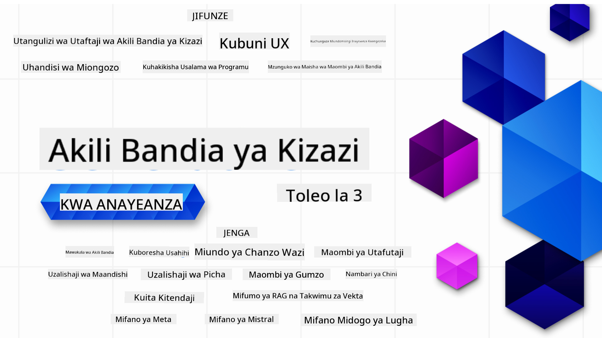

<!--
CO_OP_TRANSLATOR_METADATA:
{
  "original_hash": "6e3f4c8a4f323b8eab1cf11ded304b0f",
  "translation_date": "2025-06-25T08:10:41+00:00",
  "source_file": "README.md",
  "language_code": "sw"
}
-->

### Masomo 21 yanayofundisha kila kitu unachohitaji kujua ili kuanza kujenga programu za Generative AI

### 🌐 Msaada wa Lugha Nyingi

#### Inasaidiwa kupitia GitHub Action (Imefanyiwa otomatiki na daima inasasishwa)

# AI Inayotengeneza kwa Anayeanza (Toleo la 3) - Kozi

Jifunze misingi ya kujenga programu za AI inayotengeneza kupitia kozi yetu ya masomo 21 iliyokamilika na Microsoft Cloud Advocates.

## 🌱 Kuanza

Kozi hii ina masomo 21. Kila somo lina mada yake, hivyo unaweza kuanza popote unapopenda!

Masomo yamewekwa alama kama masomo ya "Jifunze" yanayofafanua dhana ya AI inayotengeneza au masomo ya "Jenga" yanayofafanua dhana na mifano ya programu kwa **Python** na **TypeScript** inapowezekana.

Kwa Watengenezaji wa .NET angalia [AI Inayotengeneza kwa Anayeanza (.NET Edition)](https://github.com/microsoft/Generative-AI-for-beginners-dotnet?WT.mc_id=academic-105485-koreyst)!

Kila somo pia linajumuisha sehemu ya "Endelea Kujifunza" yenye zana za ziada za kujifunza.

## Unachohitaji
### Ili kuendesha programu ya kozi hii, unaweza kutumia:
 - [Huduma ya Azure OpenAI](https://aka.ms/genai-beginners/azure-open-ai?WT.mc_id=academic-105485-koreyst) - **Masomo:** "aoai-assignment"
 - [Katalogi ya Modeli ya Soko la GitHub](https://aka.ms/genai-beginners/gh-models?WT.mc_id=academic-105485-koreyst) - **Masomo:** "githubmodels"
 - [API ya OpenAI](https://aka.ms/genai-beginners/open-ai?WT.mc_id=academic-105485-koreyst) - **Masomo:** "oai-assignment" 
   
- Ujuzi wa msingi wa Python au TypeScript ni muhimu - \*Kwa wanaoanza kabisa angalia kozi hizi za [Python](https://aka.ms/genai-beginners/python?WT.mc_id=academic-105485-koreyst) na [TypeScript](https://aka.ms/genai-beginners/typescript?WT.mc_id=academic-105485-koreyst)
- Akaunti ya GitHub ili [kuiga repoti hii yote](https://aka.ms/genai-beginners/github?WT.mc_id=academic-105485-koreyst) kwenye akaunti yako ya GitHub

Tumeunda somo la **[Usanidi wa Kozi](./00-course-setup/README.md?WT.mc_id=academic-105485-koreyst)** ili kukusaidia na kuandaa mazingira yako ya maendeleo.

Usisahau [kuweka nyota (🌟) kwenye repoti hii](https://docs.github.com/en/get-started/exploring-projects-on-github/saving-repositories-with-stars?WT.mc_id=academic-105485-koreyst) ili kuipata kwa urahisi baadaye.

## 🧠 Tayari kwa Kuweka?

Ikiwa unatafuta sampuli za programu za hali ya juu, angalia [mkusanyiko wetu wa Sampuli za Programu za AI Inayotengeneza](https://aka.ms/genai-beg-code?WT.mc_id=academic-105485-koreyst) kwa **Python** na **TypeScript**.

## 🗣️ Kutana na Wanafunzi Wengine, Pata Msaada

Jiunge na [seva rasmi ya Azure AI Foundry Discord](https://aka.ms/genai-discord?WT.mc_id=academic-105485-koreyst) ili kukutana na kuungana na wanafunzi wengine wanaochukua kozi hii na kupata msaada.

Uliza maswali au shiriki maoni ya bidhaa katika [Jukwaa la Watengenezaji la Azure AI Foundry](https://aka.ms/azureaifoundry/forum) kwenye Github.

## 🚀 Kujenga Kampuni?

Jisajili kwenye [Microsoft for Startups Founders Hub](https://aka.ms/genai-foundershub?WT.mc_id=academic-105485-koreyst) ili upate **mikopo ya bure ya OpenAI** na hadi **$150k kwa mikopo ya Azure ili kufikia modeli za OpenAI kupitia Huduma za Azure OpenAI**.

## 🙏 Unataka kusaidia?

Una mapendekezo au umepata makosa ya tahajia au programu? [Fungua suala](https://github.com/microsoft/generative-ai-for-beginners/issues?WT.mc_id=academic-105485-koreyst) au [Unda ombi la kuvuta](https://github.com/microsoft/generative-ai-for-beginners/pulls?WT.mc_id=academic-105485-koreyst)

## 📂 Kila somo linajumuisha:

- Utangulizi mfupi wa video kwenye mada
- Somo lililoandikwa lililopo kwenye README
- Sampuli za programu za Python na TypeScript zinazounga mkono Azure OpenAI na OpenAI API
- Viungo vya rasilimali za ziada kuendelea kujifunza kwako

## 🗃️ Masomo

| #   | **Kiungo cha Somo**                                                                                                                              | **Maelezo**                                                                                 | **Video**                                                                   | **Kujifunza Zaidi**                                                             |
| --- | -------------------------------------------------------------------------------------------------------------------------------------------- | ----------------------------------------------------------------------------------------------- | --------------------------------------------------------------------------- | ------------------------------------------------------------------------------ |
| 00  | [Usanidi wa Kozi](./00-course-setup/README.md?WT.mc_id=academic-105485-koreyst)                                                                 | **Jifunze:** Jinsi ya Kuandaa Mazingira Yako ya Maendeleo                                            | Video Inakuja Karibuni                                                                 | [Jifunze Zaidi](https://aka.ms/genai-collection?WT.mc_id=academic-105485-koreyst) |
| 01  | [Utangulizi wa AI Inayotengeneza na LLMs](./01-introduction-to-genai/README.md?WT.mc_id=academic-105485-koreyst)                              | **Jifunze:** Kuelewa AI Inayotengeneza ni nini na jinsi Moduli Kubwa za Lugha (LLMs) zinavyofanya kazi.       | [Video](https://aka.ms/gen-ai-lesson-1-gh?WT.mc_id=academic-105485-koreyst) | [Jifunze Zaidi](https://aka.ms/genai-collection?WT.mc_id=academic-105485-koreyst) |
| 02  | [Kuchunguza na kulinganisha LLMs tofauti](./02-exploring-and-comparing-different-llms/README.md?WT.mc_id=academic-105485-koreyst)             | **Jifunze:** Jinsi ya kuchagua modeli sahihi kwa matumizi yako                                      | [Video](https://aka.ms/gen-ai-lesson2-gh?WT.mc_id=academic-105485-koreyst)  | [Jifunze Zaidi](https://aka.ms/genai-collection?WT.mc_id=academic-105485-koreyst) |
| 03  | [Kutumia AI Inayotengeneza kwa Uangalifu](./03-using-generative-ai-responsibly/README.md?WT.mc_id=academic-105485-koreyst)                           | **Jifunze:** Jinsi ya kujenga Programu za AI Inayotengeneza kwa uangalifu                                  | [Video](https://aka.ms/gen-ai-lesson3-gh?WT.mc_id=academic-105485-koreyst)  | [Jifunze Zaidi](https://aka.ms/genai-collection?WT.mc_id=academic-105485-koreyst) |
| 04  | [Kuelewa Misingi ya Uhandisi wa Maoni](./04-prompt-engineering-fundamentals/README.md?WT.mc_id=academic-105485-koreyst)             | **Jifunze:** Mazoezi Bora ya Uhandisi wa Maoni                                           | [Video](https://aka.ms/gen-ai-lesson4-gh?WT.mc_id=academic-105485-koreyst)  | [Jifunze Zaidi](https://aka.ms/genai-collection?WT.mc_id=academic-105485-koreyst) |
| 05  | [Kuunda Vidokezo vya Juu](./05-advanced-prompts/README.md?WT.mc_id=academic-105485-koreyst)                                                | **Jifunze:** Jinsi ya kutumia mbinu za uhandisi wa vidokezo zinazoboreshwa matokeo ya vidokezo vyako. | [Video](https://aka.ms/gen-ai-lesson5-gh?WT.mc_id=academic-105485-koreyst)  | [Jifunze Zaidi](https://aka.ms/genai-collection?WT.mc_id=academic-105485-koreyst) |
| 06  | [Kuunda Programu za Uzalishaji wa Maandishi](./06-text-generation-apps/README.md?WT.mc_id=academic-105485-koreyst)                                | **Jenga:** Programu ya uzalishaji wa maandishi ukitumia Azure OpenAI / OpenAI API                                | [Video](https://aka.ms/gen-ai-lesson6-gh?WT.mc_id=academic-105485-koreyst)  | [Jifunze Zaidi](https://aka.ms/genai-collection?WT.mc_id=academic-105485-koreyst) |
| 07  | [Kuunda Programu za Gumzo](./07-building-chat-applications/README.md?WT.mc_id=academic-105485-koreyst)                                     | **Jenga:** Mbinu za kuunda na kuunganisha programu za gumzo kwa ufanisi.               | [Video](https://aka.ms/gen-ai-lessons7-gh?WT.mc_id=academic-105485-koreyst) | [Jifunze Zaidi](https://aka.ms/genai-collection?WT.mc_id=academic-105485-koreyst) |
| 08  | [Kuunda Programu za Utafutaji na Maktaba za Vector](./08-building-search-applications/README.md?WT.mc_id=academic-105485-koreyst)                        | **Jenga:** Programu ya utafutaji inayotumia Embeddings kutafuta data.                        | [Video](https://aka.ms/gen-ai-lesson8-gh?WT.mc_id=academic-105485-koreyst)  | [Jifunze Zaidi](https://aka.ms/genai-collection?WT.mc_id=academic-105485-koreyst) |
| 09  | [Kuunda Programu za Uzalishaji wa Picha](./09-building-image-applications/README.md?WT.mc_id=academic-105485-koreyst)                        | **Jenga:** Programu ya uzalishaji wa picha                                                       | [Video](https://aka.ms/gen-ai-lesson9-gh?WT.mc_id=academic-105485-koreyst)  | [Jifunze Zaidi](https://aka.ms/genai-collection?WT.mc_id=academic-105485-koreyst) |
| 10  | [Kuunda Programu za AI kwa Kutumia Low Code](./10-building-low-code-ai-applications/README.md?WT.mc_id=academic-105485-koreyst)                       | **Jenga:** Programu ya Generative AI ukitumia zana za Low Code                                     | [Video](https://aka.ms/gen-ai-lesson10-gh?WT.mc_id=academic-105485-koreyst) | [Jifunze Zaidi](https://aka.ms/genai-collection?WT.mc_id=academic-105485-koreyst) |
| 11  | [Kuunganisha Programu za Nje na Kuitana kwa Kazi](./11-integrating-with-function-calling/README.md?WT.mc_id=academic-105485-koreyst) | **Jenga:** Kuitana kwa kazi ni nini na matumizi yake katika programu                          | [Video](https://aka.ms/gen-ai-lesson11-gh?WT.mc_id=academic-105485-koreyst) | [Jifunze Zaidi](https://aka.ms/genai-collection?WT.mc_id=academic-105485-koreyst) |
| 12  | [Kubuni UX kwa Programu za AI](./12-designing-ux-for-ai-applications/README.md?WT.mc_id=academic-105485-koreyst)                         | **Jifunze:** Jinsi ya kutumia kanuni za ubunifu wa UX wakati wa kuendeleza Programu za Generative AI         | [Video](https://aka.ms/gen-ai-lesson12-gh?WT.mc_id=academic-105485-koreyst) | [Jifunze Zaidi](https://aka.ms/genai-collection?WT.mc_id=academic-105485-koreyst) |
| 13  | [Kuhakikisha Usalama wa Programu Zako za Generative AI](./13-securing-ai-applications/README.md?WT.mc_id=academic-105485-koreyst)                         | **Jifunze:** Vitisho na hatari kwa mifumo ya AI na mbinu za kuhakikisha usalama wa mifumo hii.             | [Video](https://aka.ms/gen-ai-lesson13-gh?WT.mc_id=academic-105485-koreyst) | [Jifunze Zaidi](https://aka.ms/genai-collection?WT.mc_id=academic-105485-koreyst) |
| 14  | [Mzunguko wa Maisha wa Programu za Generative AI](./14-the-generative-ai-application-lifecycle/README.md?WT.mc_id=academic-105485-koreyst)           | **Jifunze:** Zana na vipimo vya kusimamia Mzunguko wa Maisha wa LLM na LLMOps                         | [Video](https://aka.ms/gen-ai-lesson14-gh?WT.mc_id=academic-105485-koreyst) | [Jifunze Zaidi](https://aka.ms/genai-collection?WT.mc_id=academic-105485-koreyst) |
| 15  | [Upatikanaji Ulioimarishwa na Uzalishaji (RAG) na Maktaba za Vector](./15-rag-and-vector-databases/README.md?WT.mc_id=academic-105485-koreyst)        | **Jenga:** Programu kwa kutumia Mfumo wa RAG ili kupata embeddings kutoka Maktaba za Vector  | [Video](https://aka.ms/gen-ai-lesson15-gh?WT.mc_id=academic-105485-koreyst) | [Jifunze Zaidi](https://aka.ms/genai-collection?WT.mc_id=academic-105485-koreyst) |
| 16  | [Mifano ya Chanzo Huria na Hugging Face](./16-open-source-models/README.md?WT.mc_id=academic-105485-koreyst)                                    | **Jenga:** Programu kwa kutumia mifano ya chanzo huria inayopatikana kwenye Hugging Face                    | [Video](https://aka.ms/gen-ai-lesson16-gh?WT.mc_id=academic-105485-koreyst) | [Jifunze Zaidi](https://aka.ms/genai-collection?WT.mc_id=academic-105485-koreyst) |
| 17  | [Wakala wa AI](./17-ai-agents/README.md?WT.mc_id=academic-105485-koreyst)                                                                       | **Jenga:** Programu kwa kutumia Mfumo wa Wakala wa AI                                           | [Video](https://aka.ms/gen-ai-lesson17-gh?WT.mc_id=academic-105485-koreyst) | [Jifunze Zaidi](https://aka.ms/genai-collection?WT.mc_id=academic-105485-koreyst) |
| 18  | [Kuboresha LLMs](./18-fine-tuning/README.md?WT.mc_id=academic-105485-koreyst)                                                              | **Jifunze:** Nini, kwa nini na jinsi ya kuboresha LLMs                                            | [Video](https://aka.ms/gen-ai-lesson18-gh?WT.mc_id=academic-105485-koreyst) | [Jifunze Zaidi](https://aka.ms/genai-collection?WT.mc_id=academic-105485-koreyst) |
| 19  | [Kujenga na SLMs](./19-slm/README.md?WT.mc_id=academic-105485-koreyst)                                                              | **Jifunze:** Faida za kujenga na Mifano Midogo ya Lugha                                            | Video Inakuja Hivi Karibuni | [Jifunze Zaidi](https://aka.ms/genai-collection?WT.mc_id=academic-105485-koreyst) |
| 20  | [Kujenga na Mifano ya Mistral](./20-mistral/README.md?WT.mc_id=academic-105485-koreyst)                                                              | **Jifunze:** Vipengele na tofauti za Mifano ya Familia ya Mistral                                           | Video Inakuja Hivi Karibuni | [Jifunze Zaidi](https://aka.ms/genai-collection?WT.mc_id=academic-105485-koreyst) |
| 21  | [Kujenga na Mifano ya Meta](./21-meta/README.md?WT.mc_id=academic-105485-koreyst)                                                              | **Jifunze:** Vipengele na tofauti za Mifano ya Familia ya Meta                                           | Video Inakuja Hivi Karibuni | [Jifunze Zaidi](https://aka.ms/genai-collection?WT.mc_id=academic-105485-koreyst) |

### 🌟 Shukrani za Pekee

Shukrani za pekee kwa [**John Aziz**](https://www.linkedin.com/in/john0isaac/) kwa kuunda vitendo vyote vya GitHub na michakato

[**Bernhard Merkle**](https://www.linkedin.com/in/bernhard-merkle-738b73/) kwa kutoa mchango muhimu katika kila somo ili kuboresha uzoefu wa mwanafunzi na wa kificho.

## 🎒 Kozi Nyingine

Timu yetu inatoa kozi nyingine! Angalia:

- [**MPYA** Itifaki ya Muktadha wa Mfano kwa Kompyuta](https://github.com/microsoft/mcp-for-beginners?WT.mc_id=academic-105485-koreyst)
- [Wakala wa AI kwa Kompyuta](https://github.com/microsoft/ai-agents-for-beginners?WT.mc_id=academic-105485-koreyst)
- [AI ya Kizazi kwa Kompyuta kutumia .NET](https://github.com/microsoft/Generative-AI-for-beginners-dotnet?WT.mc_id=academic-105485-koreyst)
- [AI ya Kizazi kwa Kompyuta kutumia JavaScript](https://aka.ms/genai-js-course?WT.mc_id=academic-105485-koreyst)
- [ML kwa Kompyuta](https://aka.ms/ml-beginners?WT.mc_id=academic-105485-koreyst)
- [Sayansi ya Data kwa Kompyuta](https://aka.ms/datascience-beginners?WT.mc_id=academic-105485-koreyst)
- [AI kwa Kompyuta](https://aka.ms/ai-beginners?WT.mc_id=academic-105485-koreyst)
- [Usalama wa Mtandao kwa Kompyuta](https://github.com/microsoft/Security-101??WT.mc_id=academic-96948-sayoung)
- [Web Dev kwa Kompyuta](https://aka.ms/webdev-beginners?WT.mc_id=academic-105485-koreyst)
- [IoT kwa Kompyuta](https://aka.ms/iot-beginners?WT.mc_id=academic-105485-koreyst)
- [Maendeleo ya XR kwa Kompyuta](https://github.com/microsoft/xr-development-for-beginners?WT.mc_id=academic-105485-koreyst)
- [Kumudu GitHub Copilot kwa Uprogramishaji wa AI kwa Pamoja](https://aka.ms/GitHubCopilotAI?WT.mc_id=academic-105485-koreyst)
- [Kumudu GitHub Copilot kwa Waendelezaji wa C#/.NET](https://github.com/microsoft/mastering-github-copilot-for-dotnet-csharp-developers?WT.mc_id=academic-105485-koreyst)
- [Chagua Safari Yako Mwenyewe ya Copilot](https://github.com/microsoft/CopilotAdventures?WT.mc_id=academic-105485-koreyst)

**Kanusho**:  
Hati hii imetafsiriwa kwa kutumia huduma ya tafsiri ya AI [Co-op Translator](https://github.com/Azure/co-op-translator). Ingawa tunajitahidi kwa usahihi, tafadhali fahamu kuwa tafsiri za kiotomatiki zinaweza kuwa na makosa au kutokuwa sahihi. Hati ya awali katika lugha yake asili inapaswa kuzingatiwa kama chanzo chenye mamlaka. Kwa taarifa muhimu, tafsiri ya kitaalamu ya binadamu inapendekezwa. Hatuwajibiki kwa kutoelewana au tafsiri zisizo sahihi zinazosababishwa na matumizi ya tafsiri hii.