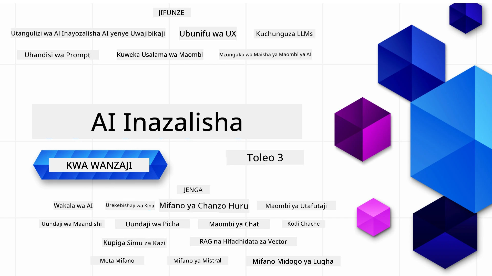

### Masomo 21 yanayofundisha kila kitu unachohitaji kujua kuanza kujenga programu za Generative AI

[](https://github.com/microsoft/Generative-AI-For-Beginners/blob/master/LICENSE?WT.mc_id=academic-105485-koreyst)
[](https://GitHub.com/microsoft/Generative-AI-For-Beginners/graphs/contributors/?WT.mc_id=academic-105485-koreyst)
[](https://GitHub.com/microsoft/Generative-AI-For-Beginners/issues/?WT.mc_id=academic-105485-koreyst)
[](https://GitHub.com/microsoft/Generative-AI-For-Beginners/pulls/?WT.mc_id=academic-105485-koreyst)
[](http://makeapullrequest.com?WT.mc_id=academic-105485-koreyst)

[](https://GitHub.com/microsoft/Generative-AI-For-Beginners/watchers/?WT.mc_id=academic-105485-koreyst)
[](https://GitHub.com/microsoft/Generative-AI-For-Beginners/network/?WT.mc_id=academic-105485-koreyst)
[](https://GitHub.com/microsoft/Generative-AI-For-Beginners/stargazers/?WT.mc_id=academic-105485-koreyst)

[](https://discord.gg/nTYy5BXMWG)

### 🌐 Msaada wa Lugha Nyingi

#### Inasaidiwa kupitia Hatua ya GitHub (Kiotomatiki & Kila Wakati Kikiwa cha Hali ya Juu)

<!-- CO-OP TRANSLATOR LANGUAGES TABLE START -->
[Kiarabu](../ar/README.md) | [Kibengali](../bn/README.md) | [Kibulgaria](../bg/README.md) | [Kiburma (Myanma)](../my/README.md) | [Kichina (Rahisi)](../zh-CN/README.md) | [Kichina (Asili, Hong Kong)](../zh-HK/README.md) | [Kichina (Asili, Macao)](../zh-MO/README.md) | [Kichina (Asili, Taiwan)](../zh-TW/README.md) | [Kroeshia](../hr/README.md) | [Cheki](../cs/README.md) | [Kidenmaki](../da/README.md) | [Kiholanzi](../nl/README.md) | [Kiestonia](../et/README.md) | [Kifinnish](../fi/README.md) | [Kifaransa](../fr/README.md) | [Kijerumani](../de/README.md) | [Kigiriki](../el/README.md) | [Kiebrania](../he/README.md) | [Kihindi](../hi/README.md) | [Kihungari](../hu/README.md) | [Kiindonesia](../id/README.md) | [Kiitaliano](../it/README.md) | [Kijapani](../ja/README.md) | [Kikannada](../kn/README.md) | [Kikmeri](../km/README.md) | [Kikorea](../ko/README.md) | [Kilithuania](../lt/README.md) | [Kimalay](../ms/README.md) | [Kimalayalam](../ml/README.md) | [Kimaratih](../mr/README.md) | [Kinepali](../ne/README.md) | [Kipidgin cha Nigeria](../pcm/README.md) | [Kinorwe](../no/README.md) | [Kiajemi (Farsi)](../fa/README.md) | [Kilaholanzi](../pl/README.md) | [Kireno (Brazil)](../pt-BR/README.md) | [Kireno (Ureno)](../pt-PT/README.md) | [Kipunjabi (Gurmukhi)](../pa/README.md) | [Kiromania](../ro/README.md) | [Kirusi](../ru/README.md) | [Kiserbia (Siriliki)](../sr/README.md) | [Kislovakia](../sk/README.md) | [Kislovenia](../sl/README.md) | [Kihispania](../es/README.md) | [Kiswahili](./README.md) | [Kiswidi](../sv/README.md) | [Kitagalog (Filipino)](../tl/README.md) | [Kitamili](../ta/README.md) | [Kitelugu](../te/README.md) | [Kithai](../th/README.md) | [Kituruki](../tr/README.md) | [Kiukrania](../uk/README.md) | [Kiurdu](../ur/README.md) | [Kivietinamu](../vi/README.md)

> **Unapendelea Kuakisi Kwenye Kompyuta Binafsi?**
>
> Hifadhidata hii ina tafsiri za lugha zaidi ya 50 ambazo zinakuza kwa kiasi kikubwa ukubwa wa kupakua. Ili kuakisi bila tafsiri, tumia sparse checkout:
>
> **Bash / macOS / Linux:**
> ```bash
> git clone --filter=blob:none --sparse https://github.com/microsoft/generative-ai-for-beginners.git
> cd generative-ai-for-beginners
> git sparse-checkout set --no-cone '/*' '!translations' '!translated_images'
> ```
>
> **CMD (Windows):**
> ```cmd
> git clone --filter=blob:none --sparse https://github.com/microsoft/generative-ai-for-beginners.git
> cd generative-ai-for-beginners
> git sparse-checkout set --no-cone "/*" "!translations" "!translated_images"
> ```
>
> Hii itakupa kila kitu unachohitaji kukamilisha kozi kwa upakuaji wa kasi zaidi.
<!-- CO-OP TRANSLATOR LANGUAGES TABLE END -->

# Generative AI kwa Waanzaji (Toleo la 3) - Kozi

Jifunze misingi ya kujenga programu za Generative AI na masomo yetu 21-lesson yaliyojumuisha yaliyotengenezwa na Microsoft Cloud Advocates.

## 🌱 Kuanzia

Kozi hii ina masomo 21. Kila somo linahusu mada yake, hivyo anza mahali popote unapotaka!

Masomo yamewekwa alama kuwa ni "Jifunze" yanayoelezea dhana ya Generative AI au "Jenga" yanayoelezea dhana na mifano ya msimbo kwa **Python** na **TypeScript** inapowezekana.

Kwa waendelezaji wa .NET angalia [Generative AI kwa Waanzaji (.NET Edition)](https://github.com/microsoft/Generative-AI-for-beginners-dotnet?WT.mc_id=academic-105485-koreyst)!

Kila somo pia lina sehemu ya "Endelea Kujifunza" na zana za ziada za kujifunza.

## Unachohitaji
### Kuendesha msimbo wa kozi hii, unaweza kutumia:
 - [Huduma ya Azure OpenAI](https://aka.ms/genai-beginners/azure-open-ai?WT.mc_id=academic-105485-koreyst) - **Masomo:** "aoai-assignment"
 - [Katalogi ya Mfano ya Soko la GitHub](https://aka.ms/genai-beginners/gh-models?WT.mc_id=academic-105485-koreyst) - **Masomo:** "githubmodels"
 - [OpenAI API](https://aka.ms/genai-beginners/open-ai?WT.mc_id=academic-105485-koreyst) - **Masomo:** "oai-assignment"
   
- Maarifa ya msingi ya Python au TypeScript ni msaada - \*Kwa waanzaji kabisa angalia kozi hizi za [Python](https://aka.ms/genai-beginners/python?WT.mc_id=academic-105485-koreyst) na [TypeScript](https://aka.ms/genai-beginners/typescript?WT.mc_id=academic-105485-koreyst)
- Akaunti ya GitHub kwa [kuchoma nakala ya hifadhidata hii yote](https://aka.ms/genai-beginners/github?WT.mc_id=academic-105485-koreyst) kwenye akaunti yako ya GitHub

Tumeunda somo la **[Kuweka Kozi](./00-course-setup/README.md?WT.mc_id=academic-105485-koreyst)** kusaidia kuanzisha mazingira yako ya maendeleo.

Usisahau [kuipa nyota (🌟) hifadhidata hii](https://docs.github.com/en/get-started/exploring-projects-on-github/saving-repositories-with-stars?WT.mc_id=academic-105485-koreyst) ili kuipata kwa urahisi baadaye.

## 🧠 Tayari Kuweka Kazi?

Kama unatafuta sampuli za msimbo zilizo na kiwango cha juu zaidi, angalia [mkusanyiko wetu wa Sampuli za Msimbo wa Generative AI](https://aka.ms/genai-beg-code?WT.mc_id=academic-105485-koreyst) kwa **Python** na **TypeScript**.

## 🗣️ Kutana na Wanafunzi Wengine, Pata Msaada

Jiunge na [seva rasmi ya Azure AI Foundry Discord](https://aka.ms/genai-discord?WT.mc_id=academic-105485-koreyst) kukutana na kuungana na wanafunzi wengine wanaochukua kozi hii na kupata msaada.

Uliza maswali au shiriki maoni kuhusu bidhaa kwenye [Azure AI Foundry Developer Forum](https://aka.ms/azureaifoundry/forum) kwenye Github.

## 🚀 Kujenga Biashara Ndogo?

Tembelea [Microsoft kwa Biashara Ndogo](https://www.microsoft.com/startups) kujua jinsi ya kuanza kujenga kwa mikopo ya Azure leo.

## 🙏 Unataka kusaidia?

Je, una mapendekezo au umeona makosa ya tahajia au msimbo? [Toa tatizo](https://github.com/microsoft/generative-ai-for-beginners/issues?WT.mc_id=academic-105485-koreyst) au [Tengeneza ombi la kuunganisha](https://github.com/microsoft/generative-ai-for-beginners/pulls?WT.mc_id=academic-105485-koreyst)

## 📂 Kila somo linajumuisha:

- Utangulizi mfupi wepesi wa video juu ya mada
- Somo lililoandikwa lililoko kwenye README
- Sampuli za msimbo za Python na TypeScript zinazoendana na Azure OpenAI na OpenAI API
- Viungo vya rasilimali za ziada za kuendelea kujifunza

## 🗃️ Masomo

| #   | **Kiungo cha Somo**                                                                                                                            | **Maelezo**                                                                                     | **Video**                                                                   | **Mafunzo Zaidi**                                                             |
| --- | ---------------------------------------------------------------------------------------------------------------------------------------------- | ------------------------------------------------------------------------------------------------| --------------------------------------------------------------------------- | ------------------------------------------------------------------------------ |
| 00  | [Kuweka Kozi](./00-course-setup/README.md?WT.mc_id=academic-105485-koreyst)                                                                    | **Jifunze:** Jinsi ya Kuweka Mazingira yako ya Maendeleo                                          | Video Itakuja Karibu                                                        | [Jifunze Zaidi](https://aka.ms/genai-collection?WT.mc_id=academic-105485-koreyst) |
| 01  | [Utangulizi wa Generative AI na LLMs](./01-introduction-to-genai/README.md?WT.mc_id=academic-105485-koreyst)                                    | **Jifunze:** Kuelewa ni nini Generative AI na jinsi Mifano Mikubwa ya Lugha (LLMs) inavyofanya kazi | [Video](https://aka.ms/gen-ai-lesson-1-gh?WT.mc_id=academic-105485-koreyst) | [Jifunze Zaidi](https://aka.ms/genai-collection?WT.mc_id=academic-105485-koreyst) |
| 02  | [Kuchunguza na kulinganisha LLMs tofauti](./02-exploring-and-comparing-different-llms/README.md?WT.mc_id=academic-105485-koreyst)               | **Jifunze:** Jinsi ya kuchagua mfano sahihi kwa ajili ya kesi yako ya matumizi                    | [Video](https://aka.ms/gen-ai-lesson2-gh?WT.mc_id=academic-105485-koreyst)  | [Jifunze Zaidi](https://aka.ms/genai-collection?WT.mc_id=academic-105485-koreyst) |
| 03  | [Kutumia Generative AI kwa Uwajibikaji](./03-using-generative-ai-responsibly/README.md?WT.mc_id=academic-105485-koreyst)                         | **Jifunze:** Jinsi ya kujenga Maombi ya Generative AI kwa uwajibikaji                             | [Video](https://aka.ms/gen-ai-lesson3-gh?WT.mc_id=academic-105485-koreyst)  | [Jifunze Zaidi](https://aka.ms/genai-collection?WT.mc_id=academic-105485-koreyst) |
| 04  | [Kuelewa Misingi ya Uhandisi wa Prompt](./04-prompt-engineering-fundamentals/README.md?WT.mc_id=academic-105485-koreyst)             | **Jifunze:** Mazoea Bora ya Uhandisi wa Prompt kwa Vitendo                                          | [Video](https://aka.ms/gen-ai-lesson4-gh?WT.mc_id=academic-105485-koreyst)  | [Jifunze Zaidi](https://aka.ms/genai-collection?WT.mc_id=academic-105485-koreyst) |
| 05  | [Uundaji wa Prompt za Juu Zaidi](./05-advanced-prompts/README.md?WT.mc_id=academic-105485-koreyst)                                                | **Jifunze:** Jinsi ya kutumia mbinu za uhandisi wa prompt zinazoboresha matokeo ya prompt zako.    | [Video](https://aka.ms/gen-ai-lesson5-gh?WT.mc_id=academic-105485-koreyst)  | [Jifunze Zaidi](https://aka.ms/genai-collection?WT.mc_id=academic-105485-koreyst) |
| 06  | [Ujenzi wa Programu za Uandishi wa Maandishi](./06-text-generation-apps/README.md?WT.mc_id=academic-105485-koreyst)                                | **Jenga:** Programu ya uandishi wa maandishi kwa kutumia Azure OpenAI / OpenAI API                  | [Video](https://aka.ms/gen-ai-lesson6-gh?WT.mc_id=academic-105485-koreyst)  | [Jifunze Zaidi](https://aka.ms/genai-collection?WT.mc_id=academic-105485-koreyst) |
| 07  | [Ujenzi wa Programu za Mazungumzo](./07-building-chat-applications/README.md?WT.mc_id=academic-105485-koreyst)                                     | **Jenga:** Mbinu za kujenga na kuunganisha programu za mazungumzo kwa ufanisi.                    | [Video](https://aka.ms/gen-ai-lessons7-gh?WT.mc_id=academic-105485-koreyst) | [Jifunze Zaidi](https://aka.ms/genai-collection?WT.mc_id=academic-105485-koreyst) |
| 08  | [Ujenzi wa Programu za Utafutaji Vector Databases](./08-building-search-applications/README.md?WT.mc_id=academic-105485-koreyst)                    | **Jenga:** Programu ya utafutaji inayotumia Embeddings kutafuta data.                               | [Video](https://aka.ms/gen-ai-lesson8-gh?WT.mc_id=academic-105485-koreyst)  | [Jifunze Zaidi](https://aka.ms/genai-collection?WT.mc_id=academic-105485-koreyst) |
| 09  | [Ujenzi wa Programu za Uundaji wa Picha](./09-building-image-applications/README.md?WT.mc_id=academic-105485-koreyst)                              | **Jenga:** Programu ya uundaji wa picha                                                                | [Video](https://aka.ms/gen-ai-lesson9-gh?WT.mc_id=academic-105485-koreyst)  | [Jifunze Zaidi](https://aka.ms/genai-collection?WT.mc_id=academic-105485-koreyst) |
| 10  | [Ujenzi wa Programu za AI za Low Code](./10-building-low-code-ai-applications/README.md?WT.mc_id=academic-105485-koreyst)                         | **Jenga:** Programu ya AI Inayozalisha kwa kutumia Zana za Low Code                                 | [Video](https://aka.ms/gen-ai-lesson10-gh?WT.mc_id=academic-105485-koreyst) | [Jifunze Zaidi](https://aka.ms/genai-collection?WT.mc_id=academic-105485-koreyst) |
| 11  | [Uunganishaji wa Programu za Nje kwa Kupiga Simu Kazi](./11-integrating-with-function-calling/README.md?WT.mc_id=academic-105485-koreyst)           | **Jenga:** Nini ni kupiga simu kazi na matumizi yake kwa programu                                   | [Video](https://aka.ms/gen-ai-lesson11-gh?WT.mc_id=academic-105485-koreyst) | [Jifunze Zaidi](https://aka.ms/genai-collection?WT.mc_id=academic-105485-koreyst) |
| 12  | [Kubuni UX kwa Programu za AI](./12-designing-ux-for-ai-applications/README.md?WT.mc_id=academic-105485-koreyst)                                   | **Jifunze:** Jinsi ya kutumia kanuni za kubuni UX wakati wa kuendeleza Programu za AI Inayozalisha  | [Video](https://aka.ms/gen-ai-lesson12-gh?WT.mc_id=academic-105485-koreyst) | [Jifunze Zaidi](https://aka.ms/genai-collection?WT.mc_id=academic-105485-koreyst) |
| 13  | [Kuhakiki Usalama wa Programu zako za AI Inayozalisha](./13-securing-ai-applications/README.md?WT.mc_id=academic-105485-koreyst)                  | **Jifunze:** Vitisho na hatari kwa mifumo ya AI na njia za kuwalinda mifumo hii                     | [Video](https://aka.ms/gen-ai-lesson13-gh?WT.mc_id=academic-105485-koreyst) | [Jifunze Zaidi](https://aka.ms/genai-collection?WT.mc_id=academic-105485-koreyst) |
| 14  | [Mzunguko wa Maisha wa Programu za AI Inayozalisha](./14-the-generative-ai-application-lifecycle/README.md?WT.mc_id=academic-105485-koreyst)         | **Jifunze:** Zana na vipimo vya kusimamia Mzunguko wa Maisha wa LLM na LLMOps                        | [Video](https://aka.ms/gen-ai-lesson14-gh?WT.mc_id=academic-105485-koreyst) | [Jifunze Zaidi](https://aka.ms/genai-collection?WT.mc_id=academic-105485-koreyst) |
| 15  | [Uundaji wa Programu kwa Kutumia RAG na Vector Databases](./15-rag-and-vector-databases/README.md?WT.mc_id=academic-105485-koreyst)                | **Jenga:** Programu inayotumia Fremu ya RAG kupata embeddings kutoka Vector Databases               | [Video](https://aka.ms/gen-ai-lesson15-gh?WT.mc_id=academic-105485-koreyst) | [Jifunze Zaidi](https://aka.ms/genai-collection?WT.mc_id=academic-105485-koreyst) |
| 16  | [Modeli za Chanzo Huria na Hugging Face](./16-open-source-models/README.md?WT.mc_id=academic-105485-koreyst)                                       | **Jenga:** Programu inayotumia modeli za chanzo huria zinazopatikana kwenye Hugging Face           | [Video](https://aka.ms/gen-ai-lesson16-gh?WT.mc_id=academic-105485-koreyst) | [Jifunze Zaidi](https://aka.ms/genai-collection?WT.mc_id=academic-105485-koreyst) |
| 17  | [Wakala wa AI](./17-ai-agents/README.md?WT.mc_id=academic-105485-koreyst)                                                                         | **Jenga:** Programu inayotumia Fremu ya Wakala wa AI                                               | [Video](https://aka.ms/gen-ai-lesson17-gh?WT.mc_id=academic-105485-koreyst) | [Jifunze Zaidi](https://aka.ms/genai-collection?WT.mc_id=academic-105485-koreyst) |
| 18  | [Kurekebisha LLM kwa Ufasaha](./18-fine-tuning/README.md?WT.mc_id=academic-105485-koreyst)                                                        | **Jifunze:** Nini, kwa nini na jinsi ya kurekebisha LLM                                             | [Video](https://aka.ms/gen-ai-lesson18-gh?WT.mc_id=academic-105485-koreyst) | [Jifunze Zaidi](https://aka.ms/genai-collection?WT.mc_id=academic-105485-koreyst) |
| 19  | [Ujenzi kwa SLMs](./19-slm/README.md?WT.mc_id=academic-105485-koreyst)                                                                         | **Jifunze:** Manufaa ya kujenga kwa kutumia Modeli Ndogo za Lugha                                  | Video Ija Karibu | [Jifunze Zaidi](https://aka.ms/genai-collection?WT.mc_id=academic-105485-koreyst) |
| 20  | [Ujenzi kwa Modeli za Mistral](./20-mistral/README.md?WT.mc_id=academic-105485-koreyst)                                                         | **Jifunze:** Sifa na tofauti za Modeli za Familia ya Mistral                                       | Video Ija Karibu | [Jifunze Zaidi](https://aka.ms/genai-collection?WT.mc_id=academic-105485-koreyst) |
| 21  | [Ujenzi kwa Modeli za Meta](./21-meta/README.md?WT.mc_id=academic-105485-koreyst)                                                               | **Jifunze:** Sifa na tofauti za Modeli za Familia ya Meta                                         | Video Ija Karibu | [Jifunze Zaidi](https://aka.ms/genai-collection?WT.mc_id=academic-105485-koreyst) |

### 🌟 Shukrani Maalum

Shukrani maalum kwa [**John Aziz**](https://www.linkedin.com/in/john0isaac/) kwa kuunda GitHub Actions zote na mitiririko ya kazi

[**Bernhard Merkle**](https://www.linkedin.com/in/bernhard-merkle-738b73/) kwa kuchangia muhimu katika kila somo ili kuboresha uzoefu wa mwanafunzi na wa msimbo.

## 🎒 Kozi Nyingine

Timu yetu hutengeneza kozi nyingine! Angalia:

<!-- CO-OP TRANSLATOR OTHER COURSES START -->
### LangChain
[](https://aka.ms/langchain4j-for-beginners)
[](https://aka.ms/langchainjs-for-beginners?WT.mc_id=m365-94501-dwahlin)
[](https://github.com/microsoft/langchain-for-beginners?WT.mc_id=m365-94501-dwahlin)
---

### Azure / Edge / MCP / Wakala
[](https://github.com/microsoft/AZD-for-beginners?WT.mc_id=academic-105485-koreyst)
[](https://github.com/microsoft/edgeai-for-beginners?WT.mc_id=academic-105485-koreyst)
[](https://github.com/microsoft/mcp-for-beginners?WT.mc_id=academic-105485-koreyst)
[](https://github.com/microsoft/ai-agents-for-beginners?WT.mc_id=academic-105485-koreyst)

---
 
### Mfululizo wa AI Inayozalisha
[](https://github.com/microsoft/generative-ai-for-beginners?WT.mc_id=academic-105485-koreyst)
[-9333EA?style=for-the-badge&labelColor=E5E7EB&color=9333EA)](https://github.com/microsoft/Generative-AI-for-beginners-dotnet?WT.mc_id=academic-105485-koreyst)
[-C084FC?style=for-the-badge&labelColor=E5E7EB&color=C084FC)](https://github.com/microsoft/generative-ai-for-beginners-java?WT.mc_id=academic-105485-koreyst)
[-E879F9?style=for-the-badge&labelColor=E5E7EB&color=E879F9)](https://github.com/microsoft/generative-ai-with-javascript?WT.mc_id=academic-105485-koreyst)

---
 
### Kujifunza Msingi
[](https://aka.ms/ml-beginners?WT.mc_id=academic-105485-koreyst)
[](https://aka.ms/datascience-beginners?WT.mc_id=academic-105485-koreyst)
[](https://aka.ms/ai-beginners?WT.mc_id=academic-105485-koreyst)
[](https://github.com/microsoft/Security-101?WT.mc_id=academic-96948-sayoung)
[](https://aka.ms/webdev-beginners?WT.mc_id=academic-105485-koreyst)
[](https://aka.ms/iot-beginners?WT.mc_id=academic-105485-koreyst)
[](https://github.com/microsoft/xr-development-for-beginners?WT.mc_id=academic-105485-koreyst)

---
 
### Mfululizo wa Copilot
[](https://aka.ms/GitHubCopilotAI?WT.mc_id=academic-105485-koreyst)
[](https://github.com/microsoft/mastering-github-copilot-for-dotnet-csharp-developers?WT.mc_id=academic-105485-koreyst)
[](https://github.com/microsoft/CopilotAdventures?WT.mc_id=academic-105485-koreyst)
<!-- CO-OP TRANSLATOR OTHER COURSES END -->

## Kupata Msaada

Ikiwa unakuwa na shida au una maswali yoyote kuhusu kujenga programu za AI. Jiunge na wapenzi wa kujifunza na waendelezaji wenye uzoefu katika mijadala kuhusu MCP. Ni jamii yenye msaada ambapo maswali yanakaribishwa na maarifa yanashirikiwa kwa ukombozi.

[](https://discord.gg/nTYy5BXMWG)

Ikiwa una maoni kuhusu bidhaa au makosa wakati wa kujenga tembelea:

[](https://aka.ms/foundry/forum)

---

<!-- CO-OP TRANSLATOR DISCLAIMER START -->
**Angalizo**:  
Hati hii imetafsiriwa kwa kutumia huduma ya tafsiri ya AI [Co-op Translator](https://github.com/Azure/co-op-translator). Ingawa tunajitahidi kupata usahihi, tafadhali fahamu kuwa tafsiri za mashine zinaweza kuwa na makosa au kutokukamilika. Hati ya asili katika lugha yake ya asili inapaswa kuchukuliwa kama chanzo cha mamlaka. Kwa taarifa muhimu, inashauriwa kutumia tafsiri ya mtaalamu binadamu. Hatuna dhamana kwa maana mbaya au tafsiri potofu zinazotokana na matumizi ya tafsiri hii.
<!-- CO-OP TRANSLATOR DISCLAIMER END -->