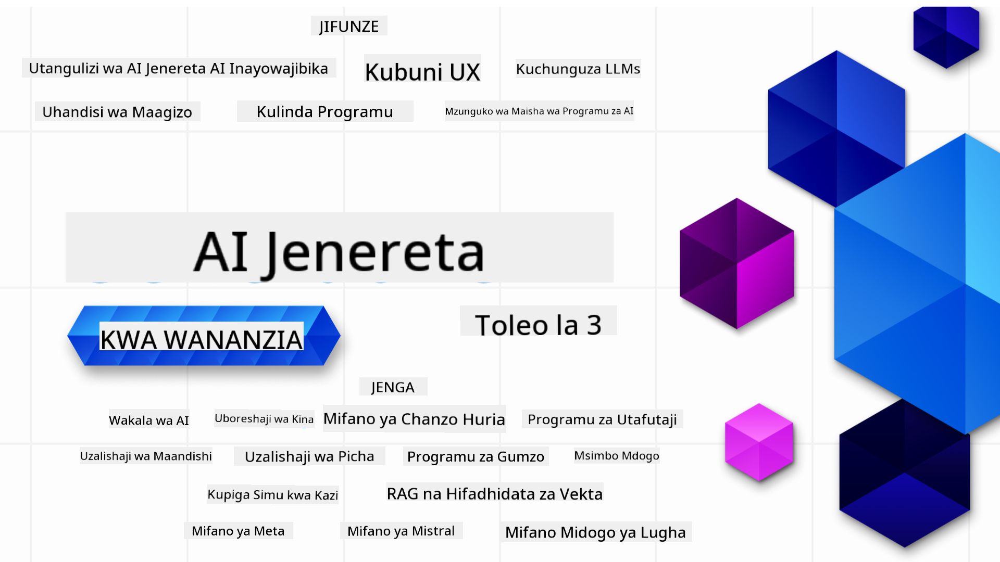

<!--
CO_OP_TRANSLATOR_METADATA:
{
  "original_hash": "3371380dfb4e3ac288036c36fff84eeb",
  "translation_date": "2025-08-25T12:00:29+00:00",
  "source_file": "README.md",
  "language_code": "sw"
}
-->

### Somo 21 zinazoeleza kila kitu unachohitaji kujua ili kuanza kujenga programu za Generative AI

### 🌐 Usaidizi wa Lugha Nyingi

#### Inasaidiwa kupitia GitHub Action (Inafanywa Moja kwa Moja & Inasasishwa Kila Wakati)

[French](../fr/README.md) | [Spanish](../es/README.md) | [German](../de/README.md) | [Russian](../ru/README.md) | [Arabic](../ar/README.md) | [Persian (Farsi)](../fa/README.md) | [Urdu](../ur/README.md) | [Chinese (Simplified)](../zh/README.md) | [Chinese (Traditional, Macau)](../mo/README.md) | [Chinese (Traditional, Hong Kong)](../hk/README.md) | [Chinese (Traditional, Taiwan)](../tw/README.md) | [Japanese](../ja/README.md) | [Korean](../ko/README.md) | [Hindi](../hi/README.md) | [Bengali](../bn/README.md) | [Marathi](../mr/README.md) | [Nepali](../ne/README.md) | [Punjabi (Gurmukhi)](../pa/README.md) | [Portuguese (Portugal)](../pt/README.md) | [Portuguese (Brazil)](../br/README.md) | [Italian](../it/README.md) | [Lithuanian](../lt/README.md) | [Polish](../pl/README.md) | [Turkish](../tr/README.md) | [Greek](../el/README.md) | [Thai](../th/README.md) | [Swedish](../sv/README.md) | [Danish](../da/README.md) | [Norwegian](../no/README.md) | [Finnish](../fi/README.md) | [Dutch](../nl/README.md) | [Hebrew](../he/README.md) | [Vietnamese](../vi/README.md) | [Indonesian](../id/README.md) | [Malay](../ms/README.md) | [Tagalog (Filipino)](../tl/README.md) | [Swahili](./README.md) | [Hungarian](../hu/README.md) | [Czech](../cs/README.md) | [Slovak](../sk/README.md) | [Romanian](../ro/README.md) | [Bulgarian](../bg/README.md) | [Serbian (Cyrillic)](../sr/README.md) | [Croatian](../hr/README.md) | [Slovenian](../sl/README.md) | [Ukrainian](../uk/README.md) | [Burmese (Myanmar)](../my/README.md)

# Generative AI kwa Anayeanza (Toleo la 3) - Kozi

Jifunze misingi ya kujenga programu za Generative AI kupitia kozi yetu ya somo 21 iliyoandaliwa na Microsoft Cloud Advocates.

## 🌱 Kuanza

Kozi hii ina somo 21. Kila somo lina mada yake, hivyo unaweza kuanza popote unapopenda!

Masomo yamegawanywa katika aina mbili: "Learn" ambayo inaeleza dhana ya Generative AI, na "Build" ambayo inaeleza dhana na mifano ya msimbo kwa **Python** na **TypeScript** inapowezekana.

Kwa watengenezaji wa .NET angalia [Generative AI for Beginners (.NET Edition)](https://github.com/microsoft/Generative-AI-for-beginners-dotnet?WT.mc_id=academic-105485-koreyst)!

Kila somo pia lina sehemu ya "Keep Learning" yenye nyenzo za ziada za kujifunza.

## Unachohitaji
### Ili kuendesha msimbo wa kozi hii, unaweza kutumia mojawapo ya: 
 - [Azure OpenAI Service](https://aka.ms/genai-beginners/azure-open-ai?WT.mc_id=academic-105485-koreyst) - **Masomo:** "aoai-assignment"
 - [GitHub Marketplace Model Catalog](https://aka.ms/genai-beginners/gh-models?WT.mc_id=academic-105485-koreyst) - **Masomo:** "githubmodels"
 - [OpenAI API](https://aka.ms/genai-beginners/open-ai?WT.mc_id=academic-105485-koreyst) - **Masomo:** "oai-assignment" 
   
- Ujuzi wa msingi wa Python au TypeScript utasaidia - \*Kwa wanaoanza kabisa angalia kozi hizi za [Python](https://aka.ms/genai-beginners/python?WT.mc_id=academic-105485-koreyst) na [TypeScript](https://aka.ms/genai-beginners/typescript?WT.mc_id=academic-105485-koreyst)
- Akaunti ya GitHub ili [kuiga repo hii yote](https://aka.ms/genai-beginners/github?WT.mc_id=academic-105485-koreyst) kwenye akaunti yako ya GitHub

Tumeandaa somo la **[Course Setup](./00-course-setup/README.md?WT.mc_id=academic-105485-koreyst)** kukusaidia kuandaa mazingira yako ya maendeleo.

Usisahau [kuweka nyota (🌟) kwenye repo hii](https://docs.github.com/en/get-started/exploring-projects-on-github/saving-repositories-with-stars?WT.mc_id=academic-105485-koreyst) ili iwe rahisi kuipata baadaye.

## 🧠 Tayari kwa Kutuma?

Kama unatafuta mifano ya msimbo ya juu zaidi, angalia [mkusanyiko wa Mifano ya Msimbo ya Generative AI](https://aka.ms/genai-beg-code?WT.mc_id=academic-105485-koreyst) kwa **Python** na **TypeScript**.

## 🗣️ Kutana na Wanafunzi Wengine, Pata Msaada

Jiunge na [server rasmi ya Azure AI Foundry Discord](https://aka.ms/genai-discord?WT.mc_id=academic-105485-koreyst) kukutana na kujenga mtandao na wanafunzi wengine wa kozi hii na kupata msaada.

Uliza maswali au toa maoni kuhusu bidhaa kwenye [Azure AI Foundry Developer Forum](https://aka.ms/azureaifoundry/forum) kwenye Github.

## 🚀 Unataka Kujenga Startup?

Tembelea [Microsoft for Startups](https://www.microsoft.com/startups) kujua jinsi ya kuanza kujenga kwa kutumia mikopo ya Azure leo.

## 🙏 Unataka Kuchangia?

Una mapendekezo au umeona makosa ya tahajia au msimbo? [Fungua issue](https://github.com/microsoft/generative-ai-for-beginners/issues?WT.mc_id=academic-105485-koreyst) au [Tengeneza pull request](https://github.com/microsoft/generative-ai-for-beginners/pulls?WT.mc_id=academic-105485-koreyst)

## 📂 Kila somo linajumuisha:

- Utangulizi mfupi wa video kuhusu mada husika
- Somo lililoandikwa kwenye README
- Mifano ya msimbo wa Python na TypeScript inayosaidia Azure OpenAI na OpenAI API
- Viungo vya nyenzo za ziada ili kuendelea kujifunza

## 🗃️ Masomo

| #   | **Kiungo cha Somo**                                                                                                                              | **Maelezo**                                                                                 | **Video**                                                                   | **Nyenzo za Kujifunza Zaidi**                                                             |
| --- | -------------------------------------------------------------------------------------------------------------------------------------------- | ----------------------------------------------------------------------------------------------- | --------------------------------------------------------------------------- | ------------------------------------------------------------------------------ |
| 00  | [Course Setup](./00-course-setup/README.md?WT.mc_id=academic-105485-koreyst)                                                                 | **Jifunze:** Jinsi ya Kuandaa Mazingira Yako ya Maendeleo                                            | Video Inakuja Hivi Karibuni                                                                 | [Jifunze Zaidi](https://aka.ms/genai-collection?WT.mc_id=academic-105485-koreyst) |
| 01  | [Utangulizi wa Generative AI na LLMs](./01-introduction-to-genai/README.md?WT.mc_id=academic-105485-koreyst)                              | **Jifunze:** Elewa Generative AI ni nini na jinsi Large Language Models (LLMs) zinavyofanya kazi.       | [Video](https://aka.ms/gen-ai-lesson-1-gh?WT.mc_id=academic-105485-koreyst) | [Jifunze Zaidi](https://aka.ms/genai-collection?WT.mc_id=academic-105485-koreyst) |
| 02  | [Kuchunguza na kulinganisha LLMs tofauti](./02-exploring-and-comparing-different-llms/README.md?WT.mc_id=academic-105485-koreyst)             | **Jifunze:** Jinsi ya kuchagua modeli sahihi kwa matumizi yako                                      | [Video](https://aka.ms/gen-ai-lesson2-gh?WT.mc_id=academic-105485-koreyst)  | [Jifunze Zaidi](https://aka.ms/genai-collection?WT.mc_id=academic-105485-koreyst) |
| 03  | [Kutumia Generative AI kwa Uwajibikaji](./03-using-generative-ai-responsibly/README.md?WT.mc_id=academic-105485-koreyst)                           | **Jifunze:** Jinsi ya kujenga programu za Generative AI kwa uwajibikaji                                  | [Video](https://aka.ms/gen-ai-lesson3-gh?WT.mc_id=academic-105485-koreyst)  | [Jifunze Zaidi](https://aka.ms/genai-collection?WT.mc_id=academic-105485-koreyst) |
| 04  | [Kuelewa Misingi ya Prompt Engineering](./04-prompt-engineering-fundamentals/README.md?WT.mc_id=academic-105485-koreyst)             | **Jifunze:** Mazoezi ya vitendo ya mbinu bora za Prompt Engineering                                           | [Video](https://aka.ms/gen-ai-lesson4-gh?WT.mc_id=academic-105485-koreyst)  | [Jifunze Zaidi](https://aka.ms/genai-collection?WT.mc_id=academic-105485-koreyst) |
| 05  | [Kuunda Prompt za Juu](./05-advanced-prompts/README.md?WT.mc_id=academic-105485-koreyst)                                                | **Jifunze:** Jinsi ya kutumia mbinu za prompt engineering zinazoboreshwa matokeo ya prompt zako. | [Video](https://aka.ms/gen-ai-lesson5-gh?WT.mc_id=academic-105485-koreyst)  | [Jifunze Zaidi](https://aka.ms/genai-collection?WT.mc_id=academic-105485-koreyst) |
| 06  | [Kutengeneza Programu za Uzalishaji wa Maandishi](./06-text-generation-apps/README.md?WT.mc_id=academic-105485-koreyst)                                | **Jenga:** Programu ya kuzalisha maandishi kwa kutumia Azure OpenAI / OpenAI API                                | [Video](https://aka.ms/gen-ai-lesson6-gh?WT.mc_id=academic-105485-koreyst)  | [Jifunze Zaidi](https://aka.ms/genai-collection?WT.mc_id=academic-105485-koreyst) |
| 07  | [Kutengeneza Programu za Gumzo](./07-building-chat-applications/README.md?WT.mc_id=academic-105485-koreyst)                                     | **Jenga:** Mbinu za kutengeneza na kuunganisha programu za gumzo kwa ufanisi.               | [Video](https://aka.ms/gen-ai-lessons7-gh?WT.mc_id=academic-105485-koreyst) | [Jifunze Zaidi](https://aka.ms/genai-collection?WT.mc_id=academic-105485-koreyst) |
| 08  | [Kutengeneza Programu za Utafutaji kwa Kutumia Vector Databases](./08-building-search-applications/README.md?WT.mc_id=academic-105485-koreyst)                        | **Jenga:** Programu ya utafutaji inayotumia Embeddings kutafuta data.                        | [Video](https://aka.ms/gen-ai-lesson8-gh?WT.mc_id=academic-105485-koreyst)  | [Jifunze Zaidi](https://aka.ms/genai-collection?WT.mc_id=academic-105485-koreyst) |
| 09  | [Kutengeneza Programu za Uzalishaji wa Picha](./09-building-image-applications/README.md?WT.mc_id=academic-105485-koreyst)                        | **Jenga:** Programu ya kuzalisha picha                                                       | [Video](https://aka.ms/gen-ai-lesson9-gh?WT.mc_id=academic-105485-koreyst)  | [Jifunze Zaidi](https://aka.ms/genai-collection?WT.mc_id=academic-105485-koreyst) |
| 10  | [Kutengeneza Programu za AI kwa Kutumia Low Code](./10-building-low-code-ai-applications/README.md?WT.mc_id=academic-105485-koreyst)                       | **Jenga:** Programu ya Generative AI kwa kutumia zana za Low Code                                     | [Video](https://aka.ms/gen-ai-lesson10-gh?WT.mc_id=academic-105485-koreyst) | [Jifunze Zaidi](https://aka.ms/genai-collection?WT.mc_id=academic-105485-koreyst) |
| 11  | [Kuunganisha Programu za Nje kwa Kutumia Function Calling](./11-integrating-with-function-calling/README.md?WT.mc_id=academic-105485-koreyst) | **Jenga:** Function calling ni nini na matumizi yake kwenye programu                          | [Video](https://aka.ms/gen-ai-lesson11-gh?WT.mc_id=academic-105485-koreyst) | [Jifunze Zaidi](https://aka.ms/genai-collection?WT.mc_id=academic-105485-koreyst) |
| 12  | [Kubuni UX kwa Programu za AI](./12-designing-ux-for-ai-applications/README.md?WT.mc_id=academic-105485-koreyst)                         | **Jifunze:** Jinsi ya kutumia kanuni za UX wakati wa kutengeneza Programu za Generative AI         | [Video](https://aka.ms/gen-ai-lesson12-gh?WT.mc_id=academic-105485-koreyst) | [Jifunze Zaidi](https://aka.ms/genai-collection?WT.mc_id=academic-105485-koreyst) |
| 13  | [Kulinda Programu Zako za Generative AI](./13-securing-ai-applications/README.md?WT.mc_id=academic-105485-koreyst)                         | **Jifunze:** Vitisho na hatari kwa mifumo ya AI na mbinu za kuzilinda.             | [Video](https://aka.ms/gen-ai-lesson13-gh?WT.mc_id=academic-105485-koreyst) | [Jifunze Zaidi](https://aka.ms/genai-collection?WT.mc_id=academic-105485-koreyst) |
| 14  | [Mzunguko wa Maisha wa Programu za Generative AI](./14-the-generative-ai-application-lifecycle/README.md?WT.mc_id=academic-105485-koreyst)           | **Jifunze:** Zana na vipimo vya kusimamia LLM Lifecycle na LLMOps                         | [Video](https://aka.ms/gen-ai-lesson14-gh?WT.mc_id=academic-105485-koreyst) | [Jifunze Zaidi](https://aka.ms/genai-collection?WT.mc_id=academic-105485-koreyst) |
| 15  | [Retrieval Augmented Generation (RAG) na Vector Databases](./15-rag-and-vector-databases/README.md?WT.mc_id=academic-105485-koreyst)        | **Jenga:** Programu inayotumia RAG Framework kupata embeddings kutoka Vector Databases  | [Video](https://aka.ms/gen-ai-lesson15-gh?WT.mc_id=academic-105485-koreyst) | [Jifunze Zaidi](https://aka.ms/genai-collection?WT.mc_id=academic-105485-koreyst) |
| 16  | [Mifano ya Open Source na Hugging Face](./16-open-source-models/README.md?WT.mc_id=academic-105485-koreyst)                                    | **Jenga:** Programu inayotumia mifano ya open source inayopatikana kwenye Hugging Face                    | [Video](https://aka.ms/gen-ai-lesson16-gh?WT.mc_id=academic-105485-koreyst) | [Jifunze Zaidi](https://aka.ms/genai-collection?WT.mc_id=academic-105485-koreyst) |
| 17  | [AI Agents](./17-ai-agents/README.md?WT.mc_id=academic-105485-koreyst)                                                                       | **Jenga:** Programu inayotumia AI Agent Framework                                           | [Video](https://aka.ms/gen-ai-lesson17-gh?WT.mc_id=academic-105485-koreyst) | [Jifunze Zaidi](https://aka.ms/genai-collection?WT.mc_id=academic-105485-koreyst) |
| 18  | [Fine-Tuning LLMs](./18-fine-tuning/README.md?WT.mc_id=academic-105485-koreyst)                                                              | **Jifunze:** Maana, umuhimu na jinsi ya kufanya fine-tuning kwa LLMs                                            | [Video](https://aka.ms/gen-ai-lesson18-gh?WT.mc_id=academic-105485-koreyst) | [Jifunze Zaidi](https://aka.ms/genai-collection?WT.mc_id=academic-105485-koreyst) |
| 19  | [Kutengeneza kwa kutumia SLMs](./19-slm/README.md?WT.mc_id=academic-105485-koreyst)                                                              | **Jifunze:** Faida za kutengeneza kwa kutumia Small Language Models                                            | Video Inakuja Hivi Karibuni | [Jifunze Zaidi](https://aka.ms/genai-collection?WT.mc_id=academic-105485-koreyst) |
| 20  | [Kutengeneza kwa kutumia Mifano ya Mistral](./20-mistral/README.md?WT.mc_id=academic-105485-koreyst)                                                              | **Jifunze:** Sifa na tofauti za Mistral Family Models                                           | Video Inakuja Hivi Karibuni | [Jifunze Zaidi](https://aka.ms/genai-collection?WT.mc_id=academic-105485-koreyst) |
| 21  | [Kutengeneza kwa kutumia Mifano ya Meta](./21-meta/README.md?WT.mc_id=academic-105485-koreyst)                                                              | **Jifunze:** Sifa na tofauti za Meta Family Models                                           | Video Inakuja Hivi Karibuni | [Jifunze Zaidi](https://aka.ms/genai-collection?WT.mc_id=academic-105485-koreyst) |

### 🌟 Shukrani Maalum

Shukrani za pekee kwa [**John Aziz**](https://www.linkedin.com/in/john0isaac/) kwa kuunda GitHub Actions na workflows zote

[**Bernhard Merkle**](https://www.linkedin.com/in/bernhard-merkle-738b73/) kwa kutoa mchango muhimu kwenye kila somo ili kuboresha uzoefu wa mwanafunzi na wa msimbo.

## 🎒 Kozi Nyingine

Timu yetu hutengeneza kozi nyingine pia! Angalia:

- [**MPYA** Model Context Protocol kwa Kompyuta](https://github.com/microsoft/mcp-for-beginners?WT.mc_id=academic-105485-koreyst)
- [AI Agents kwa Kompyuta](https://github.com/microsoft/ai-agents-for-beginners?WT.mc_id=academic-105485-koreyst)
- [Generative AI kwa Kompyuta kwa kutumia .NET](https://github.com/microsoft/Generative-AI-for-beginners-dotnet?WT.mc_id=academic-105485-koreyst)
- [Generative AI kwa Kompyuta kwa kutumia JavaScript](https://aka.ms/genai-js-course?WT.mc_id=academic-105485-koreyst)
- [Generative AI kwa Kompyuta kwa kutumia Java](https://aka.ms/genaijava?WT.mc_id=academic-105485-koreyst)
- [ML kwa Kompyuta](https://aka.ms/ml-beginners?WT.mc_id=academic-105485-koreyst)
- [Data Science kwa Kompyuta](https://aka.ms/datascience-beginners?WT.mc_id=academic-105485-koreyst)
- [AI kwa Kompyuta](https://aka.ms/ai-beginners?WT.mc_id=academic-105485-koreyst)
- [Cybersecurity kwa Kompyuta](https://github.com/microsoft/Security-101??WT.mc_id=academic-96948-sayoung)
- [Web Dev kwa Kompyuta](https://aka.ms/webdev-beginners?WT.mc_id=academic-105485-koreyst)
- [IoT kwa Kompyuta](https://aka.ms/iot-beginners?WT.mc_id=academic-105485-koreyst)
- [XR Development kwa Kompyuta](https://github.com/microsoft/xr-development-for-beginners?WT.mc_id=academic-105485-koreyst)
- [Kumudu GitHub Copilot kwa AI Paired Programming](https://aka.ms/GitHubCopilotAI?WT.mc_id=academic-105485-koreyst)
- [Kumudu GitHub Copilot kwa Watengenezaji wa C#/.NET](https://github.com/microsoft/mastering-github-copilot-for-dotnet-csharp-developers?WT.mc_id=academic-105485-koreyst)
- [Chagua Adventure Yako ya Copilot](https://github.com/microsoft/CopilotAdventures?WT.mc_id=academic-105485-koreyst)

---

**Kanusho**:  
Hati hii imetafsiriwa kwa kutumia huduma ya kutafsiri ya AI [Co-op Translator](https://github.com/Azure/co-op-translator). Ingawa tunajitahidi kuhakikisha usahihi, tafadhali fahamu kwamba tafsiri za kiotomatiki zinaweza kuwa na makosa au kutokuwa sahihi. Hati asili katika lugha yake ya asili inapaswa kuchukuliwa kama chanzo cha mamlaka. Kwa taarifa muhimu, inashauriwa kutumia huduma ya utafsiri wa binadamu wa kitaalamu. Hatutawajibika kwa kutoelewana au tafsiri potofu zinazotokana na matumizi ya tafsiri hii.