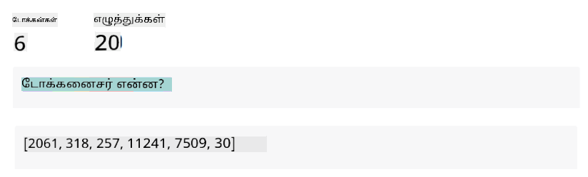
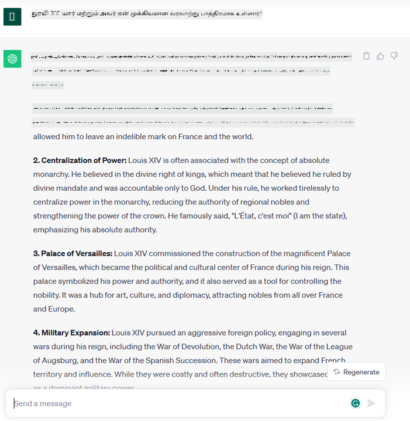
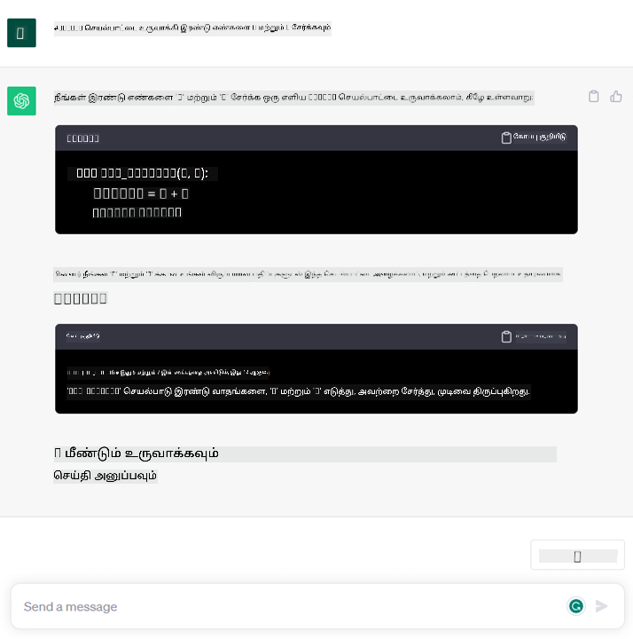

<!--
CO_OP_TRANSLATOR_METADATA:
{
  "original_hash": "bfb7901bdbece1ba3e9f35c400ca33e8",
  "translation_date": "2025-10-18T02:43:47+00:00",
  "source_file": "01-introduction-to-genai/README.md",
  "language_code": "ta"
}
-->
# ஜெனரேட்டிவ் AI மற்றும் பெரிய மொழி மாதிரிகள் அறிமுகம்

_(மேலே உள்ள படத்தை கிளிக் செய்து இந்த பாடத்தின் வீடியோவைப் பாருங்கள்)_

ஜெனரேட்டிவ் AI என்பது உரை, படங்கள் மற்றும் பிற வகை உள்ளடக்கங்களை உருவாக்கும் திறன் கொண்ட செயற்கை நுண்ணறிவு. இதை ஒரு அற்புதமான தொழில்நுட்பமாக ஆக்குவது என்னவென்றால், இது AI-யை அனைவருக்கும் எளிதாக பயன்படுத்தக்கூடியதாக மாற்றுகிறது. இயற்கை மொழியில் எழுதப்பட்ட ஒரு வாக்கியத்தைப் போன்று ஒரு உரை உத்தரவைப் பயன்படுத்தி யாரும் இதைப் பயன்படுத்த முடியும். நீங்கள் Java அல்லது SQL போன்ற ஒரு மொழியை கற்றுக்கொள்வதற்குத் தேவையில்லை, உங்கள் மொழியைப் பயன்படுத்தி, நீங்கள் என்ன விரும்புகிறீர்கள் என்பதைச் சொல்லுங்கள், அதற்கான ஒரு பரிந்துரை AI மாதிரியில் இருந்து வெளிவரும். இதற்கான பயன்பாடுகள் மற்றும் தாக்கங்கள் மிகப்பெரியது, நீங்கள் அறிக்கைகளை எழுதலாம் அல்லது புரிந்துகொள்ளலாம், பயன்பாடுகளை எழுதலாம் மற்றும் பலவற்றை சில வினாடிகளில் செய்யலாம்.

இந்த பாடத்திட்டத்தில், எங்கள் ஸ்டார்ட்அப் கல்வி உலகில் புதிய சூழல்களை திறக்க ஜெனரேட்டிவ் AI-யை எவ்வாறு பயன்படுத்துகிறது என்பதை ஆராய்வோம், மேலும் அதன் பயன்பாட்டின் சமூக விளைவுகள் மற்றும் தொழில்நுட்ப வரம்புகளுடன் தொடர்புடைய சவால்களை எவ்வாறு எதிர்கொள்கிறோம் என்பதைப் பார்ப்போம்.

## அறிமுகம்

இந்த பாடத்தில் நாம் கற்கப்போகிறோம்:

- வணிகச் சூழலின் அறிமுகம்: எங்கள் ஸ்டார்ட்அப் யோசனை மற்றும் நோக்கம்.
- ஜெனரேட்டிவ் AI மற்றும் தற்போதைய தொழில்நுட்ப நிலைப்பாட்டை எவ்வாறு அடைந்தோம்.
- பெரிய மொழி மாதிரியின் உள் செயல்பாடு.
- பெரிய மொழி மாதிரிகளின் முக்கிய திறன்கள் மற்றும் நடைமுறை பயன்பாடுகள்.

## கற்றல் இலக்குகள்

இந்த பாடத்தை முடித்த பிறகு, நீங்கள் புரிந்துகொள்வீர்கள்:

- ஜெனரேட்டிவ் AI என்ன மற்றும் பெரிய மொழி மாதிரிகள் எவ்வாறு செயல்படுகின்றன.
- கல்வி சூழல்களை மையமாகக் கொண்டு, பெரிய மொழி மாதிரிகளை பல்வேறு பயன்பாடுகளுக்கு எவ்வாறு பயன்படுத்தலாம்.

## சூழல்: எங்கள் கல்வி ஸ்டார்ட்அப்

ஜெனரேட்டிவ் செயற்கை நுண்ணறிவு (AI) என்பது AI தொழில்நுட்பத்தின் உச்சம், ஒருமுறை சாத்தியமற்றது என்று கருதப்பட்ட எல்லைகளை தள்ளி வைக்கும். ஜெனரேட்டிவ் AI மாதிரிகள் பல திறன்கள் மற்றும் பயன்பாடுகளை கொண்டுள்ளன, ஆனால் இந்த பாடத்திட்டத்திற்காக, இது ஒரு கற்பனை ஸ்டார்ட்அப் மூலம் கல்வியை எவ்வாறு புரட்சிகரமாக மாற்றுகிறது என்பதை ஆராய்வோம். இந்த ஸ்டார்ட்அப்பை _எங்கள் ஸ்டார்ட்அப்_ என்று குறிப்பிடுவோம். எங்கள் ஸ்டார்ட்அப் கல்வி துறையில் செயல்படுகிறது, அதன் தைரியமான நோக்குக்கூற்றாக:

> _கற்றலின் அணுகுமுறையை உலகளாவிய அளவில் மேம்படுத்தி, கல்விக்கு சமமான அணுகுமுறையை உறுதிசெய்து, ஒவ்வொரு கற்றலாளரின் தேவைகளுக்கு ஏற்ப தனிப்பயன் கற்றல் அனுபவங்களை வழங்குதல்_.

எங்கள் ஸ்டார்ட்அப் குழு, இந்த இலக்கை எட்டுவதற்கு, தற்போதைய காலத்தின் மிக சக்திவாய்ந்த கருவிகளில் ஒன்றான பெரிய மொழி மாதிரிகளை (LLMs) பயன்படுத்தாமல் முடியாது என்பதை அறிந்துள்ளது.

ஜெனரேட்டிவ் AI இன்று நாம் கற்றல் மற்றும் கற்பித்தல் முறையை மாற்றும் என்று எதிர்பார்க்கப்படுகிறது, மாணவர்கள் 24 மணி நேரமும் தங்கள் வசதிக்கேற்ப தகவல்களை வழங்கும் மற்றும் உதாரணங்களை வழங்கும் மெய்நிகர் ஆசிரியர்களை பயன்படுத்த முடியும், மேலும் ஆசிரியர்கள் தங்கள் மாணவர்களை மதிப்பீடு செய்யவும் கருத்துகளை வழங்கவும் புதுமையான கருவிகளைப் பயன்படுத்த முடியும்.

முதலில், இந்த பாடத்திட்டத்தில் நாம் பயன்படுத்தப்போகும் சில அடிப்படை கருத்துகள் மற்றும் சொற்களைக் குறிப்பிடுவோம்.

## ஜெனரேட்டிவ் AI எவ்வாறு உருவானது?

ஜெனரேட்டிவ் AI மாதிரிகள் பற்றிய சமீபத்திய அறிவிப்பால் உருவாக்கப்பட்ட அசாதாரணமான _ஹைப்_ இருந்தாலும், இந்த தொழில்நுட்பம் பல தசாப்தங்களாக உருவாக்கப்பட்டு வருகிறது, 60களில் முதல் ஆராய்ச்சி முயற்சிகள் தொடங்கியது. இன்று AI மனித அறிவாற்றல் திறன்களைக் கொண்டுள்ள நிலையில், உரையாடல் போன்றவை [OpenAI ChatGPT](https://openai.com/chatgpt) அல்லது [Bing Chat](https://www.microsoft.com/edge/features/bing-chat?WT.mc_id=academic-105485-koreyst) போன்றவற்றால் காட்டப்படுகிறது, இது Bing உரையாடல்களுக்கு GPT மாதிரியைப் பயன்படுத்துகிறது.

சிறிது பின்னோக்கி செல்வோம், AI-யின் முதல் மாதிரிகள் தட்டச்சு செய்யப்பட்ட சாட்பாட்கள், நிபுணர்களின் குழுவிலிருந்து எடுக்கப்பட்ட அறிவு அடிப்படையை நம்பி, கணினியில் பிரதிநிதித்துவம் பெற்றது. உள்ளீட்டு உரையில் தோன்றும் முக்கிய வார்த்தைகள் மூலம் அறிவு அடிப்படையிலுள்ள பதில்கள் இயக்கப்பட்டன. ஆனால், இந்த அணுகுமுறை, தட்டச்சு செய்யப்பட்ட சாட்பாட்களைப் பயன்படுத்துவது, சரியாக அளவிட முடியாது என்பது விரைவில் தெளிவாகியது.

### AI-க்கு புள்ளியியல் அணுகுமுறை: மெஷின் லெர்னிங்

90களில் உரை பகுப்பாய்வுக்கு புள்ளியியல் அணுகுமுறை பயன்படுத்தப்பட்ட போது ஒரு திருப்புமுனை வந்தது. இது மெஷின் லெர்னிங் எனப்படும் புதிய ஆல்காரிதங்களை உருவாக்க வழிவகுத்தது – இது தரவிலிருந்து முறைமைகளை வெளிப்படையாக நிரலாக்கப்படாமல் கற்றுக்கொள்ளும் திறன் கொண்டது. இந்த அணுகுமுறை இயந்திரங்களுக்கு மனித மொழி புரிந்துகொள்ளும் திறனை ஒத்திசைக்க அனுமதிக்கிறது: ஒரு புள்ளியியல் மாதிரி உரை-லேபல் இணைப்புகளில் பயிற்சி பெறுகிறது, இது செய்தியின் நோக்கத்தை பிரதிநிதித்துவம் செய்யும் முன்கூட்டியே வரையறுக்கப்பட்ட லேபலைக் கொண்டு தெரியாத உள்ளீட்டு உரையை வகைப்படுத்த அனுமதிக்கிறது.

### நரம்பியல் வலைகள் மற்றும் நவீன மெய்நிகர் உதவியாளர்கள்

சமீபத்திய ஆண்டுகளில், பெரிய அளவிலான தரவுகளை மற்றும் சிக்கலான கணக்கீடுகளை கையாளும் திறன் கொண்ட ஹார்ட்வேரின் தொழில்நுட்ப வளர்ச்சி, AI ஆராய்ச்சியில் முன்னேற்றத்தை ஊக்குவித்தது, நரம்பியல் வலைகள் அல்லது ஆழமான கற்றல் ஆல்காரிதங்கள் எனப்படும் மேம்பட்ட மெஷின் லெர்னிங் ஆல்காரிதங்களை உருவாக்க வழிவகுத்தது.

நரம்பியல் வலைகள் (மற்றும் குறிப்பாக மீண்டும் மீண்டும் நிகழும் நரம்பியல் வலைகள் – RNNs) இயற்கை மொழி செயலாக்கத்தை குறிப்பிடத்தக்க அளவில் மேம்படுத்தியது, ஒரு வாக்கியத்தில் ஒரு வார்த்தையின் சூழலின் மதிப்பை மதிப்பீடு செய்து, உரையின் அர்த்தத்தை மேலும் அர்த்தமுள்ள முறையில் பிரதிநிதித்துவம் செய்ய அனுமதித்தது.

இது முதல் தசாப்தத்தில் பிறந்த மெய்நிகர் உதவியாளர்களை இயக்கிய தொழில்நுட்பமாகும், மனித மொழியை விளக்குவதில் மிகவும் திறமையானது, ஒரு தேவையை அடையாளம் காண்கிறது, மேலும் அதை பூர்த்தி செய்ய ஒரு நடவடிக்கையைச் செய்யிறது – முன்கூட்டியே வரையறுக்கப்பட்ட ஸ்கிரிப்ட் மூலம் பதிலளிக்க அல்லது 3வது தரப்பு சேவையைப் பயன்படுத்துவது போன்றவை.

### இன்றைய நிலை, ஜெனரேட்டிவ் AI

இப்போது நாம் ஜெனரேட்டிவ் AI-க்கு வந்துள்ளோம், இது ஆழமான கற்றலின் ஒரு துணை தொகுதியாகக் காணப்படுகிறது.

AI துறையில் பல தசாப்தங்களாக நடந்த ஆராய்ச்சிக்குப் பிறகு, _Transformer_ எனப்படும் புதிய மாதிரி கட்டமைப்பு RNNs-இன் வரம்புகளை மீறியது, உள்ளீடாக மிக நீண்ட உரை வரிசைகளைப் பெற முடியும். Transformers கவன механизмம் அடிப்படையாகக் கொண்டது, மாதிரிக்கு அது பெறும் உள்ளீடுகளுக்கு வெவ்வேறு எடைகளை வழங்க அனுமதிக்கிறது, உரை வரிசையில் அவற்றின் வரிசையைப் பொருட்படுத்தாமல், மிக முக்கியமான தகவல் உள்ள இடத்தில் 'அதிக கவனம் செலுத்துகிறது'.

சமீபத்திய ஜெனரேட்டிவ் AI மாதிரிகள் – பெரிய மொழி மாதிரிகள் (LLMs) என்றும் அழைக்கப்படுகின்றன, ஏனெனில் அவை உரை உள்ளீடுகள் மற்றும் வெளியீடுகளுடன் வேலை செய்கின்றன – உண்மையில் இந்த கட்டமைப்பை அடிப்படையாகக் கொண்டவை. இந்த மாதிரிகள் – புத்தகங்கள், கட்டுரைகள் மற்றும் இணையதளங்கள் போன்ற பல்வேறு மூலங்களிலிருந்து பெரும் அளவிலான லேபல் செய்யப்படாத தரவுகளில் பயிற்சி பெறுகின்றன – பல்வேறு பணிகளுக்கு ஏற்றவாறு தகுதிகொண்டவை மற்றும் மனித மொழியில் படைப்பாற்றலுடன் கூடிய இலக்கண ரீதியாக சரியான உரையை உருவாக்க முடியும் என்பது 흥미க்கத்தக்கது. எனவே, அவை ஒரு உள்ளீட்டு உரையை 'புரிந்துகொள்ளும்' திறனை மிகுந்த அளவில் மேம்படுத்தியதோடு, மனித மொழியில் ஒரு அசல் பதிலை உருவாக்கும் திறனையும் வழங்குகின்றன.

## பெரிய மொழி மாதிரிகள் எவ்வாறு செயல்படுகின்றன?

அடுத்த அத்தியாயத்தில், ஜெனரேட்டிவ் AI மாதிரிகளின் பல்வேறு வகைகளை ஆராயப்போகிறோம், ஆனால் தற்போது, OpenAI GPT (Generative Pre-trained Transformer) மாதிரிகளை மையமாகக் கொண்டு பெரிய மொழி மாதிரிகள் எவ்வாறு செயல்படுகின்றன என்பதைப் பார்ப்போம்.

- **டோக்கனைசர், உரையை எண்களாக மாற்றுதல்**: பெரிய மொழி மாதிரிகள் ஒரு உரையை உள்ளீடாகப் பெற்று, ஒரு உரையை வெளியீடாக உருவாக்குகின்றன. இருப்பினும், புள்ளியியல் மாதிரிகள் என்பதால், அவை உரை வரிசைகளுக்கு மாறாக எண்களுடன் சிறப்பாக வேலை செய்கின்றன. அதனால், மாதிரிக்கு உள்ளீடாக வழங்கப்படும் ஒவ்வொரு உரையும் டோக்கனைசர் மூலம் செயலாக்கப்படுகிறது. டோக்கன் என்பது ஒரு உரை துண்டு – இது மாறுபடும் எழுத்துக்களின் எண்ணிக்கையை கொண்டுள்ளது, எனவே டோக்கனைசரின் முக்கிய பணி உள்ளீட்டை டோக்கன்களின் வரிசையாகப் பிரிப்பதாகும். பின்னர், ஒவ்வொரு டோக்கனும் ஒரு டோக்கன் குறியீட்டுடன் வரைபடமாக்கப்படுகிறது, இது அசல் உரை துண்டின் முழு எண் குறியீடாகும்.

- **வெளியீட்டு டோக்கன்களை கணிக்குதல்**: n டோக்கன்களை உள்ளீடாகக் கொடுத்தால் (ஒரு மாதிரியில் இருந்து மற்றொரு மாதிரிக்கு அதிகபட்ச n மாறுபடுகிறது), மாதிரி ஒரு டோக்கனை வெளியீடாக கணிக்க முடியும். இந்த டோக்கன் அடுத்த முறை முறைமையில் உள்ளீட்டில் சேர்க்கப்படுகிறது, இது ஒரு விரிவாக்கப்பட்ட சாளர முறைமையை இயக்குகிறது, ஒரு பதிலாக ஒரு (அல்லது பல) வாக்கியத்தைப் பெறுவதற்கான சிறந்த பயனர் அனுபவத்தை வழங்குகிறது. இதுதான் காரணம், நீங்கள் ஒருபோதும் ChatGPT-யுடன் விளையாடினால், சில நேரங்களில் அது ஒரு வாக்கியத்தின் நடுவில் நிற்கும் போல் தோன்றும்.

- **தேர்வு செயல்முறை, சாத்தியமான விநியோகம்**: வெளியீட்டு டோக்கன் தற்போதைய உரை வரிசைக்குப் பிறகு நிகழும் சாத்தியக்கூறுகளின் அடிப்படையில் மாதிரியால் தேர்ந்தெடுக்கப்படுகிறது. இது மாதிரி தனது பயிற்சியின் அடிப்படையில் கணக்கிடப்பட்ட அனைத்து சாத்தியமான 'அடுத்த டோக்கன்கள்' மீது சாத்தியக்கூறுகளின் விநியோகத்தை கணிக்கிறது என்பதற்காக. இருப்பினும், சாத்தியக்கூறுகளில் அதிக சாத்தியக்கூறுகளுடன் உள்ள டோக்கன் எப்போதும் தேர்ந்தெடுக்கப்படாது. இந்த தேர்வுக்கு ஒரு அளவிலான சீரற்ற தன்மை சேர்க்கப்பட்டுள்ளது, மாதிரி ஒரு நிர்ணயமற்ற முறையில் செயல்படுவதற்கான வழியை உருவாக்குகிறது - ஒரே உள்ளீட்டிற்காக ஒரே வெளியீட்டை நாம் பெறமாட்டோம். இந்த சீரற்ற தன்மையின் அளவை வெப்பநிலை எனப்படும் ஒரு மாதிரி அளவுருவைப் பயன்படுத்தி சரிசெய்யலாம்.

## எங்கள் ஸ்டார்ட்அப் பெரிய மொழி மாதிரிகளை எவ்வாறு பயன்படுத்த முடியும்?

பெரிய மொழி மாதிரியின் உள் செயல்பாட்டை நன்கு புரிந்துகொண்ட பிறகு, அவை மிகவும் சாதாரணமாக செய்யக்கூடிய பொதுவான பணிகளின் சில நடைமுறை உதாரணங்களைப் பார்ப்போம், எங்கள் வணிகச் சூழலை மையமாகக் கொண்டு. பெரிய மொழி மாதிரியின் முக்கிய திறன் _இயற்கை மொழியில் எழுதப்பட்ட ஒரு உரை உள்ளீட்டிலிருந்து, முற்றிலும் புதிய ஒரு உரையை உருவாக்குதல்_.

ஆனால் எந்த வகையான உரை உள்ளீடு மற்றும் வெளியீடு?
பெரிய மொழி மாதிரியின் உள்ளீடு _prompt_ என அழைக்கப்படுகிறது, வெளியீடு _completion_ என அழைக்கப்படுகிறது, இது தற்போதைய உள்ளீட்டை முடிக்க அடுத்த டோக்கனை உருவாக்கும் மாதிரி செயல்முறையை குறிக்கிறது. ஒரு prompt என்ன என்பதைப் பற்றி மேலும் ஆராய்ந்து, எங்கள் மாதிரியில் இருந்து அதிகபட்சம் பெறுவதற்கான வழியை வடிவமைப்பது எப்படி என்பதைப் பார்ப்போம். ஆனால் தற்போது, ஒரு prompt அடங்கும்:

- **வழிகாட்டுதல்**: மாதிரியில் இருந்து எவ்வகையான வெளியீட்டை எதிர்பார்க்கிறோம் என்பதை குறிப்பிடும் ஒரு வழிகாட்டுதல். இந்த வழிகாட்டுதல் சில நேரங்களில் சில உதாரணங்கள் அல்லது கூடுதல் தரவுகளை உள்ளடக்கலாம்.

  1. கட்டுரை, புத்தகம், தயாரிப்பு விமர்சனங்கள் மற்றும் பலவற்றின் சுருக்கம், மேலும் அமைப்பற்ற தரவிலிருந்து தகவல்களை எடுப்பது.
    
    
  
  2. ஒரு கட்டுரை, ஒரு கட்டுரை, ஒரு பணிக்கட்டளை அல்லது மேலும் பலவற்றின் படைப்பாற்றல் யோசனை மற்றும் வடிவமைப்பு.
      
     

- **கேள்வி**: ஒரு முகவரியுடன் உரையாடல் வடிவத்தில் கேட்கப்பட்டது.
  
  

- **முடிக்க வேண்டிய உரை துண்டு**: இது ஒரு எழுத்து உதவியை கேட்கும் ஒரு மறைமுக கேள்வியாகும்.
  
  

- **குறியீட்டு துண்டு**: இது குறியீட்டை விளக்கவும் ஆவணப்படுத்தவும் கேட்கிறது, அல்லது ஒரு குறிப்பிட்ட பணியைச் செய்யும் ஒரு குறியீட்டு துண்டை உருவாக்க ஒரு கருத்துரையை கேட்கிறது.
  
  

மேற்கண்ட உதாரணங்கள் மிகவும் எளிமையானவை மற்றும் பெரிய மொழி மாதிரிகளின் திறன்களை முழுமையாக விளக்குவதற்க intended அல்ல. அவை குறிப்பாக கல்வி சூழல்களை மட்டுமல்லாமல், ஜெனரேட்டிவ் AI-யை பயன்படுத்துவதற்கான சாத்தியங்களை காட்டுவதற்க intended.

மேலும், ஜெனரேட்டிவ் AI மாதிரியின் வெளியீடு முழுமையானதாக இருக்காது, சில நேரங்களில் மாதிரியின் படைப்பாற்றல் அதன் எதிர்மறை விளைவாக செயல்படலாம், இது மனித பயனர் உண்மையை தவறாக புரிந்துகொள்ளும் வார்த்தைகளின் கலவையாக முடிவடையலாம், அல்லது அது அவமதிக்கும் வகையில் இருக்கலாம். ஜெனரேட்டிவ் AI புத்திசாலி அல்ல - குறைந்தபட்சம் முழுமையான அறிவாற்றல், விமர்சன மற்றும் படைப்பாற்றல் சிந்தனை அல்லது உணர்ச்சி அறிவாற்றல் ஆகியவற்றின் வரையறையை உள்ளடக்கியதாக அல்ல; இது நிர்ணயமற்றது, மேலும் இது நம்பகமானதல்ல, ஏனெனில் தவறான குறிப்புகள், உள்ளடக்கம் மற்றும் அறிக்கைகள் சரியான தகவலுடன் சேர்க்கப்பட்டு, ஒரு நம்பகமான மற்றும் நம்பகமான முறையில் வழங்கப்படலாம். அடுத்த பாடங்களில், இந்த எல்லைகளை நாங்கள் கையாளுவோம், மேலும் அவற்ற
Lesson 2-க்கு செல்லுங்கள், அங்கு நாம் [விவசாயம் மற்றும் பல்வேறு LLM வகைகளை ஒப்பிடுவது](../02-exploring-and-comparing-different-llms/README.md?WT.mc_id=academic-105485-koreyst) எப்படி என்பதை பார்க்கப் போகிறோம்!

---

**புறக்கணிப்பு**:  
இந்த ஆவணம் AI மொழிபெயர்ப்பு சேவை [Co-op Translator](https://github.com/Azure/co-op-translator) பயன்படுத்தி மொழிபெயர்க்கப்பட்டுள்ளது. நாங்கள் துல்லியத்திற்காக முயற்சிக்கிறோம், ஆனால் தானியங்கி மொழிபெயர்ப்புகளில் பிழைகள் அல்லது தவறுகள் இருக்கக்கூடும் என்பதை கவனத்தில் கொள்ளவும். அதன் தாய்மொழியில் உள்ள மூல ஆவணம் அதிகாரப்பூர்வ ஆதாரமாக கருதப்பட வேண்டும். முக்கியமான தகவல்களுக்கு, தொழில்முறை மனித மொழிபெயர்ப்பு பரிந்துரைக்கப்படுகிறது. இந்த மொழிபெயர்ப்பைப் பயன்படுத்துவதால் ஏற்படும் எந்த தவறான புரிதல்கள் அல்லது தவறான விளக்கங்களுக்கு நாங்கள் பொறுப்பல்ல.