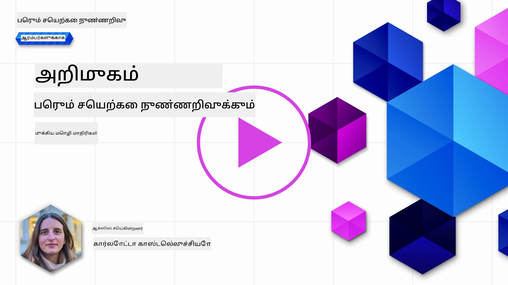
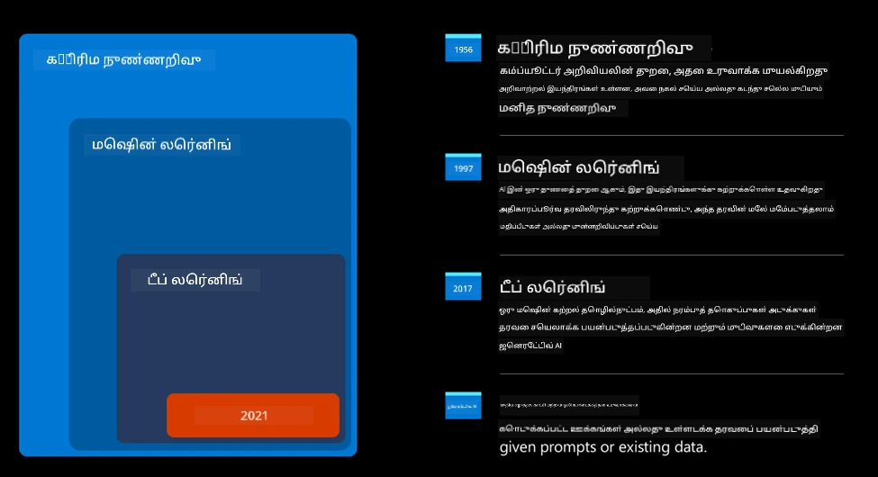
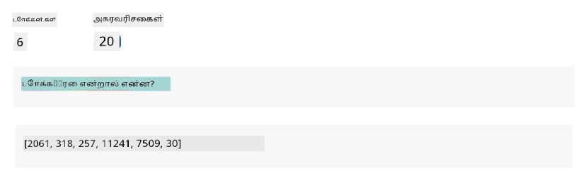
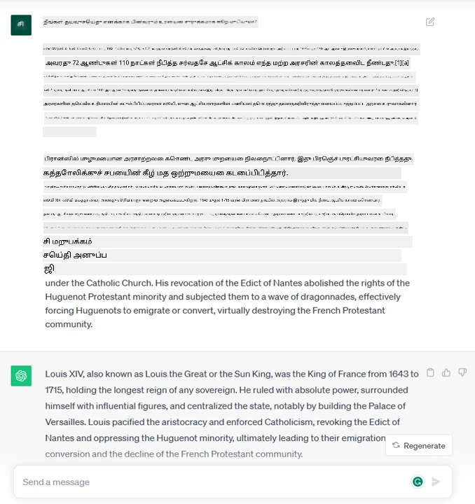
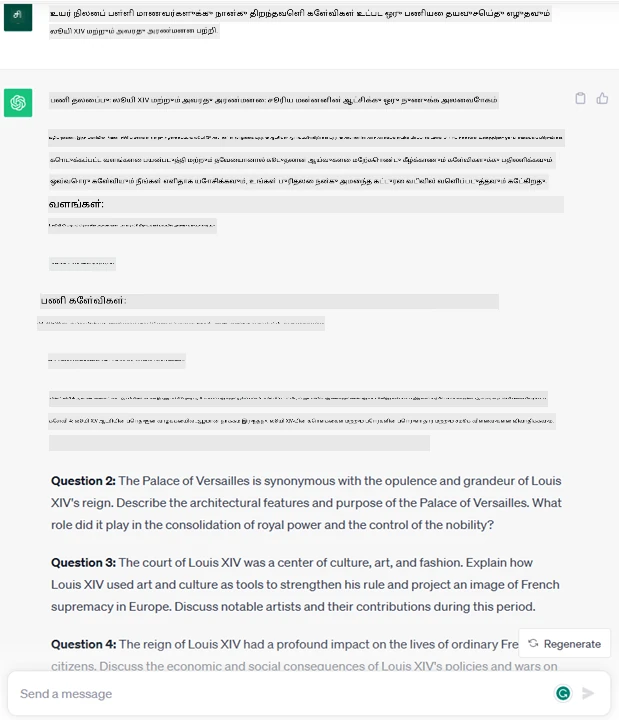
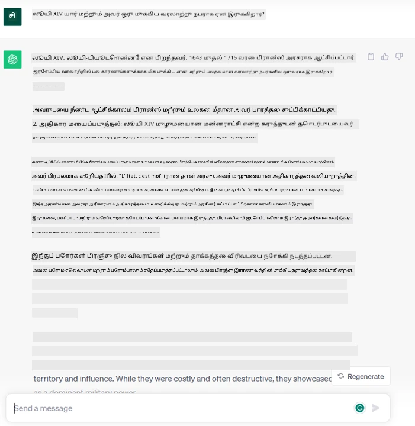
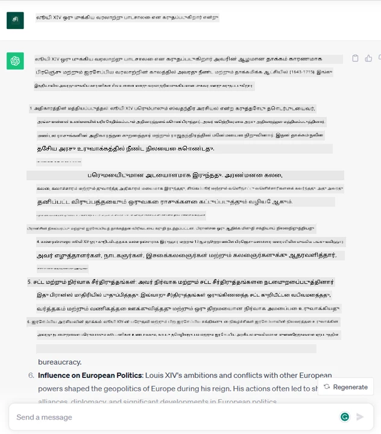
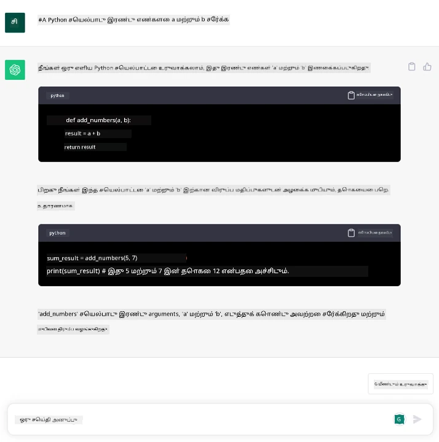

# உருவாக்கும் AI மற்றும் பெரிய மொழி மாதிரிகளுக்கான அறிமுகம்

_(இந்த பாடத்தின் வீடியோவைப் பார்க்க மேலே உள்ள படத்தை கிளிக் செய்யவும்)_

உருவாக்கும் AI என்பது உரை, படங்கள் மற்றும் பிற வகையான உள்ளடக்கங்களை உருவாக்க இயலும் செயற்கை நுண்ணறிவு ஆகும். இதனை ஒரு அற்புதமான தொழில்நுட்பமாக மாற்றுவது என்னவென்றால், இது AI யை ஜனநாயகப்படுத்துகிறது, மிகக் குறைந்த ஒரு உரை வழிகாட்டி, இயற்கை மொழியில் எழுதப்பட்ட ஒரு வாக்கியம் கொண்டு யாரும் இதை பயன்படுத்த முடியும். வார்த்தையாக Java அல்லது SQL போன்ற மொழியை கற்றுக்கொள்ள தேவையில்லை; நீங்கள் உங்கள் மொழியைப் பயன்படுத்தி, என்ன விரும்புகிறீர்கள் என்று கூறினால், AI மாதிரியிடமிருந்து ஒரு பரிந்துரை வரும். இதன் பயன்பாடுகள் மற்றும் தாக்கம் மிகப்பெரியது, நீங்கள் அறிக்கைகள் எழுத அல்லது புரிந்துகொள்ள, விண்ணப்பங்களை எழுத மற்றும் பலவற்றை சில வினாடிகளில் செய்ய முடியும்.

இந்த பாடத்திட்டத்தில், நமது ஸ்டார்ட்-அப் உருவாக்கும் AI-வை பள்ளிப் பொது உலகில் புதிய சூழல்களை திறப்பதற்காக எப்படி பயன்படுத்துகிறது மற்றும் அதன் பயன்பாட்டின் சமூக விளைவுகள் மற்றும் தொழில்நுட்ப வரம்புகளை எவ்வாறு எதிர்கொள்கின்றது என்பதைக் கற்றுக்கொள்ளப்போகிறோம்.

## அறிமுகம்

இந்த பாடத்தில் இடம்பெறும் விஷயங்கள்:

- வணிக சூழலை அறிமுகம்: நமது ஸ்டார்ட்-அப் யோசனை மற்றும் நோக்கம்.
- உருவாக்கும் AI மற்றும் தற்போதைய தொழில்நுட்ப சூழலை எப்படிப் புரிந்துகொண்டோம்.
- பெரிய மொழி மாதிரியின் உள் வேலைப்பாடு.
- பெரிய மொழி மாதிரிகளின் முக்கிய திறன்கள் மற்றும் நடைமுறையான பயன்பாடுகள்.

## கற்றல் இலக்குகள்

இந்த பாடத்தை முடித்த பிறகு, நீங்கள் புரிந்துகொள்ளுவீர்கள்:

- உருவாக்கும் AI என்பது என்ன மற்றும் பெரிய மொழி மாதிரிகள் எப்படி செயல்படுகின்றன.
- பல்வேறு பயன்பாடுகளில் பெரிய மொழி மாதிரிகளை எவ்வாறு பயன்படுத்துவது, கல்விச் சூழல்களோடு தொடர்பு கொண்டு.

## சூழல்: நமது கல்வி ஸ்டார்ட்-அப்

உருவாக்கும் செயற்கை நுண்ணறிவு (AI) என்பது AI தொழில்நுட்பத்தின் உச்சி, எல்லைகளை கடந்த ஒரு சாதனம். உருவாக்கும் AI மாதிரிகளுக்கு பல திறன்கள் மற்றும் பயன்பாடுகள் உள்ளன, ஆனால் இந்த பாடத்திட்டத்தில் வளர்ச்சிப் பள்ளியில் இது எப்படி புரட்சிகரமாக உள்ளது என்பதை ஒரு கற்பனையாளர் ஸ்டார்ட்-அப்பாக பார்ப்போம். நாங்கள் இந்த ஸ்டார்ட்-அப்பை _நமது ஸ்டார்ட்-அப்_ என்று அழைப்போம். நமது ஸ்டார்ட்-அப் கல்வி துறையில் பணியாற்றுகிறது மற்றும் 

> _கல்வியில் அணுகலை மேம்படுத்துவது, உலகளாவிய அளவில், சமத்துவமான கல்வி அணுகலை உறுதி செய்வது மற்றும் ஒவ்வொரு கற்றலாருக்கும் அவர்களுடைய தேவைகளுக்கு ஏற்ப தனிப்பட்ட கற்றல் அனுபவங்களை வழங்குவது_ என்ற புறக்கணிக்க முடியாத நோக்கத்துடன் செயல்படுகிறது.

நமது ஸ்டார்ட்-அப் குழு, நவீன காலத்தின் சக்திவாய்ந்த கருவிகளில் ஒன்றான பெரிய மொழி மாதிரிகள் (LLMs) இல்லாமல் இந்த இலக்கை அடைய முடியாது என்பதை அறிவது முக்கியம்.

உருவாக்கும் AI இன்று நமது கற்றலும் கற்பிப்பும் நாடகம் புரட்சிகரமாக மாற்றும் என்று எதிர்பார்க்கப்படுகிறது, மாணவர்களுக்கு 24 மணி நேரம் பயங்கரவாத ஆசிரியர்கள் இருப்பர், அவர்கள் அதிக அளவு தகவல்கள் மற்றும் உதாரணங்கள் தருவர், ஆசிரியர்கள் மாணவர்களை மதிப்பாய்வு செய்யவும் பின்னூட்டம் வழங்கவும் புதுமையான கருவிகளைப் பயன்படுத்த முடியும்.

தொடங்க, பாடத்திட்டத்தில் பயன்படுத்தவேண்டிய சில அடிப்படை கருத்துக்களை மற்றும் சொல்லாடலை வரையறுக்கலாம்.

## உருவாக்கும் AI எப்போது வந்தது?

புதிய உருவாக்கும் AI மாதிரிகளின் அறிவிப்பு சமீபத்தில் ஏற்பட்ட பெரும் _பிரச்சாரம்_ இருந்தாலும், இந்த தொழில்நுட்பம் பல தசாப்தங்களாக உருவாகி வருகிறது, முதன்மை ஆராய்ச்சி பணிகள் 60களில் தொடங்கியது. மனித ஆழ அறிவாற்றல் கொண்ட AIயுடன் நாங்கள் இன்று இருக்கிறோம், உரையாடல் போன்ற திறன்கள் உதாரணமாக [OpenAI ChatGPT](https://openai.com/chatgpt) அல்லது [Bing Chat](https://www.microsoft.com/edge/features/bing-chat?WT.mc_id=academic-105485-koreyst) போன்றவற்றில் காணலாம், இவை இணைய தேடல் மற்றும் உரையாடல்களுக்கு GPT மாதிரியையும் பயன்படுத்துகின்றன.

குறிப்பாக, முதலில் AI ஆவணமாக அச்சிடப்பட்ட டைப் எழுதப்பட்ட சாட்போட்டுகள், வல்லுநர்களில் இருந்து சேகரிக்கப்பட்ட அறிவுத்தளவரிசையை பயன்படுத்தியது, கீவேர்டுகளை அடிப்படையாகக் கொண்டு பதில்கள் கொடுக்கும் வகையிலானவை. ஆனால் இவ்விதமான முறைகள் விரிவாக்கத்திற்கு ஏற்றதாக இல்லை என்பது வெளிப்படைத்தான்.

### AI யின் புள்ளியியல் முறையை: இயந்திர கற்றல்

90களில் ஒரு மாறுதலான கட்டமாக புள்ளியியல் வேறுபாட்டை உரை பகுப்பாய்வில் பயன்படுத்தப்பட்டது. இதனால் இயந்திர கற்றல் என்ற புதிய அல்கோரிதம்கள் உருவாக்கப்பட்டன, அவை தரவுகளிலிருந்து முன்நிலைமற்ற வகையிலும் முறை படுத்தாமல் கற்றுக் கொள்ள இயலும். இந்த முறையால் இயந்திரங்கள் மனித மொழி புரிதலை 模拟 செய்ய முடிந்தது: ஒரு புள்ளியியல் மாதிரி உரை-லேபிள் ஜோடிகளின் அடிப்படையில் பயிற்சி பெற்று, தெரியாத உள்ளீட்டு உரையை அதற்கான நோக்கத்தை பிரதிபலிக்கும் ஒரு முன்கூட்டிய லேபிளுடன் வகுப்புசெய்ய முடியும்.

### நரம்பியல் வலைப்பிணையங்கள் மற்றும் நவீன மெய்நிகர் உதவியாளர்கள்

சமீப வருடங்களில், அதிக தரவு மற்றும் சிக்கலான கணக்கீடுகளை கையாளும் ஹார்ட்வேர் முன்னேற்றம், நரம்பியல் வலைப்பிணையங்கள் அல்லது ஆழ்ந்த கற்றல் வடிவிலான முன்னேற்றமான இயந்திரக் கற்றல் அல்கோரிதம்கள் வடிவமைப்பை ஊக்குவித்தது.

நரம்பியல் வலைப்பிணையங்கள் (சுலபமாக பருவ பேர்நரம்பியல் வலைப்பிணையங்கள் – RNNகள்) இயற்கை மொழி செயலாக்கத்தை மேம்படுத்தியது, ஒரு வார்த்தையின் பொருளை அதன் வாக்கியச் சுற்றுப்புறத்தில் மதிப்பீடு செய்ய உதவியது.

இது புதிய நூற்றாண்டின் முதல் பத்தாண்டுகளில் பிறந்த மெய்நிகர் உதவியாளர்களுக்கு சக்திவாய்ந்த தொழில்நுட்பமாக அமைந்தது; மனித மொழியை நன்கு இன்டர்பிரெட் செய்து, தேவையை அடையாளம் காண, அதனை பூர்த்தி செய்ய நடவடிக்கை எடுக்க முடிந்தது – முன்கூட்டிச் செய்யப்பட்ட உரையுடன் பதிலளிப்பது அல்லது மூன்றாம் தரப்பு சேவையை பயன்படுத்துதல் போன்றவை.

### இன்றைய நாள், உருவாக்கும் AI

இந்நிலையில் உருவாக்கும் AI வரும் வரை ஆழ்ந்த கற்றலின் ஒரு துணைப் பகுதியாக பார்க்கலாம்.

AI துறையில் பல தசாப்தங்கள் ஆய்வு முடிந்துடன், _டிரான்ஸ்ஃபார்மர்_ என்ற புதிய மாதிரி வடிவமைப்பு RNNகளின் வரம்புகளை கடந்து, அதிக உரை தொடர்களை உள்ளீடாக பெற முடியும். டிரான்ஸ்ஃபார்மர்கள் கவன முறைமையை அடிப்படையாகக் கொண்டு, பிரதிபலிக்கப்பட வேண்டிய முக்கிய தகவல்களுக்கு தனி பொறுப்பு வைக்க முடியும், அதில் தொடர் வரிசையின் அடிப்படையில் மதிப்பிடப்படுவதில்லை.

பெரிய மொழி மாதிரிகள் (LLMs) என்று அழைக்கப்படும் சமீபத்திய உருவாக்கும் AI மாதிரிகள் பெரும்பாலும் இந்தக் கட்டமைப்பை அடிப்படையாகக் கொண்டவை. இவை புத்தகங்கள், கட்டுரைகள் மற்றும் வலைத்தளங்கள் போன்ற பல்வேறு ஆதாரங்களில் இருந்து எடுக்கப்பட்ட பெரும் அளவிலான குறியிடப்படாத தரவு ஒருங்கிணைக்கப்பட்டு பயிற்சி பெறப்பட்டவை. இதனால் பல்வேறு பணிகளுக்கு பொருந்தும் முறையில் முன்னோடித் திறன் கொண்ட, இலக்கண ரீதியாக சரியான மற்றும் கொஞ்சம் படைப்பாற்றல் பொருந்திய உரையை உருவாக்கும் திறன் உள்ளன. எனவே, இயந்திரம் ஒரு உள்ளீடு உரையை 'புரிந்து கொள்வதில்' மிக அதிக திறன்மிக்கதல்லாமல், மனித மொழியில் ஒரு மூல பதில் உருவாக்கும் திறனையும் பெற்றுள்ளன.

## பெரிய மொழி மாதிரிகள் எப்படி செயல்படுகின்றன?

அடுத்த அத்தியாயத்தில் பல வகையான உருவாக்கும் AI மாதிரிகளை ஆய்வு செய்யப்போகிறோம், ஆனால் இப்போது பெரிய மொழி மாதிரிகள் எப்படி செயல்படுகின்றன என்பதை OpenAI GPT (உருவாக்கும் முந்தைய பயிற்சி பெற்ற டிரான்ஸ்ஃபார்மர்) மாதிரிகள் வழியாக பார்ப்போம்.

- **டோக்கனைசர், உரையை எண்களாக மாற்றுதல்**: பெரிய மொழி மாதிரிகள் உள்ளீடாக ஒரு உரையைப் பெற்று வெளிப்படையாக உரையை உருவாக்குகின்றன. ஆனால், புள்ளியியல் மாதிரிகள் என்பதால், எண்கள் மூலம் வேலை செய்வதில் சிறந்தவை. அதனால், மாதிரிக்கு அனுப்பப்படும் ஒவ்வொரு உள்ளீடுtexts டோக்கனைசர் கொண்டு செயலாக்கப்படுகின்றது. ஒரு டோக்கன் என்பது ஒரு உரை துண்டு – மாறும் உரைப்பriority எண்ணிக்கையுடன்; டோக்கனைசர் தரப்பட்ட உள்ளீட்டை ஒரு டோக்கன் வரிசையாகப் பிரிக்கிறது. பிறகு, ஒவ்வொரு டோக்கனும் ஒரு டோக்கன் குறியீட்டுடன் பொருந்துகிறது, அது அந்த உரை துண்டின் முழுக் குறியீடு.

- **வெளியீடு டோக்கன்களை கணித்து ஆட்சி**: n டோக்கன்களை உள்ளீடாக கொண்டபோது (அதன் அதிகபட்ச n மாதிரிக்கு மாறுபடும்), மாதிரி ஒரு டோக்கனை வெளியீடாக கணிக்க முடியும். இந்த டோக்கன் அடுத்த சுற்றுலாவின் உள்ளீட்டில் சேர்க்கப்படுகிறது, இது விரிவடையும் சாளர மாதிரிதான், இதனால் விளைவாக ஒருதொகுப்பு (அல்லது பல) வாக்கியங்களை பெற்றுக்கொள்ள முடியும். அதனால், நீங்கள் ChatGPT ஐ பயன்படுத்தியிருந்தால், அது சில நேரங்களில் வாக்கியத்தின் நடுத்தரத்தில் நிற்கும் போல் தோன்றும் என்பதை கவனித்திருப்பீர்கள்.

- **தேர்வு நடவடிக்கை, சாத்தியக்கூறு பகிர்வு**: வெளியீட்டு டோக்கன், தற்போதைய உரை தொடருக்குப் பிறகு தோன்றும் சாத்தியக்கூறின் அடிப்படையில் மாதிரியால் தேர்ந்தெடுக்கப்படுகிறது. மாதிரி பயிற்சிப்பட்டது அடிப்படையில் அனைத்து சாத்தியமான அடுத்த டோக்கன்களின் சாத்தியக்கூறு பகிர்வை கணிக்கிறது. ஆனாலும், சில நேரங்களில் அதிக சாத்தியக்கூறுள்ள டோக்கன் தேர்ந்தெடுக்கப்படாது. சில அளவில் அதிருப்தி (randomness) தேர்வில் சேர்க்கப்படுகிறது, இதனால் மாதிரி முடிவற்ற முறையில் செயல்படுகிறது – அதே உள்ளீட்டிற்கான பதில் எப்போதும் அதே மாதிரி கிடைக்காது. இந்த அதிருப்தி படைப்பாற்றல் எண்ணத்தின் சித்திரத்தை உருவாக்க உதவுகிறது, மற்றும் இது temperature என்ற ஒரு மாதிரி பராமரிப்பின் மூலம் கட்டுப்படுத்தப்படுகிறது.

## நமது ஸ்டார்ட்-அப் பெரிய மொழி மாதிரிகளை எவ்வாறு பயன்படுத்திக் கொள்ள முடியும்?

பெரிய மொழி மாதிரியின் உள்ளார்ந்த செயல்பாட்டைப் புரிந்ததும், நாம் தொழில்நுட்ப சூழலில் அவை சிறப்பாக செய்யக்கூடிய பகுதி பணிகளைப் பார்ப்போம்.
பெரிய மொழி மாதிரியின் முக்கிய திறன் என்பது _இயற்கை மொழியில் எழுதப்பட்ட ஒரு உரையினை முன்னதாக இல்லாத முறையில் உருவாக்குதல்_ ஆகும்.

ஆனால் எந்த வகையான உள்ளீடு மற்றும் வெளியீடு?
பெரிய மொழி மாதிரியின் உள்ளீட்டை 'prompt' என்று அழைக்கின்றனர், மற்றும் வெளியீட்டை 'completion' என்று கூறுகின்றனர், இது தற்போதைய உள்ளீட்டை முழுமை செய்ய அடுத்த டோக்கனை உருவாக்கும் இயந்திர செயல்பாடு. ஒரு prompt என்பது:

- மாதிரியிடமிருந்து எதிர்பார்க்கப்படும் வெளியீட்டின் வகையை குறிப்பிடும் **வழிகாட்டு**. இதில் சில முன்மாதிரிகள் அல்லது கூடுதல் தரவுகள் சேர்க்கப்படலாம்.

  1. கட்டுரையின், புத்தகத்தின், பொருள் விமர்சனங்கள் போன்றவற்றின் சுருக்கம் மற்றும் கட்டமைக்கப்படாத தரவுகளிலிருந்து தகவல் எடுக்கும் செயல்கள்.
    
    
  
  2. கட்டுரை, விவாதம் அல்லது பணியுறுப்பு போன்ற உருவகக் கண்டுபிடிப்பு மற்றும் வடிவமைப்பு.
      
     

- முகவரியுடன் உரையாடல் வடிவில் கேள்வி
  
  

- எழுத்து **முழுமை செய்ய வேண்டிய** துண்டு, இது எழுதுதல் உதவிக்கான கோரிக்கையாகும்.
  
  

- ஒரு **குறியீடு** துண்டுடன் அதனை விளக்குமாறு மற்றும் ஆவணமாக்கவும் கோருதல், அல்லது ஒரு குறிப்பிட்ட பணியை செய்வதற்கான குறியீடு உருவாக்க கேள்வி.
  
  

மேலே உள்ள உதாரணங்கள் மிகவும் எளிமையானவை மற்றும் பெரிய மொழி மாதிரிகளின் திறன்களின் முழுமையான தன்மையை காட்டுவதில்லை. இது உருவாக்கும் AI பயன்படுத்துவதன் திறன்களை காட்டும் நோக்கில் உள்ளது, குறிப்பாக கல்வி சூழல்களில் அல்லாத இடங்களிலும் பொருந்தும்.

மேலும், உருவாக்கும் AI மாதிரியின் வெளியீடு எப்போதும் சரியானதாக இருக்காது; சிலசமயம் மாதிரியின் படைப்பாற்றலும் எதிர்மறையாக இருப்பதற்குக் காரணமாக, நீங்கள் பெற்ற பதில் உண்மையை மறைத்திருப்பதாகவும், அல்லது தீங்காக இருக்கக்கூடியதாகவும் இருக்கும். உருவாக்கும் AI விவேகமற்றது – குறைந்தது அறிவாற்றலின் விசாலமான வரையறையில், அதாவது விமர்சன மற்றும் படைப்பாற்றல் சிந்தனை, உணர்ச்சி அறிவுக்கூட இல்லாது; இது தீர்மானிப்பற்றது, நம்பத்தகுதியற்றது; தவறான மேற்கோள்கள், உள்ளடக்கம் மற்றும் குற்றச்சாட்டுகள் உண்மையான தகவல்களுடன் கலந்துகொண்டு ஆற்றல்மிக்க மற்றும் நம்பத்தகுதியோடு வழங்கப்படக் கூடும். அடுத்த பாடங்களில் இவற்றின் எல்லைகளைக் கவனிப்போம் மற்றும் எதிர்கொள்ள என்ன செய்யலாம் என்பதைக் காண்போம்.

## பணிக்குறிப்பு

[உருவாக்கும் AI](https://en.wikipedia.org/wiki/Generative_artificial_intelligence?WT.mc_id=academic-105485-koreyst) பற்றி மேலும் படித்து, இன்று உருவாக்கும் AI இல்லாத ஒரு புலத்தை இதன் மூலம் எப்படி மாற்ற முடியும் எனக் கண்டறிய முயற்சி செய்யவும். பழைய முறையைவிட புதிய முறையின் தாக்கம் என்னவாக இருக்கும்? நீங்கள் முடியாத ஒன்றை செய்ய முடியுமா அல்லது வேகமாக செயல்படுகிறீர்களா? உங்கள் கனவு AI ஸ்டார்ட்-அப்பை பற்றி 300 வார்த்தைகளில் ஒர் சுருக்கத்தை எழுதுங்கள்; தலைப்புக்கள் “பிரச்சனை”, “நான் AIஐ எப்படி பயன்படுதுகிறேன்”, “தாக்கம்” மற்றும் விருப்பமாக வணிகத் திட்டம் சேர்க்கவும்.

இந்த பணியை செய்திருந்தால், நீங்கள் [Microsoft for Startups Founders Hub](https://www.microsoft.com/startups?WT.mc_id=academic-105485-koreyst) இல் விண்ணப்பிக்க கூட தயாராக இருக்கலாம்; இங்கே Azure, OpenAI, மேன்டரிங் மற்றும் பலவகை கிரெடிட்கள் வழங்கப்படுகின்றன, பார்க்கவும்!

## அறிவுத்தகவு

பெரிய மொழி மாதிரிகள் பற்றிய உண்மைகள் என்ன?

1. ஒவ்வொரு முறையும் நீங்கள் ஒரே மாதிரி பதிலை பெறுவீர்கள்.
1. அது துல்லியமாக செயல்படுகிறது, எண்கள் கூட்டவும், வேலை செய்யும் குறியீடுகளை தயாரிக்கவும் சிறந்தது.
1. அதே prompt பயன்படுத்தினாலும் பதில் மாறலாம். இது ஒரு முதல் வரைவு அளிப்பதில் சிறந்தது, அது உரையோ குறியீடோ ஆக இருக்கலாம். ஆனால் நீங்கள் நுட்பமாக மேம்படுத்த வேண்டும்.

பதில்: 3, LLM தீர்மானிப்பற்றது; பதில் மாறுபடுகிறது, ஆனால் temperature அமைப்பின் மூலம் அதை கட்டுப்படுத்த முடியும். அது அனைத்தையும் சரியாக செய்யாது, கட்டாயமாகும் கடுமையான பணிகளைவே செய்யும்; நீங்கள் முதலில் சிறந்த முயற்சியைப் பெறுவீர்கள், அதை படிப்படியாக மேம்படுத்த வேண்டும்.

## சிறந்த வேலை! பயணம் தொடரவும்

இந்த பாடத்தை முடித்ததும், நமது [உருவாக்கும் AI கற்றல் தொகுப்பை](https://aka.ms/genai-collection?WT.mc_id=academic-105485-koreyst) பார்க்கவும் உங்கள் உருவாக்கும் AI அறிவை இன்னும் மேம்படுத்தவும்!
பாடம் 2க்கு செல்லுங்கள், அங்கே நாம் எப்படி [வெவ்வேறு LLM வகைகளை ஆராய்ந்து ஒப்பிடுவது](../02-exploring-and-comparing-different-llms/README.md?WT.mc_id=academic-105485-koreyst) என்பதைப் பார்க்கப்போகிறோம்!

---

<!-- CO-OP TRANSLATOR DISCLAIMER START -->
**மறுப்பு**:
இந்த ஆவணம் AI மொழிபெயர்ப்பு சேவை [Co-op Translator](https://github.com/Azure/co-op-translator) பயன்படுத்தி மொழிபெயர்க்கப்பட்டுள்ளது. நாங்கள் துல்லியத்திற்காக முயற்சி செய்துள்ளோம், ஆனால் தானாக செய்யப்படும் மொழிபெயர்ப்புகளில் பிழைகள் அல்லது தவறுகள் இருக்கலாம் என்பதை கவனத்தில் கொள்ளவும். அசல் ஆவணம் அதன் தாய்மொழியில் அதிகாரப்பூர்வ ஆதாரமாக கருதப்பட வேண்டும். முக்கியமான தகவல்களுக்கு, தொழில்நுட்பமான மனித மொழிபெயர்ப்பு பரிந்துரைக்கப்படுகிறது. இந்த மொழிபெயர்ப்பைப் பயன்படுத்துவதால் ஏற்படும் எந்த தவறான புரிதல்கள் அல்லது தவறான விளக்கத்திற்கும் நாங்கள் பொறுப்பில்வில்லை.
<!-- CO-OP TRANSLATOR DISCLAIMER END -->