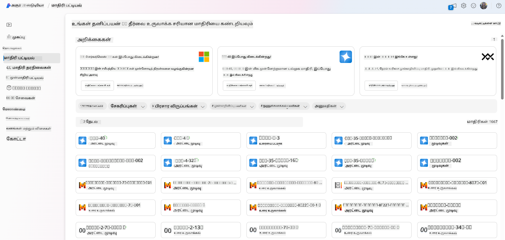
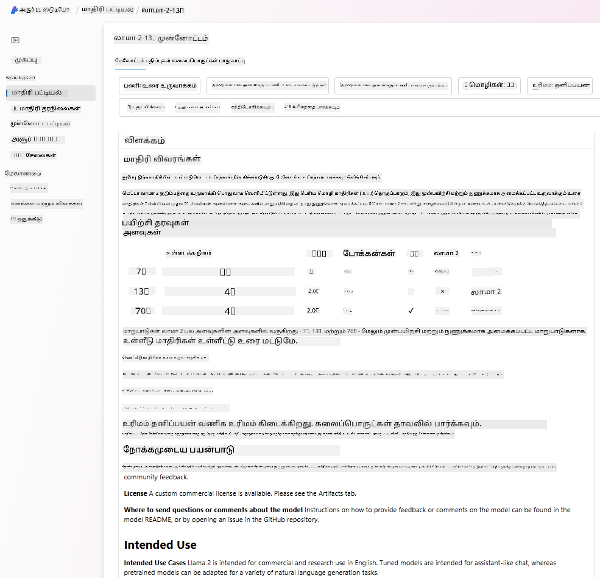
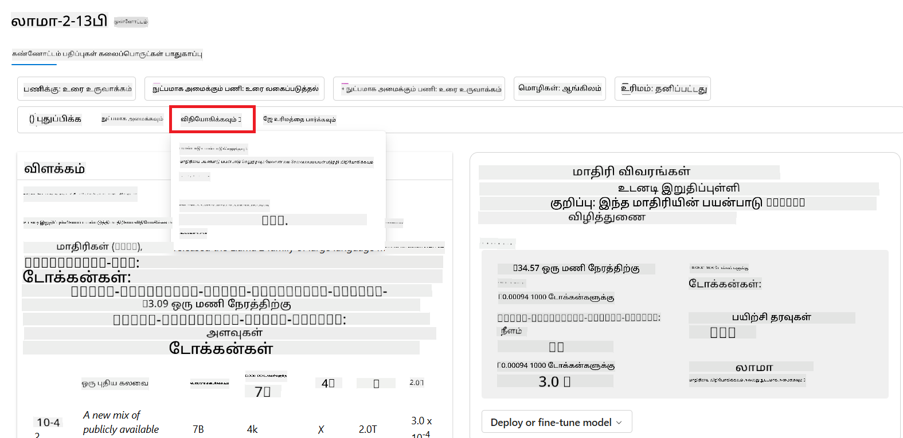
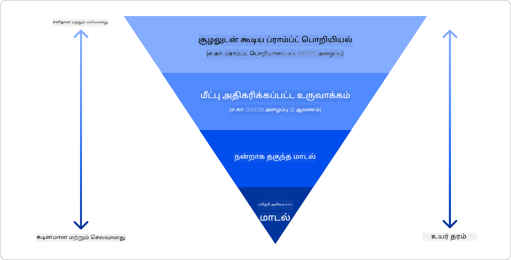

<!--
CO_OP_TRANSLATOR_METADATA:
{
  "original_hash": "e2f686f2eb794941761252ac5e8e090b",
  "translation_date": "2025-10-11T11:47:39+00:00",
  "source_file": "02-exploring-and-comparing-different-llms/README.md",
  "language_code": "ta"
}
-->
# பெரிய மொழி மாதிரிகளை (LLMs) ஆராய்ந்து ஒப்பிடுதல்

> _மேலே உள்ள படத்தை கிளிக் செய்து இந்த பாடத்தின் வீடியோவைப் பாருங்கள்_

முந்தைய பாடத்தில், ஜெனரேட்டிவ் AI தொழில்நுட்பத்தின் காட்சியை எப்படி மாற்றுகிறது, பெரிய மொழி மாதிரிகள் (LLMs) எப்படி செயல்படுகின்றன, மற்றும் எங்கள் ஸ்டார்ட்அப் போன்ற ஒரு வணிகம் அவற்றை தங்கள் பயன்பாடுகளுக்கு எப்படி பயன்படுத்தி வளர முடியும் என்பதைப் பார்த்தோம்! இந்த அத்தியாயத்தில், பெரிய மொழி மாதிரிகளின் (LLMs) பல்வேறு வகைகளை ஒப்பிட்டு, அவற்றின் நன்மைகள் மற்றும் குறைகளை புரிந்துகொள்வதற்காக ஆராய்கிறோம்.

எங்கள் ஸ்டார்ட்அப்பின் அடுத்த கட்டம் தற்போதைய LLMs காட்சியை ஆராய்ந்து, எங்கள் பயன்பாட்டுக்கு ஏற்றவை எவை என்பதைப் புரிந்துகொள்வது.

## அறிமுகம்

இந்த பாடத்தில் நீங்கள் கற்றுக்கொள்ளப் போவது:

- தற்போதைய காட்சியில் உள்ள LLMs இன் பல்வேறு வகைகள்.
- Azure-ல் உங்கள் பயன்பாட்டுக்கான மாதிரிகளை சோதனை செய்து, திருத்தி, ஒப்பிடுதல்.
- LLM ஐ எப்படி வெளியிடுவது.

## கற்றல் இலக்குகள்

இந்த பாடத்தை முடித்த பிறகு, நீங்கள்:

- உங்கள் பயன்பாட்டுக்கான சரியான மாதிரியைத் தேர்ந்தெடுக்க முடியும்.
- உங்கள் மாதிரியின் செயல்திறனை சோதனை செய்து, திருத்தி, மேம்படுத்துவது எப்படி என்பதைப் புரிந்துகொள்ள முடியும்.
- வணிகங்கள் மாதிரிகளை எப்படி வெளியிடுகின்றன என்பதை அறிய முடியும்.

## LLMs இன் பல்வேறு வகைகளைப் புரிந்துகொள்வது

LLMs அதன் கட்டமைப்பு, பயிற்சி தரவுகள் மற்றும் பயன்பாட்டின் அடிப்படையில் பல்வேறு வகைகளாக வகைப்படுத்தப்படலாம். இந்த வேறுபாடுகளைப் புரிந்துகொள்வது எங்கள் ஸ்டார்ட்அப்பிற்கு சரியான மாதிரியைத் தேர்ந்தெடுக்கவும், செயல்திறனை சோதனை செய்து, திருத்தி, மேம்படுத்தவும் உதவுகிறது.

LLMs பல்வேறு வகைகள் உள்ளன, உங்கள் தேர்வு நீங்கள் அவற்றை எதற்காக பயன்படுத்த விரும்புகிறீர்கள், உங்கள் தரவுகள், செலவுகள் போன்றவற்றின் அடிப்படையில் இருக்கும்.

உங்கள் மாதிரிகளை உரை, ஒலி, வீடியோ, பட உருவாக்கம் போன்றவற்றுக்கு பயன்படுத்த விரும்பினால், நீங்கள் வேறுபட்ட வகையான மாதிரியைத் தேர்ந்தெடுக்கலாம்.

- **ஒலி மற்றும் பேச்சு அடையாளம் காணுதல்**. இந்த நோக்கத்திற்காக, Whisper மாதிரிகள் சிறந்த தேர்வாகும். இவை பொதுவான பயன்பாட்டிற்காகவும், பல மொழிகளில் பேச்சு அடையாளம் காணுவதற்காகவும் பயிற்சி அளிக்கப்பட்டுள்ளன. [Whisper மாதிரிகள் பற்றி மேலும் அறிக](https://platform.openai.com/docs/models/whisper?WT.mc_id=academic-105485-koreyst).

- **பட உருவாக்கம்**. பட உருவாக்கத்திற்காக, DALL-E மற்றும் Midjourney மிகவும் பிரபலமான தேர்வுகள். DALL-E Azure OpenAI மூலம் வழங்கப்படுகிறது. [DALL-E பற்றி மேலும் படிக்க](https://platform.openai.com/docs/models/dall-e?WT.mc_id=academic-105485-koreyst) மற்றும் இந்த பாடத்திட்டத்தின் 9வது அத்தியாயத்தில்.

- **உரை உருவாக்கம்**. பெரும்பாலான மாதிரிகள் உரை உருவாக்கத்திற்காக பயிற்சி அளிக்கப்பட்டுள்ளன, மற்றும் GPT-3.5 முதல் GPT-4 வரை பல்வேறு தேர்வுகள் உள்ளன. [Azure OpenAI playground](https://oai.azure.com/portal/playground?WT.mc_id=academic-105485-koreyst) ஐப் பயன்படுத்தி திறன் மற்றும் செலவின் அடிப்படையில் உங்களுக்கு ஏற்ற மாதிரிகளை மதிப்பீடு செய்யலாம்.

- **பலவகைமுகம்**. நீங்கள் உள்ளீடு மற்றும் வெளியீட்டில் பலவகையான தரவுகளை கையாள விரும்பினால், [gpt-4 turbo with vision or gpt-4o](https://learn.microsoft.com/azure/ai-services/openai/concepts/models#gpt-4-and-gpt-4-turbo-models?WT.mc_id=academic-105485-koreyst) போன்ற மாதிரிகளைப் பார்க்கலாம். இவை இயற்கை மொழி செயலாக்கத்தை காட்சியறிவுடன் இணைத்து, பலவகைமுக இடைமுகங்கள் மூலம் தொடர்புகளைச் செய்ய முடியும்.

மாதிரியைத் தேர்ந்தெடுப்பது சில அடிப்படை திறன்களை வழங்குகிறது, ஆனால் அவை போதுமானதாக இருக்காது. பெரும்பாலும், உங்களிடம் நிறுவனத்திற்கே உரிய தரவுகள் இருக்கும், அவற்றை somehow LLM க்கு தெரிவிக்க வேண்டும். இதை அணுகுவதற்கான சில விருப்பங்கள் உள்ளன, அவற்றை அடுத்த பகுதிகளில் காணலாம்.

### Foundation Models மற்றும் LLMs

Foundation Model என்ற சொல் [ஸ்டான்போர்ட் ஆராய்ச்சியாளர்களால் உருவாக்கப்பட்டது](https://arxiv.org/abs/2108.07258?WT.mc_id=academic-105485-koreyst) மற்றும் சில அளவுகோள்களை பின்பற்றும் AI மாதிரியாக வரையறுக்கப்பட்டது:

- **அவை unsupervised learning அல்லது self-supervised learning மூலம் பயிற்சி அளிக்கப்படுகின்றன**, அதாவது அவை லேபிள் செய்யப்படாத பலவகைமுக தரவுகளில் பயிற்சி அளிக்கப்படுகின்றன, மற்றும் அவற்றின் பயிற்சி செயல்முறைக்கு மனிதனின் குறிப்பு அல்லது லேபிள் தேவைப்படாது.
- **அவை மிகவும் பெரிய மாதிரிகள்**, மிக ஆழமான நரம்பு வலைப்பின்னல்களை அடிப்படையாகக் கொண்டவை, பில்லியன் அளவிலான அளவுகோள்களில் பயிற்சி அளிக்கப்படுகின்றன.
- **அவை பொதுவாக மற்ற மாதிரிகளுக்கு 'அடித்தளம்' ஆக சேவை செய்யும் நோக்கத்துடன் உருவாக்கப்படுகின்றன**, அதாவது அவற்றின் மேல் மற்ற மாதிரிகளை உருவாக்க தொடக்கமாக பயன்படுத்தலாம், இது fine-tuning மூலம் செய்யப்படலாம்.

படத்தின் மூலமாக: [Foundation Models மற்றும் LLMs பற்றிய முக்கிய வழிகாட்டி | Babar M Bhatti | Medium](https://thebabar.medium.com/essential-guide-to-foundation-models-and-large-language-models-27dab58f7404)

இந்த வேறுபாட்டை மேலும் தெளிவுபடுத்த, ChatGPT ஐ எடுத்துக்காட்டாக எடுத்துக்கொள்வோம். ChatGPT இன் முதல் பதிப்பை உருவாக்க GPT-3.5 என்ற மாதிரி Foundation Model ஆக செயல்பட்டது. இதன் பொருள், OpenAI சில chat-specific தரவுகளைப் பயன்படுத்தி GPT-3.5 ஐ fine-tune செய்து, chatbot போன்ற உரையாடல் சூழல்களில் சிறப்பாக செயல்படுவதற்காக சிறப்பம்சம் கொண்ட பதிப்பை உருவாக்கியது.

படத்தின் மூலமாக: [2108.07258.pdf (arxiv.org)](https://arxiv.org/pdf/2108.07258.pdf?WT.mc_id=academic-105485-koreyst)

### Open Source மற்றும் Proprietary Models

LLMs ஐ மற்றொரு வகையில் வகைப்படுத்துவது அவை open source அல்லது proprietary என்பதை அடிப்படையாகக் கொண்டது.

Open-source மாதிரிகள் பொதுமக்களுக்கு கிடைக்கின்றன மற்றும் யாராலும் பயன்படுத்தப்படலாம். அவை அவற்றை உருவாக்கிய நிறுவனம் அல்லது ஆராய்ச்சி சமூகத்தால் பொதுவாக வழங்கப்படுகின்றன. இந்த மாதிரிகள் LLMs இல் பல்வேறு பயன்பாடுகளுக்கு மாற்றம் செய்யப்படலாம். ஆனால், அவை உற்பத்தி பயன்பாட்டிற்கு எப்போதும் சிறப்பாக இருக்காது, மற்றும் proprietary மாதிரிகளுக்கு ஒப்பிடும்போது செயல்திறன் குறைவாக இருக்கலாம். மேலும், open-source மாதிரிகளுக்கு நிதி வரம்பு இருக்கலாம், அவை நீண்ட காலத்திற்கு பராமரிக்கப்படாது அல்லது சமீபத்திய ஆராய்ச்சியுடன் புதுப்பிக்கப்படாது. பிரபலமான open-source மாதிரிகளின் உதாரணங்கள் [Alpaca](https://crfm.stanford.edu/2023/03/13/alpaca.html?WT.mc_id=academic-105485-koreyst), [Bloom](https://huggingface.co/bigscience/bloom) மற்றும் [LLaMA](https://llama.meta.com).

Proprietary மாதிரிகள் ஒரு நிறுவனத்தால் உரிமையுடையவை மற்றும் பொதுமக்களுக்கு கிடைக்காது. இந்த மாதிரிகள் உற்பத்தி பயன்பாட்டிற்கு சிறப்பாக உள்ளன. ஆனால், அவற்றை ஆய்வு செய்ய, மாற்றம் செய்ய, அல்லது பல்வேறு பயன்பாடுகளுக்கு தனிப்பயனாக்க அனுமதிக்கப்படாது. மேலும், அவை எப்போதும் இலவசமாக கிடைக்காது, மற்றும் அவற்றைப் பயன்படுத்த சந்தா அல்லது கட்டணம் தேவைப்படலாம். [OpenAI models](https://platform.openai.com/docs/models/overview?WT.mc_id=academic-105485-koreyst), [Google Bard](https://sapling.ai/llm/bard?WT.mc_id=academic-105485-koreyst) அல்லது [Claude 2](https://www.anthropic.com/index/claude-2?WT.mc_id=academic-105485-koreyst) போன்ற பிரபலமான proprietary மாதிரிகளின் உதாரணங்கள்.

### Embedding, Image generation மற்றும் Text மற்றும் Code generation

LLMs ஐ அவை உருவாக்கும் output அடிப்படையில் வகைப்படுத்தலாம்.

Embeddings என்பது உரையை எண் வடிவமாக மாற்றும் மாதிரிகள் தொகுப்பாகும். Embeddings உரை அல்லது வாக்கியங்களின் உறவுகளை புரிந்துகொள்ள எந்திரங்களுக்கு எளிதாக்குகிறது மற்றும் classification மாதிரிகள் அல்லது clustering மாதிரிகள் போன்ற பிற மாதிரிகளால் input ஆக பயன்படுத்தப்படலாம். Embedding மாதிரிகள் transfer learning க்கு பொதுவாக பயன்படுத்தப்படுகின்றன. [OpenAI embeddings](https://platform.openai.com/docs/models/embeddings?WT.mc_id=academic-105485-koreyst) ஒரு உதாரணமாகும்.

Image generation மாதிரிகள் படங்களை உருவாக்கும் மாதிரிகள். [DALL-E-3](https://openai.com/dall-e-3?WT.mc_id=academic-105485-koreyst) மற்றும் [Stable Diffusion models](https://github.com/Stability-AI/StableDiffusion?WT.mc_id=academic-105485-koreyst) போன்றவை உதாரணங்கள்.

Text மற்றும் code generation மாதிரிகள் உரை அல்லது code உருவாக்கும் மாதிரிகள். [CodeParrot](https://huggingface.co/codeparrot?WT.mc_id=academic-105485-koreyst) போன்றவை உதாரணங்கள்.

### Encoder-Decoder மற்றும் Decoder-only

LLMs இன் கட்டமைப்பின் வகைகளைப் பற்றி பேச, ஒரு உவமை பயன்படுத்தலாம்.

உங்கள் மேலாளர் மாணவர்களுக்கான ஒரு quiz எழுத ஒரு பணியை உங்களுக்கு கொடுத்தார் என்று கற்பனை செய்யுங்கள். உங்களிடம் இரண்டு சக ஊழியர்கள் உள்ளனர்; ஒருவர் உள்ளடக்கத்தை உருவாக்குகிறார், மற்றொருவர் அதை மதிப்பீடு செய்கிறார்.

உள்ளடக்கத்தை உருவாக்குபவர் Decoder-only மாதிரியைப் போன்றவர். GPT குடும்ப மாதிரிகள், GPT-3 போன்றவை இதற்கு உதாரணம்.

மதிப்பீடு செய்பவர் Encoder-only மாதிரியைப் போன்றவர். BERT இதற்கு உதாரணமாகும்.

Encoder-Decoder மாதிரி ஒருவரை கற்பனை செய்யலாம், அவர் quiz ஐ உருவாக்கவும் மதிப்பீடு செய்யவும் முடியும். BART மற்றும் T5 இதற்கு உதாரணங்கள்.

### Service மற்றும் Model

Service என்பது Cloud Service Provider வழங்கும் ஒரு தயாரிப்பு, இது பொதுவாக மாதிரிகள், தரவுகள் மற்றும் பிற கூறுகளின் கலவையாக இருக்கும். Model என்பது ஒரு service இன் முக்கிய கூறாகும்.

Service-கள் உற்பத்தி பயன்பாட்டிற்கு சிறப்பாக உள்ளன மற்றும் graphical user interface மூலம் பயன்படுத்த எளிதாக இருக்கும். [Azure OpenAI Service](https://learn.microsoft.com/azure/ai-services/openai/overview?WT.mc_id=academic-105485-koreyst) ஒரு உதாரணமாகும்.

Model-கள் Neural Network மட்டுமே, மற்றும் LLaMA போன்ற மாதிரிகள் computational power தேவைப்படும்.

## Azure-ல் செயல்திறனைப் புரிந்துகொள்ள மாதிரிகளை சோதனை செய்து திருத்துவது

எங்கள் குழு தற்போதைய LLMs காட்சியை ஆராய்ந்து, தங்கள் சூழலுக்கு சில நல்ல தேர்வுகளை அடையாளம் கண்ட பிறகு, அடுத்த கட்டம் அவற்றை தங்கள் தரவிலும் வேலைப்பளுவிலும் சோதனை செய்வது. இது ஒரு iteration செயல்முறை, பரிசோதனைகள் மற்றும் அளவீடுகளால் செய்யப்படுகிறது.
முந்தைய பத்திகளில் குறிப்பிடப்பட்ட மாடல்களில் பெரும்பாலானவை (OpenAI மாடல்கள், Llama2 போன்ற திறந்த மூல மாடல்கள், Hugging Face transformers) [Model Catalog](https://learn.microsoft.com/azure/ai-studio/how-to/model-catalog-overview?WT.mc_id=academic-105485-koreyst) இல் [Azure AI Studio](https://ai.azure.com/?WT.mc_id=academic-105485-koreyst) இல் கிடைக்கின்றன.

[Azure AI Studio](https://learn.microsoft.com/azure/ai-studio/what-is-ai-studio?WT.mc_id=academic-105485-koreyst) என்பது Cloud Platform ஆகும், இது டெவலப்பர்களுக்கு Generative AI பயன்பாடுகளை உருவாக்கவும், முழு மேம்பாட்டு வாழ்க்கைச்சுழற்சியை - பரிசோதனையிலிருந்து மதிப்பீடு வரை - ஒரே இடத்தில் Azure AI சேவைகளை இணைத்து, எளிய GUI மூலம் நிர்வகிக்க உதவுகிறது. Azure AI Studio இல் உள்ள Model Catalog பயனர்களுக்கு கீழ்கண்டவைகளை செய்ய உதவுகிறது:

- கையேட்டில் உள்ள Foundation Model-ஐ தேடுதல் - சொந்தமானது அல்லது திறந்த மூலமானது, task, license, அல்லது name மூலம் வடிகட்டுதல். தேடுதலை எளிதாக்க, மாடல்கள் Azure OpenAI collection, Hugging Face collection போன்ற தொகுப்புகளில் ஒழுங்குபடுத்தப்பட்டுள்ளன.

- மாடல் கார்டை மதிப்பீடு செய்தல், இதில் பயன்படுத்தும் நோக்கம் மற்றும் பயிற்சி தரவின் விரிவான விளக்கம், code samples மற்றும் உள் மதிப்பீட்டு நூலகத்தின் மதிப்பீட்டு முடிவுகள் அடங்கும்.

- தொழில்துறையில் கிடைக்கும் மாடல்கள் மற்றும் தரவுத்தொகுப்புகளின் Benchmarks-ஐ ஒப்பிடுதல், எந்த மாடல் வணிகத் தேவைக்கு பொருந்துமென்று மதிப்பீடு செய்ய [Model Benchmarks](https://learn.microsoft.com/azure/ai-studio/how-to/model-benchmarks?WT.mc_id=academic-105485-koreyst) pane மூலம்.

- மாடல் செயல்திறனை குறிப்பிட்ட workload-இல் மேம்படுத்த, தனிப்பயிற்சி தரவின் மூலம் மாடலை fine-tune செய்தல், Azure AI Studio இன் பரிசோதனை மற்றும் கண்காணிப்பு திறன்களை பயன்படுத்துதல்.

- முதன்மை pre-trained மாடல் அல்லது fine-tuned பதிப்பை தொலைதூர real-time inference - managed compute - அல்லது serverless API endpoint - [pay-as-you-go](https://learn.microsoft.com/azure/ai-studio/how-to/model-catalog-overview#model-deployment-managed-compute-and-serverless-api-pay-as-you-go?WT.mc_id=academic-105485-koreyst) - மூலம் deploy செய்தல், பயன்பாடுகள் அதை பயன்படுத்த அனுமதிக்க.

> [!NOTE]
> கையேட்டில் உள்ள அனைத்து மாடல்களும் தற்போது fine-tuning மற்றும்/அல்லது pay-as-you-go deployment க்கு கிடைக்கவில்லை. மாடலின் திறன்கள் மற்றும் வரம்புகள் பற்றிய விவரங்களை மாடல் கார்டில் சரிபார்க்கவும்.

## LLM முடிவுகளை மேம்படுத்துதல்

நாங்கள் எங்கள் ஸ்டார்ட்அப் குழுவுடன் பல்வேறு LLMகளையும், பல்வேறு மாடல்களை ஒப்பிட, சோதனை தரவுகளில் மதிப்பீடு செய்ய, செயல்திறனை மேம்படுத்த மற்றும் inference endpoints-ல் deploy செய்ய உதவும் Cloud Platform (Azure Machine Learning) ஒன்றையும் ஆராய்ந்தோம்.

ஆனால், pre-trained மாடலை பயன்படுத்துவதற்குப் பதிலாக மாடலை fine-tune செய்ய எப்போது கருத வேண்டும்? குறிப்பிட்ட workload-களில் மாடல் செயல்திறனை மேம்படுத்துவதற்கான பிற அணுகுமுறைகள் உள்ளனவா?

ஒரு வணிகம் LLM மூலம் தேவையான முடிவுகளை பெற பல்வேறு அணுகுமுறைகளை பயன்படுத்தலாம். LLM-ஐ உற்பத்தியில் deploy செய்யும் போது, பயிற்சியின் வெவ்வேறு அளவுகளுடன் மாறுபட்ட மாடல்களைத் தேர்ந்தெடுக்கலாம், இது சிக்கலானது, செலவு மற்றும் தரத்தில் மாறுபடும். சில அணுகுமுறைகள் இங்கே:

- **Prompt engineering with context**. நீங்கள் தேவையான பதில்களைப் பெறுவதற்காக prompt-க்கு போதுமான context-ஐ வழங்குவது முக்கியம்.

- **Retrieval Augmented Generation, RAG**. உங்கள் தரவுகள் ஒரு தரவுத்தொகுப்பில் அல்லது வலை endpoint-இல் இருக்கலாம், உதாரணமாக, இந்த தரவுகள் அல்லது அதன் ஒரு பகுதியை prompt-இல் சேர்க்க, தொடர்புடைய தரவுகளை fetch செய்து பயனரின் prompt-இன் பகுதியாக மாற்றலாம்.

- **Fine-tuned model**. இங்கு, நீங்கள் உங்கள் சொந்த தரவுகளில் மாடலை மேலும் பயிற்சி செய்துள்ளீர்கள், இது மாடலை உங்கள் தேவைகளுக்கு மேலும் துல்லியமாகவும் பதிலளிக்கக்கூடியதாகவும் மாற்றுகிறது, ஆனால் இது செலவாக இருக்கலாம்.

Img source: [Four Ways that Enterprises Deploy LLMs | Fiddler AI Blog](https://www.fiddler.ai/blog/four-ways-that-enterprises-deploy-llms?WT.mc_id=academic-105485-koreyst)

### Prompt Engineering with Context

Pre-trained LLMகள் பொதுவான இயற்கை மொழி பணிகளில் மிகவும் சிறப்பாக செயல்படுகின்றன, அவற்றை ஒரு குறுகிய prompt-இன் மூலம் அழைக்கும் போது கூட, உதாரணமாக ஒரு வாக்கியத்தை முடிக்க அல்லது ஒரு கேள்விக்கு பதிலளிக்க – இதை “zero-shot” learning என அழைக்கின்றனர்.

ஆனால், பயனர் தனது கேள்வியை விரிவாகவும், விரிவான கோரிக்கையுடன் மற்றும் உதாரணங்களுடன் – Context – அமைக்கும்போது, பதில் மேலும் துல்லியமாகவும், பயனரின் எதிர்பார்ப்புகளுக்கு அருகிலுமாகவும் இருக்கும். இந்த வழக்கில், prompt-இல் ஒரு உதாரணம் மட்டுமே உள்ளதெனில் “one-shot” learning எனவும், பல உதாரணங்கள் உள்ளதெனில் “few-shot learning” எனவும் குறிப்பிடுகிறோம். Prompt engineering with context என்பது தொடங்குவதற்கான மிகச் செலவுசெய்யக்கூடிய அணுகுமுறை ஆகும்.

### Retrieval Augmented Generation (RAG)

LLMs-க்கு பயிற்சியின் போது பயன்படுத்தப்பட்ட தரவுகளை மட்டுமே பதிலளிக்க பயன்படுத்த முடியும் என்ற வரம்பு உள்ளது. இதன் பொருள், பயிற்சியின் பின்னர் நடந்த உண்மைகள் பற்றிய எந்த தகவலையும் அவற்றுக்கு தெரியாது, மேலும் அவை தனியார் தகவல்களை (உதாரணமாக நிறுவன தரவுகள்) அணுக முடியாது.
இதை RAG மூலம் சமாளிக்கலாம், இது prompt-ஐ வெளிப்புற தரவுகளால், குறிப்பிட்ட அளவிலான ஆவணங்களின் துண்டுகளால் மேம்படுத்தும் ஒரு தொழில்நுட்பமாகும். இது [Azure Vector Search](https://learn.microsoft.com/azure/search/vector-search-overview?WT.mc_id=academic-105485-koreyst) போன்ற Vector database tools மூலம் ஆதரிக்கப்படுகிறது, இது முன்கூட்டியே வரையறுக்கப்பட்ட தரவூட்டங்களிலிருந்து பயனுள்ள துண்டுகளைத் தேடி prompt Context-இல் சேர்க்கிறது.

இந்த தொழில்நுட்பம் ஒரு வணிகத்திற்கு போதுமான தரவுகள், போதுமான நேரம் அல்லது ஒரு LLM-ஐ fine-tune செய்ய வளங்கள் இல்லாதபோது, குறிப்பிட்ட workload-இல் செயல்திறனை மேம்படுத்தவும், fabrication (உண்மையை மாயம் செய்தல் அல்லது தீங்கு விளைவிக்கும் உள்ளடக்கம்) அபாயங்களை குறைக்கவும் மிகவும் உதவியாக இருக்கும்.

### Fine-tuned model

Fine-tuning என்பது transfer learning-ஐ பயன்படுத்தி மாடலை ஒரு downstream task-க்கு ‘அடாப்ட்’ செய்ய அல்லது ஒரு குறிப்பிட்ட பிரச்சினையைத் தீர்க்கும் ஒரு செயல்முறையாகும். Few-shot learning மற்றும் RAG-க்கு மாறாக, இது ஒரு புதிய மாடல் உருவாக்கப்படுவதற்கு வழிவகுக்கிறது, புதுப்பிக்கப்பட்ட weights மற்றும் biases உடன். இது ஒரு input (prompt) மற்றும் அதனுடன் தொடர்புடைய output (completion) கொண்ட பயிற்சி உதாரணங்களின் தொகுப்பைத் தேவைப்படும்.
இது கீழ்கண்ட சூழல்களில் விருப்பமான அணுகுமுறையாக இருக்கும்:

- **Fine-tuned மாடல்களைப் பயன்படுத்துதல்**. ஒரு வணிகம் குறைந்த திறன் கொண்ட மாடல்களை (embedding models போன்றவை) பயன்படுத்த விரும்புகிறது, இது அதிக செயல்திறன் மாடல்களை விட செலவுசெய்யக்கூடிய மற்றும் வேகமான தீர்வாக இருக்கும்.

- **Latency-ஐ கருத்தில் கொள்ளுதல்**. ஒரு குறிப்பிட்ட use-case-க்கு latency முக்கியமானது, எனவே மிகவும் நீண்ட prompt-களைப் பயன்படுத்த முடியாது அல்லது மாடலால் கற்றுக்கொள்ள வேண்டிய உதாரணங்களின் எண்ணிக்கை prompt length வரம்புடன் பொருந்தாது.

- **தற்போதைய நிலையைப் பின்பற்றுதல்**. ஒரு வணிகத்திற்கு அதிக தரமான தரவுகள் மற்றும் ground truth labels மற்றும் இந்த தரவுகளை காலத்திற்கேற்ப புதுப்பிக்க தேவையான வளங்கள் உள்ளன.

### Trained model

LLM-ஐ முற்றிலுமாக புதிதாக பயிற்சி செய்வது சந்தேகமின்றி மிகவும் கடினமான மற்றும் மிகவும் சிக்கலான அணுகுமுறையாகும், இது மிகப்பெரிய அளவிலான தரவுகள், திறமையான வளங்கள் மற்றும் பொருத்தமான கணினி சக்தியைத் தேவைப்படும். ஒரு வணிகத்திற்கு domain-specific use case மற்றும் domain-centric data ஆகியவற்றின் பெரிய அளவு உள்ள சூழலில் மட்டுமே இந்த விருப்பத்தைப் பரிசீலிக்க வேண்டும்.

## அறிவு சரிபார்ப்பு

LLM completion முடிவுகளை மேம்படுத்த நல்ல அணுகுமுறை என்ன?

1. Prompt engineering with context
1. RAG
1. Fine-tuned model

A:3, உங்களுக்கு நேரமும் வளங்களும் மற்றும் தரமான தரவுகளும் உள்ளனவெனில், fine-tuning தற்போதைய நிலையைப் பின்பற்ற சிறந்த விருப்பமாகும். ஆனால், நீங்கள் விஷயங்களை மேம்படுத்த விரும்புகிறீர்கள் மற்றும் நேரம் குறைவாக உள்ளது என்றால், முதலில் RAG-ஐ பரிசீலிக்கலாம்.

## 🚀 சவால்

உங்கள் வணிகத்திற்காக [RAG-ஐ பயன்படுத்துவது](https://learn.microsoft.com/azure/search/retrieval-augmented-generation-overview?WT.mc_id=academic-105485-koreyst) எப்படி என்பதைப் பற்றி மேலும் படிக்கவும்.

## சிறந்த வேலை, உங்கள் கற்றலை தொடருங்கள்

இந்த பாடத்தை முடித்த பிறகு, [Generative AI Learning collection](https://aka.ms/genai-collection?WT.mc_id=academic-105485-koreyst) ஐப் பாருங்கள், Generative AI பற்றிய உங்கள் அறிவை மேலும் மேம்படுத்த!

Lesson 3-க்கு செல்லுங்கள், அங்கு [Generative AI-ஐ பொறுப்புடன் உருவாக்குவது](../03-using-generative-ai-responsibly/README.md?WT.mc_id=academic-105485-koreyst) எப்படி என்பதைப் பார்ப்போம்!

---

**குறிப்பு**:  
இந்த ஆவணம் [Co-op Translator](https://github.com/Azure/co-op-translator) என்ற AI மொழிபெயர்ப்பு சேவையை பயன்படுத்தி மொழிபெயர்க்கப்பட்டுள்ளது. நாங்கள் துல்லியத்திற்காக முயற்சிக்கின்றோம், ஆனால் தானியங்கி மொழிபெயர்ப்புகளில் பிழைகள் அல்லது தவறான தகவல்கள் இருக்கக்கூடும் என்பதை கவனத்தில் கொள்ளவும். அதன் தாய்மொழியில் உள்ள மூல ஆவணம் அதிகாரப்பூர்வ ஆதாரமாக கருதப்பட வேண்டும். முக்கியமான தகவல்களுக்கு, தொழில்முறை மனித மொழிபெயர்ப்பு பரிந்துரைக்கப்படுகிறது. இந்த மொழிபெயர்ப்பைப் பயன்படுத்துவதால் ஏற்படும் எந்த தவறான புரிதல்கள் அல்லது தவறான விளக்கங்களுக்கு நாங்கள் பொறுப்பல்ல.