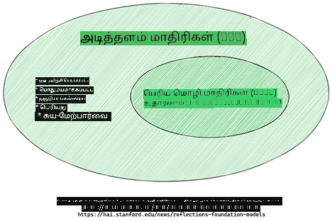
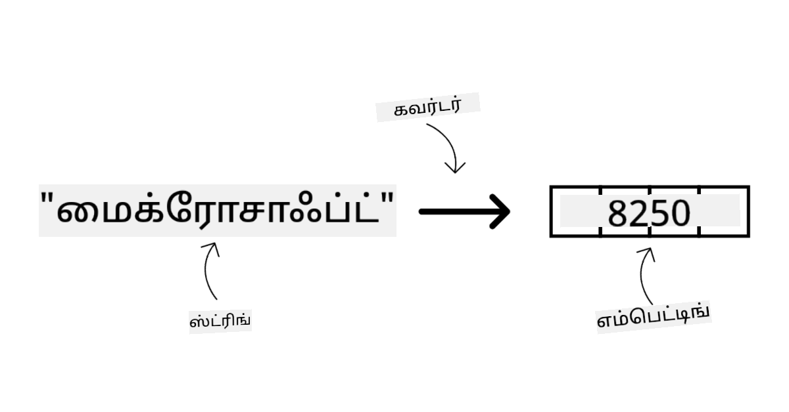
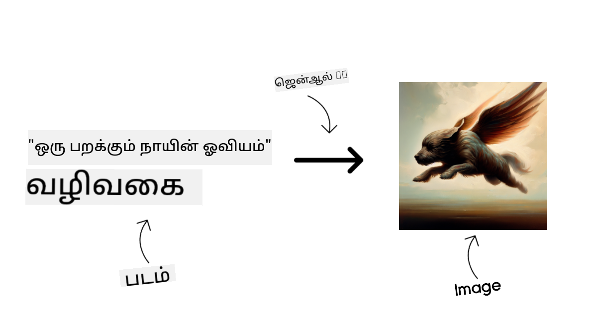

<!--
CO_OP_TRANSLATOR_METADATA:
{
  "original_hash": "6b7629b8ee4d7d874a27213e903d86a7",
  "translation_date": "2025-10-18T02:39:49+00:00",
  "source_file": "02-exploring-and-comparing-different-llms/README.md",
  "language_code": "ta"
}
-->
# வெகுஜன மொழி மாதிரிகளை ஆராய்ந்து ஒப்பிடுதல்

> _மேலே உள்ள படத்தை கிளிக் செய்து இந்த பாடத்தின் வீடியோவைப் பாருங்கள்_

முந்தைய பாடத்தில், ஜெனரேட்டிவ் AI தொழில்நுட்பத்தின் காட்சியை எப்படி மாற்றுகிறது, வெகுஜன மொழி மாதிரிகள் (LLMs) எப்படி செயல்படுகின்றன மற்றும் எங்கள் ஸ்டார்ட்அப் போன்ற ஒரு வணிகம் அவற்றை தங்கள் பயன்பாட்டு வழக்குகளில் பயன்படுத்தி வளர்ச்சியடைய முடியும் என்பதைப் பார்த்தோம்! இந்த அத்தியாயத்தில், வெவ்வேறு வகையான வெகுஜன மொழி மாதிரிகளை (LLMs) ஒப்பிட்டு, அவற்றின் நன்மைகள் மற்றும் குறைகளைப் புரிந்துகொள்வதற்காக ஆராய இருக்கிறோம்.

எங்கள் ஸ்டார்ட்அப்பின் பயணத்தில் அடுத்த படி தற்போதைய LLM காட்சியை ஆராய்ந்து, எது எங்கள் பயன்பாட்டு வழக்கத்திற்கு பொருத்தமானது என்பதைப் புரிந்துகொள்வது.

## அறிமுகம்

இந்த பாடத்தில்:

- தற்போதைய காட்சியில் உள்ள வெவ்வேறு வகையான LLMs.
- Azure-ல் உங்கள் பயன்பாட்டு வழக்கத்திற்கு ஏற்ற மாதிரிகளை சோதனை செய்து, திருத்தி, ஒப்பிடுதல்.
- LLM-ஐ எப்படி வெளியிடுவது.

## கற்றல் இலக்குகள்

இந்த பாடத்தை முடித்த பிறகு, நீங்கள்:

- உங்கள் பயன்பாட்டு வழக்கத்திற்கு சரியான மாதிரியைத் தேர்ந்தெடுக்க முடியும்.
- உங்கள் மாதிரியின் செயல்திறனை சோதனை செய்து, திருத்தி, மேம்படுத்துவது எப்படி என்பதைப் புரிந்துகொள்ள முடியும்.
- வணிகங்கள் மாதிரிகளை எப்படி வெளியிடுகின்றன என்பதை அறிய முடியும்.

## வெவ்வேறு வகையான LLMs-ஐப் புரிந்துகொள்வது

LLMs தங்கள் கட்டமைப்பு, பயிற்சி தரவுகள் மற்றும் பயன்பாட்டு வழக்கின் அடிப்படையில் பல வகைகளாக வகைப்படுத்தப்படலாம். இந்த வேறுபாடுகளைப் புரிந்துகொள்வது எங்கள் ஸ்டார்ட்அப்பிற்கு சரியான மாதிரியைத் தேர்ந்தெடுக்கவும், செயல்திறனை சோதனை செய்து, திருத்தி, மேம்படுத்தவும் உதவும்.

LLM மாதிரிகள் பல வகைகள் உள்ளன, உங்கள் மாதிரியைத் தேர்ந்தெடுப்பது நீங்கள் அவற்றை எதற்காக பயன்படுத்த விரும்புகிறீர்கள், உங்கள் தரவுகள், நீங்கள் செலவிட தயாராக உள்ள அளவு மற்றும் பலவற்றின் அடிப்படையில் இருக்கும்.

நீங்கள் மாதிரிகளை உரை, ஆடியோ, வீடியோ, பட உருவாக்கம் போன்றவற்றிற்காக பயன்படுத்த விரும்புகிறீர்களா என்பதைப் பொறுத்து, நீங்கள் வேறுபட்ட வகையான மாதிரியைத் தேர்ந்தெடுக்கலாம்.

- **ஆடியோ மற்றும் பேச்சு அங்கீகாரம்**. இந்த நோக்கத்திற்காக, Whisper மாதிரிகள் சிறந்த தேர்வாகும், ஏனெனில் அவை பொதுவான நோக்கத்திற்காகவும், பேச்சு அங்கீகாரத்திற்காகவும் உருவாக்கப்பட்டவை. இது பல்வேறு ஆடியோவுகளில் பயிற்சி பெற்றது மற்றும் பன்மொழி பேச்சு அங்கீகாரம் செய்ய முடியும். [Whisper மாதிரிகள் பற்றி மேலும் அறிக](https://platform.openai.com/docs/models/whisper?WT.mc_id=academic-105485-koreyst).

- **பட உருவாக்கம்**. பட உருவாக்கத்திற்காக, DALL-E மற்றும் Midjourney ஆகியவை மிகவும் பிரபலமான தேர்வுகள். DALL-E Azure OpenAI மூலம் வழங்கப்படுகிறது. [DALL-E பற்றி மேலும் படிக்க](https://platform.openai.com/docs/models/dall-e?WT.mc_id=academic-105485-koreyst) மற்றும் இந்த பாடத்திட்டத்தின் 9வது அத்தியாயத்திலும்.

- **உரை உருவாக்கம்**. பெரும்பாலான மாதிரிகள் உரை உருவாக்கத்தில் பயிற்சி பெறுகின்றன, மேலும் GPT-3.5 முதல் GPT-4 வரை பல்வேறு தேர்வுகள் உங்களுக்கு கிடைக்கின்றன. அவை GPT-4 மிகவும் விலையுயர்ந்ததாக இருக்கும். திறன் மற்றும் செலவின் அடிப்படையில் எந்த மாதிரிகள் உங்கள் தேவைகளுக்கு பொருத்தமானவை என்பதை மதிப்பீடு செய்ய [Azure OpenAI playground](https://oai.azure.com/portal/playground?WT.mc_id=academic-105485-koreyst) பற்றி தெரிந்து கொள்ள வேண்டும்.

- **பலவகைமுகம்**. நீங்கள் உள்ளீடு மற்றும் வெளியீட்டில் பல்வேறு வகையான தரவுகளை கையாள விரும்பினால், [gpt-4 turbo with vision or gpt-4o](https://learn.microsoft.com/azure/ai-services/openai/concepts/models#gpt-4-and-gpt-4-turbo-models?WT.mc_id=academic-105485-koreyst) போன்ற மாதிரிகளைப் பார்க்கலாம் - OpenAI மாதிரிகளின் சமீபத்திய வெளியீடுகள் - இயற்கை மொழி செயலாக்கத்தை காட்சித் திறனுடன் இணைத்து, பலவகைமுக இடைமுகங்கள் மூலம் தொடர்புகளை இயக்க முடியும்.

ஒரு மாதிரியைத் தேர்ந்தெடுப்பது சில அடிப்படை திறன்களைப் பெறுவதற்கான வழி, ஆனால் அது போதுமானதாக இருக்காது. பெரும்பாலும் உங்களிடம் நிறுவனத்திற்கே உரிய தரவுகள் இருக்கும், அவற்றை எப்படியாவது LLM-க்கு தெரிவிக்க வேண்டும். அதை அணுகுவதற்கான சில வேறுபட்ட தேர்வுகள் உள்ளன, அடுத்த பகுதிகளில் மேலும் பார்க்கலாம்.

### அடிப்படை மாதிரிகள் மற்றும் LLMs

அடிப்படை மாதிரி என்ற சொல் [ஸ்டான்போர்டு ஆராய்ச்சியாளர்களால் உருவாக்கப்பட்டது](https://arxiv.org/abs/2108.07258?WT.mc_id=academic-105485-koreyst) மற்றும் சில அளவுகோள்களை பின்பற்றும் AI மாதிரியாக வரையறுக்கப்பட்டது, உதாரணமாக:

- **அவை கண்காணிக்கப்படாத கற்றல் அல்லது சுய-கண்காணிக்கப்படும் கற்றல் மூலம் பயிற்சி பெறுகின்றன**, அதாவது அவை லேபிள் செய்யப்படாத பலவகைமுக தரவுகளில் பயிற்சி பெறுகின்றன, மேலும் அவற்றின் பயிற்சி செயல்முறைக்கு மனிதனின் குறிப்பு அல்லது தரவின் லேபிள் தேவையில்லை.
- **அவை மிகவும் பெரிய மாதிரிகள்**, மிக ஆழமான நரம்பியல் வலைப்பின்னல்களில் அடிப்படையாகவும், பில்லியன் அளவிலான அளவுகோள்களில் பயிற்சி பெறுகின்றன.
- **அவை பொதுவாக மற்ற மாதிரிகளுக்கு 'அடிப்படை' ஆக சேவை செய்யும் நோக்கத்துடன் உருவாக்கப்படுகின்றன**, அதாவது அவற்றின் மேல் மற்ற மாதிரிகளை உருவாக்க தொடக்கமாக பயன்படுத்தப்படலாம், இது நன்றாக-தருக்கம் செய்வதன் மூலம் செய்யப்படலாம்.

படத்தின் மூலமாக: [Foundation Models மற்றும் Large Language Models பற்றிய முக்கிய வழிகாட்டி | Babar M Bhatti | Medium](https://thebabar.medium.com/essential-guide-to-foundation-models-and-large-language-models-27dab58f7404)

இந்த வேறுபாட்டை மேலும் தெளிவுபடுத்த, ChatGPT-ஐ எடுத்துக்கொள்வோம். ChatGPT-இன் முதல் பதிப்பை உருவாக்க GPT-3.5 என்ற மாதிரி அடிப்படை மாதிரியாக செயல்பட்டது. இதன் பொருள் OpenAI சில உரையாடல்-சிறப்பு தரவுகளை GPT-3.5-இன் ஒரு சிறப்பம்சமாக உருவாக்கியது, இது உரையாடல் சூழல்களில், chatbot போன்றவற்றில் சிறப்பாக செயல்படுவதில் சிறப்பு பெற்றது.

படத்தின் மூலமாக: [2108.07258.pdf (arxiv.org)](https://arxiv.org/pdf/2108.07258.pdf?WT.mc_id=academic-105485-koreyst)

### திறந்த மூல மாதிரிகள் மற்றும் சொந்த உரிமை கொண்ட மாதிரிகள்

LLMs-ஐ வேறுபடுத்தும் மற்றொரு வழி அவை திறந்த மூலமா அல்லது சொந்த உரிமையா என்பதைப் பொறுத்தது.

திறந்த மூல மாதிரிகள் பொதுமக்களுக்கு கிடைக்கப்படுகின்றன மற்றும் யாராலும் பயன்படுத்தப்படலாம். அவை பொதுவாக அவற்றை உருவாக்கிய நிறுவனம் அல்லது ஆராய்ச்சி சமூகத்தால் கிடைக்கப்படுகின்றன. இந்த மாதிரிகள் LLMs-இல் பல்வேறு பயன்பாட்டு வழக்குகளுக்கு ஆய்வு செய்ய, மாற்ற, மற்றும் தனிப்பயனாக்க அனுமதிக்கின்றன. ஆனால், அவை எப்போதும் உற்பத்தி பயன்பாட்டிற்கு மேம்படுத்தப்படவில்லை, மேலும் சொந்த உரிமை கொண்ட மாதிரிகளுக்கு ஒப்பிடும்போது செயல்திறன் குறைவாக இருக்கலாம். மேலும், திறந்த மூல மாதிரிகளுக்கு நிதி வரம்பு இருக்கலாம், அவை நீண்ட காலத்திற்கு பராமரிக்கப்படாமல் இருக்கலாம் அல்லது சமீபத்திய ஆராய்ச்சியுடன் புதுப்பிக்கப்படாமல் இருக்கலாம். பிரபலமான திறந்த மூல மாதிரிகளின் உதாரணங்கள் [Alpaca](https://crfm.stanford.edu/2023/03/13/alpaca.html?WT.mc_id=academic-105485-koreyst), [Bloom](https://huggingface.co/bigscience/bloom) மற்றும் [LLaMA](https://llama.meta.com).

சொந்த உரிமை கொண்ட மாதிரிகள் ஒரு நிறுவனத்தால் உடையதாகும் மற்றும் பொதுமக்களுக்கு கிடைக்கப்படாது. இந்த மாதிரிகள் பொதுவாக உற்பத்தி பயன்பாட்டிற்கு மேம்படுத்தப்படுகின்றன. ஆனால், அவற்றை ஆய்வு செய்ய, மாற்ற, அல்லது பல்வேறு பயன்பாட்டு வழக்குகளுக்கு தனிப்பயனாக்க அனுமதிக்கப்படாது. மேலும், அவை எப்போதும் இலவசமாக கிடைக்காது, அவற்றைப் பயன்படுத்த சந்தா அல்லது கட்டணம் தேவைப்படலாம். மேலும், பயனர் மாதிரியை பயிற்சி செய்ய பயன்படுத்தப்படும் தரவின் மீது கட்டுப்பாடு இல்லாமல் இருக்கும், இது தரவின் தனியுரிமை மற்றும் AI-ஐ பொறுப்புடன் பயன்படுத்துவதில் உறுதிப்பாட்டை மாதிரி உரிமையாளரிடம் நம்ப வேண்டும். பிரபலமான சொந்த உரிமை கொண்ட மாதிரிகளின் உதாரணங்கள் [OpenAI models](https://platform.openai.com/docs/models/overview?WT.mc_id=academic-105485-koreyst), [Google Bard](https://sapling.ai/llm/bard?WT.mc_id=academic-105485-koreyst) அல்லது [Claude 2](https://www.anthropic.com/index/claude-2?WT.mc_id=academic-105485-koreyst).

### எம்பெட்டிங், பட உருவாக்கம், உரை மற்றும் குறியீடு உருவாக்கம்

LLMs-ஐ அவை உருவாக்கும் வெளியீட்டின் அடிப்படையில் வகைப்படுத்தலாம்.

எம்பெட்டிங்குகள் என்பது உரையை எண் வடிவமாக மாற்றும் மாதிரிகளின் தொகுப்பாகும், இது எண் வடிவத்தில் உள்ள உரையின் பிரதிநிதியாகும். எம்பெட்டிங்குகள் சொற்கள் அல்லது வாக்கியங்களின் இடையிலான உறவுகளை இயந்திரங்கள் புரிந்துகொள்ள எளிதாக்குகின்றன மற்றும் வகைப்படுத்தல் மாதிரிகள் அல்லது எண் தரவுகளில் சிறந்த செயல்திறன் கொண்ட குழும மாதிரிகள் போன்ற பிற மாதிரிகளால் உள்ளீடுகளாக உண்ணப்படலாம். எம்பெட்டிங் மாதிரிகள் பொதுவாக டிரான்ஸ்ஃபர் கற்றலுக்காக பயன்படுத்தப்படுகின்றன, ஒரு மாதிரி தரவின் பரவலான பணிக்காக உருவாக்கப்படுகிறது, பின்னர் மாதிரி எடைகள் (எம்பெட்டிங்குகள்) பிற பணிகளுக்கு மீண்டும் பயன்படுத்தப்படுகின்றன. இந்த வகையின் உதாரணம் [OpenAI embeddings](https://platform.openai.com/docs/models/embeddings?WT.mc_id=academic-105485-koreyst).

பட உருவாக்கம் மாதிரிகள் படங்களை உருவாக்கும் மாதிரிகள். இந்த மாதிரிகள் பொதுவாக பட திருத்தம், பட தொகுப்பு, மற்றும் பட மொழிபெயர்ப்பு ஆகியவற்றிற்காக பயன்படுத்தப்படுகின்றன. பட உருவாக்கம் மாதிரிகள் பொதுவாக [LAION-5B](https://laion.ai/blog/laion-5b/?WT.mc_id=academic-105485-koreyst) போன்ற பெரிய பட தரவுத்தொகுப்புகளில் பயிற்சி பெறுகின்றன, மேலும் புதிய படங்களை உருவாக்க அல்லது உள்ளடக்கப்படுள்ள படங்களை திருத்த பயன்படுத்தப்படலாம். உதாரணங்கள் [DALL-E-3](https://openai.com/dall-e-3?WT.mc_id=academic-105485-koreyst) மற்றும் [Stable Diffusion models](https://github.com/Stability-AI/StableDiffusion?WT.mc_id=academic-105485-koreyst).

உரை மற்றும் குறியீடு உருவாக்கம் மாதிரிகள் உரை அல்லது குறியீட்டை உருவாக்கும் மாதிரிகள். இந்த மாதிரிகள் பொதுவாக உரை சுருக்கம், மொழிபெயர்ப்பு, மற்றும் கேள்வி பதில் ஆகியவற்றிற்காக பயன்படுத்தப்படுகின்றன. உரை உருவாக்கம் மாதிரிகள் பொதுவாக [BookCorpus](https://www.cv-foundation.org/openaccess/content_iccv_2015/html/Zhu_Aligning_Books_and_ICCV_2015_paper.html?WT.mc_id=academic-105485-koreyst) போன்ற பெரிய உரை தரவுத்தொகுப்புகளில் பயிற்சி பெறுகின்றன, மேலும் புதிய உரையை உருவாக்க அல்லது கேள்விகளுக்கு பதிலளிக்க பயன்படுத்தப்படலாம். குறியீடு உருவாக்கம் மாதிரிகள், [CodeParrot](https://huggingface.co/codeparrot?WT.mc_id=academic-105485-koreyst) போன்றவை, பொதுவாக GitHub போன்ற பெரிய குறியீடு தரவுத்தொகுப்புகளில் பயிற்சி பெறுகின்றன, மேலும் புதிய குறியீட்டை உருவாக்க அல்லது உள்ளடக்கப்படுள்ள குறியீட்டில் பிழைகளை சரிசெய்ய பயன்படுத்தப்படலாம்.

### என்கோடர்-டிகோடர் மற்றும் டிகோடர் மட்டும்

LLMs-இன் கட்டமைப்பின் வகைகளைப் பற்றி பேச, ஒரு ஒப்புமையைப் பயன்படுத்துவோம்.

உங்கள் மேலாளர் மாணவர்களுக்கான ஒரு வினாடி வினா எழுதும் பணியை உங்களுக்கு கொடுத்தார் என்று கற்பனை செய்யுங்கள். உங்களிடம் இரண்டு சக ஊழியர்கள் உள்ளனர்; ஒருவர் உள்ளடக்கத்தை உருவாக்கும் பொறுப்பில் உள்ளார், மற்றொருவர் அவற்றை மதிப்பீடு செய்வதில் பொறுப்பில் உள்ளார்.

உள்ளடக்கத்தை உருவாக்குபவர் டிகோடர் மட்டும் மாதிரியைப் போன்றவர், அவர்கள் தலைப்பைப் பார்த்து நீங்கள் ஏற்கனவே எழுதியதைப் பார்க்க முடியும், பின்னர் அதைப் பொருத்து ஒரு பாடத்தை எழுத முடியும். அவர்கள் ஈர்க்கக்கூடிய மற்றும் தகவலளிக்கும் உள்ளடக்கத்தை எழுதுவதில் மிகவும் திறமையானவர்கள், ஆனால் அவர்கள் தலைப்பு மற்றும் கற்றல் நோக்கங்களைப் புரிந்துகொள்ள மிகவும் திறமையானவர்கள் அல்ல. டிகோடர் மாதிரிகளின் சில உதாரணங்கள் GPT குடும்ப மாதிரிகள், GPT-3 போன்றவை.

மதிப்பீட்டாளர் என்கோடர் மட்டும் மாதிரியைப் போன்றவர், அவர்கள் எழுதப்பட்ட பாடத்தையும் பதில்களையும் பார்த்து, அவற்றின் இடையிலான உறவுகளை கவனித்து, சூழலையும் புரிந்துகொள்கிறார்கள், ஆனால் அவர்கள் உள்ளடக்கத்தை உருவாக்குவதில் திறமையானவர்கள் அல்ல. என்கோடர் மட்டும் மாதிரியின் உதாரணம் BERT.

நாம் வினாடி வினாவை உருவாக்கவும் மதிப்பீடு செய்யவும் ஒருவரை வைத்திருக்க முடியும் என்று கற்பனை செய்யுங்கள், இது என்கோடர்-டிகோடர் மாதிரி. உதாரணங்கள் BART மற்றும் T5.

### சேவை மற்றும் மாதிரி

இப்போது, ஒரு சேவை மற்றும் ஒரு மாதிரியின் இடையிலான வேறுபாட்டைப் பற்றி பேசுவோம். ஒரு சேவை என்பது ஒரு கிளவுட் சேவை வழங்குநரால் வழங்கப்படும் தயாரிப்பு, மேலும் பொதுவாக மாதிரிகள், தரவுகள் மற்றும் பிற கூறுகளின் கலவையாகும். ஒரு மாதிரி என்பது ஒரு சேவையின் முக்கிய கூறாகும், மேலும் பொதுவாக ஒரு அடிப்படை மாதிரி, LLM போன்றது.

சேவைகள் பொதுவாக உற்பத்தி பயன்பாட்டிற்கு மேம்படுத்தப்படுகின்றன மற்றும் பொதுவாக மாதிரிகளைப் பயன்படுத்துவதற்கான எளிய வழியாக இருக்கும், ஒரு கிராஃபிகல் பயனர் இடைமுகம் மூலம். ஆனால், சேவைகள் எப்போதும் இலவசமாக கிடைக்காது, அவற்றைப் பயன்படுத்த சந்தா அல்லது கட்டணம் தேவைப்படலாம், சேவை உரிமையாளரின் உபகரணங்கள் மற்றும் வளங்களைப் பயன்படுத்துவதற்காக செலவுகளை மேம்படுத்தி எளிதாக அளவிடலாம். சேவையின் உதாரணம் [Azure OpenAI Service](https://learn.microsoft.com/azure/ai-services/openai/overview?WT.mc_id=academic-105485-koreyst), இது pay-as-you-go விலை திட்டத்தை வழங்குகிறது, அதாவது பயனர் சேவையை எவ்வளவு பயன்படுத்துகிறார்கள் என்பதற்கேற்ப விலையை செலுத்த வேண்டும். மேலும், Azure OpenAI Service மாதிரிகளின் திறன்களின் மேல் நிறுவன தரமான பாதுகாப்பு மற்றும் பொறுப்பான AI கட்டமைப்பை வழங்குகிறது.

மாதிரிகள் என்பது நரம்பியல் வலைப்பின்னல் மட்டுமே, அளவுகோள்கள், எடைகள் மற்றும் பிறவற்றுடன். நிறுவனங்களுக்கு உள்ளூர் ரன்னிங் செய்ய அனுமதிக்கிறது, ஆனால் உபகரணங்களை வாங்க, அளவிட ஒரு அமைப்பை உருவாக்க மற்றும் உரிமத்தை வாங்க அல்லது திறந்த மூல மாதிரியைப் பயன்படுத்த வேண்டும். LLaMA போன்ற ஒரு மாதிரி பயன்படுத்த கிடைக்கிறது, மாதிரியை இயக்க கணினி சக்தி தேவைப்படும்.

முந்தைய பத்திகளில் குறிப்பிடப்பட்ட மாடல்களில் பெரும்பாலானவை (OpenAI மாடல்கள், Llama2 போன்ற திறந்த மூல மாடல்கள், Hugging Face மாற்றிகள்) [Azure AI Studio](https://ai.azure.com/?WT.mc_id=academic-105485-koreyst) இல் உள்ள [Model Catalog](https://learn.microsoft.com/azure/ai-studio/how-to/model-catalog-overview?WT.mc_id=academic-105485-koreyst) இல் கிடைக்கின்றன.

[Azure AI Studio](https://learn.microsoft.com/azure/ai-studio/what-is-ai-studio?WT.mc_id=academic-105485-koreyst) என்பது மேக தளமாகும், இது டெவலப்பர்களுக்கு உருவாக்கும் AI பயன்பாடுகளை உருவாக்கவும், பரிசோதனையிலிருந்து மதிப்பீடு வரை முழு மேம்பாட்டு வாழ்க்கைச் சுழற்சியை நிர்வகிக்கவும் உதவுகிறது. இது அனைத்து Azure AI சேவைகளையும் ஒரே இடத்தில் இணைத்து, எளிதான GUI-யுடன் வழங்குகிறது. Azure AI Studio இல் உள்ள Model Catalog பயனர்களுக்கு கீழ்கண்டவைகளை செய்ய உதவுகிறது:

- கையேட்டில் தேவையான Foundation Model-ஐ கண்டறிதல் - தனியுரிமை மாடல் அல்லது திறந்த மூல மாடல், பணிகள், உரிமம் அல்லது பெயர் மூலம் வடிகட்டுதல். தேடுதலின் சுலபத்திற்காக, மாடல்கள் தொகுப்புகளாக ஒழுங்கமைக்கப்பட்டுள்ளன, உதாரணமாக Azure OpenAI தொகுப்பு, Hugging Face தொகுப்பு மற்றும் பல.

- மாடல் கார்டை மதிப்பீடு செய்தல், இதில் பயன்படுத்த வேண்டிய விவரங்கள், பயிற்சி தரவுகள், குறியீட்டு மாதிரிகள் மற்றும் உள்நாட்டு மதிப்பீட்டு நூலகத்தில் உள்ள மதிப்பீட்டு முடிவுகள் ஆகியவை அடங்கும்.

- தொழில்துறை அளவில் கிடைக்கும் மாடல்கள் மற்றும் தரவுத்தொகுப்புகளின் அளவீடுகளை ஒப்பிடுதல், [Model Benchmarks](https://learn.microsoft.com/azure/ai-studio/how-to/model-benchmarks?WT.mc_id=academic-105485-koreyst) பக்கத்தின் மூலம் வணிகத் தேவைக்கு ஏற்றது எது என்பதை மதிப்பீடு செய்தல்.

- குறிப்பிட்ட வேலைப்பாடுகளில் மாடல் செயல்திறனை மேம்படுத்த தனிப்பயிற்சி தரவுகளில் மாடலை நன்றாகப் பயிற்சி செய்தல், Azure AI Studio-வின் பரிசோதனை மற்றும் கண்காணிப்பு திறன்களை பயன்படுத்துதல்.

- முதன்மை பயிற்சி பெற்ற மாடல் அல்லது நன்றாகப் பயிற்சி பெற்ற பதிப்பை தொலைதூர நேரடி தீர்மானம் - நிர்வகிக்கப்பட்ட கணினி - அல்லது சர்வர் இல்லாத API முடிவுநிலை - [pay-as-you-go](https://learn.microsoft.com/azure/ai-studio/how-to/model-catalog-overview#model-deployment-managed-compute-and-serverless-api-pay-as-you-go?WT.mc_id=academic-105485-koreyst) - மூலம் பயன்பாடுகள் அதை பயன்படுத்த அனுமதித்தல்.

> [!NOTE]
> கையேட்டில் உள்ள அனைத்து மாடல்களும் தற்போது நன்றாகப் பயிற்சி பெறுவதற்கும்/அல்லது pay-as-you-go முறையில் பயன்படுத்துவதற்கும் கிடைக்காது. மாடலின் திறன்கள் மற்றும் வரம்புகள் பற்றிய விவரங்களுக்கு மாடல் கார்டை சரிபார்க்கவும்.

## LLM முடிவுகளை மேம்படுத்தல்

நாங்கள் எங்கள் ஸ்டார்ட்அப் குழுவுடன் பல்வேறு வகையான LLMகளை மற்றும் ஒரு மேக தளத்தை (Azure Machine Learning) ஆராய்ந்தோம், இது எங்களுக்கு பல்வேறு மாடல்களை ஒப்பிட, சோதனை தரவுகளில் அவற்றை மதிப்பீடு செய்ய, செயல்திறனை மேம்படுத்த மற்றும் தீர்மான முடிவுநிலைகளில் அவற்றை வெளியிட உதவுகிறது.

ஆனால், அவர்கள் ஒரு மாடலை நன்றாகப் பயிற்சி பெறுவது எப்போது கருத வேண்டும்? முன்பயிற்சி பெற்ற ஒன்றைப் பயன்படுத்துவதற்குப் பதிலாக? குறிப்பிட்ட வேலைப்பாடுகளில் மாடல் செயல்திறனை மேம்படுத்த பிற அணுகுமுறைகள் உள்ளனவா?

ஒரு வணிகம் LLM மூலம் தேவையான முடிவுகளை பெற பல்வேறு அணுகுமுறைகளைப் பயன்படுத்தலாம். LLM-ஐ உற்பத்தியில் வெளியிடும்போது, ​​பயிற்சியின் வெவ்வேறு நிலைகளுடன் மாறுபட்ட வகையான மாடல்களைத் தேர்ந்தெடுக்கலாம், இது மாறுபட்ட சிக்கல்தன்மை, செலவு மற்றும் தரத்துடன் இருக்கும். சில அணுகுமுறைகள் இங்கே:

- **Context உடன் Prompt Engineering**. நீங்கள் தேவையான பதில்களைப் பெறுவதற்கு போதுமான சூழலை வழங்குவது முக்கியம்.

- **Retrieval Augmented Generation, RAG**. உங்கள் தரவுகள் ஒரு தரவுத்தொகுப்பில் அல்லது வலை முடிவுநிலையில் இருக்கலாம், உதாரணமாக, இந்த தரவுகள் அல்லது அதன் ஒரு துணுக்கை prompting நேரத்தில் சேர்க்க, நீங்கள் தொடர்புடைய தரவுகளை எடுத்து பயனர் prompt-இன் ஒரு பகுதியாக மாற்றலாம்.

- **Fine-tuned model**. இங்கு, நீங்கள் உங்கள் சொந்த தரவுகளில் மாடலை மேலும் பயிற்சி செய்தீர்கள், இது மாடல் உங்கள் தேவைகளுக்கு மேலும் துல்லியமாகவும் பதிலளிக்கக்கூடியதாகவும் இருக்க உதவுகிறது, ஆனால் இது செலவாக இருக்கலாம்.

### Prompt Engineering with Context

முன்பே பயிற்சி பெற்ற LLMகள் பொதுவான இயற்கை மொழி பணிகளில் மிகவும் நன்றாக செயல்படுகின்றன, அவற்றை ஒரு குறுகிய prompt-இன் மூலம் அழைக்கும் போது கூட, உதாரணமாக ஒரு வாக்கியத்தை முடிக்க அல்லது ஒரு கேள்விக்கு பதிலளிக்க – இது “zero-shot” கற்றல் என அழைக்கப்படுகிறது.

ஆனால், பயனர் தனது கேள்வியை விரிவாகவும், உதாரணங்களுடன் கூடிய ஒரு கோரிக்கையாகவும் அமைக்கும்போது – Context – பதில் மேலும் துல்லியமாகவும், பயனர் எதிர்பார்ப்புகளுக்கு அருகிலுமாகவும் இருக்கும். இந்த வழக்கில், prompt ஒரு உதாரணத்தை மட்டுமே உள்ளடக்கியிருந்தால் “one-shot” கற்றல் என்று கூறுகிறோம், மற்றும் பல உதாரணங்களை உள்ளடக்கியிருந்தால் “few-shot learning” என்று கூறுகிறோம். Context உடன் Prompt Engineering என்பது ஆரம்பிக்க மிகவும் செலவில்லாத அணுகுமுறையாகும்.

### Retrieval Augmented Generation (RAG)

LLMs-க்கு ஒரு பதிலை உருவாக்க பயிற்சியின் போது பயன்படுத்தப்பட்ட தரவுகளை மட்டுமே பயன்படுத்த முடியும் என்ற வரம்பு உள்ளது. இதன் பொருள், அவர்கள் பயிற்சி செயல்முறைக்கு பிறகு நடந்த உண்மைகள் பற்றி எதுவும் அறிய முடியாது, மேலும் அவர்கள் பொது அல்லாத தகவல்களை (உதாரணமாக நிறுவன தரவுகள்) அணுக முடியாது.
இதை RAG மூலம் சமாளிக்கலாம், இது prompt-ஐ வெளிப்புற தரவுகளுடன் துணுக்குகளின் வடிவத்தில் அதிகரிக்கும், prompt நீள வரம்புகளை கருத்தில் கொண்டு. இது [Azure Vector Search](https://learn.microsoft.com/azure/search/vector-search-overview?WT.mc_id=academic-105485-koreyst) போன்ற வெக்டர் தரவுத்தொகுப்பு கருவிகளால் ஆதரிக்கப்படுகிறது, இது முன்கூட்டியே வரையறுக்கப்பட்ட தரவூற்று மூலங்களிலிருந்து பயனுள்ள துணுக்குகளை மீட்டெடுத்து prompt Context-க்கு சேர்க்கிறது.

இந்த அணுகுமுறை ஒரு வணிகத்திற்கு போதுமான தரவுகள், போதுமான நேரம் அல்லது ஒரு LLM-ஐ நன்றாகப் பயிற்சி பெறுவதற்கான வளங்கள் இல்லாதபோது மிகவும் உதவியாக இருக்கும், ஆனால் குறிப்பிட்ட வேலைப்பாடுகளில் செயல்திறனை மேம்படுத்தவும், fabrication-கள், அதாவது உண்மையின் மாயம் அல்லது தீங்கு விளைவிக்கும் உள்ளடக்கம் போன்ற அபாயங்களை குறைக்கவும் விரும்புகிறது.

### Fine-tuned model

Fine-tuning என்பது ஒரு மாடலை கீழ்மட்ட பணிக்கு அல்லது ஒரு குறிப்பிட்ட பிரச்சனையைத் தீர்க்க ‘சரிசெய்ய’ மாற்று கற்றலைப் பயன்படுத்தும் செயல்முறையாகும். Few-shot learning மற்றும் RAG-க்கு மாறாக, இது ஒரு புதிய மாடல் உருவாக்கப்படுவதற்கு வழிவகுக்கிறது, புதுப்பிக்கப்பட்ட எடைகள் மற்றும் பாகுபாடுகளுடன். இது ஒரு தனிப்பட்ட உள்ளீடு (prompt) மற்றும் அதனுடன் தொடர்புடைய வெளியீடு (completion) ஆகியவற்றைக் கொண்ட பயிற்சி உதாரணங்களின் தொகுப்பைத் தேவைப்படும்.
இது கீழ்க்கண்ட சூழல்களில் விருப்பமான அணுகுமுறையாக இருக்கும்:

- **Fine-tuned மாடல்களைப் பயன்படுத்துதல்**. ஒரு வணிகம் குறைந்த திறன் மாடல்களை (embedding models போன்றவை) பயன்படுத்த விரும்புகிறது, இது உயர் செயல்திறன் மாடல்களைவிட அதிக செலவில்லாத மற்றும் விரைவான தீர்வாக இருக்கும்.

- **Latency-ஐ கருத்தில் கொள்ளுதல்**. ஒரு குறிப்பிட்ட பயன்பாட்டிற்காக latency முக்கியமாக இருக்கும், எனவே மிகவும் நீண்ட prompt-களை அல்லது மாடலிலிருந்து கற்றுக்கொள்ள வேண்டிய உதாரணங்களின் எண்ணிக்கையை prompt நீள வரம்புடன் பொருந்த முடியாது.

- **புதுப்பிக்கப்பட்ட நிலையில் இருக்க**. ஒரு வணிகத்திற்கு அதிக தரமான தரவுகள் மற்றும் ground truth labels மற்றும் இந்த தரவுகளை காலத்திற்கேற்ப புதுப்பிக்க தேவையான வளங்கள் உள்ளன.

### Trained model

LLM-ஐ ஆரம்பத்திலிருந்து பயிற்சி செய்வது சந்தேகமின்றி மிகவும் கடினமான மற்றும் மிகவும் சிக்கலான அணுகுமுறையாகும், இது மிகப்பெரிய அளவிலான தரவுகள், திறமையான வளங்கள் மற்றும் பொருத்தமான கணினி சக்தியைத் தேவைப்படும். ஒரு வணிகத்திற்கு துறை சார்ந்த பயன்பாட்டு வழக்கு மற்றும் துறை மையமான தரவுகளின் பெரிய அளவு உள்ள சூழலில் மட்டுமே இந்த விருப்பத்தைப் பரிசீலிக்க வேண்டும்.

## அறிவு சரிபார்ப்பு

LLM முடிவு முடிவுகளை மேம்படுத்த நல்ல அணுகுமுறை என்ன?

1. Prompt engineering with context  
1. RAG  
1. Fine-tuned model  

A:3, உங்களுக்கு நேரமும் வளங்களும் மற்றும் உயர்தர தரவுகளும் இருந்தால், fine-tuning புதுப்பிக்கப்பட்ட நிலையில் இருக்க சிறந்த விருப்பமாகும். ஆனால், நீங்கள் விஷயங்களை மேம்படுத்த விரும்புகிறீர்கள் மற்றும் நேரம் குறைவாக உள்ளது என்றால், முதலில் RAG-ஐ பரிசீலிக்க வேண்டும்.

## 🚀 சவால்

உங்கள் வணிகத்திற்காக [RAG-ஐ எப்படி பயன்படுத்துவது](https://learn.microsoft.com/azure/search/retrieval-augmented-generation-overview?WT.mc_id=academic-105485-koreyst) என்பதை மேலும் படிக்கவும்.

## சிறந்த வேலை, உங்கள் கற்றலை தொடருங்கள்

இந்த பாடத்தை முடித்த பிறகு, [Generative AI Learning collection](https://aka.ms/genai-collection?WT.mc_id=academic-105485-koreyst) ஐ சரிபார்த்து, உங்கள் Generative AI அறிவை மேலும் மேம்படுத்துங்கள்!

Lesson 3-க்கு செல்லுங்கள், அங்கு [Generative AI-ஐ பொறுப்புடன் உருவாக்குவது](../03-using-generative-ai-responsibly/README.md?WT.mc_id=academic-105485-koreyst) பற்றி பார்க்கலாம்!

---

**குறிப்பு**:  
இந்த ஆவணம் AI மொழிபெயர்ப்பு சேவை [Co-op Translator](https://github.com/Azure/co-op-translator) பயன்படுத்தி மொழிபெயர்க்கப்பட்டுள்ளது. நாங்கள் துல்லியத்திற்காக முயற்சிக்கின்றோம், ஆனால் தானியங்கி மொழிபெயர்ப்புகளில் பிழைகள் அல்லது தவறுகள் இருக்கக்கூடும் என்பதை கவனத்தில் கொள்ளவும். அதன் தாய்மொழியில் உள்ள மூல ஆவணம் அதிகாரப்பூர்வ ஆதாரமாக கருதப்பட வேண்டும். முக்கியமான தகவல்களுக்கு, தொழில்முறை மனித மொழிபெயர்ப்பு பரிந்துரைக்கப்படுகிறது. இந்த மொழிபெயர்ப்பைப் பயன்படுத்துவதால் ஏற்படும் எந்த தவறான புரிதல்கள் அல்லது தவறான விளக்கங்களுக்கு நாங்கள் பொறுப்பல்ல.