# வேறுபட்ட LLM-களை ஆராய்தல் மற்றும் ஒப்பிடல்

[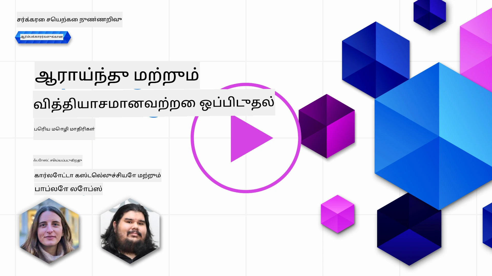](https://youtu.be/KIRUeDKscfI?si=8BHX1zvwzQBn-PlK)

> _இந்த பாடத்தின் வீடியோவை காண மேலுள்ள படத்தை கிளிக் செய்யவும்_

முன்னைய பாடத்துடன், உருவாக்கும் AI தொழில்நுட்ப தளத்தை எவ்வாறு மாற்றுகின்றது, பெரிய மொழி மாதிரிகள் (LLMs) எப்படி வேலை செய்கின்றன மற்றும் ஒரு வியாபாரம் - நமது ஸ்டார்ட்அப் போல் - அவற்றை எவ்வாறு பயன்படுத்தி வளரலாம் என்பதை நாம் பார்த்தோம்! இந்த அத்தியாயத்தில், நாங்கள் வெவ்வேறு வகையான பெரிய மொழி மாதிரிகள் (LLMs) இவற்றை ஒப்பிட்டு, அவற்றின் நன்மைகள் மற்றும் தீமைகளை புரிந்துகொள்ளப்போகிறோம்.

நமது ஸ்டார்ட்அப்பின் அடுத்த படி தற்போதைய LLM நிலையை ஆராய்ந்து, எது நமது பயன்பாட்டுக்குத் திருப்பக்கமாக இருக்கும் என்பதைப் புரிந்துகொள்ளும் பொருட்டு உள்ளது.

## அறிமுகம்

இந்த பாடத்தில் கூறப்படும் விஷயங்கள்:

- தற்போதைய நிலைமையில் உள்ள வெவ்வேறு வகையான LLMகள்.
- உங்கள் பயன்பாட்டுக்கான மாதிரிகளை Azure-ல் சோதனை, மறு முயற்சி மற்றும் ஒப்பிடல்.
- ஒரு LLM-ஐ எவ்வாறு பயன்படுத்துவது.

## கற்றலின் குறிக்கோள்கள்

இந்த பாடத்தை முடித்த பிறகு, நீங்கள்:

- உங்கள் பயன்பாட்டிற்கான சரியான மாதிரியைத் தேர்வு செய்வது.
- மாதிரியின் செயல்திறனை சோதித்து, மீண்டும் முயற்சி செய்து, மேம்படுத்தும் முறையை புரிந்து கொள்ளுதல்.
- வியாபாரங்கள் மாதிரிகளை எவ்வாறு பயன்படுத்துகின்றன என்பதையும் தெரிந்துகொள்ளுதல்.

## வெவ்வேறு வகையான LLMகளை புரிந்து கொள்ளுதல்

LLMகள் அவற்றின் கட்டமைப்பு, பயிற்சி தரவுகள் மற்றும் பயன்பாட்டின் அடிப்படையில் பல வகைகளாக வகைப்படுத்தப்படலாம். இந்த வேறுபாடுகளை புரிந்துகொள்வதே நமது ஸ்டார்ட்அப்புக்கான சரியான மாதிரியைத் தேர்வு செய்யவும், சோதனை செய்து, மீண்டும் முயற்சி செய்து செயல்திறனை மேம்படுத்தவும் உதவும்.

பலவிதமான LLM மாதிரிகள் உள்ளன, உங்கள் தேர்வு நீங்கள் அவற்றை எந்த விதத்தில் பயன்படுத்த விரும்புகிறீர்கள், உங்கள் தரவு, நீங்கள் செலுத்த தயாராக உள்ள பணம் மற்றும் பலவற்றின் அடிப்படையில் இருக்கும்.

நீங்கள் மாதிரிகளை உரை, ஒலி, வீடியோ, படம் உருவாக்குதல் போன்றவற்றுக்கு பயன்படுத்த நினைத்தால், வேறுபட்ட வகையான மாதிரியை தேர்வு செய்யலாம்.

- **ஒலி மற்றும் பேச்சு அங்கீகாரம்**. விஸ்பர்-போன்ற மாதிரிகள் பொதுவான பேச்சு அங்கீகாரம் மாதிரிகளாக இன்னும் பயனுள்ளதாக உள்ளன, ஆனால் இப்போது தயாரிப்பில் `gpt-4o-transcribe`, `gpt-4o-mini-transcribe` மற்றும் தைரியசன் வகைகள் போன்ற புதிய பேச்சு-உரை மாதிரிகள் உள்ளன. உங்கள் சூழ்நிலையில் மொழி கவரேஜ், தைரியசன், நேரடி ஆதரவு, தாமதம் மற்றும் செலவைக் கருத்தில் கொண்டு மதிப்பீடு செய்யவும். கூடுதல் தகவலுக்கு [OpenAI speech-to-text documentation](https://platform.openai.com/docs/guides/speech-to-text?WT.mc_id=academic-105485-koreyst) பார்க்கவும்.

- **படம் உருவாக்குதல்**. DALL-E மற்றும் Midjourney பிரபலமான படம் உருவாக்கும் விருப்பங்கள், ஆனால் தற்போது OpenAI படம் APIகள் `gpt-image-2` போன்ற GPT படம் மாதிரிகளுக்கே மையமாக உள்ளன, அதே நேரத்தில் Stable Diffusion, Imagen, Flux மற்றும் பிற மாதிரி குடும்பங்களும் பிரபலமாக உள்ளன. காரணியாக, தடவை மாதிரி கட்டுப்பாடு, திருத்தம் ஆதரவு, பாணி கட்டுப்பாடு, பாதுகாப்பு தேவைகள் மற்றும் அனுமதிப்பத்திரங்களை ஒப்பிடவும். [OpenAI image generation guide](https://platform.openai.com/docs/guides/images?WT.mc_id=academic-105485-koreyst) மற்றும் இந்த பாடத்திட்டத்தின் அத்தியாயம் 9-ஐப் பாருங்கள்.

- **உரை உருவாக்குதல்**. உரை மாதிரிகள் இப்போது முன்மாதிரிகள், காரண யோதிக்க மாதிரிகள், குறைந்த தாமத மாடல்கள், மற்றும் திறந்த எடை மாதிரிகளை உள்ளடக்கியவையாய் பரந்து வருகின்றன. தற்போதைய எடுத்துக்காட்டுகள் OpenAI GPT-5.x, Anthropic Claude 4.x, Google Gemini 3.x, Meta Llama 4 மற்றும் Mistral மாதிரிகள் ஆகும். வெளியீட்டு தேதி அல்லது விலை அடிப்படையில் மட்டும் தேர்வு செய்ய வேண்டாம்; பணியொற்றி தரம், தாமதம், கருத்து சாளரம், கருவி பயன்படுத்தல், பாதுகாப்பு நடத்தை, பிராந்திய கிடைக்கும் மற்றும் மொத்த செலவை ஒப்பிடவும். [Microsoft Foundry model catalog](https://ai.azure.com/catalog?WT.mc_id=academic-105485-koreyst) Azureல் கிடைக்கும் மாதிரிகளை ஒப்பிட ஒரு சிறந்த இடம்தான்.

- **பல முறைமை**. தற்போதைய பல மாதிரிகள் உரையை மட்டுமல்லாமல் அதிகவற்றையும் செயல்படுத்த முடியும். சில படம், ஒலி அல்லது வீடியோ உள்ளீடுகளை ஏற்றுக்கொள்கின்றன; சில கருவிகளை அழைக்க முடியும்; குறிப்பிட்ட மாதிரிகள் படங்கள், ஒலி அல்லது வீடியோ உருவாக்க முடியும். உதாரணமாக, தற்போதைய OpenAI மாதிரிகள் உரை மற்றும் படம் உள்ளீடு ஆதரிக்கின்றன, Gemini மாதிரிகள் தனிப்பிரிவின் அடிப்படையில் உரை, குறியீடு, படம், ஒலி மற்றும் வீடியோ ஆதரிக்க முடியும், மற்றும் Llama 4 Scout மற்றும் Maverick திறந்த எடை இயல்பான பல முறைமை மாதிரிகள் ஆகும். இயக்கவியலின் முன் ஒவ்வொரு மாதிரி அட்டை படிவத்தையும் அவற்றின் ஆதரவு உள்ளீடு மற்றும் வெளியீடு முறைமைகள் பற்றி சரிபார்க்கவும்.

மாதிரியைத் தேர்வு செய்வதால் சில அடிப்படைக் திறன்கள் கிடைக்கும், ஆனால் அவை போதும் என்று இருக்க முடியாது. அடிக்கடி உங்கள் நிறுவன தனிப்பட்ட தரவு இருக்கிறது, அதை எப்படி LLMக்கு தெரிவிக்க வேண்டும் என்பது சில விருப்பங்கள் உள்ளன. அடுத்த பிரிவுகளில் அதைப் பற்றி மேலும் விவரிக்கப்படும்.

### அடித்தள மாதிரிகள் மற்றும் LLMகள்

அடித்தள மாதிரி என்ற சொல்லை [ஸ்டான்ஃபோர்ட் ஆராய்ச்சியாளர்கள்](https://arxiv.org/abs/2108.07258?WT.mc_id=academic-105485-koreyst) உருவாக்கி, கீழ்காணும் சில நிபந்தனைகள் கொண்ட AI மாதிரி என்று வரையறுக்கின்றனர்:

- **அவர்கள் மேற்பார்வை இல்லாத வகையிலும் அல்லது சுய மேற்பார்வை வகையிலும் பயிற்சி பெறுகின்றனர்**, அதாவது அவர்கள் லேபிளில்லாத பலமுறை தரவு மீது பயிற்சி பெறுகின்றனர், மற்றும் மனித உருவாக்கத்திற்கான அங்கீகாரம் அல்லது லேபிளிங் தேவையில்லை.
- **அவர்கள் மிக பெரிய மாதிரிகளாக உள்ளனர்**, பல பில்லியன் பரிமாண காற்புகளால் பயிற்சி பெறப்பட்ட ஆழ்ந்த நரம்பு வலையமைப்புகள்.
- **பிற மாதிரிகளுக்கான அடித்தளமாக அமைக்கப்பட உள்ளன**, அதாவது மற்ற மாதிரிகள் மேல் கட்டப்படும் தொடக்க புள்ளியாக பயன்படுத்தப்பட முடியும், இதனை மெருகூட்டல் மூலம் செய்ய முடியும்.

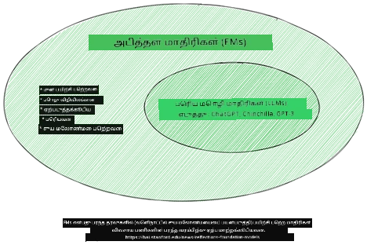

படம் மூலம்: [அடித்தள மாதிரிகள் மற்றும் பெரிய மொழி மாதிரிகள் | Babar M Bhatti | மீடியம்](https://thebabar.medium.com/essential-guide-to-foundation-models-and-large-language-models-27dab58f7404)

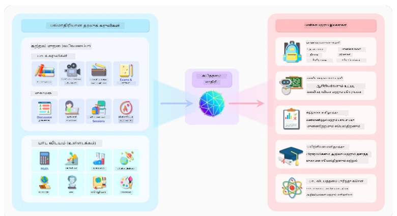

படம் மூலம்: [2108.07258.pdf (arxiv.org)](https://arxiv.org/pdf/2108.07258.pdf?WT.mc_id=academic-105485-koreyst)

### திறந்த எடை/திறந்த மூல மற்றும் சொந்தமான மாதிரிகள்

LLMகளை வகைப்படுத்தும் மற்றொரு வழி அவை திறந்த எடை, திறந்த மூல அல்லது சொந்தமான மாதிரிகள் ஆக உள்ளனவா என்பது.

திறந்த மூல மற்றும் திறந்த எடை மாதிரிகள் மாதிரி இயங்குதள ஆவணங்கள் பரிசோதனை, பதிவிறக்கம் அல்லது விருப்பப்படி மாற்றம் செய்யவைக்கின்றன, ஆனால் அவற்றின் உரிமங்கள் வேறுபடுகின்றன. சில முழுமையாக திறந்த மூலமாகவும், மற்றவை பயன்பாட்டில் கட்டுப்பாடுகளுடன் திறந்த எடை மாதிரிகளாகவும் இருக்கலாம். இவை வியாபாரங்களுக்கு மேம்பட்ட கட்டுப்பாடு, தரவுத்தளம், செலவு அல்லது தனிப்பயனாக்கல் தேவைப்படும் போது உதவுகின்றன. ஆனால் அணிகள் பயன்படுத்தும் முன் உரிமச் சட்டங்கள், சேவை செலவுகள், பராமரிப்பு, பாதுகாப்பு மேம்படுத்தல்கள் மற்றும் மதிப்பீட்டு தரத்தை மதிப்பாய்வு செய்ய வேண்டும். எடுத்துக்காட்டுகள்: [Meta Llama 4](https://ai.meta.com/blog/llama-4-multimodal-intelligence/?WT.mc_id=academic-105485-koreyst), சில [Mistral மாதிரிகள்](https://docs.mistral.ai/models/overview?WT.mc_id=academic-105485-koreyst), மற்றும் பல [Hugging Face](https://huggingface.co/models?WT.mc_id=academic-105485-koreyst) மேற்பார்வையில் உள்ள மாதிரிகள்.

சொந்தமான மாதிரிகள் ஒரு வழங்குனரிடம் சொந்தமாகவும், அவனை கட்டுப்படுத்தி வைத்துள்ளன. இந்த மாதிரிகள் பொதுவாக மேலாண்மையுடன் கூடிய தயாரிப்பு பயன்பாட்டிற்காக விருத்தியடைகின்றன மற்றும் வலுவான ஆதரவு, பாதுகாப்பு முறைமைகள், கருவி ஒருங்கிணைப்பு மற்றும் அளவிடல் வழங்குகின்றன. ஆனால் வாடிக்கையாளர்கள் மாதிரி எடைகளை பரிசோதிக்கவோ மாற்றவோ முடியாது மற்றும் தனியுரிமை, தரவு காப்பாற்றல், சட்டபூர்வத்தன்மை மற்றும் ஏற்றுக்கொள்ளத்தக்க பயன்பாடு போன்ற வழங்குநர் நிபந்தனைகளை மதிப்பாய்வு செய்ய வேண்டும். எடுத்துக்காட்டுகள்: [OpenAI மாதிரிகள்](https://platform.openai.com/docs/models?WT.mc_id=academic-105485-koreyst), [Google Gemini](https://deepmind.google/models/gemini/pro/?WT.mc_id=academic-105485-koreyst), மற்றும் [Anthropic Claude](https://platform.claude.com/docs/en/about-claude/models/overview?WT.mc_id=academic-105485-koreyst).

### எம்பெட்டிங், படம் உருவாக்குதல் மற்றும் உரை மற்றும் குறியீடு உருவாக்கம்

LLMகளை அவற்றின் வெளியீட்டு வகை அடிப்படையிலும் வகைப்படுத்தலாம்.

எம்பெட்டிங்கள் உரையை எண் வடிவமாக மாற்றும் மாதிரிகள்; இவற்றை எம்பெட்டிங் என்று அழைக்கப்படுகின்றது, அது உள்ளீடு உரையின் எண்ணுருவாக்கம் ஆகும். எம்பெட்டிங்க்கள் சொற்கள் அல்லது வாக்கியங்களுக்கிடையிலான தொடர்புகளை இயந்திரங்களுக்கு புரியச் செய்ய எளிதாக்குகின்றன மற்றும் படி மாதிரிகள் அல்லது தொகுப்பு மாதிரிகளுக்கு உள்ளீடாக பயன்படுகின்றன. எம்பெட்டிங் மாதிரிகள் பொதுவாக பிம்பமாற்று கற்றலில் பயன்படுகின்றன, சுருக்கமான பணிக்காக மாதிரி உருவாக்கப்பட்டு, பிற பணிக்கான எம்பெட்டிங் எடைகள் மீண்டும் பயன்படுத்தப்படுகின்றன. இந்த வகையை எடுத்துக்காட்டாக [OpenAI embeddings](https://platform.openai.com/docs/models/embeddings?WT.mc_id=academic-105485-koreyst) பார்க்கலாம்.

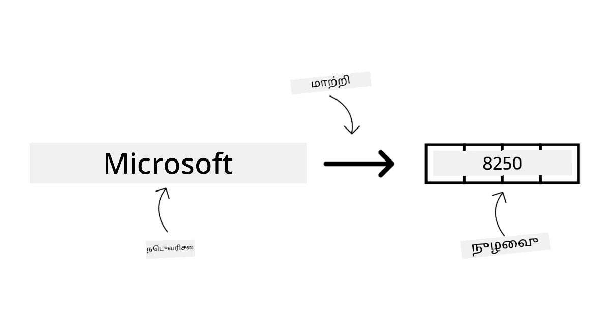

படம் உருவாக்கும் மாதிரிகள் படம் உருவாக்குகின்றன. இவை படம் திருத்தம், செயற்கை படம் உருவாக்கம், மற்றும் படம் மொழி பெயர்ப்பு போன்ற பணிகளுக்கு பயன்படுகின்றன. படம் உருவாக்கும் மாதிரிகள் [LAION-5B](https://laion.ai/blog/laion-5b/?WT.mc_id=academic-105485-koreyst) போன்ற பெரிய படத் தரவுத்தளத்தில் பயிற்சி பெறுகின்றன, மேலும் புதிய படங்களை உருவாக்க அல்லது உள்ளடக்கங்களை பொருத்த திருத்துவதற்காக பயன்படுத்தப்படுகின்றன. எடுத்துக்காட்டுகள்: [GPT Image models](https://platform.openai.com/docs/guides/images?WT.mc_id=academic-105485-koreyst), [Stable Diffusion models](https://github.com/Stability-AI/StableDiffusion?WT.mc_id=academic-105485-koreyst), மற்றும் Imagen மாதிரிகள்.

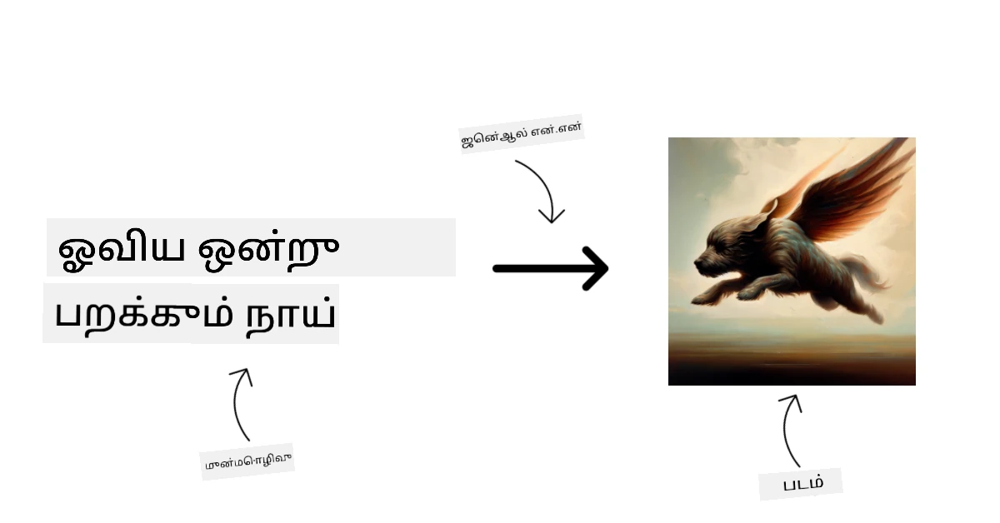

உரை மற்றும் குறியீடு உருவாக்கும் மாதிரிகள் உரை அல்லது குறியீடு உருவாக்குகின்றன. இவை உரை சுருக்கம், மொழிபெயர்ப்பு மற்றும் கேள்வி பதில் போன்ற பணிகளுக்கு பயன்படுகின்றன. உரை உருவாக்கும் மாதிரிகள் [BookCorpus](https://www.cv-foundation.org/openaccess/content_iccv_2015/html/Zhu_Aligning_Books_and_ICCV_2015_paper.html?WT.mc_id=academic-105485-koreyst) போன்ற பெரிய உரை தரவுகளைப் பயன்படுத்தி பயிற்சி எடுக்கின்றன, மேலும் புதிய உரையை உருவாக்கவோ கேள்விகளுக்கு பதிலளிக்கவோ பயன்படுத்தப்படுகின்றன. குறியீடு உருவாக்கும் மாதிரிகள், உதாரணமாக [CodeParrot](https://huggingface.co/codeparrot?WT.mc_id=academic-105485-koreyst), GitHub போன்ற பெரிய குறியீட்டு தரவுத் தொகுப்பில் பயிற்சி பெறுகின்றன, மேலும் புதிய குறியீட்டை உருவாக்கவோ உள்ள குறியீட்டில் பிழைகளை சரிசெய்வதற்கோ பயன்படுகின்றன.

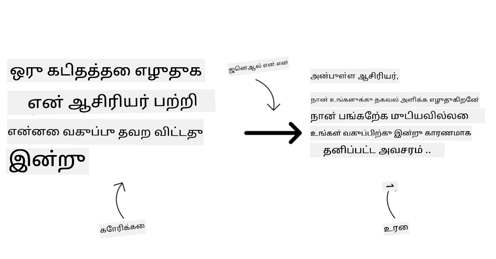

### என்கோடர்-டிகோடர் மற்றும் டிகோடர் மட்டும்

LLMகளின் வெவ்வேறு கட்டமைப்புகளின் பற்றி பேச, ஒரு ஒப்புமையைப் பயன்படுத்துவோம்.

உங்கள் மேலாளர்கள் மாணவர்களுக்கான ஒரு வினாதாள் எழுத ஒரு பணி கொடுத்ததாகக் கற்பனை செய்க. உங்களிடம் இரண்டு சக ஊழியர்கள் உள்ளனர்; ஒருவர் உள்ளடக்கத்தை உருவாக்கக்கான பொறுப்பில், மற்றவர் அவற்றை பரிசீலிக்கிறவர்.

உள்ளடக்க உருவாக்குபவர் டிகோடர் மட்டும் மாதிரியைப் போல: அவர்கள் பொருளை பார்த்து, நீங்கள் ஏற்கனவே எழுதியதை பார்த்து, அதை அடிப்படையாக கொண்டு மேலும் உள்ளடக்கத்தை உருவாக்குகிறார்கள். அவர்கள் ஈடுபடுத்தும், தகவல் கொண்ட உள்ளடக்கத்தை எழுத மிகவும் சிறந்தவர்கள், ஆனால் தகவலை வகைப்படுத்துதல், மீட்டு எடுத்தல் அல்லது குறியாக்கம் செய்வதில் சிறந்த தேர்வு அல்ல. டிகோடர் மட்டும் மாதிரி குடும்ப உதாரணம் GPT மற்றும் Llama மாதிரிகள் ஆகும்.

பரிசீலிப்பவர் என்கோடர் மட்டும் மாதிரி போல, அவர்கள் எழுதப்பட்ட பாடத்திட்டம் மற்றும் பதில்களை பார்த்து, அவற்றின் தொடர்பை உணர்ந்து அர்த்தம் கண்டு கொள்ளும், ஆனால் உள்ளடக்கத்தை உருவாக்க சிறந்தவர்கள் அல்ல. என்கோடர் மட்டும் மாதிரிக்கு உதாரணமாக BERT க்கானது.

நாம் ஒருவரை கற்பனை செய்க, அவர் வினாதாளை உருவாக்கவும் பரிசீலிக்கவும் முடியும், இது என்கோடர்-டிகோடர் மாதிரி ஆகும். எடுத்துக்காட்டாக BART மற்றும் T5 மாதிரிகள்.

### சேவை மற்றும் மாதிரி மாறுபாடு

இப்போதிரு, சேவை மற்றும் மாதிரியின் வேறுபாடு பற்றி பேசுவோம். சேவை என்பது ஒரு கிளவுட் சேவை வழங்குநர் வழங்கும் பொருள், அது பல மாடல்களிலும் தரவுகளிலும் மற்ற கூறுகளிலும் சேர்த்திருக்கும். மாதிரி என்பது சேவையின் முக்கிய கூறு, மற்றும் பொதுவாக அடித்தள மாதிரி, உதாரணமாக LLM ஆகும்.

சேவைகள் பொதுவாக தயாரிப்பு பயன்பாட்டிற்கு மேம்படுத்தப்பட்டுள்ளன மற்றும் மாதிரிகள் விட பயன்படுத்த எளிதாக உள்ளன, பொதுவாக ஒரு காட்சிப்படுத்துவதன் மூலம். இருப்பினும் சேவைகள் எப்போதும் இலவசமாக கிடைக்க வழியில்லை, மேலும் சந்தா அல்லது கட்டணம் வேண்டியிருக்கலாம், சேவை உரிமையாளர் உபகரணங்களையும் வளங்களையும் பயன்படுத்திக் கொள்வதற்கு முன்கூட்டிய செலவீனங்களைப் போதுமான அளவில் நிர்வகிக்கவும், விருத்தி மற்றும் அளவிடலை எளிதாக்கவும். ஒரு சேவைக்கான உதாரணம் [Azure OpenAI Service](https://learn.microsoft.com/azure/ai-foundry/openai/overview?WT.mc_id=academic-105485-koreyst), இது உபயோகப்படுத்துதலுக்கு ஏற்ப கட்டணம் வசூலிக்கும் திட்டத்தை வழங்குகிறது. Azure OpenAI சேவை உயர்தர பாதுகாப்பு மற்றும் பொறுப்பான AI கட்டமைப்பையும் மாதிரிகளின் திறன்களோடு வழங்குகின்றது.

மாதிரிகள் நரம்பு வலையமைப்பின் ஆவணங்கள்: அளவுருக்கள், எடைகள், கட்டமைப்பு, தொகுப்பான் மற்றும் ஆதரவு அமைப்புகள் ஆகும். மாதிரியை உள்ளூர் அல்லது தனியார் சூழலில் இயக்க, உரிய உபகரணங்கள், சேவை முனைமை, கண்காணிப்பு மற்றும் பொருத்தமான திறந்த மூல/திறந்த எடை அனுமதி அல்லது வாணிக அனுமதி தேவை. திறந்த எடை மாதிரிகள், உதாரணமாக Llama 4 அல்லது Mistral மாதிரிகள், சுயமாக ஏற்றவோ அல்லது நடத்தவோ முடியும், ஆனால் அவற்றுக்கு கணினி சக்தி மற்றும் செயல்பாட்டு நிபுணத்துவம் தேவை.

## Azure-ல் வேறுபட்ட மாதிரிகளுடன் செயல்திறனைப் புரிந்து கொண்டு சோதனை மற்றும் மீண்டும் முயற்சி செய்வது எப்படி

எங்கள் குழு தற்போதைய LLMகளின் நிலையை ஆராய்ந்து, அவர்களின் சூழல்களுக்கு சிறந்த வேடிக்கையாளர்களைக் கண்டுபிடித்த பிறகு, அடுத்த படி அவர்களின் தரவிலும் வேலைசுமையிலும் அவற்றை சோதிப்பது ஆகும். இது ஒரு தொடர்ந்து புதுப்பிக்கும் செயல்முறை, பரிசோதனைகள் மற்றும் அளவுகோல்கள் மூலம் செய்யப்படுகிறது.
கடந்தப் பத்திகளில் குறிப்பிடப்பட்ட பெரும்பாலான மாதிரிகள் (OpenAI மாதிரிகள், Llama 4 மற்றும் Mistral போன்ற திறந்த எடை மாதிரிகள், மற்றும் Hugging Face மாதிரிகள்) [Microsoft Foundry Models](https://learn.microsoft.com/azure/foundry/concepts/foundry-models-overview?WT.mc_id=academic-105485-koreyst) இல் கிடைக்கின்றன.

[Microsoft Foundry](https://learn.microsoft.com/azure/foundry/what-is-foundry?WT.mc_id=academic-105485-koreyst), முன்னதாக Azure AI Studio/Azure AI Foundry ஆகும், AI செயலிகள் மற்றும் முகவரிகளை கட்டுவதற்கான ஒன்றிணைந்த Azure தளம் ஆகும். இது முயற்சி மற்றும் மதிப்பீடு முதல் வெளியீடு, கண்காணிப்பு, மற்றும் கோவர்னென்ஸ் வரை முகமுரைகளை மேலாண்மை செய்ய உதவுகிறது. Microsoft Foundry இல் உள்ள மாதிரி காட்சியகம் பயனாளரை பின்வருமாறு உதவுகிறது:

- Azure விற்கப்படும் மாதிரிகள் மற்றும் கூட்டாளர்களிடமிருந்து மற்றும் சமூக வழங்குனர்களிடமிருந்து மாதிரிகள் உட்பட விருப்பமான அடித்தளம் மாதிரியை காட்சியகத்தில் கண்டுபிடிக்கவும். பயனாளர்கள் பணி, வழங்குனர், உரிமம், வெளியீடு விருப்பம் அல்லது பெயர் மூலம் வடிகட்டலாம்.

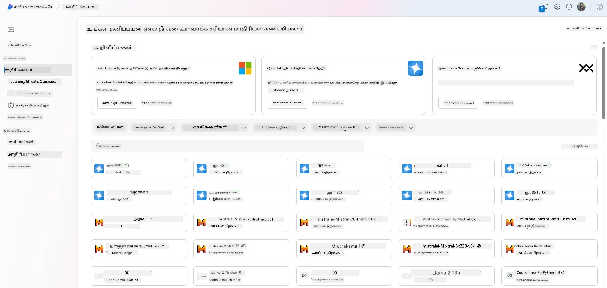

- மாதிரி அட்டை, அதன் பயன்பாட்டின் விரிவான விளக்கம் மற்றும் பயிற்சி தரவு, குறியீட்டு எடுத்துக்காட்டு மற்றும் உள் மதிப்பீட்டு நூலகத்தில் மதிப்பீட்டு முடிவுகளை பரிசீலிக்கவும்.

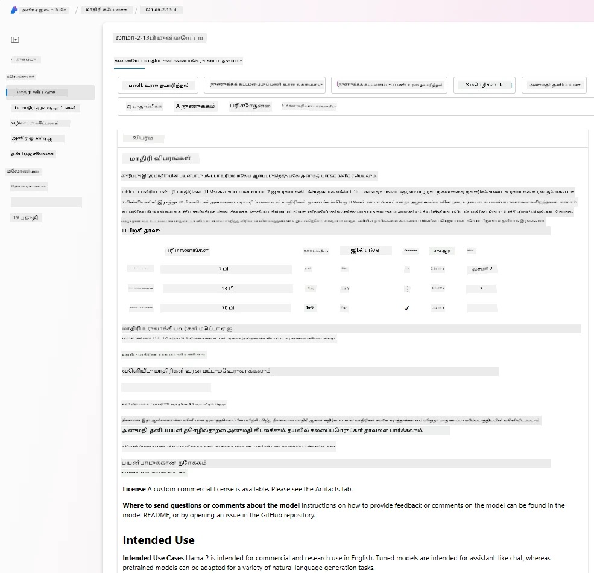

- தொழில்நுட்பத்துறையில் கிடைக்கக்கூடிய மாதிரிகள் மற்றும் தரவுத்தொகுப்புகளில் உள்ள பேன்களில் உள்ள [Model Benchmarks](https://learn.microsoft.com/azure/ai-foundry/concepts/model-benchmarks?WT.mc_id=academic-105485-koreyst) மூலம் எதிர்த்துக்காட்டுகளை ஒப்பிடுதல், எந்த மாதிரி வணிக சூழலுக்கு ஏற்றது என்பதைக் மதிப்பீடு செய்ய.

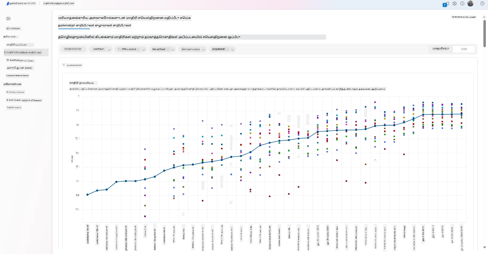

- Microsoft Foundry இன் முயற்சி மற்றும் பின்தொடர்தல் திறன்களை பயன்படுத்தி தனிப்பயன் பயிற்சி தரவுகளுடன் ஆதரவு பெற்ற மாதிரிகளை சிறப்பாக-எழுத்து செய்யவும், குறிப்பிட்ட வேலைச்சுமையில் மாதிரி செயல்திறனை மேம்படுத்தவும்.

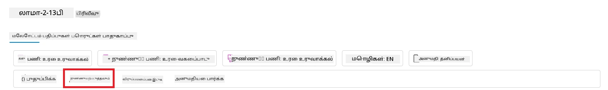

- பயன்பாடுகள் அதை பயன்படுத்தும் வகையில், நிர்வகிக்கப்பட்ட கணினி அல்லது சர்வர்லெஸ் வெளியீட்டு விருப்பங்களை பயன்படுத்தி, அசல் முன்னர் பயிற்சி பெற்ற மாதிரியை அல்லது சிறப்பாக-எழுத்துச் செய்த பதிப்பை ஒரு தொலைவிலுள்ள நேரடி விளையாட்டு முனையில் வெளியிடவும்.

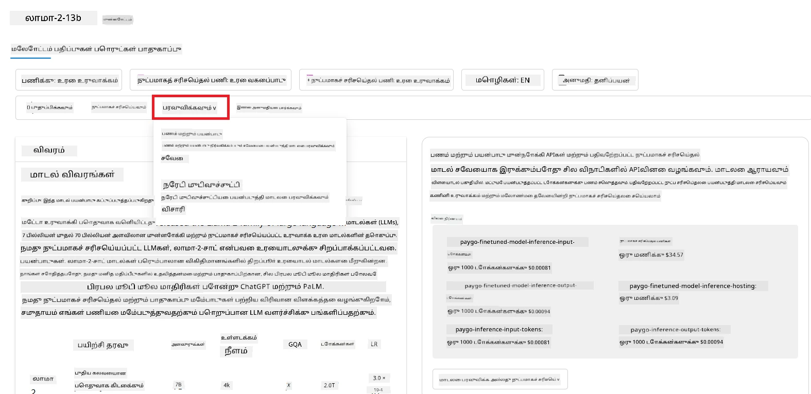

> [!NOTE]
> காட்சியகத்தில் உள்ள அனைத்து மாதிரிகள் இப்போது சிறப்பாக-எழுத்து செய்ய அல்லது பை-எஸ்-யூ-கோ வெளியீட்டுக்குப் பெறக்கூடியவையல்ல. மாதிரி திறன்கள் மற்றும் வரம்புகளுக்கான விரிவான விவரங்களுக்கு மாதிரி அட்டை பார்க்கவும்.

## LLM முடிவுகளை மேம்படுத்துதல்

எங்கள் ஸ்டார்ட்அப் குழுவுடன் வேறுபட்ட வகை LLMகளையும், பல்வேறு மாதிரிகளை ஒப்பிட, சோதனை தரவிலே மதிப்பீடு செய்து, செயல்திறனை மேம்படுத்த, மற்றும் விளையாட்டு முனைகளில் வெளியிட உதவும் ஒரு கிளவுட் தளம் (Microsoft Foundry) என்பதையுமாக ஆராய்ந்துள்ளோம்.

ஆனால் அவர்கள் ஒரு முன்பயிற்சி பெற்ற மாதிரியை பயன்படுத்துவதற்கு பதிலாக காலச்சீலனம் செய்த மாதிரியை எப்போது பரிசீலிக்க வேண்டும்? குறிப்பிட்ட வேலைசுமைகளில் மாதிரி செயல்திறனை மேம்படுத்த மற்றவை உள்ளனவா?

ஒரு வணிகம் தேவையான முடிவுகளை LLMஇல் பெற பல்வேறு அணுகுமுறைகள் உள்ளன. நீங்கள் தயாரிப்பில் LLMஐ வெளியிடுகையில் வெவ்வேறு பயிற்சிகளுடன் வெவ்வேறு வகை மாதிரிகளை தேர்ந்தெடுக்கலாம், அவை வகைபலத்தின், செலவின் மற்றும் தரத்தால் வேறுபடுகின்றன. எங்கேனும் சில வகை அணுகுமுறைகள்:

- **சூழலை கொண்டு ப்ராம்ட் பொறியியலாளர் செய்யும்.** ப்ராம்ட் செய்யும் போது தேவையான பதில்களை பெறுவதற்கு போதுமான சூழலை வழங்குவது தான் நோக்கம்.

- **Retrieval Augmented Generation, RAG.** உங்கள் தரவு ஒரு தரவுத்தளத்தில் அல்லது வலை முனையில் இருக்கக்கூடும். ப்ராம்டிங்கின் நேரத்தில் இந்த தரவு அல்லது அதில் ஒரு துணை தொகுதி உள்ளதா என்பதை உறுதிப்படுத்த, நீங்கள் தொடர்புடைய தரவை பெற முடியும் மற்றும் அதை பயனாளரின் ப்ராம்ட் ஒரு பகுதியாக்க முடியும்.

- **சிறப்பாக எழுத்து செய்யப்பட்ட மாதிரி.** இங்கு, நீங்கள் உங்கள் சொந்த தரவின் மேல் மாதிரியை மேலும் பயிற்சி செய்துள்ளீர்கள், இது மாதிரியை உங்கள் தேவைகளுக்கு துல்லியமாகவும் விரைவாகவும் மாற்றியது, ஆனால் செலவானதாக இருக்கலாம்.

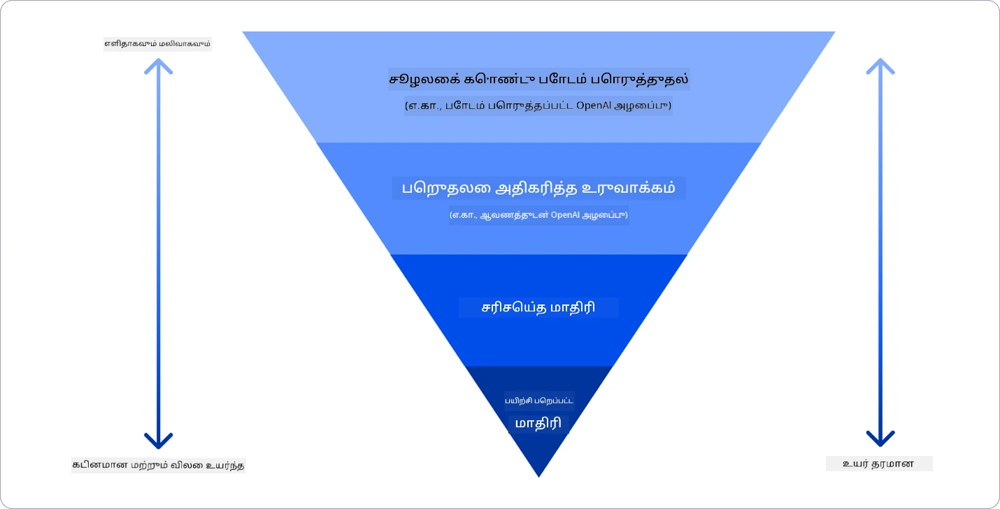

படம் மூலம்: [Four Ways that Enterprises Deploy LLMs | Fiddler AI Blog](https://www.fiddler.ai/blog/four-ways-that-enterprises-deploy-llms?WT.mc_id=academic-105485-koreyst)

### சூழலோடு ப்ராம்ட் பொறியியல்

முன்பயிற்சி பெற்ற LLMகள் பொதுவான இயற்கை மொழி பணிகளில் மிகச் சிறப்பாக வேலை செய்கின்றன, குறுகிய ப்ராம்ட் மூலம் கூட அழைக்கப்படும்போது, ஒரு வாக்கியத்தை நிறைவு படுத்தல் அல்லது கேள்வி போன்ற – இதை “பூஜ்ஜிய-ஷாட்” கற்றல் என்று அழைக்கப்படுகிறது.

இருப்பினும், பயனாளர் தங்கள் வினாவை எடுத்துக்காட்டுகள் மற்றும் விரிவான கோரிக்கையுடன் (சூழல்) வடிவமைத்தால், பதில் அதிகம் துல்லியமாகவும் பயனாளரின் எதிர்பார்ப்பிற்கு அருகிலானதாகவும் இருக்கும். இதில், ப்ராம்ட் ஒரே ஒரு எடுத்துக்காட்டைப் περιக்கும் போது “ஒரே-ஷாட்” கற்றல் என்கிறோம் மற்றும் பல எடுத்துக்காட்டுகளை கொண்டிருக்கும் போது “குறைந்த-ஷாட் கற்றல்” என அழைக்கப்படுகிறது.
சூழலோடு ப்ராம்ட் பொறியியல் துவங்குவதற்கான மிகவும் செலவுத் திறன் உள்ள அணுகுமுறை ஆகும்.

### Retrieval Augmented Generation (RAG)

LLMகளுக்கு ஒரு வரம்பு உள்ளது, அது பயிற்சிக்குப் பயன்படுத்தப்பட்ட தரவுகளை மட்டுமே பதில் உருவாக்க கையாள முடியும். இதற்கு பதிலாக பயிற்சி நிறைவுக்கு பின் நடந்த நிகழ்வுகளை அல்லது தனிப்பட்ட (நிறுவன தரவுகள் போன்ற) தகவல்களை அறியாது.
இது RAG மூலம் கடந்து கொள்ளலாம், இது ப்ராம்டிற்கு வெளிப்புற தரவின் ஒரு பகுதிகளை இலக்காக கொண்டு சேர்ப்பதால், ப்ராம்ட் நீளம் வரம்புகளை கருத்தில் கொள்ளும். இது [Azure Vector Search](https://learn.microsoft.com/azure/search/vector-search-overview?WT.mc_id=academic-105485-koreyst) போன்ற வெக்டர் தரவுத்தள கருவிகளால் ஆதரிக்கப்படுகிறது, அவை பயனுள்ள துண்டுகளை பல விதமான முன்கூட்டியே வரையறுக்கப்பட்ட தரவு ஆதாரங்களிலிருந்து மீட்கி ப்ராம்ட் சூழலுக்கு சேர்க்கின்றன.

இந்த திறன் ஒரு வணிகம் போதுமான தரவு, நேரம் அல்லது வளங்கள் இல்லாத நிலைமையில் கூட சிறப்பாக வேலை செய்த LLMஐ இன்றி செயல்திறனை மேம்படுத்த விரும்பும் போது மற்றும் தவறான, பழைய அல்லது ஆதரவு இல்லாத பதில்களின் அபாயங்களை குறைக்க மிகவும் உதவிகரமாகும்.

### சிறப்பாக எழுத்துச் செய்த மாதிரி

சிறப்பாக எழுத்துசெய்தல் என்பது மாற்று கற்றலை (transfer learning) பயன்படுத்தி மாதிரியை கீழ்த்தர பணிக்கு அல்லது குறிப்பிட்ட பிரச்சனையைத் தீர்க்க 'உருவாக்க' செய்யும் செயல்முறை. குறைந்த-ஷாட் கற்றல் மற்றும் RAGவுடன் முரண்பட்டது, இது புதுக்கப்பட்ட எடைகள் மற்றும் விகிதாசாரங்களுடன் புதிய மாதிரி உருவாக்கப்படுவதாகும். இது ஒரு தொகுப்பு உள்ளீடு (ப்ராம்ட்) மற்றும் அதன் தொடர்புடைய வெளியீடு (நிறைவு) கொண்ட பயிற்சி எடுத்துக்காட்டு தொகுப்பைக் கோருகிறது.
இது கீழ்கண்ட நிலைகளில் விரும்பத்தக்க அணுகுமுறை:

- **சிறிய பணித்துறைக்குரிய மாதிரிகளைப் பயன்படுத்துதல்.** ஒரு வணிகம் பெரிய அதிநவீன மாதிரியை தொடர்ந்து ப்ராம்ட் செய்யும் பதிலாக குறுகிய பணிக்கான சிறிய மாதிரியை சிறப்பாக எழுத்து செய்ய விரும்பலாம், இதனால் செலவு குறைந்து மற்றும் வேகமான தீர்வாகும்.

- **தாமதத்தை கவனித்தல்.** குறிப்பிட்ட பயன்பாட்டில் தாமதம் முக்கியமானது, எனவே மிக நீண்ட ப்ராம்ட் அல்லது கற்றல் எண்ணிக்கை மாதிரிக்கு பொருந்தாது எனில்.

- **திடமான நடத்தை ஏற்படுத்துதல்.** வணிகத்திடம் பல உயர்தர எடுத்துக்காட்டுகள் உள்ளன மற்றும் மாதிரி பணித்துறைக் கோவை, வெளியீட்டு வடிவம், தொனம் அல்லது துறைக்குரிய பாணியை தொடர்ந்து பின்பற்ற வேண்டும். முக்கிய பிரச்சனை அடிக்கடி மாறுபடும் புதிதான தகவல்கள் அல்லது தனிப்பட்ட அறிவு ஆகின், சிறப்பாக எழுத்துசெய்தலை மட்டும் நம்பாமல் RAGஐ பயன்படுத்தவும்.

### பயிற்சி பெற்ற மாதிரி

ஒரு LLMஐ ஆரம்பத்திலிருந்தே பயிற்சி செய்தல் மிகக் கடினம், மிகவும் சிக்கல் மிகுதி, பெரும் தரவு, திறமையான வளங்கள் மற்றும் ஏற்ற கணினி திறன்கள் தேவை. இந்த விருப்பத்தை மட்டும் ஒரு வணிகத்திற்கும் துறையின்மயமான பயன்பாடு மற்றும் பெரும் துறை மையமான தரவு உள்ள நிலையில் பரிசீலிக்க வேண்டும்.

## அறிவு சரிபார்ப்பு

LLM நிறைவு முடிவுகளை மேம்படுத்த சிறந்த அணுகுமுறை என்ன இருக்கலாம்?

1. சூழலோடு ப்ராம்ட் பொறியியல்
1. RAG
1. சிறப்பாக எழுத்துசெய்த மாதிரி

பதில்: மூன்றும் உதவக்கூடியவை. விரைவான மேம்பாட்டுக்கு ப்ராம்ட் பொறியியல் மற்றும் சூழலில் இருந்து துவங்கவும், மாதிரிக்கு சமீபத்திய தகவல்கள் அல்லது தனிப்பட்ட வணிக தரவு தேவைப்படும்போது RAG பயன்படுத்தவும். போதுமான உயர்தர எடுத்துக்காட்டுகள் இருந்தால் மற்றும் மாதிரி பணிக்கு, வடிவம், தொனம் அல்லது துறைக் கோவை தொடர்ந்து பின்பற்ற வேண்டும் என்பதற்காக சிறப்பாக எழுத்துசெய்தலை தேர்ந்தெடுக்கவும்.

## 🚀 சவால்

உங்கள் வணிகத்திற்கு நீங்கள் எப்படி [RAG ஐ பயன்படுத்த முடியுமோ](https://learn.microsoft.com/azure/search/retrieval-augmented-generation-overview?WT.mc_id=academic-105485-koreyst) என்பதைக் காண்க.

## சிறந்த வேலை, உங்கள் கற்றலை தொடரவும்

இந்த பாடத்தை முடித்தவுடன், எங்கள் [Generative AI கற்றல் தொகுப்பை](https://aka.ms/genai-collection?WT.mc_id=academic-105485-koreyst) பார்வையிடவும், உங்கள் Generative AI அறிவை மேம்படுத்த தொடரவும்!

பாடம் 3 க்கு செல்லவும், அங்கு நாம் [துணிவுடன் Generative AIஐ உருவாக்குவது](../03-using-generative-ai-responsibly/README.md?WT.mc_id=academic-105485-koreyst) குறித்து பார்க்கப்போகின்றோம்!

---

<!-- CO-OP TRANSLATOR DISCLAIMER START -->
**மறுப்பு**:
இந்த ஆவணம் AI மொழிபெயர்ப்பு சேவை [Co-op Translator](https://github.com/Azure/co-op-translator) பயன்படுத்தி மொழிபெயர்க்கப்பட்டுள்ளது. நாங்கள் துல்லியத்திற்காக முயற்சி செய்துள்ளோம், ஆனால் தானாக செய்யப்படும் மொழிபெயர்ப்புகளில் பிழைகள் அல்லது தவறுகள் இருக்கலாம் என்பதை கவனத்தில் கொள்ளவும். அசல் ஆவணம் அதன் தாய்மொழியில் அதிகாரப்பூர்வ ஆதாரமாக கருதப்பட வேண்டும். முக்கியமான தகவல்களுக்கு, தொழில்நுட்பமான மனித மொழிபெயர்ப்பு பரிந்துரைக்கப்படுகிறது. இந்த மொழிபெயர்ப்பைப் பயன்படுத்துவதால் ஏற்படும் எந்த தவறான புரிதல்கள் அல்லது தவறான விளக்கத்திற்கும் நாங்கள் பொறுப்பில்வில்லை.
<!-- CO-OP TRANSLATOR DISCLAIMER END -->