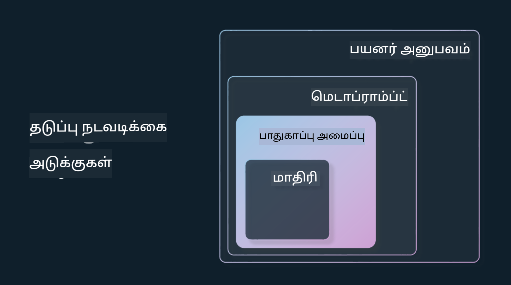

<!--
CO_OP_TRANSLATOR_METADATA:
{
  "original_hash": "4d57fad773cbeb69c5dd62e65c34200d",
  "translation_date": "2025-10-18T02:38:12+00:00",
  "source_file": "03-using-generative-ai-responsibly/README.md",
  "language_code": "ta"
}
-->
# ஜெனரேட்டிவ் AI-ஐ பொறுப்புடன் பயன்படுத்துவது

> _மேலே உள்ள படத்தை கிளிக் செய்து இந்த பாடத்தின் வீடியோவைப் பாருங்கள்_

AI மற்றும் குறிப்பாக ஜெனரேட்டிவ் AI-ஐப் பற்றிய ஆர்வம் எளிதாக உருவாகிறது, ஆனால் அதை பொறுப்புடன் எப்படி பயன்படுத்துவது என்பதை நீங்கள் கவனிக்க வேண்டும். அதன் வெளியீடு நியாயமானது, தீங்கு விளைவிக்காதது போன்றவற்றை எப்படி உறுதிப்படுத்துவது என்பதையும் நீங்கள் கவனிக்க வேண்டும். இந்த அத்தியாயம் உங்களுக்கு இந்த சூழலை, கவனிக்க வேண்டிய விஷயங்களை, மற்றும் உங்கள் AI பயன்பாட்டை மேம்படுத்துவதற்கான செயல்பாடுகளை வழங்குவதை நோக்கமாகக் கொண்டுள்ளது.

## அறிமுகம்

இந்த பாடத்தில் நீங்கள் கற்றுக்கொள்ளப்போகிறீர்கள்:

- ஜெனரேட்டிவ் AI பயன்பாடுகளை உருவாக்கும்போது ஏன் பொறுப்பான AI-ஐ முன்னுரிமையாகக் கருத வேண்டும்.
- பொறுப்பான AI-யின் முக்கியக் கொள்கைகள் மற்றும் அவை ஜெனரேட்டிவ் AI-க்கு எப்படி தொடர்புடையவை.
- இந்த பொறுப்பான AI கொள்கைகளை செயல்படுத்துவதற்கான உத்திகள் மற்றும் கருவிகள்.

## கற்றல் இலக்குகள்

இந்த பாடத்தை முடித்த பிறகு நீங்கள் அறிந்திருப்பீர்கள்:

- ஜெனரேட்டிவ் AI பயன்பாடுகளை உருவாக்கும்போது பொறுப்பான AI-யின் முக்கியத்துவம்.
- ஜெனரேட்டிவ் AI பயன்பாடுகளை உருவாக்கும்போது பொறுப்பான AI-யின் முக்கியக் கொள்கைகளை எப்போது யோசிக்க வேண்டும் மற்றும் பயன்படுத்த வேண்டும்.
- பொறுப்பான AI-யின் கருத்தை நடைமுறைப்படுத்துவதற்கான கருவிகள் மற்றும் உத்திகள்.

## பொறுப்பான AI கொள்கைகள்

ஜெனரேட்டிவ் AI-யின் ஆர்வம் இதுவரை இல்லாத அளவுக்கு அதிகமாக உள்ளது. இந்த ஆர்வம் புதிய டெவலப்பர்கள், கவனம் மற்றும் நிதி ஆதரவை இந்த துறைக்கு கொண்டு வந்துள்ளது. இது ஜெனரேட்டிவ் AI-யை பயன்படுத்தி தயாரிப்புகள் மற்றும் நிறுவனங்களை உருவாக்க விரும்பும் அனைவருக்கும் மிகவும் சாதகமாக உள்ளது, ஆனால் இதை பொறுப்புடன் முன்னேற்றுவது முக்கியம்.

இந்தக் கோர்ஸின் முழு காலத்திலும், நாங்கள் எங்கள் ஸ்டார்ட்அப் மற்றும் AI கல்வி தயாரிப்பை உருவாக்குவதில் கவனம் செலுத்துகிறோம். நாங்கள் பொறுப்பான AI-யின் கொள்கைகளைப் பயன்படுத்துவோம்: நியாயம், உள்ளடக்கம், நம்பகத்தன்மை/பாதுகாப்பு, பாதுகாப்பு மற்றும் தனியுரிமை, வெளிப்படைத்தன்மை மற்றும் பொறுப்புணர்வு. இந்த கொள்கைகளுடன், ஜெனரேட்டிவ் AI-யை எங்கள் தயாரிப்புகளில் பயன்படுத்துவதில் அவை எப்படி தொடர்புடையவை என்பதை ஆராய்வோம்.

## ஏன் பொறுப்பான AI-யை முன்னுரிமையாகக் கருத வேண்டும்

ஒரு தயாரிப்பை உருவாக்கும்போது, ​​உங்கள் பயனர் நலன்களை மனதில் வைத்து மனித மையமான அணுகுமுறையை எடுத்துக்கொள்வது சிறந்த முடிவுகளைத் தருகிறது.

ஜெனரேட்டிவ் AI-யின் தனித்துவம் பயனர்களுக்கு உதவியாக இருக்கும் பதில்கள், தகவல்கள், வழிகாட்டுதல் மற்றும் உள்ளடக்கங்களை உருவாக்கும் திறனாகும். இது பல கையேடு செயல்பாடுகள் இல்லாமல் செய்யப்படலாம், இது மிகவும் ஆச்சரியமான முடிவுகளை உருவாக்க முடியும். சரியான திட்டமிடல் மற்றும் உத்திகள் இல்லாமல், இது துரதிர்ஷ்டவசமாக உங்கள் பயனர்கள், உங்கள் தயாரிப்பு மற்றும் சமுதாயத்திற்கே தீங்கு விளைவிக்கக்கூடிய சில விளைவுகளை ஏற்படுத்தலாம்.

இந்த தீங்கு விளைவிக்கக்கூடிய சில (ஆனால் அனைத்தும் அல்ல) விளைவுகளைப் பார்ப்போம்:

### மாயங்கள்

மாயங்கள் என்பது LLM ஒரு உள்ளடக்கத்தை உருவாக்கும் போது அது முற்றிலும் அர்த்தமற்றது அல்லது பிற தகவல் மூலங்களின் அடிப்படையில் உண்மைக்கு மாறானதாக இருக்கும் போது பயன்படுத்தப்படும் ஒரு சொல்.

எடுத்துக்காட்டாக, எங்கள் ஸ்டார்ட்அப் ஒரு மாடலுக்கு வரலாற்று கேள்விகளை மாணவர்கள் கேட்க அனுமதிக்கும் ஒரு அம்சத்தை உருவாக்குவதாகக் கருதுங்கள். ஒரு மாணவர் `டைட்டானிக் கப்பலில் ஒரே உயிர் பிழைத்தவர் யார்?` என்று கேட்கிறார்.

மாடல் கீழே உள்ள பதிலை உருவாக்குகிறது:

> _(மூலம்: [Flying bisons](https://flyingbisons.com?WT.mc_id=academic-105485-koreyst))_

இது மிகவும் நம்பகமான மற்றும் விரிவான பதில். துரதிர்ஷ்டவசமாக, இது தவறானது. குறைந்த அளவிலான ஆராய்ச்சியுடன் கூட, டைட்டானிக் பேரழிவில் ஒருவருக்கு மேற்பட்டவர்கள் உயிர் பிழைத்தனர் என்பதை ஒருவர் கண்டுபிடிக்க முடியும். இந்த தலைப்பைப் பற்றி ஆராய்ச்சி செய்யத் தொடங்கும் ஒரு மாணவருக்கு, இந்த பதில் கேள்வி கேட்கப்படாமல் உண்மையாகக் கருதப்படுவதற்குப் போதுமானதாக இருக்கலாம். இதன் விளைவுகள் AI அமைப்பு நம்பகமற்றதாக மாறுவதற்கும் எங்கள் ஸ்டார்ட்அப்பின் மதிப்புக்கு பாதிப்பை ஏற்படுத்துவதற்கும் வழிவகுக்கும்.

ஏதேனும் கொடுக்கப்பட்ட LLM-இன் ஒவ்வொரு முறை திருத்தத்திலும், மாயங்களை குறைப்பதில் செயல்திறன் மேம்பாடுகளை நாம் கண்டுள்ளோம். இந்த மேம்பாட்டுடன் கூட, பயன்பாடுகளை உருவாக்குபவர்கள் மற்றும் பயனர்கள் இந்த வரம்புகளைப் பற்றி விழிப்புடன் இருக்க வேண்டும்.

### தீங்கு விளைவிக்கும் உள்ளடக்கம்

முன்னைய பிரிவில், LLM தவறான அல்லது அர்த்தமற்ற பதில்களை உருவாக்கும் போது நாம் கவனித்தோம். மற்றொரு ஆபத்து, ஒரு மாடல் தீங்கு விளைவிக்கும் உள்ளடக்கத்துடன் பதிலளிக்கும் போது.

தீங்கு விளைவிக்கும் உள்ளடக்கம் வரையறுக்கப்படுவது:

- சுயதீங்கு அல்லது குறிப்பிட்ட குழுக்களுக்கு தீங்கு விளைவிக்க வழிகாட்டுதல் அல்லது ஊக்குவித்தல்.
- வெறுப்பான அல்லது இழிவான உள்ளடக்கம்.
- எந்தவொரு வகையான தாக்குதல் அல்லது வன்முறை செயல்களைத் திட்டமிட வழிகாட்டுதல்.
- சட்டவிரோத உள்ளடக்கத்தை கண்டுபிடிக்க அல்லது சட்டவிரோத செயல்களைச் செய்ய வழிகாட்டுதல்.
- பாலியல் விளக்கமான உள்ளடக்கத்தை காட்டுதல்.

எங்கள் ஸ்டார்ட்அப்பிற்காக, மாணவர்கள் இந்த வகையான உள்ளடக்கத்தைப் பார்க்காமல் தடுக்க சரியான கருவிகள் மற்றும் உத்திகள் உள்ளன என்பதை உறுதிப்படுத்த விரும்புகிறோம்.

### நியாயமின்மை

நியாயம் என்பது "AI அமைப்பு பாகுபாடு மற்றும் பாகுபாடுகளிலிருந்து விடுபட்டது மற்றும் அனைவரையும் நியாயமாகவும் சமமாகவும் நடத்துகிறது என்பதை உறுதிப்படுத்துவது" என்று வரையறுக்கப்படுகிறது. ஜெனரேட்டிவ் AI உலகில், ஒதுக்கப்பட்ட குழுக்களின் விலக்கான உலகக் காட்சிகள் மாடலின் வெளியீட்டால் வலுப்படுத்தப்படாததை உறுதிப்படுத்த விரும்புகிறோம்.

இந்த வகையான வெளியீடுகள் எங்கள் பயனர்களுக்கு நேர்மறை தயாரிப்பு அனுபவங்களை உருவாக்குவதற்கு அழிவை ஏற்படுத்துவதோடு, மேலும் சமூகத்திற்கும் தீங்கு விளைவிக்கின்றன. பயன்பாடுகளை உருவாக்குபவர்கள், ஜெனரேட்டிவ் AI-யுடன் தீர்வுகளை உருவாக்கும்போது, ​​எப்போதும் பரந்த மற்றும் பலதரப்பட்ட பயனர் அடிப்படையை மனதில் வைத்திருக்க வேண்டும்.

## ஜெனரேட்டிவ் AI-ஐ பொறுப்புடன் எப்படி பயன்படுத்துவது

இப்போது பொறுப்பான ஜெனரேட்டிவ் AI-யின் முக்கியத்துவத்தை நாங்கள் அடையாளம் கண்டுள்ளோம், எங்கள் AI தீர்வுகளை பொறுப்புடன் உருவாக்க 4 படிகளைப் பார்ப்போம்:

### தீங்கு விளைவிக்கும் வாய்ப்புகளை அளவிடுங்கள்

மென்பொருள் சோதனையில், பயன்பாட்டில் பயனர் எதிர்பார்க்கப்படும் செயல்களை நாங்கள் சோதிக்கிறோம். அதேபோல், பயனர்கள் அதிகம் பயன்படுத்தக்கூடிய பல்வேறு கேள்விகளை சோதிப்பது தீங்கு விளைவிக்கும் வாய்ப்புகளை அளவிட நல்ல வழியாகும்.

எங்கள் ஸ்டார்ட்அப் கல்வி தயாரிப்பை உருவாக்குவதால், கல்வி தொடர்பான கேள்விகளின் பட்டியலைத் தயாரிப்பது நல்லது. இது ஒரு குறிப்பிட்ட பாடத்தை, வரலாற்று உண்மைகளை மற்றும் மாணவர் வாழ்க்கை தொடர்பான கேள்விகளை உள்ளடக்கலாம்.

### தீங்கு விளைவிக்கும் வாய்ப்புகளைத் தடுக்கவும்

இப்போது மாடல் மற்றும் அதன் பதில்களால் ஏற்படும் தீங்கு விளைவிக்கும் வாய்ப்புகளைத் தடுக்க அல்லது குறைக்க வழிகளை கண்டுபிடிக்க நேரம். இதை நான்கு வெவ்வேறு அடுக்குகளில் பார்க்கலாம்:

- **மாடல்**. சரியான பயன்பாட்டுக்கு சரியான மாடலைத் தேர்ந்தெடுப்பது. GPT-4 போன்ற பெரிய மற்றும் சிக்கலான மாடல்கள் சிறிய மற்றும் குறிப்பிட்ட பயன்பாடுகளில் பயன்படுத்தும்போது தீங்கு விளைவிக்கும் உள்ளடக்கத்தின் ஆபத்தை அதிகரிக்கக்கூடும். உங்கள் பயிற்சி தரவுகளைப் பயன்படுத்தி நன்றாகத் தகுதிகொண்டது தீங்கு விளைவிக்கும் உள்ளடக்கத்தின் ஆபத்தை குறைக்கிறது.

- **பாதுகாப்பு அமைப்பு**. பாதுகாப்பு அமைப்பு என்பது மாடலை வழங்கும் தளத்தில் உள்ள கருவிகள் மற்றும் கட்டமைப்புகளின் தொகுப்பாகும், இது தீங்கு விளைவிக்காமல் தடுக்க உதவுகிறது. இதற்கான ஒரு உதாரணம் Azure OpenAI சேவையில் உள்ள உள்ளடக்க வடிகட்டல் அமைப்பு. சிஸ்டங்கள் ஜெயில்பிரேக் தாக்குதல்கள் மற்றும் தேவையற்ற செயல்பாடுகளை, உதாரணமாக, பாடுகளின் கோரிக்கைகளை கண்டறிய வேண்டும்.

- **மெடாப்ராம்ட்**. மெடாப்ராம்ப்ட்கள் மற்றும் தரவளங்கள் என்பது சில நடத்தை மற்றும் தகவல்களின் அடிப்படையில் மாடலை வழிநடத்த அல்லது வரையறுக்க நாம் செய்யக்கூடிய வழிகள். இது மாடலின் சில வரம்புகளை வரையறுக்க சிஸ்டம் உள்ளீடுகளைப் பயன்படுத்துவது போன்றதாக இருக்கலாம். கூடுதலாக, அமைப்பின் அளவுகோல் அல்லது துறைக்கு தொடர்புடைய வெளியீடுகளை வழங்குவது.

இது நம்பகமான மூலங்களின் தேர்விலிருந்து மட்டுமே தகவல்களை பெற மாடலைக் கொண்டிருக்க Retrieval Augmented Generation (RAG) போன்ற உத்திகளைப் பயன்படுத்துவதும் ஆகும். [தேடல் பயன்பாடுகளை உருவாக்குவது](../08-building-search-applications/README.md?WT.mc_id=academic-105485-koreyst) பற்றிய பாடம் இந்த கோர்ஸில் பின்னர் உள்ளது.

- **பயனர் அனுபவம்**. இறுதி அடுக்கு என்பது பயனர் எங்கள் பயன்பாட்டின் இடைமுகத்தின் மூலம் மாடலுடன் நேரடியாக தொடர்பு கொள்ளும் இடம். இந்த வழியில், மாடலுக்கு அனுப்பக்கூடிய உள்ளீடுகளின் வகைகளை மட்டுப்படுத்த UI/UX-ஐ வடிவமைக்கலாம், மேலும் பயனருக்கு காட்டப்படும் உரை அல்லது படங்களை வடிகட்டலாம். AI பயன்பாட்டை வெளியிடும்போது, ​​எங்கள் ஜெனரேட்டிவ் AI பயன்பாடு என்ன செய்ய முடியும் மற்றும் என்ன செய்ய முடியாது என்பதைப் பற்றி வெளிப்படையாக இருக்க வேண்டும்.

[AI பயன்பாடுகளுக்கான UX வடிவமைத்தல்](../12-designing-ux-for-ai-applications/README.md?WT.mc_id=academic-105485-koreyst) பற்றிய முழு பாடம் எங்களிடம் உள்ளது.

- **மாடலை மதிப்பீடு செய்யுங்கள்**. LLM-களுடன் வேலை செய்வது சவாலாக இருக்கலாம், ஏனெனில் மாடல் பயிற்சி பெறும் தரவின் மீது எப்போதும் கட்டுப்பாடு இருக்காது. இருப்பினும், மாடலின் செயல்திறன் மற்றும் வெளியீடுகளை எப்போதும் மதிப்பீடு செய்ய வேண்டும். மாடலின் துல்லியம், ஒற்றுமை, தரவளங்கள் மற்றும் வெளியீட்டின் தொடர்பு ஆகியவற்றை அளவிடுவது இன்னும் முக்கியம். இது பங்குதாரர்கள் மற்றும் பயனர்களுக்கு வெளிப்படைத்தன்மை மற்றும் நம்பகத்தன்மையை வழங்க உதவுகிறது.

### பொறுப்பான ஜெனரேட்டிவ் AI தீர்வை இயக்குங்கள்

உங்கள் AI பயன்பாடுகளுக்கு சுற்றியுள்ள ஒரு செயல்பாட்டு நடைமுறையை உருவாக்குவது இறுதி நிலையாகும். இது சட்ட மற்றும் பாதுகாப்பு போன்ற எங்கள் ஸ்டார்ட்அப்பின் பிற பகுதிகளுடன் கூட்டாக வேலை செய்வதை உள்ளடக்கியது, அனைத்து ஒழுங்குமுறை கொள்கைகளுக்கும் இணங்குவதை உறுதிப்படுத்த. வெளியீட்டிற்கு முன், எங்கள் பயனர்களுக்கு எந்தவிதமான தீங்கும் ஏற்படாமல் தடுக்க விநியோகம், சம்பவங்களை கையாளுதல் மற்றும் ரோல்பேக் ஆகியவற்றைச் சுற்றியுள்ள திட்டங்களை உருவாக்க விரும்புகிறோம்.

## கருவிகள்

பொறுப்பான AI தீர்வுகளை உருவாக்குவது மிகவும் கடினமான வேலை போல் தோன்றினாலும், இது மிகவும் மதிப்புமிக்க முயற்சியாகும். ஜெனரேட்டிவ் AI துறை வளரும்போது, ​​டெவலப்பர்கள் பொறுப்பை தங்கள் வேலைவழிகளில் திறமையாக ஒருங்கிணைக்க உதவும் மேலும் பல கருவிகள் வளர்ச்சி அடையும். உதாரணமாக, [Azure AI Content Safety](https://learn.microsoft.com/azure/ai-services/content-safety/overview?WT.mc_id=academic-105485-koreyst) API கோரிக்கையின் மூலம் தீங்கு விளைவிக்கும் உள்ளடக்கம் மற்றும் படங்களை கண்டறிய உதவுகிறது.

## அறிவு சோதனை

பொறுப்பான AI பயன்பாட்டை உறுதிப்படுத்த நீங்கள் கவனிக்க வேண்டிய சில விஷயங்கள் என்ன?

1. பதில் சரியானது என்பதை உறுதிப்படுத்த வேண்டும்.
1. தீங்கு விளைவிக்கும் பயன்பாடு, AI குற்றவியல் நோக்கங்களுக்காக பயன்படுத்தப்படாதது.
1. AI பாகுபாடு மற்றும் பாகுபாடுகளிலிருந்து விடுபட்டது என்பதை உறுதிப்படுத்துதல்.

A: 2 மற்றும் 3 சரியானவை. பொறுப்பான AI உங்களுக்கு தீங்கு விளைவிக்கும் விளைவுகள் மற்றும் பாகுபாடுகளை எப்படி தடுக்க வேண்டும் என்பதையும் மேலும் பலவற்றையும் யோசிக்க உதவுகிறது.

## 🚀 சவால்

[Azure AI Content Safety](https://learn.microsoft.com/azure/ai-services/content-safety/overview?WT.mc_id=academic-105485-koreyst) பற்றி படித்து, உங்கள் பயன்பாட்டிற்காக என்னை ஏற்றுக்கொள்ள முடியும் என்பதைப் பாருங்கள்.

## சிறந்த வேலை, உங்கள் கற்றலை தொடருங்கள்

இந்த பாடத்தை முடித்த பிறகு, எங்கள் [ஜெனரேட்டிவ் AI கற்றல் தொகுப்பை](https://aka.ms/genai-collection?WT.mc_id=academic-105485-koreyst) பாருங்கள், உங்கள் ஜெனரேட்டிவ் AI அறிவை மேலும் மேம்படுத்த!

Lesson 4-க்கு செல்லுங்கள், அங்கு [Prompt Engineering Fundamentals](../04-prompt-engineering-fundamentals/README.md?WT.mc_id=academic-105485-koreyst) பற்றி பார்ப்போம்!

---

**குறிப்பு**:  
இந்த ஆவணம் AI மொழிபெயர்ப்பு சேவை [Co-op Translator](https://github.com/Azure/co-op-translator) பயன்படுத்தி மொழிபெயர்க்கப்பட்டுள்ளது. நாங்கள் துல்லியத்திற்காக முயற்சிக்கிறோம், ஆனால் தானியங்கி மொழிபெயர்ப்புகளில் பிழைகள் அல்லது தவறுகள் இருக்கக்கூடும் என்பதை கவனத்தில் கொள்ளவும். அதன் தாய்மொழியில் உள்ள மூல ஆவணம் அதிகாரப்பூர்வ ஆதாரமாக கருதப்பட வேண்டும். முக்கியமான தகவல்களுக்கு, தொழில்முறை மனித மொழிபெயர்ப்பு பரிந்துரைக்கப்படுகிறது. இந்த மொழிபெயர்ப்பைப் பயன்படுத்துவதால் ஏற்படும் எந்த தவறான புரிதல்கள் அல்லது தவறான விளக்கங்களுக்கு நாங்கள் பொறுப்பல்ல.