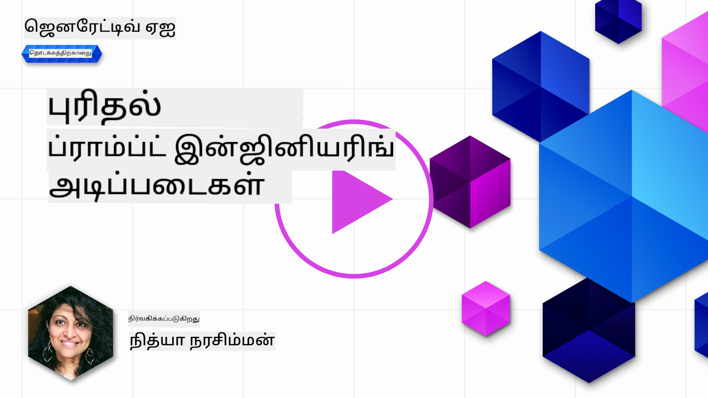
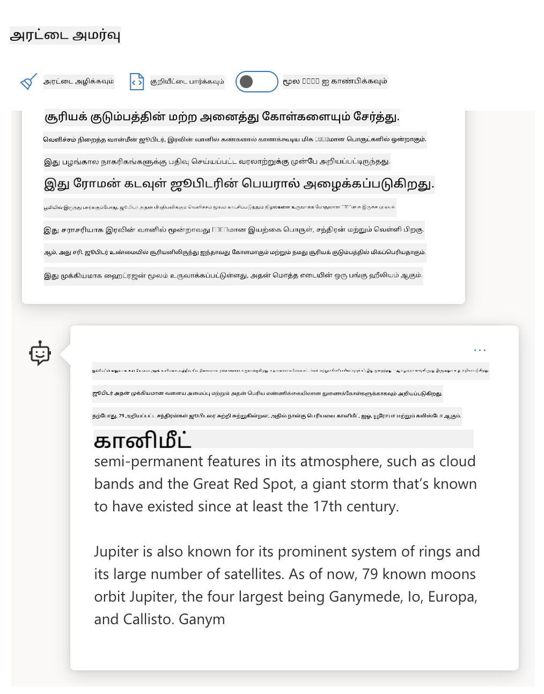
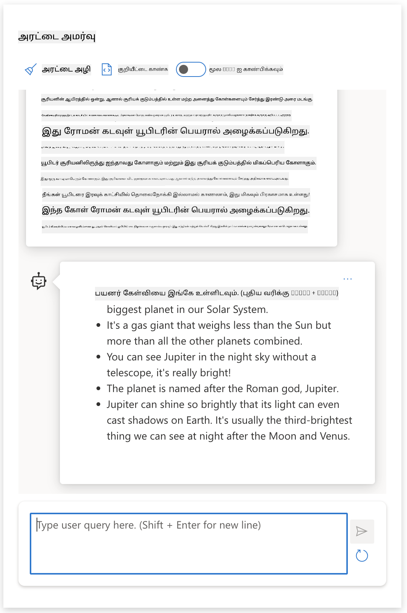
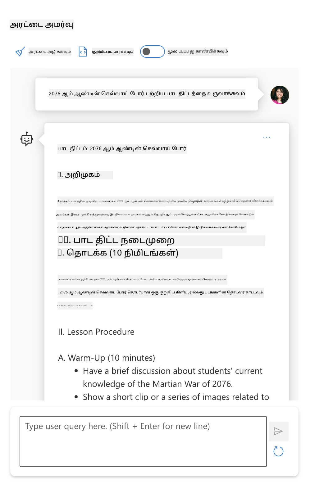

<!--
CO_OP_TRANSLATOR_METADATA:
{
  "original_hash": "0135e6c271f3ece8699050d4debbce88",
  "translation_date": "2025-10-18T02:45:41+00:00",
  "source_file": "04-prompt-engineering-fundamentals/README.md",
  "language_code": "ta"
}
-->
# ப்ராம்ப்ட் இன்ஜினியரிங் அடிப்படைகள்

[](https://youtu.be/GElCu2kUlRs?si=qrXsBvXnCW12epb8)

## அறிமுகம்
இந்த தொகுதி உருவாக்கும் AI மாதிரிகளில் பயனுள்ள ப்ராம்ப்ட்களை உருவாக்குவதற்கான அடிப்படை கருத்துகள் மற்றும் தொழில்நுட்பங்களை உள்ளடக்கியது. LLM க்கு நீங்கள் எழுதும் ப்ராம்ப்ட் முக்கியமானது. கவனமாக வடிவமைக்கப்பட்ட ப்ராம்ப்ட் ஒரு சிறந்த தரமான பதிலை பெற உதவுகிறது. ஆனால் _ப்ராம்ப்ட்_ மற்றும் _ப்ராம்ப்ட் இன்ஜினியரிங்_ போன்ற சொற்கள் உண்மையில் என்ன பொருள்? மேலும், LLM க்கு அனுப்பும் ப்ராம்ப்ட் _உள்ளீட்டை_ நான் எப்படி மேம்படுத்துவது? இந்த அத்தியாயம் மற்றும் அடுத்த அத்தியாயத்தில் இந்த கேள்விகளுக்கு பதிலளிக்க முயற்சிக்கிறோம்.

_உருவாக்கும் AI_ புதிய உள்ளடக்கங்களை (எ.கா., உரை, படங்கள், ஒலி, குறியீடு போன்றவை) பயனர் கோரிக்கைகளுக்கு பதிலளிக்க உருவாக்கும் திறன் கொண்டது. இது OpenAI இன் GPT ("Generative Pre-trained Transformer") தொடர் போன்ற _பெரிய மொழி மாதிரிகள்_ மூலம் இயல்பான மொழி மற்றும் குறியீட்டை பயன்படுத்த பயிற்சி அளிக்கப்படுகிறது.

பயனர்கள் எந்தவித தொழில்நுட்ப நிபுணத்துவம் அல்லது பயிற்சியின்றி, உரையாடல் போன்ற பரிச்சயமான முறைகளைப் பயன்படுத்தி இந்த மாதிரிகளுடன் தொடர்பு கொள்ள முடியும். இந்த மாதிரிகள் _ப்ராம்ப்ட் அடிப்படையிலானவை_ - பயனர்கள் ஒரு உரை உள்ளீட்டை (ப்ராம்ப்ட்) அனுப்பி AI பதிலை (நிறைவு) பெறுகிறார்கள். பின்னர் அவர்கள் "AI உடன் உரையாடல்" செய்யலாம், பல முறை உரையாடல்களில், பதில் எதிர்பார்ப்புகளை பூர்த்தி செய்யும் வரை ப்ராம்ப்ட்டை மேம்படுத்தலாம்.

"ப்ராம்ப்ட்கள்" இப்போது உருவாக்கும் AI பயன்பாடுகளுக்கான முதன்மை _திட்டமிடல் இடைமுகமாக_ மாறுகிறது, மாதிரிகள் என்ன செய்ய வேண்டும் மற்றும் திருப்பிய பதில்களின் தரத்தை பாதிக்கிறது. "ப்ராம்ப்ட் இன்ஜினியரிங்" என்பது _வடிவமைப்பு மற்றும் மேம்பாடு_ ஆகியவற்றில் கவனம் செலுத்தும் ஒரு விரைவாக வளர்ந்து வரும் ஆய்வு துறையாகும், இது அளவளாவிய மற்றும் தரமான பதில்களை வழங்குகிறது.

## கற்றல் இலக்குகள்

இந்த பாடத்தில், ப்ராம்ப்ட் இன்ஜினியரிங் என்றால் என்ன, அது ஏன் முக்கியம், மற்றும் ஒரு குறிப்பிட்ட மாதிரி மற்றும் பயன்பாட்டு நோக்கத்திற்காக எவ்வாறு பயனுள்ள ப்ராம்ப்ட்களை உருவாக்கலாம் என்பதை நாம் கற்றுக்கொள்கிறோம். ப்ராம்ப்ட் இன்ஜினியரிங்கிற்கான முக்கிய கருத்துகள் மற்றும் சிறந்த நடைமுறைகளைப் புரிந்துகொள்வோம் - மேலும் இந்த கருத்துகளை உண்மையான உதாரணங்களில் பயன்படுத்தும் ஒரு இடைமுக Jupyter Notebooks "sandbox" சூழலைப் பற்றி கற்றுக்கொள்வோம்.

இந்த பாடத்தின் முடிவில், நாம்:

1. ப்ராம்ப்ட் இன்ஜினியரிங் என்றால் என்ன மற்றும் அது ஏன் முக்கியம் என்பதை விளக்க முடியும்.
2. ப்ராம்ப்ட்டின் கூறுகள் மற்றும் அவை எவ்வாறு பயன்படுத்தப்படுகின்றன என்பதை விவரிக்க முடியும்.
3. ப்ராம்ப்ட் இன்ஜினியரிங்கிற்கான சிறந்த நடைமுறைகள் மற்றும் தொழில்நுட்பங்களை கற்றுக்கொள்ள முடியும்.
4. கற்றுக்கொண்ட தொழில்நுட்பங்களை OpenAI முடிவுநிலைப் புள்ளியைப் பயன்படுத்தி உண்மையான உதாரணங்களுக்கு பயன்படுத்த முடியும்.

## முக்கிய சொற்கள்

ப்ராம்ப்ட் இன்ஜினியரிங்: AI மாதிரிகளை விரும்பிய வெளியீடுகளை உருவாக்க வழிகாட்டுவதற்கான உள்ளீடுகளை வடிவமைத்து மேம்படுத்தும் நடைமுறை.
டோக்கனீசேஷன்: மாதிரி புரிந்து கொள்ளும் மற்றும் செயல்படுத்தும் சிறிய அலகுகளாக உரையை மாற்றும் செயல்முறை.
இன்ஸ்ட்ரக்ஷன்-ட்யூன்டு LLMs: குறிப்பிட்ட வழிகாட்டல்களுடன் பதிலளிப்பு துல்லியத்தையும் தொடர்புடையதையும் மேம்படுத்த பயிற்சி அளிக்கப்பட்ட பெரிய மொழி மாதிரிகள் (LLMs).

## கற்றல் சாண்ட்பாக்ஸ்

ப்ராம்ப்ட் இன்ஜினியரிங் தற்போது அறிவியல் அல்ல, கலை. இதற்கான நுண்ணறிவை மேம்படுத்துவதற்கான சிறந்த வழி _அதிகமாக பயிற்சி பெறுவது_ மற்றும் பரிந்துரைக்கப்பட்ட தொழில்நுட்பங்கள் மற்றும் மாதிரி-குறிப்பிட்ட மேம்பாடுகளுடன் இணைந்த பயன்பாட்டு துறை நிபுணத்துவத்தை இணைக்கும் முயற்சியை மேற்கொள்வது.

இந்த பாடத்துடன் வரும் Jupyter Notebook உங்களுக்கு கற்றுக்கொண்டதை முயற்சிக்க ஒரு _சாண்ட்பாக்ஸ்_ சூழலை வழங்குகிறது - நீங்கள் செல்லும் போது அல்லது இறுதியில் உள்ள குறியீட்டு சவாலின் ஒரு பகுதியாக. பயிற்சிகளை செயல்படுத்த, உங்களுக்கு தேவை:

1. **ஒரு Azure OpenAI API விசை** - ஒரு LLM க்கு சேவை முடிவுநிலை.
2. **ஒரு Python Runtime** - இதில் Notebook செயல்படுத்தப்படலாம்.
3. **உள்ளூர் சூழல் மாறிகள்** - _இப்போது [SETUP](./../00-course-setup/02-setup-local.md?WT.mc_id=academic-105485-koreyst) படிகளை முடிக்கவும்_.

Notebook _தொடக்க_ பயிற்சிகளுடன் வருகிறது - ஆனால் நீங்கள் உங்கள் சொந்த _Markdown_ (விளக்கம்) மற்றும் _Code_ (ப்ராம்ப்ட் கோரிக்கைகள்) பிரிவுகளைச் சேர்க்கவும் - மேலும் பல உதாரணங்கள் அல்லது யோசனைகளை முயற்சிக்கவும் - மற்றும் ப்ராம்ப்ட் வடிவமைப்பிற்கான உங்கள் நுண்ணறிவை உருவாக்கவும் ஊக்குவிக்கப்படுகிறது.

## விளக்கமான வழிகாட்டி

இந்த பாடம் என்ன கற்றுக்கொடுக்கிறது என்பதை நீங்கள் ஆழமாகப் புரிந்துகொள்ள விரும்புகிறீர்களா? இந்த விளக்கமான வழிகாட்டியைப் பாருங்கள், இது உள்ளடக்கப்பட்ட முக்கிய தலைப்புகளைப் பற்றிய ஒரு உணர்வை வழங்குகிறது மற்றும் ஒவ்வொன்றில் நீங்கள் யோசிக்க வேண்டிய முக்கிய எடுத்துக்காட்டுகளை வழங்குகிறது. பாடத்தின் சாலை வரைபடம் முக்கிய கருத்துகள் மற்றும் சவால்களைப் புரிந்துகொள்வதிலிருந்து, தொடர்புடைய ப்ராம்ப்ட் இன்ஜினியரிங் தொழில்நுட்பங்கள் மற்றும் சிறந்த நடைமுறைகளைப் பயன்படுத்தி அவற்றைத் தீர்க்கும் வரை உங்களை எடுத்துச் செல்கிறது. இந்த வழிகாட்டியில் "மேம்பட்ட தொழில்நுட்பங்கள்" பிரிவு இந்த பாடத்திட்டத்தின் _அடுத்த_ அத்தியாயத்தில் உள்ள உள்ளடக்கத்தை குறிப்பிடுகிறது.


## எங்கள் ஸ்டார்ட்அப்

இப்போது, _இந்த தலைப்பு_ எங்கள் ஸ்டார்ட்அப் நோக்கத்துடன் [கல்விக்கு AI புதுமையை கொண்டு வர](https://educationblog.microsoft.com/2023/06/collaborating-to-bring-ai-innovation-to-education?WT.mc_id=academic-105485-koreyst) எப்படி தொடர்புடையது என்பதைப் பற்றி பேசுவோம். நாங்கள் _தனிப்பயன் கற்றல்_ AI-இயக்கப்பட்ட பயன்பாடுகளை உருவாக்க விரும்புகிறோம் - எனவே எங்கள் பயன்பாட்டின் வெவ்வேறு பயனர்கள் "ப்ராம்ப்ட்களை" எப்படி "வடிவமைக்கிறார்கள்" என்பதைப் பற்றி சிந்திக்கலாம்:

- **நிர்வாகிகள்** AI-ஐ _கல்வி தரவுகளை பகுப்பாய்வு செய்து கவரேஜில் உள்ள இடைவெளிகளை அடையாளம் காண_ கேட்கலாம். AI முடிவுகளை சுருக்கமாகக் கூறலாம் அல்லது குறியீட்டுடன் அவற்றை காட்சிப்படுத்தலாம்.
- **கல்வியாளர்கள்** AI-ஐ _ஒரு இலக்கு பார்வையாளர் மற்றும் தலைப்பிற்கான பாட திட்டத்தை உருவாக்க_ கேட்கலாம். AI குறிப்பிட்ட வடிவத்தில் தனிப்பயன் திட்டத்தை உருவாக்க முடியும்.
- **மாணவர்கள்** AI-ஐ _கடினமான பாடத்தில் அவர்களுக்கு கற்றுத்தர_ கேட்கலாம். AI இப்போது மாணவர்களை அவர்களின் நிலைக்கு ஏற்ப பாடங்கள், குறிப்புகள் மற்றும் உதாரணங்களுடன் வழிநடத்த முடியும்.

அது வெறும் தொடக்கமே. [கல்விக்கான ப்ராம்ப்ட்கள்](https://github.com/microsoft/prompts-for-edu/tree/main?WT.mc_id=academic-105485-koreyst) - கல்வி நிபுணர்களால் தொகுக்கப்பட்ட ஒரு திறந்த மூல ப்ராம்ப்ட் நூலகத்தைப் பாருங்கள் - சாத்தியமானவற்றின் பரந்த உணர்வை பெற! _Sandbox அல்லது OpenAI Playground-இல் சில ப்ராம்ப்ட்களை இயக்கி என்ன நடக்கிறது என்பதைப் பாருங்கள்!_

## ப்ராம்ப்ட் இன்ஜினியரிங் என்றால் என்ன?

**ப்ராம்ப்ட் இன்ஜினியரிங்** என்பது ஒரு குறிப்பிட்ட பயன்பாட்டு நோக்கம் மற்றும் மாதிரிக்கான சீரான மற்றும் தரமான பதில்களை (நிறைவுகளை) வழங்க _உள்ளீடுகளை வடிவமைத்து மற்றும் மேம்படுத்தும்_ செயல்முறையாக வரையறுக்கப்பட்டது. இதை இரண்டு படி செயல்முறையாக நாம் சிந்திக்கலாம்:

- ஒரு குறிப்பிட்ட மாதிரி மற்றும் நோக்கத்திற்கான தொடக்க ப்ராம்ப்ட்டை _வடிவமைத்தல்_
- பதிலின் தரத்தை மேம்படுத்த _ப்ராம்ப்ட்டை_ மீண்டும் மீண்டும் _மேம்படுத்துதல்_

இது அவசியமாக சிறந்த முடிவுகளைப் பெற பயனர் நுண்ணறிவு மற்றும் முயற்சியைத் தேவைப்படும் ஒரு முயற்சி மற்றும் பிழை செயல்முறையாகும். எனவே இது ஏன் முக்கியம்? அந்த கேள்விக்கு பதிலளிக்க, முதலில் மூன்று கருத்துகளைப் புரிந்துகொள்ள வேண்டும்:

- _டோக்கனீசேஷன்_ = மாதிரி ப்ராம்ப்ட்டை "பார்க்கும்" விதம்
- _அடிப்படை LLMs_ = அடிப்படை மாதிரி ப்ராம்ப்ட்டை "செயலாக்கும்" விதம்
- _இன்ஸ்ட்ரக்ஷன்-ட்யூன்டு LLMs_ = மாதிரி "பணிகளை" எப்படி பார்க்க முடியும்

### டோக்கனீசேஷன்

ஒரு LLM ப்ராம்ப்ட்டுகளை _டோக்கன்களின் வரிசையாக_ பார்க்கிறது, இதில் வெவ்வேறு மாதிரிகள் (அல்லது ஒரு மாதிரியின் பதிப்புகள்) ஒரே ப்ராம்ப்ட்டை வெவ்வேறு வழிகளில் டோக்கனீசு செய்யலாம். LLMs டோக்கன்களில் (மற்றும் خام உரையில் அல்ல) பயிற்சி பெறுவதால், ப்ராம்ப்ட்கள் டோக்கனீசு செய்யப்படும் விதம் உருவாக்கப்பட்ட பதிலின் தரத்தை நேரடியாக பாதிக்கிறது.

டோக்கனீசேஷன் எப்படி செயல்படுகிறது என்பதைப் பற்றிய நுண்ணறிவைப் பெற, [OpenAI Tokenizer](https://platform.openai.com/tokenizer?WT.mc_id=academic-105485-koreyst) போன்ற கருவிகளை முயற்சிக்கவும். உங்கள் ப்ராம்ப்ட்டை நகலெடுத்து - அது டோக்கன்களாக மாற்றப்படும் விதத்தைப் பாருங்கள், வெற்றிட எழுத்துக்கள் மற்றும் குறியீட்டு குறியீடுகள் எப்படி கையாளப்படுகின்றன என்பதை கவனிக்கவும். இந்த உதாரணம் ஒரு பழைய LLM (GPT-3) ஐக் காட்டுகிறது - எனவே இதை ஒரு புதிய மாதிரியுடன் முயற்சிப்பது ஒரு வேறுபட்ட முடிவை உருவாக்கலாம்.


### கருத்து: அடிப்படை மாதிரிகள்

ஒரு ப்ராம்ப்ட் டோக்கனீசு செய்யப்பட்ட பிறகு, ["அடிப்படை LLM"](https://blog.gopenai.com/an-introduction-to-base-and-instruction-tuned-large-language-models-8de102c785a6?WT.mc_id=academic-105485-koreyst) (அல்லது அடிப்படை மாதிரி) இன் முதன்மை செயல்பாடு அந்த வரிசையில் டோக்கனை கணிக்க வேண்டும். LLMs பரந்த உரை தரவுத்தொகுப்புகளில் பயிற்சி பெறுவதால், டோக்கன்களுக்கிடையேயான புள்ளிவிவர உறவுகளை அவர்கள் நன்றாக உணர்கிறார்கள் மற்றும் அந்த கணிப்பை சில நம்பகத்தன்மையுடன் செய்ய முடியும். அவர்கள் ப்ராம்ப்ட்டில் அல்லது டோக்கனில் உள்ள சொற்களின் _அர்த்தத்தை_ புரிந்துகொள்ளவில்லை என்பதை கவனிக்கவும்; அவர்கள் "அடுத்த கணிப்புடன்" முடிக்கக்கூடிய ஒரு முறைமையை மட்டுமே பார்க்கிறார்கள். அவர்கள் பயனர் தலையீடு அல்லது சில முன்கூட்டியே நிறுவப்பட்ட நிலைமையால் முடிக்கப்படும் வரை வரிசையைத் தொடர்ந்து கணிக்க முடியும்.

ப்ராம்ப்ட் அடிப்படையிலான நிறைவை எப்படி செயல்படுத்துகிறது என்பதைப் பார்க்க விரும்புகிறீர்களா? மேலே உள்ள ப்ராம்ப்ட்டை Azure OpenAI Studio [_Chat Playground_](https://oai.azure.com/playground?WT.mc_id=academic-105485-koreyst) இல் இயல்புநிலை அமைப்புகளுடன் உள்ளிடவும். ப்ராம்ப்ட்களை தகவல் கோரிக்கைகளாக நடத்த அமைப்பு உள்ளமைக்கப்பட்டுள்ளது - எனவே இந்த சூழலை திருப்திப்படுத்தும் ஒரு நிறைவை நீங்கள் பார்க்க வேண்டும்.

ஆனால் பயனர் சில குறிப்பிட்ட அளவீடுகள் அல்லது பணியின் நோக்கத்தை பூர்த்தி செய்யும் ஒரு விஷயத்தைப் பார்க்க விரும்பினால் என்ன? இதுதான் _இன்ஸ்ட்ரக்ஷன்-ட்யூன்டு_ LLMs க்கு இடம் கிடைக்கும் இடம்.



### கருத்து: இன்ஸ்ட்ரக்ஷன் ட்யூன்டு LLMs

ஒரு [இன்ஸ்ட்ரக்ஷன் ட்யூன்டு LLM](https://blog.gopenai.com/an-introduction-to-base-and-instruction-tuned-large-language-models-8de102c785a6?WT.mc_id=academic-105485-koreyst) அடிப்படை மாதிரியுடன் தொடங்குகிறது மற்றும் தெளிவான வழிகாட்டல்களைக் கொண்ட உதாரணங்கள் அல்லது உள்ளீடு/வெளியீட்டு ஜோடிகளுடன் (எ.கா., பல முறை "செய்திகள்") அதை நன்றாகத் தயாரிக்கிறது - மேலும் AI இன் பதில் அந்த வழிகாட்டல்களை பின்பற்ற முயற்சிக்கிறது.

இது மனித கருத்து மூலம் பலனளிக்கும் பயிற்சி (RLHF) போன்ற தொழில்நுட்பங்களைப் பயன்படுத்துகிறது, இது மாதிரியை _வழிகாட்டல்களை பின்பற்ற_ மற்றும் _கருத்து மூலம் கற்றுக்கொள்ள_ பயிற்சி அளிக்க முடியும், எனவே இது நடைமுறை பயன்பாடுகளுக்கு மிகவும் பொருத்தமான மற்றும் பயனர் நோக்கங்களுக்கு பொருத்தமான பதில்களை உருவாக்குகிறது.

இதை முயற்சிக்கலாம் - மேலே உள்ள ப்ராம்ப்ட்டை மீண்டும் பாருங்கள், ஆனால் இப்போது _சிஸ்டம் செய்தியை_ பின்வரும் வழிகாட்டலாக மாற்றவும்:

> _உங்களுக்கு வழங்கப்பட்ட உள்ளடக்கத்தை இரண்டாம் வகுப்பு மாணவருக்காக சுருக்கவும். முடிவை மூன்று முதல் ஐந்து புள்ளிகளுடன் ஒரு பத்தியில் வைத்திருக்கவும்._

முடிவு இப்போது விரும்பிய இலக்கு மற்றும் வடிவத்தை பிரதிபலிக்க எப்படி ட்யூனாகிறது என்பதைப் பாருங்கள்? ஒரு கல்வியாளர் இப்போது அந்த வகுப்பிற்கான தனது ஸ்லைடுகளில் இந்த பதிலை நேரடியாகப் பயன்படுத்த முடியும்.



## ஏன் ப்ராம்ப்ட் இன்ஜினியரிங் தேவை?

இப்போது ப்ராம்ப்ட்கள் LLMs மூலம் எப்படி செயல்படுகின்றன என்பதை நாம் அறிந்துகொண்டோம், ப்ராம்ப்ட் இன்ஜினியரிங் _ஏன்_ தேவை என்பதைப் பற்றி பேசுவோம். பதில் தற்போதைய LLMs _நம்பகமான மற்றும் சீரான நிறைவுகளை_ அடைவதை சவாலாக ஆக்கும் பல சவால்களை உருவாக்குவதில் உள்ளது, ப்ராம்ப்ட் கட்டமைப்பு மற்றும் மேம்பாட்டில் முயற்சி செய்யாமல். உதாரணமாக:

1. **மாதிரி பதில்கள் சோஸ்டிக்டிக்.** _அதே ப்ராம்ப்ட்_ வெவ்வேறு மாதிரிகள் அல்லது மாதிரி பதிப்புகளுடன் வெவ்வேறு பதில்களை உருவாக்கும் வாய்ப்பு உள்ளது. மேலும் இது _அதே மாதிரியுடன்_ வெவ்வேறு நேரங்களில் வெவ்வேறு முடிவுகளை உருவாக்கலாம். _ப்ராம்ப்ட் இன்ஜினியரிங் தொழில்நுட்பங்கள் இந்த மாறுபாடுகளை குறைக்க சிறந்த பாதுகாப்புகளை வழங்க உதவுகிறது_.

1. **மாதிரிகள் பதில்களை உருவாக்கலாம்.** மாதிரிகள் _பெரிய ஆனால் முடிவுள்ள_ தரவுத்தொகுப்புகளுடன் முன்பயிற்சி பெறுவதால், அந்த பயிற்சியின் வரம்புக்கு வெளியே உள்ள கருத்துகள் பற்றிய அறிவு இல்லை. இதன் விளைவாக, அவை தவறான, கற்பனை அல்லது அறியப்பட்ட உண்மைகளுக்கு நேரடியாக முரண்படும் நிறைவுகளை உருவாக்க முட
ஒரு இணைய தேடலில், மார்டியன் போர்களைப் பற்றிய கற்பனை கதைகள் (எ.கா., தொலைக்காட்சி தொடர்கள் அல்லது புத்தகங்கள்) இருந்தன என்று காட்டியது - ஆனால் 2076-ல் எதுவும் இல்லை. பொதுவான அறிவு 2076 என்பது _எதிர்காலத்தில்_ உள்ளதாகவும், எனவே அது ஒரு உண்மையான நிகழ்வுடன் தொடர்புடையதாக இருக்க முடியாது என்றும் கூறுகிறது.

அவ்வாறு இருக்கும்போது, இந்த கேள்வியை வெவ்வேறு LLM வழங்குநர்களுடன் இயக்கினால் என்ன நடக்கும்?

> **பதில் 1**: OpenAI Playground (GPT-35)


> **பதில் 2**: Azure OpenAI Playground (GPT-35)



> **பதில் 3**: Hugging Face Chat Playground (LLama-2)


எதிர்பார்த்தபடி, ஒவ்வொரு மாதிரியும் (அல்லது மாதிரி பதிப்பும்) சற்றே மாறுபட்ட பதில்களை உருவாக்குகிறது, இது ஸ்டோகாஸ்டிக் நடத்தை மற்றும் மாதிரி திறன்களின் வேறுபாடுகளால் ஏற்படுகிறது. உதாரணமாக, ஒரு மாதிரி 8-ஆம் வகுப்பு மாணவர்களை இலக்காகக் கொண்டுள்ளது, மற்றொன்று உயர்நிலை பள்ளி மாணவர்களைப் பொருத்தமாகக் கருதுகிறது. ஆனால் மூன்று மாதிரிகளும், தகவல் அறியாத பயனாளரை அந்த நிகழ்வு உண்மையானது என்று நம்ப வைக்கக்கூடிய பதில்களை உருவாக்கின.

_prompt engineering_ போன்ற தொழில்நுட்பங்கள், _metaprompting_ மற்றும் _temperature configuration_ மாதிரி fabrication-ஐ ஒரு அளவுக்கு குறைக்கலாம். புதிய prompt engineering _architectures_ கூட புதிய கருவிகள் மற்றும் தொழில்நுட்பங்களை prompt flow-க்கு எளிதாக இணைக்கிறது, இந்த விளைவுகளை குறைக்க அல்லது கட்டுப்படுத்த.

## வழக்குக்கான ஆய்வு: GitHub Copilot

இந்த பிரிவை முடிக்க, prompt engineering எப்படி உண்மையான உலக தீர்வுகளில் பயன்படுத்தப்படுகிறது என்பதை GitHub Copilot என்ற ஒரு வழக்குக்கான ஆய்வை பார்த்து புரிந்துகொள்வோம்: [GitHub Copilot](https://github.com/features/copilot?WT.mc_id=academic-105485-koreyst).

GitHub Copilot உங்கள் "AI Pair Programmer" ஆகும் - இது உரை prompt-களை code completions-ஆக மாற்றுகிறது மற்றும் உங்கள் development environment (எ.கா., Visual Studio Code) உடன் ஒருங்கிணைக்கப்படுகிறது, seamless user experience-ஐ வழங்க. கீழே உள்ள blog தொடர்களில் documentation செய்யப்பட்டுள்ளபடி, OpenAI Codex மாதிரியை அடிப்படையாகக் கொண்டது - ஆனால் code quality-ஐ மேம்படுத்த, மாதிரியை fine-tune செய்யவும், prompt engineering தொழில்நுட்பங்களை மேம்படுத்தவும், July மாதத்தில் [Codex-ஐ மீறிய மேம்பட்ட AI மாதிரியை அறிமுகப்படுத்தினர்](https://github.blog/2023-07-28-smarter-more-efficient-coding-github-copilot-goes-beyond-codex-with-improved-ai-model/?WT.mc_id=academic-105485-koreyst) மேலும் வேகமான பரிந்துரைகளுக்காக.

அவர்களின் கற்றல் பயணத்தைப் பின்தொடர, பதிவுகளை வரிசையாக படிக்கவும்.

- **மே 2023** | [GitHub Copilot உங்கள் கோடுகளைப் புரிந்துகொள்ள சிறப்பாகிறது](https://github.blog/2023-05-17-how-github-copilot-is-getting-better-at-understanding-your-code/?WT.mc_id=academic-105485-koreyst)
- **மே 2023** | [GitHub-இல் உள்ளே: GitHub Copilot-க்கு பின்னால் உள்ள LLM-களுடன் வேலை செய்வது](https://github.blog/2023-05-17-inside-github-working-with-the-llms-behind-github-copilot/?WT.mc_id=academic-105485-koreyst).
- **ஜூன் 2023** | [GitHub Copilot-க்கு சிறந்த prompt-களை எழுதுவது எப்படி](https://github.blog/2023-06-20-how-to-write-better-prompts-for-github-copilot/?WT.mc_id=academic-105485-koreyst).
- **ஜூலை 2023** | [GitHub Copilot மேம்பட்ட AI மாதிரியுடன் Codex-ஐ மீறுகிறது](https://github.blog/2023-07-28-smarter-more-efficient-coding-github-copilot-goes-beyond-codex-with-improved-ai-model/?WT.mc_id=academic-105485-koreyst)
- **ஜூலை 2023** | [Prompt Engineering மற்றும் LLM-களுக்கான ஒரு Developer's Guide](https://github.blog/2023-07-17-prompt-engineering-guide-generative-ai-llms/?WT.mc_id=academic-105485-koreyst)
- **செப்டம்பர் 2023** | [ஒரு Enterprise LLM App-ஐ உருவாக்குவது எப்படி: GitHub Copilot-ல் இருந்து கற்றுக்கொள்ளும் பாடங்கள்](https://github.blog/2023-09-06-how-to-build-an-enterprise-llm-application-lessons-from-github-copilot/?WT.mc_id=academic-105485-koreyst)

மேலும் [Engineering blog](https://github.blog/category/engineering/?WT.mc_id=academic-105485-koreyst) ஐ உலாவவும், [இந்த பதிவு](https://github.blog/2023-09-27-how-i-used-github-copilot-chat-to-build-a-reactjs-gallery-prototype/?WT.mc_id=academic-105485-koreyst) போன்ற மேலும் பல பதிவுகளைப் பார்க்க, இவை மாதிரிகள் மற்றும் தொழில்நுட்பங்கள் எப்படி உண்மையான உலக பயன்பாடுகளுக்கு _பயன்படுத்தப்படுகின்றன_ என்பதை காட்டுகிறது.

---

## Prompt அமைப்பு

_prompt engineering_ ஏன் முக்கியம் என்பதை நாம் பார்த்தோம் - இப்போது prompt-கள் எப்படி _அமைக்கப்படுகின்றன_ என்பதைப் புரிந்துகொள்வோம், மேலும் திறமையான prompt design-க்கு வெவ்வேறு தொழில்நுட்பங்களை மதிப்பீடு செய்யலாம்.

### அடிப்படை Prompt

அடிப்படை prompt-இன் உதாரணத்துடன் தொடங்குவோம்: எந்தவொரு பிற சூழலையும் இல்லாமல் மாதிரிக்கு அனுப்பப்படும் ஒரு உரை உள்ளீடு. இதோ ஒரு உதாரணம் - US தேசிய கீதத்தின் முதல் சில வார்த்தைகளை OpenAI [Completion API](https://platform.openai.com/docs/api-reference/completions?WT.mc_id=academic-105485-koreyst) க்கு அனுப்பும்போது, அது உடனடியாக அடுத்த சில வரிகளுடன் பதிலளிக்கிறது, அடிப்படை கணிப்பு நடத்தை விளக்குகிறது.

| Prompt (Input)     | Completion (Output)                                                                                                                        |
| :----------------- | :----------------------------------------------------------------------------------------------------------------------------------------- |
| Oh say can you see | இது "The Star-Spangled Banner," அமெரிக்க தேசிய கீதத்தின் பாடல் வரிகளை நீங்கள் தொடங்குகிறீர்கள் என்று தோன்றுகிறது. முழு பாடல் வரிகள் ... |

### சிக்கலான Prompt

இப்போது அந்த அடிப்படை prompt-க்கு சூழல் மற்றும் வழிகாட்டுதல்களைச் சேர்ப்போம். [Chat Completion API](https://learn.microsoft.com/azure/ai-services/openai/how-to/chatgpt?WT.mc_id=academic-105485-koreyst) மூலம், _messages_ தொகுப்பாக ஒரு சிக்கலான prompt-ஐ அமைக்க முடியும்:

- _user_ உள்ளீடு மற்றும் _assistant_ பதில்களை பிரதிபலிக்கும் Input/output ஜோடிகள்.
- System message, assistant நடத்தை அல்லது தனித்துவத்திற்கான சூழலை அமைக்கிறது.

கோரிக்கை கீழே உள்ள வடிவத்தில் உள்ளது, இங்கு _tokenization_ சூழல் மற்றும் உரையாடலிலிருந்து தொடர்புடைய தகவல்களைப் பிடிக்கிறது. இப்போது, system context-ஐ மாற்றுவது, user inputs வழங்கப்பட்ட தரத்திற்கு சமமாக, completions தரத்தைப் பாதிக்கக்கூடியது.

```python
response = openai.chat.completions.create(
    model="gpt-3.5-turbo",
    messages=[
        {"role": "system", "content": "You are a helpful assistant."},
        {"role": "user", "content": "Who won the world series in 2020?"},
        {"role": "assistant", "content": "The Los Angeles Dodgers won the World Series in 2020."},
        {"role": "user", "content": "Where was it played?"}
    ]
)
```

### Instruction Prompt

மேலே உள்ள உதாரணங்களில், user prompt ஒரு எளிய உரை கேள்வியாக இருந்தது, இது தகவலுக்கான கோரிக்கையாக解釈 செய்யப்படுகிறது. _Instruction_ prompt-களுடன், AI-க்கு சிறந்த வழிகாட்டுதலை வழங்க, அந்த உரையை மேலும் விவரமாக ஒரு பணியை குறிப்பிட பயன்படுத்தலாம். இதோ ஒரு உதாரணம்:

| Prompt (Input)                                                                                                                                                                                                                         | Completion (Output)                                                                                                        | Instruction Type    |
| :------------------------------------------------------------------------------------------------------------------------------------------------------------------------------------------------------------------------------------- | :------------------------------------------------------------------------------------------------------------------------- | :------------------ |
| Write a description of the Civil War                                                                                                                                                                                                   | _ஒரு எளிய பத்தியைத் திருப்பியது_                                                                                              | Simple              |
| Write a description of the Civil War. Provide key dates and events and describe their significance                                                                                                                                     | _ஒரு பத்தி மற்றும் முக்கிய நிகழ்வுகளின் தேதிகளின் பட்டியலை திருப்பியது_                                                        | Complex             |
| Write a description of the Civil War in 1 paragraph. Provide 3 bullet points with key dates and their significance. Provide 3 more bullet points with key historical figures and their contributions. Return the output as a JSON file | _JSON வடிவத்தில் விரிவான விவரங்களை திருப்பியது, அதை ஒரு கோப்பில் நகலெடுத்து சரிபார்க்கலாம்_                                      | Complex. Formatted. |

## முதன்மை உள்ளடக்கம்

மேலே உள்ள உதாரணங்களில், prompt இன்னும் மிகவும் திறந்த முடிவாக இருந்தது, LLM-க்கு அதன் முன் பயிற்சி dataset-ல் தொடர்புடையது என்ன என்பதை முடிவு செய்ய அனுமதித்தது. _Primary content_ வடிவமைப்பு முறை மூலம், உள்ளீட்டு உரை இரண்டு பகுதிகளாக பிரிக்கப்படுகிறது:

- ஒரு வழிகாட்டுதல் (செயல்)
- தொடர்புடைய உள்ளடக்கம் (செயல்களை பாதிக்கிறது)

இங்கே ஒரு உதாரணம் உள்ளது, இதில் வழிகாட்டுதல் "இதனை 2 வரிகளில் சுருக்கவும்" என்று உள்ளது.

| Prompt (Input)                                                                                                                                                                                                                                                                                                                                                                                                                                                                                                                                                                                                                                                                                      | Completion (Output)                                                                                                                                                                                                                                                                             |
| :-------------------------------------------------------------------------------------------------------------------------------------------------------------------------------------------------------------------------------------------------------------------------------------------------------------------------------------------------------------------------------------------------------------------------------------------------------------------------------------------------------------------------------------------------------------------------------------------------------------------------------------------------------------------------------------------------- | :---------------------------------------------------------------------------------------------------------------------------------------------------------------------------------------------------------------------------------------------------------------------------------------------- |
| Jupiter is the fifth planet from the Sun and the largest in the Solar System. It is a gas giant with a mass one-thousandth that of the Sun, but two-and-a-half times that of all the other planets in the Solar System combined. Jupiter is one of the brightest objects visible to the naked eye in the night sky, and has been known to ancient civilizations since before recorded history. It is named after the Roman god Jupiter.[19] When viewed from Earth, Jupiter can be bright enough for its reflected light to cast visible shadows,[20] and is on average the third-brightest natural object in the night sky after the Moon and Venus. <br/> **Summarize this in 2 short sentences** | Jupiter, the fifth planet from the Sun, is the largest in the Solar System and is known for being one of the brightest objects in the night sky. Named after the Roman god Jupiter, it's a gas giant whose mass is two-and-a-half times that of all other planets in the Solar System combined. |

முதன்மை உள்ளடக்க பகுதி பல்வேறு வழிகளில் பயன்படுத்தப்படலாம், மேலும் திறமையான வழிகாட்டுதல்களை இயக்க:

- **உதாரணங்கள்** - AI-க்கு என்ன செய்ய வேண்டும் என்பதை வெளிப்படையாகக் கூறுவதற்கு பதிலாக, சில உதாரணங்களை வழங்கி, மாதிரிக்கு pattern-ஐ infer செய்ய அனுமதிக்கவும்.
- **Cues** - வழிகாட்டுதலுக்குப் பின்பு "cue" கொடுக்கவும், இது மாதிரியை தொடர்புடைய பதில்களுக்கு வழிகாட்டுகிறது.
- **Templates** - இவை repeatable 'recipes' ஆகும், prompt-களுக்கான placeholders (variables) உடன், குறிப்பிட்ட பயன்பாடுகளுக்கான தரவுடன் தனிப்பயனாக்கப்படலாம்.

இவை செயல்படுவது எப்படி என்பதை ஆராய்வோம்.

### உதாரணங்களைப் பயன்படுத்துதல்

இது ஒரு அணுகுமுறை, இதில் நீங்கள் primary content-ஐ பயன்படுத்தி, ஒரு குறிப்பிட்ட வழிகாட்டுதலுக்கான விரும்பிய output-ஐ சில உதாரணங்களை "மாதிரிக்கு உணவளிக்க" கொடுக்கிறீர்கள், மேலும் விரும்பிய output-க்கு pattern-ஐ infer செய்ய அனுமதிக்கிறீர்கள். வழங்கப்பட்ட உதாரணங்களின் எண்ணிக்கையைப் பொறுத்து, zero-shot prompting, one-shot prompting, few-shot prompting போன்றவை இருக்கலாம்.

Prompt இப்போது மூன்று கூறுகளைக் கொண்டுள்ளது:

- ஒரு பணியின் விளக்கம்
- விரும்பிய output-ஐ சில உதாரணங்கள்
- ஒரு புதிய உதாரணத்தின் தொடக்கம் (இது ஒரு மறைமுக task description ஆகிறது)

| Learning Type | Prompt (Input)                                                                                                                                        | Completion (Output)         |
| :------------ | :---------------------------------------------------------------------------------------------------------------------------------------------------- | :-------------------------- |
| Zero-shot     | "The Sun is Shining". Translate to Spanish                                                                                                            | "El Sol está brillando".    |
| One-shot      | "The Sun is Shining" => ""El Sol está brillando". <br> "It's a Cold and Windy Day" =>                                                                 | "Es un día frío y ventoso". |
| Few-shot      | The player ran the bases => Baseball <br/> The player hit an ace => Tennis <br/> The player hit a six => Cricket <br/> The player made a slam-dunk => | Basketball                  |
|               |                                                                                                                                                       |                             |

Zero-shot prompting-ல் explicit instruction ("Translate to Spanish") கொடுக்க வேண்டியிருந்தது, ஆனால் அது one-shot prompting உதாரணத்தில் infer செய்யப்படுகிறது. Few-shot prompting உதாரணம், மேலும் பல உதாரணங்களைச் சேர்ப்பது, எந்த கூடுதல் வழிகாட்டுதலுமின்றி மாதிரிகள் துல்லியமான inference செய்ய அனுமதிக்கிறது என்பதை காட்டுகிறது.

### Prompt Cues

Primary content-ஐ பயன்படுத்துவதற்கான மற்றொரு தொழில்நுட்பம் _cues_ வழங்குவது. இந்த வழியில், நாம் மாதிரிக்கு _தொடக்கத்தை_ கொடுத்து, விரும்பிய output வடிவத்தை பிரதிபலிக்கிறோம். மாதிரி அதைத் தொடர்ந்து அந்த வடிவத்தில் பதிலளிக்கிறது.

| Number of Cues | Prompt (Input)                                                                                                                                                                                                                                                                                                                                                                                                                                               | Completion (Output)                                                                                                                                                                                                                                                                                       |
| :------------- | :----------------------------------------------------------------------------------------------------------------------------------------------------------------------------------------------------------------------------------------------------------------------------------------------------------------------------------------------------------------------------------------------------------------------------------------------------------- | :-------------------------------------------------------------------------------------------------------------------------------------------------------------------------------------------------------------------------------------------------------------------------------------------------------- |
| 0              | Jupiter is the fifth planet from the Sun and the largest in the Solar System. It is a gas giant with a mass one-thousandth that of the Sun, but two-and-a-half times that of all the other planets in the Solar System combined. Jupiter is one of the brightest objects visible to the naked eye in the night sky, and has been known to ancient civilizations since before recorded history. <br/>**Summarize This**                                       | Jupiter is the largest planet in our Solar System and the fifth one from the Sun. It is a gas giant with a mass 1/1000th of the Sun's, but it is heavier than all the other planets combined. Ancient civilizations have known about Jupiter for a long time, and it is easily visible in the night sky.. |
| 1              | வியாழன் சூரியனிலிருந்து ஐந்தாவது கோள் மற்றும் சூரியக் குடும்பத்தில் மிகப்பெரிய கோளாகும். இது ஒரு வாயு மாபெரும் கோளாகும், சூரியனின் மொத்த எடையின் ஆயிரத்தில் ஒரு பங்கு எடையைக் கொண்டது, ஆனால் சூரியக் குடும்பத்தில் உள்ள மற்ற கோள்களின் மொத்த எடையை விட இரண்டு மடங்கு அதிகமாக உள்ளது. வியாழன் இரவு வானத்தில் கண்களுக்குத் தெளிவாகத் தெரியும் பிரகாசமான பொருட்களில் ஒன்றாகும், மேலும் வரலாற்று பதிவுகளுக்கு முன்பே பழங்கால நாகரிகங்களுக்கு அறியப்பட்டதாகும். <br/>**சுருக்கமாகச் சொல்லுங்கள்** <br/> நாம் கற்றுக்கொண்டது என்னவென்றால், வியாழன் | சூரியனிலிருந்து ஐந்தாவது கோள் மற்றும் சூரியக் குடும்பத்தில் மிகப்பெரிய கோளாகும். இது ஒரு வாயு மாபெரும் கோளாகும், சூரியனின் மொத்த எடையின் ஆயிரத்தில் ஒரு பங்கு எடையைக் கொண்டது, ஆனால் மற்ற கோள்களின் மொத்த எடையை விட இரண்டு மடங்கு அதிகமாக உள்ளது. இது கண்களுக்குத் தெளிவாகத் தெரியும் மற்றும் பழங்காலத்திலிருந்தே அறியப்பட்டதாகும்.                        |
| 2              | வியாழன் சூரியனிலிருந்து ஐந்தாவது கோள் மற்றும் சூரியக் குடும்பத்தில் மிகப்பெரிய கோளாகும். இது ஒரு வாயு மாபெரும் கோளாகும், சூரியனின் மொத்த எடையின் ஆயிரத்தில் ஒரு பங்கு எடையைக் கொண்டது, ஆனால் சூரியக் குடும்பத்தில் உள்ள மற்ற கோள்களின் மொத்த எடையை விட இரண்டு மடங்கு அதிகமாக உள்ளது. வியாழன் இரவு வானத்தில் கண்களுக்குத் தெளிவாகத் தெரியும் பிரகாசமான பொருட்களில் ஒன்றாகும், மேலும் வரலாற்று பதிவுகளுக்கு முன்பே பழங்கால நாகரிகங்களுக்கு அறியப்பட்டதாகும். <br/>**சுருக்கமாகச் சொல்லுங்கள்** <br/> நாம் கற்றுக்கொண்ட முக்கியமான 3 தகவல்கள்:         | 1. வியாழன் சூரியனிலிருந்து ஐந்தாவது கோள் மற்றும் சூரியக் குடும்பத்தில் மிகப்பெரிய கோளாகும். <br/> 2. இது ஒரு வாயு மாபெரும் கோளாகும், சூரியனின் மொத்த எடையின் ஆயிரத்தில் ஒரு பங்கு எடையைக் கொண்டது...<br/> 3. வியாழன் பழங்காலத்திலிருந்தே கண்களுக்குத் தெளிவாகத் தெரியும் ...                                                                       |
|                |                                                                                                                                                                                                                                                                                                                                                                                                                                                              |                                                                                                                                                                                                                                                                                                           |

### ப்ராம்ப்ட் டெம்ப்ளேட்கள்

ஒரு ப்ராம்ப்ட் டெம்ப்ளேட் என்பது _முன்கூட்டியே வரையறுக்கப்பட்ட ஒரு ப்ராம்ப்ட் செய்முறை_ ஆகும், இது ஒரு குறிப்பிட்ட அளவில் பயனர் அனுபவங்களை சீராக இயக்குவதற்காக சேமிக்கப்படவும், மீண்டும் பயன்படுத்தப்படவும் செய்யப்படுகிறது. இதன் எளிய வடிவத்தில், இது [OpenAI இல் இருந்து](https://platform.openai.com/examples?WT.mc_id=academic-105485-koreyst) உள்ளதைப் போன்ற ப்ராம்ப்ட் எடுத்துக்காட்டுகளின் தொகுப்பாகும், இது தொடர்பு ப்ராம்ப்ட் கூறுகள் (பயனர் மற்றும் அமைப்பு செய்திகள்) மற்றும் API-இன் மூலம் இயக்கப்படும் கோரிக்கை வடிவத்தை வழங்குகிறது - மீண்டும் பயன்படுத்துவதற்கு ஆதரவு அளிக்கிறது.

அதன் சிக்கலான வடிவத்தில், [LangChain இல் உள்ள எடுத்துக்காட்டைப் போல](https://python.langchain.com/docs/concepts/prompt_templates/?WT.mc_id=academic-105485-koreyst), இது _பதிலிடும் இடங்களை_ கொண்டுள்ளது, அவை பயனர் உள்ளீடு, அமைப்பு சூழல், வெளிப்புற தரவுத்தொகுப்புகள் போன்ற பல்வேறு மூலங்களிலிருந்து தரவுடன் மாற்றப்படலாம், ப்ராம்ப்ட்டை தானாக உருவாக்க. இது மீண்டும் பயன்படுத்தக்கூடிய ப்ராம்ப்ட்களை உருவாக்குவதற்கான நூலகத்தை உருவாக்க அனுமதிக்கிறது, இது **தானியங்கியாக** பெரிய அளவில் சீரான பயனர் அனுபவங்களை இயக்க பயன்படுத்தப்படலாம்.

இறுதியாக, டெம்ப்ளேட்களின் உண்மையான மதிப்பு _குறுக்குவிருத்தி பயன்பாட்டு துறைகளுக்கான_ ப்ராம்ப்ட் நூலகங்களை உருவாக்குவதில் உள்ளது - இங்கு ப்ராம்ப்ட் டெம்ப்ளேட் தற்போது _சீரமைக்கப்பட்டு_ பயன்பாட்டு-குறிப்பிட்ட சூழல் அல்லது எடுத்துக்காட்டுகளை பிரதிபலிக்கிறது, இது இலக்கு பயனர் பார்வையாளர்களுக்கு பதில்களை மேலும் பொருத்தமாகவும் துல்லியமாகவும் ஆக்குகிறது. [Prompts For Edu](https://github.com/microsoft/prompts-for-edu?WT.mc_id=academic-105485-koreyst) தொகுப்பு இந்த அணுகுமுறையின் ஒரு சிறந்த எடுத்துக்காட்டாகும், பாடத்திட்ட திட்டமிடல், பாடத்திட்ட வடிவமைப்பு, மாணவர் வழிகாட்டுதல் போன்ற முக்கிய நோக்கங்களுக்குக் கவனம் செலுத்தி கல்வி துறைக்கான ப்ராம்ப்ட்களை தொகுத்து வழங்குகிறது.

## ஆதரவு உள்ளடக்கம்

ப்ராம்ப்ட் கட்டமைப்பை ஒரு பணிக்குறிப்பு (கட்டளைகள்) மற்றும் ஒரு இலக்கு (முதன்மை உள்ளடக்கம்) கொண்டதாகக் கருதினால், _இரண்டாம் நிலை உள்ளடக்கம்_ என்பது **பதிலின் வெளியீட்டை ஒரு வகையில் பாதிக்க** நாம் வழங்கும் கூடுதல் சூழலாகும். இது மாடல் பதிலை _தனிப்பயனாக்க_ உதவக்கூடிய துன்னல் அளவீடுகள், வடிவமைப்பு வழிமுறைகள், தலைப்புகள் போன்றவை ஆகும்.

உதாரணமாக: Fall 2023 பாடத்திட்டத்திற்கான விரிவான மெட்டாடேட்டா (பெயர், விளக்கம், நிலை, மெட்டாடேட்டா குறிச்சொற்கள், பயிற்றுநர் போன்றவை) கொண்ட ஒரு பாடத்திட்டக் கையேட்டைக் கொடுக்கப்பட்டால்:

- "Fall 2023 பாடத்திட்டக் கையேட்டை சுருக்கவும்" என்ற பணிக்குறிப்பை வரையறுக்கலாம்
- விரும்பிய பதிலின் வடிவத்தை சில எடுத்துக்காட்டுகளுடன் முதன்மை உள்ளடக்கமாக வழங்கலாம்
- இரண்டாம் நிலை உள்ளடக்கத்தைப் பயன்படுத்தி முக்கியமான 5 "குறிச்சொற்களை" அடையாளம் காணலாம்.

இப்போது, மாடல் சில எடுத்துக்காட்டுகள் காட்டிய வடிவத்தில் சுருக்கத்தை வழங்க முடியும் - ஆனால் ஒரு முடிவில் பல குறிச்சொற்கள் இருந்தால், இரண்டாம் நிலை உள்ளடக்கத்தில் அடையாளம் காணப்பட்ட 5 குறிச்சொற்களை முன்னுரிமை அளிக்க முடியும்.

---

<!--
பாடம் டெம்ப்ளேட்:
இந்த அலகு முக்கிய கருத்து #1 ஐ உள்ளடக்க வேண்டும்.
எடுத்துக்காட்டுகள் மற்றும் குறிப்புகளுடன் கருத்தை வலுப்படுத்தவும்.
-->

## ப்ராம்ப்டிங் சிறந்த நடைமுறைகள்

ப்ராம்ப்ட்கள் எப்படி _கட்டமைக்கப்படுகின்றன_ என்பதை நாம் அறிந்த பிறகு, சிறந்த நடைமுறைகளை பிரதிபலிக்க அவற்றை எப்படி _வடிவமைக்க_ வேண்டும் என்பதைப் பற்றி சிந்திக்கத் தொடங்கலாம். இதை இரண்டு பகுதிகளாகப் பிரிக்கலாம் - சரியான _மனோபாவம்_ மற்றும் சரியான _தொழில்நுட்பங்களை_ பயன்படுத்துதல்.

### ப்ராம்ப்ட் என்ஜினியரிங் மனோபாவம்

ப்ராம்ப்ட் என்ஜினியரிங் என்பது ஒரு முயற்சி மற்றும் தவறான செயல்முறை ஆகும், எனவே மூன்று பரந்த வழிகாட்டும் காரணிகளை மனதில் கொள்ளுங்கள்:

1. **துறை புரிதல் முக்கியம்.** பதிலின் துல்லியமும் பொருத்தமும் அந்த பயன்பாடு அல்லது பயனர் இயங்கும் _துறையின்_ செயல்பாட்டின் ஒரு செயல்பாடு ஆகும். உங்கள் உள்ளுணர்வு மற்றும் துறை நிபுணத்துவத்தை பயன்படுத்தி **தொழில்நுட்பங்களை தனிப்பயனாக்கவும்**. உதாரணமாக, உங்கள் அமைப்பு ப்ராம்ப்ட்களில் _துறை-குறிப்பிட்ட தன்மைகளை_ வரையறுக்கவும், அல்லது உங்கள் பயனர் ப்ராம்ப்ட்களில் _துறை-குறிப்பிட்ட டெம்ப்ளேட்களை_ பயன்படுத்தவும். துறை-குறிப்பிட்ட சூழல்களை பிரதிபலிக்கும் இரண்டாம் நிலை உள்ளடக்கத்தை வழங்கவும், அல்லது மாடலை பரிச்சயமான பயன்பாட்டு முறைகளுக்கு வழிநடத்த _துறை-குறிப்பிட்ட குறிப்புகள் மற்றும் எடுத்துக்காட்டுகளை_ பயன்படுத்தவும்.

2. **மாடல் புரிதல் முக்கியம்.** மாடல்கள் இயற்கையாகவே சதோசதிகமாக உள்ளன. ஆனால் மாடல் செயல்பாடுகள் அவை பயன்படுத்தும் பயிற்சி தரவுத்தொகுப்பு (முன்பயிற்சி அறிவு), அவை வழங்கும் திறன்கள் (எ.கா., API அல்லது SDK மூலம்) மற்றும் அவை சீரமைக்கப்படும் உள்ளடக்க வகை (எ.கா., குறியீடு vs. படங்கள் vs. உரை) ஆகியவற்றில் மாறுபடலாம். நீங்கள் பயன்படுத்தும் மாடலின் பலவீனங்கள் மற்றும் வரம்புகளைப் புரிந்துகொள்ளுங்கள், மற்றும் அந்த அறிவைப் பயன்படுத்தி _பணிகளை முன்னுரிமை அளிக்கவும்_ அல்லது மாடலின் திறன்களுக்கு சீரமைக்கப்பட்ட _டெம்ப்ளேட்களை_ உருவாக்கவும்.

3. **மீண்டும் முயற்சி மற்றும் சரிபார்ப்பு முக்கியம்.** மாடல்கள் வேகமாக மேம்படுகின்றன, மேலும் ப்ராம்ப்ட் என்ஜினியரிங் தொழில்நுட்பங்களும் அதேபோல் மேம்படுகின்றன. ஒரு துறை நிபுணராக, உங்கள் குறிப்பிட்ட பயன்பாட்டிற்கு பொருந்தக்கூடிய பிற சூழல் அல்லது அளவுகோல்களை நீங்கள் கொண்டிருக்கலாம், இது பரந்த சமூகத்திற்கு பொருந்தாது. "ப்ராம்ப்ட் கட்டமைப்பை" துவக்க ப்ராம்ப்ட் என்ஜினியரிங் கருவிகள் மற்றும் தொழில்நுட்பங்களைப் பயன்படுத்தவும், பின்னர் உங்கள் சொந்த உள்ளுணர்வு மற்றும் துறை நிபுணத்துவத்தைப் பயன்படுத்தி முடிவுகளை மீண்டும் முயற்சி செய்து சரிபார்க்கவும். உங்கள் பார்வைகளை பதிவு செய்து, மற்றவர்களால் புதிய அடிப்படையாக பயன்படுத்தக்கூடிய **அறிவுக் களஞ்சியத்தை** (எ.கா., ப்ராம்ப்ட் நூலகங்கள்) உருவாக்கவும், எதிர்காலத்தில் வேகமான முயற்சிகளுக்காக.

## சிறந்த நடைமுறைகள்

இப்போது [OpenAI](https://help.openai.com/en/articles/6654000-best-practices-for-prompt-engineering-with-openai-api?WT.mc_id=academic-105485-koreyst) மற்றும் [Azure OpenAI](https://learn.microsoft.com/azure/ai-services/openai/concepts/prompt-engineering#best-practices?WT.mc_id=academic-105485-koreyst) வல்லுநர்கள் பரிந்துரைக்கும் பொதுவான சிறந்த நடைமுறைகளைப் பார்ப்போம்.

| என்ன                              | ஏன்                                                                                                                                                                                                                                               |
| :-------------------------------- | :------------------------------------------------------------------------------------------------------------------------------------------------------------------------------------------------------------------------------------------------ |
| புதிய மாடல்களை மதிப்பீடு செய்யுங்கள்.       | புதிய மாடல் தலைமுறைகள் மேம்பட்ட அம்சங்கள் மற்றும் தரத்தை கொண்டிருக்க வாய்ப்பு உள்ளது - ஆனால் அதிக செலவுகளை ஏற்படுத்தலாம். அவற்றின் தாக்கத்தை மதிப்பீடு செய்து, பின்னர் இடமாற்ற முடிவுகளை எடுக்கவும்.                                                                                |
| கட்டளைகள் மற்றும் சூழல்களை பிரிக்கவும்   | உங்கள் மாடல்/வழங்குபவர் _delimiters_ ஐ வரையறுக்கிறாரா என்பதை சரிபார்க்கவும், இது கட்டளைகள், முதன்மை மற்றும் இரண்டாம் நிலை உள்ளடக்கங்களை தெளிவாக வேறுபடுத்த உதவுகிறது. இது மாடல்களுக்கு டோக்கன்களுக்கு துல்லியமாக எடைகளை ஒதுக்க உதவலாம்.                                                         |
| குறிப்பாகவும் தெளிவாகவும் இருங்கள்             | விரும்பிய சூழல், முடிவு, நீளம், வடிவமைப்பு, பாணி போன்றவற்றைப் பற்றிய மேலும் விவரங்களை வழங்குங்கள். இது பதில்களின் தரத்தையும் சீரான தன்மையையும் மேம்படுத்தும். மீண்டும் பயன்படுத்தக்கூடிய டெம்ப்ளேட்களில் செய்முறைகளைப் பதிவு செய்யுங்கள்.                                                          |
| விளக்கமாகவும், எடுத்துக்காட்டுகளைப் பயன்படுத்தவும்      | மாடல்கள் "காட்டவும் மற்றும் சொல்லவும்" அணுகுமுறைக்கு சிறப்பாக பதிலளிக்கலாம். நீங்கள் ஒரு `zero-shot` அணுகுமுறையுடன் தொடங்கலாம், இதில் நீங்கள் ஒரு கட்டளையை வழங்குகிறீர்கள் (ஆனால் எந்த எடுத்துக்காட்டுகளும் இல்லை), பின்னர் `few-shot` ஐ மேம்படுத்த முயற்சிக்கவும், விரும்பிய வெளியீட்டின் சில எடுத்துக்காட்டுகளை வழங்கவும். உவமைகளைப் பயன்படுத்தவும். |
| முடிவுகளைத் தொடங்க உதவிகளைப் பயன்படுத்தவும் | பதிலுக்கான தொடக்க புள்ளியாக சில முன்னணி வார்த்தைகள் அல்லது சொற்றொடர்களை வழங்குவதன் மூலம் அதை விரும்பிய முடிவுக்கு வழிநடத்துங்கள்.                                                                                                               |
| மீண்டும் முயற்சி செய்யுங்கள்                       | சில நேரங்களில் நீங்கள் மாடலுக்கு மீண்டும் உங்களைச் சொல்ல வேண்டியிருக்கும். உங்கள் முதன்மை உள்ளடக்கத்திற்கு முன் மற்றும் பின் கட்டளைகளை வழங்குங்கள், ஒரு கட்டளையும் ஒரு உதவியையும் பயன்படுத்துங்கள், மற்றும் என்ன வேலை செய்கிறது என்பதைப் பார்க்க மீண்டும் முயற்சி செய்து சரிபார்க்கவும்.                                                         |
| வரிசை முக்கியம்                     | மாடலுக்கு தகவலை நீங்கள் வழங்கும் வரிசை வெளியீட்டில் தாக்கத்தை ஏற்படுத்தலாம், குறிப்பாக கற்றல் எடுத்துக்காட்டுகளில், சமீபத்திய பாகுபாட்டின் காரணமாக. எந்தவெந்த விருப்பங்கள் சிறந்தவை என்பதைப் பார்க்க முயற்சிக்கவும்.                                                               |
| மாடலுக்கு "வெளியே" செல்ல ஒரு வாய்ப்பு கொடுங்கள்           | மாடல் எந்த காரணத்திற்காகவும் பணியை முடிக்க முடியாது என்றால், அது வழங்கக்கூடிய ஒரு _fallback_ பதிலிடும் பதிலை மாடலுக்கு வழங்குங்கள். இது தவறான அல்லது உருவாக்கப்பட்ட பதில்களை உருவாக்கும் வாய்ப்புகளை குறைக்கலாம்.                                                         |
|                                   |                                                                                                                                                                                                                                                   |

எந்தவொரு சிறந்த நடைமுறையுடன் இருந்தாலும், _உங்கள் அனுபவம் மாறுபடலாம்_ என்பது மாடல், பணி மற்றும் துறையைப் பொறுத்து. இவை உங்களுக்கு சிறந்தது என்ன என்பதை கண்டறிய ஒரு தொடக்க புள்ளியாக பயன்படுத்தவும், உங்கள் தேவைகளுக்கு பொருத்தமானதை கண்டறிய மீண்டும் முயற்சி செய்யவும். புதிய மாடல்கள் மற்றும் கருவிகள் கிடைக்கும் போது உங்கள் ப்ராம்ப்ட் என்ஜினியரிங் செயல்முறையை தொடர்ந்து மறுபரிசீலனை செய்யவும், செயல்முறை அளவீடு மற்றும் பதிலின் தரத்தை மையமாகக் கொண்டு.

<!--
பாடம் டெம்ப்ளேட்:
இந்த அலகு பொருத்தமானால் ஒரு குறியீட்டு சவாலைக் கொடுக்க வேண்டும்

சவால்:
குறியீட்டு பகுதிகள் காலியாக உள்ளன, குறிப்புகள் மட்டும் உள்ள Jupyter Notebook க்கு இணைப்பை வழங்கவும்.

தீர்வு:
அந்த Notebook க்கு ஒரு நகலை இணைக்கவும், ப்ராம்ப்ட்கள் நிரப்பப்பட்டு இயக்கப்பட்டு, ஒரு எடுத்துக்காட்டு எப்படி இருக்க வேண்டும் என்பதை காட்டுகிறது.
-->

## பணிக்கூற்று

வாழ்த்துக்கள்! பாடத்தின் முடிவிற்கு வந்துவிட்டீர்கள்! உண்மையான எடுத்துக்காட்டுகளுடன் சில கருத்துகள் மற்றும் தொழில்நுட்பங்களை சோதிக்க நேரம் வந்துவிட்டது!

எங்கள் பணிக்கூற்றிற்காக, நீங்கள் தானாகவே முடிக்கக்கூடிய பயிற்சிகளுடன் Jupyter Notebook ஐப் பயன்படுத்துவோம். மேலும், உங்கள் சொந்த ஐடியாகவும், தொழில்நுட்பங்களையும் ஆராய Notebook ஐ உங்கள் சொந்த Markdown மற்றும் Code cells உடன் விரிவாக்கலாம்.

### தொடங்க, repo ஐ fork செய்யுங்கள், பின்னர்

- (பரிந்துரைக்கப்படுகிறது) GitHub Codespaces ஐ தொடங்குங்கள்
- (மாற்று வழி) Repo ஐ உங்கள் உள்ளூர் சாதனத்திற்கு க்ளோன் செய்து அதை Docker Desktop உடன் பயன்படுத்துங்கள்
- (மாற்று வழி) Notebook ஐ உங்கள் விருப்பமான Notebook runtime சூழலில் திறக்கவும்.

### அடுத்ததாக, உங்கள் சூழல் மாறிகள் அமைக்கவும்

- Repo root இல் உள்ள `.env.copy` கோப்பை `.env` க்கு நகலெடுக்கவும் மற்றும் `AZURE_OPENAI_API_KEY`, `AZURE_OPENAI_ENDPOINT` மற்றும் `AZURE_OPENAI_DEPLOYMENT` மதிப்புகளை நிரப்பவும். [Learning Sandbox பகுதி](../../../04-prompt-engineering-fundamentals/04-prompt-engineering-fundamentals) க்கு திரும்பி எப்படி என்பதை அறியவும்.

### அடுத்ததாக, Jupyter Notebook ஐ திறக்கவும்

- Runtime kernel ஐத் தேர்ந்தெடுக்கவும். விருப்பங்கள் 1 அல்லது 2 ஐப் பயன்படுத்தினால், dev container வழங்கிய இயல்புநிலை Python 3.10.x kernel ஐத் தேர்ந்தெடுக்கவும்.

நீங்கள் பயிற்சிகளை இயக்க தயாராக இருக்கிறீர்கள். இங்கு _சரியான மற்றும் தவறான_ பதில்கள் எதுவும் இல்லை - வெறும் முயற்சி மற்றும் தவறுகளின் மூலம் விருப்பங்களை ஆராய்ந்து, ஒரு குறிப்பிட்ட மாடல் மற்றும் பயன்பாட்டு துறைக்கு என்ன வேலை செய்கிறது என்பதைப் புரிந்துகொள்வது.

_இந்த காரணத்திற்காக, இந்த பாடத்தில் எந்த குறியீட்டு தீர்வு பகுதிகளும் இல்லை. அதற்கு பதிலாக, Notebook "My Solution:" எனும் தலைப்பில் Markdown cells ஐக் கொண்டிருக்கும், இது ஒரு எடுத்துக்காட்டு பதிலை குறிப்பாகக் காட்டுகிறது._

 <!--
பாடம் டெம்ப்ளேட்:
பகுதியை சுருக்கம் மற்றும் சுய வழிகாட்டல் கற்றலுக்கான வளங்களுடன் முடிக்கவும்.
-->

## அறிவு சரிபார்ப்பு

பின்வரும் எந்த ஒன்று சில நியாயமான சிறந்த நடைமுறைகளைப் பின்பற்றும் ஒரு நல்ல ப்ராம்ப்ட் ஆகும்?

1. ஒரு சிவப்பு கார் படத்தை எனக்கு காட்டுங்கள்
2. ஒரு சிவப்பு கார், Volvo வகை மற்றும் XC90 மாடல், ஒரு குன்றின் அருகே நிறுத்தப்பட்டு சூரியன் மறையும் போது ஒரு படத்தை எனக்கு காட்டுங்கள்


---

**புறக்கணிப்பு**:  
இந்த ஆவணம் AI மொழிபெயர்ப்பு சேவை [Co-op Translator](https://github.com/Azure/co-op-translator) பயன்படுத்தி மொழிபெயர்க்கப்பட்டுள்ளது. நாங்கள் துல்லியத்திற்காக முயற்சிக்கின்றோம், ஆனால் தானியங்கி மொழிபெயர்ப்புகளில் பிழைகள் அல்லது தவறுகள் இருக்கக்கூடும் என்பதை கவனத்தில் கொள்ளவும். அதன் தாய்மொழியில் உள்ள மூல ஆவணம் அதிகாரப்பூர்வ ஆதாரமாக கருதப்பட வேண்டும். முக்கியமான தகவல்களுக்கு, தொழில்முறை மனித மொழிபெயர்ப்பு பரிந்துரைக்கப்படுகிறது. இந்த மொழிபெயர்ப்பைப் பயன்படுத்துவதால் ஏற்படும் எந்த தவறான புரிதல்கள் அல்லது தவறான விளக்கங்களுக்கு நாங்கள் பொறுப்பல்ல.