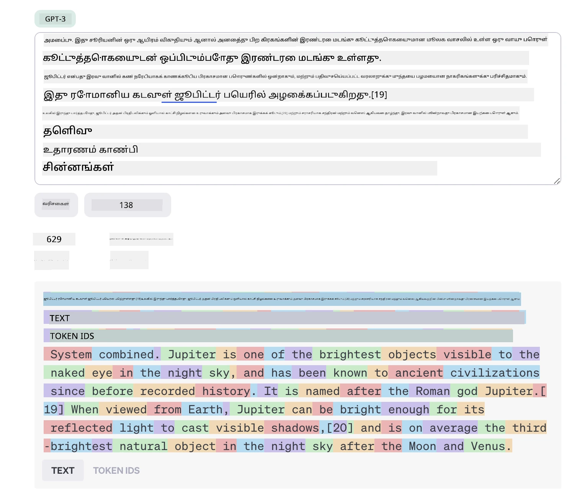
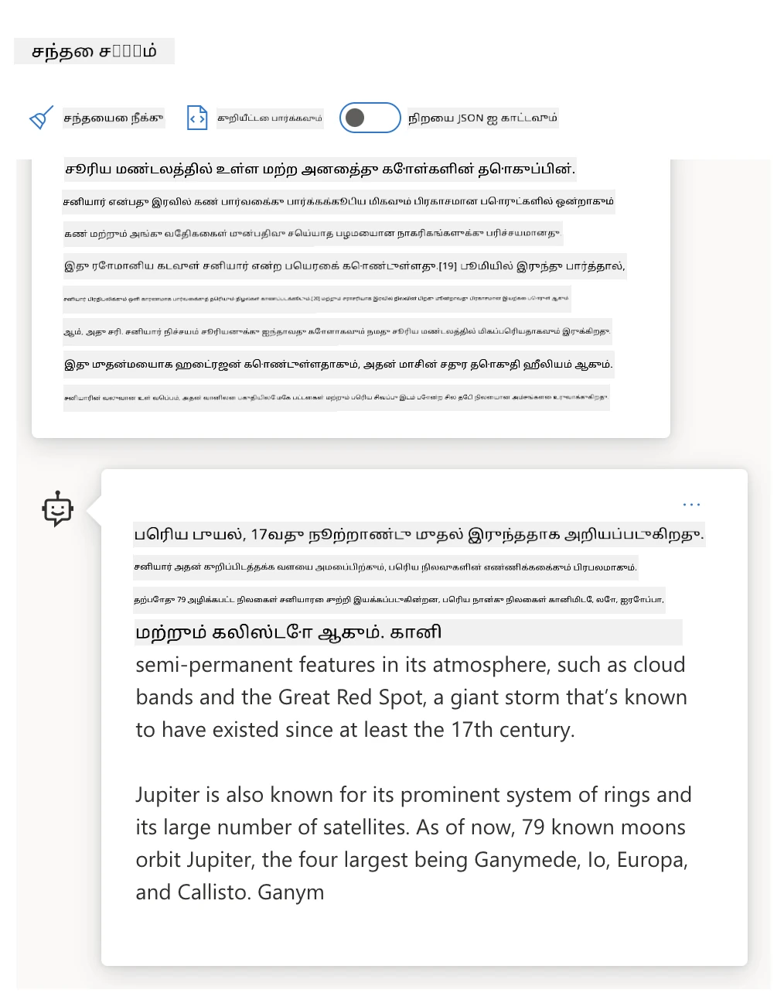
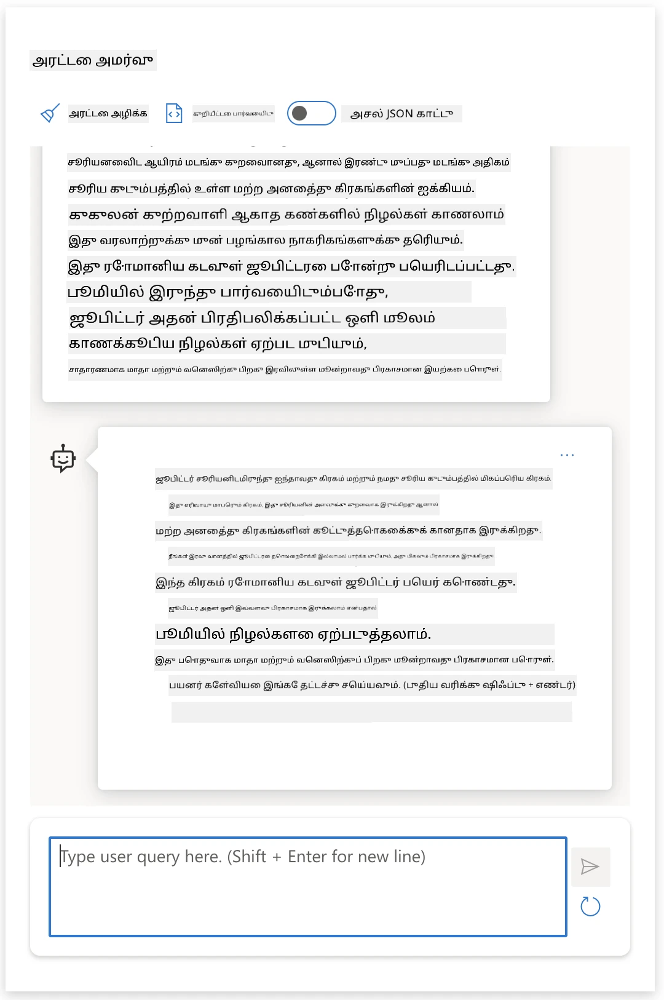
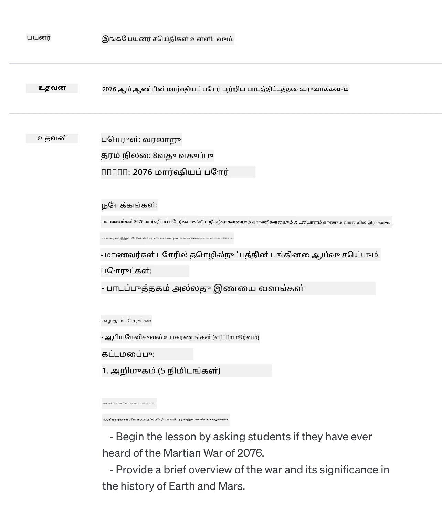
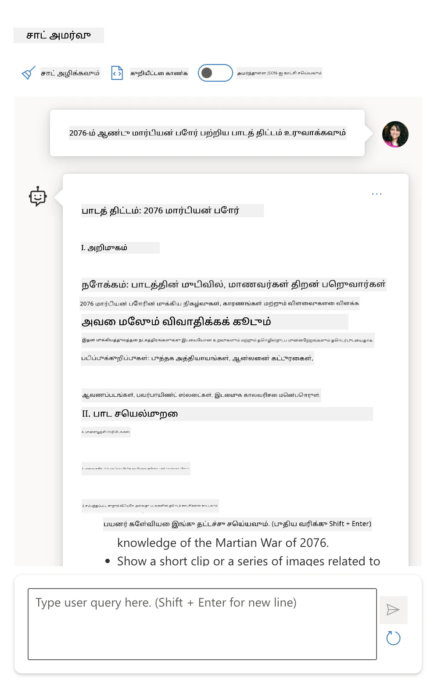
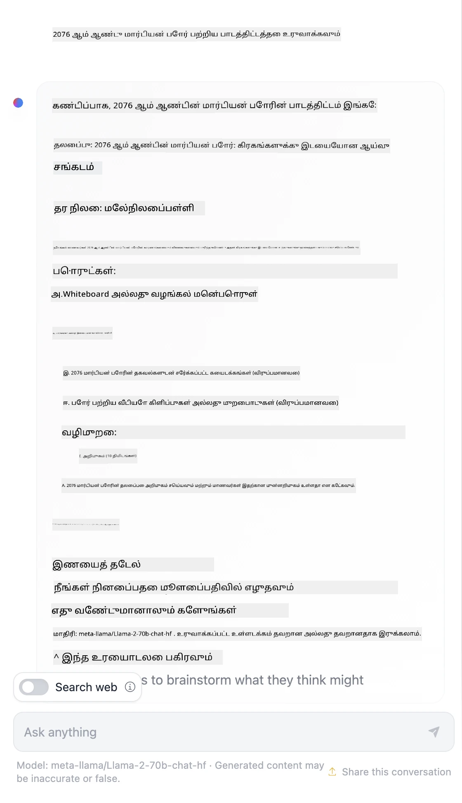

# Prompt Engineering அடிப்படைகள்

[](https://youtu.be/GElCu2kUlRs?si=qrXsBvXnCW12epb8)

## அறிமுகம்
இந்த பகுதியில் ஜெனரேட்டிவ் AI மாதிரிகளில் விளைவூட்டும் முறையான ப்ராம்ப்ட்களை உருவாக்குவதற்கான அடிப்படைக் கருத்துகள் மற்றும் தொழில்நுட்பங்களை கையாள்கிறது. நீங்கள் LLM-க்கு எழுதும் ப்ராம்ப்ட் முக்கியம். கவனமாக வடிவமைக்கப்பட்ட ப்ராம்ப்ட் நல்ல தரத்திலான பதிலை பெற உதவும். ஆனால் _ப்ராம்ப்டு_ மற்றும் _ப்ராம்ப்ட் என்ஜினீயரிங்_ என்ற சொற்கள் என்ன அர்த்தம்? நான் LLMக்கு அனுப்பும் ப்ராம்ப்ட் _இன்புட்_ -ஐ எப்படி மேம்படுத்தலாம்? இந்த அதிகாரத்தில் மற்றும் அடுத்த அதிகாரத்தில் இதை பற்றி பதில் காண முயற்சிப்போம்.

_ஜெனரேட்டிவ் AI_ என்பது பயனர் கோரிக்கைக்கு பதிலாக புதிய உள்ளடக்கங்கள் (உதா., எழுத்து, படங்கள், ஒலி, குறியீடு மற்றும் பல) உருவாக்கும் திறன் கொண்டது. இது இயற்கை மொழி மற்றும் குறியீட்டிற்கு பயிற்சி பெற்ற OpenAI இன் GPT ("ஜெனரேட்டிவ் ப்ரீ-டிரெய்ன்டு டிரான்ஸ்ஃபார்மர்") எனப்படும் பெரிய மொழி மாதிரிகள் மூலம் செயற்படுகிறது.

பயனர்கள் இப்பொழுது எந்த தொழில்நுட்ப சாதனையோ பயிற்சியோ இல்லாமல் வாக்கிய வடிவிலும் உரையாடல் வடிவிலும் இத்தகைய மாதிரிகளுடன் தொடர்புகொள்ள முடியும். மாதிரிகள் _ப்ராம்ப்ட் அடிப்படையிலானவை_ - பயனர்கள் ஒரு எழுத்துப்பிரவேசத்தை (ப்ராம்ப்ட்) அனுப்பி AI பதிலை (கூட்டு) பெறுகிறார்கள். அதனை தொடர்ந்து பல முறை உரையாடி, ப்ராம்ப்டை திருத்தம் செய்து பதில் எதிர்ப்பாரிப்புக்கு ஏற்ப உருவாக விடலாம்.

"ப்ராம்ப்ட்கள்" இப்போது ஜெனரேட்டிவ் AI செயலிகளுக்கான முதன்மை _ப்ரோகிராமிங் இடைமுகமாக_ மாறிவிட்டன, இது மாதிரிகளுக்கு என்ன செய்ய வேண்டும் என்பதை தெரிவிக்கின்றது மற்றும் மீண்டும் கிடைப்பதற்கான பதில்களின் தரத்தை பாதிக்கின்றது. "ப்ராம்ப்ட் என்ஜினீயரிங்" என்பது விரைவாக வளர்ந்து வரும் படிப்புப் பொருளாகும், இது ப்ராம்ப்ட்களின் வடிவமைப்பு மற்றும் மேம்பாட்டை கவனத்துடன் செய்து தரமான பதில்களை அளிக்க உதவுகிறது.

## கற்றல் குறிக்கோள்கள்

இந்த பாடத்திட்டத்தில், ப்ராம்ப்ட் என்ஜினீயரிங் என்றால் என்ன, அது ஏன் முக்கியம், மற்றும் எப்படி நமக்கு ஒரு மாதிரிக்கான மற்றும் பயன்பாட்டு நோக்கத்திற்கான செயல்திறன் வாய்ந்த ப்ராம்ப்ட்களை உருவாக்கலாம் என்பதை அறிந்துகொள்வோம். முக்கியக் கருத்துகள் மற்றும் சிறந்த நடைமுறைகளை அறிந்து கொள்வோம் - மற்றும் ஒரு இடைமுகமாக செயல்படும் Jupyter Notebooks "சாண்ட்பாக்ஸ்" சூழலைப் பற்றி கற்றுக்கொள்வோம், இதில் உண்மையான உதாரணங்களோடு இந்தக் கருத்துக்கள் பிரயோகப்படுத்தலாம்.

இந்தப் பாடத்தின் முடிவில் நாம் செய்யக்கூடியவை:

1. ப்ராம்ப்ட் என்ஜினீயரிங் என்பது என்ன மற்றும் அது ஏன் முக்கியம் என்பதை விளக்குங்கள்.
2. ப்ராம்ப்டின் கூறுகளை விவரிக்கவும் அவை எப்படி பயன்படுத்தப்படுகின்றன என்பதை கூறுங்கள்.
3. சிறந்த நடைமுறைகள் மற்றும் தொழில்நுட்பங்களை கற்றுக்கொள்ளுங்கள்.
4. கற்றுக் கொண்ட தொழில்நுட்பங்களை உண்மையான உதாரணங்களில் OpenAI முடிவுக்குச் செல்லும் பகுதியை பயன்படுத்தி பொருத்துங்கள்.

## முக்கிய சொற்கள்

ப்ராம்ப்ட் என்ஜினீயரிங்: AI மாதிரிகளை விரும்பிய வெளியீடுகளை உருவாக்க வழிநடத்த உள்ளீடுகளை வடிவமைத்து நுட்பத்தை மேம்படுத்தும் நடைமுறை.

டோக்கனைசேஷன்: ஒரு மாதிரி புரிந்துகொள்ளக்கூடிய சிறிய அலகுகளாக (டோக்கன்கள்) உரையை மாற்றும் செயல்முறை.

இன்ஸ்ட்ரக்ஷன்-ட்யூன்டு LLM கள்: குறிப்பிட்ட அறிவுரைகளுடன் மேம்படுத்தப்பட்ட பெரிய மொழி மாதிரிகள், அவை பதிலின் துல்லியம் மற்றும் பொருத்தத்தைக் கூட்டும்.

## கற்றல் சாண்ட்பாக்ஸ்

ப்ராம்ப்ட் என்ஜினீயரிங் தற்போது அறிவியலுக்கு விட அதிகம் கலை. இதை மேம்படுத்த சிறந்த வழி _மிகவும் பயிற்சி செய்வதும்_ பின்வரும் முயற்சித்தெளிவூட்டும் முறையை ஏற்றுக்கொள்ளுவதோடு பயனுள்ள துறையின் அறிவையும் பரிந்துரைக்கப்படும் தொழில்நுட்பங்களையும் மாற்றியமைக்கும் மாதிரியின் தனிப்பட்ட நுட்பங்களை இணைப்பதே ஆகும்.

இந்த பாடத்துடனான Jupyter நோட்புக் ஒரு _சாண்ட்பாக்ஸ்_ சூழலை வழங்குகிறது, இதில் நீங்கள் கற்றுகொள்ளும் அனைத்தையும் முயற்சிக்கலாம் - தொடர்ந்து அல்லது கற்றல் தேவையுடன் கூடிய குறியீட்டு சவால் போது. பயிற்சிகளை செயல்படுத்துவத için:

1. **ஒரு Azure OpenAI API கிளீ்** - ஒரு வளைவான LLMக்கான சேவை இடம்.
2. **பைதான் இயங்கு சூழல்** - இதில் நோட்புக் நடைமுறை செய்யப்படும்.
3. **உள்நாட்டு சுற்றுச்சூழல் மாறி** - [SETUP](./../00-course-setup/02-setup-local.md?WT.mc_id=academic-105485-koreyst) படிகளை இப்போது முடிக்குங்கள்.

நோட்புக் ஆரம்பக்கட்டவியல் பயிற்சிகளுடன் வருகிறது - ஆனால் நீங்கள் உங்களது சொந்த _Markdown_ (விளக்கம்) மற்றும் _Code_ (ப்ராம்ப்ட்டுக் கோரிக்கைகள்) பகுதிகளைச் சேர்க்க ஊக்கப்படுத்தப்படுகிறீர்கள் - மேலும் மாதிரி வடிவமைப்பை மேம்படுத்த உங்கள் அனுபவத்தை உருவாக்குங்கள்.

## விளக்கப்படக் கையேடு

இந்த பாடம் என்ன கற்றுத்தருது என்பதற்கான முழுமையான பாதையை பார்ப்பதற்கு விரும்புகிறீர்களா? இதோ ஒரு விளக்கப்படக் கையேடு, இது முக்கிய தலைப்புகள் மற்றும் ஒவ்வொன்றிலும் நீங்கள் கவனிக்க வேண்டிய முக்கிய அம்சங்களை உங்களிடம் தருகிறது. பாடவழிகாட்டி அடிப்படைக் கருத்துகளைப் புரிந்து கொள்ள தொடங்கி, சம்மந்தப்பட்ட ப்ராம்ப்ட் என்ஜினீயரிங் நுட்பங்களுடன் பிரச்சினைகளை சமாளித்து சிறந்த நடைமுறைகளுக்கு வழிகாட்டுகிறது. இந்த கையேட்டில் உள்ள "மேம்பட்ட நுட்பங்கள்" பகுதி அடுத்த அதிகாரத்தில் உள்ள உள்ளடக்கத்தைக் குறிக்கிறது.


## எங்கள் ஸ்டார்ட்அப்

இப்போது, இந்த _தலைப்பு_ எங்கள் ஸ்டார்ட்அப்பின் தொழில்நுட்பத்தை [கல்விக்கான AI முன்னேற்றங்களை கொண்டு வரல்](https://educationblog.microsoft.com/2023/06/collaborating-to-bring-ai-innovation-to-education?WT.mc_id=academic-105485-koreyst) என்பதுடன் எப்படி தொடர்புடையது என்பதைக் கூறுவோம். நாங்கள் _தனிப்பயன் கல்வி_ க்கான AI ஊக்குவிக்கப்பட்ட செயலிகளை உருவாக்க விரும்புகிறோம் - ஆகவே எங்கள் பயன்பாட்டின் வெவ்வேறு பயனர்கள் எவ்வாறு "ப்ராம்ப்ட்களை வடிவமைக்கலாம்" என்பதைப் பற்றி யோசிப்போம்:

- **நிருவாகிகள்** AI-ஐ _பாடத்திட்டத் தகவலமைப்புகளை பகுப்பாய்வு செய்து உள்ளடக்க காலியான இடங்களை கண்டறிய_ கேட்கலாம். AI முடிவுகளை சுருக்கி வழங்கலாம் அல்லது கோடுடன் காணொளி வடிவில் காட்டலாம்.
- **கல்வியாளர்கள்** AI-ஐ _ஒரு இலக்கு பார்வையாளருக்கான பாடத் திட்டத்தை உருவாக்க_ கேட்கலாம். AI குறிப்பிடப்பட்ட வடிவமைப்பில் தனிப்பயன் திட்டத்தை உருவாக்கிக் கொடுக்கும்.
- **மாணவர்கள்** AI-ஐ _கடுமையான பாடத்தில் பயில உதவ_ கேட்கலாம். AI தற்போது பாடங்கள், குறிப்பு மற்றும் எடுத்துக்காட்டுகளை அவர்களது நிலைக்கு ஏற்ப வழிகாட்டுகிறது.

இது சற்றும் தொடரினால், [Prompts For Education](https://github.com/microsoft/prompts-for-edu/tree/main?WT.mc_id=academic-105485-koreyst)-இல் கல்வி வல்லுநர்கள் தேர்ந்தெடுத்த ஒரு திறந்த மூல ப்ராம்ப்ட் நூலகத்தைக் காணலாம் - அதிகமான சாத்தியக்கூறுகளை அறிய! _சாண்ட்பாக்ஸில் அவற்றை இயக்கி அல்லது OpenAI விளையாட்டு நிலத்தில் முயற்சி செய்து விளைவினைப் பார்க்கவும்!_

<!--
LESSON TEMPLATE:
This unit should cover core concept #1.
Reinforce the concept with examples and references.

CONCEPT #1:
Prompt Engineering.
Define it and explain why it is needed.
-->

## ப்ராம்ப்ட் என்ஜினீயரிங் என்றால் என்ன?

இந்த பாடத்திட்டத்தை நாம் ஆரம்பித்தபோது **ப்ராம்ப்ட் என்ஜினீயரிங்** என்பதை ஒரு பயன்பாட்டு நோக்கத்திற்கும் மாதிரிக்கும் சிறந்த மற்றும் தொடர்ச்சியான பதில்களை (கூட்டு) வழங்கும் வார்த்தை மதிப்பீடுகளை (ப்ராம்ப்ட்களை) _வடிவமைக்கவும் மேம்படுத்தவும்_ செய்யப்படும் செயலாகக் குறிப்பிட்டோம். இதை இரண்டு கட்டங்களாக யோசிக்கலாம்:

- ஒரு மாதிரிக்கான மற்றும் நோக்கத்திற்கான ஆரம்ப ப்ராம்ப்டை _வடிவமைத்தல்_
- பதிலின் தரத்தை மேம்படுத்த ப்ராம்ப்டை அடிக்கடி _திருத்துதல்_

இது இயல்பாக முயற்சி-பிழை முறையாக இருக்கும், மற்றும் பயனரின் உணர்வு மற்றும் முயற்சி தேவைப்படும். எனவே இதன் முக்கியத்துவம் என்ன? அதற்கான பதிலை விளக்க மூன்று கருத்துக்களை முதலில் புரிந்துகொள்ள வேண்டும்:

- _டோக்கனைசேஷன்_ = மாதிரி ப்ராம்ப்டை எப்படி "பார்க்கிறது"
- _மூல LLM கள்_ = அடிப்படை மாதிரி ப்ராம்ப்டை எப்படி "செயலாக்குகிறது"
- _இன்ஸ்ட்ரக்ஷன்-ட்யூன்டு LLM கள்_ = மாதிரி இனியும் "பணிகளை" எவ்வாறு அறிகிறது

### டோக்கனைசேஷன்

ஒரு LLM ப்ராம்ப்டுகளை _டோக்கன்களின் தொடராக்_ காண்கிறது, இதில் வெவ்வேறு மாதிரிகள் (அல்லது மாதிரி பதிப்புகள்) ஒரே ப்ராம்ப்டை வெவ்வேறு முறைகளில் டோக்கன் செய்யலாம். LLM கள் டோக்கன்களைப் பேராய்வு செய்கின்றன (அமெரிக்க மொழி வரிசைப்படி அல்லாமல்), ஆகையால் ப்ராம்ப்ட்கள் எப்படி டோக்கனாகின்றன என்பதும் உருவாக்கப்படும் பதிலின் தரத்திற்கு நேரடி விளைவாக உள்ளது.

டோக்கனைசேஷன் எப்படி செயல் படுகிறது என்பதற்காக உங்களுக்கு உணர்வை உருவாக்க [OpenAI Tokenizer](https://platform.openai.com/tokenizer?WT.mc_id=academic-105485-koreyst) போன்ற கருவிகளை முயற்சி செய்து பாருங்கள். உங்கள் ப்ராம்ப்டை நகலெடுத்து அங்கே ஒட்டுங்கள் - வெற்றிடங்கள் மற்றும் சிற்றொட்டிகள் எப்படி கையாளப்படுகின்றன என்பதை கவனியுங்கள். இந்த எடுத்துக்காட்டு பழைய LLM (GPT-3) பற்றியது என்பதால், புதிய மாதிரியோடு முயற்சி செய்தால் வேறு விளைவுகள் உண்டாகலாம்.



### கருத்து: அடிப்படை மாதிரிகள்

ஒரு ப்ராம்ப்ட் டோக்கனாகிய பிறகு, ["Base LLM"](https://blog.gopenai.com/an-introduction-to-base-and-instruction-tuned-large-language-models-8de102c785a6?WT.mc_id=academic-105485-koreyst) (அல்லது அடிப்படை மாதிரி) முக்கியக் கடமையானது அந்த தொடரில் அடுத்த டோக்கனை முன்னறிவிப்பு செய்வதுதான். LLM கள் பெரிய உரைத் தரவுத்தொகுப்புகளுக்கு பயிற்சி பெற்று, டோக்கன்களின் இடையேயான புள்ளியியல் உறவுகளை நன்கு அறிந்து, இறுதி முன்னறிவிப்பை நம்பிக்கையுடன் வழங்கி முடியும். அவர்கள் ப்ராம்ப்டில் உள்ள வார்த்தைகள் அல்லது டோக்கனின் _அர்த்தத்தை_ புரிந்துகொள்ள மாட்டார்கள்; அவர்கள் "பூர்த்தி செய்யும்" மாதிரியாக அந்த தொடரைக் காண்கிறார்கள். பயனர் இடைமுகம் அல்லது ஏதாவது முன்கூட்டியே அமைக்கப்பட்ட நிபந்தனையால் நிறுத்தப்படும்போது முன்கூட்டிய நிரல்களை தொடர முடியும்.

ப்ராம்ப்ட் அடிப்படையிலான கூட்டு எப்படி இயங்குகிறது என்பதை பார்க்க விரும்புகிறீர்களா? மேலே கொடுக்கப்பட்ட ப்ராம்ப்டை Azure OpenAI Studio [_Chat Playground_](https://oai.azure.com/playground?WT.mc_id=academic-105485-koreyst) இல் இயல்புநிலை அமைப்புகளில் உள்ளிடுங்கள். சிஸ்டம் ப்ராம்ப்ட்களை தகவல் கோரிக்கைகளாக கையாளும் அமைப்பில் இருப்பதால், கொண்டு வரும் நிலையை பூர்த்தி செய்யும் பதிலை காண வேண்டும்.

ஆனால் பயனர் குறிப்பிட்ட ஏதாவது பணிக்குரிய அல்லது நோக்கத்திற்கான ஒன்றை காண விரும்பினால்? அதற்காக _இன்ஸ்ட்ரக்ஷன்-ட்யூன்டு_ LLM கள் உதவுகின்றன.



### கருத்து: இன்ஸ்ட்ரக்ஷன்-ட்யூன்டு LLM கள்

ஒரு [இன்ஸ்ட்ரக்ஷன்-ட்யூன்டு LLM](https://blog.gopenai.com/an-introduction-to-base-and-instruction-tuned-large-language-models-8de102c785a6?WT.mc_id=academic-105485-koreyst) அடிப்படை மாதிரியுடன் துவங்கி, தெளிவான அறிவுறுத்தல்களோடு (உள்ளீடு/வெளியீடு கூட்டங்களோடு, உதா., பல முறை "செய்திகள்" கூடிய) சிறப்பு பயிற்சியை பெற்று, AI மறுகூறலை அந்த அறிவுறுத்தல்களைக் கடைப்பிடிக்க முயற்சிக்கச் செய்கிறது.

இதில் Reinforcement Learning with Human Feedback (RLHF) போன்ற தொழில்நுட்பங்கள் பயன்படுகிறது. இது மொடலை _அறிவுறுத்தல்களை பின்பற்ற_ மற்றும் _பின்விளைவிலிருந்து கற்றுக்கொள்ள_ பயிற்றுவிக்கிறது, ஆகையால் அவை நடைமுறை பயன்பாடுகளுக்கு பொருத்தமான மற்றும் பயனர் நோக்கங்களுக்கு சீரான பதில்களை தரும்.

இதை முயற்சி செய்யலாம் - மேலே உள்ள ப்ராம்ப்டை மீண்டும் ஆராயுங்கள், ஆனால் இப்போது _சிஸ்டம் செய்தி_ யை கீழ்காணும் அறிவுறுத்தலாக மாற்றுங்கள்:

> _தொடர்புடைய உள்ளடக்கத்தை இரண்டாம் வகுப்புக்கான மாணவருக்காக சுருக்குங்கள். 3-5 புள்ளிகளுடன் ஒரு абзацசில் முடிவை வைக்கவும்._

இந்த முடிவு இப்போது விரும்பும் நோக்கத்தை மற்றும் வடிவத்தைக் காட்டுகிறதா பாருங். ஒரு கல்வியாளர் இந்நிலையில் நேரடியாக தங்கள் உள்நாட்டுப் பிரசனைகளுக்கு இந்த பதிலை பயன்படுத்தலாம்.



## நம்மக்கு ஏன் ப்ராம்ப்ட் என்ஜினீயரிங் வேண்டும்?

இப்போது ப்ராம்ப்ட்கள் LLM களால் எப்படி செயலாக்கப்படுகின்றன என்பதை அறிந்துவிட்டோம்; ப்ராம்ப்ட் என்ஜினீயரிங் ஏன் தேவை என்று பேசுவோம். பதில், தற்போதைய LLM கள் பல சவால்களை உருவாக்குகின்றன, அவைக்கு சேர்க்கல் மற்றும் மேம்பாடு இல்லாமல் _நம்பகமான மற்றும் தொடர்ந்து கிடைக்கும் பதில்களை_ பெறுவது சிரமமாக்கின்றது என்பதிலிருக்கும். உதாரணமாக:

1. **மாதிரியின் பதில்கள் சீரற்றவை.** _அதே ப்ராம்ப்ட்_ வெவ்வேறு மாதிரிகள் அல்லது பதிப்புகள் மூலம் வேறு பதில்களை உருவாக்கும் வாய்ப்பு உள்ளது. ஒரே மாதிரியோடு வேறு நேரங்களிலும் வேறுபாடுகள் இருக்கும். _ப்ராம்ப்ட் என்ஜினீயரிங் நுட்பங்கள் இந்த மாற்றங்களை குறைக்க உதவும் சிறந்த கட்டுப்பாடுகளை வழங்குகின்றன_.

1. **மாதிரிகள் பதில்களை உருவாக்கிவிடலாம் (உருவாக்கல்).** மாதிரிகள் _பெரிய ஆனால் வரம்பு கொண்ட_ தரவினில் பயிற்சியடைந்துள்ளதால், பயிற்சியில் இல்லாத கருத்துக்களை பற்றிய அறிவு இல்லை. ஆகையால் தவறான, கற்பனைசார் அல்லது உண்மைக்கு முரணான பதில்களை உருவாக்கக்கூடும். _ப்ராம்ப்ட் என்ஜினீயரிங் பயனாளர்களுக்கு இதுபோன்ற உருவாக்கங்களை கண்டுபிடித்து குறைத்திட உதவுகிறது, உதா., AIஇலிருந்து மேற்கோள்கள் அல்லது காரணவியல் கேட்பதன் மூலம்_.

1. **மாதிரிகளின் திறன்கள் மாறுபடும்.** புதிய மாதிரிகள் அல்லது தலைமுறை மாதிரிகள் செல்வாக்கும் திறன்கள் அதிகமாகும், ஆனால் தனிப்பட்ட தன்மை மற்றும் செலவு மற்றும் சிக்கல்களிலும் விதிவிலக்குகள் உண்டு. _ப்ராம்ப்ட் என்ஜினீயரிங் சிறந்த நடைமுறைகள் மற்றும் பணிநெட்வொர்க்குகளை உருவாக்க உதவுகிறது, இது வேறுபாடுகளை மறைக்கும் மற்றும் மாதிரி குறிப்பிட்ட தேவைகளுக்கு ஏற்ப நீட்சியான மற்றும் சீரான முறையில் முறையை அமைக்கும்_.

OpenAI அல்லது Azure OpenAI Playground இல் இதைப் பார்த்து புரிந்து கொள்ளலாம்:

- வெவ்வேறு LLM பொருத்தங்களுடன் ஒரே ப்ராம்ப்டைப் பயன்படுத்துங்கள் (OpenAI, Azure OpenAI, Hugging Face) - நீங்கள் வேறுபாடுகளை கவனித்தீர்களா?
- ஒரே மாதிரியில் ஒரே ப்ராம்ப்டைப் பலமுறை பயன்படுத்துக (Azure OpenAI playground எடுத்துக்காட்டு) - இவை எப்படி வேறுபட்டன?

### உருவாக்கங்கள் எடுத்துக்காட்டு

இந்த பாடத்திட்டத்தில், **"உருவாக்கம்"** என்ற சொல்லை, LLM கள் பயிற்சி வரம்புகளால் மின்னணுக்கூறு தவறான தகவல்களை சில சமயம் உருவாக்கும் நிகழ்வை குறிக்க பயன்படுத்துகிறோம். பல பிரபல கட்டுரைகளிலும் ஆய்வுப் பத்திரிகைகளிலும் இதை _"மெய்ப்படுத்தல்கள்"_ என்று குறிப்பிடுகிறார்கள். ஆனால், இயந்திரம் போன்ற முடிவிற்கு மனித போல பண்போ அளிப்பதை தவிர்க்க, மற்றும் [பொறுப்பான AI வழிகாட்டுதல்களுடன்](https://www.microsoft.com/ai/responsible-ai?WT.mc_id=academic-105485-koreyst) ஏற்படும் பலருக்கும் பதிலில்லாத அல்லது பன்முகப்படுத்தக்கூடிய சொற்களை நீக்க, _"உருவாக்கம்"_ என்ற சொல்லின் பயன்பாட்டை வலியுறுத்துகிறோம்.

உருவாக்கங்கள் எப்படி ஒருவருக்கு தெரியும் என்பதற்கு உதாரணமாக, பயிற்சி தரவுகளில் இல்லாத கூறல் ஒன்றுக்கான உள்ளடக்கம் உருவாக்க AI-ஐ கட்டளை விடும் ப்ராம்ப்டை யோசியுங்கள். உதாரணம் - நான் இந்த ப்ராம்ப்ட்டை முயற்சி செய்தேன்:

> **ப்ராம்ப்ட்:** 2076-ஆம் ஆண்டின் மார்டியன் யுத்தம் குறித்த பாடத்திட்டத்தை உருவாக்கவும்.
ஒரு இணையத் தேடல் எனக்கு காட்டியது மார்டியன் போர்களை பற்றிய கற்பனைக் கணக்குகள் (எடுத்துக்காட்டாக, தொலைக்காட்சி தொடர்கள் அல்லது புத்தகங்கள்) இருந்தன - ஆனால் 2076 இல் எதுவும் இல்லை. பொதுவான அறிதல் 2076 என்பது _எதிர்காலத்தில்_ என்பதைக் கூறுகிறது, ஆகவே அதனை ஒரு உண்மையான நிகழ்ச்சியுடன் இணைக்க முடியாது.

அப்படியானால், வெவ்வேறு LLM வழங்குநர்களுடன் இந்த ப்ராம்டை இயக்கினால் என்ன நடக்கும்?

> **பதில் 1**: OpenAI Playground (GPT-35)



> **பதில் 2**: Azure OpenAI Playground (GPT-35)



> **பதில் 3**: : Hugging Face Chat Playground (LLama-2)



எதிர்பார்ப்பப்படி, ஒவ்வொரு மாடலும் (அல்லது மாடல் பதிப்பும்) சிதறலைழுக்குமாறுகள் மற்றும் மாடல் திறனில் உள்ள வகைகளுக்காக சிறிது மாறுபட்ட பதில்களை உருவாக்குகின்றன. எடுத்துக்காட்டாக, ஒரு மாடல் 8 ஆம் வகுப்பு மாணவர்களுக்கு இலக்குவாக்கம் செய்யும் போது மற்றொரு மாடல் உயர்நிலை பள்ளி மாணவராக நினைக்கிறது. ஆனால் முன்னோக்கிய மூன்று மாடல்களும் அந்த நிகழ்வு உண்மை என தவறான நம்பிக்கை உருவாக்கக்கூடிய பதில்களை உருவாக்கின.

ப்ராம்ட் பொறியியல் தொழில்நுட்பங்கள் போல _metaprompting_ மற்றும் _temperature configuration_ சில அளவுக்கு மாடல் பற்பலிப்பை குறைக்கக்கூடும். புதிய ப்ராம்ட் பொறியியல் _கட்டமைப்புகள்_ புதிய கருவிகள் மற்றும் தொழில்நுட்பங்களை எளிதாக ப்ராம்ட் ஓட்டத்தில் இணைத்து, இத்தகைய விளைவுகளைக் குறைக்க உதவுகின்றன.

## இளம் ஆய்வுக் காட்சி: GitHub Copilot

இந்த பகுதிக்கு ஒரு விடை அளிப்போம் - ப்ராம்ட் பொறியியல் உண்மையான உலக தீர்வுகளில் எப்படி பயன்படுகிறது என்பதை புரிந்து கொள்ள, ஒரு யூகக்காட்சி: [GitHub Copilot](https://github.com/features/copilot?WT.mc_id=academic-105485-koreyst) என்பதைக் காண்போம்.

GitHub Copilot உங்கள் "AI ஜோடி நிரல் எழுத்தாளர்" - இது உரை ப்ராம்டுகளை குறியீடு முழுமையாக்கங்களில் மாற்றி, உங்கள் மேம்பாட்டு சூழலில் (உதாரணமாக, Visual Studio Code) ஒருங்கிணைக்கப்பட்டுள்ளது, பயனர் அனுபవத்தை சிறப்பாக வழங்குகிறது. கீழ்க்காணும் தொடர் வலைப்பதிவுகளில் பதிவு செய்யப்பட்டபடி, ஆரம்ப பதிப்பு OpenAI Codex மாடலில் இருந்தது - பொறியாளர் குழு விரைவாக மாடலை சிறப்புப் பணியாற்றவும், இந்தப் ப்ராம்ட் பொறியியல் தொழில்நுட்பங்களை மேம்படுத்தவும் கண்டுபிடித்தனர், குறியீட்டு தரத்தை மேம்படுத்த. ஜூலில், அவர்கள் [Codex ஐ மீறிய மேம்பட்ட AI மாடலை அறிமுகம் செய்தனர்](https://github.blog/2023-07-28-smarter-more-efficient-coding-github-copilot-goes-beyond-codex-with-improved-ai-model/?WT.mc_id=academic-105485-koreyst) இன்னும் வேகமான பரிந்துரைகள் வழங்க.

அவர்கள் கற்றல் பயணத்தை பின்தொடர கீழ்க்காணும் பதிவுகளை வரிசையாக வாசிக்கவும்.

- **மே 2023** | [GitHub Copilot உங்கள் குறியீட்டை புரிந்து கொள்வதில் சிறந்ததாக மாறுகிறது](https://github.blog/2023-05-17-how-github-copilot-is-getting-better-at-understanding-your-code/?WT.mc_id=academic-105485-koreyst)
- **மே 2023** | [GitHub உள்ளிடல்: GitHub Copilot பின்னிலையிலுள்ள LLM களுடன் பணியாற்றுதல்](https://github.blog/2023-05-17-inside-github-working-with-the-llms-behind-github-copilot/?WT.mc_id=academic-105485-koreyst).
- **ஜூன் 2023** | [GitHub Copilotக்கு சிறந்த ப்ராம்ட்களை எழுதுவது எப்படி](https://github.blog/2023-06-20-how-to-write-better-prompts-for-github-copilot/?WT.mc_id=academic-105485-koreyst).
- **ஜூலை 2023** | [.. GitHub Copilot மேம்பட்ட AI மாடல் மூலம் Codex ஐ மீறுகிறது](https://github.blog/2023-07-28-smarter-more-efficient-coding-github-copilot-goes-beyond-codex-with-improved-ai-model/?WT.mc_id=academic-105485-koreyst)
- **ஜூலை 2023** | [ஒரு மேம்படுத்திய ப்ராம்ட் பொறியியல் மற்றும் LLMகளுக்கான டெவலப்பரின் வழிகாட்டி](https://github.blog/2023-07-17-prompt-engineering-guide-generative-ai-llms/?WT.mc_id=academic-105485-koreyst)
- **செப் 2023** | [ஒரு தொழிற்சாலை LLM செயலியை கட்டமைப்பது எப்படி: GitHub Copilot இலிருந்து படிப்புகள்](https://github.blog/2023-09-06-how-to-build-an-enterprise-llm-application-lessons-from-github-copilot/?WT.mc_id=academic-105485-koreyst)

மேலும், [தொழில்நுட்ப வலைப்பதிவையும்](https://github.blog/category/engineering/?WT.mc_id=academic-105485-koreyst) ஆராயலாம், இவற்றில் [இங்கே](https://github.blog/2023-09-27-how-i-used-github-copilot-chat-to-build-a-reactjs-gallery-prototype/?WT.mc_id=academic-105485-koreyst) போன்றவை உள்ளன, இவை இந்த மாடல்கள் மற்றும் தொழில்நுட்பங்கள் உண்மையான உலக பயன்பாடுகளுக்கு எவ்வாறு _பயன்படுத்தப்படுகிறதென்றதைக்_ காட்டுகின்றன.

---

<!--
LESSON TEMPLATE:
This unit should cover core concept #2.
Reinforce the concept with examples and references.

CONCEPT #2:
Prompt Design.
Illustrated with examples.
-->

## ப்ராம்ட் கட்டமைப்பு

ப்ராம்ட் பொறியியல் ஏன் முக்கியமென்பதை நாம் பார்த்தோம் - இப்போது ப்ராம்ட்கள் எப்படிப் _கட்டமைக்கப்படுகின்றன_ என்பதைப் புரிந்து கொண்டு, மேலும் திறமையான ப்ராம்ட் வடிவமைப்பிற்கு வெவ்வேறு தொழில்நுட்பங்களை மூலியாய்வோம்.

### அடிப்படை ப்ராம்ட்

எளிய ப்ராம்டுடன் தொடங்குவோம்: மாடலுக்கு எந்த கூடுதல் சூழலும் இல்லாமல் அனுப்பப்படும் உரை உள்ளீடு. உதாரணமாக, அமெரிக்க தேசிய கீதத்தின் முதல் சில சொற்களை OpenAI [Completion API](https://platform.openai.com/docs/api-reference/completions?WT.mc_id=academic-105485-koreyst) கல்வியில் அனுப்பினால், அடுத்த சில வரிகளுடன் உடனடியாக _பூர்த்தி_ செய்கிறது, அடிப்படை கணிப்பு நடத்தையின் எடுத்துக்காட்டாக.

| Prompt (Input)     | Completion (Output)                                                                                                                        |
| :----------------- | :----------------------------------------------------------------------------------------------------------------------------------------- |
| Oh say can you see | It sounds like you're starting the lyrics to "The Star-Spangled Banner," the national anthem of the United States. The full lyrics are ... |

### சிக்கலான ப்ராம்ட்

இப்போது அந்த அடிப்படை ப்ராம்டுக்கு சூழல் மற்றும் அறிவுறுத்தல்களைச் சேர்ப்போம். [Chat Completion API](https://learn.microsoft.com/azure/ai-services/openai/how-to/chatgpt?WT.mc_id=academic-105485-koreyst) பயனர்களின் உள்ளீடு மற்றும் உதவியாளரின் பதில்களை பிரதிபலிக்கும் _செய்திகள்_ தொகுப்பாக மற்றும்

- உதவியாளர் நடத்தை அல்லது தனித்துவத்திற்கு அமைவு அமைக்கும் கணினி செய்தியுடன்
சிக்கலான ப்ராம்டைப் அமைக்க அனுமதிக்கிறது.

கோரிக்கை இப்போது கீழ்காணும் வடிவத்தில் இருக்கும், இங்கே _tokenization_ நடிகைகள் உள்ளடக்கம் மற்றும் உரையாடல் இலக்கணத்தைச் சரியாகப் பெறுகிறது. இப்போது, கணினி சூழலை மாற்றுவது பூர்த்திகளின் தரத்திற்கு திறமையான தாக்கம் செலுத்தும், வழங்கப்பட்ட பயனர் உள்ளீடுகள் போலவே.

```python
response = openai.chat.completions.create(
    model="gpt-3.5-turbo",
    messages=[
        {"role": "system", "content": "You are a helpful assistant."},
        {"role": "user", "content": "Who won the world series in 2020?"},
        {"role": "assistant", "content": "The Los Angeles Dodgers won the World Series in 2020."},
        {"role": "user", "content": "Where was it played?"}
    ]
)
```

### அறிவுரை ப்ராம்ட்

மேலே உள்ள எடுத்துக்காட்டுகளில், பயனர் ப்ராம்ட் என்பது ஒரு எளிய உரை கேள்வியாக இருந்தது, இது தகவல் கோரிக்கை என பொருள்படும். _அறிவுரை_ ப்ராம்ட்களில் நம்மால் அந்த உரையை பயன்படுத்தி பணியை விரிவாகப் பெரிதும் கண்டறியும், AIக்கு சிறந்த வழிகாட்டுதலை அளிக்கும். உதாரணம்:

| Prompt (Input)                                                                                                                                                                                                                         | Completion (Output)                                                                                                        | Instruction Type    |
| :------------------------------------------------------------------------------------------------------------------------------------------------------------------------------------------------------------------------------------- | :------------------------------------------------------------------------------------------------------------------------- | :------------------ |
| Write a description of the Civil War                                                                                                                                                                                                   | _returned a simple paragraph_                                                                                              | Simple              |
| Write a description of the Civil War. Provide key dates and events and describe their significance                                                                                                                                     | _returned a paragraph followed by a list of key event dates with descriptions_                                             | Complex             |
| Write a description of the Civil War in 1 paragraph. Provide 3 bullet points with key dates and their significance. Provide 3 more bullet points with key historical figures and their contributions. Return the output as a JSON file | _returns more extensive details in a text box, formatted as JSON that you can copy-paste to a file and validate as needed_ | Complex. Formatted. |

## முதன்மை உள்ளடக்கம்

மேலே உள்ள எடுத்துக்காட்டுகளில் ப்ராம்ட் திறந்தவையாக இருந்தது, LLM தன்னுடைய முன்னறிவுத்தொகுப்பில் எந்த பகுதி தொடர்புடையது என்பதைத் தீர்மானிக்கவிட்டது. _முதன்மை உள்ளடக்கம்_ வடிவமைப்பில் உள்ளீடு உரை இரண்டு பகுதிகளாகப் பிரிக்கப்படுகிறது:

- ஒரு அறிவுரை (செயல்)
- தொடர்புடைய உள்ளடக்கம் (செயலுக்கு பாதிப்பு செய்யும்)

இங்கே ஒரு உதாரணம், அறிவுரையாக "இதை 2 வாக்கியங்களில் சுருக்குக" என்பது உள்ளது.

| Prompt (Input)                                                                                                                                                                                                                                                                                                                                                                                                                                                                                                                                                                                                                                                                                      | Completion (Output)                                                                                                                                                                                                                                                                             |
| :-------------------------------------------------------------------------------------------------------------------------------------------------------------------------------------------------------------------------------------------------------------------------------------------------------------------------------------------------------------------------------------------------------------------------------------------------------------------------------------------------------------------------------------------------------------------------------------------------------------------------------------------------------------------------------------------------- | :---------------------------------------------------------------------------------------------------------------------------------------------------------------------------------------------------------------------------------------------------------------------------------------------- |
| Jupiter is the fifth planet from the Sun and the largest in the Solar System. It is a gas giant with a mass one-thousandth that of the Sun, but two-and-a-half times that of all the other planets in the Solar System combined. Jupiter is one of the brightest objects visible to the naked eye in the night sky, and has been known to ancient civilizations since before recorded history. It is named after the Roman god Jupiter.[19] When viewed from Earth, Jupiter can be bright enough for its reflected light to cast visible shadows,[20] and is on average the third-brightest natural object in the night sky after the Moon and Venus. <br/> **Summarize this in 2 short sentences** | Jupiter, the fifth planet from the Sun, is the largest in the Solar System and is known for being one of the brightest objects in the night sky. Named after the Roman god Jupiter, it's a gas giant whose mass is two-and-a-half times that of all other planets in the Solar System combined. |

முதன்மை உள்ளடக்க பகுதி பலவாறு பயனுள்ளதாக இருக்கிறது சிறந்த அறிவுரைகளை வரைவதற்கு:

- **உதாரணங்கள்** - மாடலை என்ன செய்ய வேண்டும் என்பதில் நேரடியாக அறிவுரையிடாமல், செய்யவேண்டியது என்ன என்பதற்கான உதாரணங்களை வழங்கி, மாடல் முறையைத் தெரிந்துகொள்ள விடுங்கள்.
- **கியூஸ்** - அறிவுரையின் பின் ஒரு "கியூ" வழங்கி பூர்த்தியை நோக்கிய வழிகாட்டலை செய்கிறது, இது மாடலை அதிக தொடர்புடைய பதில்களுக்குத் தூண்டுகிறது.
- **டெம்பிளேட்கள்** - இது பலமுறை பயன்படுத்தக்கூடிய 'சூப்பர்ஷெல்கள்', இவை மாறிலிகளோடு (அதாவது வேரியபிள்கள்) அமைக்கப்பட்டு குறிப்பிட்ட பயன்பாடுகளுக்காக தரவை இணைத்து வகைப்படுத்தலாம்.

இவற்றைக் கீழே செயலில் பார்ப்போம்.

### உதாரணங்களைப் பயன்படுத்துதல்

இது முதன்மை உள்ளடக்கத்தைப் பயன்படுத்தி, தேவையான விளைவுகளுக்கான சில உதாரணங்களை "மாடலைச் சாப்பிடச் செய்யும்" முறையாகும், மேலும் தேவையான விளைவுகளுக்கான முறையை செல்லமுடிந்தது என்று ஆய்வு செய்கின்றது. கொடுக்கப்பட்ட உதாரணங்களின் எண்ணிக்கையின் அடிப்படையில், ஜீரோ-ஷாட் ப்ராம்டிங், ஒன்-ஷாட் ப்ராம்டிங், பியூ-ஷாட் ப்ராம்டிங் ஆகியவை அமையும்.

ப்ராம்ட் இப்போது மூன்று கூறுகளைக் கொண்டுள்ளது:

- ஒரு பணியின் விளக்கம்
- தேவையான விளைவுகளுக்கான சில உதாரணங்கள்
- புதிய உதாரணத்தின் தொடக்கம் (இది ஒரு மறைமுக பணிவிளக்கம் ஆகிறது)

| கற்றல் வகை | Prompt (Input)                                                                                                                                        | Completion (Output)         |
| :------------ | :---------------------------------------------------------------------------------------------------------------------------------------------------- | :-------------------------- |
| Zero-shot     | "The Sun is Shining". Translate to Spanish                                                                                                            | "El Sol está brillando".    |
| One-shot      | "The Sun is Shining" => ""El Sol está brillando". <br> "It's a Cold and Windy Day" =>                                                                 | "Es un día frío y ventoso". |
| Few-shot      | The player ran the bases => Baseball <br/> The player hit an ace => Tennis <br/> The player hit a six => Cricket <br/> The player made a slam-dunk => | Basketball                  |
|               |                                                                                                                                                       |                             |

குறிப்பிடுகிறோம், ஜீரோ-ஷாட் ப்ராம்டிங்கில் ("Translate to Spanish" என்ற தெளிவான அறிவுரையை அளிக்க வேண்டும்) இருந்தாலும், ஒன்-ஷாட் ப்ராம்டிங் உதாரணத்தில் அது மறைமுகமாக தோற்றுவதைக் காணலாம். பியூ-ஷாட் உதாரணம் மிக்க உதாரணங்களைச் சேர்ப்பதன் மூலம் மாடல்களுக்கு தொடர்ச்சியான அறிவுரைகள் இல்லாமல் கூட துல்லியமான முடிவுகளுக்கு வழிகாட்டுகிறது.

### ப்ராம்ட் கியூஸ்

முதன்மை உள்ளடக்கத்தைக் கொண்டு இன்னொரு முறையாக, உதாரணங்களின் பதிலாக _கியூஸ்_ கொடுக்கப்படுகிறது. இங்கு, மாடலுக்கு தேவையான பதில் வடிவிலிருந்து ஒரு துணுக்கை _தொடக்கம்_ ஆக வழங்கி, மறுபடியும் அந்த வழியில் பின்வட்டமாக செல்ல தூண்டுகிறது.

| கியூஸ் எண்ணிக்கை | Prompt (Input)                                                                                                                                                                                                                                                                                                                                                                                                                                               | Completion (Output)                                                                                                                                                                                                                                                                                       |
| :------------- | :----------------------------------------------------------------------------------------------------------------------------------------------------------------------------------------------------------------------------------------------------------------------------------------------------------------------------------------------------------------------------------------------------------------------------------------------------------- | :-------------------------------------------------------------------------------------------------------------------------------------------------------------------------------------------------------------------------------------------------------------------------------------------------------- |
| 0              | Jupiter is the fifth planet from the Sun and the largest in the Solar System. It is a gas giant with a mass one-thousandth that of the Sun, but two-and-a-half times that of all the other planets in the Solar System combined. Jupiter is one of the brightest objects visible to the naked eye in the night sky, and has been known to ancient civilizations since before recorded history. <br/>**Summarize This**                                       | Jupiter is the largest planet in our Solar System and the fifth one from the Sun. It is a gas giant with a mass 1/1000th of the Sun's, but it is heavier than all the other planets combined. Ancient civilizations have known about Jupiter for a long time, and it is easily visible in the night sky.. |
| 1              | சுனியிலிருந்து ஐந்தாவது கிரகம் மற்றும் சூரிய குடும்பத்தில் மிகப்பெரிய கிரகம் ஜூபிட்டர் ஆகும். இது சூரியனின் பருமனின் ஆயிரத்தைப்போல் ஒரு வாயு ராஜா ஆகும், ஆனால் சூரிய குடும்பத்தில் உள்ள மற்ற அனைத்து கிரகங்களின் ஒன்றிணைந்த பருமனைவிட இரண்டு மடங்கு மற்றும் அரை மடங்கு அதிகமான பருமனைக் கொண்டுள்ளது. ஜூபிட்டர் இரவு வானத்தில் கண்களைப் பார்ப்பவருக்கு தெரியும் பல இலகுவான பொருள்களில் ஒன்றாகும், மற்றும் பதிவு செய்யப்பட்ட வரலாற்றுக்குச் முன்பே பண்டைய நாகரிகங்களுக்கு அறிமுகமானது. <br/>**சுருக்கமாக கூறுக** <br/> நாம் கற்றுக் கொண்டது என்னவெனில் ஜூபிட்டர் | சுனியிலிருந்து ஐந்தாவது கிரகமாகவும் சூரிய குடும்பத்தில் மிகப்பெரியது ஆகும். இது சூரியனின் பருமனின் ஆயிரம் சதவீதத்தின் ஒரு பகுதியான வாயு ராஜா, ஆனால் மற்ற அனைத்து கிரகங்களின் ஒன்றிணைந்த பருமனின் இரண்டு மடங்கு மற்றும் அரை மடங்கு உள்ளது. இது எளிதாக கண்களுக்கு தெரியும்படி உள்ளது மற்றும் பண்டைய காலங்களிலிருந்து அறிமுகமானது.                        |
| 2              | சுனியிலிருந்து ஐந்தாவது கிரகம் மற்றும் சூரிய குடும்பத்தில் மிகப்பெரிய கிரகம் ஜூபிட்டர் ஆகும். இது சூரியனின் பருமனின் ஆயிரத்தைப்போல் ஒரு வாயு ராஜா ஆகும், ஆனால் சூரிய குடும்பத்தில் உள்ள மற்ற அனைத்து கிரகங்களின் ஒன்றிணைந்த பருமனைவிட இரண்டு மடங்கு மற்றும் அரை மடங்கு அதிகமான பருமனைக் கொண்டுள்ளது. ஜூபிட்டர் இரவு வானத்தில் கண்களைப் பார்ப்பவருக்கு தெரியும் பல இலகுவான பொருள்களில் ஒன்றாகும், மற்றும் பதிவு செய்யப்பட்ட வரலாற்றுக்குச் முன்பே பண்டைய நாகரிகங்களுக்கு அறிமுகமானது. <br/>**சுருக்கமாக கூறுக** <br/> நாம் கற்றுக்கொண்ட 3 முக்கிய உண்மைகள்:         | 1. ஜூபிட்டர் சூரியனிலிருந்து ஐந்தாவது கிரகம் மற்றும் சூரிய குடும்பத்தில் மிகப்பெரியது ஆகும். <br/> 2. இது சூரியனின் பருமனில் ஆயிரவான பகுதியைக் கொண்ட வாயு ராஜா ஆகும்...<br/> 3. ஜூபிட்டர் பண்டைய காலங்களிலிருந்து கண்களுக்கு தெரியுமாறு இருந்தது...                                                                       |
|                |                                                                                                                                                                                                                                                                                                                                                                                                                                                              |                                                                                                                                                                                                                                                                                                           |

### Prompt Templates

ஒரு  _முன்-வரையறுக்கப்பட்ட  கூறு_ என்பது ஒரு  மொழிமுறை வடிவங்கள்  ஆகும், வாடிக்கையாளர் அனுபவத்தை அதிக அளவில் ஒரே மாதிரியாக மாற்றுமாறு தேவைக்கேற்ப சேமித்து மறுபயன்பாடு செய்வதற்கானது. எளிமையான வடிவத்தில், இது  [OpenAI இல் இருந்து இந்த உதாரணத்தைப் போல](https://platform.openai.com/examples?WT.mc_id=academic-105485-koreyst) பல வகையான முன் கூறுகளின் தொகுப்பு ஆகும், இதில் பயனர் மற்றும் அமைப்பு செய்திகளின் இடைமுக கூறுகளும் API வழிகாட்டி கோரிக்கைகளும் உள்ளன - மறுபயன்பாட்டிற்கு ஆதாரம் அளிக்க.

அதிகத் துரிதமான வடிவங்களில், [LangChain இல் இருந்து இந்த உதாரணம் போல](https://python.langchain.com/docs/concepts/prompt_templates/?WT.mc_id=academic-105485-koreyst) இது  _பதிவுகள்_ கொண்டுள்ளது, அவை பல்வேறு மூலங்களிலிருந்து (பயனர் உள்ளீடு, அமைப்பு சூழல், வெளிப்புற தரவுகள் போன்றவை) பெறப்பட்ட தரவால் மாற்றப்படலாம், ஒரு முன் கட்டளை இயக்கத்துக்கான. இது நிரல் மூலம் **தொடர்ந்த பயனர் அனுபவத்தை மேம்படுத்த** மறுபரிசீலனை செய்யக்கூடிய முன்கூட்டிய தொகுப்புகளை உருவாக்க உதவும்.

இறுதியில்,  நிஜ மதிப்பு  என்பது குறிப்பிட்ட பயன்பாட்டு துறைகளுக்கான  முன்கூட்டிய நூலகங்களை  உருவாக்கி வெளியிடுவதில் உள்ளது - இப்போது முன்கூட்டிய கூறுகள், பயன்பாட்டு-குறிப்பிட்ட சூழல் அல்லது எடுத்துக்காட்டுகளுக்கு ஏற்ப நுட்பமாக உறுதியாக்கப்படுகின்றன. கல்வித் துறையுக்கான [Prompts For Edu](https://github.com/microsoft/prompts-for-edu?WT.mc_id=academic-105485-koreyst) காப்பகம் அத்தகைய அணுகுமுறையைச் சிறப்பாக முன்னிறுத்தி, பாட திட்ட திட்டமிடல், பாடத்திட்ட வடிவமைப்பு, மாணவர்-பயிற்சி போன்ற முக்கிய நோக்கங்களை வலியுறுத்துகிறது.

## ஆதரவான உள்ளடக்கம்

முன்கூட்டிய கட்டமைப்பை ஒரு  அறிவுரையும் (பணி) மற்றும் ஒரு இலக்கையும் (முக்கிய உள்ளடக்கம்) வைத்திருக்கும் என நாம் கருதினால், _இரண்டாம்நிலை உள்ளடக்கம்_ என்பது அதனை **யாரும் சிலவிதமாக பாதிக்கக் கூடும்** கூடுதல் சூழல் போன்றது. இது மாதிரியை  _பயன்பாட்டாளர்களின் நோக்கங்களுக்கு ஏற்ப தனிப்பயன் செய்ய_ உதவும் சித்திரங்களாக இருக்கலாம்: கண்ணோட்ட அளவுருக்கள், வடிவமைப்புக் குறிப்புகள், தலைப்பு வகைகள் மற்றும் இப்படி.

எடுத்துக்காட்டு: ஒரு பாடஅட்டவணை, அதில் விரிவான மேடாட்டா (பெயர், விளக்கம், நிலை, மேடாட்டா குறிச்சொற்கள், பயிற்சியாளர் மற்றும் பிற) உண்டு.

- "2023 எதிர்காலப் பருவ பாடக் காட்சியை சுருக்குக" என்ற அறிவுரையை வகைப்படுத்தலாம்
- விருப்பமான விளக்கத்தை நிறைவேற்ற சில எடுத்துக்காட்டுகளைக் கொடுக்கலாம்
- இரண்டாம் நிலை உள்ளடக்கத்தில் முக்கிய 5 "குறிச்சொற்களை" தேர்வு செய்யலாம்

இப்போது மாதிரி, சில எடுத்துக்காட்டுகளின் வடிவத்தில் சுருக்கத்தை வழங்கலாம் - பல குறிச்சொற்கள் இருந்தால், இரண்டாம் நிலைப் பொருளில் அடையாளம் காணப்பட்ட 5 குறிச்சொற்களை முதன்மை அளிப்பதில் முன்னுரிமையீடு செய்யலாம்.

---

<!--
LESSON TEMPLATE:
இந்த அலகு முக்கியக் கருத்து #1 ஐ கையாள கூடும்.
எடுத்துக்காட்டுகளும் குறிப்புகளும் கொண்டு அந்த கருத்தை வலுப்படுத்து.

CONCEPT #3:
முன்கூட்டிய பொறியியல்நுட்பங்கள்.
முன்கூட்டிய பொறியியல் செய்ய சில அடிப்படைக் குறுந்தொழில்நுட்பங்கள் என்ன?
சிறு பயிற்சிகளுடன் விரிவுபடுத்து.
-->

## முன்கூட்டி சிறந்த நடைமுறைகள்

இப்பொழுது முன்கூட்டிகள் எப்படி  _உருவாக்கப்படுகின்றன_ என்பதைப் பார்த்துவிட்டோம், அவற்றை சிறந்த நடைமுறைகளுக்கு ஏற்ப _வடிவமைக்கும்படி_ நாம் யோசிக்கலாம். இதன் பொருள் இரண்டு பகுதிகள் - சரியான _திட்டம்_ மற்றும் சரியான _தொழில்நுட்பம்_ பயன்படுத்துவதே.

### முன்கூட்டிய பொறியியல் மனப்பான்மை

முன்கூட்டிய பொறியியல் என்பது முயற்சி-பிழைத்தலை கொண்ட செயல்முறை ஆகும், எனவே மூன்று பரப்பளவான வழிகாட்டு காரகங்களை நினைவில் வைக்கவும்:

1. **துறைத்திறன் முக்கியம்.** பதிலின் துல்லியம் மற்றும் பொருத்தம் அந்த பயன்பாடும் பயனரின் செயல்பாட்டுக்  _துறையின்_  தன்மையை சார்ந்தது. உங்கள் ஊனறிவையும் துறைத்திறனையும் பயன்படுத்தி **தொழில்நுட்பங்களை தனிப்பயன் செய்யுங்கள்**. உதாரணமாக, உங்கள் அமைப்பு முன்கூட்டிகளில் _துறைத்துறையான பண்புகளை_ வரையறுக்கவும், அல்லது பயனர் முன்கூட்டிகளில் _துறைத்துறையான வார்ப்புருக்களை_ பயன்படுத்தவும். துறைத்துறையான சூழல்கள் பிரதிபலிக்கும் இரண்டாம் நிலை உள்ளடக்கத்தை வழங்கவும் அல்லது மொடலை _பொருத்தமான உபயோக முறைக்கான_ துறைத்துறையான குறியீடுகள் மற்றும் எடுத்துக்காட்டுகளுக்கு வழிகாட்டவும்.

2. **மொதலை புரிதல் முக்கியம்.** மாதிரிகள் இயல்பாக விட்டுவிடும் என அறிவோம். ஆனால் பயிற்சி தரவுத்தொகுப்பின் தன்மை (முன்பயிற்சி அறிவு), API அல்லது SDK வழியாக வழங்கும் திறன்கள், குறித்த உள்ளடக்கத்தில் சிறப்புத்தன்மை (குறியீடு, படங்கள், உரை) போன்றவற்றின்படி மாதிரிகளின் செயல்முறை வேறுபாடும் உள்ளது. நீங்கள் பயன்படுத்தும் மொடலின் பலவீனங்கள் மற்றும் வலிமைகளை அறிந்து கொண்டு, அதன் திறனுக்கு ஏற்ப _பணிகளை முன்னுரிமை கொடுக்கவும்_ அல்லது _தனிப்பயன் வார்ப்புருக்களை_ வடிவமைக்கவும்.

3. **மீண்டமைப்பு மற்றும் சரிபார்ப்பு முக்கியம்.** மாதிரிகள் விரைவாக வளர்ந்து வருகின்றன; முன்கூட்டிய பொறியியல்நுட்பங்கள் தொடர்ந்து மேம்படுகின்றன. துறைத்திறன் நிபுணராக, உங்கள் குறிப்பிட்ட பயன்பாட்டிற்கான வேறு சூழலோ அல்லது அளவீடுகளோ இருக்கலாம், அது பரவலான சமூகத்திற்கு பொருந்தாது. முன்கூட்டிய பொறியியல் கருவிகள் மற்றும் தொழில்நுட்பங்களை பயன்படுத்தி முன்கூட்டிய கட்டமைப்பை "தடிகள் துவக்கம்" செய்யவும், பிறகு உங்கள் ஊனறிவுப் பின் திருத்தங்கள் செய்து முடிவுகளை சரிபார்க்கவும். உங்கள் உணர்வுகளை பதிவு செய்து, மற்றவர்கள் விரைவில் மீண்டமைக்க புதிய தளமாக பயன்படுத்தக்கூடிய **அறிவு அட்டவணை** (எடுத்துக்காட்டாக, முன்கூட்டிய நூலகங்கள்) உருவாக்கவும்.

## சிறந்த நடைமுறைகள்

இப்போது [OpenAI](https://help.openai.com/en/articles/6654000-best-practices-for-prompt-engineering-with-openai-api?WT.mc_id=academic-105485-koreyst) மற்றும் [Azure OpenAI](https://learn.microsoft.com/azure/ai-services/openai/concepts/prompt-engineering#best-practices?WT.mc_id=academic-105485-koreyst) நிபுணர்களால் பரிந்துரைக்கப்படும் பொதுவான சிறந்த நடைமுறைகளை பார்ப்போம்.

| என்ன                              | ஏன்                                                                                                                                                                                                                                               |
| :-------------------------------- | :------------------------------------------------------------------------------------------------------------------------------------------------------------------------------------------------------------------------------------------------ |
| புதிய மாதிரிகளை மதிப்பீடு செய்க | புதிய மாதிரி தலைமுறைகள் மேம்பட்ட அம்சங்கள் மற்றும் தரத்தை கொண்டிருக்கும், ஆனாலும் அதிக செலவை உருவாக்கக்கூடும். தாக்கத்தை மதிப்பீடு செய்து, பின்னர் இடமாற்றம் செய்ய முடிவெடுக்கவும்.                                                                                   |
| அறிவுரைகளுக்கும் சூழலுக்கும் வேறுபாடு செய்யவும் | உங்கள் மொடல்/வழங்குனர் _அறிவுரைகள், முதன்மை மற்றும் இரண்டாம் நிலை உள்ளடக்கத்துக்கு_ இடைவெளிகள் (delimiters) வழங்குகிறாரா என்று பரிசோதிக்கவும். இது மொடலை சின்னங்களுக்கு আরও தெளிவாக நிகர்க்க உதவும்.                                                                                      |
| தெளிவாகவும் குறிப்பிட்டதாகவும் இருங்கள்             | தேவையான சூழல், முடிவுகள், நீளம், வடிவம், பாணி போன்ற விரிவுகளை கூறுங்கள். இது பதில்களின் தரத்தையும் ஒருமைத்தன்மையையும் மேம்படுத்தும். மறுபயன்பாட்டுக்கான வடிவமைப்புகளை பதிவு செய்யவும்.                                                                                          |
| விளக்கங்களோடு உருவாக்கவும்              | மாதிரிகளுக்கு "காட்டு மற்றும் சொல்லு" அணுகுமுறை சிறந்தது. முதலில் எடுத்துக்காட்டில்லாத `zero-shot` முறையைத் தொடர்ந்து, தேவையான வெளியீட்டின் சில எடுத்துக்காட்டுகளுடன் `few-shot` முறையை முயற்சிக்கவும். உருவகக் குறுந்தொடர்களைப் பயன்படுத்தவும்.                                                    |
| நிறைவு தொடக்க கூற்றுகளைத் துவக்கவும்            | அக்கறையுடன் தொடக்க வார்த்தைகள் அல்லது சொற்கள் கொடுத்து, படைப்பு தொடர்வதற்கான முன்முனையாக nudging செய்யவும்.                                                                                                                   |
| மீண்டும் முயற்சி செய்க                            | சில நேரங்களில், ஒரே அறிவுரையை பலமுறை கூறுதல் அவசியமாகலாம். முதன்மை உள்ளடக்கத்திற்கு முன்பும் பின்னிலும் அறிவுரைகள் கொடுங்கள், ඉறை மற்றும் அடையாளச் சொற்கள் பயன்படுத்தவும். முயற்சித்து சரிபார்க்கவும்.                                                                                     |
| வரிசையைக் பராமரிக்கவும்                          | தகவல்களை நீங்கள் வழங்கும் வரிசை முடிவை பாதிக்கலாம், மேலும் சமீபத்திய கருத்துக்களின் தாக்கத்தால் கற்றல் எடுத்துக்காட்டுகளிலும் இது நடக்கும். வெவ்வேறு முறைகளை முயற்சித்து சிறந்ததைக் கண்டறியவும்.                                                                                      |
| மொடலுக்கு ஒரு “வெளிச்சாலை” கொடுக்கவும்               | பயன்பாட்டைக் காணாமல் முடிக்க முடியாவிட்டால் நிர்ப்பந்தமான முடிவை வழங்க ஒரு  _இடைக்கால மூலையகத்தைக்_ கொடுக்கவும். இது தவறான அல்லது போலியான பதில்களை உருவாக்கும் வாய்ப்புகளை குறைக்கும்.                                                                               |
|                                   |                                                                                                                                                                                                                                                   |

எந்த சிறந்த நடைமுறையாலும், மொடல், பணி மற்றும் துறை ஆகியவற்றின் அடிப்படையில் உங்கள் அனுபவம் மாறலாம் என்பதை நினைவில் வைக்கவும். இதை தொடக்கமாக கொள்ளுங்கள், உங்களுக்கே பொருத்தமானதை கண்டறிய மீண்டும் முயற்சிக்கவும். புதிய மாதிரிகள் மற்றும் கருவிகள் கிடைக்கும்போது உங்கள் முன்கூட்டிய பொறியியல் செயல்முறையை தொடர்ந்து மதிப்பாய்வு செய்க, செயல்முறை விரிவாக்கமும் பதிலின் தரமும் மீது கவனம் செலுத்தி.

<!--
LESSON TEMPLATE:
இந்த அலகு குற-ifையுரை சவால் வழங்க வேண்டும்

சவால்:
வழிமுறையுடன் குறிப்பிடப்பட்ட குறிகோட்டின் பின்னிடத்தில் Jupyter நோட்டு புக் இணைப்பைத் தருக (குறியீடு பகுதி காலியானது).

தீர்வு:
அந்த நோட்டு புக் நகலை விரிவான அறிவுரைகளுடன் முழுதாக்கவும், ஓட்டவும், ஒரு எடுத்துக்காட்டைக் காண்பிக்கவும்.
-->

## பணித் தாமதம்

நல்வாழ்த்துக்கள்! நீங்கள் இது வரை பாடம் முடித்துள்ளீர்கள்! இப்பொழுது சில கருத்துகளையும் தொழில்நுட்பங்களையும் உண்மையான எடுத்துக்காட்டுகளின் மூலம் சோதிப்போம்!

எங்களுடைய பணிக்கானது, நீங்கள் இடையிடையே செயல்பட முடியும் Jupyter நோட்டு புக் உள்ளது. நீங்கள் உங்கள் சொந்த மார்க்டவுன் மற்றும் குறியீடு செलों மூலம் விரிவுபடுத்திக் கொள்வதற்கும் முடியும்.

### துவக்க, கருவி அதிர்விற்கு மோதிரத்தை மொத்தப்படுத்தவும்

- (பரிந்துரை) GitHub Codespaces ஐ துவக்கவும்
- (மாற்றாக) Repo ஐ உங்கள் முறைமையில் பதிவிறக்கம் செய்து Docker Desktop உடன் பயன்படுத்தவும்
- (மாற்றாக) நீங்கள் விரும்பும் நோட்டு புக் இயக்கம் சூழலில் நோட்டு புக் திறக்கவும்.

### பிறகு சுற்றுச்சூழல் மாறிலிகளை அமைக்கவும்

- `.env.copy` கோப்பை `.env` ஆக மாற்றி, `AZURE_OPENAI_API_KEY`, `AZURE_OPENAI_ENDPOINT`, மற்றும் `AZURE_OPENAI_DEPLOYMENT` விகிதங்களை நிரப்பவும். [Learning Sandbox பகுதியில்](../../../04-prompt-engineering-fundamentals) எப்படி செய்வதை பாருங்கள்.

### பிறகு Jupyter நோட்டு புக் திறக்கவும்

- இயக்கக் கர்நலைத் தேர்ந்தெடுக்கவும். 1 அல்லது 2 வழிகளால் பயன்படுத்தினால், dev container வழங்கும் இயல்புநிலை Python 3.10.x கர்நலைத் தேர்ந்தெடுக்கவும்.

உங்கள் பயிற்சி தொடங்க தயாராக இருக்கிறது. இங்கு சரி மற்றும் தவறான பதில்கள் கிடையாது - வெறும் முயற்சியையும் பிழையையும் சந்திப்பது மற்றும் ஒரு குறிப்பிட்ட மாதிரி மற்றும் பயன்பாட்டு துறைக்கான உள்கருத்தை வளர்ப்பது மட்டும்.

_இதனால் இந்த பாடத்தில் குறியீடு தீர்வு பகுதி இல்லை. அதற்கு பதிலாக, "என் தீர்வு:" என்ற தலைப்பில் மார்க்டவுன் செல்கள் ஒரு எடுத்துக்காட்டைப் காட்டும்._

 <!--
LESSON TEMPLATE:
உள்அமைப்பைத் தொகுத்து தனிப்பயன் கற்றற்கான வளங்கள் தருக.
-->

## அறிவுப் பரிசோதனை

பலவகைப்படி சிறந்த முன்கூட்டியாக எது?

1. சிவப்பு கார்கள் படம் காண்பி
2. வெயிலைமறைவது கொண்ட ஒரு பள்ளத்தாக்கு அருகே Volvo மாடல் XC90 வகை சிவப்பு கார்கள் படம் காண்பி
3. Volvo மாடல் XC90 வகை சிவப்பு கார்கள் படம் காண்பி

பதில்: 2, இது மிகச் சிறந்தது என்று விவரங்களை "என்ன" என்பதில் அளிக்கிறது, மேலும் குறிப்பிட்ட வகை மற்றும் நிலை விவரித்துள்ளது. 3 அடுத்ததாக அத்தகைய விவரங்களை அதிகமாக கொண்டுள்ளது.

## 🚀 சவால்

"Complete the sentence "Show me an image of red car of make Volvo and " என்பதுடன் "cue" தொழில்நுட்பத்தை பயன்படுத்தி பாருங்கள். அதன் பதில் என்ன மற்றும் அதை எப்படி மேம்படுத்துவீர்கள்?

## சிறந்த பணி! உங்கள் கற்றலை தொடரவும்

வகை வகையான முன்கூட்டிய பொறியியல் கருத்துக்களை மேலும் கற்றுக்கொள்ள விரும்புகிறீர்களா? [தொடர்ந்து கற்றல் பக்கத்திற்கு](https://aka.ms/genai-collection?WT.mc_id=academic-105485-koreyst) செல்லவும், அங்கே இந்த தலைப்பில் சிறந்த வளங்கள் உள்ளன.

பாடம் 5 இல் [மேம்பட்ட முன்கூட்டிய நுட்பங்களை](../05-advanced-prompts/README.md?WT.mc_id=academic-105485-koreyst) நாம் பார்த்துக்கொள்வோம்!

---

<!-- CO-OP TRANSLATOR DISCLAIMER START -->
**மறுப்பு அறிவிப்பு**:  
இந்த ஆவணம் AI மொழிபெயர்ப்பு சேவை [Co-op Translator](https://github.com/Azure/co-op-translator) பயன்படுத்தி மொழிபெயர்க்கப்பட்டுள்ளது. நாங்கள் துல்லியத்துக்காக முயற்சித்தாலும், தானாக生成ப்படும் மொழிபெயர்ப்புகளில் பிழைகள் அல்லது தவறுகள் உள்ளாகலாம் என்பதை கவனிக்கவும். இயல்புநிலை ஆவணம் அதன் சொந்த மொழியில் அங்கீகாரமான மூலமாக கருதப்படவேண்டும். முக்கியமான தகவல்களுக்கு, தொழில்முறை மனித மொழிபெயர்ப்பு பரிந்துரைக்கப்படுகிறதே. இந்த மொழிபெயர்ப்பின் பயன்பாட்டால் ஏற்பட்ட எந்த புரிதல் தவறுகளுக்கும் அல்லது தவறான விளக்கங்களுக்கும் நாங்கள் பொறுப்பேற்பதில்லை.
<!-- CO-OP TRANSLATOR DISCLAIMER END -->