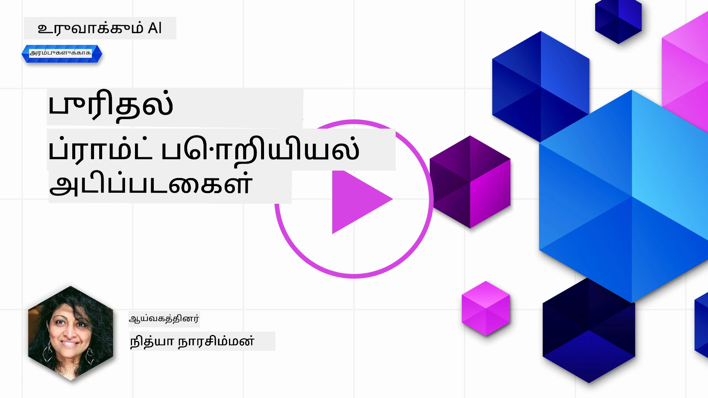
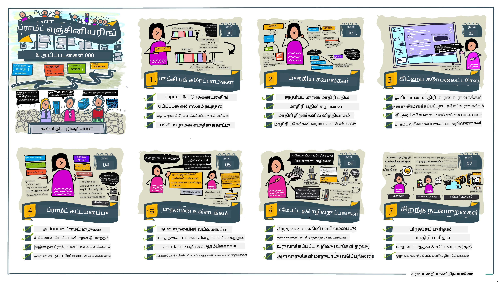
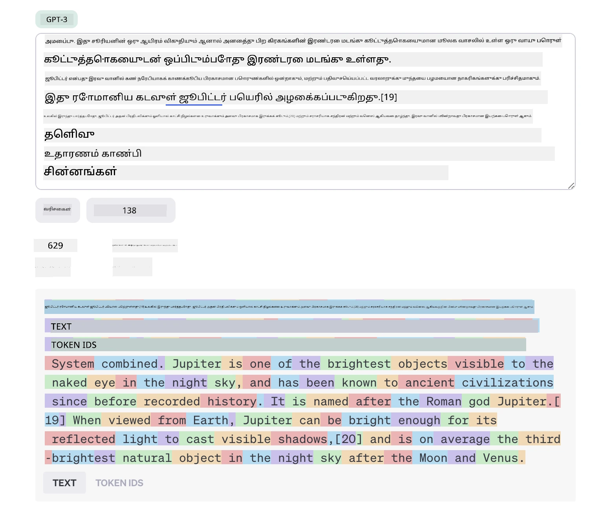
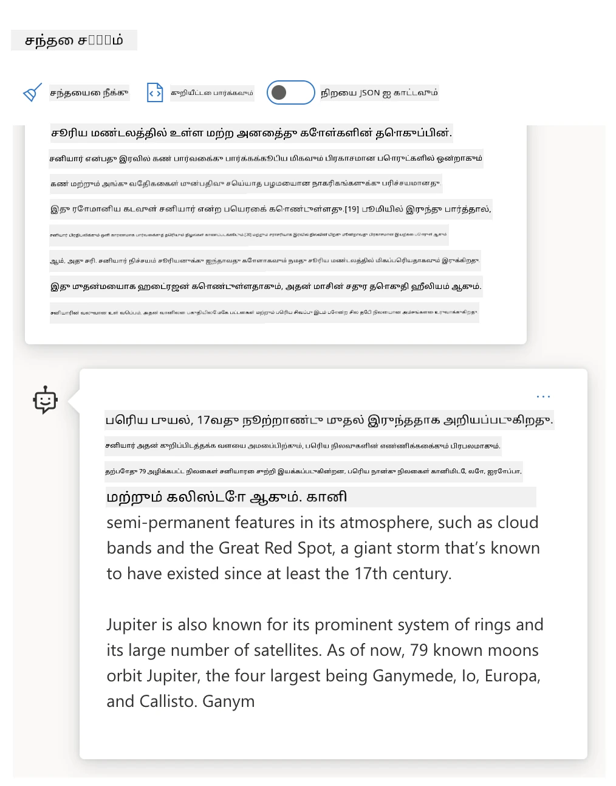
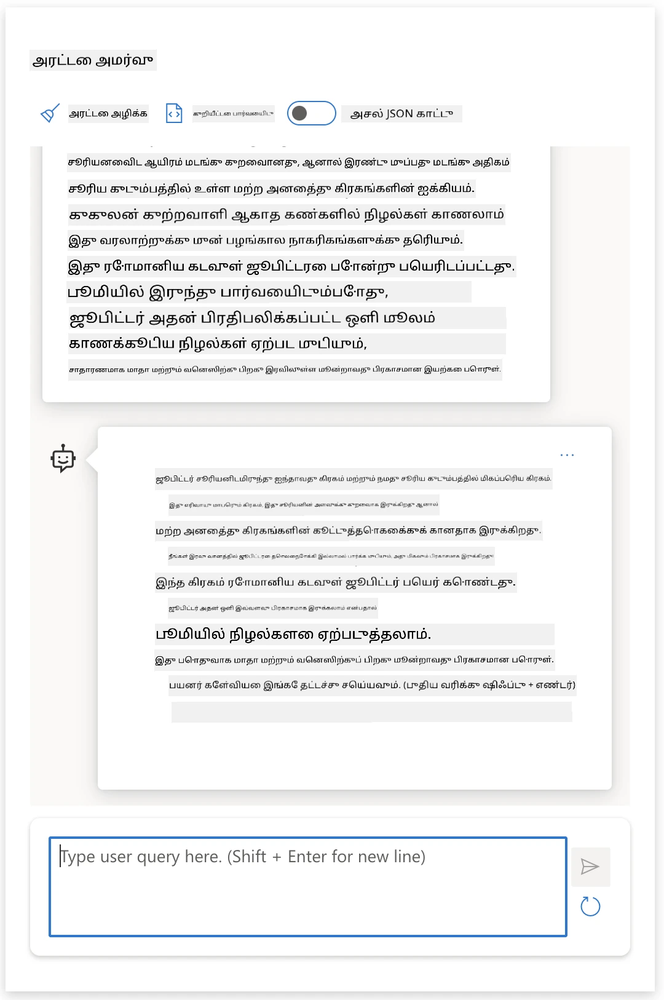
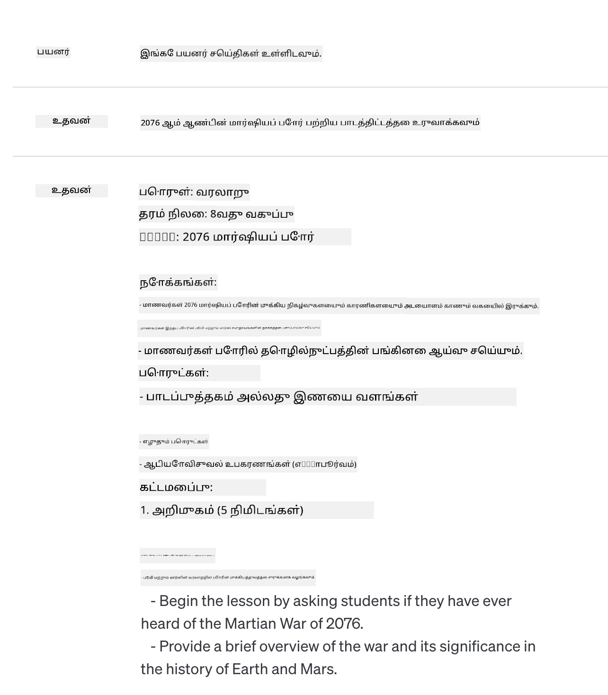
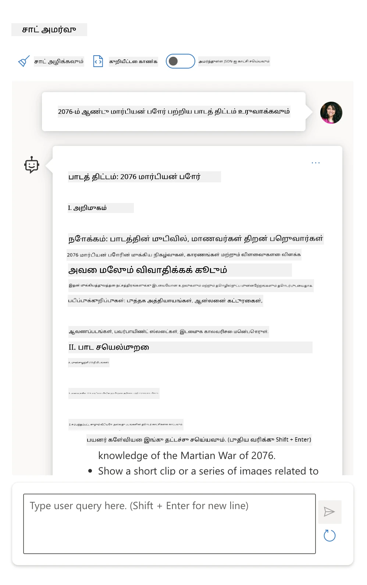
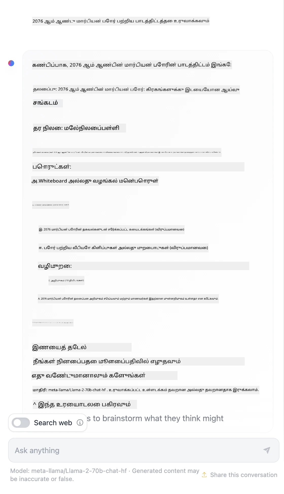

# பிராம்ட் இன்ஜினியரிங் அடிப்படைகள்

[](https://youtu.be/GElCu2kUlRs?si=qrXsBvXnCW12epb8)

## அறிமுகம்
இந்த மாட்யூல் உற்பத்தி செயும் AI மாடல்களில் திறமையான பிராம்ட்களை உருவாக்குவதற்கான முக்கியக் கருத்துக்கள் மற்றும் தொழில்நுட்பங்களை உள்ளடக்கியது. நீங்கள் ஒரு LLMக்கு எழுதும் பிராம்ட் எப்படி இருக்கும் என்பது மிக முக்கியம். கவனமாக வடிவமைக்கப்பட்ட பிராம்ட் சிறந்த பதிலை பெற உதவும். ஆனால் _பிராம்ட்_ மற்றும் _பிராம்ட் இன்ஜினியரிங்_ போன்ற சொற்கள் என்ன அர்த்தம் கொண்டவை? மற்றும் நான் LLMக்கு அனுப்பும் பிராம்ட் _உள்ளீட்டை_ எவ்வாறு மேம்படுத்தலாம்? இந்த κεாப்பில் மற்றும் அடுத்த κεாத்திரத்தில் நாம் இதற்கு பதிலளிக்க முயற்சிக்கலாம்.

_உற்பத்தி செயும் AI_ பயனர் கோரிக்கைகளுக்கு பதிலாக புதிய உள்ளடக்கங்களை (உதா., உரை, படங்கள், ஒலி, குறியீடு போன்றவை) உருவாக்கக்கூடியது. இது OpenAI-ன் GPT ("Generative Pre-trained Transformer") தொடர்ப்பான _பெரிய மொழி மாதிரிகள்_ (Large Language Models) மூலம் இயங்குகிறது, இவை இயற்கை மொழி மற்றும் குறியீட்டுடன் பயிற்சி பெற்றவை.

பயனர்கள் இப்போது இதுபோன்ற மாதிரிகள் உடன் அரப்புரையாடல் போன்ற பரிச்சயமான முறைகள் மூலம் செயல்படலாம், தொழில்நுட்ப நிபுணத்துவம் இல்லாமல். மாடல்களை _பிராம்ட் அடிப்படையில்_ பயன்படுத்துகிறார்கள் - பயனர்கள் ஒரு உரை உள்ளீட்டை (பிராம்ட்) அனுப்பி AI பதிலை (நிறைவு) பெறுகின்றனர். அவர்கள் அதன்பின் பல-சுற்று உரையாடலில் AI உடன் "பேச"லாம், பிராம்டை விருத்தி செய்து எதிர்பார்ப்புக்கு ஏற்ப பதிலை பெறுகின்றனர்.

இப்போது "பிராம்ட்கள்" உருவாக்கும் AI செயலிகளுக்கான முதன்மை _திட்டமிடல் முகப்பு_ ஆகின்றன, மாடல்களுக்கு என்ன செய்யவேண்டுமானை கூறி, நேர்மையான பதில்களுக்கான தரத்தை பாதிக்கின்றன. "பிராம்ட் இன்ஜினியரிங்" என்பது வேகமாக வளர்கிற கல்வித் துறையாகும், இது பிராம்டுகளை வடிவமைக்கும் மற்றும் மேம்படுத்தும் பணிகள் மீது கவனம் செலுத்துகிறது.

## கற்றல் இலக்குகள்

இந்த பாடத்தில், பிராம்ட் இன்ஜினியரிங் என்றால் என்ன, அது ஏன் முக்கியம் மற்றும் குறிப்பிட்ட மாதிரி மற்றும் பயன்பாட்டு நோக்கத்திற்கான திறமையான பிராம்ட்களை எப்படி தயாரிப்பது என்பதை கற்கப் போகிறோம். பிராம்ட் இன்ஜினியரிங்கின் முக்கியக் கருத்துகளையும் சிறந்த நடைமுறைகளையும் புரிந்து கொள்வோமே - மற்றும் Jupyter Notebooks "sandbox" மண்டலத்தைப் பயன்படுத்தி பரிசோதனை செய்வோம்.

இந்த பாடம் முடிவில் நாம்:

1. பிராம்ட் இன்ஜினியரிங் என்ன மற்றும் அது ஏன் முக்கியம் என்பதை விளக்க முடியும்.
2. ஒரு பிராம்ட் கூறுக்களை விவரித்து அவற்றைப் பயன்படுத்திக் காட்ட முடியும்.
3. பிராம்ட் இன்ஜினியரிங்கிற்கான சிறந்த நடைமுறைகள் மற்றும் தொழில்நுட்பங்களை கற்றுக்கொள்ள முடியும்.
4. கற்கப்பட்ட தொழில்நுட்பங்களை OpenAI அனுகுமுறை பயன்படுத்தி உண்மையான எடுத்துக்காட்டுகளில் செயல்படுத்தலாம்.

## முக்கிய சொற்கள்

பிராம்ட் இன்ஜினியரிங்: AI மாதிரிகளை குறிப்பிட்ட பலன்கள் ஈடுசெய்ய வழிநடத்த உள்ளீடுகளை வடிவமைத்து மேம்படுத்தும் நடைமுறை.
டோக்கனேசன்: உரையை, மாதிரி புரிந்துகொள்ளக்கூடிய சிறிய தொகுதிகளான டோக்கன்களில் மாற்றும் செயல்பாடு.
கையேட்டுடன் மேம்படுத்தப்பட்ட LLMகள்: தமிழது துல்லிய பதில்கள் மற்றும் பொருத்தத்தைக் கொண்ட வழங்கு மாதிரிகள்.

## கற்றல் சாண்ட்பாக்ஸ்

பிராம்ட் இன்ஜினியரிங் தற்போது அறிவியலுக்கு மேலாக கலை போன்றது. இதை மேம்படுத்த சிறந்த வழி _மிக்க பயிற்சி_ மற்றும் தவறு-சரி முறையை பயன்படுத்தி, பயன்பாட்டு துறையின் அறிவும் பரிந்துரைக்கும் தொழில்நுட்பமும் மாதிரி-சிறப்பான மேம்பாடுகளும் ஒன்றாக இருப்பது.

இந்த பாடத்துடன் இணைக்கப்பட்ட Jupyter Notebook-ல் நீங்கள் கற்றதை முயற்சி செய்ய இயலும் _sandbox_ சூழல் உள்ளது, அல்லது பாடம் கடைசியில் உள்ள குறியீட்டு சவால் பகுதியாக செய்யலாம். பயிற்சிகளை செய்ய வேண்டியது:

1. **ஒரு Azure OpenAI API விசை** - ஒரு स्थापना செய்யப்படும் LLMக்கு சேவை முனை.
2. **Python இயக்க சூழல்** - இதில் Notebook இயக்கப்பெறும்.
3. **உள்ளூர் சூழல் மாறிலிகள்** - _[SETUP](./../00-course-setup/02-setup-local.md?WT.mc_id=academic-105485-koreyst) படிகளை இப்போது முடிக்கவும்_.

இந்த நோட்ட்புக் _தொடக்க_ பயிற்சிகளுடன் வருகிறது - ஆனால் நீங்கள் விரும்பினால் உங்கள் சொந்த _Markdown_ (விளக்கம்) மற்றும் _Code_ (பிராம்ட் கோரிக்கைகள்) பகுதியை சேர்த்து மேலும் எடுத்துக்காட்டுகளை முயற்சி செய்து பிராம்ட் வடிவமைப்பில் நுணுக்கத்தை வளர்க்கலாம்.

## வரைபட வழிகாட்டி

இந்த பாடம் எதை உள்ளடக்குகிறது என்பதை பெரிய வரைபடமாகப் பார்க்க விரும்புகிறீர்களா? இந்த வரைபட வழிகாட்டியைச் சரி பாருங்கள், இது முக்கிய தலைப்புகளையும், உங்களுக்கு எண்ண வேண்டிய முக்கிய கருத்துகளையும் தருகிறது. பாடம் கூடுதல் அறிவை பெறுவதற்கான முக்கியக் கருத்துகளையும் சவால்களையும் புரிந்து, தொடர்புடைய பிராம்ட் இன்ஜினியரிங் தொழில்நுட்பங்களையும் சிறந்த நடைமுறைகளையும் அணுகுவதற்கான வழிமுறையாக செயல்படுகிறது. இந்த வழிகாட்டியில் உள்ள "ஆதுதல் தொழில்நுட்பங்கள்" பகுதி அடுத்த அதிகாரத்தில் உள்ள உள்ளடக்கத்துடன் தொடர்புடையது.



## எங்கள் ஸ்டார்ட்அப்

இப்போது, _இந்த தலைப்பு_ எங்கள் ஸ்டார்ட்அப்பின் பணிக்கான தொடர்பைப் பற்றி பேசலாம், அது [கல்விக்கான AI புதுமைகளை கொண்டு வருவதற்காக](https://educationblog.microsoft.com/2023/06/collaborating-to-bring-ai-innovation-to-education?WT.mc_id=academic-105485-koreyst) அமையும். நாங்கள் ஆளுக்கேற்ற வகுப்பெடுத்தல் (personalized learning) கொண்ட AI செயலிகளை உருவாக்க விரும்புகிறோம் - அதனால் எங்கள் செயலியைப் பயன்படுத்தும் பல்வேறு பயனர்கள் எப்படி "பிராம்டுகளை வடிவமைக்கலாம்" என்று யோசிக்கலாம்:

- **நிர்வாகிகள்** AI-க்கு _பாடத்திட்ட தரவை ஆராய்ந்து, கட்டமைப்பில் குறைபாடுகளைக் கண்டறிய கேட்கலாம்_. AI முடிவுகளை சுருக்கமாக வழங்கலாம் அல்லது குறியீடு மூலம் காட்சி வடிவில் காண்பிக்கலாம்.
- **கல்வியாளர்கள்** AI-க்கு _குறித்த பகுதியின் மற்றும் பொருளின் பாட திட்டத்தை உருவாக்க கேட்கலாம்_. AI குறிப்பிட்ட வடிவமைப்பில் தனிப்பட்ட திட்டத்தை உருவாக்கும்.
- **மாணவர்கள்** AI-க்கு _ஒரு கடின பாடத்தில் அவர்களை டியூட்டர் செய்ய கேட்கலாம்_. AI தற்பொழுது அவற்றின் மட்டத்திற்கேற்ப பாடங்கள், குறிப்புகள் மற்றும் எடுத்துக்காட்டுகளோடு வழிகாட்டும்.

இது வெறும் ஒரு தொடங்கும் புள்ளி மட்டுமே. [Prompts For Education](https://github.com/microsoft/prompts-for-edu/tree/main?WT.mc_id=academic-105485-koreyst) - கல்வி நிபுணர்களால் தொகுக்கப்பட்ட திறந்த மூல பிராம்ட் நூலகத்தை பாருங்கள் - அதில் என்னவெல்லாம் சாத்தியமன்று என்று தெளிவாக உணர்வீர்கள்! _சாண்ட்பாக்ஸிலும் OpenAI விளையாட்டு பகுதிலும் இந்த பிராம்ட்களை சோதனை செய்ய முயற்சிக்கவும்!_

<!--
LESSON TEMPLATE:
இந்த அலகு முக்கியக் கருத்து #1ஐ உள்ளடக்கியதாக இருக்க வேண்டும்.
எடுத்துக்காட்டுக்கள் மற்றும் குறிப்புகள் மூலம் கருத்தை வலுப்படுத்தவும்.

கருத்து #1:
பிராம்ட் இன்ஜினியரிங்.
இதனை வரையறுத்து, அது ஏன் தேவையானது என்பதை விளக்கவும்.
-->

## பிராம்ட் இன்ஜினியரிங் என்றால் என்ன?

இந்த பாடத்தை நாம் துவக்கினோம் **பிராம்ட் இன்ஜினியரிங்** என்பது உரை உள்ளீடுகளை (பிராம்ட்களை) _வடிவமைத்து மேம்படுத்தி_ குறிப்பிட்ட பயன்பாட்டிற்கும் மாதிரிக்கும் ஒரே தன்மை மற்றும் தரமான பதில்களை வழங்கும் செயல்முறை என்று வரையறுத்து. இதை இரண்டு படிகளாகப் பார்க்கலாம்:

- ஒரு மாதிழ் மற்றும் நோக்கத்திற்கு தொடக்க பிராம்டை _வடிவமைத்தல்_
- பதிலின் தரத்தை மேம்படுத்த பிராம்டை முறையாக _சீரமைத்தல்_

இது தவறு-சரி முறைவே ஆகும், சிறந்த முடிவுக்கு பயனரின் உள்நோக்கம் மற்றும் முயற்சி தேவை. அது எதற்கு அவசியம்? என்பதைப் புரிந்துகொள்ள முன், நாம் மூன்று கருத்துக்களை அறிய வேண்டும்:

- _டோக்கனேசன்_ = மாதிரி பிராம்டை எப்படி "பார்க்கிறது"
- _அடித்தளம் LLMகள்_ = அடித்தள மாதிரி பிராம்டை எப்படி "செயலாக்குகிறது"
- _கையேட்டுடன் மேம்படுத்தப்பட்ட LLMகள்_ = மாதிரி இப்போது "பணிகளை" எப்படி "பார்க்கிறது"

### டோக்கனேசன்

ஒரு LLM பிராம்ட்களை _டோக்கன்களின் வரிசையாக_ பார்க்கிறது, வேறு மாதிரிகள் அல்லது அதே மாதிரியின் வெவ்வேறு பதிப்புகள் ஒரே பிராம்டைக் கொஞ்சம் வேறு டோக்கன்களாக பிரிக்கலாம். LLMகள் டோக்கன்களில் பயிற்சி பெற்று இருப்பதால், பிராம்டுக்களின் டோக்கனேசன் பதிலின் தரத்தில் நேரடி தாக்கம் உண்டு.

டோக்கனேசன் எப்படி வேலை செய்கிறது என்பதைக் கருத்தில் கொள்ள, கீழே காட்டப்பட்டுள்ள [OpenAI Tokenizer](https://platform.openai.com/tokenizer?WT.mc_id=academic-105485-koreyst) போன்ற கருவிகளை முயற்சி செய்யுங்கள். உங்கள் பிராம்டை நகலெடுத்து இடுங்கள் - அது எவ்வாறு டோக்கன்களாக மாறுகிறது என்பதை பார்த்து வெற்றிட எழுத்துகள் மற்றும் குறியீடுகள் எப்படி பராமரிக்கப்படுகின்றன என்பதனை கவனியுங்கள். இந்த எடுத்துக்காட்டு பழைய LLM (GPT-3)ஐ பயன்படுத்துகிறது - புதிய மாதிரியில் இது வேறுபடும்.



### கருத்து: அடித்தளம் மாதிரிகள்

ஒரு பிராம்ட் டோக்கனாக்கப்பட்டபின், ["அடித்தளம் LLM"](https://blog.gopenai.com/an-introduction-to-base-and-instruction-tuned-large-language-models-8de102c785a6?WT.mc_id=academic-105485-koreyst) (அல்லது அடித்தளம் மாதிரி) முக்கிய பணி அந்த வரிசையில் அடுத்த டோக்கனை கணித்தல் ஆகும். LLMகள் பெரிய உரை தரவுத் தொகுப்புகளில் பயிற்சி பெற்றதால் டோக்கன்களுக்கிடையுள்ள புள்ளியியல் தொடர்புகளை நன்றாக அறிந்து உள்ளன, ஆகையால் அடுத்த டோக்கனை நம்பிக்கையுடன் கணிக்க முடியும். பிராம்ட் அல்லது டோக்கனில் உள்ள வார்த்தைகளின் அர்த்தத்தை அவர்கள் புரிந்துகொள்ளவில்லை; அவர்கள் ஒரு சித்திரத்தை மட்டுமே "நிறைவு செய்ய"ும் பொதுவான எதிர்பார்ப்பு வைத்து பதிலளிக்கிறார்கள். பயனர் இடையீடு செய்யும் அல்லது முன்கூட்டிய நிபந்தனை நிறைவேற்றப்படும் வரை அவர்கள் தொடர்ச்சியாக கணிக்கும்.

பிராம்ட் அடிப்படையிலான நிறைவு எப்படி வேலை செய்கிறது என்று பார்க்க விரும்புகிறீர்களா? மேலே உள்ள பிராம்டை [Microsoft Foundry playground](https://ai.azure.com?WT.mc_id=academic-105485-koreyst) இல் இயல்புநிலைக்கு வைத்து இடுங்கள். இந்த அமைப்பு பிராம்ட்களை தகவல் கோரிக்கை என கருதுகிறது - எனவே நீங்கள் இந்த சூழலை பூர்த்தி செய்யும் நிறைவை காணலாம்.

ஆனால் பயனர் குறிப்பிட்ட சில நிபந்தனை அல்லது பணியுடன் பொருந்திய பதிலை காண விரும்பினால்? அப்போது _கையேட்டு மேம்படுத்தப்பட்ட_ LLMகள் உதவுகின்றன.



### கருத்து: கையேட்டு மேம்படுத்தப்பட்ட LLMகள்

ஒரு [கையேட்டுடன் மேம்படுத்தப்பட்ட LLM](https://blog.gopenai.com/an-introduction-to-base-and-instruction-tuned-large-language-models-8de102c785a6?WT.mc_id=academic-105485-koreyst) அடித்தளம் மாதிரியுடன் தொடங்கி, அது கையேடு அல்லது உள்ளீடு/வெளியீடு இணைப்பு ("சுற்று உரையாடல்கள்") கொண்ட எடுத்துக்காட்டுகளுடன் மேம்படுத்தப்படுகிறது - இதில் தெளிவான அறிவுரைகள் உள்ளன - AI பதில் அந்த அறிவுரையை பின்பற்ற முனைவு காட்டும்.

இது Reinforcement Learning with Human Feedback (RLHF) போன்ற தொழில்நுட்பங்களை பயன்படுத்தி, மாதிரியை _அறிவுரைகளை பின்பற்றச்_ செய்யவும் _கருத்துகளை இருந்து கற்றுக்கொள்ளவும்_ பயிற்சி செய்கிறது, இதனால் பயனுள்ள பயன்பாடுகளுக்கு பொருத்தமான மற்றும் பயனர் நோக்கங்களுடன் பொருந்தக்கூடிய பதில்களை உருவாக்கக்கூடும்.

முயற்சி செய்யலாம் - மேலே உள்ள பிராம்டை மீண்டும் பார்த்து, ஆனால் இப்போது _கணினி செய்தி_ என்னும் இடத்தில் கீழ்க்கண்ட அறிவுரையை உள்ளடக்குங்கள்:

> _நீங்கள் கொடுக்கப்பட்ட உள்ளடக்கத்தை இரண்டாம் வகுப்பு மாணவருக்காக சுருக்குங்கள். முடிவில் 3-5 புள்ளிகளுடன் ஒரு பத்தியை மட்டும் வைத்திருங்கள்._

முடிவு இப்போது தேவையான இலக்கு மற்றும் வடிவத்தை பிரதிபலிக்கிறது என்பதை பாருங்கள்? ஒரு கல்வியாளர் இப்போது இந்த பதிலை தங்களின் வகுப்பு சிளைடுகளில் நேரடியாகப் பயன்படுத்தலாம்.



## பிராம்ட் இன்ஜினியரிங் ஏன் தேவையானது?

இப்போது பிராம்ட்கள் LLMகளால் எவ்வாறு செயலாக்கப்படுகின்றன என்பதை அறிந்த பிறகு, பிராம்ட் இன்ஜினியரிங் ஏன் அவசியம் என்று பேசுவோம். பதில் இங்கே உள்ளது: தற்போதைய LLMகள் பல சவால்களை உருவாக்குகின்றன, இதனால் _நம்பகமான மற்றும் ஒரே தன்மையுள்ள நிறைவு பெறுதல்_ பிராம்ட் கட்டமைப்பிலும் மேம்படுத்தலிலும் முயற்சிக்காமை சிரமம் தருகிறது. உதாரணமாக:

1. **மாதிரி பதில்கள் தொலைதூரமானவை.** _அதே பிராம்ட்_ வெவ்வேறு மாதிரிகளோ மாதிரி பதிப்புகளோ மூலம் வேறுபட்ட பதில்களை உருவாக்க வாய்ப்பு உள்ளது. அது ஒரே மாதிரியில் வெவ்வேறு நேரங்களிலும் வேறுபாடாயிருக்கும். _பிராம்ட் இன்ஜினியரிங் தொழில்நுட்பங்கள் இந்த வேறுபாடுகளை குறைக்க உதவும்_.

1. **மாதிரிகள் பதில்களை கற்பனை செய்யலாம்.** மாதிரிகள் _பெரிய ஆனால் எல்லைக்கேற்பட்ட_ தரவுத் தொகுப்புகளில் பயிற்சி பெறுவதால், பயிற்சி வரம்பை தாண்டிய கருத்துக்களின் அறிவில்லாமல் இருக்கலாம். இதனால் தவறான, கற்பனை செய்துள்ள அல்லது உண்மைகளுக்கு எதிரான பதில்களை உருவாக்க வாய்ப்பு உள்ளது. _பிராம்ட் இன்ஜினியரிங் தொழில்நுட்பங்கள் பயனர்கள் இதுபோன்றக் கட்டமைப்புகளை கண்டறிந்து குறைக்கும் உதவும், உதாரணத்திற்கு AI-விட மேற்கோள்கள் அல்லது காரணங்களை கேட்க செய்து_.

1. **மாதிரி திறன்கள் மாறுபடும்.** புதிய மாதிரிகள் அல்லது தலைமுறை மாதிரிகள் அதிக திறன்கள் கொண்டிருப்பினும், தனிப்பட்ட சிக்கல்கள் மற்றும் செலவு மற்றும் சிக்கல்களில் வித்தியாசங்கள் கொண்டிருக்கும். _பிராம்ட் இன்ஜினியரிங் நாங்கள் சிறந்த நடைமுறைகள் மற்றும் வேலைப் முறைகளை உருவாக்கக் உதவும், பார்த்து மாதிரி தனித்துவங்களை மறைத்து, மாதிரிக்கு ஏற்ப விரிவாக செயல்படுத்த உதவும்_.

OpenAI அல்லது Azure OpenAI விளையாட்டு பகுதியில் இது எப்படி வேலை செய்கிறது என்பதைப் பார்க்கலாம்:

- வெவ்வேறு LLM அலகுகளுடன் ஒரே பிராம்டைப் பயன்படுத்துங்கள் (எ.கா., OpenAI, Azure OpenAI, Hugging Face) - வேறுபாடுகளைப் பார்த்தீர்களா?
- ஒரே LLM அலகுடன் ஒரே பிராம்டை மீண்டும் மீண்டும் பயன்படுத்துங்கள் (எ.கா., Azure OpenAI விளையாட்டு) - இந்த வேறுபாடுகள் எவ்வாறு வேறுபட்டன?

### கற்பனை செய்யப்பட்டது உதாரணம்

இந்த கேர்ஸில், **"கற்பனை"** என்ற பதிலை LLMகள் சில நேரங்களில் தங்கள் பயிற்சி அல்லது மற்ற வரம்புகளால் உண்மைக்கு மாறு உண்மையற்ற தகவல்களை உருவாக்கும் நிகழ்வாக காண்கிறோம். இந்த நிகழ்வு _"மாயைகள்"_ என பிரபல கட்டுரைகள் அல்லது ஆய்வுக் கட்டுரைகளில் அழைக்கப்படலாம். இருந்தாலும், மனிதர்களைப் போல காட்டும் வழு தவிர _"கற்பனை"_ என்ற சொல்லை பயன்படுத்த பரிந்துரைக்கிறோம். இது [பொறுப்பான AI வழிகாட்டுதல்கள்](https://www.microsoft.com/ai/responsible-ai?WT.mc_id=academic-105485-koreyst) பொருத்தமாகவும், சில சூழல்களில் மார்க்க காட்டும் அல்லது புறக்கணிக்கப்பட்ட சொற்களைக் குறைக்கும் விதமாகவும் இருக்கிறது.

கற்பனை எப்படி வேலை செய்கிறது என்பதை புரிந்துகொள்ள வேண்டுமா? பயிற்சி தொகுப்பில் இல்லாத ஒரு பட்டியலிடப்படாத பொருளுக்கு AI விட உள்ளடக்கங்களை உருவாக்குமாறு பிராம்ட் கொடுக்கவும் (அதாவது அது பயிற்சி தொகுப்பில் இல்லை என்பதை உறுதி செய்ய). உதாரணமாக - நான் இந்த பிராம்டை முயற்சி செய்தேன்:

> **பிராம்ட்:** 2076 ஆம் ஆண்டுக்கான மார்சிய போருக்கான பாடத் திட்டம் உருவாக்கவும்.

இணைய தேடல் எனக்கு மார்சியப் போர răகளை பற்றி புனைவு கணக்குகளை காட்டியது (உதா., தொலைக்காட்சித் தொடர்கள் அல்லது புத்தகங்கள்) - ஆனால் 2076 வருடத்திற்கு இல்லை. பொதுவான அறிவும் 2076 _எதிர்காலம்_ என்பதைக் கூறுகிறது, எனவே அது உண்மையான நிகழ்ச்சியுடன் தொடர்பில்லாதது.


இந்த ப்ராம்ப்டை வெவ்வேறு LLM வழங்குநர்களுடன் இயக்கினால் என்ன நடக்கும்?

> **பதில் 1**: OpenAI Playground (GPT-35)



> **பதில் 2**: Azure OpenAI Playground (GPT-35)



> **பதில் 3**: : Hugging Face Chat Playground (LLama-2)



எதிர்பார்த்தபடி, ஒவ்வொரு மாதிரி (அல்லது மாதிரி பதிப்பு) பன்முகவரிகள் நடவடிக்கை மற்றும் மாதிரி திறன்களில் உள்ள வேறுபாடுகளால் சிறிது வேறுபட்ட பதில்களை உண்டாக்குகிறது. உதாரணமாக, ஒரு மாதிரி எட்டு ශ්ரேணி மாணவர்களுக்கானதாக இருக்கிறது, மற்றொன்று உயர்நிலை பள்ளி மாணவராக நினைக்கிறது. ஆனாலும் மூன்று மாதிரிகள் அனைத்தும் நிகழ்வு உண்மையானது என்று தெரியாத பயனர் ஒருவரை納ச் சுற்றியுள்ள பதில்களை உருவாக்கின.

_மெட்டாப்ப்ராம்டிங்_ மற்றும் _தென்பரேச்சர் கொண்ஃபிகரேஷன்_ போன்ற ப்ராம்ட் இன்ஜினியரிங் தொழில்நுட்பங்கள் மாதிரி உருவிப்புகளை சில அளவுக்கு குறைக்க உதவும். புதிய ப்ராம்ட் இன்ஜினியரிங் _வடிவமைப்புகள்_ மேலும் புதிய கருவிகள் மற்றும் தொழில்நுட்பங்களை ப்ராம்ட் ஓட்டத்தில் சம்பந்தப்படுத்தி, இந்த தாக்கங்களை குறைக்க முயற்சிக்கின்றன.

## வழக்கு ஆய்வு: GitHub Copilot

இந்த பிரிவை முடிக்காத முன்பு நிஜ உலக ப்ராம்ட் இன்ஜினியரிங் பயன்பாட்டினைப் பார்க்க [GitHub Copilot](https://github.com/features/copilot?WT.mc_id=academic-105485-koreyst) என்ற ஒரு வழக்கு ஆய்வைப் பார்ப்போம்.

GitHub Copilot உங்கள் "AI இணை தொகுத்தியாளர்" ஆகும் - இது உரை ப்ராம்ட்களை குறியீட்டு நிறைவு ஆக மாற்றி உங்கள் மேம்பாட்டு சூழலில் (உதா: Visual Studio Code) ஒருங்கிணைக்கப்பட்டு ஒரு உயிர்த் திரும்பத்துடன் செயல்படுகிறது. கீழே உள்ள தொடரான வலைப்பதிவுகளில் உள்ளதுபோல், ஆரம்ப பதிப்பு OpenAI Codex மாதிரியை அடிப்படையாகக் கொண்டு இருந்தது - ஆனால் பொறியாளர்கள் விரைவில் மாதிரியை சிறப்பாக்க மற்றும் ப்ராம்ட் இன்ஜினியரிங் தொழில்நுட்பங்களை மேம்படுத்த தேவையுணர்ந்து, குறியீட்டு தரம் மேம்படுத்தப்பட்டது. ஜூலை மாதம், அவர்கள் [Codex இலிருந்து மேலும் மேம்பட்ட AI மாதிரியை அறிமுகப்படுத்தினர்](https://github.blog/2023-07-28-smarter-more-efficient-coding-github-copilot-goes-beyond-codex-with-improved-ai-model/?WT.mc_id=academic-105485-koreyst) மிக வேகமான பரிந்துரைகளுக்கு.

தங்கள் கற்கை பயணத்தை தொடர கீழ்க்கண்ட பதிவுகளை வரிசையில் படியுங்கள்.

- **மே 2023** | [GitHub Copilot உங்கள் குறியீட்டை புரிந்து கொள்வதில் சிறப்பாகிறது](https://github.blog/2023-05-17-how-github-copilot-is-getting-better-at-understanding-your-code/?WT.mc_id=academic-105485-koreyst)
- **மே 2023** | [GitHub உள்நோக்கம்: GitHub Copilot பின்னணியில் உள்ள LLMகளை பயன்படுத்துவது](https://github.blog/2023-05-17-inside-github-working-with-the-llms-behind-github-copilot/?WT.mc_id=academic-105485-koreyst).
- **ஜூன் 2023** | [GitHub Copilotக்கு சிறந்த ப்ராம்ட்களை எப்படி எழுதுவது](https://github.blog/2023-06-20-how-to-write-better-prompts-for-github-copilot/?WT.mc_id=academic-105485-koreyst).
- **ஜூலை 2023** | [.. GitHub Copilot Codexக்குச் சென்றது மேலும் மேம்பட்ட AI மாதிரியுடன்](https://github.blog/2023-07-28-smarter-more-efficient-coding-github-copilot-goes-beyond-codex-with-improved-ai-model/?WT.mc_id=academic-105485-koreyst)
- **ஜூலை 2023** | [ப்ராம்ட் இன்ஜினியரிங் மற்றும் LLMகளுக்கு ஒரு டெவலப்பர் வழிகாட்டி](https://github.blog/2023-07-17-prompt-engineering-guide-generative-ai-llms/?WT.mc_id=academic-105485-koreyst)
- **செப் 2023** | [எல்எல்எம்ஐயின் நிறுவனர் பயன்பாட்டை உருவாக்குவது எப்படி: GitHub Copilot இன் பாடங்கள்](https://github.blog/2023-09-06-how-to-build-an-enterprise-llm-application-lessons-from-github-copilot/?WT.mc_id=academic-105485-koreyst)

மேலும் [அவங் பொறியியல் வலைப்பதிவைக்](https://github.blog/category/engineering/?WT.mc_id=academic-105485-koreyst) காணலாம், இது [இவை போன்ற](https://github.blog/2023-09-27-how-i-used-github-copilot-chat-to-build-a-reactjs-gallery-prototype/?WT.mc_id=academic-105485-koreyst) பதிவுகளை வழங்குகிறது, இவை மாதிரிகளும் தொழில்நுட்பங்களும் நிஜ உலக பயன்பாடுகளுக்கானது என்பதைத் தெரிவிக்கிறது.

---

<!--
பாடத் திட்ட மாதிரி:
இந்த அலகு மையக் கருத்து #2 ஐ கையாள வேண்டும்.
எடுத்துக்காட்டுகள் மற்றும் குறிப்புகள் மூலம் கருத்தை வலுப்படுத்துக.

கருத்து #2:
ப்ராம்ட் வடிவமைப்பு.
எடுத்துக்காட்டுகளுடன் விளக்கும்.
-->

## ப்ராம்ட் கட்டமைப்பு

ப்ராம்ட் இன்ஜினியரிங் முக்கியம் என்பதைப் பார்த்தோம் - இப்போது ப்ராம்ட்கள் எப்படி _கட்டமைக்கப்படுகின்றன_ என்பதை புரிந்து கொள்ளலாம், மேலும் பலத்த ப்ராம்ட் வடிவமைப்புக்கு வெவ்வேறு தொழில்நுட்பங்களை மதிப்பாய்வு செய்யலாம்.

### அடிப்படையான ப்ராம்ட்

அடிப்படையான ப்ராம்டுடன் தொடங்குவோம்: மாதிரிக்கு அனுப்பப்படும் மற்ற எந்த சூழல் இல்லாமல் உரை உள்ளீடு. உதாரணமாக, நாம் அமெரிக்க தேசிய கீதத்தின் முதல் சில வார்த்தைகளை OpenAI [Completion API](https://platform.openai.com/docs/api-reference/completions?WT.mc_id=academic-105485-koreyst)க்கு அனுப்பும்போது, அது உடனடி _நிறைவு_ கொண்டு அடுத்த சில வரிகளை வழங்குகிறது, இது அடிப்படையான முன்னறிவிப்பு நடத்தையை விளக்குகிறது.

| ப்ராம்ட் (உள்ளீடு)            | நிறைவு (வெளியீடு)                                                                                                                        |
| :-----------------          | :----------------------------------------------------------------------------------------------------------------------------------------- |
| Oh say can you see           | இது "தி ஸ்டார்-ஸ்பாங்கிளெட் பேன்டர்," அமெரிக்காவின் தேசிய கீதத்தின் வரியைத் தொடங்குகிறீர்கள் என்பதைக் காட்டுகிறது. முழு வரிகள்...                         |

### சிக்கலான ப்ராம்ட்

அப்போது அதே அடிப்படைப் ப்ராம்டுக்கு சூழல் மற்றும் ஆறுதல் அளிப்போம். [Chat Completion API](https://learn.microsoft.com/azure/ai-foundry/openai/how-to/chatgpt?WT.mc_id=academic-105485-koreyst) நாம் _செய்திகள்_ தொகுப்பாக சிக்கலான ப்ராம்டை கட்டமைக்க அனுமதிக்கிறது:

- உள்ளீடு/வெளியீடு ஜோடிகள் _பயனர்_ உள்ளீடு மற்றும் _சகாயம்_ பதில்களை பிரதிபலிக்கும்.
- அமைப்பு செய்தி சகாயத்தின் நடத்தை அல்லது தனித்துவத்துக்கான சூழலை அமைக்கும்.

கோரிக்கை கீழே உள்ள வடிவத்தில் அமைகிறது, இங்கு _டோக்கனிசேஷன்_ சூழல் மற்றும் உரையாடலிலிருந்து பொருந்தக்கூடிய தகவலைப் பிடிக்கிறது. இப்போது, அமைப்பு சூழலை மாற்றுவது, பயனர் உள்ளீடுகளுக்கு ஒப்பான நிறைவின் தரத்திற்கு பாதிப்பைக் கொண்டு வருகிறது.

```python
response = client.responses.create(
    model="gpt-5-mini",
    input=[
        {"role": "system", "content": "You are a helpful assistant."},
        {"role": "user", "content": "Who won the world series in 2020?"},
        {"role": "assistant", "content": "The Los Angeles Dodgers won the World Series in 2020."},
        {"role": "user", "content": "Where was it played?"}
    ]
)
```

### வழிமுறை ப்ராம்ட்

மேலேயுள்ள உதாரணங்களில், பயனர் ப்ராம்ட் ஒரு எளிமையான உரை கேள்வியாக இருந்தது, இது தகவல் கோரிக்கையாக பொருள் கொள்ளப்படலாம். _வழிமுறை_ ப்ராம்ட்களில், நாம் அந்த உரையை ஒரு பணியை விரிவாக குறிக்க பயன்படுத்தலாம், AIக்கு சிறந்த வழிகாட்டுதலை வழங்கி. இது ஒரு உதாரணம்:

| ப்ராம்ட் (உள்ளீடு)                                                                                                                                                                                                                         | நிறைவு (வெளியீடு)                                                                                                        | வழிமுறை வகை          |
| :------------------------------------------------------------------------------------------------------------------------------------------------------------------------------------------------------------------------------------- | :------------------------------------------------------------------------------------------------------------------------- | :------------------ |
| Write a description of the Civil War                                                                                                                                                                                                   | _ஒரு எளிய абзац் உரை வழங்கப்பட்டது_                                                                                 | எளிமையானது          |
| Write a description of the Civil War. Provide key dates and events and describe their significance                                                                                                                                     | _அபзац் படி முக்கிய நிகழ்வுகளின் நாட்கள் மற்றும் விளக்கங்களுடன் பட்டியலை வழங்கியது_                                    | சிக்கலானது          |
| Write a description of the Civil War in 1 paragraph. Provide 3 bullet points with key dates and their significance. Provide 3 more bullet points with key historical figures and their contributions. Return the output as a JSON file | _JSON வடிவிலான உரை பெட்டியில் விரிவான விவரங்களை அளிக்கிறது, அவற்றை நகல் எடுத்து கோப்பாகச் சேமிக்கவும் சரிபார்க்கவும் முடியும்_ | சிக்கலானது. வடிவமைக்கப்பட்டது. |

## முதன்மை உள்ளடக்கம்

மேலே உள்ள உதாரணங்களில், ப்ராம்ட் இன்னும் பெரிதும் திறந்தவையாக இருந்தது, LLM தங்களுக்கு முன் பயிற்சி பெற்ற தரவுத்தொகுப்பின் எந்த பகுதியை பொருந்தாக்குதல் என்பதைத் தேர்வு செய்ய அலவசமானது. _முதன்மை உள்ளடக்கம்_ வடிவமைப்பு மாதிரியில், உள்ளீடு உரை இரண்டு பகுதிகளாகப் பிரிக்கப்படுகிறது:

- ஒரு வழிமுறை (செயல்)
- சம்பந்தப்பட்ட உள்ளடக்கம் (செயலில் தாக்கம் செய்கிறது)

இப்படிச் செய்யும் போது உதாரணமாக, வழிமுறை "இவற்றைப் 2 வாக்கியங்களில் சுருக்குக" என்பதாகும்.

| ப்ராம்ட் (உள்ளீடு)                                                                                                                                                                                                                                                                                                                                                                                                                                                                                                                                                                                                                                                                                      | நிறைவு (வெளியீடு)                                                                                                                                                                                                                                                                             |
| :-------------------------------------------------------------------------------------------------------------------------------------------------------------------------------------------------------------------------------------------------------------------------------------------------------------------------------------------------------------------------------------------------------------------------------------------------------------------------------------------------------------------------------------------------------------------------------------------------------------------------------------------------------------------------------------------------- | :---------------------------------------------------------------------------------------------------------------------------------------------------------------------------------------------------------------------------------------------------------------------------------------------- |
| யூபிட்டர் என்பது சூரியனிடமிருந்து ஐந்தாவது கிரகம் மற்றும் கண்காணிக்கும் மிகப்பெரிய கிரகம். இது ஒரு வாயு பெரிய கிரகம் என்பதால், சூரியனுக்குப் பதிலாக வாசகக் கனிவான சூழல் உள்ளது, ஆனால் மற்ற அனைத்து கிரகங்களின் கூட்டுத் துடிப்பை விட இரண்டு மடங்கு இரைச்சலுடன் உள்ளது. யூபிட்டர் இரவு வானில் கண் தெளிவான பொருள்களில் ஒன்றாக அதிக பிரகாசமளிக்கும், இது பதிவுகளுக்கு முன்னால் பழமையான பண்பாட்டு சமூகங்கள் அறிந்திருக்கின்றன. இது ரோமானிய கடவுள் யூபிட்டர் என்ற பெயரில் அழைக்கப்படுகிறது. [19] பூமியிலிருந்து பார்க்கும்போது, யூபிட்டர் அதன் பிரதிபலிக்கப்பட்ட ஒளியால் பார்க்கக்கூடிய நிழல்கள் உருவானக்கூடும், [20] மற்றும் சந்திரனும் வெண்சியுடன் இரவு வானில் மூன்றாவது பிரகாசமான இயற்கை பொருளாக உள்ளபோது. <br/> **இதை 2 சுருக்கமான வாக்கியங்களில் சுருக்குக** | யூபிட்டர், சூரியனிலிருந்து ஐந்தாவது கிரகம் மற்றும் சौर அமைப்பில் மிகப்பெரியதாகும், இரவு வானில் மிக பிரகாசமான பொருள்களுள் ஒன்று. ரோமானிய கடவுள் யூபிட்டர் பெயருடன், இது வாயு பெரிய கிரகமாகுள, அதன் பொதுமாவட்டம் மற்ற கிரகங்களின் கூட்டத்துடன் இரண்டரை மடங்கு உள்ளது. |

முதன்மை உள்ளடக்கம் பகுதி பலவிதமான வழிகளில் பயன்படுத்தி மேலும் பயனுள்ள வழிமுறைகள் உருவாக்க முடியும்:

- **எடுத்துக்காட்டுகள்** - மாதிரிக்கு என்ன செய்ய வேண்டும் என்பதை நேரடியாகக் கூறுவதற்குப் பதிலாக, செய்ய வேண்டியவற்றின் எடுத்துக்காட்டுகளை கொடுத்து மாதிரி அதனை ஊகிக்கச் செய்வது.
- **கியூக்கள்** - வழிமுறையுடன் ஒரு "கியூ" (சூத்திரம்) வழங்கி, மாதிரியை பொருந்தக்கூடிய பதில்களுக்கு வழிமொழிவு செய்வது.
- **வார்ப்புருக்கள்** - ப்ராம்ட் க்கான மீண்டும் பயன்படுத்தக்கூடிய 'வையம்'கள், இதில் ஓர் இடமாற்றிகள் (மாறிலிகள்) பல்துறை பயன்படுத்தி தனிப்பயன் தரவு இடலாம்.

இதைப் பயிற்சியில் பார்க்கலாம்.

### எடுத்துக்காட்டுகளைப் பயன்படுத்துதல்

இதுவொரு அணுகுமுறை, இதில் முதன்மை உள்ளடக்கத்தை பயன்படுத்தி கொடுக்கப்பட்ட வழிமுறைக்கான வேண்டிய வெளியீடு எடுத்துக்காட்டுகளை "மாதிரிக்கு ஊட்டிவைத்து", வேண்டிய வெளியீடு மாதிரியை ஊகிக்க விடுவதை செய்கிறது. கொடுக்கப்பட்ட எடுத்துக்காட்டுகளின் எண்ணிக்கையின் அடிப்படையில், சுற்றில்லா ப்ராம்ட், ஒன்று-ப்ராம்ட், சில-ப்ராம்ட் என இருக்க முடியும்.

ப்ராம்ட் இப்பொழுது மூன்று கூறுகளை கொண்டுள்ளது:

- ஒரு பணியின் விளக்கம்
- வேண்டிய வெளியீட்டின் சில எடுத்துக்காட்டுகள்
- புதிய எடுத்துக்காட்டின் தொடக்கம் (இது மறைமுக பணிய விளக்கமாகும்)

| கற்றல் வகை | ப்ராம்ட் (உள்ளீடு)                                                                                                                                        | நிறைவு (வெளியீடு)    |
| :------------ | :---------------------------------------------------------------------------------------------------------------------------------------------------- | :-------------------------- |
| சுற்றில்லா   | "The Sun is Shining". ஸ்பானிஷிற்கு மொழிபெயர்க்கவும்                                                                                                     | "El Sol está brillando".    |
| ஒன்று-ப்ராம்ட்| "The Sun is Shining" => ""El Sol está brillando". <br> "It's a Cold and Windy Day" =>                                                                 | "Es un día frío y ventoso". |
| சில-ப்ராம்ட் | The player ran the bases => Baseball <br/> The player hit an ace => Tennis <br/> The player hit a six => Cricket <br/> The player made a slam-dunk => | Basketball                  |
|               |                                                                                                                                                       |                             |

சுற்றில்லா ப்ராம்டிங்கில் நமக்கு தெளிவான வழிமுறையை ("ஸ்பானிஷிற்கு மொழிபெயர்க்கவும்") வழங்க வேண்டியதை கவனியுங்கள், ஆனால் ஒன்று-ப்ராம்ட் எடுத்துக்காட்டில் அது ஊகிக்கப்படுகிறது. சில ப்ராம்ட் எடுத்துக்காட்டுக்கள் மாதிரிகள் எந்தவொரு கூடுதல் வழிமுறைகளும் இல்லாமல் கூட அதிக சீரான ஊகங்களை செய்யக் காட்டுகிறது.

### ப்ராம்ட் கியூக்கள்

முதன்மை உள்ளடக்கத்தைப் பயன்படுத்த மற்றொரு தொழில்நுட்பம் எடுத்துக்காட்டுகள் அல்லாமல் _கியூக்கள்_ வழங்குவதாகும். இதில், நாம் மாதிரிக்கு தேவையான பதிலின் வடிவமுறை பிரதிபலிக்கும் ஒரு துண்டை _தொடங்குகிறோம்_. அது மாதிரி "கியூவை எடுத்துக் கொண்டு" அந்த நிலையை தொடரும்.

| கியூக்களின் எண்ணிக்கை | ப்ராம்ட் (உள்ளீடு)                                                                                                                                                                                                                                                                                                                                                                                                                                               | நிறைவு (வெளியீடு)                                                                                                                                                                                                                                                                                       |
| :------------- | :----------------------------------------------------------------------------------------------------------------------------------------------------------------------------------------------------------------------------------------------------------------------------------------------------------------------------------------------------------------------------------------------------------------------------------------------------------- | :-------------------------------------------------------------------------------------------------------------------------------------------------------------------------------------------------------------------------------------------------------------------------------------------------------- |
| 0              | யூபிட்டர் சூரியனிடமிருந்து ஐந்தாவது கிரகம் மற்றும் சौर அமைப்பில் மிகப்பெரிய கிரகம். இது ஒரு வாயு பெரிய கிரகம், சூரியனின் ஒரு ஆயிரம் ஒன்றுக்கு ஒன்று பருமனுள்ளதாகும், ஆனால் மற்ற கிரகங்களுக்கான கூட்ட பருமனைவிட இரண்டு மடங்கு அதிகம் உள்ளது. யூபிட்டர் இரவு வானில் கண் தெளிவான பொருள்களில் ஒன்றாக உள்ளது, அதனை பழமையான பண்பாட்டு சமூகங்கள் தொலைந்த காலத்திலிருந்தே அறிவதில் உள்ளது.<br/>**இதை சுருக்குக** | யூபிட்டர் எங்கள் சூரிய அமைப்பில் மிகப்பெரிய கிரகமாகும் மற்றும் சூரியனிலிருந்து ஐந்தாவது வகுப்பாகும். இது வாயு பெரிய கிரகம், சூரியனுக்கு ஆயிரம் ஒன்றுக்கு ஒன்று பருமனுள்ளதாக இருந்தாலும், மற்ற கிரகங்களின் கூட்டத்தில் அதிக பருமனை கொண்டது. பழமையான பண்பாட்டுக்கள் யூபிட்டரை நீண்ட காலமாக அறிந்திருக்கின்றனர் மற்றும் அது இரவு வானில் தெளிவாக தெரிகிறது.. |
| 1              | யூபிட்டர் சூரியனிடமிருந்து ஐந்தாவது கிரகம் மற்றும் சौर அமைப்பில் மிகப்பெரிய கிரகம். இது ஒரு வாயு பெரிய கிரகம், சூரியனின் ஒரு ஆயிரம் ஒன்றுக்கு ஒன்று பருமனுள்ளதாகும், ஆனால் மற்ற கிரகங்களுக்கான கூட்ட பருமனைவிட இரண்டு மடங்கு அதிகம் உள்ளது. யூபிட்டர் இரவு வானில் கண் தெளிவான பொருள்களில் ஒன்றாக உள்ளது, அதனை பழமையான பண்பாட்டு சமூகங்கள் தொலைந்த காலத்திலிருந்தே அறிவதில் உள்ளது.<br/>**இதை சுருக்குக** <br/> எங்களுக்குத் தெரிந்துகொண்டது என்றால் யூபிட்டர் | சூரியனிடமிருந்து ஐந்தாவது மற்றும் மிகப்பெரிய கிரகமாகும். இது வாயு பெரிய கிரகம் மற்றும் சூரியனுக்கு ஆயிரம் ஒன்றுக்கு ஒன்று பருமனாக இருக்கும்போதும், மற்ற கிரகங்களின் கூட்டத்தை விட இரண்டு மடங்கு பருமனாகும். அது கண்கள் தெளிவாக பார்க்கக்கூடியவையாகும் மற்றும் தொல்லை பருவக்கால முதன்முதலில் அறியப்பட்டது.                       |

| 2              | சூரியனுக்கு ஐந்தாவது கோள் மற்றும் விண்மீன் ஒன்றியத்தின் மிகப்பெரியது என்பது கல்வெட்டு மொழியிலான ஜூபிட்டர் ஆகும். இது ஒரு வாயு மிகப்பெரிய கோள் ஆகும் மற்றும் சூரியனின் ஒரு ஆயிரமாவது பகுதியில் உள்ள தூரம் உடையது, ஆனால் அனைத்து பிற கோள்களின் கூட்டுத்தொகையினை விட இரண்டு மடங்கு அதிகம் கொண்டுள்ளது. ஜூபிட்டர் இரவு வானில் கண் முன்பாகக் காணப்படும் மிக பிரகாசமான பொருட்களில் ஒன்றாகும் மேலும் இது வரலாற்றுக்குத் தடம் பதியாத பழமையான நாகரிகங்களால் அறியப்பட்டது. <br/>**இதனைக் சுருக்கவும்** <br/> நாங்கள் கற்றுக்கொண்ட 3 சிறந்த தகவல்கள்:         | 1. சூரியனுக்கு ஐந்தாவது கோள் மற்றும் விண்மீன் ஒன்றியத்தின் மிகப்பெரியது என்பது ஜூபிட்டர் ஆகும். <br/> 2. இது ஒரு வாயு மிகப்பெரிய கோள் ஆகும் மற்றும் சூரியனின் ஒரு ஆயிரமாவது பகுதியில் உள்ள தூரம் உடையது...<br/> 3. ஜூபிட்டர் பழமையான காலங்களிலிருந்தே கண் முன்பாகக் காணப்பட்டது...                                                                       |
|                |                                                                                                                                                                                                                                                                                                                                                                                                                                                              |                                                                                                                                                                                                                                                                                                           |

### கேள்வி வடிவாக்கம் மாதிரிகள்

ஒரு கேள்வி வடிவாக்கம் மாதிரி என்பது தேவையானபோது மீண்டும் பயன்படுத்த பொறுத்த ஒரு முன்மாதிரி சம்மேளனம் ஆகும், இது அதிக அளவிலான ஒவ்வொரு பயனர் அனுபவத்திற்கும் ஒரே மாதிரியாக உருப்படியாகும். அதன் எளிமையான வடிவில் இது [OpenAI இல் இருந்து இந்த மாதிரி](https://cookbook.openai.com/examples/gpt4-1_prompting_guide?WT.mc_id=academic-105485-koreyst) போன்ற இடைமுக கேள்வி கூறுகள் (பயனாளர் மற்றும் அமைப்பு செய்திகள்) மற்றும் API மூலம் இயக்கப்படும் கோரிக்கை வடிவத்தை வழங்கும் கேள்வி எடுத்துக்காட்டுகளின் தொகுப்பாகும் - மீண்டும் பயன்படுத்த ஆதரவு அளிக்க.

மேலும்복கமாக, [LangChain இல் இருந்து இந்த எடுத்துக்காட்டு](https://python.langchain.com/docs/concepts/prompt_templates/?WT.mc_id=academic-105485-koreyst) போன்ற நிலையாக, இதில் தரவு பல்வேறு மூலங்களிலிருந்து (பயனாளர் உள்ளீடு, அமைப்பு சூழல், வெளிப்படையான தரவுகள் போன்றவை) வாங்குவதற்கு மாற்றமான இடத்தில் _தொகுப்புகள்_ உள்ளன. இது கேள்வி வடிவமைப்பை நிகழ்வில் உருவாக்க உதவுகிறது. இதன் மூலம் நாங்கள் மீண்டும் பயன்படுத்தக்கூடிய கேள்வி நூலகத்தை உருவாக்கி, **பங்காற்றிய** முறையில் உயர்தர பயனர் அனுபவங்களை இயக்க முடியும்.

இறுதியாக, மாதிரிகளின் உண்மையான மதிப்பு _கேள்வி நூலகங்களை_ உருவாக்கி வெளியிடுவதில் உள்ளது - அங்கு கேள்வி வடிவமைப்பு பயன்பாட்டுக்கான குறிப்பிட்ட சூழல் மற்றும் எடுத்துக்காட்டுகளை பிரதிபலிக்கும் வகையில் _முன்னேற்றப்பட்ட_ வடிவமைப்பாக உள்ளது, இது ஒரு குறிப்பிட்ட பயனர் பார்வைக்கு பதில்கள் மேலும் பொருத்தமான மற்றும் சுத்தமாக இருக்கும். [Prompts For Edu](https://github.com/microsoft/prompts-for-edu?WT.mc_id=academic-105485-koreyst) சேமைப் பகுதி கல்விக்கான பிரதேசத்திற்கான கேள்விகள் நூலகத்தை உருவாக்கும் சிறந்த எடுத்துக்காட்டாகும், பாடம் திட்டமிடல், பாடத்திட்ட வடிவமைப்பு, மாணவர் பயிற்சி போன்ற முக்கிய நோக்குகளுக்கு முக்கியத்துவம் அளிக்கிறது.

## ஆதரவு உள்ளடக்கம்

நாம் கேள்வி கட்டுமானத்தை ஒரு செயல்முறை (பணி) மற்றும் ஒரு இலக்கு (அசல் உள்ளடக்கம்) என்று நினைத்துப் பார்க்கிறோம், அப்போது _இரண்டாம் நிலை உள்ளடக்கம்_ என்பது வெளியீட்டை _ஏதாவது விதமாக பாதிக்க_ கூடுதல் சூழல் போன்றதுதான். இது மாடல் பதில்களை அட்டவணைப்படுத்த உதவும் அமைப்பு, வடிவமைப்பு வழிமுறைகள், தலைப்பு வகைப்பாடுகள் ஆகியவற்றாக இருக்கலாம்.

உதாரணமாக: பாடத்திட்டத்தில் உள்ள அனைத்து பாடங்களுக்கு விரிவான தொகுப்பு தரவுகளுடன் (பெயர், விளக்கம், நிலை, குறிச்சொற்கள், ஆசிரியர் மற்றும் இதர விவரங்கள்):

- நாம் "Fall 2023 க்கான பாடத்திட்ட தொகுப்பை சுருக்கி" என்ற செயல்முறையை வரையறுக்கலாம்
- நாம் அடிப்படை உள்ளடக்கத்தில் விரும்பப்படும் வெளியீட்டின் சில எடுத்துக்காட்டுகளை வழங்கலாம்
- நாம் இரண்டாம் நிலை உள்ளடக்கத்தில் முனைப்படுத்தப்பட்ட 5 "குறிச்சொற்களை" குறிப்பிடலாம்.

இப்போது, மாடல் சில எடுத்துக்காட்டுகள் காட்டிய வடிவில் ஒரு சுருக்கத்தை வழங்கும் - பல குறிச்சொற்கள் இருக்கும் போது இரண்டாம் நிலை உள்ளடக்கத்தில் குறிப்பிடப்பட்ட 5 குறிச்சொற்களை முன்னுரிமை தரலாம்.

---

<!--
பாடத்திட்ட முறைமை:
இந்த அலகு முக்கியக் கருத்து #1 ஐ ஆட்கொள்ள வேண்டும்.
எடுத்துக்காட்டுகள் மற்றும் குறிப்பு மூலம் கருத்தை வலுப்படுத்தவும்.

கருத்து #3:
கேள்வி பொறியியல் தொழில்நுட்பங்கள்.
கேள்வி பொறியியலுக்கு சில அடிப்படை தொழில்நுட்பங்கள் என்ன?
சில பயிற்சிகளுடன் விளக்கவும்.
-->

## கேள்வி வடிவாக்க சிறந்த நடைமுறைகள்

இப்போது நாங்கள் கேள்விகளை _ கட்டமைக்க_ கற்றுகொண்ட பிறகு, அதை சிறந்த நடைமுறைகளை பிரதிபலிக்க _ வடிவமைக்க_ எப்படி என்பதைப் பற்றி சிந்திக்கலாம். இதில் இரண்டு பாகங்களாகப் பார்க்கலாம் - சரியான _மனப்பான்மையை_ வைத்துக்கொள்வது மற்றும் சரியான _தொழில்நுட்பங்களை_ பயன்படுத்துவது.

### கேள்வி பொறியியல் மனப்பான்மை

கேள்வி பொறியியல் என்பது முயற்சி மற்றும் தவறுகளில் இருந்து கற்றல் செயல்முறை ஆகும், எனவே மூன்று முக்கிய வழிகாட்டும் அம்சங்களை மனதில் வையுங்கள்:

1. **பிரதேசத் திறனும் அவசியம்.** பதில்களின் துல்லியம் மற்றும் பொருத்தம் அப்பிளிகேஷன் அல்லது பயனர் செயல்படும் _பிரதேசத்தின்_ செயல்பாடாகும். உங்கள் உணர்வு மற்றும் பிரதேச தெளிவை பயன்படுத்தி **தொழில்நுட்பங்களை சீரமைக்கவும்**. உதாரணமாக, உங்கள் அமைப்பு கேள்விகளில் _பிரதேச-சபையியல் நபர்களை_ வரையறுக்கலாம் அல்லது பயனர் கேள்விகளில் _பிரதேச-சபையியல் மாதிரிகளை_ பயன்படுத்தலாம். பிரதேச-சபையியல் சூழல்கள் பிரதிபலிக்கும் இரண்டாம் நிலை உள்ளடக்கத்தை அளிக்கவும், அல்லது மாடலை பரிச்சயமான பயன்பாட்டு முறைகளுக்கு வழிநடத்த _பிரதேச-சபையியல் குறிப்பு மற்றும் எடுத்துக்காட்டுகளை_ பயன்படுத்தவும்.

2. **மாடல் திறனும் அவசியம்.** நம் தெரிந்ததுபோல் மாடல்கள் இயற்கையாக ஸ்டோகாஸ்டிக் – ஆனால் பயிற்சி தரவுத்தொகையிலும் (முன்பயிற்சி அறிவு), வழங்கும் திறன்களிலும் (API அல்லது SDK மூலம்) மற்றும் குறிக்கோள் உள்ளடக்க வகைகளில் பிணைக்கப்பட்டிருக்கும் விதங்களில் மாறுபடலாம் (உதா, குறியீடு, படங்கள், உரை). நீங்கள் பயன்படுத்தும் மாடலின் பலவீனங்களையும் வலுவுகளையும் புரிந்து கொண்டு, அதற்கு ஏற்ப பணி முன்னுரிமைகளை வழங்கவும் அல்லது _தனிப்பயன் மாதிரிகளை_ உருவாக்கவும்.

3. **நிரந்தர பரிசீலனை மற்றும் சரிபார்ப்பு அவசியம்.** மாடல்கள் வேகமாக விரைவு பெற்று வருகிறன, அதேசமயம் கேள்வி பொறியியல் தொழில்நுட்பங்களும் வளர்கிறன. ஒரு பிரதேச வல்லுனராக, உங்களுக்கு தனிப்பட்ட கூடுதல் சூழல் மற்றும் மதிப்பீட்டு தரகங்கள் இருக்கலாம், அவை பொதுவான சமூகத்தில் பொருந்தாது. கேள்வி பொறியியல் கருவிகள் மற்றும் தொழில்நுட்பங்களை பயன்படுத்தி கேள்வி கட்டுமானத்தை ஆரம்பித்து, பிறகு பரிசீலனை செய்து உங்கள் உணர்வும் பிரதேச திறனும் கொண்டு சரிபாருங்கள். உங்கள் அறிவுரைகளை பதிவு செய்து **அறிவுக் களஞ்சியத்தை** (எ.கா. கேள்வி நூலகங்கள்) உருவாக்குங்கள், இது வேறு பேர்களுக்கு புதிய தளமாகி, விரைவான முன்னேற்றங்களுக்கு உதவும்.

## சிறந்த நடைமுறைகள்

இப்போது [OpenAI](https://help.openai.com/en/articles/6654000-best-practices-for-prompt-engineering-with-openai-api?WT.mc_id=academic-105485-koreyst) மற்றும் [Azure OpenAI](https://learn.microsoft.com/azure/ai-foundry/openai/concepts/prompt-engineering#best-practices?WT.mc_id=academic-105485-koreyst) பயிற்சியாளர்களால் பரிந்துரைக்கப்பட்ட பொதுவான சிறந்த நடைமுறைகளைப் பார்ப்போம்.

| என்ன                              | ஏன்                                                                                                                                                                                                                                               |
| :-------------------------------- | :------------------------------------------------------------------------------------------------------------------------------------------------------------------------------------------------------------------------------------------------ |
| சமீபத்திய மாடல்களை மதிப்பீடு செய்க.       | புதிய மாடல் தலைமுறை அதிக தரம் மற்றும் சிறப்புச் செயல்பாடுகளை கொண்டிருக்கும் வாய்ப்பு உள்ளது - ஆனால் கூடுதல் செலவுகளும் உண்டாகலாம். அவற்றின் தாக்கத்தை மதிப்பீடு செய்து மாற்ற முடிவுகளை எடுங்கள்.                                                                                |
| அறிவுறுத்தல்களையும் சூழலையும் பிரித்து கொள்   | உங்கள் மாடல்/வழங்குநர் _வரம்புகள்_ பயன்படுத்தி அறிவுறுத்தல்கள், அடிப்படை மற்றும் இரண்டாம் நிலை உள்ளடக்கங்களை தெளிவாக வேறுபடுத்துகிறார்களா என்று பார்க்கவும். இது மாடல்கள் குறிச்சொற்களுக்கு துல்லியமான எடைகளை வழங்க உதவும்.                                                         |
| குறிப்பிட்டு தெளிவாக இருங்கள்             | தேவையான சூழல், விளைவு, நீளம், வடிவம், பாணி போன்ற விஷயங்களைக் குறித்து மேலும் விவரங்கள் தருங்கள். இது பதில்களின் தரத்தையும் ஒற்றுமையையும் மேம்படுத்தும். ரெசிபிகளை மீண்டும் பயன்படுத்தக்கூடிய மாதிரிகளில் பதிவு செய்யவும்.                                                          |
| விளக்கிப் பயன்படுத்துக, எடுத்துக்காட்டுகளை இடுக      | மாடல்கள் "காட்டு மற்றும் சொல்லு" அணுகுமுறைக்கு சிறப்பாக பதிலளிக்கலாம். முதலில் 'பூஜ்ய-களம்' அணுகுமுறையில் (வழிகாட்டல் மட்டும், எடுத்துக்காட்டுகள் இல்லாமல்) பயன்படுத்தி, பின்னர் 'சில-களம்' முறையை மேம்படுத்த பயன்படுத்தவும், தேவையான வெளியீட்டின் சில எடுத்துக்காட்டுகளுடன். விளக்குகளை பயன்படுத்தவும். |
| முடித்தலை துவக்கம் செய்ய குறிச்சொற்களைக் கொடு | பதிலுக்கு தேவையான தொடக்கத்தை வழங்கும் சில முன்னிலை சொற்கள் அல்லது பகுதிகளை அளித்து மட்டுமல்லாமல் அத்துடன் திட்டமிட்டு செலுத்தவும்.                                                                                                               |
| இரட்டை முயற்சி செய்                       | சில நேரங்களில் மாடலுக்கு உங்கள் கூறுதலை மீண்டும் வழங்கவேண்டும். உங்கள் அறிவுறுத்தல்களை அடிப்படையும் இறுதிகளும் முனையும் அமைக்கவும், ஒரு அறிவுறுத்தல் மற்றும் ஒரு குறியீடும் கொடுக்கவும். என்ன வேலை செய்கிறது என்று பரிசீலித்து சரிபார்க்கவும்.                                                         |
| வரிசை முக்கியம்                     | நீங்கள் மாடலுக்கு தரும் தகவல் வரிசை வெளியீட்டுக்களில் மீதமுள்ள தாக்கத்தை உண்டாக்கும், குறிப்பாக கற்றல் எடுத்துக்காட்டுகளில் சமீபத்திய பாகத்திற்கு அதிக முக்கியத்துவம் வாய்ந்துள்ளது. வேறு விருப்பங்களை முயந்து என்ன சிறப்பாக வேலை செய்கிறது என்பதை பார்க்கவும்.                                                               |
| மாடலுக்கு "வெளியேற" வழியை கொடு           | பணியை முடிக்க முடியாத சூழ்நிலையில் மாடல் வழங்கக்கூடிய _மீண்டும் வருகிறது_ பதிலை கொடு. இது தவறு அல்லது போலியான பதில்களை உருவாக்கும் வாய்ப்பை குறைக்கும்.                                                         |
|                                   |                                                                                                                                                                                                                                                   |

எந்த சிறந்த நடைமுறையிலும், உங்கள் பயணம் மாடல், பணி மற்றும் பிரதேசம் அடிப்படையில் மாறுபடும் என்பதை நினைவில் வையுங்கள். இவை ஒரு துவக்கமாக எடுத்துக்கொண்டு, உங்கள் தேவைக்கு சிறந்ததைக் கண்டுபிடிக்க முயற்சிக்கவும். புதிய மாடல்கள் மற்றும் கருவிகள் கிடைக்கும் போது உங்கள் கேள்வி பொறியியல் செயல்முறையை தொடர்ந்து மறுபரிசீலனை செய்து ப்ரவாஸின் விரிவாக்கம் மற்றும் பதில்களின் தரத்துக்குப் கவனம் கொடுங்கள்.

<!--
பாடத்திட்ட மாதிரி:
தேவையான போது குறியீடு சவாலை வழங்க வேண்டும்

சவால்:
உத்தரவுகளில் மட்டுமே குறியீடு குறிப்புகளுடன் Jupyter நோட்புக் இணைக்கவும் (குறியீடு பகுதிகள் காலியாக இருக்கட்டும்).

தீர்வு:
அந்த நோட்புக் நகலுடன் இணைக்கவும், கேள்விகளுடன் நிரப்பி இயக்கவும், எப்போதாவது ஒரு எடுத்துக்காட்டை காட்டவும்.
-->

## பணிகள்

வாழ்த்துக்கள்! நீங்கள் பாடத்தின் முடிவுக்கு வந்துவிட்டீர்கள்! இப்போது அந்த கருத்துகளையும் தொழில்நுட்பங்களையும் உண்மையான எடுத்துக்காட்டுகளுடன் சோதிக்க நேரம் உள்ளது!

நமது பணிக்கான உதவிக்குறிப்பாக, நீங்கள் இயல்பாக முடிக்கக்கூடிய பயிற்சிகளுடன் Jupyter நோட்புக் பயன்படுத்தப்படும். உங்கள் சொந்த Markdown மற்றும் குறியீடு செல் சேர்த்து ஐயாமேற்படுத்தல்களை சோதிக்கவும்.

### துவங்க, ரெப்பொவை பின்தொடருங்கள், பின்னர்

- ( பரிந்துரை செய்யப்படுகிறது) GitHub Codespaces ஐ துவக்கவும்
- (மாறாக) ரெப்பொவை உங்கள் உள்ளூர் சாதனத்தில் கிளோன் செய்து Docker டெஸ்க்டாப்புடன் பயன்படுத்தவும்
- (மாறாக) உங்கள் விருப்பமான நோட்புக் இயக்க சூழல் கொண்டு நோட்புக் திறக்கவும்.

### பின்னர் உங்கள் சூழல் மாறிலிகளை அமைக்கவும்

- ரெப்பொவை மூலத்தில் உள்ள `.env.copy` கோப்பை `.env` ஆக நகலெடுத்து, `AZURE_OPENAI_API_KEY`, `AZURE_OPENAI_ENDPOINT` மற்றும் `AZURE_OPENAI_DEPLOYMENT` மதிப்புகளை நிரப்பவும். எப்படி என்பதை அறிய [Learning Sandbox பகுதியிற்கு](#கற்றல்-சாண்ட்பாக்ஸ்) திரும்பி பாருங்கள்.

### பின்னர் Jupyter நோட்புக்கை திறக்கவும்

- இயக்க கர்னலைத் தேர்ந்தெடுக்கவும். விருப்பம் 1 அல்லது 2 ஐ பயன்படுத்தினால், dev container இல் கிடைக்கப்படும் இயல்புநிலை Python 3.10.x கர்னலை மட்டும் தேர்ந்தெடுக்கவும்.

நீங்கள் பயிற்சிகளை இயக்க தயாராக உள்ளீர்கள். இதோடு மறுக்கப்படும் பிழைகளும் தவறுகளும் எதுவும் இங்கே இல்லை - வெறும் முயற்சி முதலியதில் விருப்பங்களை ஆராய்ந்து, ஒரு குறிப்பிட்ட மாடல் மற்றும் பயன்பாட்டு பகுதிக்கு என்ன வேலை செய்கிறது என்று பயிற்சியிடம் வளர்ச்சியடையுதற்கு.

_இதன் காரணமாக, இந்த பாடத்தில் குறியீடு தீர்வு பகுதிகள் எதுவும் இல்லை. பதிலாக, "என் தீர்வு:" என்ற தலைப்பில் Markdown செல் ஒன்று இருக்கும், அதில் ஒரு எடுத்துக்காட்டு வெளியீடு காண்பிக்கப்படும்._

<!--
பாடத்திட்ட மாதிரி:
பகுதியை சுருக்கத்தினாலும் மற்றும் தனிப்பட்ட கற்றலுக்கான வளங்களுடன் சுருக்கவும்.
-->

## அறிவுத்திறன் சோதனை

பின்வரும்களில் எது நியாயமான சிறந்த நடைமுறைகளை பின்பற்றும் நல்ல கேள்வி?

1. எனக்கு சிவப்பு கார் படத்தை காட்டவும்
2. ஒரு மலைக்கரை அருகே நிற்கும், சூரியன் மறையும் போது, வோல்வோ வேதியை மற்றும் XC90 மாதிரியை கொண்ட சிவப்பு கார் படத்தை காட்டவும்
3. வோல்வோ வேதியை மற்றும் XC90 மாதிரியை கொண்ட சிவப்பு கார் படத்தை காட்டவும்

பதில்: 2, இது "எந்த கார்?" எனவும், சிறப்பான குறிப்புகளையும் (எதுவும் அல்லாத காரல்ல, குறிப்பிட்ட மேக்கும் மாதிரியும்) அளிப்பதால் சிறந்த கேள்வி; மேலும் மொத்த சூழலைப் பற்றி கைகளுதல் அளிக்கிறது. 3 அடுத்து வரும் மிகச்சிறந்தது காரணமாக, இது கூடுதல் விவரங்களை கொண்டுள்ளது.

## 🚀 சவால்

"cue" தொழில்நுட்பத்தை பின்பற்றி: "Show me an image of red car of make Volvo and " என்ற வாக்கியத்தை முழுமையாக்கவும். இது என்ன பதில் அளிக்கிறது? இதை எப்படி மேம்படுத்த முடியும்?

## சிறந்த வேலை! உங்கள் கற்றலையும் தொடரவும்

வேறுபட்ட கேள்வி பொறியியல் கருத்துக்களை பற்றிய மேலும் தெரிந்துகொள்ள விரும்புகிறீர்களா? இந்தத் தலைப்பில் சிறந்த வளங்களை காண [தொடர்ந்து கற்றல் பக்கம்](https://aka.ms/genai-collection?WT.mc_id=academic-105485-koreyst)க்கு செல்லவும்.

அடுத்த பாடம் 5 இல் [மேம்பட்ட கேள்வி தொழில்நுட்பங்கள்](../05-advanced-prompts/README.md?WT.mc_id=academic-105485-koreyst) பற்றி காணலாம்!

---

<!-- CO-OP TRANSLATOR DISCLAIMER START -->
**மறுப்பு**:
இந்த ஆவணம் AI மொழிபெயர்ப்பு சேவை [Co-op Translator](https://github.com/Azure/co-op-translator) பயன்படுத்தி மொழிபெயர்க்கப்பட்டுள்ளது. நாங்கள் துல்லியத்திற்காக முயற்சி செய்துள்ளோம், ஆனால் தானாக செய்யப்படும் மொழிபெயர்ப்புகளில் பிழைகள் அல்லது தவறுகள் இருக்கலாம் என்பதை கவனத்தில் கொள்ளவும். அசல் ஆவணம் அதன் தாய்மொழியில் அதிகாரப்பூர்வ ஆதாரமாக கருதப்பட வேண்டும். முக்கியமான தகவல்களுக்கு, தொழில்நுட்பமான மனித மொழிபெயர்ப்பு பரிந்துரைக்கப்படுகிறது. இந்த மொழிபெயர்ப்பைப் பயன்படுத்துவதால் ஏற்படும் எந்த தவறான புரிதல்கள் அல்லது தவறான விளக்கத்திற்கும் நாங்கள் பொறுப்பில்வில்லை.
<!-- CO-OP TRANSLATOR DISCLAIMER END -->