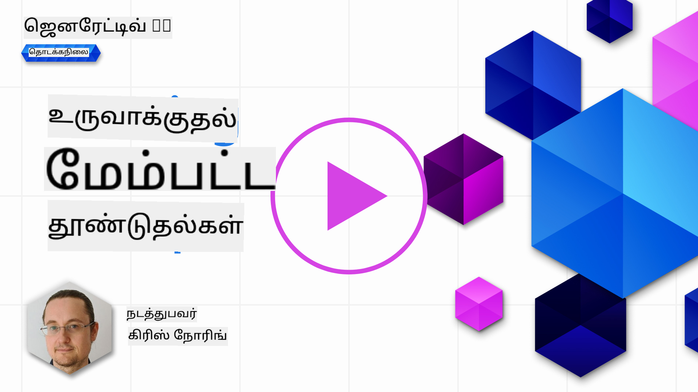

<!--
CO_OP_TRANSLATOR_METADATA:
{
  "original_hash": "2b4c36be7d66b32e4fac47761718b4a9",
  "translation_date": "2025-10-11T11:36:29+00:00",
  "source_file": "05-advanced-prompts/README.md",
  "language_code": "ta"
}
-->
# மேம்பட்ட ப்ராம்ப்ட்களை உருவாக்குதல்

[](https://aka.ms/gen-ai-lesson5-gh?WT.mc_id=academic-105485-koreyst?WT.mc_id=academic-105485-koreyst)

முந்தைய அத்தியாயத்தில் கற்றுக்கொண்டவற்றை மீண்டும் நினைவூட்டுவோம்:

> ப்ராம்ப்ட் _என்ஜினியரிங்_ என்பது **மாதிரியை அதிக பொருத்தமான பதில்களுக்கு வழிநடத்த** பயனுள்ள வழிகாட்டுதல்கள் அல்லது சூழலை வழங்குவதன் மூலம் செய்யப்படும் செயல்முறையாகும்.

ப்ராம்ப்ட்களை எழுதுவதற்கு இரண்டு படிகள் உள்ளன: ப்ராம்ப்டை உருவாக்குதல், பொருத்தமான சூழலை வழங்குதல், மற்றும் இரண்டாவது பகுதி _அட்ஜஸ்ட்மென்ட்_, ப்ராம்ப்டை تدريجமாக மேம்படுத்துவது.

இந்த நேரத்தில், ப்ராம்ப்ட்களை எழுதுவது எப்படி என்பதை அடிப்படையாக புரிந்துகொண்டுள்ளோம், ஆனால் மேலும் ஆழமாகப் போக வேண்டும். இந்த அத்தியாயத்தில், பல்வேறு ப்ராம்ப்ட்களை முயற்சிப்பதிலிருந்து, ஏன் ஒரு ப்ராம்ப்ட் மற்றொன்றை விட சிறந்தது என்பதை புரிந்துகொள்ள நீங்கள் செல்லுவீர்கள். எந்த LLM-க்கும் பொருந்தக்கூடிய சில அடிப்படை உத்திகளை பின்பற்றி ப்ராம்ப்ட்களை உருவாக்குவது எப்படி என்பதை நீங்கள் கற்றுக்கொள்வீர்கள்.

## அறிமுகம்

இந்த அத்தியாயத்தில், நாம் பின்வரும் தலைப்புகளை கையாளுவோம்:

- ப்ராம்ப்ட் என்ஜினியரிங்கில் உங்கள் அறிவை விரிவாக்கி, உங்கள் ப்ராம்ப்ட்களில் பல்வேறு உத்திகளை பயன்படுத்துதல்.
- உங்கள் ப்ராம்ப்ட்களை அமைத்து, வெளியீட்டை மாறுபடுத்துதல்.

## கற்றல் இலக்குகள்

இந்த பாடத்தை முடித்த பிறகு, நீங்கள்:

- உங்கள் ப்ராம்ப்ட்களின் முடிவுகளை மேம்படுத்தும் ப்ராம்ப்ட் என்ஜினியரிங் உத்திகளை பயன்படுத்த முடியும்.
- மாறுபட்ட அல்லது நிர்ணயமான ப்ராம்ப்ட்களை செயல்படுத்த முடியும்.

## ப்ராம்ப்ட் என்ஜினியரிங்

ப்ராம்ப்ட் என்ஜினியரிங் என்பது விரும்பிய முடிவுகளை உருவாக்கும் ப்ராம்ப்ட்களை உருவாக்கும் செயல்முறையாகும். ப்ராம்ப்ட் என்ஜினியரிங்கில் வெறும் உரை ப்ராம்ப்டை எழுதுவதற்கு மேல் பல உள்ளது. இது ஒரு பொறியியல் துறை அல்ல, ஆனால் விரும்பிய முடிவுகளை பெற நீங்கள் பயன்படுத்தக்கூடிய உத்திகள் தொகுப்பாகும்.

### ப்ராம்ப்டின் ஒரு எடுத்துக்காட்டு

ஒரு அடிப்படை ப்ராம்ப்டை எடுத்துக்கொள்வோம்:

> புவியியல் தொடர்பான 10 கேள்விகளை உருவாக்கவும்.

இந்த ப்ராம்ப்டில், நீங்கள் பல்வேறு ப்ராம்ப்ட் உத்திகளை பயன்படுத்துகிறீர்கள்.

இதனை பிரித்து பார்ப்போம்.

- **சூழல்**, இது "புவியியல்" பற்றி இருக்க வேண்டும் என்று நீங்கள் குறிப்பிடுகிறீர்கள்.
- **வெளியீட்டை வரையறுத்தல்**, நீங்கள் 10 கேள்விகளை மட்டுமே விரும்புகிறீர்கள்.

### எளிய ப்ராம்ப்ட்களின் வரம்புகள்

நீங்கள் விரும்பிய முடிவுகளை பெறலாம் அல்லது பெற முடியாது. உங்கள் கேள்விகள் உருவாக்கப்படும், ஆனால் புவியியல் என்பது ஒரு பெரிய தலைப்பு, மற்றும் நீங்கள் பின்வரும் காரணங்களால் விரும்பியதை பெற முடியாது:

- **பெரிய தலைப்பு**, இது நாடுகள், தலைநகரங்கள், ஆறுகள் போன்றவற்றைப் பற்றியதா என்பதை நீங்கள் அறிய முடியாது.
- **வடிவமைப்பு**, நீங்கள் கேள்விகளை ஒரு குறிப்பிட்ட வடிவத்தில் விரும்பினால் என்ன?

ப்ராம்ப்ட்களை உருவாக்கும்போது கவனிக்க வேண்டிய பல விஷயங்கள் உள்ளன என்பதை நீங்கள் காணலாம்.

இப்போது வரை, நாம் ஒரு எளிய ப்ராம்ப்டின் உதாரணத்தை பார்த்தோம், ஆனால் ஜெனரேட்டிவ் AI பல்வேறு பங்கு மற்றும் தொழில்களில் மக்களுக்கு உதவுவதற்கான திறனைக் கொண்டுள்ளது. அடுத்ததாக சில அடிப்படை உத்திகளை ஆராய்வோம்.

### ப்ராம்ப்டிங் உத்திகள்

முதலில், ப்ராம்ப்டிங் என்பது ஒரு LLM இன் _தோன்றும்_ பண்பாகும் என்பதை நாம் புரிந்துகொள்ள வேண்டும். இது மாதிரியில் உள்ள ஒரு அம்சமாக உருவாக்கப்படவில்லை, ஆனால் மாதிரியை பயன்படுத்தும்போது நாம் கண்டுபிடிக்கிறோம்.

LLM-ஐ ப்ராம்ப்ட் செய்ய சில அடிப்படை உத்திகள் உள்ளன. அவற்றை ஆராய்வோம்.

- **சீரோ-ஷாட் ப்ராம்ப்டிங்**, இது ப்ராம்ப்டிங் செய்யும் மிக அடிப்படை வடிவமாகும். இது மாதிரியின் பயிற்சி தரவின் அடிப்படையில் பதிலை கோரும் ஒரு ப்ராம்ப்டாகும்.
- **ஃப்யூ-ஷாட் ப்ராம்ப்டிங்**, இந்த ப்ராம்ப்டிங் மாதிரியை வழிநடத்த உதாரணங்களை வழங்குகிறது, இது பதிலை உருவாக்க உதவுகிறது.
- **செயல்முறை சிந்தனை**, இந்த ப்ராம்ப்டிங் ஒரு பிரச்சினையை படிகளாக பிரிக்க LLM-ஐ வழிநடத்துகிறது.
- **உருவாக்கப்பட்ட அறிவு**, ப்ராம்ப்டின் பதிலை மேம்படுத்த, நீங்கள் ப்ராம்ப்டுடன் கூடுதல் உண்மைகள் அல்லது அறிவுகளை வழங்கலாம்.
- **குறைந்தது முதல் அதிகம்**, செயல்முறை சிந்தனை போல, இந்த உத்தி ஒரு பிரச்சினையை படிகளாக பிரித்து, அவற்றை வரிசையாக செய்ய LLM-ஐ கேட்கிறது.
- **சுய-சீரமைப்பு**, இந்த உத்தி LLM-ஐ அதன் வெளியீட்டை விமர்சித்து, அதை மேம்படுத்த கேட்கிறது.
- **மையூடிக் ப்ராம்ப்டிங்**, இங்கு நீங்கள் LLM பதில் சரியானது என்பதை உறுதிப்படுத்த வேண்டும், மற்றும் பதிலின் பல பகுதிகளை விளக்க கேட்க வேண்டும். இது ஒரு வகை சுய-சீரமைப்பு.

### சீரோ-ஷாட் ப்ராம்ப்டிங்

இந்த ப்ராம்ப்டிங் பாணி மிகவும் எளிமையானது, இது ஒரு ப்ராம்ப்டை மட்டுமே கொண்டுள்ளது. இந்த உத்தி நீங்கள் LLM-களைப் பற்றி கற்றுக்கொள்வதைத் தொடங்கும்போது நீங்கள் பயன்படுத்தக்கூடியது. இதோ ஒரு உதாரணம்:

- ப்ராம்ப்ட்: "அல்ஜீப்ரா என்றால் என்ன?"
- பதில்: "அல்ஜீப்ரா என்பது கணிதத்தின் ஒரு கிளையாகும், இது கணிதச் சின்னங்கள் மற்றும் அவற்றை மாற்றுவதற்கான விதிகளைப் படிக்கிறது."

### ஃப்யூ-ஷாட் ப்ராம்ப்டிங்

இந்த ப்ராம்ப்டிங் பாணி மாதிரிக்கு சில உதாரணங்களை வழங்குவதன் மூலம் உதவுகிறது. இது ஒரு ப்ராம்ப்டுடன் கூடுதல் பணிக்குறிப்புகளை கொண்டுள்ளது. இதோ ஒரு உதாரணம்:

- ப்ராம்ப்ட்: "ஷேக்ஸ்பியர் பாணியில் ஒரு கவிதை எழுதுங்கள். இங்கே சில ஷேக்ஸ்பியர் சோனெட்டுகளின் உதாரணங்கள்:
  சோனெட் 18: 'நான் உன்னை ஒரு கோடை நாளுடன் ஒப்பிடலாமா? நீ மிகவும் அழகானவளும் மிதமானவளும்...'
  சோனெட் 116: 'உண்மையான மனதின் திருமணத்திற்கு தடைகள் அனுமதிக்க வேண்டாம். காதல் என்பது மாற்றம் காணும்போது மாற்றம் அடையும் காதல் அல்ல...'
  சோனெட் 132: 'உன் கண்களை நான் காதலிக்கிறேன், அவை எனக்கு இரக்கமளிக்கின்றன, உன் இதயம் என்னை அவமதிப்பதைக் கண்டு,...'
  இப்போது, சந்திரனின் அழகைப் பற்றி ஒரு சோனெட் எழுதுங்கள்."
- பதில்: "வானத்தில், சந்திரன் மெதுவாக ஒளிர்கிறது, அதன் மென்மையான கிருபையை வெளிப்படுத்தும் வெள்ளி ஒளியில்,..."

உதாரணங்கள் LLM-க்கு விரும்பிய வெளியீட்டின் சூழல், வடிவமைப்பு அல்லது பாணியை வழங்குகின்றன. அவை மாதிரிக்கு குறிப்பிட்ட பணியைப் புரிந்துகொள்ள உதவுகின்றன மற்றும் மேலும் துல்லியமான மற்றும் பொருத்தமான பதில்களை உருவாக்க உதவுகின்றன.

### செயல்முறை சிந்தனை

செயல்முறை சிந்தனை என்பது மிகவும் சுவாரஸ்யமான உத்தியாகும், இது LLM-ஐ ஒரு தொடர் படிகளின் மூலம் எடுத்துச் செல்லும். ஒரு விஷயத்தை எப்படி செய்ய வேண்டும் என்பதை LLM-க்கு புரிய வைப்பது தான் நோக்கம். பின்வரும் உதாரணத்தை, செயல்முறை சிந்தனை இல்லாமல் மற்றும் அதனுடன் பார்க்கவும்:

    - ப்ராம்ப்ட்: "அலிஸ் 5 ஆப்பிள்கள் வைத்திருக்கிறார், 3 ஆப்பிள்களை எறிகிறார், 2 ஆப்பிள்களை பாப்-க்கு கொடுக்கிறார், பாப் ஒரு ஆப்பிளை திருப்பி கொடுக்கிறார், அலிஸ் எத்தனை ஆப்பிள்கள் வைத்திருக்கிறார்?"
    - பதில்: 5

LLM 5 என்று பதிலளிக்கிறது, இது தவறானது. சரியான பதில் 1 ஆப்பிள், கணக்கீடு (5 -3 -2 + 1 = 1) அடிப்படையில்.

அதை சரியாக செய்ய LLM-ஐ எப்படி கற்பிக்கலாம்?

செயல்முறை சிந்தனை முயற்சிக்கலாம். செயல்முறை சிந்தனை பயன்படுத்துவது:

1. LLM-க்கு ஒரு போன்ற உதாரணத்தை கொடுக்கவும்.
1. கணக்கீட்டை காட்டவும், அதை சரியாக கணக்கிடுவது எப்படி என்பதை காட்டவும்.
1. அசல் ப்ராம்ப்டை வழங்கவும்.

இதோ எப்படி:

- ப்ராம்ப்ட்: "லிசா 7 ஆப்பிள்கள் வைத்திருக்கிறார், 1 ஆப்பிளை எறிகிறார், 4 ஆப்பிள்களை பார்ட்-க்கு கொடுக்கிறார், பார்ட் ஒரு ஆப்பிளை திருப்பி கொடுக்கிறார்:
  7 -1 = 6
  6 -4 = 2
  2 +1 = 3  
  அலிஸ் 5 ஆப்பிள்கள் வைத்திருக்கிறார், 3 ஆப்பிள்களை எறிகிறார், 2 ஆப்பிள்களை பாப்-க்கு கொடுக்கிறார், பாப் ஒரு ஆப்பிளை திருப்பி கொடுக்கிறார், அலிஸ் எத்தனை ஆப்பிள்கள் வைத்திருக்கிறார்?"
  பதில்: 1

நீங்கள் காணலாம், செயல்முறை சிந்தனை என்பது மிகவும் சக்திவாய்ந்த உத்தியாகும்.

### உருவாக்கப்பட்ட அறிவு

பல நேரங்களில், நீங்கள் ஒரு ப்ராம்ப்டை உருவாக்க விரும்பும்போது, உங்கள் நிறுவனத்தின் தரவுகளை பயன்படுத்த விரும்புகிறீர்கள். ப்ராம்ப்டின் ஒரு பகுதி நிறுவனத்திலிருந்து இருக்க வேண்டும், மற்ற பகுதி நீங்கள் ஆர்வமாக இருக்கும் ப்ராம்ப்டாக இருக்க வேண்டும்.

உதாரணமாக, நீங்கள் காப்பீட்டு தொழிலில் இருந்தால், உங்கள் ப்ராம்ப்ட்டின் வடிவம் இவ்வாறு இருக்கலாம்:

```text
{{company}}: {{company_name}}
{{products}}:
{{products_list}}
Please suggest an insurance given the following budget and requirements:
Budget: {{budget}}
Requirements: {{requirements}}
```

மேலே, ப்ராம்ப்ட்டை ஒரு டெம்ப்ளேட் பயன்படுத்தி உருவாக்குவது எப்படி என்பதை நீங்கள் காணலாம். டெம்ப்ளேட்டில் `{{variable}}` எனக் குறிக்கப்படும் பல மாறிகள் உள்ளன, அவை நிறுவன API-யிலிருந்து உண்மையான மதிப்புகளால் மாற்றப்படும்.

மாறிகள் நிறுவனத்தின் உள்ளடக்கத்தால் மாற்றப்பட்ட பிறகு ப்ராம்ப்ட்டின் உதாரணம் இதோ:

```text
Insurance company: ACME Insurance
Insurance products (cost per month):
- Car, cheap, 500 USD
- Car, expensive, 1100 USD
- Home, cheap, 600 USD
- Home, expensive, 1200 USD
- Life, cheap, 100 USD

Please suggest an insurance given the following budget and requirements:
Budget: $1000
Requirements: Car, Home, and Life insurance
```

இந்த ப்ராம்ப்ட்டை LLM-இல் இயக்குவது இந்த பதிலை உருவாக்கும்:

```output
Given the budget and requirements, we suggest the following insurance package from ACME Insurance:
- Car, cheap, 500 USD
- Home, cheap, 600 USD
- Life, cheap, 100 USD
Total cost: $1,200 USD
```

நீங்கள் காணலாம், இது Life insurance-ஐ பரிந்துரைக்கிறது, இது செய்யக்கூடாது. இந்த முடிவு ப்ராம்ப்ட்டை தெளிவாக மாற்றுவதன் மூலம் நாம் விரும்பியதை பெற வேண்டும் என்பதற்கான ஒரு அறிகுறியாகும். சில _முயற்சி மற்றும் தவறுகள்_ பிறகு, நாம் பின்வரும் ப்ராம்ப்ட்டை அடைகிறோம்:

```text
Insurance company: ACME Insurance
Insurance products (cost per month):
- type: Car, cheap, cost: 500 USD
- type: Car, expensive, cost: 1100 USD
- type: Home, cheap, cost: 600 USD
- type: Home, expensive, cost: 1200 USD
- type: Life, cheap, cost: 100 USD

Please suggest an insurance given the following budget and requirements:
Budget: $1000 restrict choice to types: Car, Home
```

குறிப்பாக _type_ மற்றும் _cost_ சேர்த்தல் மற்றும் _restrict_ என்ற முக்கிய வார்த்தையைப் பயன்படுத்துதல் LLM-க்கு நாம் என்ன விரும்புகிறோம் என்பதை புரிய உதவுகிறது.

இப்போது நாம் பின்வரும் பதிலை பெறுகிறோம்:

```output
Given the budget and requirements, we suggest the Car, Cheap insurance product which costs 500 USD per month.
```

இந்த உதாரணத்தின் நோக்கம், _உருவாக்கப்பட்ட அறிவு_ போன்ற அடிப்படை உத்தியைப் பயன்படுத்தினாலும், பெரும்பாலான சந்தர்ப்பங்களில் விரும்பிய முடிவுகளைப் பெற ப்ராம்ப்ட்டை மேம்படுத்த வேண்டும் என்பதை காட்டுவதாகும்.

### குறைந்தது முதல் அதிகம்

குறைந்தது முதல் அதிகம் ப்ராம்ப்டிங் உத்தியின் நோக்கம் பெரிய பிரச்சினையை துணை பிரச்சினைகளாக பிரிக்க வேண்டும். அதனால், LLM-ஐ பெரிய பிரச்சினையை "வெற்றி" பெற வழிநடத்த உதவுகிறது. ஒரு நல்ல உதாரணம் தரவியல் விஞ்ஞானத்திற்கு இருக்கலாம், நீங்கள் LLM-ஐ ஒரு பிரச்சினையை இவ்வாறு பிரிக்க கேட்கலாம்:

> ப்ராம்ப்ட்: தரவியல் விஞ்ஞானத்தை 5 படிகளில் எப்படி செய்யலாம்?

உங்கள் AI உதவியாளர் பதிலளிக்கிறது:

1. தரவுகளை சேகரிக்கவும்
1. தரவுகளை சுத்தம் செய்யவும்
1. தரவுகளை பகுப்பாய்வு செய்யவும்
1. தரவுகளை வரைபடம் செய்யவும்
1. தரவுகளை வழங்கவும்

### சுய-சீரமைப்பு, முடிவுகளை விமர்சிக்கவும்

ஜெனரேட்டிவ் AIகள் மற்றும் LLMகளுடன், நீங்கள் வெளியீட்டை நம்ப முடியாது. நீங்கள் அதை சரிபார்க்க வேண்டும். இறுதியில், LLM உங்களுக்கு அடுத்ததாக சொல்ல வேண்டிய மிகச் சாத்தியமான விஷயத்தை மட்டுமே வழங்குகிறது, சரியானதை அல்ல. எனவே, LLM-ஐ தானாகவே விமர்சிக்க கேட்குவது நல்ல யோசனை, இது சுய-சீரமைப்பு உத்திக்கு வழிவகுக்கிறது.

இது செயல்படுவது எப்படி என்றால், நீங்கள் பின்வரும் படிகளை பின்பற்ற வேண்டும்:

1. LLM-ஐ ஒரு பிரச்சினையை தீர்க்க கேட்கும் ஆரம்ப ப்ராம்ப்ட்
1. LLM பதிலளிக்கிறது
1. நீங்கள் பதிலை விமர்சித்து AI-ஐ மேம்படுத்த கேட்கவும்
1. LLM மீண்டும் பதிலளிக்கிறது, இந்த முறை விமர்சனத்தை கருத்தில் கொண்டு அது கண்டுபிடித்த தீர்வுகளை பரிந்துரைக்கிறது

இந்த செயல்முறையை நீங்கள் விரும்பிய அளவுக்கு பல முறை மீண்டும் செய்யலாம்.

இந்த உத்தியைப் பயன்படுத்தும் ஒரு உதாரணம் இதோ:

> ப்ராம்ப்ட்: "ப்ராடக்ட்ஸ் மற்றும் கஸ்டமர்ஸ் என்ற இரண்டு வழிகளுடன் ஒரு Python Web API உருவாக்கவும்"

AI பதில்:

```python
import flask
app = Flask(__name__)

@app.route('/products')
def products():
    return 'Products'

@app.route('/customers')
def customers():
    return 'Customers'
```

> ப்ராம்ப்ட்: மேலே உள்ள குறியீட்டின் 3 மேம்பாடுகளை பரிந்துரைக்கவும்

AI பதில்:

```text
Sure, here are three suggestions to improve the code:

Import the correct module: The first line should import Flask instead of flask. The correct import statement should be from flask import Flask.

Add a main function: Add a if __name__ == '__main__': block to the end of the file to run the application when the file is executed.

Use f-strings: Use f-strings to format the return statements in the route functions. For example, return 'Products' can be changed to return f'This is the {request.path} page'.
```

```python
from flask import Flask, request

app = Flask(__name__)

@app.route('/products')
def products():
    return f'This is the {request.path} page'

@app.route('/customers')
def customers():
    return f'This is the {request.path} page'

if __name__ == '__main__':
    app.run()
```

நீங்கள் காணலாம், மேலே உள்ள AI பதில் முதல் பரிந்துரைக்கப்பட்ட குறியீட்டை மேம்படுத்துகிறது, முதல் பதிலை விமர்சிப்பதற்கான நன்றி.

### மையூடிக் ப்ராம்ப்டிங்

மையூடிக் ப்ராம்ப்டிங் என்பது சுய-சீரமைப்புக்கு ஒத்ததாகும், ஆனால் இது LLM-ஐ தன்னை விளக்க கேட்பது பற்றியது. LLM சரியான பதிலை அடைவதை உறுதிப்படுத்துவதற்காக அதன் வெளியீட்டில் முரண்பாடுகளை குறைக்க வேண்டும். பின்பற்ற வேண்டிய வேலைப்பாடுகள்:

1. LLM-ஐ ஒரு கேள்விக்கு பதிலளிக்க கேட்கவும்
1. பதிலின் ஒவ்வொரு பகுதிக்கும், LLM-ஐ மேலும் ஆழமாக விளக்க கேட்கவும்.
1. முரண்பாடுகள் இருந்தால், முரண்பாடான பகுதிகளை நிராகரிக்கவும்.

பதிலின் அனைத்து பகுதிகளையும் நீங்கள் திருப்தியடையும் வரை 2 மற்றும் 3 ஐ மீண்டும் செய்யவும்.

இதோ ஒரு உதாரண ப்ராம்ப்ட்:

> ப்ராம்ப்ட்: ஒரு தொற்றுநோயை குறைக்க 5 படிகளில் ஒரு நெருக்கடி திட்டத்தை உருவாக்குவது எப்படி?
> LLM பதில்:

```text
1. Identify the risks
1. Identify the stakeholders
1. Identify the resources
1. Identify the actions
1. Identify the communication channels
```

இது 5 படிகளை அடையாளம் காண்கிறது, ஆனால் இது சரியானதா என்பதை நாம் தீர்மானிக்க முடியுமா? ஒவ்வொரு படத்தையும் விளக்க LLM-ஐ கேட்போம்:

> ப்ராம்ப்ட்: முதல் படத்தை மேலும் விவரமாக விளக்கவும், தொற்றுநோயுடன் தொடர்புடைய அபாயங்கள் என்ன?

```text
The risks are the following:

- Loss of life
- Loss of business
- Loss of reputation
- Loss of customers
- Loss of employees
```

இந்த நேரத்தில், LLM சரியானது என்பதை உறுதிப்படுத்த, முதல் அபாயத்தை மேலும் விவரமாக விளக்க கேட்போம், மேலும் மேலே உள்ள பதிலுடன் இது ஒத்ததாக இருக்க வேண்டும்:

> ப்ராம்ப்ட்: தொற்றுநோயில், மிகப்பெரிய அபாயம் எது, ஏன்?

```text
The biggest risk is loss of life because it's the most important thing to protect.
```

> தொற்றுநோயில் இரண்டு மிகப்பெரிய அபாயங்கள் என்ன?

```text
The two biggest risks are loss of life and loss of business.
```

இந்த நேரத்தில், LLM "வாழ்க்கை" மற்றும் "வணிகம்" ஆகியவற்றை முக்கியமான இரண்டு அபாயங்களாக குறிப்பிடுகிறது. நாம் அடுத்த படிக்க செல்லலாம் மற்றும் நம்பகத்தன்மை உணரலாம். இருப்பினும், LLM-ஐ அசலாக நம்பக்கூடாது, வெளியீட்டை எப்போதும் சரிபார்க்க வேண்டும்.

## உங்கள் வெளியீட்டை மாறுபடுத்துங்கள்

LLMகள் இயல்பாக நிர்ணயமற்றவை, அதாவது நீங்கள் ஒரே ப்ராம்ப்ட்டை இயக்கும் ஒவ்வொரு முறையும் வெவ்வேறு முட
```python
import flask
from flask import request, jsonify

# create the Flask app
app = flask.Flask(__name__)
app.config['DEBUG'] = True

# create some test data
books = [
    {'id': 0, 'title': 'A Fire Upon The Deep', 'author': 'Vernor Vinge', 'first_sentence': 'The coldsleep itself was dreamless.', 'year_published': '1992'},
    {'id': 1, 'title': 'The Ones Who Walk Away From Omelas', 'author': 'Ursula K. Le Guin', 'first_sentence': 'With a clamor of bells that set the swallows soaring, the Festival of Summer came to the city Omelas, bright-towered by the sea.', 'published': '1973'},
    {'id': 2, 'title': 'Dhalgren', 'author': 'Samuel R. Delany', 'first_sentence': 'to wound the autumnal city.', 'published': '1975'}
]

# create an endpoint
@app.route('/', methods=['GET'])
def home():
    return '''<h1>Welcome to our book API!</h1>'''

@app.route('/api/v1/resources/books

```

நீங்கள் காணும் படி, முடிவுகள் மிகவும் மாறுபட்டதாக இருக்கின்றன.

> கவனிக்கவும், வெளியீட்டை மாறுபடுத்த பல்வேறு அளவுகளை மாற்றலாம், உதாரணமாக top-k, top-p, repetition penalty, length penalty மற்றும் diversity penalty போன்றவை, ஆனால் இவை இந்த பாடத்திட்டத்தின் வரம்பிற்கு வெளியே உள்ளவை.

## நல்ல நடைமுறைகள்

நீங்கள் விரும்பும் முடிவுகளை பெற பல நடைமுறைகளை பயன்படுத்தலாம். நீங்கள் prompting அதிகமாக பயன்படுத்தும் போது உங்கள் சொந்த பாணியை கண்டுபிடிப்பீர்கள்.

நாம் கற்றுக்கொண்ட தொழில்நுட்பங்களுக்கு கூடுதலாக, LLM-ஐ prompting செய்யும்போது சில நல்ல நடைமுறைகளை கவனிக்க வேண்டும்.

இங்கே சில நல்ல நடைமுறைகள் உள்ளன:

- **சூழலை குறிப்பிடவும்**. சூழல் முக்கியம், நீங்கள் குறிப்பிட்ட அளவுக்கு, உதாரணமாக துறை, தலைப்பு போன்றவற்றை குறிப்பிடினால், அது சிறந்தது.
- வெளியீட்டை வரையறுக்கவும். நீங்கள் குறிப்பிட்ட எண்ணிக்கையிலான உருப்படிகள் அல்லது குறிப்பிட்ட நீளம் வேண்டும் என்றால், அதை குறிப்பிடவும்.
- **எது மற்றும் எப்படி என்பதை குறிப்பிடவும்**. நீங்கள் என்ன வேண்டும் மற்றும் எப்படி வேண்டும் என்பதை குறிப்பிடுவது முக்கியம், உதாரணமாக "Python Web API உருவாக்கவும், இதில் products மற்றும் customers என்ற routes இருக்க வேண்டும், அதை 3 கோப்புகளாக பிரிக்கவும்".
- **வடிவங்களை பயன்படுத்தவும்**. பல நேரங்களில், உங்கள் prompting-ஐ உங்கள் நிறுவனத்தின் தரவுடன் செறிவூட்ட விரும்புவீர்கள். இதற்கு வடிவங்களை பயன்படுத்தவும். வடிவங்களில் மாறிகள் இருக்கலாம், அவற்றை உண்மையான தரவுடன் மாற்றலாம்.
- **சரியாக எழுத்துப்பிழை இல்லாமல் எழுதவும்**. LLMs உங்களுக்கு சரியான பதிலை வழங்கலாம், ஆனால் நீங்கள் சரியாக எழுதினால், நீங்கள் சிறந்த பதிலை பெறுவீர்கள்.

## பணிக்கூற்று

இங்கே Flask பயன்படுத்தி எளிய API உருவாக்க Python கோடு உள்ளது:

```python
from flask import Flask, request

app = Flask(__name__)

@app.route('/')
def hello():
    name = request.args.get('name', 'World')
    return f'Hello, {name}!'

if __name__ == '__main__':
    app.run()
```

GitHub Copilot அல்லது ChatGPT போன்ற AI உதவியாளரை பயன்படுத்தி "self-refine" தொழில்நுட்பத்தை பயன்படுத்தி கோட்டை மேம்படுத்தவும்.

## தீர்வு

கோட்டிற்கு பொருத்தமான prompting சேர்த்து பணிக்கூற்றை தீர்க்க முயற்சிக்கவும்.

> [!TIP]
> மேம்படுத்துமாறு கேட்க prompting உருவாக்கவும், எத்தனை மேம்பாடுகள் செய்ய வேண்டும் என்பதை வரையறுக்கவும். மேலும், குறிப்பிட்ட வழியில் மேம்படுத்துமாறு கேட்கவும், உதாரணமாக கட்டமைப்பு, செயல்திறன், பாதுகாப்பு போன்றவை.

[Solution](../../../05-advanced-prompts/python/aoai-solution.py)

## அறிவு சோதனை

நான் ஏன் chain-of-thought prompting பயன்படுத்த வேண்டும்? 1 சரியான பதில் மற்றும் 2 தவறான பதில்களை காட்டவும்.

1. LLM-ஐ ஒரு பிரச்சினையை எப்படி தீர்க்க வேண்டும் என்று கற்பிக்க.
1. B, LLM-ஐ கோட்டில் பிழைகளை கண்டுபிடிக்க கற்பிக்க.
1. C, LLM-ஐ பல்வேறு தீர்வுகளை உருவாக்குமாறு உத்தரவிட.

A: 1, ஏனெனில் chain-of-thought என்பது LLM-ஐ ஒரு பிரச்சினையை தீர்க்க எப்படி என்பதை ஒரு படிநிலைகளின் மூலம் காட்டுவது, மற்றும் இதே போன்ற பிரச்சினைகள் எப்படி தீர்க்கப்பட்டன என்பதை காட்டுவது.

## 🚀 சவால்

நீங்கள் பணிக்கூற்றில் self-refine தொழில்நுட்பத்தை பயன்படுத்தியுள்ளீர்கள். நீங்கள் உருவாக்கிய எந்த ஒரு நிரலையும் எடுத்துக்கொண்டு அதில் நீங்கள் செய்ய விரும்பும் மேம்பாடுகளை பரிசீலிக்கவும். இப்போது self-refine தொழில்நுட்பத்தை பயன்படுத்தி பரிந்துரைக்கப்பட்ட மாற்றங்களைச் செய்யவும். முடிவு எப்படி இருந்தது, சிறந்ததா அல்லது மோசமா?

## சிறந்த வேலை! உங்கள் கற்றலை தொடருங்கள்

இந்த பாடத்தை முடித்த பிறகு, [Generative AI Learning collection](https://aka.ms/genai-collection?WT.mc_id=academic-105485-koreyst) ஐ பாருங்கள், Generative AI அறிவை மேலும் மேம்படுத்த.

Lesson 6-க்கு செல்லுங்கள், அங்கு Prompt Engineering பற்றிய அறிவை பயன்படுத்தி [உரை உருவாக்கும் பயன்பாடுகளை உருவாக்குவோம்](../06-text-generation-apps/README.md?WT.mc_id=academic-105485-koreyst).

---

**குறிப்பு**:  
இந்த ஆவணம் [Co-op Translator](https://github.com/Azure/co-op-translator) என்ற AI மொழிபெயர்ப்பு சேவையை பயன்படுத்தி மொழிபெயர்க்கப்பட்டுள்ளது. எங்கள் தரச்சிறப்பிற்காக முயற்சி செய்தாலும், தானியங்கி மொழிபெயர்ப்புகளில் பிழைகள் அல்லது தவறுகள் இருக்கக்கூடும் என்பதை கவனத்தில் கொள்ளவும். அதன் தாய்மொழியில் உள்ள மூல ஆவணம் அதிகாரப்பூர்வ ஆதாரமாக கருதப்பட வேண்டும். முக்கியமான தகவல்களுக்கு, தொழில்முறை மனித மொழிபெயர்ப்பு பரிந்துரைக்கப்படுகிறது. இந்த மொழிபெயர்ப்பைப் பயன்படுத்துவதால் ஏற்படும் எந்த தவறான புரிதல்கள் அல்லது தவறான விளக்கங்களுக்கு நாங்கள் பொறுப்பல்ல.