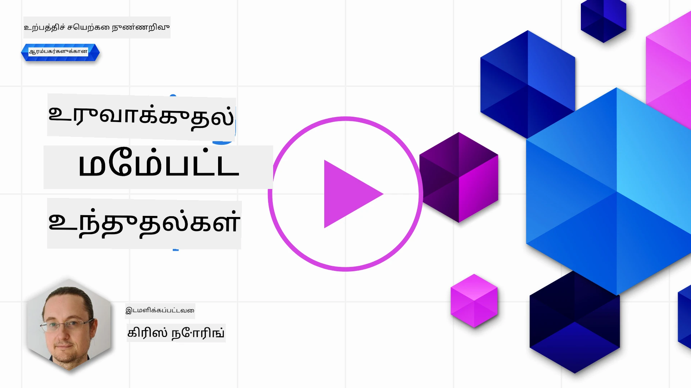

# மேம்பட்ட ப்ராம்ப்டுகளை உருவாக்குதல்

[](https://youtu.be/BAjzkaCdRok?si=NmUIyRf7-cDgbjtt)

முன்னைய அத்தியாயத்தில் சில கற்றல்களை மீண்டும் பார்க்கலாம்:

> ப்ராம்ப்ட் _எஞ்சினியரிங்_ என்பது **மாதிரியை தொடர்புடைய பதில்களை நோக்கி வழிநடத்தும் செயல்முறை** ஆகும், இது பயனுள்ள அறிவுரைகள் அல்லது சூழலை வழங்குவதன் மூலம் அடையப்படுகிறது.

பிராம்ப்டுகளை எழுத இரண்டு படிகள் உள்ளன: பிராம்ப்டை கட்டமைப்பது, பொருத்தமான சூழலை வழங்குதல்; மற்றும் _சீரமைப்பு_, பேச்சுப்படி ப்ராம்ப்டை மெதுவாக மேம்படுத்துவது எப்படி என்பதானது.

இப்போது, நாம் ப்ராம்ப்டுகளை எழுத基本மாக புரிந்துகொண்டிருக்கிறோம், ஆனால் மேலும் ஆழமாக தெரிந்து கொள்ள வேண்டும். இந்த அத்தியாயத்தில், நீங்கள் பல்வேறு ப்ராம்ப்டுகளை முயற்சி செய்வதிலிருந்து ஒரு ப்ராம்ப்ட் மற்றொன்றை விட சிறந்தது என்பதை புரிந்துகொள்ள போவீர்கள். எந்த LLM-க்குத் தடவையாக பயன்படுத்தக்கூடிய சில அடிப்படைக் குறிப்பிடுதல்கள் பின்பற்ற விரும்பும் முறையில் ப்ராம்ப்டுகளை உருவாக்குவது எப்படி என்பதையும் கற்றுக்கொள்ளப்போகின்றீர்கள்.

## அறிமுகம்

இந்த அத்தியாயத்தில், நாம் பின்வரும் தலைப்புகளைக் கொண்டிருக்கப்போகிறோம்:

- உங்களுடைய ப்ராம்ப்ட் எஞ்சினியரிங் அறிவை வேறுபட்ட தொழில்நுட்பங்களைப் பயன்படுத்தி விருத்தி செய்யுங்கள்.
- உங்கள் ப்ராம்ப்டுகளை ஒருங்கிணைக்க விருப்பமான வெளிப்பாட்டை மாறுபடுத்துங்கள்.

## கற்றல் இலக்குகள்

இந்த பாடத்தை முடித்த பிறகு, நீங்கள் செய்யக்கூடியவை:

- உங்கள் ப்ராம்ப்டுகளின் விளைவை மேம்படுத்தும் ப்ராம்ப்ட் எஞ்சினியரிங் தொழில்நுட்பங்களை பயன்படுத்து.
- மாறுபடியான அல்லது தீர்மானமான ப்ராம்ப்டிங் செய்வது.

## ப்ராம்ப்ட் எஞ்சினியரிங்

ப்ராம்ப்ட் எஞ்சினியரிங் என்பது விரும்பிய விளைவுகளை ஏற்படுத்தும் ப்ராம்ப்டுகளை உருவாக்கும் செயல்முறை. இது ஒரு உரை ப்ராம்ப்ட் எழுதுவதைவிட அதிகம். ப்ராம்ப்ட் எஞ்சினியரிங் என்பது ஒரு هندسية துறையல்ல; நீங்கள் விரும்பும் முடிவை அடைய சில தொழில்நுட்பங்களின் தொகுப்பாகும்.

### ஒரு ப்ராம்ப்ட் உதாரணம்

இதோ ஒரு அடிப்படையான ப்ராம்ப்ட் எடுத்துக்கொள்ளலாம்:

> புவியியல் பற்றி 10 கேள்விகள் உருவாக்கு.

இந்த ப்ராம்ப்டில், நீங்கள் பல்வேறு ப்ராம்ப்ட் தொழில்நுட்பங்களை பயன்படுத்துகிறீர்கள்.

இதனைத் தடை செய்யலாம்.

- **சூழல்**: "புவியியல்" குறித்து இருக்க வேண்டும் என நீங்கள் குறிப்பிட்டுள்ளீர்கள்.
- **வெளியீட்டை வரையறுத்தல்**: 10 கேள்விகளைத் தாண்டவிடக் கூடாது என்று நீங்கள் விரும்புகிறீர்கள்.

### எளிய ப்ராம்ப்ட் பயன்பாட்டின் குறைகள்

நீங்கள் விரும்பும் விளைவைப்பெறும் அல்லது பெறாமலும் இருக்கலாம். கேள்விகள் உருவாக்கப்படும், ஆனால் புவியியல் ஒரு பெரிய தலைப்பு என்பதால் உங்கள் விருப்பத்திற்கு ஏற்பாகாது என்ற காரணங்கள் உள்ளன:

- **பெரிய தலைப்பு**: அது நாடுகள், தலைநகர்கள், நதிகள் போன்ற எந்த ஒரு பகுதி என்பது தெரியாது.
- **வடிவமைப்பு**: நீங்கள் கேள்விகள் ஒரு குறிப்பிட்ட வடிவத்தில் இருக்க விரும்பினால் எப்படி?

ப்ராம்ப்டுகளை உருவாக்கும்போது கவனிக்க வேண்டிய很多 விஷயங்கள் இருப்பதாக நீங்கள் காண்கிறீர்கள்.

இவ்வரைக்கும், நாம் ஒரு எளிய ப்ராம்ப்ட் உதாரணத்தை பார்த்தோம், ஆனால் உருவாக்கும் AI பல்வேறு வேடங்களில் மக்களுக்கு உதவ முடியும். அடுத்ததாக சில அடிப்படைக் தொழில்நுட்பங்களை ஆராய்வோம்.

### ப்ராம்ப்டிங் தொழில்நுட்பங்கள்

முதலில், ப்ராம்ப்டிங்க் என்பது LLMஇன் ஒரு _எமெர்ஜென்ட்_ பண்புத்தன்மை என்று புரிந்து கொள்ள வேண்டும், இது மாதிரியில் இணைக்கப்பட்ட அம்சம் அல்ல, ஆனால் மாதிரியைப் பயன்படுத்துவதோடும் கண்டறியப்படும் ஒரு பண்பாகும்.

LLMஐ ப்ராம்ப்ட் செய்ய சில அடிப்படைக் தொழில்நுட்பங்கள் உள்ளன. அவற்றைப் பார்க்கலாம்.

- **சூன்ய காட்சி ப்ராம்ப்டிங் (Zero-shot prompting)**: இது மிக அடிப்படையான ப்ராம்ப்டிங் வடிவம். இது தனிப்பட்ட ஒரு ப்ராம்ப்ட் மட்டுமே, LLM தனது பயிற்சி தரவின் அடிப்படையில் பதில் உருவாக்குகிறது.
- **குறைந்த காட்சி ப்ராம்ப்டிங் (Few-shot prompting)**: LLMக்கு 1 அல்லது அதற்கு மேற்பட்ட உதாரணங்களை வழங்கி, அதனைத் தழுவி பதில் உருவாக்க வழிநடத்தல்.
- **சிந்தனை சங்கிலி (Chain-of-thought)**: ஒரு சிக்கலை படிகளில் பிரித்து LLMக்கு எப்படி செய்ய வேண்டும் என்பதைக் கூறும் ப்ராம்ப்ட்.
- **உருவாக்கப்பட்ட அறிவு (Generated knowledge)**: ஒரு ப்ராம்ப்டின் பதிலை மேம்படுத்த, உருவாக்கப்பட்ட உண்மைகள் அல்லது அறிவு கூடுதலாக வழங்குதல்.
- **குறைந்ததிலிருந்து அதிகம் (Least to most)**: சிந்தனை சங்கிலி போல், ஒரு பிரச்சினையை படிகளாக பிரித்து, அவற்றை வரிசைப்படுத்தி செயல்படுத்தச் கேள்விப்பட்டல்.
- **சுய சீரமைப்பு (Self-refine)**: LLMவின் வெளியீட்டை விமர்சித்து அதை மேம்படுத்தக் கேட்கும் தொழில்நுட்பம்.
- **மேயூட்டிக் ப்ராம்ப்டிங் (Maieutic prompting)**: இது சுயசீரமைப்புடன் ஒப்பிடும்போது, LLM பதில் சரியானதா என உறுதி செய்தல் மற்றும் பதிலின் பல பகுதிகளை விளக்கக் கேட்டல்.

### சூன்ய காட்சி ப்ராம்ப்டிங் (Zero-shot prompting)

இந்த ப்ராம்ப்டிங் பாணி மிகவும் எளிமையானது, தனிப்பட்ட ஒரு ப்ராம்ப்டை கொண்டுள்ளது. நீங்கள் LLMஐப் பற்றி கற்றுக்கொண்டு இருக்கும்போதெல்லாம் பொதுவாக இதைப் பயன்படுத்துகிறீர்கள். ஒரு உதாரணம்:

- ப்ராம்ப்ட்: "என்னது அலக்ஜீப்ரா?"
- பதில்: "அலக்ஜீப்ரா என்பது கணித அடைவு, அதில் கணிதச் சின்னங்களையும் அவற்றை இயக்கும் விதிகளையும் பயில்கிறது."

### குறைந்த காட்சி ப்ராம்ப்டிங் (Few-shot prompting)

இந்த ப்ராம்ப்டிங் மாதிரி, மாதிரியை உதாரணங்களுடன் வழிநடத்துகிறது. இது கூடுதல் பணி-குறிப்பிட்ட தரவுடன் ஒரு தனிப்பட்ட ப்ராம்ப்டைக் கொண்டுள்ளது. உதாரணம்:

- ப்ராம்ப்ட்: "ஷேக்ஸ்பியர் பாணியில் ஒரு கவிதை எழுதுக. இங்கே ஷேக்ஸ்பியரின் சில சோன்னெட்டுகளும்:
  சோன்னெட் 18: 'இதை ஒரு கோடை நாளுடன் ஒப்பிடலாமா? நீங்கள் இன்னும் அற்புதமானவரும் சோம்பேறியாகவும் உள்ளீர்கள்...'
  சோன்னெட் 116: 'உண்மையான மனங்களின் சங்கமத்திற்கு நான் இடையூறு அனுமதிக்க மாட்டேன். காதல் அது மாற்றத்திற்கு மாற்றமில்லாதது...'
  சோன்னெட் 132: 'உங்கள் கண்களை நான் காதலிக்கிறேன், அவை என்னை இரக்கமின்றி பார்க்கிறது,...'
  இப்போது, சந்திரனின் அழகைப் பற்றி ஒரு சோன்னெட் எழுதுக."
- பதில்: "வானில், சந்திரன் மெதுவாக பிரகாசிக்கின்றான், வெள்ளிவெளிச்சத்தில் தனது மென்மையான கிருபையை வீசுகிறது,..."

இதுபோன்ற உதாரணங்கள் LLMக்கு தேவையான சூழல், வடிவமைப்பு அல்லது பாணியைப் பற்றி விளக்குகிறது. இந்த உதாரணங்கள் மாதிரியை பகுக்கும் மற்றும் தொடர்புடைய பதில்களை உருவாக்க உதவுகின்றன.

### சிந்தனை சங்கிலி (Chain-of-thought)

சிந்தனை சங்கிலி ஒரு மிகவும் சுவாரஸ்யமான தொழில்நுட்பம், ஏனெனில் இது LLM-ஐ படிகளில் வழிநடத்துகிறது. வாய்ப்பு என்னவென்றால், நீங்கள் LLMக்கு ஒரு சிக்கலை எவ்வாறு சரியாக நிரப்ப வேண்டும் என்று கற்றுத்தருவீர்கள். கீழே ஒரு உதாரணம், சிந்தனை சங்கிலியுடன் மற்றும் அதன் இல்லாமல்ப் பார்ப்போம்:

    - ப்ராம்ப்ட்: "ஆலிஸ் 5 ಸೇப்பிள்கள் கொண்டிருக்கிறாள், 3 சப்பிள்கள் எறிகிறாள், 2-ஐ பாபுக்கு கொடுக்கிறாள், பாப் ஒரு தேவதை திருப்பி தருகிறான், ஆகையால் ஆலிசுக்கு எத்தனை சப்பிள்கள் உள்ளன?"
    - பதில்: 5

LLM பதிலாக 5 தருகிறான், இது தவறு. சரியான பதில் 1, கணக்கீடு: (5 -3 -2 + 1 = 1).

ஆக, LLM-ஐ இதற்கு எப்படி கற்று கொள்ள வைக்கலாம்?

சிந்தனை சங்கிலியை முயற்சிப்போம். சிந்தனை சங்கிலி பயன்படுத்துவது:

1. LLMக்கு ஒரு சமமான உதாரணம் கொடுக்க வேண்டும்.
2. கணக்கீடு காட்டி, அதை எவ்வாறு சரியாக கணக்கிடுவது என கற்றுத்தர வேண்டும்.
3. முதன்மையான ப்ராம்ப்டை வழங்க வேண்டும்.

இதோ எப்படி:

- ப்ராம்ப்ட்: "லிசா 7 சேப்பிள்கள் கொண்டிருக்கிறாள், 1 சேப்பிள் எறிகிறாள், 4 சேப்பிள்கள் பார்டுக்குக் கொடுக்கிறாள், பார்ட் ஒன்று திருப்பி கொடுக்கிறான்:
  7 -1 = 6
  6 -4 = 2
  2 +1 = 3  
  ஆலிஸ் 5 சேப்பிள்கள் கொண்டிருக்கிறாள், 3 சேப்பிள்கள் எறிகிறாள், 2 பாபுக்குக் கொடுக்கிறாள், பாப் ஒன்று திருப்பி கொடுக்கிறான், ஆக எத்தனை சேப்பிள்கள் ஆலிஸுக்கு உள்ளன?"
  பதில்: 1

நீங்கள் இரண்டாவது உதாரணம், கணக்கீடு மற்றும் முதன்மையான பிராம்ப்டை இணைத்து எழுத்து நீளமான பிராம்ப்டை எழுதுகிறீர்கள் மற்றும் சரியான பதிலை (1) பெறுகிறீர்கள்.

பார்க்கிறீர்களா, சிந்தனை சங்கிலி மிக சக்திவாய்ந்த தொழில்நுட்பம்.

### உருவாக்கப்பட்ட அறிவு (Generated knowledge)

சில சமயங்களில் ப்ராம்ப்டை கட்டமைக்கும்போது, உங்கள் நிறுவனத்தின் தரவுகளைப் பயன்படுத்த விரும்புவது வேண்டும். ப்ராம்ப்ட் ஒரு பகுதி நிறுவனத்திலிருந்து இருக்க வேண்டும், மற்றொரு பகுதி நீங்கள் ஆர்வமுள்ள ப்ராம்ப்ட் ஆக இருக்க வேண்டும்.

உதாரணமாக, இங்கே உங்கள் ப்ராம்ப்ட் இன்சுரன்ஸ் தொழிலில் இருந்தால் எப்படி இருக்கும்:

```text
{{company}}: {{company_name}}
{{products}}:
{{products_list}}
Please suggest an insurance given the following budget and requirements:
Budget: {{budget}}
Requirements: {{requirements}}
```

மேலே, டெம்ப்லேட்டைக் கொண்டு ப்ராம்ப்டை உருவாக்குவது காணப்படுகின்றது. டெம்ப்ளேட்டில் `{{variable}}` என குறிக்கப்பட்ட பல மாறிலிகள் இருக்கின்றன, அவை நிறுவன APIவில் இருந்து பெறப்பட்ட உண்மையான மதிப்புகளால் மாற்றப்படும்.

உங்கள் நிறுவனத்தின் உள்ளடக்கத்தால் மாறிகொண்ட ப்ராம்ப்ட் இவ்வாறு இருக்கலாம்:

```text
Insurance company: ACME Insurance
Insurance products (cost per month):
- Car, cheap, 500 USD
- Car, expensive, 1100 USD
- Home, cheap, 600 USD
- Home, expensive, 1200 USD
- Life, cheap, 100 USD

Please suggest an insurance given the following budget and requirements:
Budget: $1000
Requirements: Car, Home, and Life insurance
```

இந்த ப்ராம்ப்டை ஒரு LLMவில் ஓட்டினால் இதுபோல் பதில் கிடைக்கும்:

```output
Given the budget and requirements, we suggest the following insurance package from ACME Insurance:
- Car, cheap, 500 USD
- Home, cheap, 600 USD
- Life, cheap, 100 USD
Total cost: $1,200 USD
```

பார்க்கிறீர்களா, இது வாழ்நாள் காப்பீட்டை பரிந்துரைக்கிறது, இது கூடாது. இந்த முடிவு ப்ராம்ப்டை மேம்படுத்த வேண்டிய அவசியத்தை காட்டுகிறது; ப்ராம்ப்டை தெளிவானதாக மாற்றுதல் தேவை. சில முயற்சி மற்றும் பிழையுடன் நாம் பின்வரும் ப்ராம்ப்டிற்கு வருகிறோம்:

```text
Insurance company: ACME Insurance
Insurance products (cost per month):
- type: Car, cheap, cost: 500 USD
- type: Car, expensive, cost: 1100 USD
- type: Home, cheap, cost: 600 USD
- type: Home, expensive, cost: 1200 USD
- type: Life, cheap, cost: 100 USD

Please suggest an insurance given the following budget and requirements:
Budget: $1000 restrict choice to types: Car, Home
```

_mType_ மற்றும் _cost_ சேர்ப்பதும், _restrict_ என்ற முக்கிய வார்த்தையை பயன்படுத்துவதும் LLMக்கு நம்முடைய தேவையை தெளிவாக புரியச் செய்ய உதவுகிறது.

இப்போது பின்வரும் பதில் வருகிறது:

```output
Given the budget and requirements, we suggest the Car, Cheap insurance product which costs 500 USD per month.
```

இந்த உதாரணத்தின் நோக்கம் எளிய உருவாக்கப்பட்ட அறிவு தொழில்நுட்பத்தையும் பயன்படுத்தி இருந்தாலும், விரும்பும் விளைவுகளை அடைய ப்ராம்ப்டை பெரும்பாலும் மேம்படுத்த வேண்டியிருப்பதை காட்டுவதே ஆகும்.

### குறைந்ததிலிருந்து அதிகம் (Least-to-most)

குறைந்ததிலிருந்து அதிகம் ப்ராம்ப்டிங்கின் யோசனை பெரிய பிரச்சினையை துணைப்பிரச்சினைகளாக பிரித்துக் கொள்வது. இதனால், பெரிய பிரச்சினையை "ஜெயிக்க" LLMக்கு வழிகாட்டுகிறீர்கள். ஒரு நல்ல உதாரணமாக தரவு அறிவியலில் நீங்கள் LLMக்கு கீழ்க்காணும் போல பிரச்சினையை பிரிக்கக் கேட்கலாம்:

> ப்ராம்ப்ட்: தரவு அறிவியலை 5 படிகளில் எப்படி செய்வது?

உங்கள் AI உதவியாளர் பதிலளிக்கிறது:

1. தரவு சேகரி
1. தரவு சுத்தம் செய்
1. தரவை பகுப்பாய்வு செய்
1. தரவை வரைபடம் செய்
1. தரவை பிரத்யேக நிகழ்ச்சியாகக் காட்டு

### சுய சீரமைப்பு, விளக்க வழி

உருவாக்கும் AI மற்றும் LLMகளில் வெளியீட்டுக்கு முழுக் நம்பிக்கை வைக்க முடியாது. அதை சரிபார்க்க வேண்டும். காரணம், LLM அடுத்து சொல்லக்கூடிய தீர்மானமான பதிலையே வழங்குகிறது, உண்மையானதை அல்ல. எனவே, LLMதன்னைப் புள்ளி விளக்கிக்கொள்ளச் சொல்லிப்பார்க்க வேண்டும், இதுவே சுயசீரமைப்பு முறை.

இது செயல்படும் முறை:

1. முதன்மை ப்ராம்ப்ட் கேட்டு, LLM பிரச்சினை தீர்க்க சொல்லுதல்
2. LLM பதில்
3. நீங்கள் பதிலை விமர்சித்து, பதிலை மேம்படுத்தச் AIக்கு அறிவுரை தருதல்
4. LLM மீண்டும் பதிலளிக்கிறது, இப்போது விமர்சனத்தை பரிசீலித்து, அதற்றும் சிறந்த தீர்வுகளை பரிந்துரைக்கிறது

இந்த செயல்முறையை நீங்கள் எத்தனைமுறை வேண்டுமானாலும் மீண்டும் செய்யலாம்.

இந்த தொழில்நுட்பத்தைப் பயன்படுத்தி ஒரு உதாரணம்:

> ப்ராம்ப்ட்: "பார்தன் வலை API ஒன்றை உருவாக்குக, பாதைகள் products மற்றும் customers உள்ளன"

AI பதில்:

```python
import flask
app = Flask(__name__)

@app.route('/products')
def products():
    return 'Products'

@app.route('/customers')
def customers():
    return 'Customers'
```

> ப்ராம்ப்ட்: மேலே உள்ள குறியீட்டின் 3 மேம்பாடுகளை பரிந்துரையிடுக

AI பதில்:

```text
Sure, here are three suggestions to improve the code:

Import the correct module: The first line should import Flask instead of flask. The correct import statement should be from flask import Flask.

Add a main function: Add a if __name__ == '__main__': block to the end of the file to run the application when the file is executed.

Use f-strings: Use f-strings to format the return statements in the route functions. For example, return 'Products' can be changed to return f'This is the {request.path} page'.
```

```python
from flask import Flask, request

app = Flask(__name__)

@app.route('/products')
def products():
    return f'This is the {request.path} page'

@app.route('/customers')
def customers():
    return f'This is the {request.path} page'

if __name__ == '__main__':
    app.run()
```

பார்க்க, மேலே AI பதில் முன்னிறுத்தப்பட்ட குறியீட்டை விமர்சிப்பதன் மூலம் மேம்படுத்துகிறது.

### மேயூட்டிக் ப்ராம்ப்டிங் (Maieutic prompting)

மேயூட்டிக் ப்ராம்ப்டிங் என்பது சுயசீரமைப்பிற்கு ஒத்ததாக இருக்கிறது; ஆனால் இது LLMதினுடைய விளக்கத்தைக் கேட்கத் தொடர்புடையது. நோக்கம், LLMக்கு சரியான பதிலைக் கொடுக்க முறையான பாதைகளை உறுதிசெய்தல். பின்வரும் வேலைப்பாடு:

1. LLMக்கு ஒரு கேள்வியை பதில் சொல்லச் சொல்லுதல்
2. பதிலில் ஒவ்வொரு பகுதியையும் விரிவாக விளக்கச் கேட்குதல்.
3. பாகங்களில் முரண்பாடுகள் இருந்தால் அவற்றைப் புறக்கணித்தல்.

2 மற்றும் 3 ஐ தொடர்ந்தும் தடவையாகச் செய்து, எல்லா பாகங்களும் திருப்தியானபோது நிறுத்தலாம்.

ஒரு உதாரண ப்ராம்ப்ட்:

> ப்ராம்ப்ட்: 5 படிகளில் ஒரு பாண்டமிக் என்ற அவசரத் திட்டத்தை உருவாக்குவது எப்படி?
> LLM பதில்:

```text
1. Identify the risks
1. Identify the stakeholders
1. Identify the resources
1. Identify the actions
1. Identify the communication channels
```

இதில் 5 படிகள் கண்டறியப்பட்டன, ஆனால் இவை சரிதா என சொருகலாம்? LLM-ஐ ஒவ்வொரு படியையும் விளக்கச் சொல்லலாம்:

> ப்ராம்ப்ட்: முதல் படியை விரிவாக விளக்குக, பாண்டமிக் குறித்த அபாயங்கள் என்ன?

```text
The risks are the following:

- Loss of life
- Loss of business
- Loss of reputation
- Loss of customers
- Loss of employees
```

இப்போது, LLM சரியாமை இல்லாமல் இருக்கிறதா என்று உறுதிசெய்ய, முதல் அபாயத்தை மேலும் விளக்கச் சொல்லலாம், மேலே கண்ட பதிலுடன் முரண்பாடு இல்லாமல் எதிர்பார்த்து:

> ப்ராம்ப்ட்: ஒரு பாண்டமிக்கில், மிகப்பெரிய அபாயம் எது மற்றும் ஏன்?

```text
The biggest risk is loss of life because it's the most important thing to protect.
```

> பாண்டமிக்கில் இரு மிகப்பெரிய அபாயங்கள் என்ன?

```text
The two biggest risks are loss of life and loss of business.
```

இப்போது, LLM ஒத்திசைவாக உள்ளது மற்றும் "வாழ்க்கை" மற்றும் "வியாபாரம்" மிகப்பெரிய அபாயங்கள் என்று கூறுகிறது. அடுத்த படிக்கு முன்னேறலாம், நம்பிக்கையுடன் இருக்கலாம். இருப்பினும், LLM-ஐ அம்பெருக்காமல் நம்பாமல், எப்போதும் வெளியீட்டை சரிபார்க்க வேண்டும்.

## உங்கள் வெளியீட்டை மாறுபடுத்தவும்

LLMகள் இயல்பாக தீர்மானமற்றவை, அதாவது ஒரே ப்ராம்ப்டை ஓட்டும் ஒவ்வொரு முறையும் வெவ்வேறு முடிவுகள் வரும். உதாரணமாக பின்வரும் ப்ராம்ப்டைப் பாருங்கள்:

> "Python வலை APIக்கான குறியீட்டை உருவாக்குக"

```python
# தேவையான மாட்யூல்களை இறக்குமதி செய்க
import flask
from flask import request, jsonify

# ஒரு Flask செயலியை உருவாக்குக
app = flask.Flask(__name__)

# APIக்கு ஒரு வழியை உருவாக்குக
@app.route('/api', methods=['GET'])
def api():
    # கோரிக்கையிலிருந்து தரவைப் பெறு
    data = request.args

    # தரவை செயலாக்குக
    result = process_data(data)

    # முடிவை JSON ஆக திரும்ப அளிக்கவும்
    return jsonify(result)

# தரவை செயலாக்கும் செயல்பாடு
def process_data(data):
    # தரவு மூலம் ஏதேனும் செய்க
    result = data + 1

    # முடிவை திருப்பி அனுப்புக
    return result

# செயலியை இயக்கு
if __name__ == '__main__':
    app.run()

```

மீண்டும் அதே ப்ராம்ப்டை ஓட்டினால் வெவ்வேறு பதில் கிடைக்கும்:

```python
#தேவையான பேக்கேஜ்களை இறக்குமதி செய்
import flask
from flask import request, jsonify

#Flask பயன்பாட்டை உருவாக்கு
app = flask.Flask(__name__)
app.config["DEBUG"] = True

#புத்தகங்களின் பட்டியலை உருவாக்கு
books = [
    {'id': 0,
     'title': 'A Fire Upon the Deep',
     'author': 'Vernor Vinge',
     'first_sentence': 'The coldsleep itself was dreamless.',
     'year_published': '1992'},
    {'id': 1,
     'title': 'The Ones Who Walk Away From Omelas',
     'author': 'Ursula K. Le Guin',
     'first_sentence': 'With a clamor of bells that set the swallows soaring, the Festival of Summer came to the city Omelas, bright-towered by the sea.',
     'published': '1973'},
    {'id': 2,
     'title': 'Dhalgren',
     'author': 'Samuel R. Delany',
     'first_sentence': 'to wound the autumnal city.',
     'published': '1975'}
]

#APIக்கு ஒரு எண்ட்பாயின்டை உருவாக்கு
@app.route('/', methods=['GET'])
def home():
    return '''<h1>Books API</h1>
<p>A prototype API for retrieving books.</p>'''

#அனைத்து புத்தகங்களையும் திருப்பி தழுவ ஒரு எண்ட்பாயின்டை உருவாக்கு
@app.route('/api/v1/resources/books/all', methods=['GET'])
def api_all():
    return jsonify(books)

#ஒரு தனித்துப் புத்தகத்தை திருப்பி தழுவ ஒரு எண்ட்பாயின்டை உருவாக்கு
@app.route('/api/v1/resources/books', methods=['GET'])
def api_id():
    #URLயின் ஒரு பகுதியாக ID வழங்கப்பட்டதா என்பதை சரி பார்க்கு
    #ID வழங்கப்பட்டிருந்தால், அதை ஒரு மாறியிலோ கெகமு செய்
    #ID வழங்கப்படவில்லை என்றால், பிழை திரையில் காட்டுக
    if 'id' in request.args:
        id = int(request.args['id'])
    else:
        return "Error: No id field provided. Please specify an id."

    #எங்களின் முடிவுகளுக்கான ஒரு காலி பட்டியலை உருவாக்கு
    results = []

    #தரவுகளை சுற்றி, கோரப்பட்ட IDக்கு பொருந்தும் முடிவுகளை பொருந்தாக்குக
    #IDகள் தனித்துவமானவை, ஆனால் பிற புலங்கள் பல முடிவுகளை தரக்கூடும்
    for book in books:
        if book['id'] == id:
            results.append(book)

    #Python அட்டவணைகளை JSON வடிவத்தில் மாற்ற Flask இன் jsonify செயல்பாட்டைக் கையாள்க
    #Python அட்டவணைகளை JSON வடிவத்தில் மாற்ற Flask இன் jsonify செயல்பாட்டைக் கையாள்க
    return jsonify(results)

app.run()
```

> அப்படியென்றால், மாறுபட்ட வெளியீடு பிரச்சினையா?

நீங்கள் என்ன செய்ய முயல்கிறீர்கள் என்பதைக் கூறுகிறது. நீங்கள் குறிப்பிட்ட பதிலை வேண்டும் என்றால் பிரச்சினை. "புவியியல் பற்றிய 3 கேள்விகள் எதையும் உருவாக்கு" போல மாறுபட்ட பதில் சரி என்றால், அது பிரச்சினை அல்ல.

### வெளியீட்டை மாறுபடுத்த டெம்பரேச்சர் பயன்படுத்துதல்

சரி, நாம் வெளியீட்டை மேலும் கணிப்பிடக்கூடியதாகப்படுத்தத் தீர்மானித்துள்ளோம். எப்படி?

டெம்பரேச்சர் என்பது 0 முதல் 1 வரை மதிப்புள்ள ஒன்று, இதில் 0 என்பது மிக மிக தீர்மானமானது, 1 என்பது மிக மாறுபட்டது. இயல்பான மதிப்பு 0.7. ஒரே ப்ராம்ப்டை 0.1 டெம்பரேச்சருடன் இருமுறை ஓட்டுவோம்:

> "Python வலை APIக்கான குறியீட்டை உருவாக்குக"

```python
#தேவையான நூலகங்களை இறக்குமதி செய்யவும்
import flask
from flask import request, jsonify

#Flask வகுப்பின் ஒரு நகலை உருவாக்கவும்
app = flask.Flask(__name__)

#APIக்கு ஒரு முடிச்சலை உருவாக்கவும்
@app.route('/api/v1/endpoint', methods=['GET'])
def api_endpoint():
    #கோரிக்கையின் தரவை பெறவும்
    data = request.get_json()

    #தரவை செயலாக்கவும்
    result = process_data(data)

    #முடிவை வழங்கவும்
    return jsonify(result)

#தரவை செயலாக்கும் செயல்பாடு
def process_data(data):
    #தரவை செயலாக்கவும்
    result = {'result': 'success'}

    #முடிவை வழங்கவும்
    return result

#Flask பயன்பாட்டை இயக்கவும்
if __name__ == '__main__':
    app.run()

```

மீண்டும் ஓட்டினால், இதுபோன்ற முடிவுகளை தரும்:

```python
#தேவையான நூலகங்களை இறக்கு
import flask
from flask import request, jsonify

#ஒரு Flask செயலியை உருவாக்கு
app = flask.Flask(__name__)

#API க்கான ஒரு வழியைக் காட்டு
@app.route('/api', methods=['GET'])
def api_call():
    #கோரிக்கையிலிருந்து தரவைப் பெறுக
    data = request.get_json()

    #தரவை செயலாக்கு
    result = process_data(data)

    #முடிவை திருப்பி வழங்கு
    return jsonify(result)

#process_data செயல்பாட்டை வரையறு
def process_data(data):
    #தரவுடன் எதையோ செய்
    result = data + 1

    #முடிவை திருப்பி கொடு
    return result

#செயலியை ஓட்டுக
if __name__ == '__main__':
    app.run()

```

இந்த இரண்டு வெளியீட்டுகளுக்கு இடையில் மிதமான வேறுபாடு மட்டும் உள்ளது. இப்போது விட் contrario பண்ணலாம், டெம்பரேச்சரை 0.9க்கு வைக்கலாம்:

```python
# தேவையான நூலகங்களை இறக்குமதி செய்க
import flask
from flask import request, jsonify

# ஒரு Flask பயன்பாட்டை உருவாக்குக
app = flask.Flask(__name__)

# APIக்கான ஒரு மார்க்கத்தை உருவாக்குக
@app.route('/api', methods=['GET'])
def api_call():
    # கோரிக்கையிலிருந்து தரவைப் பெறுக
    data = request.args

    # தரவை செயலாக்குக
    result = process_data(data)

    # முடிவை 반환 செய்க
    return jsonify(result)

# தரவை செயலாக்கும் செயல்பாடு
def process_data(data):
    # தரவை கொண்டு ஏதாவது செய்க
    result = data + 1

    # முடிவை 반환 செய்க
    return result

# பயன்பாட்டை இயக்குக
if __name__ == '__main__':
    app.run()

```

இரண்டாவது முயற்சி 0.9 மதிப்புடன்:

```python
import flask
from flask import request, jsonify

# Flask செயலியை உருவாக்கு
app = flask.Flask(__name__)
app.config['DEBUG'] = True

# சில சோதனை தரவை உருவாக்கு
books = [
    {'id': 0, 'title': 'A Fire Upon The Deep', 'author': 'Vernor Vinge', 'first_sentence': 'The coldsleep itself was dreamless.', 'year_published': '1992'},
    {'id': 1, 'title': 'The Ones Who Walk Away From Omelas', 'author': 'Ursula K. Le Guin', 'first_sentence': 'With a clamor of bells that set the swallows soaring, the Festival of Summer came to the city Omelas, bright-towered by the sea.', 'published': '1973'},
    {'id': 2, 'title': 'Dhalgren', 'author': 'Samuel R. Delany', 'first_sentence': 'to wound the autumnal city.', 'published': '1975'}
]

# ஒரு எண்ட்பாயிண்டை உருவாக்கு
@app.route('/', methods=['GET'])
def home():
    return '''<h1>Welcome to our book API!</h1>'''

@app.route('/api/v1/resources/books

```

பார்க்கிறீர்கள், முடிவுகள் மிகவும் மாறுபட்டதாக உள்ளன.
> கவனிக்கவும், வெளியீட்டைப் மாறுபடுத்த நீங்கள் மாற்றக்கூடிய மேலும் பல அளவுருக்கள் உள்ளன, உதாரணமாக top-k, top-p, மீண்டும் எழுத்துச் சம்பளம், நீளம் சம்பளம் மற்றும் வித்தியாசத்துச் சம்பளம், ஆனால் இவை இந்த பாடத்திட்டத்தின் வரம்பிற்குள் வருவதாக இல்லை.

## நல்ல நடைமுறைகள்

நீங்கள் விரும்பினதை பெற முயற்சிக்க பல நடைமுறைகள் உள்ளன. நீங்கள் பிராம்ப்டிங் அதிகமாக பயன்படுத்தும் போது உங்கள் சொந்த பாணியை கண்டுபிடிப்பீர்கள்.

நாம் கையாள்ந்த தொழில்நுட்பங்களுக்கு கூடுதலாக, LLM ஐ பிராம்ப்ட் செய்யும்போது பரிசீலிக்க சில நல்ல நடைமுறைகள் உள்ளன.

பரிசீலிக்க சிறந்த சில நடைமுறைகள் இங்கே:

- **சூழலை குறிப்பிடுக**. சூழல் முக்கியம், நீங்கள் தொகுதி, தலைப்பு போன்றவற்றை எவ்வளவு குறிப்பிட முடிந்தாலும் அதுவே சிறந்தது.
- வெளியீட்டை வரையறுக்கவும். நீங்கள் குறிப்பிட்ட எண்ணிக்கையிலான பொருட்கள் அல்லது குறிப்பிட்ட நீளம் விரும்பினால், அதனை குறிப்பிடவும்.
- **எது மற்றும் எப்படி இரண்டையும் குறிப்பிடுக**. நீங்கள் என்ன விரும்புகிறீர்கள் என்றும், அது எப்படி இருக்க வேண்டும் என்றும் குறிப்பிட மறவாதீர்கள், உதாரணமாக "Python வலை API உருவாக்கவும், routes products மற்றும் customers உடன், அதை 3 கோப்புகளாகப் பிரிக்கவும்".
- **அச்சுகளைக் பயன்படுத்தவும்**. பெரும்பாலும், உங்கள் நிறுவனத்திலிருந்து தரவினை கொண்டு உங்கள் பிராம்ப்ட்களை செறிவூட்ட விரும்புவீர்கள். இதற்கு அச்சுக்களைப் பயன்படுத்தவும். அச்சுகளில் நீங்கள் உண்மையான தரவுடன் மாற்றும் மாறிலிகள் இருக்கலாம்.
- **தெரிந்த எழுத்துப்பிழையில்லாமல் எழுதவும்**. LLM கள் சரியான பதிலை வழங்கலாம், ஆனால் நீங்கள் சரியாக எழுதியால், சிறந்த பதிலை பெறுவீர்கள்.

## பணியிடம்

Flask பயன்படுத்தி எளிய API உருவாக்க Python இல் உள்ள கோடு இதோ:

```python
from flask import Flask, request

app = Flask(__name__)

@app.route('/')
def hello():
    name = request.args.get('name', 'World')
    return f'Hello, {name}!'

if __name__ == '__main__':
    app.run()
```

GitHub Copilot அல்லது ChatGPT போன்ற AI உதவியாளரை பயன்படுத்தி "self-refine" தொழில்நுட்பத்தைப் பயன்படுத்தி கோடுகளை மேம்படுத்தவும்.

## தீர்வு

கோடிற்கு பொருத்தமான பிராம்ப்ட்களைக் கொண்டு பணியிடத்தைத் தீர்க்க முயற்சிக்கவும்.

> [!TIP]
> மேம்படுத்தச் சொல்லும் பிராம்ப்டை உருவாக்குவது நல்லது, மேம்படுத்தல்களின் எண்ணிக்கையை ஒருமுறை வரையறுக்கவும். நீங்கள் குறிப்பிட்ட வழியில் மேம்படுத்தச் சொல்லலாம், உதாரணமாக கட்டமைப்பு, செயல்திறன், பாதுகாப்பு, மற்றும் இன்னும் பல.

[தீர்வு](../../../05-advanced-prompts/python/aoai-solution.py)

## அறிவு சோதனை

ஏன் chain-of-thought prompting பயன்படுத்துவீர்கள்? 1 சரியான பதிலும் 2 தவறான பதில்களும் காட்டவும்.

1. ஒரு பிரச்சினையை LLM எப்படி தீர்க்க வேண்டும் என்று கற்பிக்க.
1. B, கோட்டில் பிழைகளை கண்டுபிடிக்க LLM கற்பிக்க.
1. C, LLM பல்வேறு தீர்வுகளை கண்டுபிடிக்க கற்றுக் கொள்.

A: 1, ஏனெனில் chain-of-thought என்பது LLM க்கு ஒரு பிரச்சினையை தீர்க்க எவ்வாறு செய்வது என்பதை படிகளாகவும் அதே போன்ற பிரச்சினைகளையும் எப்படி தீர்க்கப்பட்டன என்பதையும் காட்டுவது.

## 🚀 சவால்

நீங்கள் பணியிடத்தில் self-refine தொழில்நுட்பத்தை பயன்படுத்திவிட்டீர்கள். நீங்கள் உருவாக்கிய எந்த ஒரு நிரலை எடுத்துகொண்டு அதில் நீங்கள் ஏதேனும் மாற்றங்களுக்கு விரும்பும் மேம்பாடுகளை பரிசீலியுங்கள். இப்போது self-refine முறையை பயன்படுத்தி பரிந்துரைக்கப்பட்ட மாற்றங்களைச் செய்யுங்கள். நீங்கள் என்ன நினைத்தீர்கள், முடிவு சிறப்பா அல்லது மோசமா?

## சிறந்த வேலை! உங்கள் கற்றலை தொடருங்கள்

இந்த பாடத்தை முடித்துவிட்ட பிறகு, நமது [Generative AI Learning collection](https://aka.ms/genai-collection?WT.mc_id=academic-105485-koreyst) ஐப் பார்வையிட்டு உங்கள் Generative AI அறிவை மேம்படுத்திக் கொள்ளுங்கள்!

பாடம் 6 ஐ நோக்கி செல்லுங்கள், அங்கே நாம் Prompt Engineering அறிவைப் பயன்படுத்தி [உரை உருவாக்க செயலிகளைக் கட்டமைப்போம்](../06-text-generation-apps/README.md?WT.mc_id=academic-105485-koreyst)

---

<!-- CO-OP TRANSLATOR DISCLAIMER START -->
**மறுப்பு**:
இந்த ஆவணம் AI மொழிபெயர்ப்பு சேவை [Co-op Translator](https://github.com/Azure/co-op-translator) பயன்படுத்தி மொழிபெயர்க்கப்பட்டுள்ளது. நாங்கள் துல்லியத்திற்காக முயற்சி செய்துள்ளோம், ஆனால் தானாக செய்யப்படும் மொழிபெயர்ப்புகளில் பிழைகள் அல்லது தவறுகள் இருக்கலாம் என்பதை கவனத்தில் கொள்ளவும். அசல் ஆவணம் அதன் தாய்மொழியில் அதிகாரப்பூர்வ ஆதாரமாக கருதப்பட வேண்டும். முக்கியமான தகவல்களுக்கு, தொழில்நுட்பமான மனித மொழிபெயர்ப்பு பரிந்துரைக்கப்படுகிறது. இந்த மொழிபெயர்ப்பைப் பயன்படுத்துவதால் ஏற்படும் எந்த தவறான புரிதல்கள் அல்லது தவறான விளக்கத்திற்கும் நாங்கள் பொறுப்பில்வில்லை.
<!-- CO-OP TRANSLATOR DISCLAIMER END -->