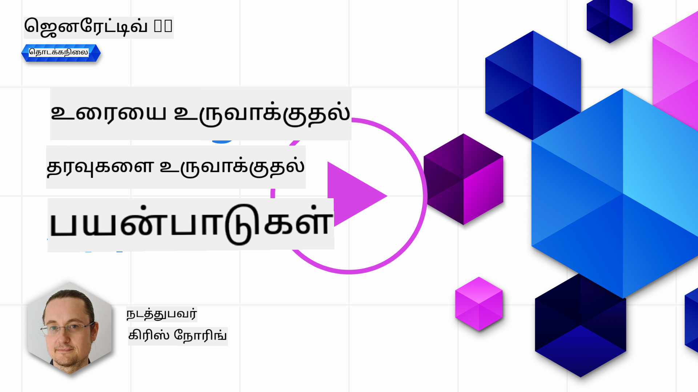

<!--
CO_OP_TRANSLATOR_METADATA:
{
  "original_hash": "ce8224073b86b728ed52b19bed7932fd",
  "translation_date": "2025-10-11T11:31:49+00:00",
  "source_file": "06-text-generation-apps/README.md",
  "language_code": "ta"
}
-->
# உரை உருவாக்க பயன்பாடுகளை உருவாக்குதல்

[](https://aka.ms/gen-ai-lesson6-gh?WT.mc_id=academic-105485-koreyst)

> _(மேலே உள்ள படத்தை கிளிக் செய்து இந்த பாடத்தின் வீடியோவைப் பாருங்கள்)_

இந்த பாடத்திட்டத்தின் மூலம் நீங்கள் இதுவரை முக்கியமான கருத்துகளைப் பார்த்துள்ளீர்கள், உதாரணமாக "ப்ராம்ப்ட்" மற்றும் "ப்ராம்ப்ட் என்ஜினியரிங்" எனப்படும் ஒரு முழு துறை. ChatGPT, Office 365, Microsoft Power Platform போன்ற பல கருவிகள் உங்களை ப்ராம்ப்ட்களைப் பயன்படுத்தி ஏதாவது செய்ய உதவுகின்றன.

இந்த அனுபவத்தை ஒரு பயன்பாட்டில் சேர்க்க நீங்கள் ப்ராம்ப்ட்கள், கம்ப்ளீஷன்கள் போன்ற கருத்துகளைப் புரிந்து கொள்ள வேண்டும் மற்றும் வேலை செய்ய ஒரு நூலகத்தைத் தேர்ந்தெடுக்க வேண்டும். இந்த அத்தியாயத்தில் நீங்கள் இதையே கற்றுக்கொள்வீர்கள்.

## அறிமுகம்

இந்த அத்தியாயத்தில், நீங்கள்:

- openai நூலகம் மற்றும் அதன் முக்கிய கருத்துகளைப் பற்றி கற்றுக்கொள்வீர்கள்.
- openai பயன்படுத்தி ஒரு உரை உருவாக்க பயன்பாட்டை உருவாக்குவீர்கள்.
- ப்ராம்ப்ட், டெம்பரேச்சர் மற்றும் டோக்கன்கள் போன்ற கருத்துகளைப் பயன்படுத்தி ஒரு உரை உருவாக்க பயன்பாட்டை உருவாக்குவது எப்படி என்பதைப் புரிந்து கொள்வீர்கள்.

## கற்றல் இலக்குகள்

இந்த பாடத்தின் முடிவில், நீங்கள்:

- உரை உருவாக்க பயன்பாடு என்ன என்பதை விளக்க முடியும்.
- openai பயன்படுத்தி ஒரு உரை உருவாக்க பயன்பாட்டை உருவாக்க முடியும்.
- உங்கள் பயன்பாட்டை அதிக அல்லது குறைவான டோக்கன்களைப் பயன்படுத்தவும், மேலும் பல்வேறு வெளியீடுகளுக்காக டெம்பரேச்சரை மாற்றவும் அமைக்க முடியும்.

## உரை உருவாக்க பயன்பாடு என்ன?

சாதாரணமாக நீங்கள் ஒரு பயன்பாட்டை உருவாக்கும்போது, அது பின்வருவன போன்ற ஒரு வகை இடைமுகத்தை கொண்டிருக்கும்:

- **கமாண்ட் அடிப்படையிலானது**. Console பயன்பாடுகள் பொதுவாக நீங்கள் ஒரு கமாண்டை டைப் செய்து ஒரு பணியைச் செய்யும் பயன்பாடுகள். உதாரணமாக, `git` என்பது ஒரு கமாண்ட் அடிப்படையிலான பயன்பாடு.
- **பயனர் இடைமுகம் (UI)**. சில பயன்பாடுகள் கிராபிகல் பயனர் இடைமுகங்களை (GUIs) கொண்டிருக்கும், இதில் நீங்கள் பட்டன்களை கிளிக் செய்யலாம், உரையை உள்ளிடலாம், விருப்பங்களைத் தேர்ந்தெடுக்கலாம் மற்றும் பல.

### Console மற்றும் UI பயன்பாடுகள் வரையறுக்கப்பட்டவை

ஒரு கமாண்ட் அடிப்படையிலான பயன்பாட்டுடன் ஒப்பிடுக, இதில் நீங்கள் ஒரு கமாண்டை டைப் செய்கிறீர்கள்:

- **இது வரையறுக்கப்பட்டது**. நீங்கள் எந்த கமாண்டையும் டைப் செய்ய முடியாது, பயன்பாடு ஆதரிக்கும் கமாண்ட்களையே டைப் செய்ய முடியும்.
- **மொழி குறிப்பிட்டது**. சில பயன்பாடுகள் பல மொழிகளை ஆதரிக்கின்றன, ஆனால் இயல்பாக பயன்பாடு ஒரு குறிப்பிட்ட மொழிக்காக உருவாக்கப்பட்டுள்ளது, கூடுதல் மொழி ஆதரவைச் சேர்க்க முடிந்தாலும்.

### உரை உருவாக்க பயன்பாடுகளின் நன்மைகள்

அப்படியென்றால், உரை உருவாக்க பயன்பாடு எப்படி வேறுபடுகிறது?

ஒரு உரை உருவாக்க பயன்பாட்டில், நீங்கள் அதிக சுதந்திரம் பெறுகிறீர்கள், நீங்கள் ஒரு கமாண்ட்களின் தொகுப்புக்கு அல்லது ஒரு குறிப்பிட்ட உள்ளீடு மொழிக்கு மட்டுப்படுத்தப்படவில்லை. அதற்கு பதிலாக, நீங்கள் இயற்கை மொழியைப் பயன்படுத்தி பயன்பாட்டுடன் தொடர்பு கொள்ளலாம். மேலும் ஒரு நன்மை என்னவென்றால், நீங்கள் ஏற்கனவே ஒரு பெரிய தகவல்தொகுப்பில் பயிற்சி பெற்ற தரவூட்டத்துடன் தொடர்பு கொள்ளுகிறீர்கள், ஆனால் ஒரு பாரம்பரிய பயன்பாடு ஒரு தரவுத்தொகுப்பில் உள்ளவற்றில் மட்டுப்படுத்தப்பட்டிருக்கலாம்.

### உரை உருவாக்க பயன்பாட்டைப் பயன்படுத்தி என்ன உருவாக்க முடியும்?

நீங்கள் பல விஷயங்களை உருவாக்க முடியும். உதாரணமாக:

- **ஒரு chatbot**. உங்கள் நிறுவனம் மற்றும் அதன் தயாரிப்புகள் போன்ற தலைப்புகள் குறித்து கேள்விகளுக்கு பதிலளிக்கும் chatbot ஒரு நல்ல பொருத்தமாக இருக்கலாம்.
- **உதவியாளர்**. LLMக்கள் உரையை சுருக்குதல், உரையிலிருந்து தகவல்களைப் பெறுதல், ரெஸ்யூமே போன்ற உரைகளை உருவாக்குதல் போன்றவற்றில் சிறந்தவை.
- **கோடு உதவியாளர்**. நீங்கள் பயன்படுத்தும் மொழி மாதிரியைப் பொறுத்து, நீங்கள் கோடு எழுத உதவும் ஒரு கோடு உதவியாளரை உருவாக்க முடியும். உதாரணமாக, GitHub Copilot மற்றும் ChatGPT போன்ற தயாரிப்புகளைப் பயன்படுத்தி கோடு எழுத உதவ முடியும்.

## நான் எப்படி தொடங்கலாம்?

நீங்கள் ஒரு LLM உடன் ஒருங்கிணைக்க ஒரு வழியைத் தேட வேண்டும், இது பொதுவாக பின்வரும் இரண்டு அணுகுமுறைகளை உள்ளடக்கியது:

- API ஐப் பயன்படுத்தவும். இங்கு நீங்கள் உங்கள் ப்ராம்ப்டுடன் வலை கோரிக்கைகளை உருவாக்கி உருவாக்கப்பட்ட உரையைப் பெறுகிறீர்கள்.
- நூலகத்தைப் பயன்படுத்தவும். நூலகங்கள் API அழைப்புகளை மூடிவைத்து அவற்றைப் பயன்படுத்த எளிதாக்குகின்றன.

## நூலகங்கள்/SDKக்கள்

LLMக்களுடன் வேலை செய்ய சில பிரபலமான நூலகங்கள் உள்ளன, உதாரணமாக:

- **openai**, இந்த நூலகம் உங்கள் மாதிரியுடன் இணைந்து ப்ராம்ப்ட்களை அனுப்ப எளிதாக்குகிறது.

பிறகு, மேல்நிலையான செயல்பாடுகளை வழங்கும் நூலகங்கள் உள்ளன, உதாரணமாக:

- **Langchain**. Langchain மிகவும் பிரபலமானது மற்றும் Python ஐ ஆதரிக்கிறது.
- **Semantic Kernel**. Semantic Kernel என்பது Microsoft உருவாக்கிய ஒரு நூலகம், இது C#, Python மற்றும் Java மொழிகளை ஆதரிக்கிறது.

## openai பயன்படுத்தி முதல் பயன்பாடு

நாம் எவ்வாறு முதல் பயன்பாட்டை உருவாக்கலாம், எந்த நூலகங்கள் தேவை, எவ்வளவு தேவை என்பதைக் காண்போம்.

### openai நிறுவவும்

OpenAI அல்லது Azure OpenAI உடன் தொடர்பு கொள்ள பல நூலகங்கள் உள்ளன. C#, Python, JavaScript, Java மற்றும் பல போன்ற பல நிரலாக்க மொழிகளைப் பயன்படுத்துவது சாத்தியம். நாம் Python `openai` நூலகத்தைத் தேர்ந்தெடுத்துள்ளோம், எனவே `pip` ஐப் பயன்படுத்தி அதை நிறுவுவோம்.

```bash
pip install openai
```

### ஒரு resource உருவாக்கவும்

நீங்கள் பின்வரும் படிகளைச் செய்ய வேண்டும்:

- Azure இல் ஒரு கணக்கை உருவாக்கவும் [https://azure.microsoft.com/free/](https://azure.microsoft.com/free/?WT.mc_id=academic-105485-koreyst).
- Azure OpenAI ஐ அணுகவும். [https://learn.microsoft.com/azure/ai-services/openai/overview#how-do-i-get-access-to-azure-openai](https://learn.microsoft.com/azure/ai-services/openai/overview#how-do-i-get-access-to-azure-openai?WT.mc_id=academic-105485-koreyst) இல் சென்று அணுகலைக் கோரவும்.

  > [!NOTE]
  > எழுதும் நேரத்தில், Azure OpenAI ஐ அணுக நீங்கள் விண்ணப்பிக்க வேண்டும்.

- Python ஐ நிறுவவும் <https://www.python.org/>
- Azure OpenAI Service resource ஐ உருவாக்கியிருக்க வேண்டும். [resource உருவாக்க](https://learn.microsoft.com/azure/ai-services/openai/how-to/create-resource?pivots=web-portal?WT.mc_id=academic-105485-koreyst) எப்படி என்பதைப் பார்க்க இந்த வழிகாட்டியைப் பாருங்கள்.

### API key மற்றும் endpoint ஐ கண்டறியவும்

இந்த நேரத்தில், உங்கள் `openai` நூலகத்திற்கு எந்த API key ஐப் பயன்படுத்த வேண்டும் என்பதைச் சொல்ல வேண்டும். உங்கள் API key ஐ கண்டறிய, Azure OpenAI resource இன் "Keys and Endpoint" பிரிவுக்கு சென்று "Key 1" மதிப்பை நகலெடுக்கவும்.


இப்போது நீங்கள் இந்த தகவலை நகலெடுத்துள்ளீர்கள், நூலகங்களுக்கு அதை பயன்படுத்த சொல்லுவோம்.

> [!NOTE]
> உங்கள் API key ஐ உங்கள் கோடிலிருந்து பிரிக்க வேண்டும். நீங்கள் சூழல் மாறிகள் (environment variables) பயன்படுத்தி அதைச் செய்யலாம்.
>
> - சூழல் மாறியை `OPENAI_API_KEY` உங்கள் API key க்கு அமைக்கவும்.
>   `export OPENAI_API_KEY='sk-...'`

### Azure அமைப்பை அமைக்கவும்

நீங்கள் Azure OpenAI ஐப் பயன்படுத்தினால், அமைப்பை அமைப்பது எப்படி என்பதை இங்கே காணலாம்:

```python
openai.api_type = 'azure'
openai.api_key = os.environ["OPENAI_API_KEY"]
openai.api_version = '2023-05-15'
openai.api_base = os.getenv("API_BASE")
```

மேலே நாம் பின்வருவனவற்றை அமைக்கிறோம்:

- `api_type` ஐ `azure` க்கு அமைக்கிறோம். இது நூலகத்திற்கு OpenAI அல்ல Azure OpenAI ஐப் பயன்படுத்தச் சொல்லுகிறது.
- `api_key`, இது Azure Portal இல் காணப்படும் உங்கள் API key.
- `api_version`, இது நீங்கள் பயன்படுத்த விரும்பும் API இன் பதிப்பு. எழுதும் நேரத்தில், சமீபத்திய பதிப்பு `2023-05-15`.
- `api_base`, இது API இன் endpoint. நீங்கள் உங்கள் API key க்கு அருகில் Azure Portal இல் இதைப் பார்க்கலாம்.

> [!NOTE] > `os.getenv` என்பது சூழல் மாறிகளைப் படிக்கும் ஒரு செயல்பாடு. `OPENAI_API_KEY` மற்றும் `API_BASE` போன்ற சூழல் மாறிகளைப் படிக்க அதை நீங்கள் பயன்படுத்தலாம். உங்கள் terminal இல் அல்லது `dotenv` போன்ற ஒரு நூலகத்தைப் பயன்படுத்தி இந்த சூழல் மாறிகளை அமைக்கவும்.

## உரை உருவாக்கவும்

உரை உருவாக்கும் வழி `Completion` வகுப்பைப் பயன்படுத்துவது. இதோ ஒரு உதாரணம்:

```python
prompt = "Complete the following: Once upon a time there was a"

completion = openai.Completion.create(model="davinci-002", prompt=prompt)
print(completion.choices[0].text)
```

மேலே உள்ள கோடில், நாம் ஒரு completion object ஐ உருவாக்கி, நாம் பயன்படுத்த விரும்பும் மாதிரி மற்றும் ப்ராம்ப்டை அனுப்புகிறோம். பின்னர் உருவாக்கப்பட்ட உரையை அச்சிடுகிறோம்.

### Chat completions

இதுவரை, நாம் `Completion` ஐப் பயன்படுத்தி உரையை உருவாக்கியதைப் பார்த்துள்ளீர்கள். ஆனால் chatbot களுக்கு மிகவும் பொருத்தமான `ChatCompletion` எனப்படும் மற்றொரு வகுப்பு உள்ளது. இதோ அதை பயன்படுத்தும் ஒரு உதாரணம்:

```python
import openai

openai.api_key = "sk-..."

completion = openai.ChatCompletion.create(model="gpt-3.5-turbo", messages=[{"role": "user", "content": "Hello world"}])
print(completion.choices[0].message.content)
```

இந்த செயல்பாட்டின் மேலும் ஒரு அத்தியாயத்தில்.

## பயிற்சி - உங்கள் முதல் உரை உருவாக்க பயன்பாடு

இப்போது நாம் openai ஐ அமைத்து உள்ளமைக்க எப்படி என்பதை கற்றுக்கொண்டோம், உங்கள் முதல் உரை உருவாக்க பயன்பாட்டை உருவாக்க நேரம். உங்கள் பயன்பாட்டை உருவாக்க, பின்வரும் படிகளைப் பின்பற்றவும்:

1. ஒரு virtual environment ஐ உருவாக்கி openai ஐ நிறுவவும்:

   ```bash
   python -m venv venv
   source venv/bin/activate
   pip install openai
   ```

   > [!NOTE]
   > நீங்கள் Windows ஐப் பயன்படுத்தினால் `venv\Scripts\activate` ஐ `source venv/bin/activate` இற்கு பதிலாக டைப் செய்யவும்.

   > [!NOTE]
   > உங்கள் Azure OpenAI key ஐ கண்டறிய [https://portal.azure.com/](https://portal.azure.com/?WT.mc_id=academic-105485-koreyst) இல் சென்று `Open AI` ஐ தேடவும், `Open AI resource` ஐத் தேர்ந்தெடுக்கவும், பின்னர் `Keys and Endpoint` ஐத் தேர்ந்தெடுத்து `Key 1` மதிப்பை நகலெடுக்கவும்.

1. _app.py_ எனும் ஒரு கோப்பை உருவாக்கி பின்வரும் கோடுகளைச் சேர்க்கவும்:

   ```python
   import openai

   openai.api_key = "<replace this value with your open ai key or Azure OpenAI key>"

   openai.api_type = 'azure'
   openai.api_version = '2023-05-15'
   openai.api_base = "<endpoint found in Azure Portal where your API key is>"
   deployment_name = "<deployment name>"

   # add your completion code
   prompt = "Complete the following: Once upon a time there was a"
   messages = [{"role": "user", "content": prompt}]

   # make completion
   completion = openai.chat.completions.create(model=deployment_name, messages=messages)

   # print response
   print(completion.choices[0].message.content)
   ```

   > [!NOTE]
   > நீங்கள் Azure OpenAI ஐப் பயன்படுத்தினால், `api_type` ஐ `azure` க்கு அமைக்கவும் மற்றும் `api_key` ஐ உங்கள் Azure OpenAI key க்கு அமைக்கவும்.

   நீங்கள் பின்வருவன போன்ற ஒரு வெளியீட்டை காணலாம்:

   ```output
    very unhappy _____.

   Once upon a time there was a very unhappy mermaid.
   ```

## வெவ்வேறு விஷயங்களுக்கு வெவ்வேறு வகையான ப்ராம்ப்ட்கள்

இப்போது நீங்கள் ப்ராம்ப்டைப் பயன்படுத்தி உரையை உருவாக்குவது எப்படி என்பதைப் பார்த்துள்ளீர்கள். நீங்கள் மாற்றி மாற்றி வெவ்வேறு வகையான உரைகளை உருவாக்க ஒரு செயல்பாடும் உள்ளது.

ப்ராம்ப்ட்கள் பல்வேறு பணிகளுக்கு பயன்படுத்தப்படலாம். உதாரணமாக:

- **ஒரு வகையான உரையை உருவாக்கவும்**. உதாரணமாக, நீங்கள் ஒரு கவிதை, ஒரு க்விஸ் கேள்விகள் போன்றவற்றை உருவாக்கலாம்.
- **தகவலை தேடவும்**. ப்ராம்ப்ட்களைப் பயன்படுத்தி தகவலைத் தேடலாம், உதாரணமாக 'CORS என்பது வலை மேம்பாட்டில் என்ன பொருள்?'.
- **கோடு உருவாக்கவும்**. நீங்கள் கோடு உருவாக்க ப்ராம்ப்ட்களைப் பயன்படுத்தலாம், உதாரணமாக மின்னஞ்சல்களைச் சரிபார்க்க பயன்படுத்தப்படும் ஒரு regular expression ஐ உருவாக்குதல் அல்லது ஒரு முழு நிரலாக்கத்தை உருவாக்குதல், ஒரு வலை பயன்பாட்டைப் போன்றது.

## ஒரு நடைமுறை பயன்பாடு: ஒரு சமையல் குறிப்புகள் உருவாக்கி

உங்கள் வீட்டில் உள்ள பொருட்களைப் பயன்படுத்தி நீங்கள் ஏதாவது சமைக்க விரும்புகிறீர்கள் என்று கற்பனை செய்யுங்கள். அதற்காக, உங்களுக்கு ஒரு சமையல் குறிப்புகள் தேவை. சமையல் குறிப்புகளைத் தேட ஒரு தேடல் இயந்திரத்தைப் பயன்படுத்தலாம் அல்லது ஒரு LLM ஐப் பயன்படுத்தலாம்.

நீங்கள் பின்வருவன போன்ற ஒரு ப்ராம்ப்டை எழுதலாம்:

> "கோழி, உருளைக்கிழங்கு மற்றும் காரட் ஆகிய பொருட்களுடன் ஒரு உணவுக்கான 5 சமையல் குறிப்புகளைக் காட்டு. ஒவ்வொரு சமையல் குறிப்பிற்கும் பயன்படுத்தப்படும் அனைத்து பொருட்களையும் பட்டியலிடவும்"

மேலே உள்ள ப்ராம்ப்டைத் தருக, நீங்கள் பின்வருவன போன்ற பதிலைப் பெறலாம்:

```output
1. Roasted Chicken and Vegetables:
Ingredients:
- 4 chicken thighs
- 2 potatoes, cut into cubes
- 2 carrots, cut into cubes
- 2 tablespoons olive oil
- 2 cloves garlic, minced
- 1 teaspoon dried thyme
- 1 teaspoon dried oregano
- Salt and pepper, to taste

2. Chicken and Potato Stew:
Ingredients:
- 2 tablespoons olive oil
- 1 onion, diced
- 2 cloves garlic, minced
- 2 chicken breasts, cut into cubes
- 2 potatoes, cut into cubes
- 2 carrots, cut into cubes
- 1 teaspoon dried oregano
- 1 teaspoon dried thyme
- 1 cup chicken broth
- Salt and pepper, to taste

3. Chicken and Potato Bake:
Ingredients:
- 2 tablespoons olive oil
- 2 chicken breasts, cut into cubes
- 2 potatoes, cut into cubes
- 2 carrots, cut into cubes
- 1 onion, diced
- 2 cloves garlic, minced
- 1 teaspoon dried oregano
- 1 teaspoon dried thyme
- 1 cup chicken broth
- Salt and pepper, to taste

4. Chicken and Potato Soup:
Ingredients:
- 2 tablespoons olive oil
- 1 onion, diced
- 2 cloves garlic, minced
- 2 chicken breasts, cut into cubes
- 2 potatoes, cut into cubes
- 2 carrots, cut into cubes
- 1 teaspoon dried oregano
- 1 teaspoon dried thyme
- 4 cups chicken broth
- Salt and pepper, to taste

5. Chicken and Potato Hash:
Ingredients:
- 2 tablespoons olive oil
- 2 chicken breasts, cut into cubes
- 2 potatoes, cut into cubes
- 2 carrots, cut into cubes
- 1 onion, diced
- 2 cloves garlic, minced
- 1 teaspoon dried oregano
```

இந்த முடிவு அருமை, நான் என்ன சமைக்க வேண்டும் என்பதை அறிந்தேன். இந்த நேரத்தில், பயனுள்ள மேம்பாடுகள் என்னவென்றால்:

- நான் விரும்பாத அல்லது அலர்ஜி உள்ள பொருட்களை வடிகட்டுதல்.
- நான் வீட்டில் அனைத்து பொருட்களையும் இல்லாமல் இருந்தால், ஒரு ஷாப்பிங் பட்டியலை உருவாக்குதல்.

மேலே உள்ள வழக்குகளுக்கு, நாம் ஒரு கூடுதல் ப்ராம்ப்டைச் சேர்ப்போம்:

> "தயவுசெய்து பூண்டு உள்ள சமையல் குறிப்புகளை நீக்கவும், நான் அலர்ஜி உள்ளேன் மற்றும் அதை வேறொன்றுடன் மாற்றவும். மேலும், சமையல் குறிப்புகளுக்கான ஷாப்பிங் பட்டியலை உருவாக்கவும், நான் கோழி, உருளைக்கிழங்கு மற்றும் காரட் வீட்டில் ஏற்கனவே உள்ளன என்று கருதுங்கள்."

இப்போது உங்களுக்கு ஒரு புதிய முடிவு கிடைத்துள்ளது, அதாவது:

```output
1. Roasted Chicken and Vegetables:
Ingredients:
- 4 chicken thighs
- 2 potatoes, cut into cubes
- 2 carrots, cut into cubes
- 2 tablespoons olive oil
- 1 teaspoon dried thyme
- 1 teaspoon dried oregano
- Salt and pepper, to taste

2. Chicken and Potato Stew:
Ingredients:
- 2 tablespoons olive oil
- 1 onion, diced
- 2 chicken breasts, cut into cubes
- 2 potatoes, cut into cubes
- 2 carrots, cut into cubes
- 1 teaspoon dried oregano
- 1 teaspoon dried thyme
- 1 cup chicken broth
- Salt and pepper, to taste

3. Chicken and Potato Bake:
Ingredients:
- 2 tablespoons olive oil
- 2 chicken breasts, cut into cubes
- 2 potatoes, cut into cubes
- 2 carrots, cut into cubes
- 1 onion, diced
- 1 teaspoon dried oregano
- 1 teaspoon dried thyme
- 1 cup chicken broth
- Salt and pepper, to taste

4. Chicken and Potato Soup:
Ingredients:
- 2 tablespoons olive oil
- 1 onion, diced
- 2 chicken breasts, cut into cubes
- 2 potatoes, cut into cubes
- 2 carrots, cut into cubes
- 1 teaspoon dried oregano
- 1 teaspoon dried thyme
- 4 cups chicken broth
- Salt and pepper, to taste

5. Chicken and Potato Hash:
Ingredients:
- 2 tablespoons olive oil
- 2 chicken breasts, cut into cubes
- 2 potatoes, cut into cubes
- 2 carrots, cut into cubes
- 1 onion, diced
- 1 teaspoon dried oregano

Shopping List:
- Olive oil
- Onion
- Thyme
- Oregano
- Salt
- Pepper
```

இவை உங்கள் ஐந்து சமையல் குறிப்புகள், பூண்டு குறிப்பிடப்படவில்லை மற்றும் நீங்கள் வீட்டில் ஏற்கனவே உள்ளதைப் பொருத்து ஒரு ஷாப்பிங் பட்டியலும் உள்ளது.

## பயிற்சி - ஒரு சமையல் குறிப்புகள் உருவாக்கி

இப்போது நாம் ஒரு சூழலை விளையாடியுள்ளோம், காட்டப்பட்ட சூழலுக்கு பொருந்தும் கோடுகளை எழுதுவோம். இதைச் செய்ய, பின்வரும் படிகளைப் பின்பற்றவும்:

1. உள்ள _app.py_ கோப்பை தொடக்கமாகப் பயன்படுத்தவும்
1. `prompt` மாறியை கண்டறிந்து அதன் கோடுகளை பின்வருமாறு மாற்றவும்:

   ```python
   prompt = "Show me 5 recipes for a dish with the following ingredients: chicken, potatoes, and carrots. Per recipe, list all the ingredients used"
   ```

   நீங்கள் கோடுகளை இயக்கினால், நீங்கள் பின்வருவன போன்ற ஒரு வெளியீட்டை காணலாம்:

   ```output
   -Chicken Stew with Potatoes and Carrots: 3 tablespoons oil, 1 onion, chopped, 2 cloves garlic, minced, 1 carrot, peeled and chopped, 1 potato, peeled and chopped, 1 bay leaf, 1 thyme sprig, 1/2 teaspoon salt, 1/4 teaspoon black pepper, 1 1/2 cups chicken broth, 1/2 cup dry white wine, 2 tablespoons chopped fresh parsley, 2 tablespoons unsalted butter, 1 1/2 pounds boneless, skinless chicken thighs, cut into 1-inch pieces
   -Oven-Roasted Chicken with Potatoes and Carrots: 3 tablespoons extra-virgin olive oil, 1 tablespoon Dijon mustard, 1 tablespoon chopped fresh rosemary, 1 tablespoon chopped fresh thyme, 4 cloves garlic, minced, 1 1/2 pounds small red potatoes, quartered, 1 1/2 pounds carrots, quartered lengthwise, 1/2 teaspoon salt, 1/4 teaspoon black pepper, 1 (4-pound) whole chicken
   -Chicken, Potato, and Carrot Casserole: cooking spray, 1 large onion, chopped, 2 cloves garlic, minced, 1 carrot, peeled and shredded, 1 potato, peeled and shredded, 1/2 teaspoon dried thyme leaves, 1/4 teaspoon salt, 1/4 teaspoon black pepper, 2 cups fat-free, low-sodium chicken broth, 1 cup frozen peas, 1/4 cup all-purpose flour, 1 cup 2% reduced-fat milk, 1/4 cup grated Parmesan cheese

   -One Pot Chicken and Potato Dinner: 2 tablespoons olive oil, 1 pound boneless, skinless chicken thighs, cut into 1-inch pieces, 1 large onion, chopped, 3 cloves garlic, minced, 1 carrot, peeled and chopped, 1 potato, peeled and chopped, 1 bay leaf, 1 thyme sprig, 1/2 teaspoon salt, 1/4 teaspoon black pepper, 2 cups chicken broth, 1/2 cup dry white wine

   -Chicken, Potato, and Carrot Curry: 1 tablespoon vegetable oil, 1 large onion, chopped, 2 cloves garlic, minced, 1 carrot, peeled and chopped, 1 potato, peeled and chopped, 1 teaspoon ground coriander, 1 teaspoon ground cumin, 1/2 teaspoon ground turmeric, 1/2 teaspoon ground ginger, 1/4 teaspoon cayenne pepper, 2 cups chicken broth, 1/2 cup dry white wine, 1 (15-ounce) can chickpeas, drained and rinsed, 1/2 cup raisins, 1/2 cup chopped fresh cilantro
   ```

   > குறிப்பு, உங்கள் LLM nondeterministic ஆகும், எனவே நீங்கள் நிரலத்தை ஒவ்வொரு முறையும் இயக்கும்போது வெவ்வேறு முடிவுகளைப் பெறலாம்.

   அருமை, நாம் விஷயங்களை எவ்வாறு மேம்படுத்தலாம் என்பதைப் பார்ப்போம். விஷயங்களை மேம்படுத்த, கோடு நெகிழ்வானது என்பதை உறுதிப்படுத்த விரும்புகிறோம், எனவே பொருட்கள் மற்றும் சமையல் குறிப்புகளின் எண்ணிக்கை மேம்படுத்தப்படலாம் மற்றும் மாற்றப்படலாம்.

1. கோடுகளை பின்வருமாறு மாற்றுவோம்:

   ```python
   no_recipes = input("No of recipes (for example, 5): ")

   ingredients = input("List of ingredients (for example, chicken, potatoes, and carrots): ")

   # interpolate the number of recipes into the prompt an ingredients
   prompt = f"Show me {no_recipes} recipes for a dish with the following ingredients: {ingredients}. Per recipe, list all the ingredients used"
   ```

   கோடுகளை சோதனை இயக்கம், இதைப் போல இருக்கலாம்:

   ```output
   No of recipes (for example, 5): 3
   List of ingredients (for example, chicken, potatoes, and carrots): milk,strawberries

   -Strawberry milk shake: milk, strawberries, sugar, vanilla extract, ice cubes
   -Strawberry shortcake: milk, flour, baking powder, sugar, salt, unsalted butter, strawberries, whipped cream
   -Strawberry milk: milk, strawberries, sugar, vanilla extract
   ```

### வடிகட்டல் மற்றும் ஷாப்பிங் பட்டியலைச் சேர்த்து மேம்படுத்தவும்

நாம் தற்போது சமையல் குறிப்புகளை உருவாக்கும் பயன்பாட்டை வைத்திருக்கிறோம், மேலும் இது பயனர் உள்ளீடுகளை நம்புகிறது, சமையல் குறிப்புகளின் எண்ணிக்கையிலும் பயன்படுத்தப்படும் பொருட்களிலும்.

மேலும் மேம்படுத்த, பின்வருவனவற்றைச் சேர்க்க விரும்புகிறோம்:

- **பொருட்களை வடிகட்டுதல்**. நாம் விரும்பாத அல்லது அலர்ஜி உள்ள பொருட்களை வடிகட்ட விரும்புகிறோம். இந்த மாற்றத்தைச் செய்ய, நாம் உள்ள ப்ராம்ப்டைத் திருத்தி அதன் முடிவில் ஒரு வடிகட்டல் நிலையைச் சேர்க்கலாம்:

  ```python
  filter = input("Filter (for example, vegetarian, vegan, or gluten-free): ")

  prompt = f"Show me {no_recipes} recipes for a dish with the following ingredients: {ingredients}. Per recipe, list all the ingredients used, no {filter}"
  ```

  மேலே, நாம் `{filter}` ஐ ப்ராம்ப்டின் முடிவில் சேர்க்கிறோம் மற்றும் filter மதிப்பை பயனரிடமிருந்து பிடிக்கிறோம்.

  நிரலத்தை இயக்கும் ஒரு உதாரண உள்ளீடு இப்போது இதைப் போல இருக்கலாம்:

  ```output
  No of recipes (for example, 5): 3
  List of ingredients (for example, chicken, potatoes, and carrots): onion,milk
  Filter (for example, vegetarian, vegan, or gluten-free): no milk

  1. French Onion Soup

  Ingredients:

  -1 large onion, sliced
  -3 cups beef broth
  -1 cup milk
  -6 slices french bread
  -1/4 cup shredded Parmesan cheese
  -1 tablespoon butter
  -1 teaspoon dried thyme
  -1/4 teaspoon salt
  -1/4 teaspoon black pepper

  Instructions:

  1. In a large pot, sauté onions in butter until golden brown.
  2. Add beef broth, milk, thyme, salt, and pepper. Bring to a boil.
  3. Reduce heat and simmer for 10 minutes.
  4. Place french bread slices on soup bowls.
  5. Ladle soup over bread.
  6. Sprinkle with Parmesan cheese.

  2. Onion and Potato Soup

  Ingredients:

  -1 large onion, chopped
  -2 cups potatoes, diced
  -3 cups vegetable broth
  -1 cup milk
  -1/4 teaspoon black pepper

  Instructions:

  1. In a large pot, sauté onions in butter until golden brown.
  2. Add potatoes, vegetable broth, milk, and pepper. Bring to a boil.
  3. Reduce heat and simmer for 10 minutes.
  4. Serve hot.

  3. Creamy Onion Soup

  Ingredients:

  -1 large onion, chopped
  -3 cups vegetable broth
  -1 cup milk
  -1/4 teaspoon black pepper
  -1/4 cup all-purpose flour
  -1/2 cup shredded Parmesan cheese

  Instructions:

  1. In a large pot, sauté onions in butter until golden brown.
  2. Add vegetable broth, milk, and pepper. Bring to a boil.
  3. Reduce heat and simmer for 10 minutes.
  4. In a small bowl, whisk together flour and Parmesan cheese until smooth.
  5. Add to soup and simmer for an additional 5 minutes, or until soup has thickened.
  ```

  நீங்கள் காணலாம், பால் உள்ள எந்த சமையல் குறிப்புகளும் வடிகட்டப்பட்டுள்ளன. ஆனால், நீங்கள் lactose intolerant ஆக இருந்தால், நீங்கள் பனீர் உள்ள சமையல் குறிப்புகளையும் வடிகட்ட விரும்பலாம், எனவே தெளிவாக இருக்க வேண்டும்.

- **ஒரு ஷாப்பிங் பட்டியலை உருவாக்கவும்**. நாம் வீட்டில் ஏற்கனவே உள்ளதைப் பொருத்து ஒரு ஷாப்பிங் பட்டியலை உருவாக்க விரும்புகிறோம்.

  இந்த செயல்பாட்டிற்காக, நாம் எல்லாவற்றையும் ஒரு ப்ராம்ப்டில் தீர்க்க முயற்சிக்கலாம் அல்லது அதை இரண்டு ப்ராம்ப்ட்களில் பிரிக்கலாம். இரண்டாவது அணுகுமுறையை முயற்சிப்போம். இங்கே, நாம் ஒரு கூடுதல் ப்ராம்ப்டைச் சேர்க்க பரிந்த
  ```python
  old_prompt_result = completion.choices[0].message.content
  prompt = "Produce a shopping list for the generated recipes and please don't include ingredients that I already have."

  new_prompt = f"{old_prompt_result} {prompt}"
  messages = [{"role": "user", "content": new_prompt}]
  completion = openai.Completion.create(engine=deployment_name, messages=messages, max_tokens=1200)

  # print response
  print("Shopping list:")
  print(completion.choices[0].message.content)
  ```

  கீழே உள்ளவற்றை கவனிக்கவும்:

  1. முதல் prompt-இன் முடிவை புதிய prompt-க்கு சேர்த்து புதிய prompt-ஐ உருவாக்குகிறோம்:

     ```python
     new_prompt = f"{old_prompt_result} {prompt}"
     ```

  1. நாம் ஒரு புதிய கோரிக்கையை செய்கிறோம், ஆனால் முதல் prompt-இல் கேட்ட token எண்ணிக்கையை கருத்தில் கொண்டு, இந்த முறை `max_tokens` ஐ 1200 என்று குறிப்பிடுகிறோம்.

     ```python
     completion = openai.Completion.create(engine=deployment_name, prompt=new_prompt, max_tokens=1200)
     ```

     இந்த code-ஐ செயல்படுத்தி பார்க்கும்போது, கீழே உள்ள output-ஐ பெறுகிறோம்:

     ```output
     No of recipes (for example, 5): 2
     List of ingredients (for example, chicken, potatoes, and carrots): apple,flour
     Filter (for example, vegetarian, vegan, or gluten-free): sugar


     -Apple and flour pancakes: 1 cup flour, 1/2 tsp baking powder, 1/2 tsp baking soda, 1/4 tsp salt, 1 tbsp sugar, 1 egg, 1 cup buttermilk or sour milk, 1/4 cup melted butter, 1 Granny Smith apple, peeled and grated
     -Apple fritters: 1-1/2 cups flour, 1 tsp baking powder, 1/4 tsp salt, 1/4 tsp baking soda, 1/4 tsp nutmeg, 1/4 tsp cinnamon, 1/4 tsp allspice, 1/4 cup sugar, 1/4 cup vegetable shortening, 1/4 cup milk, 1 egg, 2 cups shredded, peeled apples
     Shopping list:
     -Flour, baking powder, baking soda, salt, sugar, egg, buttermilk, butter, apple, nutmeg, cinnamon, allspice
     ```

## உங்கள் அமைப்பை மேம்படுத்துங்கள்

இப்போது வரை நமக்கு வேலை செய்யும் code உள்ளது, ஆனால் இன்னும் சில மாற்றங்களைச் செய்ய வேண்டும், இது செயல்திறனை மேலும் மேம்படுத்த உதவும். நாம் செய்ய வேண்டிய சில விஷயங்கள்:

- **Code-இல் இருந்து ரகசியங்களை பிரிக்கவும்**, API key போன்றவை. ரகசியங்கள் code-இல் இருக்கக்கூடாது, அவை பாதுகாப்பான இடத்தில் சேமிக்கப்பட வேண்டும். Code-இல் இருந்து ரகசியங்களை பிரிக்க, நாம் environment variables மற்றும் `python-dotenv` போன்ற libraries-ஐ பயன்படுத்தி அவற்றை ஒரு file-இல் இருந்து load செய்யலாம். இதை code-இல் எப்படி செய்யலாம் என்பதை கீழே காணலாம்:

  1. `.env` file-ஐ கீழே உள்ள உள்ளடக்கத்துடன் உருவாக்கவும்:

     ```bash
     OPENAI_API_KEY=sk-...
     ```

     > Azure-க்கு, நீங்கள் கீழே உள்ள environment variables-ஐ அமைக்க வேண்டும்:

     ```bash
     OPENAI_API_TYPE=azure
     OPENAI_API_VERSION=2023-05-15
     OPENAI_API_BASE=<replace>
     ```

     Code-இல், நீங்கள் environment variables-ஐ இவ்வாறு load செய்வீர்கள்:

     ```python
     from dotenv import load_dotenv

     load_dotenv()

     openai.api_key = os.environ["OPENAI_API_KEY"]
     ```

- **Token length பற்றிய ஒரு வார்த்தை**. நாம் உருவாக்க வேண்டிய text-ஐ உருவாக்க எவ்வளவு tokens தேவை என்பதை கருத்தில் கொள்ள வேண்டும். Tokens பணம் செலவாகும், எனவே wherever possible, நாம் tokens-ஐ குறைவாக பயன்படுத்த முயற்சிக்க வேண்டும். உதாரணமாக, prompt-ஐ phrasing செய்வதன் மூலம் tokens-ஐ குறைக்க முடியுமா?

  Tokens-ஐ மாற்ற `max_tokens` parameter-ஐ பயன்படுத்தலாம். உதாரணமாக, நீங்கள் 100 tokens-ஐ பயன்படுத்த விரும்பினால், நீங்கள் இதைச் செய்வீர்கள்:

  ```python
  completion = client.chat.completions.create(model=deployment, messages=messages, max_tokens=100)
  ```

- **Temperature-ஐ பரிசோதித்தல்**. Temperature என்பது இதுவரை நாம் குறிப்பிடாத ஒரு முக்கியமான context ஆகும், ஆனால் இது நமது program செயல்பாட்டில் முக்கியமானது. Temperature value அதிகமாக இருந்தால் output random ஆக இருக்கும். அதேபோல், Temperature value குறைவாக இருந்தால் output predictable ஆக இருக்கும். உங்கள் output-ல் variation வேண்டும் என்று நீங்கள் விரும்புகிறீர்களா என்பதை கருத்தில் கொள்ளுங்கள்.

  Temperature-ஐ மாற்ற, நீங்கள் `temperature` parameter-ஐ பயன்படுத்தலாம். உதாரணமாக, நீங்கள் 0.5 temperature-ஐ பயன்படுத்த விரும்பினால், நீங்கள் இதைச் செய்வீர்கள்:

  ```python
  completion = client.chat.completions.create(model=deployment, messages=messages, temperature=0.5)
  ```

  > குறிப்பு, 1.0-க்கு அருகில் இருக்கும் போது output மிகவும் varied ஆக இருக்கும்.

## பணிக்கட்டளை

இந்த assignment-க்கு, நீங்கள் எதை உருவாக்க வேண்டும் என்பதை தேர்வு செய்யலாம்.

இங்கே சில பரிந்துரைகள்:

- Recipe generator app-ஐ மேலும் மேம்படுத்தவும். Temperature values மற்றும் prompts-ஐ மாற்றி நீங்கள் என்ன உருவாக்க முடியும் என்பதைப் பாருங்கள்.
- "Study buddy" உருவாக்கவும். இந்த app ஒரு topic பற்றிய கேள்விகளுக்கு பதிலளிக்க வேண்டும், உதாரணமாக Python. நீங்கள் "Python-இல் ஒரு குறிப்பிட்ட topic என்ன?" போன்ற prompts-ஐ கொண்டிருக்கலாம் அல்லது "ஒரு குறிப்பிட்ட topic-க்கு code-ஐ காட்டவும்" போன்ற prompt-ஐ கொண்டிருக்கலாம்.
- History bot, வரலாற்றை உயிர்ப்பிக்கவும், bot-ஐ ஒரு குறிப்பிட்ட வரலாற்று கதாபாத்திரமாக செயல்படச் சொல்லி அதன் வாழ்க்கை மற்றும் காலம் பற்றிய கேள்விகளை கேட்கவும்.

## தீர்வு

### Study buddy

கீழே ஒரு starter prompt உள்ளது, அதை நீங்கள் எப்படி பயன்படுத்தி உங்கள் விருப்பத்திற்கு ஏற்ப மாற்றலாம் என்பதைப் பாருங்கள்.

```text
- "You're an expert on the Python language

    Suggest a beginner lesson for Python in the following format:

    Format:
    - concepts:
    - brief explanation of the lesson:
    - exercise in code with solutions"
```

### History bot

இங்கே நீங்கள் பயன்படுத்தக்கூடிய சில prompts உள்ளன:

```text
- "You are Abe Lincoln, tell me about yourself in 3 sentences, and respond using grammar and words like Abe would have used"
- "You are Abe Lincoln, respond using grammar and words like Abe would have used:

   Tell me about your greatest accomplishments, in 300 words"
```

## அறிவு சோதனை

Temperature என்ற கருத்து என்ன செய்கிறது?

1. Output எவ்வளவு random ஆக இருக்கும் என்பதை கட்டுப்படுத்துகிறது.
1. Response எவ்வளவு பெரியதாக இருக்கும் என்பதை கட்டுப்படுத்துகிறது.
1. பயன்படுத்தப்படும் tokens எண்ணிக்கையை கட்டுப்படுத்துகிறது.

## 🚀 சவால்

Assignment-ஐ செய்யும்போது, Temperature-ஐ மாற்ற முயற்சிக்கவும், அதை 0, 0.5, மற்றும் 1-ஆக அமைக்க முயற்சிக்கவும். 0 என்பது மிகவும் குறைவான variation, 1 என்பது மிகவும் அதிக variation. உங்கள் app-க்கு எந்த value சிறந்தது என்பதை கண்டறியுங்கள்.

## சிறந்த வேலை! உங்கள் கற்றலை தொடருங்கள்

இந்த பாடத்தை முடித்த பிறகு, [Generative AI Learning collection](https://aka.ms/genai-collection?WT.mc_id=academic-105485-koreyst) ஐ பாருங்கள், Generative AI அறிவை மேலும் மேம்படுத்துங்கள்!

Lesson 7-க்கு செல்லுங்கள், அங்கு நாம் [chat applications உருவாக்குவது](../07-building-chat-applications/README.md?WT.mc_id=academic-105485-koreyst) பற்றி பார்ப்போம்!

---

**குறிப்பு**:  
இந்த ஆவணம் [Co-op Translator](https://github.com/Azure/co-op-translator) என்ற AI மொழிபெயர்ப்பு சேவையைப் பயன்படுத்தி மொழிபெயர்க்கப்பட்டுள்ளது. எங்கள் தரச்செயல்முறைகளுக்கு முழு முயற்சி எடுத்தாலும், தானியங்கி மொழிபெயர்ப்புகளில் பிழைகள் அல்லது தவறுகள் இருக்கக்கூடும் என்பதை தயவுசெய்து கவனத்தில் கொள்ளவும். அதன் இயல்பான மொழியில் உள்ள மூல ஆவணம் அதிகாரப்பூர்வ ஆதாரமாக கருதப்பட வேண்டும். முக்கியமான தகவல்களுக்கு, தொழில்முறை மனித மொழிபெயர்ப்பு பரிந்துரைக்கப்படுகிறது. இந்த மொழிபெயர்ப்பைப் பயன்படுத்துவதால் ஏற்படும் எந்த தவறான புரிதல்கள் அல்லது தவறான விளக்கங்களுக்கு நாங்கள் பொறுப்பல்ல.