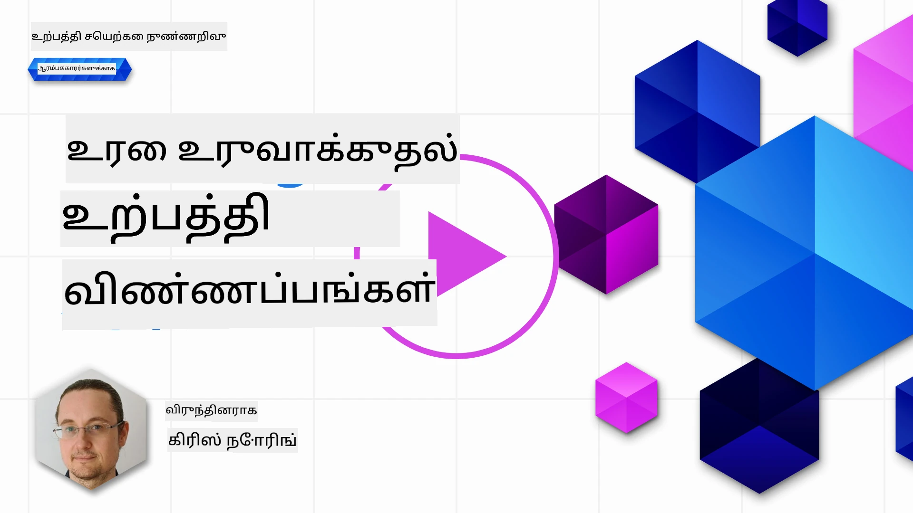

# உரை உருவாக்கும் பயன்பாடுகளை உருவாக்குதல்

[](https://youtu.be/0Y5Luf5sRQA?si=t_xVg0clnAI4oUFZ)

> _(மேலே உள்ள படத்தை கிளிக் செய்து இந்த பாடத்தின் வீடியோக்களை பார்வையிடவும்)_

இதுவரை இந்த பாடத்திட்டத்தில் நீங்கள் பார்த்திருப்பது போல், "prompt engineering" என்ற ஒரு முழு துறையும் உள்ளான கட்டுப்படுத்தல்கள் மற்றும் அடிப்படை கருத்துக்கள் உண்டு. ChatGPT, Office 365, Microsoft Power Platform போன்ற பல கருவிகள் நீங்கள் பயன்படுத்தும் கட்டளைகளைக் கொண்டு வேலை செய்ய உதவுகின்றன.

நீங்கள் ஒரு பயன்பாட்டுடன் இப்படியான அனுபவத்தை சேர்க்க விரும்பினால், கட்டளைகள், முடிவுகள் போன்ற கருத்துக்களைப் புரிந்து கொண்டு, பயன்படுத்த library ஒன்றை தேர்வு செய்ய வேண்டும். இதுதான் இந்த அத்தியாயத்தில் நீங்கள் கற்றுக்கொள்ளப்போகும் விஷயம்.

## परिचय

இந்த அத்தியாயத்தில், நீங்கள்:

- openai நூலகம் மற்றும் அதன் அடிப்படை கருத்துக்களைப் பற்றி கற்றுக்கொள்ளலாம்.
- openai பயன்படுத்தி ஒரு உரை உருவாக்கும் பயன்பாட்டைப் பயன்படுத்தலாம்.
- prompt, temperature, tokens போன்ற கருத்துக்களைப் பயன்படுத்தி உரை உருவாக்கும் பயன்பாட்டை எப்படி உருவாக்குவது என்பதை அறிந்துகொள்ளலாம்.

## கற்றல் குறிக்கோள்கள்

இந்த பாடத்தின் முடிவில், நீங்கள்:

- ஒரு உரை உருவாக்கும் பயன்பாடு என்ன என்பது விளக்கமற் முடிவில்.
- openai பயன்படுத்தி ஒரு உரை உருவாக்கும் பயன்பாட்டை உருவாக்கும் திறன் பெற்றிருப்பீர்கள்.
- உங்கள் பயன்பாட்டில் tokens எண்ணிக்கையை குறைக்க அல்லது அதிகரிக்க மற்றும் temperature மாற்றி output வித்தியாசப்படுத்த இயலும்.

## உரை உருவாக்கும் பயன்பாடு என்பதன் அர்த்தம் என்ன?

பொதுவாக, ஒரு பயன்பாடுகள் கீழ்காணும் வகை இடைமுகம் ஒன்றை கொண்டிருக்கும்:

- கட்டளையுடன் அடிப்படையிலானது. கட்டளை அடிப்படையிலான பயன்பாடுகளில் நீங்கள் கட்டளை ஒன்று அமர்த்தி அந்த செயல்பாட்டை நிறைவேற்றுகிறது. உதாரணமாக, `git` குறுந்தொடர் கட்டளை அடிப்படையிலான பயன்பாடு.
- பயனர் இடைமுகம் (UI). சில பயன்பாடுகள் GUI என்ற பட்டன்கள், உரை உள்ளீடு, தேர்வு போன்றவையைச் கொண்ட பயனர் இடைமுகத்தை பயன்படுத்துகின்றன.

### கட்டளை அடிப்படையிலான மற்றும் UI பயன்பாடுகள் வரையறுக்கப்பட்டவை

கட்டளை அடிப்படையிலான பயன்பாட்டுடன் ஒப்பிடுகையில், நீங்கள் கட்டளை ஒன்று தட்டச்சு செய்வீர்கள்:

- **இது வரையறுக்கப்பட்டது**. நீங்கள் எந்த கட்டளையையும் தட்டச்சு செய்ய முடியாது, பயன்பாடு ஆதரிக்கின்ற கட்டளைகள் மட்டுமே.
- **மொழி நிபந்தனை**. சில பயன்பாடுகள் பல மொழிகளை ஆதரிக்கலாம், ஆனால் பொதுவாக அவை ஒரு குறிப்பிட்ட மொழிக்கானவையாக உருவாக்கப்பட்டுள்ளன.

### உரை உருவாக்கும் பயன்பாடுகளின் நன்மைகள்

எனவே, உரை உருவாக்கும் பயன்பாடு எப்படி வித்தியாசமாக இருக்கிறது?

ஒரு உரை உருவாக்கும் பயன்பாட்டில், கட்டளைகள் அல்லது குறிப்பிட்ட உள்ளீடு மொழி கட்டுப்பாடு இல்லை. இயற்கை மொழியைப் பயன்படுத்தி நீங்கள் பயன்பாட்டுடன் தொடர்பு கொள்ளலாம். மேலும், நீங்கள் ஒரு பெரும் தரவுத்தொகுப்பில் பயிற்சி பெற்ற தரவுத்தளத்துடன் தொடர்பு கொண்டு இருக்கிறீர்கள், அதே சமயம் பாரம்பரிய பயன்படுகள் தரவுத்தளத்தில் மட்டுமே கட்டுப்படுத்தப்படலாம்.

### நான் உரை உருவாக்கும் பயன்பாட்டுடன் என்ன கட்டியால் செய்யமுடியும்?

பல விடயங்களை நீங்கள் உருவாக்கலாம். உதாரணமாக:

- **ஒரு செயற்கை உரையாடல் கருவி**. உங்கள் நிறுவனம் மற்றும் அதன் தயாரிப்புகள் பற்றி கேள்விகளுக்கு பதிலளிக்கும் ஒரு சாட்பாட்.
- **உதவியாளர்**. LLM கள் உரை சுருக்கம் செய்ய, தகவல் காண்பிக்க, முழுமையான உரைகளை உருவாக்க உதவுகின்றன.
- **கோடு உதவியாளர்**. நீங்கள் பயன்படுத்தும் மொழி μονலுக்கு ஏற்றவாறு, கோடு எழுத உதவும் ஒரு உதவியாளரை உருவாக்கலாம். உதாரணமாக, GitHub Copilot மற்றும் ChatGPT போன்றவற்றைப் பயன்படுத்தி கோடு எழுதலாம்.

## எப்படி துவங்கலாம்?

நீங்கள் LLM உடன் இணைக்க இரண்டு வழிகளுக்கு பொதுவாக செல்ல வேண்டியுள்ளது:

- API பயன்படுத்துதல். இங்கு நீங்கள் உங்கள் prompt உடன் வலை கோரிக்கைகளை உருவாக்கி, உரை பதிலை பெறலாம்.
- நூலகம் பயன்படுத்துதல். நூலகங்கள் API அழைப்புகளை அடைத்து பயன்படுத்த எளிமையாக்குகின்றன.

## நூலகங்கள்/SDK கள்

LLM களை பயன்படுத்த சில பரிச்சயமான நூலகங்கள் உள்ளன, உதாரணமாக:

- **openai**, இந்த நூலகம் உங்கள் மாதிரியை இணைக்க மற்றும் prompt அனுப்ப எளிமையாக செய்கிறது.

பிறகு அதிக உயர்தர நூலகங்களும் உள்ளன:

- **Langchain**. Langchain பரவலாகப் பரிச்சயமானது மற்றும் Python க்கு ஆதரவு தருகிறது.
- **Semantic Kernel**. Microsoft உருவாக்கிய நூலகம், C#, Python மற்றும் Java மொழிகளுக்கு ஆதரவு.

## openai பயன்படுத்தி முதல் பயன்பாடு

எப்படி முதல் பயன்பாட்டை உருவாக்குவது, எத்தனை நூலகங்கள் அவசியம், என்ன தேவைகள் என்பவற்றைப் பார்ப்போம்.

### openai ஐ இன்ஸ்டால் செய்யவும்

OpenAI அல்லது Azure OpenAI உடன் தொடர்பு கொள்ள பல நூலகங்கள் உள்ளன. பலவகை நிரலாக்க மொழிகள் பயன்படுத்தலாம் உதாரணமாக C#, Python, JavaScript, Java போன்றவை. நாம் `openai` Python நூலகத்தைத் தேர்ந்தெடுத்துள்ளோம், ஆகவே `pip` மூலம் நிறுவுவோம்.

```bash
pip install openai
```

### ஒரு வளத்தை உருவாக்கவும்

நீங்கள் பின்வருவன செயற்பாடுகளை மேற்கொள்ள வேண்டும்:

- Azure [https://azure.microsoft.com/free/](https://azure.microsoft.com/free/?WT.mc_id=academic-105485-koreyst) இல் கணக்கு உருவாக்கவும்.
- Azure OpenAI க்கு அணுகல் பெறவும். இது குறித்து [https://learn.microsoft.com/azure/ai-services/openai/overview#how-do-i-get-access-to-azure-openai](https://learn.microsoft.com/azure/ai-services/openai/overview#how-do-i-get-access-to-azure-openai?WT.mc_id=academic-105485-koreyst) செல்லவும்.

  > [!NOTE]
  > எழுத்து நேரத்தில், Azure OpenAIக்கு அணுகல் பெற விண்ணப்பிக்க வேண்டும்.

- Python <https://www.python.org/> ஐ நிறுவவும்
- Azure OpenAI சேவை வளத்தை உருவாக்கி இருக்க வேண்டும். இதற்கான வழிகாட்டு [வழிமுறை](https://learn.microsoft.com/azure/ai-services/openai/how-to/create-resource?pivots=web-portal?WT.mc_id=academic-105485-koreyst) காணவும்.

### API விசை மற்றும் endpoint ஐ கண்டறியவும்

இப்ப வேலைகளில், உங்கள் `openai` நூலகம் எந்த API விசையை பயன்படுத்த வேண்டும் என்பது தெரிவிக்க வேண்டும். உங்கள் API விசையை பெற, Azure OpenAI வளத்தின் "Keys and Endpoint" பகுதியில் சென்று "Key 1" மதிப்பை நகலெடுக்கவும்.


இப்போது இந்த தகவலை நகலெடுத்து, நூலகங்களுக்கு பயன்படுத்த சொல்லுவோம்.

> [!NOTE]
> உங்கள் API விசையை உங்கள் நிரலிலிருந்து பிரிக்க பரிந்துரைக்கப்படுகிறது. நீங்கள் சூழல் மாறிலிகளை பயன்படுத்தலாம்.
>
> - சூழல் மாறிலியாக `OPENAI_API_KEY` ஐ உங்கள் API விசையாக அமைக்கவும்.
>   `export OPENAI_API_KEY='sk-...'`

### Azure ஒருங்கிணைப்பு அமைப்பு

நீங்கள் Azure OpenAI பயன்படுத்தினால், இங்கே அமைப்பை எப்படி செய்ய வேண்டும் என்பதைப் பார்க்கலாம். நாம் `OpenAI` கிளையன்ட் பயன்படுத்தி Azure OpenAI `/openai/v1/` endpointக்கு சொல்கிறோம். இதை Responses API உடன் பயன்படுத்தலாம், `api_version` தேவையில்லை:

```python
import os
from openai import OpenAI

client = OpenAI(
    api_key=os.environ["AZURE_OPENAI_API_KEY"],
    base_url=f"{os.environ['AZURE_OPENAI_ENDPOINT'].rstrip('/')}/openai/v1/",
)
```

மேலே நிரலின் விளக்கம்:

- `api_key`, இது Azure போர்டல் அல்லது Microsoft Foundry போர்டலில் பெறப்பட்ட உங்கள் API விசை.
- `base_url`, இது `/openai/v1/` உடன் இணைப்பட்ட உங்கள் Foundry வளத்தின் endpoint. இந்த மூலக்கூறு OpenAI மற்றும் Azure OpenAI இரண்டிலும் வேலை செய்கிறது.

> [!NOTE] > `os.environ` சூழல் மாறிலிகளை வாசிக்க பயன்படும். நீங்கள் இதனைக் கொண்டு `AZURE_OPENAI_API_KEY` மற்றும் `AZURE_OPENAI_ENDPOINT` போன்றவற்றைப் படிக்கலாம். இதை உங்கள் டெர்மினல் அல்லது `dotenv` போன்ற நூலகத்தைப் பயன்படுத்தி அமைக்கலாம்.

## உரை உருவாக்குதல்

உரை உருவாக்க Responses API ஐ `responses.create` முறையால் அழைக்கவும். உதாரணம் கீழே:

```python
prompt = "Complete the following: Once upon a time there was a"

response = client.responses.create(
    model="gpt-4o-mini",  # இது உங்கள் மாதிரி பகிர்வு பெயர்
    input=prompt,
    store=False,
)
print(response.output_text)
```

மேலுள்ள நிரலில் நாம் response உருவாக்கி, பயன்படுத்த வேண்டிய மாதிரி மற்றும் prompt ஐ வழங்குகிறோம். பின்னர் உருவாக்கப்பட்ட உரையை `response.output_text` மூலம் பிரிண்ட் செய்கிறோம்.

### பல முறை உரையாடல்கள்

Responses API ஒற்றை உரை உருவாக்கமும், பல முறை உரையாடல்களும் செய்ய ஏற்றதாக உள்ளது - நீங்கள் உரையாடலை உருவாக்க `input`ல் செய்திகள் பட்டியலை வழங்கலாம்:

```python
from openai import OpenAI

client = OpenAI(api_key="sk-...")

response = client.responses.create(model="gpt-4o-mini", input="Hello world", store=False)
print(response.output_text)
```

இந்த செயல்பாட்டைப் பற்றி இன்னொரு அத்தியாயத்தில் விரிவாக கற்றுக்கொள்ளலாம்.

## பயிற்சி - உங்கள் முதல் உரை உருவாக்கும் பயன்பாடு

இப்போது openai அமைப்பு மற்றும் கட்டமைப்புகளை கற்றுக்கொண்டமைக்கு பிறகு, உங்கள் முதல் உரை உருவாக்கும் பயன்பாட்டை உருவாக்க நேரமாயிற்று. இதற்கான படிகளை பின்பற்றவும்:

1. ஒரு மெய்நிகர் சூழலை உருவாக்கி openai வை நிறுவவும்:

   ```bash
   python -m venv venv
   source venv/bin/activate
   pip install openai
   ```

   > [!NOTE]
   > நீங்கள் Windows பயன்படுத்தினால், `source venv/bin/activate` க்கு பதிலாக `venv\Scripts\activate` என தட்டச்சு செய்யவும்.

   > [!NOTE]
   > உங்கள் Azure OpenAI விசையை [https://portal.azure.com/](https://portal.azure.com/?WT.mc_id=academic-105485-koreyst) சென்று `Open AI` தேடி, `Open AI resource` தேர்வு செய்து `Keys and Endpoint` பகுதியில் `Key 1` மதிப்பை நகலெடுக்கவும்.

1. _app.py_ என்ற கோப்பை உருவாக்கி கீழ்க்காணும் நிரலை கொடுக்கவும்:

   ```python
   import os
   from openai import OpenAI

   client = OpenAI(
       api_key="<replace this value with your Azure OpenAI key>",
       base_url="<endpoint found in Azure Portal>/openai/v1/",
   )
   deployment_name = "<deployment name>"

   # உங்கள் முடிக்கும்படி குறியீட்டை சேர்
   prompt = "Complete the following: Once upon a time there was a"

   # Responses API பயன்படுத்தி ஒரு கோரிக்கையை செய்யவும்
   response = client.responses.create(model=deployment_name, input=prompt, store=False)

   # பதிலை அச்சிடுக
   print(response.output_text)
   ```

   > [!NOTE]
   > நீங்கள் சாதாரண OpenAI (Azure அல்ல) பயன்படுத்தினால், `client = OpenAI(api_key="<இந்த இடத்தில் உங்கள் OpenAI விசையை இடவும்>")` என்றவரம் பயன்படுத்தவும் (`base_url` தேவையில்லை) மற்றும் `gpt-4o-mini` போன்ற மாதிரி பெயரை deployment பெயருக்கு பதிலாக கொடுக்கவும்.

   நீங்கள் கீழ்காணும் மாதிரி வெளியீட்டைக் காண்பீர்கள்:

   ```output
    very unhappy _____.

   Once upon a time there was a very unhappy mermaid.
   ```

## வெவ்வேறு வகை promptகள், வெவ்வேறு தேவைகளுக்கு

இப்போது prompt மூலம் உரை உருவாக்க எப்படி செய்வது என்பதை பார்த்தீர்கள். உங்கள் நிரல் துவங்கியும் பணி செய்து கொண்டிருக்கிறது, அதனை மாற்றி வெவ்வேறு வகை உரைகளை உருவாக்கலாம்.

promptகள் பலவகை பணிகளுக்குப் பயன் படலாம். உதாரணம்:

- **ஒரு வகை உரை உருவாக்குதல்**. உதாரணமாக, கவிதை, வினாக்கள் போன்றவை உருவாக்கலாம்.
- **தகவலைக் கண்டறிதல்**. நீங்கள் உரையைப் பயன்படுத்தி தகவலைக் కనுப Services எ தவிர்த்தல் விடுமுதல்.
- **கோடு உருவாக்குதல்**. உரையை பயன்படுத்தி கோடு உருவாக்கலாம், உதாரணமாக regular expression வடிவமைத்தல், அல்லது முழு application உருவாக்குதல்.

## மேலும் செயலில் உதவும்: சமையல் செய்முறை உருவாக்கி

நீங்கள் வீட்டில் பொருட்கள் உள்ளதாக நினைத்துக் கொள்ளவும், சமையல் செய்வதற்கு ஒரு செய்முறை தேவை. அதற்கு, நீங்கள் தேடியல் பொறியாளரைப் பயன்படுத்தலாம் அல்லது LLM ஐப் பயன்படுத்தலாம்.

நீங்கள் இவ்வாறு ஒரு prompt எழுதலாம்:

> "கீழ்காணும் பொருட்கள் கொண்ட ஒரு உணவுக்கான 5 செய்முறைகளை காட்டவும்: கோழி, உருளைக்கிழங்கு மற்றும் காரட். ஒவ்வொரு செய்முறைக்கும் பயன்படுத்திய பொருட்களை பட்டியலிடவும்"

மேலே குறிப்பிட்ட promptக்கு பதிலாக, நீங்கள் இதுபோன்ற பதிலைப் பெற முடியும்:

```output
1. Roasted Chicken and Vegetables:
Ingredients:
- 4 chicken thighs
- 2 potatoes, cut into cubes
- 2 carrots, cut into cubes
- 2 tablespoons olive oil
- 2 cloves garlic, minced
- 1 teaspoon dried thyme
- 1 teaspoon dried oregano
- Salt and pepper, to taste

2. Chicken and Potato Stew:
Ingredients:
- 2 tablespoons olive oil
- 1 onion, diced
- 2 cloves garlic, minced
- 2 chicken breasts, cut into cubes
- 2 potatoes, cut into cubes
- 2 carrots, cut into cubes
- 1 teaspoon dried oregano
- 1 teaspoon dried thyme
- 1 cup chicken broth
- Salt and pepper, to taste

3. Chicken and Potato Bake:
Ingredients:
- 2 tablespoons olive oil
- 2 chicken breasts, cut into cubes
- 2 potatoes, cut into cubes
- 2 carrots, cut into cubes
- 1 onion, diced
- 2 cloves garlic, minced
- 1 teaspoon dried oregano
- 1 teaspoon dried thyme
- 1 cup chicken broth
- Salt and pepper, to taste

4. Chicken and Potato Soup:
Ingredients:
- 2 tablespoons olive oil
- 1 onion, diced
- 2 cloves garlic, minced
- 2 chicken breasts, cut into cubes
- 2 potatoes, cut into cubes
- 2 carrots, cut into cubes
- 1 teaspoon dried oregano
- 1 teaspoon dried thyme
- 4 cups chicken broth
- Salt and pepper, to taste

5. Chicken and Potato Hash:
Ingredients:
- 2 tablespoons olive oil
- 2 chicken breasts, cut into cubes
- 2 potatoes, cut into cubes
- 2 carrots, cut into cubes
- 1 onion, diced
- 2 cloves garlic, minced
- 1 teaspoon dried oregano
```

இந்த முடிவு சிறந்தது, என்ன சமைக்க வேண்டும் என்று புரிந்து விட்டேன். இப்போது என்ன மேம்பாடுகள் தேவையாய் இருக்கும் என்பவை:

- நான் விரும்பாமல் இருப்பவையோ, அலர்ஜி உள்ள பொருட்களை பிரிக்கவும்.
- இல்லா பொருட்களுக்கான வாங்கும் பட்டியலை உருவாக்கவும்.

மேலே உள்ளவற்றிற்காக, மேலும் ஒரு prompt சேர்ப்போம்:

> "பூண்டு இல்லாத செய்முறைகள் மட்டும் எடுத்துக் காட்டவும், நான் அதற்கு அலர்ஜி. மேலும், நான் வீட்டில் கோழி, உருளைக்கிழங்கு மற்றும் காரட் இருக்கிறதோ அதனை பரிசீலித்துக் கொண்டு வாங்கும் பட்டியலை உருவாக்கவும்."

இப்போது நீங்கள் புதிய முடிவுகளைப் பெறுவீர்கள்:

```output
1. Roasted Chicken and Vegetables:
Ingredients:
- 4 chicken thighs
- 2 potatoes, cut into cubes
- 2 carrots, cut into cubes
- 2 tablespoons olive oil
- 1 teaspoon dried thyme
- 1 teaspoon dried oregano
- Salt and pepper, to taste

2. Chicken and Potato Stew:
Ingredients:
- 2 tablespoons olive oil
- 1 onion, diced
- 2 chicken breasts, cut into cubes
- 2 potatoes, cut into cubes
- 2 carrots, cut into cubes
- 1 teaspoon dried oregano
- 1 teaspoon dried thyme
- 1 cup chicken broth
- Salt and pepper, to taste

3. Chicken and Potato Bake:
Ingredients:
- 2 tablespoons olive oil
- 2 chicken breasts, cut into cubes
- 2 potatoes, cut into cubes
- 2 carrots, cut into cubes
- 1 onion, diced
- 1 teaspoon dried oregano
- 1 teaspoon dried thyme
- 1 cup chicken broth
- Salt and pepper, to taste

4. Chicken and Potato Soup:
Ingredients:
- 2 tablespoons olive oil
- 1 onion, diced
- 2 chicken breasts, cut into cubes
- 2 potatoes, cut into cubes
- 2 carrots, cut into cubes
- 1 teaspoon dried oregano
- 1 teaspoon dried thyme
- 4 cups chicken broth
- Salt and pepper, to taste

5. Chicken and Potato Hash:
Ingredients:
- 2 tablespoons olive oil
- 2 chicken breasts, cut into cubes
- 2 potatoes, cut into cubes
- 2 carrots, cut into cubes
- 1 onion, diced
- 1 teaspoon dried oregano

Shopping List:
- Olive oil
- Onion
- Thyme
- Oregano
- Salt
- Pepper
```

இது உங்கள் ஐந்து செய்முறைகள், பூண்டு இல்லை, மேலும் உங்கள் வீட்டிலுள்ளவற்றைக் கருத்தில் கொண்டு வாங்கும் பட்டியலும் உண்டு.

## பயிற்சி - சமையல் செய்முறை உருவாக்கு

மேலே விளக்கப்பட்ட சூழ்நிலையை உருவாக்க, கீழ்காணும் படிகளை பின்பற்றவும்:

1. உள்ளமைவிலுள்ள _app.py_ கோப்பைப் பயன்படுத்தவும்
1. `prompt` மாறியை கண்டறிந்து இதைப் பின்னர் வழங்கப்படும் வடிவிற்கு மாற்றவும்:

   ```python
   prompt = "Show me 5 recipes for a dish with the following ingredients: chicken, potatoes, and carrots. Per recipe, list all the ingredients used"
   ```

   இப்போது நீங்கள் நிரலை இயக்கினால், அப்படி ஒரு வெளியீட்டை காணலாம்:

   ```output
   -Chicken Stew with Potatoes and Carrots: 3 tablespoons oil, 1 onion, chopped, 2 cloves garlic, minced, 1 carrot, peeled and chopped, 1 potato, peeled and chopped, 1 bay leaf, 1 thyme sprig, 1/2 teaspoon salt, 1/4 teaspoon black pepper, 1 1/2 cups chicken broth, 1/2 cup dry white wine, 2 tablespoons chopped fresh parsley, 2 tablespoons unsalted butter, 1 1/2 pounds boneless, skinless chicken thighs, cut into 1-inch pieces
   -Oven-Roasted Chicken with Potatoes and Carrots: 3 tablespoons extra-virgin olive oil, 1 tablespoon Dijon mustard, 1 tablespoon chopped fresh rosemary, 1 tablespoon chopped fresh thyme, 4 cloves garlic, minced, 1 1/2 pounds small red potatoes, quartered, 1 1/2 pounds carrots, quartered lengthwise, 1/2 teaspoon salt, 1/4 teaspoon black pepper, 1 (4-pound) whole chicken
   -Chicken, Potato, and Carrot Casserole: cooking spray, 1 large onion, chopped, 2 cloves garlic, minced, 1 carrot, peeled and shredded, 1 potato, peeled and shredded, 1/2 teaspoon dried thyme leaves, 1/4 teaspoon salt, 1/4 teaspoon black pepper, 2 cups fat-free, low-sodium chicken broth, 1 cup frozen peas, 1/4 cup all-purpose flour, 1 cup 2% reduced-fat milk, 1/4 cup grated Parmesan cheese

   -One Pot Chicken and Potato Dinner: 2 tablespoons olive oil, 1 pound boneless, skinless chicken thighs, cut into 1-inch pieces, 1 large onion, chopped, 3 cloves garlic, minced, 1 carrot, peeled and chopped, 1 potato, peeled and chopped, 1 bay leaf, 1 thyme sprig, 1/2 teaspoon salt, 1/4 teaspoon black pepper, 2 cups chicken broth, 1/2 cup dry white wine

   -Chicken, Potato, and Carrot Curry: 1 tablespoon vegetable oil, 1 large onion, chopped, 2 cloves garlic, minced, 1 carrot, peeled and chopped, 1 potato, peeled and chopped, 1 teaspoon ground coriander, 1 teaspoon ground cumin, 1/2 teaspoon ground turmeric, 1/2 teaspoon ground ginger, 1/4 teaspoon cayenne pepper, 2 cups chicken broth, 1/2 cup dry white wine, 1 (15-ounce) can chickpeas, drained and rinsed, 1/2 cup raisins, 1/2 cup chopped fresh cilantro
   ```

   > குறிப்பாக, உங்கள் LLM தீர்மானமிக்கமற்றது, அதனால் ஒவ்வொரு முறையும் மாறுபட்ட முடிவுகளைப் பெறலாம்.

   சிறப்பாக உள்ளது, நமது நிரலை மேலும் மேம்படுத்த விரும்புகிறாம். அதற்காக நிரல் நெகிழ்வூட்டமாக இருக்க வேண்டும், பொருட்கள் மற்றும் செய்முறைகள் எண்ணிக்கை மாற்றத்தக்கதாக.

1. கீழ்களின் அடிப்படையில் நிரலை மாற்றுவோம்:

   ```python
   no_recipes = input("No of recipes (for example, 5): ")

   ingredients = input("List of ingredients (for example, chicken, potatoes, and carrots): ")

   # செய்முறை மற்றும் பொருட்களுக்கான எண்ணிக்கையை உள்ளீட்டுப்பொறியிடம் இடமாற்றுக
   prompt = f"Show me {no_recipes} recipes for a dish with the following ingredients: {ingredients}. Per recipe, list all the ingredients used"
   ```

   ஒரு சோதனை இயக்கம் இவ்வாறு இருக்கும்:

   ```output
   No of recipes (for example, 5): 3
   List of ingredients (for example, chicken, potatoes, and carrots): milk,strawberries

   -Strawberry milk shake: milk, strawberries, sugar, vanilla extract, ice cubes
   -Strawberry shortcake: milk, flour, baking powder, sugar, salt, unsalted butter, strawberries, whipped cream
   -Strawberry milk: milk, strawberries, sugar, vanilla extract
   ```

### வடிகட்டி மற்றும் வாங்கும் பட்டியலுடன் மேம்பாடு

இப்போது ஒரு செயலாக்கமான பயன்பாடு உள்ளது, அது செய்முறைகளையும் பொருள்களையும் பயன்படுத்தி செய்முறைகளைக் கொடுக்கிறது மற்றும் நெகிழ்வூட்டமாக உள்ளது.

மேலும் சிறப்பிக்க, கீழ்காணும் அம்சங்களைச் சேர்க்க விரும்புகிறோம்:

- **பொருட்களை வடிகட்டி விடுதல்**. விரும்பாத அல்லது அலர்ஜி உள்ள பொருட்களை நீக்க நாம் மாற்றங்களை செய்ய விரும்புகிறோம். இதற்காக prompt ஐ மாற்றி, அந்த வடிகட்டி விவரத்தை promptக்குப் பின்னர் பதிவு செய்வோம்:

  ```python
  filter = input("Filter (for example, vegetarian, vegan, or gluten-free): ")

  prompt = f"Show me {no_recipes} recipes for a dish with the following ingredients: {ingredients}. Per recipe, list all the ingredients used, no {filter}"
  ```

  மேலே, promptக்குப் பின்னர் `{filter}` சேர்க்கப்பட்டுள்ளது மற்றும் user இல் இருந்து filter மதிப்பு பெறப்படுகிறது.

  நிரலை இயக்கும் போது கூடிய ஒரு உள்ளீடு உதாரணம்:

  ```output
  No of recipes (for example, 5): 3
  List of ingredients (for example, chicken, potatoes, and carrots): onion,milk
  Filter (for example, vegetarian, vegan, or gluten-free): no milk

  1. French Onion Soup

  Ingredients:

  -1 large onion, sliced
  -3 cups beef broth
  -1 cup milk
  -6 slices french bread
  -1/4 cup shredded Parmesan cheese
  -1 tablespoon butter
  -1 teaspoon dried thyme
  -1/4 teaspoon salt
  -1/4 teaspoon black pepper

  Instructions:

  1. In a large pot, sauté onions in butter until golden brown.
  2. Add beef broth, milk, thyme, salt, and pepper. Bring to a boil.
  3. Reduce heat and simmer for 10 minutes.
  4. Place french bread slices on soup bowls.
  5. Ladle soup over bread.
  6. Sprinkle with Parmesan cheese.

  2. Onion and Potato Soup

  Ingredients:

  -1 large onion, chopped
  -2 cups potatoes, diced
  -3 cups vegetable broth
  -1 cup milk
  -1/4 teaspoon black pepper

  Instructions:

  1. In a large pot, sauté onions in butter until golden brown.
  2. Add potatoes, vegetable broth, milk, and pepper. Bring to a boil.
  3. Reduce heat and simmer for 10 minutes.
  4. Serve hot.

  3. Creamy Onion Soup

  Ingredients:

  -1 large onion, chopped
  -3 cups vegetable broth
  -1 cup milk
  -1/4 teaspoon black pepper
  -1/4 cup all-purpose flour
  -1/2 cup shredded Parmesan cheese

  Instructions:

  1. In a large pot, sauté onions in butter until golden brown.
  2. Add vegetable broth, milk, and pepper. Bring to a boil.
  3. Reduce heat and simmer for 10 minutes.
  4. In a small bowl, whisk together flour and Parmesan cheese until smooth.
  5. Add to soup and simmer for an additional 5 minutes, or until soup has thickened.
  ```

  பார்த்தபடி, பால் உள்ள anumang செய்முறைகள் வடிகட்டப்பட்டுள்ளன. நீங்கள் லாக்டோஸ் அதிருப்தியுள்ளவராக இருந்தால், சீஸ் உள்ள செய்முறைகளையும் வடிகட்ட விரும்பலாம், அதனால் தெளிவாக இருக்க வேண்டும்.


- **ஒரு ஷாப்பிங் பட்டியலை உருவாக்கவும்**. வீட்டில் ஏற்கனவே உள்ளவற்றை கருத்தில் கொண்டு, ஒரு ஷாப்பிங் பட்டியலை உருவாக்க விரும்புகிறோம்.

  இந்த செயல்பாட்டிற்காக, நாம் ஒன்றுகூடிய ஒரே ஒரு பிராம்ட் மூலம் அனைத்தையும் தீர்க்க முயற்சிக்கலாம் அல்லது அதனை இரண்டு பிராம்ட்களில் பிரிக்கலாம். இரண்டாவது அணுகுமுறையை முயற்சிப்போம். இங்கே, ஒரு கூடுதல் பிராம்ட் சேர்ப்பதை பரிந்துரைக்கின்றோம், ஆனால் அதற்கு முன்னதாக பிராம்டின் முடிவை பின்னர் உள்ள பிராம்டிற்கு கால்கண்டமாக சேர்க்க வேண்டும்.

  முதல் பிராம்டின் முடிவை அச்சிடும் பகுதியை குறியீட்டில் கண்டுபிடித்து கீழ்காணும் குறியீட்டைப் கீழே சேர்க்கவும்:

  ```python
  old_prompt_result = response.output_text
  prompt = "Produce a shopping list for the generated recipes and please don't include ingredients that I already have."

  new_prompt = f"{old_prompt_result} {prompt}"
  response = client.responses.create(model=deployment_name, input=new_prompt, max_output_tokens=1200, store=False)

  # பதிலை அச்சிடு
  print("Shopping list:")
  print(response.output_text)
  ```

  கவனிக்க வேண்டியது:

  1. புதிய பிராம்டு உருவாக்கும்போது, முதல் பிராம்டின் முடிவை புதிய பிராம்டுக்கு சேர்க்கின்றோம்:

     ```python
     new_prompt = f"{old_prompt_result} {prompt}"
     ```

  1. புதிய கோரிக்கையை அனுப்புகிறோம், ஆனால் முதல் பிராம்டில் கேட்டுள்ள டோக்கன் எண்ணிக்கையையும் கருத்தில் கொண்டு, இம்முறை `max_output_tokens` ஐ 1200 என்று கூறுகிறோம்.

     ```python
     response = client.responses.create(model=deployment_name, input=new_prompt, max_output_tokens=1200, store=False)
     ```

     இந்த குறியீட்டை இயக்கி பார்க்கும்போது, நாம் கீழ்காணும் வெளிப்பாட்டை அடைகிறோம்:

     ```output
     No of recipes (for example, 5): 2
     List of ingredients (for example, chicken, potatoes, and carrots): apple,flour
     Filter (for example, vegetarian, vegan, or gluten-free): sugar


     -Apple and flour pancakes: 1 cup flour, 1/2 tsp baking powder, 1/2 tsp baking soda, 1/4 tsp salt, 1 tbsp sugar, 1 egg, 1 cup buttermilk or sour milk, 1/4 cup melted butter, 1 Granny Smith apple, peeled and grated
     -Apple fritters: 1-1/2 cups flour, 1 tsp baking powder, 1/4 tsp salt, 1/4 tsp baking soda, 1/4 tsp nutmeg, 1/4 tsp cinnamon, 1/4 tsp allspice, 1/4 cup sugar, 1/4 cup vegetable shortening, 1/4 cup milk, 1 egg, 2 cups shredded, peeled apples
     Shopping list:
     -Flour, baking powder, baking soda, salt, sugar, egg, buttermilk, butter, apple, nutmeg, cinnamon, allspice
     ```

## உங்கள் அமைப்பை மேம்படுத்தவும்

இது வரை உடையது செயல்படும் குறியீடாக உள்ளது, ஆனால் மேலும் மேம்படுத்த சில திருத்தங்கள் செய்ய வேண்டியவை உள்ளன. நாம் செய்ய வேண்டிய சில காரியங்கள்:

- **குறியீட்டில் இருந்து ரகசியங்களை பிரிக்கவும்**, API விசையைப் போன்றவை. ரகசியங்கள் குறியீட்டில் சேர்க்கக் கூடாது மற்றும் பாதுகாப்பான இடத்தில் 저장ம் செய்யப்பட வேண்டும். குறியீட்டிலிருந்து ரகசியங்களை பிரிக்க, சுற்றுச்சூழல் மாறிலிகள் மற்றும் `python-dotenv` போன்ற நூலகங்களைப் பயன்படுத்தி கோப்பிலிருந்து அவற்றை ஏற்றலாம். இது குறியீட்டில் எப்படி இருக்கும் என்பதைக் காண்க:

  1. கீழ்காணும் உள்ளடக்கத்துடன் ஒரு `.env` கோப்பை உருவாக்கவும்:

     ```bash
     OPENAI_API_KEY=sk-...
     ```

     > Microsoft Foundry இல் Azure OpenAIக்கு, இக்கீழ்காணும் சுற்றுச்சூழல் மாறிலிகளை அமைக்க வேண்டும்:

     ```bash
     AZURE_OPENAI_API_KEY=<replace>
     AZURE_OPENAI_ENDPOINT=<replace>
     AZURE_OPENAI_API_VERSION=2024-10-21
     ```

     குறியீட்டில், சுற்றுச்சூழல் மாறிலிகளை இங்கேபோல் ஏற்றுவீர்கள்:

     ```python
     import os
     from dotenv import load_dotenv
     from openai import OpenAI

     load_dotenv()

     client = OpenAI(api_key=os.environ["OPENAI_API_KEY"])
     ```

- **டோக்கன் நீளத்தைக் குறித்த ஒரு சொல்லாடல்**. நாம் எவ்வளவு டோக்கன்கள் தேவைவென அவற்றை கருத்தில் கொள்ள வேண்டும். டோக்கன்கள் பணம் செலவாகும், ஆகையால், சாத்தியமுள்ள இடங்களில், நாம் பயன்படுத்தும் டோக்கன் எண்ணிக்கையை பொருளாதாரமாக வைத்துக்கொள்ள வேண்டும். உதாரணமாக, டோக்கன் எண்ணிடலை குறைக்கும் வகையில் பிராம்டை அமைக்கலாமா?

  பயன்படுத்த வேண்டிய டோக்கன்களை மாற்ற `max_output_tokens` என்ற அளவுருவைப் பயன்படுத்தலாம். உதாரணமாக, 100 டோக்கன்கள் பயன்படுத்த விரும்பினால், நீங்கள் இப்படிச் செய்யலாம்:

  ```python
  response = client.responses.create(model=deployment, input=prompt, max_output_tokens=100, store=False)
  ```

- **வெப்பநிலைத் தொலைவுடன் காய்ச்சல்**. வெப்பநிலை என்பது இதுவரை நாம் குறிப்பிடாத, ஆனால் எவ்வாறு நமது திட்டம் செயல்படுகிறது என்பதற்கு முக்கியமான சூழல் ஆகும். வெப்பநிலையின் மதிப்பு அதிகமாயிருந்தால், வெளிப்பாடு அதிக அளவிலான சீரானதன்மையற்றதாக இருக்கும். அம்மை மதிப்பு குறைந்திருந்தால், வெளிப்பாடு அதிக அளவு முன்னறிவிப்புடன் இருக்கும். உங்கள் வெளிப்பாட்டில் மாறுபாடு வேண்டுமா என்பதையும் கவனிக்கவும்.

  வெப்பநிலையை மாற்ற `temperature` என்ற அளவுருவைப் பயன்படுத்தலாம். உதாரணமாக, 0.5 வெப்பநிலையை பயன்படுத்த விரும்பினால்:

  ```python
  response = client.responses.create(model=deployment, input=prompt, temperature=0.5, store=False)
  ```

  > கவனிக்கவும், 1.0க்கு அருகில் இருந்தால், வெளிப்பாடு மிக அதிகமாக மாறுபடும்.

## பணிப்பொருள்

இந்த பணிப்பொருளுக்கு, நீங்கள் என்ன உருவாக்க விரும்புகிறீர்கள் என்பதைத் தேர்வு செய்யலாம்.

கீழே சில பரிந்துரைகள் உள்ளன:

- இறைஞ்சி உருவாக்கும் செயலியை மேலும் மேம்படுத்த திருத்தங்கள் செய்யவும். வெப்பநிலை மதிப்புகளுடன் மற்றும் பிராம்ட்கள் மூலம் விளையாடி பாருங்கள் என்னும் முடிவுகளை உருவாக்கலாம்.
- ஒரு "அடைவினர்" செயலியை உருவாக்கவும். இந்த செயலி ஒரு தலைப்புக்கான கேள்விகளுக்கு பதிலளிக்கக்கூடியதாக இருக்க வேண்டும். உதாரணமாக Python பற்றிய "Python இல் ஒரு குறிப்பிட்ட தலைப்பு என்ன?" போன்ற பிராம்ட்கள் இருக்கலாம் அல்லது "குறிப்பிட்ட தலைப்பிற்கு குறியீட்டை காண்பி" என்கிற பிராம்ட் இருக்கலாம்.
- வரலாறு பாடாட்டி, வரலாற்றை உயிர்ப்பிக்கவும், ஒரு வரலாற்றுப் பாத்திரத்தை விளையாடச் செய்யச் சொல்லி அதன் வாழ்க்கையும் காலமும் பற்றி கேள்விகள் கேட்டுப் பார்க்கவும்.

## தீர்வு

### அடைவினர்

கீழே ஒரு தொடக்கம் பிராம்ட் உள்ளது, அதை எவ்வாறு பயன்படுத்தி உங்கள் விருப்பத்திற்கு ஏற்ப திருத்தலாம் என்பதை பாருங்கள்.

```text
- "You're an expert on the Python language

    Suggest a beginner lesson for Python in the following format:

    Format:
    - concepts:
    - brief explanation of the lesson:
    - exercise in code with solutions"
```

### வரலாறு பாடாட்டி

நீங்கள் பயன்படுத்தக்கூடிய சில பிராம்ட்கள் இங்கே:

```text
- "You are Abe Lincoln, tell me about yourself in 3 sentences, and respond using grammar and words like Abe would have used"
- "You are Abe Lincoln, respond using grammar and words like Abe would have used:

   Tell me about your greatest accomplishments, in 300 words"
```

## அறிவு பரிசோதனை

வெப்பநிலை என்ன செய்யும்?

1. வெளிப்பாடு எவ்வளவு சீரற்றது என்று கட்டுப்படுத்துகிறது.
1. பதில் எவ்வளவு பெரிதாக இருக்கும் என்பதை கட்டுப்படுத்துகிறது.
1. எத்தனை டோக்கன்கள் பயன்படுத்தும் என்பதை கட்டுப்படுத்துகிறது.

## 🚀 சவால்

பணிப்பொருளில் பணி செய்யும்போது வெப்பநிலையை மாறுபடுத்த முயற்சிக்கவும், 0, 0.5 மற்றும் 1 என அமைக்கவும். 0 என்பது குறைந்த மாறுபாடு என்பதையும், 1 என்பது அதிகமான மாறுபாடு என்பதையும் நினைவில் கொள்ளவும். உங்கள் செயலிக்கு எந்த மதிப்பு சிறந்தது?

## சிறந்த பணியாற்றல்! உங்கள் கற்றலை தொடருங்கள்

இந்த பாடத்தை முடித்தவுடன், உங்கள் Generative AI அறிவைப் உயர்த்த தொடர்ந்து [Generative AI Learning collection](https://aka.ms/genai-collection?WT.mc_id=academic-105485-koreyst) ஐ பார்க்கவும்!

பாடம் 7க்குச் செல்லுங்கள், அங்கே நாம் [சட்டையை உருவாக்குவது எப்படி](../07-building-chat-applications/README.md?WT.mc_id=academic-105485-koreyst) என்பதைப் பார்க்கப் போகிறோம்!

---

<!-- CO-OP TRANSLATOR DISCLAIMER START -->
**மறுப்பு**:
இந்த ஆவணம் AI மொழிபெயர்ப்பு சேவை [Co-op Translator](https://github.com/Azure/co-op-translator) பயன்படுத்தி மொழிபெயர்க்கப்பட்டுள்ளது. நாங்கள் துல்லியத்திற்காக முயற்சி செய்துள்ளோம், ஆனால் தானாக செய்யப்படும் மொழிபெயர்ப்புகளில் பிழைகள் அல்லது தவறுகள் இருக்கலாம் என்பதை கவனத்தில் கொள்ளவும். அசல் ஆவணம் அதன் தாய்மொழியில் அதிகாரப்பூர்வ ஆதாரமாக கருதப்பட வேண்டும். முக்கியமான தகவல்களுக்கு, தொழில்நுட்பமான மனித மொழிபெயர்ப்பு பரிந்துரைக்கப்படுகிறது. இந்த மொழிபெயர்ப்பைப் பயன்படுத்துவதால் ஏற்படும் எந்த தவறான புரிதல்கள் அல்லது தவறான விளக்கத்திற்கும் நாங்கள் பொறுப்பில்வில்லை.
<!-- CO-OP TRANSLATOR DISCLAIMER END -->