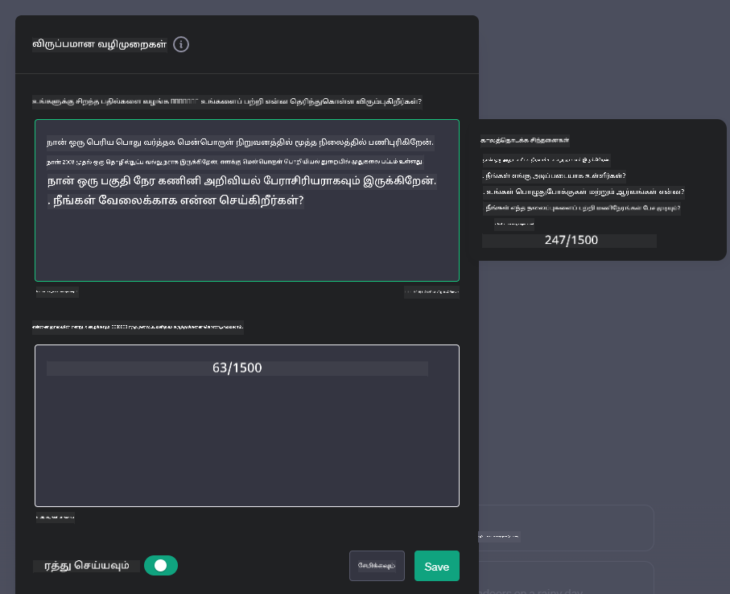
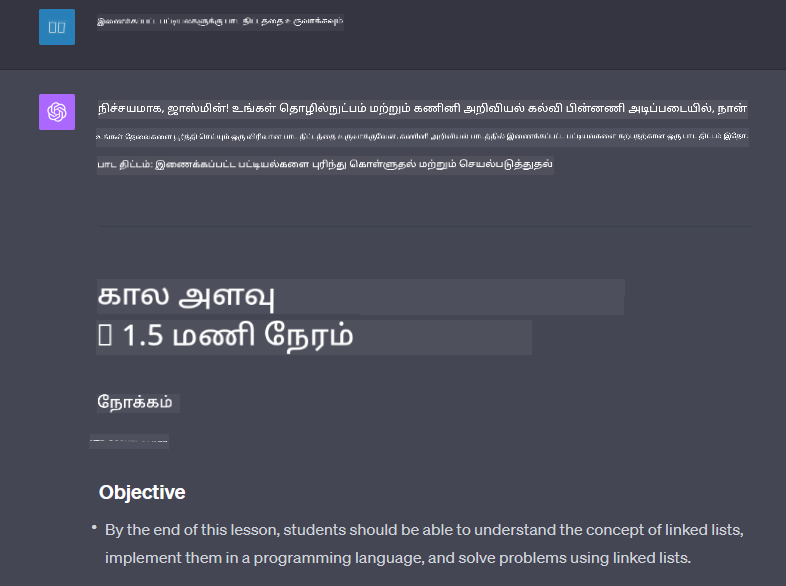

<!--
CO_OP_TRANSLATOR_METADATA:
{
  "original_hash": "a5308963a56cfbad2d73b0fa99fe84b3",
  "translation_date": "2025-10-18T02:43:05+00:00",
  "source_file": "07-building-chat-applications/README.md",
  "language_code": "ta"
}
-->
# ஜெனரேட்டிவ் AI-இன் சக்தியுடன் கூடிய உரையாடல் பயன்பாடுகளை உருவாக்குதல்

[](https://youtu.be/R9V0ZY1BEQo?si=IHuU-fS9YWT8s4sA)

> _(மேலே உள்ள படத்தை கிளிக் செய்து இந்த பாடத்தின் வீடியோவைப் பாருங்கள்)_

நாம் உரை உருவாக்க பயன்பாடுகளை உருவாக்குவது எப்படி என்பதைப் பார்த்த பிறகு, உரையாடல் பயன்பாடுகளைப் பற்றி பார்ப்போம்.

உரையாடல் பயன்பாடுகள் எங்கள் தினசரி வாழ்க்கையில் ஒருங்கிணைக்கப்பட்டுள்ளன, சாதாரண உரையாடலுக்கு மேல் பலவகையான பயன்பாடுகளை வழங்குகின்றன. இவை வாடிக்கையாளர் சேவை, தொழில்நுட்ப ஆதரவு, மற்றும் கூடுதல் அறிவார்ந்த ஆலோசனை அமைப்புகளின் முக்கிய பகுதிகளாக மாறியுள்ளன. சமீபத்தில் நீங்கள் ஒரு உரையாடல் பயன்பாட்டிலிருந்து உதவியைப் பெற்றிருக்க வாய்ப்பு உள்ளது. ஜெனரேட்டிவ் AI போன்ற மேம்பட்ட தொழில்நுட்பங்களை இந்த தளங்களில் ஒருங்கிணைக்கும் போது, சிக்கலானது அதிகரிக்கிறது, அதேபோல் சவால்களும் அதிகரிக்கின்றன.

நாம் பதிலளிக்க வேண்டிய சில கேள்விகள்:

- **பயன்பாட்டை உருவாக்குதல்**. இந்த AI-இன் சக்தியுடன் கூடிய பயன்பாடுகளை குறிப்பிட்ட பயன்பாடுகளுக்கு எவ்வாறு திறமையாக உருவாக்கி, ஒருங்கிணைக்க முடியும்?
- **கண்காணிப்பு**. பயன்பாட்டை செயல்படுத்திய பிறகு, செயல்பாடு மற்றும் [பொறுப்பான AI-இன் ஆறு கொள்கைகள்](https://www.microsoft.com/ai/responsible-ai?WT.mc_id=academic-105485-koreyst) ஆகியவற்றில் உயர் தரத்தை உறுதிப்படுத்த எவ்வாறு கண்காணிக்க முடியும்?

தானியக்கத்தால் மற்றும் மனித-இயந்திர தொடர்புகளின் சீரற்ற தன்மையால் வரையறுக்கப்படும் ஒரு காலத்திற்கு நாம் மேலும் நகரும் போது, ஜெனரேட்டிவ் AI உரையாடல் பயன்பாடுகளின் பரப்பளவு, ஆழம் மற்றும் தழுவல் ஆகியவற்றை எவ்வாறு மாற்றுகிறது என்பதைப் புரிந்துகொள்வது அவசியமாகிறது. இந்த பாடம் இந்த சிக்கலான அமைப்புகளை ஆதரிக்கும் கட்டமைப்பின் அம்சங்களை ஆராயும், துறைக்கு சிறப்பான பணிகளுக்காக அவற்றை நன்றாக அமைப்பதற்கான முறைமைகள் மற்றும் பொறுப்பான AI செயல்பாட்டை உறுதிப்படுத்துவதற்கான அளவீடுகள் மற்றும் கருத்துக்களை மதிப்பீடு செய்யும்.

## அறிமுகம்

இந்த பாடம் கற்றுக்கொடுக்கிறது:

- உரையாடல் பயன்பாடுகளை திறமையாக உருவாக்கி, ஒருங்கிணைப்பதற்கான தொழில்நுட்பங்கள்.
- பயன்பாடுகளில் தனிப்பயனாக்கல் மற்றும் நன்றாக அமைப்பதை எவ்வாறு பயன்படுத்துவது.
- உரையாடல் பயன்பாடுகளை திறமையாக கண்காணிக்க மற்றும் பராமரிக்க உகந்த உத்திகள் மற்றும் கருத்துக்கள்.

## கற்றல் இலக்குகள்

இந்த பாடத்தின் முடிவில், நீங்கள்:

- உள்ளமைந்த அமைப்புகளில் உரையாடல் பயன்பாடுகளை உருவாக்கி, ஒருங்கிணைப்பதற்கான கருத்துக்களை விளக்க முடியும்.
- குறிப்பிட்ட பயன்பாடுகளுக்காக உரையாடல் பயன்பாடுகளை தனிப்பயனாக்க முடியும்.
- AI-இன் சக்தியுடன் கூடிய உரையாடல் பயன்பாடுகளின் தரத்தை திறமையாக கண்காணித்து பராமரிக்க முக்கியமான அளவீடுகள் மற்றும் கருத்துக்களை அடையாளம் காண முடியும்.
- உரையாடல் பயன்பாடுகள் AI-ஐ பொறுப்புடன் பயன்படுத்துவதை உறுதிப்படுத்த முடியும்.

## ஜெனரேட்டிவ் AI-ஐ உரையாடல் பயன்பாடுகளில் ஒருங்கிணைத்தல்

ஜெனரேட்டிவ் AI மூலம் உரையாடல் பயன்பாடுகளை மேம்படுத்துவது அவற்றை புத்திசாலியாக மாற்றுவதில் மட்டுமல்ல; இது ஒரு தரமான பயனர் அனுபவத்தை வழங்குவதற்காக அவற்றின் கட்டமைப்பு, செயல்திறன் மற்றும் பயனர் இடைமுகத்தை மேம்படுத்துவதில் உள்ளது. இது கட்டமைப்பு அடிப்படைகள், API ஒருங்கிணைப்புகள் மற்றும் பயனர் இடைமுக கருத்துக்களை ஆராய்வதை உள்ளடக்கியது. இந்த பகுதி இந்த சிக்கலான சூழல்களை வழிநடத்துவதற்கான விரிவான சாலை வரைபடத்தை உங்களுக்கு வழங்குவதை நோக்கமாகக் கொண்டுள்ளது, நீங்கள் அவற்றை உள்ளமைந்த அமைப்புகளில் இணைக்கிறீர்களா அல்லது தனித்துவமான தளங்களாக உருவாக்குகிறீர்களா என்பதை பொருத்து.

இந்த பகுதியின் முடிவில், நீங்கள் உரையாடல் பயன்பாடுகளை திறமையாக உருவாக்கி, ஒருங்கிணைக்க தேவையான நிபுணத்துவத்துடன் தயாராக இருப்பீர்கள்.

### சாட்பாட் அல்லது உரையாடல் பயன்பாடு?

உரையாடல் பயன்பாடுகளை உருவாக்குவதற்கு முன், 'சாட்பாட்கள்' மற்றும் 'AI-இன் சக்தியுடன் கூடிய உரையாடல் பயன்பாடுகள்' ஆகியவற்றை ஒப்பிடுவோம், அவை தனித்துவமான பங்களிப்புகள் மற்றும் செயல்பாடுகளை வழங்குகின்றன. சாட்பாட்-இன் முக்கிய நோக்கம் குறிப்பிட்ட உரையாடல் பணிகளை தானியக்கமாக்குவது, உதாரணமாக அடிக்கடி கேட்கப்படும் கேள்விகளுக்கு பதிலளிக்க அல்லது ஒரு தொகுப்பை கண்காணிக்க. இது பொதுவாக விதிமுறை அடிப்படையிலான தர்க்கம் அல்லது சிக்கலான AI அல்காரிதம்களால் இயக்கப்படுகிறது. மாறாக, AI-இன் சக்தியுடன் கூடிய உரையாடல் பயன்பாடு என்பது மனித பயனர்களிடையே உரை, குரல் மற்றும் வீடியோ உரையாடல்களின் பல்வேறு வடிவங்களை வசதியாக்குவதற்காக வடிவமைக்கப்பட்ட ஒரு பரந்த சூழல் ஆகும். அதன் வரையறுக்கப்பட்ட அம்சம், ஜெனரேட்டிவ் AI மாடலை ஒருங்கிணைத்தல் ஆகும், இது நுணுக்கமான, மனிதனுக்கு ஒத்த உரையாடல்களை உருவாக்குகிறது, பல்வேறு உள்ளீடுகள் மற்றும் சூழல் குறிப்புகளின் அடிப்படையில் பதில்களை உருவாக்குகிறது. ஜெனரேட்டிவ் AI-இன் சக்தியுடன் கூடிய உரையாடல் பயன்பாடு திறந்த-கள உரையாடல்களில் ஈடுபட முடியும், உரையாடல் சூழல்களை மேம்படுத்த முடியும், மேலும் படைப்பாற்றல் அல்லது சிக்கலான உரையாடல்களை உருவாக்க முடியும்.

கீழே உள்ள அட்டவணை, டிஜிட்டல் தொடர்பு துறையில் அவற்றின் தனித்துவமான பங்களிப்புகளை நமக்கு புரிந்துகொள்ள உதவ, முக்கியமான வேறுபாடுகள் மற்றும் ஒற்றுமைகளை விளக்குகிறது.

| சாட்பாட்                              | ஜெனரேட்டிவ் AI-இன் சக்தியுடன் கூடிய உரையாடல் பயன்பாடு |
| ------------------------------------- | -------------------------------------- |
| பணிக்கு மையமாகவும் விதிமுறைகளின் அடிப்படையிலும் | சூழலுக்கு உணர்வு கொண்டது |
| பெரும்பாலும் பெரிய அமைப்புகளில் ஒருங்கிணைக்கப்படுகிறது | ஒன்று அல்லது பல சாட்பாட்களை உள்ளடக்கலாம் |
| நிரல்படுத்தப்பட்ட செயல்பாடுகளுக்கு மட்டுமே வரையறுக்கப்பட்டுள்ளது | ஜெனரேட்டிவ் AI மாடல்களை ஒருங்கிணைக்கிறது |
| சிறப்பு மற்றும் கட்டமைக்கப்பட்ட தொடர்புகள் | திறந்த-கள உரையாடல்களை நடத்த முடியும் |

### SDKகள் மற்றும் APIகளுடன் முன்பே உருவாக்கப்பட்ட செயல்பாடுகளை பயன்படுத்துதல்

ஒரு உரையாடல் பயன்பாட்டை உருவாக்கும்போது, முதலில் என்ன இருக்கிறது என்பதை மதிப்பீடு செய்வது ஒரு சிறந்த படியாகும். SDKகள் மற்றும் APIகளை பயன்படுத்தி உரையாடல் பயன்பாடுகளை உருவாக்குவது பல்வேறு காரணங்களுக்காக ஒரு நன்மையான உத்தியாகும். நன்கு ஆவணப்படுத்தப்பட்ட SDKகள் மற்றும் APIகளை ஒருங்கிணைப்பதன் மூலம், நீங்களின் பயன்பாட்டை நீண்டகால வெற்றிக்காக மூலதனமாக்கி, அளவீடு மற்றும் பராமரிப்பு கவலைகளைத் தீர்க்கிறீர்கள்.

- **உருவாக்க செயல்முறையை விரைவுபடுத்தி, செலவுகளை குறைக்கும்**: உங்கள் பயன்பாட்டின் மற்ற முக்கியமான அம்சங்களில் கவனம் செலுத்த அனுமதிக்கும் முன்பே உருவாக்கப்பட்ட செயல்பாடுகளை நம்புவது, உங்களால் உருவாக்க முடியாத செலவான செயல்முறையை தவிர்க்க உதவுகிறது.
- **சிறந்த செயல்திறன்**: செயல்பாட்டை அடிப்படையில் உருவாக்கும்போது, "இது அளவீடு செய்யப்படுமா? பயனர்களின் திடீர் வருகையை இந்த பயன்பாடு கையாள முடியுமா?" என்ற கேள்வி உங்களிடம் எழும். நன்கு பராமரிக்கப்பட்ட SDK மற்றும் APIகளில் இந்த கவலைகளுக்கான தீர்வுகள் அடங்கியிருக்கும்.
- **எளிய பராமரிப்பு**: மேம்பாடுகள் மற்றும் மேம்பாடுகளை நிர்வகிக்க எளிதாக இருக்கும், ஏனெனில் பெரும்பாலான APIகள் மற்றும் SDKகள் புதிய பதிப்பு வெளியிடப்படும் போது ஒரு நூலகத்தை மேம்படுத்த வேண்டும்.
- **சமீபத்திய தொழில்நுட்பத்தை அணுகுதல்**: விரிவான தரவுத்தொகுப்புகளில் நன்றாக அமைக்கப்பட்டு பயிற்சி அளிக்கப்பட்ட மாடல்களை பயன்படுத்துவது உங்கள் பயன்பாட்டிற்கு இயற்கை மொழி திறன்களை வழங்குகிறது.

SDK அல்லது API-யின் செயல்பாட்டை அணுகுவது பொதுவாக வழங்கப்பட்ட சேவைகளைப் பயன்படுத்த அனுமதி பெறுவது, இது பெரும்பாலும் தனித்துவமான விசை அல்லது அங்கீகார டோக்கன் மூலம் செய்யப்படுகிறது. OpenAI Python Library-ஐப் பயன்படுத்தி இது எப்படி இருக்கும் என்பதை ஆராய்வோம். இந்த பாடத்திற்கான [OpenAI-க்கு Python நோட்புக்](./python/oai-assignment.ipynb?WT.mc_id=academic-105485-koreyst) அல்லது [Azure OpenAI Services-க்கு Python நோட்புக்](./python/aoai-assignment.ipynb?WT.mc_id=academic-105485-koreys) ஆகியவற்றில் நீங்கள் இதை முயற்சிக்கலாம்.

```python
import os
from openai import OpenAI

API_KEY = os.getenv("OPENAI_API_KEY","")

client = OpenAI(
    api_key=API_KEY
    )

chat_completion = client.chat.completions.create(model="gpt-3.5-turbo", messages=[{"role": "user", "content": "Suggest two titles for an instructional lesson on chat applications for generative AI."}])
```

மேலே உள்ள எடுத்துக்காட்டில் GPT-3.5 Turbo மாடல் ப்ராம்ப்ட்டை முடிக்க பயன்படுத்தப்படுகிறது, ஆனால் API விசை அமைக்கப்பட்டிருப்பதை கவனிக்கவும். நீங்கள் விசையை அமைக்கவில்லை என்றால் பிழை வரும்.

## பயனர் அனுபவம் (UX)

பொதுவான UX கொள்கைகள் உரையாடல் பயன்பாடுகளுக்கு பொருந்துகின்றன, ஆனால் இயந்திர கற்றல் கூறுகள் உள்ளதால் குறிப்பாக முக்கியமான சில கூடுதல் கருத்துக்கள் உள்ளன.

- **தெளிவின்மையைத் தீர்க்கும் முறை**: ஜெனரேட்டிவ் AI மாடல்கள் சில நேரங்களில் தெளிவற்ற பதில்களை உருவாக்கும். பயனர்கள் இந்த பிரச்சினையை எதிர்கொள்வதற்கான விளக்கத்தை கேட்கும் அம்சம் உதவியாக இருக்கலாம்.
- **சூழல் நினைவில் வைத்தல்**: மேம்பட்ட ஜெனரேட்டிவ் AI மாடல்கள் உரையாடலின் சூழலை நினைவில் வைத்திருக்க முடியும், இது பயனர் அனுபவத்திற்கு ஒரு தேவையான சொத்து ஆகும். பயனர்களுக்கு சூழலைக் கட்டுப்படுத்தி நிர்வகிக்க அனுமதிப்பது பயனர் அனுபவத்தை மேம்படுத்துகிறது, ஆனால் உணர்வுபூர்வமான பயனர் தகவல்களை நினைவில் வைத்திருக்கும் அபாயத்தை அறிமுகப்படுத்துகிறது. இந்த தகவல் எவ்வளவு நேரம் சேமிக்கப்படும் என்பதற்கான கருத்துக்கள், சூழலின் தேவையை தனியுரிமைக்கு எதிராக சமநிலைப்படுத்த உதவலாம்.
- **தனிப்பயனாக்கல்**: கற்றுக்கொண்டு தழுவும் திறனுடன், AI மாடல்கள் ஒரு பயனருக்கு தனிப்பட்ட அனுபவத்தை வழங்குகின்றன. பயனர் சுயவிவரங்கள் போன்ற அம்சங்களின் மூலம் பயனர் அனுபவத்தை தனிப்பயனாக்குவது பயனரை புரிந்துகொள்ளும் உணர்வை மட்டுமல்லாமல், குறிப்பிட்ட பதில்களைத் தேடுவதில் அவர்களின் முயற்சிக்கு உதவுகிறது, மேலும் ஒரு திறமையான மற்றும் திருப்திகரமான தொடர்பை உருவாக்குகிறது.

OpenAI-இன் ChatGPT-இல் "Custom instructions" அமைப்புகள் தனிப்பயனாக்கலின் ஒரு உதாரணமாகும். இது உங்கள் ப்ராம்ப்ட்டுக்கு முக்கியமான சூழல் தகவல்களை வழங்க அனுமதிக்கிறது. இதோ ஒரு Custom instruction-இன் உதாரணம்.



இந்த "சுயவிவரம்" ChatGPT-ஐ லிங்க்ட் லிஸ்ட்கள் பற்றிய பாட திட்டத்தை உருவாக்குமாறு தூண்டுகிறது. பயனர் தனது அனுபவத்தின் அடிப்படையில் மேலும் விரிவான பாட திட்டத்தை விரும்பலாம் என்பதை ChatGPT கவனத்தில் எடுத்துக்கொள்வதை கவனிக்கவும்.



### மைக்ரோசாஃப்ட்-இன் பெரிய மொழி மாடல்களுக்கான சிஸ்டம் மெசேஜ் அமைப்பு

[மைக்ரோசாஃப்ட் வழிகாட்டுதலை வழங்கியுள்ளது](https://learn.microsoft.com/azure/ai-services/openai/concepts/system-message#define-the-models-output-format?WT.mc_id=academic-105485-koreyst) LLMகளின் பதில்களை உருவாக்குவதற்கான பயனுள்ள சிஸ்டம் மெசேஜ்களை எழுதுவதற்கான 4 பகுதிகளாக:

1. மாடல் யாருக்காகவும், அதன் திறன்களும், வரையறைகளும் என்ன என்பதை வரையறுத்தல்.
2. மாடலின் வெளியீட்டு வடிவத்தை வரையறுத்தல்.
3. மாடலின் நோக்கமுள்ள நடத்தை விளக்குவதற்கான குறிப்பிட்ட உதாரணங்களை வழங்குதல்.
4. கூடுதல் நடத்தை பாதுகாப்பு வழிகாட்டுதல்களை வழங்குதல்.

### அணுகல் வசதி

ஒரு பயனருக்கு பார்வை, கேட்கும் திறன், இயக்கம் அல்லது அறிவாற்றல் குறைபாடுகள் இருந்தாலும், நன்கு வடிவமைக்கப்பட்ட உரையாடல் பயன்பாடு அனைவராலும் பயன்படுத்தக்கூடியதாக இருக்க வேண்டும். கீழே உள்ள பட்டியல் பல்வேறு பயனர் குறைபாடுகளுக்கான அணுகல் வசதியை மேம்படுத்தும் குறிப்பிட்ட அம்சங்களைப் பிரிக்கிறது.

- **பார்வை குறைபாடுகளுக்கான அம்சங்கள்**: அதிக மாறுபாட்டுடைய தீம்கள் மற்றும் அளவான உரை, திரை வாசகர் இணக்கத்தன்மை.
- **கேட்கும் திறன் குறைபாடுகளுக்கான அம்சங்கள்**: உரை-குரல் மற்றும் குரல்-உரை செயல்பாடுகள், ஆடியோ அறிவிப்புகளுக்கான காட்சி குறிப்புகள்.
- **இயக்க குறைபாடுகளுக்கான அம்சங்கள்**: கீபோர்டு வழிகாட்டல் ஆதரவு, குரல் கட்டளைகள்.
- **அறிவாற்றல் குறைபாடுகளுக்கான அம்சங்கள்**: எளிமையான மொழி விருப்பங்கள்.

## துறைக்கு சிறப்பான மொழி மாடல்களுக்கான தனிப்பயனாக்கல் மற்றும் நன்றாக அமைத்தல்

உங்கள் நிறுவனத்தின் சொற்களஞ்சியத்தைப் புரிந்துகொண்டு, அதன் பயனர் அடிப்படையில் பொதுவாக உள்ள கேள்விகளை எதிர்பார்க்கும் ஒரு உரையாடல் பயன்பாட்டை கற்பனை செய்யுங்கள். குறிப்பிடத்தக்க இரண்டு அணுகுமுறைகள் உள்ளன:

- **DSL மாடல்களை பயன்படுத்துதல்**. DSL என்பது துறைக்கு சிறப்பான மொழி என்று பொருள். இது குறிப்பிட்ட துறையின் கருத்துக்கள் மற்றும் சூழல்களைப் புரிந்துகொள்வதற்காக பயிற்சி அளிக்கப்பட்ட மாடலை பயன்படுத்தலாம்.
- **நன்றாக அமைத்தல்**. நன்றாக அமைத்தல் என்பது உங்கள் மாடலை குறிப்பிட்ட தரவுடன் மேலும் பயிற்சி அளிக்கும் செயல்முறையாகும்.

## தனிப்பயனாக்கல்: DSL-ஐ பயன்படுத்துதல்

துறைக்கு சிறப்பான மொழி மாடல்களை (DSL Models) பயன்படுத்துவது பயனர்களின் ஈடுபாட்டை மேம்படுத்தி, சிறப்பு மற்றும் சூழலுக்கு பொருந்தக்கூடிய தொடர்புகளை வழங்குகிறது. இது ஒரு குறிப்பிட்ட துறை, தொழில் அல்லது பொருள் தொடர்பான உரையைப் புரிந்துகொண்டு உருவாக்க பயிற்சி அளிக்கப்பட்ட அல்லது நன்றாக அமைக்கப்பட்ட மாடல் ஆகும். DSL மாடலைப் பயன்படுத்துவதற்கான விருப்பங்கள் ஒன்றை முற்றிலும் புதியதாக பயிற்சி அளிப்பது முதல், SDKகள் மற்றும் APIகளின் மூலம் முன்பே உள்ளவற்றை பயன்படுத்துவது வரை மாறுபடலாம். மற்றொரு விருப்பம், முன்பே பயிற்சி அளிக்கப்பட்ட மாடலை எடுத்துக்கொண்டு அதை ஒரு குறிப்பிட்ட துறைக்கு தழுவுதல் ஆகும்.

## தனிப்பயனாக்கல்: நன்றாக அமைத்தல்

முன்பே பயிற்சி அளிக்கப்பட்ட மாடல் ஒரு சிறப்பு துறை அல்லது குறிப்பிட்ட பணியில் குறைவாக இருக்கும் போது, நன்றாக அமைத்தல் பரிந்துரைக்கப்படுகிறது.

உதாரணமாக, மருத்துவ கேள்விகள் சிக்கலானவை மற்றும் நிறைய சூழல்களை தேவைப்படும். ஒரு மருத்துவ நிபுணர் ஒரு நோயாளியை கண்டறியும் போது, அது வாழ்க்கை முறை அல்லது முன்பே உள்ள நிலைகள் போன்ற பல காரணிகளின் அடிப்படையில் இருக்கும், மேலும் அவர்களின் கண்டறிதலை சரிபார்க்க சமீபத்திய மருத்துவ இதழ்களை நம்பலாம். இவ்வாறு நுணுக்கமான சூழல்களில், ஒரு பொதுவான நோக்கமுடைய AI உரையாடல் பயன்பாடு நம்பகமான ஆதாரமாக இருக்க முடியாது.

### சூழல்: ஒரு மருத்துவ பயன்பாடு

மருத்துவ நிபுணர்களுக்கு சிக
| **அசாதாரணத்தை கண்டறிதல்** | எதிர்பார்க்கப்படும் நடத்தைக்கு ஒத்துப்போகாத விசித்திரமான முறைமைகளை கண்டறிய உதவும் கருவிகள் மற்றும் தொழில்நுட்பங்கள். | நீங்கள் அசாதாரணங்களை எப்படி எதிர்கொள்வீர்கள்? |

### சொடுக்கல் பயன்பாடுகளில் பொறுப்பான AI நடைமுறைகளை செயல்படுத்துதல்

மைக்ரோசாஃப்ட் பொறுப்பான AI க்கு ஒரு அணுகுமுறையை உருவாக்கி, AI வளர்ச்சி மற்றும் பயன்பாட்டை வழிநடத்த 6 முக்கியக் கோட்பாடுகளை அடையாளம் கண்டுள்ளது. கீழே அந்த கோட்பாடுகள், அவற்றின் வரையறைகள் மற்றும் சொடுக்கல் அபிவிருத்தி செய்யும் நபர் கவனிக்க வேண்டிய விஷயங்கள் மற்றும் அவற்றை ஏன் முக்கியமாக எடுத்துக்கொள்ள வேண்டும் என்பதற்கான விளக்கங்கள் கொடுக்கப்பட்டுள்ளன.

| கோட்பாடுகள்              | மைக்ரோசாஃப்டின் வரையறை                                | சொடுக்கல் அபிவிருத்தி செய்யும் நபர் கவனிக்க வேண்டியவை                     | ஏன் இது முக்கியம்                                                                          |
| ---------------------- | ----------------------------------------------------- | ---------------------------------------------------------------------- | -------------------------------------------------------------------------------------- |
| நியாயம்                | AI அமைப்புகள் அனைவரையும் நியாயமாக நடத்த வேண்டும்.       | சொடுக்கல் பயன்பாடு பயனர் தரவின் அடிப்படையில் பாகுபாடு காட்டாததை உறுதிப்படுத்தவும். | பயனாளர்களிடையே நம்பகத்தன்மை மற்றும் ஒருமைப்பாட்டை உருவாக்க; சட்ட சிக்கல்களை தவிர்க்க. |
| நம்பகத்தன்மை மற்றும் பாதுகாப்பு | AI அமைப்புகள் நம்பகத்தன்மையுடன் மற்றும் பாதுகாப்பாக செயல்பட வேண்டும். | பிழைகள் மற்றும் அபாயங்களை குறைக்க சோதனை மற்றும் பாதுகாப்பு முறைகளை செயல்படுத்தவும். | பயனாளர் திருப்தியை உறுதிப்படுத்தி, சாத்தியமான சேதத்தைத் தடுக்கிறது.                  |
| தனியுரிமை மற்றும் பாதுகாப்பு | AI அமைப்புகள் பாதுகாப்பாகவும் தனியுரிமையை மதிக்கவும் வேண்டும். | வலுவான குறியாக்கம் மற்றும் தரவுப் பாதுகாப்பு நடவடிக்கைகளை செயல்படுத்தவும். | நெகிழ்ச்சியான பயனர் தரவுகளை பாதுகாக்கவும், தனியுரிமை சட்டங்களை பின்பற்றவும்.          |
| ஒருமைப்பாடு             | AI அமைப்புகள் அனைவரையும் அதிகாரமளித்து, மக்களை ஈர்க்க வேண்டும். | பல்வேறு பார்வையாளர்களுக்கு அணுகக்கூடிய மற்றும் எளிதாக பயன்படுத்தக்கூடிய UI/UX வடிவமைக்கவும். | பயன்பாட்டை பல்வேறு மக்களும் பயனுள்ளதாக பயன்படுத்த முடியும் என்பதை உறுதிப்படுத்துகிறது. |
| வெளிப்படைத்தன்மை        | AI அமைப்புகள் புரிந்துகொள்ளக்கூடியதாக இருக்க வேண்டும். | AI பதில்களுக்கு தெளிவான ஆவணங்கள் மற்றும் காரணங்களை வழங்கவும்.         | முடிவுகள் எவ்வாறு எடுக்கப்படுகின்றன என்பதைப் புரிந்துகொள்ளும்போது, ​​பயனாளர்கள் அமைப்பை நம்புவார்கள். |
| பொறுப்புத்தன்மை          | AI அமைப்புகளுக்கு மனிதர்கள் பொறுப்பாக இருக்க வேண்டும். | AI முடிவுகளை ஆய்வு செய்து மேம்படுத்த ஒரு தெளிவான செயல்முறையை நிறுவவும். | பிழைகள் ஏற்பட்டால் தொடர்ச்சியான மேம்பாடு மற்றும் திருத்த நடவடிக்கைகளை எடுக்க உதவுகிறது. |

## பணிக்கட்டளை

[பணிக்கட்டளை](../../../07-building-chat-applications/python) பார்க்கவும். இது உங்களை உங்கள் முதல் சொடுக்கல் கேள்விகளை இயக்குவதிலிருந்து, உரையை வகைப்படுத்துதல் மற்றும் சுருக்குதல் போன்ற பல பயிற்சிகளுக்கு வழிநடத்தும். கவனிக்கவும், இந்த பணிக்கட்டளைகள் பல்வேறு நிரலாக்க மொழிகளில் கிடைக்கின்றன!

## சிறந்த வேலை! பயணத்தை தொடருங்கள்

இந்த பாடத்தை முடித்த பிறகு, [Generative AI Learning collection](https://aka.ms/genai-collection?WT.mc_id=academic-105485-koreyst) ஐ பாருங்கள், உங்கள் Generative AI அறிவை மேலும் மேம்படுத்த!

பாடம் 8 க்கு செல்லுங்கள், [தேடல் பயன்பாடுகளை உருவாக்குவது எப்படி](../08-building-search-applications/README.md?WT.mc_id=academic-105485-koreyst) என்பதைப் பார்க்க!

---

**புறக்கணிப்பு**:  
இந்த ஆவணம் AI மொழிபெயர்ப்பு சேவை [Co-op Translator](https://github.com/Azure/co-op-translator) பயன்படுத்தி மொழிபெயர்க்கப்பட்டுள்ளது. நாங்கள் துல்லியத்திற்காக முயற்சிக்கின்றோம், ஆனால் தானியக்க மொழிபெயர்ப்புகளில் பிழைகள் அல்லது தவறுகள் இருக்கக்கூடும் என்பதை கவனத்தில் கொள்ளவும். அதன் தாய்மொழியில் உள்ள அசல் ஆவணம் அதிகாரப்பூர்வ மூலமாக கருதப்பட வேண்டும். முக்கியமான தகவல்களுக்கு, தொழில்முறை மனித மொழிபெயர்ப்பு பரிந்துரைக்கப்படுகிறது. இந்த மொழிபெயர்ப்பைப் பயன்படுத்துவதால் ஏற்படும் எந்த தவறான புரிதல்கள் அல்லது தவறான விளக்கங்களுக்கு நாங்கள் பொறுப்பல்ல.