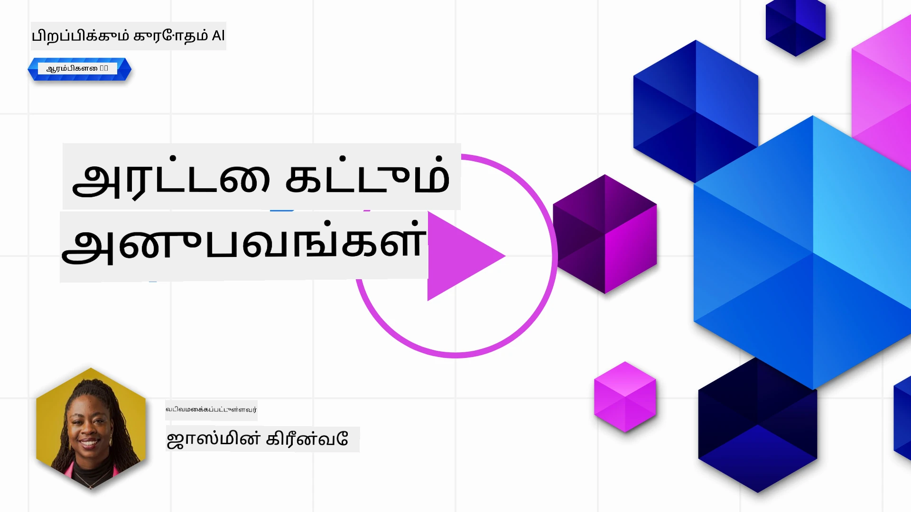
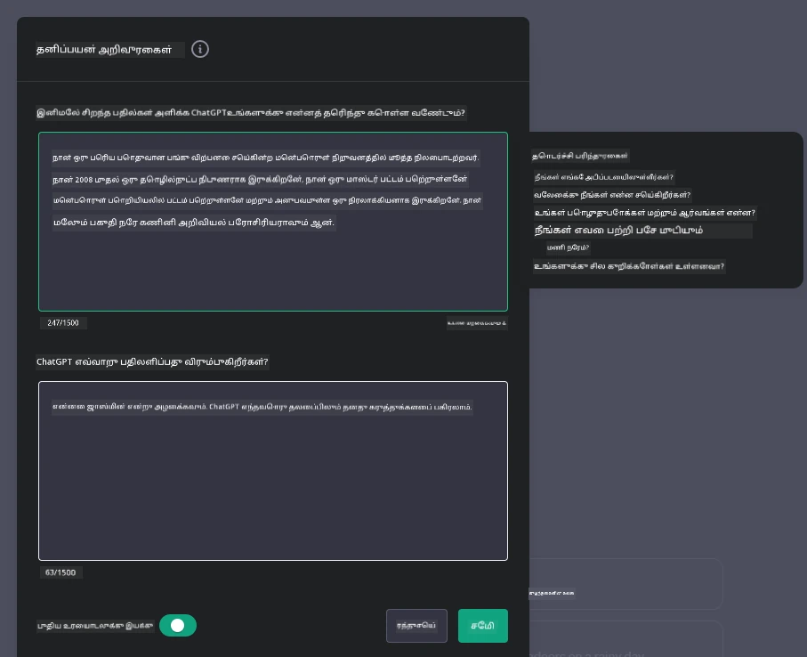

# உருவாக்கும் செயற்கை நுண்ணறிவால் இயக்கப்படும் உரையாடல் பயன்பாடுகள் கட்டுதல்

[](https://youtu.be/R9V0ZY1BEQo?si=IHuU-fS9YWT8s4sA)

> _(இந்த பாடத்தின் வீடியோவை பார்க்க மேலே உள்ள படத்தை கிளிக் செய்யவும்)_

இப்போது உரை உருவாகும் செயலிகளை எப்படி கட்ட முடியும் என்று பார்த்ததால், உரையாடல் பயன்பாடுகளுக்குள் பார்க்கலாம்.

உரையாடல் பயன்பாடுகள் நமது தினசரி வாழ்க்கையில் ஒருங்கிணைக்கப்பட்டுள்ளன, வெறும் சாதாரண உரையாடல் வழிகளுக்கு மேலாக. அவை வாடிக்கையாளர் சேவை, தொழில்நுட்ப ஆதரவு, மற்றும் அறிவுப் பரிந்துரைக் கணினி அமைப்புக்களின் அவசியமான பகுதிகளாக மாறிப் போய்யுள்ளன. நீங்கள் சமீபத்தில் ஒரு உரையாடல் பயன்பாட்டில் இருந்து உதவி பெற்றிருப்பீர்கள் என்பது சாத்தியம். உருவாக்கும் செயற்கை நுண்ணறிவின் போன்ற மேம்பட்ட தொழில்நுட்பங்களை இந்த தளங்களில் இணைக்கும் போது, சிக்கல்கள் அதிகரிக்கின்றன மற்றும் சவால்களும் அதிகரிக்கின்றன.

சில கேள்விகள் நமக்கு பதிலளிக்கப்பட வேண்டும்:

- **பயன்பாடுகளை கட்டுவது**. குறிப்பிட்ட பயன்பாட்டிற்கான தேவைகளுக்கு இந்த AI இயக்கப்பட்ட பயன்பாடுகளை எவ்வாறு திறம்பட கட்டி ஒருங்கிணைக்க முடியும்?
- **கண்காணித்தல்**. பயன்படுத்த ஆரம்பித்தவுடன், செயலிகள் சிறந்த தரத்தில் செயல்படுவதை செயல்திறன் மற்றும் [பொறுப்பான AI இன் ஆறு கொள்கைகள்](https://www.microsoft.com/ai/responsible-ai?WT.mc_id=academic-105485-koreyst) ஆகியவற்றுக்கு இணங்கினதா என்பதை எவ்வாறு கண்காணிப்பது?

தானியங்கி மற்றும் தெளிவான மனித-இயந்திர தொடர்புகளால் நிர்ணயிக்கபடும் காலத்துக்குள் செல்லும்போது, உருவாக்கும் AI எப்படி உரையாடல் பயன்பாடுகளின் பரப்பு, ஆழம் மற்றும் தழுவலுக்கு மாற்றம் செய்யும் என்பதை புரிந்து கொள்வது அவசியமாகிறது. இந்த பாடப்பிரிவு அந்தக் கூட்டு அமைப்புகளுக்கு ஆதரவு தரும் கட்டமைப்பு அம்சங்களை ஆராயும், கலைப்பிரிவுக்கேற்ப சிறந்த முறையில் கருப்பொருள் செய்யும் முறைகளைப் பார்க்கும், மற்றும் பொறுப்பான AI பயன்பாட்டிற்கான முக்கிய மதிப்பீடுகளையும் பரிசீலனைகளையும் மதிப்பிடும்.

## அறிமுகம்

இந்த பாடம் கொண்டு வரும்ோர்:

- உரையாடல் பயன்பாடுகளை திறம்பட கட்டி ஒருங்கிணைக்கும் தொழில்நுட்பங்கள்.
- செயலிகளுக்கு தனிப்பயன் மாற்றுதல் மற்றும் சிறப்படுத்தல் செய்வது எப்படி.
- உரையாடல் பயன்பாடுகளை திறம்பட கண்காணிக்கும் நடைமுறைகள் மற்றும் பரிசீலனைகள்.

## கற்றல் இலக்குகள்

இந்த பாடம் முடிவில், நீங்கள் செய்யக்கூடியவை:

- உள்ளமைக்கப்பட்ட அமைப்புகளில் உரையாடல் பயன்பாடுகளை கட்டி ஒருங்கிணைக்க வெளிப்படுத்தப்பட வேண்டிய கவனப்படுத்துக்களை விவரிக்க.
- குறிப்பிட்ட பயன்பாடுகளுக்கான உரையாடல் செயலிகளை தனிப்பயன் மாற்று செய்ய.
- AI இயங்கும் உரையாடல் செயலிகளின் தரத்தை திறம்பட கண்காணிக்கவும் பராமரிக்கவும் முக்கிய குறியீடுகள் மற்றும் பரிசீலனைகளை கண்டறிய.
- உரையாடல் செயலிகள் பொறுப்புடன் AI ஐ பயன்படுத்துவதை உறுதி செய்ய.

## உரையாடல் பயன்பாடுகளில் உருவாக்கும் AI ஐ ஒருங்கிணைப்பது

உருவாக்கும் AI மூலம் உரையாடல் செயலிகளை மேம்படுத்துவது அவற்றை மட்டுமே புத்திசாலிகரமாக மாற்றுவது அல்ல; தரமான பயனர் அனுபவத்தை வழங்க கூடிய கட்டமைப்பு, செயல்திறன் மற்றும் பயனர் இடைமுகத்தை மேம்படுத்தல் ஆகும். இது கட்டமைப்புப் அடித்தளங்கள், API ஒருங்கிணைப்புகள், மற்றும் பயனர் இடைமுக பரிசீலனைகளை ஆராய்கிறது. நீங்கள் இதை இயங்கும் அமைப்புகளில் இணைக்கவோ அல்லது தனி தளமாக கட்டியோ இந்த சிக்கலான சூழல்களை சமாளிக்க முழுமையான வழிகாட்டியைக் கொடுக்க இந்த பகுதியில் நோக்கமுள்ளது.

இந்தப் பகுதிக்குப் பின், நீங்கள் உரையாடல் செயலிகளை திறம்பட கட்டி ஒருங்கிணைக்க தேவையான நிபுணத்துவத்துடன் இருக்கவிருப்பீர்கள்.

### உரையாடல் பாட்டோஆர் அல்லது உரையாடல் பயன்பாடு?

உரையாடல் செயலிகளை கட்டுவதற்கு முன், இணைய உரையாடல் பாட்டோஆர்களைப் 'AI இயக்கும் உரையாடல் செயலிகளுடன்' ஒப்பிட்டு பாருங்கள், அவை வேறுபட்ட பங்கு மற்றும் செயல்களைக் கொண்டிருக்கின்றன. ஒரு உரையாடல் பாட்டோஆர் முக்கிய நோக்கம் குறிப்பிட்ட உரையாடல் பணிகளை தானாகச் செய்யும், உதாரணமாக அடிக்கடி கேட்கப்படும் கேள்விகளுக்கு பதிலளித்தல் அல்லது ஒரு தொகுப்பைக் கண்டறிதல். அது பொதுவாக விதிமுறைக்கேற்ப அல்லது குறுஞ்செயற்கை நுண்ணறிவு சிக்கலான கணAlgorithmகளால் இயக்கப்படுகிறது. மாறாக, AI இயக்கும் உரையாடல் பயன்பாடு என்பது டிஜிட்டல் தொடர்பின் வெவ்வேறு வடிவங்கள், உரை, குரல், மற்றும் வீடியோ உரையாடல்களை மனித பயனர்களுக்குள் வழங்க வரைவிடும் ஆழமான சூழல் ஆகும். அதின் முக்கிய அம்சம் உருவாக்கும் AI மாதிரியை ஒருங்கிணைத்தல், அதுவே நுணுக்கமான, மனிதனான பேச்சுக்களைப் பதிவு செய்து பல்வேறு உள்ளீடு மற்றும் சூழல் சுடுகாடுகளின் அடிப்படையில் பதில்கள் உருவாக்கும். ஒரு உருவாக்கும் AI இயக்கும் உரையாடல் பயன்பாடு திறந்த-வட்ட உரையாடல்களில் பங்கு பெறலாம், உரையாடல் சூழலை மாற்றிக்கொள்ளும், மற்றும் படைப்பாற்றல் அல்லது சிக்கலான உரையாடலை உருவாக்க கூடும்.

கீழே உள்ள அட்டவணை அவற்றின் தனித்துவமான புள்ளிகளையும் மற்றும் இணைப்புகளையும் விளக்குகிறது, மற்றும் அவற்றின் வேறுபட்ட பங்களிப்பை புரிந்துகொள்ள உதவுகிறது.

| உரையாடல் பாட்டோஆர்                     | உருவாக்கும் AI இயக்கும் உரையாடல் பயன்பாடு        |
| ------------------------------------- | -------------------------------------- |
| பணிக்கேந்திரமான மற்றும் விதி அடிப்படையிலானது          | சூழல் அணுகும்                               |
| பெரும்பாலும் பெரிய அமைப்புகளில் இணைக்கப்பட்டது           | ஒரு அல்லது பல உரையாடல் பாட்டோஆர்களை விருந்தினராக கொண்டு இருக்கக்கூடும் |
| நிரலிட்ட செயல்பாடுகளுக்கு மட்டுமே வரம்பிட்டது        | உருவாக்கும் AI மாதிரிகளை உள்ளடக்கியது       |
| சிறப்பு மற்றும் கட்டமைக்கப்பட்ட தொடர்புகள்          | திறந்த-வட்ட உரையாடல்களில் திறன் பெற்றது      |

### SDK கள் மற்றும் API களைப் பயன்படுத்தி முன்பதிவு செய்யப்பட்ட செயல்பாடுகளை பயன்படுத்து

உரையாடல் பயன்பாட்டை கட்டும் போது, ஏற்கனவே உள்ளதை மதிப்பாய்வு செய்வது நல்ல முதலுச்செயல். SDK க்கள் மற்றும் API களைப் பயன்படுத்தி உரையாடல் செயலிகளை கட்டுவது பல நன்மைகளை வழங்கும். நன்கு ஆவணபூர்வமாகக் கொடுக்கப்பட்ட SDK கள் மற்றும் API களை இணைப்பதன் மூலம், நீண்டகால வெற்றிக்காக உங்கள் பயன்பாட்டை நுட்பமாக வைக்கிறீர்கள், நீட்டிப்புச் சிக்கல்கள் மற்றும் பராமரிப்பு கவலைகளை உரிய முறையில் கையாள்கிறீர்கள்.

- **வளர்ச்சி செயல்முறையை விரைவாக்கி சுவாரம் குறைக்கும்**: தாங்களே கட்ட வேண்டிய செலவான செயல்முறையை தவிர்க்க முன்பதிவுசெய்யப்பட்ட செயல்பாடுகளை பயன்படுத்துவது, வியாபார நியமங்களைப் போன்ற மற்ற பகுதிகளுக்கு கவனம் செலுத்த உதவும்.
- **மேம்பட்ட செயல்திறன்**: பணியை முற்றிலும் புதிதாக கட்டும்போது, "எவ்வாறு அது நீட்டிப்பது? பயனர்கள் வெட்குதலாகக் கூடியபோது செயலி கையாள முடியுமா?" என்று கேட்க நேரிடும். நல்ல பராமரிக்கப்பட்ட SDK கள் மற்றும் API களில் இதற்கான தீர்வுகள் உள்ளன.
- **பராமரிப்பு எளிதாகும்**: புதுப்பிப்புகள் மற்றும் மேம்பாடுகள் நிர்வகிக்க எளிதாக இருக்கும், பெரும்பாலும் API கள் மற்றும் SDK கள் புத்தம் புதிய பதிப்புக்கு புத்தகநூலை (library) மட்டும் புதுப்பிக்கவேண்டும்.
- **எச்சரைக் தொழில்நுட்ப அணுகல்**: பரந்த தரவுத்தொகுப்புகளில் பயிற்றப்பட்ட மற்றும் நுட்பமாக சரிசெய்யப்பட்ட மாதிரிகள் உங்கள் பயன்பாட்டுக்கு இயற்கை மொழி திறன்களை வழங்கும்.

SDK அல்லது API செயல்பாட்டு அணுகல் பொதுவாக வழங்கப்பட்ட சேவைகளைப் பயன்படுத்த அனுமதியை பெறுதல் மூலம் நடைபெறும், அது பெரும்பாலும் தனித்துவமான சாவி அல்லது அங்கீகார குறியீடு மூலம். இது எப்படி இருப்பதைக் காண OpenAI Python நூலகத்தை நாம்பாருங்கும். மீண்டும், நீங்கள் அதைப் பின்வரும் [OpenAI குறிப்பேடு](./python/oai-assignment.ipynb?WT.mc_id=academic-105485-koreyst) அல்லது [Azure OpenAI சேவைகள் குறிப்பேடு](./python/aoai-assignment.ipynb?WT.mc_id=academic-105485-koreys) இல் தனியாக முயற்சி செய்யலாம்.

```python
import os
from openai import OpenAI

API_KEY = os.getenv("OPENAI_API_KEY","")

client = OpenAI(
    api_key=API_KEY
    )

response = client.responses.create(model="gpt-4o-mini", input="Suggest two titles for an instructional lesson on chat applications for generative AI.", store=False)
print(response.output_text)
```

மேற்கண்ட எடுத்துக்காட்டு GPT-4o மினி மாதிரியை Responses API உடனும் இண்டுபடுத்துகிறது, ஆனால் API சாவி முன் அமைக்கப்படுகிறது என்பதை கவனியுங்கள். நீங்கள் சாவியை அமைக்காமல் இருந்தால் பிழை வருகிறது.

## பயனர் அனுபவம் (UX)

பொது UX கொள்கைகள் உரையாடல் செயலிகளில் பொருந்தும், ஆனால் இயந்திர கற்றல் கூறுகளால் குறிப்பாக முக்கியமாய் சில கூடுதல் பரிசீலனைகள் உள்ளன.

- **புதிர்ந்த நிலைதிலிருந்து விடைப்பதற்கான முறைகள்**: உருவாக்கும் AI மாதிரிகள் சில நேரங்களில் குழப்பமான பதில்களை உருவாக்கலாம். பயனர்கள் தெளிவுபடுத்த கேட்கும் வசதி இருந்தால் அது உதவும்.
- **சூழல் மாறுதல்கள் நினைவில் வைப்பது**: மேம்பட்ட உருவாக்கும் AI மாதிரிகள் உரையாடலின் சூழலை நினைவில் வைத்துக்கொள்ளும் திறன் கொண்டவை, இது பயனர் அனுபவத்திற்கு முக்கியம். சூழலை கட்டுப்படுத்தி நிர்வகிப்பது பயனர்களுக்கு கட்டுப்பாடு தருகிறது, ஆனால் தான் முக்கியமான தகவல்களை குறித்துக்கொள்ளும் ஆபத்து உள்ளது. அந்த தகவல்கள் எவ்வளவு காலம் சேமிக்கப்படும் என்பது போன்ற கொள்கைகளை அறிமுகப்படுத்தி தனியுரிமையைக் காக்கலாம்.
- **தனிப்பயனாக்கம்**: கற்றல் மற்றும் தழுவல் திறனுடன், AI மாதிரிகள் தனிப்பட்ட அனுபவத்தைக் கொடுக்கும். பயனர் சுயவிவரங்கள் போன்ற அம்சங்களால் அனுபவத்தை தனிப்பயனாக்குவதே பயனர் புரிந்துகொண்டதைச் போல உணர வைக்கிறது மற்றும் தேட முயற்சிப்பதை கூறுபவர் சிறப்பாக உதவுகிறது.

தனிப்பயனாக்கத்தின் ஒரு உதாரணம் OpenAI ChatGPT இல் உள்ள "Custom instructions" அமைப்பாகும். இது உங்கள் சிறந்த உதவிக்கான தொடர்புடைய சில தகவல்களை வழங்க அனுமதிக்கிறது. கீழே ஒரு தனிப்பயன் அறிவுரையின் எடுத்துக்காட்டு உள்ளது.



இந்த "சுயவிவரம்" ChatGPT ஐ கட்டம் சார்ந்த பட்டியல் பற்றிய பாடத் திட்டத்தை உருவாக்கும் என்பதற்கு தூண்டுகிறது. பயனர் அனுபவத்தை, குறிப்பாக அவളുടെ அனுபவத்தின்படி விரிவான பாடத் திட்டம் வேண்டும் என்பதையும் ChatGPT கவனிக்கிறது.


### பெரிய மொழி மாதிரிக்கான Microsoft இன் சிஸ்டம் மெசேஜ் கட்டமைப்பு

[Microsoft வழங்கிய வழிகாட்டல்](https://learn.microsoft.com/azure/ai-services/openai/concepts/system-message#define-the-models-output-format?WT.mc_id=academic-105485-koreyst) LLM கள் பதில் தயாரிக்கும் போது சிறந்த அமைப்பு மெசேஜ்களை எழுதுவதற்கான நான்கு பகுதியைக் கொண்டுள்ளது:

1. மாதிரியானது யாருக்கென உருவாக்கப்பட்டது, அதன் திறன்கள் மற்றும் வரம்புகளை வரையறுத்தல்.
2. மாதிரியின் வெளியீட்டு வடிவத்தை வரையறுத்தல்.
3. மாதிரியின் எதிர்பார்க்கப்பட்ட நடத்தை காட்டும் குறிப்பிட்ட எடுத்துக்காட்டுகளை வழங்குதல்.
4. கூடுதல் நடத்தை பாதுகாப்புகளை வழங்குதல்.

### அணுகல் திறன்

பயனர் பார்வை, கேட்பு, இயக்கம் அல்லது நுட்ப முடிவுகளுடன் இருக்கக்கூடுமானால், நன்றாக வடிவமைக்கப்பட்ட உரையாடல் பயன்பாடு அனைவரும் பயன்படுத்தக்கூடியதாகவே இருக்க வேண்டும். பயனர் முடிவுகளை மேம்படுத்தும் குறிப்பிட்ட அம்சங்களை கீழே பட்டியலிட்டுள்ளோம்.

- **பார்வை பற்றாக்கூர்வம் கொண்டவர்கள்**: உயர் மாறுபாடு கொண்ட தீம்கள் மற்றும் பரவளவு மாற்றக்கூடிய எழுத்துரை, திரை வாசிப்ப جهاز பண்பு.
- **கேட்புத் திறன் குறைபாடுகள்**: உரை-க்கு-சொல் மற்றும் சொல்-க்கு-உரை செயல்பாடுகள், ஒலி அறிவிப்புகளுக்கான காட்சி குறிப்புகள்.
- **இயக்க குறைபாடுகள்**: விசித்தள வழிசெலுத்தல் ஆதரவு, குரல் கட்டளைகள்.
- **நுட்ப குறைபாடுகள்**: எளிதாக்கபட்ட மொழி விருப்புகள்.

## துறைக்கு பொருந்தும் மொழி மாதிரிகளுக்கான தனிப்பயனாக்கம் மற்றும் சிறப்படுத்தல்

உங்கள் நிறுவன வாழ்வியல் சொற்கள் மற்றும் பயனர் அடிப்படையில் பொதுவாக கேட்கப்படும் விசேஷ கேள்விகளை புரிந்துகொள்ளும் உரையாடல் செயலியை கற்பனை செய்க. சில நோக்கங்களை குறிப்பிடவேண்டியவை உள்ளன:

- **டொழிலுக்கேற்ற DSL மாதிரிகளை பயன்படுத்துதல்**. DSL என்றால் துறைக்கு உகந்த மொழி என்பதைக் குறிக்கும். DSL மாதிரியை பயன்படுத்தி குறிப்பிட்ட துறையின் கருத்துகள் மற்றும் சூழல்களை புரிந்துகொள்ளலாம்.
- **சிறப்படுத்தல் செயல்படுத்தல்**. சிறப்படுத்தல் என்பது உங்கள் மாதிரியை சிறந்த தரவுகளுடன் மேலதிக பயிற்சி செய்வதைக் குறிக்கும்.

## தனிப்பயனாக்கம்: DSL பயன்படுத்துதல்

துறைக்கு உகந்த மொழி மாதிரிகள் (DSL மாதிரிகள்) பயனர்கள் ஈடுபாட்டை அதிகரிக்க சக்திவாய்ந்த, விருப்பமிக்க தொடர்புகளை வழங்குகின்றன. இது ஒரு குறிப்பிட்ட துறை, தொழில் அல்லது பாடத்திற்கான உரைகளைப் புரிந்து கொண்டு உருவாக்கும் அல்லது சிறப்படுத்தப்படும் மாதிரி ஆகும். DSL மாதிரியை நுழைவு செய்யும் விருப்பங்கள் புதியதாக பயிற்சி பெறுதல், அல்லது ஏற்கனவே உள்ளவை SDK மற்றும் API மூலம் பயன்படுத்துதல் ஆக இருக்கலாம். மற்றொரு தேர்வாக, ஏற்கனவே பயிற்சி பெற்ற மாதிரியை சிறப்படுத்தி ஒரு துறைக்குச் செயற்படச் செய்யலாம்.

## தனிப்பயனாக்கம்: சிறப்படுத்தல் செயல்படுத்தல்

சிறப்படுத்தல், ஒரு முன்பயிற்சி பெற்ற மாதிரி சிறப்பு துறையில் அல்லது குறிப்பிட்ட பணியில் குறைபாடு இருப்பின் பரிந்துரைக்கப்படுகிறது.

உதாரணமாக, மருத்துவக் கேள்விகள் சிக்கலானவை மற்றும் பல சூழல் விவரங்களை நுழைக்கும். ஒரு மருத்துவர் நோயாளியை تشخیصிக்கும் போது வாழ்க்கை முறைகள் அல்லது முன்கூட்டியே உள்ள நிலைகள் போன்ற காரணிகளுக்கு அடிப்படையாக நடக்கும், சமீபத்திய மருத்துவ ஆய்வுகளையும் நம்பிக்கையுடன் பயன்படுத்தலாம். இத்தகைய நுணுக்கமான சூழல்களில் பொது நோக்கம் AI உரையாடல் பயன்பாடு ஒரு நம்பக் கூடிய மூலமாக இருக்க முடியாது.

### நிலை: ஒரு மருத்துவ பயன்பாடு

மருத்துவ வல்லுநர்களுக்கு சிகிச்சைக் வழிகாட்டுதல்களை, மருந்துகளின் ஒத்துழைப்புகளை அல்லது சமீபத்திய ஆய்வுக் குறிப்புகளை விரைவாக வழங்க உதவும் உரையாடல் செயலியை யோசிக்க.

பொதுவான மாதிரி அடிப்படையில் எளிய மருத்துவக் கேள்விகளுக்கு பதிலளிக்க முடியும் அல்லது பொதுவான ஆலோசனைகளை அளிக்கலாம், ஆனால் அது பின்வருவனவற்றில் சிக்கலாம்:

- **மிகவும் குறிப்பிட்ட அல்லது சிக்கலான வழக்குகள்**. உதாரணமாக, நரம்பியல் மருத்துவர் "மழலை நோயாளிகளில் மருந்து-தடுத்தல் எபிலெப்சியின் நிர்வாகத்தின் தற்போதைய சிறந்த நடைமுறைகள் என்ன?" என்று கேட்கிறார்.
- **சமீபத்திய முன்னேற்றங்கள் இல்லாதது**. பொதுவான மாதிரி சமீபத்திய நரம்பியல் மற்றும் மருந்துசார் முன்னேற்றங்களை உள்ளடக்கிய தற்போதைய பதிலை வழங்க சில நேரங்களில் சிக்கல் அடையலாம்.

இத்தகைய சூழல்களில், சிறப்பு மருத்துவ தரவுத்தொகுப்பின் மூலம் மாதிரியை சிறப்படுத்துவது நுண்ணறிவு கூடும் கேள்விகளை துல்லியமாக மற்றும் நம்பகமாக நிர்வகிக்கும் திறனை மேலேற்றும். இது பெரிய மற்றும் பொருத்தமான தரவுத்தொகுப்பை அணுகுவது அவசியம், அதில் துறை-சார்ந்த சவால்கள் மற்றும் கேள்விகள் பிரதிபலிக்கப்பட வேண்டும்.

## உயர் தரம் கொண்ட AI இயக்கும் உரையாடல் அனுபவத்திற்கான பரிசீலனைகள்

இந்தப் பகுதி, "உயர் தரம்" கொண்ட உரையாடல் செயலிகளுக்கு தேவையான அளவுகோல்கள் மற்றும் பொறுப்புடன் AI தொழில்நுட்பத்தை பயன்படுத்தும் கட்டமைப்பை விவரிக்கிறது.

### முக்கிய அளவுகோல்கள்

செயலியின் உயர் தர செயல்திறனை பராமரிக்க முக்கியமான அளவுகோல்களும் பரிசீலனைகளும் கண்காணிக்க அவசியம். இந்த அளவீடுகள் செயல் திறனை மட்டும் அல்ல AI மாதிரியின் தரம் மற்றும் பயனர் அனுபவத்தையும் மதிப்பீடு செய்கின்றன. கீழே அத்தகைய அடிப்படை, AI மற்றும் பயனர் அனுபவ அளவுகோல்கள் பட்டியலாக்கப்பட்டுள்ளன.

| அளவுகோல்                        | வரையறை                                                                                             | உரையாடல் மேம்படுத்துநருக்கான பரிசீலனைகள்                       |
| ----------------------------- | ------------------------------------------------------------------------------------------------ | -------------------------------------------------------------------- |
| **செயல்பாட்டு நேரம் (Uptime)**| பயன்பாடு இயக்கப்பட்டு, பயனர்களால் அணுகக்கூடிய நேரம்                                            | நேரம் தவறுதல்கள் குறைக்கப்படுவதற்கான வழிகளைக் கண்டறிக              |
| **பதிலளிக்கும் நேரம் (Response Time)** | பயனர் கேள்விக்கு பதில் அளிப்பதற்கான நேரம்                                                    | பதிலளிக்கும் நேரத்தை மேம்படுத்த கூடிய ப்ரசேசிங்கை எவ்வாறு விருத்திசெய்வது? |
| **துல்லியம் (Precision)**      | அடையாளம் காணப்பட்ட நேர்மையான நேர்மறை முன்னறிவிப்புகளின் விகிதம்                             | உங்கள் மாதிரியின் துல்லியம் எவ்வாறு சரிபார்க்கப்படும்?                  |
| **மறுமொழி (Recall - Sensitivity)** | உண்மையான நேர்மறைகளின் எண்ணிக்கைக்கு அடையாளம் காணப்பட்ட நேர்மையான நேர்மறைகளின் விகிதம்  | மறுமொழியை எவ்வாறு அளக்கவும்ம மற்றும் மேம்படுத்தவும்ம?              |
| **F1 புள்ளி**                 | துல்லியமும் மறுமொழியும் இடையேயான சமன்வயத்தை கருத்தில்கொண்ட சராசரி மதிப்பீடு               | உங்கள் இலக்கு F1 சீட்டு என்ன? துல்லியம் மற்றும் மறுமொழி இடையேயான சமநிலை எவ்வாறு? |
| **பெர்பிளெக்ஸிட்டி (Perplexity)** | மாதிரி கணிக்கப்படும் வாய்ப்புக் விநியோகம் நிலைபெற்ற தரவின் அமையும் தொடர்பு                    | பெர்பிளெக்ஸிட்டி குறைக்க எவ்வாறு நடவடிக்கை எடுப்பீர்கள்?               |
| **பயனர் திருப்தி அளவுகோல்கள்**  | பயன்பாட்டின் மீது பயனரது பார்வை; பெரும்பாலும் கணிப்பெறுகளின் மூலம் பெறப்படும்                   | பயனர் கருத்துக்களை எவ்வளவு அவ்வப்போது சகரிக்கப்போகிறீர்கள்? அதை பின்பற்றவா? |
| **பிழை விகிதம் (Error Rate)**     | மாதிரி புரிந்துகொள்ளலிலும் வெளியிடலிலும் செய்யும் தவறுகளின் விகிதம்                              | பிழை விகிதங்களை குறைக்க நீங்கள் என்ன முறைகள் கொண்டுள்ளீர்கள்?       |
| **மறுபயிற்சி சுற்றுகள் (Retraining Cycles)** | மாதிரி புதிய தரவுகளையும் அறிவுகளையும் இணைக்க எவ்வளவு சீக்கிரம் புதுப்பிக்கப்படுகிறது           | நீங்கள் எவ்வளவு அவ்வப்போது மாதிரியை மறுபயிற்சி செய்வீர்கள்? என்ன காரணிகள் ஒரு மறுபயிற்சி சுற்றைத் தூண்டுகின்றன? |

| **அசாதாரணத்தை கண்டறிதல்**         | எதிர்பார்க்கப்படும் நடத்தைக்கு உடன்படாத சாதாரணமற்ற மாதிரிகளை அடையாளம் காணும் கருவிகள் மற்றும் தொழில்நுட்பங்கள்.                        | அசாதாரணங்களுக்கு நீங்கள் எப்படி பதிலளிப்பீர்கள்?                                        |

### சந்தை பயன்பாடுகளில் பொறுப்பான AI பழக்கவழக்கங்களை செயல்படுத்துதல்

Microsoftன் பொறுப்பான AI அணுகுமுறை, AI வளர்ச்சி மற்றும் பயன்பாட்டை வழிநடத்த வேண்டிய ஆறு கருதுகோள்களை கண்டறிந்துள்ளது. கீழே அந்தக் கருதுகோள்கள், அவற்றின் வரையறை மற்றும் ஒரு சந்தை மேம்பாட்டாளர் கவனிக்க வேண்டிய விஷயங்கள் மற்றும் அவற்றை எதற்காக கடுமையாக எடுத்துக்கொள்ள வேண்டும் என்பதைக் காணலாம்.

| கருதுகோள்கள்             | Microsoftன் வரையறை                                | சந்தை மேம்பாட்டாளருக்கான கவனிப்புகள்                                      | அது முக்கியமானது என்கின்றது                                                                     |
| ---------------------- | ----------------------------------------------------- | ---------------------------------------------------------------------- | -------------------------------------------------------------------------------------- |
| நீதி               | AI அமைப்புகள் அனைத்து மனிதர்களையும் நியாயமாகச் சிகிச்சை செய்ய வேண்டும்.            | சந்தை பயன்பாடு பயனர் தரவின் அடிப்படையில் வழிவகுத்தல் செய்யாமல் இருப்பதை உறுதி செய்யவும்.  | பயனாளர்களுக்கு நம்பிக்கை மற்றும் சேர்க்கையை உருவாக்க; சட்டஉள்புற விளைவுகளை தவிர்க்க.                |
| நம்பகத்தன்மை மற்றும் பாதுகாப்பு | AI அமைப்புகள் நம்பகமாகவும் பாதுகாப்பாகவும் செயல்பட வேண்டும்.        | பிழைகள் மற்றும் அபாயங்களை குறைக்க சோதனை மற்றும் தோல்வி தடைகள் செயல்படுத்தவும்.         | பயனர் திருப்தியையும் சாத்தியமான பாதிப்புக்களைத் தவிர்ப்பதையும் உறுதி செய்கிறது.                                 |
| தனியுரிமை மற்றும் பாதுகாப்பு   | AI அமைப்புகள் பாதுகாப்பானவையாகவும் தனியுரிமையை மதிக்கும் வகையிலும் இருக்க வேண்டும்.      | வலுவான குறியாக்கம் மற்றும் தரவு பாதுகாப்பு ব্যবস্থা செயல்படுத்தவும்.              | மிக நுட்பமான பயனர் தரவை பாதுகாத்து தனியுரிமை சட்டங்களை பின்பற்ற.                         |
| இணைக்கத்தன்மை          | AI அமைப்புகள் அனைவரையும் ஊக்குவித்து, மக்கள் சேர்க்கப்படவேண்டியது. | பல்வேறு பார்வையாளர்களுக்காக எளிதில் அணுகக்கூடிய மற்றும் பயன்படுத்த எளிதான UI/UX வடிவமைக்கவும். | விரிவான மக்களின் பயனுள்ள பயன்பாட்டை உறுதி செய்கிறது.                   |
| தெளிவுத்தன்மை           | AI அமைப்புகள் புரிந்து கொள்ளக்கூடியவை இருக்க வேண்டும்.                  | AI பதில்களுக்கு தெளிவான ஆவணப்படுத்தல் மற்றும் காரணமறை கொடுக்கவும்.            | முடிவுகள் எவ்வாறு எடுக்கப்பட்டன என்பதை பயனர்கள் புரிந்துகொண்டால் தங்களுக்கு அந்த அமைப்பை நம்பும் வாய்ப்பு அதிகம். |
| பொறுப்புக்கூறல்         | AI அமைப்புகளுக்கு மக்கள் பொறுப்பாக இருக்க வேண்டும்.          | AI முடிவுகளுக்கு கணக்குப் பொருத்த மற்றும் மேம்படுத்த நிலையான செயல்முறையை நிறுவவும்.     | தவறுகள் இருந்தால் தொடர்ச்சியான மேம்பாடுகள் மற்றும் திருத்த நடவடிக்கைகள் எடுக்க உதவும்.               |

## பணியை

[assignment](../../../07-building-chat-applications/python) ஐப் பார்க்கவும். இது உங்கள் முதல் சந்தை உத்தரவுகளை இயக்குதல், உரையை வகைப்படுத்து மற்றும் சுருக்குதல் மற்றும் பலவற்றின் தொடரை உங்களைக் கடத்தும். பணிகள் பல்வேறு நிரலாக்க மொழிகளில் கிடைக்கின்றன என்பதைக் கவனியுங்கள்!

## சிறந்த வேலை! பயணத்தை தொடருங்கள்

இந்த பாடத்தை முடித்த பிறகு, உங்கள் உருவாக்கும் AI அறிவை மேம்படுத்த [Generative AI Learning collection](https://aka.ms/genai-collection?WT.mc_id=academic-105485-koreyst) ஐப் பாருங்கள்!

பாடம் 8க்கு செல்லுங்கள், நீங்கள் எப்படி [அரைகுறைகள் தேடலும் பயன்பாடுகளை உருவாக்க ஆரம்பிப்பீர்கள்](../08-building-search-applications/README.md?WT.mc_id=academic-105485-koreyst) என்பதைப் பார்க்க!  

---

<!-- CO-OP TRANSLATOR DISCLAIMER START -->
**மறுப்பு**:
இந்த ஆவணம் AI மொழிபெயர்ப்பு சேவை [Co-op Translator](https://github.com/Azure/co-op-translator) பயன்படுத்தி மொழிபெயர்க்கப்பட்டுள்ளது. நாங்கள் துல்லியத்திற்காக முயற்சி செய்துள்ளோம், ஆனால் தானாக செய்யப்படும் மொழிபெயர்ப்புகளில் பிழைகள் அல்லது தவறுகள் இருக்கலாம் என்பதை கவனத்தில் கொள்ளவும். அசல் ஆவணம் அதன் தாய்மொழியில் அதிகாரப்பூர்வ ஆதாரமாக கருதப்பட வேண்டும். முக்கியமான தகவல்களுக்கு, தொழில்நுட்பமான மனித மொழிபெயர்ப்பு பரிந்துரைக்கப்படுகிறது. இந்த மொழிபெயர்ப்பைப் பயன்படுத்துவதால் ஏற்படும் எந்த தவறான புரிதல்கள் அல்லது தவறான விளக்கத்திற்கும் நாங்கள் பொறுப்பில்வில்லை.
<!-- CO-OP TRANSLATOR DISCLAIMER END -->