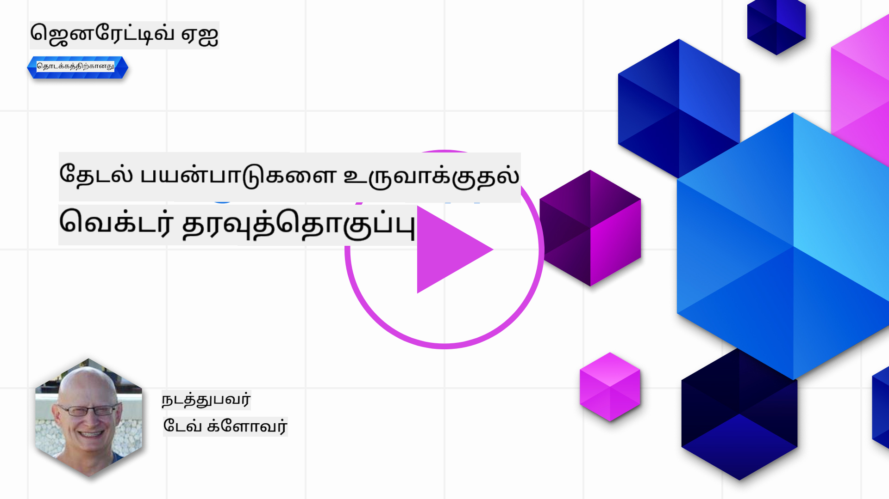
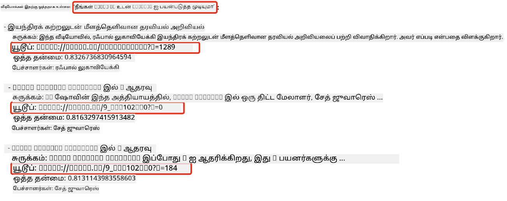
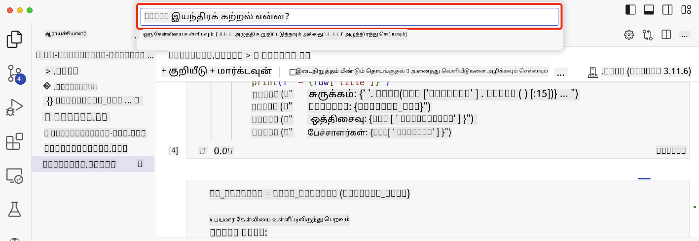

<!--
CO_OP_TRANSLATOR_METADATA:
{
  "original_hash": "d46aad0917a1a342d613e2c13d457da5",
  "translation_date": "2025-10-11T11:23:45+00:00",
  "source_file": "08-building-search-applications/README.md",
  "language_code": "ta"
}
-->
# தேடல் பயன்பாடுகளை உருவாக்குதல்

[](https://aka.ms/gen-ai-lesson8-gh?WT.mc_id=academic-105485-koreyst)

> > _மேலே உள்ள படத்தை கிளிக் செய்து இந்த பாடத்தின் வீடியோவைப் பாருங்கள்_

LLMs-களுக்கு chatbot-கள் மற்றும் உரை உருவாக்கத்திற்கும் மேலான பல அம்சங்கள் உள்ளன. Embeddings-ஐப் பயன்படுத்தி தேடல் பயன்பாடுகளை உருவாக்கவும் முடியும். Embeddings என்பது தரவின் எண் பிரதிநிதிகள், இது vectors என்றும் அழைக்கப்படுகிறது, மேலும் தரவுக்கான semantic தேடலுக்கு பயன்படுத்தப்படலாம்.

இந்த பாடத்தில், எங்கள் கல்வி தொடக்க நிறுவனத்திற்கான தேடல் பயன்பாட்டை நீங்கள் உருவாக்கப் போகிறீர்கள். எங்கள் தொடக்க நிறுவனம் வளர்ச்சியடைந்த நாடுகளில் உள்ள மாணவர்களுக்கு இலவச கல்வியை வழங்கும் ஒரு இலாப நோக்கமற்ற அமைப்பாகும். AI பற்றி கற்றுக்கொள்ள மாணவர்கள் பயன்படுத்தக்கூடிய YouTube வீடியோக்கள் எங்கள் நிறுவனத்திடம் அதிக அளவில் உள்ளன. மாணவர்கள் ஒரு கேள்வியைத் type செய்து YouTube வீடியோவைத் தேட அனுமதிக்கும் ஒரு தேடல் பயன்பாட்டை உருவாக்க எங்கள் நிறுவனம் விரும்புகிறது.

உதாரணமாக, ஒரு மாணவர் 'Jupyter Notebooks என்றால் என்ன?' அல்லது 'Azure ML என்றால் என்ன?' என்று type செய்யலாம், தேடல் பயன்பாடு அந்த கேள்விக்கு தொடர்புடைய YouTube வீடியோக்களின் பட்டியலைத் திருப்பும், மேலும், அந்த கேள்விக்கு பதில் உள்ள வீடியோவின் இடத்திற்கான இணைப்பையும் திருப்பும்.

## அறிமுகம்

இந்த பாடத்தில், நாம் கற்றுக்கொள்ளப் போகிறோம்:

- Semantic தேடல் மற்றும் Keyword தேடல்.
- Text Embeddings என்றால் என்ன.
- Text Embeddings Index உருவாக்குதல்.
- Text Embeddings Index-ஐ தேடுதல்.

## கற்றல் இலக்குகள்

இந்த பாடத்தை முடித்த பிறகு, நீங்கள்:

- Semantic தேடல் மற்றும் Keyword தேடலின் வித்தியாசத்தைச் சொல்ல முடியும்.
- Text Embeddings என்றால் என்ன என்பதை விளக்க முடியும்.
- Embeddings-ஐப் பயன்படுத்தி தரவைக் கண்டறிய பயன்பாட்டை உருவாக்க முடியும்.

## ஏன் தேடல் பயன்பாட்டை உருவாக்க வேண்டும்?

தேடல் பயன்பாட்டை உருவாக்குவது Embeddings-ஐப் பயன்படுத்தி தரவைக் கண்டறிய எப்படி பயன்படுத்துவது என்பதைப் புரிந்துகொள்ள உதவும். மேலும், மாணவர்கள் தகவலை விரைவாகக் கண்டறிய பயன்படுத்தக்கூடிய தேடல் பயன்பாட்டை உருவாக்க கற்றுக்கொள்வீர்கள்.

இந்த பாடத்தில் Microsoft [AI Show](https://www.youtube.com/playlist?list=PLlrxD0HtieHi0mwteKBOfEeOYf0LJU4O1) YouTube சேனலின் உரை Embedding Index அடங்கும். AI Show என்பது AI மற்றும் machine learning பற்றி கற்றுக்கொடுக்க ஒரு YouTube சேனலாகும். Embedding Index Oct 2023 வரை உள்ள YouTube உரைகளுக்கான Embeddings-ஐ கொண்டுள்ளது. எங்கள் தொடக்க நிறுவனத்திற்கான தேடல் பயன்பாட்டை உருவாக்க நீங்கள் Embedding Index-ஐப் பயன்படுத்துவீர்கள். தேடல் பயன்பாடு கேள்விக்கு பதில் உள்ள வீடியோவின் இடத்திற்கான இணைப்பை திருப்பும். இது மாணவர்கள் தேவைப்படும் தகவலை விரைவாகக் கண்டறிய சிறந்த வழியாகும்.

'can you use rstudio with azure ml?' என்ற கேள்விக்கான semantic query-யின் உதாரணம் கீழே உள்ளது. YouTube url-ஐப் பாருங்கள், url-ல் timestamp உள்ளது, இது கேள்விக்கு பதில் உள்ள வீடியோவின் இடத்திற்குச் செல்கிறது.



## Semantic தேடல் என்றால் என்ன?

இப்போது நீங்கள் கேட்கலாம், Semantic தேடல் என்றால் என்ன? Semantic தேடல் என்பது ஒரு query-யில் உள்ள சொற்களின் semantics அல்லது அர்த்தத்தைப் பயன்படுத்தி தொடர்புடைய முடிவுகளைத் திருப்பும் தேடல் தொழில்நுட்பமாகும்.

Semantic தேடலின் ஒரு உதாரணம் இதோ. நீங்கள் ஒரு கார் வாங்க விரும்பினால், 'என் கனவு கார்' என்று தேடலாம், semantic தேடல் நீங்கள் ஒரு காரை `கனவு காண்கிறீர்கள்` என்று அல்ல, மாறாக உங்கள் `சிறந்த` காரை வாங்க முயற்சிக்கிறீர்கள் என்று புரிந்துகொள்கிறது. Semantic தேடல் உங்கள் நோக்கத்தைப் புரிந்து தொடர்புடைய முடிவுகளைத் திருப்பும். மாற்றாக `keyword தேடல்` என்பது கார்களைப் பற்றிய கனவுகளை literal-ஆக தேடும், மேலும் பெரும்பாலும் தொடர்பற்ற முடிவுகளைத் திருப்பும்.

## Text Embeddings என்றால் என்ன?

[Text embeddings](https://en.wikipedia.org/wiki/Word_embedding?WT.mc_id=academic-105485-koreyst) என்பது [இயற்கை மொழி செயலாக்கம்](https://en.wikipedia.org/wiki/Natural_language_processing?WT.mc_id=academic-105485-koreyst) பயன்படுத்தப்படும் ஒரு உரை பிரதிநிதித்துவ தொழில்நுட்பமாகும். Text embeddings என்பது உரையின் semantic எண் பிரதிநிதிகள் ஆகும். Embeddings தரவை ஒரு இயந்திரம் புரிந்துகொள்ள எளிதாக இருக்கும் வகையில் பிரதிநிதித்துவப்படுத்த பயன்படுத்தப்படுகிறது. Text embeddings உருவாக்க பல மாதிரிகள் உள்ளன, இந்த பாடத்தில், OpenAI Embedding Model-ஐப் பயன்படுத்தி embeddings உருவாக்க கவனம் செலுத்துவோம்.

இதோ ஒரு உதாரணம், AI Show YouTube சேனலின் ஒரு episode-இன் உரையில் பின்வரும் உரை உள்ளது என்று கற்பனை செய்யுங்கள்:

```text
Today we are going to learn about Azure Machine Learning.
```

உரையை OpenAI Embedding API-க்கு அனுப்பினால், அது 1536 எண்கள் கொண்ட embedding-ஐ aka vector-ஐ திருப்பும். vector-இல் உள்ள ஒவ்வொரு எண்ணும் உரையின் வெவ்வேறு அம்சத்தை பிரதிநிதித்துவப்படுத்துகிறது. சுருக்கமாக, vector-இல் முதல் 10 எண்கள் இதோ.

```python
[-0.006655829958617687, 0.0026128944009542465, 0.008792596869170666, -0.02446001023054123, -0.008540431968867779, 0.022071078419685364, -0.010703742504119873, 0.003311325330287218, -0.011632772162556648, -0.02187200076878071, ...]
```

## Embedding Index எப்படி உருவாக்கப்பட்டது?

இந்த பாடத்திற்கான Embedding Index Python scripts-களின் தொடர்ச்சியால் உருவாக்கப்பட்டது. இந்த பாடத்திற்கான 'scripts' கோப்பகத்தில் உள்ள [README](./scripts/README.md?WT.mc_id=academic-105485-koreyst)-இல் scripts மற்றும் வழிமுறைகளை நீங்கள் காணலாம். இந்த scripts-களை இயக்க தேவையில்லை, ஏனெனில் Embedding Index உங்களுக்கு வழங்கப்பட்டுள்ளது.

scripts பின்வரும் செயல்பாடுகளைச் செய்கிறது:

1. [AI Show](https://www.youtube.com/playlist?list=PLlrxD0HtieHi0mwteKBOfEeOYf0LJU4O1) playlist-இல் உள்ள ஒவ்வொரு YouTube வீடியோவிற்கான உரை பதிவிறக்கம் செய்யப்படுகிறது.
2. [OpenAI Functions](https://learn.microsoft.com/azure/ai-services/openai/how-to/function-calling?WT.mc_id=academic-105485-koreyst)-ஐப் பயன்படுத்தி, YouTube உரையின் முதல் 3 நிமிடங்களில் இருந்து பேச்சாளர் பெயரை எடுக்க முயற்சி செய்யப்படுகிறது. ஒவ்வொரு வீடியோவிற்கான பேச்சாளர் பெயர் `embedding_index_3m.json` என்ற Embedding Index-இல் சேமிக்கப்படுகிறது.
3. உரை **3 நிமிட உரை பகுதிகளாக** துண்டிக்கப்படுகிறது. ஒவ்வொரு பகுதிக்கும் அடுத்த பகுதியில் இருந்து சுமார் 20 சொற்கள் ஒட்டுமொத்தமாக சேர்க்கப்பட்டுள்ளன, இது பகுதியின் Embedding துண்டிக்கப்படாமல் இருக்கவும், தேடல் சூழலை மேம்படுத்தவும் உதவுகிறது.
4. ஒவ்வொரு உரை பகுதியும் OpenAI Chat API-க்கு அனுப்பப்படுகிறது, இது உரையை 60 சொற்களாக சுருக்குகிறது. சுருக்கமும் `embedding_index_3m.json` என்ற Embedding Index-இல் சேமிக்கப்படுகிறது.
5. இறுதியாக, உரை பகுதி OpenAI Embedding API-க்கு அனுப்பப்படுகிறது. Embedding API பகுதியின் semantic அர்த்தத்தை பிரதிநிதித்துவப்படுத்தும் 1536 எண்கள் கொண்ட vector-ஐ திருப்பும். பகுதியும் OpenAI Embedding vector-உம் `embedding_index_3m.json` என்ற Embedding Index-இல் சேமிக்கப்படுகிறது.

### Vector தரவுத்தொகுப்புகள்

பாடத்தின் எளிமைக்காக, Embedding Index `embedding_index_3m.json` என்ற JSON கோப்பில் சேமிக்கப்பட்டு Pandas DataFrame-இல் ஏற்றப்படுகிறது. ஆனால், உற்பத்தியில், Embedding Index [Azure Cognitive Search](https://learn.microsoft.com/training/modules/improve-search-results-vector-search?WT.mc_id=academic-105485-koreyst), [Redis](https://cookbook.openai.com/examples/vector_databases/redis/readme?WT.mc_id=academic-105485-koreyst), [Pinecone](https://cookbook.openai.com/examples/vector_databases/pinecone/readme?WT.mc_id=academic-105485-koreyst), [Weaviate](https://cookbook.openai.com/examples/vector_databases/weaviate/readme?WT.mc_id=academic-105485-koreyst) போன்ற vector தரவுத்தொகுப்புகளில் சேமிக்கப்படும்.

## Cosine similarity-ஐப் புரிந்துகொள்வது

Text embeddings பற்றி நாம் கற்றுக்கொண்டோம், அடுத்த படியாக text embeddings-ஐப் பயன்படுத்தி தரவைக் கண்டறிய மற்றும் குறிப்பாக cosine similarity-ஐப் பயன்படுத்தி ஒரு query-க்கு மிகவும் ஒத்த embeddings-ஐ கண்டறிய கற்றுக்கொள்வோம்.

### Cosine similarity என்றால் என்ன?

Cosine similarity என்பது இரண்டு vectors-களின் ஒற்றுமையை அளவிடும் ஒரு அளவீடாகும், இது `nearest neighbor search` என்றும் அழைக்கப்படும். Cosine similarity தேடலைச் செய்ய, OpenAI Embedding API-ஐப் பயன்படுத்தி _query_ உரையை _vectorize_ செய்ய வேண்டும். பின்னர் query vector மற்றும் Embedding Index-இல் உள்ள ஒவ்வொரு vector-இன் _cosine similarity_ ஐ கணக்கிட வேண்டும். நினைவில் கொள்ளுங்கள், Embedding Index ஒவ்வொரு YouTube உரை பகுதியுக்கும் ஒரு vector-ஐ கொண்டுள்ளது. இறுதியாக, cosine similarity மூலம் முடிவுகளை வரிசைப்படுத்தவும், cosine similarity அதிகமாக உள்ள உரை பகுதிகள் query-க்கு மிகவும் ஒத்ததாக இருக்கும்.

கணிதக் கோணத்தில், cosine similarity என்பது பலதளவிடை இடத்தில் இரண்டு vectors-களின் கோணத்தின் cosine-ஐ அளவிடுகிறது. இந்த அளவீடு பயனுள்ளதாக உள்ளது, ஏனெனில் இரண்டு ஆவணங்கள் அளவால் Euclidean distance-ல் வெகுதூரமாக இருந்தாலும், அவை குறைந்த கோணத்தைக் கொண்டிருக்கலாம், எனவே cosine similarity அதிகமாக இருக்கும். Cosine similarity சமன்பாடுகள் பற்றிய கூடுதல் தகவலுக்கு, [Cosine similarity](https://en.wikipedia.org/wiki/Cosine_similarity?WT.mc_id=academic-105485-koreyst) ஐப் பார்க்கவும்.

## உங்கள் முதல் தேடல் பயன்பாட்டை உருவாக்குதல்

அடுத்ததாக, Embeddings-ஐப் பயன்படுத்தி ஒரு தேடல் பயன்பாட்டை உருவாக்க எப்படி கற்றுக்கொள்வது என்பதைப் பார்க்கப் போகிறோம். இந்த தேடல் பயன்பாடு மாணவர்கள் ஒரு கேள்வியை type செய்து ஒரு வீடியோவைத் தேட அனுமதிக்கும். தேடல் பயன்பாடு அந்த கேள்விக்கு தொடர்புடைய வீடியோக்களின் பட்டியலைத் திருப்பும். மேலும், தேடல் பயன்பாடு அந்த கேள்விக்கு பதில் உள்ள வீடியோவின் இடத்திற்கான இணைப்பையும் திருப்பும்.

இந்த தீர்வு Windows 11, macOS, மற்றும் Ubuntu 22.04-ல் Python 3.10 அல்லது அதற்கு மேல் பயன்படுத்தி உருவாக்கப்பட்டு சோதிக்கப்பட்டது. Python-ஐ [python.org](https://www.python.org/downloads/?WT.mc_id=academic-105485-koreyst) இலிருந்து பதிவிறக்கம் செய்யலாம்.

## பணிக்கூற்று - மாணவர்களைச் சாத்தியமாக்க தேடல் பயன்பாட்டை உருவாக்குதல்

இந்த பாடத்தின் தொடக்கத்தில் எங்கள் தொடக்க நிறுவனத்தை அறிமுகப்படுத்தினோம். இப்போது மாணவர்கள் தங்கள் மதிப்பீடுகளுக்கான தேடல் பயன்பாட்டை உருவாக்க சாத்தியமாக்க நேரம்.

இந்த பணிக்கூற்றில், தேடல் பயன்பாட்டை உருவாக்க பயன்படுத்தப்படும் Azure OpenAI Services-ஐ நீங்கள் உருவாக்குவீர்கள். நீங்கள் பின்வரும் Azure OpenAI Services-ஐ உருவாக்குவீர்கள். இந்த பணிக்கூற்றை முடிக்க Azure subscription தேவைப்படும்.

### Azure Cloud Shell-ஐ தொடங்குதல்

1. [Azure portal](https://portal.azure.com/?WT.mc_id=academic-105485-koreyst)-இல் உள்நுழைக.
2. Azure portal-இன் மேல் வலது மூலையில் உள்ள Cloud Shell ஐகானைத் தேர்ந்தெடுக்கவும்.
3. **Bash** ஐ சூழல் வகையாகத் தேர்ந்தெடுக்கவும்.

#### Resource group உருவாக்குதல்

> இந்த வழிமுறைகளுக்கு, East US-ல் "semantic-video-search" என்ற resource group-ஐப் பயன்படுத்துகிறோம்.
> resource group-இன் பெயரை மாற்றலாம், ஆனால் resources-க்கு இடத்தை மாற்றும்போது,
> [model availability table](https://aka.ms/oai/models?WT.mc_id=academic-105485-koreyst)-ஐச் சரிபார்க்கவும்.

```shell
az group create --name semantic-video-search --location eastus
```

#### Azure OpenAI Service resource உருவாக்குதல்

Azure Cloud Shell-இல் இருந்து, Azure OpenAI Service resource-ஐ உருவாக்க பின்வரும் கட்டளையை இயக்கவும்.

```shell
az cognitiveservices account create --name semantic-video-openai --resource-group semantic-video-search \
    --location eastus --kind OpenAI --sku s0
```

#### இந்த பயன்பாட்டில் பயன்பாட்டிற்கான endpoint மற்றும் keys பெறுதல்

Azure Cloud Shell-இல் இருந்து, Azure OpenAI Service resource-ஐப் பயன்படுத்த endpoint மற்றும் keys பெற பின்வரும் கட்டளைகளை இயக்கவும்.

```shell
az cognitiveservices account show --name semantic-video-openai \
   --resource-group  semantic-video-search | jq -r .properties.endpoint
az cognitiveservices account keys list --name semantic-video-openai \
   --resource-group semantic-video-search | jq -r .key1
```

#### OpenAI Embedding மாதிரியை deploy செய்யுங்கள்

Azure Cloud Shell-இல் இருந்து, OpenAI Embedding மாதிரியை deploy செய்ய பின்வரும் கட்டளையை இயக்கவும்.

```shell
az cognitiveservices account deployment create \
    --name semantic-video-openai \
    --resource-group  semantic-video-search \
    --deployment-name text-embedding-ada-002 \
    --model-name text-embedding-ada-002 \
    --model-version "2"  \
    --model-format OpenAI \
    --sku-capacity 100 --sku-name "Standard"
```

## தீர்வு

GitHub Codespaces-இல் [solution notebook](./python/aoai-solution.ipynb?WT.mc_id=academic-105485-koreyst)-ஐத் திறந்து Jupyter Notebook-இல் உள்ள வழிமுறைகளைப் பின்பற்றவும்.

Notebook-ஐ இயக்கும்போது, உங்களை query-ஐ உள்ளிடுமாறு கேட்டுக்கொள்ளப்படும். உள்ளீட்டு பெட்டி இதுபோல இருக்கும்:



## சிறந்த வேலை! உங்கள் கற்றலைத் தொடருங்கள்

இந்த பாடத்தை முடித்த பிறகு, எங்கள் [Generative AI Learning collection](https://aka.ms/genai-collection?WT.mc_id=academic-105485-koreyst)-ஐச் சரிபார்த்து, உங்கள் Generative AI அறிவை மேம்படுத்துங்கள்!

Lesson 9-க்கு செல்லுங்கள், அங்கு [பட உருவாக்க பயன்பாடுகளை உருவாக்க](../09-building-image-applications/README.md?WT.mc_id=academic-105485-koreyst) எப்படி என்பதைப் பார்ப்போம்!

---

**குறிப்பு**:  
இந்த ஆவணம் [Co-op Translator](https://github.com/Azure/co-op-translator) என்ற AI மொழிபெயர்ப்பு சேவையை பயன்படுத்தி மொழிபெயர்க்கப்பட்டுள்ளது. நாங்கள் துல்லியத்திற்காக முயற்சிக்கின்றோம், ஆனால் தானியங்கி மொழிபெயர்ப்புகளில் பிழைகள் அல்லது தவறான தகவல்கள் இருக்கக்கூடும் என்பதை கவனத்தில் கொள்ளவும். அதன் தாய்மொழியில் உள்ள மூல ஆவணம் அதிகாரப்பூர்வ ஆதாரமாக கருதப்பட வேண்டும். முக்கியமான தகவல்களுக்கு, தொழில்முறை மனித மொழிபெயர்ப்பு பரிந்துரைக்கப்படுகிறது. இந்த மொழிபெயர்ப்பைப் பயன்படுத்துவதால் ஏற்படும் எந்த தவறான புரிதல்கள் அல்லது தவறான விளக்கங்களுக்கு நாங்கள் பொறுப்பல்ல.