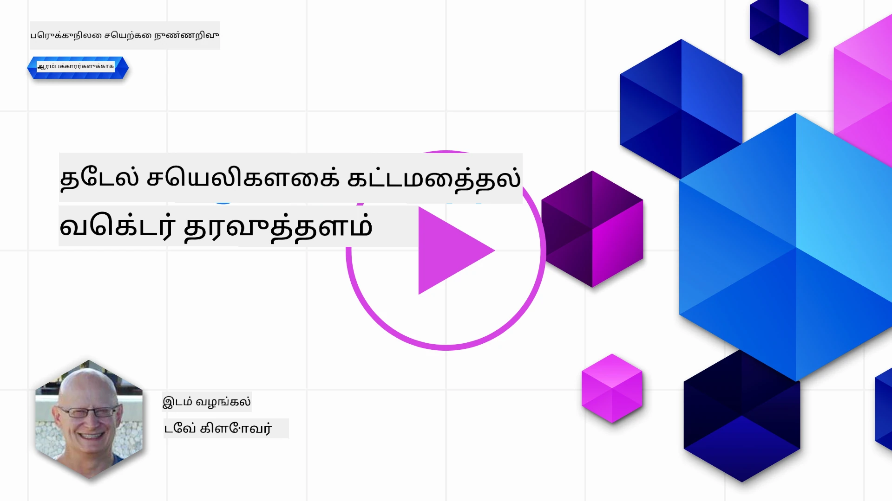
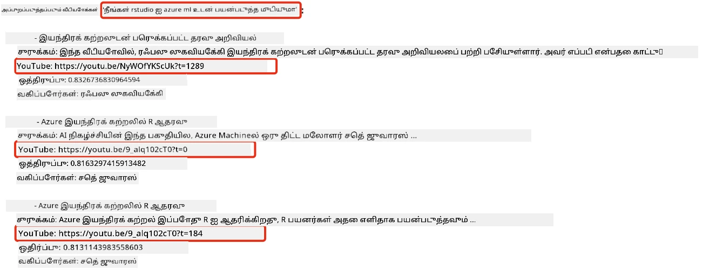
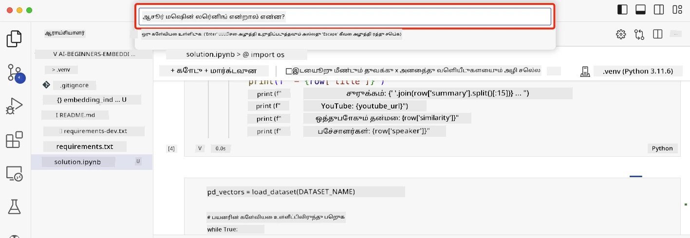

# தேடு பயன்பாடுகளை உருவாக்குதல்

[](https://youtu.be/W0-nzXjOjr0?si=GcsqiTTvd7RKbo7V)

> > _இந்த பாடத்தின் வீடியோவைப் பார்க்க மேலுள்ள படத்தை கிளிக் செய்யவும்_

LLM-கள் என்பது உரையாடல் பொறிகள் மற்றும் உரை உருவாக்கத்திற்குக் கடந்த அதிகமாக இருக்கின்றது. Embeddings பயன்படுத்தி தேடு பயன்பாடுகளை உருவாக்குவது கூட சாத்தியம். Embeddings என்பது தரவுகளின் எண்கணக்கியல் பிரதிநிதித்துவங்கள் ஆகும்; அவை வெக்டர்களாகவும் அழைக்கப்படுகின்றன, மற்றும் தரவுக்கான பொருளடக்கத் தேடலுக்குப் பயன்படுத்தப்படுகின்றன.

இந்தப் பாடத்தில், நமது கல்வி ஸ்டார்ட்அப்பிற்கு ஒரு தேடு பயன்பாட்டை நீங்கள் உருவாக்கப் போகிறீர்கள். நமது ஸ்டார்ட்அப் என்பது வளர்ச்சியடையும் நாடுகளில் மாணவர்களுக்கு இலவசக் கல்வியை வழங்கும் ஒரு இலாப நோக்கமற்ற அமைப்பு. நமது ஸ்டார்ட்அப்பில், AI பற்றி கற்றுக்கொள்ள மாணவர்கள் பயன்படுத்தக்கூடிய பல YouTube வீடியோக்கள் உள்ளன. மாணவர்கள் கேள்வி எழுதி ஒரு YouTube வீடியோவைத் தேடும் தேடு பயன்பாட்டை உருவாக்க நமது ஸ்டார்ட்அப் விரும்புகிறது.

உதாரணமாக, ஒரு மாணவன் 'Jupyter Notebooks என்ன?' அல்லது 'Azure ML என்ன?' என்று தட்டச்சு செய்கிறான் எனில், தேடு பயன்பாடு கேள்விக்கு தொடர்புடைய YouTube வீடியோக்களின் பட்டியலை வழங்கும், மேலும் சிறப்பாக அந்த வீடியோவின் எந்த இடத்தில் கேள்விக்கான பதில் உள்ளது என்பதற்கு இணைப்பையும் வழங்கும்.

## அறிமுகம்

இந்தப் பாடத்தில், நாம் விவரிக்க போகும் விஷயங்கள்:

- பொருளடக்கத் தேடு மற்றும் முக்கியச்சொல் தேடு.
- Text Embeddings என்ன.
- Text Embeddings குறியீட்டு உருவாக்கம்.
- Text Embeddings குறியீட்டில் தேடல்.

## கற்றல் இலக்குகள்

இந்தப் பாடத்தை முடித்த பின், நீங்கள் செய்யக் கூடியவை:

- பொருளடக்கத் தேடலும் முக்கியச்சொல் தேடும் இடைவெளியை விளக்கலாம்.
- Text Embeddings என்ன என்பதை விளக்கலாம்.
- Embeddings பயன்படுத்தி தரவைத் தேடும் பயன்பாட்டை உருவாக்கலாம்.

## ஏன் தேடு பயன்பாட்டை உருவாக்க வேண்டும்?

தேடு பயன்பாட்டை உருவாக்குவது Embeddings-ஐப் பயன்படுத்தி எவ்வாறு தரவைத் தேடுவது என புரிந்துகொள்ள உதவும். மேலும், மாணவர்கள் விரைவில் தகவலைக் காண இந்த தேடு பயன்பாடு பயன்படும்.

பாடத்தில் Microsoft [AI Show](https://www.youtube.com/playlist?list=PLlrxD0HtieHi0mwteKBOfEeOYf0LJU4O1) YouTube சேனல் வீடியோக்களின் உரை தொகுப்புகளுக்கான Embedding குறியீடு உள்ளது. AI Show என்பது AI மற்றும் மெஷின் லர்னிங் பற்றி கற்றுக்கொடுக்கும் YouTube சேனல். Embedding குறியீட்டில் 2023 அக்டோபர் வரை உள்ள YouTube உரை தொகுப்புகளுக்கான Embeddings உள்ளன. இந்த குறியீட்டை நீங்கள் நமது ஸ்டார்ட்அப்பிற்கான தேடு பயன்பாட்டை உருவாக்க பயன்படுத்தப்போகிறீர்கள். தேடு பயன்பாடு கேள்விக்கு பதில் உள்ள வீடியோ இடத்திற்கு இணைப்பையும் வழங்கும், இது மாணவர்களுக்கு தேவையான தகவலை விரைவாகக் கண்டுபிடிக்க உதவும் சிறந்த வழி.

கீழே 'rstudio-வை azure ml உடன் பயன்படுத்தலாமா?' என்ற கேள்விக்கான பொருளடக்கத் தேடல் கேள்வி உதாரணம் உள்ளது. YouTube URL-ஐப் பார்க்கவும், அதன் URL-இல் ஒரு டைம்ப்ரிண்ட் உள்ளது, இது வீடியோவின் கேள்விக்கு பதில் இருக்கும் இடத்தைக் காட்டுகிறது.



## பொருளடக்கத் தேடு என்பது என்ன?

இப்போது நீங்கள் பொருளடக்கத் தேடு என்னவென்று கேள்வி கேட்கலாம். பொருளடக்கத் தேடு என்பது, ஒரு கேள்வியில் உள்ள சொற்களின் பொருளைக் (semantics) பயன்படுத்தி பொருத்தமான முடிவுகளை வழங்கும் தேடல் தொழில்நுட்பம்.

இதோ ஒரு பொருளடக்கத் தேடு உதாரணம். நீங்கள் ஒரு கார் வாங்க விரும்பினால், 'என் கனவு கார்' என்று தேடினீர்கள் எனக் கொள்ளுங்கள். பொருளடக்கத் தேடு, நீங்கள் ஒரு காரைக் கனவுக் காண்கிறதாக அல்ல; நீங்கள் வாங்கவேண்டிய 'உங்களுக்கான சிறந்த' கார் என்று புரிந்து கொள்ளும். இதற்கு பதிலாக முக்கியச்சொல் தேடு (keyword search) கனவு மற்றும் கார்கள் போன்ற சொற்களைத் literal-ஆக தேடி தொடர்பற்ற முடிவுகளை தரும்.

## Text Embeddings என்றால் என்ன?

[Text embeddings](https://en.wikipedia.org/wiki/Word_embedding?WT.mc_id=academic-105485-koreyst) என்பது [நிலையான மொழி செயலாக்கத்தில்](https://en.wikipedia.org/wiki/Natural_language_processing?WT.mc_id=academic-105485-koreyst) பயன்படுத்தப்படும் ஒரு உரை பிரதிநிதித்துவ தொழில்நுட்பம். Text embeddings என்பது உரையின் எண்ணியல் பொருளடக்க பிரதிநிதித்துவங்கள். Embeddings என்பது கணினிக்கு எந்த உண்மையான தரவு என்பதை எளிதில் புரியவைக்கும் விதத்தில் பிரதிநிதித்துவப்படுத்தப்படுகிறது. பல மாதிரிகள் உள்ளன, இந்த பாடத்தில், OpenAI Embedding மாதிரியைப் பயன்படுத்தி embeddings உருவாக்குவதில் கவனம் செலுத்துகிறோம்.

இதோ ஒரு உதாரணம், AI Show YouTube சேனலின் ஒரு பகுதியின் உரைக்கு இடைக்காலமாக கீழ்காணுமாறு இருக்கலாம்:

```text
Today we are going to learn about Azure Machine Learning.
```

உரையை OpenAI Embedding API-க்கு அனுப்பினால், 1536 எண்கள் கொண்ட ஒரு embedding (வரிசை) தரப்படும். வரிசையில் உள்ள ஒவ்வொரு எண் உரையின் வெவ்வேறு அம்சத்தைக் குறிக்கிறது. சுருக்கமாக முதலில் 10 எண்களை காண்க.

```python
[-0.006655829958617687, 0.0026128944009542465, 0.008792596869170666, -0.02446001023054123, -0.008540431968867779, 0.022071078419685364, -0.010703742504119873, 0.003311325330287218, -0.011632772162556648, -0.02187200076878071, ...]
```

## Embedding குறியீடு எப்படி உருவாக்கப்படுகிறது?

இந்த பாடத்திற்கான Embedding குறியீடு பல Python ஸ்கிரிப்டுகளைக் கொண்டு உருவாக்கப்பட்டது. இந்த பாடத்திற்கான 'scripts' foldரில் உள்ள [README](./scripts/README.md?WT.mc_id=academic-105485-koreyst) யில் ஸ்கிரிப்ட்கள் மற்றும் հրահանգங்களைக் காணலாம். இந்த ஸ்கிரிப்ட்களை இயக்குவதன் அவசியம் இல்லை, ஏனென்றால் Embedding குறியீடு உங்களுக்கு வழங்கப்பட்டுள்ளது.

ஸ்கிரிப்ட்கள் பின்வரும் செயல்களைச் செய்கின்றன:

1. [AI Show](https://www.youtube.com/playlist?list=PLlrxD0HtieHi0mwteKBOfEeOYf0LJU4O1) பிளேலிஸ்டில் உள்ள ஒவ்வொரு YouTube வீடியோவின் உரையை பதிவிறக்கம் செய்கின்றது.
2. [OpenAI Functions](https://learn.microsoft.com/azure/ai-foundry/openai/how-to/function-calling?WT.mc_id=academic-105485-koreyst) பயன்படுத்தி, YouTube உரையின் முதலாவது 3 நிமிடங்களில் பேச்சாளரை அகற்ற முயற்சிக்கிறது. ஒவ்வொரு வீடியோவுக்கும் பேச்சாளர் பெயர் 'embedding_index_3m.json' என்ற Embedding குறியீட்டில் சேமிக்கப்படுகிறது.
3. உரை 3 நிமிட உரை பகுதிய்களாக பகுக்கப்படுகிறது. அடுத்த பகுதியிலிருந்து சுமார் 20 சொற்கள் மோதிக் கொண்டிருக்கின்றன, அதனால் பகுதி embedding குறைவு அடையாது மற்றும் தேடல் பொருள் Context மேம்படும்.
4. ஒவ்வொரு உரை பகுதியும் OpenAI Chat API-க்கு அனுப்பி, 60 சொற்களுக்குள் சுருக்கப்படுகிறது. சுருக்கமும் 'embedding_index_3m.json' என்ற Embedding குறியீட்டில் சேர்க்கப்படுகிறது.
5. இறுதியாக, உரை பகுதி OpenAI Embedding API-க்கு அனுப்பப்படுகிறது. Embedding API பகுதியின் பொருள் உடைய 1536 எண்களின் வெக்டர் (vector) தருகிறது. பகுதி மற்றும் அது உடைய வெக்டர் 'embedding_index_3m.json' என்ற Embedding குறியீட்டில் சேமிக்கப்படுகின்றன.

### வெக்டர் தரவுத்தளங்கள்

எளிமைக்காக, Embedding குறியீடு `embedding_index_3m.json` என்ற JSON கோப்பில் சேமிக்கப்பட்டு Pandas DataFrame-க்கு ஏற்றப்படுகிறது. ஆனால் உற்பத்தியில் Embedding குறியீடு [Azure Cognitive Search](https://learn.microsoft.com/training/modules/improve-search-results-vector-search?WT.mc_id=academic-105485-koreyst), [Redis](https://cookbook.openai.com/examples/vector_databases/redis/readme?WT.mc_id=academic-105485-koreyst), [Pinecone](https://cookbook.openai.com/examples/vector_databases/pinecone/readme?WT.mc_id=academic-105485-koreyst), [Weaviate](https://cookbook.openai.com/examples/vector_databases/weaviate/readme?WT.mc_id=academic-105485-koreyst) போன்ற வெக்டர் தரவுத்தளங்களில் சேமிக்கப்படும்.

## கோசைன் ஒத்திசைவு புரிதல்

Text embeddings பற்றியதைக் கற்றுக்கொண்டோம், அடுத்து text embeddings-ஐத் தரவுக்கான தேடலில் எவ்வாறு பயன்படுத்துவது மற்றும் குறிப்பாக கொடுத்த கேள்விக்கான மிகச் சமான embedding-ஐ கோசைன் ஒத்திசைவு (cosine similarity) மூலம் எப்படி கண்டுபிடிப்பது என்பதைக் கற்றுக்கொள்ளப் போகிறோம்.

### கோசைன் ஒத்திசைவு என்றால் என்ன?

கோசைன் ஒத்திசைவு என்பது இரு வெக்டர்களுக்கு இடையேயான ஒத்திசைவின் அளவீடு, இதைக் `சரியான அடுத்த அயல் தேடல்` (nearest neighbor search) என்றும் கூறுவர். கோசைன் ஒத்திசைவு தேடலை செய்ய, OpenAI Embedding API-ஐப் பயன்படுத்தி கேள்வி உரையை வெக்டர் ஆக்க வேண்டும். பிறகு அந்த கேள்வி வெக்டரும் Embedding குறியீட்டில் உள்ள ஒவ்வொரு வெக்டருடனுமுள்ள கோசைன் ஒத்திசைவையும் கணக்கிட வேண்டும். வாழ்த்துகளுக்கு, Embedding குறியீடு ஒவ்வொரு YouTube உரை பகுதிக்கும் வெக்டரைக் கொண்டுள்ளது. கடைசியாக, முடிவுகளை கோசைன் ஒத்திசைவு அளவைக் கொண்டு வரிசைப்படுத்தி, மிக அதிக கோசைன் ஒத்திசைவு கொண்ட உரை பகுதிகள் கேள்விக்குள் மிகச் சரியானவை.

கணித ரீதியிலாக, கோசைன் ஒத்திசைவு என்பது பலஅளவிலான இடத்தினுள் இரண்டு வெக்டர்களுக்கிடையேயான கோணத்தின் கோசைனை அளவிடுகிறது. இது பயனுள்ளதாகும், ஏனென்றால் இரண்டு ஆவணங்கள் Euclidean தூரம் மூலம் பெரிய விதிவிலக்குடன் இருக்கிறாய் இருந்தாலும், அவற்றுக்கிடையேயான கோணம் சிறியதாகவும், ஆகவே கோசைன் ஒத்திசைவு அதிகமாக இருக்க முடியும். கோசைன் ஒத்திசைவு சமன்பாடுகள் பற்றி விரிவான தகவல் காண [Cosine similarity](https://en.wikipedia.org/wiki/Cosine_similarity?WT.mc_id=academic-105485-koreyst).

## உங்கள் முதலாவது தேடு பயன்பாட்டை உருவாக்குதல்

அடுத்து, Embeddings பயன்படுத்தி ஒரு தேடு பயன்பாட்டை உருவாக்க எவ்வாறு செய்வது என்று கற்றுக்கொள்வோம். தேடு பயன்பாடு மாணவர்கள் கேள்வி எழுத்து மூலம் வீடியோ தேட உதவும். கேள்விக்கு சம்பந்தப்பட்ட வீடியோ பட்டியலை வழங்கும். மேலும் கேள்விக்கு பதில் உள்ள வீடியோ இடத்திற்கு இணைப்பையும் வழங்கும்.

இந்த தீர்வு Windows 11, macOS, மற்றும் Ubuntu 22.04-இல் Python 3.10 அல்லது அதற்குப் பிறகான பதிப்புகள் பயன்படுத்தி கட்டப்பட்டு சோதிக்கப்பட்டது. Python-ஐ [python.org](https://www.python.org/downloads/?WT.mc_id=academic-105485-koreyst) இல் இருந்து தரவிறக்கம் செய்யலாம்.

## பணியமைப்பு - மாணவர்கள் பயன்படுத்தச் தேடு பயன்பாட்டை உருவாக்குதல்

பாடத்திற்குத் தொடக்கத்தில் நமது ஸ்டார்ட்அப்பை அறிமுகப்படுத்தினோம். இப்போது மாணவர்கள் தங்கள் மதிப்பீடுகளுக்கான தேடு பயன்பாட்டை உருவாக்கக்கூடிய நேரம்.

இந்த பணியமைப்பில், தேடு பயன்பாட்டை உருவாக்க பயன்படுத்தப்படும் Azure OpenAI சேவைகளை நீங்கள் உருவாக்குவீர்கள். பின்வரும் Azure OpenAI சேவைகளை உருவாக்க வேண்டும். இந்த பணியமைப்பைப் முழுமையாக செய்ய Azure சந்தா ஒன்றை வைத்திருக்க வேண்டியது அவசியம்.

### Azure Cloud Shell-ஐ துவங்குக

1. [Azure போர்டல்](https://portal.azure.com/?WT.mc_id=academic-105485-koreyst) இல் சாய் செய்யவும்.
2. Azure போர்டலின் மேல் வலது மூல பகுதியில் உள்ள Cloud Shell ஐகானைத் தேர்ந்தெடுக்கவும்.
3. சூழலை வகை ஆக **Bash** ஐ தேர்வு செய்யவும்.

#### ஒரு resource group உருவாக்குதல்

> இந்த வழிகாட்டுதல்களுக்கு, East US இல் உள்ள "semantic-video-search" என்ற resource group-ஐ நாம் பயன்படுத்துகிறோம்.
> நீங்கள் resource group பெயரை மாற்றலாம், ஆனால் கோர்சிகள் இருப்பிடத்தை மாற்றும்போது,
> [மாதிரி கிடைக்கும் அட்டவணை](https://aka.ms/oai/models?WT.mc_id=academic-105485-koreyst) ஐச் சரிபார்க்கவும்.

```shell
az group create --name semantic-video-search --location eastus
```

#### Azure OpenAI சேவை resource உருவாக்குதல்

Azure Cloud Shell-இல், பின்வரும் கட்டளையை இயக்கி Azure OpenAI சேவை resource உருவாக்கவும்.

```shell
az cognitiveservices account create --name semantic-video-openai --resource-group semantic-video-search \
    --location eastus --kind OpenAI --sku s0
```

#### இந்த பயன்பாட்டில் பயன்படுத்த வேண்டும் என endpoint மற்றும் விசைகளை பெறுதல்

Azure Cloud Shell-இல், பின்வரும் கட்டளைகளை இயக்கி Azure OpenAI சேவை resource-க்கான endpoint மற்றும் விசைகளைப் பெறவும்.

```shell
az cognitiveservices account show --name semantic-video-openai \
   --resource-group  semantic-video-search | jq -r .properties.endpoint
az cognitiveservices account keys list --name semantic-video-openai \
   --resource-group semantic-video-search | jq -r .key1
```

#### OpenAI Embedding மாதிரியை இயக்குதல்

Azure Cloud Shell-இல், OpenAI Embedding மாதிரியை இயக்க பின்வரும் கட்டளையை இயக்கவும்.

```shell
az cognitiveservices account deployment create \
    --name semantic-video-openai \
    --resource-group  semantic-video-search \
    --deployment-name text-embedding-ada-002 \
    --model-name text-embedding-ada-002 \
    --model-version "2"  \
    --model-format OpenAI \
    --sku-capacity 100 --sku-name "Standard"
```

## தீர்வு

[தீர்வு நோட்புக்](./python/aoai-solution.ipynb?WT.mc_id=academic-105485-koreyst) GitHub Codespaces-இல் திறந்து Jupyter Notebook உள்ள வழிகாட்டுதல்களைப் பின்பற்றவும்.

நோட்புக் இயங்கும் போது, கேள்வி அளிக்க உங்களுக்கு கேட்கப்படும். உள்ளீட்டு பெட்டி இதை போன்றதாக இருக்கும்:



## நன்றாக செய்தீர்கள்! உங்கள் கற்றலை தொடரவும்

இந்தப் பாடத்தை முடித்த பின், நமது [உருவாக்கும் AI கற்றல் தொகுப்பை](https://aka.ms/genai-collection?WT.mc_id=academic-105485-koreyst) பார்வையிட்டு உங்கள் உருவாக்கும் AI அறிவை மேம்படுத்திக் கொள்ளவும்!

பிறகு பாடம் 9-க்கு செல்லவும்; அங்கே நாம் [பட உருவாக்கும் பயன்பாடுகளை உருவாக்கும் முறையை](../09-building-image-applications/README.md?WT.mc_id=academic-105485-koreyst) பார்க்கப் போகிறோம்!

---

<!-- CO-OP TRANSLATOR DISCLAIMER START -->
**மறுப்பு**:
இந்த ஆவணம் AI மொழிபெயர்ப்பு சேவை [Co-op Translator](https://github.com/Azure/co-op-translator) பயன்படுத்தி மொழிபெயர்க்கப்பட்டுள்ளது. நாங்கள் துல்லியத்திற்காக முயற்சி செய்துள்ளோம், ஆனால் தானாக செய்யப்படும் மொழிபெயர்ப்புகளில் பிழைகள் அல்லது தவறுகள் இருக்கலாம் என்பதை கவனத்தில் கொள்ளவும். அசல் ஆவணம் அதன் தாய்மொழியில் அதிகாரப்பூர்வ ஆதாரமாக கருதப்பட வேண்டும். முக்கியமான தகவல்களுக்கு, தொழில்நுட்பமான மனித மொழிபெயர்ப்பு பரிந்துரைக்கப்படுகிறது. இந்த மொழிபெயர்ப்பைப் பயன்படுத்துவதால் ஏற்படும் எந்த தவறான புரிதல்கள் அல்லது தவறான விளக்கத்திற்கும் நாங்கள் பொறுப்பில்வில்லை.
<!-- CO-OP TRANSLATOR DISCLAIMER END -->