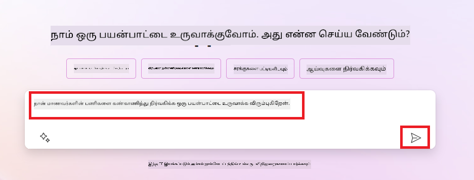
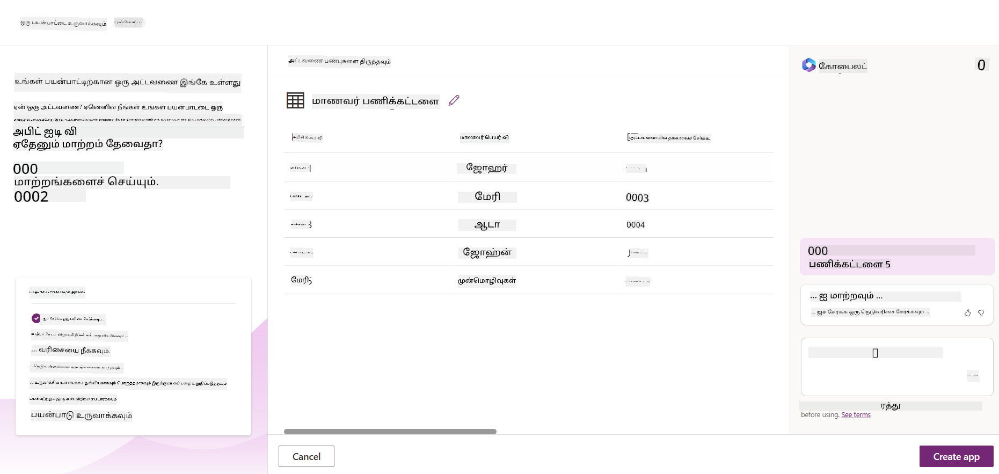
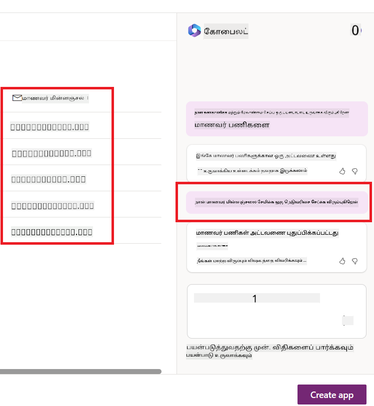
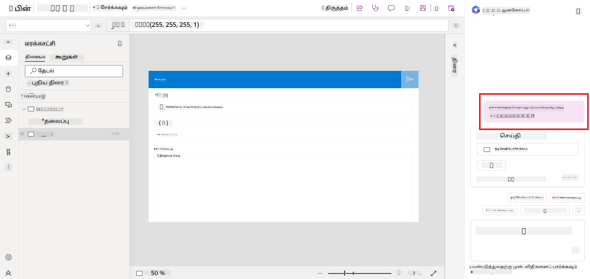
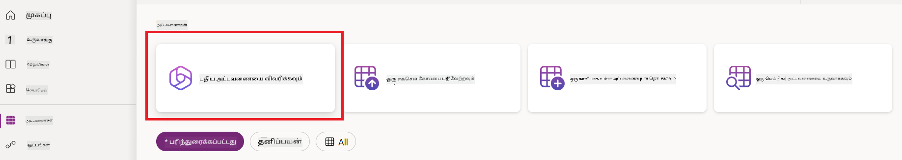
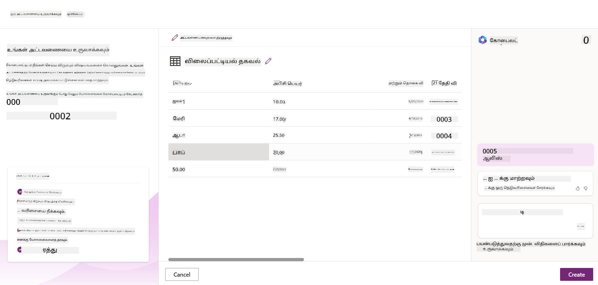
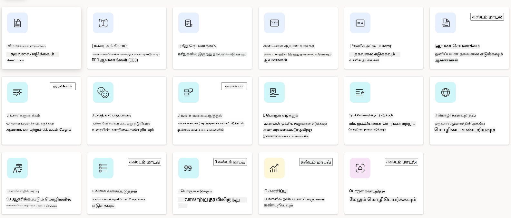
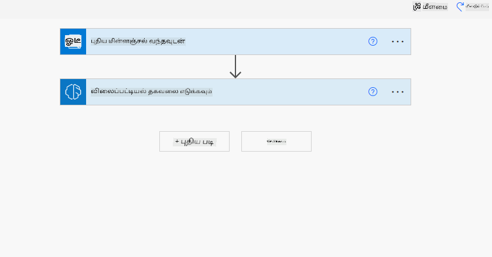
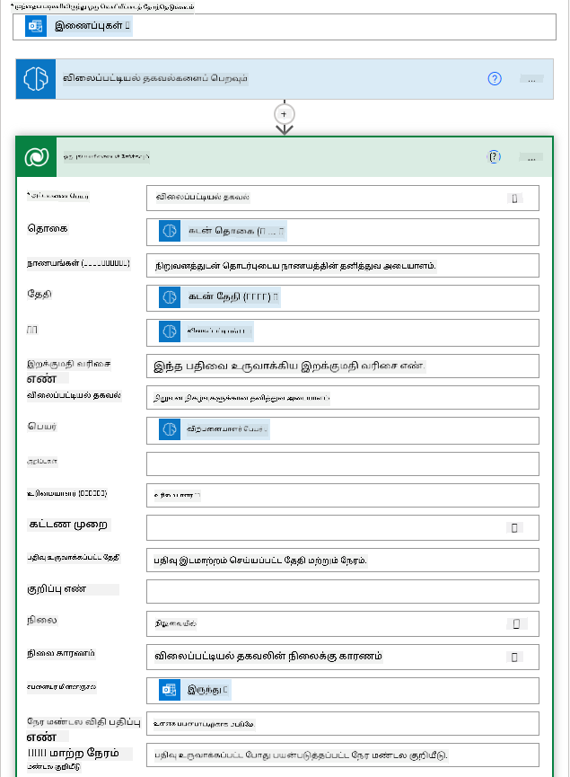

<!--
CO_OP_TRANSLATOR_METADATA:
{
  "original_hash": "846ac8e3b7dcfb697d3309fec05f0fea",
  "translation_date": "2025-10-18T02:40:41+00:00",
  "source_file": "10-building-low-code-ai-applications/README.md",
  "language_code": "ta"
}
-->
# குறைந்த குறியீடு AI பயன்பாடுகளை உருவாக்குதல்

> _(மேலே உள்ள படத்தை கிளிக் செய்து இந்த பாடத்தின் வீடியோவைப் பாருங்கள்)_

## அறிமுகம்

நாம் படங்களை உருவாக்கும் பயன்பாடுகளை உருவாக்குவது எப்படி என்பதை கற்றுக்கொண்ட பிறகு, குறைந்த குறியீடு பற்றி பேசுவோம். ஜெனரேட்டிவ் AI பல்வேறு துறைகளுக்கு பயன்படுத்தப்படலாம், அதில் குறைந்த குறியீடு ஒன்றாகும். ஆனால் குறைந்த குறியீடு என்றால் என்ன? அதில் AIயை எப்படி சேர்க்கலாம்?

சாதாரண டெவலப்பர்கள் மற்றும் டெவலப்பர்கள் அல்லாதவர்களுக்கும் குறைந்த குறியீடு மேம்பாட்டு தளங்களைப் பயன்படுத்தி பயன்பாடுகள் மற்றும் தீர்வுகளை உருவாக்குவது எளிதாகிவிட்டது. குறைந்த குறியீடு மேம்பாட்டு தளங்கள் குறைந்த அல்லது எந்த குறியீடு இல்லாமல் பயன்பாடுகள் மற்றும் தீர்வுகளை உருவாக்க அனுமதிக்கின்றன. இது பயன்பாடுகள் மற்றும் தீர்வுகளை வேகமாகவும் குறைந்த வளங்களுடன் உருவாக்குவதற்கு உதவுகிறது. இந்த பாடத்தில், குறைந்த குறியீடு மற்றும் Power Platform-ஐப் பயன்படுத்தி AIயுடன் குறைந்த குறியீடு மேம்பாட்டை மேம்படுத்துவது எப்படி என்பதை ஆழமாக ஆராய்கிறோம்.

Power Platform நிறுவனங்களுக்கு தங்கள் குழுக்களை தங்கள் சொந்த தீர்வுகளை உருவாக்க ஒரு எளிய குறைந்த குறியீடு அல்லது குறியீடு இல்லாத சூழலின் மூலம் அதிகாரமளிக்க வாய்ப்பை வழங்குகிறது. இந்த சூழல் தீர்வுகளை உருவாக்கும் செயல்முறையை எளிமையாக்க உதவுகிறது. Power Platform மூலம், தீர்வுகள் மாதங்கள் அல்லது ஆண்டுகளுக்கு பதிலாக நாட்கள் அல்லது வாரங்களில் உருவாக்கப்படலாம். Power Platform ஐந்து முக்கிய தயாரிப்புகளை கொண்டுள்ளது: Power Apps, Power Automate, Power BI, Power Pages மற்றும் Copilot Studio.

இந்த பாடம் கற்றுக்கொடுக்கிறது:

- Power Platform-ல் ஜெனரேட்டிவ் AI-க்கு அறிமுகம்
- Copilot-க்கு அறிமுகம் மற்றும் அதை எப்படி பயன்படுத்துவது
- Power Platform-ல் ஜெனரேட்டிவ் AIயை பயன்படுத்தி பயன்பாடுகள் மற்றும் பாய்ச்சல்களை உருவாக்குதல்
- AI Builder உடன் Power Platform-ல் AI மாதிரிகளைப் புரிந்துகொள்வது

## கற்றல் இலக்குகள்

இந்த பாடத்தின் முடிவில், நீங்கள்:

- Power Platform-ல் Copilot எப்படி செயல்படுகிறது என்பதைப் புரிந்துகொள்வீர்கள்.

- எங்கள் கல்வி ஸ்டார்ட்அப் நிறுவனத்திற்கான மாணவர் பணிக்குறிப்பு கண்காணிப்பு பயன்பாட்டை உருவாக்குவீர்கள்.

- விலைப்பட்டியல் தகவலை எடுக்க AIயை பயன்படுத்தும் ஒரு விலைப்பட்டியல் செயலாக்க பாய்ச்சலை உருவாக்குவீர்கள்.

- GPT AI மாதிரியைப் பயன்படுத்தி உரை உருவாக்குவதற்கான சிறந்த நடைமுறைகளைப் பயன்படுத்துவீர்கள்.

இந்த பாடத்தில் நீங்கள் பயன்படுத்தும் கருவிகள் மற்றும் தொழில்நுட்பங்கள்:

- **Power Apps**, மாணவர் பணிக்குறிப்பு கண்காணிப்பு பயன்பாட்டிற்காக, இது தரவுகளை கண்காணிக்க, நிர்வகிக்க மற்றும் தொடர்பு கொள்ள பயன்பாடுகளை உருவாக்க குறைந்த குறியீடு மேம்பாட்டு சூழலை வழங்குகிறது.

- **Dataverse**, மாணவர் பணிக்குறிப்பு கண்காணிப்பு பயன்பாட்டிற்கான தரவுகளை சேமிக்க, Dataverse பயன்பாட்டின் தரவுகளை சேமிக்க குறைந்த குறியீடு தரவுத்தளத்தை வழங்கும்.

- **Power Automate**, விலைப்பட்டியல் செயலாக்க பாய்ச்சலுக்காக, இது விலைப்பட்டியல் செயலாக்க செயல்முறையை தானியங்கமாக்க குறைந்த குறியீடு மேம்பாட்டு சூழலை வழங்கும்.

- **AI Builder**, விலைப்பட்டியல் செயலாக்க AI மாதிரிக்காக, எங்கள் ஸ்டார்ட்அப்பிற்கான விலைப்பட்டியல்களை செயலாக்க முன்பதிவுசெய்யப்பட்ட AI மாதிரிகளை நீங்கள் பயன்படுத்துவீர்கள்.

## Power Platform-ல் ஜெனரேட்டிவ் AI

ஜெனரேட்டிவ் AIயுடன் குறைந்த குறியீடு மேம்பாட்டை மற்றும் பயன்பாட்டை மேம்படுத்துவது Power Platform-க்கு முக்கியமான கவனத்திற்குரிய பகுதி ஆகும். AI நிபுணத்துவம் தேவையில்லாமல், அனைவரும் AI-யை அடிப்படையாகக் கொண்ட பயன்பாடுகள், தளங்கள், டாஷ்போர்டுகள் மற்றும் செயல்முறைகளை தானியங்கமாக்க உருவாக்க முடியும் என்பதே இதன் நோக்கம். இந்த நோக்கம் Copilot மற்றும் AI Builder வடிவில் Power Platform-ல் குறைந்த குறியீடு மேம்பாட்டு அனுபவத்தில் ஜெனரேட்டிவ் AIயை ஒருங்கிணைப்பதன் மூலம் அடையப்படுகிறது.

### இது எப்படி செயல்படுகிறது?

Copilot என்பது ஒரு AI உதவியாளர் ஆகும், இது இயற்கை மொழியைப் பயன்படுத்தி உரையாடல் படிகளின் மூலம் உங்கள் தேவைகளை விவரிப்பதன் மூலம் Power Platform தீர்வுகளை உருவாக்க உதவுகிறது. உதாரணமாக, உங்கள் பயன்பாடு எந்த புலங்களைப் பயன்படுத்தும் என்பதை உங்கள் AI உதவியாளரிடம் கூறலாம், அது பயன்பாட்டையும் அடிப்படை தரவுத்தள மாதிரியையும் உருவாக்கும் அல்லது Power Automate-ல் பாய்ச்சலை எப்படி அமைக்க வேண்டும் என்பதை குறிப்பிடலாம்.

Copilot இயக்கப்படும் செயல்பாடுகளை உங்கள் பயன்பாட்டு திரைகளில் ஒரு அம்சமாகப் பயன்படுத்தி, உரையாடல் தொடர்புகளின் மூலம் உள்ளடக்கங்களை கண்டறிய பயனர்களை நீங்கள் அனுமதிக்கலாம்.

AI Builder என்பது Power Platform-ல் கிடைக்கும் குறைந்த குறியீடு AI திறன் ஆகும், இது செயல்முறைகளை தானியங்கமாக்கவும் முடிவுகளை கணிக்கவும் AI மாதிரிகளைப் பயன்படுத்த உதவுகிறது. AI Builder மூலம், Dataverse அல்லது SharePoint, OneDrive அல்லது Azure போன்ற பல்வேறு கிளவுட் தரவுத் தரவகங்களுடன் இணைக்கப்பட்ட உங்கள் பயன்பாடுகள் மற்றும் பாய்ச்சல்களுக்கு AIயை கொண்டு வரலாம்.

Copilot அனைத்து Power Platform தயாரிப்புகளிலும் கிடைக்கிறது: Power Apps, Power Automate, Power BI, Power Pages மற்றும் Power Virtual Agents. AI Builder Power Apps மற்றும் Power Automate-ல் கிடைக்கிறது. இந்த பாடத்தில், எங்கள் கல்வி ஸ்டார்ட்அப்பிற்கான தீர்வை உருவாக்க Power Apps மற்றும் Power Automate-ல் Copilot மற்றும் AI Builder-ஐ எப்படி பயன்படுத்துவது என்பதை நாங்கள் கவனிக்கிறோம்.

### Power Apps-ல் Copilot

Power Platform-இன் ஒரு பகுதியாக, Power Apps என்பது தரவுகளை கண்காணிக்க, நிர்வகிக்க மற்றும் தொடர்பு கொள்ள பயன்பாடுகளை உருவாக்க குறைந்த குறியீடு மேம்பாட்டு சூழலை வழங்குகிறது. இது ஒரு அளவீடு செய்யக்கூடிய தரவுத்தளம் மற்றும் கிளவுட் சேவைகள் மற்றும் ஆன்-பிரமைசஸ் தரவுடன் இணைக்கும் திறன் கொண்ட பயன்பாட்டு மேம்பாட்டு சேவைகளின் தொகுப்பாகும். Power Apps உலாவிகள், டேப்லெட்டுகள் மற்றும் தொலைபேசிகளில் இயங்கும் பயன்பாடுகளை உருவாக்க அனுமதிக்கிறது மற்றும் அவற்றை இணை பணியாளர்களுடன் பகிரலாம். Power Apps ஒரு எளிய இடைமுகத்துடன் பயனர்களை பயன்பாட்டு மேம்பாட்டில் ஈடுபடுத்துகிறது, எனவே ஒவ்வொரு வணிக பயனர் அல்லது தொழில்முறை டெவலப்பரும் தனிப்பயன் பயன்பாடுகளை உருவாக்க முடியும். பயன்பாட்டு மேம்பாட்டு அனுபவம் Copilot மூலம் ஜெனரேட்டிவ் AIயுடன் மேலும் மேம்படுத்தப்பட்டுள்ளது.

Power Apps-ல் உள்ள Copilot AI உதவியாளர் அம்சம், நீங்கள் எந்த வகையான பயன்பாட்டை தேவைப்படுகிறீர்கள் மற்றும் உங்கள் பயன்பாடு எந்த தகவல்களை கண்காணிக்க, சேகரிக்க அல்லது காட்ட வேண்டும் என்பதை விவரிக்க அனுமதிக்கிறது. Copilot பின்னர் உங்கள் விளக்கத்தின் அடிப்படையில் ஒரு பதிலளிக்கும் கேன்வாஸ் பயன்பாட்டை உருவாக்குகிறது. பின்னர் உங்கள் தேவைகளை பூர்த்தி செய்ய பயன்பாட்டை தனிப்பயனாக்கலாம். AI Copilot உங்கள் தேவைகளை சேமிக்க தேவையான புலங்களுடன் Dataverse அட்டவணையையும் சில மாதிரி தரவுகளையும் உருவாக்கி பரிந்துரைக்கிறது. Dataverse என்ன மற்றும் Power Apps-ல் அதை எப்படி பயன்படுத்தலாம் என்பதை இந்த பாடத்தில் பின்னர் பார்க்கலாம். பின்னர் உரையாடல் படிகளின் மூலம் AI Copilot உதவியாளர் அம்சத்தைப் பயன்படுத்தி அட்டவணையை உங்கள் தேவைகளை பூர்த்தி செய்ய தனிப்பயனாக்கலாம். இந்த அம்சம் Power Apps முகப்புத் திரையில் இருந்து உடனடியாக கிடைக்கிறது.

### Power Automate-ல் Copilot

Power Platform-இன் ஒரு பகுதியாக, Power Automate பயனர்களை பயன்பாடுகள் மற்றும் சேவைகளுக்கு இடையில் தானியங்க செயல்பாடுகளை உருவாக்க அனுமதிக்கிறது. இது தொடர்பு, தரவுச் சேகரிப்பு மற்றும் முடிவு ஒப்புதல்களைப் போன்ற மீண்டும் மீண்டும் செய்யப்படும் வணிக செயல்முறைகளை தானியங்கமாக்க உதவுகிறது. அதன் எளிய இடைமுகம், தொடக்க நிலை பயனர்களிலிருந்து அனுபவமிக்க டெவலப்பர்கள் வரை அனைத்து தொழில்நுட்ப திறன்களையும் கொண்ட பயனர்களுக்கு வேலை பணிகளை தானியங்கமாக்க அனுமதிக்கிறது. செயல்முறை மேம்பாட்டு அனுபவம் Copilot மூலம் ஜெனரேட்டிவ் AIயுடன் மேலும் மேம்படுத்தப்பட்டுள்ளது.

Power Automate-ல் உள்ள Copilot AI உதவியாளர் அம்சம், நீங்கள் எந்த வகையான பாய்ச்சலை தேவைப்படுகிறீர்கள் மற்றும் உங்கள் பாய்ச்சல் எந்த நடவடிக்கைகளைச் செய்ய வேண்டும் என்பதை விவரிக்க அனுமதிக்கிறது. Copilot பின்னர் உங்கள் விளக்கத்தின் அடிப்படையில் ஒரு பாய்ச்சலை உருவாக்குகிறது. பின்னர் உங்கள் தேவைகளை பூர்த்தி செய்ய பாய்ச்சலை தனிப்பயனாக்கலாம். AI Copilot உங்கள் தேவைகளை தானியங்கமாக்க தேவையான நடவடிக்கைகளை உருவாக்கி பரிந்துரைக்கிறது. பாய்ச்சல்கள் என்ன மற்றும் Power Automate-ல் அவற்றைப் பயன்படுத்துவது எப்படி என்பதை இந்த பாடத்தில் பின்னர் பார்க்கலாம். பின்னர் உரையாடல் படிகளின் மூலம் AI Copilot உதவியாளர் அம்சத்தைப் பயன்படுத்தி நடவடிக்கைகளை உங்கள் தேவைகளை பூர்த்தி செய்ய தனிப்பயனாக்கலாம். இந்த அம்சம் Power Automate முகப்புத் திரையில் இருந்து உடனடியாக கிடைக்கிறது.

## பணிக்குறிப்பு: எங்கள் ஸ்டார்ட்அப்பிற்கான மாணவர் பணிக்குறிப்புகள் மற்றும் விலைப்பட்டியல்களை Copilot மூலம் நிர்வகிக்கவும்

எங்கள் ஸ்டார்ட்அப் மாணவர்களுக்கு ஆன்லைன் பாடங்களை வழங்குகிறது. ஸ்டார்ட்அப் வேகமாக வளர்ந்துள்ளது மற்றும் அதன் பாடங்களின் தேவை அதிகரித்ததால் தற்போது சிரமமாக உள்ளது. ஸ்டார்ட்அப் உங்களை Power Platform டெவலப்பராக நியமித்துள்ளது, இது அவர்களுக்கு தங்கள் மாணவர் பணிக்குறிப்புகள் மற்றும் விலைப்பட்டியல்களை நிர்வகிக்க உதவும் ஒரு குறைந்த குறியீடு தீர்வை உருவாக்க உதவுகிறது. அவர்களின் தீர்வு, ஒரு பயன்பாட்டின் மூலம் மாணவர் பணிக்குறிப்புகளை கண்காணிக்கவும் நிர்வகிக்கவும் மற்றும் ஒரு பாய்ச்சல் மூலம் விலைப்பட்டியல் செயலாக்க செயல்முறையை தானியங்கமாக்கவும் உதவ வேண்டும். இந்த தீர்வை உருவாக்க ஜெனரேட்டிவ் AIயை பயன்படுத்த உங்களை கேட்டுக்கொண்டுள்ளனர்.

Copilot-ஐப் பயன்படுத்தத் தொடங்கும்போது, [Power Platform Copilot Prompt Library](https://github.com/pnp/powerplatform-prompts?WT.mc_id=academic-109639-somelezediko) ஐப் பயன்படுத்தி உங்களது ப்ராம்ப்ட்களை உருவாக்கத் தொடங்கலாம். இந்த நூலகம் Copilot மூலம் பயன்பாடுகள் மற்றும் பாய்ச்சல்களை உருவாக்க நீங்கள் பயன்படுத்தக்கூடிய ப்ராம்ப்ட்களின் பட்டியலைக் கொண்டுள்ளது. Copilot-க்கு உங்கள் தேவைகளை எப்படி விவரிக்க வேண்டும் என்பதற்கான ஒரு யோசனையைப் பெறவும் நீங்கள் நூலகத்தில் உள்ள ப்ராம்ப்ட்களைப் பயன்படுத்தலாம்.

### எங்கள் ஸ்டார்ட்அப்பிற்கான மாணவர் பணிக்குறிப்பு கண்காணிப்பு பயன்பாட்டை உருவாக்கவும்

எங்கள் ஸ்டார்ட்அப்பில் உள்ள கல்வியாளர்கள் மாணவர் பணிக்குறிப்புகளை கண்காணிக்க சிரமப்படுகிறார்கள். அவர்கள் பணிக்குறிப்புகளை கண்காணிக்க ஒரு ஸ்பிரெட்ஷீட்டை பயன்படுத்தி வந்தனர், ஆனால் மாணவர்களின் எண்ணிக்கை அதிகரித்ததால் இதை நிர்வகிக்க கடினமாகிவிட்டது. மாணவர் பணிக்குறிப்புகளை கண்காணிக்கவும் நிர்வகிக்கவும் உதவும் ஒரு பயன்பாட்டை உருவாக்குமாறு அவர்கள் உங்களை கேட்டுக்கொண்டனர். இந்த பயன்பாடு புதிய பணிக்குறிப்புகளைச் சேர்க்க, பணிக்குறிப்புகளைப் பார்க்க, புதுப்பிக்க மற்றும் நீக்க அனுமதிக்க வேண்டும். மேலும், இந்த பயன்பாடு மதிப்பீடு செய்யப்பட்ட பணிக்குறிப்புகள் மற்றும் மதிப்பீடு செய்யப்படாத பணிக்குறிப்புகளை கல்வியாளர்கள் மற்றும் மாணவர்கள் பார்க்க அனுமதிக்க வேண்டும்.

Power Apps-ல் Copilot-ஐப் பயன்படுத்தி கீழே உள்ள படிகளைப் பின்பற்றி பயன்பாட்டை உருவாக்குவீர்கள்:

1. [Power Apps](https://make.powerapps.com?WT.mc_id=academic-105485-koreyst) முகப்புத் திரைக்கு செல்லவும்.

1. நீங்கள் உருவாக்க விரும்பும் பயன்பாட்டை விவரிக்க முகப்புத் திரையில் உள்ள உரை பகுதியைப் பயன்படுத்தவும். உதாரணமாக, **_நான் மாணவர் பணிக்குறிப்புகளை கண்காணிக்கவும் நிர்வகிக்கவும் ஒரு பயன்பாட்டை உருவாக்க விரும்புகிறேன்_**. AI Copilot-க்கு ப்ராம்ப்ட்டை அனுப்ப **Send** பொத்தானை கிளிக் செய்யவும்.

1. AI Copilot, நீங்கள் கண்காணிக்க விரும்பும் தரவுகளை சேமிக்க தேவையான புலங்களுடன் Dataverse அட்டவணையை மற்றும் சில மாதிரி தரவுகளை பரிந்துரைக்கும். பின்னர் உரையாடல் படிகளின் மூலம் AI Copilot உதவியாளர் அம்சத்தைப் பயன்படுத்தி அட்டவணையை உங்கள் தேவைகளை பூர்த்தி செய்ய தனிப்பயனாக்கலாம்.

   > **முக்கியம்**: Dataverse என்பது Power Platform-க்கு அடிப்படை தரவுத்தளம் ஆகும். இது பயன்பாட்டின் தரவுகளை சேமிக்க குறைந்த குறியீடு தரவுத்தளத்தை வழங்குகிறது. இது Microsoft Cloud-ல் தரவுகளை பாதுகாப்பாக சேமிக்கும் முழுமையாக நிர்வகிக்கப்படும் சேவையாகும் மற்றும் உங்கள் Power Platform சூழலில் வழங்கப்படுகிறது. இது தரவு வகைப்பாடு, தரவின் வரலாறு, நுணுக்கமான அணுகல் கட்டுப்பாடு மற்றும் பலவற்றைப் போன்ற உள்ளமைக்கப்பட்ட தரவுக் கவர்னன்ஸ் திறன்களுடன் வருகிறது. Dataverse பற்றி மேலும் [இங்கே](https://docs.microsoft.com/powerapps/maker/data-platform/data-platform-intro?WT.mc_id=academic-109639-somelezediko) அறியலாம்.

   

1. கல்வியாளர்கள், தங்கள் பணிக்குறிப்புகளை சமர்ப்பித்த மாணவர்களுக்கு மின்னஞ்சல்கள் அனுப்பி, அவர்களின் பணிக்குறிப்புகளின் முன்னேற்றத்தைப் பற்றி புதுப்பித்தல் செய்ய விரும்புகிறார்கள். அட்டவணையில் மாணவர் மின்னஞ்சலை சேமிக்க ஒரு புதிய புலத்தைச் சேர்க்க Copilot-ஐ நீங்கள் பயன்படுத்தலாம். உதாரணமாக, **_மாணவர் மின்னஞ்சலை சேமிக்க ஒரு பத்தியைச் சேர்க்க விரும்புகிறேன்_** என்ற ப்ராம்ப்ட்டை பயன்படுத்தலாம். AI Copilot-க்கு ப்ராம்ப்ட்டை அனுப்ப **Send** பொத்தானை கிளிக் செய்யவும்.

1. AI Copilot ஒரு புதிய புலத்தை உருவாக்கும், பின்னர் நீங்கள் புலத்தை உங்கள் தேவைகளை பூர்த்தி செய்ய தனிப்பயனாக்கலாம்.

1. அட்டவணையை முடித்தவுடன், **Create app** பொத்தானை கிளிக் செய்து பயன்பாட்டை உருவாக்கவும்.

1. AI Copilot உங்கள் விளக்கத்தின் அடிப்படையில் ஒரு பதிலளிக்கும் கேன்வாஸ் பயன்பாட்டை உருவாக்கும். பின்னர் உங்கள் தேவைகளை பூர்த்தி செய்ய பயன்பாட்டை தனிப்பயனாக்கலாம்.

1. கல்வியாளர்கள் மாணவர்களுக்கு மின்னஞ்சல்கள் அனுப்ப, நீங்கள் Copilot-ஐ பயன்படுத்தி பயன்பாட்டில் ஒரு புதிய திரையைச் சேர்க்கலாம். உதாரணமாக, **_மாணவர்களுக்கு மின்னஞ்சல்கள் அனுப்ப ஒரு திரையைச் சேர்க்க விரும்புகிறேன்_** என்ற ப்ராம்ப்ட்டை பயன்படுத்தலாம். AI Copilot-க்கு ப்ராம்ப்ட்டை அனுப்ப **Send** பொத்தானை கிளிக் செய்யவும்.

1. AI Copilot ஒரு புதிய திரையை உருவாக்கும், பின்னர் நீங்கள் திரையை உங்கள் தேவைகளை பூர்த்தி செய்ய தனிப்பயனாக்கலாம்.

1. பயன்பாட்டை முடித்தவுடன், **Save** பொத்தானை கிளிக் செய்து பயன்பாட்டை சேமிக்கவும்.

1. கல்வியாளர்களுடன் பயன்பாட்டை பகிர, **Share** பொத்தானை கிளிக் செய்து பின்னர் **Share** பொத்தானை மீண்டும் கிளிக் செய்யவும். பின்னர் கல்வியாளர்களின் மின்னஞ்சல் முகவரிகளை உள்ளீடு செய்து பயன்பாட்டை அவர்களுடன் பகிரலாம்.

> **உங்கள் வீட்டுப்பாடம்**: நீங்கள் உருவாக்கிய பயன்பாடு ஒரு நல்ல தொடக்கம், ஆனால் மேலும் மேம்படுத்தப்படலாம். மின்னஞ்சல் அம்சத்துடன், கல்வியாளர்கள் மாணவர்களுக்கு மின்னஞ்சல்கள் அனுப்ப, அவர்களின் மின்னஞ்சல்களை தட்டச்சு செய்ய வேண்டும். Copilot-ஐ பயன்படுத்தி கல்வியாளர்கள் மாணவர்கள் தங்கள் பணிக்குறிப்ப
என் ஸ்டார்ட்அப்பிற்கான Dataverse ஐ ஏன் பயன்படுத்த வேண்டும்? Dataverse உள்ள தரவுத்தொகுப்புகள் மற்றும் தனிப்பயன் அட்டவணைகள் உங்கள் தரவுக்கான பாதுகாப்பான மற்றும் மேக அடிப்படையிலான சேமிப்பு விருப்பத்தை வழங்குகின்றன. Excel வேலைப்புத்தகத்தில் பல வேலைத்தாள்களைப் பயன்படுத்துவது போலவே, அட்டவணைகள் பல்வேறு வகையான தரவுகளை சேமிக்க உதவுகின்றன. உங்கள் நிறுவனத்தின் அல்லது வணிக தேவைகளுக்கேற்ப தனிப்பட்ட தரவுகளை சேமிக்க அட்டவணைகளைப் பயன்படுத்தலாம். Dataverse ஐ பயன்படுத்துவதன் மூலம் எங்கள் ஸ்டார்ட்அப்பிற்கு கிடைக்கும் பல நன்மைகள் உள்ளன, அவற்றில் சில:

- **சுலபமாக நிர்வகிக்க**: Metadata மற்றும் தரவுகள் இரண்டும் மேகத்தில் சேமிக்கப்படுகின்றன, எனவே அவை எவ்வாறு சேமிக்கப்படுகின்றன அல்லது நிர்வகிக்கப்படுகின்றன என்பதைப் பற்றி கவலைப்பட தேவையில்லை. உங்கள் பயன்பாடுகள் மற்றும் தீர்வுகளை உருவாக்குவதில் கவனம் செலுத்தலாம்.

- **பாதுகாப்பானது**: Dataverse உங்கள் தரவுக்கான பாதுகாப்பான மற்றும் மேக அடிப்படையிலான சேமிப்பு விருப்பத்தை வழங்குகிறது. உங்கள் அட்டவணைகளில் உள்ள தரவுகளுக்கு யார் அணுகலாம் மற்றும் அவர்கள் அதை எவ்வாறு அணுகலாம் என்பதை நீங்கள் ரோல் அடிப்படையிலான பாதுகாப்பை பயன்படுத்தி கட்டுப்படுத்தலாம்.

- **சிறந்த metadata**: தரவுவகைகள் மற்றும் உறவுகள் நேரடியாக Power Apps இல் பயன்படுத்தப்படுகின்றன.

- **தர்க்கம் மற்றும் சரிபார்ப்பு**: வணிக விதிகள், கணிக்கப்பட்ட புலங்கள் மற்றும் சரிபார்ப்பு விதிகளைப் பயன்படுத்தி வணிக தர்க்கத்தை அமல்படுத்தவும், தரவின் துல்லியத்தை பராமரிக்கவும் முடியும்.

Dataverse என்ன மற்றும் ஏன் அதை நீங்கள் பயன்படுத்த வேண்டும் என்பதை நீங்கள் அறிந்த பிறகு, நமது நிதி குழுவின் தேவைகளை பூர்த்தி செய்ய Dataverse இல் அட்டவணையை உருவாக்க Copilot ஐ எப்படி பயன்படுத்தலாம் என்பதை பார்ப்போம்.

> **குறிப்பு**: இந்த அட்டவணையை நீங்கள் அடுத்த பகுதியில் பயன்படுத்தி அனைத்து விலைப்பட்டியல் தகவலையும் எடுத்து அட்டவணையில் சேமிக்க ஒரு தானியங்கலை உருவாக்குவீர்கள்.

Copilot ஐப் பயன்படுத்தி Dataverse இல் ஒரு அட்டவணையை உருவாக்க, கீழே உள்ள படிகளைப் பின்பற்றவும்:

1. [Power Apps](https://make.powerapps.com?WT.mc_id=academic-105485-koreyst) முகப்புத்திரையில் செல்லவும்.

2. இடது வழிச் சாளரத்தில் **Tables** ஐத் தேர்ந்தெடுத்து **Describe the new Table** ஐ கிளிக் செய்யவும்.

3. **Describe the new Table** திரையில், நீங்கள் உருவாக்க விரும்பும் அட்டவணையை விவரிக்க உரை பகுதியைப் பயன்படுத்தவும். உதாரணமாக, **_விலைப்பட்டியல் தகவலை சேமிக்க ஒரு அட்டவணையை உருவாக்க விரும்புகிறேன்_**. AI Copilot க்கு கேள்வியை அனுப்ப **Send** பொத்தானை கிளிக் செய்யவும்.

4. AI Copilot உங்களுக்கு தேவையான தரவுகளை சேமிக்க புலங்களுடன் Dataverse அட்டவணையை பரிந்துரைக்கும் மற்றும் சில மாதிரி தரவுகளை வழங்கும். பின்னர், உரையாடல் படிகள் மூலம் AI Copilot உதவியுடன் உங்கள் தேவைகளை பூர்த்தி செய்ய அட்டவணையை தனிப்பயனாக்கலாம்.

5. நிதி குழு விலைப்பட்டியலின் தற்போதைய நிலையை புதுப்பிக்க சப்ளையருக்கு மின்னஞ்சல் அனுப்ப விரும்புகிறது. அட்டவணையில் சப்ளையர் மின்னஞ்சலை சேமிக்க புதிய புலத்தைச் சேர்க்க Copilot ஐப் பயன்படுத்தலாம். உதாரணமாக, **_சப்ளையர் மின்னஞ்சலை சேமிக்க ஒரு பத்தியைச் சேர்க்க விரும்புகிறேன்_** என்ற கேள்வியை பயன்படுத்தலாம். AI Copilot க்கு கேள்வியை அனுப்ப **Send** பொத்தானை கிளிக் செய்யவும்.

6. AI Copilot ஒரு புதிய புலத்தை உருவாக்கும், பின்னர் உங்கள் தேவைகளை பூர்த்தி செய்ய புலத்தை தனிப்பயனாக்கலாம்.

7. அட்டவணையை முடித்த பிறகு, **Create** பொத்தானை கிளிக் செய்து அட்டவணையை உருவாக்கவும்.

## Power Platform இல் AI Builder உடன் AI மாதிரிகள்

AI Builder என்பது Power Platform இல் கிடைக்கும் குறைந்த குறியீட்டு AI திறன் ஆகும், இது உங்கள் செயல்முறைகளை தானியங்கமாக்கவும் முடிவுகளை கணிக்கவும் உதவ AI மாதிரிகளைப் பயன்படுத்த அனுமதிக்கிறது. AI Builder மூலம், Dataverse அல்லது SharePoint, OneDrive அல்லது Azure போன்ற பல மேக தரவூட்டங்களுடன் இணைக்கும் உங்கள் பயன்பாடுகள் மற்றும் ஓடைகளுக்கு AI ஐ கொண்டு வரலாம்.

## முன்பயிற்சி செய்யப்பட்ட AI மாதிரிகள் மற்றும் தனிப்பயன் AI மாதிரிகள்

AI Builder இரண்டு வகையான AI மாதிரிகளை வழங்குகிறது: முன்பயிற்சி செய்யப்பட்ட AI மாதிரிகள் மற்றும் தனிப்பயன் AI மாதிரிகள். Microsoft மூலம் பயிற்சி செய்யப்பட்ட மற்றும் Power Platform இல் கிடைக்கும் முன்பயிற்சி செய்யப்பட்ட AI மாதிரிகள் உங்கள் பயன்பாடுகள் மற்றும் ஓடைகளுக்கு நுண்ணறிவு சேர்க்க உதவுகின்றன, உங்கள் சொந்த மாதிரிகளை உருவாக்க, பயிற்சி செய்ய மற்றும் வெளியிட தரவுகளை சேகரிக்க தேவையில்லை. இந்த மாதிரிகளை செயல்முறைகளை தானியங்கமாக்கவும் முடிவுகளை கணிக்கவும் பயன்படுத்தலாம்.

Power Platform இல் கிடைக்கும் சில முன்பயிற்சி செய்யப்பட்ட AI மாதிரிகள்:

- **முக்கிய சொற்களை எடுக்கும் முறை**: இந்த மாதிரி உரையிலிருந்து முக்கிய சொற்களை எடுக்கும்.
- **மொழி கண்டறிதல்**: இந்த மாதிரி உரையின் மொழியை கண்டறியும்.
- **மனநிலை பகுப்பாய்வு**: இந்த மாதிரி உரையில் நேர்மறை, எதிர்மறை, நடுநிலை அல்லது கலந்த மனநிலையை கண்டறியும்.
- **வணிக அட்டை வாசிப்பு**: இந்த மாதிரி வணிக அட்டைகளிலிருந்து தகவல்களை எடுக்கும்.
- **உரை அங்கீகாரம்**: இந்த மாதிரி படங்களிலிருந்து உரையை எடுக்கும்.
- **உருவம் கண்டறிதல்**: இந்த மாதிரி படங்களிலிருந்து உருவங்களை கண்டறிந்து எடுக்கும்.
- **ஆவண செயலாக்கம்**: இந்த மாதிரி படிவங்களிலிருந்து தகவல்களை எடுக்கும்.
- **விலைப்பட்டியல் செயலாக்கம்**: இந்த மாதிரி விலைப்பட்டியலிலிருந்து தகவல்களை எடுக்கும்.

தனிப்பயன் AI மாதிரிகளுடன், உங்கள் சொந்த மாதிரியை AI Builder இல் கொண்டு வரலாம், இது எந்த AI Builder தனிப்பயன் மாதிரியாகவும் செயல்பட அனுமதிக்கிறது, உங்கள் சொந்த தரவுகளைப் பயன்படுத்தி மாதிரியை பயிற்சி செய்ய அனுமதிக்கிறது. இந்த மாதிரிகளை Power Apps மற்றும் Power Automate இல் செயல்முறைகளை தானியங்கமாக்கவும் முடிவுகளை கணிக்கவும் பயன்படுத்தலாம். உங்கள் சொந்த மாதிரியைப் பயன்படுத்தும்போது சில வரம்புகள் பொருந்தும். இந்த [வரம்புகள்](https://learn.microsoft.com/ai-builder/byo-model#limitations?WT.mc_id=academic-105485-koreyst) பற்றி மேலும் படிக்கவும்.

## பணிக்குறிப்பு #2 - எங்கள் ஸ்டார்ட்அப்பிற்கான விலைப்பட்டியல் செயலாக்க ஓடையை உருவாக்கவும்

நிதி குழு விலைப்பட்டியல்களை செயலாக்க சிரமப்படுகின்றது. அவர்கள் விலைப்பட்டியல்களை கண்காணிக்க ஒரு ஸ்பிரெட்ஷீட்டை பயன்படுத்தி வந்தனர், ஆனால் விலைப்பட்டியல்களின் எண்ணிக்கை அதிகரித்ததால் இதை நிர்வகிக்க கடினமாகிவிட்டது. AI ஐப் பயன்படுத்தி விலைப்பட்டியல்களை செயலாக்க உதவும் ஒரு வேலைப்போக்கை உருவாக்குமாறு அவர்கள் உங்களை கேட்டுள்ளனர். இந்த வேலைப்போக்கு விலைப்பட்டியலிலிருந்து தகவல்களை எடுத்து, அந்த தகவல்களை Dataverse அட்டவணையில் சேமிக்க அனுமதிக்க வேண்டும். மேலும், நிதி குழுவிற்கு எடுக்கப்பட்ட தகவல்களுடன் மின்னஞ்சல் அனுப்பவும் அனுமதிக்க வேண்டும்.

AI Builder என்ன மற்றும் ஏன் அதை நீங்கள் பயன்படுத்த வேண்டும் என்பதை நீங்கள் அறிந்த பிறகு, நிதி குழுவிற்கு விலைப்பட்டியல்களை செயலாக்க உதவும் ஒரு வேலைப்போக்கை உருவாக்க AI Builder இல் உள்ள Invoice Processing AI Model ஐ எப்படி பயன்படுத்தலாம் என்பதை பார்ப்போம்.

Invoice Processing AI Model ஐ பயன்படுத்தி நிதி குழுவிற்கு விலைப்பட்டியல்களை செயலாக்க உதவும் ஒரு வேலைப்போக்கை உருவாக்க, கீழே உள்ள படிகளைப் பின்பற்றவும்:

1. [Power Automate](https://make.powerautomate.com?WT.mc_id=academic-105485-koreyst) முகப்புத்திரையில் செல்லவும்.

2. முகப்புத்திரையில் உள்ள உரை பகுதியைப் பயன்படுத்தி நீங்கள் உருவாக்க விரும்பும் வேலைப்போக்கை விவரிக்கவும். உதாரணமாக, **_என் மின்னஞ்சல் பெட்டியில் விலைப்பட்டியல் வந்தவுடன் அதை செயலாக்கவும்_**. AI Copilot க்கு கேள்வியை அனுப்ப **Send** பொத்தானை கிளிக் செய்யவும்.

   

3. AI Copilot நீங்கள் தானியங்கமாக்க விரும்பும் பணியைச் செய்ய தேவையான நடவடிக்கைகளை பரிந்துரைக்கும். **Next** பொத்தானை கிளிக் செய்து அடுத்த படிகளைப் பின்பற்றவும்.

4. அடுத்த படியில், Power Automate வேலைப்போக்கிற்கான இணைப்புகளை அமைக்க உங்களைத் தூண்டும். முடிந்தவுடன், **Create flow** பொத்தானை கிளிக் செய்து வேலைப்போக்கை உருவாக்கவும்.

5. AI Copilot ஒரு வேலைப்போக்கை உருவாக்கும், பின்னர் உங்கள் தேவைகளை பூர்த்தி செய்ய வேலைப்போக்கை தனிப்பயனாக்கலாம்.

6. வேலைப்போக்கின் தொடக்கத்தை புதுப்பித்து, **Folder** ஐ விலைப்பட்டியல்கள் சேமிக்கப்படும் கோப்பகமாக அமைக்கவும். உதாரணமாக, கோப்பகத்தை **Inbox** ஆக அமைக்கலாம். **Show advanced options** ஐ கிளிக் செய்து **Only with Attachments** ஐ **Yes** ஆக அமைக்கவும். இது ஒரு இணைப்பு கொண்ட மின்னஞ்சல் கோப்பகத்தில் வந்தால் மட்டுமே வேலைப்போக்கு இயங்கும்.

7. வேலைப்போக்கிலிருந்து **HTML to text**, **Compose**, **Compose 2**, **Compose 3** மற்றும் **Compose 4** ஆகிய நடவடிக்கைகளை நீக்கவும், ஏனெனில் நீங்கள் அவற்றைப் பயன்படுத்தப் போவதில்லை.

8. வேலைப்போக்கிலிருந்து **Condition** நடவடிக்கையை நீக்கவும், ஏனெனில் நீங்கள் அதை பயன்படுத்தப் போவதில்லை. இது பின்வரும் ஸ்கிரீன்ஷாட்டைப் போல இருக்க வேண்டும்:

   

9. **Add an action** பொத்தானை கிளிக் செய்து **Dataverse** ஐ தேடவும். **Add a new row** நடவடிக்கையைத் தேர்ந்தெடுக்கவும்.

10. **Extract Information from invoices** நடவடிக்கையில், மின்னஞ்சலிலிருந்து **Attachment Content** ஐச் சுட்டிக்காட்ட **Invoice File** ஐப் புதுப்பிக்கவும். இது வேலைப்போக்கு விலைப்பட்டியல் இணைப்பிலிருந்து தகவல்களை எடுக்கும்.

11. நீங்கள் முன்பு உருவாக்கிய **Table** ஐத் தேர்ந்தெடுக்கவும். உதாரணமாக, **Invoice Information** அட்டவணையைத் தேர்ந்தெடுக்கலாம். முந்தைய நடவடிக்கையிலிருந்து dinamic content ஐப் பயன்படுத்தி பின்வரும் புலங்களை நிரப்பவும்:

    - ID
    - Amount
    - Date
    - Name
    - Status - **Status** ஐ **Pending** ஆக அமைக்கவும்.
    - Supplier Email - **When a new email arrives** தொடக்கத்திலிருந்து **From** dinamic content ஐப் பயன்படுத்தவும்.

    

12. வேலைப்போக்கை முடித்த பிறகு, **Save** பொத்தானை கிளிக் செய்து வேலைப்போக்கைச் சேமிக்கவும். நீங்கள் குறிப்பிட்ட கோப்பகத்திற்கு விலைப்பட்டியலுடன் மின்னஞ்சல் அனுப்புவதன் மூலம் வேலைப்போக்கைச் சோதிக்கலாம்.

> **உங்கள் வீட்டுப்பாடம்**: நீங்கள் உருவாக்கிய வேலைப்போக்கு ஒரு நல்ல தொடக்கம், இப்போது நிதி குழுவிற்கு விலைப்பட்டியலின் தற்போதைய நிலையை புதுப்பிக்க சப்ளையருக்கு மின்னஞ்சல் அனுப்ப உதவும் ஒரு தானியங்கலை உருவாக்க எப்படி சிந்திக்கலாம் என்பதை நீங்கள் யோசிக்க வேண்டும். உங்கள் குறிப்புகள்: விலைப்பட்டியலின் நிலை மாற்றப்படும் போது வேலைப்போக்கு இயங்க வேண்டும்.

## Power Automate இல் Text Generation AI Model ஐப் பயன்படுத்தவும்

AI Builder இல் உள்ள Create Text with GPT AI Model, Microsoft Azure OpenAI Service மூலம் இயக்கப்படுகிறது, இது ஒரு கேள்வியின் அடிப்படையில் உரையை உருவாக்க அனுமதிக்கிறது. இந்த திறன் மூலம், GPT (Generative Pre-Trained Transformer) தொழில்நுட்பத்தை உங்கள் பயன்பாடுகள் மற்றும் வேலைப்போக்குகளில் இணைத்து பல்வேறு தானியங்க வேலைப்போக்குகள் மற்றும் ஆழ்ந்த பயன்பாடுகளை உருவாக்கலாம்.

GPT மாதிரிகள் பரந்த அளவிலான தரவுகளில் விரிவான பயிற்சியை மேற்கொள்கின்றன, இது ஒரு கேள்வி வழங்கப்பட்டால் மனித மொழியை நெருக்கமாக ஒத்த உரையை உருவாக்க அனுமதிக்கிறது. வேலைப்போக்கு தானியங்கத்துடன் ஒருங்கிணைக்கப்பட்டால், GPT போன்ற AI மாதிரிகளைப் பயன்படுத்தி பல்வேறு பணிகளை எளிமையாக்கவும் தானியங்கமாக்கவும் முடியும்.

உதாரணமாக, மின்னஞ்சல் வரைபடங்கள், தயாரிப்பு விளக்கங்கள் போன்ற பல்வேறு பயன்பாடுகளுக்கான உரையை தானியங்கமாக உருவாக்க வேலைப்போக்குகளை உருவாக்கலாம். மேலும், உரையை உருவாக்க பல்வேறு பயன்பாடுகளுக்கான மாதிரியைப் பயன்படுத்தலாம், உதாரணமாக, chatbot மற்றும் வாடிக்கையாளர் சேவை பயன்பாடுகள், வாடிக்கையாளர் கேள்விகளுக்கு வாடிக்கையாளர் சேவை முகவர்களுக்கு திறமையாகவும் திறமையாகவும் பதிலளிக்க உதவுகின்றன.

Power Automate இல் இந்த AI Model ஐ எப்படி பயன்படுத்துவது என்பதை அறிய, [Add intelligence with AI Builder and GPT](https://learn.microsoft.com/training/modules/ai-builder-text-generation/?WT.mc_id=academic-109639-somelezediko) மாடியுலை மூலம் செல்லவும்.

## சிறந்த வேலை! உங்கள் கற்றலை தொடருங்கள்

இந்த பாடத்தை முடித்த பிறகு, எங்கள் [Generative AI Learning collection](https://aka.ms/genai-collection?WT.mc_id=academic-105485-koreyst) ஐப் பார்வையிட்டு உங்கள் Generative AI அறிவை மேம்படுத்துங்கள்!

Lesson 11 க்கு செல்லுங்கள், அங்கு [Generative AI ஐ Function Calling உடன் ஒருங்கிணைப்பது](../11-integrating-with-function-calling/README.md?WT.mc_id=academic-105485-koreyst) எப்படி என்பதைப் பார்ப்போம்!

---

**குறிப்பு**:  
இந்த ஆவணம் AI மொழிபெயர்ப்பு சேவை [Co-op Translator](https://github.com/Azure/co-op-translator) பயன்படுத்தி மொழிபெயர்க்கப்பட்டுள்ளது. நாங்கள் துல்லியத்திற்காக முயற்சிக்கிறோம், ஆனால் தானியங்கி மொழிபெயர்ப்புகளில் பிழைகள் அல்லது தவறுகள் இருக்கக்கூடும் என்பதை கவனத்தில் கொள்ளவும். அதன் தாய்மொழியில் உள்ள மூல ஆவணம் அதிகாரப்பூர்வ ஆதாரமாக கருதப்பட வேண்டும். முக்கியமான தகவல்களுக்கு, தொழில்முறை மனித மொழிபெயர்ப்பு பரிந்துரைக்கப்படுகிறது. இந்த மொழிபெயர்ப்பைப் பயன்படுத்துவதால் ஏற்படும் எந்த தவறான புரிதல்கள் அல்லது தவறான விளக்கங்களுக்கு நாங்கள் பொறுப்பல்ல.