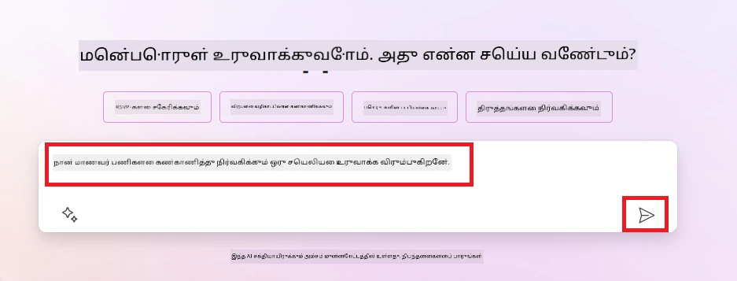
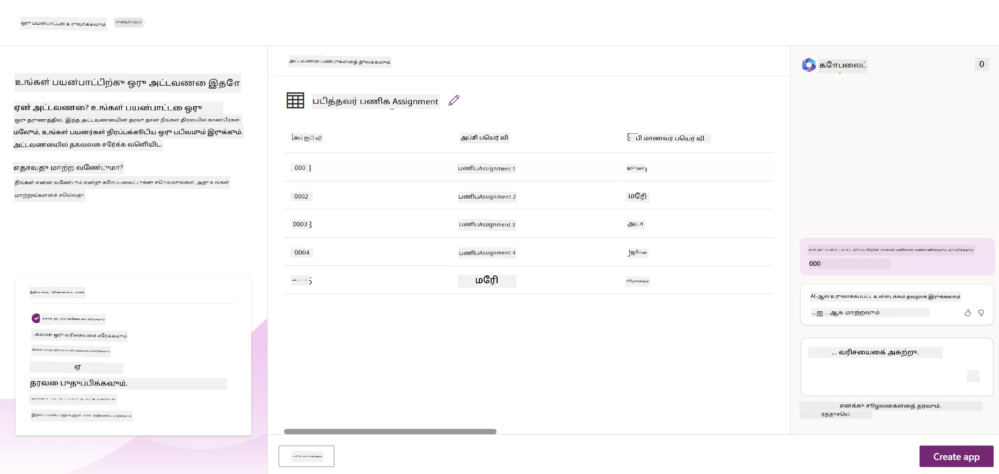
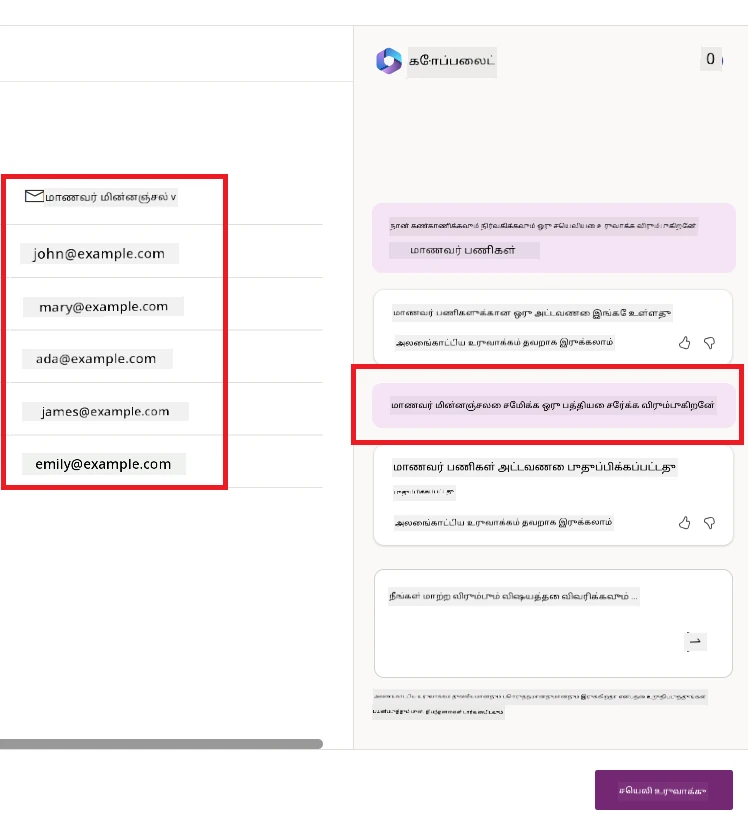

# குறைந்த குறியீட்டு AI செயலிகளைக் கட்டமைத்தல்

> _(இந்த பாடத்திற்கான வீடியோவை பார்க்க மேலிருந்து படத்தை கிளிக் செய்யவும்)_

## அறிமுகம்

இmage உருவாக்கும் செயலிகளைக் கட்டமைப்பதை நாங்கள் கற்றுக்கொண்ட பிறகு, குறைந்த குறியீடு பற்றிப் பேசுவோம். உருவாக்கும் AI பல்வேறு பகுதிகளில் பயன்படுத்தப்படலாம், அதாவது குறைந்த குறியீடு உட்பட, ஆனால் குறைந்த குறியீடு என்றால் என்ன மற்றும் அதில் AI-யை எப்படி சேர்த்துக் கொள்ளலாம்?

செயலிகள் மற்றும் λύసன்களை கட்டமைப்பது பாரம்பரிய டெவலப்பர்கள் மற்றும் டெவலப்பர் அல்லாதவர்களுக்குப் பயன்படும் குறைந்த குறியீடு மேம்பாட்டுக் தளங்கள் மூலம் எளிதாகியுள்ளது. குறைந்த குறியீடு மேம்பாட்டு தளங்கள் குறைந்த அல்லது இல்லாத குறியீட்டுடன் செயலிகள் மற்றும் λύசன்களை கட்டமைக்க உதவுகின்றன. இது, செயலிகள் மற்றும் λύசன்களை கட்டமைக்க கூறுகளை இழுத்து வைக்க ஒருவருக்குத் தரும் காணொளி மேம்பாட்டு சூழலை வழங்குவதால் எட்டப்படுகிறது. இதனால் செயலிகள் மற்றும் λύசன்களை வேகமாகவும் குறைவான வளங்களுடன் கட்டமைக்க முடிகிறது. இந்த பாடத்தில், குறைந்த குறியீட்டை எப்படி பயன்படுத்துவது மற்றும் Power Platform பயன்படுத்தி AI உடன் குறைந்த குறியீடு மேம்பாட்டை எப்படி மேம்படுத்துவது என்பது விரிவாகப் பார்க்கப்படும்.

Power Platform அமைப்புகளுக்கு தங்களது குழுக்களுக்கு தங்கள் சொந்த λύசன்களை குறைந்த-குறியீடு அல்லது குறியீட்டு இல்லா சூழலில் கட்டமைக்க ஆற்றலை வழங்குகிறது. இது λύசன்களை கட்டமைக்கும் செயல்முறையை எளிதாக்க உதவுகிறது. Power Platform உடன், λύசன்களை மாதங்கள் அல்லது ஆண்டுகளுக்கு பதிலாக நாட்களில் அல்லது வாரங்களில் கட்டமைக்க முடியும். Power Platform ஐந்துப் முக்கிய தயாரிப்புகளை கொண்டுள்ளது: Power Apps, Power Automate, Power BI, Power Pages மற்றும் Copilot Studio.

இந்த பாடம் உள்ளடக்குகிறது:

- Power Platform இல் உருவாக்கும் AI அறிமுகம்
- Copilot அறிமுகம் மற்றும் அதை எப்படி பயன்படுத்துவது
- Power Platform இல் உருவாக்கும் AIயைப் பயன்படுத்தி செயலிகள் மற்றும் ஓட்டங்களை கட்டமைத்தல்
- AI Builder உடன் Power Platform இல் AI மாடல்கள் புரிதல்
- Microsoft Copilot Studio கொண்டு நுண்ணறிவு முகவர்கள் கட்டமைத்தல்

## கற்றல் குறிக்கோள்கள்

இந்த பாடத்தின் முடிவில், நீங்கள் சரிந்திருப்பீர்கள்:

- Power Platform இல் Copilot எப்படி வேலை செய்வதென்று புரிந்துகொள்ள.

- நமது கல்வி நிறுவனத்தின் மாணவர் பணிகளுக்கான தடாசு செயலியை கட்டமைக்க.

- விலைப்பட்டியல் செயலாக்க ஓட்டம் கட்டமைக்கவும், அதில் AI விலைப்பட்டியல்களில் இருந்து தகவலை எடுக்க உதவுகிறது.

- Create Text with GPT AI Model பயன்படுத்தும் சிறந்த நடைமுறைகளைப் பின்பற்றவும்.

- Microsoft Copilot Studio என்ன மற்றும் அதில் நுண்ணறிவு முகவர்களை எப்படி கட்டமைக்கலாம் என்று புரிந்துகொள்ளவும்.

பின்வரும் கருவிகள் மற்றும் தொழில்நுட்பங்கள் இந்த பாடத்தில் பயன்படுத்தப்படும்:

- **Power Apps**, மாணவர் பணிகள் தடாசு செயலிக்காக, குறைந்த-குறியீடு செயலி கட்டமைப்பு சூழலை வழங்குகிறது, இது தரவுகளை தடக்கவும், நிர்வகிக்கவும், தொடர்பு கொள்ளவும் உதவுகிறது.

- **Dataverse**, மாணவர் பணிகள் தடாசு செயலிக்கான தரவு சேமிப்புக்காக, Dataverse செயலி தரவு சேமிப்பு குறைந்த-குறியீடு தரவு மேடையை வழங்கும்.

- **Power Automate**, விலைப்பட்டியல் செயலாக்க ஓட்டத்திற்காக, இது குறைந்த-குறியீடு சூழலில் வேலைநிரலை கட்டமைக்க வசதியாகும்.

- **AI Builder**, விலைப்பட்டியல் செயலாக்க AI மாடல் வழங்குவதற்காக, இது முன்கூட்டியே உருவாக்கப்பட்ட AI மாடல்களைக் கொடுத்து விலைப்பட்டியல் செயல்படுத்த உதவும்.

## Power Platform இல் உருவாக்கும் AI

உருவாக்கும் AI கொண்டு குறைந்த-குறியீடு மேம்பாட்டையும் செயலிகளையும் மேம்படுத்துவதை Power Platform முக்கிய கவனம் செலுத்துகிறது. நோக்கம் அனைவருக்கும் AI இயக்கப்பெற்ற செயலிகள், தளங்கள், கணினிப் பலகைகள் மற்றும் செயல்களை எந்த தரவு அறிவியல் அனுபவமின்றி கட்டமைக்க உதவுவதே ஆகும். இந்த நோக்கம் Copilot மற்றும் AI Builder ஆகியவற்றின் வடிவில் உருவாக்கும் AI-ஐ Power Platform இன் குறைந்த-குறியீடு அனுபவத்தில் ஒருங்கிணைப்பதன் மூலம் சாதிக்கப்படுகிறது.

### இது எப்படி வேலை செய்கிறது?

Copilot ஒரு AI உதவியாளர் ஆகும், இது உங்கள் தேவைகளை இயல்பான மொழியில் ஒரு தொடர்ச்சியான உரையாடல் படிகளின் மூலம் விவரிப்பதன் மூலம் Power Platform λύசன்களை கட்டமைக்க உதவுகிறது. உதாரணமாக, உங்கள் செயலி பயன்படுத்தும் புலங்களைக் குறிப்பிட்டு, அப்பும் அடிப்படை தரவு மாதிரியும் உருவாக்க கணிக்கவும் அல்லது Power Automate-ல் ஓட்டம் அமைக்கக் கூறலாம்.

Copilot உங்களுடைய செயலியின் திரைகளில் ஒரு அம்சமாக பயன்படுத்திக் கொள்ள முடியும், இதனால் பயனர்கள் உரையாடல் தொடர்புகளின் மூலம்洞察ங்களை கண்டறிய முடியும்.

AI Builder என்பது Power Platform இல் கிடைக்கும் குறைந்த-குறியீடு AI திறனாகும், இது AI மாடல்களை பயன்படுத்தி செயல்களை தானாக செய்வதில் மற்றும் முடிவுகளை முன்னறிவிக்க உதவுகிறது. AI Builder மூலம் Dataverse மற்றும் SharePoint, OneDrive அல்லது Azure போன்ற பல கிளவுட் தரவு மூலங்களுடன் இணைக்கும் செயலிகள் மற்றும் ஓட்டங்களுக்கு AI சேர்க்கலாம்.

Copilot Power Platform இன் அனைத்து தயாரிப்புகளிலும் உள்ளது: Power Apps, Power Automate, Power BI, Power Pages மற்றும் Copilot Studio (முன்பு Power Virtual Agents எனப்பட்டது). AI Builder Power Apps மற்றும் Power Automate இல் கிடைக்கும். இந்த பாடத்தில், எங்கள் கல்வி நிறுவனத்திற்கான λύசன் கட்டமைப்பதற்கான Copilot மற்றும் AI Builder எப்படி பயன்படுத்துவது என கவனம் செலுத்தப்படும்.

### Power Apps இல் Copilot

Power Platform இன் ஒரு பகுதியாக, Power Apps தரவை தடக்க, நிர்வகிக்க மற்றும் தொடர்பு கொள்ள செயலிகளை கட்டமைக்க குறைந்த-குறியீடு சூழலை வழங்குகிறது. இது ஒரு செயலி மேம்பாட்டு சேவைகளின் தொகுப்பாகும், இது விரிவாக்கத் தரவு மேடையையும் கிளவுட் சேவைகள் மற்றும் உள்ளக தரவை இணைக்கும் திறனையும் கொண்டுள்ளது. Power Apps உங்கள் செயலிகளை உலாவிகள், தட்டப்பட்டிகள் மற்றும் தொலைபேசிகளில் இயக்க கூடியவை உருவாக்க அனுமதிக்கிறது மற்றும் சக ஊழியர்களுடன் பகிரக்கூடும். ஆண்டவர்களுக்கும் தொழில்முறை டெவலப்பர்களுக்குமான எளிய இடைமுகத்துடன் பயனர்களுக்கு செயலி மேம்பாட்டை எளிதாக்குகிறது. Copilot மூலம் உருவாக்கும் AI கூட செயலி மேம்பாட்டை மேம்படுத்துகிறது.

Power Apps இல் உள்ள Copilot AI உதவியாளர் அம்சம், நீங்கள் எந்த வகை செயலி வேண்டுமென்று மற்றும் என்ன தகவலை செயலி தடக்க வேண்டும், சேகரிக்க வேண்டும், காட்ட வேண்டும் என்பதைக் குறிப்பிட அனுமதிக்கிறது. அதன்பிறகு Copilot உங்கள் விளக்கத்தின் அடிப்படையில் ஒரு பதிலளிக்கக்கூடிய Canvas செயலியை உருவாக்கும். பிறகு நீங்கள் உங்கள் தேவைக்கு ஏற்ப செயலியை தனிப்பயனாக்கலாம். AI Copilot தரவுகளை தடக்க தேவையான புலங்களுடன் ஒரு Dataverse அட்டவணையையும் சில மாதிரி தரவுகளையும் உருவாக்கி பரிந்துரைக்கும். Dataverse என்ன மற்றும் அதை Power Apps இல் எப்படி பயன்படுத்துவது என்பது இந்த பாடத்தின் பின்னர் பார்க்கப்படும். உரையாடல் படிகள் வழியாக AI Copilot உதவியாளர் அம்சத்தால் அட்டவணையை தேவைக்கேற்ப தனிப்பயனாக்கலாம். இந்த அம்சம் Power Apps முகப்பு திரையில் எளிய முறையில் கிடைக்கிறது.

### Power Automate இல் Copilot

Power Platform இன் ஒரு பகுதியாக, Power Automate பயனர்களுக்கு செயலிகள் மற்றும் சேவைகள் இடையே தானாக வேலைநிரல்களை உருவாக்க வசதியாக்கிறது. இது தொடர்புச்செய்தல்கள், தரவு சேகரிப்பு மற்றும் முடிவெடுத்தல் அங்கீகாரங்கள் போன்ற முறையாகும் வணிக செயல்களை தானாக செய்ய உதவுகிறது. எளிய இடைமுகம் தொழில்நுட்ப திறன்திறனுக்கு உள்ளவர்களுக்கும் (ஆரம்பிகளிலிருந்து அனுபவமுள்ள டெவலப்பர்களுவரை) தானாக செயல்படுத்திக் கொள்ளும் பணிகளை உருவாக்க அனுமதிக்கிறது. உருவாக்கும் AI மூலமாக Copilot செயல்பாட்டை மேம்படுத்துகிறது.

Power Automate இல் உள்ள Copilot AI உதவியாளர் அம்சம், நீங்கள் எந்த வகை ஓட்டம் வேண்டும் மற்றும் உங்கள் ஓட்டம் எந்த செயல்களைச் செய்ய வேண்டும் என்பதை விவரிக்க அனுமதிக்கிறது. அப்பிறகு Copilot உங்கள் விளக்கத்தின் அடிப்படையில் ஓட்டத்தை உருவாக்கும். பிறகு நீங்கள் தேவைக்கேற்ப ஓட்டத்தை தனிப்பயனாக்கலாம். AI Copilot தேவையான செயல்களை உருவாக்கி பரிந்துரைக்கும். ஓட்டங்கள் என்ன என்பதையும் Power Automate இல் அவற்றைப் பெறுவதையும் இந்த பாடத்தில் பின்னர் பார்க்கலாம். உரையாடல் படிகள் மூலம் AI Copilot உதவியாளர் அம்சத்தைப் பயன்படுத்தி செயல்களை தேவைக்கேற்ப தனிப்பயனாக்கலாம். இந்த அம்சம் Power Automate முகப்பு திரையில் எளிதில் கிடைக்கும்.

## Microsoft Copilot Studio கொண்டு நுண்ணறிவு முகவர்கள் கட்டமைத்தல்

[Microsoft Copilot Studio](https://learn.microsoft.com/microsoft-copilot-studio/fundamentals-what-is-copilot-studio?WT.mc_id=academic-105485-koreyst) (முன்பு Power Virtual Agents எனப் பெயர் பெற்றது) என்பது Power Platform இல் குறைந்த-குறியீட்டு உறுப்பினர், இது **AI முகவர்களை** கட்டமைக்க உதவுகிறது — உரையாடல் கூரையாளர்கள், அவர்கள் உங்கள் பயனர்களுக்காக கேள்விகளுக்கு பதிலளிக்க, செயல்களை மேற்கொள்ள மற்றும் பணிகளை தானாக செய்ய முடியும். Power Platform இன் மற்ற பகுதிகளாய் இருந்தபோல், நீங்கள் இந்த முகவர்களை காணொளி மற்றும் இயல்பான மொழி முதன்மை அனுபவத்தில் உருவாக்குவீர்கள்: நீங்கள் முகவர் செய்யவேண்டியதை விவரிப்பீர்கள், Copilot Studio அதன் அறிவு, அறிவுரைகள் மற்றும் செயல்களை உதவிக் கட்டமைக்கும்.

எங்கள் கல்வி நிறுவனத்திற்கு, நீங்கள் மாணவர்களின் பாடங்கள் குறித்த கேள்விகளுக்கு பதிலளிக்கும், பணிக் காலவரிசைகளை சரிபார்க்கும் மற்றும் ஒரு பயிற்சியாளருக்கு மின்னஞ்சல் அனுப்பும் ஒரு முகவரைக் கட்டமைக்கலாம் — குறியீடு எழுதாமலும்.

Copilot Studioயை சக்திவாய்ந்ததாக்கும் சில புதிய திறன்கள்:

- **உங்கள் அறிவிலிருந்து உருவாக்கும் பதில்கள்**. ஒவ்வொரு உரையாடலையும் கைமுறையாக எழுதியதைவிட, நீங்கள் **அறிவு மூலங்களை** - பொதுக்கணினி தளங்கள், SharePoint, OneDrive, Dataverse, பதிவேற்றிய கோப்புகள் அல்லது இணைப்பாளர்களின் வாயிலாக நிறுவன தரவு - இணைக்கலாம்; முகவர் அவை கொண்டு அடிப்படை பதில்களை உருவாக்கும்.

- **உருவாக்கும் ஒருங்கிணைப்பு**. நிலையான தொடக்க சொற்களுடன் நிலைத்திருக்காமல், முகவர் AIயைப் பயன்படுத்தி கோரிக்கையை புரிந்து அதை நிறைவேற்ற தேவையான அறிவு, தலைப்புகள், செயல்களை தானாக இணைக்கும், பல படிகளைக் துண்டிக் கட்டமைக்கவும் முடியும்.

- **செயல்கள் மற்றும் இணைப்பாளர்கள்**. முகவர்கள் உரையாட தான் அல்ல. முகவர்களுக்கு 1,500+ முன்பிருத்தப்பட்ட Power Platform இணைப்பாளர்கள், Power Automate ஓட்டங்கள், தனிப்பயன் REST APIகள், மறுபடியும் அழைப்புக்கள் அல்லது **Model Context Protocol (MCP)** சேவையகங்கள் போன்ற ஆதரவுடன் செயல்களை செய்யச் சொல்லலாம்.

- **சுயாதீன முகவர்கள்**. முகவர்கள் உரையாடல் விண்டோவில் மட்டும் பதில் அளிக்கிராதவர்கள். புதிய மின்னஞ்சல், Dataverse-ல் புதிய பதிவு, கோப்பு பதிவேற்றம் போன்ற நிகழ்வுகள் மூலம் இயக்கப்படும் **சுயாதீன முகவர்களை** உருவாக்கி பின்னணியில் பணியை முடிக்கச் செய்யலாம்.

- **பல முகவர் ஒருங்கிணைப்பு**. முகவர்கள் மற்ற முகவர்களை அழைக்க முடியும். Copilot Studio முகவர் மற்ற முகவர்களுக்கு பணியை வாரிசாக ஒப்படைக்கலாம் அல்லது அதாவது Microsoft 365 Copilot மற்றும் Microsoft Foundry இல் கட்டமைக்கப்பட்ட முகவர்களால் விரிவடையலாம்.

- **மாதிரி தேர்வு**. உள்ளமைவிலான மாதிரிகள் அப்பால், Microsoft Foundry மாதிரி அட்டவணையிலிருந்து உங்கள் முகவர் நினைக்கும் மற்றும் பதிலளிக்கும் முறையை விருப்பமாய் அமைக்க மாதிரிகளை கொண்டு வரலாம்.

- **எங்கும் வெளியிடவும்**. கட்டமைக்கப்பட்ட முகவரி பல சேனல்களில் வெளியிடலாம் — Microsoft Teams, Microsoft 365 Copilot, ஒரு இணையதளம் அல்லது தனிப்பயன் செயலி மற்றும் பல — பாதுகாப்பு, அங்கீகாரம் மற்றும் பகுப்பாய்வுகள் Power Platform நிர்வாக அனுபவத்தால் கையாளப்படும்.

உங்கள் முதல் முகவர்களை [copilotstudio.microsoft.com](https://copilotstudio.microsoft.com?WT.mc_id=academic-105485-koreyst) இல் ஆரம்பித்து, [Microsoft Copilot Studio ஆவணம்](https://learn.microsoft.com/microsoft-copilot-studio/?WT.mc_id=academic-105485-koreyst) பற்றி மேலும் கற்றுக்கொள்ளலாம்.

## பணிமுறை: நமது நிறுவனம் மாணவர் பணிகள் மற்றும் விலைப்பட்டியல்களை Copilot பயன்படுத்தி நிர்வகிக்க

நமது நிறுவனம் மாணவர்களுக்கு ஆன்லைன் பாடங்களை வழங்குகிறது. நிறுவனம் விரைவாக வளர்ந்துள்ளதால் அதன் பாடங்களுக்கு அதிக கோரிக்கையை நிர்வகிக்க போராடுகிறது. நிறுவனம் உங்களைக் Power Platform டெவலப்பராக வேலைக்கு எடுத்துள்ளது, அவர்களின் மாணவர் பணிகள் மற்றும் விலைப்பட்டியல் பணி நிர்வகிப்பதற்கான குறைந்த குறியீட்டு λύசனத்தை கட்டமைக்க உதவ. அவர்களின் λύசன் ஒரு செயலி மூலம் மாணவர் பணிகளை தடுக்கும், நிர்வகிக்கும் திறன் கொண்டதும், ஒருவழி வேலைநிலை மூலம் விலைப்பட்டியல் செயலாக்கத்தை தானாகச் செய்யும் திறன் கொண்டதும் இருக்க வேண்டும். உருவாக்கும் AI உபயோகித்து λύசனத்தை உருவாக்க உத்தரவிட்டுள்ளனர்.

Copilot பயன்படுத்தத் தொடங்கும்போது, உங்கள் தேவைகளை விவரிக்க ப்ராம்ப்டுகளைப் பெற [Power Platform Copilot Prompt Library](https://github.com/pnp/powerplatform-prompts?WT.mc_id=academic-109639-somelezediko) ஐப் பயன்படுத்தலாம். இந்த நூலகத்தில் Copilot அப்புகள் மற்றும் ஓட்டங்களை கட்டமைக்க உங்களுக்கு தேவையான ப்ராம்ப்டுகள் பட்டியலாகக் கொடுக்கப்பட்டுள்ளன. தேவைகளை Copilot க்கு எப்படி கூறுவது என்பதற்கான தகவல்களையும் பெறலாம்.

### நமது நிறுவனத்துக்கு மாணவர் பணிகள் தடாசு செயலியை கட்டமைக்க

நமது நிறுவனத்தின் கல்வியாளர்கள் மாணவர் பணிகளை தடக்கச் சிரமப்பட்டு வருகின்றனர். அவர்கள் பணிகளை தடக்கும் பணி பத்திரிகையை பயன்படுத்தி வந்திருந்தாலும் மாணவர்களின் எண்ணிக்கை அதிகரித்ததால் அது கடினமாகி விட்டது. அவர்களுடன் பணிகளை தடக்கவும், நிர்வகிக்கவும் உதவும் செயலியை நீங்கள் கட்டமைக்க வேண்டும். செயலி புதிய பணிகளைச் சேர்க்க, பணிகளைப் பார்க்க, பணிகளை புதுப்பிக்க மற்றும் பணிகளை நீக்க உதவி வேண்டும். மேலும் பணித்தொகுப்புகள் மதிப்பீடு செய்யப்பட்டவை மற்றும் மதிப்பீடு செய்யப்படாதவை என கல்வியாளர்களாலும் மாணவர்களாலும் பார்க்க முடியும்.

Copilot பயன்படுத்தி Power Apps இல் செயலியை பின்வரும் படிகளின் மூலம் கட்டமைப்பீர்கள்:

1. [Power Apps](https://make.powerapps.com?WT.mc_id=academic-105485-koreyst) முகப்பு திரைக்கு செல்லவும்.

1. முகப்பு தாளில் உள்ள உரை பகுதியை பயன்படுத்தி நீங்கள் கட்ட விரும்பும் செயலியை விவரிக்கவும். உதாரணமாக, **_நான் மாணவர் பணிகளை தடக்கவும் நிர்வகிக்கவும் செயலி கட்ட விரும்புகிறேன்_** என்று. பிறகு **Send** பொத்தானை கிளிக் செய்து AI Copilot க்கு ப்ராம்ப்டைப் அனுப்பவும்.

1. AI Copilot, தடக்க வேண்டிய தரவைச் சேமிக்க தேவையான புலங்களுடன் ஒரு Dataverse அட்டவணையையும் மாதிரி தரவும் பரிந்துரைக்கும். பின்னர் மாண்போட்ட உரையாடல் படிகளைப் பயன்படுத்தி அட்டவணையை தேவைக்கேற்ப தனிப்பயனாக்கலாம்.

   > **முக்கியம்**: Dataverse என்பது Power Platform இன் அடிப்படைக் தரவு மேடையாகும். இது செயலி தரவைச் சேமிக்க குறைந்த-குறியீட்டு தரவு மேடையாகும். இது Microsoft கிளவுடில் பாதுகாப்புடன் தரவை சேமிக்கும் முறையாகும் மற்றும் உங்கள் Power Platform சூழலில் வழங்கப்படுகிறது. தரவு வகைப்படுத்தல், தரவு உறவுகள், நுணுக்கமான அணுகல் கட்டுப்பாடு போன்ற உள்ளமைவான தரவு அரசுக் கட்டுப்பாடுகளை கொண்டுள்ளது. Dataverse பற்றி [இங்கே](https://learn.microsoft.com/power-apps/maker/data-platform/data-platform-intro?WT.mc_id=academic-109639-somelezediko) மேலும் அறியலாம்.

   

1. கல்வியாளர்கள் மாணவர் பணிகளைக் சமர்ப்பித்த மாணவர்களுக்கு மின்னஞ்சல் அனுப்பி பணிகளின் முன்னேற்றத்தைத் தொடர்புக் கொள்ள விரும்புகின்றனர். Copilot பயன்படுத்தி மாணவர் மின்னஞ்சல் சேமிக்க அட்டவணைக்கு புதிய புலத்தைச் சேர்க்கலாம். உதாரணமாக, **_நான் மாணவர் மின்னஞ்சல் சேமிக்க ஒரு பத்தியைச் சேர்க்க விரும்புகிறேன்_** என்று கூறலாம். அதன்பிறகு **Send** ப кнопку கிளிக் செய்து AI Copilot க்கு அனுப்பவும்.

1. AI Copilot புதிய புலத்தை உருவாக்கி தரும். பிறகு நீங்கள் தேவைக்கேற்ப அந்த புலத்தை தனிப்பயனாக்கலாம்.

1. அட்டவணையை முடித்தவுடன், செயலியை உருவாக்க **Create app** பொத்தானை கிளிக் செய்யுங்கள்.

1. AI Copilot உங்கள் விளக்கத்தின் அடிப்படையில் ஒரு பதிலளிக்கும் Canvas செயலியை உருவாக்கும். பின்னர், நீங்கள் உங்கள் தேவைகளை பூர்த்தி செய்ய செயலியை தனிப்பயனாக்கலாம்.

1. மாணவர்களுக்கு மின்னஞ்சல் அனுப்ப ஆசிரியர்களுக்கு, செயலிக்கு புதிய திரையை சேர்க்க Copilot ஐ பயன்படுத்தலாம். உதாரணமாக, புதிய திரையைச் சேர்க்க இந்த ப்ராம்ப்டைப் பயன்படுத்தலாம்: **_I want to add a screen to send emails to students_**. அந்த ப்ராம்ப்டை AI Copilot க்கு அனுப்ப **Send** பொத்தானை அழுத்தவும்.

1. AI Copilot ஒரு புதிய திரை உருவாக்கும்; பிறகு, நீங்கள் அந்த திரையை உங்கள் தேவைக்கு ஏற்ப தனிப்பயனாக்கலாம்.

1. செயலியை முடித்தவுடன், அதை சேமிக்க **Save** பொத்தானை கிளிக் செய்யுங்கள்.

1. செயலியை ஆசிரியர்களுடன் பகிர, **Share** பொத்தானை கிளிக் செய்து, மீண்டும் **Share** பொத்தானை கிளிக் செய்யவும். ஆசிரியர்களின் மின்னஞ்சல் முகவரிகளை உள்ளிடுவதன் மூலம் செயலியை பகிரலாம்.

> **உங்கள் வீட்டுப்பாடம்**: நீங்கள் இப்போது கட்டிய செயலி நல்ல தொடக்கம், ஆனால் மேம்படுத்தலாம். மின்னஞ்சல் அம்சத்துடன், ஆசிரியர்கள் மாணவர்களுக்கு மின்னஞ்சல்களை நேரடியாக தட்டச்சு செய்து அனுப்பவேண்டும். நீங்கள் Copilot ஐ பயன்படுத்தி, ஆசிரியர்கள் அவர்களது பணிகளை சமர்ப்பிப்ப போது தானாகவே மின்னஞ்சல்கள் அனுப்பத் தகுதியான ஒரு தானியங்கி அமைப்பை உருவாக்க முடியுமா? உங்கள் குறிப்பு: சரியான ப்ராம்ப்ட் மூலம் நீங்கள் Copilot ஐ Power Automate இல் பயன்படுத்தி இதனை செய்யலாம்.

### எங்கள் ஸ்டார்ட்அப்பிற்கான இன்வாய்ஸ் தகவல் அட்டவணையை கட்டுங்கள்

எங்கள் ஸ்டார்ட்அப்பின் நிதி குழு இன்வாய்ஸ்களை கண்காணிக்க போராடி வருகிறது. அவர்கள் ஒரு ஸ்பிரெட்‌ஷீட்டை பயன்படுத்தி இன்வாய்ஸ்களை கண்காணித்துவருகின்றனர், ஆனால் இன்வாய்ஸ்களின் எண்ணிக்கை அதிகரிப்பதால் பராமரிப்பு கடினமாகியுள்ளது. அவர்கள் பெற்ற இன்வாய்ஸ்களின் தகவலை சேமிக்க, கண்காணிக்க மற்றும் நிர்வகிக்க உதவும் ஒரு அட்டவணையை நீங்கள் கட்டுமாறு கேட்டுள்ளனர். இந்த அட்டவணை அனைத்து இன்வாய்ஸ் தகவல்களையும் எடுக்கும் தானியக்க ஆற்றலை கட்ட தேர்வு செய்யப்பட வேண்டும். மேலும், இந்த அட்டவணை வழியாக நிதி குழு பணம் கொடுக்கப்பட்ட இன்வாய்ஸ்களையும் கொடுக்கப்படாத இன்வாய்ஸ்களையும் காணலாம்.

Power Platform இல் உள்ள உள்ளமைவு தரவுத்தளம் Dataverse மூலம் உங்கள் செயலிகள் மற்றும் தீர்வுகளுக்கான தரவை சேமிக்க முடியும். Dataverse ஒரு குறைந்த குறியீட்டு தரவு தளம், Microsoft மேகத்தில் பாதுகாப்பாக தரவை சேமிக்கிறது மற்றும் உங்கள் Power Platform சூழலில் வழங்கப்படுகிறது. இது தரவின் வகைப்படுத்தல், தரவு வரலாறு, நுணுக்கான அணுகல் கட்டுப்பாடு போன்ற தரவு நிர்வாகக் செயல்பாடுகளை கொண்டுள்ளது. [Dataverse பற்றி மேலும் கற்றுக்கொள்ளவும்](https://learn.microsoft.com/power-apps/maker/data-platform/data-platform-intro?WT.mc_id=academic-109639-somelezediko).

எமது ஸ்டார்ட்அப்பிற்கு Dataverse ஏன் பயன்படுத்த வேண்டும்? Dataverse இல் உள்ள நிலையான மற்றும் தனிப்பயன் அட்டவணைகள் உங்கள் தரவிற்கு ஒரு பாதுகாப்பான மற்றும் மேகத்தளத்தில் சேமிப்பு வாயிலை வழங்குகின்றன. அட்டவணைகள் உங்கள் நிறுவனம் அல்லது வணிக தேவைகளுக்கு ஏற்ப தரவுகளை சேமிக்க பயன்படுகின்றன. Dataverse பயன்படுத்துவதன் பலன்களில் சில:

- **எளிதில் நிர்வகிக்கக்கூடியது**: மெட்டா தரவையும் தரவையும் மேகத்தில் சேமிக்கப்படுவதால், அதை எப்படி நிர்வகிக்க வேண்டும் என்று நீங்கள் கவலைப்பட வேண்டியதில்லை. நீங்கள் செயலிகள் மற்றும் தீர்வுகளை கட்டுவதில் கவனம் செலுத்தலாம்.

- **பாதுகாப்பானது**: Dataverse உங்கள் தரவுக்கு பாதுகாப்பான மேக சேமிப்பை வழங்குகிறது. பங்கு அடிப்படையிலான பாதுகாப்பை வைத்து யாருக்கு எந்த அம்சங்கள் அணுகல் செய்ய முடியும் என்று நீங்கள் கட்டுப்படுத்தலாம்.

- **சிறந்த மெட்டா தரவு**: தரவின் வகைகள் மற்றும் தொடர்புகள் நேரடியாக Power Apps இல் பயன்படுத்தப்படுகின்றன

- **தரlogic மற்றும் சரிபார்ப்பு**: வணிக விதிகள், கணக்கிடப்பட்ட புலங்கள் மற்றும் சரிபார்ப்பு விதிகளை பயன்படுத்தி தரவின் நிகர்தன்மையை காக்க முடியும்.

Dataverse என்ன மற்றும் அதனை ஏன் பயன்படுத்த வேண்டும் என்பதை அறிந்த பின்னர், நிதி குழுவின் தேவைகளை பூர்த்தி செய்ய Dataverse இல் Copilot பயன்படுத்தி அட்டவணை உருவாக்குவது எப்படி என்பதைப் பார்க்கலாம்.

> **குறிப்பு** : இந்த அட்டவணையை அடுத்த பகுதியில் அனைத்து இன்வாய்ஸ் தகவல்களையும் எடுத்து அட்டவணையில் சேமிக்கும் தானியக்கத்தை கட்ட பயன்படுத்துவீர்கள்.

Copilot பயன்படுத்தி Dataverse இல் அட்டவணை உருவாக்க, கீழேயுள்ள படிகளை பின்பற்றி செயல்படுங்கள்:

1. [Power Apps](https://make.powerapps.com?WT.mc_id=academic-105485-koreyst) ஹோம் திரையில் செல்லவும்.

2. இடது இயக்க பட்டியில் **Tables** என்பதைத் தேர்ந்தெடுத்து, பிறகு **Describe the new Table** என்பதை கிளிக் செய்யவும்.

1. **Describe the new Table** திரையில், நீங்கள் உருவாக்க விரும்பும் அட்டவணையை எழுதுங்கள். உதாரணமாக, **_I want to create a table to store invoice information_**. ப்ராம்ப்டை AI Copilot க்கு அனுப்ப **Send** பொத்தானை அழுத்தவும்.

1. AI Copilot தேவையான புலங்கள் மற்றும் சில மாதிரித் தரவுடன் Dataverse அட்டவணையை பரிந்துரைக்கும். பின்னர் Copilot உதவியுடன் அதனை ihtiyaç படி தனிப்பயனாக்கலாம்.

1. நிதி குழு வழங்குநருக்கு மின்னஞ்சல் அனுப்ப விரும்புகின்றனர், ஆகையால் வழங்குநர் மின்னஞ்சல் சேமிக்க அட்டவணைக்கு புதிய புலம் சேர்க்க Copilot ஐ பயன்படுத்தலாம். உதாரணமாக, **_I want to add a column to store supplier email_** என்று கூறி **Send** கிளிக் செய்யவும்.

1. AI Copilot புதிய புலத்தை உருவாக்கும்; பின்னர் நீங்கள் அதை தனிப்பயனாக்கலாம்.

1. அட்டவணை முடிந்தவுடன், **Create** பொத்தானை கிளிக் செய்து அதனை உருவாக்குங்கள்.

## Power Platform இல் உள்ள AI மாதிரிகள் AI Builder உடன்

AI Builder என்பது Power Platform இல் கிடைக்கும் குறைந்த குறியீட்டு AI திறன் ஆகும், இது AI மாதிரிகளை பயன்படுத்தி செயல்முறைகளை தானியக்கமாக்க மற்றும் முடிவுகளை முன்னறிவிக்க உதவுகிறது. AI Builder மூலம் உங்கள் செயலிகள், Dataverse அல்லது SharePoint, OneDrive, Azure போன்ற பல மேக தரவு மூலங்களுடன் இணைக்கும் கூடிய பக்கவழியாக AI ஐ கொண்டு வரலாம்.

## முன்பிரகட்டப்பட்ட AI மாதிரிகள் மற்றும் தனிப்பயன் AI மாதிரிகள்

AI Builder இரண்டு வகையான AI மாதிரிகளை வழங்குகிறது: முன்பிரகட்டப்பட்ட AI மாதிரிகள் மற்றும் தனிப்பயன் AI மாதிரிகள். முன்பிரகட்டப்பட்ட மாதிரிகள் Microsoft கற்றுக் கொடுத்த தயாரான மாதிரிகள் ஆகும், Power Platform ல் செல்லுபடியாக உள்ளது. இதனால் நீங்கள் தரவை சேகரித்து உங்கள் சொந்த மாதிரிகள் கட்டி, பயிற்சி பார்த்து, வெளியிட வேண்டிய அவசியமில்லாமல் செயலிகளை நுண்ணறிவு உடன் பயன்படுத்தலாம். மேலும், இதில் செயல்முறைகளை தானியக்கமாக்க மற்றும் முடிவுகளை முன்னறிவிக்க பயன்படும்.

Power Platform இல் உள்ள சில முன்பிரகட்டப்பட்ட AI மாதிரிகள்:

- **முக்கிய சொல் பிரித்தல்**: இந்த மாதிரி உரையில் இருந்து முக்கிய சொற்களை பிரித்தெடுக்கிறது.
- **மொழி கண்டறிதல்**: ஒரு உரையின் மொழியை கண்டறியும் மாதிரி.
- **உணர்ச்சி பகுப்பு**: ஒரு உரையில் நேர்மறை, நெகத்திவ், செம்மறை அல்லது கலந்த உணர்ச்சியை கண்டறியும் மாதிரி.
- **வணிக அட்டை வாசிப்பாளர்**: வணிக அட்டைகளிலிருந்து தகவல்களை பிரித்தெடுக்கிறது.
- **உரை அடையாளம்**: படங்களிலிருந்து உரையை பிரித்தெடுக்கிறது.
- **பொருள் கண்டறிதல்**: படங்களிலிருந்து பொருட்களை கண்டறிந்து பிரித்தெடுக்கிறது.
- **ஆவணம் செயலாக்கம்**: படிவங்களில் இருந்து தகவலை பிரித்து எடுக்கிறது.
- **இன்வாய்ஸ் செயலாக்கம்**: இன்வாய்ஸ்களில் இருந்து தகவலை பிரித்தெடுக்கிறது.

தனிப்பயன் AI மாதிரிகள் மூலம் நீங்கள் உங்களது சொந்த மாதிரியினை AI Builder இல் கொண்டு வந்து பயிற்சி கற்று, Power Apps மற்றும் Power Automate இல் செயல்முறைகளை தானியக்கமாக்க மற்றும் முடிவுகளை முன்னறிவிக்க பயன்படுத்தலாம். உங்கள் சொந்த மாதிரியை பயன்படுத்தும் போது சில வரம்புகள் உள்ளது. அவற்றைப் பற்றி [மேலும் இங்கே படியுங்கள்](https://learn.microsoft.com/ai-builder/byo-model#limitations?WT.mc_id=academic-105485-koreyst).

## பணிகள் #2 - எங்கள் ஸ்டார்ட்அப்பிற்கான இன்வாய்ஸ் செயலாக்க பணிமுறை உருவாக்கு

நிதி குழு இன்வாய்ஸ்களை செயலாக்க போராடி வருகின்றனர். அவர்கள் ஸ்பிரெட்‌ஷீட்டை பயன்படுத்தி இன்வாய்ஸ்களை கண்காணித்து வருகின்றனர், ஆனால் இன்வாய்ஸ்களின் எண்ணிக்கை அதிகரிப்பதால் அவற்றை நிர்வகிக்க கஷ்டமாகியுள்ளது. அவர்கள் AI பயன்படுத்தி இன்வாய்ஸ்களை செயலாக்க உதவும் ஒரு பணிமுறையை உங்கள் படைப்பை கேட்டுள்ளனர். இந்த பணிமுறை இன்வாய்ஸ்களில் இருந்து தகவல் எடுத்து, அதை Dataverse அட்டவணையில் சேமிக்க முடியும். மேலும், தகவலுடன் ஒரு மின்னஞ்சலை நிதி குழுவுக்கு அனுப்பும் வசதியும் இருக்க வேண்டும்.

AI Builder என்பது என்ன மற்றும் அதை ஏன் பயன்படுத்த வேண்டும் என்று நீங்கள் அறிந்த முன்னர், AI Builder இல் உள்ள இன்வாய்ஸ் செயலாக்க AI மாதிரியைப் பயன்படுத்தி இந்த பணிமுறையை உருவாக்குவது எப்படி என்பதை பார்ப்போம்.

இன்வாய்ஸ் செயலாக்க AI மாதிரியை பயன்படுத்தி பணிமுறையை கட்ட, கீழ்காணும் படிகள்:

1. [Power Automate](https://make.powerautomate.com?WT.mc_id=academic-105485-koreyst) ஹோம் திரையில் செல்லவும்.

2. ஹோம் திரையில் உள்ள உரை பகுதியைக் கொண்டு நீங்கள் கட்ட விரும்பும் பணிமுறையை விவரிக்கவும். உதாரணமாக, **_Process an invoice when it arrives in my mailbox_**. பின்னர் ப்ராம்ப்டை AI Copilot க்கு அனுப்ப **Send** பொத்தானை அழுத்தவும்.

   

3. AI Copilot தேவையான செயல்பாடுகளை பரிந்துரைக்கும். **Next** பொத்தானை கிளிக் செய்து அடுத்த படிகளைக் கடந்து செல்லலாம்.

4. அடுத்த படியில், Power Automate பாய்க்க பொருத்த உள்ள இணைப்புகளை அமைக்குமாறு கேட்கும். முடிந்த பின் **Create flow** பொத்தானை அழுத்தி பணிமுறையைக் கட்டவும்.

5. AI Copilot பணிமுறை உருவாக்கும்; பின்னர் நீங்கள் அதனை உங்கள் தேவைக்கு ஏற்ப தனிப்பயனாக்கலாம்.

6. பணிமுறையின் தூண்டுகோலை புதுப்பித்து, இன்வாய்ஸ்கள் சேமிக்கப்படும் **Folder** ஐ அமைக்கவும். உதாரணமாக, **Inbox**. **Show advanced options** கிளிக் செய்து, **Only with Attachments** ஐ **Yes** என மாற்றவும். இதனால் இணைப்புடன் மின்னஞ்சல்கள் வந்தால் மட்டுமே பணிமுறை இயங்கும்.

7. பின்வரும் செயல்பாடுகளை பணிமுறையில் இருந்து அகற்றவும்: **HTML to text**, **Compose**, **Compose 2**, **Compose 3**, மற்றும் **Compose 4** ஏனெனில் அவை தேவையில்லாமல் இருக்கும்.

8. பணிமுறையிலிருந்து **Condition** செயல்பாட்டை அகற்றவும்; அது கீழ்காணும் படத்தைப் போன்றதாக இருக்கும்:

   

9. **Add an action** பொத்தானை கிளிக் செய்து **Dataverse** க்கான செயல்பாடுகளை தேடுங்கள். **Add a new row** செயல்பாட்டை தேர்ந்தெடுக்கவும்.

10. **Extract Information from invoices** செயல்பாட்டில், **Invoice File** ஐ மின்னஞ்சலிலிருந்து **Attachment Content** என அமைக்கவும். இதனால் இன்வாய்ஸ் இணைப்பிலிருந்து தகவல் எடுக்கப்படும்.

11. நீங்கள் முன்னர் கட்டிய **Table** ஐ தேர்ந்தெடுக்கவும். உதாரணமாக, **Invoice Information** அட்டவணை. பின்வரும் புலங்களை நிரப்ப முன்னர் செயல்பாட்டின் தொனியல் உள்ளடக்கத்தை பயன்படுத்தவும்:

    - ID
    - Amount
    - Date
    - Name
    - Status - **Status** ஐ **Pending** என அமைக்கவும்.
    - Supplier Email - **When a new email arrives** தூண்டுகோலில் இருந்து **From** நாடக உள்ளடக்கத்தை பயன்படுத்தவும்.

    

12. பணிமுறை முடிந்தவுடன் **Save** பொத்தானை அழுத்தி சேமிக்கவும். பின்னர், நீங்கள் போட்டுள்ள கோப்பிலிருந்து இன்வாய்ஸ் உடன் மின்னஞ்சல் அனுப்பி பணிமுறை சரிபார்க்கலாம்.

> **உங்கள் வீட்டுப்பாடம்**: நீங்கள் இப்போது கட்டிய பணிமுறை நல்ல தொடக்கம், ஆனால் நிதி குழுவின் இன்வாய்ஸ் நிலையை புதுப்பிக்க வழங்குநருக்கு மின்னஞ்சல் அனுப்பும் தானியக்கத்தை நீங்கள் எப்படிக் கட்டலாம் என்று பரிசீலிக்கவும். உங்களது குறிப்பு: இன்வாய்ஸ் நிலை மாறும் போது பணிமுறை இயங்க வேண்டும்.

## Power Automate இல் உள்ள உரை உருவாக்க AI மாதிரியைப் பயன்படுத்தல்

AI Builder இல் உள்ள Create Text with GPT AI மாதிரி ப்ராம்ப்டின் அடிப்படையில் உரை உருவாக்க உதவுகிறது மற்றும் Microsoft Azure OpenAI Service மூலமாக இயங்குகிறது. இதில் GPT (Generative Pre-Trained Transformer) தொழில்நுட்பத்தை உங்கள் செயலிகள் மற்றும் பணிமுறைகளில் கொண்டு வந்து பல விதமான தானியக்க பணிமுறைகள் மற்றும் அறிவார்ந்த செயலிகளை கட்ட முடியும்.

GPT மாதிரிகள் பரபரப்பான தரவுகளின் மேல் விரிவான பயிற்சியை பெறுகின்றன, எனவே அவை ப்ராம்ப்ட் கொடுக்கப்பட்டால் மனித மொழியைப் போன்ற உரைகளை உருவாக்க முடியும். பணிமுறை தானியக்கத்துடன் இணைக்கும் போது GPT போன்ற AI மாதிரிகள் பலவகையான பணிகளை எளிதாக்க மற்றும் தானியக்கமாக்க உதவுகின்றன.

உதாரணமாக, மின்னஞ்சல் மாதிரிகள், தயாரிப்பு விளக்கங்கள் போன்ற பல பயன்பாடுகளுக்காக தானியக்க உரை உருவாக்கப் பணிகளை நீங்கள் கட்டலாம். மேலும், வாடிக்கையாளர் சேவை செயலிகள் அல்லது சந்திப்பு உதவியாளர்களுக்கான செயலிகள் போன்ற பல செயலிக்காகவும் இந்த மாதிரியை பயன்படுத்தி உரையை உருவாக்கலாம்.

Power Automate இல் இந்த AI மாடலைப் பயன்படுத்துவது எப்படி என்பதை கற்றுக்கொள்ள, [AI கட்டமைப்பாளர் மற்றும் GPT உடன் நுண்ணறிவைச் சேர்க்கவும்](https://learn.microsoft.com/training/modules/ai-builder-text-generation/?WT.mc_id=academic-109639-somelezediko) பயிற்சி தொகுதியை படியுங்கள்.

## சிறந்த வேலை! உங்கள் கற்றலை தொடருங்கள்

இந்த பாடத்திட்டத்தை முடித்தவுடன், உங்கள் Generative AI அறிவை மேம்படுத்த நாங்கள் வழங்கும் [Generative AI கற்றல் தொகுப்பு](https://aka.ms/genai-collection?WT.mc_id=academic-105485-koreyst) ஐப் பாருங்கள்!

Copilot ஐ விருப்பப்படி மாற்றி அதிகம் பெற விரும்புகிறீர்களா? GitHub Copilot ஐ முழுமையாக பயன்படுத்த உதவும் கட்டளைகள், முகவர்கள், திறன்கள் மற்றும் கட்டமைப்புகளைக் கொண்ட சமூக பங்களித்த [Awesome Copilot](https://github.com/github/awesome-copilot?WT.mc_id=academic-105485-koreyst) ஐ ஆராயுங்கள்.

பாடம் 11 க்குச் செல்லுங்கள், அங்கு நாம் [Function Calling உடன் Generative AI ஐ ஒருங்கிணைப்பது](../11-integrating-with-function-calling/README.md?WT.mc_id=academic-105485-koreyst) எப்படி என்பதைப் பார்த்து பயிலப்போகிறோம்!

---

<!-- CO-OP TRANSLATOR DISCLAIMER START -->
**மறுப்பு**:
இந்த ஆவணம் AI மொழிபெயர்ப்பு சேவை [Co-op Translator](https://github.com/Azure/co-op-translator) பயன்படுத்தி மொழிபெயர்க்கப்பட்டுள்ளது. நாங்கள் துல்லியத்திற்காக முயற்சி செய்துள்ளோம், ஆனால் தானாக செய்யப்படும் மொழிபெயர்ப்புகளில் பிழைகள் அல்லது தவறுகள் இருக்கலாம் என்பதை கவனத்தில் கொள்ளவும். அசல் ஆவணம் அதன் தாய்மொழியில் அதிகாரப்பூர்வ ஆதாரமாக கருதப்பட வேண்டும். முக்கியமான தகவல்களுக்கு, தொழில்நுட்பமான மனித மொழிபெயர்ப்பு பரிந்துரைக்கப்படுகிறது. இந்த மொழிபெயர்ப்பைப் பயன்படுத்துவதால் ஏற்படும் எந்த தவறான புரிதல்கள் அல்லது தவறான விளக்கத்திற்கும் நாங்கள் பொறுப்பில்வில்லை.
<!-- CO-OP TRANSLATOR DISCLAIMER END -->