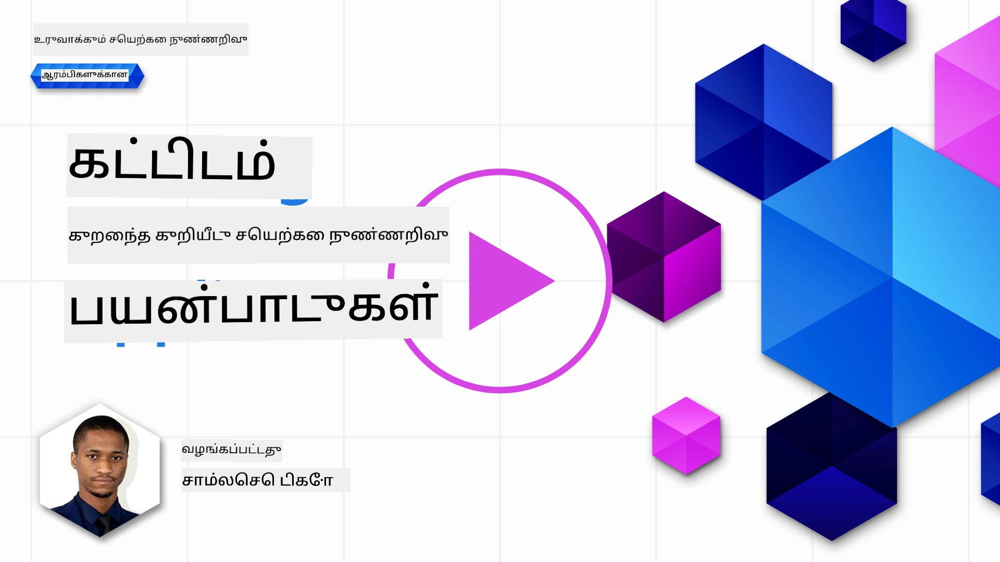
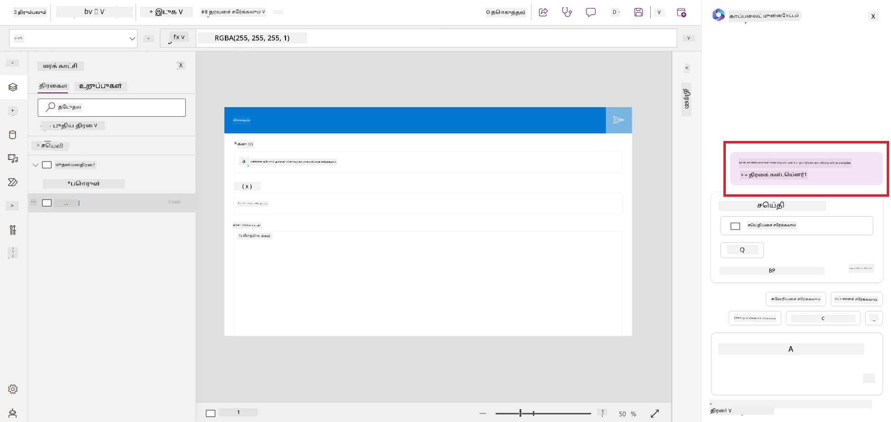
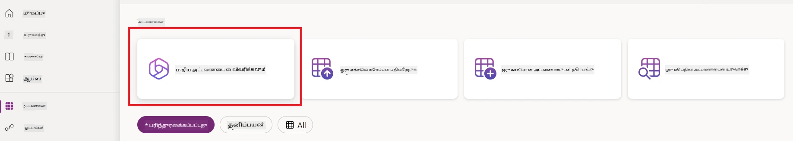
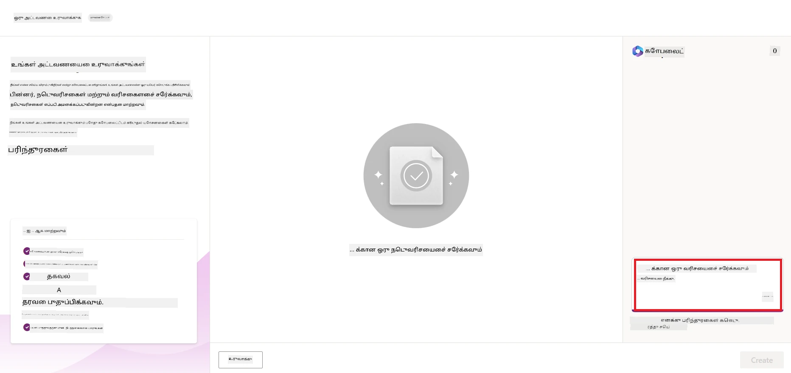
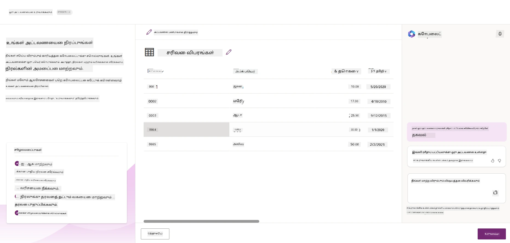
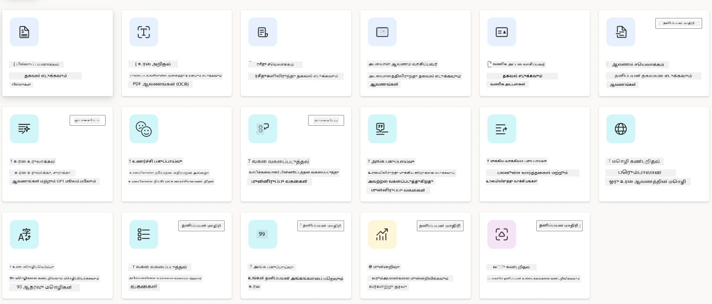
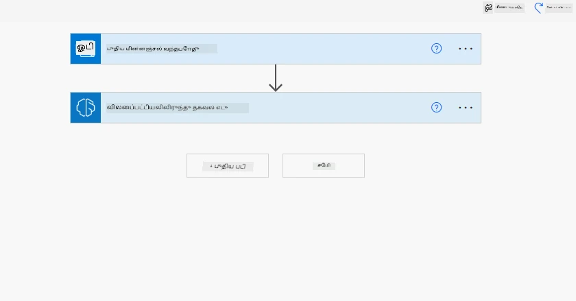
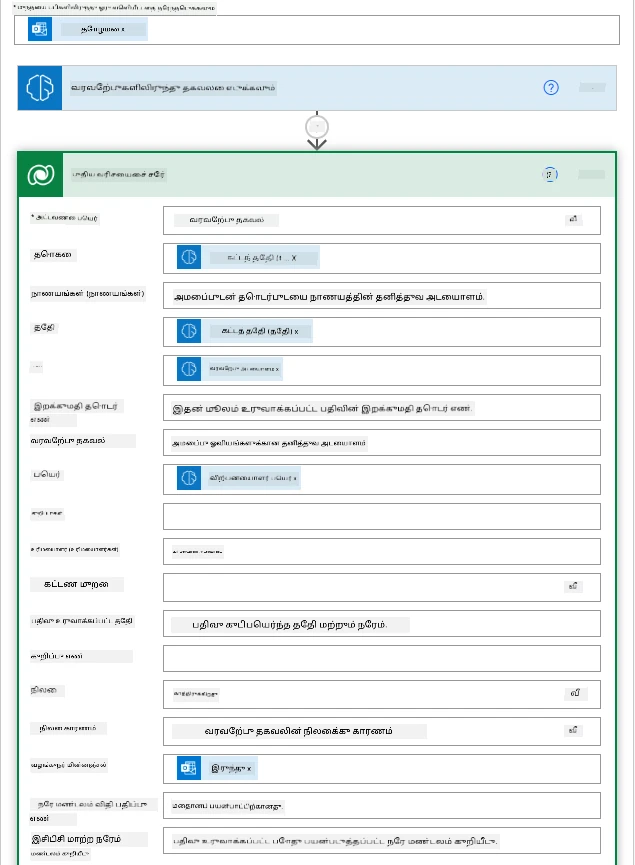
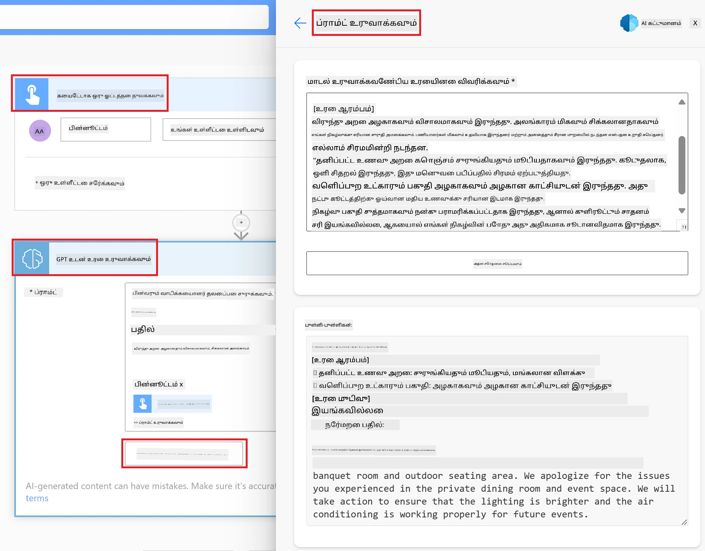

# குறைந்த குறியீடு AI பயன்பாடுகளை உருவாக்குதல்

> _(இந்த பாடத்தின் வீடியோவை காண மேலே உள்ள படத்தை சொடுக்கவும்)_

## அறிமுகம்

இப்போது நாங்கள் படங்களை உருவாக்கும் பயன்பாடுகளைக் கட்டுவதில் கற்றுக்கொண்டதால், குறைந்த குறியீடு பற்றி பேசுவோம். உருவாக்கும் AI பல்வேறு துறைகளில் பயன்படுத்தப்படலாம், அதில் குறைந்த குறியீடும் உள்ளது, ஆனால் குறைந்த குறியீடு என்றால் என்ன மற்றும் அதற்கு AI-ஐ எப்படிச் சேர்க்கலாம்?

அப்ளிகேஷன்கள் மற்றும் தீர்வுகளை உருவாக்குவது பாரம்பரியத் திட்டமாளருக்கும் அத்தகைய சூழலில் இல்லாதவருக்கும் குறைந்த குறியீடு மேம்பாட்டு தளங்கள் மூலம் எளிதாகியுள்ளன. குறைந்த குறியீடு மேம்பாட்டு தளங்கள் குறைந்த அல்லது குறியீடு இல்லாமல் செயலிகளை உருவாக்க உதவுகின்றன. இது பயன்பாடுகள் மற்றும் தீர்வுகளை உருவாக்குவதற்கான கூறுகளை இழுத்து விடும் ஒரு காட்சி மேம்பாட்டு சுற்றுப்பிரதியை வழங்குவதன் மூலம் பெறப்படுகிறது. இது செயலிகளையும் தீர்வுகளையும் வேகமாகவும் குறைந்த resouces-ஆளுமாகவும் உருவாக்க உதவுகிறது. இந்த பாடத்தில், குறைந்த குறியீட்டை எவ்வாறு பயன்படுத்துவது மற்றும் Power Platform மூலம் AI-இன் உதவியுடன் குறைந்த குறியீடு மேம்பாட்டை எவ்வாறு மேம்படுத்துவது என்பதில் ஆழமான ஆய்வை செய்வோம்.

Power Platform நிறுவனங்களுக்கு தங்கள் குழுக்களை தங்கள் சொந்த தீர்வுகளை ஒருங்கிணைக்க அனுமதிக்கும் ஒரு தொடுப்பான குறைந்த குறியீடு அல்லது குறியீடு இல்லாத சுற்றுப்புறத்தை வழங்குகிறது. இந்த சுற்றுப்புறம் தீர்வுகளை கட்டுவதற்கான செயல்முறையை எளிதாக்க உதவுகிறது. Power Platform-இன் மூலம், தீர்வுகள் மாதங்கள் அல்லது ஆண்டுகளுக்கு பதிலாக நாட்கள் அல்லது வாரங்களில் கட்டப்படலாம். Power Platform ஐந்து முக்கிய தயாரிப்புகளை கொண்டுள்ளது: Power Apps, Power Automate, Power BI, Power Pages மற்றும் Copilot Studio.

- Power Platform இல் உருவாக்கும் AI அறிமுகம்
- Copilot மற்றும் அதை எவ்வாறு பயன்படுத்துவது என்பதை அறிமுகம்
- Power Platform இல் செயலிகள் மற்றும் ஓடைகள் கட்டுவதற்கு உருவாக்கும் AI-யைப் பயன்படுத்துதல்
- AI Builder உடன் Power Platform இல் உள்ள AI மாதிரிகளைப் புரிந்து கொள்வது

1. அட்டவணையை முடித்தவுடன், செயலியை உருவாக்க **Create app** பொத்தானை அழுத்தவும்.

1. உங்கள் விளக்கத்தின் அடிப்படையில் AI Copilot பதில் தரக்கூடிய Canvas செயலியை உருவாக்கும். பின்னர் நீங்கள் தேவைக்கு ஏற்ப செயலியை தனிப்பயனாக்கலாம்.

1. கல்வியாளர்கள் மாணவர்களுக்கு மின்னஞ்சல்கள் அனுப்புவதற்கு, செயலியில் புதிய திரையொற்றை சேர்க்க Copilot ஐ பயன்படுத்தலாம். உதாரணமாக, செயலியில் புதிய திரையொற்றை சேர்க்க கீழ்கண்ட பிராம்ப்டைப் பயன்படுத்தலாம்: **_மாணவர்களுக்கு மின்னஞ்சல்கள் அனுப்ப ஒரு திரையை சேர்க்க விரும்புகிறேன்_**. பிராம்ப்டை AI Copilot க்கு அனுப்ப **Send** பொத்தானை அழுத்தவும்.

1. AI Copilot புதிய திரையொற்றை உருவாக்கும், பின்னர் அதை உங்கள் தேவைக்கேற்ப தனிப்பயனாக்கலாம்.

1. செயலியை முடித்தவுடன், **Save** பொத்தானை அழுத்தி செயலியை சேமிக்கவும்.

1. கல்வியாளர்களுடன் செயலியை பகிர **Share** பொத்தானை இரண்டு முறை அழுத்தவும். பிறகு அவர்களின் மின்னஞ்சல் முகவரிகள் மூலம் செயலியை பகிரலாம்.

> **உங்கள் வீட்டுப்பாடம்**: நீங்கள் தற்போது உருவாக்கிய செயலி ஒரு நல்ல தொடக்கம் ஆனால் மேம்படுத்தப்படக்கூடியது. மின்னஞ்சல் அம்சம் மூலம், கல்வியாளர்கள் மாணவர்களுக்கு மின்னஞ்சல் முகவரிகளை தட்டச்சு செய்துடனே கைமுறை அனுப்ப முடியும். கல்வியாளர்கள் தன்னிச்சையாக அவர்களது பணிகளை சமர்ப்பிக்கும்போது மாணவர்களுக்கு மின்னஞ்சல் அனுப்பும் தானியங்கி முறையை நீங்கள் Copilot ஐ பயன்படுத்தி உருவாக்க முடியுமா? உங்களுக்கு உதவையான குறிப்பு: சரியான பிராம்ப்டுடன் நீங்கள் Power Automate இல் Copilot ஐ பயன்படுத்தி இதை உருவாக்கக்கூடாது.

### எங்கள் ஸ்டார்ட்அபிற்கான பில் தகவல் அட்டவணையை உருவாக்குங்கள்

எங்கள் ஸ்டார்ட்அப்பின் நிதி குழு பில்களை கண்காணிக்க போராடி வந்துள்ளனர். அவர்கள் பில்களை கண்காணிக்க spreadsheets பயன்படுத்தி வந்தாலும் பில்களின் எண்ணிக்கை அதிகரித்து மேலாண்மை கடினமாகிவிட்டது. அவர்கள் பெற்ற பில்களின் தகவலை சேமிக்க, கண்காணிக்க மற்றும் நிர்வகிக்க உதவும் அட்டவணையை உருவாக்க உங்களை கேட்டுக்கொண்டுள்ளனர். அந்த அட்டவணை பில் தொடர்பான அனைத்து தகவல்களையும் எடுக்க தானியக்க முறையை உருவாக்க பயன்படுத்தப்படும். அமைச்சர் குழுவின் பில்கள் செலுத்தப்பட்டவை, செலுத்தப்படாதவை ஆகியவற்றை நீங்கலும் அட்டவணை போதுமான காண்பதும் வேண்டும்.

Power Platform இல் உங்கள் செயலிகளுக்கும் தீர்வுகளுக்கும் தரவை சேமிக்க கூடிய Dataverse என்ற அடிப்படை தரவு தளம் உள்ளது. Dataverse இரண்டாம் குரிய குறியீடு இல்லா தரவு தளமாக செயலியின் தரவை சேமிக்க உதவுகிறது. இது Microsoft Cloud இல் பாதுகாப்பாக தரவை சேமிப்பது முழு நிர்வகிக்கப்படும் சேவையாகும் மற்றும் உங்கள் Power Platform சூழல் உள்ளே Provision செய்யப்படுகிறது. இது தரவு வகைப்பாட்டு, தரவின் வரலாறு, நுட்பமான அணுகல் கட்டுப்பாடு போன்ற தரவு حکمرانية அம்சங்களுடன் வருகிறது. [Dataverse பற்றி சொல்லப்பட்ட மேலதிக தகவல் இங்கே உள்ளது](https://docs.microsoft.com/powerapps/maker/data-platform/data-platform-intro?WT.mc_id=academic-109639-somelezediko).

எங்கள் ஸ்டார்ட்அப்பிற்கு Dataverse ஐ ஏன் பயன்படுத்த வேண்டும்? Dataverse இல் உள்ள தரமான மற்றும் தனிப்பயன் அட்டவணைகள் உங்கள் தரவுக்கு பாதுகாப்பான மற்றும் மேகத்தின் அடிப்படையிலான சேமிப்புப் பயன்பாட்டை வழங்குகின்றன. பலவகைப் தரவை ஒரு Excel புத்தகத்தில் பல பக்கங்களைப் போல அட்டவணைகள் சேமிக்க உதவுகின்றன. குறிப்பாக உங்கள் நிறுவனம் அல்லது வணிக தேவைகளுக்கு பொருத்தமான தரவைச் சேமிக்க அட்டவணைகளை பயன்படுத்தலாம். எங்கள் ஸ்டார்ட்அப்பிற்கு Dataverse பயன்பாட்டின் சில நன்மைகள்:

- **இடையேற்பாடுகளை எளிதாக்குகிறது**: மெட்டாடேட்டா மற்றும் தரவு இரண்டும் மேகத்தில் சேமிக்கப்படும், அத்தகையவாறு எப்படி நிர்வகிக்கப்படுகின்றன என்ற விவரங்களை பற்றி கவலைப்பட தேவையில்லை. நீங்கள் உங்கள் செயலிகள் மற்றும் தீர்வுகளை உருவாக்க முடியும்.

- **பாதுகாப்பானது**: Dataverse உங்கள் தரவுக்கு பாதுகாப்பான மற்றும் மேகத்தில் சேமிப்புப் படிவத்தை வழங்குகிறது. அட்டவணைகளின் தரவுக்கு யார் அணுக முடியும் மற்றும் எந்த முறையில் என்பதற்கு பங்கு அடிப்படையிலான பாதுகாப்பை பயன்படுத்தி நீங்கள் கட்டுப்படுத்தலாம்.

- **பெரும்பளவு மெட்டாடேட்டா**: தரவு வகைகள் மற்றும் உறவுகள் Power Apps இல் நேரடியாக பயன்படுத்தப்படலாம்

- **தர்க்கம் மற்றும் சரிபார்ப்பு**: வணிக விதிகள், கணக்கிடப்பட்ட புலங்கள் மற்றும் சரிபார்க்கும் விதிகளைப் பயன்படுத்தி வணிகத் தர்க்கத்தை அமுல்படுத்தும் மற்றும் தரவு துல்லியத்தை பராமரிக்க முடியும்.

Dataverse என்ன மற்றும் ஏன் பயன்படுத்த வேண்டும் என்று தெரிந்தபின், நமது நிதி குழு தேவைகளை பூர்த்தி செய்ய Dataverse இல் அட்டவணையை எவ்வாறு Copilot மூலம் உருவாக்கலாம் என்பதை பார்க்கலாம்.

> **கவனிக்கவும்** : அடுத்த பகுதியில் இந்த அட்டவணையை பயன்படுத்தி பில் தொடர்பான அனைத்து தகவல்களையும் எடுத்து அட்டவணையில் சேமிக்கும் தானியக்க முறையை உருவாக்குவீர்கள்.

Copilot ஐ பயன்படுத்தி Dataverse இல் அட்டவணை உருவாக்க கீழ்கண்ட படிகளை பின்பற்றவும்:

1. [Power Apps](https://make.powerapps.com?WT.mc_id=academic-105485-koreyst) முகப்புப் பக்கத்திற்கு செல்லவும்.

2. இடது வழிச் பட்டியில் **Tables** தேர்ந்தெடுத்து பிறகு **Describe the new Table** என்பதை கிளிக் செய்யவும்.

1. **Describe the new Table** திரையில், நீங்கள் உருவாக்க விரும்பும் அட்டவணையைக் குறிப்பிடுவதற்கு உரை பகுதியைப் பயன்படுத்தவும். உதாரணமாக, **_பில் தகவலை சேமிக்க ஒரு அட்டவணையை உருவாக்க விரும்புகிறேன்_**. AI Copilot க்கு பிராம்ப்டை அனுப்ப **Send** பொத்தானை அழுத்தவும்.

1. AI Copilot உங்கள் உரையில் சொன்ன தரவுகளை சேமிக்க தேவையான புலங்களோடும் சில உதாரண தரவுகளோடும் ஒரு Dataverse அட்டவணையை பரிந்துரைக்கும். அதன்பின் AI Copilot உதவி மூலம் உரையாடல் படிகளின் மூலம் அட்டவணையை தனிப்பயனாக்கலாம்.

1. நிதி குழு ஒருவருக்கு பில் நிலைமைப் புதுப்பிப்பை அனுப்ப மின்னஞ்சல் செய்ய விரும்புகிறது. அட்டவணையில் சக ஊழியர் மின்னஞ்சல் சேர்க்க Copilot ஐ பயன்படுத்தலாம். உதாரணமாக, அட்டவணையில் புதிய புலம் சேர்க்க கீழ்காணும் பிராம்ப்டைப் பயன்படுத்தலாம்: **_சரக்காளர் மின்னஞ்சலை சேமிக்க ஒரு sütun சேர்க்க விரும்புகிறேன்_**. AI Copilot க்கு பிராம்ப்டை அனுப்ப **Send** பொத்தானை அழுத்தவும்.

1. AI Copilot புதிய புலத்தை உருவாக்கும், பின்னர் அதை உங்களது தேவைக்கேற்ப தனிப்பயனாக்கலாம்.

1. அட்டவணையை முடித்தவுடன், **Create** பொத்தானை அழுத்தி அட்டவணையை உருவாக்கவும்.

## Power Platform இல் AI Builder-ஐ உள்ளடக்கிய AI மாதிரிகள்

AI Builder Power Platform இல் கிடைக்கும் குறியீடு குறைந்த AI செயல்பாடு ஆகும், இது அவை உங்களுக்கு செயல்கள் மற்றும் செயல்தடைகளை தானாக்கவும், முடிவுகளை கணிக்கவும் AI மாதிரிகளை பயன்படுத்த உதவுகிறது. AI Builder மூலம், Dataverse இலுள்ள தரவோ அல்லது SharePoint, OneDrive அல்லது Azure போன்ற பல மேக தரவு மூலங்களோடு இணையும் செயலிகள் மற்றும் நெடுகுழாய்களில் AI ஐ கொண்டு வரலாம்.

## முன்கூட்டியே உருவாக்கப்பட்ட AI மாதிரிகள் மற்றும் தனிப்பயன் AI மாதிரிகள்

AI Builder இரண்டு வகையான AI மாதிரிகளை வழங்குகிறது: முன்கூட்டியே உருவாக்கப்பட்ட AI மாதிரிகள் மற்றும் தனிப்பயன் AI மாதிரிகள். முன்கூட்டியே உருவாக்கப்பட்ட AI மாதிரிகள் Microsoft மூலம் பயிற்றப்பட்ட மற்றும் Power Platform இல் கிடைக்கக்கூடிய தயாரா பயன்பாட்டுள்ள மாதிரிகளாகும். இவை உங்கள் செயலிகள் மற்றும் செயல்தடைகளுக்கு திரும்ப பெறாமல் அறிவைச் சேர்க்க உதவும். உங்கள் சொந்த தரவை சேகரித்து அதன் பிறகு மாதிரிகளை உருவாக்க, பயிற்றுவித்து மற்றும் வெளியிடாமல் இந்த மாதிரிகளைப் பயன்படுத்தலாம். இந்த மாதிரிகள் செயல்முறைகளை தானாக்கவும் முடிவுகளை கணிக்கவும் உதவுகின்றன.

Power Platform இல் கிடைக்கும் சில முன்கூட்டியே உருவாக்கப்பட்ட AI மாதிரிகள்:

- **முக்கிய சொல் எடுப்புதல்**: இந்த மாதிரி உரையிலிருந்து முக்கிய சொற்களை எடுக்கிறது.
- **மொழி கண்டறிதல்**: ஒரு உரையின் மொழியை கண்டறியும்.
- **உணர்ச்சி பகுப்பாய்வு**: உரையில் நேர்மறை, எதிர்மறை, நியூட்ரல் அல்லது கலவையான உணர்வை கண்டறியும்.
- **வணிக அட்டை வாசிப்பான்**: வணிக அட்டைகளிலிருந்து தகவல்களை எடுக்கிறது.
- **உரை அங்கீகாரம்**: படங்களில் உள்ள உரையை எடுக்கிறது.
- **பொருள் கண்டறிதல்**: படங்களில் உள்ள பொருட்களை கண்டறிந்து எடுக்கிறது.
- **ஆவணம் செயலாக்கம்**: படிவங்களில் இருந்து தகவல்களை எடுக்கிறது.
- **பில் செயலாக்கம்**: பில்களில் இருந்து தகவல்களை எடுக்கிறது.

தனிப்பயன் AI மாதிரிகளுடன் நீங்கள் உங்கள் சொந்த மாதிரியை AI Builder இல் கொண்டு வந்து, அதைப் பயிற்றுவித்து, உங்கள் சொந்த தரவுடன் மாதிரியை பயிற்று செய்து AI Builder தனிப்பயன் மாதிரி போல செயல்படச்செய்யலாம். Power Apps மற்றும் Power Automate இரண்டிலும் செயல்முறைகளை தானாக்க மற்றும் முடிவுகளை கணிக்க இந்த மாதிரிகளைக் பயன்படுத்தலாம். உங்கள் சொந்த மாதிரியை பயன்படுத்தும்போது சில வரம்புகள் உண்டு. இந்த வரம்புகள் குறித்த மேலதிக தகவலை [இதன் மூலம் அறியலாம்](https://learn.microsoft.com/ai-builder/byo-model#limitations?WT.mc_id=academic-105485-koreyst).

## பணிகள் #2 - எங்கள் ஸ்டார்ட்அப்பிற்குப் பில் செயலாக்கத் நடவடிக்கையை உருவாக்கவும்

நிதி குழு பில்களை செயலாக்குவதில் சிக்கலை சந்தித்து வருகிறது. அவர்கள் பில்களை கண்காணிக்க spreadsheets பயன்படுத்தி வந்தாலும் பில்களின் எண்ணிக்கை அதிகரித்து மேலாண்மை கடினமாகி விட்டது. அவர்கள் AI பயன்படுத்தி பில்களை செயலாக்க உதவும் ஒரு வேலைபாஜையை உருவாக்க உங்களை கேட்டுக்கொண்டுள்ளனர். அந்த வேலைபاجை பில்களில் இருந்து தகவல்களை எடுத்து Dataverse அட்டவணையில் சேமிக்க வேண்டும். அதேவேளை, எடுக்கப்பட்ட தகவல்களுடன் நிதி குழுவிற்கு மின்னஞ்சல் அனுப்பும் திறனும் அந்த வேலைபாஜையில் இருக்க வேண்டும்.

AI Builder என்ன மற்றும் ஏன் பயன்படுத்த வேண்டும் என்பதைக் கற்றுக்கொண்ட பிறகு, ஏற்கனவே எடுத்துச் சொன்ன Invoice Processing AI மாதிரியை AI Builder இல் பயன்படுத்தி நிதி குழு பில்களை எவ்வாறு செயலாக்க வேலைபாஜையை உருவாக்கலாம் என்று பார்க்கலாம்.

Invoice Processing AI மாதிரியை AI Builder இல் பயன்படுத்தி நிதி குழு பில்களை செயலாக்க உதவும் வேலைபாஜையை உருவாக்க கீழ்காணும் படிகளை பின்பற்றவும்:

1. [Power Automate](https://make.powerautomate.com?WT.mc_id=academic-105485-koreyst) முகப்புப் பக்கத்திற்கு செல்லவும்.

2. முகப்புப் பக்கத்தில் உள்ள உரை பகுதியை பயன்படுத்தி உருவாக்க விரும்பும் வேலைபாஜையை விவரிக்கவும். உதாரணமாக, **_என் மின்னஞ்சல் பெட்டியில் பில் வந்தவுடன் அதை செயலாக்கு_**. AI Copilot க்கு பிராம்ப்டை அனுப்ப **Send** பொத்தானை அழுத்தவும்.

   

3. AI Copilot நீங்கள் தானாக்க விரும்பும் பணிகளை நடாத்த தேவையான செயல்களை பரிந்துரைக்கும். அடுத்த படிகள் மூலம் செல்ல **Next** பொத்தான் அழுத்தவும்.

4. அடுத்த படியில், Power Automate அந்த வேலைபாஜைக்கு தேவையான இணைப்புகளை அமைக்கும்படி உங்களை கேட்கும். முடித்து விட்டதும் **Create flow** பொத்தானை அழுத்தி வேலைபாஜையை உருவாக்கவும்.

5. AI Copilot ஒரு வேலைபாஜையை உருவாக்கும், பின்னர் நீங்கள் இதனை தேவைக்கேற்ப தனிப்பயனாக்கலாம்.

6. வேலைபாஜையின் தொடக்கக் கோப்பை (trigger) புதுப்பித்து, பில்கள் உள்ள foldரை **Folder**யாக அமைக்கவும். உதாரணமாக, **Inbox** என்று அமைக்கலாம். **Show advanced options** கிளிக் செய்து, **Only with Attachments** ஐ **Yes** ஆக மாற்றவும். இதனால், அந்த foldருக்கு இணைப்புகள் கொண்ட மின்னஞ்சல்கள் வந்தால் மட்டுமே வேலைபாஜை இயங்கும்.

7. வேலைபாஜையில் உள்ள பின்வரும் செயல்முறைகளை நீக்கவும்: **HTML to text**, **Compose**, **Compose 2**, **Compose 3** மற்றும் **Compose 4**. இவை பயன்படுத்தப்படவில்லை.

8. **Condition** செயல்முறையையும் வேலைபாஜையில் இருந்து நீக்கவும். அது பின்வரும் திரைபடம் போல இருக்க வேண்டும்:

   

9. **Add an action** பொத்தானை கிளிக் செய்து **Dataverse** ஐ தேடவும். பிறகு **Add a new row** செயல்முறையைத் தேர்ந்தெடுக்கவும்.

10. **Extract Information from invoices** செயல்முறையில், **Invoice File** ஐ மின்னஞ்சலிலிருந்தும் **Attachment Content** க்கு மாற்றவும். இதனால் பில் இணைப்பிலிருந்து தகவல் எடுக்கப்படும்.

11. முன்பு உருவாக்கிய அட்டவணையைத் தேர்வு செய்யவும். உதாரணமாக, **Invoice Information** அட்டவணையை தேர்வு செய்யலாம். முன் செயல்முறையிலிருந்து கீழ்க்கண்ட புலங்களை நிரப்பதற்கு மாற்றமுள்ள உள்ளடக்கங்களைத் தேர்ந்தெடுக்கவும்:

    - ID
    - Amount
    - Date
    - Name
    - நிலை - **Status** ஐ **Pending** ஆக அமைக்கவும்.
    - சரக்காளர் மின்னஞ்சல் - **When a new email arrives** தொடக்கத்தின் **From** மாற்றமுள்ள உள்ளடக்கத்தைப் பயன்படுத்தவும்.

    

12. வேலைபாஜையை முடித்தவுடன், **Save** பொத்தானை அழுத்தி சேமிக்கவும். பிறகு, வேலைபாஜையை சோதனை செய்திடலாம், குறிப்பிட்ட foldருக்கு பில் கொண்ட மின்னஞ்சல் அனுப்பி.

> **உங்கள் வீட்டுப்பாடம்**: நீங்கள் இப்போது உருவாக்கிய வேலைபாஜை ஒரு சிறந்த தொடக்கம்; இனி பில் நிலைமை மாற்றப்பட்டது என்றதும் நிதி குழுவின் சாரக்காளருக்கு நிலைமைப் புதுப்பிப்பிற்கு மின்னஞ்சல் அனுப்பும் தானியக்க முறையை உருவாக்குவது எப்படி என்று சிந்திக்க வேண்டும்.

## Power Automate இல் உரை உருவாக்கும் AI மாதிரியைப் பயன்படுத்தவும்

AI Builder இல் உள்ள Create Text with GPT AI மாதிரி ஒரு பிராம்ப்டின் அடிப்படையில் உரையை உருவாக்க உதவுகிறது மற்றும் இது Microsoft Azure OpenAI சேவையின் சக்தியால் இயங்குகிறது. இங்கு GPT (Generative Pre-Trained Transformer) தொழில்நுட்பத்தைக் கொண்டு உங்கள் செயலிகள் மற்றும் செயல்தடைகளுடன் இணைந்து பல தானாக இயங்கும் மற்றும் அறிவின்மட்ட முகப்புகளை உருவாக்கலாம்.

GPT மாதிரிகள் பரபரப்பான தரவுகளின் மீது விரிவான பயிற்சியின்போது, ஒரு பிராம்ப்டினைப் பெற்றதும் மனித மொழியைப் போன்ற உரைகளை உருவாக்கக் கூடியவையாக வளர்கின்றன. வேலைநடவடிக்கை தானாக்கத்தில் சேர்க்கும்போது, GPT போல AI மாதிரிகள் பல்வேறு பணிகளை மிக எளிமையாகவும் தானாகவும் செயல்படுத்த உதவுகின்றன.

உதாரணமாக, உடனடியாக மின்னஞ்சல் வடிவுருக்களை, பொருள் விளக்கங்களை மற்றும் பலவற்றிற்கான உரைகளை தானாக உருவாக்கும் வேலைபாஜைகளை உருவாக்கலாம். மேலும், உரையை உருவாக்க இந்த மாதிரியை கொண்டு வகைமாறி செயலிகள், உதவிப் பொறிகள், வாடிக்கையாளர் சேவை செயலிகள் போன்றவை வாடிக்கையாளர் வினாக்களுக்கு திறம்பட மற்றும் விரைவாக பதிலளிக்க உதவும்.

Power Automate இல் இந்த AI மாடலை எப்படி பயன்படுத்துவது என்பது பற்றி கற்றுக்கொள்ள, [Add intelligence with AI Builder and GPT](https://learn.microsoft.com/training/modules/ai-builder-text-generation/?WT.mc_id=academic-109639-somelezediko) மாட்யூலை முறையே படிக்கவும்.

## சிறந்த வேலை! உங்கள் கற்றலுக்கு தொடரவும்

இந்த பாடத்தை முடித்த பின்னர், உங்கள் Generative AI அறிவை மேம்படுத்த [Generative AI Learning collection](https://aka.ms/genai-collection?WT.mc_id=academic-105485-koreyst) ஐ பார்க்கவும்!

Copilot இல் தனிப்பயன் முறையில் மாற்றங்கள் செய்யவும் அதிக சேவைகளை பெற விரும்புகிறீர்களா? GitHub Copilot ஐ சிறப்பாக பயன்படுத்த உதவும் அத்தகவல்கள், முகவர்கள், திறன்கள் மற்றும் கட்டமைப்புகளை கொண்டுள்ள [Awesome Copilot](https://github.com/github/awesome-copilot?WT.mc_id=academic-105485-koreyst) சமூகவழங்கிய தொகுப்பை ஆராயவும்.

Generative AI ஐ Function Calling உடன் [ஒட்டுமொத்தமாக இணைக்கும்] (../11-integrating-with-function-calling/README.md?WT.mc_id=academic-105485-koreyst) விதம் பற்றி நாங்கள் பார்ப்போம் என்ற பத்து பதினொன்று பாடத்திற்கு செல்லவும்!

---

<!-- CO-OP TRANSLATOR DISCLAIMER START -->
**மறுப்பு**:
இந்த ஆவணம் AI மொழிபெயர்ப்பு சேவை [Co-op Translator](https://github.com/Azure/co-op-translator) பயன்படுத்தி மொழிபெயர்க்கப்பட்டுள்ளது. நாங்கள் துல்லியத்திற்காக முயற்சி செய்துள்ளோம், ஆனால் தானாக செய்யப்படும் மொழிபெயர்ப்புகளில் பிழைகள் அல்லது தவறுகள் இருக்கலாம் என்பதை கவனத்தில் கொள்ளவும். அசல் ஆவணம் அதன் தாய்மொழியில் அதிகாரப்பூர்வ ஆதாரமாக கருதப்பட வேண்டும். முக்கியமான தகவல்களுக்கு, தொழில்நுட்பமான மனித மொழிபெயர்ப்பு பரிந்துரைக்கப்படுகிறது. இந்த மொழிபெயர்ப்பைப் பயன்படுத்துவதால் ஏற்படும் எந்த தவறான புரிதல்கள் அல்லது தவறான விளக்கத்திற்கும் நாங்கள் பொறுப்பில்வில்லை.
<!-- CO-OP TRANSLATOR DISCLAIMER END -->