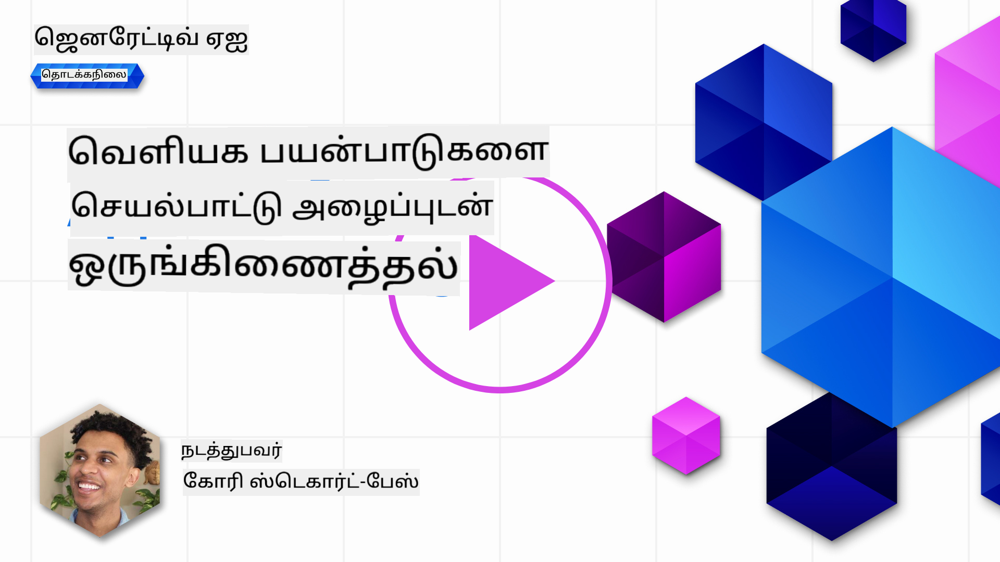
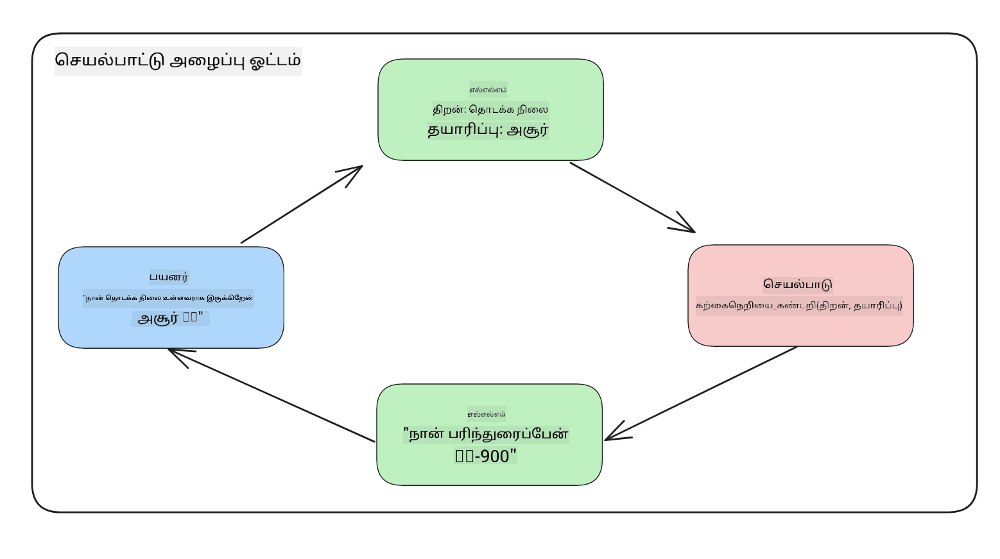
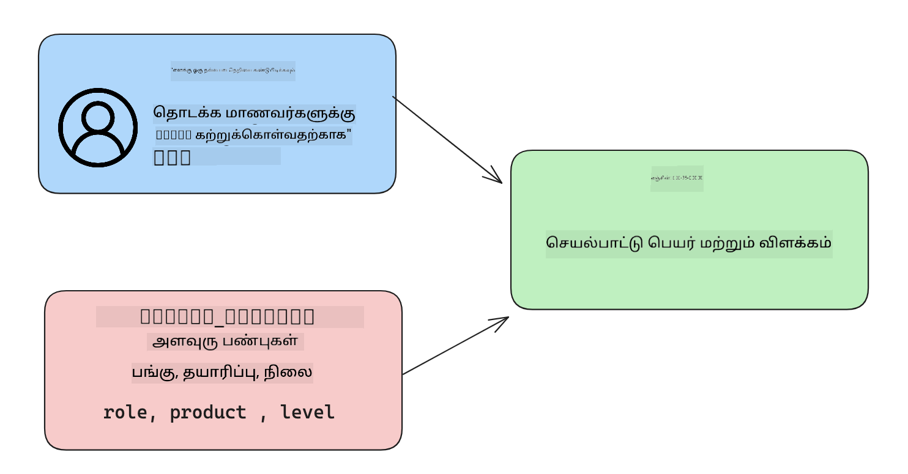

<!--
CO_OP_TRANSLATOR_METADATA:
{
  "original_hash": "f6f84f9ef2d066cd25850cab93580a50",
  "translation_date": "2025-10-18T02:36:47+00:00",
  "source_file": "11-integrating-with-function-calling/README.md",
  "language_code": "ta"
}
-->
# செயல்பாடுகளை அழைப்பதுடன் ஒருங்கிணைத்தல்

[](https://youtu.be/DgUdCLX8qYQ?si=f1ouQU5HQx6F8Gl2)

முந்தைய பாடங்களில் நீங்கள் பலவற்றை கற்றுக்கொண்டீர்கள். இருப்பினும், நாம் மேலும் மேம்படுத்த முடியும். நாம் கவனிக்க வேண்டிய சில விஷயங்கள், பதில்களை எளிதாக செயல்படுத்துவதற்காக ஒரு சீரான பதில் வடிவத்தை எவ்வாறு பெறுவது என்பதையும், மேலும் எங்கள் பயன்பாட்டை மேம்படுத்துவதற்காக பிற மூலங்களிலிருந்து தரவுகளை சேர்க்க வேண்டும் என்பதையும் உள்ளடக்கியது.

மேலே குறிப்பிடப்பட்டுள்ள சிக்கல்களே இந்த அத்தியாயத்தில் தீர்க்க முயற்சிக்கின்றன.

## அறிமுகம்

இந்த பாடத்தில்:

- செயல்பாடுகளை அழைப்பது என்ன மற்றும் அதன் பயன்பாட்டு வழக்குகள் என்ன என்பதை விளக்குதல்.
- Azure OpenAI மூலம் ஒரு செயல்பாட்டு அழைப்பை உருவாக்குதல்.
- செயல்பாட்டு அழைப்பை ஒரு பயன்பாட்டுடன் ஒருங்கிணைப்பது எப்படி என்பதை விளக்குதல்.

## கற்றல் இலக்குகள்

இந்த பாடத்தின் முடிவில், நீங்கள்:

- செயல்பாடுகளை அழைப்பதன் நோக்கத்தை விளக்க முடியும்.
- Azure OpenAI சேவையைப் பயன்படுத்தி செயல்பாட்டு அழைப்பை அமைக்க முடியும்.
- உங்கள் பயன்பாட்டின் பயன்பாட்டு வழக்கிற்கான செயல்பாட்டு அழைப்புகளை திறமையாக வடிவமைக்க முடியும்.

## சூழல்: செயல்பாடுகளுடன் எங்கள் சாட்பாட்டை மேம்படுத்துதல்

இந்த பாடத்திற்காக, நாங்கள் எங்கள் கல்வி ஸ்டார்ட்அப் பயன்பாட்டிற்கான ஒரு அம்சத்தை உருவாக்க விரும்புகிறோம், இது பயனர்களுக்கு தொழில்நுட்ப பாடங்களை கண்டறிய சாட்பாட்டைப் பயன்படுத்த அனுமதிக்கிறது. அவர்கள் திறன் நிலை, தற்போதைய பங்கு மற்றும் ஆர்வமான தொழில்நுட்பத்திற்கு பொருந்தக்கூடிய பாடங்களை பரிந்துரைப்போம்.

இந்த சூழ்நிலையை முடிக்க, நாங்கள் பின்வரும் ஒன்றிணைந்த முறையைப் பயன்படுத்துவோம்:

- `Azure OpenAI` பயனர்களுக்கான சாட் அனுபவத்தை உருவாக்க.
- `Microsoft Learn Catalog API` பயனர்கள் கேட்டுக்கொண்ட பாடங்களை அடிப்படையாகக் கொண்டு பாடங்களை கண்டறிய உதவ.
- `Function Calling` பயனர்களின் கேள்வியை எடுத்துக்கொண்டு அதை செயல்பாட்டிற்கு அனுப்ப API கோரிக்கையை உருவாக்க.

முதலில், செயல்பாடுகளை அழைப்பதன் தேவையைப் பார்ப்போம்:

## ஏன் செயல்பாடுகளை அழைக்க வேண்டும்

செயல்பாடுகளை அழைப்பதற்கு முன், LLM-க்களிடமிருந்து பதில்கள் அமைப்பற்ற மற்றும் சீரற்றதாக இருந்தன. ஒவ்வொரு பதிலின் மாறுபாட்டையும் கையாள முடியும் என்பதை உறுதிப்படுத்துவதற்கு டெவலப்பர்கள் சிக்கலான சரிபார்ப்பு குறியீட்டை எழுத வேண்டியிருந்தது. "ஸ்டாக்ஹோம் நகரின் தற்போதைய வானிலை என்ன?" போன்ற கேள்விகளுக்கு பதிலளிக்க பயனர்கள் முடியவில்லை. ஏனெனில் மாடல்கள் பயிற்சி அளிக்கப்பட்ட தரவின் நேரத்திற்கே மட்டுப்படுத்தப்பட்டன.

Azure OpenAI சேவையின் செயல்பாட்டு அழைப்புகள் பின்வரும் குறைபாடுகளை சமாளிக்க உதவுகிறது:

- **சீரான பதில் வடிவம்**. பதில் வடிவத்தை நன்கு கட்டுப்படுத்த முடிந்தால், பதிலை பிற அமைப்புகளுடன் ஒருங்கிணைக்க எளிதாக இருக்கும்.
- **வெளியக தரவுகள்**. ஒரு சாட் சூழலில் பயன்பாட்டின் பிற மூலங்களிலிருந்து தரவுகளைப் பயன்படுத்தும் திறன்.

## ஒரு சூழ்நிலையின் மூலம் சிக்கலை விளக்குதல்

> கீழே உள்ள சூழ்நிலையை இயக்க விரும்பினால் [சேர்க்கப்பட்ட நோட்புக்](./python/aoai-assignment.ipynb?WT.mc_id=academic-105485-koreyst) பயன்படுத்த பரிந்துரைக்கிறோம். அல்லது, செயல்பாடுகள் சிக்கலை எவ்வாறு தீர்க்க உதவ முடியும் என்பதை விளக்க முயற்சிக்கிறோம் என்பதால், நீங்கள் படிக்கலாம்.

பதில் வடிவ சிக்கலை விளக்கும் உதாரணத்தைப் பார்ப்போம்:

நாம் மாணவர்களின் தரவுகளின் தரவுத்தொகுப்பை உருவாக்க விரும்புகிறோம் என்று கூறுவோம், இதன் மூலம் அவர்களுக்கு சரியான பாடத்தை பரிந்துரைக்க முடியும். கீழே, மாணவர்களின் இரண்டு விவரணைகள் உள்ளன, அவை உள்ளடக்கிய தரவுகளில் மிகவும் ஒத்ததாக உள்ளன.

1. எங்கள் Azure OpenAI வளத்துடன் ஒரு இணைப்பை உருவாக்கவும்:

   ```python
   import os
   import json
   from openai import AzureOpenAI
   from dotenv import load_dotenv
   load_dotenv()

   client = AzureOpenAI(
   api_key=os.environ['AZURE_OPENAI_API_KEY'],  # this is also the default, it can be omitted
   api_version = "2023-07-01-preview"
   )

   deployment=os.environ['AZURE_OPENAI_DEPLOYMENT']
   ```

   கீழே `api_type`, `api_base`, `api_version` மற்றும் `api_key` அமைக்க எங்கள் Azure OpenAI இணைப்பை உள்ளமைக்க சில Python குறியீடுகள் உள்ளன.

1. `student_1_description` மற்றும் `student_2_description` என்ற மாறிகள் மூலம் இரண்டு மாணவர் விவரணைகளை உருவாக்குதல்.

   ```python
   student_1_description="Emily Johnson is a sophomore majoring in computer science at Duke University. She has a 3.7 GPA. Emily is an active member of the university's Chess Club and Debate Team. She hopes to pursue a career in software engineering after graduating."

   student_2_description = "Michael Lee is a sophomore majoring in computer science at Stanford University. He has a 3.8 GPA. Michael is known for his programming skills and is an active member of the university's Robotics Club. He hopes to pursue a career in artificial intelligence after finishing his studies."
   ```

   மேலே உள்ள மாணவர் விவரணைகளை LLM-க்கு அனுப்பி தரவுகளை பகுப்பாய்வு செய்ய விரும்புகிறோம். இந்த தரவுகள் பின்னர் எங்கள் பயன்பாட்டில் பயன்படுத்தப்படலாம் மற்றும் API-க்கு அனுப்பப்படலாம் அல்லது தரவுத்தொகுப்பில் சேமிக்கப்படலாம்.

1. LLM-க்கு எவ்வாறு தகவலை எடுக்க வேண்டும் மற்றும் JSON வடிவத்தில் பதிலளிக்க வேண்டும் என்பதை நாங்கள் அறிவுறுத்தும் இரண்டு ஒரே மாதிரியான உந்துதல்களை உருவாக்குவோம்:

   ```python
   prompt1 = f'''
   Please extract the following information from the given text and return it as a JSON object:

   name
   major
   school
   grades
   club

   This is the body of text to extract the information from:
   {student_1_description}
   '''

   prompt2 = f'''
   Please extract the following information from the given text and return it as a JSON object:

   name
   major
   school
   grades
   club

   This is the body of text to extract the information from:
   {student_2_description}
   '''
   ```

   மேலே உள்ள உந்துதல்கள் LLM-க்கு தகவலை எடுக்கவும் JSON வடிவத்தில் பதிலளிக்கவும் அறிவுறுத்துகின்றன.

1. உந்துதல்களை அமைத்த பிறகு மற்றும் Azure OpenAI-க்கு இணைப்பை அமைத்த பிறகு, `openai.ChatCompletion` பயன்படுத்தி LLM-க்கு உந்துதல்களை அனுப்புவோம். நாங்கள் `messages` மாறியில் உந்துதலை சேமித்து, `user` என்ற பங்கAssign செய்கிறோம். இது சாட்பாட்டிற்கு ஒரு பயனரின் செய்தியை ஒத்ததாக அமைக்கிறது.

   ```python
   # response from prompt one
   openai_response1 = client.chat.completions.create(
   model=deployment,
   messages = [{'role': 'user', 'content': prompt1}]
   )
   openai_response1.choices[0].message.content

   # response from prompt two
   openai_response2 = client.chat.completions.create(
   model=deployment,
   messages = [{'role': 'user', 'content': prompt2}]
   )
   openai_response2.choices[0].message.content
   ```

இப்போது, இரண்டு கோரிக்கைகளை LLM-க்கு அனுப்பி, `openai_response1['choices'][0]['message']['content']` மூலம் பதிலைப் பார்ப்போம்.

1. இறுதியாக, `json.loads` அழைப்பதன் மூலம் பதிலை JSON வடிவத்திற்கு மாற்றலாம்:

   ```python
   # Loading the response as a JSON object
   json_response1 = json.loads(openai_response1.choices[0].message.content)
   json_response1
   ```

   பதில் 1:

   ```json
   {
     "name": "Emily Johnson",
     "major": "computer science",
     "school": "Duke University",
     "grades": "3.7",
     "club": "Chess Club"
   }
   ```

   பதில் 2:

   ```json
   {
     "name": "Michael Lee",
     "major": "computer science",
     "school": "Stanford University",
     "grades": "3.8 GPA",
     "club": "Robotics Club"
   }
   ```

   உந்துதல்கள் ஒரே மாதிரியானவை மற்றும் விவரணைகள் ஒத்ததாக இருந்தாலும், `Grades` சொத்தின் மதிப்புகள் மாறுபட்ட வடிவத்தில் உள்ளன, உதாரணமாக, சில நேரங்களில் `3.7` அல்லது `3.7 GPA` வடிவத்தில் கிடைக்கிறது.

   இந்த முடிவு, LLM எழுதிய உந்துதலின் வடிவமைக்காத தரவுகளை எடுத்து, அமைப்பற்ற தரவுகளை திருப்புவதால் ஏற்படுகிறது. இந்த தரவுகளை சேமிக்க அல்லது பயன்படுத்தும்போது எதைக் எதிர்பார்க்க வேண்டும் என்பதை நாங்கள் அறிந்துகொள்ள வேண்டும்.

அப்படியானால், வடிவமைப்புச் சிக்கலை எவ்வாறு தீர்க்கலாம்? செயல்பாட்டு அழைப்புகளைப் பயன்படுத்துவதன் மூலம், அமைப்பான தரவுகளை திரும்பப் பெறுவதை உறுதிப்படுத்தலாம். செயல்பாட்டு அழைப்புகளைப் பயன்படுத்தும்போது, LLM எந்த செயல்பாடுகளையும் உண்மையில் அழைக்கவோ அல்லது இயக்கவோ இல்லை. மாறாக, LLM தனது பதில்களுக்கு பின்பற்ற ஒரு அமைப்பை உருவாக்குகிறோம். பின்னர், அந்த அமைப்பான பதில்களை எங்கள் பயன்பாடுகளில் எந்த செயல்பாட்டை இயக்க வேண்டும் என்பதை அறிய பயன்படுத்துகிறோம்.



பின்னர், செயல்பாட்டிலிருந்து திரும்பியதை எடுத்து, LLM-க்கு திருப்பி அனுப்பலாம். பின்னர், LLM பயனரின் கேள்விக்கு பதிலளிக்க இயற்கை மொழியைப் பயன்படுத்தி பதிலளிக்கும்.

## செயல்பாட்டு அழைப்புகளைப் பயன்படுத்துவதற்கான பயன்பாட்டு வழக்குகள்

செயல்பாட்டு அழைப்புகள் உங்கள் பயன்பாட்டை மேம்படுத்த பல்வேறு பயன்பாட்டு வழக்குகள் உள்ளன:

- **வெளியக கருவிகளை அழைப்பது**. சாட்பாட்டுகள் பயனர்களின் கேள்விகளுக்கு பதிலளிக்க சிறந்தவை. செயல்பாட்டு அழைப்புகளைப் பயன்படுத்துவதன் மூலம், சாட்பாட்டுகள் பயனர்களின் செய்திகளைப் பயன்படுத்தி குறிப்பிட்ட பணிகளை முடிக்க முடியும். உதாரணமாக, ஒரு மாணவர் சாட்பாட்டிடம் "இந்த பாடத்தில் எனக்கு மேலும் உதவி தேவை என்று என் ஆசிரியருக்கு ஒரு மின்னஞ்சல் அனுப்புங்கள்" என்று கேட்கலாம். இது `send_email(to: string, body: string)` என்ற செயல்பாட்டை அழைக்கலாம்.

- **API அல்லது தரவுத்தொகுப்பு கேள்விகளை உருவாக்குதல்**. பயனர்கள் இயற்கை மொழியைப் பயன்படுத்தி தகவல்களை கண்டறியலாம், இது வடிவமைக்கப்பட்ட கேள்வி அல்லது API கோரிக்கையாக மாற்றப்படுகிறது. இதன் ஒரு உதாரணம், ஒரு ஆசிரியர் "கடைசி பணியை முடித்த மாணவர்கள் யார்?" என்று கேட்கலாம், இது `get_completed(student_name: string, assignment: int, current_status: string)` என்ற செயல்பாட்டை அழைக்கலாம்.

- **அமைப்பான தரவுகளை உருவாக்குதல்**. பயனர்கள் ஒரு உரை அல்லது CSV தொகுதியை எடுத்து, அதிலிருந்து முக்கியமான தகவல்களை LLM மூலம் எடுக்க முடியும். உதாரணமாக, ஒரு மாணவர் அமைதிக்கான ஒப்பந்தங்கள் பற்றிய விக்கிபீடியா கட்டுரையை AI ஃப்ளாஷ்கார்டுகளாக மாற்ற முடியும். இது `get_important_facts(agreement_name: string, date_signed: string, parties_involved: list)` என்ற செயல்பாட்டை பயன்படுத்தி செய்ய முடியும்.

## உங்கள் முதல் செயல்பாட்டு அழைப்பை உருவாக்குதல்

செயல்பாட்டு அழைப்பை உருவாக்கும் செயல்முறை மூன்று முக்கிய படிகளை உள்ளடக்கியது:

1. **அழைப்பு** - உங்கள் செயல்பாடுகளின் பட்டியல் மற்றும் பயனர் செய்தியுடன் Chat Completions API-ஐ அழைக்கவும்.
2. **படித்தல்** - மாடலின் பதிலை ஒரு செயலைச் செய்ய, அதாவது ஒரு செயல்பாட்டை அல்லது API அழைப்பைச் செயல்படுத்த.
3. **செய்தல்** - உங்கள் செயல்பாட்டின் பதிலுடன் Chat Completions API-க்கு மற்றொரு அழைப்பைச் செய்யவும், அந்த தகவலைப் பயன்படுத்தி பயனருக்கு பதிலை உருவாக்க.



### படி 1 - செய்திகளை உருவாக்குதல்

முதல் படி, ஒரு பயனர் செய்தியை உருவாக்குவது. இது ஒரு உரை உள்ளீட்டின் மதிப்பை எடுத்துக்கொண்டு மாறுபடக்கூடியதாக ஒதுக்கப்படலாம் அல்லது நீங்கள் இங்கே ஒரு மதிப்பை ஒதுக்கலாம். Chat Completions API-யுடன் முதன்முதலில் பணிபுரிந்தால், செய்தியின் `role` மற்றும் `content`-ஐ வரையறுக்க வேண்டும்.

`role` என்பது `system` (விதிகளை உருவாக்குதல்), `assistant` (மாதிரி) அல்லது `user` (இறுதி பயனர்) ஆகியவற்றில் ஏதாவது இருக்கலாம். செயல்பாட்டு அழைப்புகளுக்கு, இதை `user` ஆகவும் ஒரு உதாரண கேள்வியாகவும் ஒதுக்குவோம்.

```python
messages= [ {"role": "user", "content": "Find me a good course for a beginner student to learn Azure."} ]
```

வகுப்புகளை மாறுபட ஒதுக்குவதன் மூலம், LLM-க்கு இது ஒரு அமைப்பு அல்லது பயனர் கூறுவது போன்றது என்பதை தெளிவாகக் கூறுகிறது, இது LLM-க்கு ஒரு உரையாடல் வரலாற்றை உருவாக்க உதவுகிறது.

### படி 2 - செயல்பாடுகளை உருவாக்குதல்

அடுத்ததாக, ஒரு செயல்பாட்டை மற்றும் அந்த செயல்பாட்டின் அளவுருக்களை வரையறுக்க வேண்டும். இங்கே `search_courses` என்ற ஒரு செயல்பாட்டை மட்டுமே பயன்படுத்துவோம், ஆனால் நீங்கள் பல செயல்பாடுகளை உருவாக்கலாம்.

> **முக்கியம்** : செயல்பாடுகள் LLM-க்கு அமைப்பு செய்தியில் சேர்க்கப்பட்டுள்ளன மற்றும் உங்களுக்கு கிடைக்கக்கூடிய டோக்கன்களின் அளவில் சேர்க்கப்படும்.

கீழே, செயல்பாடுகளை உருப்படிகளின் வரிசையாக உருவாக்குகிறோம். ஒவ்வொரு உருப்படியும் ஒரு செயல்பாடாகும் மற்றும் `name`, `description` மற்றும் `parameters` என்ற சொத்துகளை கொண்டுள்ளது:

```python
functions = [
   {
      "name":"search_courses",
      "description":"Retrieves courses from the search index based on the parameters provided",
      "parameters":{
         "type":"object",
         "properties":{
            "role":{
               "type":"string",
               "description":"The role of the learner (i.e. developer, data scientist, student, etc.)"
            },
            "product":{
               "type":"string",
               "description":"The product that the lesson is covering (i.e. Azure, Power BI, etc.)"
            },
            "level":{
               "type":"string",
               "description":"The level of experience the learner has prior to taking the course (i.e. beginner, intermediate, advanced)"
            }
         },
         "required":[
            "role"
         ]
      }
   }
]
```

ஒவ்வொரு செயல்பாட்டு உருப்படியின் விவரங்களை கீழே விரிவாக விளக்குகிறோம்:

- `name` - அழைக்க விரும்பும் செயல்பாட்டின் பெயர்.
- `description` - செயல்பாடு எப்படி செயல்படுகிறது என்பதற்கான விளக்கம். இங்கே குறிப்பாகவும் தெளிவாகவும் இருக்க வேண்டும்.
- `parameters` - மாடல் தனது பதிலில் உருவாக்க விரும்பும் மதிப்புகள் மற்றும் வடிவத்தின் பட்டியல். அளவுருக்கள் வரிசை உருப்படிகளை கொண்டுள்ளது, இதில் உருப்படிகள் பின்வரும் சொத்துக்களை கொண்டுள்ளது:
  1.  `type` - சொத்துகள் சேமிக்கப்படும் தரவின் வகை.
  1.  `properties` - மாடல் தனது பதிலில் பயன்படுத்தும் குறிப்பிட்ட மதிப்புகளின் பட்டியல்.
      1. `name` - மாடல் தனது வடிவமைக்கப்பட்ட பதிலில் பயன்படுத்தும் சொத்தின் பெயர், உதாரணமாக, `product`.
      1. `type` - இந்த சொத்தின் தரவின் வகை, உதாரணமாக, `string`.
      1. `description` - குறிப்பிட்ட சொத்தின் விளக்கம்.

அதேபோல், `required` என்ற விருப்ப சொத்தும் உள்ளது - செயல்பாட்டு அழைப்பு முடிக்க தேவையான சொத்து.

### படி 3 - செயல்பாட்டு அழைப்பு செய்வது

ஒரு செயல்பாட்டை வரையறுக்கிறோம், அதை Chat Completion API அழைப்பில் சேர்க்க வேண்டும். இதை `functions` கோரிக்கையில் சேர்ப்பதன் மூலம் செய்கிறோம். இந்த வழக்கில் `functions=functions`.

`function_call` ஐ `auto` ஆக அமைக்கவும் விருப்பம் உள்ளது. இது பயனர் செய்தியை அடிப்படையாகக் கொண்டு எந்த செயல்பாட்டை அழைக்க வேண்டும் என்பதை LLM முடிவு செய்ய அனுமதிக்கிறது.

கீழே உள்ள குறியீட்டில், `ChatCompletion.create` அழைக்கிறோம், `functions=functions` மற்றும் `function_call="auto"` அமைத்துள்ளோம், இதனால் LLM எப்போது செயல்பாடுகளை அழைக்க வேண்டும் என்பதைத் தேர்ந்தெடுக்க அனுமதிக்கிறோம்:

```python
response = client.chat.completions.create(model=deployment,
                                        messages=messages,
                                        functions=functions,
                                        function_call="auto")

print(response.choices[0].message)
```

இப்போது திரும்ப வரும் பதில் இவ்வாறு இருக்கும்:

```json
{
  "role": "assistant",
  "function_call": {
    "name": "search_courses",
    "arguments": "{\n  \"role\": \"student\",\n  \"product\": \"Azure\",\n  \"level\": \"beginner\"\n}"
  }
}
```

இங்கே, `search_courses` செயல்பாடு அழைக்கப்பட்டது மற்றும் எந்த வாதங்களுடன் அழைக்கப்பட்டது என்பதை `arguments` சொத்தில் JSON பதிலில் பட்டியலிடப்பட்டுள்ளது.

LLM, `messages` அளவுருவில் வழங்கப்பட்ட மதிப்பிலிருந்து தரவுகளை எடுத்து செயல்பாட்டின் வாதங்களுக்கு பொருந்தும் தரவுகளை கண்டறிந்தது. கீழே `messages` மதிப்பின் நினைவூட்டல் உள்ளது:

```python
messages= [ {"role": "user", "content": "Find me a good course for a beginner student to learn Azure."} ]
```

நீங்கள் காணலாம், `student`, `Azure` மற்றும் `beginner` ஆகியவை `messages`-இல் இருந்து எடுக்கப்பட்டு, செயல்பாட்டிற்கான உள்ளீடாக அமைக்கப்பட்டது. செயல்பாடுகளை இந்த வழியில் பயன்படுத்துவது ஒரு உந்துதலிலிருந்து தகவலை எடுக்கவும், LLM-க்கு அமைப்பை வழங்கவும், மீண்டும் பயன்படுத்தக்கூடிய செயல்பாடுகளை உருவாக்கவும் சிறந்த வழியாகும்.

அடுத்ததாக, இதை எங்கள் பயன்பாட்டில் எவ்வாறு பயன்படுத்தலாம் என்பதைப் பார்ப்போம்.

## செயல்பாட்டு அழைப்புகளை ஒரு பயன்பாட்டுடன் ஒருங்கிணைத்தல்

LLM-இன் அமைப்பான பதிலை சோதித்த பிறகு, இதை எங்கள் பயன்பாட்டுடன் ஒருங்கிணைக்க முடியும்.

### ஓட்டத்தை நிர்வகித்தல்

இதனை எங்கள் பயன்பாட்டுடன் ஒருங்கிணைக்க, பின்வரும் படிகளை எடுத்துக்கொள்ளலாம்:

1. முதலில், OpenAI சேவைகளை அழைத்து, செய்தியை `response_message` என்ற மாறியில் சேமிக்கவும்.

   ```python
   response_message = response.choices[0].message
   ```

1. இப்போது Microsoft Learn API-ஐ அழைத்து பாடங்களின் பட்டியலைப் பெறும் செயல்பாட்டை வரையறுக்கிறோம்:

   ```python
   import requests

   def search_courses(role, product, level):
     url = "https://learn.microsoft.com/api/catalog/"
     params = {
        "role": role,
        "product": product,
        "level": level
     }
     response = requests.get(url, params=params)
     modules = response.json()["modules"]
     results = []
     for module in modules[:5]:
        title = module["title"]
        url = module["url"]
        results.append({"title": title, "url": url})
     return str(results)
   ```

   இப்போது, `functions` மாறிகளின் செயல்பாட்டு பெயர்களுக்கு பொருந்தும் ஒரு Python செயல்பாட்டை உருவாக்குகிறோம். எங்களுக்கு தேவையான தரவுகளைப் பெற வெளிப்புற API அழைப்புகளை செய்கிறோம். இந்த வழக்கில், Microsoft Learn API-க்கு பயிற்சி தொகுதிகளைத் தேடுகிறோம்.

சரி, `functions` மாறிகள் மற்றும் அதற்கான Python செயல்பாட்டை உருவாக்கியுள்ளோம், எங்கள் Python செயல்பாடு அழைக்கப்படுவதற்காக LLM-க்கு எப்படி இந்த இரண்டையும் இணைக்கலாம்?

1. Python செயல்பாட்டை அழைக்க வேண்டுமா என்பதை அறிய, LLM பதிலில் `function_call` உள்ளதா என்பதைப் பார்க்க வேண்டும் மற்றும் குறிப்பிடப்பட்ட செயல்பாட்டை அழைக்க வேண்டும். கீழே குறிப்பிடப்பட்டுள்ள சரிபார்ப்பை நீங்கள் செய்யலாம்:

   ```python
   # Check if the model wants to call a function
   if response_message.function_call.name:
    print("Recommended Function call:")
    print(response_message.function_call.name)
    print()

    # Call the function.
    function_name = response_message.function_call.name

    available_functions = {
            "search_courses": search_courses,
    }
    function_to_call = available_functions[function_name]

    function_args = json.loads(response_message.function_call.arguments)
    function_response = function_to_call(**function_args)

    print("Output of function call:")
    print(function_response)
    print(type(function_response))


    # Add the assistant response and function response to the messages
    messages.append( # adding assistant response to messages
        {
            "role": response_message.role,
            "function_call": {
                "name": function_name,
                "arguments": response_message.function_call.arguments,
            },
            "content": None
        }
    )
    messages.append( # adding function response to messages
        {
            "role": "function",
            "name": function_name,
            "content":function_response,
        }
    )
   ```

   இந்த மூன்று வரிகள், செயல்பாட்டு பெயர், வாதங்களை எடுத்து, அழைப்பை உறுதிப்படுத்துகின்றன:

   ```python
   function_to_call = available_functions[function_name]

   function_args = json.loads(response_message.function_call.arguments)
   function_response = function_to_call(**function_args)
   ```

   கீழே எங்கள் குறியீட்டை இயக்கிய பிறகு வரும் வெளியீடு உள்ளது:

   **வெளியீடு**

   ```Recommended Function call:
   {
     "name": "search_courses",
     "arguments": "{\n  \"role\": \"student\",\n  \"product\": \"Azure\",\n  \"level\": \"beginner\"\n}"
   }

   Output of function call:
   [{'title': 'Describe concepts of cryptography', 'url': 'https://learn.microsoft.com/training/modules/describe-concepts-of-cryptography/?
   WT.mc_id=api_CatalogApi'}, {'title': 'Introduction to audio classification with TensorFlow', 'url': 'https://learn.microsoft.com/en-
   us/training/modules/intro-audio-classification-tensorflow/?WT.mc_id=api_CatalogApi'}, {'title': 'Design a Performant Data Model in Azure SQL
   Database with Azure Data Studio', 'url': 'https://learn.microsoft.com/training/modules/design-a-data-model-with-ads/?
   WT.mc_id=api_CatalogApi'}, {'title': 'Getting started with the Microsoft Cloud Adoption Framework for Azure', 'url':
   'https://learn.microsoft.com/training/modules/cloud-adoption-framework-getting-started/?WT.mc_id=api_CatalogApi'}, {'title': 'Set up the
   Rust development environment', 'url': 'https://learn.microsoft.com/training/modules/rust-set-up-environment/?WT.mc_id=api_CatalogApi'}]
   <class 'str'>
   ```

1. இப்போது, புதுப்பிக்கப்பட்ட செய்தியை `messages`-க்கு LLM-க்கு அனுப்புவோம், இதனால் API JSON வடிவமைக்கப்பட்ட பதிலுக்கு பதிலாக இயற்கை மொழி பதிலைப் பெற முடியும்.

   ```python
   print("Messages in next request:")
   print(messages)
   print()

   second_response = client.chat.completions.create(
      messages=messages,
      model=deployment,
      function_call="auto",
      functions=functions,
      temperature=0
         )  # get a new response from GPT where it can see the function response


   print(second_response.choices[0].message)
   ```

   **வெளியீடு**

   ```python
   {
     "role": "assistant",
     "content": "I found some good courses for beginner students to learn Azure:\n\n1. [Describe concepts of cryptography] (https://learn.microsoft.com/training/modules/describe-concepts-of-cryptography/?WT.mc_id=api_CatalogApi)\n2. [Introduction to audio classification with TensorFlow](https://learn.microsoft.com/training/modules/intro-audio-classification-tensorflow/?WT.mc_id=api_CatalogApi)\n3. [Design a Performant Data Model in Azure SQL Database with Azure Data Studio](https://learn.microsoft.com/training/modules/design-a-data-model-with-ads/?WT.mc_id=api_CatalogApi)\n4. [Getting started with the Microsoft Cloud Adoption Framework for Azure](https://learn.microsoft.com/training/modules/cloud-adoption-framework-getting-started/?WT.mc_id=api_CatalogApi)\n5. [Set up the Rust development environment](https://learn.microsoft.com/training/modules/rust-set-up-environment/?WT.mc_id=api_CatalogApi)\n\nYou can click on the links to access the courses."
   }

   ```

## பணிக்குறிப்பு

Azure OpenAI Function Calling பற்றிய உங்கள் கற்றலை தொடர, நீங்கள் உருவாக்கலாம்:

- பயிலாளர்கள்
- செயல்பாடு அழைப்பு மற்றும்/அல்லது API அழைப்பு எந்த பொருத்தமான பாடநெறிகளையும் திருப்பாதபோது பிழை கையாளுதல் உருவாக்கவும்

குறிப்பு: இந்த தரவுகள் எங்கு மற்றும் எப்படி கிடைக்கின்றன என்பதை அறிய [Learn API reference documentation](https://learn.microsoft.com/training/support/catalog-api-developer-reference?WT.mc_id=academic-105485-koreyst) பக்கத்தைப் பின்பற்றவும்.

## சிறந்த வேலை! பயணத்தை தொடருங்கள்

இந்த பாடத்தை முடித்த பிறகு, எங்கள் [Generative AI Learning collection](https://aka.ms/genai-collection?WT.mc_id=academic-105485-koreyst) ஐப் பாருங்கள், உங்கள் Generative AI அறிவை மேலும் மேம்படுத்த!

Lesson 12-க்கு செல்லுங்கள், அங்கு [AI பயன்பாடுகளுக்கான UX வடிவமைப்பை](../12-designing-ux-for-ai-applications/README.md?WT.mc_id=academic-105485-koreyst) எப்படி செய்யலாம் என்பதைப் பார்ப்போம்!

---

**புறக்கணிப்பு**:  
இந்த ஆவணம் AI மொழிபெயர்ப்பு சேவை [Co-op Translator](https://github.com/Azure/co-op-translator) பயன்படுத்தி மொழிபெயர்க்கப்பட்டுள்ளது. நாங்கள் துல்லியத்திற்காக முயற்சிக்கின்றோம், ஆனால் தானியக்க மொழிபெயர்ப்புகளில் பிழைகள் அல்லது தவறுகள் இருக்கக்கூடும் என்பதை கவனத்தில் கொள்ளவும். அதன் தாய்மொழியில் உள்ள அசல் ஆவணம் அதிகாரப்பூர்வ ஆதாரமாக கருதப்பட வேண்டும். முக்கியமான தகவல்களுக்கு, தொழில்முறை மனித மொழிபெயர்ப்பு பரிந்துரைக்கப்படுகிறது. இந்த மொழிபெயர்ப்பைப் பயன்படுத்துவதால் ஏற்படும் எந்த தவறான புரிதல்கள் அல்லது தவறான விளக்கங்களுக்கு நாங்கள் பொறுப்பல்ல.