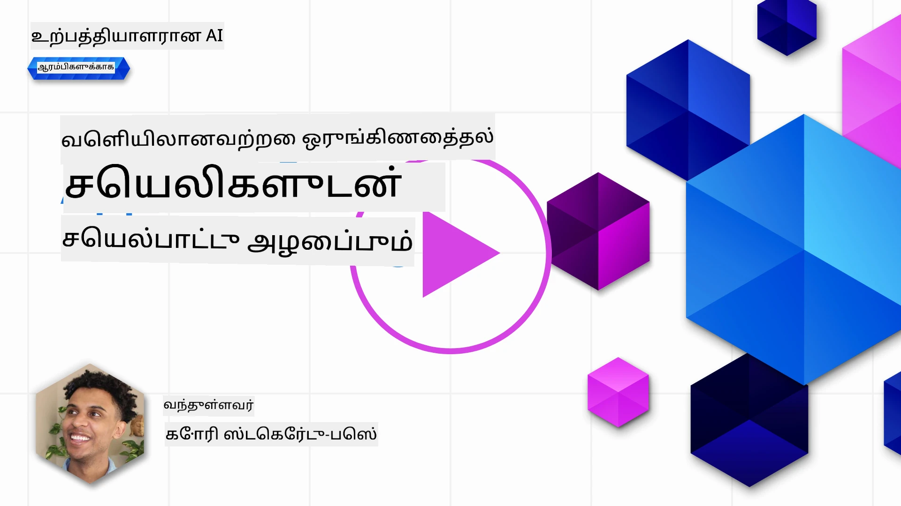
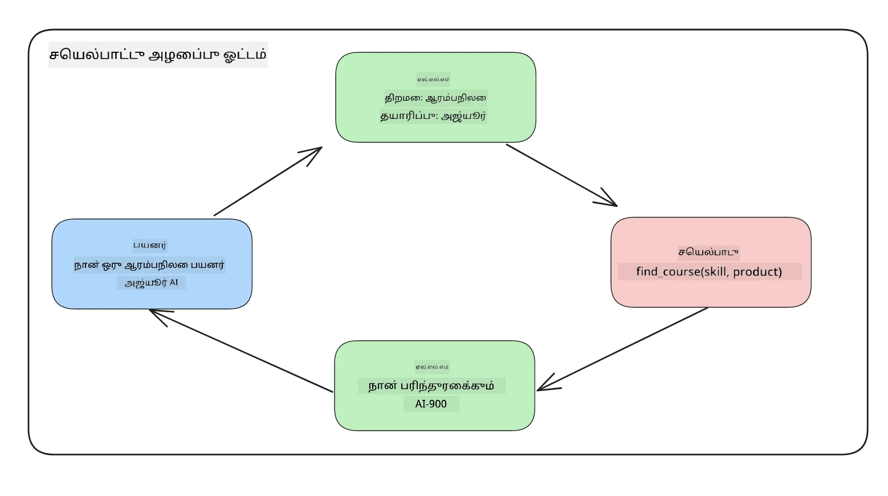
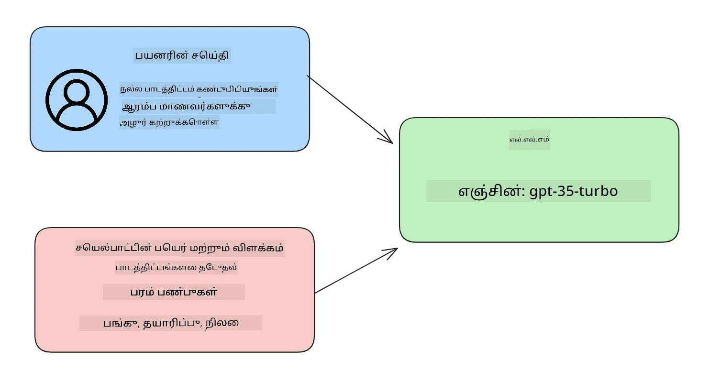

# செயல்பாடு அழைப்புடன் ஒருங்கிணைத்தல்

[](https://youtu.be/DgUdCLX8qYQ?si=f1ouQU5HQx6F8Gl2)

நீங்கள் இதுவரை முழுமையாக பாடங்களில் கற்றுக்கொண்டுள்ளீர்கள். இருப்பினும், நாம் மேலும் மேம்படுத்த முடியும். சில விஷயங்கள் நாம் முகாமை செய்யக்கூடியவை என்பது எவ்வாறு நாம் பதிலளிக்கும் வடிவமைப்பை மேலும் ஒரே மாதிரியாகக் கொண்டு வர முடியும் என்பது, இது பதிலளிப்பை பின்னர் எளிதாக செயல்படுத்த உதவும். அதேபோல், நமது பயன்பாட்டை மேலும் செழிப்பாக்க மற்ற மூலத் தரவுகளிலிருந்து தரவை சேர்க்க விரும்பலாம்.

மேலே ذكரிக்கப்பட்ட சிக்கல்கள் இந்த அத்தியாயம் முகாமை செய்யும் நோக்கமாகும்.

## அறிமுகம்

இந்த பாடத்தில் உள்ளடக்கம்:

- செயல்பாடு அழைப்பு என்ன மற்றும் அதன் பயன்பாட்டு நிலைகள் என்ன என்பதை விளக்குவது.
- Azure OpenAI பயன்படுத்தி செயல்பாடு அழைப்பை உருவாக்குவது.
- செயல்பாடு அழைப்பை ஒரு பயன்பாட்டில் ஒருங்கிணைப்பது எப்படி என்பதை கற்றுக்கொள்வது.

## கற்றலும் குறிக்கோள்கள்

இந்த பாடத்தின் முடிவில், நீங்கள்:

- செயல்பாடு அழைப்பை பயன்படுத்திய நோக்கத்தை விளக்கலாம்.
- Azure OpenAI சேவையைப் பயன்படுத்தி செயல் அழைப்பை அமைக்கலாம்.
- உங்கள் பயன்பாட்டின் பயன்பாட்டு நிலைக்கான பயனுள்ள செயல்பாடு அழைப்புகளை வடிவமைக்கலாம்.

## நிகழ்வுத் தொலைகாட்சி: செயல்பாடுகள் மூலம் நமது chatbot மேம்பாடு

இந்த பாடத்தில், நமது கல்வி தொடக்க நிறுவனத்திற்கான ஒரு அம்சத்தை உருவாக்க விரும்புகிறோம், அதன் மூலம் பயனர்கள் chatbot பயன்படுத்தி தொழிற்துறை பாடங்களை தேட முடியும். அவர்கள் திறன் நிலை, தற்போதைய பங்கு மற்றும் ஆர்வம் கொண்ட தொழில்நுட்பத்தை பொருத்து பாடங்களை பரிந்துரைக்கிறோம்.

இந்த நிகழ்வை நிறைவேற்ற, நாங்கள் பின்வரும் ஒன்றிணைப்பைக் பயன்படுத்துகிறோம்:

- `Azure OpenAI` பயனருக்கான அலைபேசி அனுபவத்தை உருவாக்க.
- `Microsoft Learn Catalog API` பயனர்களின் கோரிக்கையை அடிப்படையாக கொண்டு பாடங்களை கண்டறிவதற்கு உதவ.
- `Function Calling` பயனரின் கேள்வியைக் கொண்டு அதை செயல்பாட்டுக்கு அனுப்ப API கோரிக்கையை உருவாக்க.

ஆரம்பிக்க, ஏன் நாங்கள் முதலில் செயல்பாடு அழைப்பை பயன்படுத்த விரும்புகிறோம் என்பதை பார்ப்போம்:

## ஏன் செயல்பாடு அழைப்பு

செயல்பாடு அழைப்புக்கு முன், LLM இலிருந்து கிடைக்கும் பதில்கள் ஒழுங்கற்றவும் ஒரே மாதிரியற்றவற்றும் ஆகும். விஞ்ஞானிகள் ஒருங்குறிப்பான நிரலாக்கத்தை எழுத வேண்டியிருந்தது ஒவ்வொரு பதில்களையும் கையாள சிக்கலானது. பயனர்கள் "ஸ்டாக்ஹோல்மில் தற்போதைய வானிலை என்ன?" போன்ற கேள்விகளுக்கு பதில் பெற முடியவில்லை. இதன் காரணம், மாதிரிகள் பயிற்சி செய்யப்பட்ட தரவுகளின் காலத்திற்கே கட்டுப்பட்டவையாக இருந்தது.

செயல்பாடு அழைப்பு Azure OpenAI சேவையின் ஒரு அம்சமாகும், அது கீழ்காணும் சிக்கல்களை கடக்கும்:

- **ஒழுங்கான பதில் வடிவம்**. பதில் வடிவமைப்பை சிறப்பாக கட்டுப்படுத்த முடிந்தால், பதில்களை பின்னர் பிற அமைப்புகளுடன் எளிதாக ஒருங்கிணைக்க முடியும்.
- **வெளிப்புற தரவு**. மற்ற மூலங்களில் உள்ள அளவைச் செய்திகளை உரையாடல் சூழலில் பயன்படுத்தும் திறன்.

## ஒரு நிகழ்வை மூலம் சிக்கலை விளக்குதல்

> கீழே உள்ள [ஒட்டுமொத்த நோட்புக்](./python/aoai-assignment.ipynb?WT.mc_id=academic-105485-koreyst) பயன்படுத்தி நீங்கள் கீழ்கண்ட நிகழ்வை இயக்க விரும்பினால் பரிந்துரைக்கிறோம். அல்லது நாங்கள் விளக்க விரும்பும் சிக்கல் மற்றும் அதற்கு செயல்பாடுகள் உதவுவதைக் நீங்கள் படித்துக் கொள்ளலாம்.

பதில் வடிவமைப்பு சிக்கலை விளக்கும் உதாரணத்தை பார்ப்போம்:

ஒரு மாணவர் தரவுத்தளத்தை உருவாக்க விரும்புகிறோம் என நினைக்கவும், அதன் மூலம் அவர்களுக்கு சரியான பாடத்தை பரிந்துரைக்கலாம். கீழே இரண்டு மாணவர்கள் விவரிக்கப்படுகிறார்கள், அவர்கள் தரவுகள் மிகவும் ஒத்தவர்களாக உள்ளன.

1. Azure OpenAI வளத்துடன் இணைப்பை உருவாக்கவும்:

   ```python
   import os
   import json
   from openai import OpenAI
   from dotenv import load_dotenv
   load_dotenv()

   # பதில்கள் API ஆஜூர் ஓபன் ஏ ஐ (Microsoft Foundry) v1 எண்ட்பாயிண்டில் வழங்கப்படுகிறது
   # எனவே, நாம் OpenAI கிளையன்டை <your-endpoint>/openai/v1/ என்ற இடத்தில் குறிக்கிறோம்.
   endpoint = os.environ['AZURE_OPENAI_ENDPOINT']
   client = OpenAI(
   api_key=os.environ['AZURE_OPENAI_API_KEY'],
   base_url=f"{endpoint.rstrip('/')}/openai/v1/",
   )

   deployment=os.environ['AZURE_OPENAI_DEPLOYMENT']
   ```

   கீழே Azure OpenAI உடன் இணைப்பை கட்டமைக்கும் Python குறியீடு உள்ளது. நாம் v1 முடிவை பயன்படுத்தியதால், `api_key` மற்றும் `base_url` மட்டுமே அமைக்க வேண்டும் (`api_version` தேவையில்லை).

1. `student_1_description` மற்றும் `student_2_description` எனும் மாறிகளைக் கொண்டு இரண்டு மாணவர் விளக்கங்களை உருவாக்குதல்.

   ```python
   student_1_description="Emily Johnson is a sophomore majoring in computer science at Duke University. She has a 3.7 GPA. Emily is an active member of the university's Chess Club and Debate Team. She hopes to pursue a career in software engineering after graduating."

   student_2_description = "Michael Lee is a sophomore majoring in computer science at Stanford University. He has a 3.8 GPA. Michael is known for his programming skills and is an active member of the university's Robotics Club. He hopes to pursue a career in artificial intelligence after finishing his studies."
   ```

   மேலே உள்ள மாணவர் விளக்கங்களை LLMக்கு அனுப்பி தரவை விவரிக்கச் செயல்படுத்த விரும்புகிறோம். இந்த தரவு பின்னர் நமது பயன்பாட்டில் பயன்படும் மற்றும் API க்கு அனுப்பப்படும் அல்லது தரவுத்தளத்தில் சேமிக்கப்படும்.

1. இரண்டு ஒரே மாதிரிப் பிராரம்பங்களை உருவாக்கி LLMக்கு நாங்கள் ஆர்வமுள்ள தகவலை அதில் தெரிவித்தல்:

   ```python
   prompt1 = f'''
   Please extract the following information from the given text and return it as a JSON object:

   name
   major
   school
   grades
   club

   This is the body of text to extract the information from:
   {student_1_description}
   '''

   prompt2 = f'''
   Please extract the following information from the given text and return it as a JSON object:

   name
   major
   school
   grades
   club

   This is the body of text to extract the information from:
   {student_2_description}
   '''
   ```

   மேலே உள்ள பிராரம்பங்கள் LLMக்கு தகவலை எடுத்துக் கொண்டு JSON வடிவில் பதிலளிக்கச் சொல்லுகின்றன.

1. பிராரம்பங்களையும் Azure OpenAI இணைப்பையும் அமைத்த பிறகு, `client.responses.create` பயன்படுத்தி பிராரம்பங்களை LLMக்கு அனுப்புவோம். பிராரம்பத்தை `input` மாறியில் அர்ப்பணித்து, பங்கு `user` என அமைக்கிறோம். இது பயனரிடமிருந்து chatbotக்கு எழுதப்படும் செய்தியை பின்பற்றுதலை பிரதிபலிக்கிறது.

   ```python
   # முதல் ஊக்குவிப்பில் இருந்து பதில்
   openai_response1 = client.responses.create(
   model=deployment,
   input = [{'role': 'user', 'content': prompt1}],
   store=False,
   )
   openai_response1.output_text

   # இரண்டாவது ஊக்குவிப்பில் இருந்து பதில்
   openai_response2 = client.responses.create(
   model=deployment,
   input = [{'role': 'user', 'content': prompt2}],
   store=False,
   )
   openai_response2.output_text
   ```

இப்போது இரு கோரிக்கைகளையும் LLMக்கு அனுப்பி, நாம் பெறும் பதில்களை `openai_response1.output_text` போன்றவையாக பெற முடியும்.

1. கடைசியாக, `json.loads` அழைப்பை செய்து பதிலை JSON வடிவமாக மாற்றலாம்:

   ```python
   # பதிலை JSON பொருளாக ஏற்றுகிறேன்
   json_response1 = json.loads(openai_response1.output_text)
   json_response1
   ```

   பதில் 1:

   ```json
   {
     "name": "Emily Johnson",
     "major": "computer science",
     "school": "Duke University",
     "grades": "3.7",
     "club": "Chess Club"
   }
   ```

   பதில் 2:

   ```json
   {
     "name": "Michael Lee",
     "major": "computer science",
     "school": "Stanford University",
     "grades": "3.8 GPA",
     "club": "Robotics Club"
   }
   ```

   பிராரம்பங்கள் மற்றும் விளக்கங்கள் ஒன்றே இருந்தாலும், நாங்கள் `Grades` சொத்துகளின் மதிப்புகளை வெவ்வேறு முறையில் காண்கிறோம் — எ.g., சில சமயங்களில் `3.7`, சில சமயங்களில் `3.7 GPA` என்ற வடிவத்தில்.

   இந்த விளைவுகள், LLM எழுத்துப்பிராரம்பம் ஆகியுள்ள ஒழுங்கற்ற தரவை பெற்று மீண்டும் ஒழுங்கற்ற தரவை வழங்குவதை காரணமாகக் கொண்டது. தரவை சேமிப்பதற்கோ அல்லது பயன்படுதுவதற்கோ எதை எதிர்பார்க்கவேண்டும் என்பதை அறிய ஒழுங்கான வடிவமைப்பைப் பெற்றிருக்க வேண்டும்.

அப்படியானால், வடிவமைப்புத் தொடர்பாட்டைப் பெற எவ்வாறு தீர்க்கலாம்? செயல்பாடு அழைப்புகளை பயன்படுத்துவதன் மூலம், நாம் ஒழுங்கான தரவைப் பெறுவதை உறுதிப்படுத்தலாம். செயல்பாடு அழைப்பை பயன்படுத்தும்போது, LLM உண்மையில் எந்த செயல்பாடுகளையும் அழைக்காது அல்லது இயக்காது. மாறாக, பதில்களுக்கான ஒழுங்கமைக்கப்பட்ட கட்டமைப்பை உருவாக்குகிறோம். அந்த ஒழுங்கமைக்கப்பட்ட பதில்களைப் பயன்படுத்தி, எந்த செயல்பாட்டை இயக்கவேண்டுமோ அதை நாங்கள் நிர்ணயிக்கிறோம்.



நாம் செயல்பாட்டிலிருந்து பெறுகிறதை மீண்டும் LLMக்கு அனுப்பலாம். LLM அந்த பயனர் கேள்விக்கான பதிலை இயல்பான மொழியில் தரும்.

## செயல்பாடு அழைப்பைப் பயன்படுத்துவதற்கான பயன்பாட்டு நிலைகள்

பல்வேறு பயன்பாட்டு நிலைகள் செயல்பாடு அழைப்புக்களை உங்கள் பயன்பாட்டை மேம்படுத்த உதவும்:

- **வெளிப்புற கருவிகளை அழைக்கல்**. Chatbotகள் பயனர்களின் கேள்விகளுக்கு பதிலளிக்க சிறந்தவை. செயல்பாடு அழைப்பை பயன்படுத்தி, chatbot பயனரின் செய்திகளை தொழில்நுட்ப பணிகளைச் செய்ய பயன்படுத்தலாம். உதாரணமாக, ஒரு மாணவர் chatbotக்கு "எனது ஆசிரியருக்கு இந்த பாடத்தில் மேலும் உதவி தேவை என்று ஒரு மின்னஞ்சலை அனுப்புக" என்று கேட்கலாம். இது `send_email(to: string, body: string)` என்பதைக் கேட்டு செயல்பாடு அழைக்கலாம்.

- **API அல்லது தரவுத் தொகுப்புக் கேள்விகளை உருவாக்குதல்**. பயனர்கள் இயல்பான மொழி பயன்படுத்தி தகவலைத் தேட முடியும், இது ஒரு ஒழுங்கமைக்கப்பட்ட கேள்வி அல்லது API கோரிக்கையாக மாற்றப்படும். உதாரணமாக, ஒரு ஆசிரியர் "கடைசி பணியினை முடித்த மாணவர்கள் யார்?" என்று கேட்டு, `get_completed(student_name: string, assignment: int, current_status: string)` என்ற செயல்பாட்டை அழைக்கலாம்.

- **ஒழுங்கமைக்கப்பட்ட தரவை உருவாக்குதல்**. பயனர்கள் உரை அல்லது CSV தொகுதியிலிருந்து முக்கிய தகவலை LLM மூலம் எடுக்கலாம். உதாரணமாக, ஒரு மாணவர் Wikipedia அறிக்கையை அமைதிப் புரிவுகளுக்கான AI விழிப்புகள் உருவாக்குவதற்குப் பயன்படுத்தலாம். இது `get_important_facts(agreement_name: string, date_signed: string, parties_involved: list)` என்ற செயல்பாட்டை அழைத்து செய்யலாம்.

## உங்கள் முதல் செயல்பாடு அழைப்பை உருவாக்குதல்

செயல்பாடு அழைப்பை உருவாக்கும் செயல்முறை 3 முக்கிய படிகளை உள்ளடக்குகிறது:

1. உங்கள் செயல்பாடுகள் (கருவிகள்) மற்றும் பயனர் செய்தியுடன் Responses API-ஐ **அழைக்க**.
2. செயலிக்கு இடம்பெயர்வுக்கு பதில் வழங்கப்படும்போது, மாடல் பதிலைப் **படிப்பது**, உதாரணமாக செயல்பாடு அல்லது API அழைப்பை செயல்படுத்த.
3. உங்கள் செயல்பாட்டிலிருந்து பெறப்பட்ட பதிலுடன் Responses API-க்கு மறுபடி அழைத்து பயனருக்கு பதில் உருவாக்க.



### படி 1 - செய்திகளை உருவாக்குதல்

முதலில், ஒரு பயனர் செய்தியை உருவாக்க வேண்டும். இது ஒரு உரை உள்ளீட்டின் மதிப்பைப் பயன்படுத்தி மூலமாக வரையறுக்கப்படலாம் அல்லது இங்கே மதிப்பிடலாம். இது உங்கள் Responses API-யுடன் முதல்முறை பணியாக இருப்பின், `role` மற்றும் `content`ஐ வரையறுத்தல் முக்கியம்.

`role` என்பது `system` (விதிகளை உருவாக்குதல்), `assistant` (மாடல்) அல்லது `user` (பயனர்) ஆக இருக்கலாம். செயல்பாடு அழைப்பிற்கு, இதனை நாம் `user` மற்றும் உதாரண கேள்வி எனக் குறிப்பிடுவோம்.

```python
messages= [ {"role": "user", "content": "Find me a good course for a beginner student to learn Azure."} ]
```

வேறு வேறு பங்குகளை அளிப்பதன் மூலம், LLMக்கு இது ஒரு தகவலை வழங்குவது system மூலம் என பயனர் மூலம் என தெளிவாகக் காட்டுகிறோம், இது உரையாடல் வரலாறு உருவாக்க உதவும்.

### படி 2 - செயல்பாடுகளை உருவாக்குதல்

அடுத்து, ஒரு செயல்பாடு மற்றும் அதன் அளவுருக்களை வரையறுக்கிறோம். இங்கே ஒரு செயல்பாடு மட்டும் `search_courses` என பயன்படுத்துகிறோம், ஆனால் பல செயல்பாடுகளை உருவாக்கலாம்.

> **முக்கியம்** : செயல்பாடுகள் LLMக்கு system செய்தியில் சேர்க்கப்பட்டுள்ளன, மேலும் இது உங்களுக்குள்ள கிடைக்கும் டோகன் எண்ணிக்கையிலும் சேர்க்கப்படும்.

கீழே, செயல்பாடுகள் Responses API கட்டமைப்பில் ஒரு பட்டியலாக உருவாக்கப்பட்டுள்ளது, ஒவ்வொரு உருப்படியும் `type`, `name`, `description` மற்றும் `parameters` என்ற சொத்துகளைக் கொண்டுள்ளது:

```python
functions = [
   {
      "type":"function",
      "name":"search_courses",
      "description":"Retrieves courses from the search index based on the parameters provided",
      "parameters":{
         "type":"object",
         "properties":{
            "role":{
               "type":"string",
               "description":"The role of the learner (i.e. developer, data scientist, student, etc.)"
            },
            "product":{
               "type":"string",
               "description":"The product that the lesson is covering (i.e. Azure, Power BI, etc.)"
            },
            "level":{
               "type":"string",
               "description":"The level of experience the learner has prior to taking the course (i.e. beginner, intermediate, advanced)"
            }
         },
         "required":[
            "role"
         ]
      }
   }
]
```

கீழே, ஒவ்வொரு செயல்பாட்டு உருப்படியையும் விரிவாக விளக்குகிறோம்:

- `name` - அழைக்க வேண்டிய செயல்பாட்டின் பெயர்.
- `description` - செயல்பாடு எப்படிப் பணியாற்றுகிறது என்பதற்கான விளக்கம்; இது தெளிவாகவும் குறிப்பிட்டதாகவும் இருக்க வேண்டும்.
- `parameters` - மாடல் பதிலில் தரும் மதிப்புகள் மற்றும் வடிவமுறை பட்டியல். இதன் உள்ளடக்கம் பின்வருமாறு:
  1. `type` - தொகுதியில் தரவின் வகை.
  1. `properties` - மாடல் பதிலில் பயன்படுத்தும் குறிப்பிட்ட மதிப்புகளின் பட்டியல்
      1. `name` - பதிலில் பயன்படுத்தப்படும் சொத்துக்களின் பெயர், உதாரணமாக `product`.
      1. `type` - அந்த சொத்தின் தரவுத் தன்மை, உதாரணமாக `string`.
      1. `description` - குறிப்பிட்ட சொத்திற்கான விளக்கம்.

கூடுதலாக, `required` என்ற விருப்ப சொத்து உள்ளது — செயல் அழைப்பை நிறைவு செய்யும் போது அவசியமான சொத்து.

### படி 3 - செயல்பாடு அழைப்பை செய்யல்

செயல்பாட்டை வரையறுத்த பிறகு, அதன் அழைப்பை Responses APIக்கு சேர்க்க வேண்டும். இதற்கு கோரிக்கையில் `tools=functions` சேர்க்கப்படும்.

கூடுதலாக `tool_choice` என்பதை `auto` என அமைக்கலாம். இதனால், பயனர் செய்தியின் அடிப்படையில் LLM எந்த செயல்பாட்டை அழைக்க வேண்டும் என்று தானாகத் தீர்மானிக்கும்.

கீழே `client.responses.create` அழைப்பை எப்படி செய்கின்றோம், `tools=functions` மற்றும் `tool_choice="auto"` என அமைத்துள்ளோம், அதனால் LLM எப்போது செயல்பாடுகளை அழைக்க வேண்டும் எனத் தேர்வு செய்ய முடியும்:

```python
response = client.responses.create(model=deployment,
                                        input=messages,
                                        tools=functions,
                                        tool_choice="auto",
                                        store=False)

print(response.output)
```

இப்போது, `response.output`ல் `function_call` என்ற உருப்படியுடன் பதில் வருகிறது, அது இவ்வாறு இருக்கும்:

```json
{
  "type": "function_call",
  "name": "search_courses",
  "call_id": "call_abc123",
  "arguments": "{\n  \"role\": \"student\",\n  \"product\": \"Azure\",\n  \"level\": \"beginner\"\n}"
}
```

இங்கே செயல்பாடு `search_courses` எப்படி அழைக்கப்பட்டது மற்றும் எந்த இடைமூறுகளுடன் அழைக்கப்பட்டது என்பதைக் காணலாம், JSON பதிலின் `arguments` சொத்தில் பட்டியலிடப்பட்டுள்ளது.

முடிவு என்னவென்றால், LLM `input` அளவுருவுக்கு வழங்கப்பட்ட மதிப்புகளில் இருந்து தரவை எடுத்து, செயல்பாட்டு இடைமூறுகளுக்கு பொருந்தும் என்று கண்டுபிடித்தது. கீழே `messages` மதிப்பினை மீண்டும் பார்த்தல்:

```python
messages= [ {"role": "user", "content": "Find me a good course for a beginner student to learn Azure."} ]
```

தவறாமல், `student`, `Azure` மற்றும் `beginner` ஆகியவை `messages` இலிருந்து எடுக்கப்பட்டு செயல்பாட்டிற்கு உள்ளீடாக அமைக்கப்பட்டுள்ளன. செயல்பாடுகளை இதுபோல் பயன்படுத்துவது ஒரு பிராரம்பத்திலிருந்து தகவல் எடுப்பதற்கு சிறந்த வழி மட்டுமல்லாமல் LLMக்கு கட்டமைப்பை வழங்கி மறுபடியும் பயன்படுத்தக்கூடிய செயல்பாடுகளை உருவாக்கும் நுட்பமுமாகும்.

அடுத்து, இதை நமது பயன்பாட்டில் எவ்வாறு பயன்படுத்துவது என்பதை பார்ப்போம்.

## செயல்பாடு அழைப்புகளை பயன்பாட்டில் ஒருங்கிணைத்தல்

LLMஇன் ஒழுங்கமைக்கப்பட்ட பதிலை பரிசோதித்தபின், இதை பயன்படுத்தி ஆர்ப்பாட்டமான பயன்பாட்டில் ஒருங்கிணைக்கலாம்.

### செயல்முறையை நிர்வகிப்பது

பயன்பாட்டில் ஒருங்கிணைக்க, பின்வரும் படிகளை எடுத்துக் கொள்ளலாம்:

1. முதலில் OpenAI சேவைகளில் அழைப்பை செய்யவும், பதில் `output`ல் இருந்து செயல்பாடு அழைப்பை எடுக்கவும்.

   ```python
   response_items = response.output
   tool_calls = [item for item in response_items if item.type == "function_call"]
   ```

1. அடுத்து Microsoft Learn APIயை அழைக்கும் செயல்பாட்டை வரையறுக்கவும், இது பாடங்களின் பட்டியலை பெறும்:

   ```python
   import requests

   def search_courses(role, product, level):
     url = "https://learn.microsoft.com/api/catalog/"
     params = {
        "role": role,
        "product": product,
        "level": level
     }
     response = requests.get(url, params=params)
     modules = response.json()["modules"]
     results = []
     for module in modules[:5]:
        title = module["title"]
        url = module["url"]
        results.append({"title": title, "url": url})
     return str(results)
   ```

   இப்போது `functions` என்ற மாறி மற்றும் அதற்கு பொருந்தும் Python செயல்பாட்டை உருவாக்கினோம், இவை `functions` அட்டவணையில் உள்ள செயல்பாடுகள் பொருந்துகின்றன. நாங்கள் உண்மையான வெளிப்புற API அழைப்புகளை செய்து தரவை பெற்று வருகிறோம். இங்கு Microsoft Learn API-க்குச் சேர்ந்து பயிற்சி பகுதிகளைத் தேடுகிறோம்.

சரி, `functions` மாறிகளை உருவாக்கினோம், Python செயல்பாட்டுடன் இணைத்தோம், LLMக்கு எப்படி இதை இணைக்க சொல்லலாம்?

1. Python செயல்பாட்டை அழைக்க வேண்டுமா என்பதைக் கண்டறிய, LLM பதிலில் `function_call` உருப்படி ఉందா என பாருங்கள். இருந்தால், குறிப்பிடப்பட்ட செயல்பாட்டை அழைக்க வேண்டும். கீழே இதைப் பார்க்கும் குறியீடு:

   ```python
   # மாதிரி ஒரு செயல்பாட்டை அழைக்க விரும்புகிறதா என்பதைக் சரிபார்க்கவும்
   if tool_calls:
    for tool_call in tool_calls:
     print("Recommended Function call:")
     print(tool_call.name)
     print()

     # செயல்பாட்டை அழைக்கவும்.
     function_name = tool_call.name

     available_functions = {
             "search_courses": search_courses,
     }
     function_to_call = available_functions[function_name]

     function_args = json.loads(tool_call.arguments)
     function_response = function_to_call(**function_args)

     print("Output of function call:")
     print(function_response)
     print(type(function_response))

     # செயல்பாட்டை அழைக்கும் மற்றும் அதன் முடிவை உரையாடலுக்கு மீண்டும் சேர்க்கவும்.
     # மாதிரியின் function_call உருப்படி அதன் வெளியீட்டுக்கு முன் சேர்க்கப்பட வேண்டும்.
     messages.append(tool_call)  # உதவியாளரின் function_call உருப்படி
     messages.append( # செயல்பாட்டு முடிவு
         {
             "type": "function_call_output",
             "call_id": tool_call.call_id,
             "output": function_response,
         }
     )
   ```

   கீழே உள்ள மூன்று வரிகள் செயல்பாட்டு பெயர், இடைமுறைகள் எடுக்கப்படுகிறது மற்றும் அழைக்கப்படுகிறது:

   ```python
   function_to_call = available_functions[function_name]

   function_args = json.loads(tool_call.arguments)
   function_response = function_to_call(**function_args)
   ```

   கீழே நமது குறியீட்டின் வெளியீடு:

   **வெளியீடு**

   ```Recommended Function call:
   {
     "name": "search_courses",
     "arguments": "{\n  \"role\": \"student\",\n  \"product\": \"Azure\",\n  \"level\": \"beginner\"\n}"
   }

   Output of function call:
   [{'title': 'Describe concepts of cryptography', 'url': 'https://learn.microsoft.com/training/modules/describe-concepts-of-cryptography/?
   WT.mc_id=api_CatalogApi'}, {'title': 'Introduction to audio classification with TensorFlow', 'url': 'https://learn.microsoft.com/en-
   us/training/modules/intro-audio-classification-tensorflow/?WT.mc_id=api_CatalogApi'}, {'title': 'Design a Performant Data Model in Azure SQL
   Database with Azure Data Studio', 'url': 'https://learn.microsoft.com/training/modules/design-a-data-model-with-ads/?
   WT.mc_id=api_CatalogApi'}, {'title': 'Getting started with the Microsoft Cloud Adoption Framework for Azure', 'url':
   'https://learn.microsoft.com/training/modules/cloud-adoption-framework-getting-started/?WT.mc_id=api_CatalogApi'}, {'title': 'Set up the
   Rust development environment', 'url': 'https://learn.microsoft.com/training/modules/rust-set-up-environment/?WT.mc_id=api_CatalogApi'}]
   <class 'str'>
   ```

1. இப்போது மேம்படுத்தப்பட்ட செய்தியை LLMக்கு அனுப்பி பதில் JSON வடிவில்லை இயல்பான மொழி வடிவில் பெறுவோம்.

   ```python
   print("Messages in next request:")
   print(messages)
   print()

   second_response = client.responses.create(
      input=messages,
      model=deployment,
      tool_choice="auto",
      tools=functions,
      temperature=0,
      store=False,
         )  # செயல்பாடு பதிலைக் காணும்படி இடையூறு செய்தி மூலம் புதிய பதிலைப் பெறுங்கள்


   print(second_response.output_text)
   ```

   **வெளியீடு**

   ```text
   I found some good courses for beginner students to learn Azure:

   1. [Describe concepts of cryptography](https://learn.microsoft.com/training/modules/describe-concepts-of-cryptography/?WT.mc_id=api_CatalogApi)
   2. [Introduction to audio classification with TensorFlow](https://learn.microsoft.com/training/modules/intro-audio-classification-tensorflow/?WT.mc_id=api_CatalogApi)
   3. [Design a Performant Data Model in Azure SQL Database with Azure Data Studio](https://learn.microsoft.com/training/modules/design-a-data-model-with-ads/?WT.mc_id=api_CatalogApi)
   4. [Getting started with the Microsoft Cloud Adoption Framework for Azure](https://learn.microsoft.com/training/modules/cloud-adoption-framework-getting-started/?WT.mc_id=api_CatalogApi)
   5. [Set up the Rust development environment](https://learn.microsoft.com/training/modules/rust-set-up-environment/?WT.mc_id=api_CatalogApi)

   You can click on the links to access the courses.
   ```

## பணிபுரியும் செயல்

Azure OpenAI செயல்பாடு அழைப்பைப் பற்றி உங்களுடைய கற்றலை தொடர, கீழ்காணும் விஷயங்களை உருவாக்கலாம்:

- பயனர்களுக்கு மேலும் பாடங்களை கண்டறிவதற்கு உதவும் செயல்பாட்டின் கூடுதல் அளவுருக்கள்.

- பயினரின் தாய்மொழி போன்ற அதிக தகவல்களை ஏற்றுக்கொண்டு மற்றொரு செயல்பாட்டு அழைப்பை உருவாக்கவும்
- செயல்பாட்டு அழைப்பும் அல்லது API அழைப்பும் பொருத்தமான பாடங்களைக் காணவில்லை என்றால் பிழை கையாளுதலை உருவாக்கவும்

குறிப்பு: இந்த தரவு எங்கு மற்றும் எப்படி கிடைக்கிறது என்பதைக் காண [Learn API reference documentation](https://learn.microsoft.com/training/support/catalog-api-developer-reference?WT.mc_id=academic-105485-koreyst) பக்கத்தை பின்பற்றவும்.

## சிறந்த வேலை! பயணத்தை தொடரவும்

இந்த பாடத்தை முடித்த பிறகு, எங்கள் [Generative AI கற்றல் தொகுப்பை](https://aka.ms/genai-collection?WT.mc_id=academic-105485-koreyst) பார்வையிடுங்கள், உங்கள் Generative AI அறிவைப் மேம்படுத்த தொடருங்கள்!

பாடம் 12க்கு செல்லவும், அங்கு [AI பயன்பாடுகளுக்கான UX வடிவமைப்பை](../12-designing-ux-for-ai-applications/README.md?WT.mc_id=academic-105485-koreyst) எப்படி செய்வது என்று பார்ப்போம்!

---

<!-- CO-OP TRANSLATOR DISCLAIMER START -->
**மறுப்பு**:
இந்த ஆவணம் AI மொழிபெயர்ப்பு சேவை [Co-op Translator](https://github.com/Azure/co-op-translator) பயன்படுத்தி மொழிபெயர்க்கப்பட்டுள்ளது. நாங்கள் துல்லியத்திற்காக முயற்சி செய்துள்ளோம், ஆனால் தானாக செய்யப்படும் மொழிபெயர்ப்புகளில் பிழைகள் அல்லது தவறுகள் இருக்கலாம் என்பதை கவனத்தில் கொள்ளவும். அசல் ஆவணம் அதன் தாய்மொழியில் அதிகாரப்பூர்வ ஆதாரமாக கருதப்பட வேண்டும். முக்கியமான தகவல்களுக்கு, தொழில்நுட்பமான மனித மொழிபெயர்ப்பு பரிந்துரைக்கப்படுகிறது. இந்த மொழிபெயர்ப்பைப் பயன்படுத்துவதால் ஏற்படும் எந்த தவறான புரிதல்கள் அல்லது தவறான விளக்கத்திற்கும் நாங்கள் பொறுப்பில்வில்லை.
<!-- CO-OP TRANSLATOR DISCLAIMER END -->