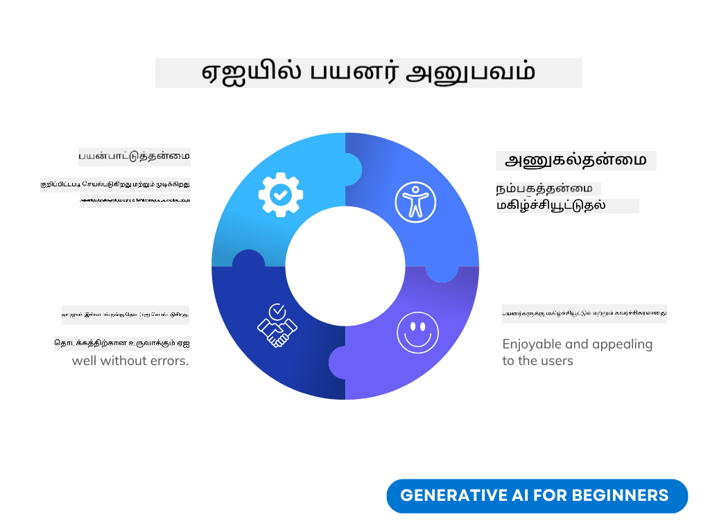
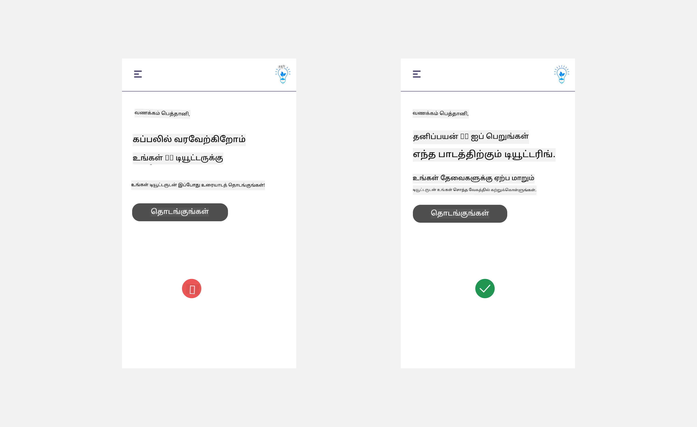
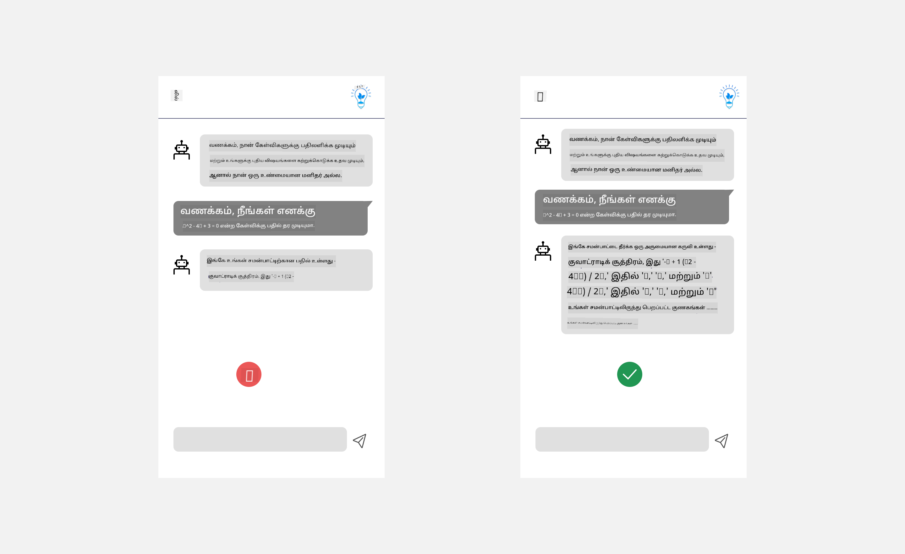
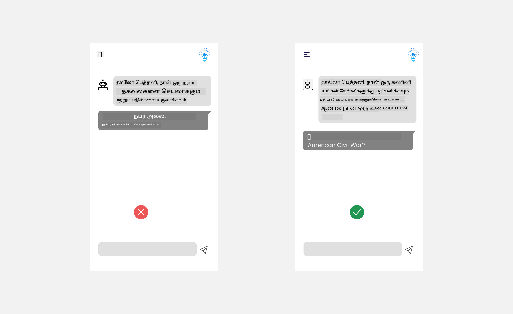
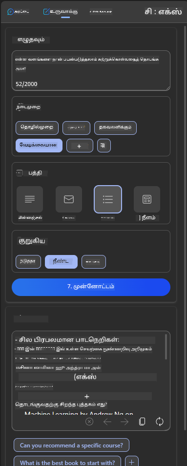
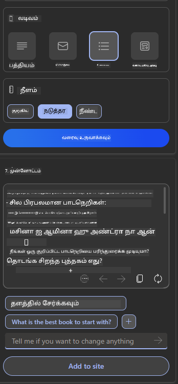

<!--
CO_OP_TRANSLATOR_METADATA:
{
  "original_hash": "78bbeed50fd4dc9fdee931f5daf98cb3",
  "translation_date": "2025-10-18T02:35:49+00:00",
  "source_file": "12-designing-ux-for-ai-applications/README.md",
  "language_code": "ta"
}
-->
# AI பயன்பாடுகளுக்கான UX வடிவமைப்பு

> _(மேலே உள்ள படத்தை கிளிக் செய்து இந்த பாடத்தின் வீடியோவைப் பாருங்கள்)_

பயனர் அனுபவம் என்பது பயன்பாடுகளை உருவாக்குவதில் மிகவும் முக்கியமான அம்சமாகும். பயனர்கள் உங்கள் பயன்பாட்டைப் பயன்படுத்தி பணிகளை திறமையாகச் செய்ய வேண்டும். திறமையாக இருப்பது ஒரு விஷயமாக இருந்தாலும், அனைவரும் பயன்படுத்தக்கூடிய வகையில் பயன்பாடுகளை வடிவமைக்க வேண்டும், அதாவது _அணுகல்தன்மை_ கொண்டதாக இருக்க வேண்டும். இந்த அத்தியாயம் இந்த பகுதியை மையமாகக் கொண்டு செயல்படும், இதன் மூலம் மக்கள் பயன்படுத்த விரும்பும் ஒரு பயன்பாட்டை நீங்கள் வடிவமைக்க முடியும்.

## அறிமுகம்

பயனர் அனுபவம் என்பது ஒரு பயனர் ஒரு குறிப்பிட்ட தயாரிப்பு அல்லது சேவையை (சிஸ்டம், கருவி அல்லது வடிவமைப்பு) எப்படி தொடர்பு கொண்டு பயன்படுத்துகிறார்கள் என்பதைக் குறிக்கிறது. AI பயன்பாடுகளை உருவாக்கும்போது, ​​உருவாக்குநர்கள் பயனர் அனுபவத்தை பயனுள்ளதாகவும், நெறிமுறையுடன் இருக்கவும் உறுதிப்படுத்துவதில் மட்டுமல்லாமல், நெறிமுறைகளுக்கு ஏற்ப செயல்படுவதிலும் கவனம் செலுத்துகிறார்கள். இந்த பாடத்தில், பயனர் தேவைகளை பூர்த்தி செய்யும் செயற்கை நுண்ணறிவு (AI) பயன்பாடுகளை உருவாக்குவது எப்படி என்பதை நாம் கற்றுக்கொள்வோம்.

இந்த பாடத்தில் கீழ்க்கண்ட பகுதிகள் உள்ளடக்கமாக இருக்கும்:

- பயனர் அனுபவம் மற்றும் பயனர் தேவைகளைப் புரிந்துகொள்வதற்கான அறிமுகம்
- நம்பகத்தன்மை மற்றும் வெளிப்படைத்தன்மைக்காக AI பயன்பாடுகளை வடிவமைத்தல்
- ஒத்துழைப்பு மற்றும் கருத்துக்களுக்காக AI பயன்பாடுகளை வடிவமைத்தல்

## கற்றல் இலக்குகள்

இந்த பாடத்தை எடுத்துக்கொண்ட பிறகு, நீங்கள்:

- பயனர் தேவைகளை பூர்த்தி செய்யும் AI பயன்பாடுகளை உருவாக்குவது எப்படி என்பதைப் புரிந்துகொள்வீர்கள்.
- நம்பகத்தன்மை மற்றும் ஒத்துழைப்பை ஊக்குவிக்கும் AI பயன்பாடுகளை வடிவமைக்க முடியும்.

### முன் தேவைகள்

[பயனர் அனுபவம் மற்றும் வடிவமைப்பு சிந்தனை](https://learn.microsoft.com/training/modules/ux-design?WT.mc_id=academic-105485-koreyst) பற்றி மேலும் படிக்க சில நேரம் ஒதுக்கவும்.

## பயனர் அனுபவம் மற்றும் பயனர் தேவைகளைப் புரிந்துகொள்வதற்கான அறிமுகம்

எங்கள் கற்பனை கல்வி ஸ்டார்ட்அப் நிறுவனத்தில், இரண்டு முக்கிய பயனர்கள் உள்ளனர், ஆசிரியர்கள் மற்றும் மாணவர்கள். இந்த இரண்டு பயனர்களின் தனித்துவமான தேவைகள் உள்ளன. பயனர் மையமாக உள்ள வடிவமைப்பு, தயாரிப்புகள் அதன் நோக்கத்திற்காக பொருத்தமானவை மற்றும் பயனுள்ளவை என்பதை உறுதிப்படுத்துகிறது.

பயன்பாடு **பயனுள்ள, நம்பகமான, அணுகக்கூடிய மற்றும் மகிழ்ச்சியான**தாக இருக்க வேண்டும், இது ஒரு நல்ல பயனர் அனுபவத்தை வழங்குகிறது.

### பயன்பாட்டுத் திறன்

பயனுள்ளதாக இருப்பது என்பது பயன்பாட்டின் செயல்பாடு அதன் நோக்கத்திற்கேற்ப பொருந்தும் என்பதைப் பொருள். உதாரணமாக, மதிப்பீட்டு செயல்முறையை தானியங்கமாக்குதல் அல்லது மறுபார்வைக்கான ஃபிளாஷ் கார்டுகளை உருவாக்குதல் போன்றவை. மதிப்பீட்டு செயல்முறையை தானியங்கமாக்கும் பயன்பாடு, மாணவர்களின் பணிக்கு முன்கூட்டியே வரையறுக்கப்பட்ட அளவுகோல்களின் அடிப்படையில் துல்லியமாகவும் திறமையாகவும் மதிப்பெண்களை வழங்க வேண்டும். அதேபோல், மறுபார்வை ஃபிளாஷ் கார்டுகளை உருவாக்கும் பயன்பாடு அதன் தரவின் அடிப்படையில் பொருத்தமான மற்றும் பல்வேறு கேள்விகளை உருவாக்க வேண்டும்.

### நம்பகத்தன்மை

நம்பகமானதாக இருப்பது என்பது பயன்பாடு அதன் பணியை தொடர்ந்து மற்றும் பிழையின்றி செயல்படுத்த வேண்டும் என்பதைக் குறிக்கிறது. ஆனால், மனிதர்களைப் போலவே AIவும் முழுமையானது அல்ல, மேலும் பிழைகள் ஏற்படும் வாய்ப்பு உள்ளது. பயன்பாடுகள் பிழைகள் அல்லது எதிர்பாராத சூழல்களை சந்திக்கலாம், இது மனித தலையீடு அல்லது திருத்தத்தை தேவைப்படும். பிழைகளை நீங்கள் எப்படி கையாளுகிறீர்கள்? இந்த பாடத்தின் கடைசி பகுதியில், ஒத்துழைப்பு மற்றும் கருத்துக்களுக்காக AI அமைப்புகள் மற்றும் பயன்பாடுகள் எப்படி வடிவமைக்கப்படுகின்றன என்பதை நாம் கற்றுக்கொள்வோம்.

### அணுகல்தன்மை

அணுகல்தன்மை என்பது பல்வேறு திறன்களைக் கொண்ட பயனர்களுக்கு, உட்பட மாற்றுத்திறனாளிகளுக்கு, பயனர் அனுபவத்தை விரிவாக்குவதை குறிக்கிறது, இதனால் யாரும் புறக்கணிக்கப்பட மாட்டார்கள். அணுகல்தன்மை வழிகாட்டுதல்கள் மற்றும் கொள்கைகளை பின்பற்றுவதன் மூலம், AI தீர்வுகள் மேலும் உள்ளடக்கமானவை, பயன்படுத்தக்கூடியவை மற்றும் அனைத்து பயனர்களுக்கும் பயனுள்ளவை ஆகின்றன.

### மகிழ்ச்சியானது

மகிழ்ச்சியானது என்பது பயன்பாட்டை பயன்படுத்துவதில் மகிழ்ச்சியாக இருக்க வேண்டும் என்பதைக் குறிக்கிறது. கவர்ச்சிகரமான பயனர் அனுபவம் பயனரின் மீது நேர்மறையான தாக்கத்தை ஏற்படுத்தி, அவர்களை பயன்பாட்டிற்கு திரும்ப வர ஊக்குவிக்கிறது மற்றும் வணிக வருமானத்தை அதிகரிக்கிறது.

ஒவ்வொரு சவாலையும் AI மூலம் தீர்க்க முடியாது. AI உங்கள் பயனர் அனுபவத்தை மேம்படுத்துவதற்காக வருகிறது, இது கையேடு பணிகளை தானியங்கமாக்குதல் அல்லது பயனர் அனுபவங்களை தனிப்பயனாக்குதல் போன்றவை.

## நம்பகத்தன்மை மற்றும் வெளிப்படைத்தன்மைக்காக AI பயன்பாடுகளை வடிவமைத்தல்

AI பயன்பாடுகளை வடிவமைக்கும் போது நம்பகத்தன்மை மிக முக்கியமானது. நம்பகத்தன்மை என்பது ஒரு பயனர் பயன்பாடு வேலை செய்யும், தொடர்ந்து முடிவுகளை வழங்கும் மற்றும் பயனருக்கு தேவையான முடிவுகளை வழங்கும் என்பதில் நம்பிக்கை கொண்டிருப்பதை உறுதிப்படுத்துகிறது. இந்த பகுதியில் உள்ள ஒரு அபாயம் நம்பிக்கை இழப்பு மற்றும் அதிக நம்பிக்கை. நம்பிக்கை இழப்பு என்பது ஒரு பயனர் AI அமைப்பில் குறைந்த அல்லது எந்த நம்பிக்கையும் இல்லாமல் இருப்பது, இது உங்கள் பயன்பாட்டை பயனர் நிராகரிக்க வழிவகுக்கும். அதிக நம்பிக்கை என்பது ஒரு பயனர் AI அமைப்பின் திறனை அதிகமாக மதிப்பீடு செய்வது, இது பயனர்கள் AI அமைப்பை மிகவும் நம்புவதற்கு வழிவகுக்கும். உதாரணமாக, தானியங்க மதிப்பீட்டு அமைப்பு அதிக நம்பிக்கையின் காரணமாக ஆசிரியர் சில தாள்களை சரிபார்க்காமல் விட்டுவிடலாம், இது மதிப்பீட்டு அமைப்பு நன்றாக வேலை செய்கிறது என்பதை உறுதிப்படுத்தும். இது மாணவர்களுக்கு அநியாயமான அல்லது தவறான மதிப்பெண்களை அல்லது கருத்து மற்றும் மேம்பாட்டிற்கான வாய்ப்புகளை தவறவிடலாம்.

நம்பகத்தன்மையை வடிவமைப்பின் மையமாக வைக்க இரண்டு வழிகள் விளக்கத்தன்மை மற்றும் கட்டுப்பாடு ஆகும்.

### விளக்கத்தன்மை

AI முடிவுகளைத் தகவமைக்க உதவும்போது, ​​எதிர்கால தலைமுறைகளுக்கு அறிவு வழங்குவது போன்ற முடிவுகளைத் தகவமைக்கும்போது, ​​AI முடிவுகள் எவ்வாறு எடுக்கப்படுகின்றன என்பதை ஆசிரியர்கள் மற்றும் பெற்றோர்கள் புரிந்துகொள்வது முக்கியமானது. இது விளக்கத்தன்மை - AI பயன்பாடுகள் முடிவுகளை எவ்வாறு எடுக்கின்றன என்பதைப் புரிந்துகொள்வது. விளக்கத்தன்மைக்காக வடிவமைப்பது என்பது AI வெளியீட்டிற்கு எவ்வாறு வந்தது என்பதை விளக்கும் விவரங்களைச் சேர்ப்பதை உள்ளடக்கியது. வெளியீடு AI மூலம் உருவாக்கப்பட்டது, மனிதனால் அல்ல என்பதை பார்வையாளர்கள் அறிந்திருக்க வேண்டும். உதாரணமாக, "உங்கள் டியூட்டருடன் இப்போது உரையாடத் தொடங்குங்கள்" என்று கூறுவதற்கு பதிலாக, "உங்கள் தேவைகளுக்கு ஏற்ப மாறும் மற்றும் உங்கள் வேகத்தில் கற்றுக்கொள்ள உதவும் AI டியூட்டரைப் பயன்படுத்துங்கள்" என்று கூறுங்கள்.

AI பயனர் மற்றும் தனிப்பட்ட தரவுகளை எவ்வாறு பயன்படுத்துகிறது என்பதற்கான மற்றொரு உதாரணம். உதாரணமாக, மாணவர் என்ற தனிப்பட்ட அடையாளம் கொண்ட பயனருக்கு அவர்களின் அடையாளத்தின் அடிப்படையில் வரம்புகள் இருக்கலாம். AI கேள்விகளுக்கு பதிலளிக்க முடியாது, ஆனால் அவர்கள் ஒரு பிரச்சினையை எவ்வாறு தீர்க்க முடியும் என்பதை யோசிக்க வழிகாட்ட உதவலாம்.

விளக்கத்தன்மையின் இறுதி முக்கிய பகுதிகளில் ஒன்று விளக்கங்களை எளிமையாக்குவது. மாணவர்கள் மற்றும் ஆசிரியர்கள் AI நிபுணர்கள் அல்ல, எனவே பயன்பாடு என்ன செய்ய முடியும் அல்லது முடியாது என்பதற்கான விளக்கங்கள் எளிமையாகவும் புரிந்துகொள்ள எளிதாகவும் இருக்க வேண்டும்.

### கட்டுப்பாடு

ஜெனரேட்டிவ் AI பயனர் மற்றும் AI இடையே ஒத்துழைப்பை உருவாக்குகிறது, உதாரணமாக ஒரு பயனர் வெவ்வேறு முடிவுகளுக்காக உந்துதல்களை மாற்ற முடியும். மேலும், ஒரு வெளியீடு உருவாக்கப்பட்ட பிறகு, பயனர்கள் முடிவுகளை மாற்றி, அவர்களுக்கு ஒரு கட்டுப்பாட்டு உணர்வை வழங்க வேண்டும். உதாரணமாக, Bing ஐப் பயன்படுத்தும்போது, ​​நீங்கள் உங்கள் உந்துதல்களை வடிவமைப்பு, தொனி மற்றும் நீளம் அடிப்படையில் அமைக்கலாம். மேலும், உங்கள் வெளியீட்டில் மாற்றங்களைச் சேர்த்து வெளியீட்டை மாற்றலாம், கீழே காட்டப்பட்டுள்ளது:

பயனர் பயன்பாட்டின் மீது கட்டுப்பாட்டை வைத்திருக்க Bing இல் உள்ள மற்றொரு அம்சம், AI பயன்படுத்தும் தரவிலிருந்து பயனர் சேர்க்கவும், நீக்கவும் முடியும். ஒரு பள்ளி பயன்பாட்டிற்காக, ஒரு மாணவர் தனது குறிப்புகளையும் ஆசிரியர்களின் வளங்களையும் மறுபார்வை பொருளாகப் பயன்படுத்த விரும்பலாம்.

> AI பயன்பாடுகளை வடிவமைக்கும் போது, ​​அதன் திறன்களின் யதார்த்தமான எதிர்பார்ப்புகளை அமைத்தல் மற்றும் பயனர்கள் அதிக நம்பிக்கையை வைக்காமல் இருப்பதை உறுதிப்படுத்துவதில் நோக்கம் முக்கியமானது. இதைச் செய்ய ஒரு வழி, உந்துதல்களுக்கும் முடிவுகளுக்கும் இடையே ஒரு தடுமாற்றத்தை உருவாக்குவது. இது AI மற்றும் மனிதனின் வேறுபாட்டை பயனருக்கு நினைவூட்டுகிறது.

## ஒத்துழைப்பு மற்றும் கருத்துக்களுக்காக AI பயன்பாடுகளை வடிவமைத்தல்

முந்தையதாக குறிப்பிடப்பட்டதுபோல், ஜெனரேட்டிவ் AI பயனர் மற்றும் AI இடையே ஒத்துழைப்பை உருவாக்குகிறது. பெரும்பாலான தொடர்புகள் ஒரு பயனர் உந்துதலை உள்ளிடுவதும் AI ஒரு வெளியீட்டை உருவாக்குவதும் ஆகும். வெளியீடு தவறாக இருந்தால் என்ன? பிழைகள் ஏற்பட்டால் பயன்பாடு அதை எப்படி கையாளும்? AI பயனரை குற்றம் சாட்டுமா அல்லது பிழையை விளக்க நேரம் எடுத்துக்கொள்வதா?

AI பயன்பாடுகள் கருத்துக்களைப் பெறவும் வழங்கவும் உருவாக்கப்பட வேண்டும். இது AI அமைப்பு மேம்பட உதவுவதோடு, பயனர்களுடன் நம்பகத்தன்மையை உருவாக்கவும் உதவுகிறது. ஒரு கருத்து மடக்கு வடிவமைப்பில் சேர்க்கப்பட வேண்டும், ஒரு எளிய விருப்பம் வெளியீட்டில் ஒரு விரல் மேலே அல்லது கீழே காட்டும் உதாரணமாக இருக்கலாம்.

இதற்கான மற்றொரு வழி, அமைப்பின் திறன்கள் மற்றும் வரம்புகளை தெளிவாகச் தொடர்பு கொள்வது. ஒரு பயனர் AI திறன்களுக்கு அப்பாற்பட்ட ஏதாவது கேட்கும்போது, ​​இதற்கான ஒரு வழி இருக்க வேண்டும், கீழே காட்டப்பட்டுள்ளது.

அமைப்பு பிழைகள் பயன்பாடுகளுடன் பொதுவாக உள்ளன, பயனர் AI இன் வரம்புக்கு வெளியே உள்ள தகவலுக்கு உதவி தேவைப்படும் அல்லது ஒரு பயனர் கேள்விகள்/பாடங்களை சுருக்கம் செய்ய பயன்பாடு எவ்வளவு கேள்விகளை/பாடங்களை உருவாக்க முடியும் என்பதில் ஒரு வரம்பு இருக்கலாம். உதாரணமாக, வரலாறு மற்றும் கணிதம் போன்ற வரையறுக்கப்பட்ட பாடங்களில் தரவுடன் பயிற்சி அளிக்கப்பட்ட AI பயன்பாடு புவியியல் தொடர்பான கேள்விகளை கையாள முடியாது. இதைத் தடுக்க, AI அமைப்பு "மன்னிக்கவும், எங்கள் தயாரிப்பு பின்வரும் பாடங்களில் தரவுடன் பயிற்சி அளிக்கப்பட்டுள்ளது....., நீங்கள் கேட்ட கேள்விக்கு பதிலளிக்க முடியாது" போன்ற பதிலை வழங்கலாம்.

AI பயன்பாடுகள் முழுமையானவை அல்ல, எனவே அவை தவறுகளைச் செய்யும் வாய்ப்பு உள்ளது. உங்கள் பயன்பாடுகளை வடிவமைக்கும் போது, ​​பயனர்களிடமிருந்து கருத்துக்களைப் பெறவும், பிழைகளை எளிமையாகவும் எளிதாகவும் விளக்கக்கூடிய முறையில் கையாளவும் நீங்கள் இடத்தை உருவாக்க வேண்டும்.

## பணிக்கான பணிகள்

நீங்கள் இதுவரை உருவாக்கிய எந்த AI பயன்பாடுகளையும் எடுத்துக்கொண்டு, உங்கள் பயன்பாட்டில் கீழே உள்ள படிகளை செயல்படுத்தவும்:

- **மகிழ்ச்சியானது:** உங்கள் பயன்பாட்டை மேலும் மகிழ்ச்சியாக மாற்ற நீங்கள் என்ன செய்ய முடியும் என்பதைப் பரிசீலிக்கவும். நீங்கள் எல்லா இடங்களிலும் விளக்கங்களைச் சேர்க்கிறீர்களா? பயனரை ஆராய்வதற்கு ஊக்குவிக்கிறீர்களா? உங்கள் பிழை செய்திகளை நீங்கள் எப்படி வார்த்தைகளால் கூறுகிறீர்கள்?

- **பயன்பாட்டுத் திறன்:** ஒரு வலை பயன்பாட்டை உருவாக்குதல். உங்கள் பயன்பாடு மவுஸ் மற்றும் கீபோர்டு இரண்டையும் பயன்படுத்தி வழிநடத்தக்கூடியதாக இருக்க வேண்டும் என்பதை உறுதிப்படுத்தவும்.

- **நம்பகத்தன்மை மற்றும் வெளிப்படைத்தன்மை:** AI மற்றும் அதன் வெளியீட்டை முழுமையாக நம்ப வேண்டாம், வெளியீட்டை சரிபார்க்க ஒரு மனிதனைச் சேர்ப்பது எப்படி என்பதைப் பரிசீலிக்கவும். மேலும், நம்பகத்தன்மை மற்றும் வெளிப்படைத்தன்மையை அடைய மற்ற வழிகளைப் பரிசீலித்து செயல்படுத்தவும்.

- **கட்டுப்பாடு:** பயன்பாட்டிற்கு தரவுகளை வழங்கும் பயனருக்கு கட்டுப்பாட்டை வழங்குங்கள். AI பயன்பாட்டில் தரவுகளை சேகரிக்க பயனர் சேர்க்கவும், நீக்கவும் செய்யும் வழியை செயல்படுத்தவும்.

<!-- ## [பாடத்திற்குப் பின் வினாடி வினா](../../../12-designing-ux-for-ai-applications/quiz-url) -->

## உங்கள் கற்றலைத் தொடருங்கள்!

இந்த பாடத்தை முடித்த பிறகு, எங்கள் [ஜெனரேட்டிவ் AI கற்றல் தொகுப்பை](https://aka.ms/genai-collection?WT.mc_id=academic-105485-koreyst) பாருங்கள், உங்கள் ஜெனரேட்டிவ் AI அறிவை மேம்படுத்த தொடர்ந்து கற்றுக்கொள்ளுங்கள்!

பாடம் 13-க்கு செல்லுங்கள், அங்கு [AI பயன்பாடுகளை பாதுகாப்பாக வைத்தல்](../13-securing-ai-applications/README.md?WT.mc_id=academic-105485-koreyst) பற்றி பார்க்கப்போகிறோம்!

---

**குறிப்பு**:  
இந்த ஆவணம் AI மொழிபெயர்ப்பு சேவை [Co-op Translator](https://github.com/Azure/co-op-translator) பயன்படுத்தி மொழிபெயர்க்கப்பட்டுள்ளது. நாங்கள் துல்லியத்திற்காக முயற்சிக்கிறோம், ஆனால் தானியங்கி மொழிபெயர்ப்புகளில் பிழைகள் அல்லது தவறுகள் இருக்கக்கூடும் என்பதை கவனத்தில் கொள்ளவும். அதன் தாய்மொழியில் உள்ள அசல் ஆவணம் அதிகாரப்பூர்வ மூலமாக கருதப்பட வேண்டும். முக்கியமான தகவல்களுக்கு, தொழில்முறை மனித மொழிபெயர்ப்பு பரிந்துரைக்கப்படுகிறது. இந்த மொழிபெயர்ப்பைப் பயன்படுத்துவதால் ஏற்படும் எந்த தவறான புரிதல்கள் அல்லது தவறான விளக்கங்களுக்கு நாங்கள் பொறுப்பல்ல.