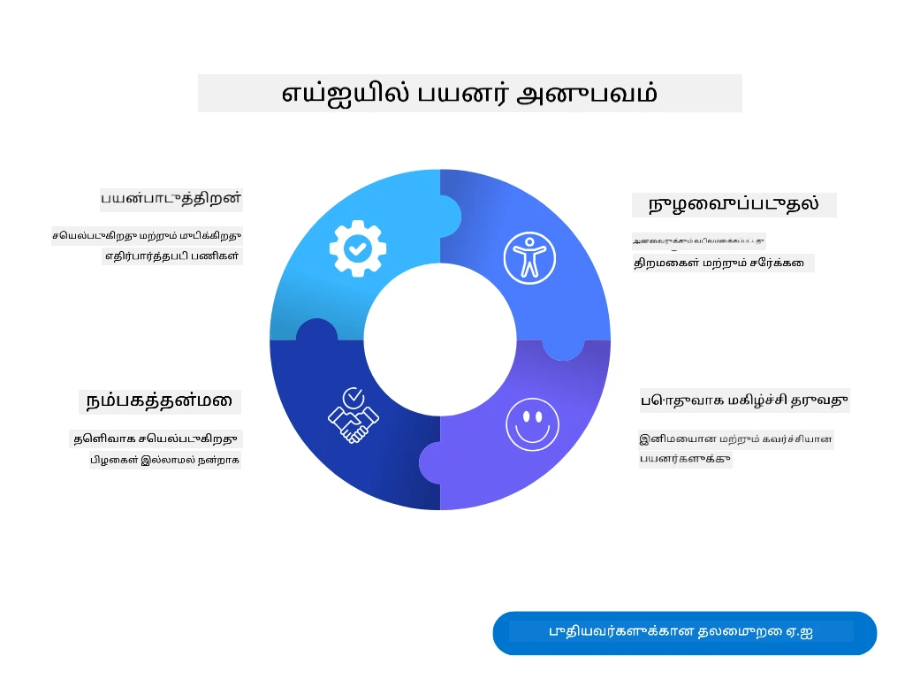
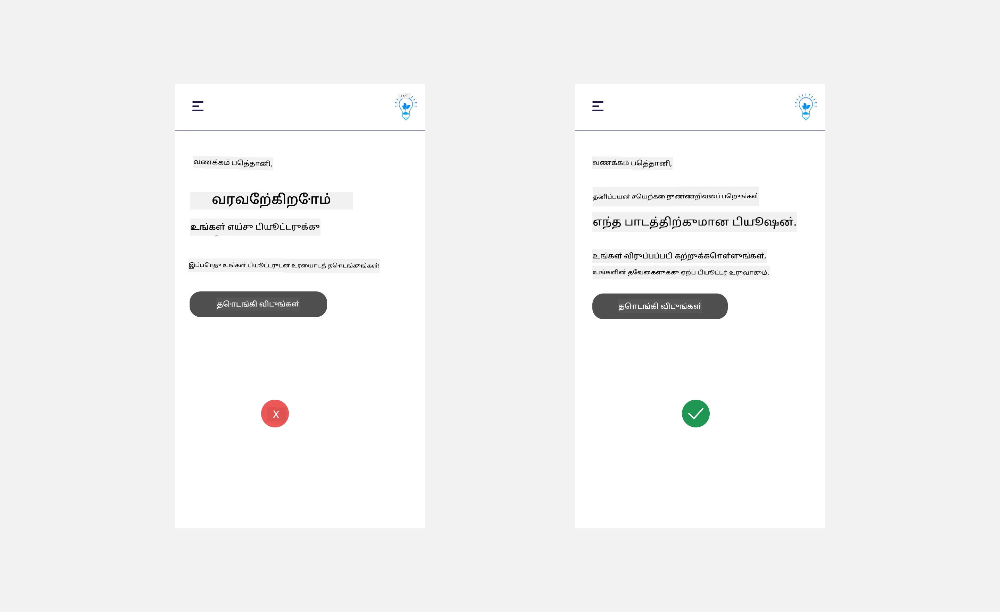
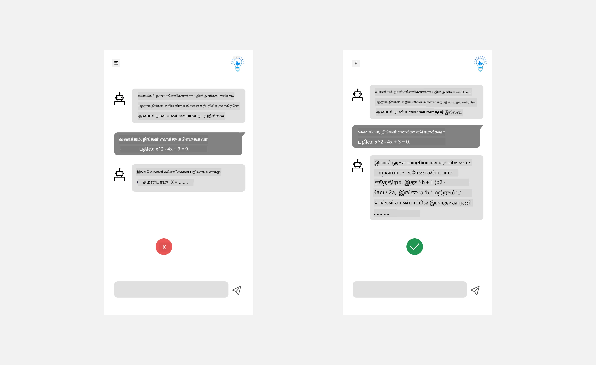
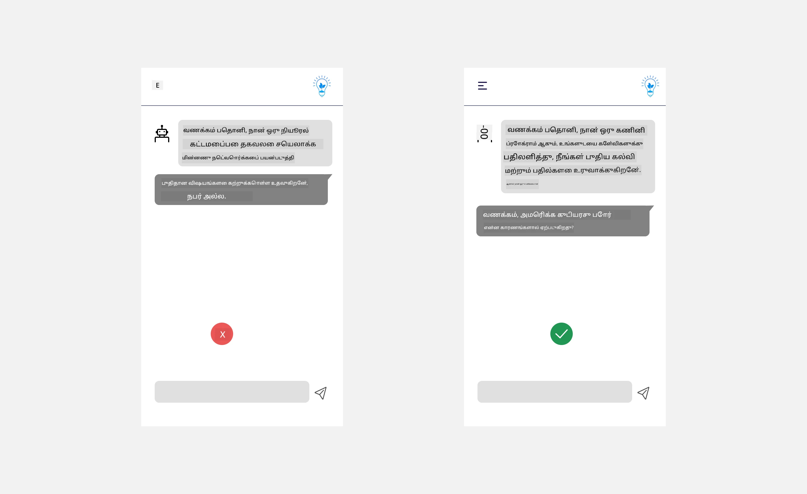
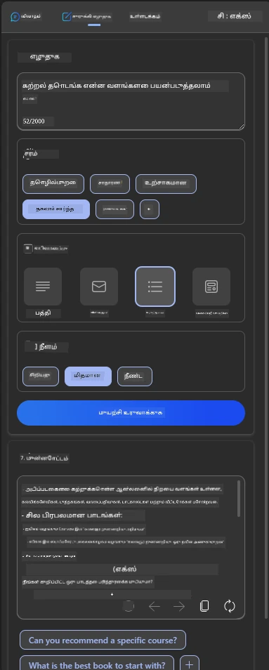
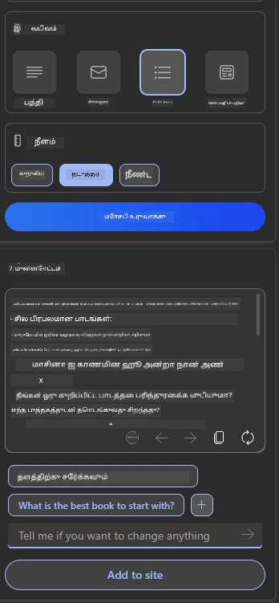
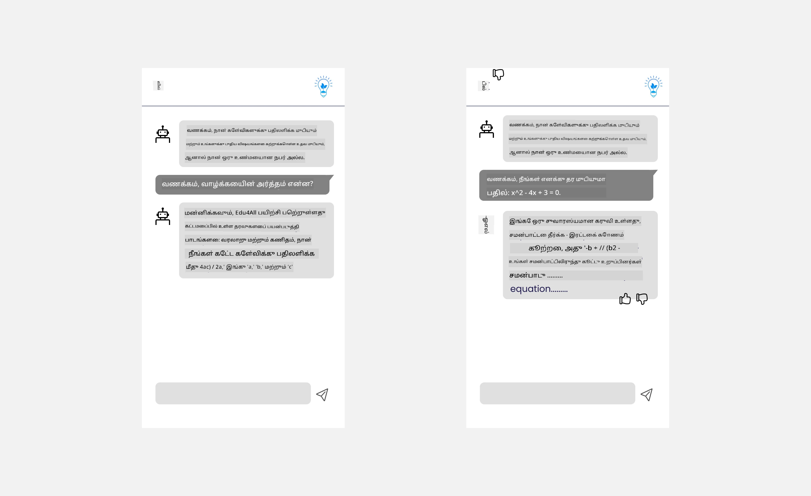

# AI பயன்பாடுகளுக்கான UX வடிவமைப்பு

> _(இந்த பாடத்தின் வீடியோக்களை பார்வையிட மேலே உள்ள படத்தை கிளிக் செய்யுங்கள்)_

பயன்பாட்டு அனுபவம் (User experience) என்பது செயலிகளை உருவாக்கும் போது மிகவும் முக்கியமான அம்சமாகும். பயனர்கள் உங்கள் செயலியை திறம்படப் பயன்படுத்தி பணி செய்வதற்கு வழிவகுக்க வேண்டும். திறம்பட செயல்படுவது ஒரு விஷயம், ஆனால் அனைவரும் பயன்படுத்தக்கூடிய, _அணுகக்கூடிய_ செயலிகளை வடிவமைப்பதும் அவசியம். இந்த அத்தியாயம் அந்தப் பகுதியை கவனிக்கும், ஆகவே நீங்கள் வடிவமைக்கும் செயலி அனைவரும் விரும்பி பயன்படுத்தக்கூடியதாக இருக்கும் என்று நம்புகிறோம்.

## அறிமுகம்

பயனாளர் அனுபவம் என்பது ஒரு பயனாளர் ஒரு குறிப்பிட்ட தயாரிப்பு அல்லது சேவையை, அது ஒரு அமைப்பு, கருவி அல்லது வடிவமைப்பு எப்படிச் சார்ந்ததும் பயன்படுத்துவதும் ஆகும். AI பயன்பாடுகளை உருவாக்கும்போது, உருவாக்குநர்கள் பயனாளர் அனுபவம் சிறந்ததாகவும் நற்பண்பாடுடன் கூடியதாகவும் இருக்குமாறு கவனம் செலுத்துகிறார்கள். இந்த பாடத்தில், பயனாளர்கள் தேவைகள் குறித்து கவனித்து செயற்கை நுண்ணறிவு (AI) பயன்பாடுகளை உருவாக்குவது பற்றி கற்றுக் கொள்வோம்.

பாடத்தில் பின்வரும் பகுதிகள் எடுத்துக் கொள்ளப்பட உள்ளன:

- பயனாளர் அனுபவம் மற்றும் பயனாளர் தேவைகளை புரிந்துகொள்ளல் அறிமுகம்
- நம்பிக்கை மற்றும் வெளிப்படைத்தன்மைக்கு AI பயன்பாடுகளை வடிவமைத்தல்
- ஒத்துழைப்பு மற்றும் கருத்துக்களுக்கு AI பயன்பாடுகளை வடிவமைத்தல்

## கற்றல் இலக்குகள்

இந்த பாடத்தை முடித்த பிறகு, நீங்கள் இதை செய்ய முடியும்:

- பயனாளர் தேவைகளை பூர்த்தி செய்யும் AI பயன்பாடுகளை உருவாக்குவது எப்படி என்பதை புரிந்துகொள்.
- நம்பிக்கை மற்றும் ஒத்துழைப்பை ஊக்குவிக்கும் AI பயன்பாடுகளை வடிவமை.

### முன் தேவைகள்

சிறிது நேரம் எடுத்துக் கொண்டு [பயனாளர் அனுபவம் மற்றும் வடிவமைப்பு சிந்தனைகள்](https://learn.microsoft.com/training/modules/ux-design?WT.mc_id=academic-105485-koreyst) பற்றி மேலும் வாசிக்கவும்.

## பயனாளர் அனுபவம் அறிமுகம் மற்றும் பயனாளர் தேவைகளை புரிதல்

நமது கற்பித்தல் தொடக்க நிறுவனத்தில் இரண்டு பிரதான பயனர்கள் உள்ளனர், ஆசிரியர்கள் மற்றும் மாணவர்கள். இரு பயனர்களுக்கும் தனித்துவமான தேவைகள் உள்ளன. பயனர் மையமான வடிவமைப்பு பயனர்களுக்கு பொருத்தமான மற்றும் பயனுள்ள தயாரிப்புகளை முன்மொழிகிறது.

செயலி **பயனுள்ள, நம்பகமான, அணுகக்கூடிய மற்றும் இனிமையான** வகையில் இருக்க வேண்டும், இது நல்ல பயனர் அனுபவத்தை வழங்க உதவும்.

### பயன்பாடுத்தன்மை (Usability)

பயன்படுதலும் என்பது செயலி அதன் நோக்கத்திற்கு ஏற்ற செயல்பாடுகள் கொண்டதாவது, எடுத்துக்காட்டாக மதிப்பீட்டு செயல்முறையை தானாகச் செய்யவோ அல்லது மறுஆய்விற்கான ஃபிளாஷ்கார்டுகளை உருவாக்கவோ செய்யும் என்பதைக் குறிக்கிறது. மதிப்பீட்டு செயல்முறையை தானாகச் செய்யும் செயலி, முன்கூட்டியே அமைக்கப்பட்ட அளவுகோல்களின் அடிப்படையில் மாணவர்களின் பணி மதிப்பெண்களை துல்லியமாகவும் திறம்படவும்கூட வழங்க வேண்டும். அதேபோல், மறுஆய்விற்கான ஃபிளாஷ்கார்டுகளைக் உருவாக்கும் செயலி அதன் தரவின் அடிப்படையில் தொடர்புடைய மற்றும் பலவிதமான கேள்விகளை உருவாக்கவல்லது.

### நம்பகத்தன்மை (Reliability)

நம்பகமானது செயலி உங்கள் பணியை அடிக்கடி தவறின்றி செய்ய வல்லது என்பது. இருப்பினும், மனிதர்களைப் போல AIமும் முழுமையானதும் அல்ல, பிழைகளுக்கு உட்பட்டதும் ஆகும். செயலிகள் பிழைகள் அல்லது எதிர்பாராத நிலைகளை சந்தித்தால் மனித ஒழுங்கு அல்லது திருத்தங்கள் தேவைப்படலாம். நீங்கள் பிழைகளை எப்படி கையாள்கிறீர்கள்? இந்த பாடத்தின் கடைசி பகுதியில் AI அமைப்புகள் மற்றும் பயன்பாடுகள் எப்படி ஒத்துழைப்பு மற்றும் கருத்துப் பெறுவதற்காக வடிவமைக்கப்படுகின்றன என்பதை பார்ப்போம்.

### அணுகக்கூடிய தன்மை (Accessibility)

அணுகக்கூடியது என்பது பல்வேறு திறன்கள் கொண்ட பயனர்களுக்கும், உடல்நிலை பின்னடைவைச் சந்திக்கும் பயனர்களையும் சேர்த்து பயனர் அனுபவத்தை விரிவாக்குவதாகும், யாரும் புறக்கணிக்கப்படாதபடி இருக்க வேண்டும். அணுகக்கூடிய தன்மை வழிகாட்டுதல்களையும் 원칙களையும் பின்பற்று AI தீர்வுகள் அனைவருக்கும் உட்புகும் வகையாக, பயன்படத்தக்கதாகவும், பயனுள்ளதாக்கும்.

### இனிமை (Pleasant)

இனிமையானது செயலியை மகிழ்ச்சியாக பயன்படுத்த அனுமதிப்பதாகும். அழகான பயனர் அனுபவம் பயனாளர்களை செயலிக்குக் திரும்பச் செய்ய உதவுகிறது மேலும் வியாபார வருவாயை அதிகரிக்கும்.

எல்லா சவால்களையும் AIயால் தீர்க்க முடியாது. AI உங்களுடைய பயனர் அனுபவத்தை ஊக்குவிப்பதற்காக வந்துள்ளது, அது கைமுறை பணிகளை தானாகச் செய்யவோ அல்லது தனிப்பயன் அனுபவங்களை உருவாக்கவோ கூட.

## நம்பிக்கை மற்றும் வெளிப்படைத்தன்மைக்கான AI பயன்பாடுகளை வடிவமைத்தல்

நம்பிக்கையை கட்டமைப்பது AI பயன்பாடுகளை வடிவமைக்கும்போது மிக முக்கியம். நம்பிக்கை பயனாளர் செயலியை நம்பி பணியை சரியாகவும் தொடர்ச்சியாகவும் செய்து முடிக்கும் என்பதை உறுதிப்படுத்துகிறது. இவ்வளவில் ஆபத்து அம்பலம் என்பது நம்பிக்கையின்றி அல்லது அதிக நம்பிக்கை என்பது. நம்பிக்கையின்மை என்பது பயனாளர் AI அமைப்பில் குறைந்த அல்லது எந்த நம்பிக்கையும் இல்லாத நிலை; இது செயலியை நிராகரிக்க வழிவகுக்கும். அதிக நம்பிக்கை என்பது பயனாளர் AI திறன்களை மிகைவிட அதிக மதிப்பீடு செய்தல், இதனால் AI அமைப்பை மிக அதிகம் நம்பி அதன்படி செயல்படுதல் ஆகும். எடுத்துக்காட்டாக, தானாக மதிப்பீட்டு அமைப்பு இருக்கும் போது, அதிக நம்பிக்கை காரணமாக ஆசிரியர்கள் சில ஆவணங்களை சரிபார்க்காமை ஏற்படும்; இது மாணவர்களுக்கு தவறான அல்லது நியாயமற்ற மதிப்பெண்களை வழங்கும், கருத்துகளும் மேம்பாடுகளும் தவறிச் செல்லும் வாய்ப்பு உள்ளது.

நம்பிக்கையை வடிவமைப்பின் மையமாக வைக்க உருவாக்கப்பட்ட இரண்டு வழிகள் விளக்கம் மற்றும் கட்டுப்பாடு.

### விளக்கம் (Explainability)

AI எதிர்கால தலைமுறைக்கு அறிவை பகிர்வதுபோல் முடிவுகளை செய்ய உதவும்போது, ஆசிரியர்களும் பெற்றோர்களும் AI எப்படி முடிவெடுக்கிறது என்பதை அறிந்து கொள்ள வேண்டும். இதுதான் விளக்கம் - AI பயன்பாடுகள் முடிவுகளை எப்படிச் செய்கின்றன என்பதை புரிந்து கொள்வது. விளக்கத்திற்காக AI முறைமை எவ்வாறு முடிவுகளுக்குச் சென்றது என்பதைக் காண்பிக்கும் விரிவான விவரங்களை சேர்ப்பது. வெளியீட்டு தகவல் AIயால் உருவாக்கப்பட்டது என்பதை மக்கள் அறிந்து கொள்ள வேண்டும், மனிதனால் அல்ல. எடுத்துக்காட்டாக, "உங்கள் டியூட்டருடன் இப்போது உரையாடத் துவங்குங்கள்" என்ற பதிலில் "உங்கள் தேவைகளுக்கு ஏற்ப உதவும் AI டியூட்டர் பயன்படுத்தி உங்கள் வேகத்தில் கற்றுக்கொள்ளுங்கள்" என கூறலாம்.

இன்னொரு உதாரணம் AI பயனர் மற்றும் தனிப்பட்ட தரவைப் பயன்படுத்தும் விதம். எடுத்துக்காட்டாக, மாணவர் என்ற தனிப்பட்ட வரையறை உள்ள பயனாளருக்கு அந்த தனிப்பட்ட வரையறைக்கு இணையான வரம்புகள் இருக்கலாம். AI கேள்விகளுக்கு பதில் அளிக்க முடியாது, ஆனால் பயனாளரை சிந்திக்க வழிகாட்டலாம்.

விளக்கத்தின் இறுதியான முக்கிய பகுதியாக விளக்கக்கலை எளிமைப்படுத்தல் உள்ளது. மாணவர்களும் ஆசிரியர்களும் AI நிபுணர்களாக இருக்கக்கூடாது, ஆகையால் செயலி என்ன செய்யலாம், என்ன செய்ய முடியாது என்பதை எளிமையாகவும் புரிந்துகொள்ளக்கூடியதாகவும் விளக்க வேண்டும்.

### கட்டுப்பாடு (Control)

உருவாக்கும் AI (Generative AI) AI மற்றும் பயனாளருக்கிடையேயான ஒத்துழைப்பு உருவாக்குகிறது, உதாரணமாக பயனாளர் வேறு விளைவுகளைப் பெற உத்திகளைக் மாற்றிக் கொள்ளலாம். மேலும், ஒரு வெளியீடு உருவாக்கப்பட்ட பிறகு, பயனர்கள் முடிவுகளை மாற்றினால் அவர்களுக்கு கட்டுப்பாட்டு உணர்ச்சி கிடைக்கும். எடுத்துக்காட்டாக, Microsoft Copilot (முன்பு Bing Chat) பயன்படுத்தும்போது, உங்களுடைய உத்திகளை வடிவம், ஓசை மற்றும் நீளம் ஆகியவற்றின் அடிப்படையில் மாற்றலாம். மேலும, நீங்கள் உங்கள் வெளியீட்டில் மாற்றங்களைச் சேர்த்து கீழ்க்காணும் மாதிரி முடிவுகளை மாற்றலாம்:

Microsoft Copilot இல் மேலும் ஒரு அம்சமான செயற்பாடு, பயன்பாட்டின் தரவை AI பயன்படுத்துவதற்கான தேர்ந்தெடுப்பு மற்றும் விலக்குப்பதிவை வழங்குதல் ஆகும். பள்ளி பயன்பாட்டில், மாணவர்கள் தங்களுடைய குறிப்புகளையும் ஆசிரியர்களின் வளங்களையும் மறுஆய்வுக்கான பொருளாகப் பயன்படுத்த விரும்பலாம்.

> AI பயன்பாடுகளை வடிவமைப்பதில் நோக்கமுடைய (intentionality) அணுகுமுறை முக்கியம், ஏனெனில் பயனர்கள் அதிக நம்பிக்கையுடன் அதனை தவறான எதிர்பார்ப்புகளோடு அணுகாமல் இருக்க செய்யும். இதைச் செய்ய ஒரு வழி உத்திகளுக்கும் முடிவுகளுக்கும் இடையில் தடுமாற்றத்தை உருவாக்குவதுதான். பயனாளருக்கு இது AI என்பதையும் மனிதர் அல்ல என்பதை நினைவூட்ட வேண்டும்.

## ஒத்துழைப்பு மற்றும் கருத்துத் திரட்டலுக்கான AI பயன்பாடுகளை வடிவமைத்தல்

முன்பு கூறியபோல், உருவாக்கும் AI ஒரு பயனர் மற்றும் AI இடையேயான ஒத்துழைப்பை உருவாக்குகிறது. பெரும்பாலும் பயனர் உத்திகளை அளித்து AI வெளியீட்டை தருகிறது. வெளியீடு தவறானது என்றால்? செயலி பிழைகள் ஏற்பட்டால் எப்படிப் கையாளும்? AI பயனாளரைத் தண்டிக்குமா அல்லது பிழை காரணத்தை விளக்குமா?

AI பயன்பாடுகள் கருத்துக்களையும் கருத்துக் கொள்ளவும் வடிவமைக்கப்பட வேண்டும். இது AI அமைப்பை மேம்படுத்த உதவும் மட்டுமல்லாது பயனாளர்களுடன் நம்பிக்கையையும் உருவாக்கும். கருத்துக் காப்பு வடிவமைப்பில் சேர்க்கப்பட வேண்டும், உதாரணமாக, வெளியீட்டை தொடர்பான எளிய ஆங்கில அங்கீகாரம் (thumbs up/down) அமைப்பாக இருக்கலாம்.

மற்றொரு வழி, அமைப்பின் திறன்கள் மற்றும் வரம்புகளை தெளிவாக தெரிவிப்பது. AI திறனுக்கு அப்பால் கோரிக்கைகள் செய்யப்பட்டால், அதனை எப்படி கையாளுவது என்பதற்கான தந்திரம் இருக்க வேண்டும், கீழே காட்டியது போல.

கணினி பிழைகள் AIக்கோ அல்லது செயலியருக்கோ வெளிப்படுகின்றன, உதாரணமாக பயனர் AI தாயார் செய்யப்பட்ட தரவுக்கு அப்பால் தகவல்களைப் பெற விரும்பலாம் அல்லது AI ஓர் பயனர் உருவாக்கக்கூடிய கேள்விகள் / பாடங்கள் எண்ணத்தில் வரம்பு உள்ளது. எடுத்துக்காட்டாக, வரலாறு மற்றும் கணிதம் என்ற இரண்டு பாடங்களில் மட்டுமே பயிற்சி பெற்ற AI புவியியல் தொடர்பான கேள்விகளை கையாள முடியாது. இதனை குறைக்கும் விதமாக AI அமைப்பு பின்வருமாறு பதில் தரலாம்: "மன்னிக்கவும், நமது தயாரிப்பு பின்வரும் பாடங்களுடன் பயிற்றுவிக்கப்பட்டது....., நீங்கள் கேட்கும் கேள்விக்கு பதில் அளிக்க இயலாது."

AI பயன்பாடுகள் முற்றிலும் சிறப்பானவை அல்ல, ஆகவே பிழைகள் இருக்க வாய்ப்பு உள்ளது. உங்கள் செயலிகளை வடிவமைக்கும் போது, பயனாளர்களிடமிருந்து கருத்துக்களைப் பெறும் இடத்தை உருவாக்கி, பிழை கையாளலை எளிமையானதும் புரிந்து கொள்ளக்கூடியதும் ஆக்க வேண்டும்.

## பணி

இதுவரை நீங்கள் உருவாக்கிய எந்த AI செயலிகளையும் எடுத்துக்கொள்ளுங்கள், கீழ்க்காணும் படிகளை உங்கள் செயலியில் செயல்படுத்தவும்:

- **இனிமை:** உங்கள் செயலியை எப்படி இன்னும் இனிமையாக மாற்ற முடியும் என்று யோசிக்கவும். எல்ல жерிலும் விளக்கங்களைச் சேர்க்கிறீர்களா? பயனாளரை ஆராய்ச்சிக்கெல்லாம் ஊக்குவிக்கிறீர்களா? பிழை செய்திகளின் வடிவமைப்பை எப்படிச் சொல்கிறீர்கள்?

- **பயன்பாடுத்தன்மை:** ஒரு வலை செயலி உருவாக்கும் போது, உங்கள் செயலி எலும்பு மற்றும் விசைப்பலகை இரண்டிலும் இயங்குவதாக இருப்பதை உறுதி செய்யவும்.

- **நம்பிக்கை மற்றும் வெளிப்படைத்தன்மை:** AIயை முழுமையாக நம்ப வேண்டாம், அதன் வெளியீட்டை ஆதரிக்க மனித அடையாளத்தைச் சேர்க்க எப்படி இருப்பது என்று சிந்தியுங்கள். மேலும் நம்பிக்கை மற்றும் வெளிப்படைத்தன்மையை அடைய மற்ற வழிகளையும் செயல்படுத்தவும்.

- **கட்டுப்பாடு:** பயனாளருக்கு செயலிக்கு தரவுகளை அளிக்கும் கட்டுப்பாட்டை வழங்கவும். AI செயலியில் தரவு சேகரிப்பில் பயனாளர்கள் தேர்வு செய்வதற்கான வழியை செயல்படுத்தவும்.

<!-- ## [Post-lecture quiz](../../../12-designing-ux-for-ai-applications/quiz-url) -->

## உங்கள் கற்றலையை தொடருங்கள்!

இந்த பாடம் முடிந்தவுடன், எங்கள் [உருவாக்கும் AI கற்றல் தொகுப்பை](https://aka.ms/genai-collection?WT.mc_id=academic-105485-koreyst) பார்வையிடி உங்கள் உருவாக்கும் AI அறிவைப் அதிகரிக்கவும்!

அடுத்து பாடம் 13-க்கு செல்லவும், அங்கே நாங்கள் எவ்வாறு [AI பயன்பாடுகளை பாதுகாக்கலாம்](../13-securing-ai-applications/README.md?WT.mc_id=academic-105485-koreyst) என்பதைப் பார்ப்போம்!

---

<!-- CO-OP TRANSLATOR DISCLAIMER START -->
**மறுப்பு**:
இந்த ஆவணம் AI மொழிபெயர்ப்பு சேவை [Co-op Translator](https://github.com/Azure/co-op-translator) பயன்படுத்தி மொழிபெயர்க்கப்பட்டுள்ளது. நாங்கள் துல்லியத்திற்காக முயற்சி செய்துள்ளோம், ஆனால் தானாக செய்யப்படும் மொழிபெயர்ப்புகளில் பிழைகள் அல்லது தவறுகள் இருக்கலாம் என்பதை கவனத்தில் கொள்ளவும். அசல் ஆவணம் அதன் தாய்மொழியில் அதிகாரப்பூர்வ ஆதாரமாக கருதப்பட வேண்டும். முக்கியமான தகவல்களுக்கு, தொழில்நுட்பமான மனித மொழிபெயர்ப்பு பரிந்துரைக்கப்படுகிறது. இந்த மொழிபெயர்ப்பைப் பயன்படுத்துவதால் ஏற்படும் எந்த தவறான புரிதல்கள் அல்லது தவறான விளக்கத்திற்கும் நாங்கள் பொறுப்பில்வில்லை.
<!-- CO-OP TRANSLATOR DISCLAIMER END -->