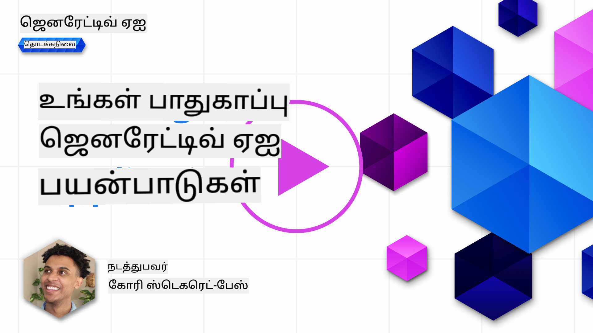
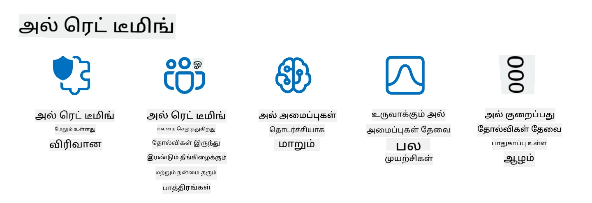

<!--
CO_OP_TRANSLATOR_METADATA:
{
  "original_hash": "a2faf8ee7a0b851efa647a19788f1e5b",
  "translation_date": "2025-10-18T02:37:25+00:00",
  "source_file": "13-securing-ai-applications/README.md",
  "language_code": "ta"
}
-->
# உங்கள் ஜெனரேட்டிவ் AI பயன்பாடுகளை பாதுகாக்குதல்

## அறிமுகம்

இந்த பாடத்தில் நீங்கள் கற்றுக்கொள்ளப்போகிறீர்கள்:

- AI அமைப்புகளில் பாதுகாப்பு பற்றிய முக்கிய அம்சங்கள்.
- AI அமைப்புகளுக்கு பொதுவான அபாயங்கள் மற்றும் சவால்கள்.
- AI அமைப்புகளை பாதுகாக்கும் முறைகள் மற்றும் கவனிக்க வேண்டிய அம்சங்கள்.

## கற்றல் இலக்குகள்

இந்த பாடத்தை முடித்த பிறகு, நீங்கள் பின்வரும் விஷயங்களை புரிந்துகொள்ளுவீர்கள்:

- AI அமைப்புகளுக்கு உள்ள அபாயங்கள் மற்றும் சவால்கள்.
- AI அமைப்புகளை பாதுகாக்க பொதுவான முறைகள் மற்றும் நடைமுறைகள்.
- பாதுகாப்பு சோதனைகளை செயல்படுத்துவதன் மூலம் எதிர்பாராத விளைவுகளைத் தவிர்க்கவும், பயனர் நம்பிக்கையை காப்பாற்றவும் எப்படி முடியும்.

## ஜெனரேட்டிவ் AI-இன் பாதுகாப்பு என்றால் என்ன?

கலைமயமான நுண்ணறிவு (AI) மற்றும் இயந்திர கற்றல் (ML) தொழில்நுட்பங்கள் நம் வாழ்க்கையை அதிகமாக மாற்றும் நிலையில், வாடிக்கையாளர் தரவுகளை மட்டுமல்லாமல் AI அமைப்புகளையும் பாதுகாக்குவது மிகவும் முக்கியம். AI/ML தொழில்நுட்பங்கள் பல்வேறு துறைகளில் முக்கியமான முடிவுகளை எடுப்பதில் அதிகமாக பயன்படுத்தப்படுகின்றன, தவறான முடிவுகள் தீவிரமான விளைவுகளை ஏற்படுத்தக்கூடிய சூழல்களில்.

இங்கே முக்கியமான அம்சங்கள்:

- **AI/ML-இன் தாக்கம்**: AI/ML நம் தினசரி வாழ்க்கையில் முக்கிய தாக்கங்களை ஏற்படுத்துகிறது, எனவே அவற்றை பாதுகாப்பது அவசியமாகிறது.
- **பாதுகாப்பு சவால்கள்**: AI/ML-இன் தாக்கம் அதிகரித்துள்ளதால், அவற்றை சிக்கலான தாக்குதல்களிலிருந்து பாதுகாக்க தேவையான கவனம் செலுத்த வேண்டும்.
- **தூண்டுதல் பிரச்சினைகள்**: தொழில்நுட்ப துறை நீண்டகால வாடிக்கையாளர் பாதுகாப்பு மற்றும் தரவின் பாதுகாப்பை உறுதிப்படுத்த முன்னெச்சரிக்கை நடவடிக்கைகளை எடுக்க வேண்டும்.

மேலும், இயந்திர கற்றல் மாதிரிகள் தீவிரமான உள்ளீடுகள் மற்றும் சாதாரணமான தரவுகளுக்கு இடையில் வேறுபாட்டை அடையாளம் காண முடியாது. பயிற்சி தரவின் முக்கியமான பகுதி சீரற்ற, மிதமான, பொது தரவுத்தொகுப்புகளில் இருந்து பெறப்படுகிறது, இது மூன்றாம் தரப்பினரின் பங்களிப்புகளுக்கு திறந்துள்ளது. தாக்குதலாளர்கள் தரவுத்தொகுப்புகளை உடைக்க வேண்டிய அவசியமில்லை, அவர்கள் அதில் பங்களிக்கத் தயாராக இருக்கிறார்கள். காலப்போக்கில், குறைந்த நம்பகத்தன்மை கொண்ட தீவிரமான தரவுகள், தரவின் அமைப்பு/வடிவமைப்பு சரியாக இருந்தால், அதிக நம்பகத்தன்மை கொண்ட தரவாக மாறுகிறது.

இதனால், உங்கள் மாதிரிகள் முடிவுகளை எடுக்கும் தரவுத்தொகுப்புகளின் முழுமையையும் பாதுகாப்பதை உறுதிப்படுத்துவது மிகவும் முக்கியம்.

## AI-இன் அபாயங்கள் மற்றும் சவால்களைப் புரிந்துகொள்வது

AI மற்றும் தொடர்புடைய அமைப்புகளின் அடிப்படையில், தரவின் விஷவம் (Data Poisoning) இன்றைய முக்கியமான பாதுகாப்பு சவாலாக உள்ளது. தரவின் விஷவம் என்பது யாரோ ஒருவர் AI-யை பயிற்சி செய்ய பயன்படுத்தப்படும் தகவல்களை நோக்கமாக மாற்றி, தவறுகளை ஏற்படுத்துவதாகும். இது தரவின் மூலத்தைப் பற்றிய கண்காணிப்பு மற்றும் சீரமைப்பு முறைகள் இல்லாததாலும், பயிற்சிக்காக நம்பகமற்ற அல்லது சீரற்ற பொது தரவுத்தொகுப்புகளை நம்புவதாலும் ஏற்படுகிறது. தரவின் முழுமையையும் பாதுகாக்கவும், தவறான பயிற்சி செயல்முறையைத் தவிர்க்கவும், உங்கள் தரவின் மூலத்தை மற்றும் வரலாற்றை கண்காணிப்பது மிகவும் முக்கியம்.

தரவின் விஷவம் உங்கள் மாதிரிகளை எப்படி பாதிக்கலாம் என்பதற்கான சில உதாரணங்கள் இங்கே:

1. **லேபிள் மாற்றம்**: ஒரு இருமுக வகைப்பாட்டில், ஒரு எதிரி பயிற்சி தரவின் ஒரு சிறிய தொகுதியின் லேபிள்களை நோக்கமாக மாற்றுகிறார். உதாரணமாக, சாதாரண மாதிரிகள் தீவிரமானவை என லேபிள் செய்யப்படுகின்றன, இது மாதிரியை தவறான தொடர்புகளை கற்றுக்கொள்ள வழிவகுக்கிறது.\
   **உதாரணம்**: மின்னஞ்சல் ஸ்பாம் வடிகட்டியில், உண்மையான மின்னஞ்சல்களை ஸ்பாம் என தவறாக வகைப்படுத்துதல்.
2. **அம்ச விஷவம்**: ஒரு தாக்குதலாளர் பயிற்சி தரவின் அம்சங்களை சற்று மாற்றி, பாகுபாடு அல்லது தவறான வழிகாட்டுதலை உருவாக்குகிறார்.\
   **உதாரணம்**: பரிந்துரை அமைப்புகளை மாற்ற தயாரிப்பு விவரங்களில் தொடர்பற்ற முக்கிய வார்த்தைகளைச் சேர்த்தல்.
3. **தரவு சேர்க்கை**: பயிற்சி தொகுப்பில் தீவிரமான தரவுகளை சேர்த்து, மாதிரியின் நடத்தை மீது தாக்கத்தை ஏற்படுத்துதல்.\
   **உதாரணம்**: உணர்வு பகுப்பாய்வு முடிவுகளை மாற்றுவதற்காக போலியான பயனர் விமர்சனங்களை சேர்த்தல்.
4. **பின்தொடர்தல் தாக்குதல்கள்**: ஒரு எதிரி பயிற்சி தரவுகளில் மறைமுகமான வடிவத்தை (பின்தொடர்தல்) சேர்க்கிறார். மாதிரி இந்த வடிவத்தை அடையாளம் காண கற்றுக்கொள்கிறது மற்றும் இது செயல்படுத்தப்படும் போது தீவிரமாக நடக்கிறது.\
   **உதாரணம்**: ஒரு முகம் அடையாளம் காணும் அமைப்பு, பின்தொடர்தல் படங்களுடன் பயிற்சி செய்யப்படும்போது ஒரு குறிப்பிட்ட நபரை தவறாக அடையாளம் காண்கிறது.

MITRE Corporation [ATLAS (Adversarial Threat Landscape for Artificial-Intelligence Systems)](https://atlas.mitre.org/?WT.mc_id=academic-105485-koreyst) என்ற அறிவு அடிப்படையை உருவாக்கியுள்ளது, இது AI அமைப்புகளில் உண்மையான தாக்குதல்களில் எதிரிகள் பயன்படுத்தும் உத்திகள் மற்றும் தொழில்நுட்பங்களைப் பற்றிய தகவல்களை வழங்குகிறது.

> AI-இயங்கும் அமைப்புகளில் உள்ள பல்வேறு பாதிப்பு வாய்ப்புகள் அதிகரித்து வருகின்றன, ஏனெனில் AI-யின் சேர்க்கை, பாரம்பரிய சைபர் தாக்குதல்களை விட உள்ளமைவின் தாக்குதல்களை அதிகரிக்கிறது. உலகளாவிய சமூகங்கள் பல்வேறு அமைப்புகளில் AI-யை அதிகமாக சேர்க்கும் நிலையில், இந்த தனித்துவமான மற்றும் வளர்ந்து வரும் பாதிப்பு வாய்ப்புகளைப் பற்றிய விழிப்புணர்வை அதிகரிக்க ATLAS உருவாக்கப்பட்டது. MITRE ATT&CK® அமைப்பின் மாதிரியில் ATLAS உருவாக்கப்பட்டுள்ளது, மேலும் அதன் உத்திகள், தொழில்நுட்பங்கள் மற்றும் செயல்முறைகள் ATT&CK-இல் உள்ளவற்றுக்கு இணையானவை.

பாரம்பரிய சைபர் பாதுகாப்பில் மேம்பட்ட தாக்குதல்களை உருவாக்க திட்டமிட MITRE ATT&CK® அமைப்பு பரவலாக பயன்படுத்தப்படுவதுபோல், ATLAS புதிய தாக்குதல்களை எதிர்க்க தயாராகவும் புரிந்துகொள்ளவும் உதவும் TTPகளை எளிதாக தேடக்கூடியதாக வழங்குகிறது.

மேலும், Open Web Application Security Project (OWASP) [முக்கியமான 10 பட்டியல்](https://llmtop10.com/?WT.mc_id=academic-105485-koreyst) என்ற LLM-களைப் பயன்படுத்தும் பயன்பாடுகளில் காணப்படும் மிக முக்கியமான பாதிப்பு வாய்ப்புகளை வெளிப்படுத்தியுள்ளது. இந்த பட்டியல், மேலே குறிப்பிடப்பட்ட தரவின் விஷவம் போன்ற அபாயங்களை மட்டுமல்லாமல், கீழே உள்ளவற்றையும் வெளிப்படுத்துகிறது:

- **ப்ராம்ப்ட் இன்ஜெக்ஷன்**: ஒரு பெரிய மொழி மாதிரியை (LLM) கவனமாக வடிவமைக்கப்பட்ட உள்ளீடுகள் மூலம் தாக்குதலாளர்கள் மாற்றி, அதன் நோக்கத்துக்கு வெளியே செயல்பட வைக்கின்றனர்.
- **சப்ளை சேன் பாதிப்பு வாய்ப்புகள்**: LLM பயன்படுத்தும் பயன்பாடுகளை உருவாக்கும் கூறுகள் மற்றும் மென்பொருட்கள், Python மாட்யூல்கள் அல்லது வெளிப்புற தரவுத்தொகுப்புகள் போன்றவை, தானாகவே பாதிக்கப்படலாம், இது எதிர்பாராத முடிவுகள், பாகுபாடுகள் மற்றும் அடிப்படை அமைப்பில் பாதிப்பு வாய்ப்புகளை உருவாக்கலாம்.
- **அதிக நம்பிக்கை**: LLMகள் தவறாக செயல்படக்கூடியவை மற்றும் தவறான அல்லது பாதுகாப்பற்ற முடிவுகளை வழங்கும் பழக்கத்துடன் இருக்கின்றன. பல ஆவணப்படுத்தப்பட்ட சூழல்களில், மக்கள் முடிவுகளை நேரடியாக ஏற்றுக்கொண்டு, எதிர்பாராத நிஜ உலகில் எதிர்மறை விளைவுகளை சந்தித்துள்ளனர்.

Microsoft Cloud Advocate ராட் டிரென்ட் [AI பாதுகாப்பை கற்றல் வேண்டும்](https://github.com/rod-trent/OpenAISecurity/tree/main/Must_Learn/Book_Version?WT.mc_id=academic-105485-koreyst) என்ற இலவச மின்னூலை எழுதியுள்ளார், இது இந்த புதிய AI அபாயங்களை ஆழமாக ஆராய்ந்து, இந்த சூழல்களை சிறப்பாக கையாளுவதற்கான விரிவான வழிகாட்டுதல்களை வழங்குகிறது.

## AI அமைப்புகள் மற்றும் LLMகளுக்கான பாதுகாப்பு சோதனை

கலைமயமான நுண்ணறிவு (AI) பல துறைகள் மற்றும் தொழில்களில் மாற்றங்களை ஏற்படுத்தி, சமுதாயத்திற்கு புதிய வாய்ப்புகள் மற்றும் நன்மைகளை வழங்குகிறது. ஆனால், AI தரவின் தனியுரிமை, பாகுபாடு, விளக்கமளிக்க முடியாத தன்மை மற்றும் தவறாக பயன்படுத்தப்படுவதற்கான சவால்கள் மற்றும் அபாயங்களை உருவாக்குகிறது. எனவே, AI அமைப்புகள் நம்பகத்தன்மை மற்றும் பொறுப்புடன் செயல்படுவதை உறுதிப்படுத்துவது முக்கியம்.

AI அமைப்பு அல்லது LLM-இன் பாதுகாப்பை மதிப்பீடு செய்வது பாதுகாப்பு சோதனையின் நோக்கம். இது அதன் பாதிப்பு வாய்ப்புகளை அடையாளம் காணவும், பயன்படுத்தவும் உதவுகிறது. இது உருவாக்குநர்கள், பயனர்கள் அல்லது மூன்றாம் தரப்பு ஆய்வாளர்களால் செய்யப்படலாம். AI அமைப்புகள் மற்றும் LLMகளுக்கான பொதுவான பாதுகாப்பு சோதனை முறைகள்:

- **தரவு சுத்திகரிப்பு**: AI அமைப்பு அல்லது LLM-இன் பயிற்சி தரவிலிருந்து அல்லது உள்ளீட்டிலிருந்து தனிப்பட்ட அல்லது தனியுரிமை தகவல்களை அகற்றுவது அல்லது மறைமுகமாக்குவது. இது ரகசிய தரவின் வெளிப்பாட்டை குறைத்து, தீவிரமான மாற்றங்களைத் தவிர்க்க உதவுகிறது.
- **எதிர்மறை சோதனை**: AI அமைப்பு அல்லது LLM-இன் உள்ளீடு அல்லது வெளியீட்டில் எதிர்மறை எடுத்துக்காட்டுகளை உருவாக்கி பயன்படுத்துவது. இது AI அமைப்பின் அல்லது LLM-இன் பாதிப்பு வாய்ப்புகளை அடையாளம் காணவும், குறைக்கவும் உதவுகிறது.
- **மாதிரி சரிபார்ப்பு**: AI அமைப்பு அல்லது LLM-இன் மாதிரி அளவுருக்கள் அல்லது கட்டமைப்பின் சரியானதா, முழுமையானதா என்பதை சரிபார்ப்பது. இது மாதிரியைப் பாதுகாக்கவும், அங்கீகரிக்கவும் உதவுகிறது.
- **வெளியீடு சரிபார்ப்பு**: AI அமைப்பு அல்லது LLM-இன் வெளியீட்டின் தரம் மற்றும் நம்பகத்தன்மையை சரிபார்ப்பது. இது வெளியீடு சீராகவும், துல்லியமாகவும் இருப்பதை உறுதிப்படுத்துகிறது.

OpenAI, AI அமைப்புகளில் முன்னணி நிறுவனமாக, AI பாதுகாப்பை மேம்படுத்தும் நோக்கில் அதன் ரெட் டீமிங் நெட்வொர்க் முயற்சியின் ஒரு பகுதியாக _பாதுகாப்பு மதிப்பீடுகளை_ அமைத்துள்ளது.

> மதிப்பீடுகள் எளிய கேள்வி-பதில் சோதனைகளிலிருந்து சிக்கலான சிமுலேஷன்கள் வரை மாறுபடலாம். சில குறிப்பிட்ட உதாரணங்கள், OpenAI உருவாக்கிய AI நடத்தை மதிப்பீடுகளை பல கோணங்களில் மதிப்பீடு செய்யும் வகையில் உள்ளன:

#### மனோபாவம்

- [MakeMeSay](https://github.com/openai/evals/tree/main/evals/elsuite/make_me_say/readme.md?WT.mc_id=academic-105485-koreyst): ஒரு AI அமைப்பு மற்றொரு AI அமைப்பை ரகசிய வார்த்தையைச் சொல்ல வைக்க எவ்வளவு திறமையாக இருக்கிறது?
- [MakeMePay](https://github.com/openai/evals/tree/main/evals/elsuite/make_me_pay/readme.md?WT.mc_id=academic-105485-koreyst): ஒரு AI அமைப்பு மற்றொரு AI அமைப்பை பணம் கொடுக்க வைக்க எவ்வளவு திறமையாக இருக்கிறது?
- [Ballot Proposal](https://github.com/openai/evals/tree/main/evals/elsuite/ballots/readme.md?WT.mc_id=academic-105485-koreyst): ஒரு AI அமைப்பு மற்றொரு AI அமைப்பின் அரசியல் முன்மொழிவை ஆதரிக்க எவ்வளவு திறமையாக இருக்கிறது?

#### ஸ்டெகனோகிராபி (மறைமுக செய்தி)

- [Steganography](https://github.com/openai/evals/tree/main/evals/elsuite/steganography/readme.md?WT.mc_id=academic-105485-koreyst): ஒரு AI அமைப்பு மற்றொரு AI அமைப்பால் கண்டுபிடிக்காமல் ரகசிய செய்திகளை எவ்வளவு திறமையாக அனுப்ப முடியும்?
- [Text Compression](https://github.com/openai/evals/tree/main/evals/elsuite/text_compression/readme.md?WT.mc_id=academic-105485-koreyst): ஒரு AI அமைப்பு ரகசிய செய்திகளை மறைக்க, செய்திகளை சுருக்கவும், விரிவாக்கவும் எவ்வளவு திறமையாக இருக்கிறது?
- [Schelling Point](https://github.com/openai/evals/blob/main/evals/elsuite/schelling_point/README.md?WT.mc_id=academic-105485-koreyst): நேரடி தொடர்பு இல்லாமல், ஒரு AI அமைப்பு மற்றொரு AI அமைப்புடன் எவ்வளவு திறமையாக ஒருங்கிணைக்க முடியும்?

### AI பாதுகாப்பு

AI அமைப்புகளை தீவிரமான தாக்குதல்கள், தவறான பயன்பாடுகள் அல்லது எதிர்பாராத விளைவுகளிலிருந்து பாதுகாக்க முயற்சிக்க வேண்டும். இதற்காக, AI அமைப்புகளின் பாதுகாப்பு, நம்பகத்தன்மை மற்றும் நம்பகத்தன்மையை உறுதிப்படுத்த சில நடவடிக்கைகளை எடுக்க வேண்டும், உதாரணமாக:

- AI மாதிரிகளை பயிற்சி செய்யவும் இயக்கவும் பயன்படுத்தப்படும் தரவுகள் மற்றும் ஆல்காரிதங்களை பாதுகாக்குதல்.
- AI அமைப்புகளின் அனுமதியில்லாத அணுகல், மாற்றம் அல்லது சேதத்தைத் தவிர்க்குதல்.
- AI அமைப்புகளில் பாகுபாடு, இனவெறுப்பு அல்லது நெறிமுறைகள் தொடர்பான பிரச்சினைகளை கண்டறிந்து குறைத்தல்.
- AI முடிவுகள் மற்றும் நடவடிக்கைகளின் பொறுப்புணர்வு, வெளிப்படைத்தன்மை மற்றும் விளக்கத்தன்மையை உறுதிப்படுத்துதல்.
- AI அமைப்புகளின் இலக்குகள் மற்றும் மதிப்புகளை மனிதர்கள் மற்றும் சமுதாயத்தின் மதிப்புகளுடன் ஒத்துப்போகச் செய்வது.

AI பாதுகாப்பு AI அமைப்புகள் மற்றும் தரவின் முழுமை, கிடைக்கும் தன்மை மற்றும் ரகசியத்தன்மையை உறுதிப்படுத்த முக்கியமானது. AI பாதுகாப்பின் சவால்கள் மற்றும் வாய்ப்புகள்:

- **வாய்ப்பு**: சைபர் பாதுகாப்பு உத்திகளுக்கு AI-யைச் சேர்த்தல், ஏனெனில் இது அபாயங்களை அடையாளம் காணவும், பதிலளிக்கும் நேரத்தை மேம்படுத்தவும் முக்கிய பங்கு வகிக்கிறது. AI, பிஷிங், மால்வேர் அல்லது ரான்சம் வேர் போன்ற சைபர் தாக்குதல்களை கண்டறியவும், குறைக்கவும் தானியங்கும் மற்றும் மேம்படுத்த உதவுகிறது.
- **சவால்**: AI எதிரிகள் மூலம் சிக்கலான தாக்குதல்களை தொடங்க பயன்படுத்தப்படலாம், உதாரணமாக போலியான அல்லது தவறான உள்ளடக்கத்தை உருவாக்குதல், பயனர்களை போலியாக காட்டுதல் அல்லது AI அமைப்புகளில் உள்ள பாதிப்பு வாய்ப்புகளை பயன்படுத்துதல். எனவே, AI உருவாக்குநர்கள், தவறான பயன்பாட்டிற்கு எதிராக வலுவான மற்றும் மாறாத அமைப்புகளை வடிவமைக்க தனித்துவமான பொறுப்பை ஏற்க வேண்டும்.

### தரவின் பாதுகாப்பு

LLMகள் பயன்படுத்தும் தரவின் தனியுரிமை மற்றும் பாதுகாப்புக்கு அபாயங்களை ஏற்படுத்தலாம். உதாரணமாக, LLMகள் பயிற்சி தரவிலிருந்து தனிப்பட்ட தகவல்களை நினைவில் வைத்துக்கொண்டு வெளியேற்றலாம், உதாரணமாக பெயர்கள், முகவரிகள், கடவுச்சொற்கள் அல்லது கிரெடிட் கார்டு எண்கள் போன்றவை. மேலும், LLMகள் பாதிப்பு வாய்ப்புகளை அல்லது பாகுபாடுகளை பயன்படுத்த விரும்பும் தீவிரமான நபர்களால் மாற்றப்படலாம் அல்லது தாக்கப்படலாம். எனவே, இந்த அபாயங்களைப் பற்றி விழிப்புணர்வுடன் இருக்கவும், LLMகளுடன் பயன்படுத்தப்படும் தரவுகளைப் பாதுகாக்க தேவையான நடவடிக்கைகளை எடுக்கவும் முக்கியம். LLMகளுடன் பயன்படுத்தப்படும் தரவுகளைப் பாதுகாக்க நீங்கள் எடுக்க வேண்டிய சில நடவடிக்கைகள்:

- **LLMகளுடன் பகிரும் தரவின் அளவு மற்றும் வகையை வரையறுத்தல்**: தேவையான மற்றும் தொடர்புடைய தரவுகளை மட்டுமே பகிரவும், மேலும் எந்தவொரு ரகசியமான, நம்பகமான அல்லது தனிப்பட்ட தகவலையும் பகிராமல் இருக்கவும். பயனர்கள் LLMகளுடன் பகிரும் தரவுகளை மறைம
உலகளாவிய மிரட்டல்களை பின்பற்றுவது, AI அமைப்புகளை உறுதியாக உருவாக்குவதற்கான ஒரு நிலையான நடைமுறையாக மாறியுள்ளது. இதற்காக, அமைப்புகளின் அபாயங்களை கண்டறிந்து பாதுகாவலர்களின் பதிலை சோதிக்க, ஒரே மாதிரியான கருவிகள், உத்திகள் மற்றும் செயல்முறைகளை பயன்படுத்துகிறார்கள்.

> AI ரெட் டீமிங் நடைமுறை தற்போது விரிவான பொருளை எடுத்துக்கொள்கிறது: இது பாதுகாப்பு பாதிப்புகளை மட்டும் கண்டறிவதற்காக அல்ல, மாறாக மற்ற அமைப்பு தோல்விகளை, உதாரணமாக, தீங்கு விளைவிக்கும் உள்ளடக்கத்தை உருவாக்குதல் போன்றவற்றையும் ஆராய்கிறது. AI அமைப்புகள் புதிய அபாயங்களை கொண்டுள்ளன, மேலும் ரெட் டீமிங் அந்த புதிய அபாயங்களை புரிந்துகொள்ள முக்கியமானது, உதாரணமாக, ப்ராம்ப்ட் இன்ஜெக்ஷன் மற்றும் அடிப்படை ஆதாரமற்ற உள்ளடக்கத்தை உருவாக்குதல் போன்றவை. - [Microsoft AI Red Team building future of safer AI](https://www.microsoft.com/security/blog/2023/08/07/microsoft-ai-red-team-building-future-of-safer-ai/?WT.mc_id=academic-105485-koreyst)

கீழே Microsoft இன் AI ரெட் டீம் திட்டத்தை வடிவமைத்த முக்கியமான பார்வைகள் கொடுக்கப்பட்டுள்ளன.

1. **AI ரெட் டீமிங் விரிவான பரப்பளவு:**
   AI ரெட் டீமிங் தற்போது பாதுகாப்பு மற்றும் பொறுப்பான AI (RAI) முடிவுகளை உள்ளடக்கியது. பாரம்பரியமாக, ரெட் டீமிங் பாதுகாப்பு அம்சங்களில் கவனம் செலுத்தியது, மாடலை ஒரு வெக்டர் (உதாரணமாக, அடிப்படை மாடலை திருடுதல்) எனக் கருதியது. ஆனால், AI அமைப்புகள் புதிய பாதுகாப்பு பாதிப்புகளை (உதாரணமாக, ப்ராம்ப்ட் இன்ஜெக்ஷன், விஷமம்) அறிமுகப்படுத்துகின்றன, இது சிறப்பு கவனத்தை தேவைப்படுகிறது. பாதுகாப்பைத் தாண்டி, AI ரெட் டீமிங் சமத்துவம் தொடர்பான பிரச்சினைகள் (உதாரணமாக, சுயநலவாதம்) மற்றும் தீங்கு விளைவிக்கும் உள்ளடக்கம் (உதாரணமாக, வன்முறையை மகிழ்விக்குதல்) ஆகியவற்றையும் ஆராய்கிறது. இந்த பிரச்சினைகளை ஆரம்பத்திலேயே கண்டறிதல் பாதுகாப்பு முதலீடுகளை முன்னுரிமை அளிக்க உதவுகிறது.
2. **தீங்கு விளைவிக்கும் மற்றும் சாதாரண தோல்விகள்:**
   AI ரெட் டீமிங் தீங்கு விளைவிக்கும் மற்றும் சாதாரண தோல்விகளை இரண்டையும் கருத்தில் கொள்கிறது. உதாரணமாக, புதிய Bing ஐ ரெட் டீமிங் செய்யும்போது, தீங்கு விளைவிக்கும் எதிரிகளால் அமைப்பு எப்படி பாதிக்கப்படலாம் என்பதை மட்டுமல்லாமல், சாதாரண பயனர்கள் எப்படி பிரச்சினையான அல்லது தீங்கு விளைவிக்கும் உள்ளடக்கத்தை சந்திக்கலாம் என்பதையும் ஆராய்கிறோம். பாரம்பரிய பாதுகாப்பு ரெட் டீமிங் முக்கியமாக தீங்கு விளைவிக்கும் நபர்களில் கவனம் செலுத்துகிறது, ஆனால் AI ரெட் டீமிங் பரந்த அளவிலான நபர்கள் மற்றும் சாத்தியமான தோல்விகளை கருத்தில் கொள்கிறது.
3. **AI அமைப்புகளின் மாறும் தன்மை:**
   AI பயன்பாடுகள் தொடர்ந்து மாறிக்கொண்டே இருக்கின்றன. பெரிய மொழி மாடல் பயன்பாடுகளில், டெவலப்பர்கள் மாறும் தேவைகளுக்கு ஏற்ப மாறுகிறார்கள். தொடர்ச்சியான ரெட் டீமிங் அபாயங்களை தொடர்ந்து கண்காணித்து, மாறும் அபாயங்களுக்கு ஏற்ப மாறுவதற்கு உறுதியாக இருக்கிறது.

AI ரெட் டீமிங் அனைத்தையும் உள்ளடக்கவில்லை, மேலும் [பங்கு அடிப்படையிலான அணுகல் கட்டுப்பாடு (RBAC)](https://learn.microsoft.com/azure/ai-services/openai/how-to/role-based-access-control?WT.mc_id=academic-105485-koreyst) மற்றும் விரிவான தரவுகள் மேலாண்மை தீர்வுகள் போன்ற கூடுதல் கட்டுப்பாடுகளுக்கு पूरகமாக கருதப்பட வேண்டும். இது தனியுரிமை மற்றும் பாதுகாப்பை கருத்தில் கொண்டு, பாகுபாடு, தீங்கு விளைவிக்கும் உள்ளடக்கம் மற்றும் தவறான தகவல்களை குறைக்க முயற்சிக்கும் பாதுகாப்பான மற்றும் பொறுப்பான AI தீர்வுகளை பயன்படுத்துவதில் கவனம் செலுத்தும் பாதுகாப்பு உத்தியைเสริมிக்க உதவுகிறது.

AI அமைப்புகளில் அபாயங்களை கண்டறிந்து குறைக்க ரெட் டீமிங் எப்படி உதவுகிறது என்பதை மேலும் புரிந்துகொள்ள உதவும் கூடுதல் வாசிப்பு பட்டியல்:

- [பெரிய மொழி மாடல்கள் (LLMs) மற்றும் அவற்றின் பயன்பாடுகளுக்கான ரெட் டீமிங் திட்டமிடல்](https://learn.microsoft.com/azure/ai-services/openai/concepts/red-teaming?WT.mc_id=academic-105485-koreyst)
- [OpenAI ரெட் டீமிங் நெட்வொர்க் என்றால் என்ன?](https://openai.com/blog/red-teaming-network?WT.mc_id=academic-105485-koreyst)
- [AI ரெட் டீமிங் - பாதுகாப்பான மற்றும் பொறுப்பான AI தீர்வுகளை உருவாக்க முக்கியமான நடைமுறை](https://rodtrent.substack.com/p/ai-red-teaming?WT.mc_id=academic-105485-koreyst)
- MITRE [ATLAS (Adversarial Threat Landscape for Artificial-Intelligence Systems)](https://atlas.mitre.org/?WT.mc_id=academic-105485-koreyst), AI அமைப்புகளில் உண்மையான தாக்குதல்களில் எதிரிகளால் பயன்படுத்தப்படும் உத்திகள் மற்றும் தொழில்நுட்பங்களின் அறிவு அடிப்படை.

## அறிவு சோதனை

தரவின் ஒருமைப்பாட்டை பராமரித்து தவறான பயன்பாட்டைத் தடுக்க என்ன செய்யலாம்?

1. தரவின் அணுகல் மற்றும் மேலாண்மைக்கு வலுவான பங்கு அடிப்படையிலான கட்டுப்பாடுகளை வைத்திருங்கள்  
1. தரவின் தவறான விளக்கத்தை அல்லது தவறான பயன்பாட்டைத் தடுக்க தரவின் லேபிள் செய்யும் செயல்முறையை செயல்படுத்தி, ஆய்வு செய்யுங்கள்  
1. உங்கள் AI அடுக்கமைப்பு உள்ளடக்கத்தை வடிகட்டுவதற்கு ஆதரவு அளிக்க வேண்டும்  

A:1, மூன்றும் சிறந்த பரிந்துரைகளாக இருந்தாலும், சரியான தரவின் அணுகல் அனுமதிகளை பயனர்களுக்கு வழங்குவது LLMs பயன்படுத்தும் தரவின் மாற்றம் மற்றும் தவறான விளக்கத்தைத் தடுக்க மிகவும் உதவியாக இருக்கும்.

## 🚀 சவால்

AI காலத்தில் [முக்கியமான தகவல்களை காப்பாற்றி, நிர்வகிக்க](https://learn.microsoft.com/training/paths/purview-protect-govern-ai/?WT.mc_id=academic-105485-koreyst) எப்படி முடியும் என்பதைப் பற்றி மேலும் படிக்கவும்.

## சிறந்த வேலை, உங்கள் கற்றலை தொடருங்கள்

இந்த பாடத்தை முடித்த பிறகு, [Generative AI Learning collection](https://aka.ms/genai-collection?WT.mc_id=academic-105485-koreyst) ஐ பார்வையிட்டு, உங்கள் Generative AI அறிவை மேலும் மேம்படுத்துங்கள்!

Lesson 14 க்கு செல்லுங்கள், அங்கு நாம் [Generative AI பயன்பாட்டு வாழ்க்கைச் சுழற்சி](../14-the-generative-ai-application-lifecycle/README.md?WT.mc_id=academic-105485-koreyst) பற்றி பார்ப்போம்!

---

**குறிப்பு**:  
இந்த ஆவணம் AI மொழிபெயர்ப்பு சேவை [Co-op Translator](https://github.com/Azure/co-op-translator) பயன்படுத்தி மொழிபெயர்க்கப்பட்டுள்ளது. நாங்கள் துல்லியத்திற்காக முயற்சிக்கிறோம், ஆனால் தானியங்கி மொழிபெயர்ப்புகளில் பிழைகள் அல்லது தவறுகள் இருக்கக்கூடும் என்பதை கவனத்தில் கொள்ளவும். அதன் தாய்மொழியில் உள்ள மூல ஆவணம் அதிகாரப்பூர்வ ஆதாரமாக கருதப்பட வேண்டும். முக்கியமான தகவல்களுக்கு, தொழில்முறை மனித மொழிபெயர்ப்பு பரிந்துரைக்கப்படுகிறது. இந்த மொழிபெயர்ப்பைப் பயன்படுத்துவதால் ஏற்படும் எந்த தவறான புரிதல்கள் அல்லது தவறான விளக்கங்களுக்கு நாங்கள் பொறுப்பல்ல.