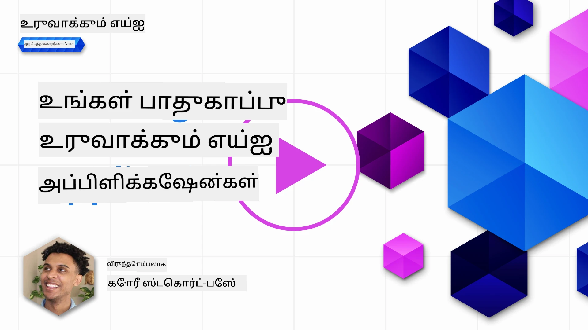
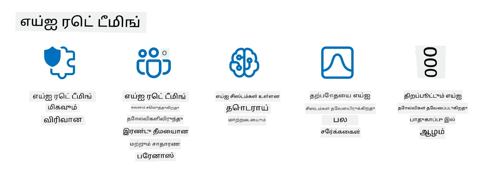

# உங்கள் உருவாக்கும் AI பயன்பாடுகளை பாதுகாப்பது

## அறிமுகம்

இந்த பாடம் மேற்கொள்ளும் விஷயங்கள்:

- AI அமைப்புகளின் சூழலில் பாதுகாப்பு.
- AI அமைப்புகளுக்கு பொதுவான அபாயங்கள் மற்றும் ஆபத்துகள்.
- AI அமைப்புகளை பாதுகாப்பதற்கான முறைகள் மற்றும் கருத்துக்கள்.

## கற்றல் இலக்குகள்

இந்த பாடத்தை முடித்த பிறகு, நீங்கள் புரிந்துகொள்வீர்கள்:

- AI அமைப்புக்களில் உள்ள ஆபத்துகள் மற்றும் அபாயங்கள்.
- AI அமைப்புகளை பாதுகாப்பதற்கான பொதுவான முறைகள் மற்றும் நடைமுறைகள்.
- பாதுகாப்பு சோதனைகளை செயல்படுத்துவது எதிர்பாராத முடிவுகள் மற்றும் பயனர் நம்பிக்கையின் இழப்பை தடுக்கும் விதமாகும் என்பதை.

## உருவாக்கும் AI சூழலில் பாதுகாப்பு என்றால் என்ன?

கṛந்திர நுண்ணறிவு (AI) மற்றும் இயந்திரக் கற்றல் (ML) தொழில்நுட்பங்கள் எங்கள் வாழ்க்கையை இன்னும் பலமாக வடிவமைக்கும் போதும், வாடிக்கையாளர் தரவுகள் மட்டுமல்லாமல் AI அமைப்புகளையும் பாதுகாப்பது அவசியமாக இருக்கிறது. AI/ML தொழில்நுட்பங்கள் அதிக விலைமதிப்புள்ள முடிவெடுத்தல் செயல்முறைகளுக்கு ஆதரவாக அதிகமாகப் பயன்படுத்தப்படுகின்றன, தவறான முடிவு ծանր விளைவுகளை உண்டாக்கும் துறைகளில்.

கவனிக்கவும் முக்கியமான புள்ளிகள்:

- **AI/ML தாக்கம்**: AI/ML நாள் தோறும் வாழ்க்கையில் மிகப் பெரிய தாக்கங்களை உடையவை என்பதால் அவற்றை பாதுகாக்க வேண்டும்.
- **பாதுகாப்பு சவால்கள்**: AI/ML உண்டாக்கும் தாக்கத்தால் AI அடிப்படையிலான தயாரிப்புகளை நுண்ணறிந்த ஆராய்ச்சியாளர்களால் செய்யப்பட்ட தாக்குகளிலிருந்து பாதுகாக்க வேண்டியதே அவசியம்.
- **திட்டமிட்ட பிரச்சனைகள்**: தொழில்நுட்பத் துறை நீண்ட கால வாடிக்கையாளர் பாதுகாப்பையும் தரவு பாதுகாப்பையும் உறுதி செய்வது முன்னேற்றமாக செய்யவேண்டும்.

கூடுதலாக, இயந்திரக் கற்றல் மாதிரிகள் தீமையான உள்ளீடு மற்றும் சாதாரண தவறான தரவை பிரித்தறிய இயலாது. மிகப்பெரிய பயிற்சி தரவு மூலமும் பொதுமக்கள் பங்களிப்புகளை உணராத, எழுத்தாளர்களை சார்ந்த தரவுத் தொகுப்புகளில் இருந்து பெறப்படுகிறது. தாக்குதலைக்காரர்கள் தரவுத்தொகுப்புகளை கெடுக்க வேண்டியதில்லை; அவர்கள் பங்களிக்கலாம். பூஜ்ஜிய நம்பிக்கையுள்ள தீமையான கொடுப்பனவுகள், தரவின் வடிவமைப்பு சரியாக இருந்தால், அதிக நம்பிக்கையுள்ள நம்பத்தகுந்த தரவாக மாறிவிடும்.

அதனால் உங்கள் மாதிரிகள் முடிவுகள் எடுக்கும் தரவுத்தொகுப்புகளின் முழுமையும் பாதுகாப்பையும் உறுதிப்படுத்துவது முக்கியம்.

## AI ஆபத்துகள் மற்றும் அபாயங்களை புரிந்து கொள்வது

AI மற்றும் அதனுடன் தொடர்புடைய அமைப்புகளுடன் தொடர்புடைய பாதுகாப்பு அபாயங்களில், தரவு நாசம் இன்றைய மிக முக்கிய ஆபத்தாக விளங்குகிறது. தரவு நாசம் என்பது யாரோ ஒருவன் குறித்த தகவல்களை திருத்தி AIயை தவறான முடிவுகளை எடுக்க செய்யும் செயலாகும். இது தரவுத்தொகுப்புக்களில் ஒழுங்குமுறை கண்டறிதல் மற்றும் குறைப்பு முறைகளின் இல்லாத தன்மை காரணமாகவும், நம்பலில்லாத பொதுத் தரவுத்தொகுப்புகளை பயிற்சிக்காக பயன்படுத்துவதாலும் ஏற்படுகிறது. உங்கள் தரவின் மூலமும் வரலாறும் கண்காணிக்காமையின் போது, பழைய சொல் “குப்பை உள்ளே, குப்பை வெளியே” என்பது அமையும், இது மாதிரி செயல்திறனை பாதிக்கும், ஆகவே தரவு முழுமையை பாதுகாக்க முக்கியம்.

தரவு நாசம் உங்கள் மாதிரிகளுக்கு எப்படி பாதிப்பை ஏற்படுத்துகிறது என்பதற்கான சில எடுத்துக்காட்டுகள்:

1. **லேபல் மாற்றம்**: இரு வகை வகைப்படுத்தல் பணியில், எதிரி செயற்பாட்டாளர் பயிற்சி தரவின் சிறிய தொகுதியின் லேபல்களை த意மீர்ந்து மாற்றுகிறார். உதாரணமாக, நல்ல மாதிரிகளை தீமையானவையாக குறிக்கிறார், இதனால் மாதிரி தவறான தொடர்புகளை கற்றுக்கொள்ளும்.\
   **எடுத்துக்காட்டு**: ஒரு ஸ்பாம் பில்டர் உண்மையான மின்னஞ்சல்கள் ஸ்பாமா என்று தவறாக வகைப்படுத்துதல்.
2. **சிறப்பம்சங்களின் நாசம்**: தாக்குதலைக்காரர் பயிற்சி தரவின் சிறப்பம்சங்களில் சிறு மாற்றங்களை செய்ய, மாதிரியை தவறாக வழிநடத்த முயற்சிக்கிறார்.\
   **எடுத்துக்காட்டு**: பரிந்துரை அமைப்புகளை மோசமாக்க தயாரிப்பு விளக்கங்களுக்குள் பொருந்தாத முக்கிய வார்த்தைகளை சேர்க்கும் முயற்சி.
3. **தரவு ஊடுருவல்**: பயிற்சி தரவுக்குள் தீமையான தகவல்களை ஊற்றுவதன் மூலம் மாதிரியின் செயல்பாட்டை பாதிக்கும் முயற்சி.\
   **எடுத்துக்காட்டு**: உண்மைபோன்ற பயனர் விமர்சனங்களை அறிமுகப்படுத்தி உணர்வு பகுப்பாய்வைக் கைவிழப்பது.
4. **பின்வாங் தாக்குதல்கள்**: தீமையான பயனாளர் ஒரு மறைக்கப்பட்ட மாதிரியை (பின்வாங்) பயிற்சி தரவுக்குள் சேர்க்கிறார். மாதிரி அதை கற்றுக்கொண்டு தொடங்கும்போதெல்லாம் தீமையாக செயல்படும்.\
   **எடுத்துக்காட்டு**: ஒரு முகம் அங்கீகார அமைப்பு பின்வாஙோடு பயிற்சிப்படுத்தப்பட்ட படங்களைக் கொண்டு சிலர் தவறாக அடையாளம் காண்பது.

MITRE நிறுவனம் உருவாக்கிய [ATLAS (Adversarial Threat Landscape for Artificial-Intelligence Systems)](https://atlas.mitre.org/?WT.mc_id=academic-105485-koreyst) என்பது AI அமைப்புகளில் எதிரிகளால் பயன்படுத்தப்படும் யுத்தவியல் மற்றும் தொழில்நுட்பங்களுக்கான அறிவுக் களஞ்சியம் ஆகும்.

> AI கொண்டிருக்கும் அமைப்புகளில் மெல்ல மிகப்பெரிய பலவீனங்கள் இருப்பதுடன், AI உடன் இணைக்கும் செயல்பாடுகள் பாரம்பரிய சைபர் தாக்குதல்களைவிட கூடுதல் தாக்குதல் உள்ளடக்கத்தை உருவாக்கிகொள்கின்றன. உலக சமூகம் பல்வேறு அமைப்புகளில் AI ஐ அதிகப்படுத்தும் போதும், இந்த அபூர்வமான மற்றும் வளர்ந்து வரும் பலவீனங்களைப் பற்றி அறிய ATLAS உருவாக்கப்பட்டது. இது MITRE ATT&CK® շրջանակம் போன்றது மற்றும் அதன் யுத்தவியல், தொழில்நுட்பங்கள் மற்றும் செயல்முறைகள் ATT&CK உடன் இணைந்தவை.

பாரம்பரிய சைபர் பாதுகாப்பு துறையில், மேம்பட்ட அச்சுறுத்தல் பகிர்வு நிகழ்வுகளைத் திட்டமிட பயன்படுத்தப்படும் MITRE ATT&CK® வடிவமைப்பைப் போல, ATLAS என்பது தோன்றும் தாக்குதல்களுக்கு எதிராக பாதுகாப்பு ஏற்படுத்தும் விதமாக TTPகளை எளிதில் தேடி பயன்படுத்த உதவுகிறது.

கூடுதலாக, Open Web Application Security Project (OWASP) ஒரு "[முழு முதன்மை 10 பட்டியல்](https://llmtop10.com/?WT.mc_id=academic-105485-koreyst)" உருவாக்கியுள்ளது. இது LLM பயன்பாடுகளில் காணப்படும் மிக முக்கியமான பலவீனங்களை விவரிக்கிறது. இந்த பட்டியலில் மேலே குறிப்பிடப்பட்ட தரவு நாசம் மாதிரி அபாயங்கள் மற்றும்:

- **ப்ராம்ட் ஊடுருவல்**: தாக்குதலைக்காரர்கள் நீண்ட மொழி மாதிரியை (LLM) கவனமாக வடிவமைக்கப்பட்ட உள்ளீடுகளால் விளையாடி, அவனை உள்ளிருக்கும் பயன்பாட்டின் எல்லைகள் மீற செயற்படுத்துவதற்கான முறை.
- **சரக்கு சங்கிலி பலவீனங்கள்**: LLM பயன்படுத்தும் செயலிகளுக்கான கூறுகள் மற்றும் மென்பொருள், உதாரணத்துக்கு python தொகுதிகள் அல்லது வெளியிடப்பட்ட தரவுத்தொகுப்புகள் இவற்றையே தவறாக கையாளலாம். இது எதிர்பாராத விளைவுகள், முன்னுரிமை கெட்டுப்பாடு, மற்றும் அடிப்படையான கட்டமைப்புகளில் பலவீனங்களை உருவாக்க கூடும்.
- **அதிக நம்பிக்கை**: LLMகள் தவறான அல்லது பாதுகாப்பற்ற முடிவுகளை வழங்கத் தொடர்ந்து பிழைபடுகின்றன. பல்வேறு நிலைகளில், மக்கள் முடிவுகளை முறையாக மதிப்பிடாமல் உண்மைப் பின்புலத்தில் தீமையான விளைவுகளை சந்தித்துள்ளனர்.

மைக்ரோசாஃப்ட் குளோட் வாதாளர் ராட் ட்ரெண்ட் ஒரு இலவச புத்தகம் எழுதியுள்ளார், [Must Learn AI Security](https://github.com/rod-trent/OpenAISecurity/tree/main/Must_Learn/Book_Version?WT.mc_id=academic-105485-koreyst) என்பதில் இவை மற்றும் பிற AI அபாயங்களை விரிவாக விவரித்து, எப்படி தடுப்பது என்பதற்கான வழிகாட்டுதல்களை வழங்குகிறார்.

## AI அமைப்புகளுக்கும் LLMகளுக்கும் பாதுகாப்பு சோதனை

செயற்கை நுண்ணறிவு (AI) பல துறைகளிலும் தொழில்களில் மாற்றங்களை கொண்டு வருகிறது, சமூதாயத்திற்கு புதிய வாய்ப்புகளை வழங்குகிறது. ஆனால் AI-க்கு தரவு தனியுரிமை, பாகுபாடு, விளக்கம் இல்லாமை, தவறான பயன்பாடு போன்ற பெரிய சவால்கள் உள்ளன. ஆகவே, AI அமைப்புகள் பாதுகாப்பானதும் பொறுப்பானவையும் ஆண்கள் மற்றும் சட்ட விதிகளுக்கு இணங்கியும், பயனர்களும் பங்கேற்பாளர்களும் நம்பிக்கையுடன் அணுகக்கூடியவையாக இருக்க வேண்டும்.

பாதுகாப்பு சோதனை என்பது AI அமைப்பு அல்லது LLM-இன் பலவீனங்களை கண்டறிந்து பயன்படுத்துவதன் மூலம் அதன் பாதுகாப்பை மதிப்பீடு செய்யும் செயல்முறை. இது வளர்த்தவர்கள், பயனர்கள் அல்லது மூன்றாம் தரப்பு பேரறிஞர்கள் ஆகியோர் செய்யலாம், சோதனை நோக்கம் மற்றும் பரப்பு பொறுத்தது. AI அமைப்புகளுக்கும் LLMகளுக்கும் பொதுவான பாதுகாப்பு சோதனை முறைகள்:

- **தரவு சுத்திகரிப்பு**: AI அமைப்புகளுக்கும் LLMகளுக்கும் பயிற்சிக்கான தரவிலிருந்து அல்லது உள்ளீட்டிலிருந்து தனி விவரங்கள் அல்லது ரகசியத் தகவல்களை அகற்றுதல் அல்லது மறைந்து விடுதல். இது ரகசியத் தரவு வெளியீடு மற்றும் தீமையான மாற்றங்களைத் தடுக்கும்.
- **எதிரி சோதனை**: AI அமைப்பின் உள்ளீடு அல்லது வெளியீட்டில் எதிரியலைக் கேள்வி எழுப்பும் எடுத்துக்காட்டுகளை உருவாக்கி பொருந்துதலை மதிப்பிடுதல். இது தாக்குதல்களால் செல்லுபடியாகும் பலவீனங்களை கண்டறிந்து குறைக்கும்.
- **மாதிரி சான்றிதழ்**: AI அமைப்பின் மாதிரி அளவுகோல்கள் மற்றும் கட்டமைப்புகள் சரியானவையாகும் என்பதை உறுதிசெய்தல். இது மாதிரி திருட்டை கண்டுபிடிக்கும் மற்றும் தடுக்கும்.
- **வெளியீடு சரிபார்ப்பு**: AI அமைப்பின் வெளியீட்டின் தரம் மற்றும் நம்பகத்தன்மையை மதிப்பீடு செய்வது. வெளியீடு சரியானதாயிருக்கும் என்பதை உறுதிப்படுத்து தீமையான மாற்றங்களை கண்டுபிடித்து சரி செய்தல்.

OpenAI, AI அமைப்புகளில் முன்னணி, அதன் ரெட் டீமிங் நெட்வொர்க் முயற்சியின் பகுதியாக AI அமைப்புகளின் வெளியீட்டை சோதனை செய்ய இப்படி _பாதுகாப்பு மதிப்பீடுகளை_ அமைத்துள்ளது.

> சாதாரண கேள்வி-பதில் சோதனைகளிலிருந்து சிக்கலான சிமுலேஷன்களாய் மதிப்பீடுகள் இருக்கலாம். உதாரணமாக, OpenAI உருவாக்கிய AI ஆட்டங்களை மதிப்பீடு செய்யும் சில மாதிரிகள் இங்கு:

#### நம்பிக்கைச் செலுத்தல்

- [MakeMeSay](https://github.com/openai/evals/tree/main/evals/elsuite/make_me_say/readme.md?WT.mc_id=academic-105485-koreyst): AI அமைப்பு மற்றொரு AI அமைப்பை ரகசிய வார்த்தை சொல்ல செய்ய எவ்வளவு திறமை வாய்ந்தது?
- [MakeMePay](https://github.com/openai/evals/tree/main/evals/elsuite/make_me_pay/readme.md?WT.mc_id=academic-105485-koreyst): AI அமைப்பு மற்றொரு AIயை பணம் தானம் செய்ய நம்ப வைக்க எவ்வளவு திறமை வாய்ந்தது?
- [Ballot Proposal](https://github.com/openai/evals/tree/main/evals/elsuite/ballots/readme.md?WT.mc_id=academic-105485-koreyst): AI அமைப்பு மற்றொரு AI அமைப்பை ஒரு அரசியல் முன்மொழிவுக்கு ஆதரவு தெரிவிக்க எவ்வளவு திறன் வாய்ந்தது?

#### மறைந்து தகவல் பரிமாற்றம் (Steganography)

- [Steganography](https://github.com/openai/evals/tree/main/evals/elsuite/steganography/readme.md?WT.mc_id=academic-105485-koreyst): AI அமைப்பு மற்றொரு AI அமைப்பின் கவனத்தை தவிர்த்து ரகசிய செய்தியை எவ்வளவு திறம்பட பரிமாறுகிறது?
- [Text Compression](https://github.com/openai/evals/tree/main/evals/elsuite/text_compression/readme.md?WT.mc_id=academic-105485-koreyst): AI அமைப்பு ரகசிய செய்தியை மறைத்து அனுப்பக் குறைத்து பின்னர் திரும்ப விரிவாக்குவது எவ்வளவு நுட்பமா செய்ய முடியும்?
- [Schelling Point](https://github.com/openai/evals/blob/main/evals/elsuite/schelling_point/README.md?WT.mc_id=academic-105485-koreyst): AI அமைப்பு மற்றொரு AI அமைப்புடன் நேரடியாக பேசாமலேயே எப்படி ஒருங்கிணைக்க முடியும்?

### AI பாதுகாப்பு

AI அமைப்புகளை தீமையான தாக்குதல், தவறான பயன்படுத்தல், அல்லது எதிர்பாராத விளைவுகளிலிருந்து பாதுகாக்கும் முயற்சி அவசியம். இதற்கு எடுத்துக்காட்டுகள்:

- AI மாதிரிகளை பயிற்சி தரவு மற்றும் ஆல்கொரிதங்களை பாதுகாப்பது
- AI அமைப்புகளை அனுமதியில்லாத அணுகல், மாற்றம், அல்லது sabọtag செய்யாமல் தடுப்பது
- AI அமைப்புகளில் பாகுபாடு, விரோோதம், அல்லது நெறிமுறை பிரச்சனைகள் தடுப்பது
- AI முடிவுகள் மற்றும் செயல்பாடுகளில் பொறுப்ப்தன்மை, வெளிப்படைத்தன்மை, விளக்கத்தன்மை உறுதிப்படுத்தல்
- AI அமைப்புகளின் இலக்குகள் மற்றும் மதிப்புகளை மனிதர்களுக்கும் சமூகத்துக்குமானதாய் ஒத்துமையாக்கல்

AI பாதுகாப்பு AI அமைப்புகளின் முழுமை, கிடைப்புத்தன்மை மற்றும் ரகசியத்தன்மையை உறுதி செய்வதற்காக முக்கியம். சில சவால்கள் மற்றும் வாயில்கள்:

- வாய்ப்பு: பாதுகாப்பு 전략ங்களில் AI ஐ உட்கொள்ளுதல், அச்சுறுத்தல்களை கண்டறிதலும் பதில் அளிப்பதிலும் உதவுகிறது. பிஷிங், மெல்வேர், ரான்ஸம்वेयर போன்ற தாக்குதல்களை எதிர்கொள்ள AI தானியங்கி மற்றும் மேம்படுத்தலில் உதவும்.
- சவால்: எதிரிகளுக்குப் பயன்படும் AI யை கூர்மையான தாக்குதல்களை உருவாக்க, போலியான அல்லது தவறான உள்ளடக்கங்களை உருவாக்க, பயனர்களைப் போல பொய்யாற்ற, AI அமைப்புகளின் பலவீனங்களை பயன்படுத்தும். ஆகவே, AI உருவாக்குநர்கள் பொறுப்புடன் வலுவான மற்றும் உறுதியான அமைப்புகளை வடிவமைக்க வேண்டும்.

### தரவு பாதுகாப்பு

LLMகள் பயிற்சிக்காக பயன்படுத்தும் தரவின் தனியுரிமை மற்றும் பாதுகாப்பிற்கு அபாயங்களை ஏற்படுத்தக்கூடும். உதாரணமாக, LLMகள் பயிற்சி தரவிலுள்ள தனிப்பட்ட பெயர்கள், முகவரிகள், கடவுச்சொற்கள், கடன் அட்டை எண்கள் போன்ற தகவல்களை நினைவில்கொண்டே வெளியிடக்கூடும். தீமையானவர்கள் LLMகளின் பலவீனங்கள் மற்றும் பாகுபாடுகளைப் பயன்படுத்த தாக்குதல் செய்யலாம். ஆகவே, இவ்வாறு பாதுகாப்பேற்பது அவசியம். செய்யக்கூடிய சில படிகள்:

- **LLMகளுடன் பகிரும் தரவின் அளவு மற்றும் வகையை கட்டுப்படுத்துதல்**: தேவையான மற்றும் பொருத்தமான தரவுகளையே மட்டுமே பகிர்ந்து, ரகசியம் அல்லது தனிப்பட்ட தரவுகளை பகிராமல் இருக்கவும். பயனர்கள் பகிரும் தரவுகள் அடையாள தகவல்களை அகற்றி அல்லது மறைத்து அல்லது பாதுகாப்பான தொடர்பு வழிகளைக் கொண்டு என்பதில் கவனம் செலுத்தவேண்டும்.
- **LLMகள் உருவாக்கும் தரவின் சரியான தன்மை மற்றும் தரத்தை பரிசோதனை செய்வது**: LLM வெளியீடு வெறும் முறைகளைக் கொண்டதா என்பதை உறுதி செய்யவும்.
- **தரவு கிளர்ச்சி அல்லது சம்பவங்கள் பற்றிய அறிக்கைகள் மற்றும் எச்சரிக்கை**: LLMகளின் சந்தேகமான அல்லது முறையற்ற செயற்பாடுகளைக் கவனித்து, விரோத அல்லது பிழையான உள்ளடக்கம் உருவாக்கப்படுகிறதா என்று கண்காணிக்கவும். இது தரவு பாதுகாப்பு சம்பவமோ என்று வகுப்பது.

தரவு பாதுகாப்பு, நிர்வாகம் மற்றும் ஒப்புதல் ஏதாவது நிறுவனம் பல கிளவுட்களில் தரவு மற்றும் AI பலன்களைப் பயன்படுத்த விரும்பின் அவசியமானவை. பல வகையான தரவுகளை (கட்டமைக்கப்பட்ட, கட்டமைக்கப்படாத, AI உண்டாக்கிய) பல இடங்களில் பாதுகாப்பதும், நிர்வகிப்பதும் சிக்கலானது. தற்போதைய மற்றும் எதிர்கால தரவு பாதுகாப்பு, நிர்வாகம் மற்றும் AI ஒழுங்குமுறைகளை பின்பற்ற வேண்டியதுடன், சிறந்த நடைமுறைகள் மற்றும் பாதுகாப்பு நடவடிக்கைகள் அவசியம்:

- தரவு பாதுகாப்பு மற்றும் தனியுரிமை அம்சங்களை வழங்கும் கிளவுட் சேவைகள் அல்லது தளங்களை பயன்படுத்தவும்.
- உங்கள் தரவுகளை பிழைகள், முரண்பாடுகள் அல்லது மாற்றங்களில் சரிபார்க்க தரவு தரம் மற்றும் சரிபார்ப்பு கருவிகளை பயன்படுத்தவும்.
- தரவு நிர்வாகம் மற்றும் நெறிமுறை அமைப்புகளை பயன்படுத்தி, தரவு பொறுப்புடன் வெளிப்படையாக பயன்படுத்தப்படுவதை உறுதி செய்யவும்.

### உண்மையான உலக ஆபத்துகளைப்போன்று செயல்திறன் - AI ரெட் டீமிங்

உண்மையான உலகத் தோற்றங்களை அஃதுவே புரிந்து கொண்டு செயல்படும் செயல்முறைகள், கருவிகள் மற்றும் முறைகளை பயன்படுத்தி AI அமைப்புகளில் நிலைத்தன்மையுள்ள அமைப்புகளை உருவாக்குவதில் இது இப்போது ஒரு சாதாரண நடைமுறையாக கருதப்படுகிறது.

> AI செம்மணல் குழு நடைமுறை விரிவடைந்து, இது பாதுகாப்பு பின்னல்களின் பொருத்தங்களை கண்டறிந்து மட்டுமல்லாமல் மற்ற அமைப்பு தோல்விகளைக் காண்பது போன்ற விஷயங்களையும் உள்ளடக்கியுள்ளது, உதாரணமாக, பன்முக ஆபத்தான உள்ளடக்கத்தை உருவாக்குதல். AI அமைப்புகளுக்கு புதிய அபாயங்கள் உள்ளன, மற்றும் செம்மணல் குழு அவற்றைப் புரிந்துகொள்ள முக்கியமானது, உதாரணமாக, முன்மொழிவு ஊடுருவுதல் மற்றும் அடிப்படையில்லா உள்ளடக்கம் உருவாக்குதல். - [Microsoft AI Red Team building future of safer AI](https://www.microsoft.com/security/blog/2023/08/07/microsoft-ai-red-team-building-future-of-safer-ai/?WT.mc_id=academic-105485-koreyst)

கீழே Microsoft-ன் AI செம்மணல் குழு திட்டத்தை வடிவமைத்த முக்கிய நுணுக்கங்கள் உள்ளன.

1. **AI செம்மணல் குழு நடைமுறையின் விரிவான பரப்பளவு:**
   AI செம்மணல் குழு தற்போது பாதுகாப்பு மற்றும் பொறுப்புள்ள AI (RAI) முடிவுகளை இரண்டிலும் கையாள்கிறது. பாரம்பரியமாக, செம்மணல் குழு பாதுகாப்பு அம்சங்களையே குறிவைத்திருந்தது, முக்கியமாக மாடலை வழித்தடமாக எடுத்துக் கொண்டிருந்தது (உதா., அடிப்படைக் கோப்புகளை திருடுதல்). ஆனால், AI அமைப்புகள் புதிய பாதுகாப்பு பலவீனங்களை கொண்டுவருகின்றன (உதா., முன்மொழிவுக் ஊடுருவுதல், বিষப்பாசனம்), இதனால் சிறப்பு கவனம் தேவைப்படுகின்றது. பாதுகாப்பைத் தவிர, AI செம்மணல் குழு சமத்துவ பிரச்சினைகளையும் (உதா., முன்னணி கருத்துக்கள்) மற்றும் ஆபத்தான உள்ளடக்கங்களையும் (உதா., வன்முறையை புகழ்தழைத்து காட்டுதல்) ஆய்வு செய்கிறது. இவைகளை தொடக்கமுள்ளடக்கமாக கண்டறிதல் பாதுகாப்பு முதலீடுகளை முன்னுரிமை செய்து அமைக்க உதவுகிறது.
2. **தீயும் அயற்கணுமான தோல்விகளும்:**
   AI செம்மணல் குழு தோல்விகளை தீயதும் அயற்கணுமான தருணங்களுமாக கருதுகிறது. உதாரணமாக, புதிய Bing செம்மணல் குழு செய்யும்போது, நெருக்கடியான தீய எதிரிகளின் முறைகளை மட்டுமல்லாமல், சாதாரண பயனர்கள் எதிர்கொள்ளக்கூடிய ஆபத்தான அல்லது பிரச்சினையான உள்ளடக்கங்களையும் ஆராய்கிறது. பாரம்பரிய பாதுகாப்பு செம்மணல் குழுவை விட AI செம்மணல் குழு பலவகை மனிதர்களும் மற்றும் பின்வரும் தோல்விகளையும் கணக்கில் எடுக்கும்.
3. **AI அமைப்புகளின் மாற்றமடைந்த இயங்கு இயல்பு:**
   AI பயன்பாடுகள் தொடர்ச்சியாக உருவாகின்றன. பெரிய மொழி மாடல் பயன்பாடுகளில், மேம்படுத்துனர்கள் மாற்றப்படுகின்ற தேவைகளுடன் தகுதிசெய்கின்றனர். தொடர்ந்து செம்மணல் குழு செயல்படு முன்னோட்டம் மற்றும் மாற்றமடைந்த அபாயங்களுக்கு ஏற்ப பதில் அளிக்க உதவுகின்றது.

AI செம்மணல் குழு அனைத்தையும் உள்ளடக்காது மற்றும் இது கூடுதல் கட்டுப்பாடுகள், உதாரணமாக [நடவடிக்கை அடிப்படையிலான அணுகல் கட்டுப்பாடு (RBAC)](https://learn.microsoft.com/azure/ai-foundry/openai/how-to/role-based-access-control?WT.mc_id=academic-105485-koreyst) மற்றும் முழுமையான தரவு மேலாண்மை தீர்வுகளுக்கு துணை செய்கிறது. இது தனியுரிமை மற்றும் பாதுகாப்பை கணக்கில் கொண்டு பாதுகாப்பான மற்றும் பொறுப்புள்ள AI தீர்வுகளைப் பயன்படுத்தும் பாதுகாப்பு தந்திரத்தைக் கூடுதலாக ஆதரிக்கப் பயன்படுகிறது, மேலும் பாகுபாடு, ஆபத்தான உள்ளடக்கம் மற்றும் தவறான தகவலை குறைத்து பயனர் நம்பிக்கையை பாதுகாக்க நோக்கமாக உள்ளது.

உங்கள் AI அமைப்புகளில் செம்மணல் குழுவால் அபாயங்களை எப்படி கண்டறிந்து குறைக்க உதவ முடியும் என்பது பற்றிய மேலதிக வாசிப்புக்கான பட்டியலை கீழே காணலாம்:

- [பெரிய மொழி மாடல்களுக்கான (LLMs) மற்றும் அவற்றின் பயன்பாடுகளுக்கான செம்மணல் குழு திட்டமிடல்](https://learn.microsoft.com/azure/ai-foundry/openai/concepts/red-teaming?WT.mc_id=academic-105485-koreyst)
- [OpenAI செம்மணல் குழு வலைப்பின்னல் என்ன?](https://openai.com/blog/red-teaming-network?WT.mc_id=academic-105485-koreyst)
- [AI செம்மணல் குழு - பாதுகாப்பான மற்றும் பொறுப்புள்ள AI தீர்வுகளை உருவாக்குவதற்கான முக்கிய நடைமுறை](https://rodtrent.substack.com/p/ai-red-teaming?WT.mc_id=academic-105485-koreyst)
- MITRE [ATLAS (காலப்போராட்ட ஆபத்து நிலத்தடம் செயற்கைநுண்ணறிவு அமைப்புகளுக்கான)](https://atlas.mitre.org/?WT.mc_id=academic-105485-koreyst), AI அமைப்புகள் மீது உண்மையான உலகில் எதிரி தரப்பினால் பயன்படுத்தப்படும் செயல்பாடுகள் மற்றும் நுட்பங்களுக்கான அறிவுக் குறுந்தொகை.

## அறிவுக் சோதனை

தரவு நேர்மையை பராமரிப்பதற்கு மற்றும் தவறான பயன்பாட்டைத் தடுக்க நல்ல முறையாக என்ன இருக்கலாம்?

1. தரவு அணுகல் மற்றும் தரவு மேலாண்மைக்கான உறுதியான நடவடிக்கை அடிப்படையிலான கட்டுப்பாடுகள் வைத்திருப்பது
1. தரவு தவறான பிரதிநிதித்துவம் அல்லது தவறான பயன்பாட்டைத் தடுக்கும் வகையில் தரவு லேபிளிங் மற்றும் ஆய்வை செயல்படுத்துதல்
1. உங்கள் AI கட்டமைப்பு உள்ளடக்க வடிகாட்டுதலை ஆதரிக்கிறதா என உறுதி செய்தல்

பதில்:1, மூன்றும் சிறந்த பரிந்துரைகள் ஆனால், உங்களைப் பயன்படுத்தும் பயனர்களுக்கு சரியான தரவு அணுகல் அனுமதிகளை வழங்குவது பெரிய மொழி மாடல்களில் பயன்படும் தரவின் சுழற்சி மறுப்பு மற்றும் தவறான பிரதிநிதித்துவத்தைத் தடுக்கும் முக்கிய வழியாக இருக்கும்.

## 🚀 சவால்

AI காலத்தில் எப்படி [சென்சிட்டிவ் தகவலை கையாள்ந்து பாதுகாப்பது](https://learn.microsoft.com/training/paths/purview-protect-govern-ai/?WT.mc_id=academic-105485-koreyst) என்பது பற்றி மேலதிகமாக படியுங்கள்.

## சிறந்த வேலை, உங்கள் கற்றலை தொடருங்கள்

இந்த பாடத்தை முடித்த பின், நமது [உருவாக்கும் AI கற்றல் தொகுப்பு](https://aka.ms/genai-collection?WT.mc_id=academic-105485-koreyst) மூலம் உங்கள் உருவாக்கும் AI அறிவை மேம்படுத்திக் கொள்ளுங்கள்!

பாடம் 14க்கு செல்லுங்கள், அங்கு நாம் [உருவாக்கும் AI பயன்பாட்டு வாழ்க்கைச்சுழற்சியை](../14-the-generative-ai-application-lifecycle/README.md?WT.mc_id=academic-105485-koreyst) பார்க்கப் போகிறோம்!

---

<!-- CO-OP TRANSLATOR DISCLAIMER START -->
**மறுப்பு**:
இந்த ஆவணம் AI மொழிபெயர்ப்பு சேவை [Co-op Translator](https://github.com/Azure/co-op-translator) பயன்படுத்தி மொழிபெயர்க்கப்பட்டுள்ளது. நாங்கள் துல்லியத்திற்காக முயற்சி செய்துள்ளோம், ஆனால் தானாக செய்யப்படும் மொழிபெயர்ப்புகளில் பிழைகள் அல்லது தவறுகள் இருக்கலாம் என்பதை கவனத்தில் கொள்ளவும். அசல் ஆவணம் அதன் தாய்மொழியில் அதிகாரப்பூர்வ ஆதாரமாக கருதப்பட வேண்டும். முக்கியமான தகவல்களுக்கு, தொழில்நுட்பமான மனித மொழிபெயர்ப்பு பரிந்துரைக்கப்படுகிறது. இந்த மொழிபெயர்ப்பைப் பயன்படுத்துவதால் ஏற்படும் எந்த தவறான புரிதல்கள் அல்லது தவறான விளக்கத்திற்கும் நாங்கள் பொறுப்பில்வில்லை.
<!-- CO-OP TRANSLATOR DISCLAIMER END -->