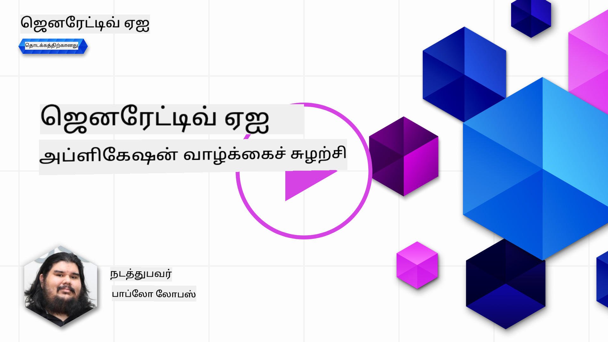
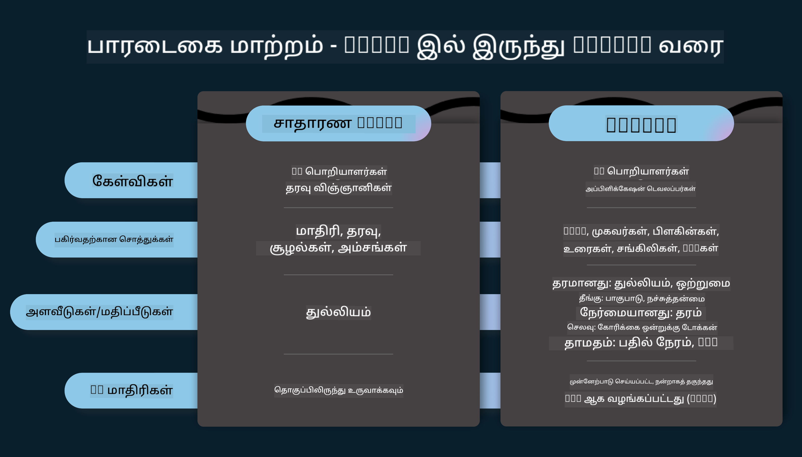
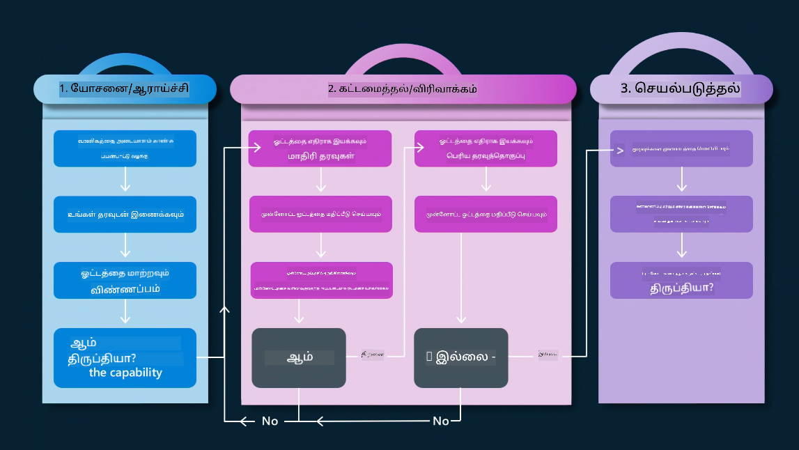
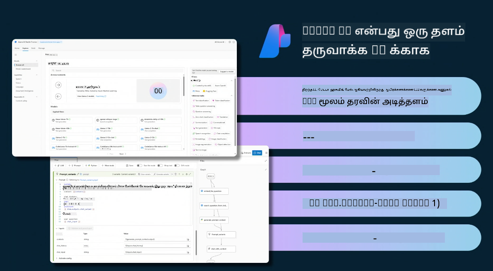
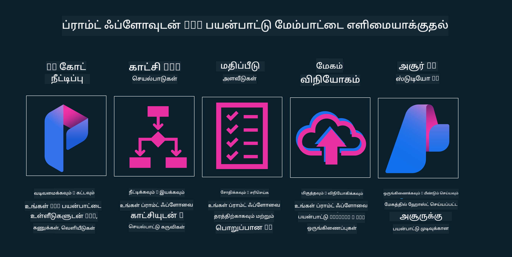

<!--
CO_OP_TRANSLATOR_METADATA:
{
  "original_hash": "b9d32511b27373a1b21b5789d4fda057",
  "translation_date": "2025-10-18T02:42:15+00:00",
  "source_file": "14-the-generative-ai-application-lifecycle/README.md",
  "language_code": "ta"
}
-->

# உருவாக்கும் AI பயன்பாட்டு வாழ்க்கைச் சுழற்சி

அனைத்து AI பயன்பாடுகளுக்கும் முக்கியமான கேள்வி, AI அம்சங்களின் தொடர்புடையதா என்பதைப் பற்றியது. AI ஒரு வேகமாக வளர்ந்து வரும் துறையாக இருப்பதால், உங்கள் பயன்பாடு தொடர்புடையது, நம்பகமானது மற்றும் வலுவானது என்பதை உறுதிப்படுத்த, அதை தொடர்ந்து கண்காணிக்கவும், மதிப்பீடு செய்யவும், மேம்படுத்தவும் வேண்டும். இதுவே உருவாக்கும் AI வாழ்க்கைச் சுழற்சியின் முக்கியத்துவம்.

உருவாக்கும் AI வாழ்க்கைச் சுழற்சி என்பது ஒரு அமைப்பாகும், இது உருவாக்கும் AI பயன்பாட்டை உருவாக்குதல், செயல்படுத்துதல் மற்றும் பராமரித்தல் ஆகிய கட்டங்களை வழிநடத்துகிறது. இது உங்கள் இலக்குகளை வரையறுக்க, உங்கள் செயல்திறனை அளக்க, உங்கள் சவால்களை அடையாளம் காண, மற்றும் உங்கள் தீர்வுகளை செயல்படுத்த உதவுகிறது. இது உங்கள் பயன்பாட்டை உங்கள் துறையின் மற்றும் உங்கள் பங்குதாரர்களின் நெறிமுறைகள் மற்றும் சட்டத் தரங்களுடன் ஒத்துப்போக உதவுகிறது. உருவாக்கும் AI வாழ்க்கைச் சுழற்சியை பின்பற்றுவதன் மூலம், உங்கள் பயன்பாடு எப்போதும் மதிப்பை வழங்கி, உங்கள் பயனர்களை திருப்திப்படுத்துவதை உறுதிப்படுத்தலாம்.

## அறிமுகம்

இந்த அத்தியாயத்தில், நீங்கள்:

- MLOps-இல் இருந்து LLMOps-க்கு பரிமாற்றத்தைப் புரிந்துகொள்ளுங்கள்
- LLM வாழ்க்கைச் சுழற்சி
- வாழ்க்கைச் சுழற்சி கருவிகள்
- வாழ்க்கைச் சுழற்சி அளவீடு மற்றும் மதிப்பீடு

## MLOps-இல் இருந்து LLMOps-க்கு பரிமாற்றத்தைப் புரிந்துகொள்ளுங்கள்

LLMகள் செயற்கை நுண்ணறிவு ஆயுதங்களில் புதிய கருவியாகும். பயன்பாடுகளுக்கான பகுப்பாய்வு மற்றும் உருவாக்க பணிகளில் அவை மிகவும் சக்திவாய்ந்தவை. எனினும், இந்த சக்தி AI மற்றும் பாரம்பரிய இயந்திரக் கற்றல் பணிகளை எளிமைப்படுத்தும் விதத்தில் சில விளைவுகளை ஏற்படுத்துகிறது.

இதன் மூலம், இந்த கருவியை சரியான ஊக்கத்துடன் ஒரு மாறுபட்ட முறையில் தழுவ புதிய பார்வை தேவைப்படுகிறது. பழைய AI பயன்பாடுகளை "ML Apps" எனவும், புதிய AI பயன்பாடுகளை "GenAI Apps" அல்லது "AI Apps" எனவும் வகைப்படுத்தலாம், அப்போது பயன்படுத்தப்படும் முக்கிய தொழில்நுட்பம் மற்றும் நுட்பங்களை பிரதிபலிக்கிறது. இது பல வழிகளில் நமது கதைசொல்லலை மாற்றுகிறது, கீழே உள்ள ஒப்பீட்டை பாருங்கள்.

LLMOps-இல், பயன்பாட்டு டெவலப்பர்களின் மீது அதிக கவனம் செலுத்துகிறோம், ஒருங்கிணைப்புகளை முக்கிய புள்ளியாகக் கொண்டு, "Models-as-a-Service" ஐப் பயன்படுத்தி, அளவீடுகளுக்கான பின்வரும் புள்ளிகளைப் பற்றி சிந்திக்கிறோம்.

- தரம்: பதிலின் தரம்
- தீங்கு: பொறுப்பான AI
- நேர்மை: பதிலின் அடிப்படை (அது பொருள் படுகிறதா? சரியா?)
- செலவு: தீர்வுக்கான பட்ஜெட்
- தாமதம்: டோக்கன் பதிலுக்கான சராசரி நேரம்

## LLM வாழ்க்கைச் சுழற்சி

முதலில், வாழ்க்கைச் சுழற்சியையும் மாற்றங்களையும் புரிந்துகொள்ள, கீழே உள்ள தகவல் வரைபடத்தை கவனிக்கவும்.

நீங்கள் கவனிக்கலாம், இது MLOps வாழ்க்கைச் சுழற்சிகளிலிருந்து மாறுபட்டது. LLMகளுக்கு பல புதிய தேவைகள் உள்ளன, உதாரணமாக, ப்ராம்ப்டிங், தரத்தை மேம்படுத்துவதற்கான பல்வேறு நுட்பங்கள் (Fine-Tuning, RAG, Meta-Prompts), பொறுப்பான AI உடன் மாறுபட்ட மதிப்பீடு மற்றும் பொறுப்புகள், இறுதியாக, புதிய மதிப்பீட்டு அளவீடுகள் (தரம், தீங்கு, நேர்மை, செலவு மற்றும் தாமதம்).

உதாரணமாக, நாம் எப்படி யோசிக்கிறோம் என்பதைப் பாருங்கள். ப்ராம்ப்ட் என்ஜினியரிங் பயன்படுத்தி பல LLMகளுடன் பரிசோதனை செய்து, அவர்களின் கற்பனை சரியாக இருக்குமா என்பதை சோதிக்க.

இது நேரியல் அல்ல, ஆனால் ஒருங்கிணைந்த சுற்றுகள், மீண்டும் மீண்டும் செய்யக்கூடியது மற்றும் ஒரு மொத்த சுழற்சியுடன்.

அந்த படிகளை எப்படி ஆராயலாம்? வாழ்க்கைச் சுழற்சியை எப்படி உருவாக்கலாம் என்பதை விரிவாகப் பார்ப்போம்.

இது கொஞ்சம் சிக்கலாகத் தோன்றலாம், முதலில் மூன்று முக்கியமான படிகளைக் கவனிக்கலாம்.

1. யோசித்தல்/ஆராய்தல்: ஆராய்ச்சி, இங்கு நாங்கள் எங்கள் வணிக தேவைகளுக்கு ஏற்ப ஆராயலாம். ப்ரோட்டோடைப்பிங், [PromptFlow](https://microsoft.github.io/promptflow/index.html?WT.mc_id=academic-105485-koreyst) உருவாக்குதல் மற்றும் எங்கள் கற்பனை போதுமான அளவு திறமையானதா என்பதை சோதிக்க.
1. கட்டமைத்தல்/மேம்படுத்தல்: செயல்படுத்தல், இப்போது, பெரிய தரவுத்தொகுப்புகளுக்காக மதிப்பீடு செய்யத் தொடங்குகிறோம், நுட்பங்களை செயல்படுத்துகிறோம், உதாரணமாக Fine-tuning மற்றும் RAG, எங்கள் தீர்வின் வலிமையைச் சோதிக்க. அது சரியாக இல்லையெனில், அதை மீண்டும் செயல்படுத்துதல், எங்கள் வேலைப்போக்கில் புதிய படிகளைச் சேர்த்தல் அல்லது தரவுகளை மறுசீரமைத்தல் உதவலாம். எங்கள் வேலைப்போக்கையும் எங்கள் அளவையும் சோதித்த பிறகு, அது வேலை செய்கிறது மற்றும் எங்கள் அளவீடுகளைச் சரிபார்க்கிறது, அடுத்த படிக்குத் தயாராக உள்ளது.
1. செயல்படுத்துதல்: ஒருங்கிணைப்பு, இப்போது எங்கள் அமைப்புக்கு கண்காணிப்பு மற்றும் எச்சரிக்கை அமைப்புகளைச் சேர்த்தல், வெளியீடு மற்றும் பயன்பாட்டு ஒருங்கிணைப்பு.

பின்னர், பாதுகாப்பு, இணக்கம் மற்றும் ஆளுமை மீது கவனம் செலுத்தும் மேலாண்மை மொத்த சுழற்சியைப் பெறுகிறோம்.

வாழ்த்துக்கள், இப்போது உங்கள் AI பயன்பாடு தயாராக செயல்படுகிறது. ஒரு கையால் அனுபவத்தைப் பெற, [Contoso Chat Demo](https://nitya.github.io/contoso-chat/?WT.mc_id=academic-105485-koreys) ஐப் பாருங்கள்.

இப்போது, நாம் எந்த கருவிகளைப் பயன்படுத்தலாம்?

## வாழ்க்கைச் சுழற்சி கருவிகள்

கருவிகளுக்காக, Microsoft [Azure AI Platform](https://azure.microsoft.com/solutions/ai/?WT.mc_id=academic-105485-koreys) மற்றும் [PromptFlow](https://microsoft.github.io/promptflow/index.html?WT.mc_id=academic-105485-koreyst) ஆகியவற்றை வழங்குகிறது, உங்கள் சுழற்சியை எளிதாக செயல்படுத்தவும், தயாராக செயல்படுத்தவும் உதவுகிறது.

[Azure AI Platform](https://azure.microsoft.com/solutions/ai/?WT.mc_id=academic-105485-koreys), [AI Studio](https://ai.azure.com/?WT.mc_id=academic-105485-koreys) ஐப் பயன்படுத்த அனுமதிக்கிறது. AI Studio என்பது ஒரு வலை போர்டல், இது மாடல்கள், மாதிரிகள் மற்றும் கருவிகளை ஆராய அனுமதிக்கிறது. உங்கள் வளங்களை நிர்வகித்தல், UI மேம்பாட்டு வேலைப்போக்குகள் மற்றும் Code-First மேம்பாட்டிற்கான SDK/CLI விருப்பங்களை வழங்குகிறது.

Azure AI, உங்கள் செயல்பாடுகள், சேவைகள், திட்டங்கள், வெக்டர் தேடல் மற்றும் தரவுத்தொகுப்புகளின் தேவைகளை நிர்வகிக்க பல வளங்களைப் பயன்படுத்த அனுமதிக்கிறது.

Proof-of-Concept(POC) முதல் பெரிய அளவிலான பயன்பாடுகள் வரை PromptFlow மூலம் உருவாக்கவும்:

- VS Code-இல் இருந்து செயலிகளை வடிவமைத்து உருவாக்கவும், காட்சிப்படுத்தல் மற்றும் செயல்பாட்டு கருவிகளுடன்
- உங்கள் செயலிகளை எளிதாக தரமான AIக்கு சோதித்து, நன்றாக அமைத்துக்கொள்ளுங்கள்.
- Azure AI Studio ஐப் பயன்படுத்தி மேகத்துடன் ஒருங்கிணைத்து, தள்ளி, விரைவான ஒருங்கிணைப்புக்காக வெளியிடவும்.

## அருமை! உங்கள் கற்றலை தொடருங்கள்!

அற்புதம், இப்போது [Contoso Chat App](https://nitya.github.io/contoso-chat/?WT.mc_id=academic-105485-koreyst) மூலம் இந்த கருத்துகளை எவ்வாறு பயன்படுத்தி ஒரு பயன்பாட்டை அமைக்கிறோம் என்பதைப் பற்றி மேலும் அறிக. மேக ஆதரவு இந்த கருத்துகளை டெமோவில் எப்படி சேர்க்கிறது என்பதைச் சரிபார்க்கவும். மேலும் உள்ளடக்கத்திற்காக, எங்கள் [Ignite breakout session!](https://www.youtube.com/watch?v=DdOylyrTOWg) ஐப் பாருங்கள்.

இப்போது, [Retrieval Augmented Generation and Vector Databases](../15-rag-and-vector-databases/README.md?WT.mc_id=academic-105485-koreyst) உருவாக்கும் AI மற்றும் மேலும் ஈர்க்கக்கூடிய பயன்பாடுகளை உருவாக்குவதில் எப்படி பாதிக்கிறது என்பதைப் புரிந்துகொள்ள Lesson 15 ஐப் பாருங்கள்!

---

**குறிப்பு**:  
இந்த ஆவணம் AI மொழிபெயர்ப்பு சேவை [Co-op Translator](https://github.com/Azure/co-op-translator) பயன்படுத்தி மொழிபெயர்க்கப்பட்டுள்ளது. நாங்கள் துல்லியத்திற்காக முயற்சிக்கிறோம், ஆனால் தானியங்கி மொழிபெயர்ப்புகளில் பிழைகள் அல்லது தவறுகள் இருக்கக்கூடும் என்பதை கவனத்தில் கொள்ளவும். அதன் தாய்மொழியில் உள்ள மூல ஆவணம் அதிகாரப்பூர்வ ஆதாரமாக கருதப்பட வேண்டும். முக்கியமான தகவல்களுக்கு, தொழில்முறை மனித மொழிபெயர்ப்பு பரிந்துரைக்கப்படுகிறது. இந்த மொழிபெயர்ப்பைப் பயன்படுத்துவதால் ஏற்படும் எந்த தவறான புரிதல்கள் அல்லது தவறான விளக்கங்களுக்கு நாங்கள் பொறுப்பல்ல.