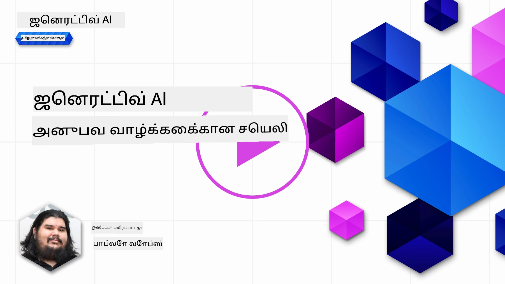
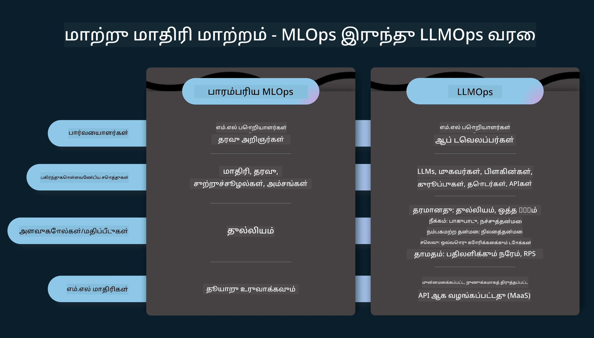
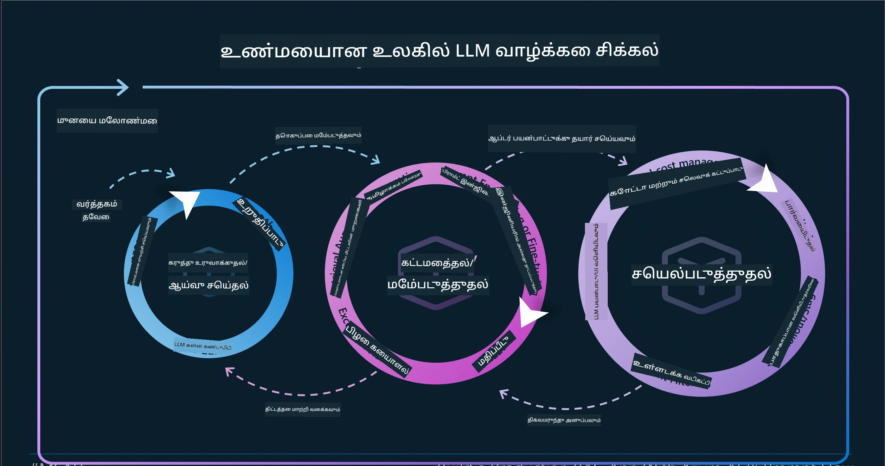
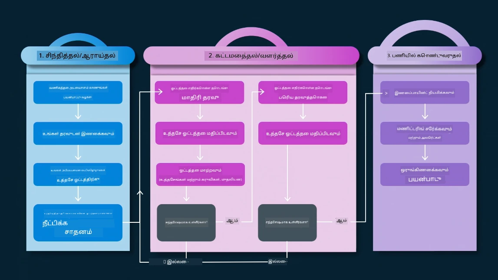
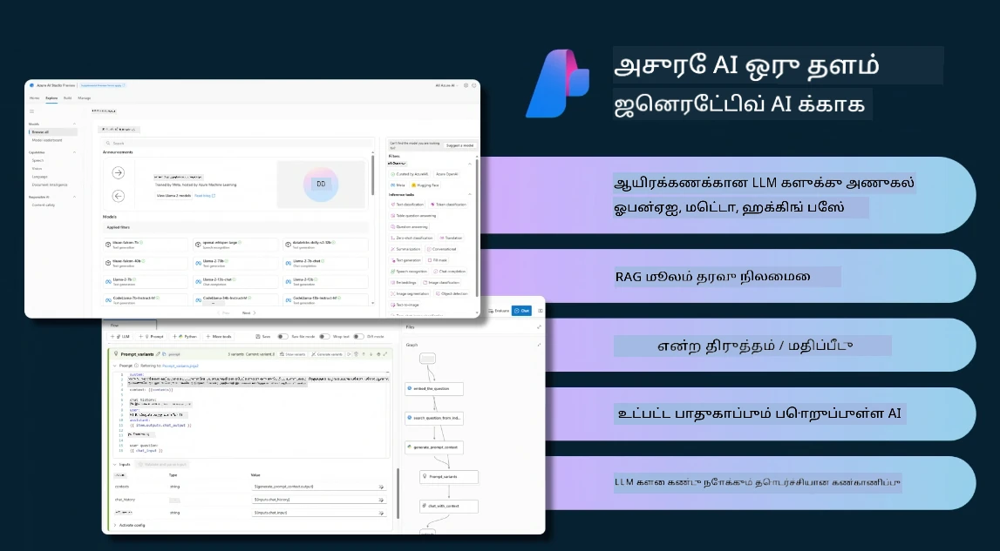
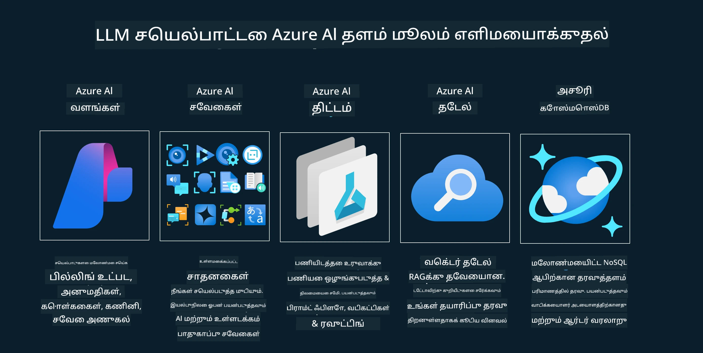
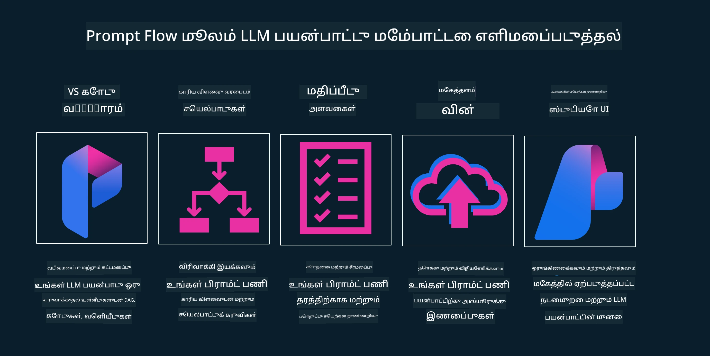

<!--
CO_OP_TRANSLATOR_METADATA:
{
  "original_hash": "df44972d5575ea8cef3c52ee31696d04",
  "translation_date": "2025-12-19T18:00:53+00:00",
  "source_file": "14-the-generative-ai-application-lifecycle/README.md",
  "language_code": "ta"
}
-->

# உருவாக்கும் AI பயன்பாட்டு வாழ்க்கைச் சுழற்சி

அனைத்து AI பயன்பாடுகளுக்கும் முக்கியமான கேள்வி AI அம்சங்களின் பொருத்தம் ஆகும், ஏனெனில் AI என்பது விரைவாக வளர்ந்து வரும் துறை, உங்கள் பயன்பாடு பொருத்தமானது, நம்பகமானது மற்றும் வலுவானதாக இருக்க வேண்டும் என்பதற்காக, அதை தொடர்ந்து கண்காணித்து, மதிப்பாய்வு செய்து, மேம்படுத்த வேண்டும். இதுவே உருவாக்கும் AI வாழ்க்கைச் சுழற்சியின் நோக்கம்.

உருவாக்கும் AI வாழ்க்கைச் சுழற்சி என்பது உருவாக்கும் AI பயன்பாட்டை உருவாக்குதல், வெளியிடுதல் மற்றும் பராமரிப்பதற்கான கட்டமைப்பாகும். இது உங்கள் இலக்குகளை வரையறுக்க, உங்கள் செயல்திறனை அளவிட, உங்கள் சவால்களை கண்டறிந்து, உங்கள் தீர்வுகளை அமல்படுத்த உதவுகிறது. மேலும், உங்கள் பயன்பாட்டை உங்கள் துறையின் மற்றும் பங்குதாரர்களின் நெறிமுறை மற்றும் சட்டத் தரநிலைகளுடன் ஒத்திசைக்க உதவுகிறது. உருவாக்கும் AI வாழ்க்கைச் சுழற்சியை பின்பற்றுவதன் மூலம், உங்கள் பயன்பாடு எப்போதும் மதிப்பை வழங்கி, உங்கள் பயனர்களை திருப்திப்படுத்துவதை உறுதி செய்யலாம்.

## அறிமுகம்

இந்த அத்தியாயத்தில், நீங்கள்:

- MLOps இலிருந்து LLMOps க்கு மாற்றத்தை புரிந்துகொள்ள
- LLM வாழ்க்கைச் சுழற்சி
- வாழ்க்கைச் சுழற்சி கருவிகள்
- வாழ்க்கைச் சுழற்சி அளவீடு மற்றும் மதிப்பாய்வு

## MLOps இலிருந்து LLMOps க்கு மாற்றத்தை புரிந்துகொள்ள

LLMகள் செயற்கை நுண்ணறிவின் புதிய கருவியாகும், அவை பயன்பாடுகளுக்கான பகுப்பாய்வு மற்றும் உருவாக்க பணிகளில் மிக சக்திவாய்ந்தவை, ஆனால் இந்த சக்தி AI மற்றும் பாரம்பரிய இயந்திரக் கற்றல் பணிகளை எவ்வாறு ஒழுங்குபடுத்துகிறோம் என்பதில் சில விளைவுகளை ஏற்படுத்துகிறது.

இதனால், இந்த கருவியை சரியான ஊக்கங்களுடன், இயக்கமுள்ள முறையில் ஏற்றுக்கொள்ள புதிய பாரடைகம் தேவை. பழைய AI பயன்பாடுகளை "ML பயன்பாடுகள்" என்றும் புதிய AI பயன்பாடுகளை "GenAI பயன்பாடுகள்" அல்லது "AI பயன்பாடுகள்" என்றும் வகைப்படுத்தலாம், அந்த காலத்தில் பயன்படுத்தப்பட்ட முக்கிய தொழில்நுட்பங்கள் மற்றும் முறைகளை பிரதிபலிக்கிறது. இது பல வழிகளில் நமது கதை சொல்லலை மாற்றுகிறது, கீழ்காணும் ஒப்பீட்டை பாருங்கள்.

LLMOps இல், நாம் பயன்பாட்டு டெவலப்பர்களுக்கு அதிக கவனம் செலுத்துகிறோம், ஒருங்கிணைப்புகளை முக்கிய புள்ளியாக பயன்படுத்துகிறோம், "Models-as-a-Service" ஐ பயன்படுத்துகிறோம் மற்றும் கீழ்காணும் அளவுகோல்களை நினைக்கிறோம்.

- தரம்: பதிலின் தரம்
- தீங்கு: பொறுப்பான AI
- நேர்மை: பதிலின் அடிப்படை (அர்த்தமா? அது சரியா?)
- செலவு: தீர்வு பட்ஜெட்
- தாமதம்: டோக்கன் பதிலுக்கான சராசரி நேரம்

## LLM வாழ்க்கைச் சுழற்சி

முதலில், வாழ்க்கைச் சுழற்சியை மற்றும் மாற்றங்களை புரிந்துகொள்ள, அடுத்த தகவல் படத்தை கவனியுங்கள்.

பார்க்கும் போது, இது MLOps இன் வழக்கமான வாழ்க்கைச் சுழற்சிகளிலிருந்து வேறுபட்டது. LLMகளுக்கு பல புதிய தேவைகள் உள்ளன, உதாரணமாக, ப்ராம்ப்டிங், தரத்தை மேம்படுத்த பல்வேறு தொழில்நுட்பங்கள் (Fine-Tuning, RAG, Meta-Prompts), பொறுப்பான AI உடன் மதிப்பீடு மற்றும் பொறுப்பு, கடைசியில் புதிய மதிப்பீட்டு அளவுகோல்கள் (தரம், தீங்கு, நேர்மை, செலவு மற்றும் தாமதம்).

உதாரணமாக, நாம் எப்படி யோசிக்கிறோம் என்பதை பாருங்கள். பல LLMகளை பயன்படுத்தி ப்ராம்ப்ட் இன்ஜினியரிங் மூலம் சாத்தியங்களை ஆராய்ந்து, அவர்களின் கருதுகோள் சரியானதா என்று சோதிக்கிறோம்.

இது நேர்காணல் அல்ல, ஆனால் ஒருங்கிணைந்த சுற்றுகள், மீண்டும் மீண்டும் செய்யப்படும் மற்றும் ஒரு மேல்நிலை சுழற்சி கொண்டது.

இந்த படிகளை எப்படி ஆராயலாம்? வாழ்க்கைச் சுழற்சியை எப்படி கட்டமைக்கலாம் என்பதை விரிவாக பார்ப்போம்.

இது கொஞ்சம் சிக்கலாக தோன்றலாம், முதலில் மூன்று பெரிய படிகளுக்கு கவனம் செலுத்துவோம்.

1. யோசனை/ஆராய்ச்சி: ஆராய்ச்சி, இங்கு நமது வணிக தேவைகளுக்கு ஏற்ப ஆராயலாம். ஒரு [PromptFlow](https://microsoft.github.io/promptflow/index.html?WT.mc_id=academic-105485-koreyst) உருவாக்கி, அது நமது கருதுகோளுக்கு போதுமானதா என்று சோதிக்கலாம்.
1. கட்டமைத்தல்/வளர்த்தல்: செயல்படுத்தல், இப்போது, பெரிய தரவுத்தொகுதிகளுக்கு மதிப்பாய்வு செய்து, Fine-tuning மற்றும் RAG போன்ற தொழில்நுட்பங்களை பயன்படுத்தி நமது தீர்வின் வலிமையை பரிசோதிக்கிறோம். அது வேலை செய்யாவிட்டால், அதை மீண்டும் செயல்படுத்துதல், புதிய படிகளை சேர்த்தல் அல்லது தரவை மறுசீரமைத்தல் உதவும். நமது பணிச்சூழல் மற்றும் அளவீடுகளை சோதித்த பிறகு, அது வேலை செய்தால் அடுத்த படிக்கு தயாராகும்.
1. செயல்படுத்தல்: ஒருங்கிணைப்பு, இப்போது கண்காணிப்பு மற்றும் எச்சரிக்கை அமைப்புகளை நமது அமைப்பில் சேர்த்து, பயன்பாட்டை வெளியிடுதல் மற்றும் ஒருங்கிணைத்தல்.

பிறகு, மேல்நிலை மேலாண்மை சுழற்சி உள்ளது, இது பாதுகாப்பு, ஒழுங்குமுறை மற்றும் ஆட்சி மீது கவனம் செலுத்துகிறது.

வாழ்த்துக்கள், இப்போது உங்கள் AI பயன்பாடு தயாராக செயல்பட தயாராக உள்ளது. கையடக்க அனுபவத்திற்கு, [Contoso Chat Demo.](https://nitya.github.io/contoso-chat/?WT.mc_id=academic-105485-koreys) ஐ பாருங்கள்.

இப்போது, எந்த கருவிகளை பயன்படுத்தலாம்?

## வாழ்க்கைச் சுழற்சி கருவிகள்

கருவிகளுக்காக, Microsoft [Azure AI Platform](https://azure.microsoft.com/solutions/ai/?WT.mc_id=academic-105485-koreys) மற்றும் [PromptFlow](https://microsoft.github.io/promptflow/index.html?WT.mc_id=academic-105485-koreyst) உங்கள் சுழற்சியை எளிதாக செயல்படுத்த உதவுகிறது.

[Azure AI Platform](https://azure.microsoft.com/solutions/ai/?WT.mc_id=academic-105485-koreys) மூலம், நீங்கள் [AI Studio](https://ai.azure.com/?WT.mc_id=academic-105485-koreys) ஐ பயன்படுத்தலாம். AI Studio என்பது ஒரு வலை தளம், இது மாதிரிகள், மாதிரிகள் மற்றும் கருவிகளை ஆராய அனுமதிக்கிறது. உங்கள் வளங்களை நிர்வகிக்க, UI மேம்பாட்டு பணிகள் மற்றும் SDK/CLI விருப்பங்களுடன் குறியீடு முதன்மை மேம்பாட்டை செய்ய உதவுகிறது.

Azure AI, பல வளங்களை பயன்படுத்தி, உங்கள் செயல்பாடுகள், சேவைகள், திட்டங்கள், வெக்டர் தேடல் மற்றும் தரவுத்தள தேவைகளை நிர்வகிக்க உதவுகிறது.

Proof-of-Concept(POC) முதல் பெரிய அளவிலான பயன்பாடுகள் வரை PromptFlow உடன் கட்டமைக்கவும்:

- VS Code இல் இருந்து பயன்பாடுகளை வடிவமைத்து கட்டமைக்கவும், காட்சி மற்றும் செயல்பாட்டு கருவிகளுடன்
- உங்கள் பயன்பாடுகளை தரமான AI க்காக சோதித்து நன்கு சரிசெய்யவும்.
- Azure AI Studio ஐ பயன்படுத்தி மேகத்துடன் ஒருங்கிணைத்து மீண்டும் செயல்படுத்தவும், விரைவான ஒருங்கிணைப்புக்கு Push மற்றும் Deploy செய்யவும்.

## அருமை! உங்கள் கற்றலை தொடருங்கள்!

அற்புதம், இப்போது [Contoso Chat App](https://nitya.github.io/contoso-chat/?WT.mc_id=academic-105485-koreyst) உடன் பயன்பாட்டை எப்படி கட்டமைக்கிறோம் என்பதை கற்றுக்கொள்ளுங்கள், கிளவுட் ஆதரவு அந்த கருத்துக்களை எப்படி காட்சிப்படுத்துகிறது என்பதை பாருங்கள். மேலும் உள்ளடக்கத்திற்கு, எங்கள் [Ignite பிரேக்அவுட் அமர்வு!](https://www.youtube.com/watch?v=DdOylyrTOWg) ஐ பாருங்கள்.

இப்போது, பாடம் 15 ஐ பாருங்கள், [Retrieval Augmented Generation மற்றும் Vector Databases](../15-rag-and-vector-databases/README.md?WT.mc_id=academic-105485-koreyst) உருவாக்கும் AI மீது எப்படி தாக்கம் செலுத்துகின்றன மற்றும் மேலும் ஈர்க்கக்கூடிய பயன்பாடுகளை உருவாக்க எப்படி உதவுகின்றன என்பதை புரிந்துகொள்ள!

---

<!-- CO-OP TRANSLATOR DISCLAIMER START -->
**குறிப்பு**:  
இந்த ஆவணம் AI மொழிபெயர்ப்பு சேவை [Co-op Translator](https://github.com/Azure/co-op-translator) மூலம் மொழிபெயர்க்கப்பட்டுள்ளது. நாங்கள் துல்லியத்திற்காக முயற்சித்தாலும், தானியங்கி மொழிபெயர்ப்புகளில் பிழைகள் அல்லது தவறுகள் இருக்கக்கூடும் என்பதை தயவுசெய்து கவனிக்கவும். அசல் ஆவணம் அதன் சொந்த மொழியில் அதிகாரப்பூர்வ மூலமாக கருதப்பட வேண்டும். முக்கியமான தகவல்களுக்கு, தொழில்முறை மனித மொழிபெயர்ப்பு பரிந்துரைக்கப்படுகிறது. இந்த மொழிபெயர்ப்பின் பயன்பாட்டால் ஏற்படும் எந்த தவறான புரிதல்கள் அல்லது தவறான விளக்கங்களுக்கு நாங்கள் பொறுப்பேற்கமாட்டோம்.
<!-- CO-OP TRANSLATOR DISCLAIMER END -->