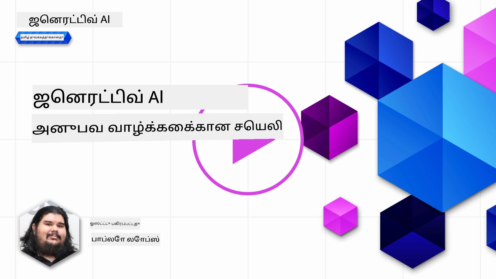
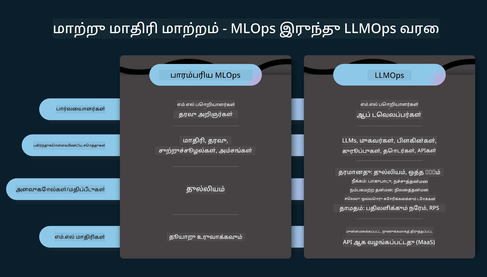
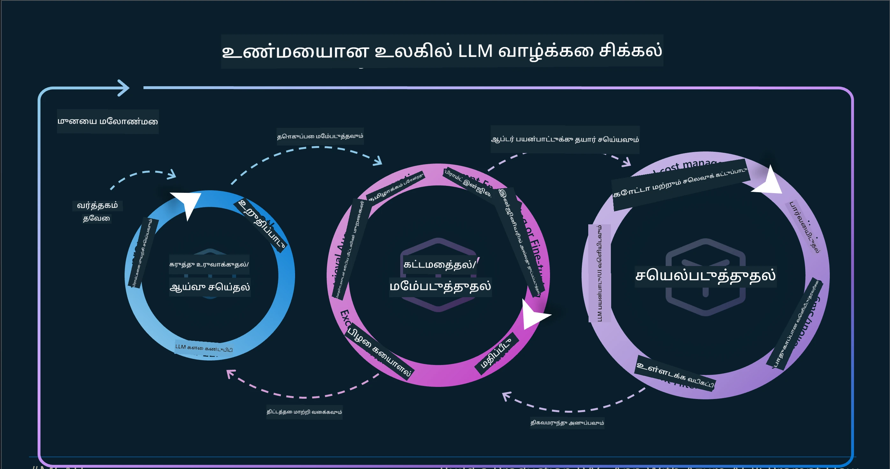
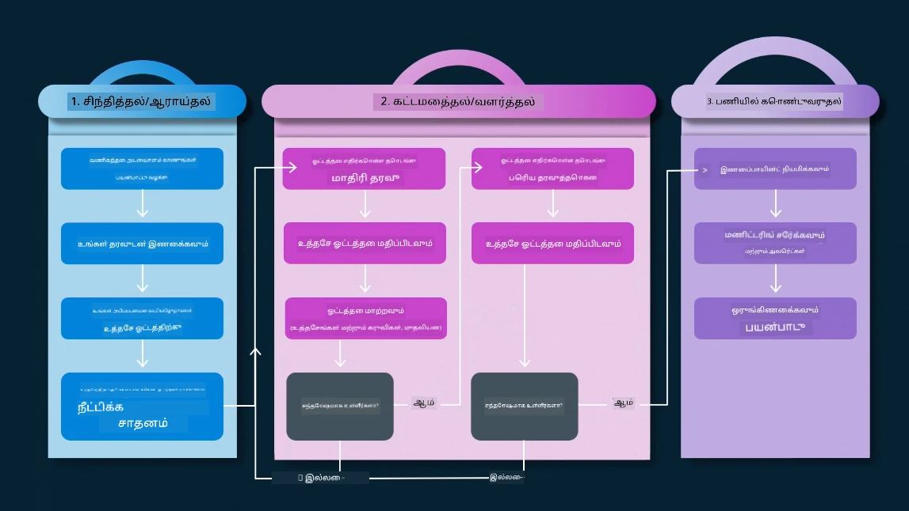
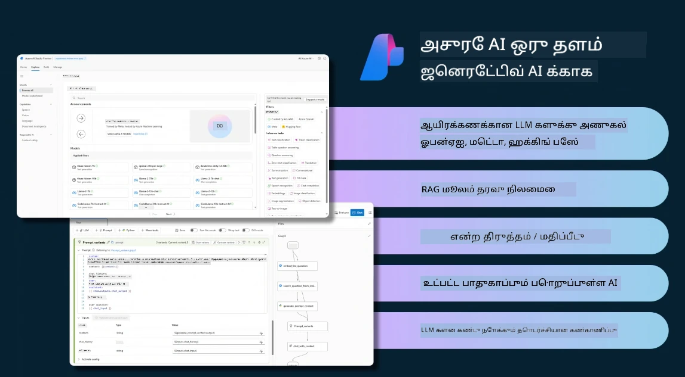
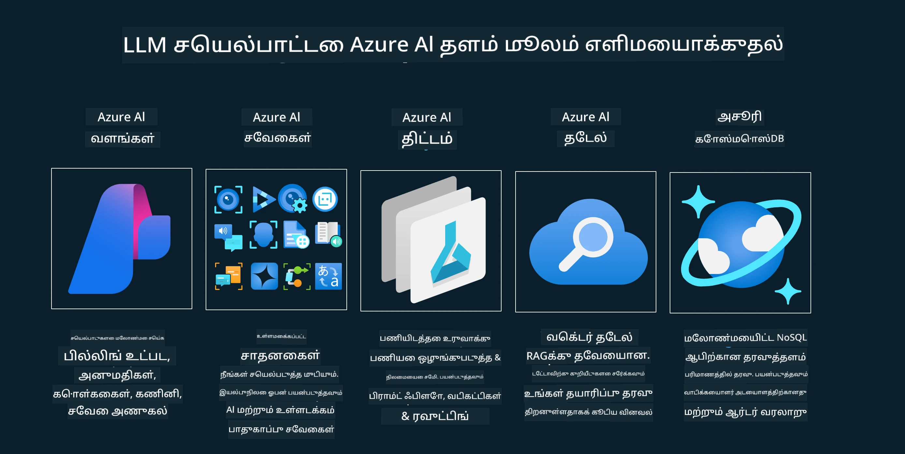
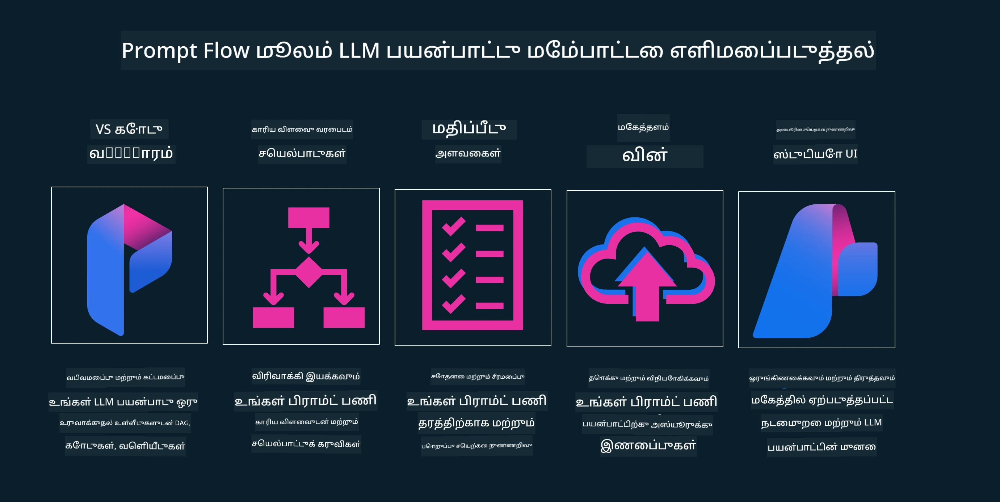

# ஜெனரேட்டிவ் AI பயன்பாட்டு வாழ்க்கைநிலை

எல்லா AI பயன்பாடுகளுக்கும் முக்கியமான கேள்வி என்பது AI அம்சங்களின் தொடர்புடைய தன்மை, ஏனெனில் AI என்பது வேகமாக மாறிக்கொண்டிருக்கும் துறையாகும், உங்கள் பயன்பாடு தொடர்புடையது, நம்பகமானது மற்றும் வலுவானதாக இருந்து வருவதற்கு, நீங்கள் அதனை தொடர்ந்து கண்காணிக்க வேண்டும், மதிப்பிட வேண்டும் மற்றும் மேம்படுத்த வேண்டும். இதுவே ஜெனரேட்டிவ் AI வாழ்க்கைநிலை பயன்படுத்தும் நோக்கம்.

ஜெனரேட்டிவ் AI வாழ்க்கைநிலை என்பது ஜெனரேட்டிவ் AI பயன்பாட்டை உருவாக்குதல், வெளியிடுதல் மற்றும் பராமரிப்பதன் பல்வேறு கட்டங்களை வழிகாட்டும் ஒரு கட்டமைப்பு. இது உங்கள் குறிக்கோள்களை வரையறுக்க உதவுகிறது, உங்கள் செயல்திறனை அளக்க உதவுகிறது, உங்கள் சவால்களை கண்டறிந்து, உங்கள் தீர்வுகளை நடைமுறைப்படுத்த உதவுகிறது. மேலும், உங்கள் பயன்பாட்டை உங்கள் துறையின் மற்றும் பங்குதாரர்களின் நெறிமுறை மற்றும் சட்ட தரநிலைகளுடன் ஒத்திசைக்கவும் உதவுகிறது. ஜெனரேட்டிவ் AI வாழ்க்கைநிலையை பின்பற்றுவதன் மூலம், உங்கள் பயன்பாடு எப்போதும் மதிப்பை வழங்கி, உங்கள் பயனர்களை திருப்திப்படுத்துவதை உறுதி செய்யலாம்.

## அறிமுகம்

இந்த அத்தியாயத்தில், நீங்கள்:

- MLOps-இல் இருந்து LLMOps-க்கு உள்ள பரிமாற்றத்தை புரிந்துகொள்ள
- LLM வாழ்க்கைநிலை
- வாழ்க்கைநிலை கருவிகள்
- வாழ்க்கைநிலை அளவீடு மற்றும் மதிப்பீடு

## MLOps-இல் இருந்து LLMOps-க்கு உள்ள பரிமாற்றத்தை புரிந்துகொள்ள

LLMகள் (பெரிய மொழி மாதிரிகள்) என்பது செயற்கை நுண்ணறிவு ஆயுதச்சட்டத்தில் புதிய கருவி, அவை பயன்பாடுகளுக்கான பகுப்பாய்வு மற்றும் உருவாக்க பணிகளில் மிக சக்திவாய்ந்தவை, இருப்பினும் இந்த சக்தி AI மற்றும் பாரம்பரிய இயந்திரம் கற்றல் பணிகளை எவ்வாறு எளிதாக்குகிறோம் என்று சில விளைவுகளை ஏற்படுத்துகிறது.

இதன் காரணமாக, இந்த கருவியை ஒரு தன்னியக்க முறையில், சரியான ஊக்கங்களுடன் பயன்படுத்த புதிய பரிமாற்றம் தேவையாகிறது. பழைய AI பயன்பாடுகளை "ML பயன்பாடுகள்" எனவும், புதிய AI பயன்பாடுகளை "GenAI பயன்பாடுகள்" அல்லது "AI பயன்பாடுகள்" எனவும் வகைப்படுத்தலாம், இது அந்த நேரத்தில் விரும்பத்தக்க தொழில்நுட்பம் மற்றும் முறைகளைக் காட்டுகிறது. இது நமது கதையை பல வழிகளில் மாற்றுகிறது, இதைப் பாருங்கள் கீழ்க்காணும் ஒப்புமையை.

LLMOps-இல், நாம் பயன்பாடு உருவாக்குநர்களுக்கே அதிக கவனம் செலுத்துகிறோம், ஒருங்கிணைப்புகளை முக்கிய புள்ளியாகக் கொண்டு, "மாதிரிகள்-ஒருவ-services" எனக் கருதி பின்வரும் அம்சங்களை மையப்படுத்துகிறோம்.

- தரம்: பதிலளிப்பின் தரம்
- சேதம்: பொறுப்பேற்ற AI
- நேர்மை: பதில் ஆதாரம் (அர்த்தமா? அது சரியா?)
- செலவு: தீர்வு பட்ஜெட்
- முறையேறு நேரம்: ஒரு டோகன் பதிலுக்கு சராசரி நேரம்

## LLM வாழ்க்கைநிலை

முதலில், வாழ்க்கைநிலையை மற்றும் மாற்றங்களை புரிந்து கொள்வதற்கு, அடுத்த தகவல் நகலை கவனியுங்கள்.

பாருங்கள், இது பாரம்பரிய MLOps வாழ்க்கைநிலைகளில் இருந்து வேறுபட்டது. LLMகள் பல புதிய தேவைகளை கொண்டுள்ளன, உதாரணமாக, ப்ராம்ப்டிங், தரத்தை மேம்படுத்துவதற்கான வெவ்வேறு நுட்பங்கள் (சீரமைப்பு, RAG, மெட்டா ப்ராம்ப்ட்கள்), பொறுப்பேற்ற AI உடன் வேறுபட்ட மதிப்பீடுகள் மற்றும் பொறுப்புகள், கடைசியில், புதிய மதிப்பீடு அளவைகள் (தரம், சேதம், நேர்மை, செலவு மற்றும் முறையேறு நேரம்).

உதாரணமாக, நாம் எப்படி யோசனை செய்கிறோம் என்பதை பார். ப்ராம்டு பொறியியல்முறையைப் பயன்படுத்தி பல LLMகளை முயற்சி செய்து, அவை ஹைப்போதிசிஸை சரி என சரிபார்க்கலாம் என்று பார்.

இது நேரியல் அல்ல, ஆனால் ஒருங்கிணைந்த வளைவுகள், பலமுறை முயற்சி செய்துவரும் ஓவரார்க்கிங் சுழற்சி.

இந்த படிகளைக் எப்படி ஆராயலாம்? வாழ்க்கைநிலையை எப்படி கட்டமைக்கலாம் என விரிவாக பார்ப்போம்.

சில பிறிது கடினமாக தோன்றலாம், முதலில் மூன்று பெரிய படிகளுக்கு கவனம் செலுத்துவோம்.

1. யோசனை/ஆராய்ச்சி: ஆராய்ச்சி, இங்கு நமது வணிக தேவைகளுக்கு ஏற்ப ஆராயலாம். புரோட்டோடைப் உருவாக்கி, [PromptFlow](https://microsoft.github.io/promptflow/index.html?WT.mc_id=academic-105485-koreyst) உருவாக்கி, அது நம் ஹைப்போதிசிஸுக்கு பயனுள்ளதாக இருக்கிறதா என பரிசோதிக்க.
2. கட்டமைத்தல்/வளர்த்தல்: நடைமுறைப்படுத்தல், இப்போது, பெரிய தரவுத்தொகையைக் கொண்டு மதிப்பீடு செய்ய தொடங்குகிறோம், சீரமைப்பு மற்றும் RAG போன்ற நுட்பங்களை முன்னிலைப்படுத்த, தீர்வின் வலிமையை பரிசோதிக்க. அது வேலை செய்யவில்லையெனில், மீண்டும் உருவாக்கி, புதிய படிகளைக் கையாண்டு அல்லது தரவுத்தளத்தை மறுசீரமைத்து முயற்சி செய்யலாம். நமது பணியினை மற்றும் அளவினைப் பரிசோதித்த பின், அது வேலை செய்தால், நமது அளவுகோல்களைச் சரிபார்த்து அடுத்த படிக்கு தயார்.
3. செயல்படுத்துதல்: ஒருங்கிணைப்பு, இப்போது கண்காணிப்பு மற்றும் அறிவிப்புக் கணக்குகளை நமது அமைப்பில் சேர்க்க, பயன்பாட்டிலும் ஒருங்கிணைக்கவும்.

பிறகு, மேல்நோக்கி அமைப்பு சுற்று உள்ளது, இது பாதுகாப்பு, ஒழுங்குமுறை மற்றும் நிர்வாகத்தில் கவனம் செலுத்துகிறது.

நன்றிகள்! இப்போது உங்கள் AI பயன்பாடு செயல்பாட்டிற்கு தயாராக உள்ளது. நேரடி அனுபவத்திற்காக, [Contoso சந்தை டெமோ.](https://nitya.github.io/contoso-chat/?WT.mc_id=academic-105485-koreyst) பார்க்கவும்.

இப்போது, எந்த கருவிகளை பயன்படுத்தலாம்?

## வாழ்க்கைநிலை கருவிகள்

கருவிகளுக்காக, Microsoft [Azure AI பிளாட்ஃபாரம்](https://azure.microsoft.com/solutions/ai/?WT.mc_id=academic-105485-koreyst) மற்றும் [PromptFlow](https://microsoft.github.io/promptflow/index.html?WT.mc_id=academic-105485-koreyst) உங்கள் சுழற்சியை எளிதாக்க செய்கிறது மற்றும் விரைவில் செயலாக்கத் தயாராக செய்கிறது.

[Azure AI பிளாட்ஃபாரம்](https://azure.microsoft.com/solutions/ai/?WT.mc_id=academic-105485-koreyst), நீங்கள் [AI ஸ்டுடியோ](https://ai.azure.com/?WT.mc_id=academic-105485-koreyst) பயன்படுத்த அனுமதிக்கிறது. AI ஸ்டுடியோ என்பது ஒரு வலைப்பதிவு, இது மாதிரிகள், மாதிரிகள் மற்றும் கருவிகளை ஆராயவும், உங்கள் வளங்களை நிர்வகிக்கவும், UI வளர்ச்சி ஓட்டங்களைக் கட்டுப்படுத்தவும், SDK/CLI விருப்பங்களுடன் குறியீடு முதன்மையான வளர்ச்சிக்கான வாயிலாக இருக்கிறது.

Azure AI, பல வளங்களை பயன்படுத்தும் வாய்ப்பு, உங்கள் செயல்பாடுகள், சேவைகள், திட்டங்கள், வெக்டர் தேடல் மற்றும் தரவுத்தள தேவைகளை நிர்வகிக்க.

சான்று-அனுசரிப்பு (POC) முதல் பெரிய அளவிலான பயன்பாடுகள் வரை PromptFlow-இல் கட்டமைக்கவும்:

- VS Code இல் இருந்து செயலிகளை வடிவமைத்து மற்றும் கட்டவும், காட்சி மற்றும் செயலாக்க கருவிகளுடன்
- உங்கள் செயலிகளின் தரமான AI பளுவுக்காக சோதனை செய்து சிறப்பாக மாற்றவும்.
- Azure AI ஸ்டுடியோவை பயன்படுத்தி மேகத்துடன் ஒருங்கிணைத்து ஐடியேட்டும், விரைவாக ஒருங்கிணைக்கவும்.

## சிறந்தது! உங்கள் கற்றலுக்கு தொடரவும்!

அற்புதம், இப்போது [Contoso சந்தை பயன்பாடு](https://nitya.github.io/contoso-chat/?WT.mc_id=academic-105485-koreyst) உடன் செயலியை எப்படி கட்டமைப்பது என்பதை மேலும் கற்றுக்கொள்ளவும், மேக ஆதரவாளர் அதில் எவ்வாறு கொள்கைகளை சேர்க்கிறது என்பதை பாருங்கள். கூடுதலான உள்ளடக்கத்திற்கு, எங்கள் [Ignite பிரேக்அவுட் அமர்வைக்](https://www.youtube.com/watch?v=DdOylyrTOWg) காணவும்!

இப்போது, பாடம் 15 ஐ பாருங்கள், எப்படி [Retrieval Augmented Generation மற்றும் வெக்டர் தரவுத்தளங்கள்](../15-rag-and-vector-databases/README.md?WT.mc_id=academic-105485-koreyst) ஜெனரேட்டிவ் AI வில் தாக்கம் செலுத்துகின்றன மற்றும் மேலும் ஈர்க்கக்கூடிய பயன்பாடுகளை உருவாக்குகின்றன என்பதை அறிய!

---

<!-- CO-OP TRANSLATOR DISCLAIMER START -->
**சொல்லாக்குறிப்பு**:  
இந்த ஆவணம் AI மொழிபெயர்ப்பு சேவை [Co-op Translator](https://github.com/Azure/co-op-translator) மூலம் மொழிபெயர்க்கப்பட்டது. நாங்கள் துல்லியத்திற்காக முயலுகின்றோம் என்றாலும், தானாகும் மொழிபெயர்ப்பில் பிழைகள் அல்லது தவறுகள் இருக்கக்கூடும் என்பதை தயவுசெய்து கவனிக்கவும். உள்ளூர்மொழியில் உள்ள அசல் ஆவணம் அதிகாரப்பூர்வ வினாடி ஆகும். முக்கியமான தகவல்களுக்கு, தொழில்முறை மனித மொழிபெயர்ப்பை பரிந்துரைக்கப்படுகிறது. இந்த மொழிபெயர்ப்பை பயன்படுத்துவதிலிருந்து ஏற்பட்ட எந்த தவறான புரிதல்களுக்கும் அல்லது தவறான விளக்கங்களுக்குமான பொறுப்பு நாங்கள் ஏற்கவில்லை.
<!-- CO-OP TRANSLATOR DISCLAIMER END -->