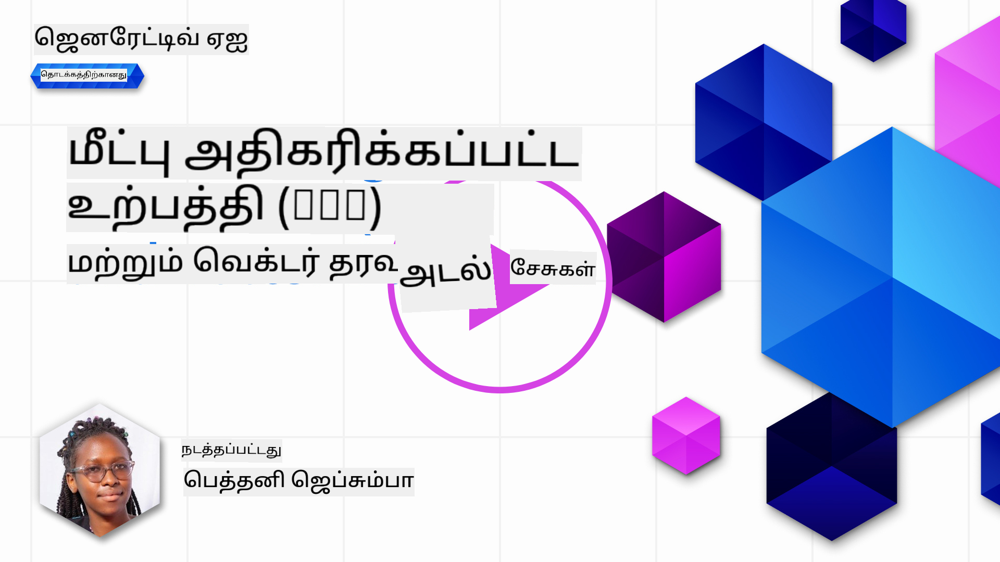
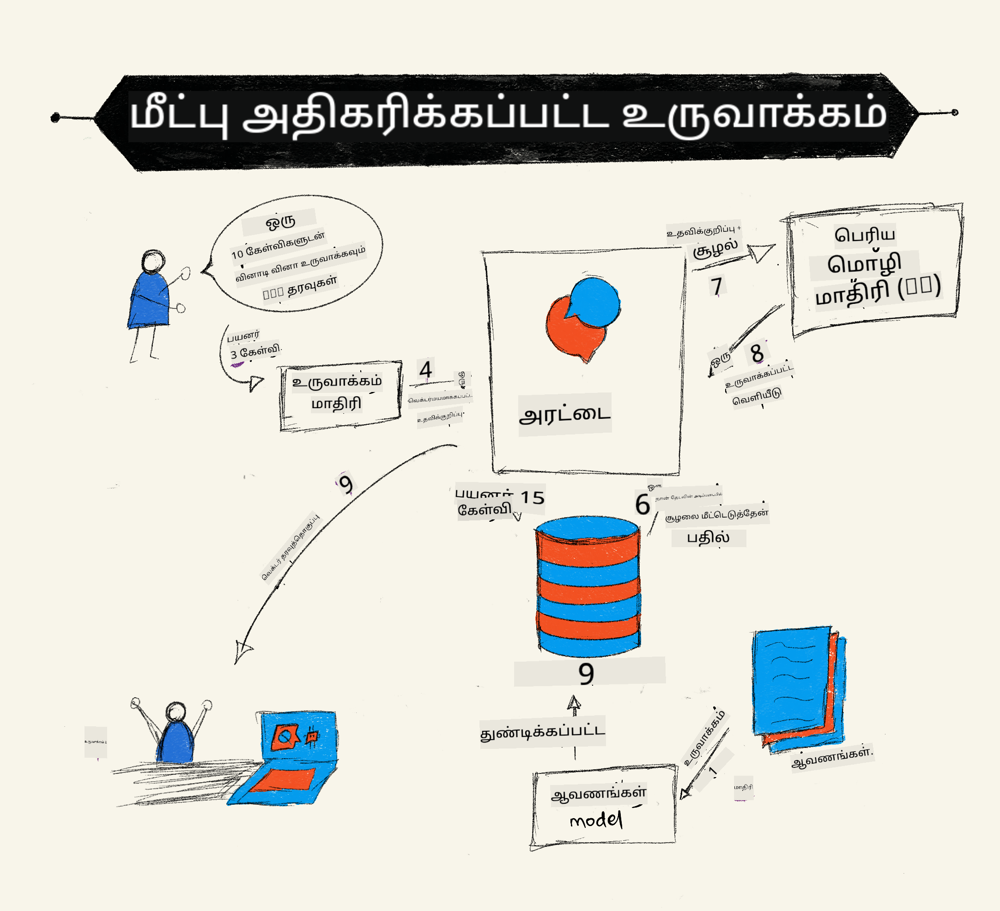
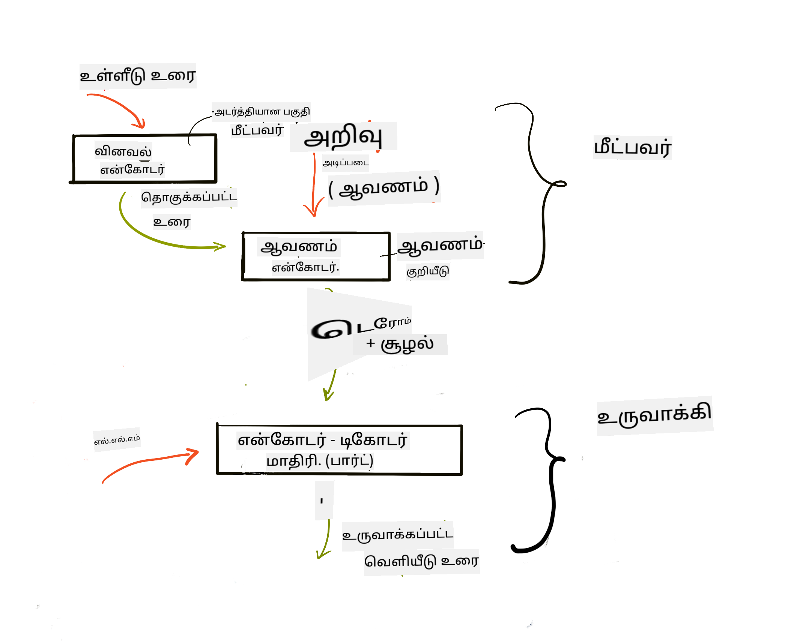
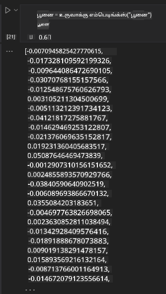

<!--
CO_OP_TRANSLATOR_METADATA:
{
  "original_hash": "b4b0266fbadbba7ded891b6485adc66d",
  "translation_date": "2025-10-18T02:39:14+00:00",
  "source_file": "15-rag-and-vector-databases/README.md",
  "language_code": "ta"
}
-->
# மீட்பு அதிகரிக்கப்பட்ட உருவாக்கம் (RAG) மற்றும் வெக்டர் தரவுத்தொகுப்புகள்

[](https://youtu.be/4l8zhHUBeyI?si=BmvDmL1fnHtgQYkL)

தேடல் பயன்பாடுகள் பாடத்தில், உங்கள் சொந்த தரவுகளை பெரிய மொழி மாதிரிகளில் (LLMs) ஒருங்கிணைப்பது எப்படி என்பதை சுருக்கமாக கற்றுக்கொண்டோம். இந்த பாடத்தில், உங்கள் LLM பயன்பாட்டில் தரவுகளை நிலைப்படுத்தும் கருத்துக்கள், செயல்முறை இயந்திரங்கள் மற்றும் எம்பெடிங்குகள் மற்றும் உரை ஆகியவற்றைச் சேமிக்கும் முறைகள் குறித்து மேலும் ஆராய்வோம்.

> **வீடியோ விரைவில் வரும்**

## அறிமுகம்

இந்த பாடத்தில் நாம் பின்வருவனவற்றை கற்றுக்கொள்வோம்:

- RAG பற்றிய அறிமுகம், அது என்ன மற்றும் ஏன் AI (கணினி நுண்ணறிவு) இல் பயன்படுத்தப்படுகிறது.

- வெக்டர் தரவுத்தொகுப்புகள் என்ன என்பதைப் புரிந்து கொண்டு, எங்கள் பயன்பாட்டிற்காக ஒன்றை உருவாக்குதல்.

- RAG ஐ ஒரு பயன்பாட்டில் ஒருங்கிணைப்பது எப்படி என்பதைப் பற்றிய நடைமுறை உதாரணம்.

## கற்றல் இலக்குகள்

இந்த பாடத்தை முடித்த பிறகு, நீங்கள்:

- தரவின் மீட்பு மற்றும் செயலாக்கத்தில் RAG இன் முக்கியத்துவத்தை விளக்க முடியும்.

- RAG பயன்பாட்டை அமைத்து உங்கள் தரவுகளை LLM க்கு நிலைப்படுத்த முடியும்.

- LLM பயன்பாடுகளில் RAG மற்றும் வெக்டர் தரவுத்தொகுப்புகளை திறமையாக ஒருங்கிணைக்க முடியும்.

## எங்கள் சூழல்: எங்கள் சொந்த தரவுகளை எங்கள் LLM களுடன் மேம்படுத்துதல்

இந்த பாடத்திற்காக, கல்வி தொடக்க நிறுவனத்தில் எங்கள் சொந்த குறிப்புகளைச் சேர்க்க விரும்புகிறோம், இது chatbot க்கு பல்வேறு பாடங்களில் கூடுதல் தகவல்களைப் பெற உதவுகிறது. எங்களிடம் உள்ள குறிப்புகளைப் பயன்படுத்தி, கற்றல் பயில்பவர்கள் சிறந்த முறையில் படிக்கவும், பல்வேறு தலைப்புகளைப் புரிந்துகொள்ளவும், தங்கள் தேர்வுகளுக்கு ஆய்வு செய்ய எளிதாகவும் முடியும். எங்கள் சூழலை உருவாக்க, நாங்கள் பின்வருவனவற்றைப் பயன்படுத்துவோம்:

- `Azure OpenAI:` chatbot ஐ உருவாக்க பயன்படுத்தப்படும் LLM

- `AI for beginners' lesson on Neural Networks`: எங்கள் LLM ஐ நிலைப்படுத்த பயன்படுத்தப்படும் தரவு

- `Azure AI Search` மற்றும் `Azure Cosmos DB:` எங்கள் தரவுகளைச் சேமிக்கவும் தேடல் குறியீட்டை உருவாக்கவும் பயன்படுத்தப்படும் வெக்டர் தரவுத்தொகுப்பு

பயனர்கள் தங்கள் குறிப்புகளிலிருந்து பயிற்சி வினாடி வினாக்களை உருவாக்கவும், ஆய்வு ஃப்ளாஷ் கார்டுகளை உருவாக்கவும், அதை சுருக்கமான கண்ணோட்டங்களாக சுருக்கவும் முடியும். தொடங்க, RAG என்ன மற்றும் அது எப்படி வேலை செய்கிறது என்பதைப் பார்ப்போம்:

## மீட்பு அதிகரிக்கப்பட்ட உருவாக்கம் (RAG)

ஒரு LLM இயக்கப்படும் chatbot பயனர் கேள்விகளை செயலாக்கி பதில்களை உருவாக்குகிறது. இது தொடர்புடையதாக வடிவமைக்கப்பட்டுள்ளது மற்றும் பல்வேறு தலைப்புகளில் பயனர்களுடன் ஈடுபடுகிறது. இருப்பினும், அதன் பதில்கள் வழங்கப்பட்ட சூழலுக்கும் அதன் அடிப்படை பயிற்சி தரவுக்கும் மட்டுமே வரையறுக்கப்பட்டுள்ளன. உதாரணமாக, GPT-4 இன் அறிவு நிறுத்தம் செப்டம்பர் 2021 ஆகும், அதாவது, இந்த காலத்திற்குப் பிறகு நிகழ்ந்த நிகழ்வுகள் பற்றிய அறிவு இல்லை. மேலும், LLM களைப் பயிற்றுவிக்க பயன்படுத்தப்படும் தரவுகள் தனிப்பட்ட குறிப்புகள் அல்லது ஒரு நிறுவனத்தின் தயாரிப்பு கையேடு போன்ற ரகசிய தகவல்களை தவிர்க்கின்றன.

### RAGs (மீட்பு அதிகரிக்கப்பட்ட உருவாக்கம்) எப்படி வேலை செய்கிறது



உங்கள் குறிப்புகளிலிருந்து வினாடி வினாக்களை உருவாக்கும் chatbot ஐ நீங்கள் வெளியிட விரும்பினால், அறிவு அடிப்படைக்கு ஒரு இணைப்பை தேவைப்படும். இதுதான் RAG உதவிக்கு வரும் இடம். RAGs பின்வருமாறு செயல்படுகிறது:

- **அறிவு அடிப்படை:** மீட்பு செய்யும் முன், இந்த ஆவணங்கள் சுருக்கமாக்கப்பட்டு, பொதுவாக பெரிய ஆவணங்களை சிறிய துண்டுகளாக உடைத்து, அவற்றை உரை எம்பெடிங்காக மாற்றி தரவுத்தொகுப்பில் சேமிக்க வேண்டும்.

- **பயனர் கேள்வி:** பயனர் ஒரு கேள்வியை கேட்கிறார்

- **மீட்பு:** பயனர் ஒரு கேள்வியை கேட்கும்போது, எம்பெடிங் மாடல் எங்கள் அறிவு அடிப்படையிலிருந்து தொடர்புடைய தகவல்களை மீட்டெடுத்து, கேள்வியில் சேர்க்கப்படும் கூடுதல் சூழலுடன் பதிலை மேம்படுத்துகிறது.

- **அதிகரிக்கப்பட்ட உருவாக்கம்:** LLM மீட்டெடுக்கப்பட்ட தரவின் அடிப்படையில் அதன் பதிலை மேம்படுத்துகிறது. இது முன் பயிற்சியளிக்கப்பட்ட தரவின் அடிப்படையில் மட்டுமல்லாமல், சேர்க்கப்பட்ட சூழலிலிருந்து தொடர்புடைய தகவலின் அடிப்படையிலும் பதிலை உருவாக்க அனுமதிக்கிறது. மீட்டெடுக்கப்பட்ட தரவம் LLM இன் பதில்களை அதிகரிக்க பயன்படுத்தப்படுகிறது. LLM பின்னர் பயனர் கேள்விக்கு பதிலளிக்கிறது.



RAGs இன் கட்டமைப்பு இரண்டு பகுதிகளைக் கொண்ட டிரான்ஸ்ஃபார்மர்களைப் பயன்படுத்தி செயல்படுத்தப்படுகிறது: ஒரு என்கோடர் மற்றும் ஒரு டிகோடர். உதாரணமாக, பயனர் ஒரு கேள்வியை கேட்கும்போது, உள்ளீட்டு உரை 'என்கோட்' செய்யப்படுகிறது, இது வார்த்தைகளின் அர்த்தத்தைப் பிடிக்கும் வெக்டர்களாக மாற்றப்படுகிறது, மேலும் வெக்டர்கள் 'டிகோட்' செய்யப்படுகின்றன, எங்கள் ஆவண குறியீட்டில் உருவாக்கப்பட்ட புதிய உரையை உருவாக்குகிறது. LLM பயனர் கேள்வியின் அடிப்படையில் வெளியீட்டை உருவாக்க என்கோடர்-டிகோடர் மாடலைப் பயன்படுத்துகிறது.

[RAG-Sequence மற்றும் RAG-Token பற்றிய ஆய்வுக் கட்டுரை](https://arxiv.org/pdf/2005.11401.pdf?WT.mc_id=academic-105485-koreyst) படி RAG ஐ செயல்படுத்தும் போது இரண்டு அணுகுமுறைகள் உள்ளன:

- **_RAG-Sequence_** மீட்டெடுக்கப்பட்ட ஆவணங்களைப் பயன்படுத்தி பயனர் கேள்விக்கு சிறந்த பதிலை கணிக்கிறது

- **RAG-Token** ஆவணங்களைப் பயன்படுத்தி அடுத்த டோக்கனை உருவாக்குகிறது, பின்னர் அவற்றை மீட்டெடுத்து பயனர் கேள்விக்கு பதிலளிக்கிறது

### ஏன் RAGs ஐ பயன்படுத்த வேண்டும்?

- **தகவல் செறிவு:** உரை பதில்கள் தற்போதையவை மற்றும் தற்போதையவை என்பதை உறுதிப்படுத்துகிறது. எனவே, உள்நாட்டு அறிவு அடிப்படையை அணுகுவதன் மூலம் டொமைன் குறிப்பிட்ட பணிகளில் செயல்திறனை மேம்படுத்துகிறது.

- **உண்மைத் தரவுகளை** பயன்படுத்துவதன் மூலம் உருவாக்கத்தை குறைக்கிறது, இது பயனர் கேள்விகளுக்கு சூழலை வழங்குகிறது.

- LLM ஐ நன்றாகத் தகுக்குவதற்கான செலவுடன் ஒப்பிடுகையில், இது **செலவுச்செலுத்தல்** ஆகும்.

## அறிவு அடிப்படையை உருவாக்குதல்

எங்கள் பயன்பாடு எங்கள் தனிப்பட்ட தரவின் அடிப்படையில் உள்ளது, அதாவது, AI For Beginners பாடத்திட்டத்தில் உள்ள நரம்பு வலைப்பின்னல் பாடம்.

### வெக்டர் தரவுத்தொகுப்புகள்

சாதாரண தரவுத்தொகுப்புகளுக்கு மாறாக, வெக்டர் தரவுத்தொகுப்பு என்பது எம்பெடிங் வெக்டர்களை சேமிக்க, நிர்வகிக்க மற்றும் தேடுவதற்காக வடிவமைக்கப்பட்ட ஒரு சிறப்பு தரவுத்தொகுப்பாகும். இது ஆவணங்களின் எண் பிரதிநிதித்துவங்களை சேமிக்கிறது. தரவுகளை எண் எம்பெடிங்குகளாக உடைத்தல் எங்கள் AI அமைப்பிற்கு தரவுகளைப் புரிந்து கொள்ளவும் செயல்படுத்தவும் எளிதாக ஆகிறது.

LLM கள் உள்ளீடாக ஏற்றுக்கொள்ளும் டோக்கன்களின் எண்ணிக்கைக்கு ஒரு வரம்பு உள்ளதால், எங்கள் எம்பெடிங்குகளை வெக்டர் தரவுத்தொகுப்புகளில் சேமிக்கிறோம். நீங்கள் முழு எம்பெடிங்குகளை LLM க்கு அனுப்ப முடியாது, எனவே அவற்றை துண்டுகளாக உடைக்க வேண்டும், மேலும் பயனர் ஒரு கேள்வியை கேட்கும்போது, கேள்விக்கு மிகவும் ஒத்த எம்பெடிங்குகள் ப்ராம்ப்டுடன் சேர்த்து திருப்பி அனுப்பப்படும். துண்டாக்குதல் LLM வழியாக அனுப்பப்படும் டோக்கன்களின் எண்ணிக்கையில் செலவுகளை குறைக்கிறது.

Azure Cosmos DB, Clarifyai, Pinecone, Chromadb, ScaNN, Qdrant மற்றும் DeepLake போன்ற பிரபலமான வெக்டர் தரவுத்தொகுப்புகள் உள்ளன. Azure CLI ஐப் பயன்படுத்தி Azure Cosmos DB மாடலை பின்வரும் கட்டளையைப் பயன்படுத்தி உருவாக்கலாம்:

```bash
az login
az group create -n <resource-group-name> -l <location>
az cosmosdb create -n <cosmos-db-name> -r <resource-group-name>
az cosmosdb list-keys -n <cosmos-db-name> -g <resource-group-name>
```

### உரையிலிருந்து எம்பெடிங்குகளுக்கு

எங்கள் தரவுகளை சேமிக்குமுன், அதை வெக்டர் எம்பெடிங்குகளாக மாற்றி தரவுத்தொகுப்பில் சேமிக்க வேண்டும். நீங்கள் பெரிய ஆவணங்கள் அல்லது நீண்ட உரைகளுடன் வேலை செய்கிறீர்கள் என்றால், நீங்கள் எதிர்பார்க்கும் கேள்விகளின் அடிப்படையில் அவற்றை துண்டாக்கலாம். துண்டாக்கல் வாக்கிய மட்டத்தில் அல்லது பத்தி மட்டத்தில் செய்யலாம். துண்டாக்கல் சுற்றியுள்ள வார்த்தைகளிலிருந்து அர்த்தங்களை பெறுவதால், ஒரு ஆவணத்தின் தலைப்பைச் சேர்த்தல் அல்லது ஒரு துண்டுக்கு முன் அல்லது பின் சில உரைகளைச் சேர்த்தல் போன்ற சில பிற சூழல்களை ஒரு துண்டில் சேர்க்கலாம். தரவுகளை பின்வருமாறு துண்டாக்கலாம்:

```python
def split_text(text, max_length, min_length):
    words = text.split()
    chunks = []
    current_chunk = []

    for word in words:
        current_chunk.append(word)
        if len(' '.join(current_chunk)) < max_length and len(' '.join(current_chunk)) > min_length:
            chunks.append(' '.join(current_chunk))
            current_chunk = []

    # If the last chunk didn't reach the minimum length, add it anyway
    if current_chunk:
        chunks.append(' '.join(current_chunk))

    return chunks
```

துண்டாக்கப்பட்ட பிறகு, எங்கள் உரையை வெவ்வேறு எம்பெடிங் மாடல்களைப் பயன்படுத்தி எம்பெட் செய்யலாம். நீங்கள் பயன்படுத்தக்கூடிய சில மாடல்கள்: word2vec, ada-002 by OpenAI, Azure Computer Vision மற்றும் பல. நீங்கள் பயன்படுத்தும் மொழிகள், குறியாக்கப்படும் உள்ளடக்கத்தின் வகை (உரை/படங்கள்/ஆடியோ), குறியாக்கம் செய்யக்கூடிய உள்ளீட்டின் அளவு மற்றும் எம்பெடிங் வெளியீட்டின் நீளம் ஆகியவற்றின் அடிப்படையில் எந்த மாடலைப் பயன்படுத்த வேண்டும் என்பதைத் தேர்ந்தெடுக்க வேண்டும்.

OpenAI இன் `text-embedding-ada-002` மாடலைப் பயன்படுத்தி எம்பெட் செய்யப்பட்ட உரையின் ஒரு உதாரணம்:


## மீட்பு மற்றும் வெக்டர் தேடல்

பயனர் ஒரு கேள்வியை கேட்கும்போது, ரிட்ரீவர் கேள்வி என்கோடரைப் பயன்படுத்தி அதை ஒரு வெக்டராக மாற்றுகிறது, பின்னர் உள்ளீட்டுடன் தொடர்புடைய ஆவண தேடல் குறியீட்டில் உள்ள தொடர்புடைய வெக்டர்களைத் தேடுகிறது. முடிந்தவுடன், அது உள்ளீட்டு வெக்டர் மற்றும் ஆவண வெக்டர்களை உரையாக மாற்றி LLM வழியாக அனுப்புகிறது.

### மீட்பு

மீட்பு என்பது தேடல் அளவுகோலங்களை பூர்த்தி செய்யும் ஆவணங்களை குறியீட்டிலிருந்து விரைவாகக் கண்டறிய முயற்சிக்கும் போது நிகழ்கிறது. ரிட்ரீவரின் நோக்கம், உங்கள் தரவின் அடிப்படையில் LLM ஐ நிலைப்படுத்தவும், பயனரின் கேள்விகளுக்கு சூழலை வழங்கவும் பயன்படுத்தப்படும் ஆவணங்களைப் பெறுவது.

எங்கள் தரவுத்தொகுப்பில் தேடலைச் செய்ய பல வழிகள் உள்ளன:

- **முக்கிய வார்த்தை தேடல்** - உரை தேடல்களுக்கு பயன்படுத்தப்படுகிறது

- **செமாண்டிக் தேடல்** - வார்த்தைகளின் செமாண்டிக் அர்த்தத்தைப் பயன்படுத்துகிறது

- **வெக்டர் தேடல்** - எம்பெடிங் மாடல்களைப் பயன்படுத்தி ஆவணங்களை உரையிலிருந்து வெக்டர் பிரதிநிதித்துவங்களாக மாற்றுகிறது. பயனர் கேள்விக்கு மிகவும் அருகிலுள்ள ஆவணங்களை கேள்வி செய்வதன் மூலம் மீட்பு செய்யப்படும்.

- **கலப்பு** - முக்கிய வார்த்தை மற்றும் வெக்டர் தேடலின் கலவையாகும்.

மீட்பில் சவாலாக இருப்பது, தரவுத்தொகுப்பில் கேள்விக்கு ஒத்த பதில் இல்லாதபோது வருகிறது, அப்போது அமைப்பு கிடைக்கும் சிறந்த தகவல்களை திருப்பி அனுப்பும், இருப்பினும், தொடர்புடையதற்கான அதிகபட்ச தூரத்தை அமைத்தல் அல்லது முக்கிய வார்த்தைகள் மற்றும் வெக்டர் தேடலின் கலவையான கலப்பு தேடலைப் பயன்படுத்துதல் போன்ற யுக்திகளை நீங்கள் பயன்படுத்தலாம். இந்த பாடத்தில், முக்கிய வார்த்தை மற்றும் வெக்டர் தேடலின் கலவையான கலப்பு தேடலைப் பயன்படுத்துவோம். எங்கள் தரவுகளை துண்டுகளையும் எம்பெடிங்குகளையும் கொண்ட ஒரு டேட்டாபிரேமில் சேமிப்போம்.

### வெக்டர் ஒற்றுமை

ரிட்ரீவர் அறிவு தரவுத்தொகுப்பில் உள்ள எம்பெடிங்குகளை தேடுகிறது, அவை ஒன்றுக்கொன்று அருகிலுள்ளவை, மிக அருகிலுள்ள அயலவர்கள், ஏனெனில் அவை ஒத்த உரைகள். ஒரு பயனர் ஒரு கேள்வியை கேட்கும் சூழலில், அது முதலில் எம்பெட் செய்யப்படுகிறது, பின்னர் ஒத்த எம்பெடிங்குகளுடன் பொருந்துகிறது. வெக்டர்களுக்கு இடையிலான கோணத்தின் அடிப்படையில், வெவ்வேறு வெக்டர்கள் எவ்வளவு ஒத்தவை என்பதை கண்டறிய பொதுவாக பயன்படுத்தப்படும் அளவீடு கோசைன் ஒற்றுமையாகும்.

ஒற்றுமையை அளவிட, வெக்டர் முடிவுகளுக்கு இடையிலான நேர்கோடு olan Euclidean distance அல்லது இரண்டு வெக்டர்களின் பொருந்தும் கூறுகளின் உற்பத்திகளின் தொகையை அளவிடும் dot product போன்ற மாற்றுகளைப் பயன்படுத்தலாம்.

### தேடல் குறியீடு

மீட்பு செய்யும்போது, தேடலைச் செய்யும் முன் எங்கள் அறிவு அடிப்படைக்கான தேடல் குறியீட்டை உருவாக்க வேண்டும். ஒரு குறியீடு எங்கள் எம்பெடிங்குகளை சேமித்து, பெரிய தரவுத்தொகுப்பிலும் மிகவும் ஒத்த துண்டுகளை விரைவாக மீட்டெடுக்க முடியும். எங்கள் குறியீட்டை உள்ளூர் அளவில் பின்வருமாறு உருவாக்கலாம்:

```python
from sklearn.neighbors import NearestNeighbors

embeddings = flattened_df['embeddings'].to_list()

# Create the search index
nbrs = NearestNeighbors(n_neighbors=5, algorithm='ball_tree').fit(embeddings)

# To query the index, you can use the kneighbors method
distances, indices = nbrs.kneighbors(embeddings)
```

### மறுதிருத்தம்

தரவுத்தொகுப்பை நீங்கள் கேள்வி செய்த பிறகு, மிகவும் தொடர்புடையவற்றிலிருந்து முடிவுகளை வரிசைப்படுத்த வேண்டியிருக்கும். ஒரு மறுதிருத்த LLM, தேடல் முடிவுகளின் தொடர்பை மேம்படுத்த மெஷின் லெர்னிங் ஐப் பயன்படுத்தி அவற்றை மிகவும் தொடர்புடையதாக வரிசைப்படுத்துகிறது. Azure AI Search ஐப் பயன்படுத்தி, மறுதிருத்தம் தானாகவே செமாண்டிக் மறுதிருத்தியைப் பயன்படுத்தி உங்களுக்காக செய்யப்படும். மிக அருகிலுள்ள அயலவர்கள் பயன்படுத்தி மறுதிருத்தம் எப்படி வேலை செய்கிறது என்பதற்கான ஒரு உதாரணம்:

```python
# Find the most similar documents
distances, indices = nbrs.kneighbors([query_vector])

index = []
# Print the most similar documents
for i in range(3):
    index = indices[0][i]
    for index in indices[0]:
        print(flattened_df['chunks'].iloc[index])
        print(flattened_df['path'].iloc[index])
        print(flattened_df['distances'].iloc[index])
    else:
        print(f"Index {index} not found in DataFrame")
```

## அனைத்தையும் ஒன்றாக இணைத்தல்

கடைசி படி, எங்கள் LLM ஐ சேர்த்து, எங்கள் தரவின் அடிப்படையில் நிலைப்படுத்தப்பட்ட பதில்களைப் பெற முடியும். அதை பின்வருமாறு செயல்படுத்தலாம்:

```python
user_input = "what is a perceptron?"

def chatbot(user_input):
    # Convert the question to a query vector
    query_vector = create_embeddings(user_input)

    # Find the most similar documents
    distances, indices = nbrs.kneighbors([query_vector])

    # add documents to query  to provide context
    history = []
    for index in indices[0]:
        history.append(flattened_df['chunks'].iloc[index])

    # combine the history and the user input
    history.append(user_input)

    # create a message object
    messages=[
        {"role": "system", "content": "You are an AI assistant that helps with AI questions."},
        {"role": "user", "content": history[-1]}
    ]

    # use chat completion to generate a response
    response = openai.chat.completions.create(
        model="gpt-4",
        temperature=0.7,
        max_tokens=800,
        messages=messages
    )

    return response.choices[0].message

chatbot(user_input)
```

## எங்கள் பயன்பாட்டை மதிப்பீடு செய்தல்

### மதிப்பீட்டு அளவுகோல்கள்

- வழங்கப்பட்ட பதில்களின் தரம், அது இயல்பாகவும், சீராகவும், மனிதனுக்கு ஒத்ததாகவும் இருக்கிறதா என்பதை உறுதிப்படுத்துதல்

- தரவின் நிலைப்படுத்தல்: வழங்கப்பட்ட ஆவணங்களில் இருந்து வந்த பதிலை மதிப்பீடு செய்தல்

- தொடர்பு: பதில் கேள்விக்கு பொருந்துகிறது மற்றும் தொடர்புடையது என்பதை மதிப்பீடு செய்தல்

- சீரான மொழி - பதில் இலக்கண ரீதியாக பொருத்தமாக இருக்கிறதா என்பதை உறுதிப்படுத்துதல்

## RAG (மீட்பு அதிகரிக்கப்பட்ட உருவாக்கம்) மற்றும் வெக்டர் தரவுத்தொகுப்புகளைப் பயன்படுத்துவதற்கான பயன்பாடுகள்

RAG மற்றும் வெக்டர் தரவுத்தொகுப்புகளைப் பயன்படுத்துவதற்கான பல்வேறு பயன்பாடுகள் உள்ளன:

- கேள்வி மற்றும் பதிலளிப்பு: உங்கள் நிறுவனத்தின் தரவுகளை ஒரு சந்தாதாரருக்கு நிலைப்படுத்துதல், இது ஊழியர்கள் கேள்விகளை கேட்க பயன்படுத்தப்படலாம்.

- பரிந்துரை அமைப்புகள்: மிகவும் ஒத்த மதிப்புகளைப் பொருத்தும் ஒரு அமைப்பை உருவாக்கலாம், உதாரணமாக, திரைப்படங்கள், உணவகங்கள் மற்றும் பல.

- chatbot சேவைகள்: நீங்கள் உரையாடல் வரலாற்றைச் சேமித்து, பயனர் தரவின் அடிப்படையில் உரையாடலை தனிப்பயனாக்கலாம்.

- வெக்டர் எம்பெடிங்குகளின் அடிப்படையில் பட தேடல், படத்தை அடையாளம் காணும் போது மற்றும் அசாதாரணத்தை கண்டறியும் போது பயனுள்ளதாக இருக்கும்.

## சுருக்கம்

RAG இன் அடிப்படை பகுதிகளை, எங்கள் பயன்பாட்டில் எங்கள் தரவுகளைச் சேர்த்தல், பயனர் கேள்வி மற்றும் வெளியீடு ஆகிய

---

**குறிப்பு**:  
இந்த ஆவணம் AI மொழிபெயர்ப்பு சேவை [Co-op Translator](https://github.com/Azure/co-op-translator) பயன்படுத்தி மொழிபெயர்க்கப்பட்டுள்ளது. நாங்கள் துல்லியத்திற்காக முயற்சிக்கிறோம், ஆனால் தானியங்கி மொழிபெயர்ப்புகளில் பிழைகள் அல்லது தவறுகள் இருக்கக்கூடும் என்பதை கவனத்தில் கொள்ளவும். அதன் தாய்மொழியில் உள்ள மூல ஆவணம் அதிகாரப்பூர்வ ஆதாரமாக கருதப்பட வேண்டும். முக்கியமான தகவல்களுக்கு, தொழில்முறை மனித மொழிபெயர்ப்பு பரிந்துரைக்கப்படுகிறது. இந்த மொழிபெயர்ப்பைப் பயன்படுத்துவதால் ஏற்படும் எந்த தவறான புரிதல்கள் அல்லது தவறான விளக்கங்களுக்கு நாங்கள் பொறுப்பல்ல.