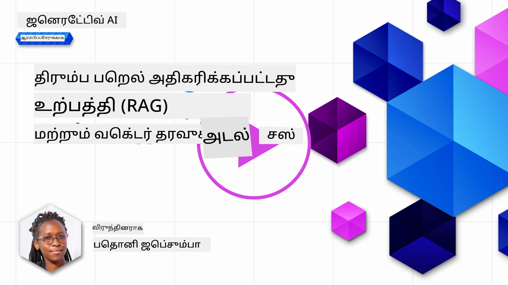
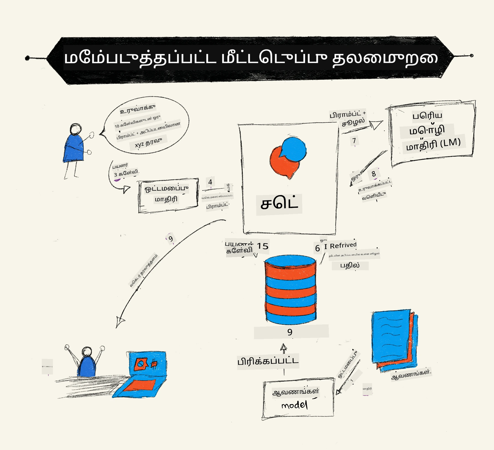
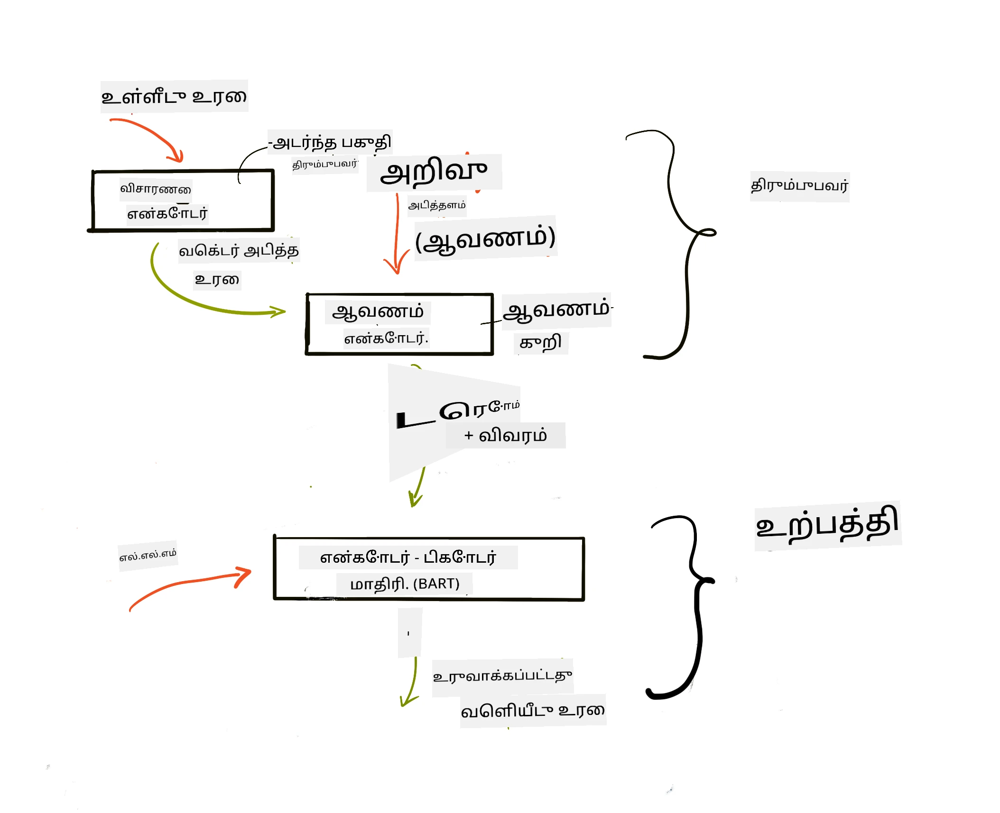
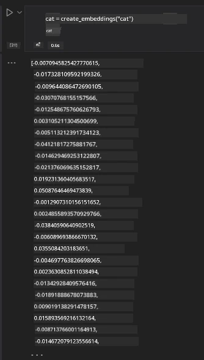

# மீட்பு மேம்படுத்தப்பட்ட உருவாக்கம் (RAG) மற்றும் வெக்டர் தரவுத்தளங்கள்

[](https://youtu.be/4l8zhHUBeyI?si=BmvDmL1fnHtgQYkL)

தேடல் பயன்பாடுகள் பாடத்தில், நமது சொந்த தரவுகளை பெரிய மொழி மாதிரிகளுடன் (LLMs) இணைக்க எப்படி என்பதை நாங்கள் சுருக்கமாக கற்றுக்கொண்டோம். இந்த பாடத்தில், நமது LLM பயன்பாட்டில் உங்கள் தரவை நிலைநிறுத்துதல், செயல்முறை விதிகள் மற்றும் தரவுகளை சேமிக்கும் முறைகள், உட்பட ஏற்பாடுகள் மற்றும் உரை ஆகியவற்றை விரிவாக பார்ப்போம்.

> **வீடியோ விரைவில் வரும்**

## அறிமுகம்

இந்த பாடத்தில் நாங்கள் பின்வரும் விஷயங்களை ஆராயப்போகிறோம்:

- RAG என்றால் என்ன, அதற்கான அறிமுகம் மற்றும் ஏன் அது கலைநுண்ணறிவில் (AI) பயன்படுத்தப்படுகிறது என்பதை.

- வெக்டர் தரவுத்தளங்கள் என்ன என்பதை புரிந்து கொண்டு, நமது பயன்பாட்டுக்கு ஒன்றை உருவாக்குதல்.

- RAG-ஐ ஒரு பயன்பாட்டில் எவ்வாறு இணைக்கலாம் என்பதன் பழகுதல் உதாரணம்.

## கற்றல் இலக்குகள்

இந்த பாடத்தை முடித்தவுடன் நீங்கள் செய்யக்கூடியவை:

- தரவு மீட்டெடுக்கும் மற்றும் செயல்முறை வாயிலாக RAG-இன் முக்கியத்துவத்தை விளக்குதல்.

- RAG பயன்பாட்டை அமைத்து உங்கள் தரவை LLM-க்கு நிலைநிறுத்துதல்.

- LLM பயன்பாடுகளில் RAG மற்றும் வெக்டர் தரவுத்தளங்களை விளைவாக ஒருங்கிணைத்தல்.

## நமது நிலைமை: நமது சொந்த தரவுடன் நமது LLM-களை மேம்படுத்துதல்

இந்த பாடத்துக்காக, கல்வி ஸ்டார்ட்அப்பில் நமது சொந்த குறிப்புகளை சேர்க்க விரும்புகிறோம், இதனால் chatbot வெவ்வேறு தலைப்புகளில் அதிக தகவலைப் பெற முடியும். நம்மிடம் உள்ள குறிப்புகளை பயன்படுத்தி, மாணவர்கள் சிறந்த முறையில் படித்து, வெவ்வேறு கருப்பொருட்களை புரிந்து கொண்டு, பரீட்சைகளுக்கான மறுபரிசீலனையை எளிதாக்க முடியும். நமது நிலைமையை உருவாக்க, நாம் பயன்படுத்தப் போகுவது:

- `Azure OpenAI:` நமது chatbot ஐ உருவாக்க பயன்படுத்துவது

- `AI for beginners' பாடத்தில் நியூரல் நெட்வொர்க்குகள்`: இது நமது LLM-ஐ நிலைநிறுத்தும் தரவு

- `Azure AI Search` மற்றும் `Azure Cosmos DB:` நமது தரவைச் சேமிப்பதற்கும் மற்றும் தேடல் குறியீட்டை உருவாக்குவதற்கும் வெக்டர் தரவுத்தளம்

பயனர்கள் தங்கள் குறிப்புகளில் இருந்து பயிற்சி வினாக்களை உருவாக்கவும், மறுபரிசீலனை கார்டுகளை மாற்றவும் மற்றும் அதை சுருக்கமான அவலோகனங்களாக மாற்றவும் முடியும். துவங்க, RAG என்றால் என்ன மற்றும் அது எப்படி வேலை செய்கிறது என்பதை பார்ப்போம்:

## மீட்பு மேம்படுத்தப்பட்ட உருவாக்கம் (RAG)

LLM இயக்கப்படும் chatbot பயனர் வேண்டுதல்களை செயலாக்கி பதில்களை உருவாக்குகிறது. இது இடையூறு செய்வதற்காக வடிவமைக்கப்பட்டுள்ளது மற்றும் பயனர்களுடன் பரபரப்பான தலைப்புகளில் கலந்துரையாடுகிறது. இருப்பினும், அதன் பதில்கள் வழங்கப்பட்ட சந்தர்ப்பம் மற்றும் அடிப்படையிலான பயிற்சி தரவுக்கு மட்டுமே வரையறுக்கப்பட்டுள்ளது. உதாரணமாக, GPT-4 அறிவு கட்டுப்பாடு செப்டம்பர் 2021, அதாவது, அந்தக் காலத்துக்குப்பிறகு நடந்த நிகழ்வுகளுக்கு அது அறிவு இல்லாமல் இருக்கும். கூடுதலாக, LLM-களை பயிற்சி செய்வதற்கான தரவு தனிப்பட்ட குறிப்புகள் அல்லது ஒரு நிறுவனத்தின் தயாரிப்பு கையேடு போன்ற நுண்ணுணர்வு தகவல்களை தவிர்க்கிறது.

### RAG-கள் (மீட்பு மேம்படுத்தப்பட்ட உருவாக்கம்) எப்படி செயல்படுகின்றன



உங்கள் குறிப்புகளிலிருந்து வினாக்களை உருவாக்கும் chatbot ஐ நிறுவ விரும்பினால், அறிவுத் தளம்(knowledge base) உடன் இணைப்பு தேவைப்படும். இதுவே RAG உதவும் இடம். RAG-கள் பின்வருமாறு செயல்படுகின்றன:

- **அறிவுத் தளம்:** மேடையில் மீட்பு செய்வதற்கு முன், இக்கடவுளை பத்திரங்களாக ஏற்றவும் முன்னீடு செய்யவும் வேண்டும், பொதுவாக பெரிய ஆவணங்களை சிறிய துண்டுகளாக பிரித்து, அவற்றை உரை அமைப்பில் மாற்றி மற்றும் தரவுத்தளத்தில் சேமிக்க வேண்டும்.

- **பயனர் கேள்வி:** பயனர் ஒரு கேள்வி கேட்கிறார்

- **மீட்பு:** பயனர் கேள்வி கேட்கும்போது, embed மாடல் அறிவுத் தளத்திலிருந்து பொருந்தக்கூடிய தகவலை மீட்டெடுத்து, அதை முன் குறியீட்டில் உள்ளடக்குகிறது.

- **மேம்படுத்தப்பட்ட உருவாக்கம்:** LLM அதன் பதிலை மீட்டெடுக்கப்பட்ட தரவின் அடிப்படையில் மேம்படுத்துகிறது. இது முன்பயிற்சி தரவின் அடிப்படையிலேயே அல்லாமல், சேர்க்கப்பட்ட சந்தர்ப்பத்திலிருந்து பெறப்பட்ட பொருந்தக்கூடிய தகவலையும் பயன்படுத்தி பதிலை உருவாக்க அனுமதிக்கிறது. மீட்டெடுக்கப்பட்ட தரவு LLM பதில்களை மேம்படுத்த பயன்படுகிறது. அதன் பிறகு LLM பயனரின் கேள்விக்கு பதில் வழங்குகிறது.



RAG-களைக் கட்டமைப்பில் இரண்டு பகுதிகளைக் கொண்ட டிரான்ஸ்ஃபார்மர் உருவாக்கப்பட்டுள்ளது: எண்கோடர் மற்றும் டீகோடர். உதாரணமாக, பயனர் கேள்வி கேட்டால், உள்ளீடு உரை சொற்களின் அர்த்தங்களை போன்ற விக்டர்களாக 'எண்கோடு' செய்யப்படுகிறது மற்றும் அதன் பிறகு அந்த விக்டர்கள் நமது ஆவண குறியீட்டருக்குள் 'டீகோடு' செய்யப்படுகின்றன மற்றும் பயனரின் கேள்விக்கு ஏற்ப புதிய உரையை உருவாக்குகின்றன. LLM வெளியீடு உருவாக்க எண்கோடர்-டீகோடர் மாதிரியை பயன்படுத்துகிறது.

பரிந்துரைக்கப்பட்ட கட்டுரையின் படி RAG-ஐ செயல்படுத்த இரண்டு அணுகுமுறைகள் உள்ளன: [அறிவுத் திறனாய்ந்த NLP (இயற்கை மொழி செயலாக்க மென்பொருள்) பணிகளுக்கான மீட்பு-மேம்படுத்தப்பட்ட உருவாக்கம்](https://arxiv.org/pdf/2005.11401.pdf?WT.mc_id=academic-105485-koreyst):

- **_RAG-ஒள்ளுரு_** பயனரின் கேள்விக்கு சிறந்த பதிலை கணிக்க மீட்டெடுக்கப்பட்ட ஆவணங்களை பயன்படுத்துதல்

- **RAG-டோக்கன்** ஆவணங்களை அடுத்த டோக்கனை உருவாக்க பயன்படுத்தி, பிறகு பயனர் கேள்விக்கான பதிலை மீட்டெடுக்கல்

### ஏன் RAG-களை பயன்படுத்த வேண்டும்?

- **தகவல் செறிவு:** உரை பதில்கள் சமீபத்திய மற்றும் தற்போதையவையாக இருப்பதை உறுதி செய்கிறது. இது அந்தக் குறிப்பிட்ட துறையில் உள்ள பணிகளை மேம்படுத்தும், உள்ளூர் அறிவுத் தளத்தைக் அணுகுவதால்.

- **செயற்பாட்டை குறைக்கிறது:** பயனர் கேள்விகளுக்கு சூழலை வழங்க அறிவுத் தளத்தில் உள்ள **சரிபார்க்கக்கூடிய தரவு** பயன்படுத்துகிறது.

- இது **செலவு குறைந்தது** LLM ஐ மேம்படுத்துவதைவிட இது பொருளாதாரமாகும்.

## அறிவுத் தளம் உருவாக்குதல்

நமது பயன்பாடு நமது தனிப்பட்ட தரவை அடிப்படையாகக் கொண்டது, அதாவது AI For Beginners பாட பல்கலைக்கழகத்தில் உள்ள நியூரல் நெட்வொர்க் பாடம்.

### வெக்டர் தரவுத்தளங்கள்

ஒரு வெக்டர் தரவுத்தளம், பாரம்பரிய தரவுத்தளத்துடன் ஒப்பிடும்போது, உருவாக்கப்பட்ட வெக்டர்களை சேமிப்பதற்கும் மேலாண்மை செய்வதற்கும் தேடுதலுக்கும் வடிவமைக்கப்பட்ட சிறப்பு தரவுத்தளம் ஆகும். இது ஆவணங்களின் எண்ணிக்கைகளான பிரதிநிதிகளைக் கையாள்கிறது. தரவுகளை எண்ணிக்கைக் கோடுகளாக பிரிப்பதால் நமது AI அமைப்புக்கு புத்துணர்வு அளிக்க மற்றும் அதை செயலாக்க எளிதாகிறது.

நாங்கள் எங்கள் ஏற்பாடுகளை வெக்டர் தரவுத்தளங்களில் சேமிக்கின்றோம் காரணம் LLM களுக்கு வழங்கக்கூடிய டோக்கன் எண்ணிக்கைக்கு வரம்பு உள்ளது. முழு ஏற்பாடுகளை LLMக்கு வழங்க முடியாததால், அதை துண்டுகளாகப் பிரிக்க வேண்டியது அவசியம், மேலும் பயனர் கேள்வி கேட்டால், கேள்விக்கேற்ற ஏற்பாடுகள் முன் குறியீட்டுடன் திருப்பி வழங்கப்படும். துண்டாக்குதல் கூடுதலாக LLM-க்கு அனுப்பப்படும் டோக்கன்களின் எண்ணிக்கையை குறைத்து செலவையும் குறைக்கும்.

சிறந்த சபாத்து வெக்டர் தரவுத்தளங்களாக Azure Cosmos DB, Clarifyai, Pinecone, Chromadb, ScaNN, Qdrant மற்றும் DeepLake உள்ளன. நீங்கள் Azure CLI பயன்படுத்தி Azure Cosmos DB மாதிரியை கீழ்க்காணும் கட்டளையுடன் உருவாக்கலாம்:

```bash
az login
az group create -n <resource-group-name> -l <location>
az cosmosdb create -n <cosmos-db-name> -r <resource-group-name>
az cosmosdb list-keys -n <cosmos-db-name> -g <resource-group-name>
```

### உரையிலிருந்து ஏற்பாடுகளுக்கு

தரவை சேமிப்பதற்கு முன், அதை தரவுத்தளத்தில் சேமிப்பதற்கு முன்னர் வெக்டர் ஏற்பாடுகளாக மாற்ற வேண்டும். பெரிய ஆவணங்கள் அல்லது நீண்ட உரைகளுடன் வேலை செய்யும்போது, எதிர்பார்க்கும் கேள்விகளின் அடிப்படையில் துண்டுகளாக்கலாம். துண்டாக்கல் வாக்கியம் மட்டுமே அல்லது பத்தி மட்டுமே ஆகும். துண்டாக்கத்தை சுற்றியுள்ள சொற்களிலிருந்து அர்த்தங்களை பெறும் என்பதால், நீங்கள் துண்டுக்கு கூடுதல் சூழலைச் சேர்க்கலாம், உதாரணமாக, ஆவணத்தின் தலைப்பைச் சேர்க்கலாம் அல்லது துண்டுக்கு முன் அல்லது பின்பு சில உரையை சேர்க்கலாம். நீங்கள் தரவை பின்வருமாறு துண்டாக்கலாம்:

```python
def split_text(text, max_length, min_length):
    words = text.split()
    chunks = []
    current_chunk = []

    for word in words:
        current_chunk.append(word)
        if len(' '.join(current_chunk)) < max_length and len(' '.join(current_chunk)) > min_length:
            chunks.append(' '.join(current_chunk))
            current_chunk = []

    # கடைசி துண்டு குறைந்தபட்ச நீளம் வரை எட்டவில்லை என்றாலும் அதை சேர்க்கவும்
    if current_chunk:
        chunks.append(' '.join(current_chunk))

    return chunks
```

துண்டாக்கப்பட்ட பிறகு, நாம் உரையை வெவ்வேறு ஏற்பாடு மாதிரிகளுடன் ஒருங்கிணைக்கலாம். சில மாதிரிகள்: word2vec, OpenAI-இன் ada-002, Azure கணினி காட்சி மற்றும் பல. ஏதேனும் மாதிரியை தேர்வு செய்வது நீங்கள் பயன்படுத்தும் மொழிகளுக்கு, குறியிடப்படும் உள்ளடக்க வகைக்கு (உரை/படங்கள்/ஒலி), அதில் குறியிடும் உள்ளீட்டின் அளவு மற்றும் ஏற்பாடுகளின் நீளத்திற்கு போன்றவற்றுக்கு பொறுத்தது.

OpenAI-யின் `text-embedding-ada-002` மாதிரியைப் பயன்படுத்தி உருவாக்கப்பட்ட ஒரு உரை ஏற்பாட்டின் எடுத்துக்காட்டு:


## மீட்பு மற்றும் வெக்டர் தேடல்

பயனர் கேள்வி கேட்ட போதும், புதுப்பிப்பான் அது வெக்டர் ஆக மாற்றுகிறது, பிறகு நமது ஆவண தேடல் குறியீட்டில் உள்ள தொடர்புடைய வெக்டர்களுக்கான தேடலை செய்கிறது. முடிந்ததும், அது உள்ளீடு வெக்டரும் ஆவண வெக்டர்களும் உரையாக மாற்றப்பட்டு LLM-க்கு அனுப்பப்படும்.

### மீட்பு

நிறுவனம் கடையெடுத்த ஆவணங்களை அவசரமாகவும் சரியாகவும் கண்டுபிடிக்க முயற்சிக்கும் தருணமே மீட்பு. மீட்பாளன் - தேடலுக்கான அளவற்ற ஆவணங்களை சேகரித்து பயன்பாட்டில் உள்ள கருத்தை தரவையும் தருகின்றது.

நமது தரவுத்தளத்தில் தேடல் செய்ய பலவித முறைகள் உள்ளன, உதாரணமாக:

- **கீ-வர்த்தக தேடல்** - உரை தேடலுக்குப் பயன்படுத்தப்படுகிறது

- **வெக்டர் தேடல்** - ஆவணங்களை உரை முதல் வெக்டர் பிரதிநிதிகளாக மாற்றி, உரையின் அர்த்தத்தை பயன்படுத்தி **அர்த்தமுள்ள தேடல்** செய்வதற்கும். பயனர் கேள்வியை மிகவும் நெருக்கமாக பொருந்தும் ஆவண வெக்டர்களை தேடும் முறையாகும்.

- **இணைப்பு** - கீ-வர்த்தக தேடல் மற்றும் வெக்டர் தேடலின் ஒரு இணைப்பு.

ஒரு சவால், கேள்விக்கு ஒத்த பதில் தரவுத்தளத்தில் இல்லாமை. அப்போது அமைப்பு கிட்டக்கூடிய சிறந்த தகவலை தரும், ஆனால் நீங்கள் தொடர்புடைய தூரத்தை வரம்பு வைக்கலாம் அல்லது கீ-வர்த்தகமும் வெக்டர் தேடலையும் சேர்க்கும் இணைப்பு தேடலைப் பயன்படுத்தலாம். இந்த பாடத்தில் நாங்கள் இணைப்பு தேடலை பயன்படுத்துவோம், இது வெக்டர் மற்றும் கீ-வர்த்தக தேடலின் சேர்க்கை. நாம் தரவை DataFrame-ல் சேமிப்போம், இதன் வரிசைகள் துண்டுகளையும் ஏற்பாடுகளையும் கொண்டிருக்கும்.

### வெக்டர் ஒற்றுமை

மீட்பான் அறிவுத் தளத்தில் இணைவான ஏற்பாடுகளை தேடிக் காணும், அவை அருகிலுள்ள அண்டைநிலையர்களாக இருக்கும், ஏனெனில் அவை ஒரே மாதிரித் தகவலாகும். ஒரு பயனர் கேள்வி கேட்டால், முதலில் அது ஏற்பாட்டாக்கப்பட்டு பிறகு அதே மாதிரித் தகவல்களுடன் பொருந்துகிறதா என பொருத்தப்படும். வெக்டர்கள் எவ்வளவு ஒரே மாதிரியிலுள்ளன என்பதை அளவிட பொதுவாக பயன்படுத்தப்படும் அளவுகோல் கோசைன் ஒற்றுமை (cosine similarity), இது இரண்டு வெக்டர்களுக்கிடையேயான கோணம் அடிப்படையிலானது.

மற்ற அளவுகோல்கள் உள்ளன: யூகிளீடியன் தொலைவு (Euclidean distance) என்பது வெக்டர் முனைகளுக்கு இடையேயான நேரடியான கோடு எப்படி மற்றும் டாட் பிராடக்ட் (dot product) என்பது இரு வெக்டர்களின் தொடர்புடைய கூறுகளின் பெருக்கலும் அதன் கூட்டு.

### தேடல் குறியீடு

மீட்பு செய்யும்போது, பரிசீலனை செய்வதற்கு முன் நமது அறிவுத் தளத்திற்கு தேடல் குறியீடு உருவாக்க வேண்டும். குறியீடு ஏற்பாடுகளை பதிந்திருப்பதற்கும் மிக இணைவான துண்டுகளை விரைவில் மீட்டெடுக்க உதவும். நாங்கள் கீழ்காணும் மூலம் உள்ளூர் குறியீட்டை உருவாக்கலாம்:

```python
from sklearn.neighbors import NearestNeighbors

embeddings = flattened_df['embeddings'].to_list()

# தேடல் குறியீட்டை உருவாக்குங்கள்
nbrs = NearestNeighbors(n_neighbors=5, algorithm='ball_tree').fit(embeddings)

# குறியீட்டை கேட்க, நீங்கள் kneighbors முறையை பயன்படுத்தலாம்
distances, indices = nbrs.kneighbors(embeddings)
```

### மீண்டும் வரிசைப்படுத்துதல்

தரவுத்தளத்தில் நீங்கள் கேட்டுக் கொண்ட பின்பு, முடிவுகளை மிக பொருந்தக்கூடிய முதல் வரிசைப்படுத்த வேண்டியிருக்கும். ஒரு reranking LLM இயந்திரக் கற்றலை (Machine Learning) பயன்படுத்தி தேடல் முடிவுகளின் பொருந்துதலை மேம்படுத்துகிறது. Azure AI Search பயன்படுத்தும்போது, தொடர்ச்சிசார் திருத்தம் (semantic reranker) மூலம் reranking தானாக நடக்கும். அருகிலுள்ள அண்டைநிலையர்களைப் பயன்படுத்தும் reranking உதாரணம்:

```python
# மிக ஒத்த ஆவணங்களை கண்டறியவும்
distances, indices = nbrs.kneighbors([query_vector])

index = []
# மிக ஒத்த ஆவணங்களை அச்சிடவும்
for i in range(3):
    index = indices[0][i]
    for index in indices[0]:
        print(flattened_df['chunks'].iloc[index])
        print(flattened_df['path'].iloc[index])
        print(flattened_df['distances'].iloc[index])
    else:
        print(f"Index {index} not found in DataFrame")
```

## அனைத்தையும் ஒன்றாக கொண்டுவரல்

கடைசி படி நமது LLM ஐ சேர்ப்பது, அதனால் அது நமது தரவின் அடிப்படையில் பதில்களை வழங்கும். இதை பின்வருமாறு செயலாக்கலாம்:

```python
user_input = "what is a perceptron?"

def chatbot(user_input):
    # கேள்வியை வினவல் வட்டாரமாக மாற்றுக
    query_vector = create_embeddings(user_input)

    # மிகவும் ஒத்த ஆவணங்களை கண்டுபிடிக்கவும்
    distances, indices = nbrs.kneighbors([query_vector])

    # உள்ளடக்கத்தை வழங்க கேள்வியில் ஆவணங்களை சேர்க்கவும்
    history = []
    for index in indices[0]:
        history.append(flattened_df['chunks'].iloc[index])

    # வரலாற்றையும் பயனர் உள்ளீட்டையும் இணைக்கவும்
    history.append(user_input)

    # ஒரு செய்தி பொருளை உருவாக்கவும்
    messages=[
        {"role": "system", "content": "You are an AI assistant that helps with AI questions."},
        {"role": "user", "content": "\n\n".join(history) }
    ]

    # பதிலை உருவாக்க Responses API ஐ பயன்படுத்தவும்
    response = client.responses.create(
        model="gpt-5-mini",
        max_output_tokens=800,
        input=messages,
        store=False,
    )

    return response.output_text

chatbot(user_input)
```

## நமது பயன்பாட்டை மதிப்பாய்வு செய்தல்

### மதிப்பாய்வு அளவுகோல்கள்

- வழங்கப்பட்ட பதில்களின் தரம்: இயல்பான, நேர்த்தியான மற்றும் மனித போன்று இருக்கிறதா என உறுதி செய்தல்

- தரவின் நிலைநிறுத்தல்: வழங்கப்பட்ட ஆவணங்களிலிருந்து பதில் வந்ததா என்பதை மதிப்பிடல்

- பொருந்துதல்: பதில் கேள்விக்கே பொருந்துகிறதா என மதிப்பிடுதல்

- உரைநடைமை - பதில் இலக்கண ரீதியாக பொருந்துகிறதா என்பதை காண்பது

## RAG (மீட்பு மேம்படுத்தப்பட்ட உருவாக்கம்) மற்றும் வெக்டர் தரவுத்தளங்கள் பயன்பாடுகள்

பல விதமான பயன்பாடுகள் உள்ளன, உதாரணமாக:

- கேள்வி மற்றும் பதிலளித்தல்: உங்கள் நிறுவனத் தரவை கீழ்த்தளமாக கொண்ட ஒரு சந்திப்பிற்கு ஊழியர்கள் கேள்விகள் கேட்கக் கூடியதாக அமைத்தல்.

- பரிந்துரைக் கணினி அமைப்புகள்: மிக ஒத்த மதிப்புகள் கொண்ட அமைப்புகளை உருவாக்குதல், எ.கா., திரைப்படங்கள், உணவுக்கூடங்கள் மற்றும் பல.

- சந்திப்பு சேவைகள்: உரையாடல் வரலாறைச் சேமித்து, பயனர் தரவுத் தனிப்பட்ட உரையாடலை உருவாக்குதல்.

- வெக்டர் ஏற்பாடுகளின் அடிப்படையில் பட தேடல், பட பரிசீலனை மற்றும் தவறான்கள் கண்டறிதலில் பயன்படும்.

## சுருக்கம்

நாம் RAG அடிப்படைகளை எடுத்துக் கொண்டோம், பயன்பாட்டில் நமது தரவைச் சேர்ப்பது, பயனர் கேள்வி மற்றும் பதில்களை. RAG உருவாக்கத்தை எளிதாக்க Semanti Kernel, Langchain அல்லது Autogen போன்ற கட்டமைப்புகளைப் பயன்படுத்தலாம்.

## பணிச்சுமை

மீட்பு மேம்படுத்தப்பட்ட உருவாக்கத்தை (RAG) தொடர்ச்சியாக கற்றுக்கொள்ள, நீங்கள் செய்யலாம்:

- உங்கள் தேர்வுக்குரிய கட்டமைப்பைப் பயன்படுத்தி செயலிக்காக முன்னணி உருவாக்கம் செய்யவும்

- LangChain அல்லது Semantic Kernel போன்ற ஒரு கட்டமைப்பைப் பயன்படுத்தி, உங்கள் பயன்பாட்டை மறுசீரமைக்கவும்.

பாடத்தை முடித்ததற்கு வாழ்த்துக்கள் 👏.

## கற்றல் இதே இடத்தில் நிறுத்தப்படாது, பயணத்தை தொடரவும்

இந்த பாடத்தை முடித்த பிறகு, நமது [உருவாக்கும் AI கற்றல் தொகுப்பு](https://aka.ms/genai-collection?WT.mc_id=academic-105485-koreyst) பார்வையிட்டு, உங்கள் உருவாக்கும் AI அறிவை மேம்படுத்தவும்!

---

<!-- CO-OP TRANSLATOR DISCLAIMER START -->
**மறுப்பு**:
இந்த ஆவணம் AI மொழிபெயர்ப்பு சேவை [Co-op Translator](https://github.com/Azure/co-op-translator) பயன்படுத்தி மொழிபெயர்க்கப்பட்டுள்ளது. நாங்கள் துல்லியத்திற்காக முயற்சி செய்துள்ளோம், ஆனால் தானாக செய்யப்படும் மொழிபெயர்ப்புகளில் பிழைகள் அல்லது தவறுகள் இருக்கலாம் என்பதை கவனத்தில் கொள்ளவும். அசல் ஆவணம் அதன் தாய்மொழியில் அதிகாரப்பூர்வ ஆதாரமாக கருதப்பட வேண்டும். முக்கியமான தகவல்களுக்கு, தொழில்நுட்பமான மனித மொழிபெயர்ப்பு பரிந்துரைக்கப்படுகிறது. இந்த மொழிபெயர்ப்பைப் பயன்படுத்துவதால் ஏற்படும் எந்த தவறான புரிதல்கள் அல்லது தவறான விளக்கத்திற்கும் நாங்கள் பொறுப்பில்வில்லை.
<!-- CO-OP TRANSLATOR DISCLAIMER END -->