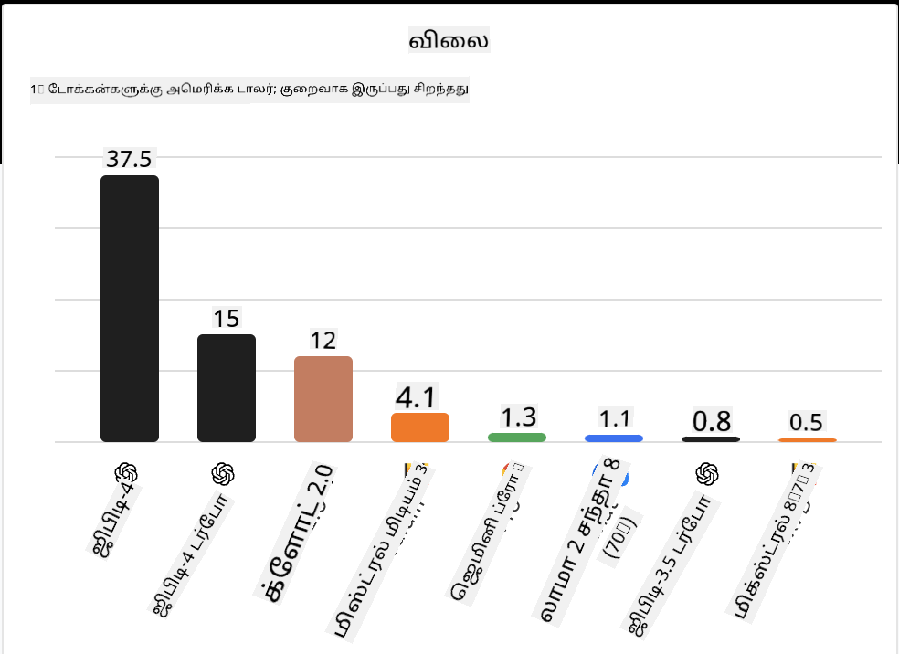
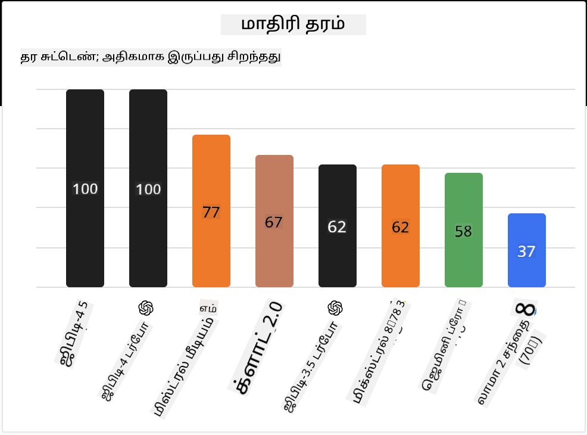

<!--
CO_OP_TRANSLATOR_METADATA:
{
  "original_hash": "a2a83aac52158c23161046cbd13faa2b",
  "translation_date": "2025-10-18T02:47:35+00:00",
  "source_file": "16-open-source-models/README.md",
  "language_code": "ta"
}
-->

## அறிமுகம்

திறந்த மூல LLMகளின் உலகம் மிகவும் சுவாரஸ்யமானது மற்றும் தொடர்ந்து வளர்ந்து கொண்டிருக்கிறது. இந்த பாடம் திறந்த மூல மாதிரிகள் பற்றிய விரிவான பார்வையை வழங்குவதற்காக வடிவமைக்கப்பட்டுள்ளது. உரிமை பெற்ற மாதிரிகள் மற்றும் திறந்த மூல மாதிரிகள் எப்படி ஒப்பிடப்படுகின்றன என்பதைப் பற்றிய தகவல்களைத் தேடுகிறீர்களானால், ["விவசாயம் மற்றும் பல்வேறு LLMகளை ஒப்பிடுதல்" பாடத்திற்கு செல்லவும்](../02-exploring-and-comparing-different-llms/README.md?WT.mc_id=academic-105485-koreyst). இந்த பாடத்தில் நுணுக்கமாக அமைத்தல் பற்றிய தலைப்பும் உள்ளடக்கப்பட்டுள்ளது, ஆனால் மேலும் விரிவான விளக்கம் ["LLMகளை நுணுக்கமாக அமைத்தல்" பாடத்தில்](../18-fine-tuning/README.md?WT.mc_id=academic-105485-koreyst) காணலாம்.

## கற்றல் இலக்குகள்

- திறந்த மூல மாதிரிகள் பற்றிய புரிதலைப் பெறுதல்
- திறந்த மூல மாதிரிகளுடன் வேலை செய்வதன் நன்மைகளைப் புரிந்துகொள்வது
- Hugging Face மற்றும் Azure AI Studio-வில் கிடைக்கும் திறந்த மாதிரிகளை ஆராய்தல்

## திறந்த மூல மாதிரிகள் என்றால் என்ன?

திறந்த மூல மென்பொருள் பல்வேறு துறைகளில் தொழில்நுட்ப வளர்ச்சியில் முக்கிய பங்கு வகித்துள்ளது. திறந்த மூல முன்முயற்சி (OSI) [மென்பொருளுக்கான 10 அளவுகோள்களை](https://web.archive.org/web/20241126001143/https://opensource.org/osd?WT.mc_id=academic-105485-koreyst) வரையறுத்துள்ளது, இது திறந்த மூலமாக வகைப்படுத்தப்படுகிறது. மூலக் குறியீடு OSIயால் அங்கீகரிக்கப்பட்ட உரிமத்தின் கீழ் திறந்தவெளியில் பகிரப்பட வேண்டும்.

LLMகளின் மேம்பாடு மென்பொருள் மேம்பாட்டுக்கு ஒத்த கூறுகளை கொண்டிருந்தாலும், செயல்முறை முற்றிலும் ஒரே மாதிரியானது அல்ல. இது LLMகளின் சூழலில் திறந்த மூலத்தின் வரையறை குறித்து சமூகத்தில் பல விவாதங்களை ஏற்படுத்தியுள்ளது. பாரம்பரிய திறந்த மூலத்தின் வரையறைக்கு ஒத்த மாதிரியாக இருக்க, பின்வரும் தகவல்கள் பொதுமக்களுக்கு கிடைக்க வேண்டும்:

- மாதிரியைப் பயிற்றுவிக்க பயன்படுத்தப்படும் தரவுத்தொகுப்புகள்.
- முழு மாதிரி எடைகள் பயிற்சியின் ஒரு பகுதியாக.
- மதிப்பீட்டு குறியீடு.
- நுணுக்கமாக அமைக்கும் குறியீடு.
- முழு மாதிரி எடைகள் மற்றும் பயிற்சி அளவுகோள்கள்.

தற்போது இந்த அளவுகோளுக்கு பொருந்தும் சில மாதிரிகள் மட்டுமே உள்ளன. [ஆலன் இன்ஸ்டிடியூட் ஃபார் ஆர்டிஃபிஷியல் இன்டலிஜென்ஸ் (ஆலன்AI) உருவாக்கிய OLMo மாதிரி](https://huggingface.co/allenai/OLMo-7B?WT.mc_id=academic-105485-koreyst) இந்த வகையைச் சேர்ந்தது.

இந்த பாடத்திற்காக, மேலே உள்ள அளவுகோளுக்கு பொருந்தாமல் இருக்கக்கூடியதால், "திறந்த மாதிரிகள்" என்று மாதிரிகளை குறிப்பிடுவோம்.

## திறந்த மாதிரிகளின் நன்மைகள்

**மிகவும் தனிப்பயனாக்கக்கூடியது** - திறந்த மாதிரிகள் விரிவான பயிற்சி தகவலுடன் வெளியிடப்படுவதால், ஆராய்ச்சியாளர்கள் மற்றும் டெவலப்பர்கள் மாதிரியின் உள்துறை அமைப்புகளை மாற்றலாம். இது ஒரு குறிப்பிட்ட பணிக்கோளுக்கு அல்லது ஆய்வு துறைக்கு மிகவும் சிறப்பு வாய்ந்த மாதிரிகளை உருவாக்க அனுமதிக்கிறது. இதற்கான சில உதாரணங்கள் குறியீடு உருவாக்கம், கணித செயல்பாடுகள் மற்றும் உயிரியல் ஆகியவை.

**செலவு** - இந்த மாதிரிகளைப் பயன்படுத்துவதற்கும், செயல்படுத்துவதற்கும் டோக்கன் ஒன்றுக்கு செலவு உரிமை பெற்ற மாதிரிகளின் செலவுக்கு விட குறைவாக இருக்கும். ஜெனரேட்டிவ் AI பயன்பாடுகளை உருவாக்கும்போது, உங்கள் பயன்பாட்டின் செயல்திறன் மற்றும் விலையைப் பார்க்க வேண்டும்.

  
மூலதொகை: Artificial Analysis

**இயல்புநிலை** - திறந்த மாதிரிகளுடன் வேலை செய்வது, பல்வேறு மாதிரிகளைப் பயன்படுத்துவதில் அல்லது அவற்றை இணைப்பதில் நெகிழ்வுத்தன்மையை வழங்குகிறது. இதற்கான ஒரு உதாரணம் [HuggingChat Assistants](https://huggingface.co/chat?WT.mc_id=academic-105485-koreyst), இதில் பயனர் நேரடியாக பயனர் இடைமுகத்தில் பயன்படுத்தப்படும் மாதிரியைத் தேர்ந்தெடுக்க முடியும்:

## பல்வேறு திறந்த மாதிரிகளை ஆராய்தல்

### Llama 2

[LLama2](https://huggingface.co/meta-llama?WT.mc_id=academic-105485-koreyst), மெட்டா உருவாக்கிய திறந்த மாதிரி, உரையாடல் அடிப்படையிலான பயன்பாடுகளுக்கு சிறப்பாக தகுந்ததாக உள்ளது. இது அதன் நுணுக்கமாக அமைக்கும் முறையால், இது பெரும் அளவிலான உரையாடல் மற்றும் மனித கருத்துகளை உள்ளடக்கியது. இந்த முறையின் மூலம், மாதிரி மனித எதிர்பார்ப்புக்கு ஒத்த முடிவுகளை உருவாக்குகிறது, இது சிறந்த பயனர் அனுபவத்தை வழங்குகிறது.

Llama மாதிரியின் நுணுக்கமாக அமைக்கப்பட்ட சில உதாரணங்கள் [ஜப்பானிய Llama](https://huggingface.co/elyza/ELYZA-japanese-Llama-2-7b?WT.mc_id=academic-105485-koreyst), இது ஜப்பானிய மொழியில் சிறப்பு வாய்ந்தது மற்றும் [Llama Pro](https://huggingface.co/TencentARC/LLaMA-Pro-8B?WT.mc_id=academic-105485-koreyst), இது அடிப்படை மாதிரியின் மேம்பட்ட பதிப்பு ஆகும்.

### Mistral

[Mistral](https://huggingface.co/mistralai?WT.mc_id=academic-105485-koreyst) என்பது உயர் செயல்திறன் மற்றும் திறனுக்கு முக்கியத்துவம் அளிக்கும் திறந்த மாதிரி ஆகும். இது Mixture-of-Experts அணுகுமுறையைப் பயன்படுத்துகிறது, இது ஒரு குழுவின் சிறப்பு வாய்ந்த நிபுணர் மாதிரிகளை ஒரே அமைப்பில் இணைக்கிறது, உள்ளீட்டின் அடிப்படையில் குறிப்பிட்ட மாதிரிகள் தேர்ந்தெடுக்கப்படுகின்றன. இது கணக்கீடு செயல்திறனை அதிகரிக்கிறது, ஏனெனில் மாதிரிகள் அவர்கள் சிறப்பு வாய்ந்த உள்ளீடுகளை மட்டுமே கையாளுகின்றன.

Mistral மாதிரியின் நுணுக்கமாக அமைக்கப்பட்ட சில உதாரணங்கள் [BioMistral](https://huggingface.co/BioMistral/BioMistral-7B?text=Mon+nom+est+Thomas+et+mon+principal?WT.mc_id=academic-105485-koreyst), இது மருத்துவ துறையில் கவனம் செலுத்துகிறது மற்றும் [OpenMath Mistral](https://huggingface.co/nvidia/OpenMath-Mistral-7B-v0.1-hf?WT.mc_id=academic-105485-koreyst), இது கணித கணக்கீடுகளைச் செய்கிறது.

### Falcon

[Falcon](https://huggingface.co/tiiuae?WT.mc_id=academic-105485-koreyst) என்பது தொழில்நுட்ப புதுமை நிறுவனம் (**TII**) உருவாக்கிய LLM ஆகும். Falcon-40B 40 பில்லியன் அளவுகோள்களில் பயிற்சியளிக்கப்பட்டது, இது GPT-3க்கு விட குறைந்த கணினி வளங்களுடன் சிறப்பாக செயல்படுகிறது. இது FlashAttention ஆல்கொரிதம் மற்றும் multiquery கவனத்தைப் பயன்படுத்துவதால், முடிவுகளை கணக்கீடு செய்யும் போது நினைவக தேவைகளை குறைக்கிறது. இந்த குறைந்த முடிவு நேரத்துடன், Falcon-40B உரையாடல் பயன்பாடுகளுக்கு ஏற்றது.

Falcon மாதிரியின் நுணுக்கமாக அமைக்கப்பட்ட சில உதாரணங்கள் [OpenAssistant](https://huggingface.co/OpenAssistant/falcon-40b-sft-top1-560?WT.mc_id=academic-105485-koreyst), திறந்த மாதிரிகளின் அடிப்படையில் உருவாக்கப்பட்ட உதவியாளர் மற்றும் [GPT4ALL](https://huggingface.co/nomic-ai/gpt4all-falcon?WT.mc_id=academic-105485-koreyst), இது அடிப்படை மாதிரியை விட அதிக செயல்திறனை வழங்குகிறது.

## எப்படி தேர்வு செய்வது

திறந்த மாதிரியைத் தேர்வு செய்வதற்கான ஒரே பதில் இல்லை. Azure AI Studioவின் பணிக்கான வடிகட்டல் அம்சத்தைப் பயன்படுத்துவதன் மூலம் தொடங்குவது நல்லது. இது மாதிரி எந்த வகையான பணிக்காக பயிற்சியளிக்கப்பட்டது என்பதைப் புரிந்துகொள்ள உதவும். Hugging Face கூட LLM Leaderboardயை பராமரிக்கிறது, இது குறிப்பிட்ட அளவுகோள்களின் அடிப்படையில் சிறந்த செயல்திறன் கொண்ட மாதிரிகளை காட்டுகிறது.

விவசாயம் மற்றும் பல்வேறு வகைகளில் LLMகளை ஒப்பிடுவதற்கான [Artificial Analysis](https://artificialanalysis.ai/?WT.mc_id=academic-105485-koreyst) மற்றொரு சிறந்த வளமாகும்:

  
மூலதொகை: Artificial Analysis

குறிப்பிட்ட பயன்பாட்டில் வேலை செய்யும்போது, அதே துறையில் கவனம் செலுத்தும் நுணுக்கமாக அமைக்கப்பட்ட பதிப்புகளைத் தேடுவது பயனுள்ளதாக இருக்கும். உங்கள் மற்றும் உங்கள் பயனாளர்களின் எதிர்பார்ப்புகளுக்கு ஏற்ப அவை எப்படி செயல்படுகின்றன என்பதைப் பார்க்க பல திறந்த மாதிரிகளை சோதிப்பது மற்றொரு நல்ல நடைமுறையாகும்.

## அடுத்த படிகள்

திறந்த மாதிரிகளின் சிறந்த பகுதி, அவற்றுடன் வேலை செய்ய விரைவாக தொடங்கலாம். [Azure AI Foundry Model Catalog](https://ai.azure.com?WT.mc_id=academic-105485-koreyst)யை பாருங்கள், இது இந்த மாதிரிகளை உள்ளடக்கிய Hugging Face தொகுப்பை வழங்குகிறது.

## கற்றல் இங்கே நிற்காது, பயணத்தை தொடருங்கள்

இந்த பாடத்தை முடித்த பிறகு, [Generative AI Learning collection](https://aka.ms/genai-collection?WT.mc_id=academic-105485-koreyst)யை பாருங்கள், உங்கள் Generative AI அறிவை மேம்படுத்த தொடருங்கள்!

---

**குறிப்பு**:  
இந்த ஆவணம் AI மொழிபெயர்ப்பு சேவை [Co-op Translator](https://github.com/Azure/co-op-translator) பயன்படுத்தி மொழிபெயர்க்கப்பட்டுள்ளது. நாங்கள் துல்லியத்திற்காக முயற்சிக்கிறோம், ஆனால் தானியங்கி மொழிபெயர்ப்புகளில் பிழைகள் அல்லது தவறுகள் இருக்கக்கூடும் என்பதை கவனத்தில் கொள்ளவும். அதன் தாய்மொழியில் உள்ள மூல ஆவணம் அதிகாரப்பூர்வ ஆதாரமாக கருதப்பட வேண்டும். முக்கியமான தகவல்களுக்கு, தொழில்முறை மனித மொழிபெயர்ப்பு பரிந்துரைக்கப்படுகிறது. இந்த மொழிபெயர்ப்பைப் பயன்படுத்துவதால் ஏற்படும் எந்த தவறான புரிதல்கள் அல்லது தவறான விளக்கங்களுக்கு நாங்கள் பொறுப்பல்ல.