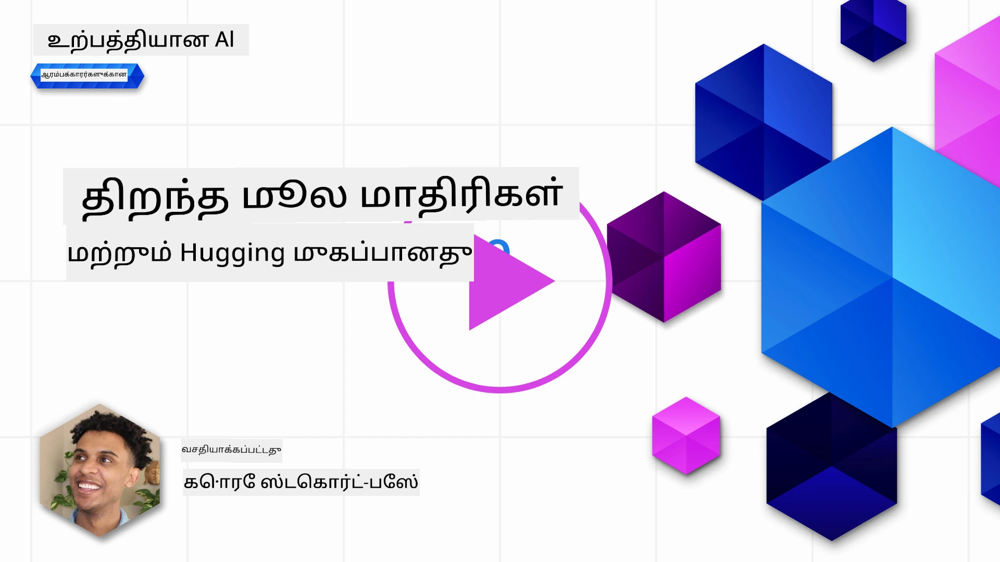
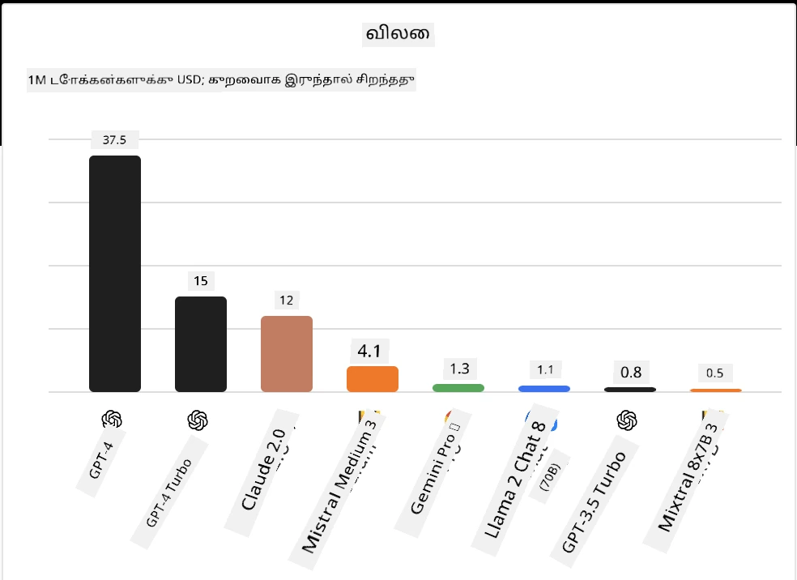
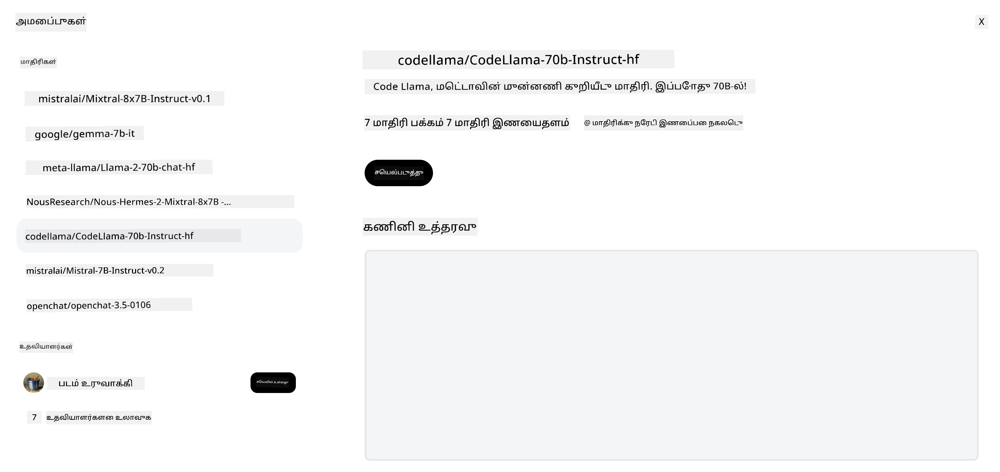
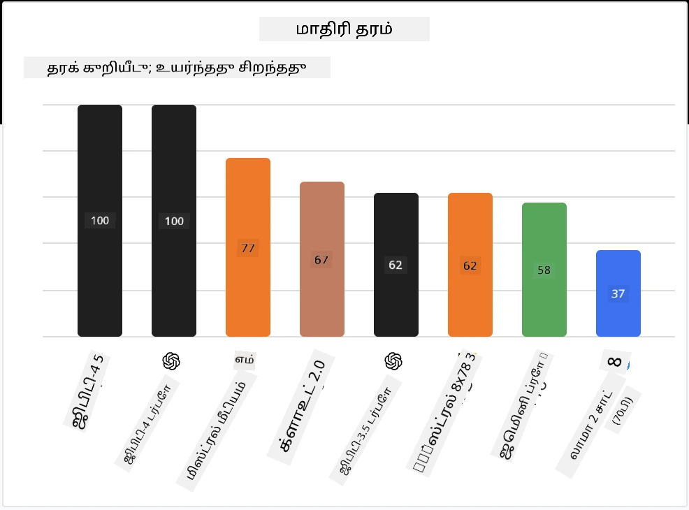

## அறிமுகம்

திறந்த மூல LLMகள் உலகம் சுவாரஸ்யமானதும் தொடர்ந்து மாறி வரும். இந்த பாடம் திறந்த மூல மாதிரிகள் பற்றி ஆழமான பார்வையை வழங்கும். சொந்த உரிமை கொண்ட மாதிரிகள் திறந்த மூல மாதிரிகளுடன் எப்படி ஒப்பிடப்படுகின்றன என்பதில் தகவல் தேடினால், ["வெவ்வேறு LLMகளை ஆய்வு செய்வதும் ஒப்பிடுவதும்" பாடத்திற்கு](../02-exploring-and-comparing-different-llms/README.md?WT.mc_id=academic-105485-koreyst) செல்லவும். இந்த பாடம் நுணுக்கமாக பயிற்சி முறை பற்றியும் பேசும், ஆனால் மேலும் விரிவான விளக்கம் ["Fine-Tuning LLMs" பாடத்தில்](../18-fine-tuning/README.md?WT.mc_id=academic-105485-koreyst) கிடைக்கிறது.

## கற்றல் குறிக்கோள்கள்

- திறந்த மூல மாதிரிகள் பற்றி புரிந்துகொள்ளுதல்
- திறந்த மூல மாதிரிகளுடன் பணியாற்றுவதின் பயன்களை அறிதல்
- Hugging Face மற்றும் Microsoft Foundry மாதிரி குறுந்தகடுகளில் உள்ள திறந்த மாதிரிகளை ஆராய்தல்

## திறந்த மூல மாதிரிகள் என்ன?

திறந்த மூல மென்பொருள் தொழில்நுட்பத்தின் வளர்ச்சியில் முக்கிய பங்கு வகித்துள்ளது. Open Source Initiative (OSI) திறந்த மூலமாக வகைப்படுத்தப்பட்ட மென்பொருளுக்கு [10 விதிமுறைகளை](https://web.archive.org/web/20241126001143/https://opensource.org/osd?WT.mc_id=academic-105485-koreyst) வரையறுத்துள்ளது. மூல குறியீடு OSI அங்கீகாரம் செய்த உரிமப்பத்திரத்தின் கீழ் திறந்தவிதமாக பகிரப்பட வேண்டும்.

LLMகளை உருவாக்குவது மென்பொருள் உருவாக்கம் போல பணிகள் கொண்டதாக இருந்தாலும் முறைகள் முழுமையாக இணங்கவில்லை. இதனால் LLMகளுக்கு 'திறந்த மூல' என்ற வரையறை பற்றி சமுதாயத்தில் பல விவாதங்கள் எழுந்துள்ளன. பாரம்பரிய திறந்த மூல் வரையறைக்கு ஏற்ற மாதிரி எனில் பின்வரும் தகவல்கள் பொது வெளியில் கிடைக்க வேண்டும்:

- மாதிரியை பயிற்றுவிக்க பயன்படுத்தப்பட்ட தரவுத்தொகுப்புகள்
- பயிற்சி முழுக்க முழுக்க மாதிரி பொருட்கள் (weights)
- மதிப்பீடு குறியீடு
- நுணுக்க பயிற்சி குறியீடு
- முழு மாதிரி பொருட்கள் மற்றும் பயிற்சி அளவுகோல்கள்

இப்பொழுது இதை பூர்த்தி செய்யும் சில மாதிரிகள்தான் உள்ளன. [Allen Institute for Artificial Intelligence (AllenAI) உருவாக்கிய OLMo மாதிரி](https://huggingface.co/allenai/OLMo-7B?WT.mc_id=academic-105485-koreyst) இதற்கு உட்பட்டது.

இந்த பாடத்தில், இப்போதைய நிலைக்கு ஏற்ப கருதும்போது "திறந்த மாதிரிகள்" என்று குறிப்பிடுவோம்.

## திறந்த மாதிரிகளின் பயன்கள்

**மிகவும் தனிப்பயனாக்கக்கூடியது** - திறந்த மாதிரிகள் பயிற்சி தொடர்பான விரிவான தகவல்களுடன் வெளியிடப்படுகின்றன, எனவே ஆராய்ச்சியாளர்கள் மற்றும் டெவலப்பர்கள் மாதிரியின் உட்பகுதிகளை மாற்றக்கூடியவர்கள். இதனால் குறிப்பிட்ட பணிக்கோ அல்லது ஆய்ச்சி துறைக்கே செருகப்பட்ட சிறப்பான மாதிரிகளைக் உருவாக்க முடியும். உதாரணத்திற்கு, குறியீடு உருவாக்கம், கணித செயல்பாடுகள் மற்றும் உயிரியல் ஆகியவை.

**செலவு** — இந்த மாதிரிகளை பயன்படுத்துவதற்கும் நிறுவுவதற்குமான செலவு சொந்த உரிமை கொண்ட மாதிரிகளுக்கு எதிராக குறைவாகும். ஜெனரேட்டிவ் AI பயன்பாடுகளை கட்டிடும்போது செயல்திறன் மற்றும் விலை பற்றி கவனம் செலுத்த வேண்டியுள்ளது.

மூலம்: Artificial Analysis

**நிகழ்ச்சி திறன்** - திறந்த மாதிரிகளுடன் பணியாற்றுவதன் மூலம் பல மாதிரிகளை ஒருங்கிணைக்கும் அல்லது வேறு மாதிரிகளை பயன்படுத்தும் வசதி உண்டு. ஒரு உதாரணமாக [HuggingChat உதவியாளர்கள்](https://huggingface.co/chat?WT.mc_id=academic-105485-koreyst) இல் பயனர் நேரடியாக உபயோகப்படுத்தும் மாதிரியை தேர்வு செய்ய முடியும்:

## வேறுவேறு திறந்த மாதிரிகளை ஆராய்தல்

### லாமா 2

[Llama2](https://huggingface.co/meta-llama?WT.mc_id=academic-105485-koreyst), மெட்டா நிறுவனம் உருவாக்கியது, உரையாடல் பயன்பாடுகளுக்காக மேம்படுத்தப்பட்ட திறந்த மாதிரியாகும். அதனை கனிவான பயிற்சிகளால் உருவாக்குகிறது, இதில் அதிக உரையாடல் மற்றும் மனித பின்னூட்டம் பயன்படுத்தப்பட்டுள்ளது. இதன் மூலம் மாதிரி மனித எதிர்பார்ப்புக்கு ஏற்ப நன்றாக செயல்படும், பயனாளருக்கு சிறந்த அனுபவம் தருகிறது.

சில நுணுக்க பயிற்சி செய்யப்பட்ட லாமா மாதிரிகளின் உதாரணங்கள் [ஜப்பானிய லாமா](https://huggingface.co/elyza/ELYZA-japanese-Llama-2-7b?WT.mc_id=academic-105485-koreyst) (ஜப்பானிய மொழியின் சிறப்பு) மற்றும் [Llama Pro](https://huggingface.co/TencentARC/LLaMA-Pro-8B?WT.mc_id=academic-105485-koreyst) (அடிப்படை மாதிரியின் மேம்பட்ட பதிப்பு) ஆகும்.

### மிஸ்ட்ரல்

[Mistral](https://huggingface.co/mistralai?WT.mc_id=academic-105485-koreyst) என்பது உயர் செயல்திறன் மற்றும் திறம்படத்தன்மைக்கு கவனம் செலுத்தும் திறந்த மாதிரி. இது Mixture-of-Experts முறையைப் பயன்படுத்துகிறது, இதில் நிபுணத்துவம் பெற்ற மாதிரிகள் குழுவை ஒரே முறையில் இணைக்கும், உள்ளீட்டின்படி குறிப்பிட்ட மாதிரிகள் தேர்வு செய்யப்படுகின்றன. இதனால் கணக்கீடு அதிக விளைவானது ஆகும்.

மிஸ்ட்ரலின் நுணுக்க பயிற்சியால் உருவான சில மாதிரிகள்: [BioMistral](https://huggingface.co/BioMistral/BioMistral-7B?text=Mon+nom+est+Thomas+et+mon+principal?WT.mc_id=academic-105485-koreyst) (மருத்துவ துறையில் கவனம்) மற்றும் [OpenMath Mistral](https://huggingface.co/nvidia/OpenMath-Mistral-7B-v0.1-hf?WT.mc_id=academic-105485-koreyst) (கணிதக் கணக்கீடு செய்யும்).

### பால்கன்

[Falcon](https://huggingface.co/tiiuae?WT.mc_id=academic-105485-koreyst) என்பது Technology Innovation Institute (**TII**) உருவாக்கிய LLM ஆகும். Falcon-40B 40 பில்லியன் அளவுகோல்களுடன் பயிற்சி பெற்றது, இதில் GPT-3ஐவிட குறைந்த கணக்கீட்டு செலவில் சிறந்த செயல்திறன் காட்டியுள்ளது. இது FlashAttention மற்றும் multiquery attention முறைகளை பயன்படுத்துவதால் நினைவக தேவையை குறைகிறது, எனவே உரையாடல் பயன்பாடுகளுக்கு ஏற்றது.

Falcon இன் நுணுக்க பயிற்சி செய்யப்பட்ட மாதிரிகள் உதாரணமாக [OpenAssistant](https://huggingface.co/OpenAssistant/falcon-40b-sft-top1-560?WT.mc_id=academic-105485-koreyst) (திறந்த மாதிரிகளில் கட்டப்பட்டது) மற்றும் [GPT4ALL](https://huggingface.co/nomic-ai/gpt4all-falcon?WT.mc_id=academic-105485-koreyst) (அடிப்படை மாதிரியைவிட மேம்பட்ட செயல்திறன்) உள்ளன.

## எப்படி தேர்ந்தெடுக்கலாம்

திறந்த மாதிரியைக் தேர்வு செய்வதில் ஒரே பதில் இல்லை. Microsoft Foundry மாதிரி குறுந்தகடின் "காரியப்படி வடிகட்டி" தொடங்குவது நல்லது. இது மாதிரி எந்த வகையான பணிகளுக்கு பயிற்சி பெற்றது என்பதை புரிந்துகொள்ள உதவும். Hugging Face வும் LLM தலைமைப்பட்டியல் (Leaderboard) பராமரிக்கிறது, இது சில அளவுகோல்களின் அடிப்படையில் சிறந்த செயல்திறன் கொண்ட மாதிரிகளை காட்டுகிறது.

வெவ்வேறு LLMகளை ஒப்பிடும் போது, [Artificial Analysis](https://artificialanalysis.ai/?WT.mc_id=academic-105485-koreyst) அடுத்த பெரிய வளம் ஆகும்:

மூலம்: Artificial Analysis

குறிப்பிட்ட பயன்பாட்டிற்கு வேலை செய்தால் அந்த துறையில் கவனம் செலுத்திய நுணுக்க பயிற்சி மாதிரிகளை தேடுவது விளைவானது. பல திறந்த மாதிரிகளைச் சோதித்து உங்கள் மற்றும் பயனாளர்களின் எதிர்பார்ப்புக்கு ஏற்ப செயல்திறன் பார்க்கும் பழகு நல்ல நடைமுறை.

## அடுத்த படிகள்

திறந்த மாதிரிகள் உடன் பணியை ஆரம்பிப்பது மிகவும் எளிது மற்றும் விரைவாக செய்யக்கூடியது. இங்கே நாம் பேசிய மாதிரிகளுக்கு ஒரே இடத்தில் உள்ள [Microsoft Foundry மாதிரி குறுந்தகடு](https://ai.azure.com?WT.mc_id=academic-105485-koreyst) மற்றும் அதில் உள்ள தனிப்பட்ட Hugging Face தொகுப்பை பாருங்கள்.

## கற்றல் இங்கே நிறுத்தப்படாது, பயணம் தொடர்க

இந்த பாடத்தை முடித்தபின், எங்கள் [Generative AI கற்றல் தொகுப்பை](https://aka.ms/genai-collection?WT.mc_id=academic-105485-koreyst) பாருங்கள், உங்கள் Generative AI அறிவை மேலும் மேம்படுத்த!

---

<!-- CO-OP TRANSLATOR DISCLAIMER START -->
**மறுப்பு**:
இந்த ஆவணம் AI மொழிபெயர்ப்பு சேவை [Co-op Translator](https://github.com/Azure/co-op-translator) பயன்படுத்தி மொழிபெயர்க்கப்பட்டுள்ளது. நாங்கள் துல்லியத்திற்காக முயற்சி செய்துள்ளோம், ஆனால் தானாக செய்யப்படும் மொழிபெயர்ப்புகளில் பிழைகள் அல்லது தவறுகள் இருக்கலாம் என்பதை கவனத்தில் கொள்ளவும். அசல் ஆவணம் அதன் தாய்மொழியில் அதிகாரப்பூர்வ ஆதாரமாக கருதப்பட வேண்டும். முக்கியமான தகவல்களுக்கு, தொழில்நுட்பமான மனித மொழிபெயர்ப்பு பரிந்துரைக்கப்படுகிறது. இந்த மொழிபெயர்ப்பைப் பயன்படுத்துவதால் ஏற்படும் எந்த தவறான புரிதல்கள் அல்லது தவறான விளக்கத்திற்கும் நாங்கள் பொறுப்பில்வில்லை.
<!-- CO-OP TRANSLATOR DISCLAIMER END -->