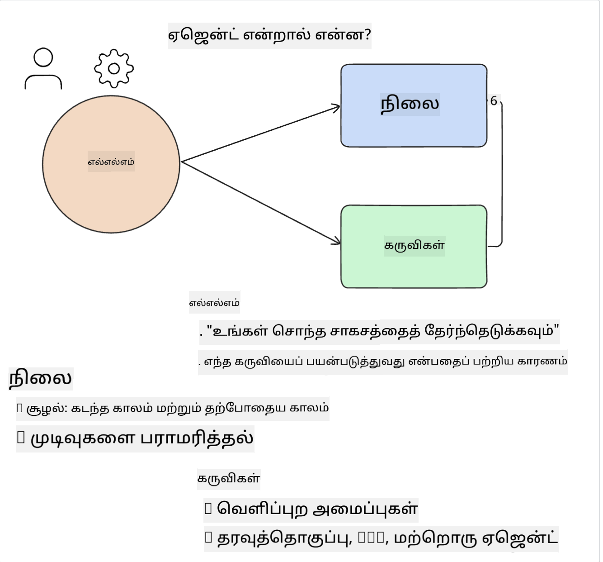
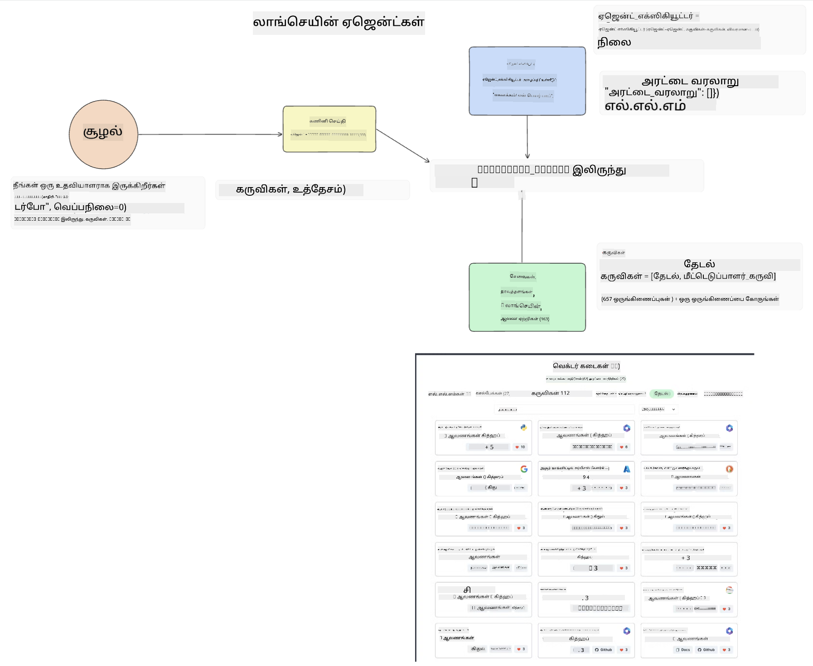
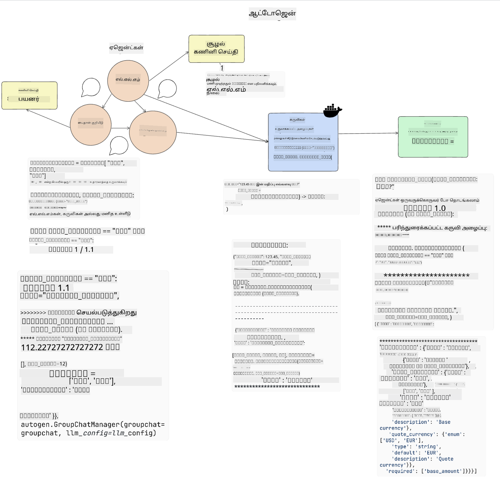
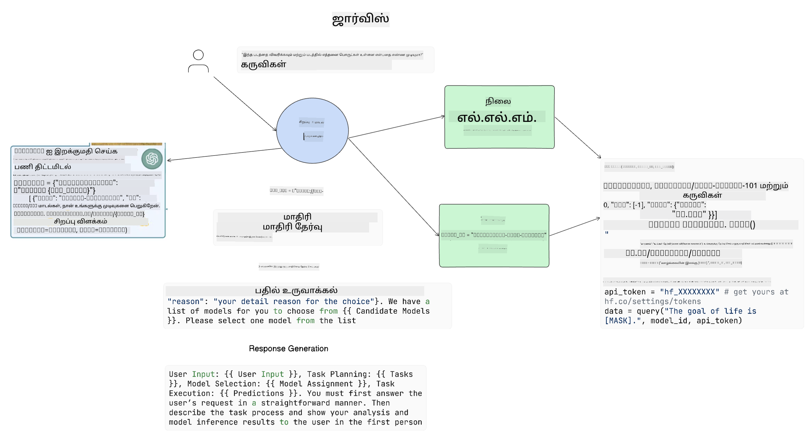

<!--
CO_OP_TRANSLATOR_METADATA:
{
  "original_hash": "8e8d1f6a63da606af7176a87ff8e92b6",
  "translation_date": "2025-10-18T02:47:10+00:00",
  "source_file": "17-ai-agents/README.md",
  "language_code": "ta"
}
-->
[](https://youtu.be/yAXVW-lUINc?si=bOtW9nL6jc3XJgOM)

## அறிமுகம்

AI முகவர்கள் என்பது ஜெனரேட்டிவ் AI இல் ஒரு சுவாரஸ்யமான முன்னேற்றமாகும், இது பெரிய மொழி மாடல்களை (LLMs) உதவியாளர்களிலிருந்து செயல்பாடுகளை மேற்கொள்ளும் முகவர்களாக உருவாக்க உதவுகிறது. AI முகவர் கட்டமைப்புகள், LLMக்களுக்கு கருவிகள் மற்றும் நிலை மேலாண்மைக்கு அணுகலை வழங்கும் பயன்பாடுகளை உருவாக்க டெவலப்பர்களுக்கு உதவுகின்றன. இந்த கட்டமைப்புகள் LLMகள் திட்டமிடும் செயல்பாடுகளை கண்காணிக்க பயனர்கள் மற்றும் டெவலப்பர்கள் அனுமதிக்கின்றன, இதன் மூலம் அனுபவ மேலாண்மையை மேம்படுத்துகின்றன.

இந்த பாடத்தில் கீழ்க்காணும் பகுதிகள் உள்ளடக்கப்படும்:

- AI முகவர் என்றால் என்ன என்பதைப் புரிந்துகொள்வது - AI முகவர் என்றால் என்ன?
- நான்கு வெவ்வேறு AI முகவர் கட்டமைப்புகளை ஆராய்வது - அவற்றை தனித்துவமாக ஆக்குவது என்ன?
- இந்த AI முகவர்களை வெவ்வேறு பயன்பாடுகளில் பயன்படுத்துவது - எப்போது AI முகவர்களை பயன்படுத்த வேண்டும்?

## கற்றல் இலக்குகள்

இந்த பாடத்தை எடுத்துக்கொண்ட பிறகு, நீங்கள்:

- AI முகவர்கள் என்னவென்று மற்றும் அவற்றை எப்படி பயன்படுத்தலாம் என்பதை விளக்க முடியும்.
- சில பிரபலமான AI முகவர் கட்டமைப்புகளின் வேறுபாடுகளைப் புரிந்துகொண்டு, அவற்றின் வேறுபாடுகளை அறிய முடியும்.
- AI முகவர்கள் எப்படி செயல்படுகின்றன என்பதைப் புரிந்து கொண்டு, அவற்றுடன் பயன்பாடுகளை உருவாக்க முடியும்.

## AI முகவர்கள் என்றால் என்ன?

AI முகவர்கள் ஜெனரேட்டிவ் AI உலகில் மிகவும் சுவாரஸ்யமான துறையாக உள்ளன. இந்த சுவாரஸ்யத்துடன், சில நேரங்களில் சொற்கள் மற்றும் அவற்றின் பயன்பாட்டில் குழப்பம் ஏற்படுகிறது. விஷயங்களை எளிமையாகவும், AI முகவர்களுக்கான பெரும்பாலான கருவிகளை உள்ளடக்கவும், நாம் இந்த வரையறையைப் பயன்படுத்தப் போகிறோம்:

AI முகவர்கள் பெரிய மொழி மாடல்களுக்கு (LLMs) **நிலை** மற்றும் **கருவிகள்** அணுகலை வழங்குவதன் மூலம் செயல்பாடுகளை மேற்கொள்ள அனுமதிக்கின்றன.



இந்த சொற்களை வரையறுக்கலாம்:

**பெரிய மொழி மாடல்கள்** - இந்த பாடத்தில் GPT-3.5, GPT-4, Llama-2 போன்ற மாடல்கள் குறிப்பிடப்பட்டுள்ளன.

**நிலை** - இது LLM செயல்படும் சூழலை குறிக்கிறது. LLM தனது கடந்த செயல்பாடுகளின் சூழல் மற்றும் தற்போதைய சூழலைப் பயன்படுத்தி, அடுத்த செயல்பாடுகளுக்கான முடிவுகளை வழிநடத்துகிறது. AI முகவர் கட்டமைப்புகள் டெவலப்பர்களுக்கு இந்த சூழலை எளிதாக பராமரிக்க உதவுகின்றன.

**கருவிகள்** - பயனர் கோரிய செயல்பாட்டை முடிக்கவும், LLM திட்டமிட்ட செயல்பாட்டை முடிக்கவும், LLMக்கு கருவிகள் தேவை. சில கருவிகளின் உதாரணங்கள் தரவுத்தொகுப்பு, API, வெளிப்புற பயன்பாடு அல்லது மற்றொரு LLM ஆக இருக்கலாம்!

இந்த வரையறைகள், அவற்றை எப்படி செயல்படுத்துகிறோம் என்பதைப் பார்ப்பதற்கு முன் உங்களுக்கு நல்ல அடிப்படை அறிவை வழங்கும். சில வெவ்வேறு AI முகவர் கட்டமைப்புகளை ஆராய்வோம்:

## LangChain முகவர்கள்

[LangChain முகவர்கள்](https://python.langchain.com/docs/how_to/#agents?WT.mc_id=academic-105485-koreyst) என்பது மேலே கொடுக்கப்பட்ட வரையறைகளின் ஒரு செயல்படுத்தல் ஆகும்.

**நிலையை** மேலாண்மை செய்ய, இது `AgentExecutor` என்ற ஒரு உள்ளமைக்கப்பட்ட செயல்பாட்டைப் பயன்படுத்துகிறது. இது வரையறுக்கப்பட்ட `agent` மற்றும் அதற்கு கிடைக்கும் `tools`ஐ ஏற்றுக்கொள்கிறது.

`Agent Executor` உரையாடல் வரலாற்றையும் சேமித்து உரையாடலின் சூழலை வழங்குகிறது.



LangChain ஒரு [கருவிகளின் பட்டியலை](https://integrations.langchain.com/tools?WT.mc_id=academic-105485-koreyst) வழங்குகிறது, இது உங்கள் பயன்பாட்டில் இறக்குமதி செய்ய LLMக்கு அணுகலை வழங்குகிறது. இவை சமூகத்தால் மற்றும் LangChain குழுவால் உருவாக்கப்பட்டவை.

நீங்கள் இந்த கருவிகளை வரையறுத்து, அவற்றை `Agent Executor`க்கு அனுப்பலாம்.

AI முகவர்களைப் பற்றி பேசும்போது, தெளிவான பார்வை மற்றொரு முக்கிய அம்சமாகும். LLM எந்த கருவியை பயன்படுத்துகிறது மற்றும் ஏன் என்பதை பயன்பாட்டு டெவலப்பர்கள் புரிந்துகொள்வது முக்கியம். இதற்காக, LangChain குழு LangSmithஐ உருவாக்கியுள்ளது.

## AutoGen

அடுத்த AI முகவர் கட்டமைப்பு [AutoGen](https://microsoft.github.io/autogen/?WT.mc_id=academic-105485-koreyst) ஆகும். AutoGen இன் முக்கிய கவனம் உரையாடல்களாகும். முகவர்கள் **உரையாடக்கூடிய** மற்றும் **தனிப்பயனாக்கக்கூடிய**வையாக உள்ளனர்.

**உரையாடக்கூடியது -** LLMகள் மற்றொரு LLM உடன் உரையாடலைத் தொடங்கி தொடர முடியும், ஒரு செயல்பாட்டை முடிக்க. இது `AssistantAgents` உருவாக்கி, அதற்கு ஒரு குறிப்பிட்ட அமைப்பு செய்தியை வழங்குவதன் மூலம் செய்யப்படுகிறது.

```python

autogen.AssistantAgent( name="Coder", llm_config=llm_config, ) pm = autogen.AssistantAgent( name="Product_manager", system_message="Creative in software product ideas.", llm_config=llm_config, )

```

**தனிப்பயனாக்கக்கூடியது** - முகவர்கள் LLMக்களாக மட்டுமல்லாமல், பயனர் அல்லது ஒரு கருவியாகவும் வரையறுக்கப்படலாம். டெவலப்பராக, நீங்கள் ஒரு `UserProxyAgent`ஐ வரையறுக்கலாம், இது ஒரு செயல்பாட்டை முடிக்க பயனரின் கருத்துக்களைப் பெற பொறுப்பாக இருக்கும். இந்த கருத்து செயல்பாட்டை தொடரவோ அல்லது நிறுத்தவோ உதவலாம்.

```python
user_proxy = UserProxyAgent(name="user_proxy")
```

### நிலை மற்றும் கருவிகள்

நிலையை மாற்றவும் மேலாண்மை செய்யவும், உதவியாளர் முகவர் Python குறியீட்டை உருவாக்கி செயல்பாட்டை முடிக்கிறது.

இது செயல்முறை எப்படி செயல்படுகிறது என்பதற்கான ஒரு உதாரணம்:



#### LLM அமைப்பு செய்தியுடன் வரையறுக்கப்பட்டது

```python
system_message="For weather related tasks, only use the functions you have been provided with. Reply TERMINATE when the task is done."
```

இந்த அமைப்பு செய்தி இந்த குறிப்பிட்ட LLMக்கு அதன் செயல்பாட்டிற்கு எந்த செயல்பாடுகள் தொடர்புடையவை என்பதை வழிநடத்துகிறது. நினைவில் கொள்ளுங்கள், AutoGen உடன் நீங்கள் பல்வேறு அமைப்பு செய்திகளுடன் பல உதவியாளர் முகவர்களை வரையறுக்கலாம்.

#### உரையாடல் பயனரால் தொடங்கப்படுகிறது

```python
user_proxy.initiate_chat( chatbot, message="I am planning a trip to NYC next week, can you help me pick out what to wear? ", )

```

இந்த user_proxy (மனிதன்) அனுப்பும் செய்தி, முகவரின் செயல்பாடுகளை ஆராய்வதற்கான செயல்முறையை தொடங்கும்.

#### செயல்பாடு செயல்படுத்தப்படுகிறது

```bash
chatbot (to user_proxy):

***** Suggested tool Call: get_weather ***** Arguments: {"location":"New York City, NY","time_periond:"7","temperature_unit":"Celsius"} ******************************************************** --------------------------------------------------------------------------------

>>>>>>>> EXECUTING FUNCTION get_weather... user_proxy (to chatbot): ***** Response from calling function "get_weather" ***** 112.22727272727272 EUR ****************************************************************

```

ஆரம்ப உரையாடல் செயல்படுத்தப்பட்ட பிறகு, முகவர் அழைக்க வேண்டிய கருவியை பரிந்துரைக்கும். இந்தக் காட்சியில், இது `get_weather` என்ற ஒரு செயல்பாடாகும். உங்கள் கட்டமைப்பின் அடிப்படையில், இந்த செயல்பாடு தானாகவே செயல்படுத்தப்பட்டு முகவரால் வாசிக்கப்படலாம் அல்லது பயனர் உள்ளீட்டின் அடிப்படையில் செயல்படுத்தப்படலாம்.

AutoGen குறியீட்டு மாதிரிகளின் [பட்டியலை](https://microsoft.github.io/autogen/docs/Examples/?WT.mc_id=academic-105485-koreyst) நீங்கள் ஆராய்ந்து, உருவாக்கத்தைத் தொடங்கலாம்.

## Taskweaver

அடுத்த முகவர் கட்டமைப்பாக [Taskweaver](https://microsoft.github.io/TaskWeaver/?WT.mc_id=academic-105485-koreyst) உள்ளது. இது "கோடு முதன்மை" முகவராக அறியப்படுகிறது, ஏனெனில் இது `strings` உடன் மட்டுமல்லாமல் Python இல் DataFrames உடன் வேலை செய்ய முடியும். இது தரவுப் பகுப்பாய்வு மற்றும் உருவாக்க செயல்பாடுகளுக்கு மிகவும் பயனுள்ளதாக இருக்கும். இது வரைபடங்கள் மற்றும் வரைபடங்களை உருவாக்குதல் அல்லது சீரற்ற எண்களை உருவாக்குதல் போன்றவற்றாக இருக்கலாம்.

### நிலை மற்றும் கருவிகள்

உரையாடலின் நிலையை மேலாண்மை செய்ய, TaskWeaver `Planner` என்ற கருத்தை பயன்படுத்துகிறது. `Planner` என்பது LLM ஆகும், இது பயனர்களின் கோரிக்கையை எடுத்துக்கொண்டு, அந்த கோரிக்கையை நிறைவேற்ற தேவையான செயல்பாடுகளை வரைபடம் தீட்டுகிறது.

செயல்பாடுகளை முடிக்க, `Planner` கருவிகளின் தொகுப்பான `Plugins`க்கு அணுகலை வழங்குகிறது. இது Python வகுப்புகள் அல்லது பொதுவான குறியீட்டு மொழிபெயர்ப்பாளராக இருக்கலாம். இந்த plugins, LLM சரியான pluginஐ தேடுவதற்கு உதவ, embeddings ஆக சேமிக்கப்படுகிறது.


இது அசாதாரணத்தை கண்டறிய ஒரு plugin க்கான உதாரணம்:

```python
class AnomalyDetectionPlugin(Plugin): def __call__(self, df: pd.DataFrame, time_col_name: str, value_col_name: str):
```

குறியீடு செயல்படுத்துவதற்கு முன் சரிபார்க்கப்படுகிறது. Taskweaver இல் சூழலை மேலாண்மை செய்ய மற்றொரு அம்சம் `அனுபவம்`. அனுபவம் ஒரு உரையாடலின் சூழலை நீண்ட காலத்திற்கு YAML கோப்பில் சேமிக்க அனுமதிக்கிறது. இது LLM முந்தைய உரையாடல்களுக்கு வெளிப்படுவதால், குறிப்பிட்ட செயல்பாடுகளில் காலப்போக்கில் மேம்படுவதற்கு உள்ளமைக்கப்படலாம்.

## JARVIS

நாம் ஆராயும் கடைசி முகவர் கட்டமைப்பு [JARVIS](https://github.com/microsoft/JARVIS?tab=readme-ov-file?WT.mc_id=academic-105485-koreyst) ஆகும். JARVIS ஐ தனித்துவமாக ஆக்குவது என்னவென்றால், இது ஒரு LLMஐ உரையாடலின் `நிலையை` மேலாண்மை செய்ய பயன்படுத்துகிறது, மற்றும் `கருவிகள்` மற்ற AI மாடல்கள். ஒவ்வொரு AI மாடல்களும் குறிப்பிட்ட செயல்பாடுகளைச் செய்ய சிறப்பு மிக்க மாடல்களாக உள்ளன, உதாரணமாக பொருள் கண்டறிதல், உரை மாற்றம் அல்லது பட விளக்கம்.



LLM, ஒரு பொதுவான நோக்கமுடைய மாடலாக, பயனரிடமிருந்து கோரிக்கையைப் பெறுகிறது மற்றும் குறிப்பிட்ட செயல்பாடு மற்றும் அந்த செயல்பாட்டை முடிக்க தேவையான எந்தவொரு அளவுரு/தரவை அடையாளம் காண்கிறது.

```python
[{"task": "object-detection", "id": 0, "dep": [-1], "args": {"image": "e1.jpg" }}]
```

LLM பின்னர் கோரிக்கையை JSON போன்ற வடிவத்தில் சிறப்பு AI மாடல் புரிந்துகொள்ளும் வகையில் வடிவமைக்கிறது. AI மாடல் செயல்பாட்டின் அடிப்படையில் தனது கணிப்பை திருப்பி அனுப்பிய பிறகு, LLM பதிலைப் பெறுகிறது.

செயல்பாட்டை முடிக்க பல மாடல்கள் தேவைப்பட்டால், பயனருக்கு பதிலை உருவாக்குவதற்கு முன், அந்த மாடல்களிடமிருந்து பதிலைப் புரிந்துகொண்டு அவற்றை ஒன்றிணைக்கும்.

பயனர் ஒரு படத்தில் உள்ள பொருட்களின் விளக்கம் மற்றும் எண்ணிக்கையை கோரும்போது இது எப்படி செயல்படும் என்பதை கீழே உள்ள உதாரணம் காட்டுகிறது:

## பணிக்கூறல்

AI முகவர்களைப் பற்றிய உங்கள் கற்றலை AutoGen உடன் தொடர:

- கல்வி ஸ்டார்ட்அப் நிறுவனத்தின் பல்வேறு துறைகளுடன் வணிகக் கூட்டத்தை ஒத்திகை செய்யும் ஒரு பயன்பாட்டை உருவாக்கவும்.
- LLMக்கள் வெவ்வேறு தன்மைகள் மற்றும் முன்னுரிமைகளைப் புரிந்துகொள்ள வழிநடத்தும் அமைப்பு செய்திகளை உருவாக்கவும், மேலும் பயனர் புதிய தயாரிப்பு யோசனையை முன்மொழிய அனுமதிக்கவும்.
- LLM பின்னர் ஒவ்வொரு துறையிலிருந்தும் பின்வரும் கேள்விகளை உருவாக்கி, யோசனையை மற்றும் தயாரிப்பு யோசனையை மேம்படுத்த வேண்டும்.

## கற்றல் இங்கே நிற்காது, பயணத்தை தொடருங்கள்

இந்த பாடத்தை முடித்த பிறகு, [ஜெனரேட்டிவ் AI கற்றல் தொகுப்பை](https://aka.ms/genai-collection?WT.mc_id=academic-105485-koreyst) பாருங்கள், உங்கள் ஜெனரேட்டிவ் AI அறிவை மேலும் மேம்படுத்த!

---

**குறிப்பு**:  
இந்த ஆவணம் AI மொழிபெயர்ப்பு சேவை [Co-op Translator](https://github.com/Azure/co-op-translator) பயன்படுத்தி மொழிபெயர்க்கப்பட்டுள்ளது. நாங்கள் துல்லியத்திற்காக முயற்சிக்கின்றோம், ஆனால் தானியங்கி மொழிபெயர்ப்புகளில் பிழைகள் அல்லது தவறுகள் இருக்கக்கூடும் என்பதை கவனத்தில் கொள்ளவும். அதன் தாய்மொழியில் உள்ள அசல் ஆவணம் அதிகாரப்பூர்வ ஆதாரமாக கருதப்பட வேண்டும். முக்கியமான தகவல்களுக்கு, தொழில்முறை மனித மொழிபெயர்ப்பு பரிந்துரைக்கப்படுகிறது. இந்த மொழிபெயர்ப்பைப் பயன்படுத்துவதால் ஏற்படும் எந்த தவறான புரிதல்கள் அல்லது தவறான விளக்கங்களுக்கு நாங்கள் பொறுப்பல்ல.