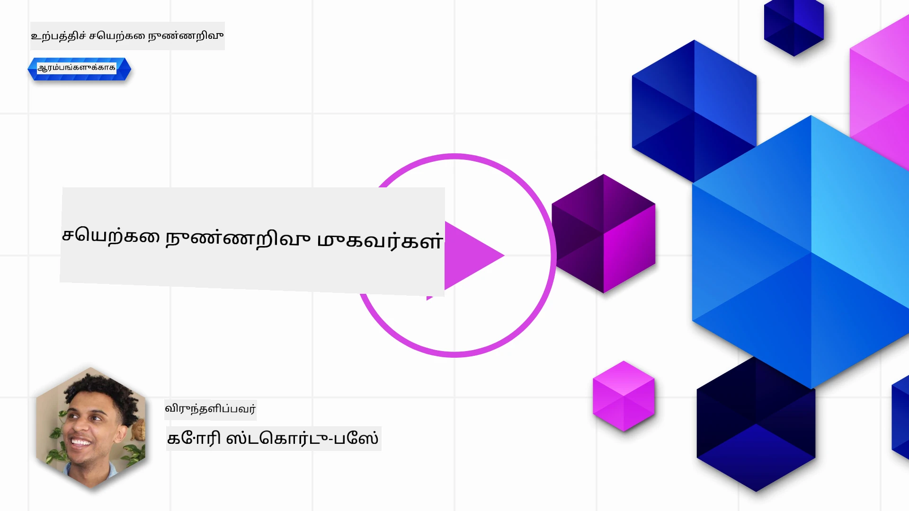
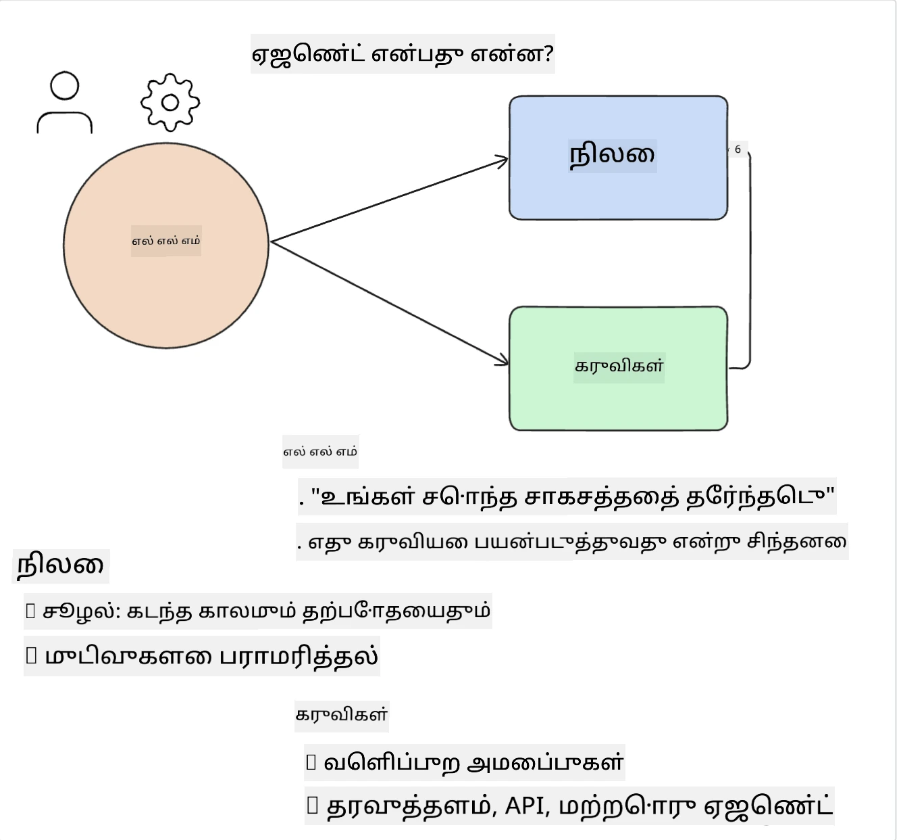
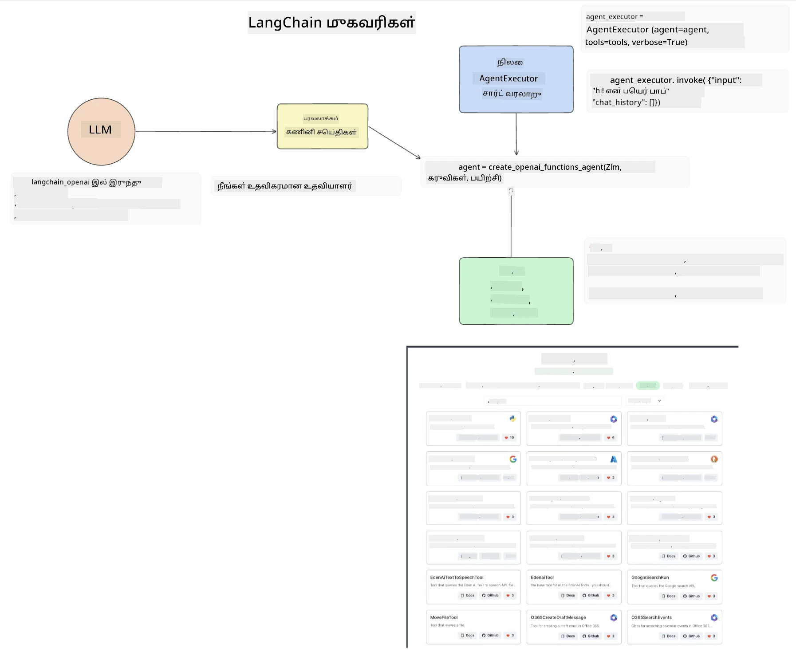
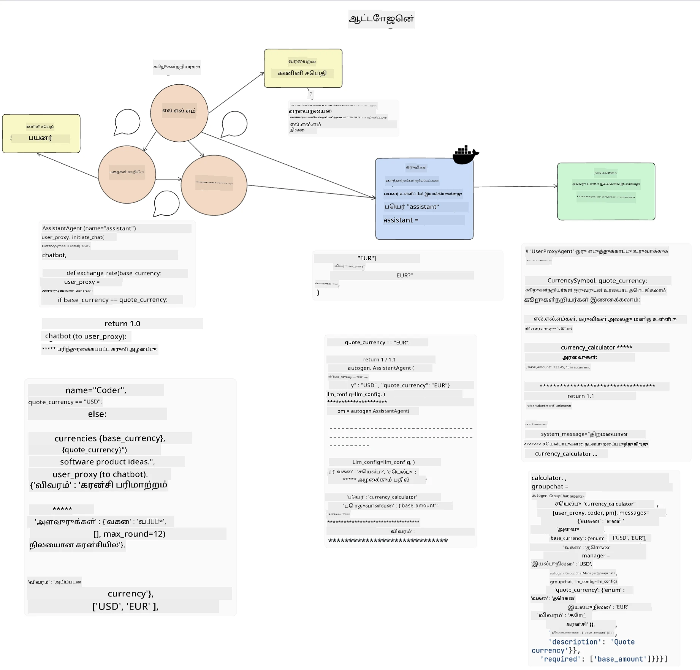
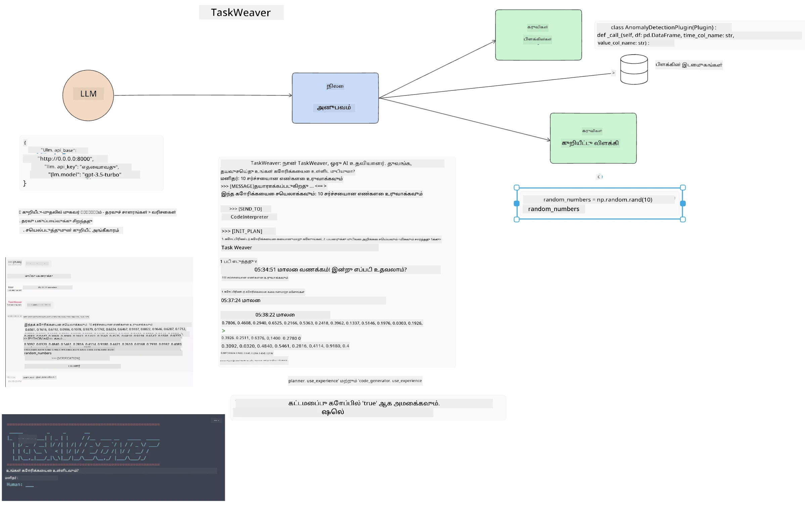
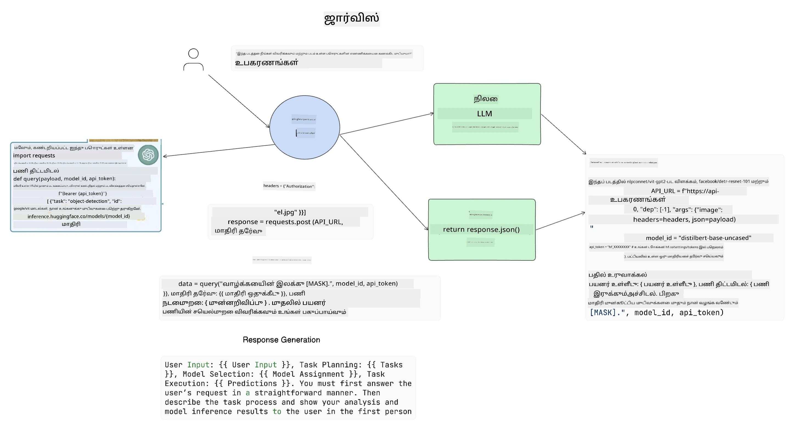

[](https://youtu.be/yAXVW-lUINc?si=bOtW9nL6jc3XJgOM)

## அறிமுகம்

AI முகவர்கள் என்பது Generative AI இல் ஒரு சுவாரஸியமான முன்னேற்றத்தை பிரதிநிதித்துவப்படுத்துகிறது, இது பெரும் மொழி மாதிரிகளை (LLMs) உதவியாளர்களிலிருந்து செயல்களை மேற்கொள்ளக்கூடிய முகவர்களாக மாற்றுகிறது. AI முகவர் கட்டமைப்புகள் அபிவிருத்தியாளர்களுக்கு LLMகளுக்கு கருவிகள் மற்றும் நிலை மேலாண்மைக்கு அணுகலை வழங்கும் பயன்பாடுகளை உருவாக்க உதவுகின்றன. இந்த கட்டமைப்புகள் மேலும் பார்வைத் திறனைக் கூட்டுகின்றன, இதனால் பயனாளர்களும் அபிவிருத்தியாளர்களும் LLMகள் திட்டமிட்டுள்ள செயல்களை கண்காணித்து, அனுபவ மேலாண்மையை மேம்படுத்த முடியும்.

இந்த பாடத்தில் பின்வரும் பகுதிகள் காணப்படும்:

- AI முகவர் என்றால் என்ன என்பதை புரிந்துகொள்ளுதல் - AI முகவர் என்பது என்ன?
- நான்கு விதமான AI முகவர் கட்டமைப்புகளை ஆராய்தல் - அவை என்னவென்று தனித்துவமானவை?
- இந்த AI முகவர்கள் வெவ்வேறு பயன்பாடுகளில் எப்படி பயன்படுத்தப்பட வேண்டும் என்பதைக் கண்டறிதல் - எப்போது AI முகவர்களை பயன்படுத்த வேண்டும்?

## கற்றல் இலக்குகள்

இந்த பாடம் முடித்த பிறகு, நீங்கள்:

- AI முகவர்கள் என்ன மற்றும் அவற்றைப் எப்படி பயன்படுத்தலாம் என்பதை விளக்க முடியும்.
- சில பிரசித்தி பெற்ற AI முகவர் கட்டமைப்புகளுக்கிடையேயான வேறுபாடுகளை புரிந்து கொள்ள முடியும்.
- AI முகவர்கள் எப்படி செயல்படுகின்றன என்பதைப் புரிந்து கொண்டு, அவற்றுடன் பயன்பாடுகளை உருவாக்க முடியும்.

## AI முகவர்கள் என்றால் என்ன?

AI முகவர்கள் என்பது Generative AI உலகில் மிகவும் சுவாரஸியமான துறை. இந்த சுவாரஸியத்துடன் சில சமயம் சொற்களைப் பற்றிய குழப்பமும், பயன்பாட்டும் ஏற்படுகிறது. எளிதாகவும் மற்றும் பெரும்பாலான கருவிகள் குறிக்க AI முகவர்களை உள்ளடக்கியவற்றாகவும் இருப்பதற்காக, இதுவரை வழங்கிய வரையறைகள் பின்வருமாறு:

AI முகவர்கள் பெரும் மொழி மாதிரிகள் (LLMs) தங்களுக்கு **நிலை** மற்றும் **கருவிகள்** வழங்கப்படுவதன் மூலம் பணிகளை செய்ய முடியும் ஆகின்றன.



இந்த சொற்களை வரையறுத்து கொள்வோம்:

**பெரும் மொழி மாதிரிகள்** - இந்த பாடத்திட்டத்தில் குறிப்பிடப்படும் மாதிரிகள், உதாரணத்திற்கு GPT-3.5, GPT-4, Llama-2 போன்றவை.

**நிலை** - LLM செயல் நடக்கும் சூழலை குறிக்கிறது. LLM தன் கடந்த செயல்களின் மற்றும் தற்போதைய சூழலின் தரவுகளை பயன்படுத்தி, அடுத்த செயல்களைத் தீர்மானிக்கிறது. AI முகவர் கட்டமைப்புகள் அபிவிருத்தியாளர்களுக்கு இந்த சூழலை எளிதாக பராமரிக்க உதவுகின்றன.

**கருவிகள்** - பயனர் கோரிய செயலை LLM திட்டமிட்டது நிறைவேற்ற, LLM கருவிகளுக்கு அணுகல் தேவை. உதாரணத்திற்கு ஒரு தரவுத்தளம், API, வெளிப்புற பயன்பாடு அல்லது மற்றொரு LLM ஆகியவை கருவிகளாக இருக்கலாம்!

இந்த வரையறைகள் மறுபடியும் தெளிவாக புரிந்துகொள்ள உதவும் என்று நம்புகிறோம். இப்போது சில வேறுபட்ட AI முகவர் கட்டமைப்புக்களை ஆராய்ந்து பார்க்கலாம்:

## லாங்க்செயின் முகவர்கள்

[LangChain முகவர்கள்](https://python.langchain.com/docs/how_to/#agents?WT.mc_id=academic-105485-koreyst) மேலே வழங்கிய வரையறைகளின் நிறைவேற்றமாகும்.

**நிலை** கையாள, இது `AgentExecutor` எனப்படும் உள்ளமைவுச் செயல்பாட்டைப் பயன்படுத்துகிறது. இது விவரிக்கப்பட்ட `agent` மற்றும் அதற்கான `tools`ஐ ஏற்றுக் கொள்கிறது.

`Agent Executor` கூட்டு உரையாடல் வரலாற்றையும் சேமித்து உரையாடலின் சூழலை பயன்பாட்டிற்கு வழங்கும்.



LangChain, LLM களை அணுக அனுமதிக்கும் [கருவிகளின் பட்டியலை](https://integrations.langchain.com/tools?WT.mc_id=academic-105485-koreyst) வழங்குகிறது. இவை சமூகத்தாலும் LangChain குழுவாலும் உருவாக்கப்பட்டவை.

பின்னர் இந்த கருவிகளை வரையறுத்து `Agent Executor`க்கு வழங்க முடியும்.

AI முகவர்களோடு பேசும்போது பார்வைத்திறன் மிகவும் முக்கியம். எந்த கருவி LLM பயன்படுத்துகிறதோ மற்றும் ஏன் என்பதைக் புரிந்துகொள்ள பயன்பாடு அபிவிருத்தியாளர்களுக்கு அவசியம். அதற்காக LangChain குழு LangSmith ஐ உருவாக்கியுள்ளது.

## AutoGen

அடுத்த AI முகவர் கட்டமைப்பு பற்றி பேசப்போகிறோம் என்பது [AutoGen](https://microsoft.github.io/autogen/?WT.mc_id=academic-105485-koreyst). AutoGenயின் முக்கிய கவனம் உரையாடல்கள் (conversations) ஆகும். முகவர்கள் இரண்டும் **உரையாடக்கூடிய** மற்றும் **தனிப்பயனாக்கக்கூடிய** ஆவார்கள்.

**உரையாடக்கூடியது -** LLMகள் மற்றொரு LLM உடன் உரையாடலைத் தொடங்கி, தொடர்ந்து ஒரு பணியை நிறைவேற்ற முடியும். இது `AssistantAgents` உருவாக்கி, அவற்றுக்கு குறிப்பிட்ட கணினி செய்தி கொடுத்து செய்யப்படுகிறது.

```python

autogen.AssistantAgent( name="Coder", llm_config=llm_config, ) pm = autogen.AssistantAgent( name="Product_manager", system_message="Creative in software product ideas.", llm_config=llm_config, )

```

**தனிப்பயனாக்கக்கூடியது** - முகவர்கள் LLMகளாக மட்டுமல்ல, பயனராகவும் கருவியாகவும் வரையறுக்கப்படலாம். அபிவிருத்தியாளராக நீங்கள் `UserProxyAgent`ஐ வரையறுக்கலாம், இது செயல்பாட்டை நிறைவேற்ற பயனருடன் கருத்துக்களிக்க பொறுப்பாக இருக்கும். இந்த கருத்துக்கள் பணியின் செயல்பாட்டை தொடரவோ நிறுத்தவோ செய்யலாம்.

```python
user_proxy = UserProxyAgent(name="user_proxy")
```

### நிலை மற்றும் கருவிகள்

நிலை மாற்றி நிர்வகிக்க, உதவியாளர் முகவர் Python குறியீட்டை உருவாக்கி பணியை முடிக்கின்றான்.

இங்கே செயல்முறை உதாரணம்:



#### கணினி செய்தியுடன் வரையறுக்கப்பட்ட LLM

```python
system_message="For weather related tasks, only use the functions you have been provided with. Reply TERMINATE when the task is done."
```

இந்த கணினி செய்தி この குறிப்பிட்ட LLMக்கு எந்த செயல்பாடுகள் தொடர்புடையவை என்பதைக் காட்டுகிறது. AutoGen மூலம் பல AssistantAgentsஎன்பவைகள் வெவ்வேறு கணினி செய்திகள் கொண்டு வரையறுக்கப்பட முடியும்.

#### பயனரால் அரட்டை துவங்குதல்

```python
user_proxy.initiate_chat( chatbot, message="I am planning a trip to NYC next week, can you help me pick out what to wear? ", )

```

`user_proxy` (மனிதர்) இருந்து வந்த இந்த செய்தி முகவரி, முகவரின் செயல்பாட்டைத் தொடங்கும், எத்தகைய செயல்பாடுகளைச் செயல்படுத்த வேண்டும் என்பதைக் கண்டறியும்.

#### செயல்பாடு நிறைவேற்பு

```bash
chatbot (to user_proxy):

***** Suggested tool Call: get_weather ***** Arguments: {"location":"New York City, NY","time_periond:"7","temperature_unit":"Celsius"} ******************************************************** --------------------------------------------------------------------------------

>>>>>>>> EXECUTING FUNCTION get_weather... user_proxy (to chatbot): ***** Response from calling function "get_weather" ***** 112.22727272727272 EUR ****************************************************************

```

முதன்மையான உரையாடல் செயலாக்கப்பட்ட பின், முகவர் அழைக்க வேண்டிய கருவியை பரிந்துரைக்கப் பார்க்கிறது. இங்கே அது `get_weather` என்ற செயல்பாடு. உங்கள் கட்டமைப்பின் படி, இந்த செயல்பாடு தானாகவே இயங்கக்கூடும் அல்லது பயனர் உள்ளீட்டிலிருந்து இயங்கக்கூடும்.

தொடக்கமாக்க எப்படி AutoGen குறியீட்டு எடுத்துக்காட்டுகளை [இங்கே](https://microsoft.github.io/autogen/docs/Examples/?WT.mc_id=academic-105485-koreyst) பார்க்கலாம்.

## Taskweaver

அடுத்த முகவர் கட்டமைப்பு [Taskweaver](https://microsoft.github.io/TaskWeaver/?WT.mc_id=academic-105485-koreyst) ஆகும். இது "code-first" முகவராக அறியப்படுகிறது, ஏனெனில் இது `strings`யுடன் மட்டுமல்லாமல், Python இல் DataFrames உடனும் பணியாற்ற முடியும். இது தரவு பகுப்பாய்வு மற்றும் உருவாக்க பணிகளில் மிகவும் உதவிகரமாகிறது. எடுத்துக்காட்டுக்கு வரைபடங்கள், சதவீதங்கள் உருவாக்குதல் அல்லது சீரல்ல எண்ணிக்கைகள் உருவாக்குதல் போன்றவை.

### நிலையும் கருவிகளும்

உரையாடல் நிலையை நிர்வகிக்க, TaskWeaver `Planner` என்ற கான்செப்டை பயன்படுத்துகிறது. `Planner` என்பது LLM ஆகும், இது பயனர்களின் கோரிக்கையை எடுத்து, அதை நிறைவேற்ற தேவையான பணிகளை வரைதிருக்கும்.

பணிகளை நிறைவேற்ற, `Planner`க்கு `Plugins` என்ற கருவிகள் தொகுப்புக்கு அணுகல் உண்டு. இது Python வகுப்புகளோ அல்லது பொதுவான குறியீடு விளக்கி ஆக இருக்கலாம். இந்த Plugins கள் embeddingsஆக சேமிக்கப்படுகின்றன, இதனால் LLM சரியான pluginஐ தேட எளிதாகிறது.



அனாமலி கண்டறிதல் கையாளும் pluginஐ எடுத்துக்காட்டாகக் காணலாம்:

```python
class AnomalyDetectionPlugin(Plugin): def __call__(self, df: pd.DataFrame, time_col_name: str, value_col_name: str):
```

குறியீடு இயக்குவதற்கு முன் சரிபார்க்கப்படுகிறது. Taskweaver இல் context மேலாண்மைக்கு இன்னொரு அம்சம் `experience`. அனுபவம் என்பது உரையாடலின் சூழலை நீண்டகாலத்துக்கு YAML கோப்பில் சேமிக்க உதவுகிறது. இது config செய்து LLM குறிப்பிட்ட பணிகளில் முன்னேற்றம் அடைய முன்னைய உரையாடல்களைப் பார்த்து கற்றுக் கொள்ளலாம்.

## JARVIS

கடைசி முகவர் கட்டமைப்பு நாங்கள் ஆராயப்போகிறது [JARVIS](https://github.com/microsoft/JARVIS?tab=readme-ov-file&WT.mc_id=academic-105485-koreyst). JARVISன் தனித்துவம் என்னவென்றால், உரையாடலின் `நிலை`யை நிர்வகிக்க LLMஐ பயன்படுத்துகிறது, மற்றும் `கருவிகள்` என்பது வேறு AI மாதிரிகள் ஆகும். ஒவ்வொரு AI மாதிரியும் குறிப்பிட்ட பணிகளைச் செய்ய தயாரிப்பாகும், உதாரணத்திற்கு பொருள் கண்டறிதல், உரை மாற்றம் அல்லது பட காப்பிடுதல் போன்றவை.



LLM, பொதுவான மாதிரியாக, பயனரிடம் இருந்து கோரிக்கையைப் பெற்று, குறிப்பிட்ட பணி மற்றும் தேவையான தரவு/வாதங்களை அடையாளம் காண்கிறது.

```python
[{"task": "object-detection", "id": 0, "dep": [-1], "args": {"image": "e1.jpg" }}]
```

பின்னர் LLM கோரிக்கையை சிறப்புள்ள AI மாதிரி புரிந்துகொள்ளும் JSON போன்ற வடிவத்தில் அமைக்கிறது. AI மாதிரி பணி சார்ந்த முன்னறிவிப்பு திரும்ப அனுப்பும், அதனை LLM பெறுகிறது.

ஒருசில பணிகளை நிறைவேற்ற பல மாதிரிகள் தேவைப்படும்போது, ஐந்தாவது மாதிரிகளின் பதிலை முடிவெடுத்து பயனர் பதிலுக்காக ஒன்று சேர்க்கிறது.

படத்தில் பொருட்களின் விளக்கம் மற்றும் எண்ணிக்கையை கேட்கும் உதாரணம் கீழே உள்ளது:

## பணிகள்

AI முகவர்கள் குறித்து நீங்கள் மேலும் கற்றுக்கொள்ள AutoGen கொண்டு இந்த பயன்பாடுகளை உருவாக்கலாம்:

- கல்விப் புது நிறுவனம் பல்வேறு துறைகளுடன் நடத்தும் வணிக கூட்டத்தை உருவாக்கும் பயன்பாடு.
- LLMகளை பலவிதக் கதாபாத்திரங்களையும் முன்னுரிமைகளையும் புரிந்துகொள்ள வழிகாட்டும் கணினி செய்திகள் உருவாக்கவும், பயனருக்கு புதிய தயாரிப்பு யோசனையை முன்மொழிய உதவும்.
- பிறகு LLM ஒவ்வொரு துறையினரிடமிருந்து கேள்விகளை உருவாக்கி, முன்மொழிவை மற்றும் தயாரிப்பு யோசனையை மேம்படுத்த உதவும்.

## கற்றல் இங்கே நிறுத்த வேண்டாம், பயணத்தை தொடருங்கள்

இந்த பாடம் முடிந்ததும், எங்கள் [Generative AI கற்றல் தொகுப்பை](https://aka.ms/genai-collection?WT.mc_id=academic-105485-koreyst) பாருங்கள் மற்றும் உங்கள் Generative AI அறிவை தொடர்ந்து வளர்த்தெடுங்கள்!

---

<!-- CO-OP TRANSLATOR DISCLAIMER START -->
**பயன்பாட்டு அறிவிப்பு**:  
இந்த ஆவணம் AI மொழிபெயர்ப்பு சேவையான [Co-op Translator](https://github.com/Azure/co-op-translator) பயன்படுத்தி மொழிபெயர்க்கப்பட்டுள்ளது. நாங்கள் துல்லியத்திற்காக முயற்சித்தாலும், தானாக செய்யப்பட்ட மொழிபெயர்ப்புகளில் பிழைகள் அல்லது தவறுகள் இருக்க வாய்ப்பு உள்ளது என்பதை கவனிக்கவும். அசல் ஆவணம் அதன் சொந்த மொழியில் அதிகாரப்பூர்வ ஆதாரமாக கருதப்பட வேண்டும். முக்கியமான தகவல்களுக்கு, தொழில்முறை மனித மொழிபெயர்ப்பு பரிந்துரைக்கப்படுகிறது. இந்த மொழிபெயர்ப்பைப் பயன்படுத்துவதில் ஏற்படும் எந்தவொரு தவிர்ப்புகள் அல்லது தவறான புரிதல்களுக்கும் நாம் பொறுப்பில்லை.
<!-- CO-OP TRANSLATOR DISCLAIMER END -->