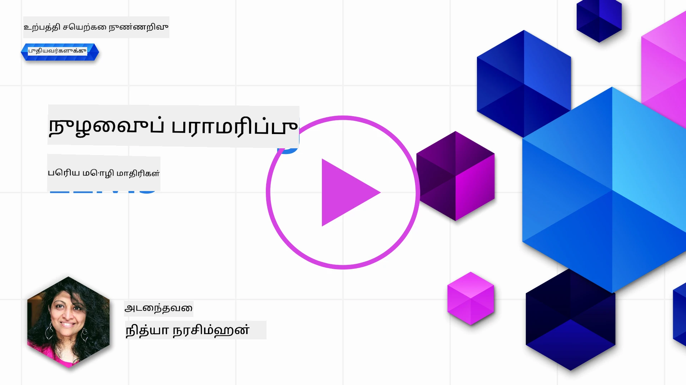
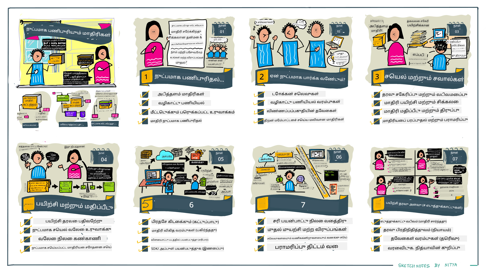

# உங்கள் LLM-ஐ நுட்பமாகத் திருத்தல்

பெரிய மொழி மாதிரிகள் பயன்படுத்தி உருவாக்கும் AI பயன்பாடுகளை உருவாக்கும் போது புதுமையான சவால்கள் உருவாகின்றன. முக்கிய பிரச்சனை இது மாதிரியான மாதிரி கொடுக்கப்பட்ட பயனர் கோரிக்கைக்கு உருவாக்கும் உள்ளடக்கத்தில் பதில்களின் தரம் (நுணுக்கமும் பொருத்தத்தையும்) உறுதிசெய்தல் ஆகும். கடந்த பாடங்களில், நாம் முன்மொழிவு பொறியியல் மற்றும் மீட்டெடுக்கும்-வளர்த்து உருவாக்குதல் போன்ற தொழில்நுட்பங்கள் மூலம், _முன்மொழிவு உள்ளீட்டை மாற்றவோ_ முயன்றோம்.

இன்று, நாம் ஒரு மூன்றாவது தொழில்நுட்பமான **நுட்பமாகத் திருத்தலை** விவாதிக்கின்றோம், இது _மேலும் தரவினால் மாதிரியை மறுதடைகிறது_ என்பதன் மூலம் சவாலை சமாளிக்க முயற்சிக்கிறது. விவரங்களுக்கு நுழையவோம்.

## கற்றல் நோக்கங்கள்

இந்தப் பாடம் முன்னேற்பாடான மொழி மாதிரிகளுக்கான நுட்பமாக திருத்தல் கருத்தை அறிமுகப்படுத்துகிறது, இந்த அணுகுமுறையின் நன்மைகள் மற்றும் சவால்களை ஆராய்கிறது, மேலும் உங்கள் உருவாக்கும் AI மாதிரிகளின் செயல்திறனை மேம்படுத்த நுட்பமாகத் திருத்தலை எப்போது மற்றும் எப்படி பயன்படுத்துவது என்பதில் வழிகாட்டுகிறது.

இந்தப் பாடம் முடிவில், நீங்கள் கீழ்க்கண்ட கேள்விகளுக்கு பதில் சொல்லக்கூடும்:

- மொழி மாதிரிகளுக்கான நுட்பமாகத் திருத்தல் என்றால் என்ன?
- எப்போது, மற்றும் ஏன் நுட்பமாகத் திருத்தல் பயனுள்ளது?
- முன்னேற்பாடான மாதிரியை எப்படி நுட்பமாகத் திருத்துவது?
- நுட்பமாகத் திருத்தலின் வரம்புகள் என்ன?

தயார்? தொடங்குவோம்.

## விளக்கப்படம் கொண்ட வழிகாட்டி

நாம் என்ன கற்கப்போகிறோம் என்பது பற்றிய பெரிய படிமத்தை உருவாக்க விரும்புகிறீர்களா? நுட்பமாகத் திருத்தலுக்கான முக்கிய கருத்துக்கள் மற்றும் தூண்டுதல், செயல்முறை மற்றும் சிறந்த நடைமுறைகள் குறித்து விளக்கும் இந்த விளக்கப்பட வழிகாட்டியை பார்க்கவும். இது ஆராய்ச்சிக்கான பரபரப்பான தலைப்பு ஆகும், எனவே உங்கள் சுய வழிகாட்டும் கற்றல் பயணத்தை ஆதரிக்கும் கூடுதல் இணைப்புகளுக்காக [Resources](./RESOURCES.md?WT.mc_id=academic-105485-koreyst) பக்கத்தையும் பார்வையிட மறவாதீர்கள்!

## மொழி மாதிரிகளுக்கான நுட்பமாக திருத்தல் என்றால் என்ன?

வரையறுப்பின்படி, பெரிய மொழி மாதிரிகள் இணையதள உட்பட பல்வேறு வலைத்தளங்களிலிருந்து பெறப்பட்ட பெரும் அளவு உரைகளில் _முன்னேற்பாடு_ செய்யப்பட்டுள்ளன. கடந்த பாடங்களில் நாம் கற்றுள்ள பூச்சியங்கள் போன்ற முன்னோட்ட வேலை மற்றும் மீட்டெடுக்கும்-வளர்த்தல் போன்ற தொழில்நுட்பங்கள் மூலமாக பயனரின் கேள்விகளுக்கு ("முன்னோட்டங்கள்") மாதிரியின் பதில்களின் தரத்தை மேம்படுத்த தேவையானவை.

புகழ்பெற்ற முன்னோட்ட-பொறியியல் தொழில்நுட்பம் என்பது மாதிரிக்கு பதிலில் எதிர்பார்க்கப்படும்தை அதிகப்படியாக வழிகாட்டுதல், அதாவது _வழிமுறைகள்_ (தெளிவான வழிகாட்டல்) கொடுக்கவோ அல்லது _சில உதாரணங்களை கொடுக்கவோ_ (மறைமுக வழிகாட்டல்) செய்வது ஆகும். இதை _சில-காட்சிக் கற்றல்_ என்கிறார்கள் ஆனால் இதற்கு இரண்டு வரம்புகள் உள்ளன:

- மாதிரி குறியீட்டு வரம்புகள் பல உதாரணங்களை வழங்குவதற்கு தடையாகவும், பயன்தன்மையில் குறைவாகவும் இருக்கும்.
- மாதிரி குறியீட்டு செலவுகள் ஒவ்வொரு முன்னோட்டத்துக்கும் உதாரணங்களை சேர்ப்பது விலையுயர்த்தக்கூடியதாகவும், நெகிழ்வுத்திறனைக் குறைத்துவிடும்.

நுட்பமாகத் திருத்தல் என்பது இயந்திரக் கற்றல் உத்தியோகங்களில் பொதுவான நடைமுறை; இதில் நாம் முன்னேற்பாடு செய்யப்பட்ட மாதிரியை எடுத்துக் கொண்டு புதிய தரவுடன் மறுதடைகிறோம், குறிப்பிட்ட பணிக்கான செயல்திறன் மேம்படுத்த. மொழி மாதிரிகளுக்கு ஏற்ப, நாம் முன்னேற்பாடு செய்த மாதிரியை _ஒரு கொடுக்கப்பட்ட பணிக்கோ அல்லது பயன்பாட்டு துறைக்கோ குறிப்பிட்ட உதாரணங்கள் தொகுப்புடன்_ நுட்பமாகத் திருத்த முடியும், இதனால் அந்த சிறப்பு பணிக்கோ துறைக்கோ சீரிய மற்றும் பொருத்தமான தனிப்பயன் மாதிரி உருவாகும். நுட்பமாகத் திருத்தலின் தடைபொருட்டு ஒன்று, சில-காட்சிக் கற்றலுக்கான உதாரணத் தேவையை குறைத்து குறியீட்டு பயன்படுத்தல் மற்றும் தொடர்புடைய செலவுகளை குறைப்பதற்கான வாய்ப்பு.

## எப்போது, மற்றும் ஏன் நுட்பமாகத் திருத்த வேண்டும்?

இந்தச் சூழலில், நுட்பமாகத் திருத்தம் என்றால், நாம் **மேம்படுத்தக் கூடிய புதிய தரவு**யை **சூப்பர்வைஸ்டு** முறையில் சேர்த்து மாதிரியை மறுதடைப்பு செய்வதையே குறிக்கின்றோம். இது, மாதிரி மூல தரவு மீண்டும் பயன்படுத்தப்படுகிறதுபோல இருந்தாலும் வேறு உயர் அளவுருக்கள் கொண்டு செய்யப்படும் _அமைநிலை மையமற்ற_ நுட்பமாகத் திருத்தத்திடமிருந்து வேறுபடுகிறது.

முக்கியமாக நினைவில் வைத்துக்கொள்ள வேண்டியது, நுட்பமாகத் திருத்தல் ஒரு மேம்பட்ட தொழில்நுட்பமாகும் மற்றும் இதற்கான எதிர்பார்க்கப்பட்ட முடிவுகளை பெறும் வல்லுநர் திறன் தேவைப்படுகின்றது. தவறாக செய்தால், எதிர்பார்த்த மேம்பாடுகளை கொண்டு வராது, மேலும் உங்கள் குறிச்சொல்லான துறைக்கு மாதிரி செயல்திறனை குறைக்கும் அபாயம் உண்டு.

ஆகையால், "எப்படி" நுட்பமாகத் திருத்தம் செய்வது கற்றுக்கொள்ளத் தொடங்குவதற்கு முன், "ஏன்" இந்த வழியை எடுத்துக்கொள்ள வேண்டும், மற்றும் "எப்போது" இந்த நுட்பமாகத் திருத்தத் தொடங்க வேண்டும் என்பதை அறிந்து கொள்ள வேண்டும். இவை குறித்து கீழ்காணும் கேள்விகள் உங்களை வழிநடத்தும்:

- **பயன்பாடு:** உங்கள் _பயன்பாடு_ என்ன? தற்போதைய முன்னேற்பாடு செய்யப்பட்ட மாதிரியில் எந்த அம்சத்தை மேம்படுத்த விரும்புகிறீர்கள்?
- **விருப்பங்கள்:** நீங்கள் _மற்ற தொழில்நுட்பங்கள்_ முயற்சி செய்துள்ளீர்களா? அவற்றைப் பயன்படுத்தி ஒப்பிடுகை நிலையை உருவாக்குங்கள்.
  - முன்னோட்ட பொறியியல்: பொருத்தமான முன்னோட்ட பதில்களின் சில உதாரணங்கள் கொண்டு சில-காட்சிக் முன்னோட்டங்களை முயற்சிக்கவும். பதில்களின் தரத்தை மதிப்பீடு செய்யவும்.
  - மீட்டெடுக்கும் வளர்த்தல் உருவாக்குதல்: உங்கள் தரவினை தேடி பெறப்பட்ட கேள்வி முடிவுகளுடன் முன்னோட்டங்களை விரிவுப்படுத்த முயற்சிக்கவும். பதில்களின் தரத்தை மதிப்பீடு செய்யவும்.
- **செலவுகள்:** நுட்பமாகத் திருத்தத் தேவையான செலவுகளை நிரூபித்துள்ளீர்களா?
  - திருத்தக்கூறல் - முன்னேற்பாடு செய்யப்பட்ட மாதிரி நுட்பமாகத் திருத்த கொள்வதற்கு கிடைக்குமா?
  - முயற்சி - பயிற்சி தரவை தயாரித்தல், மாதிரியை மதிப்பீடு செய்து மேம்படுத்தல்.
  - கணினி - நுட்பமாகத் திருத்தும் வேலைகளை இயக்குதல் மற்றும் மாற்றியமைந்த மாதிரியை வெளியிடுதல்.
  - தரவு - நுட்பமாகத் திருத்த தாக்கத்திற்கான போதுமான தரமான உதாரணத்திற்கான அணுகல்.
- **நன்மைகள்:** நுட்பமாகத் திருத்தலின் நன்மைகளை உறுதிப்படுத்தியுள்ளீர்களா?
  - தரம் - நுட்பமாகத் திருத்தப்பட்ட மாதிரி அடிப்படை மாதிரியை விட சிறந்ததா?
  - செலவு - முன்னோட்டங்களை எளிமைப்படுத்துவதால் குறியீட்டு பயன்பாட்டை குறைக்கிறதா?
  - விரிவாக்கத்தன்மை - புதிய துறைகளுக்காக அடிப்படை மாதிரியை மீண்டும் பயன்படுத்த முடியுமா?

இந்த கேள்விகளுக்கு பதில் வழங்குவதன் மூலம், உங்கள் பயன்பாட்டிற்கு நுட்பமாகத் திருத்தம் சரியான அணுகுமுறையா என்று முடிவு செய்யலாம். அடிப்படையிலும், நன்மைகள் செலவுகளை அடக்குமானதே அணுகுமுறை செல்லுபடியாகும். நீங்கள் தொடர முடிவு செய்ததும், முன்னேற்பாடு செய்யப்பட்ட மாதிரியை _எப்படி_ நுட்பமாகத் திருத்தலாம் என்பதில் யோசிக்க நேரம் வந்துள்ளது.

மேலும் முடிவெடுக்க உதவியாகக் காண விரும்புகிறீர்களா? [நுட்பமாகத் திருத்த வேண்டும் அல்லது வேண்டாமா](https://www.youtube.com/watch?v=0Jo-z-MFxJs) காண்க.

## முன்னேற்பாடு செய்யப்பட்ட மாதிரியை நுட்பமாகத் திருத்த எப்படிச் செய்வது?

நுட்பமாகத் திருத்த முன்னேற்பாடு செய்யப்பட்ட மாதிரியை செய்ய, நீங்கள் கீழ்க்கண்டவை வைத்திருத்தல் அவசியம்:

- நுட்பமாகத் திருத்த வேண்டிய முன்னேற்பாடு செய்யப்பட்ட மாதிரி
- நுட்பமாகத் திருத்த பயன்பாட்டு தரவுத்தொகுப்பு
- நுட்பமாகத் திருத்த வேலையை இயக்கும் பயிற்சி சூழல்
- மாற்றியமைந்த மாதிரியை வெளியிடவும் ஆகும் தளவமைப்பு

## நடைமுறையில் நுட்பமாகத் திருத்தல்

கீழ்காணும் வளங்கள் தேர்ந்தெடுக்கப்பட்ட மாதிரியுடன் ஒரு தேர்ந்தெடுக்கப்பட்ட தரவுத்தொகுப்பைப் பயன்படுத்தி ஒரு உண்மையான உதாரணத்தில் படிப்படியாக கற்றுக்கொள்ள வழிகாட்டுகின்றன. இந்த பாடங்களைப் பின்பற்ற, குறிப்பிட்ட வழங்குநரின் கணக்கும், தொடர்புடைய மாதிரி மற்றும் தரவுத்தொகுப்புகளுக்கான அணுகலும் தேவைப்படும்.

| வழங்குநர்      | பாடம்                                                                                                                                                                            | விளக்கம்                                                                                                                                                                                                                                                                                                                                                                                                                               |
| -------------- | ----------------------------------------------------------------------------------------------------------------------------------------------------------------------------- | ------------------------------------------------------------------------------------------------------------------------------------------------------------------------------------------------------------------------------------------------------------------------------------------------------------------------------------------------------------------------------------------------------------------------------------- |
| OpenAI         | [How to fine-tune chat models](https://github.com/openai/openai-cookbook/blob/main/examples/How_to_finetune_chat_models.ipynb?WT.mc_id=academic-105485-koreyst)                   | ஒரு குறிப்பிட்ட துறைக்கான ("வசதி உதவியாளர்") `gpt-35-turbo` மாடலை பயிற்சி தரவை தயாரித்து, நுட்பமாகத் திருத்தும் வேலையை ஓட்டி, அந்த மாற்றியமைந்த மாதிரியை பாவித்து கற்றுக்கொள்ளவும்.                                                                                                                                                                                                                                                 |
| Azure OpenAI   | [GPT 3.5 Turbo fine-tuning tutorial](https://learn.microsoft.com/azure/ai-services/openai/tutorials/fine-tune?tabs=python-new%2Ccommand-line&WT.mc_id=academic-105485-koreyst)      | **Azure-இல்** `gpt-35-turbo-0613` மாதிரியை நுட்பமாகத் திருத்த கற்றுக்கொள்ள விரிவான படிகளுடன் பயிற்சி தரவை உருவாக்கி பதிவேற்றல், நுட்ப திருத்த வேலைகளை இயக்குதல் மற்றும் புதிய மாதிரியை வெளியிட்டு பயன்படுத்து.                                                                                                                                                                                                                                   |
| Hugging Face   | [Fine-tuning LLMs with Hugging Face](https://www.philschmid.de/fine-tune-llms-in-2024-with-trl?WT.mc_id=academic-105485-koreyst)                                                  | இந்த வலைப்பதிவு, [transformers](https://huggingface.co/docs/transformers/index?WT.mc_id=academic-105485-koreyst) நூலகம் மற்றும் [Transformer Reinforcement Learning (TRL)](https://huggingface.co/docs/trl/index?WT.mc_id=academic-105485-koreyst) கொண்டு ஒரு _திறந்த LLM_ (எ.கா., `CodeLlama 7B`)யை நுட்பமாகத் திருத்துவது பற்றி படிப்படியாக விளக்குகிறது, மேலும் திறந்த [datasets](https://huggingface.co/docs/datasets/index?WT.mc_id=academic-105485-koreyst) Hugging Face இல்.     |
|                |                                                                                                                                                                               |                                                                                                                                                                                                                                                                                                                                                                                                                                       |
| 🤗 AutoTrain   | [Fine-tuning LLMs with AutoTrain](https://github.com/huggingface/autotrain-advanced/?WT.mc_id=academic-105485-koreyst)                                                         | AutoTrain (அல்லது AutoTrain Advanced) என்பது Hugging Face உருவாக்கிய ஒரு பைதான் நூலகம்; இது பல்வேறு பணிகளுக்கான நுட்ப திருத்தத்தை ஆதரிக்கிறது. AutoTrain என்பது குறியிடல் இல்லாத (no-code) தீர்வாகும் மற்றும் உங்கள் சொந்த கிளவுட், Hugging Face Spaces அல்லது உள்ளகமாக பயிற்சி அளிக்கவோ செயலாம். இது வலை அடிப்படையிலான GUI, CLI மற்றும் yaml கான்பிக் கோப்புகளின் மூலம் பயிற்சியையும் ஆதரிக்கிறது.                                                            |
|                |                                                                                                                                                                               |                                                                                                                                                                                                                                                                                                                                                                                                                                       |
| 🦥 Unsloth     | [Fine-tuning LLMs with Unsloth](https://github.com/unslothai/unsloth)                                                                                                         | Unsloth என்பது LLM நுட்பமாகத் திருத்தல் மற்றும் பலவிதமான கற்றல் (RL) ஆதரிக்கும் திறந்த மூல வடிவமைப்பாகும். விளக்கங்கள் மற்றும் வெளியீடு கோப்புகளுடன் உள்ளக பயிற்சியையும் மதிப்பீட்டையும் எளிதாக்குகிறது. கூடுதலாக உரையாக்கத்துடன் (TTS), BERT மற்றும் பன்முக மாதிரிகளையும் ஆதரிக்கிறது. துவங்க, அவர்களின் படிப்படியாக விளக்கும் [Fine-tuning LLMs Guide](https://docs.unsloth.ai/get-started/fine-tuning-llms-guide) வாசிக்கவும்.                                                                |
|                |                                                                                                                                                                               |                                                                                                                                                                                                                                                                                                                                                                                                                                       |
## பணிகள்

மேலே உள்ள பாடங்களில் ஒன்றைத் தேர்வு செய்து அவற்றைத் தொடருங்கள். _இந்த பாடங்களை Jupyter குறிப்பேட்டிகளில் இந்த தொகுப்பில் திருப்பி உருவாக்கலாம்; ஆனால் தொடக்கத்திலேயே மூலம் வழங்குநர்களின் இணையதளங்களைப் பயன்படுத்தி சமீபத்திய பதிப்புகளைப் பெற்றுக் கொள்ளுங்கள்_.

## சிறந்த வேலையே! உங்கள் கற்றலை தொடருங்கள்.

இந்த பாடத்தை முடித்த பிறகு, கற்றலை மேம்படுத்துவதற்கான [உருவாக்கும் AI கற்றல் தொகுப்பு](https://aka.ms/genai-collection?WT.mc_id=academic-105485-koreyst) பார்வையிடுங்கள்!

வாழ்த்துக்கள்!! இந்தக் குறியீட்டு வகுப்பின் v2 தொடர் இறுதி பாடத்தை மாற்றியமைத்துள்ளீர்கள்! கற்றல் மற்றும் கட்டுமானத்தை இடைநிறுத்தாதீர்கள். \*\*இந்த தலைப்பிற்கு கூடுதல் பரிந்துரைகளுக்காக [RESOURCES](RESOURCES.md?WT.mc_id=academic-105485-koreyst) பக்கத்திலும் பார்வையிடவும்.

nIn addition, v1 தொடர் பாடங்கள் மேலதிக பணிகள் மற்றும் கருத்துக்களுடன் மேம்படுத்தப்பட்டுள்ளன. அதன்படி உங்கள் அறிவை புதுப்பிக்க சில நிமிடங்கள் ஒதுக்கவும் - மேலும் [உங்கள் கேள்விகள் மற்றும் கருத்துக்களை பகிரவும்](https://github.com/microsoft/generative-ai-for-beginners/issues?WT.mc_id=academic-105485-koreyst) இந்த பாடங்களை சமூகத்திற்காக மேம்படுத்த உதவுங்கள்.

---

<!-- CO-OP TRANSLATOR DISCLAIMER START -->
**தவறுதலறிக்கை**:  
இந்த ஆவணம் AI மொழிபெயர்ப்பு சேவை [Co-op Translator](https://github.com/Azure/co-op-translator) மூலம் மொழிபெயர்க்கப்பட்டுள்ளது. நாங்கள் துல்லியத்திற்காக முயலுகிறேம்னாலும், தானாக மொழிபெயர்ப்பு செய்யப்பட்ட பதிவுகளில் பிழைகள் அல்லது தவறான தகவல்கள் இருக்கக்கூடும் என்பதில் கவனம் செலுத்தவேண்டும். இது மூல மொழியில் உள்ள ஆவணம் அதிகாரபூர்வ ஆதாரமாக கருதப்பட வேண்டும். முக்கியமான தகவலுக்காக, தொழில்முறை மனித மொழிபெயர்ப்பு பரிந்துரைக்கப்படுகிறது. இந்த மொழிபெயர்ப்பைப் பயன்படுத்துவதால் ஏற்படும் எந்த தவறான புரிதல்கள் அல்லது தவறுமான விளக்கங்களுக்கும் நாங்கள் பொறுப்பில்லை.
<!-- CO-OP TRANSLATOR DISCLAIMER END -->