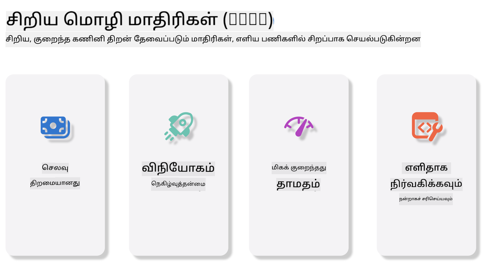
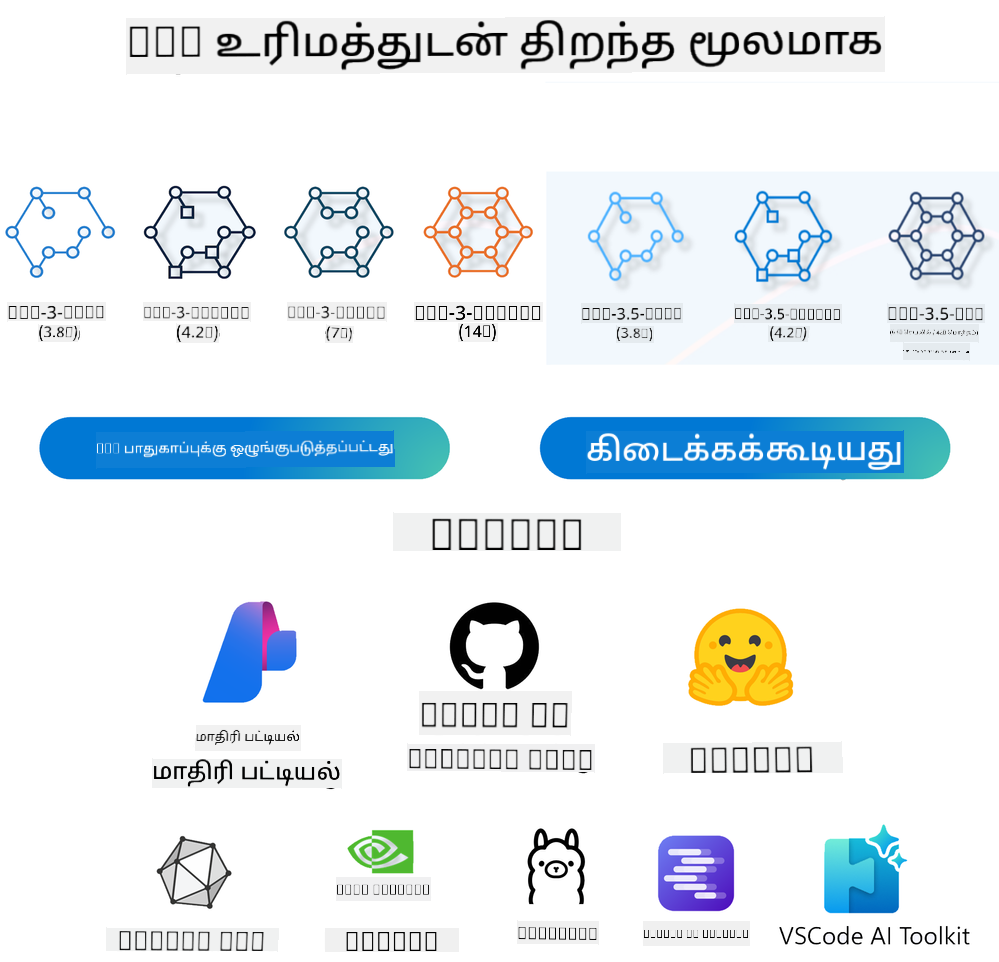
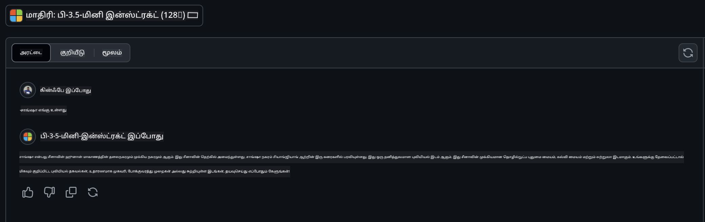

<!--
CO_OP_TRANSLATOR_METADATA:
{
  "original_hash": "124ad36cfe96f74038811b6e2bb93e9d",
  "translation_date": "2025-10-11T11:45:53+00:00",
  "source_file": "19-slm/README.md",
  "language_code": "ta"
}
-->
# தொடக்கத்திற்கான ஜெனரேட்டிவ் AI மற்றும் சிறிய மொழி மாதிரிகள் அறிமுகம்

ஜெனரேட்டிவ் AI என்பது புதிய உள்ளடக்கங்களை உருவாக்கும் திறன் கொண்ட அமைப்புகளை உருவாக்குவதில் கவனம் செலுத்தும் ஒரு சுவாரஸ்யமான செயற்கை நுண்ணறிவு துறையாகும். இந்த உள்ளடக்கம் உரை, படங்கள், இசை மற்றும் முழு மெய்நிகர் சூழல்களை உருவாக்குவதற்கும் பயன்படுத்தப்படுகிறது. ஜெனரேட்டிவ் AI-யின் மிகவும் சுவாரஸ்யமான பயன்பாடுகளில் ஒன்று மொழி மாதிரிகளின் துறையில் உள்ளது.

## சிறிய மொழி மாதிரிகள் என்றால் என்ன?

சிறிய மொழி மாதிரி (SLM) என்பது பெரிய மொழி மாதிரியின் (LLM) சுருக்கப்பட்ட வடிவமாகும், இது LLM-களின் கட்டமைப்பு கோட்பாடுகள் மற்றும் தொழில்நுட்பங்களை பயன்படுத்தி, கணினி வளங்களின் தேவையை குறைத்த வடிவமாக உள்ளது.

SLM-கள் மனிதர்களைப் போன்ற உரைகளை உருவாக்க வடிவமைக்கப்பட்ட மொழி மாதிரிகளின் ஒரு துணை வகையாகும். GPT-4 போன்ற பெரிய மாதிரிகளுக்கு மாறாக, SLM-கள் சுருக்கமாகவும் திறமையாகவும் இருக்கும், இது கணினி வளங்கள் குறைவாக உள்ள பயன்பாடுகளுக்கு சிறந்ததாக இருக்கும். அவற்றின் சிறிய அளவினாலும், SLM-கள் பல்வேறு பணிகளைச் செய்ய முடியும். பொதுவாக, SLM-கள் LLM-களை சுருக்குவதன் மூலம் உருவாக்கப்படுகின்றன, இது அசல் மாதிரியின் செயல்பாடுகள் மற்றும் மொழி திறன்களின் ஒரு முக்கிய பகுதியைத் தக்கவைத்துக்கொள்வதற்காக செய்யப்படுகிறது. மாதிரியின் அளவை குறைப்பது மொத்த சிக்கல்களை குறைக்கிறது, இதனால் SLM-கள் நினைவக பயன்பாடு மற்றும் கணினி தேவைகளில் திறமையாக இருக்கும். இந்த மேம்பாடுகளின் பின்னாலும், SLM-கள் பல்வேறு இயற்கை மொழி செயலாக்க (NLP) பணிகளைச் செய்ய முடியும்:

- **உரை உருவாக்கம்**: தொடர்புடைய மற்றும் சூழலுக்கு பொருத்தமான வாக்கியங்கள் அல்லது பத்திகளை உருவாக்குதல்.
- **உரை முடித்தல்**: கொடுக்கப்பட்ட ஒரு தொடக்கத்தின் அடிப்படையில் வாக்கியங்களை முடித்தல்.
- **மொழிபெயர்ப்பு**: ஒரு மொழியில் இருந்து மற்றொரு மொழிக்கு உரையை மாற்றுதல்.
- **சுருக்கம்**: நீண்ட உரைகளை சுருக்கமாகவும் எளிதாகவும் சுருக்குதல்.

இவை பெரிய மாதிரிகளுடன் ஒப்பிடும்போது செயல்திறன் அல்லது ஆழமான புரிதலில் சில சமரசங்களுடன் இருக்கும்.

## சிறிய மொழி மாதிரிகள் எப்படி வேலை செய்கின்றன?

SLM-கள் மிகப்பெரிய அளவிலான உரை தரவுகளில் பயிற்சி பெறுகின்றன. பயிற்சியின் போது, அவை மொழியின் வடிவமைப்புகள் மற்றும் அமைப்புகளை கற்றுக்கொள்கின்றன, இதனால் இலக்கண ரீதியாக சரியான மற்றும் சூழலுக்கு பொருத்தமான உரையை உருவாக்க முடியும். பயிற்சி செயல்முறை பின்வருவனவற்றை உள்ளடக்கியது:

- **தரவு சேகரிப்பு**: பல்வேறு மூலங்களில் இருந்து பெரிய அளவிலான உரை தரவுகளை சேகரித்தல்.
- **முன் செயலாக்கம்**: பயிற்சிக்கு ஏற்றவாறு தரவுகளை சுத்தம் செய்து ஒழுங்குபடுத்துதல்.
- **பயிற்சி**: இயந்திர கற்றல் ஆல்கோரிதங்களைப் பயன்படுத்தி மாதிரிக்கு உரையை புரிந்து கொள்ளவும் உருவாக்கவும் கற்றுக்கொடுத்தல்.
- **நன்றாக்குதல்**: குறிப்பிட்ட பணிகளில் மாதிரியின் செயல்திறனை மேம்படுத்துதல்.

SLM-களின் மேம்பாடு, முழு அளவிலான LLM-கள் அதிகமான வளங்களை தேவைப்படுத்தும் சூழல்களில், SLM-களை மொபைல் சாதனங்கள் அல்லது எட்ஜ் கணினி தளங்களில் பயன்படுத்துவதற்கான தேவையை பூர்த்தி செய்கிறது. திறமையை மையமாகக் கொண்டு, SLM-கள் செயல்திறனையும் அணுகுமுறையையும் சமநிலைப்படுத்துகின்றன, பல்வேறு துறைகளில் பரந்த பயன்பாட்டை சாத்தியமாக்குகின்றன.



## கற்றல் நோக்கங்கள்

இந்த பாடத்தில், SLM பற்றிய அறிவை அறிமுகப்படுத்தி, Microsoft Phi-3-ஐ இணைத்து உரை உள்ளடக்கம், காட்சி மற்றும் MoE போன்ற பல்வேறு சூழல்களை கற்றுக்கொள்வதற்கான முயற்சியில் ஈடுபடுவோம்.

இந்த பாடத்தின் முடிவில், நீங்கள் பின்வரும் கேள்விகளுக்கு பதிலளிக்க முடியும்:

- SLM என்றால் என்ன?
- SLM மற்றும் LLM-இன் வேறுபாடு என்ன?
- Microsoft Phi-3/3.5 குடும்பம் என்றால் என்ன?
- Microsoft Phi-3/3.5 குடும்பத்தை எப்படி பயன்படுத்துவது?

தயார்? தொடங்குவோம்.

## பெரிய மொழி மாதிரிகள் (LLMs) மற்றும் சிறிய மொழி மாதிரிகள் (SLMs) இடையிலான வேறுபாடுகள்

LLM-கள் மற்றும் SLM-கள் சாத்தியமான இயந்திர கற்றல் கோட்பாடுகளின் அடிப்படையில் உருவாக்கப்பட்டவை, அவற்றின் கட்டமைப்பு வடிவமைப்பு, பயிற்சி முறைகள், தரவுத் தயாரிப்பு செயல்முறைகள் மற்றும் மாதிரி மதிப்பீட்டு தொழில்நுட்பங்களில் ஒரே அணுகுமுறைகளை பின்பற்றுகின்றன. ஆனால், இந்த இரண்டு மாதிரிகளின் முக்கியமான வேறுபாடுகள் உள்ளன.

## சிறிய மொழி மாதிரிகளின் பயன்பாடுகள்

SLM-கள் பல்வேறு பயன்பாடுகளைக் கொண்டுள்ளன, அவற்றில் சில:

- **சாட்பாட்கள்**: வாடிக்கையாளர் ஆதரவை வழங்குதல் மற்றும் உரையாடல் முறையில் பயனர்களுடன் தொடர்பு கொள்ளுதல்.
- **உள்ளடக்க உருவாக்கம்**: எழுத்தாளர்களுக்கு யோசனைகளை உருவாக்க உதவுதல் அல்லது முழு கட்டுரைகளை வரைதல்.
- **கல்வி**: மாணவர்களுக்கு எழுதும் பணிகளில் உதவுதல் அல்லது புதிய மொழிகளை கற்றுக்கொள்வதில் உதவுதல்.
- **அணுகுமுறை**: மாற்றுத்திறனாளிகளுக்கான கருவிகளை உருவாக்குதல், உதாரணமாக உரை-விசை அமைப்புகள்.

**அளவு**

LLM-கள் மற்றும் SLM-களின் முக்கியமான வேறுபாடு மாதிரிகளின் அளவில் உள்ளது. ChatGPT (GPT-4) போன்ற LLM-கள் சுமார் 1.76 டிரில்லியன் அளவிலான பராமிதிகளை கொண்டிருக்கலாம், ஆனால் Mistral 7B போன்ற திறந்த மூல SLM-கள் சுமார் 7 பில்லியன் அளவிலான பராமிதிகளை கொண்டிருக்கின்றன. இது மாதிரி கட்டமைப்பு மற்றும் பயிற்சி செயல்முறைகளின் வேறுபாடுகளால் ஏற்படுகிறது. உதாரணமாக, ChatGPT ஒரு என்கோடர்-டிகோடர் கட்டமைப்பில் சுய கவன механизмத்தை பயன்படுத்துகிறது, ஆனால் Mistral 7B ஒரு டிகோடர் மட்டும் மாதிரியில் சறுக்கும்வழி கவனத்தை பயன்படுத்துகிறது, இது பயிற்சியை திறமையாகச் செய்ய உதவுகிறது.

**புரிதல்**

SLM-கள் குறிப்பிட்ட துறைகளில் செயல்திறனை மேம்படுத்துவதற்காக வடிவமைக்கப்பட்டுள்ளன, இது அவற்றை மிகவும் நிபுணத்துவமாகவும், பல துறைகளில் பரந்த சூழல்களைப் புரிந்து கொள்ளும் திறனில் சற்றே வரம்பு கொண்டதாகவும் ஆக்குகிறது. மாறாக, LLM-கள் மனிதர்களைப் போன்ற நுண்ணறிவை பரந்த அளவில் சிமுலேட் செய்ய முயற்சிக்கின்றன. பரந்த, பல்வேறு தரவுத்தொகுப்புகளில் பயிற்சி பெறுவதன் மூலம், LLM-கள் பல துறைகளில் சிறப்பாக செயல்பட வடிவமைக்கப்பட்டுள்ளன.

**கணினி**

LLM-களை பயிற்சி மற்றும் பயன்படுத்துதல் அதிகமான கணினி வளங்களை தேவைப்படுத்தும் செயல்முறையாகும். உதாரணமாக, ChatGPT மாதிரியை ஆரம்பத்திலிருந்து பயிற்சி செய்ய ஆயிரக்கணக்கான GPU-க்கள் மற்றும் நீண்ட காலம் தேவைப்படும். மாறாக, SLM-கள் குறைந்த பராமிதி எண்ணிக்கையுடன் கணினி வளங்களில் எளிதாக அணுகக்கூடியவை.

**பாகுபாடு**

LLM-களில் பாகுபாடு ஒரு அறியப்பட்ட பிரச்சினையாகும், இது பயிற்சி தரவின் தன்மையால் ஏற்படுகிறது. மாறாக, SLM-கள் குறைந்த, துறைக்கு மையமாக உள்ள தரவுத்தொகுப்புகளில் பயிற்சி பெறுவதால், பாகுபாட்டுக்கு குறைவாக பாதிக்கப்படுகின்றன.

**தீர்மானம்**

SLM-களின் குறைந்த அளவு அவற்றுக்கு தீர்மான வேகத்தில் ஒரு முக்கியமான நன்மையை வழங்குகிறது, இது உள்ளூர் ஹார்ட்வேரில் விரைவாக வெளியீடுகளை உருவாக்க உதவுகிறது. மாறாக, LLM-கள் அதிகமான கணினி வளங்களை தேவைப்படுத்துகின்றன.

மொத்தத்தில், LLM-கள் மற்றும் SLM-கள் இயந்திர கற்றல் அடிப்படையில் உருவாக்கப்பட்டாலும், அவற்றின் அளவு, வள தேவைகள், சூழல்களைப் புரிந்து கொள்ளும் திறன், பாகுபாடு மற்றும் தீர்மான வேகத்தில் குறிப்பிடத்தக்க வேறுபாடுகள் உள்ளன.

***குறிப்பு: இந்த அத்தியாயத்தில், Microsoft Phi-3 / 3.5-ஐ எடுத்துக்காட்டாக SLM-ஐ அறிமுகப்படுத்துவோம்.***

## Phi-3 / Phi-3.5 குடும்பத்தை அறிமுகப்படுத்துதல்

Phi-3 / 3.5 குடும்பம் முக்கியமாக உரை, காட்சி மற்றும் MoE பயன்பாட்டு சூழல்களை இலக்காகக் கொண்டுள்ளது:

### Phi-3 / 3.5 Instruct

முக்கியமாக உரை உருவாக்கம், உரையாடல் முடித்தல் மற்றும் உள்ளடக்க தகவல் எடுக்கும் பணிகளுக்காக.

**Phi-3-mini**

3.8B மொழி மாதிரி Microsoft Azure AI Studio, Hugging Face மற்றும் Ollama-ல் கிடைக்கிறது. Phi-3 மாதிரிகள் சமமான மற்றும் பெரிய அளவிலான மொழி மாதிரிகளை முக்கியமான அளவுகோள்களில் அதிகமாக செயல்படுகின்றன.

**Phi-3-small & medium**

7B பராமிதிகளுடன், Phi-3-small GPT-3.5T-ஐ பல்வேறு மொழி, காரணம், குறியீட்டு மற்றும் கணித அளவுகோள்களில் முந்துகிறது.

**Phi-3.5-mini**

Phi-3-mini-யின் மேம்படுத்தப்பட்ட வடிவமாகக் கருதலாம். இது பல மொழிகளை ஆதரிக்கிறது மற்றும் நீண்ட சூழலுக்கு வலுவான ஆதரவை வழங்குகிறது.

### Phi-3 / 3.5 Vision

Phi-3/3.5-இன் Instruct மாதிரியை Phi-யின் புரிதலாகக் கருதலாம், Vision என்பது உலகத்தைப் புரிந்து கொள்ள Phi-க்கு கண்களை வழங்குகிறது.

**Phi-3-Vision**

Phi-3-vision, 4.2B பராமிதிகளுடன், OCR, அட்டவணை மற்றும் வரைபட புரிதல் பணிகளில் பெரிய மாதிரிகளை முந்துகிறது.

**Phi-3.5-Vision**

Phi-3.5-Vision பல படங்களை ஆதரிக்கிறது. இது வீடியோக்களையும் புரிந்து கொள்ள உதவுகிறது.

### Phi-3.5-MoE

***Mixture of Experts(MoE)*** மாடல்களை குறைந்த கணினி வளங்களுடன் பயிற்சி பெற உதவுகிறது. Phi-3.5-MoE 16x3.8B நிபுணர் தொகுதிகளை கொண்டுள்ளது.

## Phi-3/3.5 குடும்ப மாதிரிகளை எப்படி பயன்படுத்துவது

Phi-3/3.5-ஐ பல்வேறு சூழல்களில் பயன்படுத்த முடியும். 



### Cloud API-யின் வேறுபாடு

**GitHub Models**

GitHub Models மூலம் Phi-3/3.5-Instruct மாதிரியை எளிதாக அணுகலாம். Azure AI Inference SDK / OpenAI SDK-யுடன் இணைத்து API-யை அணுகலாம்.

- **Demo**: Phi-3-mini மற்றும் Phi-3.5-mini-யின் சீன சூழல்களில் விளைவுகளை ஒப்பிடுதல்




**Azure AI Studio**

Vision மற்றும் MoE மாதிரிகளை Azure AI Studio மூலம் அழைக்கலாம். [Phi-3 Cookbook](https://github.com/microsoft/Phi-3CookBook/blob/main/md/02.QuickStart/AzureAIStudio_QuickStart.md?WT.mc_id=academic-105485-koreyst) படித்து அழைப்புகளைப் புரிந்துகொள்ளலாம்.

**NVIDIA NIM**

Azure மற்றும் GitHub வழங்கும் மாடல் கேட்டலாக் தீர்வுகளுக்கு மாறாக, [NVIDIA NIM](https://developer.nvidia.com/nim?WT.mc_id=academic-105485-koreyst) மூலம் API அழைப்புகளை முடிக்கலாம். NVIDIA NIM AI மாதிரிகளை பல சூழல்களில் திறமையாகப் பயன்படுத்த உதவுகிறது.

- **எளிய பயன்பாடு**: ஒரே கட்டளையின் மூலம் AI மாதிரிகளை பயன்படுத்தலாம்.
- **மேம்படுத்தப்பட்ட செயல்திறன்**: குறைந்த தாமதம் மற்றும் அதிக வெளியீட்டை உறுதிப்படுத்த NVIDIA-வின் முன்னோட்ட இயந்திரங்களை பயன்படுத்துகிறது.
- **அளவீடு**: Kubernetes-ல் autoscaling-ஐ ஆதரிக்கிறது.
- **பாதுகாப்பு மற்றும் கட்டுப்பாடு:** நிறுவனங்கள் தங்கள் தரவுகள் மற்றும் பயன்பாடுகளை தாங்களே நிர்வகிக்கும் உள்கட்டமைப்பில் NIM மைக்ரோசேவைகளை ஹோஸ்ட் செய்வதன் மூலம் கட்டுப்பாட்டை பராமரிக்க முடியும்.
- **நிலையான APIகள்:** NIM தொழில்துறை நிலையான APIகளை வழங்குகிறது, இது chatbotகள், AI உதவியாளர்கள் மற்றும் பலவற்றைப் போன்ற AI பயன்பாடுகளை உருவாக்கவும் ஒருங்கிணைக்கவும் எளிதாக்குகிறது.

NIM என்பது NVIDIA AI Enterprise இன் ஒரு பகுதியாகும், இது AI மாதிரிகளை நிறுவுவதையும் செயல்படுத்துவதையும் எளிதாக்குவதற்கும், அவை NVIDIA GPUகளில் திறமையாக இயங்குவதை உறுதிப்படுத்துவதற்கும் நோக்கமாகக் கொண்டது.

- டெமோ: NVIDIA NIM ஐப் பயன்படுத்தி Phi-3.5-Vision-API ஐ அழைக்க [[இந்த இணைப்பை கிளிக் செய்யவும்](./python/Phi-3-Vision-Nividia-NIM.ipynb?WT.mc_id=academic-105485-koreyst)]


### உள்ளூர் சூழலில் Phi-3/3.5 இல் தீர்மானம்
Phi-3 அல்லது GPT-3 போன்ற எந்த மொழி மாதிரியுடனும் தொடர்புடைய தீர்மானம் என்பது அது பெறும் உள்ளீட்டின் அடிப்படையில் பதில்கள் அல்லது கணிப்புகளை உருவாக்கும் செயல்முறையை குறிக்கிறது. நீங்கள் ஒரு கேள்வி அல்லது உத்தேசத்தை Phi-3க்கு வழங்கும்போது, ​​அது தன்னுடைய பயிற்சி பெற்ற நரம்பியல் வலைப்பின்னலின் மூலம் பயிற்சி பெற்ற தரவுகளில் உள்ள முறை மற்றும் உறவுகளை பகுப்பாய்வு செய்வதன் மூலம் மிகவும் சாத்தியமான மற்றும் தொடர்புடைய பதிலை தீர்மானிக்கிறது.

**Hugging Face Transformer**
Hugging Face Transformers என்பது இயற்கை மொழி செயலாக்கம் (NLP) மற்றும் பிற இயந்திர கற்றல் பணிகளுக்காக வடிவமைக்கப்பட்ட ஒரு சக்திவாய்ந்த நூலகமாகும். இதன் முக்கிய அம்சங்கள்:

1. **முன்பயிற்சி செய்யப்பட்ட மாதிரிகள்**: இது உரை வகைப்படுத்தல், பெயரிடப்பட்ட பொருள் அடையாளம், கேள்வி பதில், சுருக்கம், மொழிபெயர்ப்பு மற்றும் உரை உருவாக்கம் போன்ற பல பணிகளுக்கு பயன்படுத்தக்கூடிய ஆயிரக்கணக்கான முன்பயிற்சி செய்யப்பட்ட மாதிரிகளை வழங்குகிறது.

2. **கட்டமைப்பு இடையூறற்ற தன்மை**: இந்த நூலகம் PyTorch, TensorFlow மற்றும் JAX போன்ற பல ஆழமான கற்றல் கட்டமைப்புகளை ஆதரிக்கிறது. இது ஒரு கட்டமைப்பில் ஒரு மாதிரியை பயிற்சி செய்யவும் மற்றொன்றில் பயன்படுத்தவும் அனுமதிக்கிறது.

3. **பல்துறை திறன்கள்**: NLPக்கு அப்பால், Hugging Face Transformers கணினி பார்வை (எ.கா., பட வகைப்படுத்தல், பொருள் கண்டறிதல்) மற்றும் ஆடியோ செயலாக்கம் (எ.கா., பேச்சு அடையாளம், ஆடியோ வகைப்படுத்தல்) பணிகளை ஆதரிக்கிறது.

4. **பயன்படுத்த எளிதானது**: இந்த நூலகம் APIகள் மற்றும் கருவிகளை வழங்குகிறது, இது மாதிரிகளை எளிதாக பதிவிறக்கவும், நன்றாகத் தகுதிகொண்டதாக மாற்றவும், தொடக்கநிலை மற்றும் நிபுணர்களுக்கு அணுகக்கூடியதாக இருக்கிறது.

5. **சமூகமும் வளங்களும்**: Hugging Face ஒரு உயிர்ப்புடன் இருக்கும் சமூகத்தையும் விரிவான ஆவணங்கள், பயிற்சிகள் மற்றும் வழிகாட்டுதல்களையும் வழங்குகிறது, இது பயனர்களுக்கு தொடங்கவும், நூலகத்தை முழுமையாகப் பயன்படுத்தவும் உதவுகிறது.
[அதிகாரப்பூர்வ ஆவணங்கள்](https://huggingface.co/docs/transformers/index?WT.mc_id=academic-105485-koreyst) அல்லது அவர்களின் [GitHub repository](https://github.com/huggingface/transformers?WT.mc_id=academic-105485-koreyst).

இது மிகவும் பொதுவான முறையாகும், ஆனால் இது GPU வேகமாக்கல் தேவைப்படும். எதுவாக இருந்தாலும், Vision மற்றும் MoE போன்ற காட்சிகள் அதிக கணக்கீடுகளை தேவைப்படும், அவை அளவீடு செய்யப்படாவிட்டால் CPUவில் மிகவும் வரையறுக்கப்படும்.

- டெமோ: Transformer ஐப் பயன்படுத்தி Phi-3.5-Instuct ஐ அழைக்க [இந்த இணைப்பை கிளிக் செய்யவும்](./python/phi35-instruct-demo.ipynb?WT.mc_id=academic-105485-koreyst)

- டெமோ: Transformer ஐப் பயன்படுத்தி Phi-3.5-Vision ஐ அழைக்க [இந்த இணைப்பை கிளிக் செய்யவும்](./python/phi35-vision-demo.ipynb?WT.mc_id=academic-105485-koreyst)

- டெமோ: Transformer ஐப் பயன்படுத்தி Phi-3.5-MoE ஐ அழைக்க [இந்த இணைப்பை கிளிக் செய்யவும்](./python/phi35_moe_demo.ipynb?WT.mc_id=academic-105485-koreyst)

**Ollama**
[Ollama](https://ollama.com/?WT.mc_id=academic-105485-koreyst) என்பது பெரிய மொழி மாதிரிகளை (LLMs) உங்கள் கணினியில் உள்ளூராக இயக்க எளிதாக்க வடிவமைக்கப்பட்ட ஒரு தளம். இது Llama 3.1, Phi 3, Mistral மற்றும் Gemma 2 போன்ற பல மாதிரிகளை ஆதரிக்கிறது. இந்த தளம் மாதிரி எடைகள், கட்டமைப்பு மற்றும் தரவுகளை ஒரு தொகுப்பில் இணைத்து, பயனர்களுக்கு தங்கள் சொந்த மாதிரிகளை தனிப்பயனாக்கவும் உருவாக்கவும் எளிதாக்குகிறது. Ollama macOS, Linux மற்றும் Windowsக்கு கிடைக்கிறது. மேக சேவைகளில் சார்ந்திராமல் LLMகளை பரிசோதிக்க அல்லது நிறுவ விரும்பினால், இது ஒரு சிறந்த கருவியாகும். Ollama மிகவும் நேரடி வழியாகும், நீங்கள் கீழே உள்ள அறிக்கையை செயல்படுத்த வேண்டும்.


```bash

ollama run phi3.5

```


**ONNX Runtime for GenAI**

[ONNX Runtime](https://github.com/microsoft/onnxruntime-genai?WT.mc_id=academic-105485-koreyst) என்பது பல்வேறு தளங்களில் இயந்திர கற்றல் மாதிரிகளை inference மற்றும் பயிற்சி செய்ய உதவும் ஒரு குறுக்குவழி செயல்திறன் மையமாகும். Generative AI (GENAI) க்கான ONNX Runtime என்பது பல தளங்களில் உருவாக்கும் AI மாதிரிகளை திறமையாக இயக்க உதவும் ஒரு சக்திவாய்ந்த கருவியாகும்.

## ONNX Runtime என்றால் என்ன?
ONNX Runtime என்பது இயந்திர கற்றல் மாதிரிகளின் உயர் செயல்திறன் inference ஐ இயக்க உதவும் ஒரு திறந்த மூல திட்டமாகும். இது Open Neural Network Exchange (ONNX) வடிவத்தில் உள்ள மாதிரிகளை ஆதரிக்கிறது, இது இயந்திர கற்றல் மாதிரிகளை பிரதிநிதித்துவப்படுத்த ஒரு நிலையானது. ONNX Runtime inference வாடிக்கையாளர் அனுபவங்களை வேகமாகவும் செலவுகளை குறைக்கவும் உதவுகிறது, PyTorch மற்றும் TensorFlow/Keras போன்ற ஆழமான கற்றல் கட்டமைப்புகளின் மாதிரிகளையும் scikit-learn, LightGBM, XGBoost போன்ற பாரம்பரிய இயந்திர கற்றல் நூலகங்களையும் ஆதரிக்கிறது. ONNX Runtime பல்வேறு ஹார்ட்வேர்கள், டிரைவர்கள் மற்றும் இயக்க முறைமைகளுடன் இணக்கமாக உள்ளது மற்றும் பொருத்தமான இடங்களில் ஹார்ட்வேர வேகமாக்கல்களைப் பயன்படுத்துவதன் மூலம் சிறந்த செயல்திறனை வழங்குகிறது.

## Generative AI என்றால் என்ன?
Generative AI என்பது புதிய உள்ளடக்கங்களை உருவாக்கும் திறன் கொண்ட AI அமைப்புகளை குறிக்கிறது, உதாரணமாக, உரை, படங்கள் அல்லது இசை போன்றவை, அவை பயிற்சி பெற்ற தரவின் அடிப்படையில். GPT-3 போன்ற மொழி மாதிரிகள் மற்றும் Stable Diffusion போன்ற பட உருவாக்கம் மாதிரிகள் இதற்கு உதாரணமாகும். ONNX Runtime for GenAI நூலகம் ONNX மாதிரிகளுக்கான உருவாக்கும் AI சுழற்சியை வழங்குகிறது, இதில் ONNX Runtime உடன் inference, logits செயலாக்கம், தேடல் மற்றும் மாதிரிகள் மற்றும் KV cache மேலாண்மை ஆகியவை அடங்கும்.

## ONNX Runtime for GENAI
ONNX Runtime for GENAI, ONNX Runtime இன் திறன்களை உருவாக்கும் AI மாதிரிகளை ஆதரிக்க விரிவாக்குகிறது. இதன் முக்கிய அம்சங்கள்:

- **பல்துறை ஆதரவு:** இது Windows, Linux, macOS, Android மற்றும் iOS போன்ற பல தளங்களில் வேலை செய்கிறது.
- **மாதிரி ஆதரவு:** LLaMA, GPT-Neo, BLOOM மற்றும் பல போன்ற பிரபலமான உருவாக்கும் AI மாதிரிகளை இது ஆதரிக்கிறது.
- **செயல்திறன் மேம்பாடு:** NVIDIA GPUகள், AMD GPUகள் போன்ற பல்வேறு ஹார்ட்வேர வேகமாக்கல்களுக்கு மேம்பாடுகளை இது கொண்டுள்ளது.
- **பயன்படுத்த எளிதானது:** இது பயன்பாடுகளில் எளிதாக ஒருங்கிணைக்க APIகளை வழங்குகிறது, குறைந்த குறியீட்டுடன் உரை, படங்கள் மற்றும் பிற உள்ளடக்கங்களை உருவாக்க அனுமதிக்கிறது.
- பயனர்கள் ஒரு உயர் நிலை generate() முறைமையை அழைக்கலாம் அல்லது மாதிரியின் ஒவ்வொரு iteration ஐ ஒரு சுழற்சியில் இயக்கலாம், ஒவ்வொரு டோக்கனையும் ஒரே நேரத்தில் உருவாக்கலாம் மற்றும் சுழற்சிக்குள் உருவாக்கும் அளவீட்டு அளவுருக்களை விருப்பமாகப் புதுப்பிக்கலாம்.
- ONNX runtime க்ரீடி/பீம் தேடல் மற்றும் TopP, TopK மாதிரிகளை டோக்கன் வரிசைகளை உருவாக்கவும், மீண்டும் மீண்டும் தண்டனைகள் போன்ற உள்ளமைக்கப்பட்ட logits செயலாக்கத்தை ஆதரிக்கிறது. நீங்கள் விருப்பமான மதிப்பீட்டையும் எளிதாகச் சேர்க்கலாம்.

## தொடங்குவது எப்படி
ONNX Runtime for GENAI உடன் தொடங்க, நீங்கள் இந்த படிகளைப் பின்பற்றலாம்:

### ONNX Runtime ஐ நிறுவவும்:
```Python
pip install onnxruntime
```
### உருவாக்கும் AI விரிவாக்கங்களை நிறுவவும்:
```Python
pip install onnxruntime-genai
```

### ஒரு மாதிரியை இயக்கவும்: Pythonல் ஒரு எளிய எடுத்துக்காட்டு:
```Python
import onnxruntime_genai as og

model = og.Model('path_to_your_model.onnx')

tokenizer = og.Tokenizer(model)

input_text = "Hello, how are you?"

input_tokens = tokenizer.encode(input_text)

output_tokens = model.generate(input_tokens)

output_text = tokenizer.decode(output_tokens)

print(output_text) 
```
### டெமோ: ONNX Runtime GenAI ஐப் பயன்படுத்தி Phi-3.5-Vision ஐ அழைக்க


```python

import onnxruntime_genai as og

model_path = './Your Phi-3.5-vision-instruct ONNX Path'

img_path = './Your Image Path'

model = og.Model(model_path)

processor = model.create_multimodal_processor()

tokenizer_stream = processor.create_stream()

text = "Your Prompt"

prompt = "<|user|>\n"

prompt += "<|image_1|>\n"

prompt += f"{text}<|end|>\n"

prompt += "<|assistant|>\n"

image = og.Images.open(img_path)

inputs = processor(prompt, images=image)

params = og.GeneratorParams(model)

params.set_inputs(inputs)

params.set_search_options(max_length=3072)

generator = og.Generator(model, params)

while not generator.is_done():

    generator.compute_logits()
    
    generator.generate_next_token()

    new_token = generator.get_next_tokens()[0]
    
    code += tokenizer_stream.decode(new_token)
    
    print(tokenizer_stream.decode(new_token), end='', flush=True)

```


**மற்றவை**

ONNX Runtime மற்றும் Ollama குறிப்பு முறைகளுக்கு கூடுதலாக, Apple Metal உடன் Apple MLX கட்டமைப்பு, Qualcomm QNN உடன் NPU, Intel OpenVINO உடன் CPU/GPU போன்ற பல்வேறு உற்பத்தியாளர்களால் வழங்கப்படும் மாதிரி குறிப்பு முறைகளின் அடிப்படையில் அளவீட்டு மாதிரிகளை முடிக்கவும் முடியும். மேலும் உள்ளடக்கங்களை [Phi-3 Cookbook](https://github.com/microsoft/phi-3cookbook?WT.mc_id=academic-105485-koreyst) இல் பெறலாம்.


## மேலும்

நாம் Phi-3/3.5 குடும்பத்தின் அடிப்படைகளை கற்றுக்கொண்டோம், ஆனால் SLM பற்றி மேலும் அறிய நமக்கு கூடுதல் அறிவு தேவை. நீங்கள் Phi-3 Cookbook இல் பதில்களை கண்டறியலாம். மேலும் அறிய விரும்பினால், தயவுசெய்து [Phi-3 Cookbook](https://github.com/microsoft/phi-3cookbook?WT.mc_id=academic-105485-koreyst) ஐ பார்வையிடவும்.

---

**குறிப்பு**:  
இந்த ஆவணம் [Co-op Translator](https://github.com/Azure/co-op-translator) என்ற AI மொழிபெயர்ப்பு சேவையைப் பயன்படுத்தி மொழிபெயர்க்கப்பட்டுள்ளது. நாங்கள் துல்லியத்திற்காக முயற்சிக்கின்றோம், ஆனால் தானியங்கி மொழிபெயர்ப்புகளில் பிழைகள் அல்லது தவறுகள் இருக்கக்கூடும் என்பதை தயவுசெய்து கவனத்தில் கொள்ளுங்கள். அதன் தாய்மொழியில் உள்ள மூல ஆவணம் அதிகாரப்பூர்வ ஆதாரமாக கருதப்பட வேண்டும். முக்கியமான தகவல்களுக்கு, தொழில்முறை மனித மொழிபெயர்ப்பு பரிந்துரைக்கப்படுகிறது. இந்த மொழிபெயர்ப்பைப் பயன்படுத்துவதால் ஏற்படும் எந்த தவறான புரிதல்கள் அல்லது தவறான விளக்கங்களுக்கு நாங்கள் பொறுப்பல்ல.