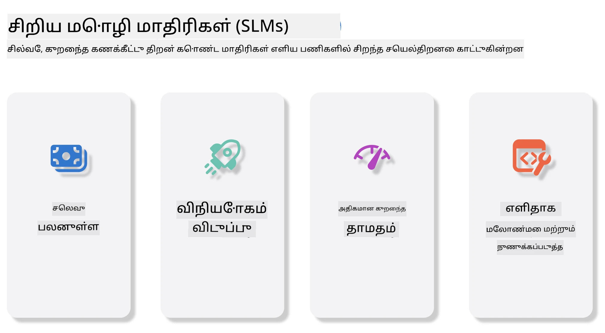
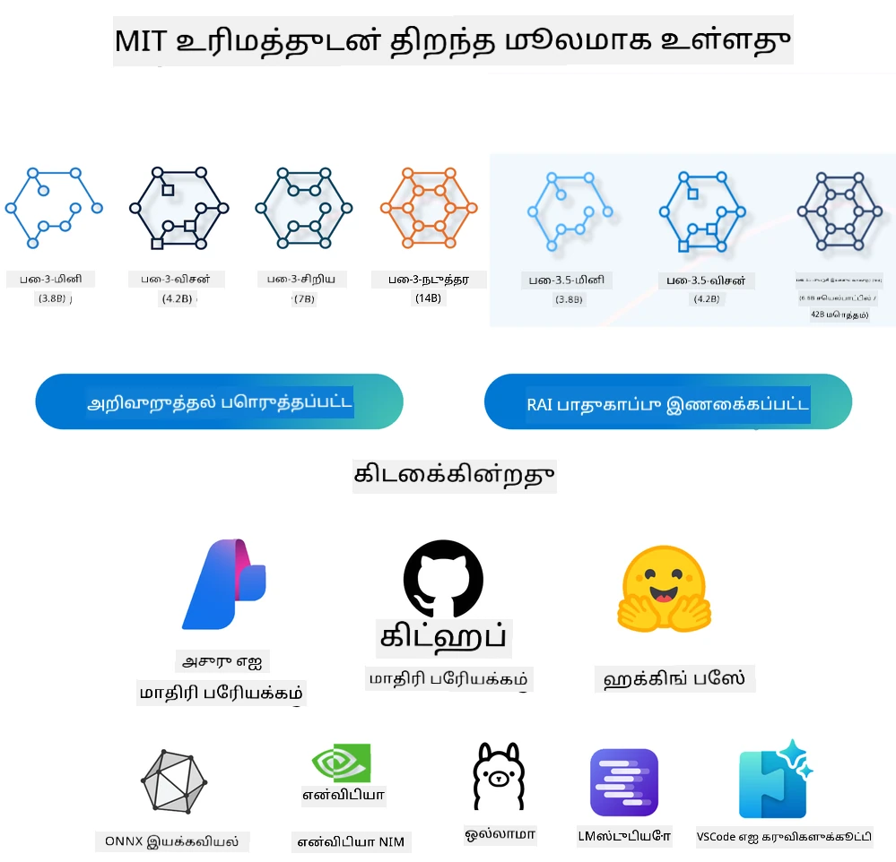
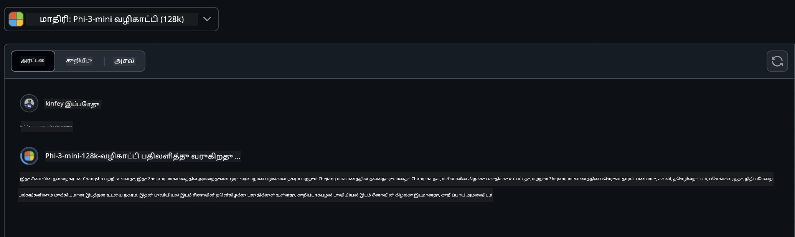
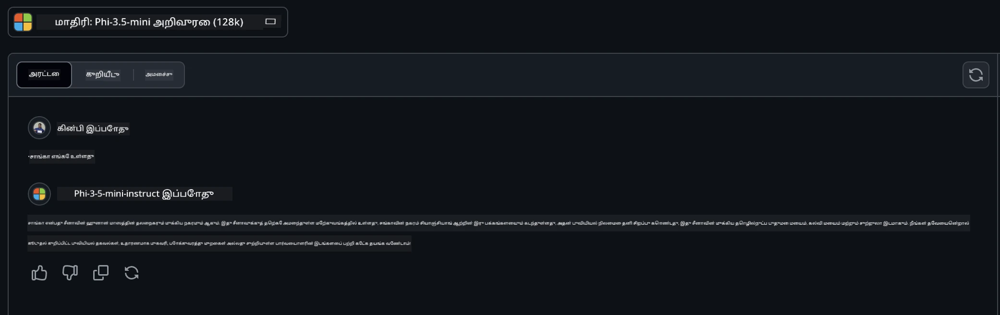

# ஆரம்ப நிலைப்பாட்டிற்கான சிறு மொழி மாதிரிகள் தொடர்பான அறிமுகம்
உற்பத்தி செயற்கை நுண்ணறிவு என்பது புதிய உள்ளடக்கங்களை உருவாக்கும் திறன் கொண்ட அமைப்புகளை உருவாக்குவதைக் குறிக்கும் செயற்கை நுண்ணறிவின் ஒரு ஆச்சர்யமான துறையாகும். இந்த உள்ளடக்கங்கள் உரை மற்றும் படங்கள் முதல் இசை மற்றும் முழுமையான மெய்நிகர் சூழல்களை வரை விரிந்திருக்கலாம். உற்பத்தி செயற்கை நுண்ணறிவின் மிகவும் சுவாரஸ்யமான பயன்பாடுகளில் ஒன்று மொழி மாதிரிகள் துறையில் உள்ளன.

## சிறிய மொழி மாதிரிகள் என்றால் என்ன?

சிறு மொழி மாதிரி (SLM) என்பது பெரிய மொழி மாதிரி (LLM) என்ற ஒரு குறைக்கப்பட்ட வகையை குறிக்கிறது, இது LLMகளின் பல்வேறு கட்டமைப்பு நுட்பங்கள் மற்றும் தந்திரங்களை பயன்படுத்தி, கணினி வளங்களின் சிதறலான அளவு குறைக்கப்பட்டதாக அமைகிறது.

SLMகள் மனிதனுடைய போன்ற உரையை உருவாக்க அமைக்கப்பட்ட மொழி மாதிரிகளின் ஒரு உபவகையகம். GPT-4 போன்ற பெரிய counterpartsக்கு மாறாக, SLMகள் அதிகமாக சுருக்கப்பட்டவை மற்றும் பயன்பாட்டில் கணினி வளங்கள் குறைவான இடங்களில் மிகவும் பொருத்தமானவை. சிறிய அளவிலும், அவை பல்வேறு பணிகளை செய்கின்றன. பொதுவாக, SLMகள் LLMகளை சுருக்குவதன் மூலம் அல்லது துவாரமாக்குவதன் மூலம் கட்டப்பட்டு, மெய்நிகர் மாதிரியின் செயல்திறனின் மற்றும் மொழி திறன்களின் குறிப்பிடத்தக்க பகுதியை சேமிக்கும் நோக்கத்துடன் உருவாக்கப்படுகின்றன. இந்த மாதிரி அளவு குறைக்கப்படுவது மொத்த சிக்கல்களை குறைத்து, நினைவக பயன்பாடு மற்றும் கணினி தேவைகளில் SLMகளை அதிக திறமையானவைகளாக்குகிறது. இந்த சமரசங்களைப் போதுமானால், SLMகள் பின்வரும் இயற்கை மொழி செயலாக்க (NLP) பணிகளை இதுவரை செய்து முடிக்கின்றன:

- உரை உருவாக்குதல்: தொடர்புடைய மற்றும் சூழலில் பொருந்தக்கூடிய வாக்கியங்கள் அல்லது பத்திகளை உருவாக்குதல்.
- உரை முடித்தல்: கொடுக்கப்பட்ட முன்மொழிவின் அடிப்படையில் வாக்கியங்களை கணிக்கவும் மற்றும் முடிக்கவும்.
- மொழி மாற்றம்: உரையை ஒரு மொழியில் இருந்து மற்றொரு மொழிக்கு மாற்றுதல்.
- சுருக்கல்: நீண்ட உரைகளை சிறியது, சுவாரஸ்யமான சுருக்குகளாக சுருக்குதல்.

அவர்கள் பெரிய counterparts உடன் ஒப்பிடும்போது செயல்திறன் அல்லது ஆழமான புரிதலில் சில மதிப்பீடுகள் இருக்கலாம்.

## சிறு மொழி மாதிரிகள் எவ்வாறு செயல்படுகின்றன?
SLMக்கள் நிறைய உரை தரவுகளின் மேல் பயிற்சி பெறுகின்றன. பயிற்சி போதலில், அவை மொழியின் வடிவமைப்புகளும் அமைப்புகளும் கற்று, both இலக்கண ரீதியாக சரியான மற்றும் சூழல் பொருந்தும் உரையை உருவாக்கும் திறன் பெறுகின்றன. பயிற்சி செயல்முறை பின்வருமாறு:

- தரவு சேகரித்தல்: பல்வேறு மூலங்கள் இருந்து பெரிய உரை தரவுத்தொகுப்புகள் சேகரித்தல்.
- முன்கூட்டிய ​​செயலாக்கம்: பயிற்சிக்கான தரவை சுத்தம் செய்து ஒழுங்குபடுத்தல்.
- பயிற்சி: மெஷின் கற்றல் الگாரிதங்களைக் கொண்டு மாதிரியை உரையை புரிந்து, உருவாக்கக் கற்றல்.
- நுட்ப மாற்றம்: குறிப்பிட்ட பணிகளில் செயல்திறன் மேம்படுத்த மாதிரியை சரிசெய்தல்.

SLMக்களின் மேம்பாடு குறிப்பாக குறைந்த வளங்கள் உடைய சூழல்களில், போல் ஒரு கைமொழி சாதனங்கள் அல்லது ஆராய்ச்சி கணினி மேடைகள் போன்ற இடங்களில், முழுமை அளவிலான LLMகள் அதிக வளங்களை பயன்படுத்துவதால் செயல்திறனில் சிக்கலானவை ஆகும். திறன் சார்ந்த கவனிப்புடன், SLMகள் செயல்திறன் மற்றும் அணுகலை சமமாக்குகின்றன, பல துறைகளில் விரிவான பயன்பாட்டை திறக்கின்றன.



## கற்றல் நோக்கங்கள்

இந்த பாடத்தில், SLM பற்றி அறிவை அறிமுகப்படுத்தி, அதை Microsoft Phi-3 உடன் ஒன்றாக இணைத்துக் கொண்டு உரை உள்ளடக்கம், காட்சி மற்றும் MoE இல் பல்வேறு சூழல்கள் பற்றி கற்க விரும்புகிறோம்.

இந்த பாட முடிவில், நீங்கள் பின்வரும் கேள்விகளுக்கு பதில் அளிக்க முடியும்:

- SLM என்றால் என்ன?
- SLM மற்றும் LLM உடைய வேறுபாடு என்ன?
- Microsoft Phi-3/3.5 குடும்பம் என்றால் என்ன?
- Microsoft Phi-3/3.5 குடும்பத்துடன் எப்படி இன்ஃபரன்ஸ் ஓட்டுவது?

தயார்? தொடங்கலாம்.

## பெரிய மொழி மாதிரிகள் (LLMs) மற்றும் சிறிய மொழி மாதிரிகள் (SLMs) இடையேயான வேறுபாடுகள்

LLMக்களும் SLMக்களும் வாய்ப்பு மெய்நிகர் கற்றல் அடிப்படைகளை பின்பற்றி கட்டமைப்பு வடிவமைப்பு, பயிற்சி நுட்பங்கள், தரவு உருவாக்க செயல்முறைகள் மற்றும் மாதிரி மதிப்பீட்டின் கீழ் உற்றமைவான அணுகுமுறைகளை பின்பற்றுகின்றன. இருப்பினும், இவ்விரு மாதிரிகள் பல முக்கிய அம்சங்களில் வேறுபடுகின்றன.

## சிறிய மொழி மாதிரிகள் பயன்படுத்தப்படும் துறைகள்

SLMகள் பலதுறைகள் கவர்ந்துக் கொண்டுள்ளன, உதாரணமாக:

- உரையாடல் பொறிகள்: பயனர் தொடர்பு ஆதரவு வழங்குதல் மற்றும் உரையாடல் முறையில் பயனர்களுடன் ஈடுபடுதல்.
- உள்ளடக்க உருவாக்கல்: எழுத்தாளர்களுக்கு கருத்துக்களை உருவாக்க அல்லது முழு கட்டுரைகளை உருவாக்க உதவுதல்.
- கல்வி: மாணவர்களுக்கு எழுதும் பணி அல்லது புதிய மொழிகளை கற்பதில் உதவுதல்.
- அணுகல் வசதி: மாற்றுத்திறனாளிகளுக்கான உபகரணங்களைக் உருவாக்குதல், போல் உரை-இலக்கணம் அமைப்புகள்.

**அளவு**

LLMக்களுக்கும் SLMக்களுக்கும் இடையேயான முதன்மையான வேறுபாடு மாதிரிகளின் அளவிலேயாகும். ChatGPT (GPT-4) போல LLMகள் சுமார் 1.76 டிரில்லியன் அளவிலான பராமிதிகள் உடையதாக இருக்க முடியும், ஆனால் Mistral 7B போன்ற திறந்த மூல SLMகள் சுமார் 7 பில்லியன் பராமிதிகள் உடைய இலகுவான வடிவத்தில் வடிவமைக்கப்படுகின்றன. இத்தகைய வேறுபாடு மாதிரி கட்டமைப்பு மற்றும் பயிற்சி செயல்முறைகளில் உள்ள வேறுபாட்டினால் ஏற்படுகிறது. எடுத்துக்காட்டként, ChatGPT ஒரு எளிய அணுக்கம் கடத்தல் முறையை உள்ளடக்கியுள்ளது, எங்கே Mistral 7B அதை விட முன்னேற்றமான ஸ்லைடிங் வின்டோ கவனிப்பை பயன்படுத்தி, திறமையான பயிற்சிக்கு அனுமதிக்கிறது. இந்த கட்டமைப்பு வேறுபாடு மாதிரிகளின் சிக்கல் மற்றும் செயல்திறனுக்கு முக்கிய விளைவுகளை கொண்டுள்ளது.

**புரிதல்**

SLMகள் வழக்கமாக குறிப்பிட்ட துறைகளுக்குள் சிறப்பாக செயல்பட உருவாக்கப்பட்டுள்ளன, அதனால் அவை மிகவும் நிபுணத்துவம் பெற்றவையாகும், ஆனால் பல துறைகளில் பரபரப்பான சூழல் புரிதலை வழங்குவதில் பலவீனமுள்ளன. அதற்கு மாறாக, LLMகள் பல தரவுத்தொகுப்புகளில் பயிற்சி பெற்று மனித போன்ற நுண்ணறிவை விரிவாக உருவாக்கும் நோக்கில் வடிவமைக்கப்பட்டுள்ளன. அவை பரவலான துறைகளில் சிறப்பாக செயல்பட முடியும், மேலும் கூர்மை மற்றும் அடையாள மாற்றங்களை வழங்குகின்றன. இதனால், LLMகள் இயற்கை மொழி செயலாக்கம் மற்றும் நிரல் அமைப்பு போன்ற பலவகை பணிகளுக்கு மிகச் சிறந்தவை.

**கணினி**

LLMகளின் பயிற்சி மற்றும் பயன்பாடு வளங்களை அதிகமாக தேவைப்படுத்தும், பெரும் GPU களைக் கொண்ட கூடல்களுடன் கூடிய கணினி அமைப்புகளைப் பயன்படுத்த வேண்டியிருக்கலாம். எடுத்துக்காட்டként, ChatGPT போன்ற ஒரு மாதிரியை ஆரம்பத்திலிருந்து பயிற்சிப்பது ஆயிரக்கணக்கான GPUகளை பல நாட்களுக்கு பயன்படுத்த வேண்டலாம். அதை ஒப்பிடும்போது, SLMகள் குறைந்த பராமிதி எண்ணிக்கையுள்ளதால், கணினி வளங்கள் குறைவாக தேவைப்படுகின்றன. Mistral 7B மாதிரி போன்றவை பொதுவாக அடிப்படை GPU வசதியுள்ள உள்ளூர் இயந்திரங்களில் பயிற்சி செய்யப்பட வேண்டும், அது பல GPUகளில் சில மணித்தியாளங்கள் பயிற்சி நேரம் எடுக்கும்.

**பாகுபாடு**

பாகுபாடு என்பது LLMகளில் பிரச்சனை, அதற்கு காரணம் பயிற்சி தரவு இயல்புவழிகளில் உள்ளது. இவை பெரும்பாலும் இணையத்தில் உள்ள திறந்த தரவுகளைப் பயன்படுத்துவதால், சில குழுக்களை குறைதீர்க்கலாம் அல்லது தவறான அடையாளங்களை வழங்கலாம் என்பதைச் சேர்த்து மொழி பாகுபாடுகளுக்கு உட்பட்டுள்ளன. அமெரிக்கா, பிராந்திய வேறுபாடுகள் மற்றும் இலக்கண விதிகள் ஆகியவற்றின் தாக்கம் கூட சேர்க்கும். கூடுதலாக, LLM கட்டமைப்பின் சிக்கல் பாகுபாட்டை அதிகரிக்கக்கூடும், இது நுட்பமாக சரிசெய்யப்படாமல் இருப்பின் தெரியாமல் போகலாம். மாறாக, SLMகள் குறைந்த, துறைக் கட்டுப்பாடுள்ள தரவுகளில் பயிற்சி பெற்றுள்ளதால் பாகுபாட்டில் குறைந்த தாக்கம் ஏற்படக் கூடும், ஆனால் அதில் முழுமையாக விடுவிக்கப்படவில்லை.

**இன்ஃபரன்ஸ்**

SLMகளின் குறைந்த அளவு அவர்களுக்கு ஒரு பெரிய நன்மையை தருகிறது: அதிக வேகத்தில் உள்ளூர் கணினிகளில் எதிர்வினைகளை உருவாக்கும் திறன், பெரும் வழிகளைக் கொண்டல் தேவையில்லை. LLMக்கள் பெரியது மற்றும் சிக்கலானதாக இருந்தாலும், நிலைத்திருக்கும் துணை கணினி வளங்களில் விரைவாக செயல்பட வேண்டும். பல பயனர்கள் ஒருங்கிணைந்தால், LLMகள் பதில் நேரத்தை மேலும் அதிகரிக்கின்றன.

கருத்தில் கொள்ளும்போது, இரண்டுமே இயற்கை கற்றல் அடிப்படையில் இருந்தாலும், மாதிரி அளவு, வள தேவைகள்,Contextual Understanding, பாகுபாடு அல்லது இன்ஃபரன்ஸ் வேகம் ஆகியவை பிராரம்பகரமான விதிகளில் வேறுபடுகின்றன. LLMகள் பொதுவான பயன்பாடுகளுக்கு ஏற்ற, ஆனால் வளம் அதிகமுள்ள, SLMகள் குறிப்பிட்ட துறைகளில் திறமையான மற்றும் குறைந்த வளம் தேவைப்படும் வகையில் இருக்கின்றன.

***குறிப்பு: இந்த பாடத்தில், Microsoft Phi-3 / 3.5 உதாரணமாக கொண்டு SLMகளை அறிமுகப்படுத்துவோம்.***

## Phi-3 / Phi-3.5 குடும்பத்தை அறிமுகப்படுத்தல்

Phi-3 / 3.5 குடும்பம் முக்கியமாக உரை, காட்சி மற்றும் முகவர் (MoE) பயன்பாட்டு சூழல்களுக்கு இலக்காகக் கொண்டுள்ளது:

### Phi-3 / 3.5 வழிகாட்டல்

முக்கியமாக உரை உருவாக்கம், உரையாடல் முடித்தல் மற்றும் உள்ளடக்க தகவல் எடுப்பில் பயன்படுத்தப்படுகிறது.

**Phi-3-mini**

3.8B மொழி மாதிரி Microsoft Azure AI Studio, Hugging Face, மற்றும் Ollama இல் கிடைக்கிறது. Phi-3 மாதிரி முறையே சம அளவிலான மற்றும் பெரிய மொழி மாதிரிகளையும் முக்கிய அளவுகோள்களில் (பின்வரும் மதிப்பெண்கள் பார்க்கவும், பெரிய மதிப்பெண்கள் சிறந்தவை) முற்றிலும் வெற்றி பெறுகிறது. Phi-3-mini, தன் அளவு இரட்டிப்பை விட மிகச்சிறந்தது, Phi-3-small மற்றும் Phi-3-medium, GPT-3.5 உட்பட பெரிய மாதிரிகளை முற்றிலும் வீழ்த்துகின்றன.

**Phi-3-small மற்றும் medium**

7 பில்லியன் பராமிதிகளுடன், Phi-3-small GPT-3.5T க்குக் கீழேயுள்ள பல மொழி, காரணம், நிரல் மற்றும் கணிதத் தேர்வுகளில் வெற்றி பெறுகிறது.

14 பில்லியன் பராமிதிகளுடன் Phi-3-medium இந்த போக்கை தொடர்கிறது மற்றும் Gemini 1.0 Pro ஐ வழக்கமாக விடுவிக்கிறது.

**Phi-3.5-mini**

அதை Phi-3-mini மேம்படுத்தல் என்று நம்மால் கருதலாம். பராமிதிகள் அதே நிலையில் இருந்தாலும், இது பல மொழிகளை ஆதரிக்கிறது (20+ மொழிகள்: அரபிக், சீன, செக், டேனிஷ், டச்சு, ஆங்கிலம், ஃபின்னிஷ், பிரெஞ்சு, ஜெர்மன், ஹீப்ரூ, ஹங்கேரியன், இத்தாலியன், ஜப்பானீஸ், கொரியன், நோர்வே, போலிஷ், போர்த்துகீசிய, ரஷியன், ஸ்பானிஷ், ஸ்வீடிஷ், தாய், துருக்கிய, உக்ரைனியன்) மற்றும் நீண்ட சூழலை ஆதரிக்க அதிக சக்தி வழங்குகிறது.

3.8B பராமிதிகளுடன் Phi-3.5-mini, அதே அளவிலான மற்றும் இரட்டிப்புகளுக்கு சமமான அளவிலான மென்மாதிரிகள் மார்கெட்டில் முன்னிலையில் உள்ளது.

### Phi-3 / 3.5 காட்சி

Phi-3/3.5 இன் வழிகாட்டல் மாதிரியை Phi திறன் புரிந்துகொள்ளும் திறனாகவும், காட்சி என்பது உலகத்தை புரிந்துகொள்ளும் பார்வையாகவே கருதலாம்.

**Phi-3-Vision**

4.2B பராமிதிகளுடன் Phi-3-vision தொடர்ந்தும் இந்த போக்கை முன்னெடுத்து, Claude-3 Haiku மற்றும் Gemini 1.0 Pro V போன்று பெரிய மாதிரிகளை பொது காட்சி காரணம், OCR மற்றும் அட்டவணை, வரைபட புரிதல் பணிகளில் முற்றிலும் வெற்றி பெறுகிறது.

**Phi-3.5-Vision**

Phi-3.5-Vision Phi-3-vision மேம்படுத்தலாகும், பல படங்களை ஆதரிக்கிறது. காட்சி மேம்பாட்டுக்கான இது ஒரு முன்னோக்கம் என கருதலாம், இப்போது நீங்கள் புகைப்படங்களை மட்டுமல்ல, வீடியோக்களையும் பார்க்க முடியும்.

Phi-3.5-vision, Claude-3.5 Sonnet மற்றும் Gemini 1.5 Flash போன்று பெரிய மாதிரிகளை OCR, அட்டவணை மற்றும் சீரியல் புரிதல் பணிகளில் முற்றிலும் வெற்றி பெறுகிறது மற்றும் பொதுவான காட்சி அறிவு காரணத்தில் ஒப்புமைக்கான நிலையில் உள்ளது. பல படங்கள் உள்ளீட்டில் வழக்கமான காரணம் செய்யும் திறன் கொண்டது.

### Phi-3.5-MoE

***Mixture of Experts (MoE)*** குறைந்த கணினி வளத்தில் மாதிரியை முன்னேற்ற பயிற்சிக்க முடியும், இது மாதிரி மற்றும் தரவுத்தொகுப்பு அளவை அதே கணினி செலவு கட்டுப்பாட்டுடன் அதிகரிக்கலாம் என்பதை குறிக்கிறது. குறிப்பாக, MoE மாதிரிகள் அதே தரத்தை அடைவதில் அதிக வேகமாக பயிற்சி பெற முடியும்.

Phi-3.5-MoE 16x3.8B நிபுணர் தொகுதிகளை கொண்டது. 6.6B செயலில் உள்ள பராமிதிகளுடன் Phi-3.5-MoE பெரிய மாதிரிகளுக்கு ஒப்பாய தேவைப்படும் காரணம், மொழி புரிதல் மற்றும் கணித திறன்களில் சமத்துவம் பெறுகிறது.

Phi-3/3.5 குடும்ப மாதிரிகளை பல சூழல்களுக்கென்று பயன்படுத்தலாம். LLM போல இல்லாமல், Phi-3/3.5-mini அல்லது Phi-3/3.5-Vision ஐ குறுகிய சாதனங்களில் பயன்படுத்த முடியும்.

## Phi-3/3.5 குடும்ப மாதிரிகளை எப்படி பயன்படுத்துவது

Phi-3/3.5 ஐ பல்வேறு சூழல்களில் பயன்படுத்த விரும்புகிறோம். அடுத்ததாக, பல்வேறு சூழல்களை அடிப்படையாகக் கொண்டு Phi-3/3.5 பயன்படுத்துவோம்.



### மேக APIகளின் மூலம் இன்ஃபரன்ஸ்

**GitHub மாதிரிகள்**

GitHub மாதிரிகள் ஆக்ஸஸ்சின் மிக நேரடி வழி ஆகும். நீங்கள் விரைவில் GitHub மாதிரிகள் மூலம் Phi-3/3.5-வழிகாட்டும் மாதிரியை அணுகலாம். Azure AI இன்ஃபரன்ஸ் SDK / OpenAI SDK உடன் இணைத்து, குறியீட்டின் மூலம் APIஐ அணுகி Phi-3/3.5-வழிகாட்டல் அழைப்பை முடிக்கலாம். நீங்கள் Playground மூலம் வெவ்வேறு விளைவுகளைப் பரிசோதிக்கலாம்.

- டெமோ: சீன சூழல்களில் Phi-3-mini மற்றும் Phi-3.5-mini விளைவை ஒப்பிடல்






**Azure AI Studio**

அல்லது, காட்சி மற்றும் MoE மாதிரிகளைப் பயன்படுத்த விரும்பினால், Azure AI Studio மூலம் அழைப்பை முடிக்கலாம். நீங்கள் ஆர்வமாக இருந்தால், Phi-3 Cookbook படித்து Phi-3/3.5-வழிகாட்டல், காட்சி, MoE ஐ Azure AI Studio மூலம் எப்படி அழைப்பது என்பதை கற்கலாம் [இந்த இணைப்பை கிளிக் செய்க](https://github.com/microsoft/Phi-3CookBook/blob/main/md/02.QuickStart/AzureAIStudio_QuickStart.md?WT.mc_id=academic-105485-koreyst)


**NVIDIA NIM**

Azure மற்றும் GitHub வழங்கும் மேக அடிப்படையிலான மாதிரி கॅட்டலாக் தீர்வுகளுக்கு தவிர, [NVIDIA NIM](https://developer.nvidia.com/nim?WT.mc_id=academic-105485-koreyst) ஐப் பயன்படுத்தி தொடர்புடைய அழைப்புகளை முடிக்கலாம். NVIDIA NIM (NVIDIA இன்ஃபரன்ஸ் மைக்ரோசர்வீசுகள்) என்பது வெவ்வேறு சூழல்களில், மேகங்கள், தரவு மையங்கள் மற்றும் வேலையிடங்கள் உட்பட, AI மாதிரிகளை துரிதமாக ஒழுங்கமைக்க உதவும் விரைவு இன்ஃபரன்ஸ் மைக்ரோசர்வீசுகளின் தொகுப்பு ஆகும்.

NVIDIA NIM இன் சில முக்கிய அமசங்கள் இவை:
- **விளக்கத் துவக்கம்:** NIM ஒரு கட்டளை மூலம் AI மாதிரிகளை பொருத்த வையலாம், ஏற்கனவே உள்ள பணிவழிகளுடன் இணைக்க எளிதாக இருக்கின்றது.
- **சூழ்ந்த செயல்திறன்:** இது NVIDIAவின் முன்கூட்டியே செயல்திறன் மேம்படுத்தப்பட்ட inference என்ஜின்களைப் பயன்படுத்துகிறது, உதாரணமாக TensorRT மற்றும் TensorRT-LLM, குறைந்த தாமதம் மற்றும் உயர் throughput உறுதி செய்ய.
- **பரிமாண உத்தரவாதம்:** NIM குபேர்னிடிஸில் autoscaling ஐ ஆதரிக்கிறது, வெவ்வேறு பணி சுமைகளை திறம்பட கையாள உதவுகிறது.
- **பாதுகாப்பு மற்றும் கட்டுப்பாடு:** நிறுவனங்கள் தங்களுடைய தரவுகள் மற்றும் பயன்பாடுகளை தங்களது கையாளப்படும் உட்பொதிக்கும் கட்டமைப்பில் தங்கள் சொந்தமாக NIM மைக்ரோசேவைகளை ஓட்டுவதன் மூலம் கட்டுப்பாடு பெற்றுக் கொள்ளலாம்.
- **தரமான APIs:** NIM தொழில்நுட்ப தரமான APIs வழங்குகிறது, இது சந்திப்பு உறையாளர்கள், AI உதவியாளர்கள் போன்ற AI பயன்பாடுகளை உருவாக்க மற்றும் இணைக்க எளிதாக செய்கிறது.

NIM NVIDIA AI Enterprise இன் ஒரு பகுதியாகும், இது AI மாதிரிகளை பொருத்தக்கூடியவையும் செயல்படுத்தக்கூடியவையாக எளிதாக்குவதையும் நோக்கமாகக் கொண்டுள்ளது, NVIDIA GPUs இல் திறம்பட இயங்குவதை உறுதி செய்கிறது.

- காட்சி: NVIDIA NIM பயன்படுத்தி Phi-3.5-Vision-API ஐ அழைக்கும் விதம் [[இந்த இணைப்பை கிளிக் செய்யவும்](./python/Phi-3-Vision-Nividia-NIM.ipynb?WT.mc_id=academic-105485-koreyst)]


### Phi-3/3.5 ஐ உள்ளூர் முறையில் இயக்குதல்
Phi-3 அல்லது GPT-3 போன்ற எந்த மொழி மாதிரிக்கும் தொடர்பான inference என்பது, அதன் பெற்ற உள்ளீட்டின் அடிப்படையில் பதில்கள் அல்லது முன்னறிவிப்புகளை உருவாக்கும் செயல்முறை ஆகும். நீங்கள் Phi-3 க்கு ஒரு முன்னுரை அல்லது கேள்வி அளித்தால், அது தனது பயிற்சிப் பேறல்களையும் தொடர்புகளையும் பகுப்பாய்வு செய்து மிகவும் சாத்தியமான மற்றும் பொருத்தமான பதிலை கணிக்க உதவுகிறது.

**Hugging Face Transformer**
Hugging Face Transformers என்பது இயற்கை மொழி செயலாக்கம் (NLP) மற்றும் பிற மெஷின் கற்றல் பணிகளுக்கு உருவாக்கப்பட்ட ஒரு சக்திவாய்ந்த நூலகம் ஆகும். இதற்கான முக்கிய அம்சங்கள்:

1. **முன்பயிற்சி பெற்ற மாதிரிகள்**: உரை வகைப்படுத்தல், பெயர் அறிதல், கேள்வி பதில், சுருக்கல், மொழி பெயர்ப்பு மற்றும் உரை உருவாக்கம் போன்ற பல பணிகளுக்கு ஆயிரக்கணக்கான முன்பயிற்சி பெற்ற மாதிரிகள் கிடைக்கும்.

2. **பணிக்குழு இடைமுக வழிகாட்டல்கள்**: PyTorch, TensorFlow மற்றும் JAX உள்ளிட்ட பல ஆழ்ந்த கற்றல் கட்டமைப்புகளை ஆதரிக்கிறது. இதன் மூலம் ஒரு கட்டமைப்பில் மாதிரியை பயிற்சி செய்து மற்றொன்று பயன்படுத்த முடியும்.

3. **பன்முக சேமிப்புத்திறன்**: NLP தவிர, Hugging Face Transformers கணினி காட்சி (எ.கா., பட வகைப்படுத்தல், பொருள் கண்டறிதல்) மற்றும் ஆடியோ செயலாக்கம் (எ.கா., பேச்சு அறிதல், ஆடியோ வகைப்படுத்தல்) பணிகளையும் ஆதரிக்கிறது.

4. **பயன்பாடு எளிது**: நூலகம் மாதிரிகளை பதிவிறக்கம் செய்து அழகாக சிறிது மாற்றங்கள் செய்து பயின்று கையாள API கள் மற்றும் கருவிகள் வழங்குகிறது, புதியவருக்கும் நிபுணருக்கும் பொருந்துகிறது.

5. **சமூகமும் வளங்களும்**: Hugging Face வல்லுணர்வான சமூகம் மற்றும் விரிவான ஆவணங்கள், பயிற்சிப் பணிகள், வழிகாட்டிகளை வழங்குகிறது.
[அதிகாரப்பூர்வ ஆவணங்கள்](https://huggingface.co/docs/transformers/index?WT.mc_id=academic-105485-koreyst) அல்லது அவர்களின் [GitHub களஞ்சியம்](https://github.com/huggingface/transformers?WT.mc_id=academic-105485-koreyst).

இது மிகவும் பொதுவாக பயன்படுத்தப்படும் முறை, ஆனால் GPU விரைவூட்டல் அவசியம். காரணம், Vision மற்றும் MoE போன்ற சூழ்நிலைகளுக்கு அதிகக்கணக்கீடுகள் தேவை, மேலும் அவை தொகுத்தப்படாவிட்டால் CPU இல் மிகவும் மெதுவாக இயங்கும்.

- காட்சி: Transformer பயன்படுத்தி Phi-3.5-Instruct ஐ அழைக்கும் விதம் [இந்த இணைப்பை கிளிக் செய்யவும்](./python/phi35-instruct-demo.ipynb?WT.mc_id=academic-105485-koreyst)

- காட்சி: Transformer பயன்படுத்தி Phi-3.5-Vision ஐ அழைக்கும் விதம் [இந்த இணைப்பை கிளிக் செய்யவும்](./python/phi35-vision-demo.ipynb?WT.mc_id=academic-105485-koreyst)

- காட்சி: Transformer பயன்படுத்தி Phi-3.5-MoE ஐ அழைக்கும் விதம் [இந்த இணைப்பை கிளிக் செய்யவும்](./python/phi35_moe_demo.ipynb?WT.mc_id=academic-105485-koreyst)

**Ollama**
[Ollama](https://ollama.com/?WT.mc_id=academic-105485-koreyst) என்பது பெரிய மொழி மாதிரிகளை (LLMs) உங்கள் கணினியில் உள்ளூரில் இயக்க எளிதாக்கும் தளம். இது Llama 3.1, Phi 3, Mistral மற்றும் Gemma 2 போன்ற பல மாதிரிகளை ஆதரிக்கிறது. இந்த தளம் மாதிரி எடை, கட்டமைப்பு மற்றும் தரவுகளை ஒரே தொகுப்பாக தொகுத்து வழங்கி பயனாளர்களுக்கு தங்கள் சொந்த மாதிரிகளை தனிப்பயனாக்கி உருவாக்க எளிதாக செய்கிறது. Ollama macOS, Linux மற்றும் Windows களுக்காக கிடைக்கிறது. கிளவுட் சேவைகளை சாராமல் LLM களை பரிசோதிக்க அல்லது பொருத்த விரும்பும் நபர்களுக்கு இது ஒரு சிறந்த கருவி. Ollama பயன்படுத்த மிகவும் நேரடியாகும்; கீழ்க்காணும் கட்டளையை மட்டுமே இயக்க வேண்டும்.


```bash

ollama run phi3.5

```


**GenAI க்கான ONNX Runtime**

[ONNX Runtime](https://github.com/microsoft/onnxruntime-genai?WT.mc_id=academic-105485-koreyst) என்பதன் மூலம் பன்முக inference மற்றும் பயிற்சி மெஷின் கற்றல் வேகத்திற்கான மூலம். GenAI க்கான ONNX Runtime (GENAI) என்பது பல்வேறு தளங்களில் உருவாக்கும் AI மாதிரிகளை திறம்பட இயக்க உதவும் சக்திவாய்ந்த கருவி.

## ONNX Runtime என்றால் என்ன?
ONNX Runtime என்பது உயர் செயல்திறன் கொண்ட மெஷின் கற்றல் மாதிரிகளின் inference ஐ இயக்கும் திறந்த மூல திட்டம் ஆகும். இது Open Neural Network Exchange (ONNX) வடிவில் உள்ள மாதிரிகளை ஆதரிக்கிறது, இது மெஷின் கற்றல் மாதிரிகளுக்கான ஒரு தரநிலையாகும். ONNX Runtime inference மேலதிக வாடிக்கையாளர் அனுபவம் மற்றும் குறைந்த செலவுகளை உண்டாக்குவதில் உதவுகிறது. இது PyTorch மற்றும் TensorFlow/Keras போன்ற ஆழ்ந்த கற்றல் கட்டமைப்புகளின் மாதிரிகள் மற்றும் scikit-learn, LightGBM, XGBoost போன்ற பாரம்பரிய மெஷின் கற்றல் நூலகங்களையும் ஆதரிக்கிறது. ONNX Runtime பல்வேறு தீர்மானப் பொருள், இயக்குநர்கள் மற்றும் இயக்குநிலை முறைகளுடன் பொருந்தக்கூடியது மற்றும் திடப்படுத்தப்பட்ட வெவ்வேறு கருவி வேக சீற்றிகளையும் சேர்த்து செயல்திறனில் மேம்பாட்டைப் பெறுகிறது.

## உருவாக்கும் AI என்றால் என்ன?
உருவாக்கும் AI என்பது பயிற்சி பெற்ற தரவுகளை அடிப்படையாக கொண்டு புதிய உள்ளடக்கங்களை உருவாக்கும் AI அமைப்புகளை குறிக்கிறது, உதாரணமாக உரை, படம் அல்லது இசை போன்றவை. உதாரணமாக GPT-3 போன்ற மொழி மாதிரிகள் மற்றும் Stable Diffusion போன்ற படம் உருவாக்கும் மாதிரிகள் உள்ளன. ONNX Runtime for GenAI நூலகம் ONNX மாதிரிகளுக்கான உருவாக்கும் AI சுழற்சிகளை வழங்குகிறது, இதில் ONNX Runtime ஆக inference, logits செயல்முறை, தேடு மற்றும் சாம்பிளிங், KV கேஷ் முகாமை அடங்கும்.

## GENAI க்கான ONNX Runtime
ONNX Runtime for GENAI என்பது ONNX Runtime இன் உருவாக்கும் AI மாதிரிகளை ஆதரிக்கும் திறனை விரிவுபடுத்துகிறது. முக்கிய அம்சங்கள்:

- **விரிவான தள ஆதரவு:** Windows, Linux, macOS, Android மற்றும் iOS உள்ளிட்ட பல தளங்களில் இயங்கி வருகிறது.
- **மாதிரி ஆதரவு:** LLaMA, GPT-Neo, BLOOM மற்றும் பல பிரபல உருவாக்கும் AI மாதிரிகளை ஆதரிக்கிறது.
- **செயல்திறன் மேம்பாடு:** NVIDIA GPUகள், AMD GPUகள் போன்ற வெவ்வேறு கருவி வேக சீற்றிகளுக்கு மேம்படுத்தல்கள் உள்ளன.
- **பயன்பாடு எளிது:** பயன்பாடுகளில் எளிது இணைய பன்முக API களை வழங்கி குறைந்த குறியீட்டு மூலம் உரை, படம் மற்றும் பிற உள்ளடக்கங்களை உருவாக்க அனுமதிக்கிறது.
- பயனாளர்கள் ஒரு உயர்நிலை generate() முறைமையை அழைக்கலாம், அல்லது மாதிரியின் ஒவ்வொரு சுற்றுலாவையும் ஒரு டோக்கனைக் க்காகவது இயக்கலாம், அவ்வப்போது உருவாக்கும் அளவுருக்களை புதுப்பிக்கவும் முடியும்.
- ONNX runtime விகாரமான/கிருதி தேடல் மற்றும் TopP, TopK சாம்பிளிங் போன்ற token வரிசைகளை உருவாக்கும் மற்றும் built-in logits செயலாக்கம் என அழிப்புச் தண்டனைகள் போன்றவையும் உள்ளது. தனிப்பயன் மதிப்பீடு எளிதில் சேர்க்கலாம்.

## தொடங்குவது எப்படி
ONNX Runtime for GENAI உடன் தொடங்கவேண்டுமானால் கீழ்காணும் படிகளை பின்பற்றவும்:

### ONNX Runtime நிறுவுக:
```Python
pip install onnxruntime
```
### உருவாக்கும் AI நீட்சிகள் நிறுவுக:
```Python
pip install onnxruntime-genai
```

### ஒரு மாதிரியை இயக்குக: Python இல் ஒரு எளிய எடுத்துக்காட்டு:
```Python
import onnxruntime_genai as og

model = og.Model('path_to_your_model.onnx')

tokenizer = og.Tokenizer(model)

input_text = "Hello, how are you?"

input_tokens = tokenizer.encode(input_text)

output_tokens = model.generate(input_tokens)

output_text = tokenizer.decode(output_tokens)

print(output_text) 
```
### காட்சி: ONNX Runtime GenAI பயன்படுத்தி Phi-3.5-Vision ஐ அழைக்கும் விதம்


```python

import onnxruntime_genai as og

model_path = './Your Phi-3.5-vision-instruct ONNX Path'

img_path = './Your Image Path'

model = og.Model(model_path)

processor = model.create_multimodal_processor()

tokenizer_stream = processor.create_stream()

text = "Your Prompt"

prompt = "<|user|>\n"

prompt += "<|image_1|>\n"

prompt += f"{text}<|end|>\n"

prompt += "<|assistant|>\n"

image = og.Images.open(img_path)

inputs = processor(prompt, images=image)

params = og.GeneratorParams(model)

params.set_inputs(inputs)

params.set_search_options(max_length=3072)

generator = og.Generator(model, params)

while not generator.is_done():

    generator.compute_logits()
    
    generator.generate_next_token()

    new_token = generator.get_next_tokens()[0]
    
    output = tokenizer_stream.decode(new_token)
    
    print(tokenizer_stream.decode(new_token), end='', flush=True)

```


**மற்றவை**

ONNX Runtime மற்றும் Ollama குறிப்பு முறைகளுக்கு மேலாக, வெவ்வேறு உற்பத்தியாளர்களால் வழங்கப்படும் மாதிரி குறிப்பு முறைகளின் அடிப்படையில் அளவிடும் மாதிரிகளின் குறிப்பு நமதேசி பூர்த்தி செய்யலாம். உதாரணமாக Apple MLX கட்டமைப்பு Apple Metal உடன், Qualcomm QNN NPU உடன், Intel OpenVINO CPU/GPU உடன், மற்றும் பல. மேலும் விவரங்களுக்கு [Phi-3 Cookbook](https://github.com/microsoft/phi-3cookbook?WT.mc_id=academic-105485-koreyst) ஐ அணுகலாம்.


## மேலும்

நாம் Phi-3/3.5 குடும்பத்தின் அடிப்படைகளை கற்றுக் கொண்டோம், ஆனால் SLM பற்றி மேலும் கற்றுக்கொள்ள அதிக அறிவு தேவை. அதன் பதில்களை Phi-3 Cookbook இல் காணலாம். மேலும் தெரிந்துகொள்ள விரும்பினால், [Phi-3 Cookbook](https://github.com/microsoft/phi-3cookbook?WT.mc_id=academic-105485-koreyst) ஐ விரும்புக.

---

<!-- CO-OP TRANSLATOR DISCLAIMER START -->
**குறிப்பு**:  
இந்த ஆவணம் AI மொழிபெயர்ப்புப் சேவை [Co-op Translator](https://github.com/Azure/co-op-translator) பயன்படுத்தி மொழிபெயர்க்கப்பட்டுள்ளது. நாங்கள் துல்லியத்திலான முயற்சிகளை மேற்கொண்டாலும், தானாகவே செய்யப்பட்ட மொழிபெயர்ப்புகளில் பிழைகள் அல்லது தவறுகள் இருக்கலாம் என்பதை தயவுசெய்து ஏற்றுக் கொள்ளவும். அசல் ஆவணம் அதன் சொந்த மொழியில் அதிகாரப்பூர்வமாக கருதப்பட வேண்டும். முக்கியமான தகவல்களுக்காக, தொழில்முறை மனித மொழிபெயர்ப்பு பரிந்துரைக்கப்படுகிறது. இந்த மொழிபெயர்ப்பின் பயன்பாட்டால் ஏற்படும் எந்தவொரு தவறான புரிதலும் அல்லது தவறான விளக்கங்களுக்கும் நாங்கள் பொறுப்பேற்கவில்லை.
<!-- CO-OP TRANSLATOR DISCLAIMER END -->