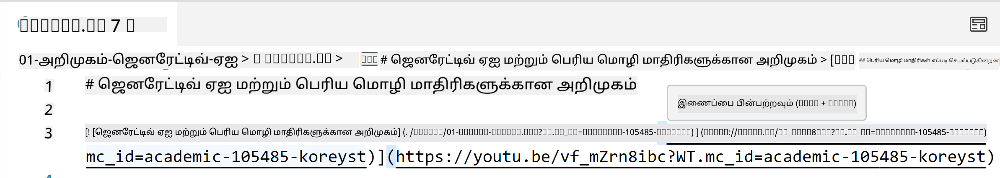
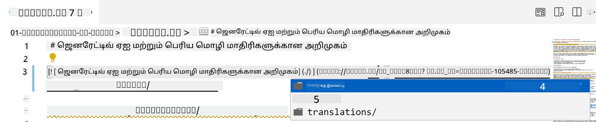
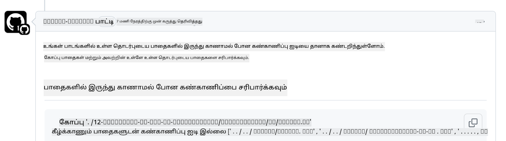
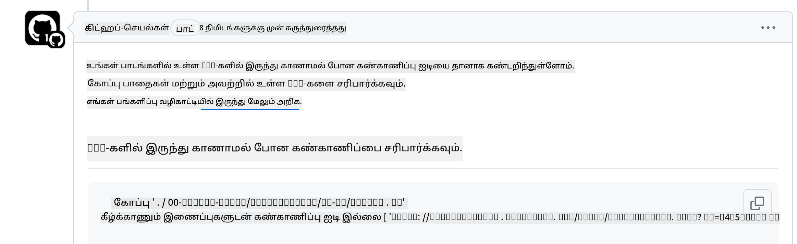

<!--
CO_OP_TRANSLATOR_METADATA:
{
  "original_hash": "57c41f2af71001a2cff9d8eb797cb843",
  "translation_date": "2025-10-11T11:09:58+00:00",
  "source_file": "CONTRIBUTING.md",
  "language_code": "ta"
}
-->
# பங்களிப்பு

இந்த திட்டம் பங்களிப்புகளையும் பரிந்துரைகளையும் வரவேற்கிறது. பெரும்பாலான பங்களிப்புகளுக்கு நீங்கள் பங்களிப்பு உரிமம் ஒப்பந்தம் (CLA) ஒப்புக்கொள்வது தேவைப்படும், இது உங்கள் பங்களிப்பை பயன்படுத்துவதற்கான உரிமைகளை நமக்கு வழங்க நீங்கள் உரிமையுடையவராகவும், உண்மையில் அதைச் செய்கிறீர்களாகவும் அறிவிக்கிறது. மேலும் விவரங்களுக்கு <https://cla.microsoft.com> ஐ பார்வையிடவும்.

> முக்கியம்: இந்த தொகுப்பில் உள்ள உரையை மொழிபெயர்க்கும்போது, இயந்திர மொழிபெயர்ப்பு பயன்படுத்த வேண்டாம். மொழிபெயர்ப்புகளை சமூகத்தின் மூலம் சரிபார்ப்போம், எனவே நீங்கள் நன்கு தேர்ந்தெடுத்த மொழிகளில் மட்டுமே மொழிபெயர்ப்புக்கு முன்வரவும்.

நீங்கள் ஒரு pull request சமர்ப்பிக்கும்போது, CLA-bot தானாகவே நீங்கள் CLA வழங்க வேண்டியதா என்பதைத் தீர்மானித்து PR ஐ சரியான முறையில் அலங்கரிக்கும் (எ.கா., லேபல், கருத்து). bot வழங்கும் வழிமுறைகளைப் பின்பற்றவும். எங்கள் CLA ஐப் பயன்படுத்தும் அனைத்து repositoryகளிலும் இதை ஒருமுறை மட்டுமே செய்ய வேண்டும்.

## நடத்தை விதிமுறை

இந்த திட்டம் [Microsoft Open Source Code of Conduct](https://opensource.microsoft.com/codeofconduct/?WT.mc_id=academic-105485-koreyst) ஐ ஏற்றுக்கொண்டுள்ளது. மேலும் தகவலுக்கு [Code of Conduct FAQ](https://opensource.microsoft.com/codeofconduct/faq/?WT.mc_id=academic-105485-koreyst) ஐ படிக்கவும் அல்லது [opencode@microsoft.com](mailto:opencode@microsoft.com) ஐ தொடர்பு கொள்ளவும்.

## கேள்வி அல்லது பிரச்சினை?

பொது ஆதரவு கேள்விகளுக்காக GitHub issues ஐ திறக்க வேண்டாம், ஏனெனில் GitHub பட்டியல் அம்ச கோரிக்கைகள் மற்றும் பிழை அறிக்கைகளுக்காக பயன்படுத்தப்பட வேண்டும். இதனால், கோடில் உள்ள உண்மையான பிரச்சினைகள் அல்லது பிழைகளை எளிதாகக் கண்காணிக்க முடியும், மேலும் பொதுவான விவாதத்தை உண்மையான கோடிலிருந்து தனியாக வைத்திருக்க முடியும்.

## தட்டச்சு பிழைகள், பிரச்சினைகள், பிழைகள் மற்றும் பங்களிப்புகள்

Generative AI for Beginners repositoryக்கு எந்த மாற்றங்களையும் சமர்ப்பிக்கும்போது, இந்த பரிந்துரைகளைப் பின்பற்றவும்.

* உங்கள் மாற்றங்களைச் செய்யும் முன் repository ஐ உங்கள் சொந்த கணக்குக்கு எப்போதும் fork செய்யவும்
* பல மாற்றங்களை ஒரு pull request இல் இணைக்க வேண்டாம். உதாரணமாக, பிழை சரிசெய்தல் மற்றும் ஆவணப் புதுப்பிப்புகளை தனித்தனியாக PRகளாக சமர்ப்பிக்கவும்
* உங்கள் pull request merge conflicts காட்டினால், உங்கள் உள்ளூர் main ஐ முக்கிய repositoryயில் உள்ளதைப் பிரதிபலிக்கச் செய்யவும்
* நீங்கள் மொழிபெயர்ப்பு சமர்ப்பிக்கும்போது, அனைத்து மொழிபெயர்க்கப்பட்ட கோப்புகளுக்கும் ஒரு PR உருவாக்கவும், ஏனெனில் உள்ளடக்கத்திற்கான பகுதி மொழிபெயர்ப்புகளை ஏற்க முடியாது
* நீங்கள் தட்டச்சு பிழை அல்லது ஆவண சரிசெய்தல் சமர்ப்பிக்கும்போது, தேவையான இடங்களில் மாற்றங்களை ஒரு PR இல் இணைக்கலாம்

## எழுதுவதற்கான பொதுவான வழிகாட்டுதல்

- உங்கள் URLs அனைத்தும் சதுரக் கோடுகளில் மூடப்பட்டு பின்னர் எந்த கூடுதல் இடங்கள் இல்லாமல் அல்லது உள்ளே இல்லாமல் வட்டக் கோடுகளில் இருக்க வேண்டும் ``.
- எந்த தொடர்புடைய இணைப்பு (அதாவது repositoryயில் உள்ள பிற கோப்புகள் மற்றும் கோப்புறைகளுக்கான இணைப்புகள்) `./` மூலம் தொடங்க வேண்டும், இது தற்போதைய வேலை செய்யும் கோப்பகத்தில் உள்ள கோப்பு அல்லது கோப்புறையை குறிக்கிறது அல்லது `../` மூலம் தொடங்க வேண்டும், இது பெற்றோர் வேலை செய்யும் கோப்பகத்தில் உள்ள கோப்பு அல்லது கோப்புறையை குறிக்கிறது.
- எந்த தொடர்புடைய இணைப்பு (அதாவது repositoryயில் உள்ள பிற கோப்புகள் மற்றும் கோப்புறைகளுக்கான இணைப்புகள்) முடிவில் கண்காணிப்பு ID (அதாவது `?` அல்லது `&` பின்னர் `wt.mc_id=` அல்லது `WT.mc_id=`) கொண்டிருக்க வேண்டும்.
- _github.com, microsoft.com, visualstudio.com, aka.ms, மற்றும் azure.com_ போன்ற டொமைன்களில் இருந்து எந்த URLகளும் முடிவில் கண்காணிப்பு ID (அதாவது `?` அல்லது `&` பின்னர் `wt.mc_id=` அல்லது `WT.mc_id=`) கொண்டிருக்க வேண்டும்.
- உங்கள் இணைப்புகளில் நாட்டுக்கேற்ப உள்ளூர் URLகள் இருக்கக்கூடாது (அதாவது `/en-us/` அல்லது `/en/`).
- அனைத்து படங்களும் `./images` கோப்பகத்தில் சேமிக்கப்பட வேண்டும்.
- படங்கள் விளக்கமான பெயர்களைக் கொண்டிருக்க வேண்டும், ஆங்கில எழுத்துக்கள், எண்கள் மற்றும் டாஷ்கள் பயன்படுத்தி பெயர் அமைக்க வேண்டும்.

## GitHub வேலைசெய்யும் முறைகள்

நீங்கள் pull request சமர்ப்பிக்கும்போது, முந்தைய விதிகளை சரிபார்க்க நான்கு வேறுபட்ட workflows செயல்படுத்தப்படும்.
இந்த workflow சோதனைகளை கடக்க, இங்கே பட்டியலிடப்பட்ட வழிமுறைகளைப் பின்பற்றவும்.

- [Check Broken Relative Paths](../..)
- [Check Paths Have Tracking](../..)
- [Check URLs Have Tracking](../..)
- [Check URLs Don't Have Locale](../..)

### Check Broken Relative Paths

இந்த workflow உங்கள் கோப்புகளில் உள்ள எந்த தொடர்புடைய பாதையும் செயல்படுகிறதா என்பதை உறுதிப்படுத்துகிறது.
இந்த repository GitHub pagesக்கு deploy செய்யப்படுகிறது, எனவே இணைப்புகளை சரியாகத் தட்டச்சு செய்யும்போது, யாரையும் தவறான இடத்திற்கு வழிநடத்தாமல் இருக்க கவனமாக இருக்க வேண்டும்.

உங்கள் இணைப்புகள் சரியாக செயல்படுகிறதா என்பதை உறுதிப்படுத்த, VS code ஐப் பயன்படுத்தி சரிபார்க்கவும்.

உதாரணமாக, உங்கள் கோப்புகளில் எந்த இணைப்பின் மேல் மவுஸ் வைத்தால், **ctrl + click** அழுத்துவதன் மூலம் இணைப்பைப் பின்பற்றுமாறு உங்களுக்கு அறிவுறுத்தப்படும்.

நீங்கள் ஒரு இணைப்பை கிளிக் செய்தால், அது உள்ளூரில் செயல்படவில்லை என்றால், அது workflow ஐத் தூண்டும் மற்றும் GitHub இல் செயல்படாது.

இந்த பிரச்சினையை சரிசெய்ய, VS code உதவியுடன் இணைப்பைத் தட்டச்சு செய்ய முயற்சிக்கவும்.

நீங்கள் `./` அல்லது `../` தட்டச்சு செய்யும்போது, நீங்கள் தட்டச்சு செய்ததற்கேற்ப கிடைக்கும் விருப்பங்களைத் தேர்ந்தெடுக்க VS code உங்களுக்கு அறிவுறுத்தும்.

தேவையான கோப்பு அல்லது கோப்புறையை கிளிக் செய்து பாதையைப் பின்பற்றவும், உங்கள் பாதை முறைகேடாக இல்லை என்பதை உறுதிப்படுத்தலாம்.

சரியான தொடர்புடைய பாதையைச் சேர்த்த பிறகு, சேமித்து, உங்கள் மாற்றங்களை push செய்யவும். workflow மீண்டும் செயல்படுத்தப்பட்டு உங்கள் மாற்றங்களைச் சரிபார்க்கும்.
நீங்கள் சோதனையை கடக்கிறீர்கள் என்றால், நீங்கள் தயாராக இருக்கிறீர்கள்.

### Check Paths Have Tracking

இந்த workflow எந்த தொடர்புடைய பாதையும் கண்காணிப்பு கொண்டிருக்கிறதா என்பதை உறுதிப்படுத்துகிறது.
இந்த repository GitHub pagesக்கு deploy செய்யப்படுகிறது, எனவே வெவ்வேறு கோப்புகள் மற்றும் கோப்புறைகளுக்கு இடையேயான இயக்கத்தை கண்காணிக்க வேண்டும்.

உங்கள் தொடர்புடைய பாதைகள் கண்காணிப்பு கொண்டிருக்கிறதா என்பதை உறுதிப்படுத்த, பாதையின் முடிவில் `?wt.mc_id=` என்ற உரையைச் சரிபார்க்கவும்.
இது உங்கள் தொடர்புடைய பாதைகளுக்கு இணைக்கப்பட்டிருந்தால், நீங்கள் இந்த சோதனையை கடக்கிறீர்கள்.

இல்லையெனில், நீங்கள் பின்வரும் பிழையைப் பெறலாம்.

இந்த பிரச்சினையை சரிசெய்ய, workflow குறிப்பிடும் கோப்பு பாதையைத் திறந்து, தொடர்புடைய பாதைகளின் முடிவில் கண்காணிப்பு ID ஐச் சேர்க்கவும்.

கண்காணிப்பு ID ஐச் சேர்த்த பிறகு, சேமித்து, உங்கள் மாற்றங்களை push செய்யவும். workflow மீண்டும் செயல்படுத்தப்பட்டு உங்கள் மாற்றங்களைச் சரிபார்க்கும்.
நீங்கள் சோதனையை கடக்கிறீர்கள் என்றால், நீங்கள் தயாராக இருக்கிறீர்கள்.

### Check URLs Have Tracking

இந்த workflow எந்த இணைய URLகளும் கண்காணிப்பு கொண்டிருக்கிறதா என்பதை உறுதிப்படுத்துகிறது.
இந்த repository அனைவருக்கும் கிடைக்கிறது, எனவே போக்குவரத்து எங்கு இருந்து வருகிறது என்பதை அறிய URLகளைப் பின்தொடர வேண்டும்.

உங்கள் URLகள் கண்காணிப்பு கொண்டிருக்கிறதா என்பதை உறுதிப்படுத்த, URL முடிவில் `?wt.mc_id=` என்ற உரையைச் சரிபார்க்கவும்.
இது உங்கள் URLகளுக்கு இணைக்கப்பட்டிருந்தால், நீங்கள் இந்த சோதனையை கடக்கிறீர்கள்.

இல்லையெனில், நீங்கள் பின்வரும் பிழையைப் பெறலாம்.

இந்த பிரச்சினையை சரிசெய்ய, workflow குறிப்பிடும் கோப்பு பாதையைத் திறந்து, URLகளின் முடிவில் கண்காணிப்பு ID ஐச் சேர்க்கவும்.

கண்காணிப்பு ID ஐச் சேர்த்த பிறகு, சேமித்து, உங்கள் மாற்றங்களை push செய்யவும். workflow மீண்டும் செயல்படுத்தப்பட்டு உங்கள் மாற்றங்களைச் சரிபார்க்கும்.
நீங்கள் சோதனையை கடக்கிறீர்கள் என்றால், நீங்கள் தயாராக இருக்கிறீர்கள்.

### Check URLs Don't Have Locale

இந்த workflow எந்த இணைய URLகளும் நாட்டுக்கேற்ப உள்ளூர் URLகளை கொண்டிருக்காதா என்பதை உறுதிப்படுத்துகிறது.
இந்த repository உலகம் முழுவதும் உள்ள அனைவருக்கும் கிடைக்கிறது, எனவே URLகளில் உங்கள் நாட்டின் உள்ளூர் URLகளைச் சேர்க்க வேண்டாம்.

உங்கள் URLகள் நாட்டுக்கேற்ப உள்ளூர் URLகளை கொண்டிருக்காதா என்பதை உறுதிப்படுத்த, URL எங்கும் `/en-us/` அல்லது `/en/` அல்லது பிற மொழி உள்ளூர் URLகளைச் சரிபார்க்கவும்.
இது உங்கள் URLகளில் இல்லை என்றால், நீங்கள் இந்த சோதனையை கடக்கிறீர்கள்.

இல்லையெனில், நீங்கள் பின்வரும் பிழையைப் பெறலாம்.

இந்த பிரச்சினையை சரிசெய்ய, workflow குறிப்பிடும் கோப்பு பாதையைத் திறந்து, URLகளில் இருந்து நாட்டுக்கேற்ப உள்ளூர் URLகளை நீக்கவும்.

நாட்டுக்கேற்ப உள்ளூர் URLகளை நீக்கிய பிறகு, சேமித்து, உங்கள் மாற்றங்களை push செய்யவும். workflow மீண்டும் செயல்படுத்தப்பட்டு உங்கள் மாற்றங்களைச் சரிபார்க்கும்.
நீங்கள் சோதனையை கடக்கிறீர்கள் என்றால், நீங்கள் தயாராக இருக்கிறீர்கள்.

வாழ்த்துக்கள்! உங்கள் பங்களிப்பு குறித்து கருத்து தெரிவிக்க விரைவில் உங்களை தொடர்பு கொள்வோம்.

---

**குறிப்பு**:  
இந்த ஆவணம் [Co-op Translator](https://github.com/Azure/co-op-translator) என்ற AI மொழிபெயர்ப்பு சேவையைப் பயன்படுத்தி மொழிபெயர்க்கப்பட்டுள்ளது. நாங்கள் துல்லியத்திற்காக முயற்சிக்கின்றோம், ஆனால் தானியங்கி மொழிபெயர்ப்புகளில் பிழைகள் அல்லது தவறான தகவல்கள் இருக்கக்கூடும் என்பதை தயவுசெய்து கவனத்தில் கொள்ளுங்கள். அதன் தாய்மொழியில் உள்ள மூல ஆவணம் அதிகாரப்பூர்வ ஆதாரமாக கருதப்பட வேண்டும். முக்கியமான தகவல்களுக்கு, தொழில்முறை மனித மொழிபெயர்ப்பு பரிந்துரைக்கப்படுகிறது. இந்த மொழிபெயர்ப்பைப் பயன்படுத்துவதால் ஏற்படும் எந்த தவறான புரிதல்கள் அல்லது தவறான விளக்கங்களுக்கு நாங்கள் பொறுப்பல்ல.