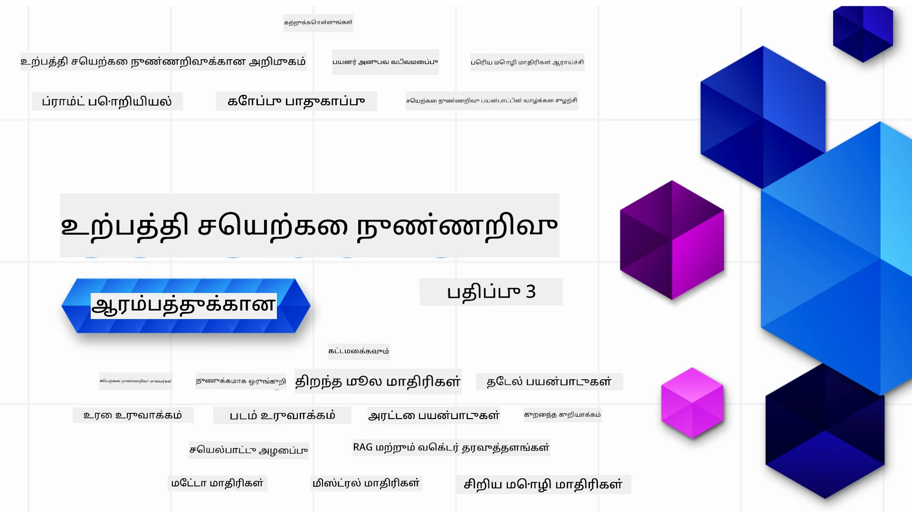

### உருவாக்கும் என்ற அடிப்படையில் செயலிகளை கட்ட எதுவும் தெரிந்து கொள்ள 21 பாடங்கள்

[](https://github.com/microsoft/Generative-AI-For-Beginners/blob/master/LICENSE?WT.mc_id=academic-105485-koreyst)
[](https://GitHub.com/microsoft/Generative-AI-For-Beginners/graphs/contributors/?WT.mc_id=academic-105485-koreyst)
[](https://GitHub.com/microsoft/Generative-AI-For-Beginners/issues/?WT.mc_id=academic-105485-koreyst)
[](https://GitHub.com/microsoft/Generative-AI-For-Beginners/pulls/?WT.mc_id=academic-105485-koreyst)
[](http://makeapullrequest.com?WT.mc_id=academic-105485-koreyst)

[](https://GitHub.com/microsoft/Generative-AI-For-Beginners/watchers/?WT.mc_id=academic-105485-koreyst)
[](https://GitHub.com/microsoft/Generative-AI-For-Beginners/network/?WT.mc_id=academic-105485-koreyst)
[](https://GitHub.com/microsoft/Generative-AI-For-Beginners/stargazers/?WT.mc_id=academic-105485-koreyst)

[](https://discord.gg/nTYy5BXMWG)

### 🌐 பல மொழி ஆதரவு

#### GitHub செயல்பாட்டின் மூலம் ஆதரவு ( தானாகவும் எப்போதும் புதுப்பிக்கப்பட்டதும் )

<!-- CO-OP TRANSLATOR LANGUAGES TABLE START -->
[Arabic](../ar/README.md) | [Bengali](../bn/README.md) | [Bulgarian](../bg/README.md) | [Burmese (Myanmar)](../my/README.md) | [Chinese (Simplified)](../zh-CN/README.md) | [Chinese (Traditional, Hong Kong)](../zh-HK/README.md) | [Chinese (Traditional, Macau)](../zh-MO/README.md) | [Chinese (Traditional, Taiwan)](../zh-TW/README.md) | [Croatian](../hr/README.md) | [Czech](../cs/README.md) | [Danish](../da/README.md) | [Dutch](../nl/README.md) | [Estonian](../et/README.md) | [Finnish](../fi/README.md) | [French](../fr/README.md) | [German](../de/README.md) | [Greek](../el/README.md) | [Hebrew](../he/README.md) | [Hindi](../hi/README.md) | [Hungarian](../hu/README.md) | [Indonesian](../id/README.md) | [Italian](../it/README.md) | [Japanese](../ja/README.md) | [Kannada](../kn/README.md) | [Korean](../ko/README.md) | [Lithuanian](../lt/README.md) | [Malay](../ms/README.md) | [Malayalam](../ml/README.md) | [Marathi](../mr/README.md) | [Nepali](../ne/README.md) | [Nigerian Pidgin](../pcm/README.md) | [Norwegian](../no/README.md) | [Persian (Farsi)](../fa/README.md) | [Polish](../pl/README.md) | [Portuguese (Brazil)](../pt-BR/README.md) | [Portuguese (Portugal)](../pt-PT/README.md) | [Punjabi (Gurmukhi)](../pa/README.md) | [Romanian](../ro/README.md) | [Russian](../ru/README.md) | [Serbian (Cyrillic)](../sr/README.md) | [Slovak](../sk/README.md) | [Slovenian](../sl/README.md) | [Spanish](../es/README.md) | [Swahili](../sw/README.md) | [Swedish](../sv/README.md) | [Tagalog (Filipino)](../tl/README.md) | [Tamil](./README.md) | [Telugu](../te/README.md) | [Thai](../th/README.md) | [Turkish](../tr/README.md) | [Ukrainian](../uk/README.md) | [Urdu](../ur/README.md) | [Vietnamese](../vi/README.md)

> **உள்ளூர் கிளோன் செய்வதைக் விரும்புகிறீர்களா?**

> இந்த ரெப்போவில் 50+ மொழி மொழிபெயர்ப்புகள் உள்ளதால் பதிவிறக்க அளவு பெரிதாகும். மொழிபெயர்ப்புகள் இல்லாமல் கிளோன் செய்ய sparse checkout பயன்படுத்தவும்:
> ```bash
> git clone --filter=blob:none --sparse https://github.com/microsoft/generative-ai-for-beginners.git
> cd generative-ai-for-beginners
> git sparse-checkout set --no-cone '/*' '!translations' '!translated_images'
> ```
> இது மிக வேகமாக இந்த படிப்பை முடிக்க தேவையானவை அனைத்தையும் தரும்.
<!-- CO-OP TRANSLATOR LANGUAGES TABLE END -->

# தொடக்கத்துக்கான உருவாக்கும் செயற்கை நுட்பம் (பதிப்பு 3) - ஒரு பாடநெறி

Microsoft Cloud Advocates உடன் 21 பாடங்களுடன் உருவாக்கும் செயற்கை நுட்ப செயலிகளை கட்டமைப்பதற்கான அடித்தளங்களை கற்றுக்கொள்ளுங்கள்.

## 🌱 தொடங்குதல்

இந்த பாடநெறி 21 பாடங்களை கொண்டது. ஒவ்வொரு பாடமும் தனியான தலைப்புகளை உள்ளடக்கியது, எனவே நீங்கள் விரும்பிய இடத்திலிருந்து துவங்குங்கள்!

பாடங்கள் இரண்டு வகைப்படுத்தப்பட்டுள்ளன, "கற்று" பாடங்கள் உருவாக்கும் செயற்கை நுட்ப கருத்துக்களை விளக்குகின்றன அல்லது "கட்ட" பாடங்கள் ஒரு கருத்தை விளக்கி, Python மற்றும் TypeScript இல் எங்கு இருக்கும் என்றும் குறியீடு எடுத்துக்காட்டுகளுடன் தரப்படுகின்றன.

.NET டெவலப்பர்களுக்கு [Generative AI for Beginners (.NET Edition)](https://github.com/microsoft/Generative-AI-for-beginners-dotnet?WT.mc_id=academic-105485-koreyst) பார்த்து கொள்ளவும்!

ஒவ்வொரு பாடத்திலும் கூடுதல் கற்றல் கருவிகளுடன் "கற்றலை தொடரவும்" பகுதி உள்ளது.

## நீங்கள் தேவைப்படுவது
### இந்த பாடநெறியின் குறியீட்டை இயக்க, நீங்கள் கீழ்கண்டவற்றைப் பயன்படுத்தலாம்:
 - [Azure OpenAI சேவை](https://aka.ms/genai-beginners/azure-open-ai?WT.mc_id=academic-105485-koreyst) - **பாடங்கள்:** "aoai-assignment"
 - [GitHub மார்க்கெட்ட்பிளேஸ் மாடல் பகுப்பு](https://aka.ms/genai-beginners/gh-models?WT.mc_id=academic-105485-koreyst) - **பாடங்கள்:** "githubmodels"
 - [OpenAI API](https://aka.ms/genai-beginners/open-ai?WT.mc_id=academic-105485-koreyst) - **பாடங்கள்:** "oai-assignment" 
   
- Python அல்லது TypeScript அடிப்படைக் கற்றல் பயனுள்ளது - \*முழுமையான தொடக்கத்திற்கு [Python](https://aka.ms/genai-beginners/python?WT.mc_id=academic-105485-koreyst) மற்றும் [TypeScript](https://aka.ms/genai-beginners/typescript?WT.mc_id=academic-105485-koreyst) பாடநெறிகளை பாருங்கள்
- உங்கள் தனிப்பட்ட GitHub கணக்கிற்கு இந்த முழு ரெப்போவை [fork செய்ய](https://aka.ms/genai-beginners/github?WT.mc_id=academic-105485-koreyst) ஒரு GitHub கணக்கு வேண்டும்

எங்கள் **[Course Setup](./00-course-setup/README.md?WT.mc_id=academic-105485-koreyst)** பாடமாக உங்கள் மேம்பாட்டு சூழலை அமைக்க உதவிவரும்.

பின்னர் எளிதாகக் கண்டுபிடிக்க [இந்த ரெப்போவை நட்சத்திரம் (🌟) செய்ய மறக்காதீர்கள்](https://docs.github.com/en/get-started/exploring-projects-on-github/saving-repositories-with-stars?WT.mc_id=academic-105485-koreyst).

## 🧠 தயார் துவங்குமா?

மேலும் மேம்பட்ட குறியீடு எடுத்துக்காட்டுகள் தேவைப்பட்டால், எங்கள் [உருவாக்கும் AI குறியீடு எடுத்துக்காட்டுகள் தொகுப்பை](https://aka.ms/genai-beg-code?WT.mc_id=academic-105485-koreyst) Python மற்றும் TypeScript இரண்டிலும் பார்க்கவும்.

## 🗣️ மற்ற கற்றவர்கள் பிராந்தியத்தில் சந்திக்கவும், உதவி பெறவும்

இந்த பாடநெறியை பயின்று கொண்டிருக்கும் மற்ற கற்றவர்களை சந்திக்க மற்றும் ஒத்துழைக்கும் குரூப்பில் இணைய [தமிழ்நாடு Azure AI Foundry Discord சேவையகத்திற்கு](https://aka.ms/genai-discord?WT.mc_id=academic-105485-koreyst) புகலளிக்கவும்.

வினாக்கள் கேட்க அல்லது எந்தவொரு கருத்துக்களை பகிர [Azure AI Foundry Developer Forum](https://aka.ms/azureaifoundry/forum) இல் GitHub இல் பங்கேற்கவும்.

## 🚀 ஒரு தொடக்க நிறுவனத்தை கட்டுகிறீர்களா?

இன்று Azure கிரெடிட்களுடன் கட்டத் துவங்க [Microsoft for Startups](https://www.microsoft.com/startups) பார்வையிடவும்.

## 🙏 உதவ விரும்புகிறீர்களா?

உங்களிடம் பரிந்துரைகள் உள்ளதா அல்லது எழுத்துப்பிழைகள், குறியீடு பிழைகள் கண்டுபிடித்தீர்களா? [ஒரு பிரச்சனை எழுப்பவும்](https://github.com/microsoft/generative-ai-for-beginners/issues?WT.mc_id=academic-105485-koreyst) அல்லது [ஒரு_PULL_REQUEST_ உருவாக்கவும்](https://github.com/microsoft/generative-ai-for-beginners/pulls?WT.mc_id=academic-105485-koreyst)

## 📂 ஒவ்வொரு பாடத்திலும் உள்ளது:

- தலைப்புக்கான சுருக்கமான வீடியோ அறிமுகம்
- README இல் உள்ள எழுத்துப் பாடம்
- Azure OpenAI மற்றும் OpenAI API ஐ ஆதரிக்கும் Python மற்றும் TypeScript குறியீடு எடுத்துக்காட்டுகள்
- மேலும் கற்றுக்கொள்வதற்கு இணைப்புகள்

## 🗃️ பாடங்கள்

| #   | **பாட இணைப்பு**                                                                                                                            | **விளக்கம்**                                                                                      | **வீடியோ**                                                                   | **கூடுதல் கற்றல்**                                                             |
| --- | ------------------------------------------------------------------------------------------------------------------------------------------ | ------------------------------------------------------------------------------------------------ | --------------------------------------------------------------------------- | ------------------------------------------------------------------------------ |
| 00  | [Course Setup](./00-course-setup/README.md?WT.mc_id=academic-105485-koreyst)                                                                 | **கற்று:** உங்கள் மேம்பாட்டு சூழலை எவ்வாறு அமைப்பது                                          | வீடியோ விரைவில்                                                                        | [மேலும் கற்றுக்கொள்ள](https://aka.ms/genai-collection?WT.mc_id=academic-105485-koreyst) |
| 01  | [Introduction to Generative AI and LLMs](./01-introduction-to-genai/README.md?WT.mc_id=academic-105485-koreyst)                              | **கற்று:** உருவாக்கும் செயற்கை நுட்பம் மற்றும் பெரிய மொழி மாதிரிகள் (LLMs) எப்படி இயங்குகின்றன.  | [வீடியோ](https://aka.ms/gen-ai-lesson-1-gh?WT.mc_id=academic-105485-koreyst) | [மேலும் கற்றுக்கொள்ள](https://aka.ms/genai-collection?WT.mc_id=academic-105485-koreyst) |
| 02  | [Exploring and comparing different LLMs](./02-exploring-and-comparing-different-llms/README.md?WT.mc_id=academic-105485-koreyst)             | **கற்று:** உங்கள் பயன்பாட்டுக்கு ஏற்ற மாதிரியை எப்படி தேர்வு செய்வது                          | [வீடியோ](https://aka.ms/gen-ai-lesson2-gh?WT.mc_id=academic-105485-koreyst)  | [மேலும் கற்றுக்கொள்ள](https://aka.ms/genai-collection?WT.mc_id=academic-105485-koreyst) |
| 03  | [Using Generative AI Responsibly](./03-using-generative-ai-responsibly/README.md?WT.mc_id=academic-105485-koreyst)                           | **கற்று:** உருவாக்கும் செயற்கை நுட்ப செயலிகளை பொறுப்பாக எவ்வாறு கட்டமைப்பது                   | [வீடியோ](https://aka.ms/gen-ai-lesson3-gh?WT.mc_id=academic-105485-koreyst)  | [மேலும் கற்றுக்கொள்ள](https://aka.ms/genai-collection?WT.mc_id=academic-105485-koreyst) |
| 04  | [ப்ராம்ட் பொறியியல் அடிப்படைகளைப் புரிந்துகொள்வது](./04-prompt-engineering-fundamentals/README.md?WT.mc_id=academic-105485-koreyst)             | **கற்றுக்கொள்ளவும்:** செயலில் ப்ராம்ட் பொறியியலின் சிறந்த பழக்கவழக்கங்கள்                                           | [வீடியோ](https://aka.ms/gen-ai-lesson4-gh?WT.mc_id=academic-105485-koreyst)  | [மேலும் அறிய](https://aka.ms/genai-collection?WT.mc_id=academic-105485-koreyst) |
| 05  | [முன்னேறிய ப்ராம்ட்களை உருவாக்குதல்](./05-advanced-prompts/README.md?WT.mc_id=academic-105485-koreyst)                                                | **கற்றுக்கொள்ளவும்:** உங்கள் ப்ராம்ட்களின் விளைவுகளை மேம்படுத்தும் ப்ராம்ட் பொறியியல் தொழில்நுட்பங்களை எப்படி பயன்படுத்துவது. | [வீடியோ](https://aka.ms/gen-ai-lesson5-gh?WT.mc_id=academic-105485-koreyst)  | [மேலும் அறிய](https://aka.ms/genai-collection?WT.mc_id=academic-105485-koreyst) |
| 06  | [உரை உருவாக்கும் பயன்பாடுகளை உருவாக்குதல்](./06-text-generation-apps/README.md?WT.mc_id=academic-105485-koreyst)                                | **உருவாக்கவும்:** Azure OpenAI / OpenAI API பயன்படுத்தி ஒரு உரை உருவாக்கும் பயன்பாடு                                | [வீடியோ](https://aka.ms/gen-ai-lesson6-gh?WT.mc_id=academic-105485-koreyst)  | [மேலும் அறிய](https://aka.ms/genai-collection?WT.mc_id=academic-105485-koreyst) |
| 07  | [சொட்டும் பயன்பாடுகளை உருவாக்குதல்](./07-building-chat-applications/README.md?WT.mc_id=academic-105485-koreyst)                                     | **உருவாக்கவும்:** சாட் செயலிகளைக் திறம்பட உருவாக்கும் மற்றும் இணைக்கும் தொழில்நுட்பங்கள்.               | [வீடியோ](https://aka.ms/gen-ai-lessons7-gh?WT.mc_id=academic-105485-koreyst) | [மேலும் அறிய](https://aka.ms/genai-collection?WT.mc_id=academic-105485-koreyst) |
| 08  | [தேடல் செயலிகள் மற்றும் வெக்டர் தரவுத்தளங்கள் உருவாக்குதல்](./08-building-search-applications/README.md?WT.mc_id=academic-105485-koreyst)                        | **உருவாக்கவும்:** இம்பெட்டிங்குகளைப் பயன்படுத்தி தரவைத் தேடும் தேடல் செயலி.                        | [வீடியோ](https://aka.ms/gen-ai-lesson8-gh?WT.mc_id=academic-105485-koreyst)  | [மேலும் அறிய](https://aka.ms/genai-collection?WT.mc_id=academic-105485-koreyst) |
| 09  | [பட உருவாக்கும் செயலிகளை உருவாக்குதல்](./09-building-image-applications/README.md?WT.mc_id=academic-105485-koreyst)                        | **உருவாக்கவும்:** பட உருவாக்கும் செயலி                                                       | [வீடியோ](https://aka.ms/gen-ai-lesson9-gh?WT.mc_id=academic-105485-koreyst)  | [மேலும் அறிய](https://aka.ms/genai-collection?WT.mc_id=academic-105485-koreyst) |
| 10  | [குறைந்த குறியீட்டு AI செயலிகளை உருவாக்குதல்](./10-building-low-code-ai-applications/README.md?WT.mc_id=academic-105485-koreyst)                       | **உருவாக்கவும்:** குறைந்த குறியீட்டு கருவிகளைப் பயன்படுத்தி ஒரு உருவாக்கும் AI செயலி                                     | [வீடியோ](https://aka.ms/gen-ai-lesson10-gh?WT.mc_id=academic-105485-koreyst) | [மேலும் அறிய](https://aka.ms/genai-collection?WT.mc_id=academic-105485-koreyst) |
| 11  | [பணிபெயர்ப்பு அழைப்புடன் வெளிப்புற செயலிகளை இணைத்தல்](./11-integrating-with-function-calling/README.md?WT.mc_id=academic-105485-koreyst) | **உருவாக்கவும்:** பணிபெயர்ப்பு அழைப்பென்றால் என்ன மற்றும் செயலிகளில் அதன் பயன்பாடுகள்                          | [வீடியோ](https://aka.ms/gen-ai-lesson11-gh?WT.mc_id=academic-105485-koreyst) | [மேலும் அறிய](https://aka.ms/genai-collection?WT.mc_id=academic-105485-koreyst) |
| 12  | [AI செயலிகளுக்கான UX வடிவமைப்பு](./12-designing-ux-for-ai-applications/README.md?WT.mc_id=academic-105485-koreyst)                         | **கற்றுக்கொள்ளவும்:** உருவாக்கும் AI செயலிகளுக்கு UX வடிவமைப்பு கொள்கைகளை எப்படி செயல்படுத்துவது         | [வீடியோ](https://aka.ms/gen-ai-lesson12-gh?WT.mc_id=academic-105485-koreyst) | [மேலும் அறிய](https://aka.ms/genai-collection?WT.mc_id=academic-105485-koreyst) |
| 13  | [உங்கள் உருவாக்கும் AI செயலிகளை பாதுகாப்பது](./13-securing-ai-applications/README.md?WT.mc_id=academic-105485-koreyst)                         | **கற்றுக்கொள்ளவும்:** AI அமைப்புகளுக்கு இடையிலும் தாக்கங்கள் மற்றும் ஆபத்துகள் மற்றும் அவற்றை பாதுகாப்பதற்கான முறைகள்.             | [வீடியோ](https://aka.ms/gen-ai-lesson13-gh?WT.mc_id=academic-105485-koreyst) | [மேலும் அறிய](https://aka.ms/genai-collection?WT.mc_id=academic-105485-koreyst) |
| 14  | [உருவாக்கும் AI செயலியின் வாழ்க்கை சுழற்சி](./14-the-generative-ai-application-lifecycle/README.md?WT.mc_id=academic-105485-koreyst)           | **கற்றுக்கொள்ளவும்:** LLM வாழ்க்கை சுழற்சி மற்றும் LLMOps ஐ நிர்வகிக்க கருவிகள் மற்றும் அளவுகோல்கள்                         | [வீடியோ](https://aka.ms/gen-ai-lesson14-gh?WT.mc_id=academic-105485-koreyst) | [மேலும் அறிய](https://aka.ms/genai-collection?WT.mc_id=academic-105485-koreyst) |
| 15  | [திரும்ப பெறுதல் மேம்படுத்தப்பட்ட உருவாக்கல் (RAG) மற்றும் வெக்டர் தரவுத்தளங்கள்](./15-rag-and-vector-databases/README.md?WT.mc_id=academic-105485-koreyst)        | **உருவாக்கவும்:** RAG வடிவமைப்பைப் பயன்படுத்தி வெக்டர் தரவுத்தளங்களில் இருந்து இம்பெட்டிங்குகளைத் திரும்ப பெறும் செயலி  | [வீடியோ](https://aka.ms/gen-ai-lesson15-gh?WT.mc_id=academic-105485-koreyst) | [மேலும் அறிய](https://aka.ms/genai-collection?WT.mc_id=academic-105485-koreyst) |
| 16  | [திறந்த மூல மாதிரிகள் மற்றும் Hugging Face](./16-open-source-models/README.md?WT.mc_id=academic-105485-koreyst)                                    | **உருவாக்கவும்:** Hugging Face இல் கிடைக்கும் திறந்த மூல மாதிரிகளைப் பயன்படுத்தும் செயலி                    | [வீடியோ](https://aka.ms/gen-ai-lesson16-gh?WT.mc_id=academic-105485-koreyst) | [மேலும் அறிய](https://aka.ms/genai-collection?WT.mc_id=academic-105485-koreyst) |
| 17  | [AI முகவர்கள்](./17-ai-agents/README.md?WT.mc_id=academic-105485-koreyst)                                                                       | **உருவாக்கவும்:** AI முகவர் வடிவமைப்பைப் பயன்படுத்தும் செயலி                                           | [வீடியோ](https://aka.ms/gen-ai-lesson17-gh?WT.mc_id=academic-105485-koreyst) | [மேலும் அறிய](https://aka.ms/genai-collection?WT.mc_id=academic-105485-koreyst) |
| 18  | [LLM களை நுட்பமாக சரிசெய்தல்](./18-fine-tuning/README.md?WT.mc_id=academic-105485-koreyst)                                                              | **கற்றுக்கொள்ளவும்:** LLM களை நுட்பமாக சரிசெய்தல் என்ன, ஏன் மற்றும் எப்படி என்பதைப் பற்றி                                            | [வீடியோ](https://aka.ms/gen-ai-lesson18-gh?WT.mc_id=academic-105485-koreyst) | [மேலும் அறிய](https://aka.ms/genai-collection?WT.mc_id=academic-105485-koreyst) |
| 19  | [SLM களைப் பயன்படுத்தி உருவாக்குதல்](./19-slm/README.md?WT.mc_id=academic-105485-koreyst)                                                              | **கற்றுக்கொள்ளவும்:** சிறிய மொழி மாதிரிகளோடு உருவாக்குவதின் நன்மைகள்                                            | வீடியோ விரைவில் வரும் | [மேலும் அறிய](https://aka.ms/genai-collection?WT.mc_id=academic-105485-koreyst) |
| 20  | [Mistral மாதிரிகளோடு உருவாக்குதல்](./20-mistral/README.md?WT.mc_id=academic-105485-koreyst)                                                              | **கற்றுக்கொள்ளவும்:** Mistral குடும்ப மாதிரிகளின் அம்சங்கள் மற்றும் வேறுபாடுகள்                                           | வீடியோ விரைவில் வரும் | [மேலும் அறிய](https://aka.ms/genai-collection?WT.mc_id=academic-105485-koreyst) |
| 21  | [Meta மாதிரிகளோடு உருவாக்குதல்](./21-meta/README.md?WT.mc_id=academic-105485-koreyst)                                                              | **கற்றுக்கொள்ளவும்:** Meta குடும்ப மாதிரிகளின் அம்சங்கள் மற்றும் வேறுபாடுகள்                                           | வீடியோ விரைவில் வரும் | [மேலும் அறிய](https://aka.ms/genai-collection?WT.mc_id=academic-105485-koreyst) |

### 🌟 சிறப்பு நன்றி

அனைத்து GitHub செயல்கள் மற்றும் பணிநடவடிக்கைகளை உருவாக்கியதற்கு [**John Aziz**](https://www.linkedin.com/in/john0isaac/) அவர்களுக்கு சிறப்பு நன்றி

ஒவ்வொரு பாடத்திலும் கற்றுக்கொள்ளும் மற்றும் கோடு அனுபவத்தை மேம்படுத்த முக்கிய பங்களிப்புகளை செய்ததற்கு [**Bernhard Merkle**](https://www.linkedin.com/in/bernhard-merkle-738b73/) அவர்களுக்கு நன்றி.

## 🎒 மற்ற பாடங்கள்

எங்கள் குழு பிற பாடங்களையும் உருவாக்குகிறது! பாருங்கள்:

<!-- CO-OP TRANSLATOR OTHER COURSES START -->
### LangChain
[](https://aka.ms/langchain4j-for-beginners)
[](https://aka.ms/langchainjs-for-beginners?WT.mc_id=m365-94501-dwahlin)

---

### Azure / Edge / MCP / முகவர்கள்
[](https://github.com/microsoft/AZD-for-beginners?WT.mc_id=academic-105485-koreyst)
[](https://github.com/microsoft/edgeai-for-beginners?WT.mc_id=academic-105485-koreyst)
[](https://github.com/microsoft/mcp-for-beginners?WT.mc_id=academic-105485-koreyst)
[](https://github.com/microsoft/ai-agents-for-beginners?WT.mc_id=academic-105485-koreyst)

---
 
### உருவாக்கும் AI தொடர்
[](https://github.com/microsoft/generative-ai-for-beginners?WT.mc_id=academic-105485-koreyst)
[-9333EA?style=for-the-badge&labelColor=E5E7EB&color=9333EA)](https://github.com/microsoft/Generative-AI-for-beginners-dotnet?WT.mc_id=academic-105485-koreyst)
[-C084FC?style=for-the-badge&labelColor=E5E7EB&color=C084FC)](https://github.com/microsoft/generative-ai-for-beginners-java?WT.mc_id=academic-105485-koreyst)
[-E879F9?style=for-the-badge&labelColor=E5E7EB&color=E879F9)](https://github.com/microsoft/generative-ai-with-javascript?WT.mc_id=academic-105485-koreyst)

---
 
### கோர் கற்றல்
[](https://aka.ms/ml-beginners?WT.mc_id=academic-105485-koreyst)
[](https://aka.ms/datascience-beginners?WT.mc_id=academic-105485-koreyst)
[](https://aka.ms/ai-beginners?WT.mc_id=academic-105485-koreyst)
[](https://github.com/microsoft/Security-101?WT.mc_id=academic-96948-sayoung)
[](https://aka.ms/webdev-beginners?WT.mc_id=academic-105485-koreyst)
[](https://aka.ms/iot-beginners?WT.mc_id=academic-105485-koreyst)
[](https://github.com/microsoft/xr-development-for-beginners?WT.mc_id=academic-105485-koreyst)

---
 
### கோபைலட் தொடர்
[](https://aka.ms/GitHubCopilotAI?WT.mc_id=academic-105485-koreyst)
[](https://github.com/microsoft/mastering-github-copilot-for-dotnet-csharp-developers?WT.mc_id=academic-105485-koreyst)
[](https://github.com/microsoft/CopilotAdventures?WT.mc_id=academic-105485-koreyst)
<!-- CO-OP TRANSLATOR OTHER COURSES END -->

## உதவி பெறுதல்

எனில் நீங்கள் சிக்கலான நிலையை சந்தித்தால் அல்லது AI செயலிகளைக் கட்டுவதில் ஏதேனும் கேள்விகளைக் கொண்டிருந்தால். MCP பற்றிய கலந்துரையாடல்களில் மற்ற பயிற்சியாளர்களும் அனுபவமுள்ள டெவலப்பர்களும் பங்கேற்கின்றனர். கேள்விகள் வரவேற்கப்படுகின்றன மற்றும் அறிவு விரைவாக பகிரப்படுகிறது என்பது ஒரு ஆதரவான சமூகமே.

[](https://discord.gg/nTYy5BXMWG)

உங்களிடம் தயாரிப்பு கருத்துக்களோ அல்லது பிழைகளோ இருந்தால், அவர்களை கட்டுவதில் பார்வையிடுக:

[](https://aka.ms/foundry/forum)

---

<!-- CO-OP TRANSLATOR DISCLAIMER START -->
**தவறறிக்கை**:  
இந்த ஆவணம் [Co-op Translator](https://github.com/Azure/co-op-translator) எனும் AI மொழிபெயர்ப்பு சேவையை பயன்படுத்தி மொழிபெயர்க்கப்பட்டுள்ளது. நாங்கள் துல்லியத்தில் முயற்சி செய்கிறோம் என்றாலும், தானியங்கி மொழிபெயர்ப்புகளில் தவறுகள் அல்லது அசத்தியங்கள் இருக்கக்கூடும் என்பதை தயவுசெய்து கருத்தில் கொள்ளவும். சொந்த மொழியில் உள்ள அம்பமான ஆவணம் அதிகாரபூர்வ மூலமாக பயன்படுத்தப்பட வேண்டும். முக்கிய தகவல்களுக்கு, தொழில்முறை மனித மொழிபெயர்ப்பு பரிந்துரைக்கப்படுகிறது. இந்த மொழிபெயர்ப்பின் பயன்படுத்துவதனால் ஏற்படும் எந்த தவறான புரிதலும் அல்லது தவறான விளக்கங்களுக்கும் நாம் பொறுப்பு ஏற்கவில்லை.
<!-- CO-OP TRANSLATOR DISCLAIMER END -->