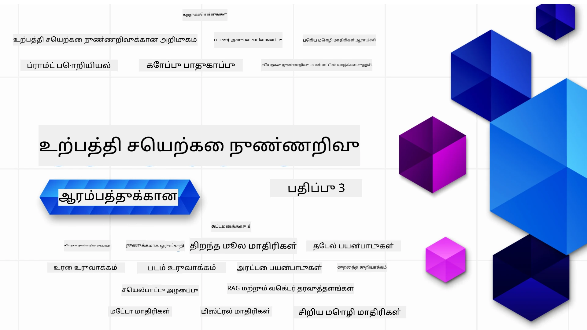

### உருவாக்கும் AI பயன்பாடுகளை உருவாக்கத் தொடங்க நீங்கள் அறிய வேண்டிய அனைத்தையும் கற்றுரைக்கும் 21 பாடங்கள்

[](https://github.com/microsoft/Generative-AI-For-Beginners/blob/master/LICENSE?WT.mc_id=academic-105485-koreyst)
[](https://GitHub.com/microsoft/Generative-AI-For-Beginners/graphs/contributors/?WT.mc_id=academic-105485-koreyst)
[](https://GitHub.com/microsoft/Generative-AI-For-Beginners/issues/?WT.mc_id=academic-105485-koreyst)
[](https://GitHub.com/microsoft/Generative-AI-For-Beginners/pulls/?WT.mc_id=academic-105485-koreyst)
[](http://makeapullrequest.com?WT.mc_id=academic-105485-koreyst)

[](https://GitHub.com/microsoft/Generative-AI-For-Beginners/watchers/?WT.mc_id=academic-105485-koreyst)
[](https://GitHub.com/microsoft/Generative-AI-For-Beginners/network/?WT.mc_id=academic-105485-koreyst)
[](https://GitHub.com/microsoft/Generative-AI-For-Beginners/stargazers/?WT.mc_id=academic-105485-koreyst)

[](https://discord.gg/nTYy5BXMWG)

### 🌐 பன்மொழி ஆதரவு

#### GitHub செயல்பாட்டின் மூலம் ஆதரிக்கப்படுகிறது (தானாகவும் எப்போதும் புதுப்பிக்கப்படும்)

<!-- CO-OP TRANSLATOR LANGUAGES TABLE START -->
[ஆரபி](../ar/README.md) | [பெங்காலி](../bn/README.md) | [பல்கேரியன்](../bg/README.md) | [பர்மீஸ் (மியான்மர்)](../my/README.md) | [சீன (எளிமைப்படுத்தப்பட்ட)](../zh-CN/README.md) | [சீன (சம்பிரதாய, ஹொங்கொங்)](../zh-HK/README.md) | [சீன (சம்பிரதாய, மாகாவ்)](../zh-MO/README.md) | [சீன (சம்பிரதாய, தைவான்)](../zh-TW/README.md) | [குரோஷியன்](../hr/README.md) | [செக்](../cs/README.md) | [டேனிஷ்](../da/README.md) | [டச்சு](../nl/README.md) | [எஸ்தோனியன்](../et/README.md) | [பின்னிஷ்](../fi/README.md) | [ஃபிரஞ்சு](../fr/README.md) | [ஜெர்மன்](../de/README.md) | [கிரேக்கம்](../el/README.md) | [ஹீப்ரூ](../he/README.md) | [இந்தி](../hi/README.md) | [ஹங்கேரியன்](../hu/README.md) | [இந்தோனேஷியன்](../id/README.md) | [இத்தாலியன்](../it/README.md) | [ஜப்பானீஸ்](../ja/README.md) | [கன்னடம்](../kn/README.md) | [க்மேர்](../km/README.md) | [கொரியன்](../ko/README.md) | [லித்துுவேனியன்](../lt/README.md) | [மலாய்](../ms/README.md) | [மலையாளம்](../ml/README.md) | [மராத்தி](../mr/README.md) | [நேபாளி](../ne/README.md) | [நைஜீரியன் பிட்ஜின்](../pcm/README.md) | [நார்வேசென்](../no/README.md) | [பெர்சியன் (பார்ஸி)](../fa/README.md) | [போலிஷ்](../pl/README.md) | [போர்த்துகீசியன் (பிரேசில்)](../pt-BR/README.md) | [போர்த்துகீசியன் (பொர்ச்சுகல்)](../pt-PT/README.md) | [பஞ்சாபி (குருமுக்ஹி)](../pa/README.md) | [ரோமேனியன்](../ro/README.md) | [ரஷ்யன்](../ru/README.md) | [செர்பியன் (சிரிலிக்)](../sr/README.md) | [ஸ்லோவக்](../sk/README.md) | [ஸ்லோவேனியன்](../sl/README.md) | [ஸ்பானிஷ்](../es/README.md) | [ஸ்வாஹிலி](../sw/README.md) | [ஸ்வீடிஷ்](../sv/README.md) | [டகலாக் (ஃபிலிபினோ)](../tl/README.md) | [தமிழ்](./README.md) | [தேலுகு](../te/README.md) | [தாய்](../th/README.md) | [டல்கிஷ்](../tr/README.md) | [யுக்ரைனியன்](../uk/README.md) | [உருது](../ur/README.md) | [வியட்நாமீஸ்](../vi/README.md)

> **உள்ளூர் க்ளோன் செய்வதற்கு விரும்புமா?**
>
> இந்த ரிப்போவுடன் 50+ மொழி மொழிபெயர்ப்புகள் இணைக்கப்பட்டுள்ளன, இது பதிவிறக்கும் அளவைக் குறிப்பிடத்தக்கவாக அதிகரிக்கிறது. மொழிபெயர்ப்புகள் இல்லாமல் க்ளோன் செய்ய, ஸ்பார்ஸ் சேக்ஆவுட் பயன்படுத்தவும்:
>
> **பாஷ் / மேக்OS / லினக்ஸ்:**
> ```bash
> git clone --filter=blob:none --sparse https://github.com/microsoft/generative-ai-for-beginners.git
> cd generative-ai-for-beginners
> git sparse-checkout set --no-cone '/*' '!translations' '!translated_images'
> ```
>
> **சிஎம்டி (விண்டோஸ்):**
> ```cmd
> git clone --filter=blob:none --sparse https://github.com/microsoft/generative-ai-for-beginners.git
> cd generative-ai-for-beginners
> git sparse-checkout set --no-cone "/*" "!translations" "!translated_images"
> ```
>
> இது உங்களுக்கு வேகமான பதிவிறக்கம் மற்றும் பாடநெறியை முடிக்க தேவையான அனைத்தையும் வழங்கும்.
<!-- CO-OP TRANSLATOR LANGUAGES TABLE END -->

# ஆரம்பக்காரர்களுக்கான உருவாக்கும் AI (பதிப்பு 3) - ஒரு பாடநெறி

Microsoft Cloud Advocates வழங்கும் 21 பாடங்களைக் கொண்ட விரிவான பாடநெறியுடன் உருவாக்கும் AI பயன்பாடுகளை உருவாக்கும் அடிப்படைகளை கற்றுக்கொள்ளுங்கள்.

## 🌱 தொடக்கம்

இந்த பாடநெறியில் 21 பாடங்கள் உள்ளன. ஒவ்வொரு பாடமும் அதே தலைப்பைப் پوشி க்கிறது, ஆகவே நீங்கள் விரும்பிய இடத்தில் தொடங்குங்கள்!

பாடங்கள் "கற்றுக்கொள்" வகை பாடங்களாக இருக்கும்; இந்த பாடங்கள் உருவாக்கும் AI கருத்துகளை விளக்குகின்றன அல்லது "உருவாக்கு" பாடங்களாக இருக்கும்; இதில் கருத்தையும் **Python** மற்றும் **TypeScript** இரண்டும் உள்ள குறியீடு எடுத்துக்காட்டுகளையும் விளக்குகின்றன (சாத்தியமான போது).

.NET வளர்ச்சியாளர்களுக்காக [Generative AI for Beginners (.NET பதிப்பு)](https://github.com/microsoft/Generative-AI-for-beginners-dotnet?WT.mc_id=academic-105485-koreyst) பார்க்கவும்!

ஒவ்வொரு பாடத்திலும் கூடுதலாக "கற்றல் தொடர்க" என்ற பகுதி உள்ளது, இதில் கூடுதல் கற்றல் கருவிகள் குறிக்கப்பட்டுள்ளன.

## நீங்கள் தேவையானவை
### இந்த பாடத்திட்டத்தின் குறியீட்டை இயக்க, நீங்கள் கீழ்காணும் ஒன்றை பயன்படுத்தலாம்:
 - [Azure OpenAI சேவை](https://aka.ms/genai-beginners/azure-open-ai?WT.mc_id=academic-105485-koreyst) - **பாடங்கள்:** "aoai-assignment"
 - [GitHub மார்க்கெட்‌ப்ளேஸ் மாதிரி பதிவகம்](https://aka.ms/genai-beginners/gh-models?WT.mc_id=academic-105485-koreyst) - **பாடங்கள்:** "githubmodels"
 - [OpenAI API](https://aka.ms/genai-beginners/open-ai?WT.mc_id=academic-105485-koreyst) - **பாடங்கள்:** "oai-assignment" 
   
- Python அல்லது TypeScript அடிப்படைக் அறிவு உதவிகரமாக இருக்கும் - \*முழுமையாக புதியவர்களுக்கான [Python](https://aka.ms/genai-beginners/python?WT.mc_id=academic-105485-koreyst) மற்றும் [TypeScript](https://aka.ms/genai-beginners/typescript?WT.mc_id=academic-105485-koreyst) பாடநெறிகள் உண்டு
- [இந்த முழு ரிப்போவை பங்குபெற உங்கள் GitHub கணக்குக்கு](https://aka.ms/genai-beginners/github?WT.mc_id=academic-105485-koreyst) உபயோகிக்க ஒரு GitHub கணக்கு வேண்டும்

உங்களுடைய வளர்ச்சிப் சூழலை அமைக்க உதவும் வகையில் நாம் **[பாடநெறி தொடக்கம்](./00-course-setup/README.md?WT.mc_id=academic-105485-koreyst)** பாடத்திட்டத்தை உருவாக்கியுள்ளோம்.

பின்னர் எளிதாக கண்டுபிடிக்க இந்த ரிப்போவை [நட்சத்திரம் (🌟) கொடுக்க மறவாதீர்கள்](https://docs.github.com/en/get-started/exploring-projects-on-github/saving-repositories-with-stars?WT.mc_id=academic-105485-koreyst).

## 🧠 பயன்படுத்த தயாரா?

மேலும் முன்னேற்றான குறியீடு எடுத்துக்காட்டுகளுக்காக, எங்களுடைய [உருவாக்கும் AI குறியீடு எடுத்துக்காட்டுகள் பொது தொகுப்பு](https://aka.ms/genai-beg-code?WT.mc_id=academic-105485-koreyst) ஐ பார்க்கவும், இதில் இரண்டும் **Python** மற்றும் **TypeScript** உள்ளது.

## 🗣️ அந்நிறைவு கற்றுக்கொள்ளும் மற்றவர்களை சந்தித்து ஆதரவு பெற

இந்த பாடநெறியை பயிலும் பிற கற்றுக் கொள்பவர்களை சந்திக்க மற்றும் ஆதரவு பெற, எங்களுடைய [அதிகாரபூர்வ Azure AI Foundry Discord சர்வர்](https://aka.ms/genai-discord?WT.mc_id=academic-105485-koreyst) இல் சேரவும்.

கேள்விகள் கேட்கவோ, தயாரிப்பு விமர்சனங்கள் பகிரவோ [Azure AI Foundry Developer மேடையில்](https://aka.ms/azureaifoundry/forum) GitHub இல் செயல்படுங்கள்.

## 🚀 தொடக்க முயற்சி நிறுவுகிறீர்களா?

இன்றே Azure கிரெடிட்களுடன் உருவாக்கத் தொடங்க [Microsoft for Startups](https://www.microsoft.com/startups) ஐப் பார்வையிடவும்.

## 🙏 உதவ விரும்புகிறீர்களா?

உங்களுக்கு எதైనా பரிந்துரைகள், எழுத்துப் பிழைகள் அல்லது குறியீடு பிழைகள் இருந்தால், [ஒரு பிரச்சனையை எழுப்பவும்](https://github.com/microsoft/generative-ai-for-beginners/issues?WT.mc_id=academic-105485-koreyst) அல்லது [ஒரு புல் ரிக்வெஸ்டை உருவாக்கவும்](https://github.com/microsoft/generative-ai-for-beginners/pulls?WT.mc_id=academic-105485-koreyst)

## 📂 ஒவ்வொரு பாடத்திலும் உள்ளவை:

- ஒரு சிறிய காணொலி அறிமுகம்
- READMEவில் உள்ள எழுத்துப்பாடம்
- Azure OpenAI மற்றும் OpenAI API க்கான Python மற்றும் TypeScript குறியீடு எடுத்துக்காட்டுகள்
- உங்கள் கற்றலினைத் தொடர்கும் கூடுதல் வளங்களுக்கான இணைப்புகள்

## 🗃️ பாடங்கள்

| #   | **பாடத்தின் இணைப்பு**                                                                                                                          | **விளக்கம்**                                                                                        | **காணொலி**                                                                  | **கூடுதல் கற்றல்**                                                              |
| --- | -------------------------------------------------------------------------------------------------------------------------------------------- | ------------------------------------------------------------------------------------------------- | --------------------------------------------------------------------------- | ------------------------------------------------------------------------------ |
| 00  | [பாடநெறி தொடக்கம்](./00-course-setup/README.md?WT.mc_id=academic-105485-koreyst)                                                               | **கற்றுக்கொள்:** உங்கள் வளர்ச்சிப் சூழலை அமைப்பது எப்படி                                       | வீடியோ விரைவில் வர உள்ளது                                                    | [மேலும் கற்றுக்கொள்ள](https://aka.ms/genai-collection?WT.mc_id=academic-105485-koreyst) |
| 01  | [உருவாக்கும் AI மற்றும் LLM களுக்கான அறிமுகம்](./01-introduction-to-genai/README.md?WT.mc_id=academic-105485-koreyst)                          | **கற்றுக்கொள்:** உருவாக்கும் AI என்பது என்ன மற்றும் பெரிய மொழி மாதிரிகள் (LLMs) எப்படி வேலை செய்கிறார்கள் என்பதைக் கற்றல் | [வீடியோ](https://aka.ms/gen-ai-lesson-1-gh?WT.mc_id=academic-105485-koreyst) | [மேலும் கற்றுக்கொள்ள](https://aka.ms/genai-collection?WT.mc_id=academic-105485-koreyst) |
| 02  | [வேறுபட்ட LLMகளை ஆய்வு செய்து ஒப்பிடல்](./02-exploring-and-comparing-different-llms/README.md?WT.mc_id=academic-105485-koreyst)               | **கற்றுக்கொள்:** உங்கள் பயன்பாட்டிற்கான சரியான மாதிரியை எவ்வாறு தேர்வு செய்வது                  | [வீடியோ](https://aka.ms/gen-ai-lesson2-gh?WT.mc_id=academic-105485-koreyst)  | [மேலும் கற்றுக்கொள்ள](https://aka.ms/genai-collection?WT.mc_id=academic-105485-koreyst) |
| 03  | [உருவாக்கும் AI ஐ பொறுப்புடன் பயன்படுத்துதல்](./03-using-generative-ai-responsibly/README.md?WT.mc_id=academic-105485-koreyst)                   | **கற்றுக்கொள்:** உருவாக்கும் AI பயன்பாடுகளை பொறுப்புடன் உருவாக்குவது எப்படி                      | [வீடியோ](https://aka.ms/gen-ai-lesson3-gh?WT.mc_id=academic-105485-koreyst)  | [மேலும் கற்றுக்கொள்ள](https://aka.ms/genai-collection?WT.mc_id=academic-105485-koreyst) |
| 04  | [ப்ராம்ட் இன்ஜினியரிங் அடிப்படைகளை புரிந்துகொள்ளுதல்](./04-prompt-engineering-fundamentals/README.md?WT.mc_id=academic-105485-koreyst)             | **கற்றுக்கொள்ளவும்:** பணிப்பயிற்சி ப்ராம்ட் இன்ஜினியரிங் சிறந்த நடைமுறைகள்                                           | [வீடியோ](https://aka.ms/gen-ai-lesson4-gh?WT.mc_id=academic-105485-koreyst)  | [மேலும் அறிக](https://aka.ms/genai-collection?WT.mc_id=academic-105485-koreyst) |
| 05  | [மேம்பட்ட ப்ராம்ட்களை உருவாக்குதல்](./05-advanced-prompts/README.md?WT.mc_id=academic-105485-koreyst)                                                | **கற்றுக்கொள்ளவும்:** உங்கள் ப்ராம்ட்களின் முடிவை மேம்படுத்தும் ப்ராம்ட் இன்ஜினியரிங் தொழில்நுட்பங்களை எப்படி பயன்படுத்துவது என்பதை     | [வீடியோ](https://aka.ms/gen-ai-lesson5-gh?WT.mc_id=academic-105485-koreyst)  | [மேலும் அறிக](https://aka.ms/genai-collection?WT.mc_id=academic-105485-koreyst) |
| 06  | [எழுத்து உருவாக்கும் பயன்பாடுகளை கட்டமைத்தல்](./06-text-generation-apps/README.md?WT.mc_id=academic-105485-koreyst)                                | **கட்டமைக்கவும்:** Azure OpenAI / OpenAI API பயன்படுத்தி ஒரு எழுத்து உருவாக்கும் பயன்பாடு                                | [வீடியோ](https://aka.ms/gen-ai-lesson6-gh?WT.mc_id=academic-105485-koreyst)  | [மேலும் அறிக](https://aka.ms/genai-collection?WT.mc_id=academic-105485-koreyst) |
| 07  | [சர்ச்ச் பயன்பாடுகளை கட்டமைத்தல்](./07-building-chat-applications/README.md?WT.mc_id=academic-105485-koreyst)                                     | **கட்டமைக்கவும்:** பேச்சு பயன்பாடுகளை திறம்பட கட்டமைக்கும் மற்றும் ஒருங்கிணைக்கும் தொழில்நுட்பங்கள்.               | [வீடியோ](https://aka.ms/gen-ai-lessons7-gh?WT.mc_id=academic-105485-koreyst) | [மேலும் அறிக](https://aka.ms/genai-collection?WT.mc_id=academic-105485-koreyst) |
| 08  | [சர்ச்ச் பயன்பாடுகளுக்கான வெக்டர் தரவுத்தளங்களை கட்டமைத்தல்](./08-building-search-applications/README.md?WT.mc_id=academic-105485-koreyst)                        | **கட்டமைக்கவும்:** தரவைத் தேட Embeddings பயன்படுத்தும் தேடல் பயன்பாடு.                        | [வீடியோ](https://aka.ms/gen-ai-lesson8-gh?WT.mc_id=academic-105485-koreyst)  | [மேலும் அறிக](https://aka.ms/genai-collection?WT.mc_id=academic-105485-koreyst) |
| 09  | [பட உருவாக்கும் பயன்பாடுகளை கட்டமைத்தல்](./09-building-image-applications/README.md?WT.mc_id=academic-105485-koreyst)                        | **கட்டமைக்கவும்:** ஒரு பட உருவாக்கும் பயன்பாடு                                                       | [வீடியோ](https://aka.ms/gen-ai-lesson9-gh?WT.mc_id=academic-105485-koreyst)  | [மேலும் அறிக](https://aka.ms/genai-collection?WT.mc_id=academic-105485-koreyst) |
| 10  | [குறைந்த குறியீடு AI பயன்பாடுகளை கட்டமைத்தல்](./10-building-low-code-ai-applications/README.md?WT.mc_id=academic-105485-koreyst)                       | **கட்டமைக்கவும்:** குறைந்த குறியீடு கருவிகள் பயன்படுத்தி உருவாக்கும் AI பயன்பாடு                                     | [வீடியோ](https://aka.ms/gen-ai-lesson10-gh?WT.mc_id=academic-105485-koreyst) | [மேலும் அறிக](https://aka.ms/genai-collection?WT.mc_id=academic-105485-koreyst) |
| 11  | [பண்பியல் அழைப்பு மூலம் வெளிப்புற பயன்பாடுகளை ஒருங்கிணைத்தல்](./11-integrating-with-function-calling/README.md?WT.mc_id=academic-105485-koreyst) | **கட்டமைக்கவும்:** பண்பியல் அழைப்பு என்றால் என்ன மற்றும் பயன்பாடுகளுக்கு அதன் பயன்பாடுகள்                          | [வீடியோ](https://aka.ms/gen-ai-lesson11-gh?WT.mc_id=academic-105485-koreyst) | [மேலும் அறிக](https://aka.ms/genai-collection?WT.mc_id=academic-105485-koreyst) |
| 12  | [AI பயன்பாடுகளுக்கான UX வடிவமைத்தல்](./12-designing-ux-for-ai-applications/README.md?WT.mc_id=academic-105485-koreyst)                         | **கற்றுக்கொள்ளவும்:** உருவாக்கும் போது UX வடிவமைப்பு கோட்பாடுகளை எப்படி பயன்படுத்துவது ஜெனரேட்டிவ் AI பயன்பாடுகள்         | [வீடியோ](https://aka.ms/gen-ai-lesson12-gh?WT.mc_id=academic-105485-koreyst) | [மேலும் அறிக](https://aka.ms/genai-collection?WT.mc_id=academic-105485-koreyst) |
| 13  | [உங்கள் ஜெனரேட்டிவ் AI பயன்பாடுகளை பாதுகாப்பது](./13-securing-ai-applications/README.md?WT.mc_id=academic-105485-koreyst)                         | **கற்றுக்கொள்ளவும்:** AI அமைப்புகளுக்கு எதிரான அச்சுறுத்தல்கள் மற்றும் ஆபத்துகள் மற்றும் அவற்றை பாதுகாப்பதற்கான முறைகள்.             | [வீடியோ](https://aka.ms/gen-ai-lesson13-gh?WT.mc_id=academic-105485-koreyst) | [மேலும் அறிக](https://aka.ms/genai-collection?WT.mc_id=academic-105485-koreyst) |
| 14  | [ஜெனரேட்டிவ் AI பயன்பாடு வாழ்நாள் சுற்று](./14-the-generative-ai-application-lifecycle/README.md?WT.mc_id=academic-105485-koreyst)           | **கற்றுக்கொள்ளவும்:** LLM வாழ்நாள் சுற்று மற்றும் LLMOps நிர்வகிக்க கருவிகள் மற்றும் அளவுகோல்கள்                         | [வீடியோ](https://aka.ms/gen-ai-lesson14-gh?WT.mc_id=academic-105485-koreyst) | [மேலும் அறிக](https://aka.ms/genai-collection?WT.mc_id=academic-105485-koreyst) |
| 15  | [Retrieval Augmented Generation (RAG) மற்றும் வெக்டர் தரவுத்தளங்கள்](./15-rag-and-vector-databases/README.md?WT.mc_id=academic-105485-koreyst)        | **கட்டமைக்கவும்:** வெக்டர் தரவுத்தளங்களிலிருந்து Embeddings மீட்டெடுக்கும் RAG கட்டமைப்பைப் பயன்படுத்தி பயன்பாடு  | [வீடியோ](https://aka.ms/gen-ai-lesson15-gh?WT.mc_id=academic-105485-koreyst) | [மேலும் அறிக](https://aka.ms/genai-collection?WT.mc_id=academic-105485-koreyst) |
| 16  | [திறந்த மூல மாதிரிகள் மற்றும் Hugging Face](./16-open-source-models/README.md?WT.mc_id=academic-105485-koreyst)                                    | **கட்டமைக்கவும்:** Hugging Face இல் கிடைக்கும் திறந்த மூல மாதிரிகளை பயன்படுத்தி ஒரு பயன்பாடு                    | [வீடியோ](https://aka.ms/gen-ai-lesson16-gh?WT.mc_id=academic-105485-koreyst) | [மேலும் அறிக](https://aka.ms/genai-collection?WT.mc_id=academic-105485-koreyst) |
| 17  | [AI முகவர்கள்](./17-ai-agents/README.md?WT.mc_id=academic-105485-koreyst)                                                                       | **கட்டமைக்கவும்:** AI முகவர் கட்டமைப்பைப் பயன்படுத்தி ஒரு பயன்பாடு                                           | [வீடியோ](https://aka.ms/gen-ai-lesson17-gh?WT.mc_id=academic-105485-koreyst) | [மேலும் அறிக](https://aka.ms/genai-collection?WT.mc_id=academic-105485-koreyst) |
| 18  | [LLMs நன்றெடுத்து மேம்படுத்தல்](./18-fine-tuning/README.md?WT.mc_id=academic-105485-koreyst)                                                              | **கற்றுக்கொள்ளவும்:** LLMs நன்றெடுத்து மேம்படுத்துவதன் என்ன, ஏன் மற்றும் எப்படி                                            | [வீடியோ](https://aka.ms/gen-ai-lesson18-gh?WT.mc_id=academic-105485-koreyst) | [மேலும் அறிக](https://aka.ms/genai-collection?WT.mc_id=academic-105485-koreyst) |
| 19  | [SLMs உடன் கட்டமைத்தல்](./19-slm/README.md?WT.mc_id=academic-105485-koreyst)                                                              | **கற்றுக்கொள்ளவும்:** சிறிய மொழி மாதிரிகளுடன் கட்டமைப்பதன் நன்மைகள்                                            | வீடியோ விரைவில் வருகிறது | [மேலும் அறிக](https://aka.ms/genai-collection?WT.mc_id=academic-105485-koreyst) |
| 20  | [Mistral மாதிரிகளுடன் கட்டமைத்தல்](./20-mistral/README.md?WT.mc_id=academic-105485-koreyst)                                                              | **கற்றுக்கொள்ளவும்:** Mistral குடும்ப மாதிரிகளின் அம்சங்கள் மற்றும் வேறுபாடுகள்                                           | வீடியோ விரைவில் வருகிறது | [மேலும் அறிக](https://aka.ms/genai-collection?WT.mc_id=academic-105485-koreyst) |
| 21  | [மெட்டா மாதிரிகளுடன் கட்டமைத்தல்](./21-meta/README.md?WT.mc_id=academic-105485-koreyst)                                                              | **கற்றுக்கொள்ளவும்:** மெட்டா குடும்ப மாதிரிகளின் அம்சங்கள் மற்றும் வேறுபாடுகள்                                           | வீடியோ விரைவில் வருகிறது | [மேலும் அறிக](https://aka.ms/genai-collection?WT.mc_id=academic-105485-koreyst) |

### 🌟 சிறப்பு நன்றிகள்

[**ஜான் அசீஸ்**](https://www.linkedin.com/in/john0isaac/) அவர்களுக்கு அனைத்து GitHub செயல்கள் மற்றும் வேலை ஓட்டங்களை உருவாக்கியதற்கு சிறப்பு நன்றி

[**பெர்னார்டு மெர்கிளே**](https://www.linkedin.com/in/bernhard-merkle-738b73/) அவர்களுக்கு ஒவ்வொரு பாடத்திலும் கற்றுநர் மற்றும் கோட் அனுபவத்தை மேம்படுத்த முக்கிய பங்களிப்புகளை வழங்கியதற்கு நன்றி.

## 🎒 பிற பாடநெறிகள்

எங்கள் குழு பிற பாடநெறிகள் தயாரிக்கிறது! பாருங்கள்:

<!-- CO-OP TRANSLATOR OTHER COURSES START -->
### LangChain
[](https://aka.ms/langchain4j-for-beginners)
[](https://aka.ms/langchainjs-for-beginners?WT.mc_id=m365-94501-dwahlin)
[](https://github.com/microsoft/langchain-for-beginners?WT.mc_id=m365-94501-dwahlin)
---

### Azure / Edge / MCP / முகவர்கள்
[](https://github.com/microsoft/AZD-for-beginners?WT.mc_id=academic-105485-koreyst)
[](https://github.com/microsoft/edgeai-for-beginners?WT.mc_id=academic-105485-koreyst)
[](https://github.com/microsoft/mcp-for-beginners?WT.mc_id=academic-105485-koreyst)
[](https://github.com/microsoft/ai-agents-for-beginners?WT.mc_id=academic-105485-koreyst)

---
 
### ஜெனரேட்டிவ் AI தொடர்
[](https://github.com/microsoft/generative-ai-for-beginners?WT.mc_id=academic-105485-koreyst)
[-9333EA?style=for-the-badge&labelColor=E5E7EB&color=9333EA)](https://github.com/microsoft/Generative-AI-for-beginners-dotnet?WT.mc_id=academic-105485-koreyst)
[-C084FC?style=for-the-badge&labelColor=E5E7EB&color=C084FC)](https://github.com/microsoft/generative-ai-for-beginners-java?WT.mc_id=academic-105485-koreyst)
[-E879F9?style=for-the-badge&labelColor=E5E7EB&color=E879F9)](https://github.com/microsoft/generative-ai-with-javascript?WT.mc_id=academic-105485-koreyst)

---
 
### கோர் கற்றல்
[](https://aka.ms/ml-beginners?WT.mc_id=academic-105485-koreyst)
[](https://aka.ms/datascience-beginners?WT.mc_id=academic-105485-koreyst)
[](https://aka.ms/ai-beginners?WT.mc_id=academic-105485-koreyst)
[](https://github.com/microsoft/Security-101?WT.mc_id=academic-96948-sayoung)
[](https://aka.ms/webdev-beginners?WT.mc_id=academic-105485-koreyst)
[](https://aka.ms/iot-beginners?WT.mc_id=academic-105485-koreyst)
[](https://github.com/microsoft/xr-development-for-beginners?WT.mc_id=academic-105485-koreyst)

---
 
### கோபிலட் தொடர்கள்
[](https://aka.ms/GitHubCopilotAI?WT.mc_id=academic-105485-koreyst)
[](https://github.com/microsoft/mastering-github-copilot-for-dotnet-csharp-developers?WT.mc_id=academic-105485-koreyst)
[](https://github.com/microsoft/CopilotAdventures?WT.mc_id=academic-105485-koreyst)
<!-- CO-OP TRANSLATOR OTHER COURSES END -->

## உதவி பெறுதல்

AI செயலிகளை உருவாக்கும் போது நீங்கள் சிக்கலில் இருந்தால் அல்லது ஏதேனும் கேள்விகள் இருந்தால். MCP பற்றி விவாதங்களில் பிற கற்றுக்கொள்ளுநர்கள் மற்றும் அனுபவம் கொண்ட டெவலப்பர்களுடன் சேரவும். இது கேள்விகள் வரவேற்கப்படும் மற்றும் அறிவு சுதந்திரமாக பகிரப்படும் ஒரு ஆதரவான சமூகம்.

[](https://discord.gg/nTYy5BXMWG)

உற்பத்தி பின்னூட்டங்கள் அல்லது பிழைகள் இருந்தால் பின் காட்டிய இடத்திற்கு செல்லவும்:

[](https://aka.ms/foundry/forum)

---

<!-- CO-OP TRANSLATOR DISCLAIMER START -->
**முன்னறிவு**:  
இந்த ஆவணம் [Co-op Translator](https://github.com/Azure/co-op-translator) எனும் AI மொழிபெயர்ப்பு சேவையை பயன்படுத்தி மொழிபெயர்க்கப்பட்டது. நாங்கள் சரியாக இருப்பதற்கு முயலுகிறோம், ஆனால் தானியங்கி மொழிபெயர்ப்புகளில் பிழைகள் அல்லது தவறான தகவல்கள் இருக்கக்கூடும் என்பதை அறிவுத் தருகிறோம். அதன் நேர் மொழியில் உள்ள அசல் ஆவணம் நிர்வாக அறிக்கை ஆகக் கருதப்பட வேண்டும். முக்கிய தகவல்களின் படி, தொழில்நுட்ப மனித மொழிபெயர்ப்பு பரிந்துரைக்கப்படுகிறது. இத்தொகுப்பைப் பயன்படுத்துவதன் மூலம் உண்டாகும் எந்த தவறான புரிதல்கள் அல்லது தவறான விளக்கங்களுக்கும் நாம் பொறுப்பாளிகள் அல்ல.
<!-- CO-OP TRANSLATOR DISCLAIMER END -->