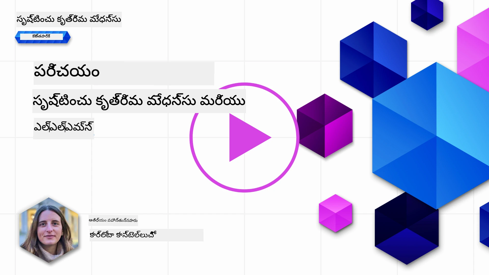
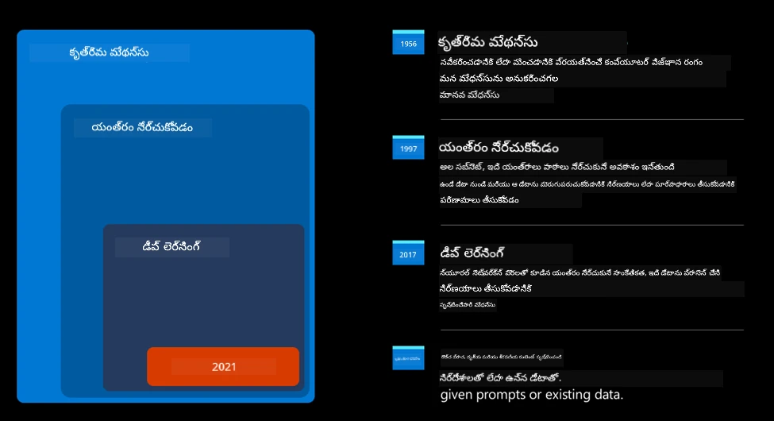
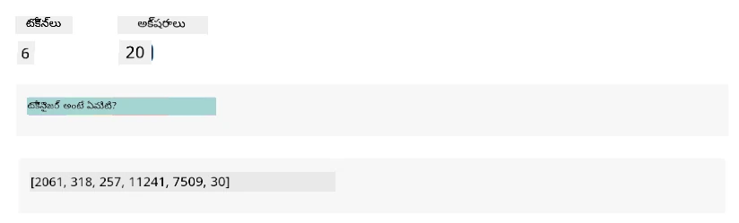
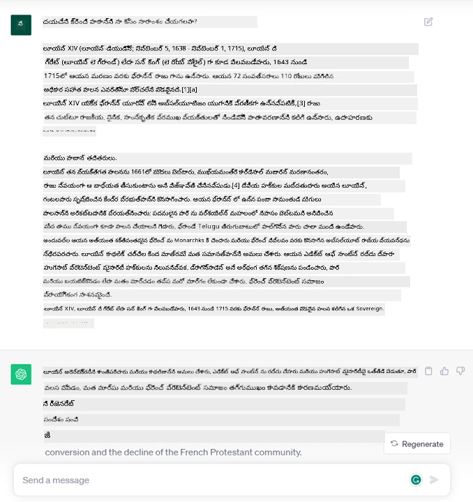
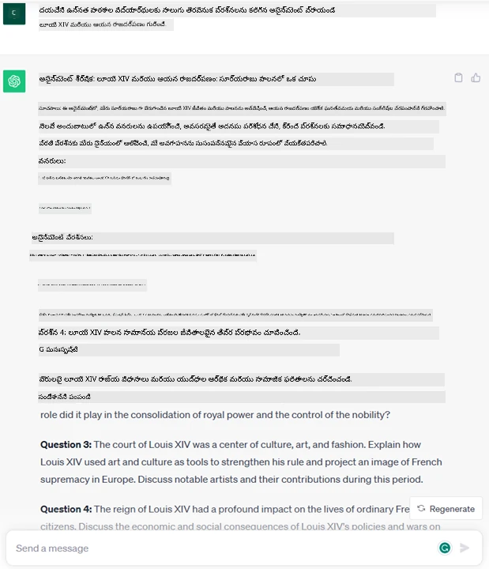
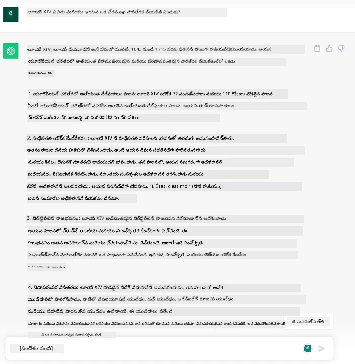
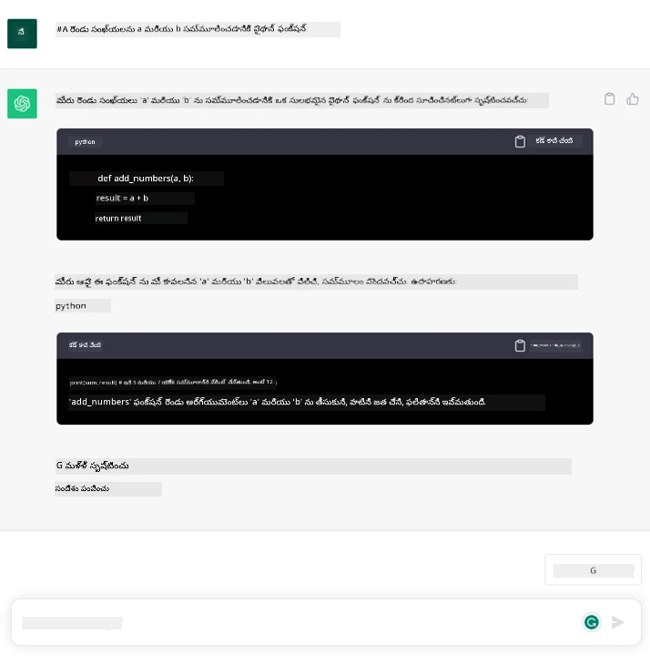

# జనరేటివ్ AI మరియు పెద్ద భాషా మోడల్స్ పరిచయం

_(ఈ పాఠం వీడియోను చూడడానికి పై చిత్రాన్ని క్లిక్ చేయండి)_

జనరేటివ్ AI అనేది టెక్స్ట్, చిత్రాలు మరియు ఇతర రకాల కంటెంట్‌ను సృష్టించగల కృత్రిమ మేధస్సు. దీన్ని అద్భుతమైన సాంకేతికతగా మార్చేది అది AIని ప్రజలందరికీ అందుబాటులో ఉంచడం, ఎవరికైనా సహజ భాషలో వ్రాసిన ఒక వాక్యం వంటి చిన్న టెక్స్ట్ ప్రాంప్ట్‌తో ఉపయోగించవచ్చు. మీరు Java లేదా SQL వంటి భాష నేర్చుకోవాల్సిన అవసరం లేదు, మీరు మీ భాషను ఉపయోగించి మీరు కావలసినదాన్ని చెప్పండి, AI మోడల్ నుండి ఒక సూచన వస్తుంది. దీని అప్లికేషన్లు మరియు ప్రభావం చాలా పెద్దది, మీరు నివేదికలు వ్రాయవచ్చు లేదా అర్థం చేసుకోవచ్చు, అప్లికేషన్లు వ్రాయవచ్చు మరియు మరిన్ని, అన్నీ క్షణాల్లో.

ఈ పాఠ్యాంశంలో, మన స్టార్టప్ జనరేటివ్ AIని విద్యా ప్రపంచంలో కొత్త సందర్భాలను అన్వేషించడానికి ఎలా ఉపయోగిస్తున్నదో మరియు దాని అప్లికేషన్ సామాజిక ప్రభావాలు మరియు సాంకేతిక పరిమితుల అనివార్య సవాళ్లను ఎలా ఎదుర్కొంటున్నదో పరిశీలిస్తాము.

## పరిచయం

ఈ పాఠం కిందివి కవర్ చేస్తుంది:

- వ్యాపార సందర్భానికి పరిచయం: మన స్టార్టప్ ఆలోచన మరియు లక్ష్యం.
- జనరేటివ్ AI మరియు ప్రస్తుత సాంకేతిక పరిసరంపై మన ప్రయాణం.
- పెద్ద భాషా మోడల్ లో అంతర్గత పని విధానం.
- పెద్ద భాషా మోడల్స్ యొక్క ప్రధాన సామర్థ్యాలు మరియు ప్రాక్టికల్ ఉపయోగాలు.

## నేర్చుకునే లక్ష్యాలు

ఈ పాఠం పూర్తి చేసిన తర్వాత, మీరు అర్థం చేసుకుంటారు:

- జనరేటివ్ AI అంటే ఏమిటి మరియు పెద్ద భాషా మోడల్స్ ఎలా పనిచేస్తాయి.
- వివిధ ఉపయోగాల కోసం పెద్ద భాషా మోడల్స్‌ను ఎలా ఉపయోగించవచ్చో, ముఖ్యంగా విద్యా సందర్భాలలో.

## సందర్భం: మన విద్యా స్టార్టప్

జనరేటివ్ కృత్రిమ మేధస్సు (AI) అనేది AI సాంకేతికతలో శిఖరం, ఒకప్పుడు అసాధ్యమని భావించిన వాటి సరిహద్దులను దాటుతోంది. జనరేటివ్ AI మోడల్స్‌కు అనేక సామర్థ్యాలు మరియు అప్లికేషన్లు ఉన్నాయి, కానీ ఈ పాఠ్యాంశంలో మనం ఒక కల్పిత స్టార్టప్ ద్వారా ఇది విద్యను ఎలా విప్లవాత్మకంగా మార్చుతోంది అనేదాన్ని పరిశీలిస్తాము. ఈ స్టార్టప్‌ను మనం _మన స్టార్టప్_ అని పిలుస్తాము. మన స్టార్టప్ విద్యా రంగంలో పనిచేస్తూ, ఈ మహత్తర లక్ష్యంతో ఉంది:

> _గ్లోబల్ స్థాయిలో నేర్చుకునే అవకాశాలను మెరుగుపరచడం, విద్యకు సమానమైన ప్రాప్తిని నిర్ధారించడం మరియు ప్రతి విద్యార్థి అవసరాలకు అనుగుణంగా వ్యక్తిగతీకరించిన నేర్చుకునే అనుభవాలను అందించడం_.

మన స్టార్టప్ బృందం తెలుసుకుంది, ఈ లక్ష్యాన్ని సాధించడానికి ఆధునిక కాలంలో అత్యంత శక్తివంతమైన సాధనాలలో ఒకటైన పెద్ద భాషా మోడల్స్ (LLMs) ఉపయోగించకపోతే సాధ్యం కాదని.

జనరేటివ్ AI ఈ రోజున మనం నేర్చుకునే మరియు బోధించే విధానాన్ని విప్లవాత్మకంగా మార్చనుంది, విద్యార్థులకు 24 గంటలు వర్చువల్ టీచర్లు అందుబాటులో ఉంటారు, వారు విస్తృత సమాచారం మరియు ఉదాహరణలు అందిస్తారు, మరియు ఉపాధ్యాయులు తమ విద్యార్థులను అంచనా వేసేందుకు మరియు అభిప్రాయం ఇవ్వడానికి నూతన సాధనాలను ఉపయోగించగలుగుతారు.

ప్రారంభించడానికి, మనం ఈ పాఠ్యాంశం మొత్తం ఉపయోగించే కొన్ని ప్రాథమిక భావనలు మరియు పదజాలాన్ని నిర్వచిద్దాం.

## జనరేటివ్ AI ఎలా వచ్చింది?

ఇటీవల జనరేటివ్ AI మోడల్స్ ప్రకటించబడినప్పుడు సృష్టించబడిన అసాధారణ _హైప్_ ఉన్నప్పటికీ, ఈ సాంకేతికత దశాబ్దాలుగా అభివృద్ధి చెందుతోంది, మొదటి పరిశోధనా ప్రయత్నాలు 60ల దశకంలోనే మొదలయ్యాయి. మనం ఇప్పుడు AIకి మానవ జ్ఞాన సామర్థ్యాలు ఉన్న స్థాయిలో ఉన్నాము, ఉదాహరణకు [OpenAI ChatGPT](https://openai.com/chatgpt) లేదా [Bing Chat](https://www.microsoft.com/edge/features/bing-chat?WT.mc_id=academic-105485-koreyst) వంటి సంభాషణలతో, ఇవి కూడా Bing వెబ్ సెర్చ్ సంభాషణలకు GPT మోడల్ ఉపయోగిస్తాయి.

కొంచెం వెనక్కి వెళ్ళితే, AI యొక్క మొదటి ప్రోటోటైప్లు టైప్ రాసిన చాట్‌బాట్లుగా ఉండేవి, నిపుణుల సమూహం నుండి తీసుకున్న జ్ఞానాన్ని కంప్యూటర్‌లో ప్రాతినిధ్యం వహించేవి. జ్ఞానంలో ఉన్న సమాధానాలు ఇన్‌పుట్ టెక్స్ట్‌లో కనిపించే కీలకపదాల ద్వారా ట్రిగ్గర్ అయ్యేవి.
కానీ, టైప్ రాసిన చాట్‌బాట్లను ఉపయోగించడం పెద్ద స్థాయిలో పనిచేయదని త్వరగా స్పష్టమైంది.

### AIకి గణాంకాత్మక దృష్టికోణం: మెషీన్ లెర్నింగ్

90లలో ఒక మలుపు వచ్చింది, టెక్స్ట్ విశ్లేషణకు గణాంకాత్మక దృష్టికోణం వర్తింపజేసినప్పుడు. దీని వల్ల మెషీన్ లెర్నింగ్ అనే కొత్త అల్గోరిథమ్స్ అభివృద్ధి అయ్యాయి, ఇవి స్పష్టంగా ప్రోగ్రామ్ చేయకుండా డేటా నుండి నమూనాలను నేర్చుకోవచ్చు. ఈ దృష్టికోణం యంత్రాలు మానవ భాషా అర్థం చేసుకోవడాన్ని అనుకరించడానికి అనుమతిస్తుంది: ఒక గణాంక మోడల్ టెక్స్ట్-లేబుల్ జంటలపై శిక్షణ పొందుతుంది, ఇది తెలియని ఇన్‌పుట్ టెక్స్ట్‌ను ముందుగా నిర్వచించిన లేబుల్‌తో వర్గీకరించగలుగుతుంది, ఇది సందేశ ఉద్దేశాన్ని సూచిస్తుంది.

### న్యూరల్ నెట్‌వర్క్స్ మరియు ఆధునిక వర్చువల్ అసిస్టెంట్లు

ఇటివరకు, పెద్ద డేటా మరియు క్లిష్టమైన గణనలను నిర్వహించగల హార్డ్‌వేర్ సాంకేతిక పరిణామం AI పరిశోధనను ప్రేరేపించింది, దీని ఫలితంగా న్యూరల్ నెట్‌వర్క్స్ లేదా డీప్ లెర్నింగ్ అల్గోరిథమ్స్ అభివృద్ధి చెందాయి.

న్యూరల్ నెట్‌వర్క్స్ (ప్రత్యేకంగా రికరెంట్ న్యూరల్ నెట్‌వర్క్స్ – RNNs) సహజ భాషా ప్రాసెసింగ్‌ను గణనీయంగా మెరుగుపరచాయి, వాక్యంలో పదం యొక్క సందర్భాన్ని విలువైనదిగా భావిస్తూ టెక్స్ట్ అర్థాన్ని మరింత అర్థవంతంగా ప్రాతినిధ్యం వహించగలిగాయి.

ఈ సాంకేతికత కొత్త శతాబ్దం మొదటి దశాబ్దంలో జన్మించిన వర్చువల్ అసిస్టెంట్లకు శక్తిని అందించింది, ఇవి మానవ భాషను అర్థం చేసుకోవడంలో, అవసరాన్ని గుర్తించడంలో, దాన్ని తీర్చేందుకు చర్య తీసుకోవడంలో చాలా నైపుణ్యం కలిగి ఉన్నాయి – ఉదాహరణకు ముందుగా నిర్వచించిన స్క్రిప్ట్‌తో సమాధానం ఇవ్వడం లేదా మూడవ పక్ష సేవను ఉపయోగించడం.

### ప్రస్తుత కాలం, జనరేటివ్ AI

ఇలా మనం ఈ రోజున ఉన్న జనరేటివ్ AIకి వచ్చాము, ఇది డీప్ లెర్నింగ్ యొక్క ఉపసమూహంగా చూడవచ్చు.

AI రంగంలో దశాబ్దాల పరిశోధన తర్వాత, ఒక కొత్త మోడల్ నిర్మాణం – _ట్రాన్స్‌ఫార్మర్_ అని పిలవబడే – RNNల పరిమితులను అధిగమించింది, ఇది చాలా పొడవైన టెక్స్ట్ సీక్వెన్స్‌లను ఇన్‌పుట్‌గా తీసుకోవచ్చు. ట్రాన్స్‌ఫార్మర్లు అటెన్షన్ మెకానిజం ఆధారంగా ఉంటాయి, ఇది మోడల్ అందుకున్న ఇన్‌పుట్‌లకు వేర్వేరు బరువులు ఇవ్వగలుగుతుంది, టెక్స్ట్ సీక్వెన్స్‌లో వారి క్రమం ఎంత ఉన్నా సంబంధిత సమాచారం ఎక్కువగా ఉన్న చోట ‘మరింత దృష్టి’ పెట్టడం.

ఇటివరకు వచ్చిన జనరేటివ్ AI మోడల్స్ – పెద్ద భాషా మోడల్స్ (LLMs) అని కూడా పిలవబడతాయి, ఎందుకంటే అవి టెక్స్టువల్ ఇన్‌పుట్‌లు మరియు అవుట్‌పుట్‌లతో పనిచేస్తాయి – నిజంగా ఈ నిర్మాణంపై ఆధారపడి ఉంటాయి. ఈ మోడల్స్ – పుస్తకాలు, వ్యాసాలు మరియు వెబ్‌సైట్ల వంటి విభిన్న మూలాల నుండి పెద్ద మొత్తంలో లేబుల్ లేని డేటా మీద శిక్షణ పొందినవి – విభిన్న పనుల కోసం అనుకూలీకరించబడవచ్చు మరియు సృజనాత్మకతతో కూడిన వ్యాకరణపరమైన సరైన టెక్స్ట్‌ను ఉత్పత్తి చేయగలవు. కాబట్టి, అవి యంత్రానికి ఇన్‌పుట్ టెక్స్ట్‌ను ‘అర్థం చేసుకోవడంలో’ సామర్థ్యాన్ని గణనీయంగా పెంచినప్పటికీ, మానవ భాషలో ఒరిజినల్ స్పందనను సృష్టించగల సామర్థ్యాన్ని కూడా అందించాయి.

## పెద్ద భాషా మోడల్స్ ఎలా పనిచేస్తాయి?

తదుపరి అధ్యాయంలో మనం వివిధ రకాల జనరేటివ్ AI మోడల్స్‌ను పరిశీలించబోతున్నాము, కానీ ఇప్పటివరకు పెద్ద భాషా మోడల్స్ ఎలా పనిచేస్తాయో, ముఖ్యంగా OpenAI GPT (Generative Pre-trained Transformer) మోడల్స్‌పై దృష్టి పెట్టుకుందాం.

- **టోకనైజర్, టెక్స్ట్ నుండి సంఖ్యలు**: పెద్ద భాషా మోడల్స్ టెక్స్ట్‌ను ఇన్‌పుట్‌గా తీసుకుని టెక్స్ట్‌ను అవుట్‌పుట్‌గా ఉత్పత్తి చేస్తాయి. అయితే, గణాంక మోడల్స్ కావడంతో, అవి టెక్స్ట్ కంటే సంఖ్యలతో బాగా పనిచేస్తాయి. అందుకే ప్రతి ఇన్‌పుట్ మోడల్‌కు టోకనైజర్ ద్వారా ప్రాసెస్ చేయబడుతుంది. టోకెన్ అనేది టెక్స్ట్ యొక్క ఒక భాగం – ఇది వేరువేరు అక్షరాల సంఖ్య కలిగి ఉండవచ్చు, కాబట్టి టోకనైజర్ యొక్క ప్రధాన పని ఇన్‌పుట్‌ను టోకెన్ల శ్రేణిగా విభజించడం. ఆ తర్వాత, ప్రతి టోకెన్‌ను టోకెన్ సూచికతో మ్యాప్ చేస్తారు, ఇది అసలు టెక్స్ట్ భాగం యొక్క పూర్తి సంఖ్యా కోడింగ్.

- **అవుట్‌పుట్ టోకెన్లను అంచనా వేయడం**: n టోకెన్లను ఇన్‌పుట్‌గా ఇచ్చినప్పుడు (గరిష్ట n ఒక మోడల్ నుండి మరొక మోడల్ వరకు మారవచ్చు), మోడల్ ఒక టోకెన్‌ను అవుట్‌పుట్‌గా అంచనా వేయగలదు. ఆ టోకెన్ తరువాతి పునరావృతంలో ఇన్‌పుట్‌లో చేర్చబడుతుంది, విస్తరించే విండో నమూనాలో, ఒక లేదా ఎక్కువ వాక్యాలను సమాధానంగా పొందడానికి మెరుగైన వినియోగదారు అనుభవాన్ని అందిస్తుంది. అందుకే, మీరు ChatGPTతో ఆడితే, అది కొన్నిసార్లు వాక్యం మధ్యలో ఆగిపోయినట్లు కనిపించవచ్చు.

- **ఎంపిక ప్రక్రియ, ప్రాబబిలిటీ పంపిణీ**: అవుట్‌పుట్ టోకెన్ ప్రస్తుత టెక్స్ట్ సీక్వెన్స్ తర్వాత వచ్చే అవకాశాన్ని ఆధారంగా మోడల్ ఎంచుకుంటుంది. ఇది మోడల్ శిక్షణ ఆధారంగా అన్ని సాధ్యమైన ‘తదుపరి టోకెన్ల’పై ప్రాబబిలిటీ పంపిణీని అంచనా వేస్తుంది. అయితే, ఎప్పుడూ అత్యధిక ప్రాబబిలిటీ కలిగిన టోకెన్ ఎంచుకోబడదు. ఈ ఎంపికలో కొంత రాండమ్నెస్ జోడించబడుతుంది, తద్వారా మోడల్ నిర్దిష్టంగా కాకుండా పనిచేస్తుంది - అదే ఇన్‌పుట్‌కు ఎప్పుడూ అదే అవుట్‌పుట్ రాదు. ఈ రాండమ్నెస్ సృజనాత్మక ఆలోచన ప్రక్రియను అనుకరించడానికి జోడించబడుతుంది మరియు దీన్ని టెంపరేచర్ అనే మోడల్ పారామీటర్ ద్వారా సర్దుబాటు చేయవచ్చు.

## మన స్టార్టప్ పెద్ద భాషా మోడల్స్‌ను ఎలా ఉపయోగించుకోవచ్చు?

ఇప్పుడు పెద్ద భాషా మోడల్ లో అంతర్గత పని విధానాన్ని బాగా అర్థం చేసుకున్నాము, మన వ్యాపార సందర్భానికి అనుగుణంగా అవి బాగా చేయగల సాధారణ పనుల కొన్ని ప్రాక్టికల్ ఉదాహరణలను చూద్దాం.
పెద్ద భాషా మోడల్ యొక్క ప్రధాన సామర్థ్యం _సహజ భాషలో వ్రాసిన టెక్స్టువల్ ఇన్‌పుట్ నుండి టెక్స్ట్‌ను మొదలుకొని సృష్టించడం_.

కానీ ఎలాంటి టెక్స్టువల్ ఇన్‌పుట్ మరియు అవుట్‌పుట్?
పెద్ద భాషా మోడల్ ఇన్‌పుట్‌ను ప్రాంప్ట్ అని పిలుస్తారు, అవుట్‌పుట్‌ను కంప్లీషన్ అని పిలుస్తారు, ఇది ప్రస్తుత ఇన్‌పుట్‌ను పూర్తి చేయడానికి తదుపరి టోకెన్‌ను సృష్టించే మోడల్ యంత్రాంగాన్ని సూచిస్తుంది. మనం ప్రాంప్ట్ అంటే ఏమిటి మరియు దాన్ని ఎలా డిజైన్ చేయాలో లోతుగా తెలుసుకోబోతున్నాము. కానీ ఇప్పటివరకు, ప్రాంప్ట్‌లో ఉండవచ్చు:

- మోడల్ నుండి ఆశించే అవుట్‌పుట్ రకాన్ని సూచించే **సూచన**. ఈ సూచనలో కొన్నిసార్లు కొన్ని ఉదాహరణలు లేదా అదనపు డేటా ఉండవచ్చు.

  1. వ్యాసం, పుస్తకం, ఉత్పత్తి సమీక్షల సారాంశం మరియు మరిన్ని, అలాగే అసంఘటిత డేటా నుండి అవగాహనలను తీసుకోవడం.
    
    
  
  2. వ్యాసం, ఎస్సే, అసైన్‌మెంట్ లేదా మరిన్ని సృజనాత్మక ఆలోచనలు మరియు రూపకల్పన.
      
     

- ఏజెంట్‌తో సంభాషణ రూపంలో అడిగే **ప్రశ్న**.
  
  

- పూర్తిచేయాల్సిన **టెక్స్ట్** భాగం, ఇది రాయడంలో సహాయం కోరడం.
  
  

- ఒక **కోడ్** భాగం, దాన్ని వివరించమని, డాక్యుమెంట్ చేయమని అడగడం, లేదా ఒక నిర్దిష్ట పని చేసే కోడ్‌ను సృష్టించమని వ్యాఖ్య.
  
  

పై ఉదాహరణలు చాలా సులభమైనవి మరియు పెద్ద భాషా మోడల్స్ సామర్థ్యాల సమగ్ర ప్రదర్శన కావు. అవి జనరేటివ్ AI ఉపయోగించే సామర్థ్యాన్ని చూపించడానికి, ముఖ్యంగా కానీ పరిమితం కాకుండా విద్యా సందర్భాలలో ఉపయోగించడానికి ఉద్దేశించబడ్డాయి.

అలాగే, జనరేటివ్ AI మోడల్ అవుట్‌పుట్ పరిపూర్ణం కాదు మరియు కొన్నిసార్లు మోడల్ సృజనాత్మకత దాని వ్యతిరేకంగా పనిచేయవచ్చు, ఫలితంగా మానవ వినియోగదారుడు వాస్తవాన్ని మాయాజాలంగా భావించే పదాల కలయికగా లేదా దుర్వినియోగంగా భావించే అవుట్‌పుట్ వస్తుంది. జనరేటివ్ AI తెలివైనది కాదు - కనీసం విస్తృత నిర్వచనంలో, క్రిటికల్ మరియు సృజనాత్మక తర్కం లేదా భావోద్వేగ మేధస్సు కలిగి లేదు; ఇది నిర్దిష్టంగా ఉండదు, మరియు నమ్మదగినది కాదు, ఎందుకంటే తప్పు సూచనలు, కంటెంట్ మరియు ప్రకటనలు సరైన సమాచారంతో కలిపి, నమ్మదగిన మరియు ఆత్మవిశ్వాసంతో ప్రదర్శించబడవచ్చు. తదుపరి పాఠ్యాంశాలలో, మనం ఈ పరిమితులను ఎలా ఎదుర్కోవాలో చూడబోతున్నాము.

## అసైన్‌మెంట్

మీ అసైన్‌మెంట్ [జనరేటివ్ AI](https://en.wikipedia.org/wiki/Generative_artificial_intelligence?WT.mc_id=academic-105485-koreyst) గురించి మరింత చదవడం మరియు ఇప్పటికీ జనరేటివ్ AI లేని ఏ ప్రాంతాన్ని మీరు జోడించగలరో గుర్తించడం. "పాత విధానం"తో చేయడం కంటే ప్రభావం ఎలా వేరుగా ఉంటుంది, మీరు ముందుగా చేయలేని దాన్ని చేయగలరా, లేదా మీరు వేగంగా చేయగలరా? మీ కల AI స్టార్టప్ ఎలా ఉంటుందో 300 పదాల సారాంశం రాయండి మరియు "సమస్య", "నేను AIని ఎలా ఉపయోగిస్తాను", "ప్రభావం" వంటి శీర్షికలను మరియు ఐచ్ఛికంగా వ్యాపార ప్రణాళికను చేర్చండి.

మీరు ఈ పని చేసినట్లయితే, మీరు Microsoft యొక్క ఇన్క్యుబేటర్, [Microsoft for Startups Founders Hub](https://www.microsoft.com/startups?WT.mc_id=academic-105485-koreyst)కి దరఖాస్తు చేసుకోవడానికి సిద్ధంగా ఉండవచ్చు. మేము Azure, OpenAI, మెంటరింగ్ మరియు మరిన్ని కోసం క్రెడిట్లు అందిస్తున్నాము, చూడండి!

## జ్ఞాన పరీక్ష

పెద్ద భాషా మోడల్స్ గురించి ఏమి నిజం?

1. మీరు ప్రతి సారి అదే సమాధానం పొందుతారు.
1. ఇది పనులు పరిపూర్ణంగా చేస్తుంది, సంఖ్యలు జోడించడంలో, పని చేసే కోడ్ ఉత్పత్తి చేయడంలో గొప్పది.
1. అదే ప్రాంప్ట్ ఉపయోగించినప్పటికీ సమాధానం మారవచ్చు. ఇది టెక్స్ట్ లేదా కోడ్ ఏదైనా మొదటి డ్రాఫ్ట్ ఇవ్వడంలో గొప్పది. కానీ మీరు ఫలితాలను మెరుగుపరచాలి.

సమాధానం: 3, LLM నిర్దిష్టంగా ఉండదు, సమాధానం మారుతుంది, అయితే మీరు టెంపరేచర్ సెట్టింగ్ ద్వారా దాని మార్పును నియంత్రించవచ్చు. ఇది పనులు పరిపూర్ణంగా చేయాలని ఆశించకూడదు, ఇది మీకు మంచి మొదటి ప్రయత్నం ఇస్తుంది, దాన్ని మీరు క్రమంగా మెరుగుపరచాలి.

## అద్భుతమైన పని! ప్రయాణం కొనసాగించండి

ఈ పాఠం పూర్తి చేసిన తర్వాత, మన [జనరేటివ్ AI నేర్చుకునే సేకరణ](https://aka.ms/genai-collection?WT.mc_id=academic-105485-koreyst)ను చూడండి మరియు మీ జనరేటివ్ AI జ్ఞానాన్ని మరింత పెంచుకోండి!
Lesson 2 కి వెళ్లండి అక్కడ మనం [వివిధ LLM రకాలని అన్వేషించి, పోల్చడం](../02-exploring-and-comparing-different-llms/README.md?WT.mc_id=academic-105485-koreyst) ఎలా చేయాలో చూడబోతున్నాం!

---

<!-- CO-OP TRANSLATOR DISCLAIMER START -->
**అస్పష్టత**:  
ఈ పత్రాన్ని AI అనువాద సేవ [Co-op Translator](https://github.com/Azure/co-op-translator) ఉపయోగించి అనువదించబడింది. మేము ఖచ్చితత్వానికి ప్రయత్నించినప్పటికీ, ఆటోమేటెడ్ అనువాదాల్లో పొరపాట్లు లేదా తప్పిదాలు ఉండవచ్చు. మూల పత్రం దాని స్వదేశీ భాషలోనే అధికారిక మూలంగా పరిగణించాలి. ముఖ్యమైన సమాచారానికి, ప్రొఫెషనల్ మానవ అనువాదం సిఫార్సు చేయబడుతుంది. ఈ అనువాదం వాడకంలో ఏర్పడిన ఏవైనా అపార్థాలు లేదా తప్పుదారుల కోసం మేము బాధ్యత వహించము.
<!-- CO-OP TRANSLATOR DISCLAIMER END -->