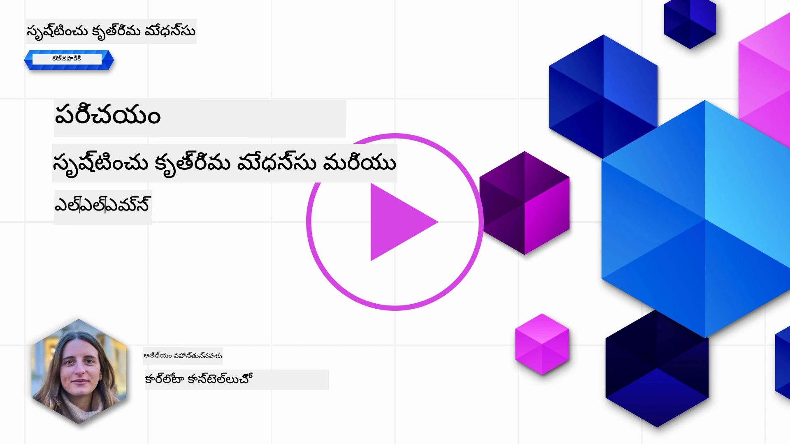
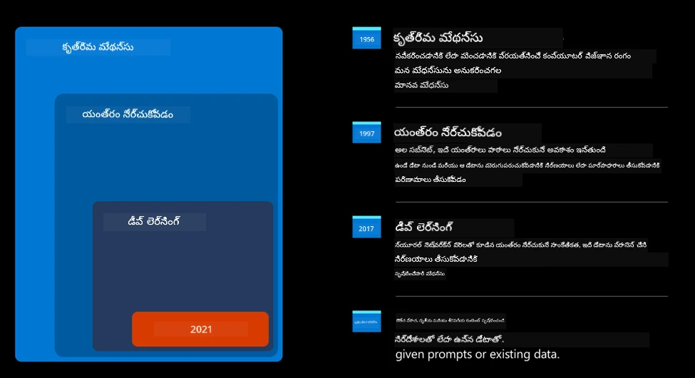
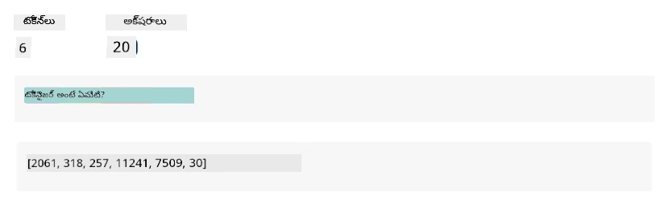
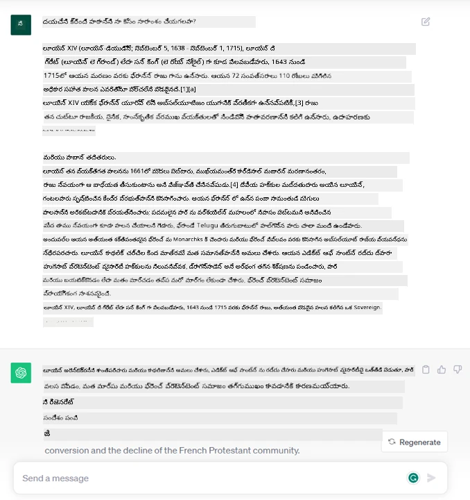
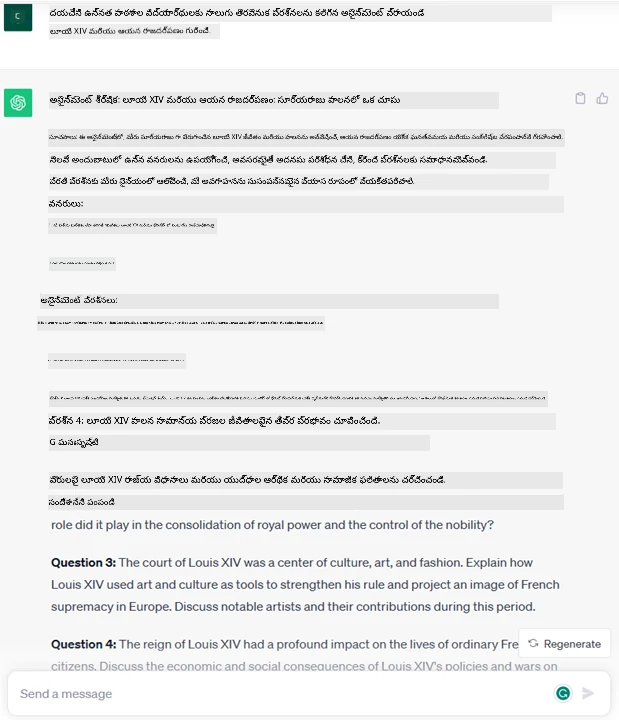
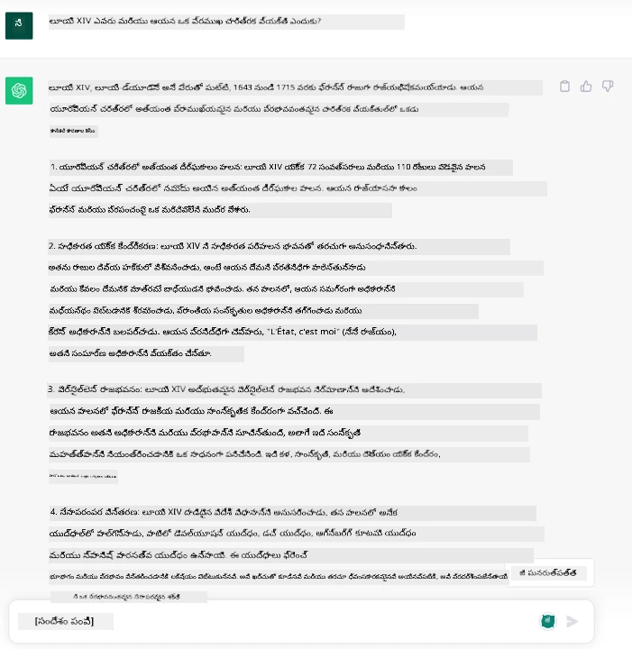
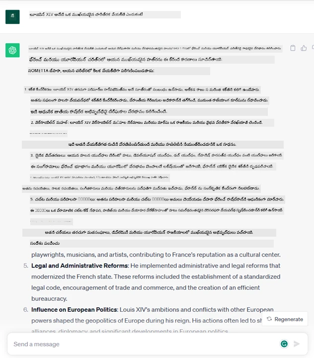
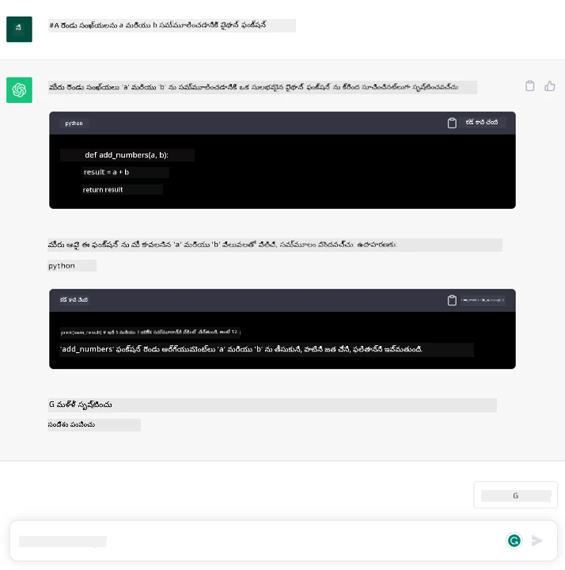

# జనరేటివ్ AI మరియు పెద్ద భాషా మోడల్స్‌కు పరిచయం

_(ఈ పాఠానికి సంబంధించిన వీడియోను చూడటానికి పై చిత్రాన్ని క్లిక్ చేయండి)_

జనరేటివ్ AI అనేది టেক্স్ట్, చిత్రాలు మరియు ఇతర రకాల కంటెంట్ ఉత్పత్తి చేయగల కృత్రిమ మేధస్సు. దీనిని అత్యద్భుతమైన సాంకేతికతగా మార్చుకుంటుంది ఎందుకంటే ఇది AI ని ప్రజలందరికీ అందుబాటులోకి తీసుకువస్తుంది, ఎవరికైనా సహజ భాషలో రాసిన పాఠ్య సూచనతో ఉపయోగించవచ్చు. మీకు Java లేదా SQL వంటి భాష నేర్చుకోవాల్సిన అవసరం లేదు, మీరు మీ భాషను ఉపయోగించి మీరు కావలసినదాన్ని చెప్పగలరు, మరియు AI మోడల్ నుండి సూచన వస్తుంది. దీని ఉపయోగాలు మరియు ప్రభావం విస్తృతంగా ఉన్నాయి, మీరు రిపోర్ట్లు రాయగలరు లేదా అర్థం చేసుకోవచ్చు, అనువర్తనాలు రాయచ్చు మరియు మరిన్ని, అన్నీ కేవలం కొన్ని సెకన్లలో.

ఈ విద్యా ప్రణాళికలో, మా స్టార్టప్ జనరేటివ్ AI ని విద్యా ప్రపంచంలో కొత్త పరిస్థితులను ఉత్తేజితం చేయడానికి ఎలా ఉపయోగించుకుంటుంది మరియు దాని అప్లికేషన్ యొక్క సామాజిక ప్రభావాలు మరియు సాంకేతిక పరిమితులనుండి వస్తే వాటిని ఎలా ఎదుర్కొంటున్నామో తెలుసుకోబోతున్నాము.

## పరిచయం

ఈ పాఠం కవర్ చేయబోయేది:

- వ్యాపార పరిస్థితికి పరిచయం: మా స్టార్టప్ ఆలోచన మరియు లక్ష్యం.
- జనరేటివ్ AI మరియు మనం ప్రస్తుతం ఉన్న సాంకేతిక పరిసరాలలో ఎలా చేరుకున్నామో.
- పెద్ద భాషా మోడల్ లోపలి పని విధానం.
- పెద్ద భాషా మోడల్స్ యొక్క ముఖ్య సామర్థ్యాలు మరియు ప్రాక్టికల్ ఉపయోగాల కేసులు.

## నేర్చుకోవాల్సిన లక్ష్యాలు

ఈ పాఠాన్ని పూర్తిచేసిన తర్వాత, మీరు అర్థం చేసుకోగలుగుతారు:

- జనరేటివ్ AI అంటే ఏమిటి మరియు పెద్ద భాషా మోడల్స్ ఎలా పనిచేస్తాయో.
- విద్యా పరిసరాలను దృష్టిలో పెట్టుకొని పెద్ద భాషా మోడల్స్‌ను వివిధ ఉపయోగాల కోసం ఎలా ఉపయోగించవచ్చో.

## పరిస్థితి: మా విద్యా స్టార్టప్

జనరేటివ్ కృత్రిమ మేధస్సు (AI) అనేది AI సాంకేతికతలో సర్వోన్నతం, అసాధ్యమైనదని అనుకున్న వాటిని కూడా దాటిపోయేలా చేస్తుంది. జనరేటివ్ AI మోడల్స్ కు అనేక సామర్థ్యాలు మరియు వినియోగాలు ఉన్నాయి, కానీ ఈ విద్యా ప్రణాళికలో అది విద్యను ఏ విధంగా మారుస్తుందో కల్పనాత్మక స్టార్టప్ ద్వారా తెలుసుకోబోతున్నాము. ఈ స్టార్టప్‌ను మేము _మా స్టార్టప్_ అని పిలుస్తాము. మా స్టార్టప్ విద్యా రంగంలో పనిచేస్తోంది మరియు ఆహంకారమైన లక్ష్య ప్రకటన ఉంది

> _జాగృత అమరవాణి స్థాయిలో నేర్చుకోవడంలో అందుబాటును మెరుగుపరిచే, సమాన విద్యాకే ప్రవేశనిర్వాహం చేస్తూ, ప్రతి అభ్యాసకుడికి వారి అవసరాలకు తగిన వ్యక్తిగతీకృత నేర్చుకునే అనుభవాలను అందించే విధంగా_.

మా స్టార్టప్ బృందం అర్ధం చేసుకుంది: మేము ఈ లక్ష్యాన్ని సాధించటానికి ఆధునిక కాలంలోని అత్యంత శక్తివంతమైన సాధనాలలో ఒకటి అయిన పెద్ద భాషా మోడల్స్ (LLMs) ను వినియోగించుకోవాల్సిందే.

జనరేటివ్ AI ఈ రోజు నేర్చుకునే మరియు బోధించే విధానాన్ని విప్లవాత్మకంగా మార్చబోతుంది, విద్యార్థులు 24 గంటలు యెడల వర్చువల్ టీచర్లు ద్వారా విస్తృత సమాచారంతో సహాయం పొందగలరు, మరియు ఉపాధ్యాయులు విద్యార్థులను అంచనా వేసేందుకు, ఫీడ్‌బ్యాక్ ఇవ్వటానికి ఆధునిక సాధనాలను వినియోగించగలరు.

ప్రారంభించడానికి, మనం పాఠ్య ప్రణాళికలో ఉపయోగించే కొన్ని ప్రాథమిక భావాలు మరియు పరిభాషలను నిర్వచిద్దాం.

## జనరేటివ్ AI కి మనకి ఎలా వచ్చింది?

ఇటీవల జనరేటివ్ AI మోడల్స్ ప్రకటన వల్ల సృష్టి అయిన అతిపెద్ద హైప్ ఉన్నప్పటికీ, ఈ సాంకేతికత దశాబ్దాలుగా అభివృద్ధిలో ఉంది, 60లలోనే మొదటి పరిశోధనా ప్రయత్నాలు మొదలయ్యాయి. ఇప్పుడు మనం AIకి మనుషుల మేథో సామర్థ్యాలు ఉన్నాయి, సంభాషణ వంటి, ఉదా. [OpenAI ChatGPT](https://openai.com/chatgpt) లేదా [Microsoft Copilot](https://copilot.microsoft.com/?WT.mc_id=academic-105485-koreyst) ద్వారా, ఇది GPT మోడల్‌ను పరోక్ష వెబ్ శోధన అనుభవానికి ఉపయోగిస్తుంది.

కొంత వెనక్కి వెళ్తే, AI యొక్క మొదటి ప్రోటోటైప్లు టైప్ చేయబడిన చాట్‌బాట్స్‌లా ఉండేవి, నిపుణుల నుండి సేకరించిన జ్ఞానాన్ని కంప్యూటర్‌లో ప్రాతినిథ్యం వహించేవి. జ్ఞానంలో సమాధానాలు ఇన్‌పుట్ టెక్స్‌ట్లో కనిపించే కీవర్డ్స్ ఆధారంగా తీరేవి.
అయితే, త్వరగా అర్థమైంది, ఈ విధానం - టైప్ చేయబడిన చాట్‌బాట్స్ వాడటం - పెద్దస్థాయిలో పనిచేయదు.

### AIకి గణాంక పద్ధతి: మెషిన్ లర్నింగ్

90లలో మలుపు వచ్చింది, పాఠ్య విశ్లేషణకు గణాంక పద్ధతిని వర్తించడం జరిగింది. దీని ద్వారా మెషిన్ లర్నింగ్ అనే కొత్త అల్గోరిథమ్లు అభివృద్ది అయ్యాయి, అవి స్పష్టంగా ప్రోగ్రామ్ చేయకుండానే డేటా నుండి నమూనాలను నేర్చుకోవడానికి సామర్థ్యంగా ఉన్నాయి. ఈ పద్ధతి యంత్రాలు మానవ భాషా అర్థం చేసుకోవడాన్ని అనుకరించదలచుకుంది: గణాంక మోడల్ టెక్స్‌ట్లో లేబుల్ జతలపై శిక్షణ పొందును, ఇది తెలియని ఇన్‌పుట్ టెక్స్‌ట్ను ముందుగా నిర్వచించిన ప్రయోజనాన్ని సూచించే లేబుల్‌తో వర్గీకరించగలదు.

### న్యూరల్ నెట్‌వర్క్స్ మరియు ఆధునిక వర్చువల్ అసిస్టెంట్లు

ఇటీవలి సంవత్సరాలలో, పెద్ద డేటా నిల్వలు మరియు సంక్లిష్ట గణనలను నిర్వహించగల సాంకేతిక పరిణామం AI పరిశోధనలను ప్రేరేపించింది, దీని ఫలితంగా న్యూరల్ నెట్‌వర్క్స్ లేదా డీప్ లర్నింగ్ అల్గోరిథమ్లుగా పిలవబడే మెషిన్ లర్నింగ్ అల్గోరిథమ్స్ అభివృద్ది చెందాయి.

న్యూరల్ నెట్‌వర్క్స్ (ప్రత్యేకంగా రికరెంటు న్యూరల్ నెట్‌వర్క్స్ – RNNs) సహజ భాషా ప్రాసెసింగ్‌ను గణనీయంగా మెరుగుపరిచాయి, వాక్యంలో పద ప్రయోగ పరిసరాల ప్రాముఖ్యత గుర్తించి అర్థాన్ని మరింత ప్రాముఖ్యతనిస్తాయి.

ఈ సాంకేతికత ఆధునిక శతాబ్దం మొదటి దశాబ్దంలో జన్మించిన వర్చువల్ అసిస్టెంట్లను సాధించిందీ, ఇవి మానవ భాషను అర్థం చేసుకోవడంలో, అవసరాన్ని గుర్తించేలోపల, దానిని తీర్చేందుకు చర్యలు తీసుకొనేలోపల నైపుణ్యం ప్రదర్శించాయి – ఉదా. ముందస్తుగా నిర్వచించిన స్క్రిప్ట్‌తో సమాధానాలు ఇవ్వడం లేదా 3వ పార్టీ సేవలను వినియోగించడం.

### ప్రస్తుతం, జనరేటివ్ AI

అందువల్ల మనం జనరేటివ్ AI కు వచ్చాము, ఇది డీప్ లర్నింగ్ యొక్క ఉపవర్గంగా చూడవచ్చు.

AI రంగంలో దశాబ్దాల పరిశోధన అనంతరం, కొత్త మోడల్ నిర్మాణం – _ట్రాన్స్‌ఫార్మర్_ అనే పేరు గలది – RNNs పరిమితులను అధిగమించి చాలా పెద్ద టెక్స్‍ट సీక్వెన్సులను ఇన్‌పుట్‌గా స్వీకరించగలదిగా మారింది. ట్రాన్స్‌ఫార్మర్లు అటెన్షన్ యంత్రాంగంపై ఆధారపడినవి, ఇది మోడల్‌కు ఇచ్చిన ఇన్‌పుట్‌లకు వేరువేరు బరువులివ్వడానికి సహాయపడుతుంది, ముఖ్యమైన సమాచారం ఉన్న చోట 'మరింత దృష్టి' పెట్టగలదు, టెక్స్‍ट సీక్వెన్స్‌లో క్రమాలన oxid గుర్తించకుండానే.

ఇటీవలి జనరేటివ్ AI మోడల్స్ – పెద్ద భాషా మోడల్స్ (LLMs) అని కూడా పిలవబడే, అవి టెక్స్టువల్ ఇన్‌పుట్ మరియు ఔట్పుట్‌లతో పనిచేస్తాయివి – ఈ నిర్మాణంపై ఆధారపడి ఉంటాయి. ఇవి విపులంగా లేబుల్ కాని డేటాను చేయబడిన శిక్షణతో బహుళ మూలాల నుండి, పుస్తకాలు, వ్యాసాలు మరియు వెబ్‌సైట్ల నుండి సేకరించిన డేటాను ఉపయోగించి శిక్షణ పొందే మోడల్స్. అసలు వాటి ప్రత్యేకత ఏమిటంటే ఇవి విస్తృత పనుల కోసం అనుకూలీకరించబడుతూ, సృజనాత్మక భావం సహా వ్యాకరణపరమైన సరిహద్దులతో టెక్స్ట్ ఉత్పత్తి చేయగలవు. కాబట్టి, మోడల్స్ ఒక ఇన్‌పుట్ టెక్స్ట్‌ను 'అర్థం చేసుకునే' సామర్థ్యాన్ని కోలగడం మాత్రమే కాక మానవ భాషలో అసలు ప్రతిస్పందనను ఉత్పత్తి చేయగలిగాయి.

## పెద్ద భాషా మోడల్స్ ఎలా పనిచేస్తాయి?

తదుపరి అధ్యాయంలో మనం విభిన్న రకాల జనరేటివ్ AI మోడల్స్‌ను చూస్తాము, కానీ ప్రస్తుతం మనం పెద్ద భాషా మోడల్స్ ఎలా పనిచేస్తాయో, ముఖ్యంగా OpenAI GPT (Generative Pre-trained Transformer) మోడల్స్‌పై దృష్టి పెట్టుదాం.

- **టోకనైజర్, టెక్స్ట్ నుండి సంఖ్యలకు**: పెద్ద భాషా మోడల్స్ టెక్స్ట్‌ను ఇన్‌పుట్‌గా తీసుకొని టెక్స్ట్‌ను ఔట్పుట్‌గా ఉత్పత్తి చేస్తాయి. కానీ గణాంకాత్మక మోడల్స్ కావగా, అవి టెక్స్ట్ సీక్వెన్స్ కంటే సంఖ్యలపై బాగా పనిచేస్తాయి. అందువలన ప్రతి ఇన్‌పుట్‌ను మోడల్ వినోదానికి ముందు టోకనైజర్ ద్వారా ప్రాసెస్ చేయబడుతుంది. ఒక టోకెన్ అనే అనేది ఒక టెక్స్ట్ భాగం – ఇది ఒక వేరియబుల్ సంఖ్య అక్షరాలతో కూడి ఉంటుంది, కాబట్టి టోకనైజర్ యొక్క ప్రధాన పని ఇన్‌పుట్‌ను టోకెన్ల శ్రేణిగా విడగొట్టడం. ఆ తరువాత, ప్రతి టోకెన్ ఒక టోకెన్ ఇండెక్స్‌తో మ్యాప్ చేయబడుతుంది, ఇది అసలు టెక్స్‍ट భాగానికి సంఖ్యా సంకేతీకరణ.

- **ఔట్పుట్ టోకెన్లను ఊహించడం**: n టోకెన్లను ఇన్‌పుట్‌గా తీసుకొని (గరిష్ట n ఒక మోడల్ నుండి మరో మోడల్ వరకు మారుతుంది), మోడల్ ఒకటినొక్క టోకెన్‌ను ఔట్పుట్‌గా ఊహించగలదు. ఈ టోకెన్ తరువాత వచ్చే పైరి ఇన్‌పుట్‌లో చేర్చబడుతుంది, విస్తరించే విండోకి సరిపడే విధంగా, ఇది ఒక లేదా అనేక వాక్యాలను సమాధానంగా పొందటానికి మెరుగైన వినియోగదార అనుభవాన్ని అందిస్తుంది. కాబట్టి, మీరు ఎప్పుడైనా ChatGPT తో ఆడితే, కొన్ని సార్లు అది వాక్య మధ్యలో ఆగిపోతుంది అనిపించవచ్చు.

- **ఎంపిక ప్రక్రియా, అవకాశం పంపిణీ**: ఔట్పుట్ టోకెన్ ప్రస్తుత టెక్స్‍ट సీక్వెన్స్ తర్వాత సంభవించే అవకాశం ఆధారంగా మోడల్ దీనిని ఎంచుకుంటుంది. ఇది మోడల్ శిక్షణ ఆధారంగా 'తర్వాతి టోకెన్లు' పై అవకాశ పంపిణీని ఊహిస్తుంది. అయినప్పటికీ, ఎప్పుడూ అత్యధిక అవకాశంతో టోకెన్ ఎంచుకోబడదు. రాండమ్నెస్ ఉపయంభిస్తారు, ఇది మోడల్ నాన్-డిటర్మినిస్టిక్ విధంగా పనిచేస్తుంది – అదే ఇన్‌పుట్‌కు ప్రతిసారీ అదే ఔట్పుట్ రాదు. ఈ రాండమ్నెస్ సృజనాత్మక ఆలోచన ప్రక్రియను అనుకరించడానికి ఉపయోగిస్తారు, దీనిని 'తాపకము' అనే మోడల్ పారామీటర్ ద్వారా నియంత్రించవచ్చు.

## మా స్టార్టప్ పెద్ద భాషా మోడల్స్‌ను ఎలా ఉపయోగించగలదు?

పెద్ద భాషా మోడల్ లోపలి పని విధానాన్ని మెరుగ్గా అర్థం చేసుకున్న తర్వాత, అవి చాలా బాగా చేయగల ప్రధాన పనుల కొన్ని ప్రాక్టికల్ ఉదాహరణలు చూద్దాం, మా వ్యాపార పరిస్థితిని దృష్టిలో పెట్టుకుని.
మేము చెప్పాము పెద్ద భాషా మోడల్ యొక్క ప్రధాన సామర్థ్యం _సహజ భాషలో రాసిన పాఠ్య ఇన్‌పుట్ నుండి మొదలుకొని పూర్తి వాక్యాన్ని సృష్టించడం_.

కానీ ఏ రకమైన పాఠ్య ఇన్‌పుట్ మరియు ఔట్పుట్?
పెద్ద భాషా మోడల్ ఇన్‌పుట్‌ను ప్రాంప్ట్‌గా పిలుస్తారు, ఔట్పుట్‌ను కంప్లీషన్ (completion) అని అంటారు, ఇది ప్రస్తుత ఇన్‌పుట్‌ను పూర్తి చేయడానికి తరువాతి టోకెన్ ఉత్పత్తి చేసే మోడల్ యంత్రాంగంకి సూచిస్తుంది. ప్రాంప్ట్ అంటే ఏమిటి, ఎలా డిజైన్ చేయాలి అని దీని వాడకాన్ని పూర్తి వివరంగా తెలుసుకుంటాము. ప్రస్తుతం అది ఈ విధంగా ఉంటుందేమో చెప్పగలము:

- మోడల్ నుంచి ఎలాంటి ఔట్పుట్ ఆశించాలో తెలియజేసే **సూచన**. ఈ సూచన కొన్ని సందర్భాలలో కొంతమంది ఉదాహరణలు లేదా అదనపు డేటాను కూడా కలిగి ఉంటుంది.

  1. ఒక వ్యాసం, పుస్తకం, ఉత్పత్తి సమీక్షల సరాంశం తయారు చేయడం, అలాగే అసన్చితం డేటా నుండి అర్థాలు తీయడం.
    
    
  
  2. ఒక వ్యాసం, నిబంధనం, అసైన్‌మెంట్ లేదా మరిన్ని క్రియేటివ్ ఆలోచనలు మరియు డిజైన్ చేయడం.
      
     

- ఏజెంట్‌తో సంభాషణ రూపంలో అడిగే **ప్రశ్న**.
  
  

- సహాయక రచనా కార్యాన్ని సూచించే **టెక్స్ట్ పూర్తి చేయడం** అనే భాగం.
  
  

- ఒక పనిని నిర్వహించే కోడ్‌ను ఉత్పత్తి చేయమని అడిగే వ్యాఖ్య లేదా కోడ్ వివరణ, డాక్యుమెంటేషన్ కోరడం.
  
  

పై ఉదాహరణలు చాలా సరళమైనవి, పెద్ద భాషా మోడల్స్ సామర్థ్యాల పూర్తి ప్రదర్శన కావు. అవి జనరేటివ్ AI వినియోగశక్తిని చూపేందుకు గాను, ముఖ్యంగా కానీ విద్యా సాందర్భాల పరిమితి కాదు.

ఇంకా, జనరేటివ్ AI మోడల్ ఔట్పుట్ సంపూర్ణంగా సరిగా ఉండదు, కొన్ని సందర్భాలలో మోడల్ సృజనాత్మకత దాని ప్రత్యక్ష ఫలితానికి వ్యతిరేకం గా పని చేస్తూ, నిజమైనట్టు కనిపించని మాటల మిశ్రమాన్ని ఇవ్వొచ్చు లేదా అవగాహనకు హానికరమైనది కావొచ్చు. జనరేటివ్ AI మేధస్సు గలది కాదు - కనీసం విమర్శాత్మక, సృజనాత్మక తర్కం లేదా భావోద్వేగ మేధస్సు వంటి విస్తృత నిర్వచనంలో కాదు; అది నిర్ణీత రీతిలో పనిచేయదు, మరియు విశ్వసనీయంగానాదు, ఎందుకంటే తప్పు సూచనలు, కంటెంట్ మరియు ప్రకటనలను సరైన సమాచారంతో కలిపి, నమ్మకమైన, ధైర్యవంతమైన సుగుణంతో ప్రదర్శించవచ్చు. తదుపరి పాఠాలలో, ఈ పరిమితులను ఎలా ఎదుర్కోవాలనే దానిపై పనిచేస్తాము.

## బాధ్యత

మీరు [జనరేటివ్ AI](https://en.wikipedia.org/wiki/Generative_artificial_intelligence?WT.mc_id=academic-105485-koreyst) గురించి మరింత చదవండి మరియు మీరు ఇప్పటికి లేని ప్రాంతంలో జనరేటివ్ AI ను చేరుస్తే ఎలా ఉండేదో అంచనా వేయండి. "పాత విధానంతో" పోల్చితే ప్రభావం ఎలా వేరుగా ఉంటుంది?, ఏదైనా మీరు ముందే చేయలేని పనిని చేయగలరా?, లేదా మీరు వేగంగా చేయగలరా? మీ కల AI స్టార్టప్ ఎలా ఉంటుందో 300 పదాల్లో సారాంశం రాయండి, "సమస్య", "నేను AIని ఎలా ఉపయోగిస్తాను", "ప్రభావం" వంటి హెడ్డర్‌లు పెట్టండి మరియు ఐచ్ఛికంగా ఒక వ్యాపార ప్రణాళికను చేర్చండి.

మీరు ఈ పని పూర్తిచేయగలిగితే, మైక్రోసాఫ్ట్ యొక్క ఇన్క్యూబేటర్, [Microsoft for Startups Founders Hub](https://www.microsoft.com/startups?WT.mc_id=academic-105485-koreyst) కి దరఖాస్తు చేయడానికి కూడా సిద్ధంగా ఉండొచ్చు. మేము Azure, OpenAI, మార్గనిర్దేశకత్వం మరియు మరిన్నింటికి క్రెడిట్లు అందిస్తున్నాము, చూసుకోండి!

## జ్ఞాన పరీక్ష

పెద్ద భాషా మోడల్స్ గురించి ఏమి నిజం?

1. ప్రతిసారి మీరు పూర్తి అదే స్పందన పొందుతారు.
1. ఇది పనులు సక్రమంగా చేస్తుంది, సంఖ్యలను చక్కగా జత చేస్తుంది, పని చేసే కోడ్ ఉత్పత్తి చేస్తుంది.
1. అదే ప్రాంప్ట్ ఉపయోగించినా ప్రతిస్పందన మారవచ్చు. ఇది టెక్స్ట్ లేదా కోడ్ మొదలైన వాటి మొదటి రూపం రూపొందించడంలో గొప్పది. కానీ ఫలితాలను మెరుగుపరచాల్సి ఉంటుంది.

A: 3, LLM అనేది నాన్-డిటర్మినిస్టిక్, ప్రతిస్పందన మారుతుంది, అయితే మీరు దీని విభిన్నతను టాపర్ల మీద నియంత్రించవచ్చు. ఇది అన్ని పనులు సరిగ్గా చేస్తుంది అనడం సరైనది కాదు, ఇది మీకు మంచి మొదటి ప్రయత్నాన్ని ఇస్తుంది, దీన్ని మీరు క్రమంగా మెరుగుపరచుకోవాలి.

## అద్భుతం! ప్రయాణాన్ని కొనసాగించండి

ఈ పాఠం పూర్తిచేసిన తర్వాత, మా [జనరేటివ్ AI నేర్చుకునే సేకరణ](https://aka.ms/genai-collection?WT.mc_id=academic-105485-koreyst) చూసి మీ జనరేటివ్ AI జ్ఞానాన్ని మరింత పెంచుకోండి!

వేరువేరు LLM రకాలని [అన్వేషించడం మరియు పోల్చడం](../02-exploring-and-comparing-different-llms/README.md?WT.mc_id=academic-105485-koreyst) ఎలా చేయాలో చూసేందుకు పాఠం 2 కి వెళ్లండి!

---

<!-- CO-OP TRANSLATOR DISCLAIMER START -->
**అస్వీకరణ**:
ఈ పత్రం AI అనువాద సేవ [Co-op Translator](https://github.com/Azure/co-op-translator) ఉపయోగించి అనువదించబడింది. మేము ఖచ్చితత్వానికి ప్రయత్నిస్తున్నప్పటికీ, ఆటోమేటెడ్ అనువాదాలు తప్పులు లేదా అసమగ్రతలను కలిగి ఉండవచ్చు. దాని స్వదేశ భాషలో ఉన్న అసలు పత్రాన్ని అధికారం కలిగిన మూలంగా పరిగణించాలి. కీలకమైన సమాచారం కోసం, ప్రొఫెషనల్ మానవ అనువాదాన్ని సిఫారసు చేస్తాము. ఈ అనువాదం ఉపయోగం వల్ల కలిగే ఏవైనా అపార్థాలు లేదా తప్పుదారులు కోసం మేము బాధ్యత వహించము.
<!-- CO-OP TRANSLATOR DISCLAIMER END -->